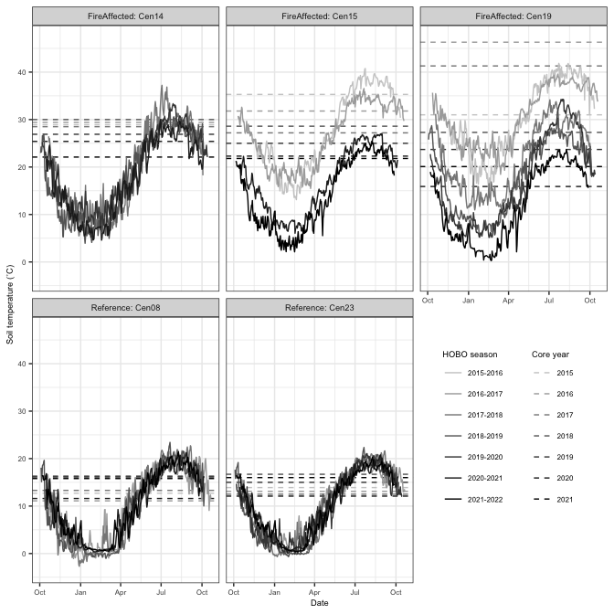

Centralia yearly temperatures from HOBO trackers
================
Sam Barnett
19 December, 2023

-   [Introduction](#introduction)
    -   [Import data](#import-data)
-   [Seasonal analysis](#seasonal-analysis)
    -   [By year for each site](#by-year-for-each-site)
-   [Session Info](#session-info)

# Introduction

Lets take a look at the daily temperatures monitored with the HOBO
trackers left in \~5 sites over the 7 sampling years.

``` r
library(readxl)
library(dplyr)
library(ggplot2)

source("/Users/sambarnett/Documents/Misc_code/paul_tol_colors.R")

# Function for getting plot legends
g_legend<-function(a.gplot){
  tmp <- ggplot_gtable(ggplot_build(a.gplot))
  leg <- which(sapply(tmp$grobs, function(x) x$name) == "guide-box")
  legend <- tmp$grobs[[leg]]
  return(legend)}

# Basic plotting theme so as not to continually repeat it
basic_theme = theme_bw() +
  theme(axis.text = element_text(size=6),
        axis.title = element_text(size=7),
        legend.text = element_text(size=6),
        legend.title = element_text(size=7, hjust=0.5),
        strip.text = element_text(size=7),
        plot.title = element_text(size=8, hjust=0.5))
```

## Import data

``` r
# Site metadata
site.info = read_xlsx("/Users/sambarnett/Documents/Shade_lab/Centralia_project/Centralia_soil_metadata.xlsx", 
                        sheet = "Site_metadata", na="NA")

# All HOBO data
HOBO_data.df = rbind(read_xlsx("/Users/sambarnett/Documents/Shade_lab/Centralia_project/Multi_year_project/Data/HOBOdata/HOBO15_16.xlsx", sheet="Cen14") %>%
                       mutate(Season = "2015_2016"),
                     read_xlsx("/Users/sambarnett/Documents/Shade_lab/Centralia_project/Multi_year_project/Data/HOBOdata/HOBO15_16.xlsx", sheet="Cen15") %>%
                       mutate(Season = "2015_2016"),
                     read_xlsx("/Users/sambarnett/Documents/Shade_lab/Centralia_project/Multi_year_project/Data/HOBOdata/HOBO15_16.xlsx", sheet="Cen19") %>%
                       mutate(Season = "2015_2016"),
                     read_xlsx("/Users/sambarnett/Documents/Shade_lab/Centralia_project/Multi_year_project/Data/HOBOdata/HOBO15_16.xlsx", sheet="Cen22") %>%
                       mutate(Season = "2015_2016"),
                     read_xlsx("/Users/sambarnett/Documents/Shade_lab/Centralia_project/Multi_year_project/Data/HOBOdata/HOBO16_17.xlsx", sheet="Cen08") %>%
                       mutate(Season = "2016_2017"),
                     read_xlsx("/Users/sambarnett/Documents/Shade_lab/Centralia_project/Multi_year_project/Data/HOBOdata/HOBO16_17.xlsx", sheet="Cen14") %>%
                       mutate(Season = "2016_2017"), 
                     read_xlsx("/Users/sambarnett/Documents/Shade_lab/Centralia_project/Multi_year_project/Data/HOBOdata/HOBO16_17.xlsx", sheet="Cen19") %>%
                       mutate(Season = "2016_2017"),
                     read_xlsx("/Users/sambarnett/Documents/Shade_lab/Centralia_project/Multi_year_project/Data/HOBOdata/HOBO16_17.xlsx", sheet="Cen23") %>%
                       mutate(Season = "2016_2017"),
                     read_xlsx("/Users/sambarnett/Documents/Shade_lab/Centralia_project/Multi_year_project/Data/HOBOdata/HOBO17_18.xlsx", sheet="Cen08") %>%
                       mutate(Season = "2017_2018"),
                     read_xlsx("/Users/sambarnett/Documents/Shade_lab/Centralia_project/Multi_year_project/Data/HOBOdata/HOBO17_18.xlsx", sheet="Cen14") %>%
                       mutate(Season = "2017_2018"),
                     read_xlsx("/Users/sambarnett/Documents/Shade_lab/Centralia_project/Multi_year_project/Data/HOBOdata/HOBO17_18.xlsx", sheet="Cen15") %>%
                       mutate(Season = "2016_2017"), # Something was labeled wrong with this one. While in 2017-2018 file, it is actually 2016-2017 
                     read_xlsx("/Users/sambarnett/Documents/Shade_lab/Centralia_project/Multi_year_project/Data/HOBOdata/HOBO17_18.xlsx", sheet="Cen19") %>%
                       mutate(Season = "2017_2018"),
                     read_xlsx("/Users/sambarnett/Documents/Shade_lab/Centralia_project/Multi_year_project/Data/HOBOdata/HOBO17_18.xlsx", sheet="Cen23") %>%
                       mutate(Season = "2017_2018"),
                     read_xlsx("/Users/sambarnett/Documents/Shade_lab/Centralia_project/Multi_year_project/Data/HOBOdata/HOBO18_19.xlsx", sheet="Cen08") %>%
                       mutate(Season = "2018_2019"),
                     read_xlsx("/Users/sambarnett/Documents/Shade_lab/Centralia_project/Multi_year_project/Data/HOBOdata/HOBO18_19.xlsx", sheet="Cen14") %>%
                       mutate(Season = "2018_2019"),
                     read_xlsx("/Users/sambarnett/Documents/Shade_lab/Centralia_project/Multi_year_project/Data/HOBOdata/HOBO18_19.xlsx", sheet="Cen19") %>%
                       mutate(Season = "2018_2019"),
                     read_xlsx("/Users/sambarnett/Documents/Shade_lab/Centralia_project/Multi_year_project/Data/HOBOdata/HOBO18_19.xlsx", sheet="Cen23") %>%
                       mutate(Season = "2018_2019"),
                     read_xlsx("/Users/sambarnett/Documents/Shade_lab/Centralia_project/Multi_year_project/Data/HOBOdata/HOBO19_20.xlsx", sheet="Cen14") %>%
                       mutate(Season = "2019_2020"),
                     read_xlsx("/Users/sambarnett/Documents/Shade_lab/Centralia_project/Multi_year_project/Data/HOBOdata/HOBO19_20.xlsx", sheet="Cen19") %>%
                       mutate(Season = "2019_2020"),
                     read_xlsx("/Users/sambarnett/Documents/Shade_lab/Centralia_project/Multi_year_project/Data/HOBOdata/HOBO19_20.xlsx", sheet="Cen23") %>%
                       mutate(Season = "2019_2020"),
                     read_xlsx("/Users/sambarnett/Documents/Shade_lab/Centralia_project/Multi_year_project/Data/HOBOdata/HOBO20_21.xlsx", sheet="Cen08") %>%
                       mutate(Season = "2020_2021"),
                     read_xlsx("/Users/sambarnett/Documents/Shade_lab/Centralia_project/Multi_year_project/Data/HOBOdata/HOBO20_21.xlsx", sheet="Cen14") %>%
                       mutate(Season = "2020_2021"),
                     read_xlsx("/Users/sambarnett/Documents/Shade_lab/Centralia_project/Multi_year_project/Data/HOBOdata/HOBO20_21.xlsx", sheet="Cen15") %>%
                       mutate(Season = "2020_2021"),
                     read_xlsx("/Users/sambarnett/Documents/Shade_lab/Centralia_project/Multi_year_project/Data/HOBOdata/HOBO20_21.xlsx", sheet="Cen23") %>%
                       mutate(Season = "2020_2021"),
                     read_xlsx("/Users/sambarnett/Documents/Shade_lab/Centralia_project/Multi_year_project/Data/HOBOdata/HOBO21_22.xlsx", sheet="Cen08") %>%
                       mutate(Season = "2021_2022"),
                     read_xlsx("/Users/sambarnett/Documents/Shade_lab/Centralia_project/Multi_year_project/Data/HOBOdata/HOBO21_22.xlsx", sheet="Cen15") %>%
                       mutate(Season = "2021_2022"),
                     read_xlsx("/Users/sambarnett/Documents/Shade_lab/Centralia_project/Multi_year_project/Data/HOBOdata/HOBO21_22.xlsx", sheet="Cen19") %>%
                       mutate(Season = "2021_2022"),
                     read_xlsx("/Users/sambarnett/Documents/Shade_lab/Centralia_project/Multi_year_project/Data/HOBOdata/HOBO21_22.xlsx", sheet="Cen23") %>%
                       mutate(Season = "2021_2022")) %>%
  rename(SiteID = Site) %>%
  left_join(site.info, by = "SiteID")
```

# Seasonal analysis

First summarize data by mean daily temperature (not every hour as
measured)

``` r
HOBO_data.sum = HOBO_data.df %>%
  tidyr::separate(Date_time, into=c("Date", "Time"), sep=" ") %>%
  mutate(Date = as.Date(Date),
         Season = gsub("_", "-", Season)) %>%
  group_by(Date, SiteID, Season, FireClassification) %>%
  summarize(mean_temp = mean(Temperature),
            min_entry = min(Entry)) %>%
  ungroup %>%
  arrange(min_entry) %>%
  group_by(SiteID, Season) %>%
  mutate(days_after_sampling = row_number(),
         total_days = n()) %>%
  ungroup %>%
  arrange(-min_entry) %>%
  group_by(SiteID, Season) %>%
  mutate(days_before_next_sampling = row_number()) %>%
  ungroup %>%
  tidyr::separate(Date, into=c("Year", "Month", "Day"), remove=FALSE, sep="-", convert = TRUE)
```

## By year for each site

First lets look at this over the year with separate curves for each
year.

``` r
# Summarize HOBO data formatted for plotting this
PlotByYear.df = HOBO_data.sum %>%
  tidyr::separate(Season, into=c("start_year", "end_year"), remove=FALSE, sep="-") %>%
  mutate(plot_year = ifelse(Year == start_year, 1900, 1901)) %>%
  mutate(plot_date = as.Date(paste(plot_year, Month, Day, sep="-"))) %>%
  arrange(plot_date) %>%
  mutate(FC_SiteID = paste(FireClassification, ": ", SiteID, sep = "")) %>%
  filter(SiteID != "Cen22") %>%
  filter(!(SiteID == "Cen14" & Season %in% c("2015-2016", "2016-2017")))

# Core temp data matching these sites and dates
sample.meta = read_xlsx("/Users/sambarnett/Documents/Shade_lab/Centralia_project/Centralia_soil_metadata.xlsx", 
                        sheet = "Sample_metadata", na="NA") %>%
  filter(SiteID %in% unique(PlotByYear.df$SiteID),
         Year != 2014) %>%
  select(SiteID, FireClassification, Year, Month, Day, CoreTemp_C) %>%
  unique() %>%
  mutate(FC_SiteID = paste(FireClassification, ": ", SiteID, sep = ""),
         Season = paste(Year-1, Year, sep="-"),
         Year = as.character(Year))

year_season.col = c(colorRampPalette(c("grey80", "black"))(7),
                    colorRampPalette(c("grey80", "black"))(7))
names(year_season.col) = c("2015", "2016", "2017", "2018", "2019", "2020", "2021",
                           "2015-2016", "2016-2017", "2017-2018", 
                           "2018-2019", "2019-2020", "2020-2021", "2021-2022")


# Plot
PlotByYear.plot = ggplot(data=PlotByYear.df, aes(x=plot_date, y=mean_temp)) +
  geom_hline(data = sample.meta, aes(yintercept=CoreTemp_C, color=Year), linetype=2) +
  geom_line(aes(color=Season)) +
  labs(x="Date", y="Soil temperature (˚C)", color="Sampling season") +
  lims(y=c(min(sample.meta$CoreTemp_C, PlotByYear.df$mean_temp)-1, max(sample.meta$CoreTemp_C, PlotByYear.df$mean_temp)+1)) +
  scale_x_date(date_labels = "%b") +
  scale_color_manual(values = year_season.col) +
  theme_bw() +
  theme(axis.text = element_text(size=6),
        axis.title = element_text(size=7),
        strip.text = element_text(size=7),
        legend.text = element_text(size=6),
        legend.title = element_text(size=7),
        legend.position = "none") +
  facet_wrap(~FC_SiteID)

## Legends
hobo.leg = g_legend(ggplot(data=PlotByYear.df, aes(x=plot_date, y=mean_temp)) +
  geom_line(aes(color=Season)) +
  labs(x="Date", y="Mean daily temperature (˚C)", color="HOBO season") +
  scale_color_manual(values = colorRampPalette(c("grey80", "black"))(7)) +
  theme_bw() +
  theme(legend.text = element_text(size=6),
        legend.title = element_text(size=7),
        legend.position = "right"))

core.leg = g_legend(ggplot(data=PlotByYear.df, aes(x=plot_date, y=mean_temp)) +
  geom_hline(data = sample.meta, aes(yintercept=CoreTemp_C, color=Year), linetype=2) +
  labs(x="Date", y="Core temperature (˚C)", color="Core year") +
  scale_color_manual(values = colorRampPalette(c("grey80", "black"))(7)) +
  theme_bw() +
  theme(legend.text = element_text(size=6),
        legend.title = element_text(size=7),
        legend.position = "right"))
  
hobo.plot = cowplot::ggdraw(PlotByYear.plot) +
  cowplot::draw_plot(hobo.leg, x=0.52, y=0.05, 0.5, 0.5) +
  cowplot::draw_plot(core.leg, x=0.65, y=0.05, 0.5, 0.5)

hobo.plot
```

<!-- -->

``` r
ggsave(hobo.plot, file="/Users/sambarnett/Documents/Shade_lab/Centralia_project/Multi_year_project/Analysis/Manuscript_figures/Fig_S11.tiff",
       device="tiff", width=7, height=7, units="in")
```

Lets look at this another way with a continuous curve across all 7
years.

``` r
core_temp_points.df = sample.meta %>%
  mutate(Date = as.Date(paste(Year, Month, Day, sep="-")))

# Plot
Plotfull.plot = ggplot(data=PlotByYear.df, aes(x=Date, y=mean_temp)) +
  geom_point(data = core_temp_points.df, aes(y=CoreTemp_C, color=Year)) +
  geom_line(aes(color=Season)) +
  labs(x="Date", y="Soil temperature (˚C)", color="Sampling season") +
  lims(y=c(min(sample.meta$CoreTemp_C, PlotByYear.df$mean_temp)-1, max(sample.meta$CoreTemp_C, PlotByYear.df$mean_temp)+1)) +
  scale_x_date(date_labels = "%b %Y") +
  scale_color_manual(values = year_season.col) +
  theme_bw() +
  theme(axis.text = element_text(size=6),
        axis.title = element_text(size=7),
        strip.text = element_text(size=7),
        legend.text = element_text(size=6),
        legend.title = element_text(size=7),
        legend.position = "none") +
  facet_wrap(~FC_SiteID)

## Legends
hobo.leg = g_legend(ggplot(data=PlotByYear.df, aes(x=Date, y=mean_temp)) +
  geom_line(aes(color=Season)) +
  labs(x="Date", y="Mean daily temperature (˚C)", color="HOBO season") +
  scale_color_manual(values = colorRampPalette(c("grey80", "black"))(7)) +
  theme_bw() +
  theme(legend.text = element_text(size=6),
        legend.title = element_text(size=7),
        legend.position = "right"))

core.leg = g_legend(ggplot(data=core_temp_points.df, aes(x=Date, y=mean_temp)) +
  geom_point(data = core_temp_points.df, aes(y=CoreTemp_C, color=Year)) +
  labs(x="Date", y="Core temperature (˚C)", color="Core year") +
  scale_color_manual(values = colorRampPalette(c("grey80", "black"))(7)) +
  theme_bw() +
  theme(legend.text = element_text(size=6),
        legend.title = element_text(size=7),
        legend.position = "right"))
  
long_hobo.plot = cowplot::ggdraw(Plotfull.plot) +
  cowplot::draw_plot(hobo.leg, x=0.52, y=0.05, 0.5, 0.5) +
  cowplot::draw_plot(core.leg, x=0.65, y=0.05, 0.5, 0.5)

long_hobo.plot
```

<!-- -->

# Session Info

``` r
sessionInfo()
```

    ## R version 4.2.2 (2022-10-31)
    ## Platform: aarch64-apple-darwin20 (64-bit)
    ## Running under: macOS Ventura 13.0.1
    ## 
    ## Matrix products: default
    ## BLAS:   /Library/Frameworks/R.framework/Versions/4.2-arm64/Resources/lib/libRblas.0.dylib
    ## LAPACK: /Library/Frameworks/R.framework/Versions/4.2-arm64/Resources/lib/libRlapack.dylib
    ## 
    ## locale:
    ## [1] en_US.UTF-8/en_US.UTF-8/en_US.UTF-8/C/en_US.UTF-8/en_US.UTF-8
    ## 
    ## attached base packages:
    ## [1] stats     graphics  grDevices utils     datasets  methods   base     
    ## 
    ## other attached packages:
    ## [1] ggplot2_3.4.4 dplyr_1.0.10  readxl_1.4.1 
    ## 
    ## loaded via a namespace (and not attached):
    ##  [1] highr_0.9         cellranger_1.1.0  pillar_1.8.1      compiler_4.2.2   
    ##  [5] tools_4.2.2       digest_0.6.30     evaluate_0.18     lifecycle_1.0.3  
    ##  [9] tibble_3.1.8      gtable_0.3.1      pkgconfig_2.0.3   rlang_1.1.0      
    ## [13] cli_3.4.1         DBI_1.1.3         rstudioapi_0.14   yaml_2.3.6       
    ## [17] xfun_0.34         fastmap_1.1.0     withr_2.5.0       stringr_1.5.0    
    ## [21] knitr_1.40        systemfonts_1.0.4 generics_0.1.3    vctrs_0.5.2      
    ## [25] cowplot_1.1.1     grid_4.2.2        tidyselect_1.2.0  glue_1.6.2       
    ## [29] R6_2.5.1          textshaping_0.3.6 fansi_1.0.3       rmarkdown_2.18   
    ## [33] farver_2.1.1      tidyr_1.3.0       purrr_1.0.1       magrittr_2.0.3   
    ## [37] scales_1.2.1      htmltools_0.5.3   assertthat_0.2.1  colorspace_2.0-3 
    ## [41] ragg_1.2.4        labeling_0.4.2    utf8_1.2.2        stringi_1.7.8    
    ## [45] munsell_0.5.0
