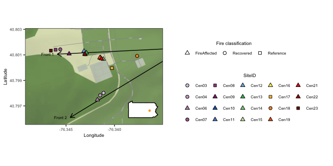

Map of sites sampled in Centralia
================
Sam Barnett
19 December, 2023

-   [Introduction](#introduction)
-   [Get site coordinates and
    metadata](#get-site-coordinates-and-metadata)
-   [Statewide map](#statewide-map)
-   [Centralia map](#centralia-map)
-   [Session Info](#session-info)

# Introduction

Here we will make a map of the Centralia sites for presentations and
publications.

``` r
library(ggplot2)
library(dplyr)
```

    ## 
    ## Attaching package: 'dplyr'

    ## The following objects are masked from 'package:stats':
    ## 
    ##     filter, lag

    ## The following objects are masked from 'package:base':
    ## 
    ##     intersect, setdiff, setequal, union

``` r
library(readxl)
library(ggmap)
```

    ## Warning: package 'ggmap' was built under R version 4.2.3

    ## ℹ Google's Terms of Service: <https://mapsplatform.google.com>
    ##   Stadia Maps' Terms of Service: <https://stadiamaps.com/terms-of-service/>
    ##   OpenStreetMap's Tile Usage Policy: <https://operations.osmfoundation.org/policies/tiles/>
    ## ℹ Please cite ggmap if you use it! Use `citation("ggmap")` for details.

``` r
library(grid)

source("/Users/sambarnett/Documents/Misc_code/paul_tol_colors.R")

g_legend<-function(a.gplot){
  tmp <- ggplot_gtable(ggplot_build(a.gplot))
  leg <- which(sapply(tmp$grobs, function(x) x$name) == "guide-box")
  legend <- tmp$grobs[[leg]]
  return(legend)}


site.list = c("Cen01", "Cen02", "Cen03", "Cen04", "Cen05", "Cen06", "Cen07",
              "Cen08", "Cen09", "Cen10", "Cen11", "Cen12", "Cen13", "Cen14",
              "Cen15", "Cen16", "Cen17", "Cen18", "Cen19", "Cen20", "Cen21",
              "Cen22", "Cen23")

used_sites = c("Cen03", "Cen04", "Cen06", "Cen07", "Cen08", "Cen09", "Cen10", 
               "Cen11", "Cen12", "Cen13", "Cen14", "Cen15", "Cen16", "Cen17", 
               "Cen18", "Cen19", "Cen21", "Cen22", "Cen23")

site.col = paultol_colors(length(used_sites))
names(site.col) = used_sites

site.shape = c(21, 21, 24, 21, 22, 24, 24, 24, 24, 24, 24, 24, 24,
               22, 21, 24, 24, 24, 22)
names(site.shape) = used_sites
FC.shape = c("FireAffected" = 24, "Recovered" = 21, "Reference" = 22)


# Basic plotting theme so as not to continually repeat it
basic_theme = theme_bw() +
  theme(axis.text = element_text(size=6),
        axis.title = element_text(size=7),
        legend.text = element_text(size=6),
        legend.title = element_text(size=7, hjust=0.5),
        strip.text = element_text(size=7),
        plot.title = element_text(size=8, hjust=0.5))
```

# Get site coordinates and metadata

Get the coordinates and metadata for the sites used in this project and
choose a region for the map that includes all sites.

``` r
# Get site coordinates. These are found in a table with longitude (long) and latitude (lat) for each site.
site.coords = read_xlsx("/Users/sambarnett/Documents/Shade_lab/Centralia_project/Centralia_soil_metadata.xlsx", sheet = "Site_metadata")  %>%
  mutate(longitude = -1*as.numeric(measurements::conv_unit(longitude, from = 'deg_dec_min', to = 'dec_deg')),
         latitude = as.numeric(measurements::conv_unit(latitude, from = 'deg_dec_min', to = 'dec_deg')))

## Getting the center point of the cite locations.
center = c(lon=mean(c(max(site.coords$longitude), min(site.coords$longitude))), 
           lat=mean(c(max(site.coords$latitude), min(site.coords$latitude))))

## Get the 4 edges of the region around the above center point.
Nlat = geosphere::destPoint(center, b=0, d=350)[2]
Slat = geosphere::destPoint(center, b=180, d=350)[2]
Elong = geosphere::destPoint(center, b=90, d=500)[1]
Wlong = geosphere::destPoint(center, b=270, d=500)[1]

## Making a polygon (rectangle) of these edges.
region.poly = data.frame(corner = c("NE", "SE", "SW", "NW"), 
                         lat = c(Nlat, Slat, Slat, Nlat), 
                         long = c(Elong, Elong, Wlong, Wlong),
                         group=3)

# Front coordinates
front_coord.df = data.frame(front = c(1, 2),
                            lon_start = -76.332739, lat_start = 40.801547,
                            lon_end = c(-76.345905, -76.344572),
                            lat_end = c(40.801056, 40.796094)) %>%
  mutate(m = (lat_end-lat_start)/(lon_end-lon_start)) %>%
  mutate(b = lat_start-(m*lon_start))
```

# Statewide map

First make an overall map of Pennsylvania USA with the location of
Centralia. This will be used as an inset map.

``` r
## Make state map for inset. The field sites were in PA, USA so we want to easily show where in the state the regional map (above polygon) is located
pa.coords = map_data("state", "pennsylvania")
pa.region.map = ggplot(data = pa.coords, aes(x=long, y = lat, group = group)) + 
  geom_polygon(fill="white", color="black") + 
  #geom_polygon(data=region.poly, fill="red") +
  annotate("point", x=center["lon"], y=center["lat"], color="orange", size=1) +
  theme_bw() +
  basic_theme +
  theme(legend.position = "none",
        panel.grid = element_blank(),
        axis.text=element_blank(),
        axis.title=element_blank(),
        axis.ticks=element_blank(),
        plot.background=element_blank(),
        panel.background = element_blank(),
        panel.border = element_blank()) +
  coord_fixed(1.3)
```

# Centralia map

Now make the main map of centralia with all points. Also insert the
state map.

``` r
## Make map of the specific region using the stamen terrain map.
sbbox <- make_bbox(lon = c(Elong, Wlong), lat = c(Slat, Nlat), f = .1)

region.map = get_stadiamap(bbox = sbbox, zoom = 18, maptype=c("stamen_terrain")) %>%
  ggmap()
```

    ## ℹ © Stadia Maps © Stamen Design © OpenMapTiles © OpenStreetMap contributors.

    ## ℹ 88 tiles needed, this may take a while (try a smaller zoom?)

``` r
site.coords$lon = site.coords$longitude
site.coords$lat = site.coords$latitude

xmax = max(layer_scales(region.map)$x$range$range)
xmax
```

    ## [1] -76.33501

``` r
region.points.map = region.map +
  geom_segment(data=front_coord.df, x=xmax,
               aes(y=(m*xmax + b), xend=lon_end, yend=lat_end),
               arrow = arrow(length = unit(0.05, "npc"))) +
  geom_text(data=front_coord.df, aes(x=lon_end, y=lat_end, label=paste("Front", front, "  ")), hjust=1, size=6*5/14) +
  geom_point(data=filter(site.coords, SiteID %in% used_sites), 
             aes(x=lon, y=lat, fill=SiteID, shape=FireClassification), size=2) +
  scale_shape_manual(values=FC.shape) +
  scale_fill_manual(values=site.col) +
  labs(x="Longitude", y="Latitude", fill="SiteID", shape="Fire classification") +
  theme_bw() +
  basic_theme +
  theme(legend.position = "right",
        legend.direction = "horizontal") +
  guides(fill=guide_legend(override.aes=list(shape=site.shape), title.position="top", title.hjust=0.5),
         shape=guide_legend(title.position="top", title.hjust=0.5))

map.leg = g_legend(region.points.map)


## Adding inset map to the regional map
region.points.inset.map = region.points.map + 
  theme(legend.position = "none") +
  ggmap::inset(ggplotGrob(pa.region.map), 
        xmin = max(layer_scales(region.points.map)$x$range$range)-0.3*(max(layer_scales(region.points.map)$x$range$range)-min(layer_scales(region.points.map)$x$range$range)), 
        xmax = max(layer_scales(region.points.map)$x$range$range), 
        ymin = min(layer_scales(region.points.map)$y$range$range),
        ymax = min(layer_scales(region.points.map)$y$range$range)+0.3*(max(layer_scales(region.points.map)$y$range$range)-min(layer_scales(region.points.map)$y$range$range)))

region.points.inset.leg.map = cowplot::plot_grid(region.points.inset.map, map.leg,
                                                 nrow=1)
region.points.inset.leg.map
```

<!-- -->

Save figure

``` r
saveRDS(region.points.inset.map, file="/Users/sambarnett/Documents/Shade_lab/Centralia_project/Multi_year_project/Analysis/Raw_figures/Map_fig.RDS")
```

# Session Info

``` r
sessionInfo()
```

    ## R version 4.2.2 (2022-10-31)
    ## Platform: aarch64-apple-darwin20 (64-bit)
    ## Running under: macOS Ventura 13.0.1
    ## 
    ## Matrix products: default
    ## BLAS:   /Library/Frameworks/R.framework/Versions/4.2-arm64/Resources/lib/libRblas.0.dylib
    ## LAPACK: /Library/Frameworks/R.framework/Versions/4.2-arm64/Resources/lib/libRlapack.dylib
    ## 
    ## locale:
    ## [1] en_US.UTF-8/en_US.UTF-8/en_US.UTF-8/C/en_US.UTF-8/en_US.UTF-8
    ## 
    ## attached base packages:
    ## [1] grid      stats     graphics  grDevices utils     datasets  methods  
    ## [8] base     
    ## 
    ## other attached packages:
    ## [1] ggmap_4.0.0   readxl_1.4.1  dplyr_1.0.10  ggplot2_3.4.4
    ## 
    ## loaded via a namespace (and not attached):
    ##  [1] tidyselect_1.2.0   xfun_0.34          purrr_1.0.1        lattice_0.20-45   
    ##  [5] colorspace_2.0-3   vctrs_0.5.2        generics_0.1.3     htmltools_0.5.3   
    ##  [9] yaml_2.3.6         utf8_1.2.2         rlang_1.1.0        pillar_1.8.1      
    ## [13] glue_1.6.2         withr_2.5.0        DBI_1.1.3          sp_1.5-1          
    ## [17] jpeg_0.1-10        lifecycle_1.0.3    plyr_1.8.8         stringr_1.5.0     
    ## [21] measurements_1.4.0 munsell_0.5.0      gtable_0.3.1       cellranger_1.1.0  
    ## [25] evaluate_0.18      labeling_0.4.2     knitr_1.40         fastmap_1.1.0     
    ## [29] curl_4.3.3         fansi_1.0.3        highr_0.9          Rcpp_1.0.10       
    ## [33] geosphere_1.5-18   scales_1.2.1       farver_2.1.1       png_0.1-8         
    ## [37] digest_0.6.30      stringi_1.7.8      cowplot_1.1.1      cli_3.4.1         
    ## [41] tools_4.2.2        bitops_1.0-7       magrittr_2.0.3     maps_3.4.1        
    ## [45] tibble_3.1.8       tidyr_1.3.0        pkgconfig_2.0.3    assertthat_0.2.1  
    ## [49] rmarkdown_2.18     httr_1.4.4         rstudioapi_0.14    R6_2.5.1          
    ## [53] compiler_4.2.2
