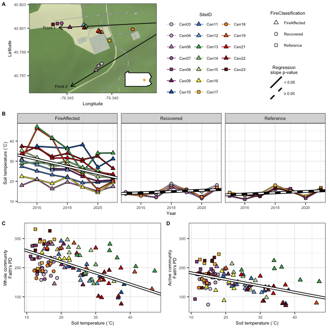
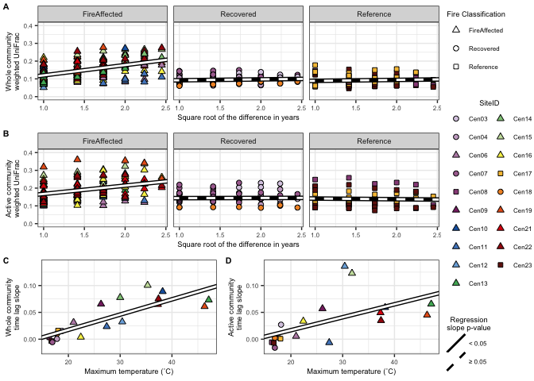
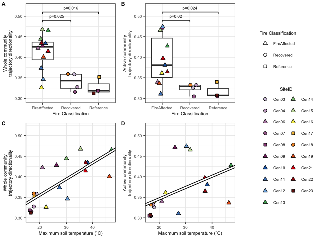
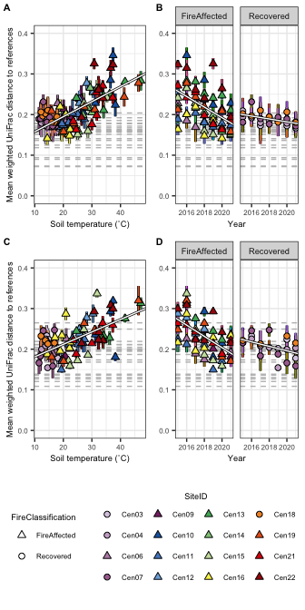
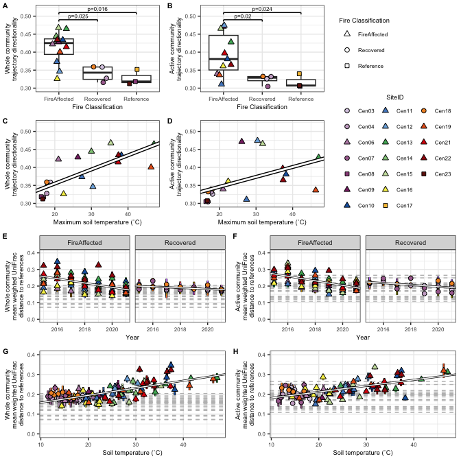
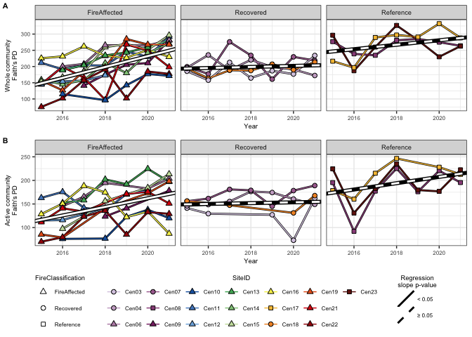
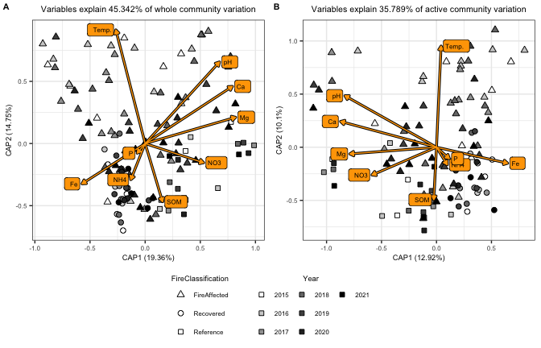

Centralia combined figures
================
Sam Barnett
19 December, 2023

-   [Introduction](#introduction)
    -   [Libraries](#libraries)
-   [Figure 1: Map, Temperature, and alpha
    diversity](#figure-1-map-temperature-and-alpha-diversity)
-   [Figure 2: Time-lag analysis](#figure-2-time-lag-analysis)
-   [Figure 3: Directionality](#figure-3-directionality)
-   [Figure 4: Beta diversity to
    reference](#figure-4-beta-diversity-to-reference)
-   [Figure 3: Alternate](#figure-3-alternate)
-   [Figure S2: Alpha diversity by time
    plot](#figure-s2-alpha-diversity-by-time-plot)
-   [Figure S7: CCA analyses](#figure-s7-cca-analyses)
-   [Session Info](#session-info)

# Introduction

Here we are combining figures made in other R notebooks into full
multipanel figures.

## Libraries

``` r
# Libraries for data
library(dplyr)
```

    ## 
    ## Attaching package: 'dplyr'

    ## The following objects are masked from 'package:stats':
    ## 
    ##     filter, lag

    ## The following objects are masked from 'package:base':
    ## 
    ##     intersect, setdiff, setequal, union

``` r
library(phyloseq)
library(ape)
library(readxl)
library(vegan)
```

    ## Loading required package: permute

    ## Loading required package: lattice

    ## This is vegan 2.6-4

``` r
library(picante)
```

    ## Loading required package: nlme

    ## 
    ## Attaching package: 'nlme'

    ## The following object is masked from 'package:dplyr':
    ## 
    ##     collapse

``` r
library(grid)


# Libraries for plotting
library(ggplot2)
library(ggmap)
```

    ## Warning: package 'ggmap' was built under R version 4.2.3

    ## ℹ Google's Terms of Service: <https://mapsplatform.google.com>
    ##   Stadia Maps' Terms of Service: <https://stadiamaps.com/terms-of-service/>
    ##   OpenStreetMap's Tile Usage Policy: <https://operations.osmfoundation.org/policies/tiles/>
    ## ℹ Please cite ggmap if you use it! Use `citation("ggmap")` for details.

``` r
source("/Users/sambarnett/Documents/Misc_code/paul_tol_colors.R") # Colorblind friendly colors.

# Functon for extracting legends
g_legend<-function(a.gplot){
  tmp <- ggplot_gtable(ggplot_build(a.gplot))
  leg <- which(sapply(tmp$grobs, function(x) x$name) == "guide-box")
  legend <- tmp$grobs[[leg]]
  return(legend)} 


# Notable lists
site.list = c("Cen01", "Cen02", "Cen03", "Cen04", "Cen05", "Cen06", "Cen07",
              "Cen08", "Cen09", "Cen10", "Cen11", "Cen12", "Cen13", "Cen14",
              "Cen15", "Cen16", "Cen17", "Cen18", "Cen19", "Cen20", "Cen21",
              "Cen22", "Cen23")
used_sites = c("Cen03", "Cen04", "Cen06", "Cen07", "Cen08", "Cen09", "Cen10", 
               "Cen11", "Cen12", "Cen13", "Cen14", "Cen15", "Cen16", "Cen17", 
               "Cen18", "Cen19", "Cen21", "Cen22", "Cen23")

# Setting repeated plot aesthetics
site.col = paultol_colors(length(used_sites))
names(site.col) = used_sites

site.shape = c(21, 21, 24, 21, 22, 24, 24, 24, 24, 24, 24, 24, 24,
               22, 21, 24, 24, 24, 22)
names(site.shape) = used_sites
FC.shape = c("FireAffected" = 24, "Recovered" = 21, "Reference" = 22)

# Basic plotting theme so as not to continually repeat it
basic_theme = theme_bw() +
  theme(axis.text = element_text(size=6),
        axis.title = element_text(size=7),
        legend.text = element_text(size=6),
        legend.title = element_text(size=7, hjust=0.5),
        strip.text = element_text(size=7),
        plot.title = element_text(size=8, hjust=0.5))
```

Get metadata

``` r
DNA_RNA.metadata = sample_data(readRDS(file="/Users/sambarnett/Documents/Shade_lab/Centralia_project/Multi_year_project/Data/RNA_DNA_physeq.RDS")) %>%
  data.frame()
```

# Figure 1: Map, Temperature, and alpha diversity

``` r
Fig_map.plot = readRDS(file="/Users/sambarnett/Documents/Shade_lab/Centralia_project/Multi_year_project/Analysis/Raw_figures/Map_fig.RDS")
xmax = -76.33501

Fig_1B.plot = readRDS(file="/Users/sambarnett/Documents/Shade_lab/Centralia_project/Multi_year_project/Analysis/Raw_figures/Fig_1B.RDS")
Fig_1C.plot = readRDS(file="/Users/sambarnett/Documents/Shade_lab/Centralia_project/Multi_year_project/Analysis/Raw_figures/Fig_1C.RDS") +
  labs(y="Whole community\nFaith's PD")
Fig_1D.plot = readRDS(file="/Users/sambarnett/Documents/Shade_lab/Centralia_project/Multi_year_project/Analysis/Raw_figures/Fig_1D.RDS") +
  labs(y="Active community\nFaith's PD")

Fig_1leg.plot = cowplot::plot_grid(g_legend(Fig_1B.plot + guides(fill=guide_legend(override.aes=list(shape=site.shape), ncol=3),
                                                                 shape="none", linetype="none")),
                                   g_legend(Fig_1B.plot + theme(legend.position = "right") + guides(fill="none", color="none")),
                                   nrow=1)

Fig_1.plot = cowplot::plot_grid(cowplot::plot_grid(Fig_map.plot, Fig_1leg.plot, 
                                                   nrow=1, rel_widths = c(1,1)),
                                Fig_1B.plot + theme(legend.position = "none"), 
                                cowplot::plot_grid(Fig_1C.plot + lims(y=c(60, 340)) + 
                                                     theme(plot.title = element_text(size=7, hjust=0.5)), 
                                                   Fig_1D.plot + lims(y=c(60, 340)) + 
                                                     theme(plot.title = element_text(size=7, hjust=0.5)), 
                                                   nrow=1, labels=c("C", "D"), label_size = 8),
                                rel_heights = c(1,1,1), ncol=1, labels = c("A", "B", ""), label_size = 8)
Fig_1.plot
```

<!-- -->

``` r
ggsave(Fig_1.plot, file="/Users/sambarnett/Documents/Shade_lab/Centralia_project/Multi_year_project/Analysis/Manuscript_figures/Fig_1.tiff",
       device="tiff", width=7, height=7, units="in", bg="white")
```

# Figure 2: Time-lag analysis

``` r
Fig_2A.plot = readRDS(file="/Users/sambarnett/Documents/Shade_lab/Centralia_project/Multi_year_project/Analysis/Raw_figures/Fig_2A.RDS")
Fig_2B.plot = readRDS(file="/Users/sambarnett/Documents/Shade_lab/Centralia_project/Multi_year_project/Analysis/Raw_figures/Fig_2B.RDS")
Fig_2C.plot = readRDS(file="/Users/sambarnett/Documents/Shade_lab/Centralia_project/Multi_year_project/Analysis/Raw_figures/Fig_2C.RDS")
Fig_2D.plot = readRDS(file="/Users/sambarnett/Documents/Shade_lab/Centralia_project/Multi_year_project/Analysis/Raw_figures/Fig_2D.RDS")
                   
Fig_2.plot = cowplot::plot_grid(cowplot::plot_grid(Fig_2A.plot + lims(y=c(0, 0.4)) + labs(y="Whole community\nweighted UniFrac") + theme(legend.position = "none"), 
                                                   Fig_2B.plot + lims(y=c(0, 0.4)) + labs(y="Active community\nweighted UniFrac") + theme(legend.position = "none"), 
                                                   cowplot::plot_grid(Fig_2C.plot + lims(y=c(-0.02, 0.14)) + labs(y="Whole community\ntime lag slope"),
                                                                      Fig_2D.plot + lims(y=c(-0.02, 0.14)) + labs(y="Active community\ntime lag slope"),
                                                                      nrow=1, labels=c("C", "D"), label_size = 8),
                                                   ncol=1, labels=c("A", "B", "", ""), label_size = 8),
                                g_legend(Fig_2A.plot), rel_widths = c(1,0.2))
Fig_2.plot
```

<!-- -->

``` r
ggsave(Fig_2.plot, file="/Users/sambarnett/Documents/Shade_lab/Centralia_project/Multi_year_project/Analysis/Manuscript_figures/Fig_2.tiff",
       device="tiff", width=7, height=5, units="in", bg="white")
```

# Figure 3: Directionality

``` r
Fig_3AC.plot = readRDS(file="/Users/sambarnett/Documents/Shade_lab/Centralia_project/Multi_year_project/Analysis/Raw_figures/Fig_3AC.RDS")
Fig_3BD.plot = readRDS(file="/Users/sambarnett/Documents/Shade_lab/Centralia_project/Multi_year_project/Analysis/Raw_figures/Fig_3BD.RDS")

Fig_3.plot = cowplot::plot_grid(Fig_3AC.plot, Fig_3BD.plot, g_legend(Fig_2A.plot + guides(linetype = "none")),
                                nrow = 1,
                                rel_widths = c(1,1,0.8))
Fig_3.plot
```

<!-- -->

``` r
ggsave(Fig_3.plot, file="/Users/sambarnett/Documents/Shade_lab/Centralia_project/Multi_year_project/Analysis/Manuscript_figures/Fig_3.tiff",
       device="tiff", width=7, height=5, units="in", bg="white")
```

# Figure 4: Beta diversity to reference

``` r
Fig_4AB.plot = readRDS(file="/Users/sambarnett/Documents/Shade_lab/Centralia_project/Multi_year_project/Analysis/Raw_figures/Fig_4AB.RDS") +
  labs(y="Whole community weighted UniFrac\ndistance to reference")
Fig_4CD.plot = readRDS(file="/Users/sambarnett/Documents/Shade_lab/Centralia_project/Multi_year_project/Analysis/Raw_figures/Fig_4CD.RDS") +
  labs(y="Active community weighted UniFrac\ndistance to reference")

temp.model.df = data.frame()
for (FC in c("FireAffected", "Recovered")){
  sub_temp.model = lme(CoreTemp_C ~ Year, random = ~1|SiteID, data=filter(DNA_RNA.metadata, FireClassification == FC, SiteID %in% used_sites))
  temp.model.df = rbind(temp.model.df,
                        data.frame(summary(sub_temp.model)$tTable) %>%
                          tibble::rownames_to_column(var="factor") %>%
                          mutate(FireClassification = FC))
}

temp.model.reg = temp.model.df %>%
  mutate(p_slope = ifelse(factor == "Year", p.value, 1),
         factor = ifelse(factor == "(Intercept)", "Intercept", factor)) %>%
  group_by(FireClassification) %>%
  mutate(p_slope = min(p.value)) %>%
  ungroup %>%
  select(factor, Value, p_slope, FireClassification) %>%
  tidyr::spread(key=factor, value = Value) %>%
  mutate(sig = ifelse(p_slope < 0.00001, "< 0.05", "≥ 0.05"))

Disturbed.site.shape = site.shape[names(site.shape) %in% filter(DNA_RNA.metadata, FireClassification != "Reference")$SiteID]


Fig4Leg.plot.plot = ggplot(data=filter(DNA_RNA.metadata, FireClassification != "Reference"), aes(x=Year, y=CoreTemp_C)) +
  geom_point(size=2, aes(fill=SiteID, shape=FireClassification)) +
  scale_linetype_manual(values=c("< 0.05" = 1, "≥ 0.05" = 2)) +
  scale_shape_manual(values=FC.shape) +
  scale_fill_manual(values=site.col) +
  labs(x="Year", y="Mean weighted UniFrac distance to references", linetype="Regression\nslope p-value") +
  basic_theme +
  theme(legend.position="bottom", legend.direction = "vertical") +
  facet_wrap(~FireClassification) +
  guides(fill=guide_legend(ncol=4, override.aes=list(shape=Disturbed.site.shape)))

Fig_4.leg = cowplot::plot_grid(g_legend(Fig4Leg.plot.plot + guides(fill="none")),
                               g_legend(Fig4Leg.plot.plot + guides(shape="none")),
                               ncol=2, rel_widths = c(0.4,1))


Fig_4.plot = cowplot::plot_grid(Fig_4AB.plot + theme(legend.position = "none"), 
                                Fig_4CD.plot + theme(legend.position = "none"),
                                ncol=1, Fig_4.leg, 
                                rel_heights = c(1, 1, 0.6))

Fig_4.plot
```

<!-- -->

``` r
ggsave(Fig_4.plot, file="/Users/sambarnett/Documents/Shade_lab/Centralia_project/Multi_year_project/Analysis/Manuscript_figures/Fig_4.tiff",
       device="tiff", width=3.5, height=7, units="in", bg="white")
```

# Figure 3: Alternate

``` r
Fig_3EG.plot = readRDS(file="/Users/sambarnett/Documents/Shade_lab/Centralia_project/Multi_year_project/Analysis/Raw_figures/Fig_3EG.RDS")
Fig_3FH.plot = readRDS(file="/Users/sambarnett/Documents/Shade_lab/Centralia_project/Multi_year_project/Analysis/Raw_figures/Fig_3FH.RDS")

Fig_3alt.plot = cowplot::plot_grid(cowplot::plot_grid(Fig_3AC.plot, Fig_3BD.plot, 
                                                      g_legend(Fig_2A.plot + guides(linetype = "none", fill=guide_legend(ncol=3, override.aes=list(shape=site.shape)))),
                                                      nrow = 1,
                                                      rel_widths = c(1,1,0.8)), 
                                   cowplot::plot_grid(Fig_3EG.plot, Fig_3FH.plot, nrow=1), 
                                   ncol=1)

Fig_3alt.plot
```

<!-- -->

``` r
ggsave(Fig_3alt.plot, file="/Users/sambarnett/Documents/Shade_lab/Centralia_project/Multi_year_project/Analysis/Manuscript_figures/Fig_3alt.tiff",
       device="tiff", width=7, height=7, units="in", bg="white")
```

# Figure S2: Alpha diversity by time plot

``` r
Fig_S2A.plot = readRDS(file="/Users/sambarnett/Documents/Shade_lab/Centralia_project/Multi_year_project/Analysis/Raw_figures/Fig_S2A.RDS")
Fig_S2B.plot = readRDS(file="/Users/sambarnett/Documents/Shade_lab/Centralia_project/Multi_year_project/Analysis/Raw_figures/Fig_S2B.RDS")

Fig_S2.leg = g_legend(Fig_S2A.plot)

Fig_S2.plot = cowplot::plot_grid(Fig_S2A.plot + labs(y="Whole community\nFaith's PD") + theme(legend.position = "none"), 
                                 Fig_S2B.plot + labs(y="Active community\nFaith's PD") + theme(legend.position = "none"), 
                                 Fig_S2.leg, rel_heights = c(1,1,0.5),
                                 ncol=1, labels = c("A", "B", ""), label_size = 8)
Fig_S2.plot
```

<!-- -->

``` r
ggsave(Fig_S2.plot, file="/Users/sambarnett/Documents/Shade_lab/Centralia_project/Multi_year_project/Analysis/Manuscript_figures/Fig_S2.tiff",
       device="tiff", width=7, height=5, units="in")
```

# Figure S7: CCA analyses

``` r
Fig_S7A.plot = readRDS(file="/Users/sambarnett/Documents/Shade_lab/Centralia_project/Multi_year_project/Analysis/Raw_figures/Fig_S7A.RDS")
Fig_S7B.plot = readRDS(file="/Users/sambarnett/Documents/Shade_lab/Centralia_project/Multi_year_project/Analysis/Raw_figures/Fig_S7B.RDS")
Fig_S7.plot = cowplot::plot_grid(cowplot::plot_grid(Fig_S7A.plot + theme(legend.position = "none"), 
                                                    Fig_S7B.plot + theme(legend.position = "none"),
                                                    nrow=1, labels=c("A", "B"), label_size = 8),
                                 g_legend(Fig_S7A.plot + theme(legend.position = "bottom") + 
                                            guides(fill = guide_legend(order = 2, override.aes=list(shape=22), nrow=3))), 
                                rel_heights = c(1,0.3), ncol=1)
Fig_S7.plot
```

<!-- -->

``` r
ggsave(Fig_S7.plot, file="/Users/sambarnett/Documents/Shade_lab/Centralia_project/Multi_year_project/Analysis/Manuscript_figures/Fig_S7.tiff",
       device="tiff", width=7, height=4.5, units="in")
```

# Session Info

``` r
sessionInfo()
```

    ## R version 4.2.2 (2022-10-31)
    ## Platform: aarch64-apple-darwin20 (64-bit)
    ## Running under: macOS Ventura 13.0.1
    ## 
    ## Matrix products: default
    ## BLAS:   /Library/Frameworks/R.framework/Versions/4.2-arm64/Resources/lib/libRblas.0.dylib
    ## LAPACK: /Library/Frameworks/R.framework/Versions/4.2-arm64/Resources/lib/libRlapack.dylib
    ## 
    ## locale:
    ## [1] en_US.UTF-8/en_US.UTF-8/en_US.UTF-8/C/en_US.UTF-8/en_US.UTF-8
    ## 
    ## attached base packages:
    ## [1] grid      stats     graphics  grDevices utils     datasets  methods  
    ## [8] base     
    ## 
    ## other attached packages:
    ##  [1] ggmap_4.0.0     ggplot2_3.4.4   picante_1.8.2   nlme_3.1-160   
    ##  [5] vegan_2.6-4     lattice_0.20-45 permute_0.9-7   readxl_1.4.1   
    ##  [9] ape_5.6-2       phyloseq_1.42.0 dplyr_1.0.10   
    ## 
    ## loaded via a namespace (and not attached):
    ##  [1] Biobase_2.58.0         httr_1.4.4             tidyr_1.3.0           
    ##  [4] jsonlite_1.8.3         splines_4.2.2          foreach_1.5.2         
    ##  [7] assertthat_0.2.1       highr_0.9              stats4_4.2.2          
    ## [10] GenomeInfoDbData_1.2.9 cellranger_1.1.0       yaml_2.3.6            
    ## [13] pillar_1.8.1           glue_1.6.2             digest_0.6.30         
    ## [16] XVector_0.38.0         colorspace_2.0-3       cowplot_1.1.1         
    ## [19] htmltools_0.5.3        Matrix_1.5-3           plyr_1.8.8            
    ## [22] pkgconfig_2.0.3        zlibbioc_1.44.0        purrr_1.0.1           
    ## [25] scales_1.2.1           jpeg_0.1-10            tibble_3.1.8          
    ## [28] mgcv_1.8-41            farver_2.1.1           generics_0.1.3        
    ## [31] IRanges_2.32.0         withr_2.5.0            BiocGenerics_0.44.0   
    ## [34] cli_3.4.1              survival_3.4-0         magrittr_2.0.3        
    ## [37] crayon_1.5.2           evaluate_0.18          fansi_1.0.3           
    ## [40] MASS_7.3-58.1          textshaping_0.3.6      tools_4.2.2           
    ## [43] data.table_1.14.4      lifecycle_1.0.3        stringr_1.5.0         
    ## [46] Rhdf5lib_1.20.0        S4Vectors_0.36.0       munsell_0.5.0         
    ## [49] cluster_2.1.4          Biostrings_2.66.0      ade4_1.7-20           
    ## [52] compiler_4.2.2         GenomeInfoDb_1.34.3    systemfonts_1.0.4     
    ## [55] rlang_1.1.0            rhdf5_2.42.0           RCurl_1.98-1.9        
    ## [58] iterators_1.0.14       rhdf5filters_1.10.0    biomformat_1.26.0     
    ## [61] rstudioapi_0.14        igraph_1.4.1           labeling_0.4.2        
    ## [64] bitops_1.0-7           rmarkdown_2.18         gtable_0.3.1          
    ## [67] codetools_0.2-18       multtest_2.54.0        DBI_1.1.3             
    ## [70] reshape2_1.4.4         R6_2.5.1               knitr_1.40            
    ## [73] fastmap_1.1.0          utf8_1.2.2             ragg_1.2.4            
    ## [76] stringi_1.7.8          parallel_4.2.2         Rcpp_1.0.10           
    ## [79] vctrs_0.5.2            png_0.1-8              tidyselect_1.2.0      
    ## [82] xfun_0.34
