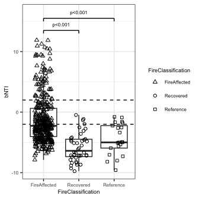
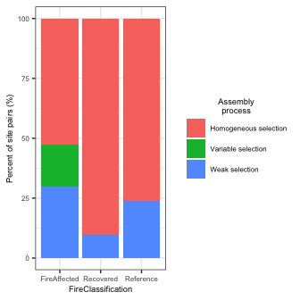
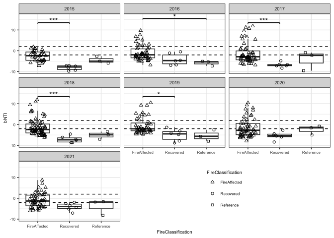
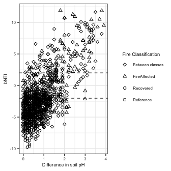
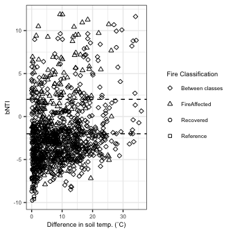
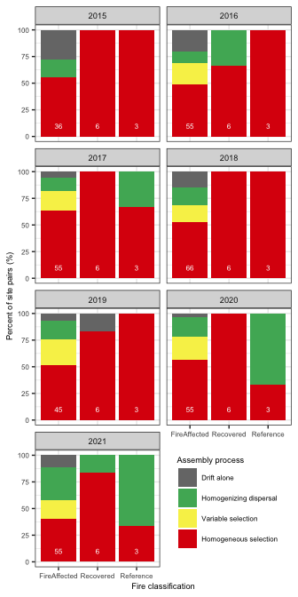
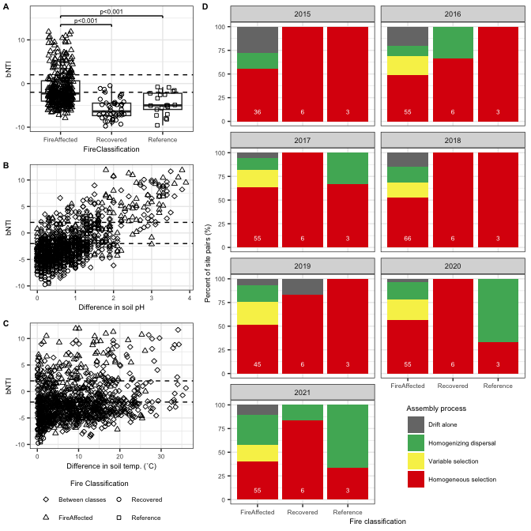

Community assembly
================
Sam Barnett
19 December, 2023

-   [Introduction](#introduction)
    -   [Libraries](#libraries)
    -   [Data import](#data-import)
-   [Compare bNTI to soil within fire
    classes](#compare-bnti-to-soil-within-fire-classes)
-   [Compare bNTI to soil temperature and
    pH](#compare-bnti-to-soil-temperature-and-ph)
-   [bNTI and RCbray](#bnti-and-rcbray)
-   [Final plot for publication](#final-plot-for-publication)
-   [Session Info](#session-info)

# Introduction

Here we look at the results from analyzing community assembly across
Centralia soils. Specifically we will be using the bNTI metric in
conjuction with RCbray to determine dominant assembly processes across
sites within each year. For both bNTI and RCbray, calculations were
first made on the MSU HPCC using R scripts with paralell processing.
Here we are simply importing those values and running the statistical
analyses.

## Libraries

``` r
# Libraries for data
library(dplyr)
```

    ## 
    ## Attaching package: 'dplyr'

    ## The following objects are masked from 'package:stats':
    ## 
    ##     filter, lag

    ## The following objects are masked from 'package:base':
    ## 
    ##     intersect, setdiff, setequal, union

``` r
library(phyloseq)
library(readxl)


# Libraries for plotting
library(ggplot2)
source("/Users/sambarnett/Documents/Misc_code/paul_tol_colors.R")

# Functon for extracting legends
g_legend<-function(a.gplot){
  tmp <- ggplot_gtable(ggplot_build(a.gplot))
  leg <- which(sapply(tmp$grobs, function(x) x$name) == "guide-box")
  legend <- tmp$grobs[[leg]]
  return(legend)} 


# Notable lists
site.list = c("Cen01", "Cen02", "Cen03", "Cen04", "Cen05", "Cen06", "Cen07",
              "Cen08", "Cen09", "Cen10", "Cen11", "Cen12", "Cen13", "Cen14",
              "Cen15", "Cen16", "Cen17", "Cen18", "Cen19", "Cen20", "Cen21",
              "Cen22", "Cen23")
used_sites = c("Cen03", "Cen04", "Cen06", "Cen07", "Cen08", "Cen09", "Cen10", 
               "Cen11", "Cen12", "Cen13", "Cen14", "Cen15", "Cen16", "Cen17", 
               "Cen18", "Cen19", "Cen21", "Cen22", "Cen23")

# Setting repeated plot aesthetics
site.col = paultol_colors(length(used_sites))
names(site.col) = used_sites

site.shape = c(21, 21, 24, 21, 22, 24, 24, 24, 24, 24, 24, 24, 24,
               22, 21, 24, 24, 24, 22)
names(site.shape) = used_sites
FC.shape = c("FireAffected" = 24, "Recovered" = 21, "Reference" = 22)

# Basic plotting theme so as not to continually repeat it
basic_theme = theme_bw() +
  theme(axis.text = element_text(size=6),
        axis.title = element_text(size=7),
        legend.text = element_text(size=6),
        legend.title = element_text(size=7, hjust=0.5),
        strip.text = element_text(size=7),
        plot.title = element_text(size=8, hjust=0.5))
```

## Data import

``` r
# Import filtered phyloseq
DNA_RNA.physeq = readRDS(file="/Users/sambarnett/Documents/Shade_lab/Centralia_project/Multi_year_project/Data/RNA_DNA_physeq.RDS")
DNA_RNA.physeq
```

    ## phyloseq-class experiment-level object
    ## otu_table()   OTU Table:         [ 67553 taxa and 309 samples ]
    ## sample_data() Sample Data:       [ 309 samples by 48 sample variables ]
    ## tax_table()   Taxonomy Table:    [ 67553 taxa by 7 taxonomic ranks ]
    ## phy_tree()    Phylogenetic Tree: [ 67553 tips and 67549 internal nodes ]

``` r
# Remove RNA samples
DNA.physeq = subset_samples(DNA_RNA.physeq, NucAcid_type == "DNA")
DNA.physeq = prune_taxa(taxa_sums(DNA.physeq) > 0, DNA.physeq)
DNA.physeq
```

    ## phyloseq-class experiment-level object
    ## otu_table()   OTU Table:         [ 61387 taxa and 181 samples ]
    ## sample_data() Sample Data:       [ 181 samples by 48 sample variables ]
    ## tax_table()   Taxonomy Table:    [ 61387 taxa by 7 taxonomic ranks ]
    ## phy_tree()    Phylogenetic Tree: [ 61387 tips and 61383 internal nodes ]

``` r
# Remove 2014 samples
DNA.physeq = subset_samples(DNA.physeq, Year != 2014)
DNA.physeq = prune_taxa(taxa_sums(DNA.physeq) > 0, DNA.physeq)
DNA.physeq
```

    ## phyloseq-class experiment-level object
    ## otu_table()   OTU Table:         [ 51037 taxa and 127 samples ]
    ## sample_data() Sample Data:       [ 127 samples by 48 sample variables ]
    ## tax_table()   Taxonomy Table:    [ 51037 taxa by 7 taxonomic ranks ]
    ## phy_tree()    Phylogenetic Tree: [ 51037 tips and 51033 internal nodes ]

``` r
# Remove sites not found in 3 or more years
DNA.years = data.frame(sample_data(DNA.physeq)) %>%
  group_by(SiteID) %>%
  summarize(n_year = n()) %>%
  ungroup %>%
  arrange(n_year)
DNA.physeq = subset_samples(DNA.physeq, SiteID %in% filter(DNA.years, n_year >= 3)$SiteID)
DNA.physeq = prune_taxa(taxa_sums(DNA.physeq) > 0, DNA.physeq)
DNA.physeq
```

    ## phyloseq-class experiment-level object
    ## otu_table()   OTU Table:         [ 50802 taxa and 124 samples ]
    ## sample_data() Sample Data:       [ 124 samples by 48 sample variables ]
    ## tax_table()   Taxonomy Table:    [ 50802 taxa by 7 taxonomic ranks ]
    ## phy_tree()    Phylogenetic Tree: [ 50802 tips and 50799 internal nodes ]

``` r
# Clean workspace
DNA_RNA.physeq = NULL
```

``` r
# Metadata for both samples
SamID_1.meta = data.frame(sample_data(DNA.physeq)) %>%
  dplyr::select(SampleID, SiteID, Year, FireClassification, CoreTemp_C, pH) %>%
  dplyr::rename(Sample_1 = SampleID, SiteID_1 = SiteID, Year_1 = Year, 
                FireClassification_1 = FireClassification, 
                CoreTemp_C_1 = CoreTemp_C, pH_1 = pH)

SamID_2.meta = data.frame(sample_data(DNA.physeq)) %>%
  dplyr::select(SampleID, SiteID, Year, FireClassification, CoreTemp_C, pH) %>%
  dplyr::rename(Sample_2 = SampleID, SiteID_2 = SiteID, Year_2 = Year, 
                FireClassification_2 = FireClassification, 
                CoreTemp_C_2 = CoreTemp_C, pH_2 = pH)

bNTI.df = read.table("/Users/sambarnett/Documents/Shade_lab/Centralia_project/Multi_year_project/Data/bNTI_R10K.txt",
                     header=TRUE) %>%
  inner_join(SamID_1.meta, by = "Sample_1") %>%
  inner_join(SamID_2.meta, by = "Sample_2")

bNTI.df
```

    ##               Sample_1          Sample_2          bNTI SiteID_1 Year_1
    ## 1    Cen08_12102016_R1 Cen09_07102019_R1 -3.161378e-02    Cen08   2016
    ## 2    Cen16_12102015_R1 Cen09_07102019_R1 -6.650811e-01    Cen16   2015
    ## 3    Cen06_20102017_R1 Cen09_07102019_R1 -5.691026e+00    Cen06   2017
    ## 4    Cen03_20102017_R1 Cen09_07102019_R1 -5.726925e+00    Cen03   2017
    ## 5    Cen23_21102017_R1 Cen09_07102019_R1 -4.426695e+00    Cen23   2017
    ## 6    Cen07_12102016_R1 Cen09_07102019_R1 -2.787408e+00    Cen07   2016
    ## 7    Cen07_13102015_R1 Cen09_07102019_R1 -6.652240e+00    Cen07   2015
    ## 8    Cen18_07102019_R1 Cen09_07102019_R1 -5.518078e+00    Cen18   2019
    ## 9    Cen23_15102020_R1 Cen09_07102019_R1 -2.935131e+00    Cen23   2020
    ## 10   Cen16_02102018_R1 Cen09_07102019_R1 -2.493318e+00    Cen16   2018
    ## 11   Cen14_19102017_R1 Cen09_07102019_R1  6.982552e-01    Cen14   2017
    ## 12   Cen03_14102015_R1 Cen09_07102019_R1 -5.128503e+00    Cen03   2015
    ## 13   Cen04_20102017_R1 Cen09_07102019_R1 -4.538459e+00    Cen04   2017
    ## 14   Cen21_12102015_R1 Cen09_07102019_R1 -2.211208e+00    Cen21   2015
    ## 15   Cen15_02102018_R1 Cen09_07102019_R1 -3.560344e+00    Cen15   2018
    ## 16   Cen15_13102020_R1 Cen09_07102019_R1 -4.299568e+00    Cen15   2020
    ## 17   Cen04_06102021_R1 Cen09_07102019_R1 -4.236088e+00    Cen04   2021
    ## 18   Cen19_19102017_R1 Cen09_07102019_R1 -5.518575e+00    Cen19   2017
    ## 19   Cen08_13102015_R1 Cen09_07102019_R1 -5.400652e-01    Cen08   2015
    ## 20   Cen08_21102017_R1 Cen09_07102019_R1 -4.359181e+00    Cen08   2017
    ## 21   Cen21_02102018_R1 Cen09_07102019_R1 -3.411198e+00    Cen21   2018
    ## 22   Cen15_11102016_R1 Cen09_07102019_R1 -3.842149e+00    Cen15   2016
    ## 23   Cen17_05102021_R1 Cen09_07102019_R1  4.684428e+00    Cen17   2021
    ## 24   Cen19_12102015_R1 Cen09_07102019_R1 -5.297074e+00    Cen19   2015
    ## 25   Cen04_14102020_R1 Cen09_07102019_R1 -3.520230e+00    Cen04   2020
    ## 26   Cen04_12102016_R1 Cen09_07102019_R1 -3.858426e+00    Cen04   2016
    ## 27   Cen10_06102019_R1 Cen09_07102019_R1 -4.566729e+00    Cen10   2019
    ## 28   Cen16_11102016_R1 Cen09_07102019_R1 -2.833247e+00    Cen16   2016
    ## 29   Cen08_06102021_R1 Cen09_07102019_R1 -2.684780e+00    Cen08   2021
    ## 30   Cen21_11102016_R1 Cen09_07102019_R1 -2.069274e+00    Cen21   2016
    ## 31   Cen19_11102016_R1 Cen09_07102019_R1 -2.890836e+00    Cen19   2016
    ## 32   Cen06_14102015_R1 Cen09_07102019_R1 -4.240594e+00    Cen06   2015
    ## 33   Cen18_12102016_R1 Cen09_07102019_R1 -3.012956e+00    Cen18   2016
    ## 34   Cen21_05102021_R1 Cen09_07102019_R1 -1.118222e+00    Cen21   2021
    ## 35   Cen16_15102020_R1 Cen09_07102019_R1 -1.878322e+00    Cen16   2020
    ## 36   Cen09_21102017_R1 Cen09_07102019_R1 -6.973380e+00    Cen09   2017
    ## 37   Cen18_04102018_R1 Cen09_07102019_R1 -4.025751e+00    Cen18   2018
    ## 38   Cen03_12102016_R1 Cen09_07102019_R1 -4.561932e+00    Cen03   2016
    ## 39   Cen03_03102018_R1 Cen09_07102019_R1 -4.716596e+00    Cen03   2018
    ## 40   Cen09_04102018_R1 Cen09_07102019_R1 -6.678832e+00    Cen09   2018
    ## 41   Cen06_14102020_R1 Cen09_07102019_R1 -5.161718e+00    Cen06   2020
    ## 42   Cen11_06102019_R1 Cen09_07102019_R1 -4.301698e+00    Cen11   2019
    ## 43   Cen21_13102020_R1 Cen09_07102019_R1 -2.710799e+00    Cen21   2020
    ## 44   Cen11_11102016_R1 Cen09_07102019_R1 -6.023358e+00    Cen11   2016
    ## 45   Cen11_06102021_R1 Cen09_07102019_R1 -3.462856e+00    Cen11   2021
    ## 46   Cen07_07102019_R1 Cen09_07102019_R1 -3.591070e+00    Cen07   2019
    ## 47   Cen06_12102016_R1 Cen09_07102019_R1 -6.056584e+00    Cen06   2016
    ## 48   Cen03_06102021_R1 Cen09_07102019_R1 -4.112755e+00    Cen03   2021
    ## 49   Cen12_12102015_R1 Cen09_07102019_R1 -4.179580e+00    Cen12   2015
    ## 50   Cen13_06102021_R1 Cen09_07102019_R1  6.558004e+00    Cen13   2021
    ## 51   Cen15_06102019_R1 Cen09_07102019_R1 -1.371230e+00    Cen15   2019
    ## 52   Cen23_07102019_R1 Cen09_07102019_R1 -2.974102e+00    Cen23   2019
    ## 53   Cen11_20102017_R1 Cen09_07102019_R1 -4.956886e+00    Cen11   2017
    ## 54   Cen03_14102020_R1 Cen09_07102019_R1 -2.458134e+00    Cen03   2020
    ## 55   Cen10_03102018_R1 Cen09_07102019_R1 -6.323357e+00    Cen10   2018
    ## 56   Cen11_13102020_R1 Cen09_07102019_R1 -4.451865e+00    Cen11   2020
    ## 57   Cen14_12102015_R1 Cen09_07102019_R1  9.437072e-01    Cen14   2015
    ## 58   Cen09_14102020_R1 Cen09_07102019_R1 -7.861851e+00    Cen09   2020
    ## 59   Cen08_07102019_R1 Cen09_07102019_R1 -2.709954e+00    Cen08   2019
    ## 60   Cen16_05102021_R1 Cen09_07102019_R1 -4.639986e+00    Cen16   2021
    ## 61   Cen16_19102017_R1 Cen09_07102019_R1 -1.904517e+00    Cen16   2017
    ## 62   Cen17_06102019_R1 Cen09_07102019_R1  3.464394e+00    Cen17   2019
    ## 63   Cen12_20102017_R1 Cen09_07102019_R1 -6.291732e+00    Cen12   2017
    ## 64   Cen23_12102016_R1 Cen09_07102019_R1 -3.112355e+00    Cen23   2016
    ## 65   Cen07_06102021_R1 Cen09_07102019_R1 -3.629788e+00    Cen07   2021
    ## 66   Cen19_06102019_R1 Cen09_07102019_R1 -4.002947e+00    Cen19   2019
    ## 67   Cen15_12102015_R1 Cen09_07102019_R1  1.005842e-01    Cen15   2015
    ## 68   Cen04_08102019_R1 Cen09_07102019_R1 -4.908190e+00    Cen04   2019
    ## 69   Cen08_04102018_R1 Cen09_07102019_R1 -4.614701e+00    Cen08   2018
    ## 70   Cen22_11102016_R1 Cen09_07102019_R1 -2.619261e+00    Cen22   2016
    ## 71   Cen11_12102015_R1 Cen09_07102019_R1 -8.048780e+00    Cen11   2015
    ## 72   Cen15_19102017_R1 Cen09_07102019_R1 -5.410794e+00    Cen15   2017
    ## 73   Cen21_19102017_R1 Cen09_07102019_R1 -2.728467e+00    Cen21   2017
    ## 74   Cen11_03102018_R1 Cen09_07102019_R1 -5.767404e+00    Cen11   2018
    ## 75   Cen06_03102018_R1 Cen09_07102019_R1 -6.425710e+00    Cen06   2018
    ## 76   Cen23_04102018_R1 Cen09_07102019_R1 -2.030799e+00    Cen23   2018
    ## 77   Cen09_06102021_R1 Cen09_07102019_R1 -4.751866e+00    Cen09   2021
    ## 78   Cen15_05102021_R1 Cen09_07102019_R1 -1.281350e+00    Cen15   2021
    ## 79   Cen14_02102018_R1 Cen09_07102019_R1  2.777784e+00    Cen14   2018
    ## 80   Cen10_11102016_R1 Cen09_07102019_R1 -3.391432e+00    Cen10   2016
    ## 81   Cen17_14102020_R1 Cen09_07102019_R1  7.455700e+00    Cen17   2020
    ## 82   Cen10_13102020_R1 Cen09_07102019_R1 -5.704223e+00    Cen10   2020
    ## 83   Cen17_03102018_R1 Cen09_07102019_R1  3.374872e+00    Cen17   2018
    ## 84   Cen04_03102018_R1 Cen09_07102019_R1 -6.824425e+00    Cen04   2018
    ## 85   Cen22_13102020_R1 Cen09_07102019_R1 -5.062638e+00    Cen22   2020
    ## 86   Cen06_06102021_R1 Cen09_07102019_R1 -6.153433e+00    Cen06   2021
    ## 87   Cen07_21102017_R1 Cen09_07102019_R1 -4.563208e+00    Cen07   2017
    ## 88   Cen14_11102016_R1 Cen09_07102019_R1  3.690491e+00    Cen14   2016
    ## 89   Cen07_15102020_R1 Cen09_07102019_R1 -3.571446e+00    Cen07   2020
    ## 90   Cen23_13102015_R1 Cen09_07102019_R1 -3.990623e+00    Cen23   2015
    ## 91   Cen18_14102015_R1 Cen09_07102019_R1 -3.998538e+00    Cen18   2015
    ## 92   Cen08_15102020_R1 Cen09_07102019_R1 -1.668901e+00    Cen08   2020
    ## 93   Cen12_11102016_R1 Cen09_07102019_R1 -3.924555e+00    Cen12   2016
    ## 94   Cen03_08102019_R1 Cen09_07102019_R1 -1.715302e+00    Cen03   2019
    ## 95   Cen22_03102018_R1 Cen09_07102019_R1 -3.717122e+00    Cen22   2018
    ## 96   Cen22_07102021_R1 Cen09_07102019_R1 -4.193868e+00    Cen22   2021
    ## 97   Cen13_11102016_R1 Cen09_07102019_R1  9.450043e+00    Cen13   2016
    ## 98   Cen10_07102021_R1 Cen09_07102019_R1 -5.400090e+00    Cen10   2021
    ## 99   Cen17_12102016_R1 Cen09_07102019_R1 -1.828422e+00    Cen17   2016
    ## 100  Cen07_04102018_R1 Cen09_07102019_R1 -2.831572e+00    Cen07   2018
    ## 101  Cen18_05102021_R1 Cen09_07102019_R1 -4.266421e+00    Cen18   2021
    ## 102  Cen14_13102020_R1 Cen09_07102019_R1  2.944150e+00    Cen14   2020
    ## 103  Cen14_05102021_R1 Cen09_07102019_R1  3.017188e+00    Cen14   2021
    ## 104  Cen14_06102019_R1 Cen09_07102019_R1  4.557128e+00    Cen14   2019
    ## 105  Cen19_05102021_R1 Cen09_07102019_R1 -2.904369e+00    Cen19   2021
    ## 106  Cen21_06102019_R1 Cen09_07102019_R1 -2.047655e+00    Cen21   2019
    ## 107  Cen17_21102017_R1 Cen09_07102019_R1  4.972794e+00    Cen17   2017
    ## 108  Cen17_12102015_R1 Cen09_07102019_R1  4.952417e+00    Cen17   2015
    ## 109  Cen22_12102015_R1 Cen09_07102019_R1 -2.446060e+00    Cen22   2015
    ## 110  Cen13_03102018_R1 Cen09_07102019_R1  1.002488e+01    Cen13   2018
    ## 111  Cen04_14102015_R1 Cen09_07102019_R1 -5.218899e+00    Cen04   2015
    ## 112  Cen18_14102020_R1 Cen09_07102019_R1 -3.408656e+00    Cen18   2020
    ## 113  Cen23_06102021_R1 Cen09_07102019_R1 -3.063875e+00    Cen23   2021
    ## 114  Cen22_06102019_R1 Cen09_07102019_R1 -4.576312e+00    Cen22   2019
    ## 115  Cen13_13102020_R1 Cen09_07102019_R1  7.684711e+00    Cen13   2020
    ## 116  Cen13_20102017_R1 Cen09_07102019_R1  1.085691e+01    Cen13   2017
    ## 117  Cen22_20102017_R1 Cen09_07102019_R1 -3.766652e+00    Cen22   2017
    ## 118  Cen19_13102020_R1 Cen09_07102019_R1 -3.876994e+00    Cen19   2020
    ## 119  Cen16_06102019_R1 Cen09_07102019_R1 -2.898446e+00    Cen16   2019
    ## 120  Cen19_02102018_R1 Cen09_07102019_R1 -3.794502e+00    Cen19   2018
    ## 121  Cen12_03102018_R1 Cen09_07102019_R1 -6.190950e+00    Cen12   2018
    ## 122  Cen13_06102019_R1 Cen09_07102019_R1  1.049875e+01    Cen13   2019
    ## 123  Cen18_21102017_R1 Cen09_07102019_R1 -5.021938e+00    Cen18   2017
    ## 124  Cen16_12102015_R1 Cen08_12102016_R1 -4.600612e+00    Cen16   2015
    ## 125  Cen06_20102017_R1 Cen08_12102016_R1 -1.621976e-01    Cen06   2017
    ## 126  Cen03_20102017_R1 Cen08_12102016_R1 -1.726201e+00    Cen03   2017
    ## 127  Cen23_21102017_R1 Cen08_12102016_R1 -5.446899e+00    Cen23   2017
    ## 128  Cen07_12102016_R1 Cen08_12102016_R1  2.776469e+00    Cen07   2016
    ## 129  Cen07_13102015_R1 Cen08_12102016_R1 -2.005930e+00    Cen07   2015
    ## 130  Cen18_07102019_R1 Cen08_12102016_R1 -4.302197e+00    Cen18   2019
    ## 131  Cen23_15102020_R1 Cen08_12102016_R1 -6.204848e+00    Cen23   2020
    ## 132  Cen16_02102018_R1 Cen08_12102016_R1 -5.830926e+00    Cen16   2018
    ## 133  Cen14_19102017_R1 Cen08_12102016_R1 -4.274224e+00    Cen14   2017
    ## 134  Cen03_14102015_R1 Cen08_12102016_R1 -2.640209e+00    Cen03   2015
    ## 135  Cen04_20102017_R1 Cen08_12102016_R1 -3.113482e+00    Cen04   2017
    ## 136  Cen21_12102015_R1 Cen08_12102016_R1 -2.170504e+00    Cen21   2015
    ## 137  Cen15_02102018_R1 Cen08_12102016_R1 -2.344161e+00    Cen15   2018
    ## 138  Cen15_13102020_R1 Cen08_12102016_R1 -3.628439e+00    Cen15   2020
    ## 139  Cen04_06102021_R1 Cen08_12102016_R1 -4.746974e-01    Cen04   2021
    ## 140  Cen19_19102017_R1 Cen08_12102016_R1 -1.392000e+00    Cen19   2017
    ## 141  Cen08_13102015_R1 Cen08_12102016_R1 -8.361289e+00    Cen08   2015
    ## 142  Cen08_21102017_R1 Cen08_12102016_R1 -8.801137e+00    Cen08   2017
    ## 143  Cen21_02102018_R1 Cen08_12102016_R1 -5.718660e+00    Cen21   2018
    ## 144  Cen15_11102016_R1 Cen08_12102016_R1 -2.609168e+00    Cen15   2016
    ## 145  Cen17_05102021_R1 Cen08_12102016_R1 -4.237956e+00    Cen17   2021
    ## 146  Cen19_12102015_R1 Cen08_12102016_R1 -3.976209e-01    Cen19   2015
    ## 147  Cen04_14102020_R1 Cen08_12102016_R1 -2.731313e+00    Cen04   2020
    ## 148  Cen04_12102016_R1 Cen08_12102016_R1  6.463531e-02    Cen04   2016
    ## 149  Cen10_06102019_R1 Cen08_12102016_R1 -6.035334e-01    Cen10   2019
    ## 150  Cen16_11102016_R1 Cen08_12102016_R1 -4.309116e+00    Cen16   2016
    ## 151  Cen08_06102021_R1 Cen08_12102016_R1 -6.803346e+00    Cen08   2021
    ## 152  Cen21_11102016_R1 Cen08_12102016_R1 -2.846983e+00    Cen21   2016
    ## 153  Cen19_11102016_R1 Cen08_12102016_R1 -7.233692e-01    Cen19   2016
    ## 154  Cen06_14102015_R1 Cen08_12102016_R1 -7.897214e-01    Cen06   2015
    ## 155  Cen18_12102016_R1 Cen08_12102016_R1  4.133573e-01    Cen18   2016
    ## 156  Cen21_05102021_R1 Cen08_12102016_R1 -4.451847e+00    Cen21   2021
    ## 157  Cen16_15102020_R1 Cen08_12102016_R1 -3.862984e+00    Cen16   2020
    ## 158  Cen09_21102017_R1 Cen08_12102016_R1 -7.260720e-01    Cen09   2017
    ## 159  Cen18_04102018_R1 Cen08_12102016_R1 -1.753020e+00    Cen18   2018
    ## 160  Cen03_12102016_R1 Cen08_12102016_R1 -1.934108e+00    Cen03   2016
    ## 161  Cen03_03102018_R1 Cen08_12102016_R1 -2.215346e+00    Cen03   2018
    ## 162  Cen09_04102018_R1 Cen08_12102016_R1  1.691242e+00    Cen09   2018
    ## 163  Cen06_14102020_R1 Cen08_12102016_R1 -1.758825e+00    Cen06   2020
    ## 164  Cen11_06102019_R1 Cen08_12102016_R1 -6.648361e-01    Cen11   2019
    ## 165  Cen21_13102020_R1 Cen08_12102016_R1 -4.546384e+00    Cen21   2020
    ## 166  Cen11_11102016_R1 Cen08_12102016_R1 -1.998113e-01    Cen11   2016
    ## 167  Cen11_06102021_R1 Cen08_12102016_R1 -2.371797e-01    Cen11   2021
    ## 168  Cen07_07102019_R1 Cen08_12102016_R1 -1.764032e-01    Cen07   2019
    ## 169  Cen06_12102016_R1 Cen08_12102016_R1 -1.069698e+00    Cen06   2016
    ## 170  Cen03_06102021_R1 Cen08_12102016_R1 -2.144855e+00    Cen03   2021
    ## 171  Cen12_12102015_R1 Cen08_12102016_R1  2.614090e+00    Cen12   2015
    ## 172  Cen13_06102021_R1 Cen08_12102016_R1 -1.436988e-01    Cen13   2021
    ## 173  Cen15_06102019_R1 Cen08_12102016_R1 -4.973345e+00    Cen15   2019
    ## 174  Cen23_07102019_R1 Cen08_12102016_R1 -5.676288e+00    Cen23   2019
    ## 175  Cen11_20102017_R1 Cen08_12102016_R1 -2.027246e+00    Cen11   2017
    ## 176  Cen03_14102020_R1 Cen08_12102016_R1 -4.570973e+00    Cen03   2020
    ## 177  Cen10_03102018_R1 Cen08_12102016_R1  3.509167e-01    Cen10   2018
    ## 178  Cen11_13102020_R1 Cen08_12102016_R1 -1.908938e+00    Cen11   2020
    ## 179  Cen14_12102015_R1 Cen08_12102016_R1 -4.079802e+00    Cen14   2015
    ## 180  Cen09_14102020_R1 Cen08_12102016_R1  1.311053e+00    Cen09   2020
    ## 181  Cen08_07102019_R1 Cen08_12102016_R1 -8.086141e+00    Cen08   2019
    ## 182  Cen16_05102021_R1 Cen08_12102016_R1 -2.449713e+00    Cen16   2021
    ## 183  Cen16_19102017_R1 Cen08_12102016_R1 -3.503879e+00    Cen16   2017
    ## 184  Cen17_06102019_R1 Cen08_12102016_R1 -5.573545e+00    Cen17   2019
    ## 185  Cen12_20102017_R1 Cen08_12102016_R1 -4.617228e-01    Cen12   2017
    ## 186  Cen23_12102016_R1 Cen08_12102016_R1 -5.062084e+00    Cen23   2016
    ## 187  Cen07_06102021_R1 Cen08_12102016_R1  3.235019e-01    Cen07   2021
    ## 188  Cen19_06102019_R1 Cen08_12102016_R1 -1.823332e+00    Cen19   2019
    ## 189  Cen15_12102015_R1 Cen08_12102016_R1 -5.102854e+00    Cen15   2015
    ## 190  Cen04_08102019_R1 Cen08_12102016_R1 -2.691662e+00    Cen04   2019
    ## 191  Cen08_04102018_R1 Cen08_12102016_R1 -7.037215e+00    Cen08   2018
    ## 192  Cen22_11102016_R1 Cen08_12102016_R1  1.009984e+00    Cen22   2016
    ## 193  Cen11_12102015_R1 Cen08_12102016_R1 -1.445510e+00    Cen11   2015
    ## 194  Cen15_19102017_R1 Cen08_12102016_R1 -3.105632e+00    Cen15   2017
    ## 195  Cen21_19102017_R1 Cen08_12102016_R1 -1.934177e+00    Cen21   2017
    ## 196  Cen11_03102018_R1 Cen08_12102016_R1 -7.460932e-01    Cen11   2018
    ## 197  Cen06_03102018_R1 Cen08_12102016_R1  6.033047e-02    Cen06   2018
    ## 198  Cen23_04102018_R1 Cen08_12102016_R1 -5.905902e+00    Cen23   2018
    ## 199  Cen09_06102021_R1 Cen08_12102016_R1  1.492500e+00    Cen09   2021
    ## 200  Cen15_05102021_R1 Cen08_12102016_R1 -2.545842e+00    Cen15   2021
    ## 201  Cen14_02102018_R1 Cen08_12102016_R1 -4.280504e+00    Cen14   2018
    ## 202  Cen10_11102016_R1 Cen08_12102016_R1  1.581450e+00    Cen10   2016
    ## 203  Cen17_14102020_R1 Cen08_12102016_R1 -2.688566e+00    Cen17   2020
    ## 204  Cen10_13102020_R1 Cen08_12102016_R1  1.041288e-01    Cen10   2020
    ## 205  Cen17_03102018_R1 Cen08_12102016_R1 -5.166738e+00    Cen17   2018
    ## 206  Cen04_03102018_R1 Cen08_12102016_R1 -8.427429e-01    Cen04   2018
    ## 207  Cen22_13102020_R1 Cen08_12102016_R1  1.090716e+00    Cen22   2020
    ## 208  Cen06_06102021_R1 Cen08_12102016_R1 -1.747128e+00    Cen06   2021
    ## 209  Cen07_21102017_R1 Cen08_12102016_R1 -6.373684e-01    Cen07   2017
    ## 210  Cen14_11102016_R1 Cen08_12102016_R1 -3.818948e+00    Cen14   2016
    ## 211  Cen07_15102020_R1 Cen08_12102016_R1  2.450865e-01    Cen07   2020
    ## 212  Cen23_13102015_R1 Cen08_12102016_R1 -5.815735e+00    Cen23   2015
    ## 213  Cen18_14102015_R1 Cen08_12102016_R1 -1.218394e+00    Cen18   2015
    ## 214  Cen08_15102020_R1 Cen08_12102016_R1 -6.657813e+00    Cen08   2020
    ## 215  Cen12_11102016_R1 Cen08_12102016_R1  2.732691e+00    Cen12   2016
    ## 216  Cen03_08102019_R1 Cen08_12102016_R1 -3.952583e+00    Cen03   2019
    ## 217  Cen22_03102018_R1 Cen08_12102016_R1  2.547262e+00    Cen22   2018
    ## 218  Cen22_07102021_R1 Cen08_12102016_R1  9.957742e-02    Cen22   2021
    ## 219  Cen13_11102016_R1 Cen08_12102016_R1  6.436913e-01    Cen13   2016
    ## 220  Cen10_07102021_R1 Cen08_12102016_R1  2.323797e+00    Cen10   2021
    ## 221  Cen17_12102016_R1 Cen08_12102016_R1 -5.336718e+00    Cen17   2016
    ## 222  Cen07_04102018_R1 Cen08_12102016_R1 -1.166592e+00    Cen07   2018
    ## 223  Cen18_05102021_R1 Cen08_12102016_R1  3.878221e-02    Cen18   2021
    ## 224  Cen14_13102020_R1 Cen08_12102016_R1 -3.807470e+00    Cen14   2020
    ## 225  Cen14_05102021_R1 Cen08_12102016_R1 -3.954711e+00    Cen14   2021
    ## 226  Cen14_06102019_R1 Cen08_12102016_R1 -3.860479e+00    Cen14   2019
    ## 227  Cen19_05102021_R1 Cen08_12102016_R1 -1.784826e+00    Cen19   2021
    ## 228  Cen21_06102019_R1 Cen08_12102016_R1 -3.132692e+00    Cen21   2019
    ## 229  Cen17_21102017_R1 Cen08_12102016_R1 -3.952946e+00    Cen17   2017
    ## 230  Cen17_12102015_R1 Cen08_12102016_R1 -6.671298e+00    Cen17   2015
    ## 231  Cen22_12102015_R1 Cen08_12102016_R1  1.047869e-01    Cen22   2015
    ## 232  Cen13_03102018_R1 Cen08_12102016_R1  1.200128e+00    Cen13   2018
    ## 233  Cen04_14102015_R1 Cen08_12102016_R1 -2.219037e+00    Cen04   2015
    ## 234  Cen18_14102020_R1 Cen08_12102016_R1 -1.846579e+00    Cen18   2020
    ## 235  Cen23_06102021_R1 Cen08_12102016_R1 -6.630294e+00    Cen23   2021
    ## 236  Cen22_06102019_R1 Cen08_12102016_R1  3.359312e-01    Cen22   2019
    ## 237  Cen13_13102020_R1 Cen08_12102016_R1 -6.448998e-01    Cen13   2020
    ## 238  Cen13_20102017_R1 Cen08_12102016_R1  2.586414e+00    Cen13   2017
    ## 239  Cen22_20102017_R1 Cen08_12102016_R1  2.016783e+00    Cen22   2017
    ## 240  Cen19_13102020_R1 Cen08_12102016_R1 -6.834284e-01    Cen19   2020
    ## 241  Cen16_06102019_R1 Cen08_12102016_R1 -1.161837e+00    Cen16   2019
    ## 242  Cen19_02102018_R1 Cen08_12102016_R1 -7.709622e-01    Cen19   2018
    ## 243  Cen12_03102018_R1 Cen08_12102016_R1 -1.227609e-02    Cen12   2018
    ## 244  Cen13_06102019_R1 Cen08_12102016_R1  1.222434e+00    Cen13   2019
    ## 245  Cen18_21102017_R1 Cen08_12102016_R1 -6.222497e-01    Cen18   2017
    ## 246  Cen06_20102017_R1 Cen16_12102015_R1 -3.833733e-01    Cen06   2017
    ## 247  Cen03_20102017_R1 Cen16_12102015_R1 -2.602362e+00    Cen03   2017
    ## 248  Cen23_21102017_R1 Cen16_12102015_R1 -4.963445e+00    Cen23   2017
    ## 249  Cen07_12102016_R1 Cen16_12102015_R1  1.647730e+00    Cen07   2016
    ## 250  Cen07_13102015_R1 Cen16_12102015_R1 -1.606589e+00    Cen07   2015
    ## 251  Cen18_07102019_R1 Cen16_12102015_R1 -3.619165e+00    Cen18   2019
    ## 252  Cen23_15102020_R1 Cen16_12102015_R1 -3.978904e+00    Cen23   2020
    ## 253  Cen16_02102018_R1 Cen16_12102015_R1 -5.303361e+00    Cen16   2018
    ## 254  Cen14_19102017_R1 Cen16_12102015_R1 -4.323748e+00    Cen14   2017
    ## 255  Cen03_14102015_R1 Cen16_12102015_R1 -3.486096e+00    Cen03   2015
    ## 256  Cen04_20102017_R1 Cen16_12102015_R1 -3.405795e+00    Cen04   2017
    ## 257  Cen21_12102015_R1 Cen16_12102015_R1 -4.633727e+00    Cen21   2015
    ## 258  Cen15_02102018_R1 Cen16_12102015_R1 -3.315323e+00    Cen15   2018
    ## 259  Cen15_13102020_R1 Cen16_12102015_R1 -4.181530e+00    Cen15   2020
    ## 260  Cen04_06102021_R1 Cen16_12102015_R1 -1.572108e+00    Cen04   2021
    ## 261  Cen19_19102017_R1 Cen16_12102015_R1 -2.836654e+00    Cen19   2017
    ## 262  Cen08_13102015_R1 Cen16_12102015_R1 -5.761614e+00    Cen08   2015
    ## 263  Cen08_21102017_R1 Cen16_12102015_R1 -4.497110e+00    Cen08   2017
    ## 264  Cen21_02102018_R1 Cen16_12102015_R1 -5.030932e+00    Cen21   2018
    ## 265  Cen15_11102016_R1 Cen16_12102015_R1 -3.073453e+00    Cen15   2016
    ## 266  Cen17_05102021_R1 Cen16_12102015_R1 -2.539111e+00    Cen17   2021
    ## 267  Cen19_12102015_R1 Cen16_12102015_R1 -2.352712e+00    Cen19   2015
    ## 268  Cen04_14102020_R1 Cen16_12102015_R1 -1.726476e+00    Cen04   2020
    ## 269  Cen04_12102016_R1 Cen16_12102015_R1 -1.300145e+00    Cen04   2016
    ## 270  Cen10_06102019_R1 Cen16_12102015_R1 -1.632688e+00    Cen10   2019
    ## 271  Cen16_11102016_R1 Cen16_12102015_R1 -4.339058e+00    Cen16   2016
    ## 272  Cen08_06102021_R1 Cen16_12102015_R1 -4.129816e+00    Cen08   2021
    ## 273  Cen21_11102016_R1 Cen16_12102015_R1 -4.248200e+00    Cen21   2016
    ## 274  Cen19_11102016_R1 Cen16_12102015_R1 -3.611763e+00    Cen19   2016
    ## 275  Cen06_14102015_R1 Cen16_12102015_R1 -2.379047e+00    Cen06   2015
    ## 276  Cen18_12102016_R1 Cen16_12102015_R1 -2.238710e+00    Cen18   2016
    ## 277  Cen21_05102021_R1 Cen16_12102015_R1 -4.107373e+00    Cen21   2021
    ## 278  Cen16_15102020_R1 Cen16_12102015_R1 -5.517591e+00    Cen16   2020
    ## 279  Cen09_21102017_R1 Cen16_12102015_R1 -1.425188e+00    Cen09   2017
    ## 280  Cen18_04102018_R1 Cen16_12102015_R1 -2.270780e+00    Cen18   2018
    ## 281  Cen03_12102016_R1 Cen16_12102015_R1 -2.379946e+00    Cen03   2016
    ## 282  Cen03_03102018_R1 Cen16_12102015_R1 -3.021641e+00    Cen03   2018
    ## 283  Cen09_04102018_R1 Cen16_12102015_R1  1.512450e+00    Cen09   2018
    ## 284  Cen06_14102020_R1 Cen16_12102015_R1 -1.579915e+00    Cen06   2020
    ## 285  Cen11_06102019_R1 Cen16_12102015_R1 -2.166667e+00    Cen11   2019
    ## 286  Cen21_13102020_R1 Cen16_12102015_R1 -4.141587e+00    Cen21   2020
    ## 287  Cen11_11102016_R1 Cen16_12102015_R1 -9.218521e-01    Cen11   2016
    ## 288  Cen11_06102021_R1 Cen16_12102015_R1 -2.059377e+00    Cen11   2021
    ## 289  Cen07_07102019_R1 Cen16_12102015_R1 -8.128982e-01    Cen07   2019
    ## 290  Cen06_12102016_R1 Cen16_12102015_R1 -2.640067e+00    Cen06   2016
    ## 291  Cen03_06102021_R1 Cen16_12102015_R1 -2.570223e+00    Cen03   2021
    ## 292  Cen12_12102015_R1 Cen16_12102015_R1 -9.795907e-01    Cen12   2015
    ## 293  Cen13_06102021_R1 Cen16_12102015_R1 -1.717523e+00    Cen13   2021
    ## 294  Cen15_06102019_R1 Cen16_12102015_R1 -3.567339e+00    Cen15   2019
    ## 295  Cen23_07102019_R1 Cen16_12102015_R1 -4.689589e+00    Cen23   2019
    ## 296  Cen11_20102017_R1 Cen16_12102015_R1 -3.483537e+00    Cen11   2017
    ## 297  Cen03_14102020_R1 Cen16_12102015_R1 -4.405353e+00    Cen03   2020
    ## 298  Cen10_03102018_R1 Cen16_12102015_R1 -1.667238e+00    Cen10   2018
    ## 299  Cen11_13102020_R1 Cen16_12102015_R1 -4.005074e+00    Cen11   2020
    ## 300  Cen14_12102015_R1 Cen16_12102015_R1 -4.492249e+00    Cen14   2015
    ## 301  Cen09_14102020_R1 Cen16_12102015_R1  3.352930e-01    Cen09   2020
    ## 302  Cen08_07102019_R1 Cen16_12102015_R1 -4.297020e+00    Cen08   2019
    ## 303  Cen16_05102021_R1 Cen16_12102015_R1 -4.487005e+00    Cen16   2021
    ## 304  Cen16_19102017_R1 Cen16_12102015_R1 -2.438049e+00    Cen16   2017
    ## 305  Cen17_06102019_R1 Cen16_12102015_R1 -2.036345e+00    Cen17   2019
    ## 306  Cen12_20102017_R1 Cen16_12102015_R1 -2.405484e+00    Cen12   2017
    ## 307  Cen23_12102016_R1 Cen16_12102015_R1 -4.785556e+00    Cen23   2016
    ## 308  Cen07_06102021_R1 Cen16_12102015_R1  1.145182e-01    Cen07   2021
    ## 309  Cen19_06102019_R1 Cen16_12102015_R1 -2.520317e+00    Cen19   2019
    ## 310  Cen15_12102015_R1 Cen16_12102015_R1 -4.570783e+00    Cen15   2015
    ## 311  Cen04_08102019_R1 Cen16_12102015_R1 -1.865823e+00    Cen04   2019
    ## 312  Cen08_04102018_R1 Cen16_12102015_R1 -6.013380e+00    Cen08   2018
    ## 313  Cen22_11102016_R1 Cen16_12102015_R1 -1.206347e+00    Cen22   2016
    ## 314  Cen11_12102015_R1 Cen16_12102015_R1 -2.485279e+00    Cen11   2015
    ## 315  Cen15_19102017_R1 Cen16_12102015_R1 -3.343721e+00    Cen15   2017
    ## 316  Cen21_19102017_R1 Cen16_12102015_R1 -3.586629e+00    Cen21   2017
    ## 317  Cen11_03102018_R1 Cen16_12102015_R1 -3.508157e+00    Cen11   2018
    ## 318  Cen06_03102018_R1 Cen16_12102015_R1 -1.358705e-02    Cen06   2018
    ## 319  Cen23_04102018_R1 Cen16_12102015_R1 -3.488014e+00    Cen23   2018
    ## 320  Cen09_06102021_R1 Cen16_12102015_R1  1.094863e-01    Cen09   2021
    ## 321  Cen15_05102021_R1 Cen16_12102015_R1 -2.515752e+00    Cen15   2021
    ## 322  Cen14_02102018_R1 Cen16_12102015_R1 -3.715101e+00    Cen14   2018
    ## 323  Cen10_11102016_R1 Cen16_12102015_R1 -2.539335e-01    Cen10   2016
    ## 324  Cen17_14102020_R1 Cen16_12102015_R1 -1.893670e+00    Cen17   2020
    ## 325  Cen10_13102020_R1 Cen16_12102015_R1 -3.304573e+00    Cen10   2020
    ## 326  Cen17_03102018_R1 Cen16_12102015_R1 -3.220391e+00    Cen17   2018
    ## 327  Cen04_03102018_R1 Cen16_12102015_R1 -1.846742e+00    Cen04   2018
    ## 328  Cen22_13102020_R1 Cen16_12102015_R1 -1.035510e+00    Cen22   2020
    ## 329  Cen06_06102021_R1 Cen16_12102015_R1 -1.984566e+00    Cen06   2021
    ## 330  Cen07_21102017_R1 Cen16_12102015_R1 -1.429319e+00    Cen07   2017
    ## 331  Cen14_11102016_R1 Cen16_12102015_R1 -3.101394e+00    Cen14   2016
    ## 332  Cen07_15102020_R1 Cen16_12102015_R1 -1.314276e-01    Cen07   2020
    ## 333  Cen23_13102015_R1 Cen16_12102015_R1 -4.026332e+00    Cen23   2015
    ## 334  Cen18_14102015_R1 Cen16_12102015_R1 -2.345593e+00    Cen18   2015
    ## 335  Cen08_15102020_R1 Cen16_12102015_R1 -5.533728e+00    Cen08   2020
    ## 336  Cen12_11102016_R1 Cen16_12102015_R1  1.870255e-01    Cen12   2016
    ## 337  Cen03_08102019_R1 Cen16_12102015_R1 -3.361938e+00    Cen03   2019
    ## 338  Cen22_03102018_R1 Cen16_12102015_R1 -1.423795e+00    Cen22   2018
    ## 339  Cen22_07102021_R1 Cen16_12102015_R1 -1.642511e+00    Cen22   2021
    ## 340  Cen13_11102016_R1 Cen16_12102015_R1  4.573244e-02    Cen13   2016
    ## 341  Cen10_07102021_R1 Cen16_12102015_R1 -1.541624e+00    Cen10   2021
    ## 342  Cen17_12102016_R1 Cen16_12102015_R1 -5.011940e+00    Cen17   2016
    ## 343  Cen07_04102018_R1 Cen16_12102015_R1 -2.215964e+00    Cen07   2018
    ## 344  Cen18_05102021_R1 Cen16_12102015_R1 -2.197345e+00    Cen18   2021
    ## 345  Cen14_13102020_R1 Cen16_12102015_R1 -4.225811e+00    Cen14   2020
    ## 346  Cen14_05102021_R1 Cen16_12102015_R1 -3.035152e+00    Cen14   2021
    ## 347  Cen14_06102019_R1 Cen16_12102015_R1 -3.000223e+00    Cen14   2019
    ## 348  Cen19_05102021_R1 Cen16_12102015_R1 -2.636660e+00    Cen19   2021
    ## 349  Cen21_06102019_R1 Cen16_12102015_R1 -4.153575e+00    Cen21   2019
    ## 350  Cen17_21102017_R1 Cen16_12102015_R1 -2.383423e+00    Cen17   2017
    ## 351  Cen17_12102015_R1 Cen16_12102015_R1 -3.297466e+00    Cen17   2015
    ## 352  Cen22_12102015_R1 Cen16_12102015_R1 -6.051739e-01    Cen22   2015
    ## 353  Cen13_03102018_R1 Cen16_12102015_R1  1.073417e+00    Cen13   2018
    ## 354  Cen04_14102015_R1 Cen16_12102015_R1 -2.473992e+00    Cen04   2015
    ## 355  Cen18_14102020_R1 Cen16_12102015_R1 -3.226528e+00    Cen18   2020
    ## 356  Cen23_06102021_R1 Cen16_12102015_R1 -4.825381e+00    Cen23   2021
    ## 357  Cen22_06102019_R1 Cen16_12102015_R1 -6.809912e-01    Cen22   2019
    ## 358  Cen13_13102020_R1 Cen16_12102015_R1  2.134320e+00    Cen13   2020
    ## 359  Cen13_20102017_R1 Cen16_12102015_R1  2.095251e+00    Cen13   2017
    ## 360  Cen22_20102017_R1 Cen16_12102015_R1 -1.262908e+00    Cen22   2017
    ## 361  Cen19_13102020_R1 Cen16_12102015_R1  5.157454e-02    Cen19   2020
    ## 362  Cen16_06102019_R1 Cen16_12102015_R1 -3.234718e+00    Cen16   2019
    ## 363  Cen19_02102018_R1 Cen16_12102015_R1 -1.380185e+00    Cen19   2018
    ## 364  Cen12_03102018_R1 Cen16_12102015_R1 -1.747738e+00    Cen12   2018
    ## 365  Cen13_06102019_R1 Cen16_12102015_R1  5.894539e-01    Cen13   2019
    ## 366  Cen18_21102017_R1 Cen16_12102015_R1 -2.773336e+00    Cen18   2017
    ## 367  Cen03_20102017_R1 Cen06_20102017_R1 -6.421523e+00    Cen03   2017
    ## 368  Cen23_21102017_R1 Cen06_20102017_R1 -5.487609e+00    Cen23   2017
    ## 369  Cen07_12102016_R1 Cen06_20102017_R1 -2.992240e+00    Cen07   2016
    ## 370  Cen07_13102015_R1 Cen06_20102017_R1 -6.316930e+00    Cen07   2015
    ## 371  Cen18_07102019_R1 Cen06_20102017_R1 -5.297432e+00    Cen18   2019
    ## 372  Cen23_15102020_R1 Cen06_20102017_R1 -3.739325e+00    Cen23   2020
    ## 373  Cen16_02102018_R1 Cen06_20102017_R1 -3.025134e+00    Cen16   2018
    ## 374  Cen14_19102017_R1 Cen06_20102017_R1  3.563597e+00    Cen14   2017
    ## 375  Cen03_14102015_R1 Cen06_20102017_R1 -6.600777e+00    Cen03   2015
    ## 376  Cen04_20102017_R1 Cen06_20102017_R1 -4.661406e+00    Cen04   2017
    ## 377  Cen21_12102015_R1 Cen06_20102017_R1 -6.631257e-01    Cen21   2015
    ## 378  Cen15_02102018_R1 Cen06_20102017_R1 -4.058795e+00    Cen15   2018
    ## 379  Cen15_13102020_R1 Cen06_20102017_R1 -5.212955e+00    Cen15   2020
    ## 380  Cen04_06102021_R1 Cen06_20102017_R1 -5.306689e+00    Cen04   2021
    ## 381  Cen19_19102017_R1 Cen06_20102017_R1 -4.498952e+00    Cen19   2017
    ## 382  Cen08_13102015_R1 Cen06_20102017_R1 -1.118868e+00    Cen08   2015
    ## 383  Cen08_21102017_R1 Cen06_20102017_R1 -6.677409e+00    Cen08   2017
    ## 384  Cen21_02102018_R1 Cen06_20102017_R1 -3.536753e+00    Cen21   2018
    ## 385  Cen15_11102016_R1 Cen06_20102017_R1 -3.889504e+00    Cen15   2016
    ## 386  Cen17_05102021_R1 Cen06_20102017_R1  3.690721e+00    Cen17   2021
    ## 387  Cen19_12102015_R1 Cen06_20102017_R1 -4.347687e+00    Cen19   2015
    ## 388  Cen04_14102020_R1 Cen06_20102017_R1 -5.139375e+00    Cen04   2020
    ## 389  Cen04_12102016_R1 Cen06_20102017_R1 -3.964088e+00    Cen04   2016
    ## 390  Cen10_06102019_R1 Cen06_20102017_R1 -4.051471e+00    Cen10   2019
    ## 391  Cen16_11102016_R1 Cen06_20102017_R1 -2.075247e+00    Cen16   2016
    ## 392  Cen08_06102021_R1 Cen06_20102017_R1 -3.621279e+00    Cen08   2021
    ## 393  Cen21_11102016_R1 Cen06_20102017_R1 -2.178377e+00    Cen21   2016
    ## 394  Cen19_11102016_R1 Cen06_20102017_R1 -3.149458e+00    Cen19   2016
    ## 395  Cen06_14102015_R1 Cen06_20102017_R1 -3.356134e+00    Cen06   2015
    ## 396  Cen18_12102016_R1 Cen06_20102017_R1 -3.063704e+00    Cen18   2016
    ## 397  Cen21_05102021_R1 Cen06_20102017_R1 -5.885145e-01    Cen21   2021
    ## 398  Cen16_15102020_R1 Cen06_20102017_R1 -2.839942e+00    Cen16   2020
    ## 399  Cen09_21102017_R1 Cen06_20102017_R1 -4.197788e+00    Cen09   2017
    ## 400  Cen18_04102018_R1 Cen06_20102017_R1 -4.895952e+00    Cen18   2018
    ## 401  Cen03_12102016_R1 Cen06_20102017_R1 -5.050630e+00    Cen03   2016
    ## 402  Cen03_03102018_R1 Cen06_20102017_R1 -5.823565e+00    Cen03   2018
    ## 403  Cen09_04102018_R1 Cen06_20102017_R1 -1.304509e+00    Cen09   2018
    ## 404  Cen06_14102020_R1 Cen06_20102017_R1 -8.973025e+00    Cen06   2020
    ## 405  Cen11_06102019_R1 Cen06_20102017_R1 -6.594591e+00    Cen11   2019
    ## 406  Cen21_13102020_R1 Cen06_20102017_R1 -2.863078e+00    Cen21   2020
    ## 407  Cen11_11102016_R1 Cen06_20102017_R1 -6.631686e+00    Cen11   2016
    ## 408  Cen11_06102021_R1 Cen06_20102017_R1 -3.719879e+00    Cen11   2021
    ## 409  Cen07_07102019_R1 Cen06_20102017_R1 -3.827680e+00    Cen07   2019
    ## 410  Cen06_12102016_R1 Cen06_20102017_R1 -7.725217e+00    Cen06   2016
    ## 411  Cen03_06102021_R1 Cen06_20102017_R1 -6.315881e+00    Cen03   2021
    ## 412  Cen12_12102015_R1 Cen06_20102017_R1 -4.923206e+00    Cen12   2015
    ## 413  Cen13_06102021_R1 Cen06_20102017_R1  6.250509e+00    Cen13   2021
    ## 414  Cen15_06102019_R1 Cen06_20102017_R1 -3.878509e+00    Cen15   2019
    ## 415  Cen23_07102019_R1 Cen06_20102017_R1 -4.915599e+00    Cen23   2019
    ## 416  Cen11_20102017_R1 Cen06_20102017_R1 -6.608725e+00    Cen11   2017
    ## 417  Cen03_14102020_R1 Cen06_20102017_R1 -3.461826e+00    Cen03   2020
    ## 418  Cen10_03102018_R1 Cen06_20102017_R1 -4.571772e+00    Cen10   2018
    ## 419  Cen11_13102020_R1 Cen06_20102017_R1 -5.608027e+00    Cen11   2020
    ## 420  Cen14_12102015_R1 Cen06_20102017_R1  2.865835e+00    Cen14   2015
    ## 421  Cen09_14102020_R1 Cen06_20102017_R1 -5.007639e+00    Cen09   2020
    ## 422  Cen08_07102019_R1 Cen06_20102017_R1 -2.916359e+00    Cen08   2019
    ## 423  Cen16_05102021_R1 Cen06_20102017_R1 -4.308703e+00    Cen16   2021
    ## 424  Cen16_19102017_R1 Cen06_20102017_R1 -3.445022e+00    Cen16   2017
    ## 425  Cen17_06102019_R1 Cen06_20102017_R1  3.387366e+00    Cen17   2019
    ## 426  Cen12_20102017_R1 Cen06_20102017_R1 -6.849361e+00    Cen12   2017
    ## 427  Cen23_12102016_R1 Cen06_20102017_R1 -3.021585e+00    Cen23   2016
    ## 428  Cen07_06102021_R1 Cen06_20102017_R1 -4.007013e+00    Cen07   2021
    ## 429  Cen19_06102019_R1 Cen06_20102017_R1 -5.363273e+00    Cen19   2019
    ## 430  Cen15_12102015_R1 Cen06_20102017_R1 -1.396025e-01    Cen15   2015
    ## 431  Cen04_08102019_R1 Cen06_20102017_R1 -5.378646e+00    Cen04   2019
    ## 432  Cen08_04102018_R1 Cen06_20102017_R1 -5.721002e+00    Cen08   2018
    ## 433  Cen22_11102016_R1 Cen06_20102017_R1 -2.348750e+00    Cen22   2016
    ## 434  Cen11_12102015_R1 Cen06_20102017_R1 -6.745792e+00    Cen11   2015
    ## 435  Cen15_19102017_R1 Cen06_20102017_R1 -4.984950e+00    Cen15   2017
    ## 436  Cen21_19102017_R1 Cen06_20102017_R1 -3.185697e+00    Cen21   2017
    ## 437  Cen11_03102018_R1 Cen06_20102017_R1 -5.993228e+00    Cen11   2018
    ## 438  Cen06_03102018_R1 Cen06_20102017_R1 -8.692583e+00    Cen06   2018
    ## 439  Cen23_04102018_R1 Cen06_20102017_R1 -2.677366e+00    Cen23   2018
    ## 440  Cen09_06102021_R1 Cen06_20102017_R1 -2.010982e+00    Cen09   2021
    ## 441  Cen15_05102021_R1 Cen06_20102017_R1 -2.369776e+00    Cen15   2021
    ## 442  Cen14_02102018_R1 Cen06_20102017_R1  3.105714e+00    Cen14   2018
    ## 443  Cen10_11102016_R1 Cen06_20102017_R1 -3.844706e+00    Cen10   2016
    ## 444  Cen17_14102020_R1 Cen06_20102017_R1  6.630576e+00    Cen17   2020
    ## 445  Cen10_13102020_R1 Cen06_20102017_R1 -6.266076e+00    Cen10   2020
    ## 446  Cen17_03102018_R1 Cen06_20102017_R1  3.560221e+00    Cen17   2018
    ## 447  Cen04_03102018_R1 Cen06_20102017_R1 -7.362532e+00    Cen04   2018
    ## 448  Cen22_13102020_R1 Cen06_20102017_R1 -5.907922e+00    Cen22   2020
    ## 449  Cen06_06102021_R1 Cen06_20102017_R1 -8.168599e+00    Cen06   2021
    ## 450  Cen07_21102017_R1 Cen06_20102017_R1 -5.476196e+00    Cen07   2017
    ## 451  Cen14_11102016_R1 Cen06_20102017_R1  3.486718e+00    Cen14   2016
    ## 452  Cen07_15102020_R1 Cen06_20102017_R1 -4.261451e+00    Cen07   2020
    ## 453  Cen23_13102015_R1 Cen06_20102017_R1 -4.168197e+00    Cen23   2015
    ## 454  Cen18_14102015_R1 Cen06_20102017_R1 -3.239828e+00    Cen18   2015
    ## 455  Cen08_15102020_R1 Cen06_20102017_R1 -3.582144e+00    Cen08   2020
    ## 456  Cen12_11102016_R1 Cen06_20102017_R1 -3.799017e+00    Cen12   2016
    ## 457  Cen03_08102019_R1 Cen06_20102017_R1 -2.961484e+00    Cen03   2019
    ## 458  Cen22_03102018_R1 Cen06_20102017_R1 -4.489634e+00    Cen22   2018
    ## 459  Cen22_07102021_R1 Cen06_20102017_R1 -4.669170e+00    Cen22   2021
    ## 460  Cen13_11102016_R1 Cen06_20102017_R1  9.544720e+00    Cen13   2016
    ## 461  Cen10_07102021_R1 Cen06_20102017_R1 -5.172034e+00    Cen10   2021
    ## 462  Cen17_12102016_R1 Cen06_20102017_R1 -1.556998e+00    Cen17   2016
    ## 463  Cen07_04102018_R1 Cen06_20102017_R1 -3.139846e+00    Cen07   2018
    ## 464  Cen18_05102021_R1 Cen06_20102017_R1 -5.732677e+00    Cen18   2021
    ## 465  Cen14_13102020_R1 Cen06_20102017_R1  4.355487e+00    Cen14   2020
    ## 466  Cen14_05102021_R1 Cen06_20102017_R1  4.209587e+00    Cen14   2021
    ## 467  Cen14_06102019_R1 Cen06_20102017_R1  5.194462e+00    Cen14   2019
    ## 468  Cen19_05102021_R1 Cen06_20102017_R1 -4.322415e+00    Cen19   2021
    ## 469  Cen21_06102019_R1 Cen06_20102017_R1 -4.426016e+00    Cen21   2019
    ## 470  Cen17_21102017_R1 Cen06_20102017_R1  4.540351e+00    Cen17   2017
    ## 471  Cen17_12102015_R1 Cen06_20102017_R1  3.904800e+00    Cen17   2015
    ## 472  Cen22_12102015_R1 Cen06_20102017_R1 -3.048540e+00    Cen22   2015
    ## 473  Cen13_03102018_R1 Cen06_20102017_R1  9.742667e+00    Cen13   2018
    ## 474  Cen04_14102015_R1 Cen06_20102017_R1 -5.319413e+00    Cen04   2015
    ## 475  Cen18_14102020_R1 Cen06_20102017_R1 -4.603885e+00    Cen18   2020
    ## 476  Cen23_06102021_R1 Cen06_20102017_R1 -4.082999e+00    Cen23   2021
    ## 477  Cen22_06102019_R1 Cen06_20102017_R1 -5.265864e+00    Cen22   2019
    ## 478  Cen13_13102020_R1 Cen06_20102017_R1  6.881840e+00    Cen13   2020
    ## 479  Cen13_20102017_R1 Cen06_20102017_R1  1.073498e+01    Cen13   2017
    ## 480  Cen22_20102017_R1 Cen06_20102017_R1 -4.673804e+00    Cen22   2017
    ## 481  Cen19_13102020_R1 Cen06_20102017_R1 -4.380597e+00    Cen19   2020
    ## 482  Cen16_06102019_R1 Cen06_20102017_R1 -3.409404e+00    Cen16   2019
    ## 483  Cen19_02102018_R1 Cen06_20102017_R1 -4.238450e+00    Cen19   2018
    ## 484  Cen12_03102018_R1 Cen06_20102017_R1 -7.166926e+00    Cen12   2018
    ## 485  Cen13_06102019_R1 Cen06_20102017_R1  9.624515e+00    Cen13   2019
    ## 486  Cen18_21102017_R1 Cen06_20102017_R1 -5.301971e+00    Cen18   2017
    ## 487  Cen23_21102017_R1 Cen03_20102017_R1 -6.448566e+00    Cen23   2017
    ## 488  Cen07_12102016_R1 Cen03_20102017_R1 -6.023992e+00    Cen07   2016
    ## 489  Cen07_13102015_R1 Cen03_20102017_R1 -7.027842e+00    Cen07   2015
    ## 490  Cen18_07102019_R1 Cen03_20102017_R1 -8.016661e+00    Cen18   2019
    ## 491  Cen23_15102020_R1 Cen03_20102017_R1 -5.134891e+00    Cen23   2020
    ## 492  Cen16_02102018_R1 Cen03_20102017_R1 -4.852189e+00    Cen16   2018
    ## 493  Cen14_19102017_R1 Cen03_20102017_R1 -1.069613e+00    Cen14   2017
    ## 494  Cen03_14102015_R1 Cen03_20102017_R1 -7.978052e+00    Cen03   2015
    ## 495  Cen04_20102017_R1 Cen03_20102017_R1 -7.160462e+00    Cen04   2017
    ## 496  Cen21_12102015_R1 Cen03_20102017_R1 -2.097290e+00    Cen21   2015
    ## 497  Cen15_02102018_R1 Cen03_20102017_R1 -3.020006e+00    Cen15   2018
    ## 498  Cen15_13102020_R1 Cen03_20102017_R1 -4.132478e+00    Cen15   2020
    ## 499  Cen04_06102021_R1 Cen03_20102017_R1 -8.566489e+00    Cen04   2021
    ## 500  Cen19_19102017_R1 Cen03_20102017_R1 -3.139113e+00    Cen19   2017
    ## 501  Cen08_13102015_R1 Cen03_20102017_R1 -2.871597e+00    Cen08   2015
    ## 502  Cen08_21102017_R1 Cen03_20102017_R1 -6.082008e+00    Cen08   2017
    ## 503  Cen21_02102018_R1 Cen03_20102017_R1 -5.327263e+00    Cen21   2018
    ## 504  Cen15_11102016_R1 Cen03_20102017_R1 -3.197827e+00    Cen15   2016
    ## 505  Cen17_05102021_R1 Cen03_20102017_R1  2.844711e+00    Cen17   2021
    ## 506  Cen19_12102015_R1 Cen03_20102017_R1 -4.700364e+00    Cen19   2015
    ## 507  Cen04_14102020_R1 Cen03_20102017_R1 -6.662955e+00    Cen04   2020
    ## 508  Cen04_12102016_R1 Cen03_20102017_R1 -5.896480e+00    Cen04   2016
    ## 509  Cen10_06102019_R1 Cen03_20102017_R1 -6.555172e+00    Cen10   2019
    ## 510  Cen16_11102016_R1 Cen03_20102017_R1 -3.287736e+00    Cen16   2016
    ## 511  Cen08_06102021_R1 Cen03_20102017_R1 -4.408557e+00    Cen08   2021
    ## 512  Cen21_11102016_R1 Cen03_20102017_R1 -2.642545e+00    Cen21   2016
    ## 513  Cen19_11102016_R1 Cen03_20102017_R1 -4.107935e+00    Cen19   2016
    ## 514  Cen06_14102015_R1 Cen03_20102017_R1 -6.339113e+00    Cen06   2015
    ## 515  Cen18_12102016_R1 Cen03_20102017_R1 -6.031139e+00    Cen18   2016
    ## 516  Cen21_05102021_R1 Cen03_20102017_R1 -2.299468e+00    Cen21   2021
    ## 517  Cen16_15102020_R1 Cen03_20102017_R1 -2.838797e+00    Cen16   2020
    ## 518  Cen09_21102017_R1 Cen03_20102017_R1 -5.969255e+00    Cen09   2017
    ## 519  Cen18_04102018_R1 Cen03_20102017_R1 -6.788491e+00    Cen18   2018
    ## 520  Cen03_12102016_R1 Cen03_20102017_R1 -9.085320e+00    Cen03   2016
    ## 521  Cen03_03102018_R1 Cen03_20102017_R1 -8.385657e+00    Cen03   2018
    ## 522  Cen09_04102018_R1 Cen03_20102017_R1 -5.409726e+00    Cen09   2018
    ## 523  Cen06_14102020_R1 Cen03_20102017_R1 -5.752986e+00    Cen06   2020
    ## 524  Cen11_06102019_R1 Cen03_20102017_R1 -6.393071e+00    Cen11   2019
    ## 525  Cen21_13102020_R1 Cen03_20102017_R1 -2.959273e+00    Cen21   2020
    ## 526  Cen11_11102016_R1 Cen03_20102017_R1 -7.132280e+00    Cen11   2016
    ## 527  Cen11_06102021_R1 Cen03_20102017_R1 -3.769106e+00    Cen11   2021
    ## 528  Cen07_07102019_R1 Cen03_20102017_R1 -5.688808e+00    Cen07   2019
    ## 529  Cen06_12102016_R1 Cen03_20102017_R1 -6.759743e+00    Cen06   2016
    ## 530  Cen03_06102021_R1 Cen03_20102017_R1 -5.237408e+00    Cen03   2021
    ## 531  Cen12_12102015_R1 Cen03_20102017_R1 -1.517265e+00    Cen12   2015
    ## 532  Cen13_06102021_R1 Cen03_20102017_R1  6.814987e+00    Cen13   2021
    ## 533  Cen15_06102019_R1 Cen03_20102017_R1 -2.769861e+00    Cen15   2019
    ## 534  Cen23_07102019_R1 Cen03_20102017_R1 -4.809908e+00    Cen23   2019
    ## 535  Cen11_20102017_R1 Cen03_20102017_R1 -4.779686e+00    Cen11   2017
    ## 536  Cen03_14102020_R1 Cen03_20102017_R1 -4.578852e+00    Cen03   2020
    ## 537  Cen10_03102018_R1 Cen03_20102017_R1 -4.260315e+00    Cen10   2018
    ## 538  Cen11_13102020_R1 Cen03_20102017_R1 -6.133269e+00    Cen11   2020
    ## 539  Cen14_12102015_R1 Cen03_20102017_R1 -8.979832e-01    Cen14   2015
    ## 540  Cen09_14102020_R1 Cen03_20102017_R1 -6.139933e+00    Cen09   2020
    ## 541  Cen08_07102019_R1 Cen03_20102017_R1 -4.269201e+00    Cen08   2019
    ## 542  Cen16_05102021_R1 Cen03_20102017_R1 -4.794060e+00    Cen16   2021
    ## 543  Cen16_19102017_R1 Cen03_20102017_R1 -3.409474e+00    Cen16   2017
    ## 544  Cen17_06102019_R1 Cen03_20102017_R1  2.365548e+00    Cen17   2019
    ## 545  Cen12_20102017_R1 Cen03_20102017_R1 -5.222961e+00    Cen12   2017
    ## 546  Cen23_12102016_R1 Cen03_20102017_R1 -4.104181e+00    Cen23   2016
    ## 547  Cen07_06102021_R1 Cen03_20102017_R1 -5.528840e+00    Cen07   2021
    ## 548  Cen19_06102019_R1 Cen03_20102017_R1 -3.498263e+00    Cen19   2019
    ## 549  Cen15_12102015_R1 Cen03_20102017_R1 -2.452752e+00    Cen15   2015
    ## 550  Cen04_08102019_R1 Cen03_20102017_R1 -6.578004e+00    Cen04   2019
    ## 551  Cen08_04102018_R1 Cen03_20102017_R1 -5.130634e+00    Cen08   2018
    ## 552  Cen22_11102016_R1 Cen03_20102017_R1 -3.478045e+00    Cen22   2016
    ## 553  Cen11_12102015_R1 Cen03_20102017_R1 -7.202084e+00    Cen11   2015
    ## 554  Cen15_19102017_R1 Cen03_20102017_R1 -3.466996e+00    Cen15   2017
    ## 555  Cen21_19102017_R1 Cen03_20102017_R1 -3.787784e+00    Cen21   2017
    ## 556  Cen11_03102018_R1 Cen03_20102017_R1 -6.109507e+00    Cen11   2018
    ## 557  Cen06_03102018_R1 Cen03_20102017_R1 -5.912713e+00    Cen06   2018
    ## 558  Cen23_04102018_R1 Cen03_20102017_R1 -2.733320e+00    Cen23   2018
    ## 559  Cen09_06102021_R1 Cen03_20102017_R1 -3.179799e+00    Cen09   2021
    ## 560  Cen15_05102021_R1 Cen03_20102017_R1 -3.010183e+00    Cen15   2021
    ## 561  Cen14_02102018_R1 Cen03_20102017_R1  4.756607e-01    Cen14   2018
    ## 562  Cen10_11102016_R1 Cen03_20102017_R1 -4.263027e+00    Cen10   2016
    ## 563  Cen17_14102020_R1 Cen03_20102017_R1  5.952002e+00    Cen17   2020
    ## 564  Cen10_13102020_R1 Cen03_20102017_R1 -6.600776e+00    Cen10   2020
    ## 565  Cen17_03102018_R1 Cen03_20102017_R1  2.038679e+00    Cen17   2018
    ## 566  Cen04_03102018_R1 Cen03_20102017_R1 -6.712796e+00    Cen04   2018
    ## 567  Cen22_13102020_R1 Cen03_20102017_R1 -3.832297e+00    Cen22   2020
    ## 568  Cen06_06102021_R1 Cen03_20102017_R1 -6.285566e+00    Cen06   2021
    ## 569  Cen07_21102017_R1 Cen03_20102017_R1 -6.681459e+00    Cen07   2017
    ## 570  Cen14_11102016_R1 Cen03_20102017_R1  9.751166e-01    Cen14   2016
    ## 571  Cen07_15102020_R1 Cen03_20102017_R1 -4.415650e+00    Cen07   2020
    ## 572  Cen23_13102015_R1 Cen03_20102017_R1 -4.497634e+00    Cen23   2015
    ## 573  Cen18_14102015_R1 Cen03_20102017_R1 -5.227213e+00    Cen18   2015
    ## 574  Cen08_15102020_R1 Cen03_20102017_R1 -4.121881e+00    Cen08   2020
    ## 575  Cen12_11102016_R1 Cen03_20102017_R1 -2.283804e+00    Cen12   2016
    ## 576  Cen03_08102019_R1 Cen03_20102017_R1 -2.282958e+00    Cen03   2019
    ## 577  Cen22_03102018_R1 Cen03_20102017_R1 -4.987131e+00    Cen22   2018
    ## 578  Cen22_07102021_R1 Cen03_20102017_R1 -6.549731e+00    Cen22   2021
    ## 579  Cen13_11102016_R1 Cen03_20102017_R1  8.487784e+00    Cen13   2016
    ## 580  Cen10_07102021_R1 Cen03_20102017_R1 -3.190233e+00    Cen10   2021
    ## 581  Cen17_12102016_R1 Cen03_20102017_R1 -2.353112e+00    Cen17   2016
    ## 582  Cen07_04102018_R1 Cen03_20102017_R1 -4.791134e+00    Cen07   2018
    ## 583  Cen18_05102021_R1 Cen03_20102017_R1 -6.975104e+00    Cen18   2021
    ## 584  Cen14_13102020_R1 Cen03_20102017_R1  1.841444e+00    Cen14   2020
    ## 585  Cen14_05102021_R1 Cen03_20102017_R1  2.674231e+00    Cen14   2021
    ## 586  Cen14_06102019_R1 Cen03_20102017_R1  1.605493e+00    Cen14   2019
    ## 587  Cen19_05102021_R1 Cen03_20102017_R1 -4.077770e+00    Cen19   2021
    ## 588  Cen21_06102019_R1 Cen03_20102017_R1 -3.886454e+00    Cen21   2019
    ## 589  Cen17_21102017_R1 Cen03_20102017_R1  4.303373e+00    Cen17   2017
    ## 590  Cen17_12102015_R1 Cen03_20102017_R1  2.095253e+00    Cen17   2015
    ## 591  Cen22_12102015_R1 Cen03_20102017_R1 -3.060350e+00    Cen22   2015
    ## 592  Cen13_03102018_R1 Cen03_20102017_R1  9.300408e+00    Cen13   2018
    ## 593  Cen04_14102015_R1 Cen03_20102017_R1 -6.700732e+00    Cen04   2015
    ## 594  Cen18_14102020_R1 Cen03_20102017_R1 -7.073495e+00    Cen18   2020
    ## 595  Cen23_06102021_R1 Cen03_20102017_R1 -4.816454e+00    Cen23   2021
    ## 596  Cen22_06102019_R1 Cen03_20102017_R1 -3.609363e+00    Cen22   2019
    ## 597  Cen13_13102020_R1 Cen03_20102017_R1  7.394344e+00    Cen13   2020
    ## 598  Cen13_20102017_R1 Cen03_20102017_R1  9.943691e+00    Cen13   2017
    ## 599  Cen22_20102017_R1 Cen03_20102017_R1 -6.102313e+00    Cen22   2017
    ## 600  Cen19_13102020_R1 Cen03_20102017_R1 -3.281328e+00    Cen19   2020
    ## 601  Cen16_06102019_R1 Cen03_20102017_R1 -4.116307e+00    Cen16   2019
    ## 602  Cen19_02102018_R1 Cen03_20102017_R1 -2.467691e+00    Cen19   2018
    ## 603  Cen12_03102018_R1 Cen03_20102017_R1 -2.587900e+00    Cen12   2018
    ## 604  Cen13_06102019_R1 Cen03_20102017_R1  9.499400e+00    Cen13   2019
    ## 605  Cen18_21102017_R1 Cen03_20102017_R1 -6.631410e+00    Cen18   2017
    ## 606  Cen07_12102016_R1 Cen23_21102017_R1 -1.717857e+00    Cen07   2016
    ## 607  Cen07_13102015_R1 Cen23_21102017_R1 -6.218703e+00    Cen07   2015
    ## 608  Cen18_07102019_R1 Cen23_21102017_R1 -8.727259e+00    Cen18   2019
    ## 609  Cen23_15102020_R1 Cen23_21102017_R1 -9.000936e+00    Cen23   2020
    ## 610  Cen16_02102018_R1 Cen23_21102017_R1 -7.726958e+00    Cen16   2018
    ## 611  Cen14_19102017_R1 Cen23_21102017_R1 -4.259613e+00    Cen14   2017
    ## 612  Cen03_14102015_R1 Cen23_21102017_R1 -6.952876e+00    Cen03   2015
    ## 613  Cen04_20102017_R1 Cen23_21102017_R1 -7.301931e+00    Cen04   2017
    ## 614  Cen21_12102015_R1 Cen23_21102017_R1 -4.352224e+00    Cen21   2015
    ## 615  Cen15_02102018_R1 Cen23_21102017_R1 -5.234744e+00    Cen15   2018
    ## 616  Cen15_13102020_R1 Cen23_21102017_R1 -5.983784e+00    Cen15   2020
    ## 617  Cen04_06102021_R1 Cen23_21102017_R1 -6.040243e+00    Cen04   2021
    ## 618  Cen19_19102017_R1 Cen23_21102017_R1 -4.553581e+00    Cen19   2017
    ## 619  Cen08_13102015_R1 Cen23_21102017_R1 -5.978648e+00    Cen08   2015
    ## 620  Cen08_21102017_R1 Cen23_21102017_R1 -9.575584e+00    Cen08   2017
    ## 621  Cen21_02102018_R1 Cen23_21102017_R1 -6.150165e+00    Cen21   2018
    ## 622  Cen15_11102016_R1 Cen23_21102017_R1 -4.099656e+00    Cen15   2016
    ## 623  Cen17_05102021_R1 Cen23_21102017_R1 -3.010702e+00    Cen17   2021
    ## 624  Cen19_12102015_R1 Cen23_21102017_R1 -3.340700e+00    Cen19   2015
    ## 625  Cen04_14102020_R1 Cen23_21102017_R1 -6.129361e+00    Cen04   2020
    ## 626  Cen04_12102016_R1 Cen23_21102017_R1 -6.297078e+00    Cen04   2016
    ## 627  Cen10_06102019_R1 Cen23_21102017_R1 -3.844495e+00    Cen10   2019
    ## 628  Cen16_11102016_R1 Cen23_21102017_R1 -4.930807e+00    Cen16   2016
    ## 629  Cen08_06102021_R1 Cen23_21102017_R1 -6.438608e+00    Cen08   2021
    ## 630  Cen21_11102016_R1 Cen23_21102017_R1 -3.516437e+00    Cen21   2016
    ## 631  Cen19_11102016_R1 Cen23_21102017_R1 -4.307780e+00    Cen19   2016
    ## 632  Cen06_14102015_R1 Cen23_21102017_R1 -5.152726e+00    Cen06   2015
    ## 633  Cen18_12102016_R1 Cen23_21102017_R1 -5.499426e+00    Cen18   2016
    ## 634  Cen21_05102021_R1 Cen23_21102017_R1 -4.490403e+00    Cen21   2021
    ## 635  Cen16_15102020_R1 Cen23_21102017_R1 -6.873572e+00    Cen16   2020
    ## 636  Cen09_21102017_R1 Cen23_21102017_R1 -2.723456e+00    Cen09   2017
    ## 637  Cen18_04102018_R1 Cen23_21102017_R1 -6.900817e+00    Cen18   2018
    ## 638  Cen03_12102016_R1 Cen23_21102017_R1 -6.763627e+00    Cen03   2016
    ## 639  Cen03_03102018_R1 Cen23_21102017_R1 -8.920952e+00    Cen03   2018
    ## 640  Cen09_04102018_R1 Cen23_21102017_R1  7.979791e-01    Cen09   2018
    ## 641  Cen06_14102020_R1 Cen23_21102017_R1 -6.635816e+00    Cen06   2020
    ## 642  Cen11_06102019_R1 Cen23_21102017_R1 -4.814612e+00    Cen11   2019
    ## 643  Cen21_13102020_R1 Cen23_21102017_R1 -4.711870e+00    Cen21   2020
    ## 644  Cen11_11102016_R1 Cen23_21102017_R1 -5.905899e+00    Cen11   2016
    ## 645  Cen11_06102021_R1 Cen23_21102017_R1 -5.599150e+00    Cen11   2021
    ## 646  Cen07_07102019_R1 Cen23_21102017_R1 -3.359303e+00    Cen07   2019
    ## 647  Cen06_12102016_R1 Cen23_21102017_R1 -6.739095e+00    Cen06   2016
    ## 648  Cen03_06102021_R1 Cen23_21102017_R1 -7.214708e+00    Cen03   2021
    ## 649  Cen12_12102015_R1 Cen23_21102017_R1 -2.437528e+00    Cen12   2015
    ## 650  Cen13_06102021_R1 Cen23_21102017_R1 -1.304362e-01    Cen13   2021
    ## 651  Cen15_06102019_R1 Cen23_21102017_R1 -7.332384e+00    Cen15   2019
    ## 652  Cen23_07102019_R1 Cen23_21102017_R1 -8.354677e+00    Cen23   2019
    ## 653  Cen11_20102017_R1 Cen23_21102017_R1 -4.872691e+00    Cen11   2017
    ## 654  Cen03_14102020_R1 Cen23_21102017_R1 -6.332071e+00    Cen03   2020
    ## 655  Cen10_03102018_R1 Cen23_21102017_R1 -2.501496e+00    Cen10   2018
    ## 656  Cen11_13102020_R1 Cen23_21102017_R1 -8.701787e+00    Cen11   2020
    ## 657  Cen14_12102015_R1 Cen23_21102017_R1 -3.252740e+00    Cen14   2015
    ## 658  Cen09_14102020_R1 Cen23_21102017_R1 -4.579994e+00    Cen09   2020
    ## 659  Cen08_07102019_R1 Cen23_21102017_R1 -8.847531e+00    Cen08   2019
    ## 660  Cen16_05102021_R1 Cen23_21102017_R1 -5.212268e+00    Cen16   2021
    ## 661  Cen16_19102017_R1 Cen23_21102017_R1 -6.518551e+00    Cen16   2017
    ## 662  Cen17_06102019_R1 Cen23_21102017_R1 -2.949505e+00    Cen17   2019
    ## 663  Cen12_20102017_R1 Cen23_21102017_R1 -4.127589e+00    Cen12   2017
    ## 664  Cen23_12102016_R1 Cen23_21102017_R1 -6.968926e+00    Cen23   2016
    ## 665  Cen07_06102021_R1 Cen23_21102017_R1 -3.018254e+00    Cen07   2021
    ## 666  Cen19_06102019_R1 Cen23_21102017_R1 -7.141934e+00    Cen19   2019
    ## 667  Cen15_12102015_R1 Cen23_21102017_R1 -3.927084e+00    Cen15   2015
    ## 668  Cen04_08102019_R1 Cen23_21102017_R1 -6.474154e+00    Cen04   2019
    ## 669  Cen08_04102018_R1 Cen23_21102017_R1 -8.694296e+00    Cen08   2018
    ## 670  Cen22_11102016_R1 Cen23_21102017_R1 -1.565432e+00    Cen22   2016
    ## 671  Cen11_12102015_R1 Cen23_21102017_R1 -6.695263e+00    Cen11   2015
    ## 672  Cen15_19102017_R1 Cen23_21102017_R1 -4.078835e+00    Cen15   2017
    ## 673  Cen21_19102017_R1 Cen23_21102017_R1 -4.531627e+00    Cen21   2017
    ## 674  Cen11_03102018_R1 Cen23_21102017_R1 -5.028040e+00    Cen11   2018
    ## 675  Cen06_03102018_R1 Cen23_21102017_R1 -6.388716e+00    Cen06   2018
    ## 676  Cen23_04102018_R1 Cen23_21102017_R1 -7.511565e+00    Cen23   2018
    ## 677  Cen09_06102021_R1 Cen23_21102017_R1 -2.571890e+00    Cen09   2021
    ## 678  Cen15_05102021_R1 Cen23_21102017_R1 -5.883356e+00    Cen15   2021
    ## 679  Cen14_02102018_R1 Cen23_21102017_R1 -2.307715e+00    Cen14   2018
    ## 680  Cen10_11102016_R1 Cen23_21102017_R1 -2.232244e+00    Cen10   2016
    ## 681  Cen17_14102020_R1 Cen23_21102017_R1 -2.066508e+00    Cen17   2020
    ## 682  Cen10_13102020_R1 Cen23_21102017_R1 -4.422519e+00    Cen10   2020
    ## 683  Cen17_03102018_R1 Cen23_21102017_R1 -4.805896e+00    Cen17   2018
    ## 684  Cen04_03102018_R1 Cen23_21102017_R1 -7.739055e+00    Cen04   2018
    ## 685  Cen22_13102020_R1 Cen23_21102017_R1 -3.225253e+00    Cen22   2020
    ## 686  Cen06_06102021_R1 Cen23_21102017_R1 -5.801764e+00    Cen06   2021
    ## 687  Cen07_21102017_R1 Cen23_21102017_R1 -6.345572e+00    Cen07   2017
    ## 688  Cen14_11102016_R1 Cen23_21102017_R1 -2.018090e+00    Cen14   2016
    ## 689  Cen07_15102020_R1 Cen23_21102017_R1 -4.252886e+00    Cen07   2020
    ## 690  Cen23_13102015_R1 Cen23_21102017_R1 -1.162164e+01    Cen23   2015
    ## 691  Cen18_14102015_R1 Cen23_21102017_R1 -6.645985e+00    Cen18   2015
    ## 692  Cen08_15102020_R1 Cen23_21102017_R1 -6.767619e+00    Cen08   2020
    ## 693  Cen12_11102016_R1 Cen23_21102017_R1 -9.305309e-01    Cen12   2016
    ## 694  Cen03_08102019_R1 Cen23_21102017_R1 -7.540419e+00    Cen03   2019
    ## 695  Cen22_03102018_R1 Cen23_21102017_R1 -3.446444e+00    Cen22   2018
    ## 696  Cen22_07102021_R1 Cen23_21102017_R1 -4.349969e+00    Cen22   2021
    ## 697  Cen13_11102016_R1 Cen23_21102017_R1  3.595246e+00    Cen13   2016
    ## 698  Cen10_07102021_R1 Cen23_21102017_R1 -4.739046e+00    Cen10   2021
    ## 699  Cen17_12102016_R1 Cen23_21102017_R1 -6.812719e+00    Cen17   2016
    ## 700  Cen07_04102018_R1 Cen23_21102017_R1 -5.206946e+00    Cen07   2018
    ## 701  Cen18_05102021_R1 Cen23_21102017_R1 -7.462343e+00    Cen18   2021
    ## 702  Cen14_13102020_R1 Cen23_21102017_R1 -3.343956e+00    Cen14   2020
    ## 703  Cen14_05102021_R1 Cen23_21102017_R1 -3.415486e+00    Cen14   2021
    ## 704  Cen14_06102019_R1 Cen23_21102017_R1 -2.824687e+00    Cen14   2019
    ## 705  Cen19_05102021_R1 Cen23_21102017_R1 -5.987264e+00    Cen19   2021
    ## 706  Cen21_06102019_R1 Cen23_21102017_R1 -5.416912e+00    Cen21   2019
    ## 707  Cen17_21102017_R1 Cen23_21102017_R1 -2.228357e+00    Cen17   2017
    ## 708  Cen17_12102015_R1 Cen23_21102017_R1 -2.381847e+00    Cen17   2015
    ## 709  Cen22_12102015_R1 Cen23_21102017_R1 -1.614322e+00    Cen22   2015
    ## 710  Cen13_03102018_R1 Cen23_21102017_R1  3.447373e+00    Cen13   2018
    ## 711  Cen04_14102015_R1 Cen23_21102017_R1 -5.908468e+00    Cen04   2015
    ## 712  Cen18_14102020_R1 Cen23_21102017_R1 -6.532263e+00    Cen18   2020
    ## 713  Cen23_06102021_R1 Cen23_21102017_R1 -8.519018e+00    Cen23   2021
    ## 714  Cen22_06102019_R1 Cen23_21102017_R1 -1.362461e+00    Cen22   2019
    ## 715  Cen13_13102020_R1 Cen23_21102017_R1  1.383092e+00    Cen13   2020
    ## 716  Cen13_20102017_R1 Cen23_21102017_R1  4.060730e+00    Cen13   2017
    ## 717  Cen22_20102017_R1 Cen23_21102017_R1 -1.690485e+00    Cen22   2017
    ## 718  Cen19_13102020_R1 Cen23_21102017_R1 -4.866468e+00    Cen19   2020
    ## 719  Cen16_06102019_R1 Cen23_21102017_R1 -5.329833e+00    Cen16   2019
    ## 720  Cen19_02102018_R1 Cen23_21102017_R1 -3.271394e+00    Cen19   2018
    ## 721  Cen12_03102018_R1 Cen23_21102017_R1 -5.327869e+00    Cen12   2018
    ## 722  Cen13_06102019_R1 Cen23_21102017_R1  3.146808e+00    Cen13   2019
    ## 723  Cen18_21102017_R1 Cen23_21102017_R1 -7.096960e+00    Cen18   2017
    ## 724  Cen07_13102015_R1 Cen07_12102016_R1 -2.103702e+00    Cen07   2015
    ## 725  Cen18_07102019_R1 Cen07_12102016_R1 -2.009812e+00    Cen18   2019
    ## 726  Cen23_15102020_R1 Cen07_12102016_R1  5.669970e-01    Cen23   2020
    ## 727  Cen16_02102018_R1 Cen07_12102016_R1 -8.383370e-01    Cen16   2018
    ## 728  Cen14_19102017_R1 Cen07_12102016_R1  9.055405e-01    Cen14   2017
    ## 729  Cen03_14102015_R1 Cen07_12102016_R1 -5.184454e+00    Cen03   2015
    ## 730  Cen04_20102017_R1 Cen07_12102016_R1 -1.086306e+00    Cen04   2017
    ## 731  Cen21_12102015_R1 Cen07_12102016_R1  1.059200e+00    Cen21   2015
    ## 732  Cen15_02102018_R1 Cen07_12102016_R1  1.364740e+00    Cen15   2018
    ## 733  Cen15_13102020_R1 Cen07_12102016_R1 -8.835864e-02    Cen15   2020
    ## 734  Cen04_06102021_R1 Cen07_12102016_R1 -2.906878e+00    Cen04   2021
    ## 735  Cen19_19102017_R1 Cen07_12102016_R1  3.342617e-01    Cen19   2017
    ## 736  Cen08_13102015_R1 Cen07_12102016_R1  1.073555e+00    Cen08   2015
    ## 737  Cen08_21102017_R1 Cen07_12102016_R1 -2.563862e+00    Cen08   2017
    ## 738  Cen21_02102018_R1 Cen07_12102016_R1 -8.895032e-01    Cen21   2018
    ## 739  Cen15_11102016_R1 Cen07_12102016_R1  1.118436e+00    Cen15   2016
    ## 740  Cen17_05102021_R1 Cen07_12102016_R1  8.396273e+00    Cen17   2021
    ## 741  Cen19_12102015_R1 Cen07_12102016_R1 -1.097202e+00    Cen19   2015
    ## 742  Cen04_14102020_R1 Cen07_12102016_R1 -7.637622e-01    Cen04   2020
    ## 743  Cen04_12102016_R1 Cen07_12102016_R1 -1.129350e+00    Cen04   2016
    ## 744  Cen10_06102019_R1 Cen07_12102016_R1 -4.810002e+00    Cen10   2019
    ## 745  Cen16_11102016_R1 Cen07_12102016_R1  4.258054e-01    Cen16   2016
    ## 746  Cen08_06102021_R1 Cen07_12102016_R1 -8.901828e-01    Cen08   2021
    ## 747  Cen21_11102016_R1 Cen07_12102016_R1  6.722038e-01    Cen21   2016
    ## 748  Cen19_11102016_R1 Cen07_12102016_R1 -3.881867e-01    Cen19   2016
    ## 749  Cen06_14102015_R1 Cen07_12102016_R1 -3.728458e+00    Cen06   2015
    ## 750  Cen18_12102016_R1 Cen07_12102016_R1 -4.735509e-01    Cen18   2016
    ## 751  Cen21_05102021_R1 Cen07_12102016_R1  2.341127e+00    Cen21   2021
    ## 752  Cen16_15102020_R1 Cen07_12102016_R1  7.070681e-01    Cen16   2020
    ## 753  Cen09_21102017_R1 Cen07_12102016_R1 -2.026347e+00    Cen09   2017
    ## 754  Cen18_04102018_R1 Cen07_12102016_R1 -2.447753e+00    Cen18   2018
    ## 755  Cen03_12102016_R1 Cen07_12102016_R1 -4.829311e+00    Cen03   2016
    ## 756  Cen03_03102018_R1 Cen07_12102016_R1 -5.300024e+00    Cen03   2018
    ## 757  Cen09_04102018_R1 Cen07_12102016_R1 -2.228921e+00    Cen09   2018
    ## 758  Cen06_14102020_R1 Cen07_12102016_R1 -2.559764e+00    Cen06   2020
    ## 759  Cen11_06102019_R1 Cen07_12102016_R1 -1.309167e+00    Cen11   2019
    ## 760  Cen21_13102020_R1 Cen07_12102016_R1  1.286520e+00    Cen21   2020
    ## 761  Cen11_11102016_R1 Cen07_12102016_R1 -1.683886e+00    Cen11   2016
    ## 762  Cen11_06102021_R1 Cen07_12102016_R1  1.041574e+00    Cen11   2021
    ## 763  Cen07_07102019_R1 Cen07_12102016_R1 -2.892792e+00    Cen07   2019
    ## 764  Cen06_12102016_R1 Cen07_12102016_R1 -2.875457e+00    Cen06   2016
    ## 765  Cen03_06102021_R1 Cen07_12102016_R1 -2.399674e+00    Cen03   2021
    ## 766  Cen12_12102015_R1 Cen07_12102016_R1 -2.246655e-01    Cen12   2015
    ## 767  Cen13_06102021_R1 Cen07_12102016_R1  1.091135e+01    Cen13   2021
    ## 768  Cen15_06102019_R1 Cen07_12102016_R1  1.454882e+00    Cen15   2019
    ## 769  Cen23_07102019_R1 Cen07_12102016_R1 -5.501484e-01    Cen23   2019
    ## 770  Cen11_20102017_R1 Cen07_12102016_R1 -5.948477e-01    Cen11   2017
    ## 771  Cen03_14102020_R1 Cen07_12102016_R1 -9.386907e-01    Cen03   2020
    ## 772  Cen10_03102018_R1 Cen07_12102016_R1 -1.943742e+00    Cen10   2018
    ## 773  Cen11_13102020_R1 Cen07_12102016_R1  2.141114e-01    Cen11   2020
    ## 774  Cen14_12102015_R1 Cen07_12102016_R1  2.508718e+00    Cen14   2015
    ## 775  Cen09_14102020_R1 Cen07_12102016_R1 -3.936458e+00    Cen09   2020
    ## 776  Cen08_07102019_R1 Cen07_12102016_R1  4.273224e-01    Cen08   2019
    ## 777  Cen16_05102021_R1 Cen07_12102016_R1 -1.458114e+00    Cen16   2021
    ## 778  Cen16_19102017_R1 Cen07_12102016_R1  7.401181e-01    Cen16   2017
    ## 779  Cen17_06102019_R1 Cen07_12102016_R1  7.194739e+00    Cen17   2019
    ## 780  Cen12_20102017_R1 Cen07_12102016_R1 -1.514844e+00    Cen12   2017
    ## 781  Cen23_12102016_R1 Cen07_12102016_R1  2.713463e-01    Cen23   2016
    ## 782  Cen07_06102021_R1 Cen07_12102016_R1 -7.046126e+00    Cen07   2021
    ## 783  Cen19_06102019_R1 Cen07_12102016_R1  4.875866e-01    Cen19   2019
    ## 784  Cen15_12102015_R1 Cen07_12102016_R1 -2.970702e-01    Cen15   2015
    ## 785  Cen04_08102019_R1 Cen07_12102016_R1 -2.135604e+00    Cen04   2019
    ## 786  Cen08_04102018_R1 Cen07_12102016_R1 -3.699282e-01    Cen08   2018
    ## 787  Cen22_11102016_R1 Cen07_12102016_R1 -2.277422e+00    Cen22   2016
    ## 788  Cen11_12102015_R1 Cen07_12102016_R1 -1.472372e+00    Cen11   2015
    ## 789  Cen15_19102017_R1 Cen07_12102016_R1 -1.908561e+00    Cen15   2017
    ## 790  Cen21_19102017_R1 Cen07_12102016_R1 -1.940659e-01    Cen21   2017
    ## 791  Cen11_03102018_R1 Cen07_12102016_R1 -2.507716e+00    Cen11   2018
    ## 792  Cen06_03102018_R1 Cen07_12102016_R1 -3.526883e+00    Cen06   2018
    ## 793  Cen23_04102018_R1 Cen07_12102016_R1  8.335524e-01    Cen23   2018
    ## 794  Cen09_06102021_R1 Cen07_12102016_R1 -8.532705e-01    Cen09   2021
    ## 795  Cen15_05102021_R1 Cen07_12102016_R1 -1.444183e+00    Cen15   2021
    ## 796  Cen14_02102018_R1 Cen07_12102016_R1  4.382302e+00    Cen14   2018
    ## 797  Cen10_11102016_R1 Cen07_12102016_R1 -3.495882e+00    Cen10   2016
    ## 798  Cen17_14102020_R1 Cen07_12102016_R1  1.081182e+01    Cen17   2020
    ## 799  Cen10_13102020_R1 Cen07_12102016_R1 -4.219336e+00    Cen10   2020
    ## 800  Cen17_03102018_R1 Cen07_12102016_R1  6.402633e+00    Cen17   2018
    ## 801  Cen04_03102018_R1 Cen07_12102016_R1 -1.171276e+00    Cen04   2018
    ## 802  Cen22_13102020_R1 Cen07_12102016_R1 -1.587890e+00    Cen22   2020
    ## 803  Cen06_06102021_R1 Cen07_12102016_R1 -4.072778e+00    Cen06   2021
    ## 804  Cen07_21102017_R1 Cen07_12102016_R1 -2.127958e+00    Cen07   2017
    ## 805  Cen14_11102016_R1 Cen07_12102016_R1  2.470261e+00    Cen14   2016
    ## 806  Cen07_15102020_R1 Cen07_12102016_R1 -4.286261e+00    Cen07   2020
    ## 807  Cen23_13102015_R1 Cen07_12102016_R1  2.544704e-01    Cen23   2015
    ## 808  Cen18_14102015_R1 Cen07_12102016_R1 -4.459895e-01    Cen18   2015
    ## 809  Cen08_15102020_R1 Cen07_12102016_R1  9.413814e-01    Cen08   2020
    ## 810  Cen12_11102016_R1 Cen07_12102016_R1 -1.168908e+00    Cen12   2016
    ## 811  Cen03_08102019_R1 Cen07_12102016_R1  1.234115e+00    Cen03   2019
    ## 812  Cen22_03102018_R1 Cen07_12102016_R1 -3.207557e+00    Cen22   2018
    ## 813  Cen22_07102021_R1 Cen07_12102016_R1 -3.478513e+00    Cen22   2021
    ## 814  Cen13_11102016_R1 Cen07_12102016_R1  1.163526e+01    Cen13   2016
    ## 815  Cen10_07102021_R1 Cen07_12102016_R1 -9.259795e-01    Cen10   2021
    ## 816  Cen17_12102016_R1 Cen07_12102016_R1  2.737046e+00    Cen17   2016
    ## 817  Cen07_04102018_R1 Cen07_12102016_R1 -2.234626e+00    Cen07   2018
    ## 818  Cen18_05102021_R1 Cen07_12102016_R1 -2.745322e+00    Cen18   2021
    ## 819  Cen14_13102020_R1 Cen07_12102016_R1  8.508793e+00    Cen14   2020
    ## 820  Cen14_05102021_R1 Cen07_12102016_R1  6.097259e+00    Cen14   2021
    ## 821  Cen14_06102019_R1 Cen07_12102016_R1  6.093001e+00    Cen14   2019
    ## 822  Cen19_05102021_R1 Cen07_12102016_R1  4.450972e-01    Cen19   2021
    ## 823  Cen21_06102019_R1 Cen07_12102016_R1  5.703014e-01    Cen21   2019
    ## 824  Cen17_21102017_R1 Cen07_12102016_R1  9.161336e+00    Cen17   2017
    ## 825  Cen17_12102015_R1 Cen07_12102016_R1  8.210984e+00    Cen17   2015
    ## 826  Cen22_12102015_R1 Cen07_12102016_R1 -3.670301e+00    Cen22   2015
    ## 827  Cen13_03102018_R1 Cen07_12102016_R1  1.118358e+01    Cen13   2018
    ## 828  Cen04_14102015_R1 Cen07_12102016_R1 -1.943138e+00    Cen04   2015
    ## 829  Cen18_14102020_R1 Cen07_12102016_R1 -2.254800e+00    Cen18   2020
    ## 830  Cen23_06102021_R1 Cen07_12102016_R1 -6.523279e-02    Cen23   2021
    ## 831  Cen22_06102019_R1 Cen07_12102016_R1 -1.949453e+00    Cen22   2019
    ## 832  Cen13_13102020_R1 Cen07_12102016_R1  8.908853e+00    Cen13   2020
    ## 833  Cen13_20102017_R1 Cen07_12102016_R1  1.355830e+01    Cen13   2017
    ## 834  Cen22_20102017_R1 Cen07_12102016_R1 -3.582083e+00    Cen22   2017
    ## 835  Cen19_13102020_R1 Cen07_12102016_R1 -5.565288e-01    Cen19   2020
    ## 836  Cen16_06102019_R1 Cen07_12102016_R1 -8.911273e-01    Cen16   2019
    ## 837  Cen19_02102018_R1 Cen07_12102016_R1  8.730482e-01    Cen19   2018
    ## 838  Cen12_03102018_R1 Cen07_12102016_R1 -7.979895e-01    Cen12   2018
    ## 839  Cen13_06102019_R1 Cen07_12102016_R1  1.191231e+01    Cen13   2019
    ## 840  Cen18_21102017_R1 Cen07_12102016_R1 -1.539450e+00    Cen18   2017
    ## 841  Cen18_07102019_R1 Cen07_13102015_R1 -1.025148e+01    Cen18   2019
    ## 842  Cen23_15102020_R1 Cen07_13102015_R1 -4.504546e+00    Cen23   2020
    ## 843  Cen16_02102018_R1 Cen07_13102015_R1 -4.525370e+00    Cen16   2018
    ## 844  Cen14_19102017_R1 Cen07_13102015_R1 -1.480739e+00    Cen14   2017
    ## 845  Cen03_14102015_R1 Cen07_13102015_R1 -7.160045e+00    Cen03   2015
    ## 846  Cen04_20102017_R1 Cen07_13102015_R1 -8.174281e+00    Cen04   2017
    ## 847  Cen21_12102015_R1 Cen07_13102015_R1 -1.887000e+00    Cen21   2015
    ## 848  Cen15_02102018_R1 Cen07_13102015_R1 -2.759128e+00    Cen15   2018
    ## 849  Cen15_13102020_R1 Cen07_13102015_R1 -4.965579e+00    Cen15   2020
    ## 850  Cen04_06102021_R1 Cen07_13102015_R1 -8.138137e+00    Cen04   2021
    ## 851  Cen19_19102017_R1 Cen07_13102015_R1 -2.353382e+00    Cen19   2017
    ## 852  Cen08_13102015_R1 Cen07_13102015_R1 -3.389997e+00    Cen08   2015
    ## 853  Cen08_21102017_R1 Cen07_13102015_R1 -7.711468e+00    Cen08   2017
    ## 854  Cen21_02102018_R1 Cen07_13102015_R1 -4.731412e+00    Cen21   2018
    ## 855  Cen15_11102016_R1 Cen07_13102015_R1 -3.027564e+00    Cen15   2016
    ## 856  Cen17_05102021_R1 Cen07_13102015_R1  4.880988e+00    Cen17   2021
    ## 857  Cen19_12102015_R1 Cen07_13102015_R1 -3.467823e+00    Cen19   2015
    ## 858  Cen04_14102020_R1 Cen07_13102015_R1 -9.556966e+00    Cen04   2020
    ## 859  Cen04_12102016_R1 Cen07_13102015_R1 -8.930472e+00    Cen04   2016
    ## 860  Cen10_06102019_R1 Cen07_13102015_R1 -4.853350e+00    Cen10   2019
    ## 861  Cen16_11102016_R1 Cen07_13102015_R1 -2.544507e+00    Cen16   2016
    ## 862  Cen08_06102021_R1 Cen07_13102015_R1 -6.023581e+00    Cen08   2021
    ## 863  Cen21_11102016_R1 Cen07_13102015_R1 -1.725935e+00    Cen21   2016
    ## 864  Cen19_11102016_R1 Cen07_13102015_R1 -3.215835e+00    Cen19   2016
    ## 865  Cen06_14102015_R1 Cen07_13102015_R1 -6.211928e+00    Cen06   2015
    ## 866  Cen18_12102016_R1 Cen07_13102015_R1 -7.162200e+00    Cen18   2016
    ## 867  Cen21_05102021_R1 Cen07_13102015_R1 -2.040017e+00    Cen21   2021
    ## 868  Cen16_15102020_R1 Cen07_13102015_R1 -3.292242e+00    Cen16   2020
    ## 869  Cen09_21102017_R1 Cen07_13102015_R1 -5.095416e+00    Cen09   2017
    ## 870  Cen18_04102018_R1 Cen07_13102015_R1 -8.895318e+00    Cen18   2018
    ## 871  Cen03_12102016_R1 Cen07_13102015_R1 -6.319591e+00    Cen03   2016
    ## 872  Cen03_03102018_R1 Cen07_13102015_R1 -5.831040e+00    Cen03   2018
    ## 873  Cen09_04102018_R1 Cen07_13102015_R1 -1.902740e+00    Cen09   2018
    ## 874  Cen06_14102020_R1 Cen07_13102015_R1 -6.474867e+00    Cen06   2020
    ## 875  Cen11_06102019_R1 Cen07_13102015_R1 -7.959612e+00    Cen11   2019
    ## 876  Cen21_13102020_R1 Cen07_13102015_R1 -2.154447e+00    Cen21   2020
    ## 877  Cen11_11102016_R1 Cen07_13102015_R1 -8.101076e+00    Cen11   2016
    ## 878  Cen11_06102021_R1 Cen07_13102015_R1 -2.352310e+00    Cen11   2021
    ## 879  Cen07_07102019_R1 Cen07_13102015_R1 -5.322567e+00    Cen07   2019
    ## 880  Cen06_12102016_R1 Cen07_13102015_R1 -7.515489e+00    Cen06   2016
    ## 881  Cen03_06102021_R1 Cen07_13102015_R1 -5.228436e+00    Cen03   2021
    ## 882  Cen12_12102015_R1 Cen07_13102015_R1 -7.473855e-01    Cen12   2015
    ## 883  Cen13_06102021_R1 Cen07_13102015_R1  6.766147e+00    Cen13   2021
    ## 884  Cen15_06102019_R1 Cen07_13102015_R1 -2.420016e+00    Cen15   2019
    ## 885  Cen23_07102019_R1 Cen07_13102015_R1 -6.300718e+00    Cen23   2019
    ## 886  Cen11_20102017_R1 Cen07_13102015_R1 -6.677837e+00    Cen11   2017
    ## 887  Cen03_14102020_R1 Cen07_13102015_R1 -5.937372e+00    Cen03   2020
    ## 888  Cen10_03102018_R1 Cen07_13102015_R1 -3.373777e+00    Cen10   2018
    ## 889  Cen11_13102020_R1 Cen07_13102015_R1 -7.498564e+00    Cen11   2020
    ## 890  Cen14_12102015_R1 Cen07_13102015_R1 -3.577429e-01    Cen14   2015
    ## 891  Cen09_14102020_R1 Cen07_13102015_R1 -5.532231e+00    Cen09   2020
    ## 892  Cen08_07102019_R1 Cen07_13102015_R1 -5.698466e+00    Cen08   2019
    ## 893  Cen16_05102021_R1 Cen07_13102015_R1 -5.431369e+00    Cen16   2021
    ## 894  Cen16_19102017_R1 Cen07_13102015_R1 -1.351435e+00    Cen16   2017
    ## 895  Cen17_06102019_R1 Cen07_13102015_R1  4.933651e+00    Cen17   2019
    ## 896  Cen12_20102017_R1 Cen07_13102015_R1 -4.215795e+00    Cen12   2017
    ## 897  Cen23_12102016_R1 Cen07_13102015_R1 -3.871640e+00    Cen23   2016
    ## 898  Cen07_06102021_R1 Cen07_13102015_R1 -2.061559e+00    Cen07   2021
    ## 899  Cen19_06102019_R1 Cen07_13102015_R1 -3.470135e+00    Cen19   2019
    ## 900  Cen15_12102015_R1 Cen07_13102015_R1 -3.038566e+00    Cen15   2015
    ## 901  Cen04_08102019_R1 Cen07_13102015_R1 -8.761584e+00    Cen04   2019
    ## 902  Cen08_04102018_R1 Cen07_13102015_R1 -5.723634e+00    Cen08   2018
    ## 903  Cen22_11102016_R1 Cen07_13102015_R1 -1.888915e+00    Cen22   2016
    ## 904  Cen11_12102015_R1 Cen07_13102015_R1 -8.199217e+00    Cen11   2015
    ## 905  Cen15_19102017_R1 Cen07_13102015_R1 -5.154520e+00    Cen15   2017
    ## 906  Cen21_19102017_R1 Cen07_13102015_R1 -3.055131e+00    Cen21   2017
    ## 907  Cen11_03102018_R1 Cen07_13102015_R1 -8.276535e+00    Cen11   2018
    ## 908  Cen06_03102018_R1 Cen07_13102015_R1 -5.619512e+00    Cen06   2018
    ## 909  Cen23_04102018_R1 Cen07_13102015_R1 -3.764764e+00    Cen23   2018
    ## 910  Cen09_06102021_R1 Cen07_13102015_R1 -2.875897e+00    Cen09   2021
    ## 911  Cen15_05102021_R1 Cen07_13102015_R1 -3.187620e+00    Cen15   2021
    ## 912  Cen14_02102018_R1 Cen07_13102015_R1  8.574703e-01    Cen14   2018
    ## 913  Cen10_11102016_R1 Cen07_13102015_R1 -1.845346e+00    Cen10   2016
    ## 914  Cen17_14102020_R1 Cen07_13102015_R1  8.952665e+00    Cen17   2020
    ## 915  Cen10_13102020_R1 Cen07_13102015_R1 -6.057541e+00    Cen10   2020
    ## 916  Cen17_03102018_R1 Cen07_13102015_R1  3.061348e+00    Cen17   2018
    ## 917  Cen04_03102018_R1 Cen07_13102015_R1 -8.411723e+00    Cen04   2018
    ## 918  Cen22_13102020_R1 Cen07_13102015_R1 -2.123640e+00    Cen22   2020
    ## 919  Cen06_06102021_R1 Cen07_13102015_R1 -6.970212e+00    Cen06   2021
    ## 920  Cen07_21102017_R1 Cen07_13102015_R1 -6.199094e+00    Cen07   2017
    ## 921  Cen14_11102016_R1 Cen07_13102015_R1  7.561584e-01    Cen14   2016
    ## 922  Cen07_15102020_R1 Cen07_13102015_R1 -5.709217e+00    Cen07   2020
    ## 923  Cen23_13102015_R1 Cen07_13102015_R1 -5.513374e+00    Cen23   2015
    ## 924  Cen18_14102015_R1 Cen07_13102015_R1 -8.208997e+00    Cen18   2015
    ## 925  Cen08_15102020_R1 Cen07_13102015_R1 -4.444611e+00    Cen08   2020
    ## 926  Cen12_11102016_R1 Cen07_13102015_R1 -1.607104e+00    Cen12   2016
    ## 927  Cen03_08102019_R1 Cen07_13102015_R1 -3.003684e+00    Cen03   2019
    ## 928  Cen22_03102018_R1 Cen07_13102015_R1 -1.745901e+00    Cen22   2018
    ## 929  Cen22_07102021_R1 Cen07_13102015_R1 -5.081261e+00    Cen22   2021
    ## 930  Cen13_11102016_R1 Cen07_13102015_R1  6.655775e+00    Cen13   2016
    ## 931  Cen10_07102021_R1 Cen07_13102015_R1 -2.444698e+00    Cen10   2021
    ## 932  Cen17_12102016_R1 Cen07_13102015_R1 -1.046517e+00    Cen17   2016
    ## 933  Cen07_04102018_R1 Cen07_13102015_R1 -5.773622e+00    Cen07   2018
    ## 934  Cen18_05102021_R1 Cen07_13102015_R1 -8.744691e+00    Cen18   2021
    ## 935  Cen14_13102020_R1 Cen07_13102015_R1  2.876268e+00    Cen14   2020
    ## 936  Cen14_05102021_R1 Cen07_13102015_R1  2.906977e+00    Cen14   2021
    ## 937  Cen14_06102019_R1 Cen07_13102015_R1  1.944835e+00    Cen14   2019
    ## 938  Cen19_05102021_R1 Cen07_13102015_R1 -4.101405e+00    Cen19   2021
    ## 939  Cen21_06102019_R1 Cen07_13102015_R1 -3.136840e+00    Cen21   2019
    ## 940  Cen17_21102017_R1 Cen07_13102015_R1  6.215348e+00    Cen17   2017
    ## 941  Cen17_12102015_R1 Cen07_13102015_R1  2.683388e+00    Cen17   2015
    ## 942  Cen22_12102015_R1 Cen07_13102015_R1 -2.239690e+00    Cen22   2015
    ## 943  Cen13_03102018_R1 Cen07_13102015_R1  7.015999e+00    Cen13   2018
    ## 944  Cen04_14102015_R1 Cen07_13102015_R1 -9.751690e+00    Cen04   2015
    ## 945  Cen18_14102020_R1 Cen07_13102015_R1 -8.763623e+00    Cen18   2020
    ## 946  Cen23_06102021_R1 Cen07_13102015_R1 -6.173346e+00    Cen23   2021
    ## 947  Cen22_06102019_R1 Cen07_13102015_R1 -1.895098e+00    Cen22   2019
    ## 948  Cen13_13102020_R1 Cen07_13102015_R1  5.208388e+00    Cen13   2020
    ## 949  Cen13_20102017_R1 Cen07_13102015_R1  8.067335e+00    Cen13   2017
    ## 950  Cen22_20102017_R1 Cen07_13102015_R1 -2.644509e+00    Cen22   2017
    ## 951  Cen19_13102020_R1 Cen07_13102015_R1 -3.729524e+00    Cen19   2020
    ## 952  Cen16_06102019_R1 Cen07_13102015_R1 -3.386568e+00    Cen16   2019
    ## 953  Cen19_02102018_R1 Cen07_13102015_R1 -2.500092e+00    Cen19   2018
    ## 954  Cen12_03102018_R1 Cen07_13102015_R1 -2.307349e+00    Cen12   2018
    ## 955  Cen13_06102019_R1 Cen07_13102015_R1  8.590173e+00    Cen13   2019
    ## 956  Cen18_21102017_R1 Cen07_13102015_R1 -8.720193e+00    Cen18   2017
    ## 957  Cen23_15102020_R1 Cen18_07102019_R1 -7.217426e+00    Cen23   2020
    ## 958  Cen16_02102018_R1 Cen18_07102019_R1 -4.909592e+00    Cen16   2018
    ## 959  Cen14_19102017_R1 Cen18_07102019_R1 -1.355728e+00    Cen14   2017
    ## 960  Cen03_14102015_R1 Cen18_07102019_R1 -9.204232e+00    Cen03   2015
    ## 961  Cen04_20102017_R1 Cen18_07102019_R1 -9.243476e+00    Cen04   2017
    ## 962  Cen21_12102015_R1 Cen18_07102019_R1 -2.044407e+00    Cen21   2015
    ## 963  Cen15_02102018_R1 Cen18_07102019_R1 -2.757250e+00    Cen15   2018
    ## 964  Cen15_13102020_R1 Cen18_07102019_R1 -3.147727e+00    Cen15   2020
    ## 965  Cen04_06102021_R1 Cen18_07102019_R1 -9.081967e+00    Cen04   2021
    ## 966  Cen19_19102017_R1 Cen18_07102019_R1 -2.883295e+00    Cen19   2017
    ## 967  Cen08_13102015_R1 Cen18_07102019_R1 -4.951497e+00    Cen08   2015
    ## 968  Cen08_21102017_R1 Cen18_07102019_R1 -8.059796e+00    Cen08   2017
    ## 969  Cen21_02102018_R1 Cen18_07102019_R1 -4.883921e+00    Cen21   2018
    ## 970  Cen15_11102016_R1 Cen18_07102019_R1 -2.820407e+00    Cen15   2016
    ## 971  Cen17_05102021_R1 Cen18_07102019_R1  5.054750e-01    Cen17   2021
    ## 972  Cen19_12102015_R1 Cen18_07102019_R1 -3.741773e+00    Cen19   2015
    ## 973  Cen04_14102020_R1 Cen18_07102019_R1 -9.777673e+00    Cen04   2020
    ## 974  Cen04_12102016_R1 Cen18_07102019_R1 -8.777610e+00    Cen04   2016
    ## 975  Cen10_06102019_R1 Cen18_07102019_R1 -4.460920e+00    Cen10   2019
    ## 976  Cen16_11102016_R1 Cen18_07102019_R1 -3.275583e+00    Cen16   2016
    ## 977  Cen08_06102021_R1 Cen18_07102019_R1 -6.477729e+00    Cen08   2021
    ## 978  Cen21_11102016_R1 Cen18_07102019_R1 -1.983438e+00    Cen21   2016
    ## 979  Cen19_11102016_R1 Cen18_07102019_R1 -2.716917e+00    Cen19   2016
    ## 980  Cen06_14102015_R1 Cen18_07102019_R1 -5.608530e+00    Cen06   2015
    ## 981  Cen18_12102016_R1 Cen18_07102019_R1 -9.725995e+00    Cen18   2016
    ## 982  Cen21_05102021_R1 Cen18_07102019_R1 -2.369602e+00    Cen21   2021
    ## 983  Cen16_15102020_R1 Cen18_07102019_R1 -2.639774e+00    Cen16   2020
    ## 984  Cen09_21102017_R1 Cen18_07102019_R1 -5.695368e+00    Cen09   2017
    ## 985  Cen18_04102018_R1 Cen18_07102019_R1 -1.114192e+01    Cen18   2018
    ## 986  Cen03_12102016_R1 Cen18_07102019_R1 -8.141671e+00    Cen03   2016
    ## 987  Cen03_03102018_R1 Cen18_07102019_R1 -8.481522e+00    Cen03   2018
    ## 988  Cen09_04102018_R1 Cen18_07102019_R1 -1.785985e+00    Cen09   2018
    ## 989  Cen06_14102020_R1 Cen18_07102019_R1 -5.888243e+00    Cen06   2020
    ## 990  Cen11_06102019_R1 Cen18_07102019_R1 -5.930390e+00    Cen11   2019
    ## 991  Cen21_13102020_R1 Cen18_07102019_R1 -3.054153e+00    Cen21   2020
    ## 992  Cen11_11102016_R1 Cen18_07102019_R1 -6.672261e+00    Cen11   2016
    ## 993  Cen11_06102021_R1 Cen18_07102019_R1 -3.917700e+00    Cen11   2021
    ## 994  Cen07_07102019_R1 Cen18_07102019_R1 -4.772981e+00    Cen07   2019
    ## 995  Cen06_12102016_R1 Cen18_07102019_R1 -5.655324e+00    Cen06   2016
    ## 996  Cen03_06102021_R1 Cen18_07102019_R1 -7.128014e+00    Cen03   2021
    ## 997  Cen12_12102015_R1 Cen18_07102019_R1 -1.220980e+00    Cen12   2015
    ## 998  Cen13_06102021_R1 Cen18_07102019_R1  5.667670e+00    Cen13   2021
    ## 999  Cen15_06102019_R1 Cen18_07102019_R1 -3.389310e+00    Cen15   2019
    ## 1000 Cen23_07102019_R1 Cen18_07102019_R1 -6.872848e+00    Cen23   2019
    ## 1001 Cen11_20102017_R1 Cen18_07102019_R1 -5.158542e+00    Cen11   2017
    ## 1002 Cen03_14102020_R1 Cen18_07102019_R1 -6.251041e+00    Cen03   2020
    ## 1003 Cen10_03102018_R1 Cen18_07102019_R1 -3.489016e+00    Cen10   2018
    ## 1004 Cen11_13102020_R1 Cen18_07102019_R1 -7.351598e+00    Cen11   2020
    ## 1005 Cen14_12102015_R1 Cen18_07102019_R1 -1.739979e+00    Cen14   2015
    ## 1006 Cen09_14102020_R1 Cen18_07102019_R1 -4.908734e+00    Cen09   2020
    ## 1007 Cen08_07102019_R1 Cen18_07102019_R1 -6.223402e+00    Cen08   2019
    ## 1008 Cen16_05102021_R1 Cen18_07102019_R1 -4.123164e+00    Cen16   2021
    ## 1009 Cen16_19102017_R1 Cen18_07102019_R1 -2.515827e+00    Cen16   2017
    ## 1010 Cen17_06102019_R1 Cen18_07102019_R1  7.425303e-01    Cen17   2019
    ## 1011 Cen12_20102017_R1 Cen18_07102019_R1 -4.654625e+00    Cen12   2017
    ## 1012 Cen23_12102016_R1 Cen18_07102019_R1 -5.699069e+00    Cen23   2016
    ## 1013 Cen07_06102021_R1 Cen18_07102019_R1 -3.035612e+00    Cen07   2021
    ## 1014 Cen19_06102019_R1 Cen18_07102019_R1 -2.825423e+00    Cen19   2019
    ## 1015 Cen15_12102015_R1 Cen18_07102019_R1 -2.499120e+00    Cen15   2015
    ## 1016 Cen04_08102019_R1 Cen18_07102019_R1 -8.830626e+00    Cen04   2019
    ## 1017 Cen08_04102018_R1 Cen18_07102019_R1 -7.496757e+00    Cen08   2018
    ## 1018 Cen22_11102016_R1 Cen18_07102019_R1 -1.775689e+00    Cen22   2016
    ## 1019 Cen11_12102015_R1 Cen18_07102019_R1 -6.209788e+00    Cen11   2015
    ## 1020 Cen15_19102017_R1 Cen18_07102019_R1 -3.453088e+00    Cen15   2017
    ## 1021 Cen21_19102017_R1 Cen18_07102019_R1 -3.494310e+00    Cen21   2017
    ## 1022 Cen11_03102018_R1 Cen18_07102019_R1 -6.095546e+00    Cen11   2018
    ## 1023 Cen06_03102018_R1 Cen18_07102019_R1 -5.998115e+00    Cen06   2018
    ## 1024 Cen23_04102018_R1 Cen18_07102019_R1 -5.004363e+00    Cen23   2018
    ## 1025 Cen09_06102021_R1 Cen18_07102019_R1 -2.470737e+00    Cen09   2021
    ## 1026 Cen15_05102021_R1 Cen18_07102019_R1 -2.764489e+00    Cen15   2021
    ## 1027 Cen14_02102018_R1 Cen18_07102019_R1 -2.339824e-01    Cen14   2018
    ## 1028 Cen10_11102016_R1 Cen18_07102019_R1 -1.396895e+00    Cen10   2016
    ## 1029 Cen17_14102020_R1 Cen18_07102019_R1  4.068757e+00    Cen17   2020
    ## 1030 Cen10_13102020_R1 Cen18_07102019_R1 -5.496779e+00    Cen10   2020
    ## 1031 Cen17_03102018_R1 Cen18_07102019_R1 -5.698778e-01    Cen17   2018
    ## 1032 Cen04_03102018_R1 Cen18_07102019_R1 -1.074292e+01    Cen04   2018
    ## 1033 Cen22_13102020_R1 Cen18_07102019_R1 -2.878786e+00    Cen22   2020
    ## 1034 Cen06_06102021_R1 Cen18_07102019_R1 -6.210258e+00    Cen06   2021
    ## 1035 Cen07_21102017_R1 Cen18_07102019_R1 -5.653986e+00    Cen07   2017
    ## 1036 Cen14_11102016_R1 Cen18_07102019_R1  6.653056e-01    Cen14   2016
    ## 1037 Cen07_15102020_R1 Cen18_07102019_R1 -4.657232e+00    Cen07   2020
    ## 1038 Cen23_13102015_R1 Cen18_07102019_R1 -7.071639e+00    Cen23   2015
    ## 1039 Cen18_14102015_R1 Cen18_07102019_R1 -1.075433e+01    Cen18   2015
    ## 1040 Cen08_15102020_R1 Cen18_07102019_R1 -6.437715e+00    Cen08   2020
    ## 1041 Cen12_11102016_R1 Cen18_07102019_R1 -1.924969e+00    Cen12   2016
    ## 1042 Cen03_08102019_R1 Cen18_07102019_R1 -4.187100e+00    Cen03   2019
    ## 1043 Cen22_03102018_R1 Cen18_07102019_R1 -1.587784e+00    Cen22   2018
    ## 1044 Cen22_07102021_R1 Cen18_07102019_R1 -4.120157e+00    Cen22   2021
    ## 1045 Cen13_11102016_R1 Cen18_07102019_R1  7.022831e+00    Cen13   2016
    ## 1046 Cen10_07102021_R1 Cen18_07102019_R1 -2.668611e+00    Cen10   2021
    ## 1047 Cen17_12102016_R1 Cen18_07102019_R1 -5.640600e+00    Cen17   2016
    ## 1048 Cen07_04102018_R1 Cen18_07102019_R1 -5.359716e+00    Cen07   2018
    ## 1049 Cen18_05102021_R1 Cen18_07102019_R1 -1.039101e+01    Cen18   2021
    ## 1050 Cen14_13102020_R1 Cen18_07102019_R1  3.421679e-01    Cen14   2020
    ## 1051 Cen14_05102021_R1 Cen18_07102019_R1  9.595332e-01    Cen14   2021
    ## 1052 Cen14_06102019_R1 Cen18_07102019_R1  6.586540e-01    Cen14   2019
    ## 1053 Cen19_05102021_R1 Cen18_07102019_R1 -2.997304e+00    Cen19   2021
    ## 1054 Cen21_06102019_R1 Cen18_07102019_R1 -3.496159e+00    Cen21   2019
    ## 1055 Cen17_21102017_R1 Cen18_07102019_R1  3.763015e+00    Cen17   2017
    ## 1056 Cen17_12102015_R1 Cen18_07102019_R1 -8.952237e-01    Cen17   2015
    ## 1057 Cen22_12102015_R1 Cen18_07102019_R1 -1.525062e+00    Cen22   2015
    ## 1058 Cen13_03102018_R1 Cen18_07102019_R1  8.577351e+00    Cen13   2018
    ## 1059 Cen04_14102015_R1 Cen18_07102019_R1 -8.819162e+00    Cen04   2015
    ## 1060 Cen18_14102020_R1 Cen18_07102019_R1 -1.120419e+01    Cen18   2020
    ## 1061 Cen23_06102021_R1 Cen18_07102019_R1 -8.536817e+00    Cen23   2021
    ## 1062 Cen22_06102019_R1 Cen18_07102019_R1 -3.218596e+00    Cen22   2019
    ## 1063 Cen13_13102020_R1 Cen18_07102019_R1  7.004033e+00    Cen13   2020
    ## 1064 Cen13_20102017_R1 Cen18_07102019_R1  9.148628e+00    Cen13   2017
    ## 1065 Cen22_20102017_R1 Cen18_07102019_R1 -2.853309e+00    Cen22   2017
    ## 1066 Cen19_13102020_R1 Cen18_07102019_R1 -2.197111e+00    Cen19   2020
    ## 1067 Cen16_06102019_R1 Cen18_07102019_R1 -2.728960e+00    Cen16   2019
    ## 1068 Cen19_02102018_R1 Cen18_07102019_R1 -1.574198e+00    Cen19   2018
    ## 1069 Cen12_03102018_R1 Cen18_07102019_R1 -2.699133e+00    Cen12   2018
    ## 1070 Cen13_06102019_R1 Cen18_07102019_R1  9.083222e+00    Cen13   2019
    ## 1071 Cen18_21102017_R1 Cen18_07102019_R1 -1.153273e+01    Cen18   2017
    ## 1072 Cen16_02102018_R1 Cen23_15102020_R1 -7.348694e+00    Cen16   2018
    ## 1073 Cen14_19102017_R1 Cen23_15102020_R1 -2.640728e+00    Cen14   2017
    ## 1074 Cen03_14102015_R1 Cen23_15102020_R1 -6.868711e+00    Cen03   2015
    ## 1075 Cen04_20102017_R1 Cen23_15102020_R1 -5.972529e+00    Cen04   2017
    ## 1076 Cen21_12102015_R1 Cen23_15102020_R1 -4.245314e+00    Cen21   2015
    ## 1077 Cen15_02102018_R1 Cen23_15102020_R1 -3.734357e+00    Cen15   2018
    ## 1078 Cen15_13102020_R1 Cen23_15102020_R1 -5.687037e+00    Cen15   2020
    ## 1079 Cen04_06102021_R1 Cen23_15102020_R1 -5.097068e+00    Cen04   2021
    ## 1080 Cen19_19102017_R1 Cen23_15102020_R1 -3.486414e+00    Cen19   2017
    ## 1081 Cen08_13102015_R1 Cen23_15102020_R1 -5.685877e+00    Cen08   2015
    ## 1082 Cen08_21102017_R1 Cen23_15102020_R1 -8.825447e+00    Cen08   2017
    ## 1083 Cen21_02102018_R1 Cen23_15102020_R1 -6.294271e+00    Cen21   2018
    ## 1084 Cen15_11102016_R1 Cen23_15102020_R1 -2.704490e+00    Cen15   2016
    ## 1085 Cen17_05102021_R1 Cen23_15102020_R1 -3.130677e+00    Cen17   2021
    ## 1086 Cen19_12102015_R1 Cen23_15102020_R1 -3.799399e+00    Cen19   2015
    ## 1087 Cen04_14102020_R1 Cen23_15102020_R1 -5.316201e+00    Cen04   2020
    ## 1088 Cen04_12102016_R1 Cen23_15102020_R1 -4.334711e+00    Cen04   2016
    ## 1089 Cen10_06102019_R1 Cen23_15102020_R1 -2.941414e+00    Cen10   2019
    ## 1090 Cen16_11102016_R1 Cen23_15102020_R1 -4.340916e+00    Cen16   2016
    ## 1091 Cen08_06102021_R1 Cen23_15102020_R1 -5.242546e+00    Cen08   2021
    ## 1092 Cen21_11102016_R1 Cen23_15102020_R1 -3.303495e+00    Cen21   2016
    ## 1093 Cen19_11102016_R1 Cen23_15102020_R1 -2.614913e+00    Cen19   2016
    ## 1094 Cen06_14102015_R1 Cen23_15102020_R1 -4.454244e+00    Cen06   2015
    ## 1095 Cen18_12102016_R1 Cen23_15102020_R1 -4.683833e+00    Cen18   2016
    ## 1096 Cen21_05102021_R1 Cen23_15102020_R1 -3.873614e+00    Cen21   2021
    ## 1097 Cen16_15102020_R1 Cen23_15102020_R1 -5.317367e+00    Cen16   2020
    ## 1098 Cen09_21102017_R1 Cen23_15102020_R1 -1.518170e+00    Cen09   2017
    ## 1099 Cen18_04102018_R1 Cen23_15102020_R1 -5.708826e+00    Cen18   2018
    ## 1100 Cen03_12102016_R1 Cen23_15102020_R1 -6.061092e+00    Cen03   2016
    ## 1101 Cen03_03102018_R1 Cen23_15102020_R1 -7.417922e+00    Cen03   2018
    ## 1102 Cen09_04102018_R1 Cen23_15102020_R1  1.174249e+00    Cen09   2018
    ## 1103 Cen06_14102020_R1 Cen23_15102020_R1 -5.155527e+00    Cen06   2020
    ## 1104 Cen11_06102019_R1 Cen23_15102020_R1 -4.045092e+00    Cen11   2019
    ## 1105 Cen21_13102020_R1 Cen23_15102020_R1 -4.984510e+00    Cen21   2020
    ## 1106 Cen11_11102016_R1 Cen23_15102020_R1 -4.845375e+00    Cen11   2016
    ## 1107 Cen11_06102021_R1 Cen23_15102020_R1 -3.528847e+00    Cen11   2021
    ## 1108 Cen07_07102019_R1 Cen23_15102020_R1 -2.155710e+00    Cen07   2019
    ## 1109 Cen06_12102016_R1 Cen23_15102020_R1 -5.047699e+00    Cen06   2016
    ## 1110 Cen03_06102021_R1 Cen23_15102020_R1 -6.628247e+00    Cen03   2021
    ## 1111 Cen12_12102015_R1 Cen23_15102020_R1 -7.495118e-01    Cen12   2015
    ## 1112 Cen13_06102021_R1 Cen23_15102020_R1 -1.467000e-01    Cen13   2021
    ## 1113 Cen15_06102019_R1 Cen23_15102020_R1 -6.224131e+00    Cen15   2019
    ## 1114 Cen23_07102019_R1 Cen23_15102020_R1 -7.203933e+00    Cen23   2019
    ## 1115 Cen11_20102017_R1 Cen23_15102020_R1 -4.357355e+00    Cen11   2017
    ## 1116 Cen03_14102020_R1 Cen23_15102020_R1 -5.945232e+00    Cen03   2020
    ## 1117 Cen10_03102018_R1 Cen23_15102020_R1 -1.835625e+00    Cen10   2018
    ## 1118 Cen11_13102020_R1 Cen23_15102020_R1 -7.116538e+00    Cen11   2020
    ## 1119 Cen14_12102015_R1 Cen23_15102020_R1 -3.031937e+00    Cen14   2015
    ## 1120 Cen09_14102020_R1 Cen23_15102020_R1 -2.763375e+00    Cen09   2020
    ## 1121 Cen08_07102019_R1 Cen23_15102020_R1 -7.773508e+00    Cen08   2019
    ## 1122 Cen16_05102021_R1 Cen23_15102020_R1 -4.441719e+00    Cen16   2021
    ## 1123 Cen16_19102017_R1 Cen23_15102020_R1 -6.093426e+00    Cen16   2017
    ## 1124 Cen17_06102019_R1 Cen23_15102020_R1 -4.022682e+00    Cen17   2019
    ## 1125 Cen12_20102017_R1 Cen23_15102020_R1 -3.122767e+00    Cen12   2017
    ## 1126 Cen23_12102016_R1 Cen23_15102020_R1 -8.199872e+00    Cen23   2016
    ## 1127 Cen07_06102021_R1 Cen23_15102020_R1 -1.494188e+00    Cen07   2021
    ## 1128 Cen19_06102019_R1 Cen23_15102020_R1 -6.366598e+00    Cen19   2019
    ## 1129 Cen15_12102015_R1 Cen23_15102020_R1 -3.812664e+00    Cen15   2015
    ## 1130 Cen04_08102019_R1 Cen23_15102020_R1 -5.192968e+00    Cen04   2019
    ## 1131 Cen08_04102018_R1 Cen23_15102020_R1 -7.333322e+00    Cen08   2018
    ## 1132 Cen22_11102016_R1 Cen23_15102020_R1 -2.633497e-01    Cen22   2016
    ## 1133 Cen11_12102015_R1 Cen23_15102020_R1 -5.575370e+00    Cen11   2015
    ## 1134 Cen15_19102017_R1 Cen23_15102020_R1 -4.043559e+00    Cen15   2017
    ## 1135 Cen21_19102017_R1 Cen23_15102020_R1 -4.182249e+00    Cen21   2017
    ## 1136 Cen11_03102018_R1 Cen23_15102020_R1 -4.281905e+00    Cen11   2018
    ## 1137 Cen06_03102018_R1 Cen23_15102020_R1 -4.631894e+00    Cen06   2018
    ## 1138 Cen23_04102018_R1 Cen23_15102020_R1 -5.730315e+00    Cen23   2018
    ## 1139 Cen09_06102021_R1 Cen23_15102020_R1 -1.275312e+00    Cen09   2021
    ## 1140 Cen15_05102021_R1 Cen23_15102020_R1 -3.819381e+00    Cen15   2021
    ## 1141 Cen14_02102018_R1 Cen23_15102020_R1 -2.262916e+00    Cen14   2018
    ## 1142 Cen10_11102016_R1 Cen23_15102020_R1  3.603673e-01    Cen10   2016
    ## 1143 Cen17_14102020_R1 Cen23_15102020_R1 -1.586453e+00    Cen17   2020
    ## 1144 Cen10_13102020_R1 Cen23_15102020_R1 -3.641334e+00    Cen10   2020
    ## 1145 Cen17_03102018_R1 Cen23_15102020_R1 -5.158927e+00    Cen17   2018
    ## 1146 Cen04_03102018_R1 Cen23_15102020_R1 -6.172523e+00    Cen04   2018
    ## 1147 Cen22_13102020_R1 Cen23_15102020_R1 -1.753158e+00    Cen22   2020
    ## 1148 Cen06_06102021_R1 Cen23_15102020_R1 -4.102623e+00    Cen06   2021
    ## 1149 Cen07_21102017_R1 Cen23_15102020_R1 -4.673724e+00    Cen07   2017
    ## 1150 Cen14_11102016_R1 Cen23_15102020_R1 -1.573648e+00    Cen14   2016
    ## 1151 Cen07_15102020_R1 Cen23_15102020_R1 -2.832510e+00    Cen07   2020
    ## 1152 Cen23_13102015_R1 Cen23_15102020_R1 -1.010760e+01    Cen23   2015
    ## 1153 Cen18_14102015_R1 Cen23_15102020_R1 -5.497218e+00    Cen18   2015
    ## 1154 Cen08_15102020_R1 Cen23_15102020_R1 -5.005468e+00    Cen08   2020
    ## 1155 Cen12_11102016_R1 Cen23_15102020_R1  2.194748e-01    Cen12   2016
    ## 1156 Cen03_08102019_R1 Cen23_15102020_R1 -8.591446e+00    Cen03   2019
    ## 1157 Cen22_03102018_R1 Cen23_15102020_R1 -1.176933e+00    Cen22   2018
    ## 1158 Cen22_07102021_R1 Cen23_15102020_R1 -3.735533e+00    Cen22   2021
    ## 1159 Cen13_11102016_R1 Cen23_15102020_R1  3.891412e+00    Cen13   2016
    ## 1160 Cen10_07102021_R1 Cen23_15102020_R1 -2.909297e+00    Cen10   2021
    ## 1161 Cen17_12102016_R1 Cen23_15102020_R1 -8.111401e+00    Cen17   2016
    ## 1162 Cen07_04102018_R1 Cen23_15102020_R1 -3.314978e+00    Cen07   2018
    ## 1163 Cen18_05102021_R1 Cen23_15102020_R1 -4.785385e+00    Cen18   2021
    ## 1164 Cen14_13102020_R1 Cen23_15102020_R1 -2.855629e+00    Cen14   2020
    ## 1165 Cen14_05102021_R1 Cen23_15102020_R1 -3.340103e+00    Cen14   2021
    ## 1166 Cen14_06102019_R1 Cen23_15102020_R1 -3.069535e+00    Cen14   2019
    ## 1167 Cen19_05102021_R1 Cen23_15102020_R1 -4.698479e+00    Cen19   2021
    ## 1168 Cen21_06102019_R1 Cen23_15102020_R1 -5.794316e+00    Cen21   2019
    ## 1169 Cen17_21102017_R1 Cen23_15102020_R1 -2.756120e+00    Cen17   2017
    ## 1170 Cen17_12102015_R1 Cen23_15102020_R1 -3.143946e+00    Cen17   2015
    ## 1171 Cen22_12102015_R1 Cen23_15102020_R1 -2.150962e-01    Cen22   2015
    ## 1172 Cen13_03102018_R1 Cen23_15102020_R1  3.559379e+00    Cen13   2018
    ## 1173 Cen04_14102015_R1 Cen23_15102020_R1 -5.136830e+00    Cen04   2015
    ## 1174 Cen18_14102020_R1 Cen23_15102020_R1 -4.953156e+00    Cen18   2020
    ## 1175 Cen23_06102021_R1 Cen23_15102020_R1 -6.779372e+00    Cen23   2021
    ## 1176 Cen22_06102019_R1 Cen23_15102020_R1 -6.278456e-01    Cen22   2019
    ## 1177 Cen13_13102020_R1 Cen23_15102020_R1  1.046604e+00    Cen13   2020
    ## 1178 Cen13_20102017_R1 Cen23_15102020_R1  3.738126e+00    Cen13   2017
    ## 1179 Cen22_20102017_R1 Cen23_15102020_R1 -7.105750e-01    Cen22   2017
    ## 1180 Cen19_13102020_R1 Cen23_15102020_R1 -2.921058e+00    Cen19   2020
    ## 1181 Cen16_06102019_R1 Cen23_15102020_R1 -4.388560e+00    Cen16   2019
    ## 1182 Cen19_02102018_R1 Cen23_15102020_R1 -1.954189e+00    Cen19   2018
    ## 1183 Cen12_03102018_R1 Cen23_15102020_R1 -2.368898e+00    Cen12   2018
    ## 1184 Cen13_06102019_R1 Cen23_15102020_R1  2.727744e+00    Cen13   2019
    ## 1185 Cen18_21102017_R1 Cen23_15102020_R1 -5.734053e+00    Cen18   2017
    ## 1186 Cen14_19102017_R1 Cen16_02102018_R1 -3.626873e+00    Cen14   2017
    ## 1187 Cen03_14102015_R1 Cen16_02102018_R1 -6.793635e+00    Cen03   2015
    ## 1188 Cen04_20102017_R1 Cen16_02102018_R1 -4.994793e+00    Cen04   2017
    ## 1189 Cen21_12102015_R1 Cen16_02102018_R1 -4.832609e+00    Cen21   2015
    ## 1190 Cen15_02102018_R1 Cen16_02102018_R1 -4.093149e+00    Cen15   2018
    ## 1191 Cen15_13102020_R1 Cen16_02102018_R1 -5.230537e+00    Cen15   2020
    ## 1192 Cen04_06102021_R1 Cen16_02102018_R1 -3.617296e+00    Cen04   2021
    ## 1193 Cen19_19102017_R1 Cen16_02102018_R1 -4.781554e+00    Cen19   2017
    ## 1194 Cen08_13102015_R1 Cen16_02102018_R1 -5.860730e+00    Cen08   2015
    ## 1195 Cen08_21102017_R1 Cen16_02102018_R1 -6.844258e+00    Cen08   2017
    ## 1196 Cen21_02102018_R1 Cen16_02102018_R1 -6.192253e+00    Cen21   2018
    ## 1197 Cen15_11102016_R1 Cen16_02102018_R1 -5.920067e+00    Cen15   2016
    ## 1198 Cen17_05102021_R1 Cen16_02102018_R1 -1.346373e+00    Cen17   2021
    ## 1199 Cen19_12102015_R1 Cen16_02102018_R1 -3.220595e+00    Cen19   2015
    ## 1200 Cen04_14102020_R1 Cen16_02102018_R1 -3.564106e+00    Cen04   2020
    ## 1201 Cen04_12102016_R1 Cen16_02102018_R1 -2.873961e+00    Cen04   2016
    ## 1202 Cen10_06102019_R1 Cen16_02102018_R1 -2.041015e+00    Cen10   2019
    ## 1203 Cen16_11102016_R1 Cen16_02102018_R1 -5.278373e+00    Cen16   2016
    ## 1204 Cen08_06102021_R1 Cen16_02102018_R1 -5.761583e+00    Cen08   2021
    ## 1205 Cen21_11102016_R1 Cen16_02102018_R1 -4.322508e+00    Cen21   2016
    ## 1206 Cen19_11102016_R1 Cen16_02102018_R1 -5.257510e+00    Cen19   2016
    ## 1207 Cen06_14102015_R1 Cen16_02102018_R1 -3.321634e+00    Cen06   2015
    ## 1208 Cen18_12102016_R1 Cen16_02102018_R1 -2.767684e+00    Cen18   2016
    ## 1209 Cen21_05102021_R1 Cen16_02102018_R1 -4.782669e+00    Cen21   2021
    ## 1210 Cen16_15102020_R1 Cen16_02102018_R1 -6.234250e+00    Cen16   2020
    ## 1211 Cen09_21102017_R1 Cen16_02102018_R1 -1.433761e+00    Cen09   2017
    ## 1212 Cen18_04102018_R1 Cen16_02102018_R1 -4.269092e+00    Cen18   2018
    ## 1213 Cen03_12102016_R1 Cen16_02102018_R1 -5.011857e+00    Cen03   2016
    ## 1214 Cen03_03102018_R1 Cen16_02102018_R1 -5.914844e+00    Cen03   2018
    ## 1215 Cen09_04102018_R1 Cen16_02102018_R1  1.307873e+00    Cen09   2018
    ## 1216 Cen06_14102020_R1 Cen16_02102018_R1 -4.484375e+00    Cen06   2020
    ## 1217 Cen11_06102019_R1 Cen16_02102018_R1 -2.286486e+00    Cen11   2019
    ## 1218 Cen21_13102020_R1 Cen16_02102018_R1 -4.626141e+00    Cen21   2020
    ## 1219 Cen11_11102016_R1 Cen16_02102018_R1 -1.985101e+00    Cen11   2016
    ## 1220 Cen11_06102021_R1 Cen16_02102018_R1 -2.045868e+00    Cen11   2021
    ## 1221 Cen07_07102019_R1 Cen16_02102018_R1 -2.624834e+00    Cen07   2019
    ## 1222 Cen06_12102016_R1 Cen16_02102018_R1 -4.849084e+00    Cen06   2016
    ## 1223 Cen03_06102021_R1 Cen16_02102018_R1 -5.134431e+00    Cen03   2021
    ## 1224 Cen12_12102015_R1 Cen16_02102018_R1 -1.667338e+00    Cen12   2015
    ## 1225 Cen13_06102021_R1 Cen16_02102018_R1  1.484442e-02    Cen13   2021
    ## 1226 Cen15_06102019_R1 Cen16_02102018_R1 -4.403015e+00    Cen15   2019
    ## 1227 Cen23_07102019_R1 Cen16_02102018_R1 -6.754802e+00    Cen23   2019
    ## 1228 Cen11_20102017_R1 Cen16_02102018_R1 -2.199099e+00    Cen11   2017
    ## 1229 Cen03_14102020_R1 Cen16_02102018_R1 -5.987268e+00    Cen03   2020
    ## 1230 Cen10_03102018_R1 Cen16_02102018_R1 -3.297253e+00    Cen10   2018
    ## 1231 Cen11_13102020_R1 Cen16_02102018_R1 -5.027648e+00    Cen11   2020
    ## 1232 Cen14_12102015_R1 Cen16_02102018_R1 -2.951865e+00    Cen14   2015
    ## 1233 Cen09_14102020_R1 Cen16_02102018_R1 -1.345537e+00    Cen09   2020
    ## 1234 Cen08_07102019_R1 Cen16_02102018_R1 -6.610076e+00    Cen08   2019
    ## 1235 Cen16_05102021_R1 Cen16_02102018_R1 -8.191057e+00    Cen16   2021
    ## 1236 Cen16_19102017_R1 Cen16_02102018_R1 -2.378172e+00    Cen16   2017
    ## 1237 Cen17_06102019_R1 Cen16_02102018_R1 -1.582370e+00    Cen17   2019
    ## 1238 Cen12_20102017_R1 Cen16_02102018_R1 -3.493199e+00    Cen12   2017
    ## 1239 Cen23_12102016_R1 Cen16_02102018_R1 -5.174606e+00    Cen23   2016
    ## 1240 Cen07_06102021_R1 Cen16_02102018_R1 -4.168656e+00    Cen07   2021
    ## 1241 Cen19_06102019_R1 Cen16_02102018_R1 -4.156123e+00    Cen19   2019
    ## 1242 Cen15_12102015_R1 Cen16_02102018_R1 -3.914790e+00    Cen15   2015
    ## 1243 Cen04_08102019_R1 Cen16_02102018_R1 -4.712715e+00    Cen04   2019
    ## 1244 Cen08_04102018_R1 Cen16_02102018_R1 -7.551892e+00    Cen08   2018
    ## 1245 Cen22_11102016_R1 Cen16_02102018_R1 -1.978353e+00    Cen22   2016
    ## 1246 Cen11_12102015_R1 Cen16_02102018_R1 -4.444108e+00    Cen11   2015
    ## 1247 Cen15_19102017_R1 Cen16_02102018_R1 -4.353816e+00    Cen15   2017
    ## 1248 Cen21_19102017_R1 Cen16_02102018_R1 -5.121752e+00    Cen21   2017
    ## 1249 Cen11_03102018_R1 Cen16_02102018_R1 -2.991733e+00    Cen11   2018
    ## 1250 Cen06_03102018_R1 Cen16_02102018_R1 -2.931340e+00    Cen06   2018
    ## 1251 Cen23_04102018_R1 Cen16_02102018_R1 -5.841098e+00    Cen23   2018
    ## 1252 Cen09_06102021_R1 Cen16_02102018_R1 -8.139838e-01    Cen09   2021
    ## 1253 Cen15_05102021_R1 Cen16_02102018_R1 -4.036757e+00    Cen15   2021
    ## 1254 Cen14_02102018_R1 Cen16_02102018_R1 -2.666561e+00    Cen14   2018
    ## 1255 Cen10_11102016_R1 Cen16_02102018_R1 -1.908614e+00    Cen10   2016
    ## 1256 Cen17_14102020_R1 Cen16_02102018_R1  1.741890e-01    Cen17   2020
    ## 1257 Cen10_13102020_R1 Cen16_02102018_R1 -3.522592e+00    Cen10   2020
    ## 1258 Cen17_03102018_R1 Cen16_02102018_R1 -2.868013e+00    Cen17   2018
    ## 1259 Cen04_03102018_R1 Cen16_02102018_R1 -4.526000e+00    Cen04   2018
    ## 1260 Cen22_13102020_R1 Cen16_02102018_R1 -2.593216e+00    Cen22   2020
    ## 1261 Cen06_06102021_R1 Cen16_02102018_R1 -4.090986e+00    Cen06   2021
    ## 1262 Cen07_21102017_R1 Cen16_02102018_R1 -4.854172e+00    Cen07   2017
    ## 1263 Cen14_11102016_R1 Cen16_02102018_R1 -2.714630e-01    Cen14   2016
    ## 1264 Cen07_15102020_R1 Cen16_02102018_R1 -2.214020e+00    Cen07   2020
    ## 1265 Cen23_13102015_R1 Cen16_02102018_R1 -7.550894e+00    Cen23   2015
    ## 1266 Cen18_14102015_R1 Cen16_02102018_R1 -3.365418e+00    Cen18   2015
    ## 1267 Cen08_15102020_R1 Cen16_02102018_R1 -6.200191e+00    Cen08   2020
    ## 1268 Cen12_11102016_R1 Cen16_02102018_R1 -7.358710e-01    Cen12   2016
    ## 1269 Cen03_08102019_R1 Cen16_02102018_R1 -4.520444e+00    Cen03   2019
    ## 1270 Cen22_03102018_R1 Cen16_02102018_R1 -2.513585e+00    Cen22   2018
    ## 1271 Cen22_07102021_R1 Cen16_02102018_R1 -2.342574e+00    Cen22   2021
    ## 1272 Cen13_11102016_R1 Cen16_02102018_R1  1.039239e+00    Cen13   2016
    ## 1273 Cen10_07102021_R1 Cen16_02102018_R1 -4.443282e+00    Cen10   2021
    ## 1274 Cen17_12102016_R1 Cen16_02102018_R1 -5.006274e+00    Cen17   2016
    ## 1275 Cen07_04102018_R1 Cen16_02102018_R1 -3.786489e+00    Cen07   2018
    ## 1276 Cen18_05102021_R1 Cen16_02102018_R1 -3.191799e+00    Cen18   2021
    ## 1277 Cen14_13102020_R1 Cen16_02102018_R1 -2.317073e+00    Cen14   2020
    ## 1278 Cen14_05102021_R1 Cen16_02102018_R1 -2.255147e+00    Cen14   2021
    ## 1279 Cen14_06102019_R1 Cen16_02102018_R1 -2.184167e+00    Cen14   2019
    ## 1280 Cen19_05102021_R1 Cen16_02102018_R1 -5.272736e+00    Cen19   2021
    ## 1281 Cen21_06102019_R1 Cen16_02102018_R1 -4.208182e+00    Cen21   2019
    ## 1282 Cen17_21102017_R1 Cen16_02102018_R1 -1.417410e+00    Cen17   2017
    ## 1283 Cen17_12102015_R1 Cen16_02102018_R1 -8.814068e-01    Cen17   2015
    ## 1284 Cen22_12102015_R1 Cen16_02102018_R1 -1.981490e+00    Cen22   2015
    ## 1285 Cen13_03102018_R1 Cen16_02102018_R1  1.148325e+00    Cen13   2018
    ## 1286 Cen04_14102015_R1 Cen16_02102018_R1 -3.277753e+00    Cen04   2015
    ## 1287 Cen18_14102020_R1 Cen16_02102018_R1 -4.729276e+00    Cen18   2020
    ## 1288 Cen23_06102021_R1 Cen16_02102018_R1 -7.399009e+00    Cen23   2021
    ## 1289 Cen22_06102019_R1 Cen16_02102018_R1 -1.264661e+00    Cen22   2019
    ## 1290 Cen13_13102020_R1 Cen16_02102018_R1  1.623987e+00    Cen13   2020
    ## 1291 Cen13_20102017_R1 Cen16_02102018_R1  2.819453e+00    Cen13   2017
    ## 1292 Cen22_20102017_R1 Cen16_02102018_R1 -1.798724e+00    Cen22   2017
    ## 1293 Cen19_13102020_R1 Cen16_02102018_R1 -3.424871e+00    Cen19   2020
    ## 1294 Cen16_06102019_R1 Cen16_02102018_R1 -4.953154e+00    Cen16   2019
    ## 1295 Cen19_02102018_R1 Cen16_02102018_R1 -1.876057e+00    Cen19   2018
    ## 1296 Cen12_03102018_R1 Cen16_02102018_R1 -4.699652e+00    Cen12   2018
    ## 1297 Cen13_06102019_R1 Cen16_02102018_R1  2.033679e+00    Cen13   2019
    ## 1298 Cen18_21102017_R1 Cen16_02102018_R1 -3.801298e+00    Cen18   2017
    ## 1299 Cen03_14102015_R1 Cen14_19102017_R1 -2.299735e+00    Cen03   2015
    ## 1300 Cen04_20102017_R1 Cen14_19102017_R1 -1.678027e+00    Cen04   2017
    ## 1301 Cen21_12102015_R1 Cen14_19102017_R1 -2.961131e+00    Cen21   2015
    ## 1302 Cen15_02102018_R1 Cen14_19102017_R1 -1.251837e+00    Cen15   2018
    ## 1303 Cen15_13102020_R1 Cen14_19102017_R1 -3.000807e+00    Cen15   2020
    ## 1304 Cen04_06102021_R1 Cen14_19102017_R1 -1.281163e+00    Cen04   2021
    ## 1305 Cen19_19102017_R1 Cen14_19102017_R1 -1.975832e+00    Cen19   2017
    ## 1306 Cen08_13102015_R1 Cen14_19102017_R1 -6.152054e+00    Cen08   2015
    ## 1307 Cen08_21102017_R1 Cen14_19102017_R1 -3.732115e+00    Cen08   2017
    ## 1308 Cen21_02102018_R1 Cen14_19102017_R1 -5.074371e+00    Cen21   2018
    ## 1309 Cen15_11102016_R1 Cen14_19102017_R1 -4.127465e+00    Cen15   2016
    ## 1310 Cen17_05102021_R1 Cen14_19102017_R1 -2.970405e+00    Cen17   2021
    ## 1311 Cen19_12102015_R1 Cen14_19102017_R1  2.082201e-01    Cen19   2015
    ## 1312 Cen04_14102020_R1 Cen14_19102017_R1 -1.099623e+00    Cen04   2020
    ## 1313 Cen04_12102016_R1 Cen14_19102017_R1 -9.486016e-01    Cen04   2016
    ## 1314 Cen10_06102019_R1 Cen14_19102017_R1 -1.068779e+00    Cen10   2019
    ## 1315 Cen16_11102016_R1 Cen14_19102017_R1 -3.255570e+00    Cen16   2016
    ## 1316 Cen08_06102021_R1 Cen14_19102017_R1 -4.503796e+00    Cen08   2021
    ## 1317 Cen21_11102016_R1 Cen14_19102017_R1 -3.662781e+00    Cen21   2016
    ## 1318 Cen19_11102016_R1 Cen14_19102017_R1 -1.644665e+00    Cen19   2016
    ## 1319 Cen06_14102015_R1 Cen14_19102017_R1  2.094951e-01    Cen06   2015
    ## 1320 Cen18_12102016_R1 Cen14_19102017_R1 -8.711611e-01    Cen18   2016
    ## 1321 Cen21_05102021_R1 Cen14_19102017_R1 -6.433457e+00    Cen21   2021
    ## 1322 Cen16_15102020_R1 Cen14_19102017_R1 -4.772873e+00    Cen16   2020
    ## 1323 Cen09_21102017_R1 Cen14_19102017_R1 -8.493783e-01    Cen09   2017
    ## 1324 Cen18_04102018_R1 Cen14_19102017_R1 -5.996859e-01    Cen18   2018
    ## 1325 Cen03_12102016_R1 Cen14_19102017_R1 -1.133883e+00    Cen03   2016
    ## 1326 Cen03_03102018_R1 Cen14_19102017_R1 -1.475699e+00    Cen03   2018
    ## 1327 Cen09_04102018_R1 Cen14_19102017_R1  3.200615e+00    Cen09   2018
    ## 1328 Cen06_14102020_R1 Cen14_19102017_R1 -1.427968e-01    Cen06   2020
    ## 1329 Cen11_06102019_R1 Cen14_19102017_R1 -5.830147e-01    Cen11   2019
    ## 1330 Cen21_13102020_R1 Cen14_19102017_R1 -4.248035e+00    Cen21   2020
    ## 1331 Cen11_11102016_R1 Cen14_19102017_R1 -3.756038e-01    Cen11   2016
    ## 1332 Cen11_06102021_R1 Cen14_19102017_R1  2.828158e+00    Cen11   2021
    ## 1333 Cen07_07102019_R1 Cen14_19102017_R1 -6.729081e-01    Cen07   2019
    ## 1334 Cen06_12102016_R1 Cen14_19102017_R1  1.782502e+00    Cen06   2016
    ## 1335 Cen03_06102021_R1 Cen14_19102017_R1 -5.099764e-01    Cen03   2021
    ## 1336 Cen12_12102015_R1 Cen14_19102017_R1  5.370210e-01    Cen12   2015
    ## 1337 Cen13_06102021_R1 Cen14_19102017_R1 -1.329927e+00    Cen13   2021
    ## 1338 Cen15_06102019_R1 Cen14_19102017_R1 -2.375818e+00    Cen15   2019
    ## 1339 Cen23_07102019_R1 Cen14_19102017_R1 -3.056886e+00    Cen23   2019
    ## 1340 Cen11_20102017_R1 Cen14_19102017_R1 -1.066861e+00    Cen11   2017
    ## 1341 Cen03_14102020_R1 Cen14_19102017_R1 -2.531984e+00    Cen03   2020
    ## 1342 Cen10_03102018_R1 Cen14_19102017_R1 -9.620442e-01    Cen10   2018
    ## 1343 Cen11_13102020_R1 Cen14_19102017_R1 -4.532465e-01    Cen11   2020
    ## 1344 Cen14_12102015_R1 Cen14_19102017_R1 -5.092919e+00    Cen14   2015
    ## 1345 Cen09_14102020_R1 Cen14_19102017_R1  3.655708e-01    Cen09   2020
    ## 1346 Cen08_07102019_R1 Cen14_19102017_R1 -3.264286e+00    Cen08   2019
    ## 1347 Cen16_05102021_R1 Cen14_19102017_R1 -2.113251e+00    Cen16   2021
    ## 1348 Cen16_19102017_R1 Cen14_19102017_R1  7.736372e-01    Cen16   2017
    ## 1349 Cen17_06102019_R1 Cen14_19102017_R1 -2.619392e+00    Cen17   2019
    ## 1350 Cen12_20102017_R1 Cen14_19102017_R1  6.586632e-01    Cen12   2017
    ## 1351 Cen23_12102016_R1 Cen14_19102017_R1 -3.962301e+00    Cen23   2016
    ## 1352 Cen07_06102021_R1 Cen14_19102017_R1 -3.705608e-01    Cen07   2021
    ## 1353 Cen19_06102019_R1 Cen14_19102017_R1  9.282205e-01    Cen19   2019
    ## 1354 Cen15_12102015_R1 Cen14_19102017_R1 -4.138669e+00    Cen15   2015
    ## 1355 Cen04_08102019_R1 Cen14_19102017_R1 -1.253363e+00    Cen04   2019
    ## 1356 Cen08_04102018_R1 Cen14_19102017_R1 -4.702835e+00    Cen08   2018
    ## 1357 Cen22_11102016_R1 Cen14_19102017_R1 -6.847673e-02    Cen22   2016
    ## 1358 Cen11_12102015_R1 Cen14_19102017_R1  7.792515e-01    Cen11   2015
    ## 1359 Cen15_19102017_R1 Cen14_19102017_R1 -2.973270e+00    Cen15   2017
    ## 1360 Cen21_19102017_R1 Cen14_19102017_R1 -1.937479e+00    Cen21   2017
    ## 1361 Cen11_03102018_R1 Cen14_19102017_R1 -1.308487e+00    Cen11   2018
    ## 1362 Cen06_03102018_R1 Cen14_19102017_R1  1.387164e+00    Cen06   2018
    ## 1363 Cen23_04102018_R1 Cen14_19102017_R1 -1.874189e+00    Cen23   2018
    ## 1364 Cen09_06102021_R1 Cen14_19102017_R1  1.712310e+00    Cen09   2021
    ## 1365 Cen15_05102021_R1 Cen14_19102017_R1 -1.654608e+00    Cen15   2021
    ## 1366 Cen14_02102018_R1 Cen14_19102017_R1 -5.930712e+00    Cen14   2018
    ## 1367 Cen10_11102016_R1 Cen14_19102017_R1  1.137194e+00    Cen10   2016
    ## 1368 Cen17_14102020_R1 Cen14_19102017_R1 -1.144397e+00    Cen17   2020
    ## 1369 Cen10_13102020_R1 Cen14_19102017_R1 -1.852227e+00    Cen10   2020
    ## 1370 Cen17_03102018_R1 Cen14_19102017_R1 -2.777112e+00    Cen17   2018
    ## 1371 Cen04_03102018_R1 Cen14_19102017_R1 -1.316201e+00    Cen04   2018
    ## 1372 Cen22_13102020_R1 Cen14_19102017_R1  1.212965e+00    Cen22   2020
    ## 1373 Cen06_06102021_R1 Cen14_19102017_R1 -9.360349e-01    Cen06   2021
    ## 1374 Cen07_21102017_R1 Cen14_19102017_R1 -3.012721e-01    Cen07   2017
    ## 1375 Cen14_11102016_R1 Cen14_19102017_R1 -5.488033e+00    Cen14   2016
    ## 1376 Cen07_15102020_R1 Cen14_19102017_R1 -3.182161e-01    Cen07   2020
    ## 1377 Cen23_13102015_R1 Cen14_19102017_R1 -2.561524e+00    Cen23   2015
    ## 1378 Cen18_14102015_R1 Cen14_19102017_R1 -1.362985e+00    Cen18   2015
    ## 1379 Cen08_15102020_R1 Cen14_19102017_R1 -3.144481e+00    Cen08   2020
    ## 1380 Cen12_11102016_R1 Cen14_19102017_R1  1.220629e+00    Cen12   2016
    ## 1381 Cen03_08102019_R1 Cen14_19102017_R1 -2.274966e+00    Cen03   2019
    ## 1382 Cen22_03102018_R1 Cen14_19102017_R1  1.168681e+00    Cen22   2018
    ## 1383 Cen22_07102021_R1 Cen14_19102017_R1 -9.916815e-01    Cen22   2021
    ## 1384 Cen13_11102016_R1 Cen14_19102017_R1  6.428253e-01    Cen13   2016
    ## 1385 Cen10_07102021_R1 Cen14_19102017_R1 -1.577427e+00    Cen10   2021
    ## 1386 Cen17_12102016_R1 Cen14_19102017_R1 -3.234215e+00    Cen17   2016
    ## 1387 Cen07_04102018_R1 Cen14_19102017_R1 -1.660501e+00    Cen07   2018
    ## 1388 Cen18_05102021_R1 Cen14_19102017_R1  5.084333e-01    Cen18   2021
    ## 1389 Cen14_13102020_R1 Cen14_19102017_R1 -4.369724e+00    Cen14   2020
    ## 1390 Cen14_05102021_R1 Cen14_19102017_R1 -5.541678e+00    Cen14   2021
    ## 1391 Cen14_06102019_R1 Cen14_19102017_R1 -3.268926e+00    Cen14   2019
    ## 1392 Cen19_05102021_R1 Cen14_19102017_R1 -2.655919e-01    Cen19   2021
    ## 1393 Cen21_06102019_R1 Cen14_19102017_R1 -2.201217e+00    Cen21   2019
    ## 1394 Cen17_21102017_R1 Cen14_19102017_R1 -2.261570e+00    Cen17   2017
    ## 1395 Cen17_12102015_R1 Cen14_19102017_R1 -3.435731e+00    Cen17   2015
    ## 1396 Cen22_12102015_R1 Cen14_19102017_R1  2.900491e-01    Cen22   2015
    ## 1397 Cen13_03102018_R1 Cen14_19102017_R1  2.429770e-01    Cen13   2018
    ## 1398 Cen04_14102015_R1 Cen14_19102017_R1 -1.601761e+00    Cen04   2015
    ## 1399 Cen18_14102020_R1 Cen14_19102017_R1 -1.031360e+00    Cen18   2020
    ## 1400 Cen23_06102021_R1 Cen14_19102017_R1 -2.699489e+00    Cen23   2021
    ## 1401 Cen22_06102019_R1 Cen14_19102017_R1  3.174072e-01    Cen22   2019
    ## 1402 Cen13_13102020_R1 Cen14_19102017_R1  7.245679e-01    Cen13   2020
    ## 1403 Cen13_20102017_R1 Cen14_19102017_R1  8.652864e-01    Cen13   2017
    ## 1404 Cen22_20102017_R1 Cen14_19102017_R1  8.562046e-01    Cen22   2017
    ## 1405 Cen19_13102020_R1 Cen14_19102017_R1  3.057276e+00    Cen19   2020
    ## 1406 Cen16_06102019_R1 Cen14_19102017_R1 -2.073052e+00    Cen16   2019
    ## 1407 Cen19_02102018_R1 Cen14_19102017_R1 -1.915589e+00    Cen19   2018
    ## 1408 Cen12_03102018_R1 Cen14_19102017_R1 -1.718079e+00    Cen12   2018
    ## 1409 Cen13_06102019_R1 Cen14_19102017_R1 -2.430813e-01    Cen13   2019
    ## 1410 Cen18_21102017_R1 Cen14_19102017_R1 -1.375509e+00    Cen18   2017
    ## 1411 Cen04_20102017_R1 Cen03_14102015_R1 -6.424911e+00    Cen04   2017
    ## 1412 Cen21_12102015_R1 Cen03_14102015_R1 -3.937537e+00    Cen21   2015
    ## 1413 Cen15_02102018_R1 Cen03_14102015_R1 -5.124645e+00    Cen15   2018
    ## 1414 Cen15_13102020_R1 Cen03_14102015_R1 -4.739045e+00    Cen15   2020
    ## 1415 Cen04_06102021_R1 Cen03_14102015_R1 -5.529634e+00    Cen04   2021
    ## 1416 Cen19_19102017_R1 Cen03_14102015_R1 -4.711844e+00    Cen19   2017
    ## 1417 Cen08_13102015_R1 Cen03_14102015_R1 -3.791064e+00    Cen08   2015
    ## 1418 Cen08_21102017_R1 Cen03_14102015_R1 -7.252174e+00    Cen08   2017
    ## 1419 Cen21_02102018_R1 Cen03_14102015_R1 -6.498208e+00    Cen21   2018
    ## 1420 Cen15_11102016_R1 Cen03_14102015_R1 -4.873197e+00    Cen15   2016
    ## 1421 Cen17_05102021_R1 Cen03_14102015_R1  6.944581e-01    Cen17   2021
    ## 1422 Cen19_12102015_R1 Cen03_14102015_R1 -6.615638e+00    Cen19   2015
    ## 1423 Cen04_14102020_R1 Cen03_14102015_R1 -6.008208e+00    Cen04   2020
    ## 1424 Cen04_12102016_R1 Cen03_14102015_R1 -5.929391e+00    Cen04   2016
    ## 1425 Cen10_06102019_R1 Cen03_14102015_R1 -4.406832e+00    Cen10   2019
    ## 1426 Cen16_11102016_R1 Cen03_14102015_R1 -3.555202e+00    Cen16   2016
    ## 1427 Cen08_06102021_R1 Cen03_14102015_R1 -5.122619e+00    Cen08   2021
    ## 1428 Cen21_11102016_R1 Cen03_14102015_R1 -3.502489e+00    Cen21   2016
    ## 1429 Cen19_11102016_R1 Cen03_14102015_R1 -4.200085e+00    Cen19   2016
    ## 1430 Cen06_14102015_R1 Cen03_14102015_R1 -6.620247e+00    Cen06   2015
    ## 1431 Cen18_12102016_R1 Cen03_14102015_R1 -6.699213e+00    Cen18   2016
    ## 1432 Cen21_05102021_R1 Cen03_14102015_R1 -2.562878e+00    Cen21   2021
    ## 1433 Cen16_15102020_R1 Cen03_14102015_R1 -4.260866e+00    Cen16   2020
    ## 1434 Cen09_21102017_R1 Cen03_14102015_R1 -4.593320e+00    Cen09   2017
    ## 1435 Cen18_04102018_R1 Cen03_14102015_R1 -7.647694e+00    Cen18   2018
    ## 1436 Cen03_12102016_R1 Cen03_14102015_R1 -8.224742e+00    Cen03   2016
    ## 1437 Cen03_03102018_R1 Cen03_14102015_R1 -8.155750e+00    Cen03   2018
    ## 1438 Cen09_04102018_R1 Cen03_14102015_R1 -3.163770e+00    Cen09   2018
    ## 1439 Cen06_14102020_R1 Cen03_14102015_R1 -6.330640e+00    Cen06   2020
    ## 1440 Cen11_06102019_R1 Cen03_14102015_R1 -7.125525e+00    Cen11   2019
    ## 1441 Cen21_13102020_R1 Cen03_14102015_R1 -4.204380e+00    Cen21   2020
    ## 1442 Cen11_11102016_R1 Cen03_14102015_R1 -6.506068e+00    Cen11   2016
    ## 1443 Cen11_06102021_R1 Cen03_14102015_R1 -3.751080e+00    Cen11   2021
    ## 1444 Cen07_07102019_R1 Cen03_14102015_R1 -4.513397e+00    Cen07   2019
    ## 1445 Cen06_12102016_R1 Cen03_14102015_R1 -7.903721e+00    Cen06   2016
    ## 1446 Cen03_06102021_R1 Cen03_14102015_R1 -4.394492e+00    Cen03   2021
    ## 1447 Cen12_12102015_R1 Cen03_14102015_R1 -5.139406e+00    Cen12   2015
    ## 1448 Cen13_06102021_R1 Cen03_14102015_R1  3.250670e+00    Cen13   2021
    ## 1449 Cen15_06102019_R1 Cen03_14102015_R1 -4.666610e+00    Cen15   2019
    ## 1450 Cen23_07102019_R1 Cen03_14102015_R1 -5.175384e+00    Cen23   2019
    ## 1451 Cen11_20102017_R1 Cen03_14102015_R1 -5.146239e+00    Cen11   2017
    ## 1452 Cen03_14102020_R1 Cen03_14102015_R1 -2.644123e+00    Cen03   2020
    ## 1453 Cen10_03102018_R1 Cen03_14102015_R1 -5.719664e+00    Cen10   2018
    ## 1454 Cen11_13102020_R1 Cen03_14102015_R1 -7.928179e+00    Cen11   2020
    ## 1455 Cen14_12102015_R1 Cen03_14102015_R1 -2.070513e+00    Cen14   2015
    ## 1456 Cen09_14102020_R1 Cen03_14102015_R1 -5.264649e+00    Cen09   2020
    ## 1457 Cen08_07102019_R1 Cen03_14102015_R1 -6.553077e+00    Cen08   2019
    ## 1458 Cen16_05102021_R1 Cen03_14102015_R1 -5.823139e+00    Cen16   2021
    ## 1459 Cen16_19102017_R1 Cen03_14102015_R1 -5.956249e+00    Cen16   2017
    ## 1460 Cen17_06102019_R1 Cen03_14102015_R1  8.143833e-01    Cen17   2019
    ## 1461 Cen12_20102017_R1 Cen03_14102015_R1 -6.001888e+00    Cen12   2017
    ## 1462 Cen23_12102016_R1 Cen03_14102015_R1 -4.864028e+00    Cen23   2016
    ## 1463 Cen07_06102021_R1 Cen03_14102015_R1 -5.041127e+00    Cen07   2021
    ## 1464 Cen19_06102019_R1 Cen03_14102015_R1 -4.101631e+00    Cen19   2019
    ## 1465 Cen15_12102015_R1 Cen03_14102015_R1 -3.583111e+00    Cen15   2015
    ## 1466 Cen04_08102019_R1 Cen03_14102015_R1 -5.871326e+00    Cen04   2019
    ## 1467 Cen08_04102018_R1 Cen03_14102015_R1 -7.298716e+00    Cen08   2018
    ## 1468 Cen22_11102016_R1 Cen03_14102015_R1 -2.022340e+00    Cen22   2016
    ## 1469 Cen11_12102015_R1 Cen03_14102015_R1 -8.500951e+00    Cen11   2015
    ## 1470 Cen15_19102017_R1 Cen03_14102015_R1 -4.942130e+00    Cen15   2017
    ## 1471 Cen21_19102017_R1 Cen03_14102015_R1 -4.981559e+00    Cen21   2017
    ## 1472 Cen11_03102018_R1 Cen03_14102015_R1 -6.098232e+00    Cen11   2018
    ## 1473 Cen06_03102018_R1 Cen03_14102015_R1 -5.824059e+00    Cen06   2018
    ## 1474 Cen23_04102018_R1 Cen03_14102015_R1 -4.624836e+00    Cen23   2018
    ## 1475 Cen09_06102021_R1 Cen03_14102015_R1 -2.659321e+00    Cen09   2021
    ## 1476 Cen15_05102021_R1 Cen03_14102015_R1 -2.414345e+00    Cen15   2021
    ## 1477 Cen14_02102018_R1 Cen03_14102015_R1 -9.860422e-02    Cen14   2018
    ## 1478 Cen10_11102016_R1 Cen03_14102015_R1 -3.048593e+00    Cen10   2016
    ## 1479 Cen17_14102020_R1 Cen03_14102015_R1  2.895467e+00    Cen17   2020
    ## 1480 Cen10_13102020_R1 Cen03_14102015_R1 -7.192613e+00    Cen10   2020
    ## 1481 Cen17_03102018_R1 Cen03_14102015_R1  5.024408e-01    Cen17   2018
    ## 1482 Cen04_03102018_R1 Cen03_14102015_R1 -8.216288e+00    Cen04   2018
    ## 1483 Cen22_13102020_R1 Cen03_14102015_R1 -4.638307e+00    Cen22   2020
    ## 1484 Cen06_06102021_R1 Cen03_14102015_R1 -6.504534e+00    Cen06   2021
    ## 1485 Cen07_21102017_R1 Cen03_14102015_R1 -7.171122e+00    Cen07   2017
    ## 1486 Cen14_11102016_R1 Cen03_14102015_R1 -8.040343e-01    Cen14   2016
    ## 1487 Cen07_15102020_R1 Cen03_14102015_R1 -4.467094e+00    Cen07   2020
    ## 1488 Cen23_13102015_R1 Cen03_14102015_R1 -5.384939e+00    Cen23   2015
    ## 1489 Cen18_14102015_R1 Cen03_14102015_R1 -7.402111e+00    Cen18   2015
    ## 1490 Cen08_15102020_R1 Cen03_14102015_R1 -3.856582e+00    Cen08   2020
    ## 1491 Cen12_11102016_R1 Cen03_14102015_R1 -4.016569e+00    Cen12   2016
    ## 1492 Cen03_08102019_R1 Cen03_14102015_R1 -4.772858e+00    Cen03   2019
    ## 1493 Cen22_03102018_R1 Cen03_14102015_R1 -2.814828e+00    Cen22   2018
    ## 1494 Cen22_07102021_R1 Cen03_14102015_R1 -6.576729e+00    Cen22   2021
    ## 1495 Cen13_11102016_R1 Cen03_14102015_R1  4.976947e+00    Cen13   2016
    ## 1496 Cen10_07102021_R1 Cen03_14102015_R1 -3.781638e+00    Cen10   2021
    ## 1497 Cen17_12102016_R1 Cen03_14102015_R1 -4.736881e+00    Cen17   2016
    ## 1498 Cen07_04102018_R1 Cen03_14102015_R1 -4.791634e+00    Cen07   2018
    ## 1499 Cen18_05102021_R1 Cen03_14102015_R1 -7.002447e+00    Cen18   2021
    ## 1500 Cen14_13102020_R1 Cen03_14102015_R1  5.699981e-01    Cen14   2020
    ## 1501 Cen14_05102021_R1 Cen03_14102015_R1  1.670251e-01    Cen14   2021
    ## 1502 Cen14_06102019_R1 Cen03_14102015_R1  5.621671e-01    Cen14   2019
    ## 1503 Cen19_05102021_R1 Cen03_14102015_R1 -4.078483e+00    Cen19   2021
    ## 1504 Cen21_06102019_R1 Cen03_14102015_R1 -5.525009e+00    Cen21   2019
    ## 1505 Cen17_21102017_R1 Cen03_14102015_R1  1.477382e+00    Cen17   2017
    ## 1506 Cen17_12102015_R1 Cen03_14102015_R1  4.729124e-01    Cen17   2015
    ## 1507 Cen22_12102015_R1 Cen03_14102015_R1 -2.523254e+00    Cen22   2015
    ## 1508 Cen13_03102018_R1 Cen03_14102015_R1  5.126070e+00    Cen13   2018
    ## 1509 Cen04_14102015_R1 Cen03_14102015_R1 -7.194464e+00    Cen04   2015
    ## 1510 Cen18_14102020_R1 Cen03_14102015_R1 -9.036697e+00    Cen18   2020
    ## 1511 Cen23_06102021_R1 Cen03_14102015_R1 -5.211318e+00    Cen23   2021
    ## 1512 Cen22_06102019_R1 Cen03_14102015_R1 -3.734290e+00    Cen22   2019
    ## 1513 Cen13_13102020_R1 Cen03_14102015_R1  3.504593e+00    Cen13   2020
    ## 1514 Cen13_20102017_R1 Cen03_14102015_R1  5.780913e+00    Cen13   2017
    ## 1515 Cen22_20102017_R1 Cen03_14102015_R1 -3.870101e+00    Cen22   2017
    ## 1516 Cen19_13102020_R1 Cen03_14102015_R1 -3.737673e+00    Cen19   2020
    ## 1517 Cen16_06102019_R1 Cen03_14102015_R1 -6.233340e+00    Cen16   2019
    ## 1518 Cen19_02102018_R1 Cen03_14102015_R1 -3.344277e+00    Cen19   2018
    ## 1519 Cen12_03102018_R1 Cen03_14102015_R1 -3.986139e+00    Cen12   2018
    ## 1520 Cen13_06102019_R1 Cen03_14102015_R1  5.249453e+00    Cen13   2019
    ## 1521 Cen18_21102017_R1 Cen03_14102015_R1 -8.144217e+00    Cen18   2017
    ## 1522 Cen21_12102015_R1 Cen04_20102017_R1 -3.415180e+00    Cen21   2015
    ## 1523 Cen15_02102018_R1 Cen04_20102017_R1 -3.152273e+00    Cen15   2018
    ## 1524 Cen15_13102020_R1 Cen04_20102017_R1 -5.142012e+00    Cen15   2020
    ## 1525 Cen04_06102021_R1 Cen04_20102017_R1 -1.022972e+01    Cen04   2021
    ## 1526 Cen19_19102017_R1 Cen04_20102017_R1 -3.781548e+00    Cen19   2017
    ## 1527 Cen08_13102015_R1 Cen04_20102017_R1 -4.820811e+00    Cen08   2015
    ## 1528 Cen08_21102017_R1 Cen04_20102017_R1 -7.441432e+00    Cen08   2017
    ## 1529 Cen21_02102018_R1 Cen04_20102017_R1 -5.235566e+00    Cen21   2018
    ## 1530 Cen15_11102016_R1 Cen04_20102017_R1 -3.188031e+00    Cen15   2016
    ## 1531 Cen17_05102021_R1 Cen04_20102017_R1  1.360033e+00    Cen17   2021
    ## 1532 Cen19_12102015_R1 Cen04_20102017_R1 -5.210680e+00    Cen19   2015
    ## 1533 Cen04_14102020_R1 Cen04_20102017_R1 -9.775915e+00    Cen04   2020
    ## 1534 Cen04_12102016_R1 Cen04_20102017_R1 -8.960561e+00    Cen04   2016
    ## 1535 Cen10_06102019_R1 Cen04_20102017_R1 -5.535018e+00    Cen10   2019
    ## 1536 Cen16_11102016_R1 Cen04_20102017_R1 -3.985667e+00    Cen16   2016
    ## 1537 Cen08_06102021_R1 Cen04_20102017_R1 -5.028445e+00    Cen08   2021
    ## 1538 Cen21_11102016_R1 Cen04_20102017_R1 -3.215698e+00    Cen21   2016
    ## 1539 Cen19_11102016_R1 Cen04_20102017_R1 -3.677766e+00    Cen19   2016
    ## 1540 Cen06_14102015_R1 Cen04_20102017_R1 -4.062177e+00    Cen06   2015
    ## 1541 Cen18_12102016_R1 Cen04_20102017_R1 -6.207974e+00    Cen18   2016
    ## 1542 Cen21_05102021_R1 Cen04_20102017_R1 -3.102326e+00    Cen21   2021
    ## 1543 Cen16_15102020_R1 Cen04_20102017_R1 -2.907242e+00    Cen16   2020
    ## 1544 Cen09_21102017_R1 Cen04_20102017_R1 -4.801375e+00    Cen09   2017
    ## 1545 Cen18_04102018_R1 Cen04_20102017_R1 -8.416603e+00    Cen18   2018
    ## 1546 Cen03_12102016_R1 Cen04_20102017_R1 -4.908016e+00    Cen03   2016
    ## 1547 Cen03_03102018_R1 Cen04_20102017_R1 -6.999949e+00    Cen03   2018
    ## 1548 Cen09_04102018_R1 Cen04_20102017_R1 -8.102242e-01    Cen09   2018
    ## 1549 Cen06_14102020_R1 Cen04_20102017_R1 -7.133277e+00    Cen06   2020
    ## 1550 Cen11_06102019_R1 Cen04_20102017_R1 -5.684569e+00    Cen11   2019
    ## 1551 Cen21_13102020_R1 Cen04_20102017_R1 -3.776300e+00    Cen21   2020
    ## 1552 Cen11_11102016_R1 Cen04_20102017_R1 -7.981566e+00    Cen11   2016
    ## 1553 Cen11_06102021_R1 Cen04_20102017_R1 -4.060295e+00    Cen11   2021
    ## 1554 Cen07_07102019_R1 Cen04_20102017_R1 -4.859668e+00    Cen07   2019
    ## 1555 Cen06_12102016_R1 Cen04_20102017_R1 -7.547133e+00    Cen06   2016
    ## 1556 Cen03_06102021_R1 Cen04_20102017_R1 -7.194392e+00    Cen03   2021
    ## 1557 Cen12_12102015_R1 Cen04_20102017_R1 -4.148038e+00    Cen12   2015
    ## 1558 Cen13_06102021_R1 Cen04_20102017_R1  6.452875e+00    Cen13   2021
    ## 1559 Cen15_06102019_R1 Cen04_20102017_R1 -3.602675e+00    Cen15   2019
    ## 1560 Cen23_07102019_R1 Cen04_20102017_R1 -6.465459e+00    Cen23   2019
    ## 1561 Cen11_20102017_R1 Cen04_20102017_R1 -6.380578e+00    Cen11   2017
    ## 1562 Cen03_14102020_R1 Cen04_20102017_R1 -6.467322e+00    Cen03   2020
    ## 1563 Cen10_03102018_R1 Cen04_20102017_R1 -6.150525e+00    Cen10   2018
    ## 1564 Cen11_13102020_R1 Cen04_20102017_R1 -9.066648e+00    Cen11   2020
    ## 1565 Cen14_12102015_R1 Cen04_20102017_R1 -1.348325e+00    Cen14   2015
    ## 1566 Cen09_14102020_R1 Cen04_20102017_R1 -5.924424e+00    Cen09   2020
    ## 1567 Cen08_07102019_R1 Cen04_20102017_R1 -6.072115e+00    Cen08   2019
    ## 1568 Cen16_05102021_R1 Cen04_20102017_R1 -5.750244e+00    Cen16   2021
    ## 1569 Cen16_19102017_R1 Cen04_20102017_R1 -2.248202e+00    Cen16   2017
    ## 1570 Cen17_06102019_R1 Cen04_20102017_R1  1.438334e+00    Cen17   2019
    ## 1571 Cen12_20102017_R1 Cen04_20102017_R1 -3.768340e+00    Cen12   2017
    ## 1572 Cen23_12102016_R1 Cen04_20102017_R1 -4.865489e+00    Cen23   2016
    ## 1573 Cen07_06102021_R1 Cen04_20102017_R1 -1.714491e+00    Cen07   2021
    ## 1574 Cen19_06102019_R1 Cen04_20102017_R1 -3.790744e+00    Cen19   2019
    ## 1575 Cen15_12102015_R1 Cen04_20102017_R1 -2.101533e+00    Cen15   2015
    ## 1576 Cen04_08102019_R1 Cen04_20102017_R1 -1.043364e+01    Cen04   2019
    ## 1577 Cen08_04102018_R1 Cen04_20102017_R1 -6.856724e+00    Cen08   2018
    ## 1578 Cen22_11102016_R1 Cen04_20102017_R1 -3.153903e+00    Cen22   2016
    ## 1579 Cen11_12102015_R1 Cen04_20102017_R1 -8.425184e+00    Cen11   2015
    ## 1580 Cen15_19102017_R1 Cen04_20102017_R1 -4.588125e+00    Cen15   2017
    ## 1581 Cen21_19102017_R1 Cen04_20102017_R1 -4.121103e+00    Cen21   2017
    ## 1582 Cen11_03102018_R1 Cen04_20102017_R1 -6.807142e+00    Cen11   2018
    ## 1583 Cen06_03102018_R1 Cen04_20102017_R1 -5.890259e+00    Cen06   2018
    ## 1584 Cen23_04102018_R1 Cen04_20102017_R1 -4.513023e+00    Cen23   2018
    ## 1585 Cen09_06102021_R1 Cen04_20102017_R1 -3.160184e+00    Cen09   2021
    ## 1586 Cen15_05102021_R1 Cen04_20102017_R1 -3.195641e+00    Cen15   2021
    ## 1587 Cen14_02102018_R1 Cen04_20102017_R1  2.262819e-01    Cen14   2018
    ## 1588 Cen10_11102016_R1 Cen04_20102017_R1 -4.354788e+00    Cen10   2016
    ## 1589 Cen17_14102020_R1 Cen04_20102017_R1  4.396963e+00    Cen17   2020
    ## 1590 Cen10_13102020_R1 Cen04_20102017_R1 -5.764339e+00    Cen10   2020
    ## 1591 Cen17_03102018_R1 Cen04_20102017_R1  2.310945e-01    Cen17   2018
    ## 1592 Cen04_03102018_R1 Cen04_20102017_R1 -8.469578e+00    Cen04   2018
    ## 1593 Cen22_13102020_R1 Cen04_20102017_R1 -4.825488e+00    Cen22   2020
    ## 1594 Cen06_06102021_R1 Cen04_20102017_R1 -7.600125e+00    Cen06   2021
    ## 1595 Cen07_21102017_R1 Cen04_20102017_R1 -7.201844e+00    Cen07   2017
    ## 1596 Cen14_11102016_R1 Cen04_20102017_R1  3.001255e-01    Cen14   2016
    ## 1597 Cen07_15102020_R1 Cen04_20102017_R1 -5.373817e+00    Cen07   2020
    ## 1598 Cen23_13102015_R1 Cen04_20102017_R1 -5.593222e+00    Cen23   2015
    ## 1599 Cen18_14102015_R1 Cen04_20102017_R1 -8.448835e+00    Cen18   2015
    ## 1600 Cen08_15102020_R1 Cen04_20102017_R1 -5.856946e+00    Cen08   2020
    ## 1601 Cen12_11102016_R1 Cen04_20102017_R1 -2.770344e+00    Cen12   2016
    ## 1602 Cen03_08102019_R1 Cen04_20102017_R1 -4.168335e+00    Cen03   2019
    ## 1603 Cen22_03102018_R1 Cen04_20102017_R1 -4.218907e+00    Cen22   2018
    ## 1604 Cen22_07102021_R1 Cen04_20102017_R1 -4.430171e+00    Cen22   2021
    ## 1605 Cen13_11102016_R1 Cen04_20102017_R1  6.412654e+00    Cen13   2016
    ## 1606 Cen10_07102021_R1 Cen04_20102017_R1 -4.831093e+00    Cen10   2021
    ## 1607 Cen17_12102016_R1 Cen04_20102017_R1 -3.564527e+00    Cen17   2016
    ## 1608 Cen07_04102018_R1 Cen04_20102017_R1 -6.986015e+00    Cen07   2018
    ## 1609 Cen18_05102021_R1 Cen04_20102017_R1 -9.490388e+00    Cen18   2021
    ## 1610 Cen14_13102020_R1 Cen04_20102017_R1  1.443815e+00    Cen14   2020
    ## 1611 Cen14_05102021_R1 Cen04_20102017_R1  1.660937e+00    Cen14   2021
    ## 1612 Cen14_06102019_R1 Cen04_20102017_R1  4.845431e-01    Cen14   2019
    ## 1613 Cen19_05102021_R1 Cen04_20102017_R1 -4.605012e+00    Cen19   2021
    ## 1614 Cen21_06102019_R1 Cen04_20102017_R1 -4.513164e+00    Cen21   2019
    ## 1615 Cen17_21102017_R1 Cen04_20102017_R1  3.026166e+00    Cen17   2017
    ## 1616 Cen17_12102015_R1 Cen04_20102017_R1  5.564885e-01    Cen17   2015
    ## 1617 Cen22_12102015_R1 Cen04_20102017_R1 -3.445678e+00    Cen22   2015
    ## 1618 Cen13_03102018_R1 Cen04_20102017_R1  7.521330e+00    Cen13   2018
    ## 1619 Cen04_14102015_R1 Cen04_20102017_R1 -1.113356e+01    Cen04   2015
    ## 1620 Cen18_14102020_R1 Cen04_20102017_R1 -7.592656e+00    Cen18   2020
    ## 1621 Cen23_06102021_R1 Cen04_20102017_R1 -6.255040e+00    Cen23   2021
    ## 1622 Cen22_06102019_R1 Cen04_20102017_R1 -2.837405e+00    Cen22   2019
    ## 1623 Cen13_13102020_R1 Cen04_20102017_R1  6.862220e+00    Cen13   2020
    ## 1624 Cen13_20102017_R1 Cen04_20102017_R1  8.053071e+00    Cen13   2017
    ## 1625 Cen22_20102017_R1 Cen04_20102017_R1 -5.268503e+00    Cen22   2017
    ## 1626 Cen19_13102020_R1 Cen04_20102017_R1 -3.870953e+00    Cen19   2020
    ## 1627 Cen16_06102019_R1 Cen04_20102017_R1 -3.262880e+00    Cen16   2019
    ## 1628 Cen19_02102018_R1 Cen04_20102017_R1 -3.192539e+00    Cen19   2018
    ## 1629 Cen12_03102018_R1 Cen04_20102017_R1 -3.844918e+00    Cen12   2018
    ## 1630 Cen13_06102019_R1 Cen04_20102017_R1  8.172746e+00    Cen13   2019
    ## 1631 Cen18_21102017_R1 Cen04_20102017_R1 -8.357983e+00    Cen18   2017
    ## 1632 Cen15_02102018_R1 Cen21_12102015_R1 -1.641752e+00    Cen15   2018
    ## 1633 Cen15_13102020_R1 Cen21_12102015_R1 -5.328497e+00    Cen15   2020
    ## 1634 Cen04_06102021_R1 Cen21_12102015_R1 -1.521464e+00    Cen04   2021
    ## 1635 Cen19_19102017_R1 Cen21_12102015_R1 -4.342245e+00    Cen19   2017
    ## 1636 Cen08_13102015_R1 Cen21_12102015_R1 -2.254013e+00    Cen08   2015
    ## 1637 Cen08_21102017_R1 Cen21_12102015_R1 -2.680356e+00    Cen08   2017
    ## 1638 Cen21_02102018_R1 Cen21_12102015_R1 -4.419953e+00    Cen21   2018
    ## 1639 Cen15_11102016_R1 Cen21_12102015_R1 -3.029684e+00    Cen15   2016
    ## 1640 Cen17_05102021_R1 Cen21_12102015_R1 -1.014955e+00    Cen17   2021
    ## 1641 Cen19_12102015_R1 Cen21_12102015_R1 -5.797117e+00    Cen19   2015
    ## 1642 Cen04_14102020_R1 Cen21_12102015_R1 -3.662350e+00    Cen04   2020
    ## 1643 Cen04_12102016_R1 Cen21_12102015_R1 -1.261938e+00    Cen04   2016
    ## 1644 Cen10_06102019_R1 Cen21_12102015_R1 -3.202502e+00    Cen10   2019
    ## 1645 Cen16_11102016_R1 Cen21_12102015_R1 -4.271438e+00    Cen16   2016
    ## 1646 Cen08_06102021_R1 Cen21_12102015_R1 -2.747991e+00    Cen08   2021
    ## 1647 Cen21_11102016_R1 Cen21_12102015_R1 -4.484600e+00    Cen21   2016
    ## 1648 Cen19_11102016_R1 Cen21_12102015_R1 -5.236891e+00    Cen19   2016
    ## 1649 Cen06_14102015_R1 Cen21_12102015_R1 -5.082128e-01    Cen06   2015
    ## 1650 Cen18_12102016_R1 Cen21_12102015_R1 -1.196090e-01    Cen18   2016
    ## 1651 Cen21_05102021_R1 Cen21_12102015_R1 -4.595861e+00    Cen21   2021
    ## 1652 Cen16_15102020_R1 Cen21_12102015_R1 -5.259193e+00    Cen16   2020
    ## 1653 Cen09_21102017_R1 Cen21_12102015_R1 -1.846604e+00    Cen09   2017
    ## 1654 Cen18_04102018_R1 Cen21_12102015_R1 -1.166422e-01    Cen18   2018
    ## 1655 Cen03_12102016_R1 Cen21_12102015_R1 -4.569574e-01    Cen03   2016
    ## 1656 Cen03_03102018_R1 Cen21_12102015_R1 -1.941357e+00    Cen03   2018
    ## 1657 Cen09_04102018_R1 Cen21_12102015_R1 -6.568393e-01    Cen09   2018
    ## 1658 Cen06_14102020_R1 Cen21_12102015_R1 -2.727005e+00    Cen06   2020
    ## 1659 Cen11_06102019_R1 Cen21_12102015_R1  5.623425e-01    Cen11   2019
    ## 1660 Cen21_13102020_R1 Cen21_12102015_R1 -4.649663e+00    Cen21   2020
    ## 1661 Cen11_11102016_R1 Cen21_12102015_R1 -1.174555e+00    Cen11   2016
    ## 1662 Cen11_06102021_R1 Cen21_12102015_R1  2.166506e+00    Cen11   2021
    ## 1663 Cen07_07102019_R1 Cen21_12102015_R1 -2.933882e+00    Cen07   2019
    ## 1664 Cen06_12102016_R1 Cen21_12102015_R1 -6.479292e-01    Cen06   2016
    ## 1665 Cen03_06102021_R1 Cen21_12102015_R1 -1.650112e+00    Cen03   2021
    ## 1666 Cen12_12102015_R1 Cen21_12102015_R1 -6.686435e-01    Cen12   2015
    ## 1667 Cen13_06102021_R1 Cen21_12102015_R1  2.130842e+00    Cen13   2021
    ## 1668 Cen15_06102019_R1 Cen21_12102015_R1 -2.222148e+00    Cen15   2019
    ## 1669 Cen23_07102019_R1 Cen21_12102015_R1 -1.694347e+00    Cen23   2019
    ## 1670 Cen11_20102017_R1 Cen21_12102015_R1 -3.120734e+00    Cen11   2017
    ## 1671 Cen03_14102020_R1 Cen21_12102015_R1 -2.639649e+00    Cen03   2020
    ## 1672 Cen10_03102018_R1 Cen21_12102015_R1 -1.808617e+00    Cen10   2018
    ## 1673 Cen11_13102020_R1 Cen21_12102015_R1 -4.098344e+00    Cen11   2020
    ## 1674 Cen14_12102015_R1 Cen21_12102015_R1 -1.100259e+00    Cen14   2015
    ## 1675 Cen09_14102020_R1 Cen21_12102015_R1  5.615160e-01    Cen09   2020
    ## 1676 Cen08_07102019_R1 Cen21_12102015_R1 -2.079253e+00    Cen08   2019
    ## 1677 Cen16_05102021_R1 Cen21_12102015_R1 -4.287655e+00    Cen16   2021
    ## 1678 Cen16_19102017_R1 Cen21_12102015_R1 -2.905967e+00    Cen16   2017
    ## 1679 Cen17_06102019_R1 Cen21_12102015_R1 -7.863066e-01    Cen17   2019
    ## 1680 Cen12_20102017_R1 Cen21_12102015_R1 -1.375369e+00    Cen12   2017
    ## 1681 Cen23_12102016_R1 Cen21_12102015_R1 -3.526345e+00    Cen23   2016
    ## 1682 Cen07_06102021_R1 Cen21_12102015_R1 -1.576426e+00    Cen07   2021
    ## 1683 Cen19_06102019_R1 Cen21_12102015_R1 -1.685075e+00    Cen19   2019
    ## 1684 Cen15_12102015_R1 Cen21_12102015_R1 -4.857989e+00    Cen15   2015
    ## 1685 Cen04_08102019_R1 Cen21_12102015_R1 -2.876589e+00    Cen04   2019
    ## 1686 Cen08_04102018_R1 Cen21_12102015_R1 -5.099344e+00    Cen08   2018
    ## 1687 Cen22_11102016_R1 Cen21_12102015_R1 -1.586166e+00    Cen22   2016
    ## 1688 Cen11_12102015_R1 Cen21_12102015_R1 -3.022693e+00    Cen11   2015
    ## 1689 Cen15_19102017_R1 Cen21_12102015_R1 -2.729529e+00    Cen15   2017
    ## 1690 Cen21_19102017_R1 Cen21_12102015_R1 -1.431711e+00    Cen21   2017
    ## 1691 Cen11_03102018_R1 Cen21_12102015_R1 -3.254552e+00    Cen11   2018
    ## 1692 Cen06_03102018_R1 Cen21_12102015_R1 -1.478369e-01    Cen06   2018
    ## 1693 Cen23_04102018_R1 Cen21_12102015_R1 -8.551367e-01    Cen23   2018
    ## 1694 Cen09_06102021_R1 Cen21_12102015_R1  9.002993e-01    Cen09   2021
    ## 1695 Cen15_05102021_R1 Cen21_12102015_R1 -2.013148e+00    Cen15   2021
    ## 1696 Cen14_02102018_R1 Cen21_12102015_R1 -2.445701e+00    Cen14   2018
    ## 1697 Cen10_11102016_R1 Cen21_12102015_R1 -9.174820e-01    Cen10   2016
    ## 1698 Cen17_14102020_R1 Cen21_12102015_R1  1.783172e-01    Cen17   2020
    ## 1699 Cen10_13102020_R1 Cen21_12102015_R1 -3.886949e+00    Cen10   2020
    ## 1700 Cen17_03102018_R1 Cen21_12102015_R1 -2.643241e+00    Cen17   2018
    ## 1701 Cen04_03102018_R1 Cen21_12102015_R1 -9.413620e-01    Cen04   2018
    ## 1702 Cen22_13102020_R1 Cen21_12102015_R1 -1.500851e+00    Cen22   2020
    ## 1703 Cen06_06102021_R1 Cen21_12102015_R1 -2.769462e+00    Cen06   2021
    ## 1704 Cen07_21102017_R1 Cen21_12102015_R1 -4.306313e-01    Cen07   2017
    ## 1705 Cen14_11102016_R1 Cen21_12102015_R1  1.308340e-01    Cen14   2016
    ## 1706 Cen07_15102020_R1 Cen21_12102015_R1  1.029236e+00    Cen07   2020
    ## 1707 Cen23_13102015_R1 Cen21_12102015_R1 -2.507037e+00    Cen23   2015
    ## 1708 Cen18_14102015_R1 Cen21_12102015_R1 -2.260472e+00    Cen18   2015
    ## 1709 Cen08_15102020_R1 Cen21_12102015_R1 -4.066239e+00    Cen08   2020
    ## 1710 Cen12_11102016_R1 Cen21_12102015_R1 -1.046928e+00    Cen12   2016
    ## 1711 Cen03_08102019_R1 Cen21_12102015_R1 -2.357838e+00    Cen03   2019
    ## 1712 Cen22_03102018_R1 Cen21_12102015_R1 -1.445957e+00    Cen22   2018
    ## 1713 Cen22_07102021_R1 Cen21_12102015_R1 -2.785930e+00    Cen22   2021
    ## 1714 Cen13_11102016_R1 Cen21_12102015_R1  1.896412e+00    Cen13   2016
    ## 1715 Cen10_07102021_R1 Cen21_12102015_R1 -3.015602e+00    Cen10   2021
    ## 1716 Cen17_12102016_R1 Cen21_12102015_R1 -3.439464e+00    Cen17   2016
    ## 1717 Cen07_04102018_R1 Cen21_12102015_R1 -2.706798e+00    Cen07   2018
    ## 1718 Cen18_05102021_R1 Cen21_12102015_R1  3.141466e-02    Cen18   2021
    ## 1719 Cen14_13102020_R1 Cen21_12102015_R1 -3.601988e+00    Cen14   2020
    ## 1720 Cen14_05102021_R1 Cen21_12102015_R1 -3.137642e+00    Cen14   2021
    ## 1721 Cen14_06102019_R1 Cen21_12102015_R1 -2.841682e+00    Cen14   2019
    ## 1722 Cen19_05102021_R1 Cen21_12102015_R1 -3.468346e+00    Cen19   2021
    ## 1723 Cen21_06102019_R1 Cen21_12102015_R1 -2.663270e+00    Cen21   2019
    ## 1724 Cen17_21102017_R1 Cen21_12102015_R1  1.177735e+00    Cen17   2017
    ## 1725 Cen17_12102015_R1 Cen21_12102015_R1 -1.651216e+00    Cen17   2015
    ## 1726 Cen22_12102015_R1 Cen21_12102015_R1  6.417608e-03    Cen22   2015
    ## 1727 Cen13_03102018_R1 Cen21_12102015_R1  2.010630e+00    Cen13   2018
    ## 1728 Cen04_14102015_R1 Cen21_12102015_R1 -3.205183e+00    Cen04   2015
    ## 1729 Cen18_14102020_R1 Cen21_12102015_R1 -3.485526e+00    Cen18   2020
    ## 1730 Cen23_06102021_R1 Cen21_12102015_R1 -2.061726e+00    Cen23   2021
    ## 1731 Cen22_06102019_R1 Cen21_12102015_R1 -8.938557e-01    Cen22   2019
    ## 1732 Cen13_13102020_R1 Cen21_12102015_R1  4.817351e+00    Cen13   2020
    ## 1733 Cen13_20102017_R1 Cen21_12102015_R1  4.173390e+00    Cen13   2017
    ## 1734 Cen22_20102017_R1 Cen21_12102015_R1 -2.164140e+00    Cen22   2017
    ## 1735 Cen19_13102020_R1 Cen21_12102015_R1 -3.603780e-01    Cen19   2020
    ## 1736 Cen16_06102019_R1 Cen21_12102015_R1 -3.959663e+00    Cen16   2019
    ## 1737 Cen19_02102018_R1 Cen21_12102015_R1 -1.191554e+00    Cen19   2018
    ## 1738 Cen12_03102018_R1 Cen21_12102015_R1 -3.009150e+00    Cen12   2018
    ## 1739 Cen13_06102019_R1 Cen21_12102015_R1  3.636228e+00    Cen13   2019
    ## 1740 Cen18_21102017_R1 Cen21_12102015_R1 -1.988710e-01    Cen18   2017
    ## 1741 Cen15_13102020_R1 Cen15_02102018_R1 -4.852612e+00    Cen15   2020
    ## 1742 Cen04_06102021_R1 Cen15_02102018_R1 -2.125249e+00    Cen04   2021
    ## 1743 Cen19_19102017_R1 Cen15_02102018_R1 -4.253977e+00    Cen19   2017
    ## 1744 Cen08_13102015_R1 Cen15_02102018_R1 -3.966444e+00    Cen08   2015
    ## 1745 Cen08_21102017_R1 Cen15_02102018_R1 -5.226446e+00    Cen08   2017
    ## 1746 Cen21_02102018_R1 Cen15_02102018_R1 -4.461035e+00    Cen21   2018
    ## 1747 Cen15_11102016_R1 Cen15_02102018_R1 -4.612895e+00    Cen15   2016
    ## 1748 Cen17_05102021_R1 Cen15_02102018_R1  1.214873e+00    Cen17   2021
    ## 1749 Cen19_12102015_R1 Cen15_02102018_R1 -3.335973e+00    Cen19   2015
    ## 1750 Cen04_14102020_R1 Cen15_02102018_R1 -3.255181e+00    Cen04   2020
    ## 1751 Cen04_12102016_R1 Cen15_02102018_R1 -1.407226e+00    Cen04   2016
    ## 1752 Cen10_06102019_R1 Cen15_02102018_R1 -2.537487e+00    Cen10   2019
    ## 1753 Cen16_11102016_R1 Cen15_02102018_R1 -4.452393e+00    Cen16   2016
    ## 1754 Cen08_06102021_R1 Cen15_02102018_R1 -4.145022e+00    Cen08   2021
    ## 1755 Cen21_11102016_R1 Cen15_02102018_R1 -4.883313e+00    Cen21   2016
    ## 1756 Cen19_11102016_R1 Cen15_02102018_R1 -3.200365e+00    Cen19   2016
    ## 1757 Cen06_14102015_R1 Cen15_02102018_R1 -1.613097e+00    Cen06   2015
    ## 1758 Cen18_12102016_R1 Cen15_02102018_R1  8.019638e-01    Cen18   2016
    ## 1759 Cen21_05102021_R1 Cen15_02102018_R1 -2.775172e+00    Cen21   2021
    ## 1760 Cen16_15102020_R1 Cen15_02102018_R1 -4.624591e+00    Cen16   2020
    ## 1761 Cen09_21102017_R1 Cen15_02102018_R1 -2.390926e+00    Cen09   2017
    ## 1762 Cen18_04102018_R1 Cen15_02102018_R1 -2.107123e+00    Cen18   2018
    ## 1763 Cen03_12102016_R1 Cen15_02102018_R1 -1.744441e+00    Cen03   2016
    ## 1764 Cen03_03102018_R1 Cen15_02102018_R1 -4.139298e+00    Cen03   2018
    ## 1765 Cen09_04102018_R1 Cen15_02102018_R1  5.343922e-01    Cen09   2018
    ## 1766 Cen06_14102020_R1 Cen15_02102018_R1 -5.697871e+00    Cen06   2020
    ## 1767 Cen11_06102019_R1 Cen15_02102018_R1 -2.240467e+00    Cen11   2019
    ## 1768 Cen21_13102020_R1 Cen15_02102018_R1 -4.093935e+00    Cen21   2020
    ## 1769 Cen11_11102016_R1 Cen15_02102018_R1 -8.099749e-01    Cen11   2016
    ## 1770 Cen11_06102021_R1 Cen15_02102018_R1 -8.665312e-01    Cen11   2021
    ## 1771 Cen07_07102019_R1 Cen15_02102018_R1 -2.076832e+00    Cen07   2019
    ## 1772 Cen06_12102016_R1 Cen15_02102018_R1 -4.562678e+00    Cen06   2016
    ## 1773 Cen03_06102021_R1 Cen15_02102018_R1 -4.287871e+00    Cen03   2021
    ## 1774 Cen12_12102015_R1 Cen15_02102018_R1 -1.852621e+00    Cen12   2015
    ## 1775 Cen13_06102021_R1 Cen15_02102018_R1  1.139144e+00    Cen13   2021
    ## 1776 Cen15_06102019_R1 Cen15_02102018_R1 -3.008750e+00    Cen15   2019
    ## 1777 Cen23_07102019_R1 Cen15_02102018_R1 -4.657920e+00    Cen23   2019
    ## 1778 Cen11_20102017_R1 Cen15_02102018_R1 -2.419884e+00    Cen11   2017
    ## 1779 Cen03_14102020_R1 Cen15_02102018_R1 -2.599020e+00    Cen03   2020
    ## 1780 Cen10_03102018_R1 Cen15_02102018_R1 -1.464436e+00    Cen10   2018
    ## 1781 Cen11_13102020_R1 Cen15_02102018_R1 -3.433622e+00    Cen11   2020
    ## 1782 Cen14_12102015_R1 Cen15_02102018_R1 -8.064786e-01    Cen14   2015
    ## 1783 Cen09_14102020_R1 Cen15_02102018_R1 -2.765010e-01    Cen09   2020
    ## 1784 Cen08_07102019_R1 Cen15_02102018_R1 -5.280625e+00    Cen08   2019
    ## 1785 Cen16_05102021_R1 Cen15_02102018_R1 -4.445435e+00    Cen16   2021
    ## 1786 Cen16_19102017_R1 Cen15_02102018_R1 -4.447017e+00    Cen16   2017
    ## 1787 Cen17_06102019_R1 Cen15_02102018_R1 -3.664288e-01    Cen17   2019
    ## 1788 Cen12_20102017_R1 Cen15_02102018_R1 -4.329952e+00    Cen12   2017
    ## 1789 Cen23_12102016_R1 Cen15_02102018_R1 -2.906398e+00    Cen23   2016
    ## 1790 Cen07_06102021_R1 Cen15_02102018_R1 -2.333116e+00    Cen07   2021
    ## 1791 Cen19_06102019_R1 Cen15_02102018_R1 -5.844545e+00    Cen19   2019
    ## 1792 Cen15_12102015_R1 Cen15_02102018_R1 -1.220332e+00    Cen15   2015
    ## 1793 Cen04_08102019_R1 Cen15_02102018_R1 -3.279835e+00    Cen04   2019
    ## 1794 Cen08_04102018_R1 Cen15_02102018_R1 -6.411274e+00    Cen08   2018
    ## 1795 Cen22_11102016_R1 Cen15_02102018_R1 -1.317068e+00    Cen22   2016
    ## 1796 Cen11_12102015_R1 Cen15_02102018_R1 -3.513910e+00    Cen11   2015
    ## 1797 Cen15_19102017_R1 Cen15_02102018_R1 -3.931191e+00    Cen15   2017
    ## 1798 Cen21_19102017_R1 Cen15_02102018_R1 -5.216069e+00    Cen21   2017
    ## 1799 Cen11_03102018_R1 Cen15_02102018_R1 -3.214311e+00    Cen11   2018
    ## 1800 Cen06_03102018_R1 Cen15_02102018_R1 -4.220375e+00    Cen06   2018
    ## 1801 Cen23_04102018_R1 Cen15_02102018_R1 -4.535097e+00    Cen23   2018
    ## 1802 Cen09_06102021_R1 Cen15_02102018_R1 -1.915869e-01    Cen09   2021
    ## 1803 Cen15_05102021_R1 Cen15_02102018_R1 -3.015442e+00    Cen15   2021
    ## 1804 Cen14_02102018_R1 Cen15_02102018_R1 -1.534194e+00    Cen14   2018
    ## 1805 Cen10_11102016_R1 Cen15_02102018_R1 -8.092837e-01    Cen10   2016
    ## 1806 Cen17_14102020_R1 Cen15_02102018_R1  1.005387e+00    Cen17   2020
    ## 1807 Cen10_13102020_R1 Cen15_02102018_R1 -3.934562e+00    Cen10   2020
    ## 1808 Cen17_03102018_R1 Cen15_02102018_R1 -6.441148e-01    Cen17   2018
    ## 1809 Cen04_03102018_R1 Cen15_02102018_R1 -1.358078e+00    Cen04   2018
    ## 1810 Cen22_13102020_R1 Cen15_02102018_R1 -3.699854e+00    Cen22   2020
    ## 1811 Cen06_06102021_R1 Cen15_02102018_R1 -7.057387e+00    Cen06   2021
    ## 1812 Cen07_21102017_R1 Cen15_02102018_R1 -3.334410e+00    Cen07   2017
    ## 1813 Cen14_11102016_R1 Cen15_02102018_R1  1.125447e+00    Cen14   2016
    ## 1814 Cen07_15102020_R1 Cen15_02102018_R1 -1.095009e+00    Cen07   2020
    ## 1815 Cen23_13102015_R1 Cen15_02102018_R1 -4.774425e+00    Cen23   2015
    ## 1816 Cen18_14102015_R1 Cen15_02102018_R1 -2.471862e+00    Cen18   2015
    ## 1817 Cen08_15102020_R1 Cen15_02102018_R1 -4.694979e+00    Cen08   2020
    ## 1818 Cen12_11102016_R1 Cen15_02102018_R1 -2.850349e+00    Cen12   2016
    ## 1819 Cen03_08102019_R1 Cen15_02102018_R1 -2.492007e+00    Cen03   2019
    ## 1820 Cen22_03102018_R1 Cen15_02102018_R1 -2.777503e+00    Cen22   2018
    ## 1821 Cen22_07102021_R1 Cen15_02102018_R1 -2.803247e+00    Cen22   2021
    ## 1822 Cen13_11102016_R1 Cen15_02102018_R1  4.157371e+00    Cen13   2016
    ## 1823 Cen10_07102021_R1 Cen15_02102018_R1 -5.773083e+00    Cen10   2021
    ## 1824 Cen17_12102016_R1 Cen15_02102018_R1 -2.974049e+00    Cen17   2016
    ## 1825 Cen07_04102018_R1 Cen15_02102018_R1 -3.995717e+00    Cen07   2018
    ## 1826 Cen18_05102021_R1 Cen15_02102018_R1 -1.357741e+00    Cen18   2021
    ## 1827 Cen14_13102020_R1 Cen15_02102018_R1 -5.672351e-02    Cen14   2020
    ## 1828 Cen14_05102021_R1 Cen15_02102018_R1 -1.529886e+00    Cen14   2021
    ## 1829 Cen14_06102019_R1 Cen15_02102018_R1  3.277397e-01    Cen14   2019
    ## 1830 Cen19_05102021_R1 Cen15_02102018_R1 -5.853030e+00    Cen19   2021
    ## 1831 Cen21_06102019_R1 Cen15_02102018_R1 -3.919994e+00    Cen21   2019
    ## 1832 Cen17_21102017_R1 Cen15_02102018_R1  1.154949e+00    Cen17   2017
    ## 1833 Cen17_12102015_R1 Cen15_02102018_R1  1.581791e+00    Cen17   2015
    ## 1834 Cen22_12102015_R1 Cen15_02102018_R1 -1.803585e+00    Cen22   2015
    ## 1835 Cen13_03102018_R1 Cen15_02102018_R1  3.805992e+00    Cen13   2018
    ## 1836 Cen04_14102015_R1 Cen15_02102018_R1 -2.422471e+00    Cen04   2015
    ## 1837 Cen18_14102020_R1 Cen15_02102018_R1 -2.329019e+00    Cen18   2020
    ## 1838 Cen23_06102021_R1 Cen15_02102018_R1 -4.172514e+00    Cen23   2021
    ## 1839 Cen22_06102019_R1 Cen15_02102018_R1 -2.226972e+00    Cen22   2019
    ## 1840 Cen13_13102020_R1 Cen15_02102018_R1  4.607083e+00    Cen13   2020
    ## 1841 Cen13_20102017_R1 Cen15_02102018_R1  6.182672e+00    Cen13   2017
    ## 1842 Cen22_20102017_R1 Cen15_02102018_R1 -2.277892e+00    Cen22   2017
    ## 1843 Cen19_13102020_R1 Cen15_02102018_R1 -3.240116e+00    Cen19   2020
    ## 1844 Cen16_06102019_R1 Cen15_02102018_R1 -4.023464e+00    Cen16   2019
    ## 1845 Cen19_02102018_R1 Cen15_02102018_R1 -2.557615e+00    Cen19   2018
    ## 1846 Cen12_03102018_R1 Cen15_02102018_R1 -5.335409e+00    Cen12   2018
    ## 1847 Cen13_06102019_R1 Cen15_02102018_R1  4.335260e+00    Cen13   2019
    ## 1848 Cen18_21102017_R1 Cen15_02102018_R1 -1.504630e+00    Cen18   2017
    ## 1849 Cen04_06102021_R1 Cen15_13102020_R1 -4.242798e+00    Cen04   2021
    ## 1850 Cen19_19102017_R1 Cen15_13102020_R1 -5.451391e+00    Cen19   2017
    ## 1851 Cen08_13102015_R1 Cen15_13102020_R1 -4.317772e+00    Cen08   2015
    ## 1852 Cen08_21102017_R1 Cen15_13102020_R1 -6.407699e+00    Cen08   2017
    ## 1853 Cen21_02102018_R1 Cen15_13102020_R1 -5.781979e+00    Cen21   2018
    ## 1854 Cen15_11102016_R1 Cen15_13102020_R1 -4.708923e+00    Cen15   2016
    ## 1855 Cen17_05102021_R1 Cen15_13102020_R1 -7.724930e-02    Cen17   2021
    ## 1856 Cen19_12102015_R1 Cen15_13102020_R1 -5.346450e+00    Cen19   2015
    ## 1857 Cen04_14102020_R1 Cen15_13102020_R1 -5.159304e+00    Cen04   2020
    ## 1858 Cen04_12102016_R1 Cen15_13102020_R1 -2.854048e+00    Cen04   2016
    ## 1859 Cen10_06102019_R1 Cen15_13102020_R1 -3.926457e+00    Cen10   2019
    ## 1860 Cen16_11102016_R1 Cen15_13102020_R1 -4.378096e+00    Cen16   2016
    ## 1861 Cen08_06102021_R1 Cen15_13102020_R1 -4.970947e+00    Cen08   2021
    ## 1862 Cen21_11102016_R1 Cen15_13102020_R1 -6.319114e+00    Cen21   2016
    ## 1863 Cen19_11102016_R1 Cen15_13102020_R1 -4.898137e+00    Cen19   2016
    ## 1864 Cen06_14102015_R1 Cen15_13102020_R1 -3.622146e+00    Cen06   2015
    ## 1865 Cen18_12102016_R1 Cen15_13102020_R1 -7.852618e-01    Cen18   2016
    ## 1866 Cen21_05102021_R1 Cen15_13102020_R1 -4.097968e+00    Cen21   2021
    ## 1867 Cen16_15102020_R1 Cen15_13102020_R1 -5.856049e+00    Cen16   2020
    ## 1868 Cen09_21102017_R1 Cen15_13102020_R1 -2.593981e+00    Cen09   2017
    ## 1869 Cen18_04102018_R1 Cen15_13102020_R1 -1.909024e+00    Cen18   2018
    ## 1870 Cen03_12102016_R1 Cen15_13102020_R1 -3.615438e+00    Cen03   2016
    ## 1871 Cen03_03102018_R1 Cen15_13102020_R1 -5.948809e+00    Cen03   2018
    ## 1872 Cen09_04102018_R1 Cen15_13102020_R1 -1.359625e+00    Cen09   2018
    ## 1873 Cen06_14102020_R1 Cen15_13102020_R1 -5.841294e+00    Cen06   2020
    ## 1874 Cen11_06102019_R1 Cen15_13102020_R1 -3.216715e+00    Cen11   2019
    ## 1875 Cen21_13102020_R1 Cen15_13102020_R1 -5.861754e+00    Cen21   2020
    ## 1876 Cen11_11102016_R1 Cen15_13102020_R1 -2.621101e+00    Cen11   2016
    ## 1877 Cen11_06102021_R1 Cen15_13102020_R1 -2.015006e+00    Cen11   2021
    ## 1878 Cen07_07102019_R1 Cen15_13102020_R1 -3.288381e+00    Cen07   2019
    ## 1879 Cen06_12102016_R1 Cen15_13102020_R1 -5.722794e+00    Cen06   2016
    ## 1880 Cen03_06102021_R1 Cen15_13102020_R1 -6.506387e+00    Cen03   2021
    ## 1881 Cen12_12102015_R1 Cen15_13102020_R1 -2.842055e+00    Cen12   2015
    ## 1882 Cen13_06102021_R1 Cen15_13102020_R1  8.627533e-01    Cen13   2021
    ## 1883 Cen15_06102019_R1 Cen15_13102020_R1 -7.639657e+00    Cen15   2019
    ## 1884 Cen23_07102019_R1 Cen15_13102020_R1 -4.916819e+00    Cen23   2019
    ## 1885 Cen11_20102017_R1 Cen15_13102020_R1 -4.371522e+00    Cen11   2017
    ## 1886 Cen03_14102020_R1 Cen15_13102020_R1 -5.241658e+00    Cen03   2020
    ## 1887 Cen10_03102018_R1 Cen15_13102020_R1 -2.037753e+00    Cen10   2018
    ## 1888 Cen11_13102020_R1 Cen15_13102020_R1 -4.849404e+00    Cen11   2020
    ## 1889 Cen14_12102015_R1 Cen15_13102020_R1 -2.538159e+00    Cen14   2015
    ## 1890 Cen09_14102020_R1 Cen15_13102020_R1 -2.293074e+00    Cen09   2020
    ## 1891 Cen08_07102019_R1 Cen15_13102020_R1 -5.029617e+00    Cen08   2019
    ## 1892 Cen16_05102021_R1 Cen15_13102020_R1 -5.120828e+00    Cen16   2021
    ## 1893 Cen16_19102017_R1 Cen15_13102020_R1 -6.417426e+00    Cen16   2017
    ## 1894 Cen17_06102019_R1 Cen15_13102020_R1 -8.265022e-01    Cen17   2019
    ## 1895 Cen12_20102017_R1 Cen15_13102020_R1 -4.246597e+00    Cen12   2017
    ## 1896 Cen23_12102016_R1 Cen15_13102020_R1 -4.063083e+00    Cen23   2016
    ## 1897 Cen07_06102021_R1 Cen15_13102020_R1 -4.425621e+00    Cen07   2021
    ## 1898 Cen19_06102019_R1 Cen15_13102020_R1 -4.096023e+00    Cen19   2019
    ## 1899 Cen15_12102015_R1 Cen15_13102020_R1 -4.465765e+00    Cen15   2015
    ## 1900 Cen04_08102019_R1 Cen15_13102020_R1 -4.989156e+00    Cen04   2019
    ## 1901 Cen08_04102018_R1 Cen15_13102020_R1 -6.503557e+00    Cen08   2018
    ## 1902 Cen22_11102016_R1 Cen15_13102020_R1 -1.895689e+00    Cen22   2016
    ## 1903 Cen11_12102015_R1 Cen15_13102020_R1 -5.648871e+00    Cen11   2015
    ## 1904 Cen15_19102017_R1 Cen15_13102020_R1 -3.646473e+00    Cen15   2017
    ## 1905 Cen21_19102017_R1 Cen15_13102020_R1 -5.854354e+00    Cen21   2017
    ## 1906 Cen11_03102018_R1 Cen15_13102020_R1 -4.356312e+00    Cen11   2018
    ## 1907 Cen06_03102018_R1 Cen15_13102020_R1 -4.115980e+00    Cen06   2018
    ## 1908 Cen23_04102018_R1 Cen15_13102020_R1 -3.353338e+00    Cen23   2018
    ## 1909 Cen09_06102021_R1 Cen15_13102020_R1 -1.801912e+00    Cen09   2021
    ## 1910 Cen15_05102021_R1 Cen15_13102020_R1 -4.145726e+00    Cen15   2021
    ## 1911 Cen14_02102018_R1 Cen15_13102020_R1 -1.923848e+00    Cen14   2018
    ## 1912 Cen10_11102016_R1 Cen15_13102020_R1 -2.671406e+00    Cen10   2016
    ## 1913 Cen17_14102020_R1 Cen15_13102020_R1  4.887896e-01    Cen17   2020
    ## 1914 Cen10_13102020_R1 Cen15_13102020_R1 -3.830657e+00    Cen10   2020
    ## 1915 Cen17_03102018_R1 Cen15_13102020_R1 -1.397312e+00    Cen17   2018
    ## 1916 Cen04_03102018_R1 Cen15_13102020_R1 -2.798252e+00    Cen04   2018
    ## 1917 Cen22_13102020_R1 Cen15_13102020_R1 -5.438652e+00    Cen22   2020
    ## 1918 Cen06_06102021_R1 Cen15_13102020_R1 -5.924309e+00    Cen06   2021
    ## 1919 Cen07_21102017_R1 Cen15_13102020_R1 -4.020176e+00    Cen07   2017
    ## 1920 Cen14_11102016_R1 Cen15_13102020_R1 -8.341119e-01    Cen14   2016
    ## 1921 Cen07_15102020_R1 Cen15_13102020_R1 -2.362570e+00    Cen07   2020
    ## 1922 Cen23_13102015_R1 Cen15_13102020_R1 -4.582814e+00    Cen23   2015
    ## 1923 Cen18_14102015_R1 Cen15_13102020_R1 -3.861615e+00    Cen18   2015
    ## 1924 Cen08_15102020_R1 Cen15_13102020_R1 -5.699218e+00    Cen08   2020
    ## 1925 Cen12_11102016_R1 Cen15_13102020_R1 -2.791559e+00    Cen12   2016
    ## 1926 Cen03_08102019_R1 Cen15_13102020_R1 -3.922010e+00    Cen03   2019
    ## 1927 Cen22_03102018_R1 Cen15_13102020_R1 -3.605525e+00    Cen22   2018
    ## 1928 Cen22_07102021_R1 Cen15_13102020_R1 -3.495238e+00    Cen22   2021
    ## 1929 Cen13_11102016_R1 Cen15_13102020_R1  3.495318e+00    Cen13   2016
    ## 1930 Cen10_07102021_R1 Cen15_13102020_R1 -5.432229e+00    Cen10   2021
    ## 1931 Cen17_12102016_R1 Cen15_13102020_R1 -4.081061e+00    Cen17   2016
    ## 1932 Cen07_04102018_R1 Cen15_13102020_R1 -3.983276e+00    Cen07   2018
    ## 1933 Cen18_05102021_R1 Cen15_13102020_R1 -1.827837e+00    Cen18   2021
    ## 1934 Cen14_13102020_R1 Cen15_13102020_R1 -9.987389e-01    Cen14   2020
    ## 1935 Cen14_05102021_R1 Cen15_13102020_R1 -8.939234e-01    Cen14   2021
    ## 1936 Cen14_06102019_R1 Cen15_13102020_R1 -1.614148e-01    Cen14   2019
    ## 1937 Cen19_05102021_R1 Cen15_13102020_R1 -5.756090e+00    Cen19   2021
    ## 1938 Cen21_06102019_R1 Cen15_13102020_R1 -4.442345e+00    Cen21   2019
    ## 1939 Cen17_21102017_R1 Cen15_13102020_R1 -4.941217e-02    Cen17   2017
    ## 1940 Cen17_12102015_R1 Cen15_13102020_R1 -5.354151e-01    Cen17   2015
    ## 1941 Cen22_12102015_R1 Cen15_13102020_R1 -2.179879e+00    Cen22   2015
    ## 1942 Cen13_03102018_R1 Cen15_13102020_R1  4.347690e+00    Cen13   2018
    ## 1943 Cen04_14102015_R1 Cen15_13102020_R1 -4.790653e+00    Cen04   2015
    ## 1944 Cen18_14102020_R1 Cen15_13102020_R1 -1.571516e+00    Cen18   2020
    ## 1945 Cen23_06102021_R1 Cen15_13102020_R1 -4.560860e+00    Cen23   2021
    ## 1946 Cen22_06102019_R1 Cen15_13102020_R1 -1.424970e+00    Cen22   2019
    ## 1947 Cen13_13102020_R1 Cen15_13102020_R1  4.543391e+00    Cen13   2020
    ## 1948 Cen13_20102017_R1 Cen15_13102020_R1  5.125404e+00    Cen13   2017
    ## 1949 Cen22_20102017_R1 Cen15_13102020_R1 -2.471216e+00    Cen22   2017
    ## 1950 Cen19_13102020_R1 Cen15_13102020_R1 -3.823290e+00    Cen19   2020
    ## 1951 Cen16_06102019_R1 Cen15_13102020_R1 -5.823312e+00    Cen16   2019
    ## 1952 Cen19_02102018_R1 Cen15_13102020_R1 -4.782866e+00    Cen19   2018
    ## 1953 Cen12_03102018_R1 Cen15_13102020_R1 -5.179675e+00    Cen12   2018
    ## 1954 Cen13_06102019_R1 Cen15_13102020_R1  4.315761e+00    Cen13   2019
    ## 1955 Cen18_21102017_R1 Cen15_13102020_R1 -1.821250e+00    Cen18   2017
    ## 1956 Cen19_19102017_R1 Cen04_06102021_R1 -3.623716e+00    Cen19   2017
    ## 1957 Cen08_13102015_R1 Cen04_06102021_R1 -2.726566e+00    Cen08   2015
    ## 1958 Cen08_21102017_R1 Cen04_06102021_R1 -5.615519e+00    Cen08   2017
    ## 1959 Cen21_02102018_R1 Cen04_06102021_R1 -3.589578e+00    Cen21   2018
    ## 1960 Cen15_11102016_R1 Cen04_06102021_R1 -1.156102e+00    Cen15   2016
    ## 1961 Cen17_05102021_R1 Cen04_06102021_R1  3.246218e+00    Cen17   2021
    ## 1962 Cen19_12102015_R1 Cen04_06102021_R1 -6.576912e+00    Cen19   2015
    ## 1963 Cen04_14102020_R1 Cen04_06102021_R1 -1.151807e+01    Cen04   2020
    ## 1964 Cen04_12102016_R1 Cen04_06102021_R1 -1.018891e+01    Cen04   2016
    ## 1965 Cen10_06102019_R1 Cen04_06102021_R1 -6.576389e+00    Cen10   2019
    ## 1966 Cen16_11102016_R1 Cen04_06102021_R1 -2.875198e+00    Cen16   2016
    ## 1967 Cen08_06102021_R1 Cen04_06102021_R1 -4.089508e+00    Cen08   2021
    ## 1968 Cen21_11102016_R1 Cen04_06102021_R1 -2.135049e+00    Cen21   2016
    ## 1969 Cen19_11102016_R1 Cen04_06102021_R1 -4.021165e+00    Cen19   2016
    ## 1970 Cen06_14102015_R1 Cen04_06102021_R1 -5.074877e+00    Cen06   2015
    ## 1971 Cen18_12102016_R1 Cen04_06102021_R1 -8.181898e+00    Cen18   2016
    ## 1972 Cen21_05102021_R1 Cen04_06102021_R1 -8.627988e-01    Cen21   2021
    ## 1973 Cen16_15102020_R1 Cen04_06102021_R1 -2.129427e+00    Cen16   2020
    ## 1974 Cen09_21102017_R1 Cen04_06102021_R1 -5.405174e+00    Cen09   2017
    ## 1975 Cen18_04102018_R1 Cen04_06102021_R1 -8.755031e+00    Cen18   2018
    ## 1976 Cen03_12102016_R1 Cen04_06102021_R1 -6.229370e+00    Cen03   2016
    ## 1977 Cen03_03102018_R1 Cen04_06102021_R1 -5.157604e+00    Cen03   2018
    ## 1978 Cen09_04102018_R1 Cen04_06102021_R1 -1.193509e+00    Cen09   2018
    ## 1979 Cen06_14102020_R1 Cen04_06102021_R1 -5.849963e+00    Cen06   2020
    ## 1980 Cen11_06102019_R1 Cen04_06102021_R1 -6.211210e+00    Cen11   2019
    ## 1981 Cen21_13102020_R1 Cen04_06102021_R1 -1.975308e+00    Cen21   2020
    ## 1982 Cen11_11102016_R1 Cen04_06102021_R1 -7.831681e+00    Cen11   2016
    ## 1983 Cen11_06102021_R1 Cen04_06102021_R1 -4.321416e+00    Cen11   2021
    ## 1984 Cen07_07102019_R1 Cen04_06102021_R1 -6.244873e+00    Cen07   2019
    ## 1985 Cen06_12102016_R1 Cen04_06102021_R1 -6.430124e+00    Cen06   2016
    ## 1986 Cen03_06102021_R1 Cen04_06102021_R1 -4.325779e+00    Cen03   2021
    ## 1987 Cen12_12102015_R1 Cen04_06102021_R1 -5.136006e+00    Cen12   2015
    ## 1988 Cen13_06102021_R1 Cen04_06102021_R1  6.938638e+00    Cen13   2021
    ## 1989 Cen15_06102019_R1 Cen04_06102021_R1 -1.991271e+00    Cen15   2019
    ## 1990 Cen23_07102019_R1 Cen04_06102021_R1 -5.380531e+00    Cen23   2019
    ## 1991 Cen11_20102017_R1 Cen04_06102021_R1 -7.755345e+00    Cen11   2017
    ## 1992 Cen03_14102020_R1 Cen04_06102021_R1 -3.520271e+00    Cen03   2020
    ## 1993 Cen10_03102018_R1 Cen04_06102021_R1 -6.855010e+00    Cen10   2018
    ## 1994 Cen11_13102020_R1 Cen04_06102021_R1 -9.654538e+00    Cen11   2020
    ## 1995 Cen14_12102015_R1 Cen04_06102021_R1 -1.925563e-01    Cen14   2015
    ## 1996 Cen09_14102020_R1 Cen04_06102021_R1 -5.364273e+00    Cen09   2020
    ## 1997 Cen08_07102019_R1 Cen04_06102021_R1 -4.043825e+00    Cen08   2019
    ## 1998 Cen16_05102021_R1 Cen04_06102021_R1 -4.901082e+00    Cen16   2021
    ## 1999 Cen16_19102017_R1 Cen04_06102021_R1 -2.218355e+00    Cen16   2017
    ## 2000 Cen17_06102019_R1 Cen04_06102021_R1  3.682764e+00    Cen17   2019
    ## 2001 Cen12_20102017_R1 Cen04_06102021_R1 -4.759359e+00    Cen12   2017
    ## 2002 Cen23_12102016_R1 Cen04_06102021_R1 -4.032926e+00    Cen23   2016
    ## 2003 Cen07_06102021_R1 Cen04_06102021_R1 -2.519493e+00    Cen07   2021
    ## 2004 Cen19_06102019_R1 Cen04_06102021_R1 -2.336016e+00    Cen19   2019
    ## 2005 Cen15_12102015_R1 Cen04_06102021_R1 -2.560967e+00    Cen15   2015
    ## 2006 Cen04_08102019_R1 Cen04_06102021_R1 -9.959321e+00    Cen04   2019
    ## 2007 Cen08_04102018_R1 Cen04_06102021_R1 -5.028293e+00    Cen08   2018
    ## 2008 Cen22_11102016_R1 Cen04_06102021_R1 -5.379564e+00    Cen22   2016
    ## 2009 Cen11_12102015_R1 Cen04_06102021_R1 -9.325204e+00    Cen11   2015
    ## 2010 Cen15_19102017_R1 Cen04_06102021_R1 -4.069657e+00    Cen15   2017
    ## 2011 Cen21_19102017_R1 Cen04_06102021_R1 -2.733551e+00    Cen21   2017
    ## 2012 Cen11_03102018_R1 Cen04_06102021_R1 -8.239016e+00    Cen11   2018
    ## 2013 Cen06_03102018_R1 Cen04_06102021_R1 -5.106497e+00    Cen06   2018
    ## 2014 Cen23_04102018_R1 Cen04_06102021_R1 -2.871028e+00    Cen23   2018
    ## 2015 Cen09_06102021_R1 Cen04_06102021_R1 -2.856521e+00    Cen09   2021
    ## 2016 Cen15_05102021_R1 Cen04_06102021_R1 -2.702774e+00    Cen15   2021
    ## 2017 Cen14_02102018_R1 Cen04_06102021_R1  1.625872e+00    Cen14   2018
    ## 2018 Cen10_11102016_R1 Cen04_06102021_R1 -4.645018e+00    Cen10   2016
    ## 2019 Cen17_14102020_R1 Cen04_06102021_R1  6.638415e+00    Cen17   2020
    ## 2020 Cen10_13102020_R1 Cen04_06102021_R1 -6.467608e+00    Cen10   2020
    ## 2021 Cen17_03102018_R1 Cen04_06102021_R1  2.276875e+00    Cen17   2018
    ## 2022 Cen04_03102018_R1 Cen04_06102021_R1 -9.752493e+00    Cen04   2018
    ## 2023 Cen22_13102020_R1 Cen04_06102021_R1 -5.797787e+00    Cen22   2020
    ## 2024 Cen06_06102021_R1 Cen04_06102021_R1 -6.258796e+00    Cen06   2021
    ## 2025 Cen07_21102017_R1 Cen04_06102021_R1 -7.105456e+00    Cen07   2017
    ## 2026 Cen14_11102016_R1 Cen04_06102021_R1  9.424200e-01    Cen14   2016
    ## 2027 Cen07_15102020_R1 Cen04_06102021_R1 -6.010095e+00    Cen07   2020
    ## 2028 Cen23_13102015_R1 Cen04_06102021_R1 -4.506850e+00    Cen23   2015
    ## 2029 Cen18_14102015_R1 Cen04_06102021_R1 -9.109201e+00    Cen18   2015
    ## 2030 Cen08_15102020_R1 Cen04_06102021_R1 -3.410985e+00    Cen08   2020
    ## 2031 Cen12_11102016_R1 Cen04_06102021_R1 -4.905671e+00    Cen12   2016
    ## 2032 Cen03_08102019_R1 Cen04_06102021_R1 -1.227555e+00    Cen03   2019
    ## 2033 Cen22_03102018_R1 Cen04_06102021_R1 -4.029407e+00    Cen22   2018
    ## 2034 Cen22_07102021_R1 Cen04_06102021_R1 -5.198461e+00    Cen22   2021
    ## 2035 Cen13_11102016_R1 Cen04_06102021_R1  9.088032e+00    Cen13   2016
    ## 2036 Cen10_07102021_R1 Cen04_06102021_R1 -3.597222e+00    Cen10   2021
    ## 2037 Cen17_12102016_R1 Cen04_06102021_R1 -2.446648e+00    Cen17   2016
    ## 2038 Cen07_04102018_R1 Cen04_06102021_R1 -5.377346e+00    Cen07   2018
    ## 2039 Cen18_05102021_R1 Cen04_06102021_R1 -7.088241e+00    Cen18   2021
    ## 2040 Cen14_13102020_R1 Cen04_06102021_R1  2.689198e+00    Cen14   2020
    ## 2041 Cen14_05102021_R1 Cen04_06102021_R1  2.709599e+00    Cen14   2021
    ## 2042 Cen14_06102019_R1 Cen04_06102021_R1  2.408681e+00    Cen14   2019
    ## 2043 Cen19_05102021_R1 Cen04_06102021_R1 -3.520902e+00    Cen19   2021
    ## 2044 Cen21_06102019_R1 Cen04_06102021_R1 -3.544504e+00    Cen21   2019
    ## 2045 Cen17_21102017_R1 Cen04_06102021_R1  4.816848e+00    Cen17   2017
    ## 2046 Cen17_12102015_R1 Cen04_06102021_R1  2.120123e+00    Cen17   2015
    ## 2047 Cen22_12102015_R1 Cen04_06102021_R1 -6.442508e+00    Cen22   2015
    ## 2048 Cen13_03102018_R1 Cen04_06102021_R1  1.011197e+01    Cen13   2018
    ## 2049 Cen04_14102015_R1 Cen04_06102021_R1 -8.449755e+00    Cen04   2015
    ## 2050 Cen18_14102020_R1 Cen04_06102021_R1 -6.942059e+00    Cen18   2020
    ## 2051 Cen23_06102021_R1 Cen04_06102021_R1 -4.822881e+00    Cen23   2021
    ## 2052 Cen22_06102019_R1 Cen04_06102021_R1 -4.575680e+00    Cen22   2019
    ## 2053 Cen13_13102020_R1 Cen04_06102021_R1  8.047451e+00    Cen13   2020
    ## 2054 Cen13_20102017_R1 Cen04_06102021_R1  1.089775e+01    Cen13   2017
    ## 2055 Cen22_20102017_R1 Cen04_06102021_R1 -5.822094e+00    Cen22   2017
    ## 2056 Cen19_13102020_R1 Cen04_06102021_R1 -3.759836e+00    Cen19   2020
    ## 2057 Cen16_06102019_R1 Cen04_06102021_R1 -3.895758e+00    Cen16   2019
    ## 2058 Cen19_02102018_R1 Cen04_06102021_R1 -2.876384e+00    Cen19   2018
    ## 2059 Cen12_03102018_R1 Cen04_06102021_R1 -6.630693e+00    Cen12   2018
    ## 2060 Cen13_06102019_R1 Cen04_06102021_R1  1.001678e+01    Cen13   2019
    ## 2061 Cen18_21102017_R1 Cen04_06102021_R1 -8.664204e+00    Cen18   2017
    ## 2062 Cen08_13102015_R1 Cen19_19102017_R1 -1.686685e+00    Cen08   2015
    ## 2063 Cen08_21102017_R1 Cen19_19102017_R1 -3.197228e+00    Cen08   2017
    ## 2064 Cen21_02102018_R1 Cen19_19102017_R1 -4.295437e+00    Cen21   2018
    ## 2065 Cen15_11102016_R1 Cen19_19102017_R1 -3.341301e+00    Cen15   2016
    ## 2066 Cen17_05102021_R1 Cen19_19102017_R1  7.171273e-01    Cen17   2021
    ## 2067 Cen19_12102015_R1 Cen19_19102017_R1 -4.674867e+00    Cen19   2015
    ## 2068 Cen04_14102020_R1 Cen19_19102017_R1 -4.310074e+00    Cen04   2020
    ## 2069 Cen04_12102016_R1 Cen19_19102017_R1 -1.772643e+00    Cen04   2016
    ## 2070 Cen10_06102019_R1 Cen19_19102017_R1 -3.232168e+00    Cen10   2019
    ## 2071 Cen16_11102016_R1 Cen19_19102017_R1 -4.231694e+00    Cen16   2016
    ## 2072 Cen08_06102021_R1 Cen19_19102017_R1 -2.716138e+00    Cen08   2021
    ## 2073 Cen21_11102016_R1 Cen19_19102017_R1 -6.160893e+00    Cen21   2016
    ## 2074 Cen19_11102016_R1 Cen19_19102017_R1 -4.684068e+00    Cen19   2016
    ## 2075 Cen06_14102015_R1 Cen19_19102017_R1 -2.580404e+00    Cen06   2015
    ## 2076 Cen18_12102016_R1 Cen19_19102017_R1 -2.184296e+00    Cen18   2016
    ## 2077 Cen21_05102021_R1 Cen19_19102017_R1 -3.880166e+00    Cen21   2021
    ## 2078 Cen16_15102020_R1 Cen19_19102017_R1 -3.119488e+00    Cen16   2020
    ## 2079 Cen09_21102017_R1 Cen19_19102017_R1 -3.502877e+00    Cen09   2017
    ## 2080 Cen18_04102018_R1 Cen19_19102017_R1 -2.713767e+00    Cen18   2018
    ## 2081 Cen03_12102016_R1 Cen19_19102017_R1 -2.457679e+00    Cen03   2016
    ## 2082 Cen03_03102018_R1 Cen19_19102017_R1 -3.344234e+00    Cen03   2018
    ## 2083 Cen09_04102018_R1 Cen19_19102017_R1 -2.674301e+00    Cen09   2018
    ## 2084 Cen06_14102020_R1 Cen19_19102017_R1 -6.036278e+00    Cen06   2020
    ## 2085 Cen11_06102019_R1 Cen19_19102017_R1 -2.928712e+00    Cen11   2019
    ## 2086 Cen21_13102020_R1 Cen19_19102017_R1 -5.828294e+00    Cen21   2020
    ## 2087 Cen11_11102016_R1 Cen19_19102017_R1 -2.653107e+00    Cen11   2016
    ## 2088 Cen11_06102021_R1 Cen19_19102017_R1 -1.373229e+00    Cen11   2021
    ## 2089 Cen07_07102019_R1 Cen19_19102017_R1 -2.702463e+00    Cen07   2019
    ## 2090 Cen06_12102016_R1 Cen19_19102017_R1 -4.753187e+00    Cen06   2016
    ## 2091 Cen03_06102021_R1 Cen19_19102017_R1 -2.678664e+00    Cen03   2021
    ## 2092 Cen12_12102015_R1 Cen19_19102017_R1 -2.787318e+00    Cen12   2015
    ## 2093 Cen13_06102021_R1 Cen19_19102017_R1  1.890972e+00    Cen13   2021
    ## 2094 Cen15_06102019_R1 Cen19_19102017_R1 -4.734453e+00    Cen15   2019
    ## 2095 Cen23_07102019_R1 Cen19_19102017_R1 -2.186333e+00    Cen23   2019
    ## 2096 Cen11_20102017_R1 Cen19_19102017_R1 -4.372175e+00    Cen11   2017
    ## 2097 Cen03_14102020_R1 Cen19_19102017_R1 -4.893396e+00    Cen03   2020
    ## 2098 Cen10_03102018_R1 Cen19_19102017_R1 -3.618512e+00    Cen10   2018
    ## 2099 Cen11_13102020_R1 Cen19_19102017_R1 -3.695264e+00    Cen11   2020
    ## 2100 Cen14_12102015_R1 Cen19_19102017_R1 -1.266612e+00    Cen14   2015
    ## 2101 Cen09_14102020_R1 Cen19_19102017_R1 -1.733381e+00    Cen09   2020
    ## 2102 Cen08_07102019_R1 Cen19_19102017_R1 -2.189579e+00    Cen08   2019
    ## 2103 Cen16_05102021_R1 Cen19_19102017_R1 -3.041821e+00    Cen16   2021
    ## 2104 Cen16_19102017_R1 Cen19_19102017_R1 -4.258859e+00    Cen16   2017
    ## 2105 Cen17_06102019_R1 Cen19_19102017_R1  7.176357e-01    Cen17   2019
    ## 2106 Cen12_20102017_R1 Cen19_19102017_R1 -4.887555e+00    Cen12   2017
    ## 2107 Cen23_12102016_R1 Cen19_19102017_R1 -2.154067e+00    Cen23   2016
    ## 2108 Cen07_06102021_R1 Cen19_19102017_R1 -1.868005e+00    Cen07   2021
    ## 2109 Cen19_06102019_R1 Cen19_19102017_R1 -4.986893e+00    Cen19   2019
    ## 2110 Cen15_12102015_R1 Cen19_19102017_R1 -3.237316e+00    Cen15   2015
    ## 2111 Cen04_08102019_R1 Cen19_19102017_R1 -3.770833e+00    Cen04   2019
    ## 2112 Cen08_04102018_R1 Cen19_19102017_R1 -5.593645e+00    Cen08   2018
    ## 2113 Cen22_11102016_R1 Cen19_19102017_R1 -2.171221e+00    Cen22   2016
    ## 2114 Cen11_12102015_R1 Cen19_19102017_R1 -4.433394e+00    Cen11   2015
    ## 2115 Cen15_19102017_R1 Cen19_19102017_R1 -5.058253e+00    Cen15   2017
    ## 2116 Cen21_19102017_R1 Cen19_19102017_R1 -4.752254e+00    Cen21   2017
    ## 2117 Cen11_03102018_R1 Cen19_19102017_R1 -4.532793e+00    Cen11   2018
    ## 2118 Cen06_03102018_R1 Cen19_19102017_R1 -3.798984e+00    Cen06   2018
    ## 2119 Cen23_04102018_R1 Cen19_19102017_R1 -2.557567e+00    Cen23   2018
    ## 2120 Cen09_06102021_R1 Cen19_19102017_R1 -9.536865e-01    Cen09   2021
    ## 2121 Cen15_05102021_R1 Cen19_19102017_R1 -3.344404e+00    Cen15   2021
    ## 2122 Cen14_02102018_R1 Cen19_19102017_R1 -9.817694e-01    Cen14   2018
    ## 2123 Cen10_11102016_R1 Cen19_19102017_R1 -2.179835e+00    Cen10   2016
    ## 2124 Cen17_14102020_R1 Cen19_19102017_R1  1.241014e+00    Cen17   2020
    ## 2125 Cen10_13102020_R1 Cen19_19102017_R1 -5.238005e+00    Cen10   2020
    ## 2126 Cen17_03102018_R1 Cen19_19102017_R1 -9.223215e-01    Cen17   2018
    ## 2127 Cen04_03102018_R1 Cen19_19102017_R1 -1.827193e+00    Cen04   2018
    ## 2128 Cen22_13102020_R1 Cen19_19102017_R1 -4.224710e+00    Cen22   2020
    ## 2129 Cen06_06102021_R1 Cen19_19102017_R1 -5.656223e+00    Cen06   2021
    ## 2130 Cen07_21102017_R1 Cen19_19102017_R1 -1.757907e+00    Cen07   2017
    ## 2131 Cen14_11102016_R1 Cen19_19102017_R1  2.040671e+00    Cen14   2016
    ## 2132 Cen07_15102020_R1 Cen19_19102017_R1 -3.912824e-01    Cen07   2020
    ## 2133 Cen23_13102015_R1 Cen19_19102017_R1 -2.659636e+00    Cen23   2015
    ## 2134 Cen18_14102015_R1 Cen19_19102017_R1 -4.024676e+00    Cen18   2015
    ## 2135 Cen08_15102020_R1 Cen19_19102017_R1 -3.158458e+00    Cen08   2020
    ## 2136 Cen12_11102016_R1 Cen19_19102017_R1 -2.916735e+00    Cen12   2016
    ## 2137 Cen03_08102019_R1 Cen19_19102017_R1 -2.236874e+00    Cen03   2019
    ## 2138 Cen22_03102018_R1 Cen19_19102017_R1 -2.658314e+00    Cen22   2018
    ## 2139 Cen22_07102021_R1 Cen19_19102017_R1 -3.926040e+00    Cen22   2021
    ## 2140 Cen13_11102016_R1 Cen19_19102017_R1  4.394329e+00    Cen13   2016
    ## 2141 Cen10_07102021_R1 Cen19_19102017_R1 -5.122566e+00    Cen10   2021
    ## 2142 Cen17_12102016_R1 Cen19_19102017_R1 -2.749570e+00    Cen17   2016
    ## 2143 Cen07_04102018_R1 Cen19_19102017_R1 -2.685306e+00    Cen07   2018
    ## 2144 Cen18_05102021_R1 Cen19_19102017_R1 -1.795684e+00    Cen18   2021
    ## 2145 Cen14_13102020_R1 Cen19_19102017_R1 -1.916917e+00    Cen14   2020
    ## 2146 Cen14_05102021_R1 Cen19_19102017_R1 -1.248341e+00    Cen14   2021
    ## 2147 Cen14_06102019_R1 Cen19_19102017_R1 -6.238611e-02    Cen14   2019
    ## 2148 Cen19_05102021_R1 Cen19_19102017_R1 -4.788371e+00    Cen19   2021
    ## 2149 Cen21_06102019_R1 Cen19_19102017_R1 -3.794173e+00    Cen21   2019
    ## 2150 Cen17_21102017_R1 Cen19_19102017_R1  1.822970e+00    Cen17   2017
    ## 2151 Cen17_12102015_R1 Cen19_19102017_R1  9.843403e-01    Cen17   2015
    ## 2152 Cen22_12102015_R1 Cen19_19102017_R1 -1.447064e+00    Cen22   2015
    ## 2153 Cen13_03102018_R1 Cen19_19102017_R1  4.107344e+00    Cen13   2018
    ## 2154 Cen04_14102015_R1 Cen19_19102017_R1 -3.827431e+00    Cen04   2015
    ## 2155 Cen18_14102020_R1 Cen19_19102017_R1 -4.154450e+00    Cen18   2020
    ## 2156 Cen23_06102021_R1 Cen19_19102017_R1 -3.738844e+00    Cen23   2021
    ## 2157 Cen22_06102019_R1 Cen19_19102017_R1 -2.596572e+00    Cen22   2019
    ## 2158 Cen13_13102020_R1 Cen19_19102017_R1  5.663171e+00    Cen13   2020
    ## 2159 Cen13_20102017_R1 Cen19_19102017_R1  6.949302e+00    Cen13   2017
    ## 2160 Cen22_20102017_R1 Cen19_19102017_R1 -3.221141e+00    Cen22   2017
    ## 2161 Cen19_13102020_R1 Cen19_19102017_R1 -3.547567e+00    Cen19   2020
    ## 2162 Cen16_06102019_R1 Cen19_19102017_R1 -2.564651e+00    Cen16   2019
    ## 2163 Cen19_02102018_R1 Cen19_19102017_R1 -3.493368e+00    Cen19   2018
    ## 2164 Cen12_03102018_R1 Cen19_19102017_R1 -4.321860e+00    Cen12   2018
    ## 2165 Cen13_06102019_R1 Cen19_19102017_R1  5.186667e+00    Cen13   2019
    ## 2166 Cen18_21102017_R1 Cen19_19102017_R1 -1.865463e+00    Cen18   2017
    ## 2167 Cen08_21102017_R1 Cen08_13102015_R1 -8.244496e+00    Cen08   2017
    ## 2168 Cen21_02102018_R1 Cen08_13102015_R1 -6.877257e+00    Cen21   2018
    ## 2169 Cen15_11102016_R1 Cen08_13102015_R1 -2.690310e+00    Cen15   2016
    ## 2170 Cen17_05102021_R1 Cen08_13102015_R1 -3.665991e+00    Cen17   2021
    ## 2171 Cen19_12102015_R1 Cen08_13102015_R1 -1.130419e+00    Cen19   2015
    ## 2172 Cen04_14102020_R1 Cen08_13102015_R1 -4.422032e+00    Cen04   2020
    ## 2173 Cen04_12102016_R1 Cen08_13102015_R1 -3.324152e+00    Cen04   2016
    ## 2174 Cen10_06102019_R1 Cen08_13102015_R1 -3.312807e+00    Cen10   2019
    ## 2175 Cen16_11102016_R1 Cen08_13102015_R1 -5.306884e+00    Cen16   2016
    ## 2176 Cen08_06102021_R1 Cen08_13102015_R1 -6.371156e+00    Cen08   2021
    ## 2177 Cen21_11102016_R1 Cen08_13102015_R1 -2.865518e+00    Cen21   2016
    ## 2178 Cen19_11102016_R1 Cen08_13102015_R1 -1.584616e+00    Cen19   2016
    ## 2179 Cen06_14102015_R1 Cen08_13102015_R1 -2.667367e+00    Cen06   2015
    ## 2180 Cen18_12102016_R1 Cen08_13102015_R1 -1.880123e+00    Cen18   2016
    ## 2181 Cen21_05102021_R1 Cen08_13102015_R1 -4.315389e+00    Cen21   2021
    ## 2182 Cen16_15102020_R1 Cen08_13102015_R1 -6.063605e+00    Cen16   2020
    ## 2183 Cen09_21102017_R1 Cen08_13102015_R1 -1.431207e+00    Cen09   2017
    ## 2184 Cen18_04102018_R1 Cen08_13102015_R1 -3.804178e+00    Cen18   2018
    ## 2185 Cen03_12102016_R1 Cen08_13102015_R1 -3.045715e+00    Cen03   2016
    ## 2186 Cen03_03102018_R1 Cen08_13102015_R1 -3.924503e+00    Cen03   2018
    ## 2187 Cen09_04102018_R1 Cen08_13102015_R1  2.254065e+00    Cen09   2018
    ## 2188 Cen06_14102020_R1 Cen08_13102015_R1 -2.274220e+00    Cen06   2020
    ## 2189 Cen11_06102019_R1 Cen08_13102015_R1 -1.937902e+00    Cen11   2019
    ## 2190 Cen21_13102020_R1 Cen08_13102015_R1 -3.575976e+00    Cen21   2020
    ## 2191 Cen11_11102016_R1 Cen08_13102015_R1 -1.595978e+00    Cen11   2016
    ## 2192 Cen11_06102021_R1 Cen08_13102015_R1  6.733770e-01    Cen11   2021
    ## 2193 Cen07_07102019_R1 Cen08_13102015_R1 -1.620204e+00    Cen07   2019
    ## 2194 Cen06_12102016_R1 Cen08_13102015_R1 -1.895237e+00    Cen06   2016
    ## 2195 Cen03_06102021_R1 Cen08_13102015_R1 -3.779319e+00    Cen03   2021
    ## 2196 Cen12_12102015_R1 Cen08_13102015_R1  2.102140e+00    Cen12   2015
    ## 2197 Cen13_06102021_R1 Cen08_13102015_R1 -1.009081e+00    Cen13   2021
    ## 2198 Cen15_06102019_R1 Cen08_13102015_R1 -4.564879e+00    Cen15   2019
    ## 2199 Cen23_07102019_R1 Cen08_13102015_R1 -6.027171e+00    Cen23   2019
    ## 2200 Cen11_20102017_R1 Cen08_13102015_R1 -1.749265e+00    Cen11   2017
    ## 2201 Cen03_14102020_R1 Cen08_13102015_R1 -3.698154e+00    Cen03   2020
    ## 2202 Cen10_03102018_R1 Cen08_13102015_R1 -6.827146e-01    Cen10   2018
    ## 2203 Cen11_13102020_R1 Cen08_13102015_R1 -3.412168e+00    Cen11   2020
    ## 2204 Cen14_12102015_R1 Cen08_13102015_R1 -5.090474e+00    Cen14   2015
    ## 2205 Cen09_14102020_R1 Cen08_13102015_R1 -1.039050e+00    Cen09   2020
    ## 2206 Cen08_07102019_R1 Cen08_13102015_R1 -8.328911e+00    Cen08   2019
    ## 2207 Cen16_05102021_R1 Cen08_13102015_R1 -3.206363e+00    Cen16   2021
    ## 2208 Cen16_19102017_R1 Cen08_13102015_R1 -1.539374e+00    Cen16   2017
    ## 2209 Cen17_06102019_R1 Cen08_13102015_R1 -4.737241e+00    Cen17   2019
    ## 2210 Cen12_20102017_R1 Cen08_13102015_R1 -1.366193e+00    Cen12   2017
    ## 2211 Cen23_12102016_R1 Cen08_13102015_R1 -6.396440e+00    Cen23   2016
    ## 2212 Cen07_06102021_R1 Cen08_13102015_R1  1.291189e-01    Cen07   2021
    ## 2213 Cen19_06102019_R1 Cen08_13102015_R1 -1.561010e+00    Cen19   2019
    ## 2214 Cen15_12102015_R1 Cen08_13102015_R1 -5.784286e+00    Cen15   2015
    ## 2215 Cen04_08102019_R1 Cen08_13102015_R1 -4.113629e+00    Cen04   2019
    ## 2216 Cen08_04102018_R1 Cen08_13102015_R1 -7.337249e+00    Cen08   2018
    ## 2217 Cen22_11102016_R1 Cen08_13102015_R1 -2.410425e-01    Cen22   2016
    ## 2218 Cen11_12102015_R1 Cen08_13102015_R1 -3.161146e+00    Cen11   2015
    ## 2219 Cen15_19102017_R1 Cen08_13102015_R1 -3.418562e+00    Cen15   2017
    ## 2220 Cen21_19102017_R1 Cen08_13102015_R1 -2.768991e+00    Cen21   2017
    ## 2221 Cen11_03102018_R1 Cen08_13102015_R1 -2.214902e+00    Cen11   2018
    ## 2222 Cen06_03102018_R1 Cen08_13102015_R1 -9.244652e-01    Cen06   2018
    ## 2223 Cen23_04102018_R1 Cen08_13102015_R1 -6.127885e+00    Cen23   2018
    ## 2224 Cen09_06102021_R1 Cen08_13102015_R1  3.259652e-01    Cen09   2021
    ## 2225 Cen15_05102021_R1 Cen08_13102015_R1 -3.092668e+00    Cen15   2021
    ## 2226 Cen14_02102018_R1 Cen08_13102015_R1 -4.320905e+00    Cen14   2018
    ## 2227 Cen10_11102016_R1 Cen08_13102015_R1  2.932014e-01    Cen10   2016
    ## 2228 Cen17_14102020_R1 Cen08_13102015_R1 -2.619417e+00    Cen17   2020
    ## 2229 Cen10_13102020_R1 Cen08_13102015_R1 -1.954129e+00    Cen10   2020
    ## 2230 Cen17_03102018_R1 Cen08_13102015_R1 -4.488737e+00    Cen17   2018
    ## 2231 Cen04_03102018_R1 Cen08_13102015_R1 -2.521095e+00    Cen04   2018
    ## 2232 Cen22_13102020_R1 Cen08_13102015_R1 -4.956189e-01    Cen22   2020
    ## 2233 Cen06_06102021_R1 Cen08_13102015_R1 -2.240081e+00    Cen06   2021
    ## 2234 Cen07_21102017_R1 Cen08_13102015_R1 -2.594387e+00    Cen07   2017
    ## 2235 Cen14_11102016_R1 Cen08_13102015_R1 -4.190606e+00    Cen14   2016
    ## 2236 Cen07_15102020_R1 Cen08_13102015_R1 -2.325291e+00    Cen07   2020
    ## 2237 Cen23_13102015_R1 Cen08_13102015_R1 -5.940373e+00    Cen23   2015
    ## 2238 Cen18_14102015_R1 Cen08_13102015_R1 -2.787717e+00    Cen18   2015
    ## 2239 Cen08_15102020_R1 Cen08_13102015_R1 -7.352803e+00    Cen08   2020
    ## 2240 Cen12_11102016_R1 Cen08_13102015_R1  1.937740e+00    Cen12   2016
    ## 2241 Cen03_08102019_R1 Cen08_13102015_R1 -4.123421e+00    Cen03   2019
    ## 2242 Cen22_03102018_R1 Cen08_13102015_R1 -4.076128e-01    Cen22   2018
    ## 2243 Cen22_07102021_R1 Cen08_13102015_R1 -3.261127e+00    Cen22   2021
    ## 2244 Cen13_11102016_R1 Cen08_13102015_R1  1.193070e+00    Cen13   2016
    ## 2245 Cen10_07102021_R1 Cen08_13102015_R1 -9.719785e-02    Cen10   2021
    ## 2246 Cen17_12102016_R1 Cen08_13102015_R1 -4.921512e+00    Cen17   2016
    ## 2247 Cen07_04102018_R1 Cen08_13102015_R1 -2.398318e+00    Cen07   2018
    ## 2248 Cen18_05102021_R1 Cen08_13102015_R1 -2.394686e+00    Cen18   2021
    ## 2249 Cen14_13102020_R1 Cen08_13102015_R1 -4.416365e+00    Cen14   2020
    ## 2250 Cen14_05102021_R1 Cen08_13102015_R1 -3.727787e+00    Cen14   2021
    ## 2251 Cen14_06102019_R1 Cen08_13102015_R1 -3.998315e+00    Cen14   2019
    ## 2252 Cen19_05102021_R1 Cen08_13102015_R1 -2.248379e+00    Cen19   2021
    ## 2253 Cen21_06102019_R1 Cen08_13102015_R1 -4.235626e+00    Cen21   2019
    ## 2254 Cen17_21102017_R1 Cen08_13102015_R1 -2.962516e+00    Cen17   2017
    ## 2255 Cen17_12102015_R1 Cen08_13102015_R1 -4.998500e+00    Cen17   2015
    ## 2256 Cen22_12102015_R1 Cen08_13102015_R1 -5.793466e-01    Cen22   2015
    ## 2257 Cen13_03102018_R1 Cen08_13102015_R1  1.332098e+00    Cen13   2018
    ## 2258 Cen04_14102015_R1 Cen08_13102015_R1 -3.794404e+00    Cen04   2015
    ## 2259 Cen18_14102020_R1 Cen08_13102015_R1 -2.696986e+00    Cen18   2020
    ## 2260 Cen23_06102021_R1 Cen08_13102015_R1 -7.078759e+00    Cen23   2021
    ## 2261 Cen22_06102019_R1 Cen08_13102015_R1 -4.042943e-01    Cen22   2019
    ## 2262 Cen13_13102020_R1 Cen08_13102015_R1  5.357485e-01    Cen13   2020
    ## 2263 Cen13_20102017_R1 Cen08_13102015_R1  1.937963e+00    Cen13   2017
    ## 2264 Cen22_20102017_R1 Cen08_13102015_R1  8.397009e-02    Cen22   2017
    ## 2265 Cen19_13102020_R1 Cen08_13102015_R1 -9.997309e-01    Cen19   2020
    ## 2266 Cen16_06102019_R1 Cen08_13102015_R1 -2.826902e+00    Cen16   2019
    ## 2267 Cen19_02102018_R1 Cen08_13102015_R1 -1.105663e+00    Cen19   2018
    ## 2268 Cen12_03102018_R1 Cen08_13102015_R1 -1.128436e+00    Cen12   2018
    ## 2269 Cen13_06102019_R1 Cen08_13102015_R1  1.491404e+00    Cen13   2019
    ## 2270 Cen18_21102017_R1 Cen08_13102015_R1 -3.207847e+00    Cen18   2017
    ## 2271 Cen21_02102018_R1 Cen08_21102017_R1 -6.622468e+00    Cen21   2018
    ## 2272 Cen15_11102016_R1 Cen08_21102017_R1 -3.751110e+00    Cen15   2016
    ## 2273 Cen17_05102021_R1 Cen08_21102017_R1 -2.025765e+00    Cen17   2021
    ## 2274 Cen19_12102015_R1 Cen08_21102017_R1 -3.790812e+00    Cen19   2015
    ## 2275 Cen04_14102020_R1 Cen08_21102017_R1 -7.381120e+00    Cen04   2020
    ## 2276 Cen04_12102016_R1 Cen08_21102017_R1 -5.765339e+00    Cen04   2016
    ## 2277 Cen10_06102019_R1 Cen08_21102017_R1 -3.799297e+00    Cen10   2019
    ## 2278 Cen16_11102016_R1 Cen08_21102017_R1 -4.338655e+00    Cen16   2016
    ## 2279 Cen08_06102021_R1 Cen08_21102017_R1 -7.868809e+00    Cen08   2021
    ## 2280 Cen21_11102016_R1 Cen08_21102017_R1 -3.070247e+00    Cen21   2016
    ## 2281 Cen19_11102016_R1 Cen08_21102017_R1 -3.245196e+00    Cen19   2016
    ## 2282 Cen06_14102015_R1 Cen08_21102017_R1 -4.620674e+00    Cen06   2015
    ## 2283 Cen18_12102016_R1 Cen08_21102017_R1 -5.359636e+00    Cen18   2016
    ## 2284 Cen21_05102021_R1 Cen08_21102017_R1 -4.516286e+00    Cen21   2021
    ## 2285 Cen16_15102020_R1 Cen08_21102017_R1 -5.583870e+00    Cen16   2020
    ## 2286 Cen09_21102017_R1 Cen08_21102017_R1 -2.980259e+00    Cen09   2017
    ## 2287 Cen18_04102018_R1 Cen08_21102017_R1 -6.443766e+00    Cen18   2018
    ## 2288 Cen03_12102016_R1 Cen08_21102017_R1 -6.582086e+00    Cen03   2016
    ## 2289 Cen03_03102018_R1 Cen08_21102017_R1 -8.007120e+00    Cen03   2018
    ## 2290 Cen09_04102018_R1 Cen08_21102017_R1  2.175909e-01    Cen09   2018
    ## 2291 Cen06_14102020_R1 Cen08_21102017_R1 -6.800855e+00    Cen06   2020
    ## 2292 Cen11_06102019_R1 Cen08_21102017_R1 -5.322985e+00    Cen11   2019
    ## 2293 Cen21_13102020_R1 Cen08_21102017_R1 -4.697964e+00    Cen21   2020
    ## 2294 Cen11_11102016_R1 Cen08_21102017_R1 -6.650718e+00    Cen11   2016
    ## 2295 Cen11_06102021_R1 Cen08_21102017_R1 -4.483293e+00    Cen11   2021
    ## 2296 Cen07_07102019_R1 Cen08_21102017_R1 -2.837379e+00    Cen07   2019
    ## 2297 Cen06_12102016_R1 Cen08_21102017_R1 -7.532323e+00    Cen06   2016
    ## 2298 Cen03_06102021_R1 Cen08_21102017_R1 -6.860676e+00    Cen03   2021
    ## 2299 Cen12_12102015_R1 Cen08_21102017_R1 -1.441546e-01    Cen12   2015
    ## 2300 Cen13_06102021_R1 Cen08_21102017_R1  2.293184e+00    Cen13   2021
    ## 2301 Cen15_06102019_R1 Cen08_21102017_R1 -7.430187e+00    Cen15   2019
    ## 2302 Cen23_07102019_R1 Cen08_21102017_R1 -8.096438e+00    Cen23   2019
    ## 2303 Cen11_20102017_R1 Cen08_21102017_R1 -4.894258e+00    Cen11   2017
    ## 2304 Cen03_14102020_R1 Cen08_21102017_R1 -6.496013e+00    Cen03   2020
    ## 2305 Cen10_03102018_R1 Cen08_21102017_R1 -1.730849e+00    Cen10   2018
    ## 2306 Cen11_13102020_R1 Cen08_21102017_R1 -7.812046e+00    Cen11   2020
    ## 2307 Cen14_12102015_R1 Cen08_21102017_R1 -3.296045e+00    Cen14   2015
    ## 2308 Cen09_14102020_R1 Cen08_21102017_R1 -4.587244e+00    Cen09   2020
    ## 2309 Cen08_07102019_R1 Cen08_21102017_R1 -9.594572e+00    Cen08   2019
    ## 2310 Cen16_05102021_R1 Cen08_21102017_R1 -5.278522e+00    Cen16   2021
    ## 2311 Cen16_19102017_R1 Cen08_21102017_R1 -5.518528e+00    Cen16   2017
    ## 2312 Cen17_06102019_R1 Cen08_21102017_R1 -1.904720e+00    Cen17   2019
    ## 2313 Cen12_20102017_R1 Cen08_21102017_R1 -4.611719e+00    Cen12   2017
    ## 2314 Cen23_12102016_R1 Cen08_21102017_R1 -7.736782e+00    Cen23   2016
    ## 2315 Cen07_06102021_R1 Cen08_21102017_R1 -2.395437e+00    Cen07   2021
    ## 2316 Cen19_06102019_R1 Cen08_21102017_R1 -5.932180e+00    Cen19   2019
    ## 2317 Cen15_12102015_R1 Cen08_21102017_R1 -4.318158e+00    Cen15   2015
    ## 2318 Cen04_08102019_R1 Cen08_21102017_R1 -5.931071e+00    Cen04   2019
    ## 2319 Cen08_04102018_R1 Cen08_21102017_R1 -9.784667e+00    Cen08   2018
    ## 2320 Cen22_11102016_R1 Cen08_21102017_R1 -2.890627e-01    Cen22   2016
    ## 2321 Cen11_12102015_R1 Cen08_21102017_R1 -7.577294e+00    Cen11   2015
    ## 2322 Cen15_19102017_R1 Cen08_21102017_R1 -6.175271e+00    Cen15   2017
    ## 2323 Cen21_19102017_R1 Cen08_21102017_R1 -3.743999e+00    Cen21   2017
    ## 2324 Cen11_03102018_R1 Cen08_21102017_R1 -4.650781e+00    Cen11   2018
    ## 2325 Cen06_03102018_R1 Cen08_21102017_R1 -7.048934e+00    Cen06   2018
    ## 2326 Cen23_04102018_R1 Cen08_21102017_R1 -6.783710e+00    Cen23   2018
    ## 2327 Cen09_06102021_R1 Cen08_21102017_R1 -2.423110e+00    Cen09   2021
    ## 2328 Cen15_05102021_R1 Cen08_21102017_R1 -5.615573e+00    Cen15   2021
    ## 2329 Cen14_02102018_R1 Cen08_21102017_R1 -2.082828e+00    Cen14   2018
    ## 2330 Cen10_11102016_R1 Cen08_21102017_R1 -1.720263e-01    Cen10   2016
    ## 2331 Cen17_14102020_R1 Cen08_21102017_R1  8.408971e-01    Cen17   2020
    ## 2332 Cen10_13102020_R1 Cen08_21102017_R1 -5.373584e+00    Cen10   2020
    ## 2333 Cen17_03102018_R1 Cen08_21102017_R1 -2.946032e+00    Cen17   2018
    ## 2334 Cen04_03102018_R1 Cen08_21102017_R1 -8.419688e+00    Cen04   2018
    ## 2335 Cen22_13102020_R1 Cen08_21102017_R1 -1.146280e+00    Cen22   2020
    ## 2336 Cen06_06102021_R1 Cen08_21102017_R1 -5.576014e+00    Cen06   2021
    ## 2337 Cen07_21102017_R1 Cen08_21102017_R1 -4.879429e+00    Cen07   2017
    ## 2338 Cen14_11102016_R1 Cen08_21102017_R1 -2.469429e+00    Cen14   2016
    ## 2339 Cen07_15102020_R1 Cen08_21102017_R1 -4.354839e+00    Cen07   2020
    ## 2340 Cen23_13102015_R1 Cen08_21102017_R1 -9.814561e+00    Cen23   2015
    ## 2341 Cen18_14102015_R1 Cen08_21102017_R1 -6.440413e+00    Cen18   2015
    ## 2342 Cen08_15102020_R1 Cen08_21102017_R1 -1.046861e+01    Cen08   2020
    ## 2343 Cen12_11102016_R1 Cen08_21102017_R1 -9.284713e-01    Cen12   2016
    ## 2344 Cen03_08102019_R1 Cen08_21102017_R1 -7.988675e+00    Cen03   2019
    ## 2345 Cen22_03102018_R1 Cen08_21102017_R1 -1.027017e+00    Cen22   2018
    ## 2346 Cen22_07102021_R1 Cen08_21102017_R1 -5.258344e+00    Cen22   2021
    ## 2347 Cen13_11102016_R1 Cen08_21102017_R1  4.398623e+00    Cen13   2016
    ## 2348 Cen10_07102021_R1 Cen08_21102017_R1 -1.784631e+00    Cen10   2021
    ## 2349 Cen17_12102016_R1 Cen08_21102017_R1 -7.053913e+00    Cen17   2016
    ## 2350 Cen07_04102018_R1 Cen08_21102017_R1 -5.402396e+00    Cen07   2018
    ## 2351 Cen18_05102021_R1 Cen08_21102017_R1 -5.215803e+00    Cen18   2021
    ## 2352 Cen14_13102020_R1 Cen08_21102017_R1 -1.655266e+00    Cen14   2020
    ## 2353 Cen14_05102021_R1 Cen08_21102017_R1 -2.367342e+00    Cen14   2021
    ## 2354 Cen14_06102019_R1 Cen08_21102017_R1 -1.481390e+00    Cen14   2019
    ## 2355 Cen19_05102021_R1 Cen08_21102017_R1 -5.258839e+00    Cen19   2021
    ## 2356 Cen21_06102019_R1 Cen08_21102017_R1 -5.288773e+00    Cen21   2019
    ## 2357 Cen17_21102017_R1 Cen08_21102017_R1 -8.878863e-01    Cen17   2017
    ## 2358 Cen17_12102015_R1 Cen08_21102017_R1 -3.219657e+00    Cen17   2015
    ## 2359 Cen22_12102015_R1 Cen08_21102017_R1 -8.606106e-01    Cen22   2015
    ## 2360 Cen13_03102018_R1 Cen08_21102017_R1  4.687133e+00    Cen13   2018
    ## 2361 Cen04_14102015_R1 Cen08_21102017_R1 -6.513811e+00    Cen04   2015
    ## 2362 Cen18_14102020_R1 Cen08_21102017_R1 -4.879862e+00    Cen18   2020
    ## 2363 Cen23_06102021_R1 Cen08_21102017_R1 -9.925325e+00    Cen23   2021
    ## 2364 Cen22_06102019_R1 Cen08_21102017_R1 -1.851052e+00    Cen22   2019
    ## 2365 Cen13_13102020_R1 Cen08_21102017_R1  3.088253e+00    Cen13   2020
    ## 2366 Cen13_20102017_R1 Cen08_21102017_R1  5.741534e+00    Cen13   2017
    ## 2367 Cen22_20102017_R1 Cen08_21102017_R1 -1.717223e+00    Cen22   2017
    ## 2368 Cen19_13102020_R1 Cen08_21102017_R1 -2.628180e+00    Cen19   2020
    ## 2369 Cen16_06102019_R1 Cen08_21102017_R1 -3.518211e+00    Cen16   2019
    ## 2370 Cen19_02102018_R1 Cen08_21102017_R1 -3.060173e+00    Cen19   2018
    ## 2371 Cen12_03102018_R1 Cen08_21102017_R1 -1.872521e+00    Cen12   2018
    ## 2372 Cen13_06102019_R1 Cen08_21102017_R1  4.987627e+00    Cen13   2019
    ## 2373 Cen18_21102017_R1 Cen08_21102017_R1 -6.553188e+00    Cen18   2017
    ## 2374 Cen15_11102016_R1 Cen21_02102018_R1 -5.180947e+00    Cen15   2016
    ## 2375 Cen17_05102021_R1 Cen21_02102018_R1 -3.532156e+00    Cen17   2021
    ## 2376 Cen19_12102015_R1 Cen21_02102018_R1 -4.568412e+00    Cen19   2015
    ## 2377 Cen04_14102020_R1 Cen21_02102018_R1 -5.599400e+00    Cen04   2020
    ## 2378 Cen04_12102016_R1 Cen21_02102018_R1 -3.580509e+00    Cen04   2016
    ## 2379 Cen10_06102019_R1 Cen21_02102018_R1 -3.725005e+00    Cen10   2019
    ## 2380 Cen16_11102016_R1 Cen21_02102018_R1 -5.220686e+00    Cen16   2016
    ## 2381 Cen08_06102021_R1 Cen21_02102018_R1 -6.284593e+00    Cen08   2021
    ## 2382 Cen21_11102016_R1 Cen21_02102018_R1 -5.622552e+00    Cen21   2016
    ## 2383 Cen19_11102016_R1 Cen21_02102018_R1 -3.757211e+00    Cen19   2016
    ## 2384 Cen06_14102015_R1 Cen21_02102018_R1 -2.829899e+00    Cen06   2015
    ## 2385 Cen18_12102016_R1 Cen21_02102018_R1 -3.078524e+00    Cen18   2016
    ## 2386 Cen21_05102021_R1 Cen21_02102018_R1 -5.797641e+00    Cen21   2021
    ## 2387 Cen16_15102020_R1 Cen21_02102018_R1 -6.332289e+00    Cen16   2020
    ## 2388 Cen09_21102017_R1 Cen21_02102018_R1 -3.515443e+00    Cen09   2017
    ## 2389 Cen18_04102018_R1 Cen21_02102018_R1 -3.214162e+00    Cen18   2018
    ## 2390 Cen03_12102016_R1 Cen21_02102018_R1 -4.367253e+00    Cen03   2016
    ## 2391 Cen03_03102018_R1 Cen21_02102018_R1 -5.051580e+00    Cen03   2018
    ## 2392 Cen09_04102018_R1 Cen21_02102018_R1 -1.524527e+00    Cen09   2018
    ## 2393 Cen06_14102020_R1 Cen21_02102018_R1 -4.995036e+00    Cen06   2020
    ## 2394 Cen11_06102019_R1 Cen21_02102018_R1 -1.807099e+00    Cen11   2019
    ## 2395 Cen21_13102020_R1 Cen21_02102018_R1 -5.379498e+00    Cen21   2020
    ## 2396 Cen11_11102016_R1 Cen21_02102018_R1 -2.455214e+00    Cen11   2016
    ## 2397 Cen11_06102021_R1 Cen21_02102018_R1 -5.697699e-01    Cen11   2021
    ## 2398 Cen07_07102019_R1 Cen21_02102018_R1 -4.366072e+00    Cen07   2019
    ## 2399 Cen06_12102016_R1 Cen21_02102018_R1 -5.064038e+00    Cen06   2016
    ## 2400 Cen03_06102021_R1 Cen21_02102018_R1 -4.924687e+00    Cen03   2021
    ## 2401 Cen12_12102015_R1 Cen21_02102018_R1 -2.257948e+00    Cen12   2015
    ## 2402 Cen13_06102021_R1 Cen21_02102018_R1 -7.169889e-01    Cen13   2021
    ## 2403 Cen15_06102019_R1 Cen21_02102018_R1 -3.882980e+00    Cen15   2019
    ## 2404 Cen23_07102019_R1 Cen21_02102018_R1 -5.287576e+00    Cen23   2019
    ## 2405 Cen11_20102017_R1 Cen21_02102018_R1 -4.270713e+00    Cen11   2017
    ## 2406 Cen03_14102020_R1 Cen21_02102018_R1 -6.558053e+00    Cen03   2020
    ## 2407 Cen10_03102018_R1 Cen21_02102018_R1 -1.990658e+00    Cen10   2018
    ## 2408 Cen11_13102020_R1 Cen21_02102018_R1 -5.490868e+00    Cen11   2020
    ## 2409 Cen14_12102015_R1 Cen21_02102018_R1 -4.162463e+00    Cen14   2015
    ## 2410 Cen09_14102020_R1 Cen21_02102018_R1 -1.861381e+00    Cen09   2020
    ## 2411 Cen08_07102019_R1 Cen21_02102018_R1 -6.323441e+00    Cen08   2019
    ## 2412 Cen16_05102021_R1 Cen21_02102018_R1 -4.926167e+00    Cen16   2021
    ## 2413 Cen16_19102017_R1 Cen21_02102018_R1 -2.814751e+00    Cen16   2017
    ## 2414 Cen17_06102019_R1 Cen21_02102018_R1 -3.234225e+00    Cen17   2019
    ## 2415 Cen12_20102017_R1 Cen21_02102018_R1 -3.095938e+00    Cen12   2017
    ## 2416 Cen23_12102016_R1 Cen21_02102018_R1 -5.765686e+00    Cen23   2016
    ## 2417 Cen07_06102021_R1 Cen21_02102018_R1 -3.323386e+00    Cen07   2021
    ## 2418 Cen19_06102019_R1 Cen21_02102018_R1 -2.589572e+00    Cen19   2019
    ## 2419 Cen15_12102015_R1 Cen21_02102018_R1 -4.220894e+00    Cen15   2015
    ## 2420 Cen04_08102019_R1 Cen21_02102018_R1 -4.632824e+00    Cen04   2019
    ## 2421 Cen08_04102018_R1 Cen21_02102018_R1 -6.936049e+00    Cen08   2018
    ## 2422 Cen22_11102016_R1 Cen21_02102018_R1 -2.068690e+00    Cen22   2016
    ## 2423 Cen11_12102015_R1 Cen21_02102018_R1 -4.522441e+00    Cen11   2015
    ## 2424 Cen15_19102017_R1 Cen21_02102018_R1 -3.081253e+00    Cen15   2017
    ## 2425 Cen21_19102017_R1 Cen21_02102018_R1 -6.077527e+00    Cen21   2017
    ## 2426 Cen11_03102018_R1 Cen21_02102018_R1 -4.518891e+00    Cen11   2018
    ## 2427 Cen06_03102018_R1 Cen21_02102018_R1 -1.424874e+00    Cen06   2018
    ## 2428 Cen23_04102018_R1 Cen21_02102018_R1 -4.094524e+00    Cen23   2018
    ## 2429 Cen09_06102021_R1 Cen21_02102018_R1 -7.731873e-01    Cen09   2021
    ## 2430 Cen15_05102021_R1 Cen21_02102018_R1 -2.973066e+00    Cen15   2021
    ## 2431 Cen14_02102018_R1 Cen21_02102018_R1 -3.442098e+00    Cen14   2018
    ## 2432 Cen10_11102016_R1 Cen21_02102018_R1 -1.370160e+00    Cen10   2016
    ## 2433 Cen17_14102020_R1 Cen21_02102018_R1 -2.202335e+00    Cen17   2020
    ## 2434 Cen10_13102020_R1 Cen21_02102018_R1 -5.075744e+00    Cen10   2020
    ## 2435 Cen17_03102018_R1 Cen21_02102018_R1 -3.520340e+00    Cen17   2018
    ## 2436 Cen04_03102018_R1 Cen21_02102018_R1 -3.576479e+00    Cen04   2018
    ## 2437 Cen22_13102020_R1 Cen21_02102018_R1 -2.607972e+00    Cen22   2020
    ## 2438 Cen06_06102021_R1 Cen21_02102018_R1 -4.496770e+00    Cen06   2021
    ## 2439 Cen07_21102017_R1 Cen21_02102018_R1 -2.509345e+00    Cen07   2017
    ## 2440 Cen14_11102016_R1 Cen21_02102018_R1 -3.031964e+00    Cen14   2016
    ## 2441 Cen07_15102020_R1 Cen21_02102018_R1 -1.775437e+00    Cen07   2020
    ## 2442 Cen23_13102015_R1 Cen21_02102018_R1 -5.936361e+00    Cen23   2015
    ## 2443 Cen18_14102015_R1 Cen21_02102018_R1 -5.209307e+00    Cen18   2015
    ## 2444 Cen08_15102020_R1 Cen21_02102018_R1 -6.654632e+00    Cen08   2020
    ## 2445 Cen12_11102016_R1 Cen21_02102018_R1 -1.724733e+00    Cen12   2016
    ## 2446 Cen03_08102019_R1 Cen21_02102018_R1 -5.360751e+00    Cen03   2019
    ## 2447 Cen22_03102018_R1 Cen21_02102018_R1 -2.931639e+00    Cen22   2018
    ## 2448 Cen22_07102021_R1 Cen21_02102018_R1 -3.591975e+00    Cen22   2021
    ## 2449 Cen13_11102016_R1 Cen21_02102018_R1  6.475909e-01    Cen13   2016
    ## 2450 Cen10_07102021_R1 Cen21_02102018_R1 -4.227153e+00    Cen10   2021
    ## 2451 Cen17_12102016_R1 Cen21_02102018_R1 -5.280773e+00    Cen17   2016
    ## 2452 Cen07_04102018_R1 Cen21_02102018_R1 -4.462503e+00    Cen07   2018
    ## 2453 Cen18_05102021_R1 Cen21_02102018_R1 -2.440457e+00    Cen18   2021
    ## 2454 Cen14_13102020_R1 Cen21_02102018_R1 -4.154756e+00    Cen14   2020
    ## 2455 Cen14_05102021_R1 Cen21_02102018_R1 -4.075198e+00    Cen14   2021
    ## 2456 Cen14_06102019_R1 Cen21_02102018_R1 -2.828719e+00    Cen14   2019
    ## 2457 Cen19_05102021_R1 Cen21_02102018_R1 -3.624399e+00    Cen19   2021
    ## 2458 Cen21_06102019_R1 Cen21_02102018_R1 -3.131773e+00    Cen21   2019
    ## 2459 Cen17_21102017_R1 Cen21_02102018_R1 -1.698247e+00    Cen17   2017
    ## 2460 Cen17_12102015_R1 Cen21_02102018_R1 -4.031607e+00    Cen17   2015
    ## 2461 Cen22_12102015_R1 Cen21_02102018_R1 -1.557753e+00    Cen22   2015
    ## 2462 Cen13_03102018_R1 Cen21_02102018_R1  1.634915e+00    Cen13   2018
    ## 2463 Cen04_14102015_R1 Cen21_02102018_R1 -4.892790e+00    Cen04   2015
    ## 2464 Cen18_14102020_R1 Cen21_02102018_R1 -4.876028e+00    Cen18   2020
    ## 2465 Cen23_06102021_R1 Cen21_02102018_R1 -5.336294e+00    Cen23   2021
    ## 2466 Cen22_06102019_R1 Cen21_02102018_R1 -7.753460e-01    Cen22   2019
    ## 2467 Cen13_13102020_R1 Cen21_02102018_R1  9.872997e-01    Cen13   2020
    ## 2468 Cen13_20102017_R1 Cen21_02102018_R1  2.163984e+00    Cen13   2017
    ## 2469 Cen22_20102017_R1 Cen21_02102018_R1 -2.454144e+00    Cen22   2017
    ## 2470 Cen19_13102020_R1 Cen21_02102018_R1 -1.026205e+00    Cen19   2020
    ## 2471 Cen16_06102019_R1 Cen21_02102018_R1 -5.212708e+00    Cen16   2019
    ## 2472 Cen19_02102018_R1 Cen21_02102018_R1 -1.332125e+00    Cen19   2018
    ## 2473 Cen12_03102018_R1 Cen21_02102018_R1 -5.290720e+00    Cen12   2018
    ## 2474 Cen13_06102019_R1 Cen21_02102018_R1  1.582170e+00    Cen13   2019
    ## 2475 Cen18_21102017_R1 Cen21_02102018_R1 -3.267298e+00    Cen18   2017
    ## 2476 Cen17_05102021_R1 Cen15_11102016_R1  4.948971e-01    Cen17   2021
    ## 2477 Cen19_12102015_R1 Cen15_11102016_R1 -5.261804e+00    Cen19   2015
    ## 2478 Cen04_14102020_R1 Cen15_11102016_R1 -3.809017e+00    Cen04   2020
    ## 2479 Cen04_12102016_R1 Cen15_11102016_R1 -1.068341e+00    Cen04   2016
    ## 2480 Cen10_06102019_R1 Cen15_11102016_R1 -3.554197e+00    Cen10   2019
    ## 2481 Cen16_11102016_R1 Cen15_11102016_R1 -4.989496e+00    Cen16   2016
    ## 2482 Cen08_06102021_R1 Cen15_11102016_R1 -3.187163e+00    Cen08   2021
    ## 2483 Cen21_11102016_R1 Cen15_11102016_R1 -3.237773e+00    Cen21   2016
    ## 2484 Cen19_11102016_R1 Cen15_11102016_R1 -4.211872e+00    Cen19   2016
    ## 2485 Cen06_14102015_R1 Cen15_11102016_R1 -6.988083e-01    Cen06   2015
    ## 2486 Cen18_12102016_R1 Cen15_11102016_R1  1.449712e-02    Cen18   2016
    ## 2487 Cen21_05102021_R1 Cen15_11102016_R1 -4.307193e+00    Cen21   2021
    ## 2488 Cen16_15102020_R1 Cen15_11102016_R1 -4.170196e+00    Cen16   2020
    ## 2489 Cen09_21102017_R1 Cen15_11102016_R1 -3.215168e+00    Cen09   2017
    ## 2490 Cen18_04102018_R1 Cen15_11102016_R1 -3.362158e-01    Cen18   2018
    ## 2491 Cen03_12102016_R1 Cen15_11102016_R1 -4.484607e-01    Cen03   2016
    ## 2492 Cen03_03102018_R1 Cen15_11102016_R1 -2.999314e+00    Cen03   2018
    ## 2493 Cen09_04102018_R1 Cen15_11102016_R1 -1.537051e+00    Cen09   2018
    ## 2494 Cen06_14102020_R1 Cen15_11102016_R1 -4.792721e+00    Cen06   2020
    ## 2495 Cen11_06102019_R1 Cen15_11102016_R1 -2.700183e-01    Cen11   2019
    ## 2496 Cen21_13102020_R1 Cen15_11102016_R1 -4.368238e+00    Cen21   2020
    ## 2497 Cen11_11102016_R1 Cen15_11102016_R1 -8.673190e-01    Cen11   2016
    ## 2498 Cen11_06102021_R1 Cen15_11102016_R1  1.062534e+00    Cen11   2021
    ## 2499 Cen07_07102019_R1 Cen15_11102016_R1 -3.935948e+00    Cen07   2019
    ## 2500 Cen06_12102016_R1 Cen15_11102016_R1 -3.974874e+00    Cen06   2016
    ## 2501 Cen03_06102021_R1 Cen15_11102016_R1 -3.194184e+00    Cen03   2021
    ## 2502 Cen12_12102015_R1 Cen15_11102016_R1 -1.822882e+00    Cen12   2015
    ## 2503 Cen13_06102021_R1 Cen15_11102016_R1  2.233056e+00    Cen13   2021
    ## 2504 Cen15_06102019_R1 Cen15_11102016_R1 -3.678020e+00    Cen15   2019
    ## 2505 Cen23_07102019_R1 Cen15_11102016_R1 -2.231320e+00    Cen23   2019
    ## 2506 Cen11_20102017_R1 Cen15_11102016_R1 -4.985973e+00    Cen11   2017
    ## 2507 Cen03_14102020_R1 Cen15_11102016_R1 -4.831214e+00    Cen03   2020
    ## 2508 Cen10_03102018_R1 Cen15_11102016_R1 -3.150979e+00    Cen10   2018
    ## 2509 Cen11_13102020_R1 Cen15_11102016_R1 -3.907446e+00    Cen11   2020
    ## 2510 Cen14_12102015_R1 Cen15_11102016_R1 -2.508697e+00    Cen14   2015
    ## 2511 Cen09_14102020_R1 Cen15_11102016_R1  1.892245e-01    Cen09   2020
    ## 2512 Cen08_07102019_R1 Cen15_11102016_R1 -3.413070e+00    Cen08   2019
    ## 2513 Cen16_05102021_R1 Cen15_11102016_R1 -4.733428e+00    Cen16   2021
    ## 2514 Cen16_19102017_R1 Cen15_11102016_R1 -3.288103e+00    Cen16   2017
    ## 2515 Cen17_06102019_R1 Cen15_11102016_R1  6.263575e-02    Cen17   2019
    ## 2516 Cen12_20102017_R1 Cen15_11102016_R1 -4.158829e+00    Cen12   2017
    ## 2517 Cen23_12102016_R1 Cen15_11102016_R1 -2.248633e+00    Cen23   2016
    ## 2518 Cen07_06102021_R1 Cen15_11102016_R1 -2.055823e+00    Cen07   2021
    ## 2519 Cen19_06102019_R1 Cen15_11102016_R1 -3.387598e+00    Cen19   2019
    ## 2520 Cen15_12102015_R1 Cen15_11102016_R1 -4.394627e+00    Cen15   2015
    ## 2521 Cen04_08102019_R1 Cen15_11102016_R1 -3.423998e+00    Cen04   2019
    ## 2522 Cen08_04102018_R1 Cen15_11102016_R1 -5.895143e+00    Cen08   2018
    ## 2523 Cen22_11102016_R1 Cen15_11102016_R1 -1.781349e+00    Cen22   2016
    ## 2524 Cen11_12102015_R1 Cen15_11102016_R1 -4.436203e+00    Cen11   2015
    ## 2525 Cen15_19102017_R1 Cen15_11102016_R1 -3.479740e+00    Cen15   2017
    ## 2526 Cen21_19102017_R1 Cen15_11102016_R1 -5.316471e+00    Cen21   2017
    ## 2527 Cen11_03102018_R1 Cen15_11102016_R1 -4.951184e+00    Cen11   2018
    ## 2528 Cen06_03102018_R1 Cen15_11102016_R1 -2.706744e-01    Cen06   2018
    ## 2529 Cen23_04102018_R1 Cen15_11102016_R1 -2.010624e+00    Cen23   2018
    ## 2530 Cen09_06102021_R1 Cen15_11102016_R1  1.294858e+00    Cen09   2021
    ## 2531 Cen15_05102021_R1 Cen15_11102016_R1 -3.298227e+00    Cen15   2021
    ## 2532 Cen14_02102018_R1 Cen15_11102016_R1 -1.941249e+00    Cen14   2018
    ## 2533 Cen10_11102016_R1 Cen15_11102016_R1 -1.678370e+00    Cen10   2016
    ## 2534 Cen17_14102020_R1 Cen15_11102016_R1  1.482289e+00    Cen17   2020
    ## 2535 Cen10_13102020_R1 Cen15_11102016_R1 -4.805468e+00    Cen10   2020
    ## 2536 Cen17_03102018_R1 Cen15_11102016_R1 -5.925666e-01    Cen17   2018
    ## 2537 Cen04_03102018_R1 Cen15_11102016_R1 -1.054994e+00    Cen04   2018
    ## 2538 Cen22_13102020_R1 Cen15_11102016_R1 -3.975700e+00    Cen22   2020
    ## 2539 Cen06_06102021_R1 Cen15_11102016_R1 -3.974490e+00    Cen06   2021
    ## 2540 Cen07_21102017_R1 Cen15_11102016_R1 -4.769855e-01    Cen07   2017
    ## 2541 Cen14_11102016_R1 Cen15_11102016_R1 -1.433042e+00    Cen14   2016
    ## 2542 Cen07_15102020_R1 Cen15_11102016_R1  7.173670e-01    Cen07   2020
    ## 2543 Cen23_13102015_R1 Cen15_11102016_R1 -2.493393e+00    Cen23   2015
    ## 2544 Cen18_14102015_R1 Cen15_11102016_R1 -3.431818e+00    Cen18   2015
    ## 2545 Cen08_15102020_R1 Cen15_11102016_R1 -3.407555e+00    Cen08   2020
    ## 2546 Cen12_11102016_R1 Cen15_11102016_R1 -2.119350e+00    Cen12   2016
    ## 2547 Cen03_08102019_R1 Cen15_11102016_R1 -2.578345e+00    Cen03   2019
    ## 2548 Cen22_03102018_R1 Cen15_11102016_R1 -2.475926e+00    Cen22   2018
    ## 2549 Cen22_07102021_R1 Cen15_11102016_R1 -3.879414e+00    Cen22   2021
    ## 2550 Cen13_11102016_R1 Cen15_11102016_R1  3.174537e+00    Cen13   2016
    ## 2551 Cen10_07102021_R1 Cen15_11102016_R1 -4.865631e+00    Cen10   2021
    ## 2552 Cen17_12102016_R1 Cen15_11102016_R1 -2.598751e+00    Cen17   2016
    ## 2553 Cen07_04102018_R1 Cen15_11102016_R1 -3.052677e+00    Cen07   2018
    ## 2554 Cen18_05102021_R1 Cen15_11102016_R1 -9.227086e-01    Cen18   2021
    ## 2555 Cen14_13102020_R1 Cen15_11102016_R1 -2.792687e+00    Cen14   2020
    ## 2556 Cen14_05102021_R1 Cen15_11102016_R1 -2.527613e+00    Cen14   2021
    ## 2557 Cen14_06102019_R1 Cen15_11102016_R1 -1.325221e+00    Cen14   2019
    ## 2558 Cen19_05102021_R1 Cen15_11102016_R1 -4.101764e+00    Cen19   2021
    ## 2559 Cen21_06102019_R1 Cen15_11102016_R1 -4.102981e+00    Cen21   2019
    ## 2560 Cen17_21102017_R1 Cen15_11102016_R1  2.049143e+00    Cen17   2017
    ## 2561 Cen17_12102015_R1 Cen15_11102016_R1 -3.817117e-01    Cen17   2015
    ## 2562 Cen22_12102015_R1 Cen15_11102016_R1 -1.368265e+00    Cen22   2015
    ## 2563 Cen13_03102018_R1 Cen15_11102016_R1  3.131209e+00    Cen13   2018
    ## 2564 Cen04_14102015_R1 Cen15_11102016_R1 -3.280482e+00    Cen04   2015
    ## 2565 Cen18_14102020_R1 Cen15_11102016_R1 -3.647712e+00    Cen18   2020
    ## 2566 Cen23_06102021_R1 Cen15_11102016_R1 -2.762815e+00    Cen23   2021
    ## 2567 Cen22_06102019_R1 Cen15_11102016_R1 -2.137138e+00    Cen22   2019
    ## 2568 Cen13_13102020_R1 Cen15_11102016_R1  6.096179e+00    Cen13   2020
    ## 2569 Cen13_20102017_R1 Cen15_11102016_R1  6.191086e+00    Cen13   2017
    ## 2570 Cen22_20102017_R1 Cen15_11102016_R1 -2.520160e+00    Cen22   2017
    ## 2571 Cen19_13102020_R1 Cen15_11102016_R1 -1.336466e+00    Cen19   2020
    ## 2572 Cen16_06102019_R1 Cen15_11102016_R1 -3.470715e+00    Cen16   2019
    ## 2573 Cen19_02102018_R1 Cen15_11102016_R1 -3.423403e+00    Cen19   2018
    ## 2574 Cen12_03102018_R1 Cen15_11102016_R1 -4.422906e+00    Cen12   2018
    ## 2575 Cen13_06102019_R1 Cen15_11102016_R1  4.522034e+00    Cen13   2019
    ## 2576 Cen18_21102017_R1 Cen15_11102016_R1 -8.856780e-01    Cen18   2017
    ## 2577 Cen19_12102015_R1 Cen17_05102021_R1  2.271293e+00    Cen19   2015
    ## 2578 Cen04_14102020_R1 Cen17_05102021_R1  2.200679e+00    Cen04   2020
    ## 2579 Cen04_12102016_R1 Cen17_05102021_R1  3.474921e+00    Cen04   2016
    ## 2580 Cen10_06102019_R1 Cen17_05102021_R1  2.821715e+00    Cen10   2019
    ## 2581 Cen16_11102016_R1 Cen17_05102021_R1 -8.214168e-01    Cen16   2016
    ## 2582 Cen08_06102021_R1 Cen17_05102021_R1 -1.792579e+00    Cen08   2021
    ## 2583 Cen21_11102016_R1 Cen17_05102021_R1  3.591640e-01    Cen21   2016
    ## 2584 Cen19_11102016_R1 Cen17_05102021_R1  1.643617e+00    Cen19   2016
    ## 2585 Cen06_14102015_R1 Cen17_05102021_R1  6.991958e-01    Cen06   2015
    ## 2586 Cen18_12102016_R1 Cen17_05102021_R1  1.897233e+00    Cen18   2016
    ## 2587 Cen21_05102021_R1 Cen17_05102021_R1 -1.485933e+00    Cen21   2021
    ## 2588 Cen16_15102020_R1 Cen17_05102021_R1 -1.640084e+00    Cen16   2020
    ## 2589 Cen09_21102017_R1 Cen17_05102021_R1  1.745188e+00    Cen09   2017
    ## 2590 Cen18_04102018_R1 Cen17_05102021_R1  1.019065e+00    Cen18   2018
    ## 2591 Cen03_12102016_R1 Cen17_05102021_R1  1.076134e+00    Cen03   2016
    ## 2592 Cen03_03102018_R1 Cen17_05102021_R1 -3.186399e-01    Cen03   2018
    ## 2593 Cen09_04102018_R1 Cen17_05102021_R1  6.688728e+00    Cen09   2018
    ## 2594 Cen06_14102020_R1 Cen17_05102021_R1  1.624224e+00    Cen06   2020
    ## 2595 Cen11_06102019_R1 Cen17_05102021_R1  4.390586e+00    Cen11   2019
    ## 2596 Cen21_13102020_R1 Cen17_05102021_R1 -8.820175e-01    Cen21   2020
    ## 2597 Cen11_11102016_R1 Cen17_05102021_R1  4.276854e+00    Cen11   2016
    ## 2598 Cen11_06102021_R1 Cen17_05102021_R1  3.933601e+00    Cen11   2021
    ## 2599 Cen07_07102019_R1 Cen17_05102021_R1  5.124219e+00    Cen07   2019
    ## 2600 Cen06_12102016_R1 Cen17_05102021_R1  1.576148e+00    Cen06   2016
    ## 2601 Cen03_06102021_R1 Cen17_05102021_R1 -1.003576e-01    Cen03   2021
    ## 2602 Cen12_12102015_R1 Cen17_05102021_R1  5.622058e+00    Cen12   2015
    ## 2603 Cen13_06102021_R1 Cen17_05102021_R1 -6.134472e+00    Cen13   2021
    ## 2604 Cen15_06102019_R1 Cen17_05102021_R1 -2.737761e+00    Cen15   2019
    ## 2605 Cen23_07102019_R1 Cen17_05102021_R1 -2.067452e+00    Cen23   2019
    ## 2606 Cen11_20102017_R1 Cen17_05102021_R1  5.965420e+00    Cen11   2017
    ## 2607 Cen03_14102020_R1 Cen17_05102021_R1 -1.446186e+00    Cen03   2020
    ## 2608 Cen10_03102018_R1 Cen17_05102021_R1  3.596612e+00    Cen10   2018
    ## 2609 Cen11_13102020_R1 Cen17_05102021_R1  2.736569e+00    Cen11   2020
    ## 2610 Cen14_12102015_R1 Cen17_05102021_R1 -3.216722e+00    Cen14   2015
    ## 2611 Cen09_14102020_R1 Cen17_05102021_R1  5.023020e+00    Cen09   2020
    ## 2612 Cen08_07102019_R1 Cen17_05102021_R1 -3.579529e+00    Cen08   2019
    ## 2613 Cen16_05102021_R1 Cen17_05102021_R1  1.652955e+00    Cen16   2021
    ## 2614 Cen16_19102017_R1 Cen17_05102021_R1 -1.724689e+00    Cen16   2017
    ## 2615 Cen17_06102019_R1 Cen17_05102021_R1 -7.857321e+00    Cen17   2019
    ## 2616 Cen12_20102017_R1 Cen17_05102021_R1  2.706762e+00    Cen12   2017
    ## 2617 Cen23_12102016_R1 Cen17_05102021_R1 -4.687351e+00    Cen23   2016
    ## 2618 Cen07_06102021_R1 Cen17_05102021_R1  6.290520e+00    Cen07   2021
    ## 2619 Cen19_06102019_R1 Cen17_05102021_R1  3.449858e-01    Cen19   2019
    ## 2620 Cen15_12102015_R1 Cen17_05102021_R1 -2.770808e+00    Cen15   2015
    ## 2621 Cen04_08102019_R1 Cen17_05102021_R1  2.505443e+00    Cen04   2019
    ## 2622 Cen08_04102018_R1 Cen17_05102021_R1 -1.732921e+00    Cen08   2018
    ## 2623 Cen22_11102016_R1 Cen17_05102021_R1  4.147031e+00    Cen22   2016
    ## 2624 Cen11_12102015_R1 Cen17_05102021_R1  4.278047e+00    Cen11   2015
    ## 2625 Cen15_19102017_R1 Cen17_05102021_R1  6.757206e-01    Cen15   2017
    ## 2626 Cen21_19102017_R1 Cen17_05102021_R1  8.163950e-01    Cen21   2017
    ## 2627 Cen11_03102018_R1 Cen17_05102021_R1  4.674759e+00    Cen11   2018
    ## 2628 Cen06_03102018_R1 Cen17_05102021_R1  3.391723e+00    Cen06   2018
    ## 2629 Cen23_04102018_R1 Cen17_05102021_R1 -3.325423e+00    Cen23   2018
    ## 2630 Cen09_06102021_R1 Cen17_05102021_R1  6.395230e+00    Cen09   2021
    ## 2631 Cen15_05102021_R1 Cen17_05102021_R1 -7.539406e-01    Cen15   2021
    ## 2632 Cen14_02102018_R1 Cen17_05102021_R1 -3.313745e+00    Cen14   2018
    ## 2633 Cen10_11102016_R1 Cen17_05102021_R1  6.833407e+00    Cen10   2016
    ## 2634 Cen17_14102020_R1 Cen17_05102021_R1 -7.888174e+00    Cen17   2020
    ## 2635 Cen10_13102020_R1 Cen17_05102021_R1  3.347045e+00    Cen10   2020
    ## 2636 Cen17_03102018_R1 Cen17_05102021_R1 -7.797312e+00    Cen17   2018
    ## 2637 Cen04_03102018_R1 Cen17_05102021_R1  2.312797e+00    Cen04   2018
    ## 2638 Cen22_13102020_R1 Cen17_05102021_R1  4.000279e+00    Cen22   2020
    ## 2639 Cen06_06102021_R1 Cen17_05102021_R1  3.106292e+00    Cen06   2021
    ## 2640 Cen07_21102017_R1 Cen17_05102021_R1  3.348288e+00    Cen07   2017
    ## 2641 Cen14_11102016_R1 Cen17_05102021_R1 -3.114141e+00    Cen14   2016
    ## 2642 Cen07_15102020_R1 Cen17_05102021_R1  6.456392e+00    Cen07   2020
    ## 2643 Cen23_13102015_R1 Cen17_05102021_R1 -2.402159e+00    Cen23   2015
    ## 2644 Cen18_14102015_R1 Cen17_05102021_R1  1.721299e+00    Cen18   2015
    ## 2645 Cen08_15102020_R1 Cen17_05102021_R1 -2.341353e+00    Cen08   2020
    ## 2646 Cen12_11102016_R1 Cen17_05102021_R1  6.355385e+00    Cen12   2016
    ## 2647 Cen03_08102019_R1 Cen17_05102021_R1 -2.036670e+00    Cen03   2019
    ## 2648 Cen22_03102018_R1 Cen17_05102021_R1  4.629049e+00    Cen22   2018
    ## 2649 Cen22_07102021_R1 Cen17_05102021_R1  2.840052e+00    Cen22   2021
    ## 2650 Cen13_11102016_R1 Cen17_05102021_R1  3.793742e-01    Cen13   2016
    ## 2651 Cen10_07102021_R1 Cen17_05102021_R1  4.961736e+00    Cen10   2021
    ## 2652 Cen17_12102016_R1 Cen17_05102021_R1 -5.682892e+00    Cen17   2016
    ## 2653 Cen07_04102018_R1 Cen17_05102021_R1  3.052983e+00    Cen07   2018
    ## 2654 Cen18_05102021_R1 Cen17_05102021_R1  3.285795e+00    Cen18   2021
    ## 2655 Cen14_13102020_R1 Cen17_05102021_R1 -5.369697e+00    Cen14   2020
    ## 2656 Cen14_05102021_R1 Cen17_05102021_R1 -5.032407e+00    Cen14   2021
    ## 2657 Cen14_06102019_R1 Cen17_05102021_R1 -5.509853e+00    Cen14   2019
    ## 2658 Cen19_05102021_R1 Cen17_05102021_R1  2.924903e+00    Cen19   2021
    ## 2659 Cen21_06102019_R1 Cen17_05102021_R1  3.359898e-01    Cen21   2019
    ## 2660 Cen17_21102017_R1 Cen17_05102021_R1 -9.446078e+00    Cen17   2017
    ## 2661 Cen17_12102015_R1 Cen17_05102021_R1 -7.073425e+00    Cen17   2015
    ## 2662 Cen22_12102015_R1 Cen17_05102021_R1  4.231999e+00    Cen22   2015
    ## 2663 Cen13_03102018_R1 Cen17_05102021_R1  9.152923e-01    Cen13   2018
    ## 2664 Cen04_14102015_R1 Cen17_05102021_R1  4.304384e+00    Cen04   2015
    ## 2665 Cen18_14102020_R1 Cen17_05102021_R1  1.784382e+00    Cen18   2020
    ## 2666 Cen23_06102021_R1 Cen17_05102021_R1 -1.653337e+00    Cen23   2021
    ## 2667 Cen22_06102019_R1 Cen17_05102021_R1  2.371142e+00    Cen22   2019
    ## 2668 Cen13_13102020_R1 Cen17_05102021_R1 -2.392815e+00    Cen13   2020
    ## 2669 Cen13_20102017_R1 Cen17_05102021_R1 -4.871732e-01    Cen13   2017
    ## 2670 Cen22_20102017_R1 Cen17_05102021_R1  5.564219e+00    Cen22   2017
    ## 2671 Cen19_13102020_R1 Cen17_05102021_R1  4.958871e+00    Cen19   2020
    ## 2672 Cen16_06102019_R1 Cen17_05102021_R1  1.900716e+00    Cen16   2019
    ## 2673 Cen19_02102018_R1 Cen17_05102021_R1  3.514781e+00    Cen19   2018
    ## 2674 Cen12_03102018_R1 Cen17_05102021_R1  2.992418e+00    Cen12   2018
    ## 2675 Cen13_06102019_R1 Cen17_05102021_R1 -1.851446e+00    Cen13   2019
    ## 2676 Cen18_21102017_R1 Cen17_05102021_R1  8.506909e-01    Cen18   2017
    ## 2677 Cen04_14102020_R1 Cen19_12102015_R1 -6.474619e+00    Cen04   2020
    ## 2678 Cen04_12102016_R1 Cen19_12102015_R1 -6.168441e+00    Cen04   2016
    ## 2679 Cen10_06102019_R1 Cen19_12102015_R1 -4.051295e+00    Cen10   2019
    ## 2680 Cen16_11102016_R1 Cen19_12102015_R1 -3.048593e+00    Cen16   2016
    ## 2681 Cen08_06102021_R1 Cen19_12102015_R1 -2.211402e+00    Cen08   2021
    ## 2682 Cen21_11102016_R1 Cen19_12102015_R1 -3.908120e+00    Cen21   2016
    ## 2683 Cen19_11102016_R1 Cen19_12102015_R1 -4.940914e+00    Cen19   2016
    ## 2684 Cen06_14102015_R1 Cen19_12102015_R1 -5.030971e+00    Cen06   2015
    ## 2685 Cen18_12102016_R1 Cen19_12102015_R1 -3.385241e+00    Cen18   2016
    ## 2686 Cen21_05102021_R1 Cen19_12102015_R1 -2.595485e+00    Cen21   2021
    ## 2687 Cen16_15102020_R1 Cen19_12102015_R1 -3.304368e+00    Cen16   2020
    ## 2688 Cen09_21102017_R1 Cen19_12102015_R1 -2.591253e+00    Cen09   2017
    ## 2689 Cen18_04102018_R1 Cen19_12102015_R1 -4.743876e+00    Cen18   2018
    ## 2690 Cen03_12102016_R1 Cen19_12102015_R1 -4.909377e+00    Cen03   2016
    ## 2691 Cen03_03102018_R1 Cen19_12102015_R1 -4.065771e+00    Cen03   2018
    ## 2692 Cen09_04102018_R1 Cen19_12102015_R1 -2.096727e+00    Cen09   2018
    ## 2693 Cen06_14102020_R1 Cen19_12102015_R1 -6.298279e+00    Cen06   2020
    ## 2694 Cen11_06102019_R1 Cen19_12102015_R1 -3.349123e+00    Cen11   2019
    ## 2695 Cen21_13102020_R1 Cen19_12102015_R1 -3.466894e+00    Cen21   2020
    ## 2696 Cen11_11102016_R1 Cen19_12102015_R1 -4.447445e+00    Cen11   2016
    ## 2697 Cen11_06102021_R1 Cen19_12102015_R1 -1.086406e+00    Cen11   2021
    ## 2698 Cen07_07102019_R1 Cen19_12102015_R1 -5.256715e+00    Cen07   2019
    ## 2699 Cen06_12102016_R1 Cen19_12102015_R1 -5.264928e+00    Cen06   2016
    ## 2700 Cen03_06102021_R1 Cen19_12102015_R1 -3.317138e+00    Cen03   2021
    ## 2701 Cen12_12102015_R1 Cen19_12102015_R1 -6.080923e+00    Cen12   2015
    ## 2702 Cen13_06102021_R1 Cen19_12102015_R1  4.055573e+00    Cen13   2021
    ## 2703 Cen15_06102019_R1 Cen19_12102015_R1 -2.266273e+00    Cen15   2019
    ## 2704 Cen23_07102019_R1 Cen19_12102015_R1 -2.225947e+00    Cen23   2019
    ## 2705 Cen11_20102017_R1 Cen19_12102015_R1 -5.423693e+00    Cen11   2017
    ## 2706 Cen03_14102020_R1 Cen19_12102015_R1 -4.743948e+00    Cen03   2020
    ## 2707 Cen10_03102018_R1 Cen19_12102015_R1 -7.160655e+00    Cen10   2018
    ## 2708 Cen11_13102020_R1 Cen19_12102015_R1 -3.786835e+00    Cen11   2020
    ## 2709 Cen14_12102015_R1 Cen19_12102015_R1  1.274817e+00    Cen14   2015
    ## 2710 Cen09_14102020_R1 Cen19_12102015_R1 -3.682398e+00    Cen09   2020
    ## 2711 Cen08_07102019_R1 Cen19_12102015_R1 -1.778196e+00    Cen08   2019
    ## 2712 Cen16_05102021_R1 Cen19_12102015_R1 -4.082621e+00    Cen16   2021
    ## 2713 Cen16_19102017_R1 Cen19_12102015_R1 -2.416830e+00    Cen16   2017
    ## 2714 Cen17_06102019_R1 Cen19_12102015_R1  2.782726e+00    Cen17   2019
    ## 2715 Cen12_20102017_R1 Cen19_12102015_R1 -5.776486e+00    Cen12   2017
    ## 2716 Cen23_12102016_R1 Cen19_12102015_R1 -2.877212e+00    Cen23   2016
    ## 2717 Cen07_06102021_R1 Cen19_12102015_R1 -4.192289e+00    Cen07   2021
    ## 2718 Cen19_06102019_R1 Cen19_12102015_R1 -2.016004e+00    Cen19   2019
    ## 2719 Cen15_12102015_R1 Cen19_12102015_R1 -2.840187e+00    Cen15   2015
    ## 2720 Cen04_08102019_R1 Cen19_12102015_R1 -6.056560e+00    Cen04   2019
    ## 2721 Cen08_04102018_R1 Cen19_12102015_R1 -4.886023e+00    Cen08   2018
    ## 2722 Cen22_11102016_R1 Cen19_12102015_R1 -4.053298e+00    Cen22   2016
    ## 2723 Cen11_12102015_R1 Cen19_12102015_R1 -4.752980e+00    Cen11   2015
    ## 2724 Cen15_19102017_R1 Cen19_12102015_R1 -2.785586e+00    Cen15   2017
    ## 2725 Cen21_19102017_R1 Cen19_12102015_R1 -6.470299e+00    Cen21   2017
    ## 2726 Cen11_03102018_R1 Cen19_12102015_R1 -6.409782e+00    Cen11   2018
    ## 2727 Cen06_03102018_R1 Cen19_12102015_R1 -5.507014e+00    Cen06   2018
    ## 2728 Cen23_04102018_R1 Cen19_12102015_R1 -1.210287e+00    Cen23   2018
    ## 2729 Cen09_06102021_R1 Cen19_12102015_R1 -1.837708e+00    Cen09   2021
    ## 2730 Cen15_05102021_R1 Cen19_12102015_R1 -2.256298e+00    Cen15   2021
    ## 2731 Cen14_02102018_R1 Cen19_12102015_R1  1.109673e+00    Cen14   2018
    ## 2732 Cen10_11102016_R1 Cen19_12102015_R1 -4.564067e+00    Cen10   2016
    ## 2733 Cen17_14102020_R1 Cen19_12102015_R1  3.704383e+00    Cen17   2020
    ## 2734 Cen10_13102020_R1 Cen19_12102015_R1 -4.970756e+00    Cen10   2020
    ## 2735 Cen17_03102018_R1 Cen19_12102015_R1  3.417631e-01    Cen17   2018
    ## 2736 Cen04_03102018_R1 Cen19_12102015_R1 -4.109252e+00    Cen04   2018
    ## 2737 Cen22_13102020_R1 Cen19_12102015_R1 -5.688449e+00    Cen22   2020
    ## 2738 Cen06_06102021_R1 Cen19_12102015_R1 -6.628341e+00    Cen06   2021
    ## 2739 Cen07_21102017_R1 Cen19_12102015_R1 -4.833304e+00    Cen07   2017
    ## 2740 Cen14_11102016_R1 Cen19_12102015_R1  3.515344e+00    Cen14   2016
    ## 2741 Cen07_15102020_R1 Cen19_12102015_R1 -2.483198e+00    Cen07   2020
    ## 2742 Cen23_13102015_R1 Cen19_12102015_R1 -2.099028e+00    Cen23   2015
    ## 2743 Cen18_14102015_R1 Cen19_12102015_R1 -4.114445e+00    Cen18   2015
    ## 2744 Cen08_15102020_R1 Cen19_12102015_R1 -2.640373e+00    Cen08   2020
    ## 2745 Cen12_11102016_R1 Cen19_12102015_R1 -5.203435e+00    Cen12   2016
    ## 2746 Cen03_08102019_R1 Cen19_12102015_R1 -2.249191e+00    Cen03   2019
    ## 2747 Cen22_03102018_R1 Cen19_12102015_R1 -3.810206e+00    Cen22   2018
    ## 2748 Cen22_07102021_R1 Cen19_12102015_R1 -4.659133e+00    Cen22   2021
    ## 2749 Cen13_11102016_R1 Cen19_12102015_R1  6.722985e+00    Cen13   2016
    ## 2750 Cen10_07102021_R1 Cen19_12102015_R1 -7.238457e+00    Cen10   2021
    ## 2751 Cen17_12102016_R1 Cen19_12102015_R1 -2.434856e+00    Cen17   2016
    ## 2752 Cen07_04102018_R1 Cen19_12102015_R1 -5.195608e+00    Cen07   2018
    ## 2753 Cen18_05102021_R1 Cen19_12102015_R1 -4.040509e+00    Cen18   2021
    ## 2754 Cen14_13102020_R1 Cen19_12102015_R1  1.683384e+00    Cen14   2020
    ## 2755 Cen14_05102021_R1 Cen19_12102015_R1 -5.769018e-03    Cen14   2021
    ## 2756 Cen14_06102019_R1 Cen19_12102015_R1  1.777408e+00    Cen14   2019
    ## 2757 Cen19_05102021_R1 Cen19_12102015_R1 -4.296682e+00    Cen19   2021
    ## 2758 Cen21_06102019_R1 Cen19_12102015_R1 -3.100359e+00    Cen21   2019
    ## 2759 Cen17_21102017_R1 Cen19_12102015_R1  3.560431e+00    Cen17   2017
    ## 2760 Cen17_12102015_R1 Cen19_12102015_R1  1.961761e+00    Cen17   2015
    ## 2761 Cen22_12102015_R1 Cen19_12102015_R1 -4.205503e+00    Cen22   2015
    ## 2762 Cen13_03102018_R1 Cen19_12102015_R1  6.618017e+00    Cen13   2018
    ## 2763 Cen04_14102015_R1 Cen19_12102015_R1 -5.986167e+00    Cen04   2015
    ## 2764 Cen18_14102020_R1 Cen19_12102015_R1 -5.191068e+00    Cen18   2020
    ## 2765 Cen23_06102021_R1 Cen19_12102015_R1 -2.292350e+00    Cen23   2021
    ## 2766 Cen22_06102019_R1 Cen19_12102015_R1 -3.638973e+00    Cen22   2019
    ## 2767 Cen13_13102020_R1 Cen19_12102015_R1  8.079568e+00    Cen13   2020
    ## 2768 Cen13_20102017_R1 Cen19_12102015_R1  9.387906e+00    Cen13   2017
    ## 2769 Cen22_20102017_R1 Cen19_12102015_R1 -3.958402e+00    Cen22   2017
    ## 2770 Cen19_13102020_R1 Cen19_12102015_R1 -2.187871e+00    Cen19   2020
    ## 2771 Cen16_06102019_R1 Cen19_12102015_R1 -4.566977e+00    Cen16   2019
    ## 2772 Cen19_02102018_R1 Cen19_12102015_R1 -3.559010e+00    Cen19   2018
    ## 2773 Cen12_03102018_R1 Cen19_12102015_R1 -6.122891e+00    Cen12   2018
    ## 2774 Cen13_06102019_R1 Cen19_12102015_R1  7.311376e+00    Cen13   2019
    ## 2775 Cen18_21102017_R1 Cen19_12102015_R1 -4.076589e+00    Cen18   2017
    ## 2776 Cen04_12102016_R1 Cen04_14102020_R1 -9.769675e+00    Cen04   2016
    ## 2777 Cen10_06102019_R1 Cen04_14102020_R1 -3.479269e+00    Cen10   2019
    ## 2778 Cen16_11102016_R1 Cen04_14102020_R1 -3.075192e+00    Cen16   2016
    ## 2779 Cen08_06102021_R1 Cen04_14102020_R1 -5.437728e+00    Cen08   2021
    ## 2780 Cen21_11102016_R1 Cen04_14102020_R1 -3.505572e+00    Cen21   2016
    ## 2781 Cen19_11102016_R1 Cen04_14102020_R1 -4.461431e+00    Cen19   2016
    ## 2782 Cen06_14102015_R1 Cen04_14102020_R1 -3.548363e+00    Cen06   2015
    ## 2783 Cen18_12102016_R1 Cen04_14102020_R1 -8.320351e+00    Cen18   2016
    ## 2784 Cen21_05102021_R1 Cen04_14102020_R1 -3.388944e+00    Cen21   2021
    ## 2785 Cen16_15102020_R1 Cen04_14102020_R1 -1.886328e+00    Cen16   2020
    ## 2786 Cen09_21102017_R1 Cen04_14102020_R1 -4.523108e+00    Cen09   2017
    ## 2787 Cen18_04102018_R1 Cen04_14102020_R1 -9.546747e+00    Cen18   2018
    ## 2788 Cen03_12102016_R1 Cen04_14102020_R1 -5.976757e+00    Cen03   2016
    ## 2789 Cen03_03102018_R1 Cen04_14102020_R1 -6.109229e+00    Cen03   2018
    ## 2790 Cen09_04102018_R1 Cen04_14102020_R1 -4.686554e-01    Cen09   2018
    ## 2791 Cen06_14102020_R1 Cen04_14102020_R1 -5.932799e+00    Cen06   2020
    ## 2792 Cen11_06102019_R1 Cen04_14102020_R1 -5.379757e+00    Cen11   2019
    ## 2793 Cen21_13102020_R1 Cen04_14102020_R1 -2.960527e+00    Cen21   2020
    ## 2794 Cen11_11102016_R1 Cen04_14102020_R1 -8.545193e+00    Cen11   2016
    ## 2795 Cen11_06102021_R1 Cen04_14102020_R1 -1.385017e+00    Cen11   2021
    ## 2796 Cen07_07102019_R1 Cen04_14102020_R1 -6.553122e+00    Cen07   2019
    ## 2797 Cen06_12102016_R1 Cen04_14102020_R1 -7.610161e+00    Cen06   2016
    ## 2798 Cen03_06102021_R1 Cen04_14102020_R1 -5.659127e+00    Cen03   2021
    ## 2799 Cen12_12102015_R1 Cen04_14102020_R1 -4.487558e+00    Cen12   2015
    ## 2800 Cen13_06102021_R1 Cen04_14102020_R1  5.890144e+00    Cen13   2021
    ## 2801 Cen15_06102019_R1 Cen04_14102020_R1 -3.086157e+00    Cen15   2019
    ## 2802 Cen23_07102019_R1 Cen04_14102020_R1 -6.356239e+00    Cen23   2019
    ## 2803 Cen11_20102017_R1 Cen04_14102020_R1 -7.377844e+00    Cen11   2017
    ## 2804 Cen03_14102020_R1 Cen04_14102020_R1 -5.504990e+00    Cen03   2020
    ## 2805 Cen10_03102018_R1 Cen04_14102020_R1 -6.101696e+00    Cen10   2018
    ## 2806 Cen11_13102020_R1 Cen04_14102020_R1 -7.327789e+00    Cen11   2020
    ## 2807 Cen14_12102015_R1 Cen04_14102020_R1 -1.088673e+00    Cen14   2015
    ## 2808 Cen09_14102020_R1 Cen04_14102020_R1 -5.206835e+00    Cen09   2020
    ## 2809 Cen08_07102019_R1 Cen04_14102020_R1 -4.688594e+00    Cen08   2019
    ## 2810 Cen16_05102021_R1 Cen04_14102020_R1 -4.707893e+00    Cen16   2021
    ## 2811 Cen16_19102017_R1 Cen04_14102020_R1 -2.919739e+00    Cen16   2017
    ## 2812 Cen17_06102019_R1 Cen04_14102020_R1  2.306179e+00    Cen17   2019
    ## 2813 Cen12_20102017_R1 Cen04_14102020_R1 -5.404817e+00    Cen12   2017
    ## 2814 Cen23_12102016_R1 Cen04_14102020_R1 -3.705541e+00    Cen23   2016
    ## 2815 Cen07_06102021_R1 Cen04_14102020_R1 -4.972387e-01    Cen07   2021
    ## 2816 Cen19_06102019_R1 Cen04_14102020_R1 -2.175495e+00    Cen19   2019
    ## 2817 Cen15_12102015_R1 Cen04_14102020_R1 -3.281944e+00    Cen15   2015
    ## 2818 Cen04_08102019_R1 Cen04_14102020_R1 -9.578232e+00    Cen04   2019
    ## 2819 Cen08_04102018_R1 Cen04_14102020_R1 -6.087216e+00    Cen08   2018
    ## 2820 Cen22_11102016_R1 Cen04_14102020_R1 -1.406840e+00    Cen22   2016
    ## 2821 Cen11_12102015_R1 Cen04_14102020_R1 -8.670276e+00    Cen11   2015
    ## 2822 Cen15_19102017_R1 Cen04_14102020_R1 -5.553359e+00    Cen15   2017
    ## 2823 Cen21_19102017_R1 Cen04_14102020_R1 -4.416138e+00    Cen21   2017
    ## 2824 Cen11_03102018_R1 Cen04_14102020_R1 -6.105948e+00    Cen11   2018
    ## 2825 Cen06_03102018_R1 Cen04_14102020_R1 -4.421558e+00    Cen06   2018
    ## 2826 Cen23_04102018_R1 Cen04_14102020_R1 -2.634393e+00    Cen23   2018
    ## 2827 Cen09_06102021_R1 Cen04_14102020_R1 -1.764435e+00    Cen09   2021
    ## 2828 Cen15_05102021_R1 Cen04_14102020_R1 -1.781332e+00    Cen15   2021
    ## 2829 Cen14_02102018_R1 Cen04_14102020_R1  6.945859e-01    Cen14   2018
    ## 2830 Cen10_11102016_R1 Cen04_14102020_R1 -2.531494e+00    Cen10   2016
    ## 2831 Cen17_14102020_R1 Cen04_14102020_R1  5.795925e+00    Cen17   2020
    ## 2832 Cen10_13102020_R1 Cen04_14102020_R1 -5.139537e+00    Cen10   2020
    ## 2833 Cen17_03102018_R1 Cen04_14102020_R1  2.176725e+00    Cen17   2018
    ## 2834 Cen04_03102018_R1 Cen04_14102020_R1 -8.471129e+00    Cen04   2018
    ## 2835 Cen22_13102020_R1 Cen04_14102020_R1 -4.002917e+00    Cen22   2020
    ## 2836 Cen06_06102021_R1 Cen04_14102020_R1 -6.599651e+00    Cen06   2021
    ## 2837 Cen07_21102017_R1 Cen04_14102020_R1 -5.855121e+00    Cen07   2017
    ## 2838 Cen14_11102016_R1 Cen04_14102020_R1  7.449185e-01    Cen14   2016
    ## 2839 Cen07_15102020_R1 Cen04_14102020_R1 -5.961004e+00    Cen07   2020
    ## 2840 Cen23_13102015_R1 Cen04_14102020_R1 -4.422466e+00    Cen23   2015
    ## 2841 Cen18_14102015_R1 Cen04_14102020_R1 -8.598668e+00    Cen18   2015
    ## 2842 Cen08_15102020_R1 Cen04_14102020_R1 -4.645309e+00    Cen08   2020
    ## 2843 Cen12_11102016_R1 Cen04_14102020_R1 -3.910662e+00    Cen12   2016
    ## 2844 Cen03_08102019_R1 Cen04_14102020_R1 -2.523134e+00    Cen03   2019
    ## 2845 Cen22_03102018_R1 Cen04_14102020_R1 -1.186861e+00    Cen22   2018
    ## 2846 Cen22_07102021_R1 Cen04_14102020_R1 -2.775720e+00    Cen22   2021
    ## 2847 Cen13_11102016_R1 Cen04_14102020_R1  7.156220e+00    Cen13   2016
    ## 2848 Cen10_07102021_R1 Cen04_14102020_R1 -4.461962e+00    Cen10   2021
    ## 2849 Cen17_12102016_R1 Cen04_14102020_R1 -3.686881e+00    Cen17   2016
    ## 2850 Cen07_04102018_R1 Cen04_14102020_R1 -4.751477e+00    Cen07   2018
    ## 2851 Cen18_05102021_R1 Cen04_14102020_R1 -8.025454e+00    Cen18   2021
    ## 2852 Cen14_13102020_R1 Cen04_14102020_R1  1.692879e+00    Cen14   2020
    ## 2853 Cen14_05102021_R1 Cen04_14102020_R1  2.524147e+00    Cen14   2021
    ## 2854 Cen14_06102019_R1 Cen04_14102020_R1  1.288944e+00    Cen14   2019
    ## 2855 Cen19_05102021_R1 Cen04_14102020_R1 -3.610960e+00    Cen19   2021
    ## 2856 Cen21_06102019_R1 Cen04_14102020_R1 -5.212486e+00    Cen21   2019
    ## 2857 Cen17_21102017_R1 Cen04_14102020_R1  4.824940e+00    Cen17   2017
    ## 2858 Cen17_12102015_R1 Cen04_14102020_R1  9.944665e-02    Cen17   2015
    ## 2859 Cen22_12102015_R1 Cen04_14102020_R1 -2.553660e+00    Cen22   2015
    ## 2860 Cen13_03102018_R1 Cen04_14102020_R1  9.087818e+00    Cen13   2018
    ## 2861 Cen04_14102015_R1 Cen04_14102020_R1 -8.783961e+00    Cen04   2015
    ## 2862 Cen18_14102020_R1 Cen04_14102020_R1 -8.389362e+00    Cen18   2020
    ## 2863 Cen23_06102021_R1 Cen04_14102020_R1 -5.892212e+00    Cen23   2021
    ## 2864 Cen22_06102019_R1 Cen04_14102020_R1 -3.392504e+00    Cen22   2019
    ## 2865 Cen13_13102020_R1 Cen04_14102020_R1  6.950327e+00    Cen13   2020
    ## 2866 Cen13_20102017_R1 Cen04_14102020_R1  8.411207e+00    Cen13   2017
    ## 2867 Cen22_20102017_R1 Cen04_14102020_R1 -3.149232e+00    Cen22   2017
    ## 2868 Cen19_13102020_R1 Cen04_14102020_R1 -2.458215e+00    Cen19   2020
    ## 2869 Cen16_06102019_R1 Cen04_14102020_R1 -3.486670e+00    Cen16   2019
    ## 2870 Cen19_02102018_R1 Cen04_14102020_R1 -3.420324e+00    Cen19   2018
    ## 2871 Cen12_03102018_R1 Cen04_14102020_R1 -4.356012e+00    Cen12   2018
    ## 2872 Cen13_06102019_R1 Cen04_14102020_R1  8.785047e+00    Cen13   2019
    ## 2873 Cen18_21102017_R1 Cen04_14102020_R1 -8.517631e+00    Cen18   2017
    ## 2874 Cen10_06102019_R1 Cen04_12102016_R1 -3.755497e+00    Cen10   2019
    ## 2875 Cen16_11102016_R1 Cen04_12102016_R1 -2.924994e+00    Cen16   2016
    ## 2876 Cen08_06102021_R1 Cen04_12102016_R1 -3.973259e+00    Cen08   2021
    ## 2877 Cen21_11102016_R1 Cen04_12102016_R1 -1.348319e+00    Cen21   2016
    ## 2878 Cen19_11102016_R1 Cen04_12102016_R1 -1.969155e+00    Cen19   2016
    ## 2879 Cen06_14102015_R1 Cen04_12102016_R1 -3.375230e+00    Cen06   2015
    ## 2880 Cen18_12102016_R1 Cen04_12102016_R1 -6.742233e+00    Cen18   2016
    ## 2881 Cen21_05102021_R1 Cen04_12102016_R1 -8.204111e-01    Cen21   2021
    ## 2882 Cen16_15102020_R1 Cen04_12102016_R1 -1.041004e+00    Cen16   2020
    ## 2883 Cen09_21102017_R1 Cen04_12102016_R1 -4.057688e+00    Cen09   2017
    ## 2884 Cen18_04102018_R1 Cen04_12102016_R1 -8.098922e+00    Cen18   2018
    ## 2885 Cen03_12102016_R1 Cen04_12102016_R1 -4.621444e+00    Cen03   2016
    ## 2886 Cen03_03102018_R1 Cen04_12102016_R1 -5.330204e+00    Cen03   2018
    ## 2887 Cen09_04102018_R1 Cen04_12102016_R1 -1.135628e+00    Cen09   2018
    ## 2888 Cen06_14102020_R1 Cen04_12102016_R1 -4.572982e+00    Cen06   2020
    ## 2889 Cen11_06102019_R1 Cen04_12102016_R1 -5.438089e+00    Cen11   2019
    ## 2890 Cen21_13102020_R1 Cen04_12102016_R1 -1.012319e+00    Cen21   2020
    ## 2891 Cen11_11102016_R1 Cen04_12102016_R1 -7.576833e+00    Cen11   2016
    ## 2892 Cen11_06102021_R1 Cen04_12102016_R1 -2.724362e+00    Cen11   2021
    ## 2893 Cen07_07102019_R1 Cen04_12102016_R1 -5.836534e+00    Cen07   2019
    ## 2894 Cen06_12102016_R1 Cen04_12102016_R1 -5.003785e+00    Cen06   2016
    ## 2895 Cen03_06102021_R1 Cen04_12102016_R1 -4.050683e+00    Cen03   2021
    ## 2896 Cen12_12102015_R1 Cen04_12102016_R1 -3.975171e+00    Cen12   2015
    ## 2897 Cen13_06102021_R1 Cen04_12102016_R1  6.706407e+00    Cen13   2021
    ## 2898 Cen15_06102019_R1 Cen04_12102016_R1 -1.948665e+00    Cen15   2019
    ## 2899 Cen23_07102019_R1 Cen04_12102016_R1 -5.354751e+00    Cen23   2019
    ## 2900 Cen11_20102017_R1 Cen04_12102016_R1 -4.415375e+00    Cen11   2017
    ## 2901 Cen03_14102020_R1 Cen04_12102016_R1 -2.912626e+00    Cen03   2020
    ## 2902 Cen10_03102018_R1 Cen04_12102016_R1 -5.625059e+00    Cen10   2018
    ## 2903 Cen11_13102020_R1 Cen04_12102016_R1 -7.859864e+00    Cen11   2020
    ## 2904 Cen14_12102015_R1 Cen04_12102016_R1 -1.166761e+00    Cen14   2015
    ## 2905 Cen09_14102020_R1 Cen04_12102016_R1 -4.686796e+00    Cen09   2020
    ## 2906 Cen08_07102019_R1 Cen04_12102016_R1 -3.682591e+00    Cen08   2019
    ## 2907 Cen16_05102021_R1 Cen04_12102016_R1 -3.920524e+00    Cen16   2021
    ## 2908 Cen16_19102017_R1 Cen04_12102016_R1 -2.301771e+00    Cen16   2017
    ## 2909 Cen17_06102019_R1 Cen04_12102016_R1  3.380811e+00    Cen17   2019
    ## 2910 Cen12_20102017_R1 Cen04_12102016_R1 -2.926825e+00    Cen12   2017
    ## 2911 Cen23_12102016_R1 Cen04_12102016_R1 -2.974226e+00    Cen23   2016
    ## 2912 Cen07_06102021_R1 Cen04_12102016_R1 -8.539416e-01    Cen07   2021
    ## 2913 Cen19_06102019_R1 Cen04_12102016_R1 -1.825998e+00    Cen19   2019
    ## 2914 Cen15_12102015_R1 Cen04_12102016_R1 -1.614515e+00    Cen15   2015
    ## 2915 Cen04_08102019_R1 Cen04_12102016_R1 -9.720888e+00    Cen04   2019
    ## 2916 Cen08_04102018_R1 Cen04_12102016_R1 -5.430760e+00    Cen08   2018
    ## 2917 Cen22_11102016_R1 Cen04_12102016_R1 -2.001312e+00    Cen22   2016
    ## 2918 Cen11_12102015_R1 Cen04_12102016_R1 -7.570938e+00    Cen11   2015
    ## 2919 Cen15_19102017_R1 Cen04_12102016_R1 -1.839981e+00    Cen15   2017
    ## 2920 Cen21_19102017_R1 Cen04_12102016_R1 -2.250344e+00    Cen21   2017
    ## 2921 Cen11_03102018_R1 Cen04_12102016_R1 -4.089711e+00    Cen11   2018
    ## 2922 Cen06_03102018_R1 Cen04_12102016_R1 -3.774909e+00    Cen06   2018
    ## 2923 Cen23_04102018_R1 Cen04_12102016_R1 -3.017374e+00    Cen23   2018
    ## 2924 Cen09_06102021_R1 Cen04_12102016_R1 -1.164116e+00    Cen09   2021
    ## 2925 Cen15_05102021_R1 Cen04_12102016_R1 -1.139968e+00    Cen15   2021
    ## 2926 Cen14_02102018_R1 Cen04_12102016_R1  6.876085e-01    Cen14   2018
    ## 2927 Cen10_11102016_R1 Cen04_12102016_R1 -2.007407e+00    Cen10   2016
    ## 2928 Cen17_14102020_R1 Cen04_12102016_R1  5.990548e+00    Cen17   2020
    ## 2929 Cen10_13102020_R1 Cen04_12102016_R1 -4.539218e+00    Cen10   2020
    ## 2930 Cen17_03102018_R1 Cen04_12102016_R1  2.399859e+00    Cen17   2018
    ## 2931 Cen04_03102018_R1 Cen04_12102016_R1 -8.003797e+00    Cen04   2018
    ## 2932 Cen22_13102020_R1 Cen04_12102016_R1 -3.110450e+00    Cen22   2020
    ## 2933 Cen06_06102021_R1 Cen04_12102016_R1 -4.457849e+00    Cen06   2021
    ## 2934 Cen07_21102017_R1 Cen04_12102016_R1 -5.515382e+00    Cen07   2017
    ## 2935 Cen14_11102016_R1 Cen04_12102016_R1  6.529653e-01    Cen14   2016
    ## 2936 Cen07_15102020_R1 Cen04_12102016_R1 -6.668219e+00    Cen07   2020
    ## 2937 Cen23_13102015_R1 Cen04_12102016_R1 -4.335880e+00    Cen23   2015
    ## 2938 Cen18_14102015_R1 Cen04_12102016_R1 -8.084033e+00    Cen18   2015
    ## 2939 Cen08_15102020_R1 Cen04_12102016_R1 -3.859149e+00    Cen08   2020
    ## 2940 Cen12_11102016_R1 Cen04_12102016_R1 -3.064675e+00    Cen12   2016
    ## 2941 Cen03_08102019_R1 Cen04_12102016_R1 -8.043652e-02    Cen03   2019
    ## 2942 Cen22_03102018_R1 Cen04_12102016_R1 -2.181854e+00    Cen22   2018
    ## 2943 Cen22_07102021_R1 Cen04_12102016_R1 -3.020754e+00    Cen22   2021
    ## 2944 Cen13_11102016_R1 Cen04_12102016_R1  8.801794e+00    Cen13   2016
    ## 2945 Cen10_07102021_R1 Cen04_12102016_R1 -3.973183e+00    Cen10   2021
    ## 2946 Cen17_12102016_R1 Cen04_12102016_R1 -2.094501e+00    Cen17   2016
    ## 2947 Cen07_04102018_R1 Cen04_12102016_R1 -4.508679e+00    Cen07   2018
    ## 2948 Cen18_05102021_R1 Cen04_12102016_R1 -7.388057e+00    Cen18   2021
    ## 2949 Cen14_13102020_R1 Cen04_12102016_R1  2.811075e+00    Cen14   2020
    ## 2950 Cen14_05102021_R1 Cen04_12102016_R1  3.801427e+00    Cen14   2021
    ## 2951 Cen14_06102019_R1 Cen04_12102016_R1  2.149083e+00    Cen14   2019
    ## 2952 Cen19_05102021_R1 Cen04_12102016_R1 -2.617802e+00    Cen19   2021
    ## 2953 Cen21_06102019_R1 Cen04_12102016_R1 -3.398793e+00    Cen21   2019
    ## 2954 Cen17_21102017_R1 Cen04_12102016_R1  5.179167e+00    Cen17   2017
    ## 2955 Cen17_12102015_R1 Cen04_12102016_R1  2.577722e+00    Cen17   2015
    ## 2956 Cen22_12102015_R1 Cen04_12102016_R1 -2.439705e+00    Cen22   2015
    ## 2957 Cen13_03102018_R1 Cen04_12102016_R1  1.048437e+01    Cen13   2018
    ## 2958 Cen04_14102015_R1 Cen04_12102016_R1 -7.232734e+00    Cen04   2015
    ## 2959 Cen18_14102020_R1 Cen04_12102016_R1 -8.000324e+00    Cen18   2020
    ## 2960 Cen23_06102021_R1 Cen04_12102016_R1 -5.127375e+00    Cen23   2021
    ## 2961 Cen22_06102019_R1 Cen04_12102016_R1 -3.367674e+00    Cen22   2019
    ## 2962 Cen13_13102020_R1 Cen04_12102016_R1  9.027958e+00    Cen13   2020
    ## 2963 Cen13_20102017_R1 Cen04_12102016_R1  1.141427e+01    Cen13   2017
    ## 2964 Cen22_20102017_R1 Cen04_12102016_R1 -3.128430e+00    Cen22   2017
    ## 2965 Cen19_13102020_R1 Cen04_12102016_R1 -2.103832e+00    Cen19   2020
    ## 2966 Cen16_06102019_R1 Cen04_12102016_R1 -2.578643e+00    Cen16   2019
    ## 2967 Cen19_02102018_R1 Cen04_12102016_R1 -1.502912e+00    Cen19   2018
    ## 2968 Cen12_03102018_R1 Cen04_12102016_R1 -2.439648e+00    Cen12   2018
    ## 2969 Cen13_06102019_R1 Cen04_12102016_R1  1.087400e+01    Cen13   2019
    ## 2970 Cen18_21102017_R1 Cen04_12102016_R1 -8.325841e+00    Cen18   2017
    ## 2971 Cen16_11102016_R1 Cen10_06102019_R1 -1.962502e+00    Cen16   2016
    ## 2972 Cen08_06102021_R1 Cen10_06102019_R1 -3.007605e+00    Cen08   2021
    ## 2973 Cen21_11102016_R1 Cen10_06102019_R1 -2.543760e+00    Cen21   2016
    ## 2974 Cen19_11102016_R1 Cen10_06102019_R1 -4.041148e+00    Cen19   2016
    ## 2975 Cen06_14102015_R1 Cen10_06102019_R1 -7.484566e+00    Cen06   2015
    ## 2976 Cen18_12102016_R1 Cen10_06102019_R1 -4.278533e+00    Cen18   2016
    ## 2977 Cen21_05102021_R1 Cen10_06102019_R1 -2.348785e+00    Cen21   2021
    ## 2978 Cen16_15102020_R1 Cen10_06102019_R1 -2.790840e+00    Cen16   2020
    ## 2979 Cen09_21102017_R1 Cen10_06102019_R1 -4.757895e+00    Cen09   2017
    ## 2980 Cen18_04102018_R1 Cen10_06102019_R1 -4.444525e+00    Cen18   2018
    ## 2981 Cen03_12102016_R1 Cen10_06102019_R1 -6.761192e+00    Cen03   2016
    ## 2982 Cen03_03102018_R1 Cen10_06102019_R1 -4.859199e+00    Cen03   2018
    ## 2983 Cen09_04102018_R1 Cen10_06102019_R1 -2.816904e+00    Cen09   2018
    ## 2984 Cen06_14102020_R1 Cen10_06102019_R1 -4.573942e+00    Cen06   2020
    ## 2985 Cen11_06102019_R1 Cen10_06102019_R1 -3.706848e+00    Cen11   2019
    ## 2986 Cen21_13102020_R1 Cen10_06102019_R1 -3.659025e+00    Cen21   2020
    ## 2987 Cen11_11102016_R1 Cen10_06102019_R1 -2.475166e+00    Cen11   2016
    ## 2988 Cen11_06102021_R1 Cen10_06102019_R1 -1.441268e+00    Cen11   2021
    ## 2989 Cen07_07102019_R1 Cen10_06102019_R1 -5.158429e+00    Cen07   2019
    ## 2990 Cen06_12102016_R1 Cen10_06102019_R1 -4.948124e+00    Cen06   2016
    ## 2991 Cen03_06102021_R1 Cen10_06102019_R1 -4.109010e+00    Cen03   2021
    ## 2992 Cen12_12102015_R1 Cen10_06102019_R1 -6.766426e+00    Cen12   2015
    ## 2993 Cen13_06102021_R1 Cen10_06102019_R1  5.768075e+00    Cen13   2021
    ## 2994 Cen15_06102019_R1 Cen10_06102019_R1 -2.210775e+00    Cen15   2019
    ## 2995 Cen23_07102019_R1 Cen10_06102019_R1 -2.898160e+00    Cen23   2019
    ## 2996 Cen11_20102017_R1 Cen10_06102019_R1 -4.055640e+00    Cen11   2017
    ## 2997 Cen03_14102020_R1 Cen10_06102019_R1 -5.935576e+00    Cen03   2020
    ## 2998 Cen10_03102018_R1 Cen10_06102019_R1 -7.030895e+00    Cen10   2018
    ## 2999 Cen11_13102020_R1 Cen10_06102019_R1 -4.059207e+00    Cen11   2020
    ## 3000 Cen14_12102015_R1 Cen10_06102019_R1 -6.914098e-01    Cen14   2015
    ## 3001 Cen09_14102020_R1 Cen10_06102019_R1 -5.451883e+00    Cen09   2020
    ## 3002 Cen08_07102019_R1 Cen10_06102019_R1 -2.289019e+00    Cen08   2019
    ## 3003 Cen16_05102021_R1 Cen10_06102019_R1 -3.368075e+00    Cen16   2021
    ## 3004 Cen16_19102017_R1 Cen10_06102019_R1 -2.281189e+00    Cen16   2017
    ## 3005 Cen17_06102019_R1 Cen10_06102019_R1  2.480976e+00    Cen17   2019
    ## 3006 Cen12_20102017_R1 Cen10_06102019_R1 -4.625686e+00    Cen12   2017
    ## 3007 Cen23_12102016_R1 Cen10_06102019_R1 -2.500009e+00    Cen23   2016
    ## 3008 Cen07_06102021_R1 Cen10_06102019_R1 -3.714611e+00    Cen07   2021
    ## 3009 Cen19_06102019_R1 Cen10_06102019_R1 -2.149980e+00    Cen19   2019
    ## 3010 Cen15_12102015_R1 Cen10_06102019_R1 -3.033079e+00    Cen15   2015
    ## 3011 Cen04_08102019_R1 Cen10_06102019_R1 -4.834660e+00    Cen04   2019
    ## 3012 Cen08_04102018_R1 Cen10_06102019_R1 -4.057755e+00    Cen08   2018
    ## 3013 Cen22_11102016_R1 Cen10_06102019_R1 -6.988194e+00    Cen22   2016
    ## 3014 Cen11_12102015_R1 Cen10_06102019_R1 -4.247622e+00    Cen11   2015
    ## 3015 Cen15_19102017_R1 Cen10_06102019_R1 -3.013176e+00    Cen15   2017
    ## 3016 Cen21_19102017_R1 Cen10_06102019_R1 -3.521712e+00    Cen21   2017
    ## 3017 Cen11_03102018_R1 Cen10_06102019_R1 -3.526606e+00    Cen11   2018
    ## 3018 Cen06_03102018_R1 Cen10_06102019_R1 -4.541879e+00    Cen06   2018
    ## 3019 Cen23_04102018_R1 Cen10_06102019_R1 -1.814141e+00    Cen23   2018
    ## 3020 Cen09_06102021_R1 Cen10_06102019_R1 -1.773888e+00    Cen09   2021
    ## 3021 Cen15_05102021_R1 Cen10_06102019_R1 -2.203972e+00    Cen15   2021
    ## 3022 Cen14_02102018_R1 Cen10_06102019_R1  3.262359e-01    Cen14   2018
    ## 3023 Cen10_11102016_R1 Cen10_06102019_R1 -7.089947e+00    Cen10   2016
    ## 3024 Cen17_14102020_R1 Cen10_06102019_R1  4.851837e+00    Cen17   2020
    ## 3025 Cen10_13102020_R1 Cen10_06102019_R1 -5.819072e+00    Cen10   2020
    ## 3026 Cen17_03102018_R1 Cen10_06102019_R1  1.470438e+00    Cen17   2018
    ## 3027 Cen04_03102018_R1 Cen10_06102019_R1 -5.056539e+00    Cen04   2018
    ## 3028 Cen22_13102020_R1 Cen10_06102019_R1 -3.512902e+00    Cen22   2020
    ## 3029 Cen06_06102021_R1 Cen10_06102019_R1 -4.969717e+00    Cen06   2021
    ## 3030 Cen07_21102017_R1 Cen10_06102019_R1 -4.554029e+00    Cen07   2017
    ## 3031 Cen14_11102016_R1 Cen10_06102019_R1  8.722230e-01    Cen14   2016
    ## 3032 Cen07_15102020_R1 Cen10_06102019_R1 -2.772230e+00    Cen07   2020
    ## 3033 Cen23_13102015_R1 Cen10_06102019_R1 -2.350790e+00    Cen23   2015
    ## 3034 Cen18_14102015_R1 Cen10_06102019_R1 -4.824820e+00    Cen18   2015
    ## 3035 Cen08_15102020_R1 Cen10_06102019_R1 -2.557030e+00    Cen08   2020
    ## 3036 Cen12_11102016_R1 Cen10_06102019_R1 -4.200068e+00    Cen12   2016
    ## 3037 Cen03_08102019_R1 Cen10_06102019_R1 -3.034052e+00    Cen03   2019
    ## 3038 Cen22_03102018_R1 Cen10_06102019_R1 -5.874531e+00    Cen22   2018
    ## 3039 Cen22_07102021_R1 Cen10_06102019_R1 -4.250168e+00    Cen22   2021
    ## 3040 Cen13_11102016_R1 Cen10_06102019_R1  6.921345e+00    Cen13   2016
    ## 3041 Cen10_07102021_R1 Cen10_06102019_R1 -4.423771e+00    Cen10   2021
    ## 3042 Cen17_12102016_R1 Cen10_06102019_R1 -2.629829e+00    Cen17   2016
    ## 3043 Cen07_04102018_R1 Cen10_06102019_R1 -5.081894e+00    Cen07   2018
    ## 3044 Cen18_05102021_R1 Cen10_06102019_R1 -4.293480e+00    Cen18   2021
    ## 3045 Cen14_13102020_R1 Cen10_06102019_R1  1.303470e+00    Cen14   2020
    ## 3046 Cen14_05102021_R1 Cen10_06102019_R1  1.144491e+00    Cen14   2021
    ## 3047 Cen14_06102019_R1 Cen10_06102019_R1  7.601458e-01    Cen14   2019
    ## 3048 Cen19_05102021_R1 Cen10_06102019_R1 -2.757811e+00    Cen19   2021
    ## 3049 Cen21_06102019_R1 Cen10_06102019_R1 -2.976017e+00    Cen21   2019
    ## 3050 Cen17_21102017_R1 Cen10_06102019_R1  3.844543e+00    Cen17   2017
    ## 3051 Cen17_12102015_R1 Cen10_06102019_R1  1.958126e+00    Cen17   2015
    ## 3052 Cen22_12102015_R1 Cen10_06102019_R1 -6.683898e+00    Cen22   2015
    ## 3053 Cen13_03102018_R1 Cen10_06102019_R1  8.641777e+00    Cen13   2018
    ## 3054 Cen04_14102015_R1 Cen10_06102019_R1 -7.322928e+00    Cen04   2015
    ## 3055 Cen18_14102020_R1 Cen10_06102019_R1 -4.522805e+00    Cen18   2020
    ## 3056 Cen23_06102021_R1 Cen10_06102019_R1 -2.846200e+00    Cen23   2021
    ## 3057 Cen22_06102019_R1 Cen10_06102019_R1 -2.990193e+00    Cen22   2019
    ## 3058 Cen13_13102020_R1 Cen10_06102019_R1  7.748599e+00    Cen13   2020
    ## 3059 Cen13_20102017_R1 Cen10_06102019_R1  1.024635e+01    Cen13   2017
    ## 3060 Cen22_20102017_R1 Cen10_06102019_R1 -7.316615e+00    Cen22   2017
    ## 3061 Cen19_13102020_R1 Cen10_06102019_R1 -2.334205e+00    Cen19   2020
    ## 3062 Cen16_06102019_R1 Cen10_06102019_R1 -3.205296e+00    Cen16   2019
    ## 3063 Cen19_02102018_R1 Cen10_06102019_R1 -2.212083e+00    Cen19   2018
    ## 3064 Cen12_03102018_R1 Cen10_06102019_R1 -4.672235e+00    Cen12   2018
    ## 3065 Cen13_06102019_R1 Cen10_06102019_R1  9.289892e+00    Cen13   2019
    ## 3066 Cen18_21102017_R1 Cen10_06102019_R1 -4.589375e+00    Cen18   2017
    ## 3067 Cen08_06102021_R1 Cen16_11102016_R1 -4.023431e+00    Cen08   2021
    ## 3068 Cen21_11102016_R1 Cen16_11102016_R1 -4.735357e+00    Cen21   2016
    ## 3069 Cen19_11102016_R1 Cen16_11102016_R1 -5.059572e+00    Cen19   2016
    ## 3070 Cen06_14102015_R1 Cen16_11102016_R1 -3.429348e+00    Cen06   2015
    ## 3071 Cen18_12102016_R1 Cen16_11102016_R1 -2.058086e+00    Cen18   2016
    ## 3072 Cen21_05102021_R1 Cen16_11102016_R1 -3.698131e+00    Cen21   2021
    ## 3073 Cen16_15102020_R1 Cen16_11102016_R1 -6.011758e+00    Cen16   2020
    ## 3074 Cen09_21102017_R1 Cen16_11102016_R1 -3.221343e+00    Cen09   2017
    ## 3075 Cen18_04102018_R1 Cen16_11102016_R1 -2.365239e+00    Cen18   2018
    ## 3076 Cen03_12102016_R1 Cen16_11102016_R1 -3.141405e+00    Cen03   2016
    ## 3077 Cen03_03102018_R1 Cen16_11102016_R1 -3.394103e+00    Cen03   2018
    ## 3078 Cen09_04102018_R1 Cen16_11102016_R1  4.867622e-01    Cen09   2018
    ## 3079 Cen06_14102020_R1 Cen16_11102016_R1 -3.731035e+00    Cen06   2020
    ## 3080 Cen11_06102019_R1 Cen16_11102016_R1 -3.204195e+00    Cen11   2019
    ## 3081 Cen21_13102020_R1 Cen16_11102016_R1 -4.385326e+00    Cen21   2020
    ## 3082 Cen11_11102016_R1 Cen16_11102016_R1 -2.670630e+00    Cen11   2016
    ## 3083 Cen11_06102021_R1 Cen16_11102016_R1 -3.314761e+00    Cen11   2021
    ## 3084 Cen07_07102019_R1 Cen16_11102016_R1 -2.002465e+00    Cen07   2019
    ## 3085 Cen06_12102016_R1 Cen16_11102016_R1 -3.788234e+00    Cen06   2016
    ## 3086 Cen03_06102021_R1 Cen16_11102016_R1 -3.200948e+00    Cen03   2021
    ## 3087 Cen12_12102015_R1 Cen16_11102016_R1 -2.436798e+00    Cen12   2015
    ## 3088 Cen13_06102021_R1 Cen16_11102016_R1  2.785053e-01    Cen13   2021
    ## 3089 Cen15_06102019_R1 Cen16_11102016_R1 -3.161132e+00    Cen15   2019
    ## 3090 Cen23_07102019_R1 Cen16_11102016_R1 -4.236560e+00    Cen23   2019
    ## 3091 Cen11_20102017_R1 Cen16_11102016_R1 -3.794650e+00    Cen11   2017
    ## 3092 Cen03_14102020_R1 Cen16_11102016_R1 -4.285310e+00    Cen03   2020
    ## 3093 Cen10_03102018_R1 Cen16_11102016_R1 -2.535316e+00    Cen10   2018
    ## 3094 Cen11_13102020_R1 Cen16_11102016_R1 -4.341147e+00    Cen11   2020
    ## 3095 Cen14_12102015_R1 Cen16_11102016_R1 -3.679550e+00    Cen14   2015
    ## 3096 Cen09_14102020_R1 Cen16_11102016_R1 -1.854436e+00    Cen09   2020
    ## 3097 Cen08_07102019_R1 Cen16_11102016_R1 -3.905028e+00    Cen08   2019
    ## 3098 Cen16_05102021_R1 Cen16_11102016_R1 -5.337301e+00    Cen16   2021
    ## 3099 Cen16_19102017_R1 Cen16_11102016_R1 -1.754884e+00    Cen16   2017
    ## 3100 Cen17_06102019_R1 Cen16_11102016_R1 -6.521760e-01    Cen17   2019
    ## 3101 Cen12_20102017_R1 Cen16_11102016_R1 -3.697552e+00    Cen12   2017
    ## 3102 Cen23_12102016_R1 Cen16_11102016_R1 -4.103350e+00    Cen23   2016
    ## 3103 Cen07_06102021_R1 Cen16_11102016_R1 -4.402522e-01    Cen07   2021
    ## 3104 Cen19_06102019_R1 Cen16_11102016_R1 -3.138895e+00    Cen19   2019
    ## 3105 Cen15_12102015_R1 Cen16_11102016_R1 -5.206365e+00    Cen15   2015
    ## 3106 Cen04_08102019_R1 Cen16_11102016_R1 -2.847775e+00    Cen04   2019
    ## 3107 Cen08_04102018_R1 Cen16_11102016_R1 -5.083349e+00    Cen08   2018
    ## 3108 Cen22_11102016_R1 Cen16_11102016_R1 -1.299616e+00    Cen22   2016
    ## 3109 Cen11_12102015_R1 Cen16_11102016_R1 -3.499092e+00    Cen11   2015
    ## 3110 Cen15_19102017_R1 Cen16_11102016_R1 -4.092252e+00    Cen15   2017
    ## 3111 Cen21_19102017_R1 Cen16_11102016_R1 -4.334667e+00    Cen21   2017
    ## 3112 Cen11_03102018_R1 Cen16_11102016_R1 -4.723811e+00    Cen11   2018
    ## 3113 Cen06_03102018_R1 Cen16_11102016_R1 -2.898900e+00    Cen06   2018
    ## 3114 Cen23_04102018_R1 Cen16_11102016_R1 -2.928815e+00    Cen23   2018
    ## 3115 Cen09_06102021_R1 Cen16_11102016_R1 -1.729951e+00    Cen09   2021
    ## 3116 Cen15_05102021_R1 Cen16_11102016_R1 -2.801860e+00    Cen15   2021
    ## 3117 Cen14_02102018_R1 Cen16_11102016_R1 -3.949425e+00    Cen14   2018
    ## 3118 Cen10_11102016_R1 Cen16_11102016_R1 -1.343057e+00    Cen10   2016
    ## 3119 Cen17_14102020_R1 Cen16_11102016_R1 -1.419491e-01    Cen17   2020
    ## 3120 Cen10_13102020_R1 Cen16_11102016_R1 -3.405993e+00    Cen10   2020
    ## 3121 Cen17_03102018_R1 Cen16_11102016_R1 -2.038675e+00    Cen17   2018
    ## 3122 Cen04_03102018_R1 Cen16_11102016_R1 -2.703636e+00    Cen04   2018
    ## 3123 Cen22_13102020_R1 Cen16_11102016_R1 -3.136039e+00    Cen22   2020
    ## 3124 Cen06_06102021_R1 Cen16_11102016_R1 -3.738759e+00    Cen06   2021
    ## 3125 Cen07_21102017_R1 Cen16_11102016_R1 -2.342646e+00    Cen07   2017
    ## 3126 Cen14_11102016_R1 Cen16_11102016_R1 -3.438512e+00    Cen14   2016
    ## 3127 Cen07_15102020_R1 Cen16_11102016_R1 -2.148440e+00    Cen07   2020
    ## 3128 Cen23_13102015_R1 Cen16_11102016_R1 -4.080382e+00    Cen23   2015
    ## 3129 Cen18_14102015_R1 Cen16_11102016_R1 -3.297431e+00    Cen18   2015
    ## 3130 Cen08_15102020_R1 Cen16_11102016_R1 -4.646928e+00    Cen08   2020
    ## 3131 Cen12_11102016_R1 Cen16_11102016_R1 -1.943126e+00    Cen12   2016
    ## 3132 Cen03_08102019_R1 Cen16_11102016_R1 -3.567572e+00    Cen03   2019
    ## 3133 Cen22_03102018_R1 Cen16_11102016_R1 -2.337936e+00    Cen22   2018
    ## 3134 Cen22_07102021_R1 Cen16_11102016_R1 -1.940971e+00    Cen22   2021
    ## 3135 Cen13_11102016_R1 Cen16_11102016_R1  3.716284e-03    Cen13   2016
    ## 3136 Cen10_07102021_R1 Cen16_11102016_R1 -3.473714e+00    Cen10   2021
    ## 3137 Cen17_12102016_R1 Cen16_11102016_R1 -3.945478e+00    Cen17   2016
    ## 3138 Cen07_04102018_R1 Cen16_11102016_R1 -3.325425e+00    Cen07   2018
    ## 3139 Cen18_05102021_R1 Cen16_11102016_R1 -2.759467e+00    Cen18   2021
    ## 3140 Cen14_13102020_R1 Cen16_11102016_R1 -2.534103e+00    Cen14   2020
    ## 3141 Cen14_05102021_R1 Cen16_11102016_R1 -2.762832e+00    Cen14   2021
    ## 3142 Cen14_06102019_R1 Cen16_11102016_R1 -3.266127e+00    Cen14   2019
    ## 3143 Cen19_05102021_R1 Cen16_11102016_R1 -2.998658e+00    Cen19   2021
    ## 3144 Cen21_06102019_R1 Cen16_11102016_R1 -3.404639e+00    Cen21   2019
    ## 3145 Cen17_21102017_R1 Cen16_11102016_R1 -5.866979e-01    Cen17   2017
    ## 3146 Cen17_12102015_R1 Cen16_11102016_R1 -1.136717e+00    Cen17   2015
    ## 3147 Cen22_12102015_R1 Cen16_11102016_R1 -1.233794e+00    Cen22   2015
    ## 3148 Cen13_03102018_R1 Cen16_11102016_R1  1.985115e+00    Cen13   2018
    ## 3149 Cen04_14102015_R1 Cen16_11102016_R1 -3.406171e+00    Cen04   2015
    ## 3150 Cen18_14102020_R1 Cen16_11102016_R1 -3.525204e+00    Cen18   2020
    ## 3151 Cen23_06102021_R1 Cen16_11102016_R1 -4.842060e+00    Cen23   2021
    ## 3152 Cen22_06102019_R1 Cen16_11102016_R1 -1.826126e+00    Cen22   2019
    ## 3153 Cen13_13102020_R1 Cen16_11102016_R1  3.057984e+00    Cen13   2020
    ## 3154 Cen13_20102017_R1 Cen16_11102016_R1  2.085479e+00    Cen13   2017
    ## 3155 Cen22_20102017_R1 Cen16_11102016_R1 -1.876117e+00    Cen22   2017
    ## 3156 Cen19_13102020_R1 Cen16_11102016_R1 -1.253322e+00    Cen19   2020
    ## 3157 Cen16_06102019_R1 Cen16_11102016_R1 -4.005362e+00    Cen16   2019
    ## 3158 Cen19_02102018_R1 Cen16_11102016_R1 -2.899776e+00    Cen19   2018
    ## 3159 Cen12_03102018_R1 Cen16_11102016_R1 -3.488564e+00    Cen12   2018
    ## 3160 Cen13_06102019_R1 Cen16_11102016_R1  1.132389e+00    Cen13   2019
    ## 3161 Cen18_21102017_R1 Cen16_11102016_R1 -2.826215e+00    Cen18   2017
    ## 3162 Cen21_11102016_R1 Cen08_06102021_R1 -2.732285e+00    Cen21   2016
    ## 3163 Cen19_11102016_R1 Cen08_06102021_R1 -2.609189e+00    Cen19   2016
    ## 3164 Cen06_14102015_R1 Cen08_06102021_R1 -2.858181e+00    Cen06   2015
    ## 3165 Cen18_12102016_R1 Cen08_06102021_R1 -2.477617e+00    Cen18   2016
    ## 3166 Cen21_05102021_R1 Cen08_06102021_R1 -4.586952e+00    Cen21   2021
    ## 3167 Cen16_15102020_R1 Cen08_06102021_R1 -6.148101e+00    Cen16   2020
    ## 3168 Cen09_21102017_R1 Cen08_06102021_R1 -2.173074e+00    Cen09   2017
    ## 3169 Cen18_04102018_R1 Cen08_06102021_R1 -4.391290e+00    Cen18   2018
    ## 3170 Cen03_12102016_R1 Cen08_06102021_R1 -3.214837e+00    Cen03   2016
    ## 3171 Cen03_03102018_R1 Cen08_06102021_R1 -5.404183e+00    Cen03   2018
    ## 3172 Cen09_04102018_R1 Cen08_06102021_R1  7.738191e-01    Cen09   2018
    ## 3173 Cen06_14102020_R1 Cen08_06102021_R1 -5.077907e+00    Cen06   2020
    ## 3174 Cen11_06102019_R1 Cen08_06102021_R1 -3.809405e+00    Cen11   2019
    ## 3175 Cen21_13102020_R1 Cen08_06102021_R1 -3.884497e+00    Cen21   2020
    ## 3176 Cen11_11102016_R1 Cen08_06102021_R1 -3.806896e+00    Cen11   2016
    ## 3177 Cen11_06102021_R1 Cen08_06102021_R1 -2.814256e+00    Cen11   2021
    ## 3178 Cen07_07102019_R1 Cen08_06102021_R1 -3.268300e+00    Cen07   2019
    ## 3179 Cen06_12102016_R1 Cen08_06102021_R1 -3.986242e+00    Cen06   2016
    ## 3180 Cen03_06102021_R1 Cen08_06102021_R1 -5.255746e+00    Cen03   2021
    ## 3181 Cen12_12102015_R1 Cen08_06102021_R1  1.305346e+00    Cen12   2015
    ## 3182 Cen13_06102021_R1 Cen08_06102021_R1  2.093759e+00    Cen13   2021
    ## 3183 Cen15_06102019_R1 Cen08_06102021_R1 -5.905292e+00    Cen15   2019
    ## 3184 Cen23_07102019_R1 Cen08_06102021_R1 -5.682031e+00    Cen23   2019
    ## 3185 Cen11_20102017_R1 Cen08_06102021_R1 -3.316976e+00    Cen11   2017
    ## 3186 Cen03_14102020_R1 Cen08_06102021_R1 -4.774499e+00    Cen03   2020
    ## 3187 Cen10_03102018_R1 Cen08_06102021_R1 -1.425987e+00    Cen10   2018
    ## 3188 Cen11_13102020_R1 Cen08_06102021_R1 -5.784552e+00    Cen11   2020
    ## 3189 Cen14_12102015_R1 Cen08_06102021_R1 -4.245592e+00    Cen14   2015
    ## 3190 Cen09_14102020_R1 Cen08_06102021_R1 -3.182905e+00    Cen09   2020
    ## 3191 Cen08_07102019_R1 Cen08_06102021_R1 -8.478510e+00    Cen08   2019
    ## 3192 Cen16_05102021_R1 Cen08_06102021_R1 -4.769071e+00    Cen16   2021
    ## 3193 Cen16_19102017_R1 Cen08_06102021_R1 -4.862504e+00    Cen16   2017
    ## 3194 Cen17_06102019_R1 Cen08_06102021_R1 -2.867030e+00    Cen17   2019
    ## 3195 Cen12_20102017_R1 Cen08_06102021_R1 -2.932846e+00    Cen12   2017
    ## 3196 Cen23_12102016_R1 Cen08_06102021_R1 -4.123134e+00    Cen23   2016
    ## 3197 Cen07_06102021_R1 Cen08_06102021_R1 -3.281297e+00    Cen07   2021
    ## 3198 Cen19_06102019_R1 Cen08_06102021_R1 -4.403315e+00    Cen19   2019
    ## 3199 Cen15_12102015_R1 Cen08_06102021_R1 -4.639965e+00    Cen15   2015
    ## 3200 Cen04_08102019_R1 Cen08_06102021_R1 -4.643643e+00    Cen04   2019
    ## 3201 Cen08_04102018_R1 Cen08_06102021_R1 -8.826314e+00    Cen08   2018
    ## 3202 Cen22_11102016_R1 Cen08_06102021_R1  1.465746e-01    Cen22   2016
    ## 3203 Cen11_12102015_R1 Cen08_06102021_R1 -5.311618e+00    Cen11   2015
    ## 3204 Cen15_19102017_R1 Cen08_06102021_R1 -3.470274e+00    Cen15   2017
    ## 3205 Cen21_19102017_R1 Cen08_06102021_R1 -2.965500e+00    Cen21   2017
    ## 3206 Cen11_03102018_R1 Cen08_06102021_R1 -3.303453e+00    Cen11   2018
    ## 3207 Cen06_03102018_R1 Cen08_06102021_R1 -4.659929e+00    Cen06   2018
    ## 3208 Cen23_04102018_R1 Cen08_06102021_R1 -7.024176e+00    Cen23   2018
    ## 3209 Cen09_06102021_R1 Cen08_06102021_R1 -2.228837e+00    Cen09   2021
    ## 3210 Cen15_05102021_R1 Cen08_06102021_R1 -5.884440e+00    Cen15   2021
    ## 3211 Cen14_02102018_R1 Cen08_06102021_R1 -3.214284e+00    Cen14   2018
    ## 3212 Cen10_11102016_R1 Cen08_06102021_R1  5.123132e-01    Cen10   2016
    ## 3213 Cen17_14102020_R1 Cen08_06102021_R1 -1.276036e+00    Cen17   2020
    ## 3214 Cen10_13102020_R1 Cen08_06102021_R1 -2.633607e+00    Cen10   2020
    ## 3215 Cen17_03102018_R1 Cen08_06102021_R1 -3.047950e+00    Cen17   2018
    ## 3216 Cen04_03102018_R1 Cen08_06102021_R1 -4.522611e+00    Cen04   2018
    ## 3217 Cen22_13102020_R1 Cen08_06102021_R1 -1.279666e+00    Cen22   2020
    ## 3218 Cen06_06102021_R1 Cen08_06102021_R1 -4.837133e+00    Cen06   2021
    ## 3219 Cen07_21102017_R1 Cen08_06102021_R1 -4.779020e+00    Cen07   2017
    ## 3220 Cen14_11102016_R1 Cen08_06102021_R1 -2.994245e+00    Cen14   2016
    ## 3221 Cen07_15102020_R1 Cen08_06102021_R1 -3.223100e+00    Cen07   2020
    ## 3222 Cen23_13102015_R1 Cen08_06102021_R1 -7.297076e+00    Cen23   2015
    ## 3223 Cen18_14102015_R1 Cen08_06102021_R1 -4.539279e+00    Cen18   2015
    ## 3224 Cen08_15102020_R1 Cen08_06102021_R1 -1.021318e+01    Cen08   2020
    ## 3225 Cen12_11102016_R1 Cen08_06102021_R1  4.504385e-01    Cen12   2016
    ## 3226 Cen03_08102019_R1 Cen08_06102021_R1 -6.058108e+00    Cen03   2019
    ## 3227 Cen22_03102018_R1 Cen08_06102021_R1 -2.944098e-01    Cen22   2018
    ## 3228 Cen22_07102021_R1 Cen08_06102021_R1 -2.759532e+00    Cen22   2021
    ## 3229 Cen13_11102016_R1 Cen08_06102021_R1  4.247301e+00    Cen13   2016
    ## 3230 Cen10_07102021_R1 Cen08_06102021_R1 -1.125977e+00    Cen10   2021
    ## 3231 Cen17_12102016_R1 Cen08_06102021_R1 -4.699191e+00    Cen17   2016
    ## 3232 Cen07_04102018_R1 Cen08_06102021_R1 -3.918910e+00    Cen07   2018
    ## 3233 Cen18_05102021_R1 Cen08_06102021_R1 -3.860310e+00    Cen18   2021
    ## 3234 Cen14_13102020_R1 Cen08_06102021_R1 -2.723213e+00    Cen14   2020
    ## 3235 Cen14_05102021_R1 Cen08_06102021_R1 -2.590385e+00    Cen14   2021
    ## 3236 Cen14_06102019_R1 Cen08_06102021_R1 -3.322572e+00    Cen14   2019
    ## 3237 Cen19_05102021_R1 Cen08_06102021_R1 -4.180849e+00    Cen19   2021
    ## 3238 Cen21_06102019_R1 Cen08_06102021_R1 -3.828271e+00    Cen21   2019
    ## 3239 Cen17_21102017_R1 Cen08_06102021_R1 -1.668789e+00    Cen17   2017
    ## 3240 Cen17_12102015_R1 Cen08_06102021_R1 -2.044672e+00    Cen17   2015
    ## 3241 Cen22_12102015_R1 Cen08_06102021_R1  1.262597e-01    Cen22   2015
    ## 3242 Cen13_03102018_R1 Cen08_06102021_R1  4.527848e+00    Cen13   2018
    ## 3243 Cen04_14102015_R1 Cen08_06102021_R1 -4.969460e+00    Cen04   2015
    ## 3244 Cen18_14102020_R1 Cen08_06102021_R1 -3.653013e+00    Cen18   2020
    ## 3245 Cen23_06102021_R1 Cen08_06102021_R1 -8.188208e+00    Cen23   2021
    ## 3246 Cen22_06102019_R1 Cen08_06102021_R1 -1.366152e+00    Cen22   2019
    ## 3247 Cen13_13102020_R1 Cen08_06102021_R1  2.965192e+00    Cen13   2020
    ## 3248 Cen13_20102017_R1 Cen08_06102021_R1  4.988910e+00    Cen13   2017
    ## 3249 Cen22_20102017_R1 Cen08_06102021_R1 -5.269765e-01    Cen22   2017
    ## 3250 Cen19_13102020_R1 Cen08_06102021_R1 -2.645273e+00    Cen19   2020
    ## 3251 Cen16_06102019_R1 Cen08_06102021_R1 -3.155771e+00    Cen16   2019
    ## 3252 Cen19_02102018_R1 Cen08_06102021_R1 -2.790678e+00    Cen19   2018
    ## 3253 Cen12_03102018_R1 Cen08_06102021_R1 -1.789722e+00    Cen12   2018
    ## 3254 Cen13_06102019_R1 Cen08_06102021_R1  4.758630e+00    Cen13   2019
    ## 3255 Cen18_21102017_R1 Cen08_06102021_R1 -3.703626e+00    Cen18   2017
    ## 3256 Cen19_11102016_R1 Cen21_11102016_R1 -4.482330e+00    Cen19   2016
    ## 3257 Cen06_14102015_R1 Cen21_11102016_R1 -2.246820e+00    Cen06   2015
    ## 3258 Cen18_12102016_R1 Cen21_11102016_R1 -3.218792e-01    Cen18   2016
    ## 3259 Cen21_05102021_R1 Cen21_11102016_R1 -3.800997e+00    Cen21   2021
    ## 3260 Cen16_15102020_R1 Cen21_11102016_R1 -4.260450e+00    Cen16   2020
    ## 3261 Cen09_21102017_R1 Cen21_11102016_R1 -2.782365e+00    Cen09   2017
    ## 3262 Cen18_04102018_R1 Cen21_11102016_R1 -7.224808e-01    Cen18   2018
    ## 3263 Cen03_12102016_R1 Cen21_11102016_R1 -1.770749e+00    Cen03   2016
    ## 3264 Cen03_03102018_R1 Cen21_11102016_R1 -2.508601e+00    Cen03   2018
    ## 3265 Cen09_04102018_R1 Cen21_11102016_R1 -1.366790e+00    Cen09   2018
    ## 3266 Cen06_14102020_R1 Cen21_11102016_R1 -2.845671e+00    Cen06   2020
    ## 3267 Cen11_06102019_R1 Cen21_11102016_R1 -9.381587e-01    Cen11   2019
    ## 3268 Cen21_13102020_R1 Cen21_11102016_R1 -5.417704e+00    Cen21   2020
    ## 3269 Cen11_11102016_R1 Cen21_11102016_R1 -1.732246e+00    Cen11   2016
    ## 3270 Cen11_06102021_R1 Cen21_11102016_R1  2.465645e-01    Cen11   2021
    ## 3271 Cen07_07102019_R1 Cen21_11102016_R1 -1.267774e+00    Cen07   2019
    ## 3272 Cen06_12102016_R1 Cen21_11102016_R1 -2.909423e+00    Cen06   2016
    ## 3273 Cen03_06102021_R1 Cen21_11102016_R1 -2.360358e+00    Cen03   2021
    ## 3274 Cen12_12102015_R1 Cen21_11102016_R1 -2.501448e+00    Cen12   2015
    ## 3275 Cen13_06102021_R1 Cen21_11102016_R1  2.295987e+00    Cen13   2021
    ## 3276 Cen15_06102019_R1 Cen21_11102016_R1 -4.937076e+00    Cen15   2019
    ## 3277 Cen23_07102019_R1 Cen21_11102016_R1 -2.222802e+00    Cen23   2019
    ## 3278 Cen11_20102017_R1 Cen21_11102016_R1 -2.637901e+00    Cen11   2017
    ## 3279 Cen03_14102020_R1 Cen21_11102016_R1 -3.866291e+00    Cen03   2020
    ## 3280 Cen10_03102018_R1 Cen21_11102016_R1 -2.349118e+00    Cen10   2018
    ## 3281 Cen11_13102020_R1 Cen21_11102016_R1 -4.636883e+00    Cen11   2020
    ## 3282 Cen14_12102015_R1 Cen21_11102016_R1 -3.913838e+00    Cen14   2015
    ## 3283 Cen09_14102020_R1 Cen21_11102016_R1 -5.002031e-01    Cen09   2020
    ## 3284 Cen08_07102019_R1 Cen21_11102016_R1 -2.049498e+00    Cen08   2019
    ## 3285 Cen16_05102021_R1 Cen21_11102016_R1 -3.316551e+00    Cen16   2021
    ## 3286 Cen16_19102017_R1 Cen21_11102016_R1 -1.879966e+00    Cen16   2017
    ## 3287 Cen17_06102019_R1 Cen21_11102016_R1  8.638008e-01    Cen17   2019
    ## 3288 Cen12_20102017_R1 Cen21_11102016_R1 -4.215740e+00    Cen12   2017
    ## 3289 Cen23_12102016_R1 Cen21_11102016_R1 -2.272232e+00    Cen23   2016
    ## 3290 Cen07_06102021_R1 Cen21_11102016_R1 -2.931664e-01    Cen07   2021
    ## 3291 Cen19_06102019_R1 Cen21_11102016_R1 -4.551030e+00    Cen19   2019
    ## 3292 Cen15_12102015_R1 Cen21_11102016_R1 -4.556865e+00    Cen15   2015
    ## 3293 Cen04_08102019_R1 Cen21_11102016_R1 -2.394455e+00    Cen04   2019
    ## 3294 Cen08_04102018_R1 Cen21_11102016_R1 -4.224451e+00    Cen08   2018
    ## 3295 Cen22_11102016_R1 Cen21_11102016_R1 -1.274135e+00    Cen22   2016
    ## 3296 Cen11_12102015_R1 Cen21_11102016_R1 -4.036424e+00    Cen11   2015
    ## 3297 Cen15_19102017_R1 Cen21_11102016_R1 -2.323324e+00    Cen15   2017
    ## 3298 Cen21_19102017_R1 Cen21_11102016_R1 -3.801890e+00    Cen21   2017
    ## 3299 Cen11_03102018_R1 Cen21_11102016_R1 -3.192266e+00    Cen11   2018
    ## 3300 Cen06_03102018_R1 Cen21_11102016_R1 -6.947178e-01    Cen06   2018
    ## 3301 Cen23_04102018_R1 Cen21_11102016_R1 -7.100992e-01    Cen23   2018
    ## 3302 Cen09_06102021_R1 Cen21_11102016_R1  2.766186e-01    Cen09   2021
    ## 3303 Cen15_05102021_R1 Cen21_11102016_R1 -4.592064e+00    Cen15   2021
    ## 3304 Cen14_02102018_R1 Cen21_11102016_R1 -2.479422e+00    Cen14   2018
    ## 3305 Cen10_11102016_R1 Cen21_11102016_R1 -1.174248e+00    Cen10   2016
    ## 3306 Cen17_14102020_R1 Cen21_11102016_R1  5.604040e-01    Cen17   2020
    ## 3307 Cen10_13102020_R1 Cen21_11102016_R1 -3.503010e+00    Cen10   2020
    ## 3308 Cen17_03102018_R1 Cen21_11102016_R1 -6.908181e-01    Cen17   2018
    ## 3309 Cen04_03102018_R1 Cen21_11102016_R1 -1.198345e+00    Cen04   2018
    ## 3310 Cen22_13102020_R1 Cen21_11102016_R1 -2.697275e+00    Cen22   2020
    ## 3311 Cen06_06102021_R1 Cen21_11102016_R1 -3.239817e+00    Cen06   2021
    ## 3312 Cen07_21102017_R1 Cen21_11102016_R1 -7.648138e-02    Cen07   2017
    ## 3313 Cen14_11102016_R1 Cen21_11102016_R1 -1.914551e+00    Cen14   2016
    ## 3314 Cen07_15102020_R1 Cen21_11102016_R1  3.180671e-01    Cen07   2020
    ## 3315 Cen23_13102015_R1 Cen21_11102016_R1 -2.563967e+00    Cen23   2015
    ## 3316 Cen18_14102015_R1 Cen21_11102016_R1 -2.359216e+00    Cen18   2015
    ## 3317 Cen08_15102020_R1 Cen21_11102016_R1 -3.216439e+00    Cen08   2020
    ## 3318 Cen12_11102016_R1 Cen21_11102016_R1 -3.022925e+00    Cen12   2016
    ## 3319 Cen03_08102019_R1 Cen21_11102016_R1 -2.081905e+00    Cen03   2019
    ## 3320 Cen22_03102018_R1 Cen21_11102016_R1 -2.002168e+00    Cen22   2018
    ## 3321 Cen22_07102021_R1 Cen21_11102016_R1 -2.213232e+00    Cen22   2021
    ## 3322 Cen13_11102016_R1 Cen21_11102016_R1  2.472855e+00    Cen13   2016
    ## 3323 Cen10_07102021_R1 Cen21_11102016_R1 -2.970707e+00    Cen10   2021
    ## 3324 Cen17_12102016_R1 Cen21_11102016_R1 -2.733386e+00    Cen17   2016
    ## 3325 Cen07_04102018_R1 Cen21_11102016_R1 -2.794689e+00    Cen07   2018
    ## 3326 Cen18_05102021_R1 Cen21_11102016_R1 -4.514197e-01    Cen18   2021
    ## 3327 Cen14_13102020_R1 Cen21_11102016_R1 -3.051872e+00    Cen14   2020
    ## 3328 Cen14_05102021_R1 Cen21_11102016_R1 -2.359744e+00    Cen14   2021
    ## 3329 Cen14_06102019_R1 Cen21_11102016_R1 -1.609241e+00    Cen14   2019
    ## 3330 Cen19_05102021_R1 Cen21_11102016_R1 -5.226501e+00    Cen19   2021
    ## 3331 Cen21_06102019_R1 Cen21_11102016_R1 -4.594784e+00    Cen21   2019
    ## 3332 Cen17_21102017_R1 Cen21_11102016_R1  2.363718e+00    Cen17   2017
    ## 3333 Cen17_12102015_R1 Cen21_11102016_R1 -2.751996e-01    Cen17   2015
    ## 3334 Cen22_12102015_R1 Cen21_11102016_R1 -4.728188e-02    Cen22   2015
    ## 3335 Cen13_03102018_R1 Cen21_11102016_R1  4.391634e+00    Cen13   2018
    ## 3336 Cen04_14102015_R1 Cen21_11102016_R1 -2.764062e+00    Cen04   2015
    ## 3337 Cen18_14102020_R1 Cen21_11102016_R1 -2.639080e+00    Cen18   2020
    ## 3338 Cen23_06102021_R1 Cen21_11102016_R1 -2.599402e+00    Cen23   2021
    ## 3339 Cen22_06102019_R1 Cen21_11102016_R1 -2.556015e+00    Cen22   2019
    ## 3340 Cen13_13102020_R1 Cen21_11102016_R1  6.348915e+00    Cen13   2020
    ## 3341 Cen13_20102017_R1 Cen21_11102016_R1  6.466913e+00    Cen13   2017
    ## 3342 Cen22_20102017_R1 Cen21_11102016_R1 -2.487496e+00    Cen22   2017
    ## 3343 Cen19_13102020_R1 Cen21_11102016_R1 -1.770195e+00    Cen19   2020
    ## 3344 Cen16_06102019_R1 Cen21_11102016_R1 -2.773709e+00    Cen16   2019
    ## 3345 Cen19_02102018_R1 Cen21_11102016_R1 -2.558648e+00    Cen19   2018
    ## 3346 Cen12_03102018_R1 Cen21_11102016_R1 -3.918422e+00    Cen12   2018
    ## 3347 Cen13_06102019_R1 Cen21_11102016_R1  5.534479e+00    Cen13   2019
    ## 3348 Cen18_21102017_R1 Cen21_11102016_R1 -7.143587e-01    Cen18   2017
    ## 3349 Cen06_14102015_R1 Cen19_11102016_R1 -4.026758e+00    Cen06   2015
    ## 3350 Cen18_12102016_R1 Cen19_11102016_R1 -2.927830e+00    Cen18   2016
    ## 3351 Cen21_05102021_R1 Cen19_11102016_R1 -3.103701e+00    Cen21   2021
    ## 3352 Cen16_15102020_R1 Cen19_11102016_R1 -3.570768e+00    Cen16   2020
    ## 3353 Cen09_21102017_R1 Cen19_11102016_R1 -3.577958e+00    Cen09   2017
    ## 3354 Cen18_04102018_R1 Cen19_11102016_R1 -2.624061e+00    Cen18   2018
    ## 3355 Cen03_12102016_R1 Cen19_11102016_R1 -3.196291e+00    Cen03   2016
    ## 3356 Cen03_03102018_R1 Cen19_11102016_R1 -2.735563e+00    Cen03   2018
    ## 3357 Cen09_04102018_R1 Cen19_11102016_R1 -2.346867e+00    Cen09   2018
    ## 3358 Cen06_14102020_R1 Cen19_11102016_R1 -4.929064e+00    Cen06   2020
    ## 3359 Cen11_06102019_R1 Cen19_11102016_R1 -3.027563e+00    Cen11   2019
    ## 3360 Cen21_13102020_R1 Cen19_11102016_R1 -4.296465e+00    Cen21   2020
    ## 3361 Cen11_11102016_R1 Cen19_11102016_R1 -3.830265e+00    Cen11   2016
    ## 3362 Cen11_06102021_R1 Cen19_11102016_R1 -4.782997e-01    Cen11   2021
    ## 3363 Cen07_07102019_R1 Cen19_11102016_R1 -3.509279e+00    Cen07   2019
    ## 3364 Cen06_12102016_R1 Cen19_11102016_R1 -4.658171e+00    Cen06   2016
    ## 3365 Cen03_06102021_R1 Cen19_11102016_R1 -2.253351e+00    Cen03   2021
    ## 3366 Cen12_12102015_R1 Cen19_11102016_R1 -3.798814e+00    Cen12   2015
    ## 3367 Cen13_06102021_R1 Cen19_11102016_R1  2.870403e+00    Cen13   2021
    ## 3368 Cen15_06102019_R1 Cen19_11102016_R1 -2.139105e+00    Cen15   2019
    ## 3369 Cen23_07102019_R1 Cen19_11102016_R1 -1.711899e+00    Cen23   2019
    ## 3370 Cen11_20102017_R1 Cen19_11102016_R1 -4.950932e+00    Cen11   2017
    ## 3371 Cen03_14102020_R1 Cen19_11102016_R1 -4.748198e+00    Cen03   2020
    ## 3372 Cen10_03102018_R1 Cen19_11102016_R1 -3.061975e+00    Cen10   2018
    ## 3373 Cen11_13102020_R1 Cen19_11102016_R1 -4.571853e+00    Cen11   2020
    ## 3374 Cen14_12102015_R1 Cen19_11102016_R1 -1.211155e+00    Cen14   2015
    ## 3375 Cen09_14102020_R1 Cen19_11102016_R1 -1.169228e+00    Cen09   2020
    ## 3376 Cen08_07102019_R1 Cen19_11102016_R1 -1.940278e+00    Cen08   2019
    ## 3377 Cen16_05102021_R1 Cen19_11102016_R1 -4.419104e+00    Cen16   2021
    ## 3378 Cen16_19102017_R1 Cen19_11102016_R1 -2.328775e+00    Cen16   2017
    ## 3379 Cen17_06102019_R1 Cen19_11102016_R1  2.168137e+00    Cen17   2019
    ## 3380 Cen12_20102017_R1 Cen19_11102016_R1 -5.248568e+00    Cen12   2017
    ## 3381 Cen23_12102016_R1 Cen19_11102016_R1 -1.996923e+00    Cen23   2016
    ## 3382 Cen07_06102021_R1 Cen19_11102016_R1 -1.970671e+00    Cen07   2021
    ## 3383 Cen19_06102019_R1 Cen19_11102016_R1 -1.378417e+00    Cen19   2019
    ## 3384 Cen15_12102015_R1 Cen19_11102016_R1 -3.511313e+00    Cen15   2015
    ## 3385 Cen04_08102019_R1 Cen19_11102016_R1 -3.960454e+00    Cen04   2019
    ## 3386 Cen08_04102018_R1 Cen19_11102016_R1 -4.721589e+00    Cen08   2018
    ## 3387 Cen22_11102016_R1 Cen19_11102016_R1 -2.421608e+00    Cen22   2016
    ## 3388 Cen11_12102015_R1 Cen19_11102016_R1 -4.775977e+00    Cen11   2015
    ## 3389 Cen15_19102017_R1 Cen19_11102016_R1 -3.404429e+00    Cen15   2017
    ## 3390 Cen21_19102017_R1 Cen19_11102016_R1 -4.880026e+00    Cen21   2017
    ## 3391 Cen11_03102018_R1 Cen19_11102016_R1 -4.648873e+00    Cen11   2018
    ## 3392 Cen06_03102018_R1 Cen19_11102016_R1 -2.754496e+00    Cen06   2018
    ## 3393 Cen23_04102018_R1 Cen19_11102016_R1 -1.000512e+00    Cen23   2018
    ## 3394 Cen09_06102021_R1 Cen19_11102016_R1 -3.176544e-01    Cen09   2021
    ## 3395 Cen15_05102021_R1 Cen19_11102016_R1 -1.490246e+00    Cen15   2021
    ## 3396 Cen14_02102018_R1 Cen19_11102016_R1  1.493055e-01    Cen14   2018
    ## 3397 Cen10_11102016_R1 Cen19_11102016_R1 -2.848848e+00    Cen10   2016
    ## 3398 Cen17_14102020_R1 Cen19_11102016_R1  2.376216e+00    Cen17   2020
    ## 3399 Cen10_13102020_R1 Cen19_11102016_R1 -4.965252e+00    Cen10   2020
    ## 3400 Cen17_03102018_R1 Cen19_11102016_R1  7.632905e-01    Cen17   2018
    ## 3401 Cen04_03102018_R1 Cen19_11102016_R1 -2.050201e+00    Cen04   2018
    ## 3402 Cen22_13102020_R1 Cen19_11102016_R1 -4.339033e+00    Cen22   2020
    ## 3403 Cen06_06102021_R1 Cen19_11102016_R1 -4.772057e+00    Cen06   2021
    ## 3404 Cen07_21102017_R1 Cen19_11102016_R1 -1.700201e+00    Cen07   2017
    ## 3405 Cen14_11102016_R1 Cen19_11102016_R1  1.494162e+00    Cen14   2016
    ## 3406 Cen07_15102020_R1 Cen19_11102016_R1 -7.698952e-01    Cen07   2020
    ## 3407 Cen23_13102015_R1 Cen19_11102016_R1 -1.980346e+00    Cen23   2015
    ## 3408 Cen18_14102015_R1 Cen19_11102016_R1 -3.928154e+00    Cen18   2015
    ## 3409 Cen08_15102020_R1 Cen19_11102016_R1 -2.669927e+00    Cen08   2020
    ## 3410 Cen12_11102016_R1 Cen19_11102016_R1 -3.334404e+00    Cen12   2016
    ## 3411 Cen03_08102019_R1 Cen19_11102016_R1 -1.601781e+00    Cen03   2019
    ## 3412 Cen22_03102018_R1 Cen19_11102016_R1 -2.809786e+00    Cen22   2018
    ## 3413 Cen22_07102021_R1 Cen19_11102016_R1 -3.884417e+00    Cen22   2021
    ## 3414 Cen13_11102016_R1 Cen19_11102016_R1  5.119256e+00    Cen13   2016
    ## 3415 Cen10_07102021_R1 Cen19_11102016_R1 -5.149011e+00    Cen10   2021
    ## 3416 Cen17_12102016_R1 Cen19_11102016_R1 -1.552805e+00    Cen17   2016
    ## 3417 Cen07_04102018_R1 Cen19_11102016_R1 -2.944202e+00    Cen07   2018
    ## 3418 Cen18_05102021_R1 Cen19_11102016_R1 -1.662561e+00    Cen18   2021
    ## 3419 Cen14_13102020_R1 Cen19_11102016_R1 -8.017360e-01    Cen14   2020
    ## 3420 Cen14_05102021_R1 Cen19_11102016_R1  4.822396e-02    Cen14   2021
    ## 3421 Cen14_06102019_R1 Cen19_11102016_R1  3.823047e-01    Cen14   2019
    ## 3422 Cen19_05102021_R1 Cen19_11102016_R1 -3.584849e+00    Cen19   2021
    ## 3423 Cen21_06102019_R1 Cen19_11102016_R1 -3.495388e+00    Cen21   2019
    ## 3424 Cen17_21102017_R1 Cen19_11102016_R1  2.957918e+00    Cen17   2017
    ## 3425 Cen17_12102015_R1 Cen19_11102016_R1  8.850540e-01    Cen17   2015
    ## 3426 Cen22_12102015_R1 Cen19_11102016_R1 -2.271681e+00    Cen22   2015
    ## 3427 Cen13_03102018_R1 Cen19_11102016_R1  4.505766e+00    Cen13   2018
    ## 3428 Cen04_14102015_R1 Cen19_11102016_R1 -4.714225e+00    Cen04   2015
    ## 3429 Cen18_14102020_R1 Cen19_11102016_R1 -3.654514e+00    Cen18   2020
    ## 3430 Cen23_06102021_R1 Cen19_11102016_R1 -2.289115e+00    Cen23   2021
    ## 3431 Cen22_06102019_R1 Cen19_11102016_R1 -2.134563e+00    Cen22   2019
    ## 3432 Cen13_13102020_R1 Cen19_11102016_R1  8.240626e+00    Cen13   2020
    ## 3433 Cen13_20102017_R1 Cen19_11102016_R1  8.794025e+00    Cen13   2017
    ## 3434 Cen22_20102017_R1 Cen19_11102016_R1 -2.895666e+00    Cen22   2017
    ## 3435 Cen19_13102020_R1 Cen19_11102016_R1 -2.397556e+00    Cen19   2020
    ## 3436 Cen16_06102019_R1 Cen19_11102016_R1 -3.967379e+00    Cen16   2019
    ## 3437 Cen19_02102018_R1 Cen19_11102016_R1 -3.778509e+00    Cen19   2018
    ## 3438 Cen12_03102018_R1 Cen19_11102016_R1 -5.038603e+00    Cen12   2018
    ## 3439 Cen13_06102019_R1 Cen19_11102016_R1  5.843095e+00    Cen13   2019
    ## 3440 Cen18_21102017_R1 Cen19_11102016_R1 -1.748508e+00    Cen18   2017
    ## 3441 Cen18_12102016_R1 Cen06_14102015_R1 -6.126569e+00    Cen18   2016
    ## 3442 Cen21_05102021_R1 Cen06_14102015_R1 -5.505500e-02    Cen21   2021
    ## 3443 Cen16_15102020_R1 Cen06_14102015_R1 -2.114512e+00    Cen16   2020
    ## 3444 Cen09_21102017_R1 Cen06_14102015_R1 -4.738134e+00    Cen09   2017
    ## 3445 Cen18_04102018_R1 Cen06_14102015_R1 -6.368815e+00    Cen18   2018
    ## 3446 Cen03_12102016_R1 Cen06_14102015_R1 -6.654251e+00    Cen03   2016
    ## 3447 Cen03_03102018_R1 Cen06_14102015_R1 -4.960687e+00    Cen03   2018
    ## 3448 Cen09_04102018_R1 Cen06_14102015_R1 -3.377052e+00    Cen09   2018
    ## 3449 Cen06_14102020_R1 Cen06_14102015_R1 -5.643262e+00    Cen06   2020
    ## 3450 Cen11_06102019_R1 Cen06_14102015_R1 -4.028535e+00    Cen11   2019
    ## 3451 Cen21_13102020_R1 Cen06_14102015_R1 -2.395539e+00    Cen21   2020
    ## 3452 Cen11_11102016_R1 Cen06_14102015_R1 -4.809280e+00    Cen11   2016
    ## 3453 Cen11_06102021_R1 Cen06_14102015_R1 -1.399161e+00    Cen11   2021
    ## 3454 Cen07_07102019_R1 Cen06_14102015_R1 -3.760181e+00    Cen07   2019
    ## 3455 Cen06_12102016_R1 Cen06_14102015_R1 -6.118618e+00    Cen06   2016
    ## 3456 Cen03_06102021_R1 Cen06_14102015_R1 -4.876255e+00    Cen03   2021
    ## 3457 Cen12_12102015_R1 Cen06_14102015_R1 -1.726004e+00    Cen12   2015
    ## 3458 Cen13_06102021_R1 Cen06_14102015_R1  4.604977e+00    Cen13   2021
    ## 3459 Cen15_06102019_R1 Cen06_14102015_R1 -1.037763e+00    Cen15   2019
    ## 3460 Cen23_07102019_R1 Cen06_14102015_R1 -4.046622e+00    Cen23   2019
    ## 3461 Cen11_20102017_R1 Cen06_14102015_R1 -5.599057e+00    Cen11   2017
    ## 3462 Cen03_14102020_R1 Cen06_14102015_R1 -5.143776e+00    Cen03   2020
    ## 3463 Cen10_03102018_R1 Cen06_14102015_R1 -4.599410e+00    Cen10   2018
    ## 3464 Cen11_13102020_R1 Cen06_14102015_R1 -6.131492e+00    Cen11   2020
    ## 3465 Cen14_12102015_R1 Cen06_14102015_R1  6.044108e-01    Cen14   2015
    ## 3466 Cen09_14102020_R1 Cen06_14102015_R1 -4.689714e+00    Cen09   2020
    ## 3467 Cen08_07102019_R1 Cen06_14102015_R1 -3.436663e+00    Cen08   2019
    ## 3468 Cen16_05102021_R1 Cen06_14102015_R1 -3.566164e+00    Cen16   2021
    ## 3469 Cen16_19102017_R1 Cen06_14102015_R1 -1.689391e+00    Cen16   2017
    ## 3470 Cen17_06102019_R1 Cen06_14102015_R1  1.051106e+00    Cen17   2019
    ## 3471 Cen12_20102017_R1 Cen06_14102015_R1 -4.450302e+00    Cen12   2017
    ## 3472 Cen23_12102016_R1 Cen06_14102015_R1 -6.728768e+00    Cen23   2016
    ## 3473 Cen07_06102021_R1 Cen06_14102015_R1 -3.335238e+00    Cen07   2021
    ## 3474 Cen19_06102019_R1 Cen06_14102015_R1 -2.098108e-01    Cen19   2019
    ## 3475 Cen15_12102015_R1 Cen06_14102015_R1 -1.749105e+00    Cen15   2015
    ## 3476 Cen04_08102019_R1 Cen06_14102015_R1 -4.128176e+00    Cen04   2019
    ## 3477 Cen08_04102018_R1 Cen06_14102015_R1 -4.375736e+00    Cen08   2018
    ## 3478 Cen22_11102016_R1 Cen06_14102015_R1 -7.748102e+00    Cen22   2016
    ## 3479 Cen11_12102015_R1 Cen06_14102015_R1 -5.415990e+00    Cen11   2015
    ## 3480 Cen15_19102017_R1 Cen06_14102015_R1 -3.597087e+00    Cen15   2017
    ## 3481 Cen21_19102017_R1 Cen06_14102015_R1 -2.037712e+00    Cen21   2017
    ## 3482 Cen11_03102018_R1 Cen06_14102015_R1 -6.165449e+00    Cen11   2018
    ## 3483 Cen06_03102018_R1 Cen06_14102015_R1 -4.342822e+00    Cen06   2018
    ## 3484 Cen23_04102018_R1 Cen06_14102015_R1 -2.524944e+00    Cen23   2018
    ## 3485 Cen09_06102021_R1 Cen06_14102015_R1 -8.295316e-01    Cen09   2021
    ## 3486 Cen15_05102021_R1 Cen06_14102015_R1 -4.751165e-01    Cen15   2021
    ## 3487 Cen14_02102018_R1 Cen06_14102015_R1  1.316087e+00    Cen14   2018
    ## 3488 Cen10_11102016_R1 Cen06_14102015_R1 -5.351503e+00    Cen10   2016
    ## 3489 Cen17_14102020_R1 Cen06_14102015_R1  4.999020e+00    Cen17   2020
    ## 3490 Cen10_13102020_R1 Cen06_14102015_R1 -6.369077e+00    Cen10   2020
    ## 3491 Cen17_03102018_R1 Cen06_14102015_R1  2.522588e-02    Cen17   2018
    ## 3492 Cen04_03102018_R1 Cen06_14102015_R1 -8.559723e+00    Cen04   2018
    ## 3493 Cen22_13102020_R1 Cen06_14102015_R1 -4.496086e+00    Cen22   2020
    ## 3494 Cen06_06102021_R1 Cen06_14102015_R1 -5.756138e+00    Cen06   2021
    ## 3495 Cen07_21102017_R1 Cen06_14102015_R1 -2.953660e+00    Cen07   2017
    ## 3496 Cen14_11102016_R1 Cen06_14102015_R1  9.894168e-01    Cen14   2016
    ## 3497 Cen07_15102020_R1 Cen06_14102015_R1 -2.865446e+00    Cen07   2020
    ## 3498 Cen23_13102015_R1 Cen06_14102015_R1 -4.319550e+00    Cen23   2015
    ## 3499 Cen18_14102015_R1 Cen06_14102015_R1 -5.790826e+00    Cen18   2015
    ## 3500 Cen08_15102020_R1 Cen06_14102015_R1 -2.693111e+00    Cen08   2020
    ## 3501 Cen12_11102016_R1 Cen06_14102015_R1 -2.803897e+00    Cen12   2016
    ## 3502 Cen03_08102019_R1 Cen06_14102015_R1 -2.378796e+00    Cen03   2019
    ## 3503 Cen22_03102018_R1 Cen06_14102015_R1 -4.587773e+00    Cen22   2018
    ## 3504 Cen22_07102021_R1 Cen06_14102015_R1 -5.494960e+00    Cen22   2021
    ## 3505 Cen13_11102016_R1 Cen06_14102015_R1  7.754857e+00    Cen13   2016
    ## 3506 Cen10_07102021_R1 Cen06_14102015_R1 -3.878487e+00    Cen10   2021
    ## 3507 Cen17_12102016_R1 Cen06_14102015_R1 -4.124267e+00    Cen17   2016
    ## 3508 Cen07_04102018_R1 Cen06_14102015_R1 -4.006834e+00    Cen07   2018
    ## 3509 Cen18_05102021_R1 Cen06_14102015_R1 -4.764329e+00    Cen18   2021
    ## 3510 Cen14_13102020_R1 Cen06_14102015_R1  1.014013e+00    Cen14   2020
    ## 3511 Cen14_05102021_R1 Cen06_14102015_R1  1.413038e+00    Cen14   2021
    ## 3512 Cen14_06102019_R1 Cen06_14102015_R1  2.204622e+00    Cen14   2019
    ## 3513 Cen19_05102021_R1 Cen06_14102015_R1 -1.241148e+00    Cen19   2021
    ## 3514 Cen21_06102019_R1 Cen06_14102015_R1 -2.794724e+00    Cen21   2019
    ## 3515 Cen17_21102017_R1 Cen06_14102015_R1  2.022743e+00    Cen17   2017
    ## 3516 Cen17_12102015_R1 Cen06_14102015_R1  9.306595e-01    Cen17   2015
    ## 3517 Cen22_12102015_R1 Cen06_14102015_R1 -7.176766e+00    Cen22   2015
    ## 3518 Cen13_03102018_R1 Cen06_14102015_R1  7.959460e+00    Cen13   2018
    ## 3519 Cen04_14102015_R1 Cen06_14102015_R1 -6.112837e+00    Cen04   2015
    ## 3520 Cen18_14102020_R1 Cen06_14102015_R1 -5.435728e+00    Cen18   2020
    ## 3521 Cen23_06102021_R1 Cen06_14102015_R1 -5.360478e+00    Cen23   2021
    ## 3522 Cen22_06102019_R1 Cen06_14102015_R1 -4.266753e+00    Cen22   2019
    ## 3523 Cen13_13102020_R1 Cen06_14102015_R1  6.944462e+00    Cen13   2020
    ## 3524 Cen13_20102017_R1 Cen06_14102015_R1  9.477072e+00    Cen13   2017
    ## 3525 Cen22_20102017_R1 Cen06_14102015_R1 -6.039208e+00    Cen22   2017
    ## 3526 Cen19_13102020_R1 Cen06_14102015_R1 -1.212784e+00    Cen19   2020
    ## 3527 Cen16_06102019_R1 Cen06_14102015_R1 -3.510735e+00    Cen16   2019
    ## 3528 Cen19_02102018_R1 Cen06_14102015_R1 -5.651556e-01    Cen19   2018
    ## 3529 Cen12_03102018_R1 Cen06_14102015_R1 -3.234879e+00    Cen12   2018
    ## 3530 Cen13_06102019_R1 Cen06_14102015_R1  7.852820e+00    Cen13   2019
    ## 3531 Cen18_21102017_R1 Cen06_14102015_R1 -6.052299e+00    Cen18   2017
    ## 3532 Cen21_05102021_R1 Cen18_12102016_R1  1.813033e-01    Cen21   2021
    ## 3533 Cen16_15102020_R1 Cen18_12102016_R1 -7.654314e-01    Cen16   2020
    ## 3534 Cen09_21102017_R1 Cen18_12102016_R1 -3.480243e+00    Cen09   2017
    ## 3535 Cen18_04102018_R1 Cen18_12102016_R1 -9.347406e+00    Cen18   2018
    ## 3536 Cen03_12102016_R1 Cen18_12102016_R1 -7.007955e+00    Cen03   2016
    ## 3537 Cen03_03102018_R1 Cen18_12102016_R1 -6.340132e+00    Cen03   2018
    ## 3538 Cen09_04102018_R1 Cen18_12102016_R1 -1.996718e+00    Cen09   2018
    ## 3539 Cen06_14102020_R1 Cen18_12102016_R1 -3.808342e+00    Cen06   2020
    ## 3540 Cen11_06102019_R1 Cen18_12102016_R1 -5.386550e+00    Cen11   2019
    ## 3541 Cen21_13102020_R1 Cen18_12102016_R1 -1.751221e-01    Cen21   2020
    ## 3542 Cen11_11102016_R1 Cen18_12102016_R1 -5.650964e+00    Cen11   2016
    ## 3543 Cen11_06102021_R1 Cen18_12102016_R1 -2.095820e+00    Cen11   2021
    ## 3544 Cen07_07102019_R1 Cen18_12102016_R1 -2.943872e+00    Cen07   2019
    ## 3545 Cen06_12102016_R1 Cen18_12102016_R1 -4.654259e+00    Cen06   2016
    ## 3546 Cen03_06102021_R1 Cen18_12102016_R1 -4.478927e+00    Cen03   2021
    ## 3547 Cen12_12102015_R1 Cen18_12102016_R1 -6.055461e-01    Cen12   2015
    ## 3548 Cen13_06102021_R1 Cen18_12102016_R1  7.052082e+00    Cen13   2021
    ## 3549 Cen15_06102019_R1 Cen18_12102016_R1  2.673462e-01    Cen15   2019
    ## 3550 Cen23_07102019_R1 Cen18_12102016_R1 -3.646379e+00    Cen23   2019
    ## 3551 Cen11_20102017_R1 Cen18_12102016_R1 -5.139757e+00    Cen11   2017
    ## 3552 Cen03_14102020_R1 Cen18_12102016_R1 -4.542377e+00    Cen03   2020
    ## 3553 Cen10_03102018_R1 Cen18_12102016_R1 -3.685495e+00    Cen10   2018
    ## 3554 Cen11_13102020_R1 Cen18_12102016_R1 -6.735746e+00    Cen11   2020
    ## 3555 Cen14_12102015_R1 Cen18_12102016_R1 -1.534122e+00    Cen14   2015
    ## 3556 Cen09_14102020_R1 Cen18_12102016_R1 -4.030657e+00    Cen09   2020
    ## 3557 Cen08_07102019_R1 Cen18_12102016_R1 -2.826148e+00    Cen08   2019
    ## 3558 Cen16_05102021_R1 Cen18_12102016_R1 -2.697409e+00    Cen16   2021
    ## 3559 Cen16_19102017_R1 Cen18_12102016_R1 -1.169115e+00    Cen16   2017
    ## 3560 Cen17_06102019_R1 Cen18_12102016_R1  2.947090e+00    Cen17   2019
    ## 3561 Cen12_20102017_R1 Cen18_12102016_R1 -3.354981e+00    Cen12   2017
    ## 3562 Cen23_12102016_R1 Cen18_12102016_R1 -6.076224e+00    Cen23   2016
    ## 3563 Cen07_06102021_R1 Cen18_12102016_R1 -6.152987e-01    Cen07   2021
    ## 3564 Cen19_06102019_R1 Cen18_12102016_R1  2.720906e+00    Cen19   2019
    ## 3565 Cen15_12102015_R1 Cen18_12102016_R1 -2.571680e+00    Cen15   2015
    ## 3566 Cen04_08102019_R1 Cen18_12102016_R1 -5.896038e+00    Cen04   2019
    ## 3567 Cen08_04102018_R1 Cen18_12102016_R1 -3.340979e+00    Cen08   2018
    ## 3568 Cen22_11102016_R1 Cen18_12102016_R1 -2.606654e+00    Cen22   2016
    ## 3569 Cen11_12102015_R1 Cen18_12102016_R1 -5.032079e+00    Cen11   2015
    ## 3570 Cen15_19102017_R1 Cen18_12102016_R1 -2.165537e+00    Cen15   2017
    ## 3571 Cen21_19102017_R1 Cen18_12102016_R1 -1.351252e+00    Cen21   2017
    ## 3572 Cen11_03102018_R1 Cen18_12102016_R1 -5.861865e+00    Cen11   2018
    ## 3573 Cen06_03102018_R1 Cen18_12102016_R1 -2.891870e+00    Cen06   2018
    ## 3574 Cen23_04102018_R1 Cen18_12102016_R1 -9.679411e-01    Cen23   2018
    ## 3575 Cen09_06102021_R1 Cen18_12102016_R1  9.440673e-01    Cen09   2021
    ## 3576 Cen15_05102021_R1 Cen18_12102016_R1 -8.697941e-02    Cen15   2021
    ## 3577 Cen14_02102018_R1 Cen18_12102016_R1  1.560015e+00    Cen14   2018
    ## 3578 Cen10_11102016_R1 Cen18_12102016_R1 -2.318113e+00    Cen10   2016
    ## 3579 Cen17_14102020_R1 Cen18_12102016_R1  7.061685e+00    Cen17   2020
    ## 3580 Cen10_13102020_R1 Cen18_12102016_R1 -5.168029e+00    Cen10   2020
    ## 3581 Cen17_03102018_R1 Cen18_12102016_R1  2.055257e+00    Cen17   2018
    ## 3582 Cen04_03102018_R1 Cen18_12102016_R1 -7.844513e+00    Cen04   2018
    ## 3583 Cen22_13102020_R1 Cen18_12102016_R1 -2.281450e+00    Cen22   2020
    ## 3584 Cen06_06102021_R1 Cen18_12102016_R1 -2.719381e+00    Cen06   2021
    ## 3585 Cen07_21102017_R1 Cen18_12102016_R1 -1.220967e+00    Cen07   2017
    ## 3586 Cen14_11102016_R1 Cen18_12102016_R1  6.033178e-01    Cen14   2016
    ## 3587 Cen07_15102020_R1 Cen18_12102016_R1 -1.799181e+00    Cen07   2020
    ## 3588 Cen23_13102015_R1 Cen18_12102016_R1 -4.483080e+00    Cen23   2015
    ## 3589 Cen18_14102015_R1 Cen18_12102016_R1 -8.691305e+00    Cen18   2015
    ## 3590 Cen08_15102020_R1 Cen18_12102016_R1 -2.652059e+00    Cen08   2020
    ## 3591 Cen12_11102016_R1 Cen18_12102016_R1 -7.356158e-01    Cen12   2016
    ## 3592 Cen03_08102019_R1 Cen18_12102016_R1 -2.402243e+00    Cen03   2019
    ## 3593 Cen22_03102018_R1 Cen18_12102016_R1 -3.082873e-01    Cen22   2018
    ## 3594 Cen22_07102021_R1 Cen18_12102016_R1 -3.996618e+00    Cen22   2021
    ## 3595 Cen13_11102016_R1 Cen18_12102016_R1  8.873144e+00    Cen13   2016
    ## 3596 Cen10_07102021_R1 Cen18_12102016_R1 -2.170128e+00    Cen10   2021
    ## 3597 Cen17_12102016_R1 Cen18_12102016_R1 -3.814495e+00    Cen17   2016
    ## 3598 Cen07_04102018_R1 Cen18_12102016_R1 -4.386804e+00    Cen07   2018
    ## 3599 Cen18_05102021_R1 Cen18_12102016_R1 -6.720302e+00    Cen18   2021
    ## 3600 Cen14_13102020_R1 Cen18_12102016_R1  2.844173e+00    Cen14   2020
    ## 3601 Cen14_05102021_R1 Cen18_12102016_R1  3.672104e+00    Cen14   2021
    ## 3602 Cen14_06102019_R1 Cen18_12102016_R1  2.960015e+00    Cen14   2019
    ## 3603 Cen19_05102021_R1 Cen18_12102016_R1 -5.441182e-01    Cen19   2021
    ## 3604 Cen21_06102019_R1 Cen18_12102016_R1 -9.330603e-01    Cen21   2019
    ## 3605 Cen17_21102017_R1 Cen18_12102016_R1  4.897060e+00    Cen17   2017
    ## 3606 Cen17_12102015_R1 Cen18_12102016_R1  9.146616e-01    Cen17   2015
    ## 3607 Cen22_12102015_R1 Cen18_12102016_R1 -2.085410e+00    Cen22   2015
    ## 3608 Cen13_03102018_R1 Cen18_12102016_R1  1.010768e+01    Cen13   2018
    ## 3609 Cen04_14102015_R1 Cen18_12102016_R1 -7.630543e+00    Cen04   2015
    ## 3610 Cen18_14102020_R1 Cen18_12102016_R1 -8.796427e+00    Cen18   2020
    ## 3611 Cen23_06102021_R1 Cen18_12102016_R1 -5.396757e+00    Cen23   2021
    ## 3612 Cen22_06102019_R1 Cen18_12102016_R1 -2.412922e+00    Cen22   2019
    ## 3613 Cen13_13102020_R1 Cen18_12102016_R1  7.330189e+00    Cen13   2020
    ## 3614 Cen13_20102017_R1 Cen18_12102016_R1  1.043153e+01    Cen13   2017
    ## 3615 Cen22_20102017_R1 Cen18_12102016_R1 -2.045024e+00    Cen22   2017
    ## 3616 Cen19_13102020_R1 Cen18_12102016_R1 -7.700024e-03    Cen19   2020
    ## 3617 Cen16_06102019_R1 Cen18_12102016_R1 -1.909252e+00    Cen16   2019
    ## 3618 Cen19_02102018_R1 Cen18_12102016_R1 -1.085117e+00    Cen19   2018
    ## 3619 Cen12_03102018_R1 Cen18_12102016_R1 -2.119433e+00    Cen12   2018
    ## 3620 Cen13_06102019_R1 Cen18_12102016_R1  9.897869e+00    Cen13   2019
    ## 3621 Cen18_21102017_R1 Cen18_12102016_R1 -1.086891e+01    Cen18   2017
    ## 3622 Cen16_15102020_R1 Cen21_05102021_R1 -4.408015e+00    Cen16   2020
    ## 3623 Cen09_21102017_R1 Cen21_05102021_R1 -1.094030e+00    Cen09   2017
    ## 3624 Cen18_04102018_R1 Cen21_05102021_R1 -3.413067e-01    Cen18   2018
    ## 3625 Cen03_12102016_R1 Cen21_05102021_R1 -9.964578e-01    Cen03   2016
    ## 3626 Cen03_03102018_R1 Cen21_05102021_R1 -3.489498e+00    Cen03   2018
    ## 3627 Cen09_04102018_R1 Cen21_05102021_R1  1.817736e+00    Cen09   2018
    ## 3628 Cen06_14102020_R1 Cen21_05102021_R1 -2.371808e+00    Cen06   2020
    ## 3629 Cen11_06102019_R1 Cen21_05102021_R1  8.188676e-01    Cen11   2019
    ## 3630 Cen21_13102020_R1 Cen21_05102021_R1 -3.952717e+00    Cen21   2020
    ## 3631 Cen11_11102016_R1 Cen21_05102021_R1  5.353540e-01    Cen11   2016
    ## 3632 Cen11_06102021_R1 Cen21_05102021_R1  2.633680e+00    Cen11   2021
    ## 3633 Cen07_07102019_R1 Cen21_05102021_R1 -1.509045e+00    Cen07   2019
    ## 3634 Cen06_12102016_R1 Cen21_05102021_R1 -2.564927e+00    Cen06   2016
    ## 3635 Cen03_06102021_R1 Cen21_05102021_R1 -2.619422e+00    Cen03   2021
    ## 3636 Cen12_12102015_R1 Cen21_05102021_R1 -1.008358e+00    Cen12   2015
    ## 3637 Cen13_06102021_R1 Cen21_05102021_R1 -3.137635e-01    Cen13   2021
    ## 3638 Cen15_06102019_R1 Cen21_05102021_R1 -2.692560e+00    Cen15   2019
    ## 3639 Cen23_07102019_R1 Cen21_05102021_R1 -3.536329e+00    Cen23   2019
    ## 3640 Cen11_20102017_R1 Cen21_05102021_R1 -1.488847e+00    Cen11   2017
    ## 3641 Cen03_14102020_R1 Cen21_05102021_R1 -4.466339e+00    Cen03   2020
    ## 3642 Cen10_03102018_R1 Cen21_05102021_R1 -1.699816e+00    Cen10   2018
    ## 3643 Cen11_13102020_R1 Cen21_05102021_R1 -1.668206e+00    Cen11   2020
    ## 3644 Cen14_12102015_R1 Cen21_05102021_R1 -4.451891e+00    Cen14   2015
    ## 3645 Cen09_14102020_R1 Cen21_05102021_R1  1.174797e+00    Cen09   2020
    ## 3646 Cen08_07102019_R1 Cen21_05102021_R1 -3.963886e+00    Cen08   2019
    ## 3647 Cen16_05102021_R1 Cen21_05102021_R1 -2.826503e+00    Cen16   2021
    ## 3648 Cen16_19102017_R1 Cen21_05102021_R1 -1.659713e+00    Cen16   2017
    ## 3649 Cen17_06102019_R1 Cen21_05102021_R1 -1.771481e+00    Cen17   2019
    ## 3650 Cen12_20102017_R1 Cen21_05102021_R1 -2.165372e+00    Cen12   2017
    ## 3651 Cen23_12102016_R1 Cen21_05102021_R1 -3.076091e+00    Cen23   2016
    ## 3652 Cen07_06102021_R1 Cen21_05102021_R1  2.346920e-01    Cen07   2021
    ## 3653 Cen19_06102019_R1 Cen21_05102021_R1 -8.785812e-01    Cen19   2019
    ## 3654 Cen15_12102015_R1 Cen21_05102021_R1 -5.177288e+00    Cen15   2015
    ## 3655 Cen04_08102019_R1 Cen21_05102021_R1 -3.078522e+00    Cen04   2019
    ## 3656 Cen08_04102018_R1 Cen21_05102021_R1 -5.185083e+00    Cen08   2018
    ## 3657 Cen22_11102016_R1 Cen21_05102021_R1 -6.505122e-01    Cen22   2016
    ## 3658 Cen11_12102015_R1 Cen21_05102021_R1 -1.486999e+00    Cen11   2015
    ## 3659 Cen15_19102017_R1 Cen21_05102021_R1 -3.096873e+00    Cen15   2017
    ## 3660 Cen21_19102017_R1 Cen21_05102021_R1 -4.635197e+00    Cen21   2017
    ## 3661 Cen11_03102018_R1 Cen21_05102021_R1 -1.999786e+00    Cen11   2018
    ## 3662 Cen06_03102018_R1 Cen21_05102021_R1  1.919898e-01    Cen06   2018
    ## 3663 Cen23_04102018_R1 Cen21_05102021_R1 -1.708190e+00    Cen23   2018
    ## 3664 Cen09_06102021_R1 Cen21_05102021_R1  2.123334e+00    Cen09   2021
    ## 3665 Cen15_05102021_R1 Cen21_05102021_R1 -1.073337e+00    Cen15   2021
    ## 3666 Cen14_02102018_R1 Cen21_05102021_R1 -4.825534e+00    Cen14   2018
    ## 3667 Cen10_11102016_R1 Cen21_05102021_R1 -2.247046e-01    Cen10   2016
    ## 3668 Cen17_14102020_R1 Cen21_05102021_R1  5.024034e-01    Cen17   2020
    ## 3669 Cen10_13102020_R1 Cen21_05102021_R1 -2.838620e+00    Cen10   2020
    ## 3670 Cen17_03102018_R1 Cen21_05102021_R1 -2.171710e+00    Cen17   2018
    ## 3671 Cen04_03102018_R1 Cen21_05102021_R1 -8.047975e-01    Cen04   2018
    ## 3672 Cen22_13102020_R1 Cen21_05102021_R1 -7.287003e-01    Cen22   2020
    ## 3673 Cen06_06102021_R1 Cen21_05102021_R1 -2.256498e+00    Cen06   2021
    ## 3674 Cen07_21102017_R1 Cen21_05102021_R1  1.704028e-01    Cen07   2017
    ## 3675 Cen14_11102016_R1 Cen21_05102021_R1 -3.983251e+00    Cen14   2016
    ## 3676 Cen07_15102020_R1 Cen21_05102021_R1  7.324313e-01    Cen07   2020
    ## 3677 Cen23_13102015_R1 Cen21_05102021_R1 -3.353291e+00    Cen23   2015
    ## 3678 Cen18_14102015_R1 Cen21_05102021_R1 -2.415875e+00    Cen18   2015
    ## 3679 Cen08_15102020_R1 Cen21_05102021_R1 -4.630034e+00    Cen08   2020
    ## 3680 Cen12_11102016_R1 Cen21_05102021_R1 -4.903583e-01    Cen12   2016
    ## 3681 Cen03_08102019_R1 Cen21_05102021_R1 -4.043927e+00    Cen03   2019
    ## 3682 Cen22_03102018_R1 Cen21_05102021_R1 -1.973768e+00    Cen22   2018
    ## 3683 Cen22_07102021_R1 Cen21_05102021_R1 -2.395786e+00    Cen22   2021
    ## 3684 Cen13_11102016_R1 Cen21_05102021_R1  1.164273e+00    Cen13   2016
    ## 3685 Cen10_07102021_R1 Cen21_05102021_R1 -3.168239e+00    Cen10   2021
    ## 3686 Cen17_12102016_R1 Cen21_05102021_R1 -3.633004e+00    Cen17   2016
    ## 3687 Cen07_04102018_R1 Cen21_05102021_R1 -2.540143e+00    Cen07   2018
    ## 3688 Cen18_05102021_R1 Cen21_05102021_R1  5.138481e-01    Cen18   2021
    ## 3689 Cen14_13102020_R1 Cen21_05102021_R1 -3.880808e+00    Cen14   2020
    ## 3690 Cen14_05102021_R1 Cen21_05102021_R1 -4.438240e+00    Cen14   2021
    ## 3691 Cen14_06102019_R1 Cen21_05102021_R1 -4.417152e+00    Cen14   2019
    ## 3692 Cen19_05102021_R1 Cen21_05102021_R1 -3.166359e-01    Cen19   2021
    ## 3693 Cen21_06102019_R1 Cen21_05102021_R1 -1.292486e+00    Cen21   2019
    ## 3694 Cen17_21102017_R1 Cen21_05102021_R1  1.784600e-01    Cen17   2017
    ## 3695 Cen17_12102015_R1 Cen21_05102021_R1 -2.237511e+00    Cen17   2015
    ## 3696 Cen22_12102015_R1 Cen21_05102021_R1 -4.811984e-01    Cen22   2015
    ## 3697 Cen13_03102018_R1 Cen21_05102021_R1  2.721920e+00    Cen13   2018
    ## 3698 Cen04_14102015_R1 Cen21_05102021_R1 -2.622882e+00    Cen04   2015
    ## 3699 Cen18_14102020_R1 Cen21_05102021_R1 -1.793916e+00    Cen18   2020
    ## 3700 Cen23_06102021_R1 Cen21_05102021_R1 -3.398153e+00    Cen23   2021
    ## 3701 Cen22_06102019_R1 Cen21_05102021_R1 -3.051228e-02    Cen22   2019
    ## 3702 Cen13_13102020_R1 Cen21_05102021_R1  2.554435e+00    Cen13   2020
    ## 3703 Cen13_20102017_R1 Cen21_05102021_R1  3.089630e+00    Cen13   2017
    ## 3704 Cen22_20102017_R1 Cen21_05102021_R1 -1.128852e+00    Cen22   2017
    ## 3705 Cen19_13102020_R1 Cen21_05102021_R1  1.803391e+00    Cen19   2020
    ## 3706 Cen16_06102019_R1 Cen21_05102021_R1 -3.563884e+00    Cen16   2019
    ## 3707 Cen19_02102018_R1 Cen21_05102021_R1 -4.942610e-01    Cen19   2018
    ## 3708 Cen12_03102018_R1 Cen21_05102021_R1 -3.762098e+00    Cen12   2018
    ## 3709 Cen13_06102019_R1 Cen21_05102021_R1  2.411472e+00    Cen13   2019
    ## 3710 Cen18_21102017_R1 Cen21_05102021_R1 -5.728624e-01    Cen18   2017
    ## 3711 Cen09_21102017_R1 Cen16_15102020_R1 -1.319578e+00    Cen09   2017
    ## 3712 Cen18_04102018_R1 Cen16_15102020_R1 -1.884434e+00    Cen18   2018
    ## 3713 Cen03_12102016_R1 Cen16_15102020_R1 -2.542417e+00    Cen03   2016
    ## 3714 Cen03_03102018_R1 Cen16_15102020_R1 -4.418299e+00    Cen03   2018
    ## 3715 Cen09_04102018_R1 Cen16_15102020_R1  1.904507e+00    Cen09   2018
    ## 3716 Cen06_14102020_R1 Cen16_15102020_R1 -3.738213e+00    Cen06   2020
    ## 3717 Cen11_06102019_R1 Cen16_15102020_R1 -1.497004e+00    Cen11   2019
    ## 3718 Cen21_13102020_R1 Cen16_15102020_R1 -5.105011e+00    Cen21   2020
    ## 3719 Cen11_11102016_R1 Cen16_15102020_R1 -6.036771e-01    Cen11   2016
    ## 3720 Cen11_06102021_R1 Cen16_15102020_R1 -5.544559e-01    Cen11   2021
    ## 3721 Cen07_07102019_R1 Cen16_15102020_R1 -1.997202e+00    Cen07   2019
    ## 3722 Cen06_12102016_R1 Cen16_15102020_R1 -3.881344e+00    Cen06   2016
    ## 3723 Cen03_06102021_R1 Cen16_15102020_R1 -4.554335e+00    Cen03   2021
    ## 3724 Cen12_12102015_R1 Cen16_15102020_R1 -5.314836e-01    Cen12   2015
    ## 3725 Cen13_06102021_R1 Cen16_15102020_R1 -2.503882e-02    Cen13   2021
    ## 3726 Cen15_06102019_R1 Cen16_15102020_R1 -4.187652e+00    Cen15   2019
    ## 3727 Cen23_07102019_R1 Cen16_15102020_R1 -5.624224e+00    Cen23   2019
    ## 3728 Cen11_20102017_R1 Cen16_15102020_R1 -1.582530e+00    Cen11   2017
    ## 3729 Cen03_14102020_R1 Cen16_15102020_R1 -3.940824e+00    Cen03   2020
    ## 3730 Cen10_03102018_R1 Cen16_15102020_R1 -2.214513e+00    Cen10   2018
    ## 3731 Cen11_13102020_R1 Cen16_15102020_R1 -3.610292e+00    Cen11   2020
    ## 3732 Cen14_12102015_R1 Cen16_15102020_R1 -3.619034e+00    Cen14   2015
    ## 3733 Cen09_14102020_R1 Cen16_15102020_R1 -7.145807e-01    Cen09   2020
    ## 3734 Cen08_07102019_R1 Cen16_15102020_R1 -5.955413e+00    Cen08   2019
    ## 3735 Cen16_05102021_R1 Cen16_15102020_R1 -4.995481e+00    Cen16   2021
    ## 3736 Cen16_19102017_R1 Cen16_15102020_R1 -4.366521e+00    Cen16   2017
    ## 3737 Cen17_06102019_R1 Cen16_15102020_R1 -1.657341e+00    Cen17   2019
    ## 3738 Cen12_20102017_R1 Cen16_15102020_R1 -2.336200e+00    Cen12   2017
    ## 3739 Cen23_12102016_R1 Cen16_15102020_R1 -5.490402e+00    Cen23   2016
    ## 3740 Cen07_06102021_R1 Cen16_15102020_R1 -2.540403e+00    Cen07   2021
    ## 3741 Cen19_06102019_R1 Cen16_15102020_R1 -2.970587e+00    Cen19   2019
    ## 3742 Cen15_12102015_R1 Cen16_15102020_R1 -4.762958e+00    Cen15   2015
    ## 3743 Cen04_08102019_R1 Cen16_15102020_R1 -2.909085e+00    Cen04   2019
    ## 3744 Cen08_04102018_R1 Cen16_15102020_R1 -7.478580e+00    Cen08   2018
    ## 3745 Cen22_11102016_R1 Cen16_15102020_R1 -1.691148e+00    Cen22   2016
    ## 3746 Cen11_12102015_R1 Cen16_15102020_R1 -3.169770e+00    Cen11   2015
    ## 3747 Cen15_19102017_R1 Cen16_15102020_R1 -3.891112e+00    Cen15   2017
    ## 3748 Cen21_19102017_R1 Cen16_15102020_R1 -4.735024e+00    Cen21   2017
    ## 3749 Cen11_03102018_R1 Cen16_15102020_R1 -1.797268e+00    Cen11   2018
    ## 3750 Cen06_03102018_R1 Cen16_15102020_R1 -2.407678e+00    Cen06   2018
    ## 3751 Cen23_04102018_R1 Cen16_15102020_R1 -4.735318e+00    Cen23   2018
    ## 3752 Cen09_06102021_R1 Cen16_15102020_R1 -9.701099e-01    Cen09   2021
    ## 3753 Cen15_05102021_R1 Cen16_15102020_R1 -3.262006e+00    Cen15   2021
    ## 3754 Cen14_02102018_R1 Cen16_15102020_R1 -3.008992e+00    Cen14   2018
    ## 3755 Cen10_11102016_R1 Cen16_15102020_R1 -2.117180e+00    Cen10   2016
    ## 3756 Cen17_14102020_R1 Cen16_15102020_R1 -6.533194e-01    Cen17   2020
    ## 3757 Cen10_13102020_R1 Cen16_15102020_R1 -2.818265e+00    Cen10   2020
    ## 3758 Cen17_03102018_R1 Cen16_15102020_R1 -3.316950e+00    Cen17   2018
    ## 3759 Cen04_03102018_R1 Cen16_15102020_R1 -2.539397e+00    Cen04   2018
    ## 3760 Cen22_13102020_R1 Cen16_15102020_R1 -1.899380e+00    Cen22   2020
    ## 3761 Cen06_06102021_R1 Cen16_15102020_R1 -3.576989e+00    Cen06   2021
    ## 3762 Cen07_21102017_R1 Cen16_15102020_R1 -2.811472e+00    Cen07   2017
    ## 3763 Cen14_11102016_R1 Cen16_15102020_R1 -2.218296e+00    Cen14   2016
    ## 3764 Cen07_15102020_R1 Cen16_15102020_R1 -1.070894e+00    Cen07   2020
    ## 3765 Cen23_13102015_R1 Cen16_15102020_R1 -5.758158e+00    Cen23   2015
    ## 3766 Cen18_14102015_R1 Cen16_15102020_R1 -2.013211e+00    Cen18   2015
    ## 3767 Cen08_15102020_R1 Cen16_15102020_R1 -6.415825e+00    Cen08   2020
    ## 3768 Cen12_11102016_R1 Cen16_15102020_R1  3.364833e-01    Cen12   2016
    ## 3769 Cen03_08102019_R1 Cen16_15102020_R1 -4.418707e+00    Cen03   2019
    ## 3770 Cen22_03102018_R1 Cen16_15102020_R1 -2.669834e+00    Cen22   2018
    ## 3771 Cen22_07102021_R1 Cen16_15102020_R1 -2.057365e+00    Cen22   2021
    ## 3772 Cen13_11102016_R1 Cen16_15102020_R1  1.619525e+00    Cen13   2016
    ## 3773 Cen10_07102021_R1 Cen16_15102020_R1 -2.650050e+00    Cen10   2021
    ## 3774 Cen17_12102016_R1 Cen16_15102020_R1 -5.455491e+00    Cen17   2016
    ## 3775 Cen07_04102018_R1 Cen16_15102020_R1 -2.957535e+00    Cen07   2018
    ## 3776 Cen18_05102021_R1 Cen16_15102020_R1 -7.767188e-01    Cen18   2021
    ## 3777 Cen14_13102020_R1 Cen16_15102020_R1 -1.302750e+00    Cen14   2020
    ## 3778 Cen14_05102021_R1 Cen16_15102020_R1 -3.126807e+00    Cen14   2021
    ## 3779 Cen14_06102019_R1 Cen16_15102020_R1 -2.303507e+00    Cen14   2019
    ## 3780 Cen19_05102021_R1 Cen16_15102020_R1 -3.608214e+00    Cen19   2021
    ## 3781 Cen21_06102019_R1 Cen16_15102020_R1 -3.897156e+00    Cen21   2019
    ## 3782 Cen17_21102017_R1 Cen16_15102020_R1 -2.076366e+00    Cen17   2017
    ## 3783 Cen17_12102015_R1 Cen16_15102020_R1 -7.655908e-01    Cen17   2015
    ## 3784 Cen22_12102015_R1 Cen16_15102020_R1 -2.035427e+00    Cen22   2015
    ## 3785 Cen13_03102018_R1 Cen16_15102020_R1  2.243451e+00    Cen13   2018
    ## 3786 Cen04_14102015_R1 Cen16_15102020_R1 -1.598946e+00    Cen04   2015
    ## 3787 Cen18_14102020_R1 Cen16_15102020_R1 -2.604200e+00    Cen18   2020
    ## 3788 Cen23_06102021_R1 Cen16_15102020_R1 -5.777135e+00    Cen23   2021
    ## 3789 Cen22_06102019_R1 Cen16_15102020_R1 -5.009372e-01    Cen22   2019
    ## 3790 Cen13_13102020_R1 Cen16_15102020_R1  2.411014e+00    Cen13   2020
    ## 3791 Cen13_20102017_R1 Cen16_15102020_R1  2.720381e+00    Cen13   2017
    ## 3792 Cen22_20102017_R1 Cen16_15102020_R1 -1.808399e+00    Cen22   2017
    ## 3793 Cen19_13102020_R1 Cen16_15102020_R1 -1.381526e+00    Cen19   2020
    ## 3794 Cen16_06102019_R1 Cen16_15102020_R1 -4.714456e+00    Cen16   2019
    ## 3795 Cen19_02102018_R1 Cen16_15102020_R1 -1.210223e+00    Cen19   2018
    ## 3796 Cen12_03102018_R1 Cen16_15102020_R1 -1.624034e+00    Cen12   2018
    ## 3797 Cen13_06102019_R1 Cen16_15102020_R1  2.100999e+00    Cen13   2019
    ## 3798 Cen18_21102017_R1 Cen16_15102020_R1 -1.903403e+00    Cen18   2017
    ## 3799 Cen18_04102018_R1 Cen09_21102017_R1 -4.018936e+00    Cen18   2018
    ## 3800 Cen03_12102016_R1 Cen09_21102017_R1 -6.056752e+00    Cen03   2016
    ## 3801 Cen03_03102018_R1 Cen09_21102017_R1 -4.570071e+00    Cen03   2018
    ## 3802 Cen09_04102018_R1 Cen09_21102017_R1 -5.606124e+00    Cen09   2018
    ## 3803 Cen06_14102020_R1 Cen09_21102017_R1 -3.846938e+00    Cen06   2020
    ## 3804 Cen11_06102019_R1 Cen09_21102017_R1 -4.033778e+00    Cen11   2019
    ## 3805 Cen21_13102020_R1 Cen09_21102017_R1 -1.700886e+00    Cen21   2020
    ## 3806 Cen11_11102016_R1 Cen09_21102017_R1 -5.074074e+00    Cen11   2016
    ## 3807 Cen11_06102021_R1 Cen09_21102017_R1 -2.668221e+00    Cen11   2021
    ## 3808 Cen07_07102019_R1 Cen09_21102017_R1 -1.750337e+00    Cen07   2019
    ## 3809 Cen06_12102016_R1 Cen09_21102017_R1 -5.492778e+00    Cen06   2016
    ## 3810 Cen03_06102021_R1 Cen09_21102017_R1 -2.378763e+00    Cen03   2021
    ## 3811 Cen12_12102015_R1 Cen09_21102017_R1 -1.312077e+00    Cen12   2015
    ## 3812 Cen13_06102021_R1 Cen09_21102017_R1  5.758560e+00    Cen13   2021
    ## 3813 Cen15_06102019_R1 Cen09_21102017_R1 -1.413443e+00    Cen15   2019
    ## 3814 Cen23_07102019_R1 Cen09_21102017_R1 -1.658670e+00    Cen23   2019
    ## 3815 Cen11_20102017_R1 Cen09_21102017_R1 -4.191213e+00    Cen11   2017
    ## 3816 Cen03_14102020_R1 Cen09_21102017_R1 -4.705530e+00    Cen03   2020
    ## 3817 Cen10_03102018_R1 Cen09_21102017_R1 -4.063621e+00    Cen10   2018
    ## 3818 Cen11_13102020_R1 Cen09_21102017_R1 -3.385426e+00    Cen11   2020
    ## 3819 Cen14_12102015_R1 Cen09_21102017_R1 -8.453053e-01    Cen14   2015
    ## 3820 Cen09_14102020_R1 Cen09_21102017_R1 -7.528541e+00    Cen09   2020
    ## 3821 Cen08_07102019_R1 Cen09_21102017_R1 -1.854585e+00    Cen08   2019
    ## 3822 Cen16_05102021_R1 Cen09_21102017_R1 -3.470441e+00    Cen16   2021
    ## 3823 Cen16_19102017_R1 Cen09_21102017_R1 -2.120048e+00    Cen16   2017
    ## 3824 Cen17_06102019_R1 Cen09_21102017_R1  1.110386e+00    Cen17   2019
    ## 3825 Cen12_20102017_R1 Cen09_21102017_R1 -4.293631e+00    Cen12   2017
    ## 3826 Cen23_12102016_R1 Cen09_21102017_R1 -2.515583e+00    Cen23   2016
    ## 3827 Cen07_06102021_R1 Cen09_21102017_R1 -2.394525e+00    Cen07   2021
    ## 3828 Cen19_06102019_R1 Cen09_21102017_R1 -1.828852e+00    Cen19   2019
    ## 3829 Cen15_12102015_R1 Cen09_21102017_R1 -1.595030e+00    Cen15   2015
    ## 3830 Cen04_08102019_R1 Cen09_21102017_R1 -5.052016e+00    Cen04   2019
    ## 3831 Cen08_04102018_R1 Cen09_21102017_R1 -4.558346e+00    Cen08   2018
    ## 3832 Cen22_11102016_R1 Cen09_21102017_R1 -3.431262e+00    Cen22   2016
    ## 3833 Cen11_12102015_R1 Cen09_21102017_R1 -5.486601e+00    Cen11   2015
    ## 3834 Cen15_19102017_R1 Cen09_21102017_R1 -3.347824e+00    Cen15   2017
    ## 3835 Cen21_19102017_R1 Cen09_21102017_R1 -2.257937e+00    Cen21   2017
    ## 3836 Cen11_03102018_R1 Cen09_21102017_R1 -4.428519e+00    Cen11   2018
    ## 3837 Cen06_03102018_R1 Cen09_21102017_R1 -5.107590e+00    Cen06   2018
    ## 3838 Cen23_04102018_R1 Cen09_21102017_R1 -1.258837e+00    Cen23   2018
    ## 3839 Cen09_06102021_R1 Cen09_21102017_R1 -3.158608e+00    Cen09   2021
    ## 3840 Cen15_05102021_R1 Cen09_21102017_R1 -1.545696e+00    Cen15   2021
    ## 3841 Cen14_02102018_R1 Cen09_21102017_R1  8.765927e-01    Cen14   2018
    ## 3842 Cen10_11102016_R1 Cen09_21102017_R1 -3.293106e+00    Cen10   2016
    ## 3843 Cen17_14102020_R1 Cen09_21102017_R1  4.090356e+00    Cen17   2020
    ## 3844 Cen10_13102020_R1 Cen09_21102017_R1 -4.795308e+00    Cen10   2020
    ## 3845 Cen17_03102018_R1 Cen09_21102017_R1  1.131123e+00    Cen17   2018
    ## 3846 Cen04_03102018_R1 Cen09_21102017_R1 -4.819789e+00    Cen04   2018
    ## 3847 Cen22_13102020_R1 Cen09_21102017_R1 -3.111342e+00    Cen22   2020
    ## 3848 Cen06_06102021_R1 Cen09_21102017_R1 -5.360646e+00    Cen06   2021
    ## 3849 Cen07_21102017_R1 Cen09_21102017_R1 -2.528934e+00    Cen07   2017
    ## 3850 Cen14_11102016_R1 Cen09_21102017_R1  7.093836e-01    Cen14   2016
    ## 3851 Cen07_15102020_R1 Cen09_21102017_R1 -2.641464e+00    Cen07   2020
    ## 3852 Cen23_13102015_R1 Cen09_21102017_R1 -2.474895e+00    Cen23   2015
    ## 3853 Cen18_14102015_R1 Cen09_21102017_R1 -4.433708e+00    Cen18   2015
    ## 3854 Cen08_15102020_R1 Cen09_21102017_R1 -1.521025e+00    Cen08   2020
    ## 3855 Cen12_11102016_R1 Cen09_21102017_R1 -1.938860e+00    Cen12   2016
    ## 3856 Cen03_08102019_R1 Cen09_21102017_R1 -2.407450e+00    Cen03   2019
    ## 3857 Cen22_03102018_R1 Cen09_21102017_R1 -3.675646e+00    Cen22   2018
    ## 3858 Cen22_07102021_R1 Cen09_21102017_R1 -3.430046e+00    Cen22   2021
    ## 3859 Cen13_11102016_R1 Cen09_21102017_R1  7.191377e+00    Cen13   2016
    ## 3860 Cen10_07102021_R1 Cen09_21102017_R1 -2.410329e+00    Cen10   2021
    ## 3861 Cen17_12102016_R1 Cen09_21102017_R1 -2.300138e+00    Cen17   2016
    ## 3862 Cen07_04102018_R1 Cen09_21102017_R1 -2.717818e+00    Cen07   2018
    ## 3863 Cen18_05102021_R1 Cen09_21102017_R1 -5.166739e+00    Cen18   2021
    ## 3864 Cen14_13102020_R1 Cen09_21102017_R1  1.038295e+00    Cen14   2020
    ## 3865 Cen14_05102021_R1 Cen09_21102017_R1  1.638533e+00    Cen14   2021
    ## 3866 Cen14_06102019_R1 Cen09_21102017_R1  1.487936e+00    Cen14   2019
    ## 3867 Cen19_05102021_R1 Cen09_21102017_R1 -2.614836e+00    Cen19   2021
    ## 3868 Cen21_06102019_R1 Cen09_21102017_R1 -1.226848e+00    Cen21   2019
    ## 3869 Cen17_21102017_R1 Cen09_21102017_R1  2.423306e+00    Cen17   2017
    ## 3870 Cen17_12102015_R1 Cen09_21102017_R1  7.218684e-01    Cen17   2015
    ## 3871 Cen22_12102015_R1 Cen09_21102017_R1 -2.988214e+00    Cen22   2015
    ## 3872 Cen13_03102018_R1 Cen09_21102017_R1  9.215037e+00    Cen13   2018
    ## 3873 Cen04_14102015_R1 Cen09_21102017_R1 -4.897274e+00    Cen04   2015
    ## 3874 Cen18_14102020_R1 Cen09_21102017_R1 -4.774009e+00    Cen18   2020
    ## 3875 Cen23_06102021_R1 Cen09_21102017_R1 -2.594458e+00    Cen23   2021
    ## 3876 Cen22_06102019_R1 Cen09_21102017_R1 -3.835824e+00    Cen22   2019
    ## 3877 Cen13_13102020_R1 Cen09_21102017_R1  8.147156e+00    Cen13   2020
    ## 3878 Cen13_20102017_R1 Cen09_21102017_R1  9.513125e+00    Cen13   2017
    ## 3879 Cen22_20102017_R1 Cen09_21102017_R1 -2.486347e+00    Cen22   2017
    ## 3880 Cen19_13102020_R1 Cen09_21102017_R1 -2.580385e+00    Cen19   2020
    ## 3881 Cen16_06102019_R1 Cen09_21102017_R1 -2.291474e+00    Cen16   2019
    ## 3882 Cen19_02102018_R1 Cen09_21102017_R1 -3.170543e+00    Cen19   2018
    ## 3883 Cen12_03102018_R1 Cen09_21102017_R1 -1.874516e+00    Cen12   2018
    ## 3884 Cen13_06102019_R1 Cen09_21102017_R1  8.149183e+00    Cen13   2019
    ## 3885 Cen18_21102017_R1 Cen09_21102017_R1 -4.665342e+00    Cen18   2017
    ## 3886 Cen03_12102016_R1 Cen18_04102018_R1 -6.757501e+00    Cen03   2016
    ## 3887 Cen03_03102018_R1 Cen18_04102018_R1 -7.527131e+00    Cen03   2018
    ## 3888 Cen09_04102018_R1 Cen18_04102018_R1 -2.140769e+00    Cen09   2018
    ## 3889 Cen06_14102020_R1 Cen18_04102018_R1 -5.738094e+00    Cen06   2020
    ## 3890 Cen11_06102019_R1 Cen18_04102018_R1 -5.463444e+00    Cen11   2019
    ## 3891 Cen21_13102020_R1 Cen18_04102018_R1 -1.481514e+00    Cen21   2020
    ## 3892 Cen11_11102016_R1 Cen18_04102018_R1 -5.467368e+00    Cen11   2016
    ## 3893 Cen11_06102021_R1 Cen18_04102018_R1 -4.391899e+00    Cen11   2021
    ## 3894 Cen07_07102019_R1 Cen18_04102018_R1 -5.140737e+00    Cen07   2019
    ## 3895 Cen06_12102016_R1 Cen18_04102018_R1 -4.706435e+00    Cen06   2016
    ## 3896 Cen03_06102021_R1 Cen18_04102018_R1 -4.743753e+00    Cen03   2021
    ## 3897 Cen12_12102015_R1 Cen18_04102018_R1 -1.118768e+00    Cen12   2015
    ## 3898 Cen13_06102021_R1 Cen18_04102018_R1  5.836869e+00    Cen13   2021
    ## 3899 Cen15_06102019_R1 Cen18_04102018_R1 -2.481027e+00    Cen15   2019
    ## 3900 Cen23_07102019_R1 Cen18_04102018_R1 -5.274748e+00    Cen23   2019
    ## 3901 Cen11_20102017_R1 Cen18_04102018_R1 -4.278477e+00    Cen11   2017
    ## 3902 Cen03_14102020_R1 Cen18_04102018_R1 -3.790871e+00    Cen03   2020
    ## 3903 Cen10_03102018_R1 Cen18_04102018_R1 -3.305357e+00    Cen10   2018
    ## 3904 Cen11_13102020_R1 Cen18_04102018_R1 -7.696579e+00    Cen11   2020
    ## 3905 Cen14_12102015_R1 Cen18_04102018_R1 -1.705817e+00    Cen14   2015
    ## 3906 Cen09_14102020_R1 Cen18_04102018_R1 -4.894050e+00    Cen09   2020
    ## 3907 Cen08_07102019_R1 Cen18_04102018_R1 -5.284784e+00    Cen08   2019
    ## 3908 Cen16_05102021_R1 Cen18_04102018_R1 -3.502889e+00    Cen16   2021
    ## 3909 Cen16_19102017_R1 Cen18_04102018_R1 -2.927251e+00    Cen16   2017
    ## 3910 Cen17_06102019_R1 Cen18_04102018_R1  1.145674e+00    Cen17   2019
    ## 3911 Cen12_20102017_R1 Cen18_04102018_R1 -3.327903e+00    Cen12   2017
    ## 3912 Cen23_12102016_R1 Cen18_04102018_R1 -4.788731e+00    Cen23   2016
    ## 3913 Cen07_06102021_R1 Cen18_04102018_R1 -2.567285e+00    Cen07   2021
    ## 3914 Cen19_06102019_R1 Cen18_04102018_R1 -2.624276e+00    Cen19   2019
    ## 3915 Cen15_12102015_R1 Cen18_04102018_R1 -2.121984e+00    Cen15   2015
    ## 3916 Cen04_08102019_R1 Cen18_04102018_R1 -8.164866e+00    Cen04   2019
    ## 3917 Cen08_04102018_R1 Cen18_04102018_R1 -5.867814e+00    Cen08   2018
    ## 3918 Cen22_11102016_R1 Cen18_04102018_R1 -1.999953e+00    Cen22   2016
    ## 3919 Cen11_12102015_R1 Cen18_04102018_R1 -4.704828e+00    Cen11   2015
    ## 3920 Cen15_19102017_R1 Cen18_04102018_R1 -2.442083e+00    Cen15   2017
    ## 3921 Cen21_19102017_R1 Cen18_04102018_R1 -1.800480e+00    Cen21   2017
    ## 3922 Cen11_03102018_R1 Cen18_04102018_R1 -5.922267e+00    Cen11   2018
    ## 3923 Cen06_03102018_R1 Cen18_04102018_R1 -5.972108e+00    Cen06   2018
    ## 3924 Cen23_04102018_R1 Cen18_04102018_R1 -3.591207e+00    Cen23   2018
    ## 3925 Cen09_06102021_R1 Cen18_04102018_R1 -2.734430e+00    Cen09   2021
    ## 3926 Cen15_05102021_R1 Cen18_04102018_R1 -2.012329e+00    Cen15   2021
    ## 3927 Cen14_02102018_R1 Cen18_04102018_R1  5.996956e-01    Cen14   2018
    ## 3928 Cen10_11102016_R1 Cen18_04102018_R1 -2.230941e+00    Cen10   2016
    ## 3929 Cen17_14102020_R1 Cen18_04102018_R1  5.094807e+00    Cen17   2020
    ## 3930 Cen10_13102020_R1 Cen18_04102018_R1 -5.451214e+00    Cen10   2020
    ## 3931 Cen17_03102018_R1 Cen18_04102018_R1  1.005994e+00    Cen17   2018
    ## 3932 Cen04_03102018_R1 Cen18_04102018_R1 -8.690859e+00    Cen04   2018
    ## 3933 Cen22_13102020_R1 Cen18_04102018_R1 -3.000199e+00    Cen22   2020
    ## 3934 Cen06_06102021_R1 Cen18_04102018_R1 -5.983913e+00    Cen06   2021
    ## 3935 Cen07_21102017_R1 Cen18_04102018_R1 -5.806544e+00    Cen07   2017
    ## 3936 Cen14_11102016_R1 Cen18_04102018_R1  7.133427e-01    Cen14   2016
    ## 3937 Cen07_15102020_R1 Cen18_04102018_R1 -5.781538e+00    Cen07   2020
    ## 3938 Cen23_13102015_R1 Cen18_04102018_R1 -5.485673e+00    Cen23   2015
    ## 3939 Cen18_14102015_R1 Cen18_04102018_R1 -9.137585e+00    Cen18   2015
    ## 3940 Cen08_15102020_R1 Cen18_04102018_R1 -5.292820e+00    Cen08   2020
    ## 3941 Cen12_11102016_R1 Cen18_04102018_R1 -1.933864e+00    Cen12   2016
    ## 3942 Cen03_08102019_R1 Cen18_04102018_R1 -2.749386e+00    Cen03   2019
    ## 3943 Cen22_03102018_R1 Cen18_04102018_R1 -2.032170e+00    Cen22   2018
    ## 3944 Cen22_07102021_R1 Cen18_04102018_R1 -3.955074e+00    Cen22   2021
    ## 3945 Cen13_11102016_R1 Cen18_04102018_R1  7.906448e+00    Cen13   2016
    ## 3946 Cen10_07102021_R1 Cen18_04102018_R1 -2.394591e+00    Cen10   2021
    ## 3947 Cen17_12102016_R1 Cen18_04102018_R1 -4.085431e+00    Cen17   2016
    ## 3948 Cen07_04102018_R1 Cen18_04102018_R1 -4.568149e+00    Cen07   2018
    ## 3949 Cen18_05102021_R1 Cen18_04102018_R1 -8.167973e+00    Cen18   2021
    ## 3950 Cen14_13102020_R1 Cen18_04102018_R1  6.415021e-01    Cen14   2020
    ## 3951 Cen14_05102021_R1 Cen18_04102018_R1  1.654481e+00    Cen14   2021
    ## 3952 Cen14_06102019_R1 Cen18_04102018_R1  1.793374e+00    Cen14   2019
    ## 3953 Cen19_05102021_R1 Cen18_04102018_R1 -2.655977e+00    Cen19   2021
    ## 3954 Cen21_06102019_R1 Cen18_04102018_R1 -2.309458e+00    Cen21   2019
    ## 3955 Cen17_21102017_R1 Cen18_04102018_R1  3.897092e+00    Cen17   2017
    ## 3956 Cen17_12102015_R1 Cen18_04102018_R1  5.658273e-02    Cen17   2015
    ## 3957 Cen22_12102015_R1 Cen18_04102018_R1 -1.090045e+00    Cen22   2015
    ## 3958 Cen13_03102018_R1 Cen18_04102018_R1  9.063269e+00    Cen13   2018
    ## 3959 Cen04_14102015_R1 Cen18_04102018_R1 -7.323572e+00    Cen04   2015
    ## 3960 Cen18_14102020_R1 Cen18_04102018_R1 -5.912146e+00    Cen18   2020
    ## 3961 Cen23_06102021_R1 Cen18_04102018_R1 -6.948485e+00    Cen23   2021
    ## 3962 Cen22_06102019_R1 Cen18_04102018_R1 -3.199916e+00    Cen22   2019
    ## 3963 Cen13_13102020_R1 Cen18_04102018_R1  7.591098e+00    Cen13   2020
    ## 3964 Cen13_20102017_R1 Cen18_04102018_R1  1.034659e+01    Cen13   2017
    ## 3965 Cen22_20102017_R1 Cen18_04102018_R1 -3.004152e+00    Cen22   2017
    ## 3966 Cen19_13102020_R1 Cen18_04102018_R1 -2.840056e+00    Cen19   2020
    ## 3967 Cen16_06102019_R1 Cen18_04102018_R1 -2.569586e+00    Cen16   2019
    ## 3968 Cen19_02102018_R1 Cen18_04102018_R1 -1.641605e+00    Cen19   2018
    ## 3969 Cen12_03102018_R1 Cen18_04102018_R1 -2.131025e+00    Cen12   2018
    ## 3970 Cen13_06102019_R1 Cen18_04102018_R1  9.684571e+00    Cen13   2019
    ## 3971 Cen18_21102017_R1 Cen18_04102018_R1 -1.061221e+01    Cen18   2017
    ## 3972 Cen03_03102018_R1 Cen03_12102016_R1 -7.594721e+00    Cen03   2018
    ## 3973 Cen09_04102018_R1 Cen03_12102016_R1 -2.915655e+00    Cen09   2018
    ## 3974 Cen06_14102020_R1 Cen03_12102016_R1 -5.521499e+00    Cen06   2020
    ## 3975 Cen11_06102019_R1 Cen03_12102016_R1 -5.999397e+00    Cen11   2019
    ## 3976 Cen21_13102020_R1 Cen03_12102016_R1 -2.916678e+00    Cen21   2020
    ## 3977 Cen11_11102016_R1 Cen03_12102016_R1 -7.973865e+00    Cen11   2016
    ## 3978 Cen11_06102021_R1 Cen03_12102016_R1 -2.189610e+00    Cen11   2021
    ## 3979 Cen07_07102019_R1 Cen03_12102016_R1 -4.894763e+00    Cen07   2019
    ## 3980 Cen06_12102016_R1 Cen03_12102016_R1 -6.651061e+00    Cen06   2016
    ## 3981 Cen03_06102021_R1 Cen03_12102016_R1 -4.760689e+00    Cen03   2021
    ## 3982 Cen12_12102015_R1 Cen03_12102016_R1 -1.400893e+00    Cen12   2015
    ## 3983 Cen13_06102021_R1 Cen03_12102016_R1  4.408957e+00    Cen13   2021
    ## 3984 Cen15_06102019_R1 Cen03_12102016_R1 -2.179029e+00    Cen15   2019
    ## 3985 Cen23_07102019_R1 Cen03_12102016_R1 -5.189958e+00    Cen23   2019
    ## 3986 Cen11_20102017_R1 Cen03_12102016_R1 -5.610957e+00    Cen11   2017
    ## 3987 Cen03_14102020_R1 Cen03_12102016_R1 -4.637551e+00    Cen03   2020
    ## 3988 Cen10_03102018_R1 Cen03_12102016_R1 -3.708935e+00    Cen10   2018
    ## 3989 Cen11_13102020_R1 Cen03_12102016_R1 -6.401131e+00    Cen11   2020
    ## 3990 Cen14_12102015_R1 Cen03_12102016_R1  1.913921e-01    Cen14   2015
    ## 3991 Cen09_14102020_R1 Cen03_12102016_R1 -4.621047e+00    Cen09   2020
    ## 3992 Cen08_07102019_R1 Cen03_12102016_R1 -4.915349e+00    Cen08   2019
    ## 3993 Cen16_05102021_R1 Cen03_12102016_R1 -5.065163e+00    Cen16   2021
    ## 3994 Cen16_19102017_R1 Cen03_12102016_R1 -2.095314e+00    Cen16   2017
    ## 3995 Cen17_06102019_R1 Cen03_12102016_R1  1.400282e+00    Cen17   2019
    ## 3996 Cen12_20102017_R1 Cen03_12102016_R1 -4.483588e+00    Cen12   2017
    ## 3997 Cen23_12102016_R1 Cen03_12102016_R1 -5.573730e+00    Cen23   2016
    ## 3998 Cen07_06102021_R1 Cen03_12102016_R1 -4.679464e+00    Cen07   2021
    ## 3999 Cen19_06102019_R1 Cen03_12102016_R1 -2.549740e+00    Cen19   2019
    ## 4000 Cen15_12102015_R1 Cen03_12102016_R1 -2.624338e+00    Cen15   2015
    ## 4001 Cen04_08102019_R1 Cen03_12102016_R1 -6.066964e+00    Cen04   2019
    ## 4002 Cen08_04102018_R1 Cen03_12102016_R1 -4.915990e+00    Cen08   2018
    ## 4003 Cen22_11102016_R1 Cen03_12102016_R1 -3.791712e+00    Cen22   2016
    ## 4004 Cen11_12102015_R1 Cen03_12102016_R1 -7.934329e+00    Cen11   2015
    ## 4005 Cen15_19102017_R1 Cen03_12102016_R1 -3.569705e+00    Cen15   2017
    ## 4006 Cen21_19102017_R1 Cen03_12102016_R1 -2.115779e+00    Cen21   2017
    ## 4007 Cen11_03102018_R1 Cen03_12102016_R1 -6.463551e+00    Cen11   2018
    ## 4008 Cen06_03102018_R1 Cen03_12102016_R1 -5.312123e+00    Cen06   2018
    ## 4009 Cen23_04102018_R1 Cen03_12102016_R1 -3.351605e+00    Cen23   2018
    ## 4010 Cen09_06102021_R1 Cen03_12102016_R1 -1.434214e+00    Cen09   2021
    ## 4011 Cen15_05102021_R1 Cen03_12102016_R1 -2.218575e+00    Cen15   2021
    ## 4012 Cen14_02102018_R1 Cen03_12102016_R1  2.264090e+00    Cen14   2018
    ## 4013 Cen10_11102016_R1 Cen03_12102016_R1 -4.702881e+00    Cen10   2016
    ## 4014 Cen17_14102020_R1 Cen03_12102016_R1  4.076783e+00    Cen17   2020
    ## 4015 Cen10_13102020_R1 Cen03_12102016_R1 -7.585559e+00    Cen10   2020
    ## 4016 Cen17_03102018_R1 Cen03_12102016_R1  1.044864e+00    Cen17   2018
    ## 4017 Cen04_03102018_R1 Cen03_12102016_R1 -6.768510e+00    Cen04   2018
    ## 4018 Cen22_13102020_R1 Cen03_12102016_R1 -3.242524e+00    Cen22   2020
    ## 4019 Cen06_06102021_R1 Cen03_12102016_R1 -5.393853e+00    Cen06   2021
    ## 4020 Cen07_21102017_R1 Cen03_12102016_R1 -6.596692e+00    Cen07   2017
    ## 4021 Cen14_11102016_R1 Cen03_12102016_R1  1.390069e+00    Cen14   2016
    ## 4022 Cen07_15102020_R1 Cen03_12102016_R1 -4.926319e+00    Cen07   2020
    ## 4023 Cen23_13102015_R1 Cen03_12102016_R1 -5.337490e+00    Cen23   2015
    ## 4024 Cen18_14102015_R1 Cen03_12102016_R1 -6.154249e+00    Cen18   2015
    ## 4025 Cen08_15102020_R1 Cen03_12102016_R1 -3.736076e+00    Cen08   2020
    ## 4026 Cen12_11102016_R1 Cen03_12102016_R1 -2.078229e+00    Cen12   2016
    ## 4027 Cen03_08102019_R1 Cen03_12102016_R1 -1.037791e+00    Cen03   2019
    ## 4028 Cen22_03102018_R1 Cen03_12102016_R1 -4.120220e+00    Cen22   2018
    ## 4029 Cen22_07102021_R1 Cen03_12102016_R1 -6.847019e+00    Cen22   2021
    ## 4030 Cen13_11102016_R1 Cen03_12102016_R1  8.205305e+00    Cen13   2016
    ## 4031 Cen10_07102021_R1 Cen03_12102016_R1 -2.635545e+00    Cen10   2021
    ## 4032 Cen17_12102016_R1 Cen03_12102016_R1 -3.834336e+00    Cen17   2016
    ## 4033 Cen07_04102018_R1 Cen03_12102016_R1 -5.620296e+00    Cen07   2018
    ## 4034 Cen18_05102021_R1 Cen03_12102016_R1 -6.869808e+00    Cen18   2021
    ## 4035 Cen14_13102020_R1 Cen03_12102016_R1  2.092275e+00    Cen14   2020
    ## 4036 Cen14_05102021_R1 Cen03_12102016_R1  2.749442e+00    Cen14   2021
    ## 4037 Cen14_06102019_R1 Cen03_12102016_R1  2.233288e+00    Cen14   2019
    ## 4038 Cen19_05102021_R1 Cen03_12102016_R1 -3.288476e+00    Cen19   2021
    ## 4039 Cen21_06102019_R1 Cen03_12102016_R1 -3.521322e+00    Cen21   2019
    ## 4040 Cen17_21102017_R1 Cen03_12102016_R1  3.051963e+00    Cen17   2017
    ## 4041 Cen17_12102015_R1 Cen03_12102016_R1  1.129012e+00    Cen17   2015
    ## 4042 Cen22_12102015_R1 Cen03_12102016_R1 -3.623555e+00    Cen22   2015
    ## 4043 Cen13_03102018_R1 Cen03_12102016_R1  8.147523e+00    Cen13   2018
    ## 4044 Cen04_14102015_R1 Cen03_12102016_R1 -6.865224e+00    Cen04   2015
    ## 4045 Cen18_14102020_R1 Cen03_12102016_R1 -7.856106e+00    Cen18   2020
    ## 4046 Cen23_06102021_R1 Cen03_12102016_R1 -5.628167e+00    Cen23   2021
    ## 4047 Cen22_06102019_R1 Cen03_12102016_R1 -3.254686e+00    Cen22   2019
    ## 4048 Cen13_13102020_R1 Cen03_12102016_R1  5.471652e+00    Cen13   2020
    ## 4049 Cen13_20102017_R1 Cen03_12102016_R1  8.589652e+00    Cen13   2017
    ## 4050 Cen22_20102017_R1 Cen03_12102016_R1 -4.967067e+00    Cen22   2017
    ## 4051 Cen19_13102020_R1 Cen03_12102016_R1 -2.462016e+00    Cen19   2020
    ## 4052 Cen16_06102019_R1 Cen03_12102016_R1 -4.420822e+00    Cen16   2019
    ## 4053 Cen19_02102018_R1 Cen03_12102016_R1 -2.136607e+00    Cen19   2018
    ## 4054 Cen12_03102018_R1 Cen03_12102016_R1 -2.151850e+00    Cen12   2018
    ## 4055 Cen13_06102019_R1 Cen03_12102016_R1  7.849123e+00    Cen13   2019
    ## 4056 Cen18_21102017_R1 Cen03_12102016_R1 -6.851462e+00    Cen18   2017
    ## 4057 Cen09_04102018_R1 Cen03_03102018_R1 -2.599986e+00    Cen09   2018
    ## 4058 Cen06_14102020_R1 Cen03_03102018_R1 -6.944780e+00    Cen06   2020
    ## 4059 Cen11_06102019_R1 Cen03_03102018_R1 -5.456241e+00    Cen11   2019
    ## 4060 Cen21_13102020_R1 Cen03_03102018_R1 -4.488708e+00    Cen21   2020
    ## 4061 Cen11_11102016_R1 Cen03_03102018_R1 -7.220273e+00    Cen11   2016
    ## 4062 Cen11_06102021_R1 Cen03_03102018_R1 -4.201126e+00    Cen11   2021
    ## 4063 Cen07_07102019_R1 Cen03_03102018_R1 -4.920728e+00    Cen07   2019
    ## 4064 Cen06_12102016_R1 Cen03_03102018_R1 -7.624037e+00    Cen06   2016
    ## 4065 Cen03_06102021_R1 Cen03_03102018_R1 -7.450645e+00    Cen03   2021
    ## 4066 Cen12_12102015_R1 Cen03_03102018_R1 -8.972294e-01    Cen12   2015
    ## 4067 Cen13_06102021_R1 Cen03_03102018_R1  3.575393e+00    Cen13   2021
    ## 4068 Cen15_06102019_R1 Cen03_03102018_R1 -3.688337e+00    Cen15   2019
    ## 4069 Cen23_07102019_R1 Cen03_03102018_R1 -6.998645e+00    Cen23   2019
    ## 4070 Cen11_20102017_R1 Cen03_03102018_R1 -5.101048e+00    Cen11   2017
    ## 4071 Cen03_14102020_R1 Cen03_03102018_R1 -6.175195e+00    Cen03   2020
    ## 4072 Cen10_03102018_R1 Cen03_03102018_R1 -2.968052e+00    Cen10   2018
    ## 4073 Cen11_13102020_R1 Cen03_03102018_R1 -8.821954e+00    Cen11   2020
    ## 4074 Cen14_12102015_R1 Cen03_03102018_R1 -6.309385e-01    Cen14   2015
    ## 4075 Cen09_14102020_R1 Cen03_03102018_R1 -5.183822e+00    Cen09   2020
    ## 4076 Cen08_07102019_R1 Cen03_03102018_R1 -6.810814e+00    Cen08   2019
    ## 4077 Cen16_05102021_R1 Cen03_03102018_R1 -6.291610e+00    Cen16   2021
    ## 4078 Cen16_19102017_R1 Cen03_03102018_R1 -3.267509e+00    Cen16   2017
    ## 4079 Cen17_06102019_R1 Cen03_03102018_R1  8.082605e-01    Cen17   2019
    ## 4080 Cen12_20102017_R1 Cen03_03102018_R1 -4.405745e+00    Cen12   2017
    ## 4081 Cen23_12102016_R1 Cen03_03102018_R1 -6.317068e+00    Cen23   2016
    ## 4082 Cen07_06102021_R1 Cen03_03102018_R1 -6.225924e+00    Cen07   2021
    ## 4083 Cen19_06102019_R1 Cen03_03102018_R1 -5.536755e+00    Cen19   2019
    ## 4084 Cen15_12102015_R1 Cen03_03102018_R1 -2.916798e+00    Cen15   2015
    ## 4085 Cen04_08102019_R1 Cen03_03102018_R1 -5.938506e+00    Cen04   2019
    ## 4086 Cen08_04102018_R1 Cen03_03102018_R1 -7.202925e+00    Cen08   2018
    ## 4087 Cen22_11102016_R1 Cen03_03102018_R1 -1.597131e+00    Cen22   2016
    ## 4088 Cen11_12102015_R1 Cen03_03102018_R1 -8.172330e+00    Cen11   2015
    ## 4089 Cen15_19102017_R1 Cen03_03102018_R1 -4.210222e+00    Cen15   2017
    ## 4090 Cen21_19102017_R1 Cen03_03102018_R1 -4.232643e+00    Cen21   2017
    ## 4091 Cen11_03102018_R1 Cen03_03102018_R1 -5.986122e+00    Cen11   2018
    ## 4092 Cen06_03102018_R1 Cen03_03102018_R1 -7.660489e+00    Cen06   2018
    ## 4093 Cen23_04102018_R1 Cen03_03102018_R1 -5.631525e+00    Cen23   2018
    ## 4094 Cen09_06102021_R1 Cen03_03102018_R1 -3.884098e+00    Cen09   2021
    ## 4095 Cen15_05102021_R1 Cen03_03102018_R1 -3.883810e+00    Cen15   2021
    ## 4096 Cen14_02102018_R1 Cen03_03102018_R1  6.385475e-01    Cen14   2018
    ## 4097 Cen10_11102016_R1 Cen03_03102018_R1 -2.455709e+00    Cen10   2016
    ## 4098 Cen17_14102020_R1 Cen03_03102018_R1  3.172968e+00    Cen17   2020
    ## 4099 Cen10_13102020_R1 Cen03_03102018_R1 -5.601956e+00    Cen10   2020
    ## 4100 Cen17_03102018_R1 Cen03_03102018_R1 -4.507683e-01    Cen17   2018
    ## 4101 Cen04_03102018_R1 Cen03_03102018_R1 -8.675651e+00    Cen04   2018
    ## 4102 Cen22_13102020_R1 Cen03_03102018_R1 -2.571025e+00    Cen22   2020
    ## 4103 Cen06_06102021_R1 Cen03_03102018_R1 -7.781270e+00    Cen06   2021
    ## 4104 Cen07_21102017_R1 Cen03_03102018_R1 -7.357718e+00    Cen07   2017
    ## 4105 Cen14_11102016_R1 Cen03_03102018_R1  1.298424e+00    Cen14   2016
    ## 4106 Cen07_15102020_R1 Cen03_03102018_R1 -5.517593e+00    Cen07   2020
    ## 4107 Cen23_13102015_R1 Cen03_03102018_R1 -7.620265e+00    Cen23   2015
    ## 4108 Cen18_14102015_R1 Cen03_03102018_R1 -7.287632e+00    Cen18   2015
    ## 4109 Cen08_15102020_R1 Cen03_03102018_R1 -4.987830e+00    Cen08   2020
    ## 4110 Cen12_11102016_R1 Cen03_03102018_R1 -1.691860e+00    Cen12   2016
    ## 4111 Cen03_08102019_R1 Cen03_03102018_R1 -5.341801e+00    Cen03   2019
    ## 4112 Cen22_03102018_R1 Cen03_03102018_R1 -2.364494e+00    Cen22   2018
    ## 4113 Cen22_07102021_R1 Cen03_03102018_R1 -5.667848e+00    Cen22   2021
    ## 4114 Cen13_11102016_R1 Cen03_03102018_R1  6.297854e+00    Cen13   2016
    ## 4115 Cen10_07102021_R1 Cen03_03102018_R1 -2.443809e+00    Cen10   2021
    ## 4116 Cen17_12102016_R1 Cen03_03102018_R1 -4.173120e+00    Cen17   2016
    ## 4117 Cen07_04102018_R1 Cen03_03102018_R1 -7.146086e+00    Cen07   2018
    ## 4118 Cen18_05102021_R1 Cen03_03102018_R1 -7.310662e+00    Cen18   2021
    ## 4119 Cen14_13102020_R1 Cen03_03102018_R1  5.207513e-01    Cen14   2020
    ## 4120 Cen14_05102021_R1 Cen03_03102018_R1  2.127418e-01    Cen14   2021
    ## 4121 Cen14_06102019_R1 Cen03_03102018_R1  1.341319e+00    Cen14   2019
    ## 4122 Cen19_05102021_R1 Cen03_03102018_R1 -4.874659e+00    Cen19   2021
    ## 4123 Cen21_06102019_R1 Cen03_03102018_R1 -4.543611e+00    Cen21   2019
    ## 4124 Cen17_21102017_R1 Cen03_03102018_R1  9.807450e-01    Cen17   2017
    ## 4125 Cen17_12102015_R1 Cen03_03102018_R1 -4.576904e-01    Cen17   2015
    ## 4126 Cen22_12102015_R1 Cen03_03102018_R1 -2.219792e+00    Cen22   2015
    ## 4127 Cen13_03102018_R1 Cen03_03102018_R1  7.152343e+00    Cen13   2018
    ## 4128 Cen04_14102015_R1 Cen03_03102018_R1 -6.194276e+00    Cen04   2015
    ## 4129 Cen18_14102020_R1 Cen03_03102018_R1 -7.119414e+00    Cen18   2020
    ## 4130 Cen23_06102021_R1 Cen03_03102018_R1 -6.881795e+00    Cen23   2021
    ## 4131 Cen22_06102019_R1 Cen03_03102018_R1 -2.731671e+00    Cen22   2019
    ## 4132 Cen13_13102020_R1 Cen03_03102018_R1  4.322770e+00    Cen13   2020
    ## 4133 Cen13_20102017_R1 Cen03_03102018_R1  6.540916e+00    Cen13   2017
    ## 4134 Cen22_20102017_R1 Cen03_03102018_R1 -3.112972e+00    Cen22   2017
    ## 4135 Cen19_13102020_R1 Cen03_03102018_R1 -3.460326e+00    Cen19   2020
    ## 4136 Cen16_06102019_R1 Cen03_03102018_R1 -3.979559e+00    Cen16   2019
    ## 4137 Cen19_02102018_R1 Cen03_03102018_R1 -2.134950e+00    Cen19   2018
    ## 4138 Cen12_03102018_R1 Cen03_03102018_R1 -2.083150e+00    Cen12   2018
    ## 4139 Cen13_06102019_R1 Cen03_03102018_R1  6.062823e+00    Cen13   2019
    ## 4140 Cen18_21102017_R1 Cen03_03102018_R1 -7.684711e+00    Cen18   2017
    ## 4141 Cen06_14102020_R1 Cen09_04102018_R1 -5.419020e-01    Cen06   2020
    ## 4142 Cen11_06102019_R1 Cen09_04102018_R1  7.131303e-01    Cen11   2019
    ## 4143 Cen21_13102020_R1 Cen09_04102018_R1  1.202588e+00    Cen21   2020
    ## 4144 Cen11_11102016_R1 Cen09_04102018_R1 -7.441721e-01    Cen11   2016
    ## 4145 Cen11_06102021_R1 Cen09_04102018_R1  2.015334e+00    Cen11   2021
    ## 4146 Cen07_07102019_R1 Cen09_04102018_R1 -1.320050e+00    Cen07   2019
    ## 4147 Cen06_12102016_R1 Cen09_04102018_R1 -2.244675e+00    Cen06   2016
    ## 4148 Cen03_06102021_R1 Cen09_04102018_R1 -1.249324e+00    Cen03   2021
    ## 4149 Cen12_12102015_R1 Cen09_04102018_R1 -1.179775e+00    Cen12   2015
    ## 4150 Cen13_06102021_R1 Cen09_04102018_R1  8.512323e+00    Cen13   2021
    ## 4151 Cen15_06102019_R1 Cen09_04102018_R1  1.687248e+00    Cen15   2019
    ## 4152 Cen23_07102019_R1 Cen09_04102018_R1  7.552708e-01    Cen23   2019
    ## 4153 Cen11_20102017_R1 Cen09_04102018_R1 -1.440894e+00    Cen11   2017
    ## 4154 Cen03_14102020_R1 Cen09_04102018_R1 -2.340263e-01    Cen03   2020
    ## 4155 Cen10_03102018_R1 Cen09_04102018_R1 -2.942179e+00    Cen10   2018
    ## 4156 Cen11_13102020_R1 Cen09_04102018_R1 -1.468888e+00    Cen11   2020
    ## 4157 Cen14_12102015_R1 Cen09_04102018_R1  2.250640e+00    Cen14   2015
    ## 4158 Cen09_14102020_R1 Cen09_04102018_R1 -5.835842e+00    Cen09   2020
    ## 4159 Cen08_07102019_R1 Cen09_04102018_R1  1.605672e+00    Cen08   2019
    ## 4160 Cen16_05102021_R1 Cen09_04102018_R1 -4.770012e-01    Cen16   2021
    ## 4161 Cen16_19102017_R1 Cen09_04102018_R1  7.394679e-03    Cen16   2017
    ## 4162 Cen17_06102019_R1 Cen09_04102018_R1  6.041047e+00    Cen17   2019
    ## 4163 Cen12_20102017_R1 Cen09_04102018_R1 -1.506464e+00    Cen12   2017
    ## 4164 Cen23_12102016_R1 Cen09_04102018_R1 -1.614533e+00    Cen23   2016
    ## 4165 Cen07_06102021_R1 Cen09_04102018_R1 -2.402930e+00    Cen07   2021
    ## 4166 Cen19_06102019_R1 Cen09_04102018_R1  1.170405e+00    Cen19   2019
    ## 4167 Cen15_12102015_R1 Cen09_04102018_R1 -1.905690e-01    Cen15   2015
    ## 4168 Cen04_08102019_R1 Cen09_04102018_R1 -9.741461e-01    Cen04   2019
    ## 4169 Cen08_04102018_R1 Cen09_04102018_R1 -2.048044e-01    Cen08   2018
    ## 4170 Cen22_11102016_R1 Cen09_04102018_R1 -2.608620e+00    Cen22   2016
    ## 4171 Cen11_12102015_R1 Cen09_04102018_R1 -1.787205e+00    Cen11   2015
    ## 4172 Cen15_19102017_R1 Cen09_04102018_R1 -1.847026e+00    Cen15   2017
    ## 4173 Cen21_19102017_R1 Cen09_04102018_R1 -2.218695e+00    Cen21   2017
    ## 4174 Cen11_03102018_R1 Cen09_04102018_R1 -1.060025e+00    Cen11   2018
    ## 4175 Cen06_03102018_R1 Cen09_04102018_R1 -2.241142e+00    Cen06   2018
    ## 4176 Cen23_04102018_R1 Cen09_04102018_R1  2.245822e+00    Cen23   2018
    ## 4177 Cen09_06102021_R1 Cen09_04102018_R1 -1.112798e-01    Cen09   2021
    ## 4178 Cen15_05102021_R1 Cen09_04102018_R1  4.308628e+00    Cen15   2021
    ## 4179 Cen14_02102018_R1 Cen09_04102018_R1  4.639331e+00    Cen14   2018
    ## 4180 Cen10_11102016_R1 Cen09_04102018_R1 -4.092086e+00    Cen10   2016
    ## 4181 Cen17_14102020_R1 Cen09_04102018_R1  9.113944e+00    Cen17   2020
    ## 4182 Cen10_13102020_R1 Cen09_04102018_R1 -2.271622e+00    Cen10   2020
    ## 4183 Cen17_03102018_R1 Cen09_04102018_R1  6.898488e+00    Cen17   2018
    ## 4184 Cen04_03102018_R1 Cen09_04102018_R1 -2.359686e+00    Cen04   2018
    ## 4185 Cen22_13102020_R1 Cen09_04102018_R1 -1.779990e+00    Cen22   2020
    ## 4186 Cen06_06102021_R1 Cen09_04102018_R1 -1.619577e+00    Cen06   2021
    ## 4187 Cen07_21102017_R1 Cen09_04102018_R1 -1.728090e+00    Cen07   2017
    ## 4188 Cen14_11102016_R1 Cen09_04102018_R1  3.693034e+00    Cen14   2016
    ## 4189 Cen07_15102020_R1 Cen09_04102018_R1  2.771626e-01    Cen07   2020
    ## 4190 Cen23_13102015_R1 Cen09_04102018_R1  1.625979e+00    Cen23   2015
    ## 4191 Cen18_14102015_R1 Cen09_04102018_R1 -2.243590e+00    Cen18   2015
    ## 4192 Cen08_15102020_R1 Cen09_04102018_R1  2.319452e+00    Cen08   2020
    ## 4193 Cen12_11102016_R1 Cen09_04102018_R1 -1.887736e+00    Cen12   2016
    ## 4194 Cen03_08102019_R1 Cen09_04102018_R1 -2.170444e-01    Cen03   2019
    ## 4195 Cen22_03102018_R1 Cen09_04102018_R1 -2.586332e+00    Cen22   2018
    ## 4196 Cen22_07102021_R1 Cen09_04102018_R1 -8.198296e-01    Cen22   2021
    ## 4197 Cen13_11102016_R1 Cen09_04102018_R1  9.719647e+00    Cen13   2016
    ## 4198 Cen10_07102021_R1 Cen09_04102018_R1 -1.358339e+00    Cen10   2021
    ## 4199 Cen17_12102016_R1 Cen09_04102018_R1  8.890567e-01    Cen17   2016
    ## 4200 Cen07_04102018_R1 Cen09_04102018_R1 -8.144725e-01    Cen07   2018
    ## 4201 Cen18_05102021_R1 Cen09_04102018_R1 -7.507346e-01    Cen18   2021
    ## 4202 Cen14_13102020_R1 Cen09_04102018_R1  4.370782e+00    Cen14   2020
    ## 4203 Cen14_05102021_R1 Cen09_04102018_R1  5.773565e+00    Cen14   2021
    ## 4204 Cen14_06102019_R1 Cen09_04102018_R1  5.485840e+00    Cen14   2019
    ## 4205 Cen19_05102021_R1 Cen09_04102018_R1  1.847578e+00    Cen19   2021
    ## 4206 Cen21_06102019_R1 Cen09_04102018_R1  8.098485e-01    Cen21   2019
    ## 4207 Cen17_21102017_R1 Cen09_04102018_R1  7.560815e+00    Cen17   2017
    ## 4208 Cen17_12102015_R1 Cen09_04102018_R1  5.771171e+00    Cen17   2015
    ## 4209 Cen22_12102015_R1 Cen09_04102018_R1 -2.860623e+00    Cen22   2015
    ## 4210 Cen13_03102018_R1 Cen09_04102018_R1  1.187061e+01    Cen13   2018
    ## 4211 Cen04_14102015_R1 Cen09_04102018_R1 -1.736675e+00    Cen04   2015
    ## 4212 Cen18_14102020_R1 Cen09_04102018_R1 -1.757849e+00    Cen18   2020
    ## 4213 Cen23_06102021_R1 Cen09_04102018_R1  1.733499e+00    Cen23   2021
    ## 4214 Cen22_06102019_R1 Cen09_04102018_R1 -2.421604e+00    Cen22   2019
    ## 4215 Cen13_13102020_R1 Cen09_04102018_R1  1.025131e+01    Cen13   2020
    ## 4216 Cen13_20102017_R1 Cen09_04102018_R1  1.139514e+01    Cen13   2017
    ## 4217 Cen22_20102017_R1 Cen09_04102018_R1 -3.160928e+00    Cen22   2017
    ## 4218 Cen19_13102020_R1 Cen09_04102018_R1 -5.362555e-01    Cen19   2020
    ## 4219 Cen16_06102019_R1 Cen09_04102018_R1  2.625824e-01    Cen16   2019
    ## 4220 Cen19_02102018_R1 Cen09_04102018_R1 -1.393743e+00    Cen19   2018
    ## 4221 Cen12_03102018_R1 Cen09_04102018_R1 -1.137737e+00    Cen12   2018
    ## 4222 Cen13_06102019_R1 Cen09_04102018_R1  1.192355e+01    Cen13   2019
    ## 4223 Cen18_21102017_R1 Cen09_04102018_R1 -2.269906e+00    Cen18   2017
    ## 4224 Cen11_06102019_R1 Cen06_14102020_R1 -6.520993e+00    Cen11   2019
    ## 4225 Cen21_13102020_R1 Cen06_14102020_R1 -5.294250e+00    Cen21   2020
    ## 4226 Cen11_11102016_R1 Cen06_14102020_R1 -6.868162e+00    Cen11   2016
    ## 4227 Cen11_06102021_R1 Cen06_14102020_R1 -4.546227e+00    Cen11   2021
    ## 4228 Cen07_07102019_R1 Cen06_14102020_R1 -4.181861e+00    Cen07   2019
    ## 4229 Cen06_12102016_R1 Cen06_14102020_R1 -8.182931e+00    Cen06   2016
    ## 4230 Cen03_06102021_R1 Cen06_14102020_R1 -7.706207e+00    Cen03   2021
    ## 4231 Cen12_12102015_R1 Cen06_14102020_R1 -6.142519e+00    Cen12   2015
    ## 4232 Cen13_06102021_R1 Cen06_14102020_R1  4.050550e+00    Cen13   2021
    ## 4233 Cen15_06102019_R1 Cen06_14102020_R1 -4.143333e+00    Cen15   2019
    ## 4234 Cen23_07102019_R1 Cen06_14102020_R1 -6.301944e+00    Cen23   2019
    ## 4235 Cen11_20102017_R1 Cen06_14102020_R1 -6.406888e+00    Cen11   2017
    ## 4236 Cen03_14102020_R1 Cen06_14102020_R1 -4.253386e+00    Cen03   2020
    ## 4237 Cen10_03102018_R1 Cen06_14102020_R1 -4.785503e+00    Cen10   2018
    ## 4238 Cen11_13102020_R1 Cen06_14102020_R1 -7.891212e+00    Cen11   2020
    ## 4239 Cen14_12102015_R1 Cen06_14102020_R1 -1.026447e+00    Cen14   2015
    ## 4240 Cen09_14102020_R1 Cen06_14102020_R1 -4.858426e+00    Cen09   2020
    ## 4241 Cen08_07102019_R1 Cen06_14102020_R1 -4.343525e+00    Cen08   2019
    ## 4242 Cen16_05102021_R1 Cen06_14102020_R1 -5.316991e+00    Cen16   2021
    ## 4243 Cen16_19102017_R1 Cen06_14102020_R1 -5.534640e+00    Cen16   2017
    ## 4244 Cen17_06102019_R1 Cen06_14102020_R1  1.967977e+00    Cen17   2019
    ## 4245 Cen12_20102017_R1 Cen06_14102020_R1 -7.136829e+00    Cen12   2017
    ## 4246 Cen23_12102016_R1 Cen06_14102020_R1 -4.153981e+00    Cen23   2016
    ## 4247 Cen07_06102021_R1 Cen06_14102020_R1 -1.698645e+00    Cen07   2021
    ## 4248 Cen19_06102019_R1 Cen06_14102020_R1 -6.122712e+00    Cen19   2019
    ## 4249 Cen15_12102015_R1 Cen06_14102020_R1 -1.109429e+00    Cen15   2015
    ## 4250 Cen04_08102019_R1 Cen06_14102020_R1 -6.479935e+00    Cen04   2019
    ## 4251 Cen08_04102018_R1 Cen06_14102020_R1 -5.929074e+00    Cen08   2018
    ## 4252 Cen22_11102016_R1 Cen06_14102020_R1 -2.453625e+00    Cen22   2016
    ## 4253 Cen11_12102015_R1 Cen06_14102020_R1 -7.893423e+00    Cen11   2015
    ## 4254 Cen15_19102017_R1 Cen06_14102020_R1 -5.209436e+00    Cen15   2017
    ## 4255 Cen21_19102017_R1 Cen06_14102020_R1 -3.584965e+00    Cen21   2017
    ## 4256 Cen11_03102018_R1 Cen06_14102020_R1 -6.664413e+00    Cen11   2018
    ## 4257 Cen06_03102018_R1 Cen06_14102020_R1 -9.503019e+00    Cen06   2018
    ## 4258 Cen23_04102018_R1 Cen06_14102020_R1 -4.147749e+00    Cen23   2018
    ## 4259 Cen09_06102021_R1 Cen06_14102020_R1 -4.198721e+00    Cen09   2021
    ## 4260 Cen15_05102021_R1 Cen06_14102020_R1 -3.076253e+00    Cen15   2021
    ## 4261 Cen14_02102018_R1 Cen06_14102020_R1  6.889662e-01    Cen14   2018
    ## 4262 Cen10_11102016_R1 Cen06_14102020_R1 -3.764159e+00    Cen10   2016
    ## 4263 Cen17_14102020_R1 Cen06_14102020_R1  3.981353e+00    Cen17   2020
    ## 4264 Cen10_13102020_R1 Cen06_14102020_R1 -6.334041e+00    Cen10   2020
    ## 4265 Cen17_03102018_R1 Cen06_14102020_R1  1.461326e+00    Cen17   2018
    ## 4266 Cen04_03102018_R1 Cen06_14102020_R1 -6.740555e+00    Cen04   2018
    ## 4267 Cen22_13102020_R1 Cen06_14102020_R1 -5.655300e+00    Cen22   2020
    ## 4268 Cen06_06102021_R1 Cen06_14102020_R1 -8.436305e+00    Cen06   2021
    ## 4269 Cen07_21102017_R1 Cen06_14102020_R1 -6.294512e+00    Cen07   2017
    ## 4270 Cen14_11102016_R1 Cen06_14102020_R1  1.247219e+00    Cen14   2016
    ## 4271 Cen07_15102020_R1 Cen06_14102020_R1 -4.567324e+00    Cen07   2020
    ## 4272 Cen23_13102015_R1 Cen06_14102020_R1 -5.447373e+00    Cen23   2015
    ## 4273 Cen18_14102015_R1 Cen06_14102020_R1 -4.026967e+00    Cen18   2015
    ## 4274 Cen08_15102020_R1 Cen06_14102020_R1 -3.744489e+00    Cen08   2020
    ## 4275 Cen12_11102016_R1 Cen06_14102020_R1 -5.296703e+00    Cen12   2016
    ## 4276 Cen03_08102019_R1 Cen06_14102020_R1 -2.390832e+00    Cen03   2019
    ## 4277 Cen22_03102018_R1 Cen06_14102020_R1 -4.380719e+00    Cen22   2018
    ## 4278 Cen22_07102021_R1 Cen06_14102020_R1 -5.212604e+00    Cen22   2021
    ## 4279 Cen13_11102016_R1 Cen06_14102020_R1  8.157573e+00    Cen13   2016
    ## 4280 Cen10_07102021_R1 Cen06_14102020_R1 -5.479287e+00    Cen10   2021
    ## 4281 Cen17_12102016_R1 Cen06_14102020_R1 -2.975405e+00    Cen17   2016
    ## 4282 Cen07_04102018_R1 Cen06_14102020_R1 -3.523069e+00    Cen07   2018
    ## 4283 Cen18_05102021_R1 Cen06_14102020_R1 -4.379039e+00    Cen18   2021
    ## 4284 Cen14_13102020_R1 Cen06_14102020_R1  6.461384e-01    Cen14   2020
    ## 4285 Cen14_05102021_R1 Cen06_14102020_R1  1.607138e+00    Cen14   2021
    ## 4286 Cen14_06102019_R1 Cen06_14102020_R1  2.251118e+00    Cen14   2019
    ## 4287 Cen19_05102021_R1 Cen06_14102020_R1 -4.939557e+00    Cen19   2021
    ## 4288 Cen21_06102019_R1 Cen06_14102020_R1 -6.116266e+00    Cen21   2019
    ## 4289 Cen17_21102017_R1 Cen06_14102020_R1  2.509642e+00    Cen17   2017
    ## 4290 Cen17_12102015_R1 Cen06_14102020_R1  2.182972e+00    Cen17   2015
    ## 4291 Cen22_12102015_R1 Cen06_14102020_R1 -3.332495e+00    Cen22   2015
    ## 4292 Cen13_03102018_R1 Cen06_14102020_R1  8.458289e+00    Cen13   2018
    ## 4293 Cen04_14102015_R1 Cen06_14102020_R1 -6.083273e+00    Cen04   2015
    ## 4294 Cen18_14102020_R1 Cen06_14102020_R1 -3.908099e+00    Cen18   2020
    ## 4295 Cen23_06102021_R1 Cen06_14102020_R1 -5.048198e+00    Cen23   2021
    ## 4296 Cen22_06102019_R1 Cen06_14102020_R1 -5.284127e+00    Cen22   2019
    ## 4297 Cen13_13102020_R1 Cen06_14102020_R1  5.515963e+00    Cen13   2020
    ## 4298 Cen13_20102017_R1 Cen06_14102020_R1  9.173310e+00    Cen13   2017
    ## 4299 Cen22_20102017_R1 Cen06_14102020_R1 -4.586556e+00    Cen22   2017
    ## 4300 Cen19_13102020_R1 Cen06_14102020_R1 -6.159800e+00    Cen19   2020
    ## 4301 Cen16_06102019_R1 Cen06_14102020_R1 -4.821640e+00    Cen16   2019
    ## 4302 Cen19_02102018_R1 Cen06_14102020_R1 -5.578029e+00    Cen19   2018
    ## 4303 Cen12_03102018_R1 Cen06_14102020_R1 -7.490989e+00    Cen12   2018
    ## 4304 Cen13_06102019_R1 Cen06_14102020_R1  8.312491e+00    Cen13   2019
    ## 4305 Cen18_21102017_R1 Cen06_14102020_R1 -5.350264e+00    Cen18   2017
    ## 4306 Cen21_13102020_R1 Cen11_06102019_R1 -1.052146e+00    Cen21   2020
    ## 4307 Cen11_11102016_R1 Cen11_06102019_R1 -8.303733e+00    Cen11   2016
    ## 4308 Cen11_06102021_R1 Cen11_06102019_R1 -3.294560e+00    Cen11   2021
    ## 4309 Cen07_07102019_R1 Cen11_06102019_R1 -5.865967e+00    Cen07   2019
    ## 4310 Cen06_12102016_R1 Cen11_06102019_R1 -6.914883e+00    Cen06   2016
    ## 4311 Cen03_06102021_R1 Cen11_06102019_R1 -5.754031e+00    Cen03   2021
    ## 4312 Cen12_12102015_R1 Cen11_06102019_R1 -1.726103e-02    Cen12   2015
    ## 4313 Cen13_06102021_R1 Cen11_06102019_R1  5.281632e+00    Cen13   2021
    ## 4314 Cen15_06102019_R1 Cen11_06102019_R1 -2.532566e+00    Cen15   2019
    ## 4315 Cen23_07102019_R1 Cen11_06102019_R1 -5.684743e+00    Cen23   2019
    ## 4316 Cen11_20102017_R1 Cen11_06102019_R1 -8.204740e+00    Cen11   2017
    ## 4317 Cen03_14102020_R1 Cen11_06102019_R1 -3.732641e+00    Cen03   2020
    ## 4318 Cen10_03102018_R1 Cen11_06102019_R1 -2.198107e+00    Cen10   2018
    ## 4319 Cen11_13102020_R1 Cen11_06102019_R1 -5.404648e+00    Cen11   2020
    ## 4320 Cen14_12102015_R1 Cen11_06102019_R1 -5.602081e-01    Cen14   2015
    ## 4321 Cen09_14102020_R1 Cen11_06102019_R1 -3.253187e+00    Cen09   2020
    ## 4322 Cen08_07102019_R1 Cen11_06102019_R1 -2.772025e+00    Cen08   2019
    ## 4323 Cen16_05102021_R1 Cen11_06102019_R1 -3.711738e+00    Cen16   2021
    ## 4324 Cen16_19102017_R1 Cen11_06102019_R1 -2.478420e+00    Cen16   2017
    ## 4325 Cen17_06102019_R1 Cen11_06102019_R1  3.974764e+00    Cen17   2019
    ## 4326 Cen12_20102017_R1 Cen11_06102019_R1 -3.528536e+00    Cen12   2017
    ## 4327 Cen23_12102016_R1 Cen11_06102019_R1 -3.902579e+00    Cen23   2016
    ## 4328 Cen07_06102021_R1 Cen11_06102019_R1 -2.658664e+00    Cen07   2021
    ## 4329 Cen19_06102019_R1 Cen11_06102019_R1 -1.383838e+00    Cen19   2019
    ## 4330 Cen15_12102015_R1 Cen11_06102019_R1 -1.278352e+00    Cen15   2015
    ## 4331 Cen04_08102019_R1 Cen11_06102019_R1 -6.328544e+00    Cen04   2019
    ## 4332 Cen08_04102018_R1 Cen11_06102019_R1 -4.093993e+00    Cen08   2018
    ## 4333 Cen22_11102016_R1 Cen11_06102019_R1 -2.127991e+00    Cen22   2016
    ## 4334 Cen11_12102015_R1 Cen11_06102019_R1 -9.421445e+00    Cen11   2015
    ## 4335 Cen15_19102017_R1 Cen11_06102019_R1 -2.598531e+00    Cen15   2017
    ## 4336 Cen21_19102017_R1 Cen11_06102019_R1 -7.857766e-01    Cen21   2017
    ## 4337 Cen11_03102018_R1 Cen11_06102019_R1 -5.492983e+00    Cen11   2018
    ## 4338 Cen06_03102018_R1 Cen11_06102019_R1 -5.072867e+00    Cen06   2018
    ## 4339 Cen23_04102018_R1 Cen11_06102019_R1 -2.930599e+00    Cen23   2018
    ## 4340 Cen09_06102021_R1 Cen11_06102019_R1 -3.985105e+00    Cen09   2021
    ## 4341 Cen15_05102021_R1 Cen11_06102019_R1 -2.463076e+00    Cen15   2021
    ## 4342 Cen14_02102018_R1 Cen11_06102019_R1  1.821700e+00    Cen14   2018
    ## 4343 Cen10_11102016_R1 Cen11_06102019_R1 -2.768948e+00    Cen10   2016
    ## 4344 Cen17_14102020_R1 Cen11_06102019_R1  7.050944e+00    Cen17   2020
    ## 4345 Cen10_13102020_R1 Cen11_06102019_R1 -4.700052e+00    Cen10   2020
    ## 4346 Cen17_03102018_R1 Cen11_06102019_R1  3.434529e+00    Cen17   2018
    ## 4347 Cen04_03102018_R1 Cen11_06102019_R1 -6.840590e+00    Cen04   2018
    ## 4348 Cen22_13102020_R1 Cen11_06102019_R1 -3.123950e+00    Cen22   2020
    ## 4349 Cen06_06102021_R1 Cen11_06102019_R1 -8.919403e+00    Cen06   2021
    ## 4350 Cen07_21102017_R1 Cen11_06102019_R1 -5.149030e+00    Cen07   2017
    ## 4351 Cen14_11102016_R1 Cen11_06102019_R1  7.413040e-01    Cen14   2016
    ## 4352 Cen07_15102020_R1 Cen11_06102019_R1 -5.332243e+00    Cen07   2020
    ## 4353 Cen23_13102015_R1 Cen11_06102019_R1 -4.695860e+00    Cen23   2015
    ## 4354 Cen18_14102015_R1 Cen11_06102019_R1 -5.722557e+00    Cen18   2015
    ## 4355 Cen08_15102020_R1 Cen11_06102019_R1 -3.305044e+00    Cen08   2020
    ## 4356 Cen12_11102016_R1 Cen11_06102019_R1 -1.360401e+00    Cen12   2016
    ## 4357 Cen03_08102019_R1 Cen11_06102019_R1 -1.528299e+00    Cen03   2019
    ## 4358 Cen22_03102018_R1 Cen11_06102019_R1 -2.282408e+00    Cen22   2018
    ## 4359 Cen22_07102021_R1 Cen11_06102019_R1 -2.859975e+00    Cen22   2021
    ## 4360 Cen13_11102016_R1 Cen11_06102019_R1  8.672725e+00    Cen13   2016
    ## 4361 Cen10_07102021_R1 Cen11_06102019_R1 -4.230855e-01    Cen10   2021
    ## 4362 Cen17_12102016_R1 Cen11_06102019_R1 -2.334684e+00    Cen17   2016
    ## 4363 Cen07_04102018_R1 Cen11_06102019_R1 -4.475044e+00    Cen07   2018
    ## 4364 Cen18_05102021_R1 Cen11_06102019_R1 -5.285957e+00    Cen18   2021
    ## 4365 Cen14_13102020_R1 Cen11_06102019_R1  1.493153e+00    Cen14   2020
    ## 4366 Cen14_05102021_R1 Cen11_06102019_R1  2.270011e+00    Cen14   2021
    ## 4367 Cen14_06102019_R1 Cen11_06102019_R1  3.788638e+00    Cen14   2019
    ## 4368 Cen19_05102021_R1 Cen11_06102019_R1 -2.073740e+00    Cen19   2021
    ## 4369 Cen21_06102019_R1 Cen11_06102019_R1 -1.715139e+00    Cen21   2019
    ## 4370 Cen17_21102017_R1 Cen11_06102019_R1  5.757190e+00    Cen17   2017
    ## 4371 Cen17_12102015_R1 Cen11_06102019_R1  4.142270e+00    Cen17   2015
    ## 4372 Cen22_12102015_R1 Cen11_06102019_R1 -2.262670e+00    Cen22   2015
    ## 4373 Cen13_03102018_R1 Cen11_06102019_R1  8.477316e+00    Cen13   2018
    ## 4374 Cen04_14102015_R1 Cen11_06102019_R1 -7.307332e+00    Cen04   2015
    ## 4375 Cen18_14102020_R1 Cen11_06102019_R1 -5.916903e+00    Cen18   2020
    ## 4376 Cen23_06102021_R1 Cen11_06102019_R1 -4.548165e+00    Cen23   2021
    ## 4377 Cen22_06102019_R1 Cen11_06102019_R1 -3.343218e+00    Cen22   2019
    ## 4378 Cen13_13102020_R1 Cen11_06102019_R1  7.858128e+00    Cen13   2020
    ## 4379 Cen13_20102017_R1 Cen11_06102019_R1  1.129069e+01    Cen13   2017
    ## 4380 Cen22_20102017_R1 Cen11_06102019_R1 -3.973529e+00    Cen22   2017
    ## 4381 Cen19_13102020_R1 Cen11_06102019_R1 -2.716026e+00    Cen19   2020
    ## 4382 Cen16_06102019_R1 Cen11_06102019_R1 -2.520125e+00    Cen16   2019
    ## 4383 Cen19_02102018_R1 Cen11_06102019_R1 -2.592637e+00    Cen19   2018
    ## 4384 Cen12_03102018_R1 Cen11_06102019_R1 -1.851724e+00    Cen12   2018
    ## 4385 Cen13_06102019_R1 Cen11_06102019_R1  9.265328e+00    Cen13   2019
    ## 4386 Cen18_21102017_R1 Cen11_06102019_R1 -5.973386e+00    Cen18   2017
    ## 4387 Cen11_11102016_R1 Cen21_13102020_R1 -1.217511e+00    Cen11   2016
    ## 4388 Cen11_06102021_R1 Cen21_13102020_R1 -2.418976e-01    Cen11   2021
    ## 4389 Cen07_07102019_R1 Cen21_13102020_R1 -1.286124e+00    Cen07   2019
    ## 4390 Cen06_12102016_R1 Cen21_13102020_R1 -4.481373e+00    Cen06   2016
    ## 4391 Cen03_06102021_R1 Cen21_13102020_R1 -5.531718e+00    Cen03   2021
    ## 4392 Cen12_12102015_R1 Cen21_13102020_R1 -2.266111e+00    Cen12   2015
    ## 4393 Cen13_06102021_R1 Cen21_13102020_R1 -1.216018e-01    Cen13   2021
    ## 4394 Cen15_06102019_R1 Cen21_13102020_R1 -4.259069e+00    Cen15   2019
    ## 4395 Cen23_07102019_R1 Cen21_13102020_R1 -4.567872e+00    Cen23   2019
    ## 4396 Cen11_20102017_R1 Cen21_13102020_R1 -2.310054e+00    Cen11   2017
    ## 4397 Cen03_14102020_R1 Cen21_13102020_R1 -4.749752e+00    Cen03   2020
    ## 4398 Cen10_03102018_R1 Cen21_13102020_R1 -1.575667e+00    Cen10   2018
    ## 4399 Cen11_13102020_R1 Cen21_13102020_R1 -4.701270e+00    Cen11   2020
    ## 4400 Cen14_12102015_R1 Cen21_13102020_R1 -4.146055e+00    Cen14   2015
    ## 4401 Cen09_14102020_R1 Cen21_13102020_R1 -2.490028e-01    Cen09   2020
    ## 4402 Cen08_07102019_R1 Cen21_13102020_R1 -4.665208e+00    Cen08   2019
    ## 4403 Cen16_05102021_R1 Cen21_13102020_R1 -2.422810e+00    Cen16   2021
    ## 4404 Cen16_19102017_R1 Cen21_13102020_R1 -4.008391e+00    Cen16   2017
    ## 4405 Cen17_06102019_R1 Cen21_13102020_R1 -8.140779e-01    Cen17   2019
    ## 4406 Cen12_20102017_R1 Cen21_13102020_R1 -2.567170e+00    Cen12   2017
    ## 4407 Cen23_12102016_R1 Cen21_13102020_R1 -5.435924e+00    Cen23   2016
    ## 4408 Cen07_06102021_R1 Cen21_13102020_R1 -2.988273e-01    Cen07   2021
    ## 4409 Cen19_06102019_R1 Cen21_13102020_R1 -3.987745e+00    Cen19   2019
    ## 4410 Cen15_12102015_R1 Cen21_13102020_R1 -4.594969e+00    Cen15   2015
    ## 4411 Cen04_08102019_R1 Cen21_13102020_R1 -1.748637e+00    Cen04   2019
    ## 4412 Cen08_04102018_R1 Cen21_13102020_R1 -5.877598e+00    Cen08   2018
    ## 4413 Cen22_11102016_R1 Cen21_13102020_R1 -1.096920e+00    Cen22   2016
    ## 4414 Cen11_12102015_R1 Cen21_13102020_R1 -3.028693e+00    Cen11   2015
    ## 4415 Cen15_19102017_R1 Cen21_13102020_R1 -3.115858e+00    Cen15   2017
    ## 4416 Cen21_19102017_R1 Cen21_13102020_R1 -4.184820e+00    Cen21   2017
    ## 4417 Cen11_03102018_R1 Cen21_13102020_R1 -2.331692e+00    Cen11   2018
    ## 4418 Cen06_03102018_R1 Cen21_13102020_R1 -3.774273e+00    Cen06   2018
    ## 4419 Cen23_04102018_R1 Cen21_13102020_R1 -3.387826e+00    Cen23   2018
    ## 4420 Cen09_06102021_R1 Cen21_13102020_R1  3.574710e-01    Cen09   2021
    ## 4421 Cen15_05102021_R1 Cen21_13102020_R1 -2.526371e+00    Cen15   2021
    ## 4422 Cen14_02102018_R1 Cen21_13102020_R1 -3.957262e+00    Cen14   2018
    ## 4423 Cen10_11102016_R1 Cen21_13102020_R1 -2.137467e+00    Cen10   2016
    ## 4424 Cen17_14102020_R1 Cen21_13102020_R1 -1.642756e+00    Cen17   2020
    ## 4425 Cen10_13102020_R1 Cen21_13102020_R1 -3.152077e+00    Cen10   2020
    ## 4426 Cen17_03102018_R1 Cen21_13102020_R1 -1.899813e+00    Cen17   2018
    ## 4427 Cen04_03102018_R1 Cen21_13102020_R1 -2.339451e+00    Cen04   2018
    ## 4428 Cen22_13102020_R1 Cen21_13102020_R1 -2.530879e+00    Cen22   2020
    ## 4429 Cen06_06102021_R1 Cen21_13102020_R1 -5.102698e+00    Cen06   2021
    ## 4430 Cen07_21102017_R1 Cen21_13102020_R1 -2.307691e+00    Cen07   2017
    ## 4431 Cen14_11102016_R1 Cen21_13102020_R1 -2.841109e+00    Cen14   2016
    ## 4432 Cen07_15102020_R1 Cen21_13102020_R1 -5.425408e-02    Cen07   2020
    ## 4433 Cen23_13102015_R1 Cen21_13102020_R1 -5.198513e+00    Cen23   2015
    ## 4434 Cen18_14102015_R1 Cen21_13102020_R1 -2.595977e+00    Cen18   2015
    ## 4435 Cen08_15102020_R1 Cen21_13102020_R1 -4.866255e+00    Cen08   2020
    ## 4436 Cen12_11102016_R1 Cen21_13102020_R1 -2.325024e+00    Cen12   2016
    ## 4437 Cen03_08102019_R1 Cen21_13102020_R1 -4.072540e+00    Cen03   2019
    ## 4438 Cen22_03102018_R1 Cen21_13102020_R1 -2.725718e+00    Cen22   2018
    ## 4439 Cen22_07102021_R1 Cen21_13102020_R1 -1.996796e+00    Cen22   2021
    ## 4440 Cen13_11102016_R1 Cen21_13102020_R1  3.188069e+00    Cen13   2016
    ## 4441 Cen10_07102021_R1 Cen21_13102020_R1 -3.563005e+00    Cen10   2021
    ## 4442 Cen17_12102016_R1 Cen21_13102020_R1 -5.938467e+00    Cen17   2016
    ## 4443 Cen07_04102018_R1 Cen21_13102020_R1 -3.454083e+00    Cen07   2018
    ## 4444 Cen18_05102021_R1 Cen21_13102020_R1 -1.327044e+00    Cen18   2021
    ## 4445 Cen14_13102020_R1 Cen21_13102020_R1 -2.756751e+00    Cen14   2020
    ## 4446 Cen14_05102021_R1 Cen21_13102020_R1 -2.491103e+00    Cen14   2021
    ## 4447 Cen14_06102019_R1 Cen21_13102020_R1 -2.617816e+00    Cen14   2019
    ## 4448 Cen19_05102021_R1 Cen21_13102020_R1 -3.052570e+00    Cen19   2021
    ## 4449 Cen21_06102019_R1 Cen21_13102020_R1 -5.380406e+00    Cen21   2019
    ## 4450 Cen17_21102017_R1 Cen21_13102020_R1 -3.872440e-01    Cen17   2017
    ## 4451 Cen17_12102015_R1 Cen21_13102020_R1 -9.511743e-01    Cen17   2015
    ## 4452 Cen22_12102015_R1 Cen21_13102020_R1 -4.944055e-01    Cen22   2015
    ## 4453 Cen13_03102018_R1 Cen21_13102020_R1  5.503623e+00    Cen13   2018
    ## 4454 Cen04_14102015_R1 Cen21_13102020_R1 -2.824969e+00    Cen04   2015
    ## 4455 Cen18_14102020_R1 Cen21_13102020_R1 -1.400879e+00    Cen18   2020
    ## 4456 Cen23_06102021_R1 Cen21_13102020_R1 -3.942495e+00    Cen23   2021
    ## 4457 Cen22_06102019_R1 Cen21_13102020_R1 -1.118216e+00    Cen22   2019
    ## 4458 Cen13_13102020_R1 Cen21_13102020_R1  3.723368e+00    Cen13   2020
    ## 4459 Cen13_20102017_R1 Cen21_13102020_R1  4.704067e+00    Cen13   2017
    ## 4460 Cen22_20102017_R1 Cen21_13102020_R1 -2.398442e+00    Cen22   2017
    ## 4461 Cen19_13102020_R1 Cen21_13102020_R1 -7.401482e-01    Cen19   2020
    ## 4462 Cen16_06102019_R1 Cen21_13102020_R1 -3.885611e+00    Cen16   2019
    ## 4463 Cen19_02102018_R1 Cen21_13102020_R1 -2.510960e+00    Cen19   2018
    ## 4464 Cen12_03102018_R1 Cen21_13102020_R1 -3.129080e+00    Cen12   2018
    ## 4465 Cen13_06102019_R1 Cen21_13102020_R1  3.773912e+00    Cen13   2019
    ## 4466 Cen18_21102017_R1 Cen21_13102020_R1 -1.902374e+00    Cen18   2017
    ## 4467 Cen11_06102021_R1 Cen11_11102016_R1 -2.782491e+00    Cen11   2021
    ## 4468 Cen07_07102019_R1 Cen11_11102016_R1 -5.839761e+00    Cen07   2019
    ## 4469 Cen06_12102016_R1 Cen11_11102016_R1 -6.842418e+00    Cen06   2016
    ## 4470 Cen03_06102021_R1 Cen11_11102016_R1 -5.883965e+00    Cen03   2021
    ## 4471 Cen12_12102015_R1 Cen11_11102016_R1 -3.555811e+00    Cen12   2015
    ## 4472 Cen13_06102021_R1 Cen11_11102016_R1  5.845926e+00    Cen13   2021
    ## 4473 Cen15_06102019_R1 Cen11_11102016_R1 -1.642931e+00    Cen15   2019
    ## 4474 Cen23_07102019_R1 Cen11_11102016_R1 -6.383006e+00    Cen23   2019
    ## 4475 Cen11_20102017_R1 Cen11_11102016_R1 -8.792578e+00    Cen11   2017
    ## 4476 Cen03_14102020_R1 Cen11_11102016_R1 -4.468975e+00    Cen03   2020
    ## 4477 Cen10_03102018_R1 Cen11_11102016_R1 -5.645174e+00    Cen10   2018
    ## 4478 Cen11_13102020_R1 Cen11_11102016_R1 -7.750156e+00    Cen11   2020
    ## 4479 Cen14_12102015_R1 Cen11_11102016_R1 -7.336867e-02    Cen14   2015
    ## 4480 Cen09_14102020_R1 Cen11_11102016_R1 -5.483452e+00    Cen09   2020
    ## 4481 Cen08_07102019_R1 Cen11_11102016_R1 -3.437145e+00    Cen08   2019
    ## 4482 Cen16_05102021_R1 Cen11_11102016_R1 -4.264292e+00    Cen16   2021
    ## 4483 Cen16_19102017_R1 Cen11_11102016_R1 -1.214111e+00    Cen16   2017
    ## 4484 Cen17_06102019_R1 Cen11_11102016_R1  4.581260e+00    Cen17   2019
    ## 4485 Cen12_20102017_R1 Cen11_11102016_R1 -5.245722e+00    Cen12   2017
    ## 4486 Cen23_12102016_R1 Cen11_11102016_R1 -4.622546e+00    Cen23   2016
    ## 4487 Cen07_06102021_R1 Cen11_11102016_R1 -2.654209e+00    Cen07   2021
    ## 4488 Cen19_06102019_R1 Cen11_11102016_R1 -1.564589e+00    Cen19   2019
    ## 4489 Cen15_12102015_R1 Cen11_11102016_R1 -1.077196e+00    Cen15   2015
    ## 4490 Cen04_08102019_R1 Cen11_11102016_R1 -7.948704e+00    Cen04   2019
    ## 4491 Cen08_04102018_R1 Cen11_11102016_R1 -4.923866e+00    Cen08   2018
    ## 4492 Cen22_11102016_R1 Cen11_11102016_R1 -1.807976e+00    Cen22   2016
    ## 4493 Cen11_12102015_R1 Cen11_11102016_R1 -7.082631e+00    Cen11   2015
    ## 4494 Cen15_19102017_R1 Cen11_11102016_R1 -2.376836e+00    Cen15   2017
    ## 4495 Cen21_19102017_R1 Cen11_11102016_R1 -1.574603e+00    Cen21   2017
    ## 4496 Cen11_03102018_R1 Cen11_11102016_R1 -7.668003e+00    Cen11   2018
    ## 4497 Cen06_03102018_R1 Cen11_11102016_R1 -5.374049e+00    Cen06   2018
    ## 4498 Cen23_04102018_R1 Cen11_11102016_R1 -3.803259e+00    Cen23   2018
    ## 4499 Cen09_06102021_R1 Cen11_11102016_R1 -3.941500e+00    Cen09   2021
    ## 4500 Cen15_05102021_R1 Cen11_11102016_R1 -1.069739e+00    Cen15   2021
    ## 4501 Cen14_02102018_R1 Cen11_11102016_R1  1.957830e+00    Cen14   2018
    ## 4502 Cen10_11102016_R1 Cen11_11102016_R1 -2.480449e+00    Cen10   2016
    ## 4503 Cen17_14102020_R1 Cen11_11102016_R1  6.809653e+00    Cen17   2020
    ## 4504 Cen10_13102020_R1 Cen11_11102016_R1 -3.864460e+00    Cen10   2020
    ## 4505 Cen17_03102018_R1 Cen11_11102016_R1  3.125321e+00    Cen17   2018
    ## 4506 Cen04_03102018_R1 Cen11_11102016_R1 -8.169884e+00    Cen04   2018
    ## 4507 Cen22_13102020_R1 Cen11_11102016_R1 -3.417101e+00    Cen22   2020
    ## 4508 Cen06_06102021_R1 Cen11_11102016_R1 -7.798984e+00    Cen06   2021
    ## 4509 Cen07_21102017_R1 Cen11_11102016_R1 -3.390329e+00    Cen07   2017
    ## 4510 Cen14_11102016_R1 Cen11_11102016_R1  8.737666e-01    Cen14   2016
    ## 4511 Cen07_15102020_R1 Cen11_11102016_R1 -5.450662e+00    Cen07   2020
    ## 4512 Cen23_13102015_R1 Cen11_11102016_R1 -5.167381e+00    Cen23   2015
    ## 4513 Cen18_14102015_R1 Cen11_11102016_R1 -7.344110e+00    Cen18   2015
    ## 4514 Cen08_15102020_R1 Cen11_11102016_R1 -3.851829e+00    Cen08   2020
    ## 4515 Cen12_11102016_R1 Cen11_11102016_R1 -2.818368e+00    Cen12   2016
    ## 4516 Cen03_08102019_R1 Cen11_11102016_R1 -2.498032e+00    Cen03   2019
    ## 4517 Cen22_03102018_R1 Cen11_11102016_R1 -1.316402e+00    Cen22   2018
    ## 4518 Cen22_07102021_R1 Cen11_11102016_R1 -3.636888e+00    Cen22   2021
    ## 4519 Cen13_11102016_R1 Cen11_11102016_R1  9.708543e+00    Cen13   2016
    ## 4520 Cen10_07102021_R1 Cen11_11102016_R1 -3.636697e+00    Cen10   2021
    ## 4521 Cen17_12102016_R1 Cen11_11102016_R1 -1.962531e+00    Cen17   2016
    ## 4522 Cen07_04102018_R1 Cen11_11102016_R1 -4.596987e+00    Cen07   2018
    ## 4523 Cen18_05102021_R1 Cen11_11102016_R1 -7.419354e+00    Cen18   2021
    ## 4524 Cen14_13102020_R1 Cen11_11102016_R1  2.088538e+00    Cen14   2020
    ## 4525 Cen14_05102021_R1 Cen11_11102016_R1  2.890841e+00    Cen14   2021
    ## 4526 Cen14_06102019_R1 Cen11_11102016_R1  2.949133e+00    Cen14   2019
    ## 4527 Cen19_05102021_R1 Cen11_11102016_R1 -2.247711e+00    Cen19   2021
    ## 4528 Cen21_06102019_R1 Cen11_11102016_R1 -2.391979e+00    Cen21   2019
    ## 4529 Cen17_21102017_R1 Cen11_11102016_R1  4.916475e+00    Cen17   2017
    ## 4530 Cen17_12102015_R1 Cen11_11102016_R1  4.034451e+00    Cen17   2015
    ## 4531 Cen22_12102015_R1 Cen11_11102016_R1 -2.324541e+00    Cen22   2015
    ## 4532 Cen13_03102018_R1 Cen11_11102016_R1  9.171017e+00    Cen13   2018
    ## 4533 Cen04_14102015_R1 Cen11_11102016_R1 -8.643980e+00    Cen04   2015
    ## 4534 Cen18_14102020_R1 Cen11_11102016_R1 -6.523370e+00    Cen18   2020
    ## 4535 Cen23_06102021_R1 Cen11_11102016_R1 -5.121654e+00    Cen23   2021
    ## 4536 Cen22_06102019_R1 Cen11_11102016_R1 -4.068105e+00    Cen22   2019
    ## 4537 Cen13_13102020_R1 Cen11_11102016_R1  7.031303e+00    Cen13   2020
    ## 4538 Cen13_20102017_R1 Cen11_11102016_R1  1.079468e+01    Cen13   2017
    ## 4539 Cen22_20102017_R1 Cen11_11102016_R1 -2.707932e+00    Cen22   2017
    ## 4540 Cen19_13102020_R1 Cen11_11102016_R1 -1.976365e+00    Cen19   2020
    ## 4541 Cen16_06102019_R1 Cen11_11102016_R1 -3.429822e+00    Cen16   2019
    ## 4542 Cen19_02102018_R1 Cen11_11102016_R1 -2.919755e+00    Cen19   2018
    ## 4543 Cen12_03102018_R1 Cen11_11102016_R1 -2.520446e+00    Cen12   2018
    ## 4544 Cen13_06102019_R1 Cen11_11102016_R1  9.047051e+00    Cen13   2019
    ## 4545 Cen18_21102017_R1 Cen11_11102016_R1 -6.296394e+00    Cen18   2017
    ## 4546 Cen07_07102019_R1 Cen11_06102021_R1 -2.248410e+00    Cen07   2019
    ## 4547 Cen06_12102016_R1 Cen11_06102021_R1 -3.562405e+00    Cen06   2016
    ## 4548 Cen03_06102021_R1 Cen11_06102021_R1 -3.851611e+00    Cen03   2021
    ## 4549 Cen12_12102015_R1 Cen11_06102021_R1  7.321927e-01    Cen12   2015
    ## 4550 Cen13_06102021_R1 Cen11_06102021_R1  7.140784e+00    Cen13   2021
    ## 4551 Cen15_06102019_R1 Cen11_06102021_R1 -1.719309e+00    Cen15   2019
    ## 4552 Cen23_07102019_R1 Cen11_06102021_R1 -4.025814e+00    Cen23   2019
    ## 4553 Cen11_20102017_R1 Cen11_06102021_R1 -4.673821e+00    Cen11   2017
    ## 4554 Cen03_14102020_R1 Cen11_06102021_R1 -1.690954e+00    Cen03   2020
    ## 4555 Cen10_03102018_R1 Cen11_06102021_R1 -1.404167e-01    Cen10   2018
    ## 4556 Cen11_13102020_R1 Cen11_06102021_R1 -6.558258e+00    Cen11   2020
    ## 4557 Cen14_12102015_R1 Cen11_06102021_R1  3.820845e+00    Cen14   2015
    ## 4558 Cen09_14102020_R1 Cen11_06102021_R1 -4.235907e+00    Cen09   2020
    ## 4559 Cen08_07102019_R1 Cen11_06102021_R1 -2.136101e+00    Cen08   2019
    ## 4560 Cen16_05102021_R1 Cen11_06102021_R1 -1.805388e+00    Cen16   2021
    ## 4561 Cen16_19102017_R1 Cen11_06102021_R1 -3.414865e+00    Cen16   2017
    ## 4562 Cen17_06102019_R1 Cen11_06102021_R1  4.615446e+00    Cen17   2019
    ## 4563 Cen12_20102017_R1 Cen11_06102021_R1 -2.857028e+00    Cen12   2017
    ## 4564 Cen23_12102016_R1 Cen11_06102021_R1 -2.662627e+00    Cen23   2016
    ## 4565 Cen07_06102021_R1 Cen11_06102021_R1 -6.709007e-02    Cen07   2021
    ## 4566 Cen19_06102019_R1 Cen11_06102021_R1 -3.362306e+00    Cen19   2019
    ## 4567 Cen15_12102015_R1 Cen11_06102021_R1 -5.267683e-02    Cen15   2015
    ## 4568 Cen04_08102019_R1 Cen11_06102021_R1 -3.540126e+00    Cen04   2019
    ## 4569 Cen08_04102018_R1 Cen11_06102021_R1 -4.642315e+00    Cen08   2018
    ## 4570 Cen22_11102016_R1 Cen11_06102021_R1 -1.025605e+00    Cen22   2016
    ## 4571 Cen11_12102015_R1 Cen11_06102021_R1 -6.268849e+00    Cen11   2015
    ## 4572 Cen15_19102017_R1 Cen11_06102021_R1 -8.425052e-01    Cen15   2017
    ## 4573 Cen21_19102017_R1 Cen11_06102021_R1  3.866587e-01    Cen21   2017
    ## 4574 Cen11_03102018_R1 Cen11_06102021_R1 -2.819746e+00    Cen11   2018
    ## 4575 Cen06_03102018_R1 Cen11_06102021_R1 -4.118161e+00    Cen06   2018
    ## 4576 Cen23_04102018_R1 Cen11_06102021_R1 -2.793926e+00    Cen23   2018
    ## 4577 Cen09_06102021_R1 Cen11_06102021_R1 -5.061381e+00    Cen09   2021
    ## 4578 Cen15_05102021_R1 Cen11_06102021_R1 -1.693648e+00    Cen15   2021
    ## 4579 Cen14_02102018_R1 Cen11_06102021_R1  3.438373e+00    Cen14   2018
    ## 4580 Cen10_11102016_R1 Cen11_06102021_R1 -1.315934e+00    Cen10   2016
    ## 4581 Cen17_14102020_R1 Cen11_06102021_R1  6.196016e+00    Cen17   2020
    ## 4582 Cen10_13102020_R1 Cen11_06102021_R1 -1.896289e+00    Cen10   2020
    ## 4583 Cen17_03102018_R1 Cen11_06102021_R1  1.449380e+00    Cen17   2018
    ## 4584 Cen04_03102018_R1 Cen11_06102021_R1 -4.658049e+00    Cen04   2018
    ## 4585 Cen22_13102020_R1 Cen11_06102021_R1 -1.060889e+00    Cen22   2020
    ## 4586 Cen06_06102021_R1 Cen11_06102021_R1 -3.376576e+00    Cen06   2021
    ## 4587 Cen07_21102017_R1 Cen11_06102021_R1 -5.438333e+00    Cen07   2017
    ## 4588 Cen14_11102016_R1 Cen11_06102021_R1  2.751669e+00    Cen14   2016
    ## 4589 Cen07_15102020_R1 Cen11_06102021_R1 -2.821345e+00    Cen07   2020
    ## 4590 Cen23_13102015_R1 Cen11_06102021_R1 -5.342638e+00    Cen23   2015
    ## 4591 Cen18_14102015_R1 Cen11_06102021_R1 -3.170046e+00    Cen18   2015
    ## 4592 Cen08_15102020_R1 Cen11_06102021_R1 -2.467747e+00    Cen08   2020
    ## 4593 Cen12_11102016_R1 Cen11_06102021_R1  6.745077e-01    Cen12   2016
    ## 4594 Cen03_08102019_R1 Cen11_06102021_R1 -1.820880e+00    Cen03   2019
    ## 4595 Cen22_03102018_R1 Cen11_06102021_R1 -1.031277e+00    Cen22   2018
    ## 4596 Cen22_07102021_R1 Cen11_06102021_R1 -5.815943e-01    Cen22   2021
    ## 4597 Cen13_11102016_R1 Cen11_06102021_R1  1.120705e+01    Cen13   2016
    ## 4598 Cen10_07102021_R1 Cen11_06102021_R1  9.089896e-01    Cen10   2021
    ## 4599 Cen17_12102016_R1 Cen11_06102021_R1 -2.203986e+00    Cen17   2016
    ## 4600 Cen07_04102018_R1 Cen11_06102021_R1 -5.130031e+00    Cen07   2018
    ## 4601 Cen18_05102021_R1 Cen11_06102021_R1 -5.194768e+00    Cen18   2021
    ## 4602 Cen14_13102020_R1 Cen11_06102021_R1  2.853319e+00    Cen14   2020
    ## 4603 Cen14_05102021_R1 Cen11_06102021_R1  1.606477e+00    Cen14   2021
    ## 4604 Cen14_06102019_R1 Cen11_06102021_R1  4.813936e+00    Cen14   2019
    ## 4605 Cen19_05102021_R1 Cen11_06102021_R1 -1.954997e+00    Cen19   2021
    ## 4606 Cen21_06102019_R1 Cen11_06102021_R1  5.161028e-02    Cen21   2019
    ## 4607 Cen17_21102017_R1 Cen11_06102021_R1  4.346624e+00    Cen17   2017
    ## 4608 Cen17_12102015_R1 Cen11_06102021_R1  4.860535e+00    Cen17   2015
    ## 4609 Cen22_12102015_R1 Cen11_06102021_R1 -1.511157e+00    Cen22   2015
    ## 4610 Cen13_03102018_R1 Cen11_06102021_R1  1.172924e+01    Cen13   2018
    ## 4611 Cen04_14102015_R1 Cen11_06102021_R1 -1.877365e+00    Cen04   2015
    ## 4612 Cen18_14102020_R1 Cen11_06102021_R1 -3.531016e+00    Cen18   2020
    ## 4613 Cen23_06102021_R1 Cen11_06102021_R1 -4.913737e+00    Cen23   2021
    ## 4614 Cen22_06102019_R1 Cen11_06102021_R1 -1.240475e+00    Cen22   2019
    ## 4615 Cen13_13102020_R1 Cen11_06102021_R1  9.087601e+00    Cen13   2020
    ## 4616 Cen13_20102017_R1 Cen11_06102021_R1  1.340078e+01    Cen13   2017
    ## 4617 Cen22_20102017_R1 Cen11_06102021_R1 -1.579786e+00    Cen22   2017
    ## 4618 Cen19_13102020_R1 Cen11_06102021_R1 -1.590449e+00    Cen19   2020
    ## 4619 Cen16_06102019_R1 Cen11_06102021_R1 -1.653112e+00    Cen16   2019
    ## 4620 Cen19_02102018_R1 Cen11_06102021_R1 -5.532259e-01    Cen19   2018
    ## 4621 Cen12_03102018_R1 Cen11_06102021_R1 -5.637335e-01    Cen12   2018
    ## 4622 Cen13_06102019_R1 Cen11_06102021_R1  1.110320e+01    Cen13   2019
    ## 4623 Cen18_21102017_R1 Cen11_06102021_R1 -4.453795e+00    Cen18   2017
    ## 4624 Cen06_12102016_R1 Cen07_07102019_R1 -4.108660e+00    Cen06   2016
    ## 4625 Cen03_06102021_R1 Cen07_07102019_R1 -4.442980e+00    Cen03   2021
    ## 4626 Cen12_12102015_R1 Cen07_07102019_R1 -3.472395e+00    Cen12   2015
    ## 4627 Cen13_06102021_R1 Cen07_07102019_R1  7.623974e+00    Cen13   2021
    ## 4628 Cen15_06102019_R1 Cen07_07102019_R1 -1.376304e+00    Cen15   2019
    ## 4629 Cen23_07102019_R1 Cen07_07102019_R1 -2.938496e+00    Cen23   2019
    ## 4630 Cen11_20102017_R1 Cen07_07102019_R1 -4.694679e+00    Cen11   2017
    ## 4631 Cen03_14102020_R1 Cen07_07102019_R1 -4.008869e+00    Cen03   2020
    ## 4632 Cen10_03102018_R1 Cen07_07102019_R1 -4.937793e+00    Cen10   2018
    ## 4633 Cen11_13102020_R1 Cen07_07102019_R1 -4.520527e+00    Cen11   2020
    ## 4634 Cen14_12102015_R1 Cen07_07102019_R1  5.064254e-01    Cen14   2015
    ## 4635 Cen09_14102020_R1 Cen07_07102019_R1 -2.141929e+00    Cen09   2020
    ## 4636 Cen08_07102019_R1 Cen07_07102019_R1 -2.295570e+00    Cen08   2019
    ## 4637 Cen16_05102021_R1 Cen07_07102019_R1 -4.212090e+00    Cen16   2021
    ## 4638 Cen16_19102017_R1 Cen07_07102019_R1 -5.471371e-01    Cen16   2017
    ## 4639 Cen17_06102019_R1 Cen07_07102019_R1  4.117091e+00    Cen17   2019
    ## 4640 Cen12_20102017_R1 Cen07_07102019_R1 -3.637654e+00    Cen12   2017
    ## 4641 Cen23_12102016_R1 Cen07_07102019_R1 -1.638677e+00    Cen23   2016
    ## 4642 Cen07_06102021_R1 Cen07_07102019_R1 -4.148173e+00    Cen07   2021
    ## 4643 Cen19_06102019_R1 Cen07_07102019_R1 -1.826494e+00    Cen19   2019
    ## 4644 Cen15_12102015_R1 Cen07_07102019_R1 -1.541702e+00    Cen15   2015
    ## 4645 Cen04_08102019_R1 Cen07_07102019_R1 -7.880744e+00    Cen04   2019
    ## 4646 Cen08_04102018_R1 Cen07_07102019_R1 -3.249588e+00    Cen08   2018
    ## 4647 Cen22_11102016_R1 Cen07_07102019_R1 -2.888802e+00    Cen22   2016
    ## 4648 Cen11_12102015_R1 Cen07_07102019_R1 -4.862520e+00    Cen11   2015
    ## 4649 Cen15_19102017_R1 Cen07_07102019_R1 -4.991918e+00    Cen15   2017
    ## 4650 Cen21_19102017_R1 Cen07_07102019_R1 -4.122586e+00    Cen21   2017
    ## 4651 Cen11_03102018_R1 Cen07_07102019_R1 -4.080882e+00    Cen11   2018
    ## 4652 Cen06_03102018_R1 Cen07_07102019_R1 -3.403014e+00    Cen06   2018
    ## 4653 Cen23_04102018_R1 Cen07_07102019_R1 -1.930842e+00    Cen23   2018
    ## 4654 Cen09_06102021_R1 Cen07_07102019_R1 -4.065627e-01    Cen09   2021
    ## 4655 Cen15_05102021_R1 Cen07_07102019_R1 -1.672134e+00    Cen15   2021
    ## 4656 Cen14_02102018_R1 Cen07_07102019_R1  1.346320e+00    Cen14   2018
    ## 4657 Cen10_11102016_R1 Cen07_07102019_R1 -3.750096e+00    Cen10   2016
    ## 4658 Cen17_14102020_R1 Cen07_07102019_R1  7.761364e+00    Cen17   2020
    ## 4659 Cen10_13102020_R1 Cen07_07102019_R1 -4.777215e+00    Cen10   2020
    ## 4660 Cen17_03102018_R1 Cen07_07102019_R1  2.204490e+00    Cen17   2018
    ## 4661 Cen04_03102018_R1 Cen07_07102019_R1 -4.622206e+00    Cen04   2018
    ## 4662 Cen22_13102020_R1 Cen07_07102019_R1 -3.662466e+00    Cen22   2020
    ## 4663 Cen06_06102021_R1 Cen07_07102019_R1 -5.212424e+00    Cen06   2021
    ## 4664 Cen07_21102017_R1 Cen07_07102019_R1 -6.131934e+00    Cen07   2017
    ## 4665 Cen14_11102016_R1 Cen07_07102019_R1  1.847162e+00    Cen14   2016
    ## 4666 Cen07_15102020_R1 Cen07_07102019_R1 -5.494577e+00    Cen07   2020
    ## 4667 Cen23_13102015_R1 Cen07_07102019_R1 -2.065225e+00    Cen23   2015
    ## 4668 Cen18_14102015_R1 Cen07_07102019_R1 -2.411988e+00    Cen18   2015
    ## 4669 Cen08_15102020_R1 Cen07_07102019_R1 -1.835517e+00    Cen08   2020
    ## 4670 Cen12_11102016_R1 Cen07_07102019_R1 -2.988494e+00    Cen12   2016
    ## 4671 Cen03_08102019_R1 Cen07_07102019_R1 -1.325623e+00    Cen03   2019
    ## 4672 Cen22_03102018_R1 Cen07_07102019_R1 -3.732237e+00    Cen22   2018
    ## 4673 Cen22_07102021_R1 Cen07_07102019_R1 -5.158144e+00    Cen22   2021
    ## 4674 Cen13_11102016_R1 Cen07_07102019_R1  8.696975e+00    Cen13   2016
    ## 4675 Cen10_07102021_R1 Cen07_07102019_R1 -5.124098e+00    Cen10   2021
    ## 4676 Cen17_12102016_R1 Cen07_07102019_R1 -2.548112e-01    Cen17   2016
    ## 4677 Cen07_04102018_R1 Cen07_07102019_R1 -7.826928e+00    Cen07   2018
    ## 4678 Cen18_05102021_R1 Cen07_07102019_R1 -4.361255e+00    Cen18   2021
    ## 4679 Cen14_13102020_R1 Cen07_07102019_R1  3.591998e+00    Cen14   2020
    ## 4680 Cen14_05102021_R1 Cen07_07102019_R1  3.656740e+00    Cen14   2021
    ## 4681 Cen14_06102019_R1 Cen07_07102019_R1  1.434664e+00    Cen14   2019
    ## 4682 Cen19_05102021_R1 Cen07_07102019_R1 -2.685117e+00    Cen19   2021
    ## 4683 Cen21_06102019_R1 Cen07_07102019_R1 -2.621049e+00    Cen21   2019
    ## 4684 Cen17_21102017_R1 Cen07_07102019_R1  6.365585e+00    Cen17   2017
    ## 4685 Cen17_12102015_R1 Cen07_07102019_R1  4.796818e+00    Cen17   2015
    ## 4686 Cen22_12102015_R1 Cen07_07102019_R1 -3.058903e+00    Cen22   2015
    ## 4687 Cen13_03102018_R1 Cen07_07102019_R1  9.412832e+00    Cen13   2018
    ## 4688 Cen04_14102015_R1 Cen07_07102019_R1 -6.343138e+00    Cen04   2015
    ## 4689 Cen18_14102020_R1 Cen07_07102019_R1 -4.297416e+00    Cen18   2020
    ## 4690 Cen23_06102021_R1 Cen07_07102019_R1 -2.320522e+00    Cen23   2021
    ## 4691 Cen22_06102019_R1 Cen07_07102019_R1 -1.462286e+00    Cen22   2019
    ## 4692 Cen13_13102020_R1 Cen07_07102019_R1  7.423986e+00    Cen13   2020
    ## 4693 Cen13_20102017_R1 Cen07_07102019_R1  9.964404e+00    Cen13   2017
    ## 4694 Cen22_20102017_R1 Cen07_07102019_R1 -5.023053e+00    Cen22   2017
    ## 4695 Cen19_13102020_R1 Cen07_07102019_R1 -2.156098e+00    Cen19   2020
    ## 4696 Cen16_06102019_R1 Cen07_07102019_R1 -3.701937e+00    Cen16   2019
    ## 4697 Cen19_02102018_R1 Cen07_07102019_R1 -1.886553e+00    Cen19   2018
    ## 4698 Cen12_03102018_R1 Cen07_07102019_R1 -3.245143e+00    Cen12   2018
    ## 4699 Cen13_06102019_R1 Cen07_07102019_R1  9.639834e+00    Cen13   2019
    ## 4700 Cen18_21102017_R1 Cen07_07102019_R1 -3.303395e+00    Cen18   2017
    ## 4701 Cen03_06102021_R1 Cen06_12102016_R1 -7.774319e+00    Cen03   2021
    ## 4702 Cen12_12102015_R1 Cen06_12102016_R1 -1.520128e+00    Cen12   2015
    ## 4703 Cen13_06102021_R1 Cen06_12102016_R1  3.648789e+00    Cen13   2021
    ## 4704 Cen15_06102019_R1 Cen06_12102016_R1 -3.761991e+00    Cen15   2019
    ## 4705 Cen23_07102019_R1 Cen06_12102016_R1 -5.897772e+00    Cen23   2019
    ## 4706 Cen11_20102017_R1 Cen06_12102016_R1 -6.435134e+00    Cen11   2017
    ## 4707 Cen03_14102020_R1 Cen06_12102016_R1 -6.383328e+00    Cen03   2020
    ## 4708 Cen10_03102018_R1 Cen06_12102016_R1 -3.890657e+00    Cen10   2018
    ## 4709 Cen11_13102020_R1 Cen06_12102016_R1 -7.671236e+00    Cen11   2020
    ## 4710 Cen14_12102015_R1 Cen06_12102016_R1  1.037211e+00    Cen14   2015
    ## 4711 Cen09_14102020_R1 Cen06_12102016_R1 -5.917161e+00    Cen09   2020
    ## 4712 Cen08_07102019_R1 Cen06_12102016_R1 -3.252231e+00    Cen08   2019
    ## 4713 Cen16_05102021_R1 Cen06_12102016_R1 -4.821122e+00    Cen16   2021
    ## 4714 Cen16_19102017_R1 Cen06_12102016_R1 -4.060778e+00    Cen16   2017
    ## 4715 Cen17_06102019_R1 Cen06_12102016_R1  1.435100e+00    Cen17   2019
    ## 4716 Cen12_20102017_R1 Cen06_12102016_R1 -6.089585e+00    Cen12   2017
    ## 4717 Cen23_12102016_R1 Cen06_12102016_R1 -5.318370e+00    Cen23   2016
    ## 4718 Cen07_06102021_R1 Cen06_12102016_R1 -1.491811e+00    Cen07   2021
    ## 4719 Cen19_06102019_R1 Cen06_12102016_R1 -4.903248e+00    Cen19   2019
    ## 4720 Cen15_12102015_R1 Cen06_12102016_R1 -6.825931e-01    Cen15   2015
    ## 4721 Cen04_08102019_R1 Cen06_12102016_R1 -6.200007e+00    Cen04   2019
    ## 4722 Cen08_04102018_R1 Cen06_12102016_R1 -5.950406e+00    Cen08   2018
    ## 4723 Cen22_11102016_R1 Cen06_12102016_R1 -3.717925e+00    Cen22   2016
    ## 4724 Cen11_12102015_R1 Cen06_12102016_R1 -7.672528e+00    Cen11   2015
    ## 4725 Cen15_19102017_R1 Cen06_12102016_R1 -5.338408e+00    Cen15   2017
    ## 4726 Cen21_19102017_R1 Cen06_12102016_R1 -3.184666e+00    Cen21   2017
    ## 4727 Cen11_03102018_R1 Cen06_12102016_R1 -6.205519e+00    Cen11   2018
    ## 4728 Cen06_03102018_R1 Cen06_12102016_R1 -7.171683e+00    Cen06   2018
    ## 4729 Cen23_04102018_R1 Cen06_12102016_R1 -3.268888e+00    Cen23   2018
    ## 4730 Cen09_06102021_R1 Cen06_12102016_R1 -4.281498e+00    Cen09   2021
    ## 4731 Cen15_05102021_R1 Cen06_12102016_R1 -3.108802e+00    Cen15   2021
    ## 4732 Cen14_02102018_R1 Cen06_12102016_R1  1.408827e+00    Cen14   2018
    ## 4733 Cen10_11102016_R1 Cen06_12102016_R1 -4.539575e+00    Cen10   2016
    ## 4734 Cen17_14102020_R1 Cen06_12102016_R1  4.432106e+00    Cen17   2020
    ## 4735 Cen10_13102020_R1 Cen06_12102016_R1 -7.042959e+00    Cen10   2020
    ## 4736 Cen17_03102018_R1 Cen06_12102016_R1  1.170281e+00    Cen17   2018
    ## 4737 Cen04_03102018_R1 Cen06_12102016_R1 -8.205683e+00    Cen04   2018
    ## 4738 Cen22_13102020_R1 Cen06_12102016_R1 -4.506325e+00    Cen22   2020
    ## 4739 Cen06_06102021_R1 Cen06_12102016_R1 -7.055991e+00    Cen06   2021
    ## 4740 Cen07_21102017_R1 Cen06_12102016_R1 -4.531083e+00    Cen07   2017
    ## 4741 Cen14_11102016_R1 Cen06_12102016_R1  2.522335e+00    Cen14   2016
    ## 4742 Cen07_15102020_R1 Cen06_12102016_R1 -4.640002e+00    Cen07   2020
    ## 4743 Cen23_13102015_R1 Cen06_12102016_R1 -5.331136e+00    Cen23   2015
    ## 4744 Cen18_14102015_R1 Cen06_12102016_R1 -5.176533e+00    Cen18   2015
    ## 4745 Cen08_15102020_R1 Cen06_12102016_R1 -3.730604e+00    Cen08   2020
    ## 4746 Cen12_11102016_R1 Cen06_12102016_R1 -2.567550e+00    Cen12   2016
    ## 4747 Cen03_08102019_R1 Cen06_12102016_R1 -3.075161e+00    Cen03   2019
    ## 4748 Cen22_03102018_R1 Cen06_12102016_R1 -4.365707e+00    Cen22   2018
    ## 4749 Cen22_07102021_R1 Cen06_12102016_R1 -6.033775e+00    Cen22   2021
    ## 4750 Cen13_11102016_R1 Cen06_12102016_R1  7.673184e+00    Cen13   2016
    ## 4751 Cen10_07102021_R1 Cen06_12102016_R1 -2.828126e+00    Cen10   2021
    ## 4752 Cen17_12102016_R1 Cen06_12102016_R1 -2.953427e+00    Cen17   2016
    ## 4753 Cen07_04102018_R1 Cen06_12102016_R1 -3.661229e+00    Cen07   2018
    ## 4754 Cen18_05102021_R1 Cen06_12102016_R1 -6.457756e+00    Cen18   2021
    ## 4755 Cen14_13102020_R1 Cen06_12102016_R1 -4.707025e-01    Cen14   2020
    ## 4756 Cen14_05102021_R1 Cen06_12102016_R1  4.105525e-01    Cen14   2021
    ## 4757 Cen14_06102019_R1 Cen06_12102016_R1  9.890696e-01    Cen14   2019
    ## 4758 Cen19_05102021_R1 Cen06_12102016_R1 -4.926523e+00    Cen19   2021
    ## 4759 Cen21_06102019_R1 Cen06_12102016_R1 -5.462955e+00    Cen21   2019
    ## 4760 Cen17_21102017_R1 Cen06_12102016_R1  2.874637e+00    Cen17   2017
    ## 4761 Cen17_12102015_R1 Cen06_12102016_R1  1.644371e+00    Cen17   2015
    ## 4762 Cen22_12102015_R1 Cen06_12102016_R1 -4.376714e+00    Cen22   2015
    ## 4763 Cen13_03102018_R1 Cen06_12102016_R1  7.645151e+00    Cen13   2018
    ## 4764 Cen04_14102015_R1 Cen06_12102016_R1 -6.776998e+00    Cen04   2015
    ## 4765 Cen18_14102020_R1 Cen06_12102016_R1 -5.610460e+00    Cen18   2020
    ## 4766 Cen23_06102021_R1 Cen06_12102016_R1 -4.930807e+00    Cen23   2021
    ## 4767 Cen22_06102019_R1 Cen06_12102016_R1 -5.523217e+00    Cen22   2019
    ## 4768 Cen13_13102020_R1 Cen06_12102016_R1  4.628677e+00    Cen13   2020
    ## 4769 Cen13_20102017_R1 Cen06_12102016_R1  7.955462e+00    Cen13   2017
    ## 4770 Cen22_20102017_R1 Cen06_12102016_R1 -4.854079e+00    Cen22   2017
    ## 4771 Cen19_13102020_R1 Cen06_12102016_R1 -4.631368e+00    Cen19   2020
    ## 4772 Cen16_06102019_R1 Cen06_12102016_R1 -4.576259e+00    Cen16   2019
    ## 4773 Cen19_02102018_R1 Cen06_12102016_R1 -5.085731e+00    Cen19   2018
    ## 4774 Cen12_03102018_R1 Cen06_12102016_R1 -3.283158e+00    Cen12   2018
    ## 4775 Cen13_06102019_R1 Cen06_12102016_R1  7.620686e+00    Cen13   2019
    ## 4776 Cen18_21102017_R1 Cen06_12102016_R1 -5.551875e+00    Cen18   2017
    ## 4777 Cen12_12102015_R1 Cen03_06102021_R1 -7.721267e-02    Cen12   2015
    ## 4778 Cen13_06102021_R1 Cen03_06102021_R1  2.744755e+00    Cen13   2021
    ## 4779 Cen15_06102019_R1 Cen03_06102021_R1 -4.701523e+00    Cen15   2019
    ## 4780 Cen23_07102019_R1 Cen03_06102021_R1 -7.642365e+00    Cen23   2019
    ## 4781 Cen11_20102017_R1 Cen03_06102021_R1 -5.354474e+00    Cen11   2017
    ## 4782 Cen03_14102020_R1 Cen03_06102021_R1 -6.199593e+00    Cen03   2020
    ## 4783 Cen10_03102018_R1 Cen03_06102021_R1 -1.743349e+00    Cen10   2018
    ## 4784 Cen11_13102020_R1 Cen03_06102021_R1 -6.857006e+00    Cen11   2020
    ## 4785 Cen14_12102015_R1 Cen03_06102021_R1 -1.470136e+00    Cen14   2015
    ## 4786 Cen09_14102020_R1 Cen03_06102021_R1 -3.644389e+00    Cen09   2020
    ## 4787 Cen08_07102019_R1 Cen03_06102021_R1 -6.120698e+00    Cen08   2019
    ## 4788 Cen16_05102021_R1 Cen03_06102021_R1 -5.106498e+00    Cen16   2021
    ## 4789 Cen16_19102017_R1 Cen03_06102021_R1 -4.847832e+00    Cen16   2017
    ## 4790 Cen17_06102019_R1 Cen03_06102021_R1 -5.819080e-03    Cen17   2019
    ## 4791 Cen12_20102017_R1 Cen03_06102021_R1 -3.408281e+00    Cen12   2017
    ## 4792 Cen23_12102016_R1 Cen03_06102021_R1 -6.069637e+00    Cen23   2016
    ## 4793 Cen07_06102021_R1 Cen03_06102021_R1 -3.586445e+00    Cen07   2021
    ## 4794 Cen19_06102019_R1 Cen03_06102021_R1 -5.480844e+00    Cen19   2019
    ## 4795 Cen15_12102015_R1 Cen03_06102021_R1 -1.543745e+00    Cen15   2015
    ## 4796 Cen04_08102019_R1 Cen03_06102021_R1 -4.650590e+00    Cen04   2019
    ## 4797 Cen08_04102018_R1 Cen03_06102021_R1 -6.895882e+00    Cen08   2018
    ## 4798 Cen22_11102016_R1 Cen03_06102021_R1 -7.697929e-01    Cen22   2016
    ## 4799 Cen11_12102015_R1 Cen03_06102021_R1 -7.475659e+00    Cen11   2015
    ## 4800 Cen15_19102017_R1 Cen03_06102021_R1 -3.868009e+00    Cen15   2017
    ## 4801 Cen21_19102017_R1 Cen03_06102021_R1 -3.436301e+00    Cen21   2017
    ## 4802 Cen11_03102018_R1 Cen03_06102021_R1 -4.948984e+00    Cen11   2018
    ## 4803 Cen06_03102018_R1 Cen03_06102021_R1 -7.143354e+00    Cen06   2018
    ## 4804 Cen23_04102018_R1 Cen03_06102021_R1 -5.631521e+00    Cen23   2018
    ## 4805 Cen09_06102021_R1 Cen03_06102021_R1 -1.919438e+00    Cen09   2021
    ## 4806 Cen15_05102021_R1 Cen03_06102021_R1 -4.201795e+00    Cen15   2021
    ## 4807 Cen14_02102018_R1 Cen03_06102021_R1  5.432501e-01    Cen14   2018
    ## 4808 Cen10_11102016_R1 Cen03_06102021_R1 -1.603724e+00    Cen10   2016
    ## 4809 Cen17_14102020_R1 Cen03_06102021_R1  2.701326e+00    Cen17   2020
    ## 4810 Cen10_13102020_R1 Cen03_06102021_R1 -4.601099e+00    Cen10   2020
    ## 4811 Cen17_03102018_R1 Cen03_06102021_R1 -4.692595e-01    Cen17   2018
    ## 4812 Cen04_03102018_R1 Cen03_06102021_R1 -6.882850e+00    Cen04   2018
    ## 4813 Cen22_13102020_R1 Cen03_06102021_R1 -1.805230e+00    Cen22   2020
    ## 4814 Cen06_06102021_R1 Cen03_06102021_R1 -7.049046e+00    Cen06   2021
    ## 4815 Cen07_21102017_R1 Cen03_06102021_R1 -5.922367e+00    Cen07   2017
    ## 4816 Cen14_11102016_R1 Cen03_06102021_R1  7.368110e-01    Cen14   2016
    ## 4817 Cen07_15102020_R1 Cen03_06102021_R1 -4.455932e+00    Cen07   2020
    ## 4818 Cen23_13102015_R1 Cen03_06102021_R1 -7.187520e+00    Cen23   2015
    ## 4819 Cen18_14102015_R1 Cen03_06102021_R1 -5.717497e+00    Cen18   2015
    ## 4820 Cen08_15102020_R1 Cen03_06102021_R1 -4.677879e+00    Cen08   2020
    ## 4821 Cen12_11102016_R1 Cen03_06102021_R1 -9.323303e-01    Cen12   2016
    ## 4822 Cen03_08102019_R1 Cen03_06102021_R1 -7.684031e+00    Cen03   2019
    ## 4823 Cen22_03102018_R1 Cen03_06102021_R1 -2.395935e+00    Cen22   2018
    ## 4824 Cen22_07102021_R1 Cen03_06102021_R1 -4.917209e+00    Cen22   2021
    ## 4825 Cen13_11102016_R1 Cen03_06102021_R1  6.139251e+00    Cen13   2016
    ## 4826 Cen10_07102021_R1 Cen03_06102021_R1 -1.293857e+00    Cen10   2021
    ## 4827 Cen17_12102016_R1 Cen03_06102021_R1 -3.377688e+00    Cen17   2016
    ## 4828 Cen07_04102018_R1 Cen03_06102021_R1 -4.314528e+00    Cen07   2018
    ## 4829 Cen18_05102021_R1 Cen03_06102021_R1 -5.104275e+00    Cen18   2021
    ## 4830 Cen14_13102020_R1 Cen03_06102021_R1 -3.255958e-01    Cen14   2020
    ## 4831 Cen14_05102021_R1 Cen03_06102021_R1  8.454227e-01    Cen14   2021
    ## 4832 Cen14_06102019_R1 Cen03_06102021_R1  7.850105e-01    Cen14   2019
    ## 4833 Cen19_05102021_R1 Cen03_06102021_R1 -5.402552e+00    Cen19   2021
    ## 4834 Cen21_06102019_R1 Cen03_06102021_R1 -6.139462e+00    Cen21   2019
    ## 4835 Cen17_21102017_R1 Cen03_06102021_R1  1.523223e+00    Cen17   2017
    ## 4836 Cen17_12102015_R1 Cen03_06102021_R1  1.851792e-01    Cen17   2015
    ## 4837 Cen22_12102015_R1 Cen03_06102021_R1 -9.500374e-01    Cen22   2015
    ## 4838 Cen13_03102018_R1 Cen03_06102021_R1  6.134448e+00    Cen13   2018
    ## 4839 Cen04_14102015_R1 Cen03_06102021_R1 -6.410598e+00    Cen04   2015
    ## 4840 Cen18_14102020_R1 Cen03_06102021_R1 -6.458728e+00    Cen18   2020
    ## 4841 Cen23_06102021_R1 Cen03_06102021_R1 -5.864920e+00    Cen23   2021
    ## 4842 Cen22_06102019_R1 Cen03_06102021_R1 -1.823564e+00    Cen22   2019
    ## 4843 Cen13_13102020_R1 Cen03_06102021_R1  3.759117e+00    Cen13   2020
    ## 4844 Cen13_20102017_R1 Cen03_06102021_R1  6.254314e+00    Cen13   2017
    ## 4845 Cen22_20102017_R1 Cen03_06102021_R1 -2.692752e+00    Cen22   2017
    ## 4846 Cen19_13102020_R1 Cen03_06102021_R1 -4.063572e+00    Cen19   2020
    ## 4847 Cen16_06102019_R1 Cen03_06102021_R1 -3.924899e+00    Cen16   2019
    ## 4848 Cen19_02102018_R1 Cen03_06102021_R1 -1.472376e+00    Cen19   2018
    ## 4849 Cen12_03102018_R1 Cen03_06102021_R1 -1.184562e+00    Cen12   2018
    ## 4850 Cen13_06102019_R1 Cen03_06102021_R1  5.681368e+00    Cen13   2019
    ## 4851 Cen18_21102017_R1 Cen03_06102021_R1 -6.330642e+00    Cen18   2017
    ## 4852 Cen13_06102021_R1 Cen12_12102015_R1  4.710487e+00    Cen13   2021
    ## 4853 Cen15_06102019_R1 Cen12_12102015_R1 -6.395936e-01    Cen15   2019
    ## 4854 Cen23_07102019_R1 Cen12_12102015_R1  7.184372e-01    Cen23   2019
    ## 4855 Cen11_20102017_R1 Cen12_12102015_R1 -6.204580e+00    Cen11   2017
    ## 4856 Cen03_14102020_R1 Cen12_12102015_R1 -8.444015e-01    Cen03   2020
    ## 4857 Cen10_03102018_R1 Cen12_12102015_R1 -6.240786e+00    Cen10   2018
    ## 4858 Cen11_13102020_R1 Cen12_12102015_R1 -3.913942e+00    Cen11   2020
    ## 4859 Cen14_12102015_R1 Cen12_12102015_R1  1.868537e+00    Cen14   2015
    ## 4860 Cen09_14102020_R1 Cen12_12102015_R1 -8.110271e-02    Cen09   2020
    ## 4861 Cen08_07102019_R1 Cen12_12102015_R1  1.634745e+00    Cen08   2019
    ## 4862 Cen16_05102021_R1 Cen12_12102015_R1 -2.585282e+00    Cen16   2021
    ## 4863 Cen16_19102017_R1 Cen12_12102015_R1 -2.550424e+00    Cen16   2017
    ## 4864 Cen17_06102019_R1 Cen12_12102015_R1  5.972461e+00    Cen17   2019
    ## 4865 Cen12_20102017_R1 Cen12_12102015_R1 -5.044218e+00    Cen12   2017
    ## 4866 Cen23_12102016_R1 Cen12_12102015_R1 -9.048751e-01    Cen23   2016
    ## 4867 Cen07_06102021_R1 Cen12_12102015_R1 -2.270786e+00    Cen07   2021
    ## 4868 Cen19_06102019_R1 Cen12_12102015_R1 -1.560997e+00    Cen19   2019
    ## 4869 Cen15_12102015_R1 Cen12_12102015_R1 -3.823427e-01    Cen15   2015
    ## 4870 Cen04_08102019_R1 Cen12_12102015_R1 -4.378454e+00    Cen04   2019
    ## 4871 Cen08_04102018_R1 Cen12_12102015_R1 -2.063217e+00    Cen08   2018
    ## 4872 Cen22_11102016_R1 Cen12_12102015_R1 -3.152483e+00    Cen22   2016
    ## 4873 Cen11_12102015_R1 Cen12_12102015_R1 -4.313042e+00    Cen11   2015
    ## 4874 Cen15_19102017_R1 Cen12_12102015_R1 -2.503109e+00    Cen15   2017
    ## 4875 Cen21_19102017_R1 Cen12_12102015_R1 -1.498261e+00    Cen21   2017
    ## 4876 Cen11_03102018_R1 Cen12_12102015_R1 -4.913279e+00    Cen11   2018
    ## 4877 Cen06_03102018_R1 Cen12_12102015_R1 -5.394982e+00    Cen06   2018
    ## 4878 Cen23_04102018_R1 Cen12_12102015_R1  1.840830e+00    Cen23   2018
    ## 4879 Cen09_06102021_R1 Cen12_12102015_R1 -1.924227e+00    Cen09   2021
    ## 4880 Cen15_05102021_R1 Cen12_12102015_R1 -6.031814e-02    Cen15   2021
    ## 4881 Cen14_02102018_R1 Cen12_12102015_R1  8.119990e-01    Cen14   2018
    ## 4882 Cen10_11102016_R1 Cen12_12102015_R1 -3.649959e+00    Cen10   2016
    ## 4883 Cen17_14102020_R1 Cen12_12102015_R1  5.267915e+00    Cen17   2020
    ## 4884 Cen10_13102020_R1 Cen12_12102015_R1 -5.949193e+00    Cen10   2020
    ## 4885 Cen17_03102018_R1 Cen12_12102015_R1  4.238873e+00    Cen17   2018
    ## 4886 Cen04_03102018_R1 Cen12_12102015_R1 -1.314680e+00    Cen04   2018
    ## 4887 Cen22_13102020_R1 Cen12_12102015_R1 -5.764864e+00    Cen22   2020
    ## 4888 Cen06_06102021_R1 Cen12_12102015_R1 -6.726432e+00    Cen06   2021
    ## 4889 Cen07_21102017_R1 Cen12_12102015_R1 -2.812808e+00    Cen07   2017
    ## 4890 Cen14_11102016_R1 Cen12_12102015_R1  2.932995e+00    Cen14   2016
    ## 4891 Cen07_15102020_R1 Cen12_12102015_R1  7.525761e-01    Cen07   2020
    ## 4892 Cen23_13102015_R1 Cen12_12102015_R1  1.521034e+00    Cen23   2015
    ## 4893 Cen18_14102015_R1 Cen12_12102015_R1 -1.745470e+00    Cen18   2015
    ## 4894 Cen08_15102020_R1 Cen12_12102015_R1  5.349409e-01    Cen08   2020
    ## 4895 Cen12_11102016_R1 Cen12_12102015_R1 -3.789937e+00    Cen12   2016
    ## 4896 Cen03_08102019_R1 Cen12_12102015_R1  7.272068e-01    Cen03   2019
    ## 4897 Cen22_03102018_R1 Cen12_12102015_R1 -4.628381e+00    Cen22   2018
    ## 4898 Cen22_07102021_R1 Cen12_12102015_R1 -4.485413e+00    Cen22   2021
    ## 4899 Cen13_11102016_R1 Cen12_12102015_R1  5.679331e+00    Cen13   2016
    ## 4900 Cen10_07102021_R1 Cen12_12102015_R1 -4.943137e+00    Cen10   2021
    ## 4901 Cen17_12102016_R1 Cen12_12102015_R1 -4.009226e-01    Cen17   2016
    ## 4902 Cen07_04102018_R1 Cen12_12102015_R1 -2.920973e+00    Cen07   2018
    ## 4903 Cen18_05102021_R1 Cen12_12102015_R1 -9.591324e-01    Cen18   2021
    ## 4904 Cen14_13102020_R1 Cen12_12102015_R1  1.279458e+00    Cen14   2020
    ## 4905 Cen14_05102021_R1 Cen12_12102015_R1  2.083953e+00    Cen14   2021
    ## 4906 Cen14_06102019_R1 Cen12_12102015_R1  3.360360e+00    Cen14   2019
    ## 4907 Cen19_05102021_R1 Cen12_12102015_R1 -2.116155e+00    Cen19   2021
    ## 4908 Cen21_06102019_R1 Cen12_12102015_R1 -2.567686e+00    Cen21   2019
    ## 4909 Cen17_21102017_R1 Cen12_12102015_R1  5.933625e+00    Cen17   2017
    ## 4910 Cen17_12102015_R1 Cen12_12102015_R1  4.766120e+00    Cen17   2015
    ## 4911 Cen22_12102015_R1 Cen12_12102015_R1 -2.023264e+00    Cen22   2015
    ## 4912 Cen13_03102018_R1 Cen12_12102015_R1  5.808072e+00    Cen13   2018
    ## 4913 Cen04_14102015_R1 Cen12_12102015_R1 -5.524872e+00    Cen04   2015
    ## 4914 Cen18_14102020_R1 Cen12_12102015_R1 -3.933608e+00    Cen18   2020
    ## 4915 Cen23_06102021_R1 Cen12_12102015_R1  9.017145e-01    Cen23   2021
    ## 4916 Cen22_06102019_R1 Cen12_12102015_R1 -4.647403e+00    Cen22   2019
    ## 4917 Cen13_13102020_R1 Cen12_12102015_R1  8.143226e+00    Cen13   2020
    ## 4918 Cen13_20102017_R1 Cen12_12102015_R1  8.709675e+00    Cen13   2017
    ## 4919 Cen22_20102017_R1 Cen12_12102015_R1 -5.575535e+00    Cen22   2017
    ## 4920 Cen19_13102020_R1 Cen12_12102015_R1 -1.956556e+00    Cen19   2020
    ## 4921 Cen16_06102019_R1 Cen12_12102015_R1 -2.176324e+00    Cen16   2019
    ## 4922 Cen19_02102018_R1 Cen12_12102015_R1 -1.522516e+00    Cen19   2018
    ## 4923 Cen12_03102018_R1 Cen12_12102015_R1 -4.149642e+00    Cen12   2018
    ## 4924 Cen13_06102019_R1 Cen12_12102015_R1  6.349063e+00    Cen13   2019
    ## 4925 Cen18_21102017_R1 Cen12_12102015_R1 -1.778913e+00    Cen18   2017
    ## 4926 Cen15_06102019_R1 Cen13_06102021_R1  1.168444e-01    Cen15   2019
    ## 4927 Cen23_07102019_R1 Cen13_06102021_R1  1.316582e+00    Cen23   2019
    ## 4928 Cen11_20102017_R1 Cen13_06102021_R1  6.999476e+00    Cen11   2017
    ## 4929 Cen03_14102020_R1 Cen13_06102021_R1  6.472904e-01    Cen03   2020
    ## 4930 Cen10_03102018_R1 Cen13_06102021_R1  5.713351e+00    Cen10   2018
    ## 4931 Cen11_13102020_R1 Cen13_06102021_R1  5.296279e+00    Cen11   2020
    ## 4932 Cen14_12102015_R1 Cen13_06102021_R1 -9.012093e-01    Cen14   2015
    ## 4933 Cen09_14102020_R1 Cen13_06102021_R1  8.930228e+00    Cen09   2020
    ## 4934 Cen08_07102019_R1 Cen13_06102021_R1 -2.817842e-02    Cen08   2019
    ## 4935 Cen16_05102021_R1 Cen13_06102021_R1  2.963469e+00    Cen16   2021
    ## 4936 Cen16_19102017_R1 Cen13_06102021_R1  1.775955e+00    Cen16   2017
    ## 4937 Cen17_06102019_R1 Cen13_06102021_R1 -5.200731e+00    Cen17   2019
    ## 4938 Cen12_20102017_R1 Cen13_06102021_R1  3.255762e+00    Cen12   2017
    ## 4939 Cen23_12102016_R1 Cen13_06102021_R1 -1.355958e+00    Cen23   2016
    ## 4940 Cen07_06102021_R1 Cen13_06102021_R1  7.190831e+00    Cen07   2021
    ## 4941 Cen19_06102019_R1 Cen13_06102021_R1  2.465932e+00    Cen19   2019
    ## 4942 Cen15_12102015_R1 Cen13_06102021_R1 -9.377669e-01    Cen15   2015
    ## 4943 Cen04_08102019_R1 Cen13_06102021_R1  7.009328e+00    Cen04   2019
    ## 4944 Cen08_04102018_R1 Cen13_06102021_R1  1.049232e+00    Cen08   2018
    ## 4945 Cen22_11102016_R1 Cen13_06102021_R1  5.456895e+00    Cen22   2016
    ## 4946 Cen11_12102015_R1 Cen13_06102021_R1  5.750500e+00    Cen11   2015
    ## 4947 Cen15_19102017_R1 Cen13_06102021_R1  2.361190e+00    Cen15   2017
    ## 4948 Cen21_19102017_R1 Cen13_06102021_R1  2.798630e+00    Cen21   2017
    ## 4949 Cen11_03102018_R1 Cen13_06102021_R1  5.643765e+00    Cen11   2018
    ## 4950 Cen06_03102018_R1 Cen13_06102021_R1  6.533189e+00    Cen06   2018
    ## 4951 Cen23_04102018_R1 Cen13_06102021_R1 -1.491895e-04    Cen23   2018
    ## 4952 Cen09_06102021_R1 Cen13_06102021_R1  8.763575e+00    Cen09   2021
    ## 4953 Cen15_05102021_R1 Cen13_06102021_R1  2.003223e-01    Cen15   2021
    ## 4954 Cen14_02102018_R1 Cen13_06102021_R1 -6.099505e-01    Cen14   2018
    ## 4955 Cen10_11102016_R1 Cen13_06102021_R1  8.313803e+00    Cen10   2016
    ## 4956 Cen17_14102020_R1 Cen13_06102021_R1 -4.916068e+00    Cen17   2020
    ## 4957 Cen10_13102020_R1 Cen13_06102021_R1  5.412823e+00    Cen10   2020
    ## 4958 Cen17_03102018_R1 Cen13_06102021_R1 -4.015151e+00    Cen17   2018
    ## 4959 Cen04_03102018_R1 Cen13_06102021_R1  7.946652e+00    Cen04   2018
    ## 4960 Cen22_13102020_R1 Cen13_06102021_R1  6.009653e+00    Cen22   2020
    ## 4961 Cen06_06102021_R1 Cen13_06102021_R1  5.376822e+00    Cen06   2021
    ## 4962 Cen07_21102017_R1 Cen13_06102021_R1  5.700812e+00    Cen07   2017
    ## 4963 Cen14_11102016_R1 Cen13_06102021_R1 -7.139194e-01    Cen14   2016
    ## 4964 Cen07_15102020_R1 Cen13_06102021_R1  7.502030e+00    Cen07   2020
    ## 4965 Cen23_13102015_R1 Cen13_06102021_R1 -1.936626e-01    Cen23   2015
    ## 4966 Cen18_14102015_R1 Cen13_06102021_R1  6.595207e+00    Cen18   2015
    ## 4967 Cen08_15102020_R1 Cen13_06102021_R1  2.199374e+00    Cen08   2020
    ## 4968 Cen12_11102016_R1 Cen13_06102021_R1  5.142306e+00    Cen12   2016
    ## 4969 Cen03_08102019_R1 Cen13_06102021_R1  1.299834e+00    Cen03   2019
    ## 4970 Cen22_03102018_R1 Cen13_06102021_R1  4.642583e+00    Cen22   2018
    ## 4971 Cen22_07102021_R1 Cen13_06102021_R1  5.166613e+00    Cen22   2021
    ## 4972 Cen13_11102016_R1 Cen13_06102021_R1 -3.882333e+00    Cen13   2016
    ## 4973 Cen10_07102021_R1 Cen13_06102021_R1  3.779323e+00    Cen10   2021
    ## 4974 Cen17_12102016_R1 Cen13_06102021_R1 -2.225361e+00    Cen17   2016
    ## 4975 Cen07_04102018_R1 Cen13_06102021_R1  5.421535e+00    Cen07   2018
    ## 4976 Cen18_05102021_R1 Cen13_06102021_R1  7.886132e+00    Cen18   2021
    ## 4977 Cen14_13102020_R1 Cen13_06102021_R1 -3.529730e+00    Cen14   2020
    ## 4978 Cen14_05102021_R1 Cen13_06102021_R1 -4.327573e+00    Cen14   2021
    ## 4979 Cen14_06102019_R1 Cen13_06102021_R1 -3.123605e+00    Cen14   2019
    ## 4980 Cen19_05102021_R1 Cen13_06102021_R1  2.783647e+00    Cen19   2021
    ## 4981 Cen21_06102019_R1 Cen13_06102021_R1  1.308038e+00    Cen21   2019
    ## 4982 Cen17_21102017_R1 Cen13_06102021_R1 -4.924715e+00    Cen17   2017
    ## 4983 Cen17_12102015_R1 Cen13_06102021_R1 -5.520699e+00    Cen17   2015
    ## 4984 Cen22_12102015_R1 Cen13_06102021_R1  4.673067e+00    Cen22   2015
    ## 4985 Cen13_03102018_R1 Cen13_06102021_R1 -4.464666e+00    Cen13   2018
    ## 4986 Cen04_14102015_R1 Cen13_06102021_R1  6.653143e+00    Cen04   2015
    ## 4987 Cen18_14102020_R1 Cen13_06102021_R1  5.794634e+00    Cen18   2020
    ## 4988 Cen23_06102021_R1 Cen13_06102021_R1  2.359490e+00    Cen23   2021
    ## 4989 Cen22_06102019_R1 Cen13_06102021_R1  3.378361e+00    Cen22   2019
    ## 4990 Cen13_13102020_R1 Cen13_06102021_R1 -5.195763e+00    Cen13   2020
    ## 4991 Cen13_20102017_R1 Cen13_06102021_R1 -5.468592e+00    Cen13   2017
    ## 4992 Cen22_20102017_R1 Cen13_06102021_R1  5.838896e+00    Cen22   2017
    ## 4993 Cen19_13102020_R1 Cen13_06102021_R1  5.499291e+00    Cen19   2020
    ## 4994 Cen16_06102019_R1 Cen13_06102021_R1  2.790556e+00    Cen16   2019
    ## 4995 Cen19_02102018_R1 Cen13_06102021_R1  3.134429e+00    Cen19   2018
    ## 4996 Cen12_03102018_R1 Cen13_06102021_R1  3.456170e+00    Cen12   2018
    ## 4997 Cen13_06102019_R1 Cen13_06102021_R1 -4.183087e+00    Cen13   2019
    ## 4998 Cen18_21102017_R1 Cen13_06102021_R1  7.623427e+00    Cen18   2017
    ## 4999 Cen23_07102019_R1 Cen15_06102019_R1 -6.443895e+00    Cen23   2019
    ## 5000 Cen11_20102017_R1 Cen15_06102019_R1 -2.384426e+00    Cen11   2017
    ## 5001 Cen03_14102020_R1 Cen15_06102019_R1 -3.026093e+00    Cen03   2020
    ## 5002 Cen10_03102018_R1 Cen15_06102019_R1 -3.825465e-01    Cen10   2018
    ## 5003 Cen11_13102020_R1 Cen15_06102019_R1 -3.669906e+00    Cen11   2020
    ## 5004 Cen14_12102015_R1 Cen15_06102019_R1 -1.930479e+00    Cen14   2015
    ## 5005 Cen09_14102020_R1 Cen15_06102019_R1 -1.240305e+00    Cen09   2020
    ## 5006 Cen08_07102019_R1 Cen15_06102019_R1 -6.722358e+00    Cen08   2019
    ## 5007 Cen16_05102021_R1 Cen15_06102019_R1 -2.840729e+00    Cen16   2021
    ## 5008 Cen16_19102017_R1 Cen15_06102019_R1 -5.331195e+00    Cen16   2017
    ## 5009 Cen17_06102019_R1 Cen15_06102019_R1 -3.190561e+00    Cen17   2019
    ## 5010 Cen12_20102017_R1 Cen15_06102019_R1 -2.931760e+00    Cen12   2017
    ## 5011 Cen23_12102016_R1 Cen15_06102019_R1 -4.404936e+00    Cen23   2016
    ## 5012 Cen07_06102021_R1 Cen15_06102019_R1 -1.987020e+00    Cen07   2021
    ## 5013 Cen19_06102019_R1 Cen15_06102019_R1 -4.005999e+00    Cen19   2019
    ## 5014 Cen15_12102015_R1 Cen15_06102019_R1 -2.760585e+00    Cen15   2015
    ## 5015 Cen04_08102019_R1 Cen15_06102019_R1 -2.452033e+00    Cen04   2019
    ## 5016 Cen08_04102018_R1 Cen15_06102019_R1 -7.547734e+00    Cen08   2018
    ## 5017 Cen22_11102016_R1 Cen15_06102019_R1 -4.029993e-01    Cen22   2016
    ## 5018 Cen11_12102015_R1 Cen15_06102019_R1 -2.983124e+00    Cen11   2015
    ## 5019 Cen15_19102017_R1 Cen15_06102019_R1 -3.076785e+00    Cen15   2017
    ## 5020 Cen21_19102017_R1 Cen15_06102019_R1 -5.673660e+00    Cen21   2017
    ## 5021 Cen11_03102018_R1 Cen15_06102019_R1 -2.066661e+00    Cen11   2018
    ## 5022 Cen06_03102018_R1 Cen15_06102019_R1 -3.128431e+00    Cen06   2018
    ## 5023 Cen23_04102018_R1 Cen15_06102019_R1 -5.313646e+00    Cen23   2018
    ## 5024 Cen09_06102021_R1 Cen15_06102019_R1 -6.304550e-01    Cen09   2021
    ## 5025 Cen15_05102021_R1 Cen15_06102019_R1 -4.377073e+00    Cen15   2021
    ## 5026 Cen14_02102018_R1 Cen15_06102019_R1 -2.753363e+00    Cen14   2018
    ## 5027 Cen10_11102016_R1 Cen15_06102019_R1 -4.042764e-01    Cen10   2016
    ## 5028 Cen17_14102020_R1 Cen15_06102019_R1 -1.024822e+00    Cen17   2020
    ## 5029 Cen10_13102020_R1 Cen15_06102019_R1 -2.822677e+00    Cen10   2020
    ## 5030 Cen17_03102018_R1 Cen15_06102019_R1 -3.613119e+00    Cen17   2018
    ## 5031 Cen04_03102018_R1 Cen15_06102019_R1 -1.291609e+00    Cen04   2018
    ## 5032 Cen22_13102020_R1 Cen15_06102019_R1 -2.310573e+00    Cen22   2020
    ## 5033 Cen06_06102021_R1 Cen15_06102019_R1 -4.703646e+00    Cen06   2021
    ## 5034 Cen07_21102017_R1 Cen15_06102019_R1 -2.436378e+00    Cen07   2017
    ## 5035 Cen14_11102016_R1 Cen15_06102019_R1 -1.510069e+00    Cen14   2016
    ## 5036 Cen07_15102020_R1 Cen15_06102019_R1 -1.384485e-01    Cen07   2020
    ## 5037 Cen23_13102015_R1 Cen15_06102019_R1 -6.614524e+00    Cen23   2015
    ## 5038 Cen18_14102015_R1 Cen15_06102019_R1 -1.933845e+00    Cen18   2015
    ## 5039 Cen08_15102020_R1 Cen15_06102019_R1 -7.332219e+00    Cen08   2020
    ## 5040 Cen12_11102016_R1 Cen15_06102019_R1 -7.549497e-02    Cen12   2016
    ## 5041 Cen03_08102019_R1 Cen15_06102019_R1 -4.233899e+00    Cen03   2019
    ## 5042 Cen22_03102018_R1 Cen15_06102019_R1 -1.549801e+00    Cen22   2018
    ## 5043 Cen22_07102021_R1 Cen15_06102019_R1 -1.514482e+00    Cen22   2021
    ## 5044 Cen13_11102016_R1 Cen15_06102019_R1  2.642287e+00    Cen13   2016
    ## 5045 Cen10_07102021_R1 Cen15_06102019_R1 -2.170117e+00    Cen10   2021
    ## 5046 Cen17_12102016_R1 Cen15_06102019_R1 -4.301516e+00    Cen17   2016
    ## 5047 Cen07_04102018_R1 Cen15_06102019_R1 -2.807972e+00    Cen07   2018
    ## 5048 Cen18_05102021_R1 Cen15_06102019_R1 -1.280476e+00    Cen18   2021
    ## 5049 Cen14_13102020_R1 Cen15_06102019_R1 -2.008035e+00    Cen14   2020
    ## 5050 Cen14_05102021_R1 Cen15_06102019_R1 -3.515636e+00    Cen14   2021
    ## 5051 Cen14_06102019_R1 Cen15_06102019_R1 -1.519669e+00    Cen14   2019
    ## 5052 Cen19_05102021_R1 Cen15_06102019_R1 -4.370133e+00    Cen19   2021
    ## 5053 Cen21_06102019_R1 Cen15_06102019_R1 -4.060169e+00    Cen21   2019
    ## 5054 Cen17_21102017_R1 Cen15_06102019_R1 -1.678875e+00    Cen17   2017
    ## 5055 Cen17_12102015_R1 Cen15_06102019_R1 -2.292638e+00    Cen17   2015
    ## 5056 Cen22_12102015_R1 Cen15_06102019_R1 -9.025755e-01    Cen22   2015
    ## 5057 Cen13_03102018_R1 Cen15_06102019_R1  3.989955e+00    Cen13   2018
    ## 5058 Cen04_14102015_R1 Cen15_06102019_R1 -1.891756e+00    Cen04   2015
    ## 5059 Cen18_14102020_R1 Cen15_06102019_R1 -2.216443e+00    Cen18   2020
    ## 5060 Cen23_06102021_R1 Cen15_06102019_R1 -5.446063e+00    Cen23   2021
    ## 5061 Cen22_06102019_R1 Cen15_06102019_R1 -6.923053e-01    Cen22   2019
    ## 5062 Cen13_13102020_R1 Cen15_06102019_R1  2.920338e+00    Cen13   2020
    ## 5063 Cen13_20102017_R1 Cen15_06102019_R1  3.814765e+00    Cen13   2017
    ## 5064 Cen22_20102017_R1 Cen15_06102019_R1 -1.687859e+00    Cen22   2017
    ## 5065 Cen19_13102020_R1 Cen15_06102019_R1 -2.185366e+00    Cen19   2020
    ## 5066 Cen16_06102019_R1 Cen15_06102019_R1 -2.648924e+00    Cen16   2019
    ## 5067 Cen19_02102018_R1 Cen15_06102019_R1 -2.799407e+00    Cen19   2018
    ## 5068 Cen12_03102018_R1 Cen15_06102019_R1 -3.714908e+00    Cen12   2018
    ## 5069 Cen13_06102019_R1 Cen15_06102019_R1  2.220806e+00    Cen13   2019
    ## 5070 Cen18_21102017_R1 Cen15_06102019_R1 -1.932233e+00    Cen18   2017
    ## 5071 Cen11_20102017_R1 Cen23_07102019_R1 -4.803700e+00    Cen11   2017
    ## 5072 Cen03_14102020_R1 Cen23_07102019_R1 -5.611720e+00    Cen03   2020
    ## 5073 Cen10_03102018_R1 Cen23_07102019_R1 -9.286883e-01    Cen10   2018
    ## 5074 Cen11_13102020_R1 Cen23_07102019_R1 -6.738616e+00    Cen11   2020
    ## 5075 Cen14_12102015_R1 Cen23_07102019_R1 -2.830878e+00    Cen14   2015
    ## 5076 Cen09_14102020_R1 Cen23_07102019_R1 -3.328470e+00    Cen09   2020
    ## 5077 Cen08_07102019_R1 Cen23_07102019_R1 -8.007114e+00    Cen08   2019
    ## 5078 Cen16_05102021_R1 Cen23_07102019_R1 -4.141370e+00    Cen16   2021
    ## 5079 Cen16_19102017_R1 Cen23_07102019_R1 -5.289088e+00    Cen16   2017
    ## 5080 Cen17_06102019_R1 Cen23_07102019_R1 -2.545587e+00    Cen17   2019
    ## 5081 Cen12_20102017_R1 Cen23_07102019_R1 -3.719465e+00    Cen12   2017
    ## 5082 Cen23_12102016_R1 Cen23_07102019_R1 -5.309206e+00    Cen23   2016
    ## 5083 Cen07_06102021_R1 Cen23_07102019_R1 -1.972709e+00    Cen07   2021
    ## 5084 Cen19_06102019_R1 Cen23_07102019_R1 -6.349574e+00    Cen19   2019
    ## 5085 Cen15_12102015_R1 Cen23_07102019_R1 -3.047366e+00    Cen15   2015
    ## 5086 Cen04_08102019_R1 Cen23_07102019_R1 -5.706402e+00    Cen04   2019
    ## 5087 Cen08_04102018_R1 Cen23_07102019_R1 -7.958534e+00    Cen08   2018
    ## 5088 Cen22_11102016_R1 Cen23_07102019_R1 -6.059699e-02    Cen22   2016
    ## 5089 Cen11_12102015_R1 Cen23_07102019_R1 -6.556091e+00    Cen11   2015
    ## 5090 Cen15_19102017_R1 Cen23_07102019_R1 -4.036945e+00    Cen15   2017
    ## 5091 Cen21_19102017_R1 Cen23_07102019_R1 -2.849809e+00    Cen21   2017
    ## 5092 Cen11_03102018_R1 Cen23_07102019_R1 -4.687215e+00    Cen11   2018
    ## 5093 Cen06_03102018_R1 Cen23_07102019_R1 -5.517341e+00    Cen06   2018
    ## 5094 Cen23_04102018_R1 Cen23_07102019_R1 -6.526564e+00    Cen23   2018
    ## 5095 Cen09_06102021_R1 Cen23_07102019_R1 -3.074007e+00    Cen09   2021
    ## 5096 Cen15_05102021_R1 Cen23_07102019_R1 -6.167916e+00    Cen15   2021
    ## 5097 Cen14_02102018_R1 Cen23_07102019_R1 -1.815887e+00    Cen14   2018
    ## 5098 Cen10_11102016_R1 Cen23_07102019_R1  8.930844e-01    Cen10   2016
    ## 5099 Cen17_14102020_R1 Cen23_07102019_R1 -9.219818e-01    Cen17   2020
    ## 5100 Cen10_13102020_R1 Cen23_07102019_R1 -3.823147e+00    Cen10   2020
    ## 5101 Cen17_03102018_R1 Cen23_07102019_R1 -3.518756e+00    Cen17   2018
    ## 5102 Cen04_03102018_R1 Cen23_07102019_R1 -6.645553e+00    Cen04   2018
    ## 5103 Cen22_13102020_R1 Cen23_07102019_R1 -6.754742e-01    Cen22   2020
    ## 5104 Cen06_06102021_R1 Cen23_07102019_R1 -5.925205e+00    Cen06   2021
    ## 5105 Cen07_21102017_R1 Cen23_07102019_R1 -5.522275e+00    Cen07   2017
    ## 5106 Cen14_11102016_R1 Cen23_07102019_R1 -1.521642e+00    Cen14   2016
    ## 5107 Cen07_15102020_R1 Cen23_07102019_R1 -3.812635e+00    Cen07   2020
    ## 5108 Cen23_13102015_R1 Cen23_07102019_R1 -9.916572e+00    Cen23   2015
    ## 5109 Cen18_14102015_R1 Cen23_07102019_R1 -4.473196e+00    Cen18   2015
    ## 5110 Cen08_15102020_R1 Cen23_07102019_R1 -6.948332e+00    Cen08   2020
    ## 5111 Cen12_11102016_R1 Cen23_07102019_R1 -5.844001e-02    Cen12   2016
    ## 5112 Cen03_08102019_R1 Cen23_07102019_R1 -6.070938e+00    Cen03   2019
    ## 5113 Cen22_03102018_R1 Cen23_07102019_R1 -1.926119e-01    Cen22   2018
    ## 5114 Cen22_07102021_R1 Cen23_07102019_R1 -4.147317e+00    Cen22   2021
    ## 5115 Cen13_11102016_R1 Cen23_07102019_R1  4.392889e+00    Cen13   2016
    ## 5116 Cen10_07102021_R1 Cen23_07102019_R1 -6.586668e-01    Cen10   2021
    ## 5117 Cen17_12102016_R1 Cen23_07102019_R1 -5.113469e+00    Cen17   2016
    ## 5118 Cen07_04102018_R1 Cen23_07102019_R1 -3.858188e+00    Cen07   2018
    ## 5119 Cen18_05102021_R1 Cen23_07102019_R1 -5.250181e+00    Cen18   2021
    ## 5120 Cen14_13102020_R1 Cen23_07102019_R1 -2.436775e+00    Cen14   2020
    ## 5121 Cen14_05102021_R1 Cen23_07102019_R1 -1.990397e+00    Cen14   2021
    ## 5122 Cen14_06102019_R1 Cen23_07102019_R1 -2.419467e+00    Cen14   2019
    ## 5123 Cen19_05102021_R1 Cen23_07102019_R1 -4.905018e+00    Cen19   2021
    ## 5124 Cen21_06102019_R1 Cen23_07102019_R1 -5.205706e+00    Cen21   2019
    ## 5125 Cen17_21102017_R1 Cen23_07102019_R1 -7.119273e-01    Cen17   2017
    ## 5126 Cen17_12102015_R1 Cen23_07102019_R1 -1.267183e+00    Cen17   2015
    ## 5127 Cen22_12102015_R1 Cen23_07102019_R1 -2.363947e-01    Cen22   2015
    ## 5128 Cen13_03102018_R1 Cen23_07102019_R1  3.698866e+00    Cen13   2018
    ## 5129 Cen04_14102015_R1 Cen23_07102019_R1 -4.861328e+00    Cen04   2015
    ## 5130 Cen18_14102020_R1 Cen23_07102019_R1 -5.651879e+00    Cen18   2020
    ## 5131 Cen23_06102021_R1 Cen23_07102019_R1 -7.956700e+00    Cen23   2021
    ## 5132 Cen22_06102019_R1 Cen23_07102019_R1 -1.509155e+00    Cen22   2019
    ## 5133 Cen13_13102020_R1 Cen23_07102019_R1  2.368583e+00    Cen13   2020
    ## 5134 Cen13_20102017_R1 Cen23_07102019_R1  5.352034e+00    Cen13   2017
    ## 5135 Cen22_20102017_R1 Cen23_07102019_R1 -3.787541e-01    Cen22   2017
    ## 5136 Cen19_13102020_R1 Cen23_07102019_R1 -4.082472e+00    Cen19   2020
    ## 5137 Cen16_06102019_R1 Cen23_07102019_R1 -3.474462e+00    Cen16   2019
    ## 5138 Cen19_02102018_R1 Cen23_07102019_R1 -1.920234e+00    Cen19   2018
    ## 5139 Cen12_03102018_R1 Cen23_07102019_R1 -1.353528e+00    Cen12   2018
    ## 5140 Cen13_06102019_R1 Cen23_07102019_R1  4.337438e+00    Cen13   2019
    ## 5141 Cen18_21102017_R1 Cen23_07102019_R1 -5.606083e+00    Cen18   2017
    ## 5142 Cen03_14102020_R1 Cen11_20102017_R1 -3.665711e+00    Cen03   2020
    ## 5143 Cen10_03102018_R1 Cen11_20102017_R1 -6.210931e+00    Cen10   2018
    ## 5144 Cen11_13102020_R1 Cen11_20102017_R1 -7.571085e+00    Cen11   2020
    ## 5145 Cen14_12102015_R1 Cen11_20102017_R1 -5.670441e-01    Cen14   2015
    ## 5146 Cen09_14102020_R1 Cen11_20102017_R1 -3.603808e+00    Cen09   2020
    ## 5147 Cen08_07102019_R1 Cen11_20102017_R1 -3.048686e+00    Cen08   2019
    ## 5148 Cen16_05102021_R1 Cen11_20102017_R1 -3.542369e+00    Cen16   2021
    ## 5149 Cen16_19102017_R1 Cen11_20102017_R1 -1.436384e+00    Cen16   2017
    ## 5150 Cen17_06102019_R1 Cen11_20102017_R1  4.580733e+00    Cen17   2019
    ## 5151 Cen12_20102017_R1 Cen11_20102017_R1 -6.192976e+00    Cen12   2017
    ## 5152 Cen23_12102016_R1 Cen11_20102017_R1 -3.063509e+00    Cen23   2016
    ## 5153 Cen07_06102021_R1 Cen11_20102017_R1 -2.333475e+00    Cen07   2021
    ## 5154 Cen19_06102019_R1 Cen11_20102017_R1 -2.633997e+00    Cen19   2019
    ## 5155 Cen15_12102015_R1 Cen11_20102017_R1 -1.890389e+00    Cen15   2015
    ## 5156 Cen04_08102019_R1 Cen11_20102017_R1 -6.747950e+00    Cen04   2019
    ## 5157 Cen08_04102018_R1 Cen11_20102017_R1 -3.828772e+00    Cen08   2018
    ## 5158 Cen22_11102016_R1 Cen11_20102017_R1 -3.710332e+00    Cen22   2016
    ## 5159 Cen11_12102015_R1 Cen11_20102017_R1 -7.758598e+00    Cen11   2015
    ## 5160 Cen15_19102017_R1 Cen11_20102017_R1 -6.036245e+00    Cen15   2017
    ## 5161 Cen21_19102017_R1 Cen11_20102017_R1 -4.474386e+00    Cen21   2017
    ## 5162 Cen11_03102018_R1 Cen11_20102017_R1 -7.582111e+00    Cen11   2018
    ## 5163 Cen06_03102018_R1 Cen11_20102017_R1 -4.922915e+00    Cen06   2018
    ## 5164 Cen23_04102018_R1 Cen11_20102017_R1 -1.881482e+00    Cen23   2018
    ## 5165 Cen09_06102021_R1 Cen11_20102017_R1 -3.113631e+00    Cen09   2021
    ## 5166 Cen15_05102021_R1 Cen11_20102017_R1 -1.313819e+00    Cen15   2021
    ## 5167 Cen14_02102018_R1 Cen11_20102017_R1  6.237195e-01    Cen14   2018
    ## 5168 Cen10_11102016_R1 Cen11_20102017_R1 -3.562587e+00    Cen10   2016
    ## 5169 Cen17_14102020_R1 Cen11_20102017_R1  7.361083e+00    Cen17   2020
    ## 5170 Cen10_13102020_R1 Cen11_20102017_R1 -2.861267e+00    Cen10   2020
    ## 5171 Cen17_03102018_R1 Cen11_20102017_R1  1.973316e+00    Cen17   2018
    ## 5172 Cen04_03102018_R1 Cen11_20102017_R1 -4.599475e+00    Cen04   2018
    ## 5173 Cen22_13102020_R1 Cen11_20102017_R1 -4.033391e+00    Cen22   2020
    ## 5174 Cen06_06102021_R1 Cen11_20102017_R1 -7.846621e+00    Cen06   2021
    ## 5175 Cen07_21102017_R1 Cen11_20102017_R1 -3.479593e+00    Cen07   2017
    ## 5176 Cen14_11102016_R1 Cen11_20102017_R1  7.949048e-01    Cen14   2016
    ## 5177 Cen07_15102020_R1 Cen11_20102017_R1 -3.996329e+00    Cen07   2020
    ## 5178 Cen23_13102015_R1 Cen11_20102017_R1 -4.079809e+00    Cen23   2015
    ## 5179 Cen18_14102015_R1 Cen11_20102017_R1 -6.605391e+00    Cen18   2015
    ## 5180 Cen08_15102020_R1 Cen11_20102017_R1 -3.844397e+00    Cen08   2020
    ## 5181 Cen12_11102016_R1 Cen11_20102017_R1 -5.760506e+00    Cen12   2016
    ## 5182 Cen03_08102019_R1 Cen11_20102017_R1 -3.128455e+00    Cen03   2019
    ## 5183 Cen22_03102018_R1 Cen11_20102017_R1 -2.781697e+00    Cen22   2018
    ## 5184 Cen22_07102021_R1 Cen11_20102017_R1 -1.830232e+00    Cen22   2021
    ## 5185 Cen13_11102016_R1 Cen11_20102017_R1  9.068303e+00    Cen13   2016
    ## 5186 Cen10_07102021_R1 Cen11_20102017_R1 -3.988722e+00    Cen10   2021
    ## 5187 Cen17_12102016_R1 Cen11_20102017_R1 -2.080187e+00    Cen17   2016
    ## 5188 Cen07_04102018_R1 Cen11_20102017_R1 -4.489045e+00    Cen07   2018
    ## 5189 Cen18_05102021_R1 Cen11_20102017_R1 -4.036579e+00    Cen18   2021
    ## 5190 Cen14_13102020_R1 Cen11_20102017_R1  2.505788e+00    Cen14   2020
    ## 5191 Cen14_05102021_R1 Cen11_20102017_R1  2.735262e+00    Cen14   2021
    ## 5192 Cen14_06102019_R1 Cen11_20102017_R1  2.695906e+00    Cen14   2019
    ## 5193 Cen19_05102021_R1 Cen11_20102017_R1 -2.633681e+00    Cen19   2021
    ## 5194 Cen21_06102019_R1 Cen11_20102017_R1 -2.679804e+00    Cen21   2019
    ## 5195 Cen17_21102017_R1 Cen11_20102017_R1  6.112056e+00    Cen17   2017
    ## 5196 Cen17_12102015_R1 Cen11_20102017_R1  3.818314e+00    Cen17   2015
    ## 5197 Cen22_12102015_R1 Cen11_20102017_R1 -2.728768e+00    Cen22   2015
    ## 5198 Cen13_03102018_R1 Cen11_20102017_R1  9.400648e+00    Cen13   2018
    ## 5199 Cen04_14102015_R1 Cen11_20102017_R1 -8.506941e+00    Cen04   2015
    ## 5200 Cen18_14102020_R1 Cen11_20102017_R1 -5.165372e+00    Cen18   2020
    ## 5201 Cen23_06102021_R1 Cen11_20102017_R1 -4.401035e+00    Cen23   2021
    ## 5202 Cen22_06102019_R1 Cen11_20102017_R1 -4.632627e+00    Cen22   2019
    ## 5203 Cen13_13102020_R1 Cen11_20102017_R1  9.126631e+00    Cen13   2020
    ## 5204 Cen13_20102017_R1 Cen11_20102017_R1  1.127073e+01    Cen13   2017
    ## 5205 Cen22_20102017_R1 Cen11_20102017_R1 -4.076223e+00    Cen22   2017
    ## 5206 Cen19_13102020_R1 Cen11_20102017_R1 -1.781041e+00    Cen19   2020
    ## 5207 Cen16_06102019_R1 Cen11_20102017_R1 -3.978399e+00    Cen16   2019
    ## 5208 Cen19_02102018_R1 Cen11_20102017_R1 -4.314348e+00    Cen19   2018
    ## 5209 Cen12_03102018_R1 Cen11_20102017_R1 -5.419200e+00    Cen12   2018
    ## 5210 Cen13_06102019_R1 Cen11_20102017_R1  9.813604e+00    Cen13   2019
    ## 5211 Cen18_21102017_R1 Cen11_20102017_R1 -4.076212e+00    Cen18   2017
    ## 5212 Cen10_03102018_R1 Cen03_14102020_R1 -2.880512e+00    Cen10   2018
    ## 5213 Cen11_13102020_R1 Cen03_14102020_R1 -5.102902e+00    Cen11   2020
    ## 5214 Cen14_12102015_R1 Cen03_14102020_R1 -2.828947e+00    Cen14   2015
    ## 5215 Cen09_14102020_R1 Cen03_14102020_R1 -2.174843e+00    Cen09   2020
    ## 5216 Cen08_07102019_R1 Cen03_14102020_R1 -5.518224e+00    Cen08   2019
    ## 5217 Cen16_05102021_R1 Cen03_14102020_R1 -4.532562e+00    Cen16   2021
    ## 5218 Cen16_19102017_R1 Cen03_14102020_R1 -2.665639e+00    Cen16   2017
    ## 5219 Cen17_06102019_R1 Cen03_14102020_R1 -1.872929e+00    Cen17   2019
    ## 5220 Cen12_20102017_R1 Cen03_14102020_R1 -4.471366e+00    Cen12   2017
    ## 5221 Cen23_12102016_R1 Cen03_14102020_R1 -6.270482e+00    Cen23   2016
    ## 5222 Cen07_06102021_R1 Cen03_14102020_R1 -2.513786e+00    Cen07   2021
    ## 5223 Cen19_06102019_R1 Cen03_14102020_R1 -1.915798e+00    Cen19   2019
    ## 5224 Cen15_12102015_R1 Cen03_14102020_R1 -2.577834e+00    Cen15   2015
    ## 5225 Cen04_08102019_R1 Cen03_14102020_R1 -5.070838e+00    Cen04   2019
    ## 5226 Cen08_04102018_R1 Cen03_14102020_R1 -5.541319e+00    Cen08   2018
    ## 5227 Cen22_11102016_R1 Cen03_14102020_R1 -2.927076e+00    Cen22   2016
    ## 5228 Cen11_12102015_R1 Cen03_14102020_R1 -5.602256e+00    Cen11   2015
    ## 5229 Cen15_19102017_R1 Cen03_14102020_R1 -5.018003e+00    Cen15   2017
    ## 5230 Cen21_19102017_R1 Cen03_14102020_R1 -4.252896e+00    Cen21   2017
    ## 5231 Cen11_03102018_R1 Cen03_14102020_R1 -4.185760e+00    Cen11   2018
    ## 5232 Cen06_03102018_R1 Cen03_14102020_R1 -2.681589e+00    Cen06   2018
    ## 5233 Cen23_04102018_R1 Cen03_14102020_R1 -4.224666e+00    Cen23   2018
    ## 5234 Cen09_06102021_R1 Cen03_14102020_R1  1.355142e+00    Cen09   2021
    ## 5235 Cen15_05102021_R1 Cen03_14102020_R1 -2.987541e+00    Cen15   2021
    ## 5236 Cen14_02102018_R1 Cen03_14102020_R1 -1.419915e+00    Cen14   2018
    ## 5237 Cen10_11102016_R1 Cen03_14102020_R1 -4.229969e+00    Cen10   2016
    ## 5238 Cen17_14102020_R1 Cen03_14102020_R1  1.623630e+00    Cen17   2020
    ## 5239 Cen10_13102020_R1 Cen03_14102020_R1 -4.539771e+00    Cen10   2020
    ## 5240 Cen17_03102018_R1 Cen03_14102020_R1 -1.770737e+00    Cen17   2018
    ## 5241 Cen04_03102018_R1 Cen03_14102020_R1 -5.619207e+00    Cen04   2018
    ## 5242 Cen22_13102020_R1 Cen03_14102020_R1 -3.981448e+00    Cen22   2020
    ## 5243 Cen06_06102021_R1 Cen03_14102020_R1 -3.837309e+00    Cen06   2021
    ## 5244 Cen07_21102017_R1 Cen03_14102020_R1 -3.530920e+00    Cen07   2017
    ## 5245 Cen14_11102016_R1 Cen03_14102020_R1 -7.162530e-01    Cen14   2016
    ## 5246 Cen07_15102020_R1 Cen03_14102020_R1 -2.741720e+00    Cen07   2020
    ## 5247 Cen23_13102015_R1 Cen03_14102020_R1 -6.470977e+00    Cen23   2015
    ## 5248 Cen18_14102015_R1 Cen03_14102020_R1 -5.692419e+00    Cen18   2015
    ## 5249 Cen08_15102020_R1 Cen03_14102020_R1 -4.839052e+00    Cen08   2020
    ## 5250 Cen12_11102016_R1 Cen03_14102020_R1 -1.617023e+00    Cen12   2016
    ## 5251 Cen03_08102019_R1 Cen03_14102020_R1 -7.129885e+00    Cen03   2019
    ## 5252 Cen22_03102018_R1 Cen03_14102020_R1 -4.319264e+00    Cen22   2018
    ## 5253 Cen22_07102021_R1 Cen03_14102020_R1 -5.260442e+00    Cen22   2021
    ## 5254 Cen13_11102016_R1 Cen03_14102020_R1  3.735795e+00    Cen13   2016
    ## 5255 Cen10_07102021_R1 Cen03_14102020_R1 -2.194778e+00    Cen10   2021
    ## 5256 Cen17_12102016_R1 Cen03_14102020_R1 -4.788111e+00    Cen17   2016
    ## 5257 Cen07_04102018_R1 Cen03_14102020_R1 -3.616958e+00    Cen07   2018
    ## 5258 Cen18_05102021_R1 Cen03_14102020_R1 -3.731374e+00    Cen18   2021
    ## 5259 Cen14_13102020_R1 Cen03_14102020_R1 -1.679641e+00    Cen14   2020
    ## 5260 Cen14_05102021_R1 Cen03_14102020_R1 -6.632451e-01    Cen14   2021
    ## 5261 Cen14_06102019_R1 Cen03_14102020_R1 -1.965640e+00    Cen14   2019
    ## 5262 Cen19_05102021_R1 Cen03_14102020_R1 -4.701752e+00    Cen19   2021
    ## 5263 Cen21_06102019_R1 Cen03_14102020_R1 -5.059893e+00    Cen21   2019
    ## 5264 Cen17_21102017_R1 Cen03_14102020_R1  1.392803e+00    Cen17   2017
    ## 5265 Cen17_12102015_R1 Cen03_14102020_R1 -1.976055e+00    Cen17   2015
    ## 5266 Cen22_12102015_R1 Cen03_14102020_R1 -2.548490e+00    Cen22   2015
    ## 5267 Cen13_03102018_R1 Cen03_14102020_R1  3.628389e+00    Cen13   2018
    ## 5268 Cen04_14102015_R1 Cen03_14102020_R1 -6.241977e+00    Cen04   2015
    ## 5269 Cen18_14102020_R1 Cen03_14102020_R1 -5.120010e+00    Cen18   2020
    ## 5270 Cen23_06102021_R1 Cen03_14102020_R1 -5.048259e+00    Cen23   2021
    ## 5271 Cen22_06102019_R1 Cen03_14102020_R1 -3.094980e+00    Cen22   2019
    ## 5272 Cen13_13102020_R1 Cen03_14102020_R1  1.600916e+00    Cen13   2020
    ## 5273 Cen13_20102017_R1 Cen03_14102020_R1  3.466504e+00    Cen13   2017
    ## 5274 Cen22_20102017_R1 Cen03_14102020_R1 -4.618261e+00    Cen22   2017
    ## 5275 Cen19_13102020_R1 Cen03_14102020_R1 -2.857806e+00    Cen19   2020
    ## 5276 Cen16_06102019_R1 Cen03_14102020_R1 -4.730031e+00    Cen16   2019
    ## 5277 Cen19_02102018_R1 Cen03_14102020_R1 -3.659122e+00    Cen19   2018
    ## 5278 Cen12_03102018_R1 Cen03_14102020_R1 -3.384548e+00    Cen12   2018
    ## 5279 Cen13_06102019_R1 Cen03_14102020_R1  3.591362e+00    Cen13   2019
    ## 5280 Cen18_21102017_R1 Cen03_14102020_R1 -4.624803e+00    Cen18   2017
    ## 5281 Cen11_13102020_R1 Cen10_03102018_R1 -5.270101e+00    Cen11   2020
    ## 5282 Cen14_12102015_R1 Cen10_03102018_R1  1.173917e+00    Cen14   2015
    ## 5283 Cen09_14102020_R1 Cen10_03102018_R1 -3.417386e+00    Cen09   2020
    ## 5284 Cen08_07102019_R1 Cen10_03102018_R1 -6.870524e-01    Cen08   2019
    ## 5285 Cen16_05102021_R1 Cen10_03102018_R1 -3.791330e+00    Cen16   2021
    ## 5286 Cen16_19102017_R1 Cen10_03102018_R1 -9.386883e-01    Cen16   2017
    ## 5287 Cen17_06102019_R1 Cen10_03102018_R1  3.561816e+00    Cen17   2019
    ## 5288 Cen12_20102017_R1 Cen10_03102018_R1 -5.870591e+00    Cen12   2017
    ## 5289 Cen23_12102016_R1 Cen10_03102018_R1 -2.619754e+00    Cen23   2016
    ## 5290 Cen07_06102021_R1 Cen10_03102018_R1 -4.123777e+00    Cen07   2021
    ## 5291 Cen19_06102019_R1 Cen10_03102018_R1 -4.041963e-01    Cen19   2019
    ## 5292 Cen15_12102015_R1 Cen10_03102018_R1 -3.187384e+00    Cen15   2015
    ## 5293 Cen04_08102019_R1 Cen10_03102018_R1 -5.775537e+00    Cen04   2019
    ## 5294 Cen08_04102018_R1 Cen10_03102018_R1 -3.351546e+00    Cen08   2018
    ## 5295 Cen22_11102016_R1 Cen10_03102018_R1 -3.192367e+00    Cen22   2016
    ## 5296 Cen11_12102015_R1 Cen10_03102018_R1 -5.948716e+00    Cen11   2015
    ## 5297 Cen15_19102017_R1 Cen10_03102018_R1 -3.421679e+00    Cen15   2017
    ## 5298 Cen21_19102017_R1 Cen10_03102018_R1 -3.070762e+00    Cen21   2017
    ## 5299 Cen11_03102018_R1 Cen10_03102018_R1 -5.030787e+00    Cen11   2018
    ## 5300 Cen06_03102018_R1 Cen10_03102018_R1 -3.757669e+00    Cen06   2018
    ## 5301 Cen23_04102018_R1 Cen10_03102018_R1  9.948009e-02    Cen23   2018
    ## 5302 Cen09_06102021_R1 Cen10_03102018_R1 -1.797160e+00    Cen09   2021
    ## 5303 Cen15_05102021_R1 Cen10_03102018_R1 -5.269570e-01    Cen15   2021
    ## 5304 Cen14_02102018_R1 Cen10_03102018_R1 -2.112037e-01    Cen14   2018
    ## 5305 Cen10_11102016_R1 Cen10_03102018_R1 -3.115538e+00    Cen10   2016
    ## 5306 Cen17_14102020_R1 Cen10_03102018_R1  4.170014e+00    Cen17   2020
    ## 5307 Cen10_13102020_R1 Cen10_03102018_R1 -7.953272e+00    Cen10   2020
    ## 5308 Cen17_03102018_R1 Cen10_03102018_R1  2.158707e+00    Cen17   2018
    ## 5309 Cen04_03102018_R1 Cen10_03102018_R1 -4.036678e+00    Cen04   2018
    ## 5310 Cen22_13102020_R1 Cen10_03102018_R1 -6.465836e+00    Cen22   2020
    ## 5311 Cen06_06102021_R1 Cen10_03102018_R1 -5.932315e+00    Cen06   2021
    ## 5312 Cen07_21102017_R1 Cen10_03102018_R1 -2.782135e+00    Cen07   2017
    ## 5313 Cen14_11102016_R1 Cen10_03102018_R1  1.692437e+00    Cen14   2016
    ## 5314 Cen07_15102020_R1 Cen10_03102018_R1 -1.914124e+00    Cen07   2020
    ## 5315 Cen23_13102015_R1 Cen10_03102018_R1 -3.784461e-01    Cen23   2015
    ## 5316 Cen18_14102015_R1 Cen10_03102018_R1 -4.120406e+00    Cen18   2015
    ## 5317 Cen08_15102020_R1 Cen10_03102018_R1 -1.805801e+00    Cen08   2020
    ## 5318 Cen12_11102016_R1 Cen10_03102018_R1 -4.848356e+00    Cen12   2016
    ## 5319 Cen03_08102019_R1 Cen10_03102018_R1 -1.874338e+00    Cen03   2019
    ## 5320 Cen22_03102018_R1 Cen10_03102018_R1 -5.026820e+00    Cen22   2018
    ## 5321 Cen22_07102021_R1 Cen10_03102018_R1 -6.205169e+00    Cen22   2021
    ## 5322 Cen13_11102016_R1 Cen10_03102018_R1  4.400787e+00    Cen13   2016
    ## 5323 Cen10_07102021_R1 Cen10_03102018_R1 -4.066371e+00    Cen10   2021
    ## 5324 Cen17_12102016_R1 Cen10_03102018_R1 -1.653522e+00    Cen17   2016
    ## 5325 Cen07_04102018_R1 Cen10_03102018_R1 -4.406833e+00    Cen07   2018
    ## 5326 Cen18_05102021_R1 Cen10_03102018_R1 -3.073604e+00    Cen18   2021
    ## 5327 Cen14_13102020_R1 Cen10_03102018_R1  9.128791e-01    Cen14   2020
    ## 5328 Cen14_05102021_R1 Cen10_03102018_R1  1.785919e+00    Cen14   2021
    ## 5329 Cen14_06102019_R1 Cen10_03102018_R1  3.530018e-01    Cen14   2019
    ## 5330 Cen19_05102021_R1 Cen10_03102018_R1 -3.269226e+00    Cen19   2021
    ## 5331 Cen21_06102019_R1 Cen10_03102018_R1 -1.735251e+00    Cen21   2019
    ## 5332 Cen17_21102017_R1 Cen10_03102018_R1  4.854041e+00    Cen17   2017
    ## 5333 Cen17_12102015_R1 Cen10_03102018_R1  2.765728e+00    Cen17   2015
    ## 5334 Cen22_12102015_R1 Cen10_03102018_R1 -1.725662e+00    Cen22   2015
    ## 5335 Cen13_03102018_R1 Cen10_03102018_R1  6.449865e+00    Cen13   2018
    ## 5336 Cen04_14102015_R1 Cen10_03102018_R1 -7.339514e+00    Cen04   2015
    ## 5337 Cen18_14102020_R1 Cen10_03102018_R1 -5.493638e+00    Cen18   2020
    ## 5338 Cen23_06102021_R1 Cen10_03102018_R1 -1.263854e+00    Cen23   2021
    ## 5339 Cen22_06102019_R1 Cen10_03102018_R1 -4.605499e+00    Cen22   2019
    ## 5340 Cen13_13102020_R1 Cen10_03102018_R1  9.029293e+00    Cen13   2020
    ## 5341 Cen13_20102017_R1 Cen10_03102018_R1  8.267491e+00    Cen13   2017
    ## 5342 Cen22_20102017_R1 Cen10_03102018_R1 -5.242977e+00    Cen22   2017
    ## 5343 Cen19_13102020_R1 Cen10_03102018_R1 -1.613440e+00    Cen19   2020
    ## 5344 Cen16_06102019_R1 Cen10_03102018_R1 -4.540781e+00    Cen16   2019
    ## 5345 Cen19_02102018_R1 Cen10_03102018_R1 -2.961429e+00    Cen19   2018
    ## 5346 Cen12_03102018_R1 Cen10_03102018_R1 -5.108729e+00    Cen12   2018
    ## 5347 Cen13_06102019_R1 Cen10_03102018_R1  7.510982e+00    Cen13   2019
    ## 5348 Cen18_21102017_R1 Cen10_03102018_R1 -3.691912e+00    Cen18   2017
    ## 5349 Cen14_12102015_R1 Cen11_13102020_R1 -1.314423e-02    Cen14   2015
    ## 5350 Cen09_14102020_R1 Cen11_13102020_R1 -4.570381e+00    Cen09   2020
    ## 5351 Cen08_07102019_R1 Cen11_13102020_R1 -5.501434e+00    Cen08   2019
    ## 5352 Cen16_05102021_R1 Cen11_13102020_R1 -5.984147e+00    Cen16   2021
    ## 5353 Cen16_19102017_R1 Cen11_13102020_R1 -3.396855e+00    Cen16   2017
    ## 5354 Cen17_06102019_R1 Cen11_13102020_R1  3.141175e+00    Cen17   2019
    ## 5355 Cen12_20102017_R1 Cen11_13102020_R1 -5.027535e+00    Cen12   2017
    ## 5356 Cen23_12102016_R1 Cen11_13102020_R1 -5.018093e+00    Cen23   2016
    ## 5357 Cen07_06102021_R1 Cen11_13102020_R1 -2.006726e+00    Cen07   2021
    ## 5358 Cen19_06102019_R1 Cen11_13102020_R1 -3.881432e+00    Cen19   2019
    ## 5359 Cen15_12102015_R1 Cen11_13102020_R1 -2.891587e+00    Cen15   2015
    ## 5360 Cen04_08102019_R1 Cen11_13102020_R1 -7.653904e+00    Cen04   2019
    ## 5361 Cen08_04102018_R1 Cen11_13102020_R1 -7.998250e+00    Cen08   2018
    ## 5362 Cen22_11102016_R1 Cen11_13102020_R1 -3.657426e+00    Cen22   2016
    ## 5363 Cen11_12102015_R1 Cen11_13102020_R1 -8.623765e+00    Cen11   2015
    ## 5364 Cen15_19102017_R1 Cen11_13102020_R1 -4.025675e+00    Cen15   2017
    ## 5365 Cen21_19102017_R1 Cen11_13102020_R1 -5.629814e+00    Cen21   2017
    ## 5366 Cen11_03102018_R1 Cen11_13102020_R1 -7.192739e+00    Cen11   2018
    ## 5367 Cen06_03102018_R1 Cen11_13102020_R1 -5.478750e+00    Cen06   2018
    ## 5368 Cen23_04102018_R1 Cen11_13102020_R1 -4.395592e+00    Cen23   2018
    ## 5369 Cen09_06102021_R1 Cen11_13102020_R1 -4.972269e+00    Cen09   2021
    ## 5370 Cen15_05102021_R1 Cen11_13102020_R1 -2.539732e+00    Cen15   2021
    ## 5371 Cen14_02102018_R1 Cen11_13102020_R1  1.327476e+00    Cen14   2018
    ## 5372 Cen10_11102016_R1 Cen11_13102020_R1 -4.802597e+00    Cen10   2016
    ## 5373 Cen17_14102020_R1 Cen11_13102020_R1  5.430809e+00    Cen17   2020
    ## 5374 Cen10_13102020_R1 Cen11_13102020_R1 -4.949027e+00    Cen10   2020
    ## 5375 Cen17_03102018_R1 Cen11_13102020_R1  3.722251e-01    Cen17   2018
    ## 5376 Cen04_03102018_R1 Cen11_13102020_R1 -8.757061e+00    Cen04   2018
    ## 5377 Cen22_13102020_R1 Cen11_13102020_R1 -4.354273e+00    Cen22   2020
    ## 5378 Cen06_06102021_R1 Cen11_13102020_R1 -7.724491e+00    Cen06   2021
    ## 5379 Cen07_21102017_R1 Cen11_13102020_R1 -6.499169e+00    Cen07   2017
    ## 5380 Cen14_11102016_R1 Cen11_13102020_R1  2.121705e+00    Cen14   2016
    ## 5381 Cen07_15102020_R1 Cen11_13102020_R1 -4.529615e+00    Cen07   2020
    ## 5382 Cen23_13102015_R1 Cen11_13102020_R1 -7.133243e+00    Cen23   2015
    ## 5383 Cen18_14102015_R1 Cen11_13102020_R1 -7.006967e+00    Cen18   2015
    ## 5384 Cen08_15102020_R1 Cen11_13102020_R1 -4.782936e+00    Cen08   2020
    ## 5385 Cen12_11102016_R1 Cen11_13102020_R1 -2.079929e+00    Cen12   2016
    ## 5386 Cen03_08102019_R1 Cen11_13102020_R1 -4.733905e+00    Cen03   2019
    ## 5387 Cen22_03102018_R1 Cen11_13102020_R1 -3.553212e+00    Cen22   2018
    ## 5388 Cen22_07102021_R1 Cen11_13102020_R1 -2.403168e+00    Cen22   2021
    ## 5389 Cen13_11102016_R1 Cen11_13102020_R1  9.251950e+00    Cen13   2016
    ## 5390 Cen10_07102021_R1 Cen11_13102020_R1 -4.759246e+00    Cen10   2021
    ## 5391 Cen17_12102016_R1 Cen11_13102020_R1 -3.887687e+00    Cen17   2016
    ## 5392 Cen07_04102018_R1 Cen11_13102020_R1 -6.486037e+00    Cen07   2018
    ## 5393 Cen18_05102021_R1 Cen11_13102020_R1 -7.788815e+00    Cen18   2021
    ## 5394 Cen14_13102020_R1 Cen11_13102020_R1  2.405813e+00    Cen14   2020
    ## 5395 Cen14_05102021_R1 Cen11_13102020_R1  1.286123e+00    Cen14   2021
    ## 5396 Cen14_06102019_R1 Cen11_13102020_R1  3.057857e+00    Cen14   2019
    ## 5397 Cen19_05102021_R1 Cen11_13102020_R1 -3.610888e+00    Cen19   2021
    ## 5398 Cen21_06102019_R1 Cen11_13102020_R1 -4.303872e+00    Cen21   2019
    ## 5399 Cen17_21102017_R1 Cen11_13102020_R1  2.303164e+00    Cen17   2017
    ## 5400 Cen17_12102015_R1 Cen11_13102020_R1  1.560000e+00    Cen17   2015
    ## 5401 Cen22_12102015_R1 Cen11_13102020_R1 -4.205755e+00    Cen22   2015
    ## 5402 Cen13_03102018_R1 Cen11_13102020_R1  1.003028e+01    Cen13   2018
    ## 5403 Cen04_14102015_R1 Cen11_13102020_R1 -8.809232e+00    Cen04   2015
    ## 5404 Cen18_14102020_R1 Cen11_13102020_R1 -6.757155e+00    Cen18   2020
    ## 5405 Cen23_06102021_R1 Cen11_13102020_R1 -7.152377e+00    Cen23   2021
    ## 5406 Cen22_06102019_R1 Cen11_13102020_R1 -2.518586e+00    Cen22   2019
    ## 5407 Cen13_13102020_R1 Cen11_13102020_R1  7.425942e+00    Cen13   2020
    ## 5408 Cen13_20102017_R1 Cen11_13102020_R1  1.042450e+01    Cen13   2017
    ## 5409 Cen22_20102017_R1 Cen11_13102020_R1 -3.937707e+00    Cen22   2017
    ## 5410 Cen19_13102020_R1 Cen11_13102020_R1 -3.062759e+00    Cen19   2020
    ## 5411 Cen16_06102019_R1 Cen11_13102020_R1 -4.713746e+00    Cen16   2019
    ## 5412 Cen19_02102018_R1 Cen11_13102020_R1 -1.998294e+00    Cen19   2018
    ## 5413 Cen12_03102018_R1 Cen11_13102020_R1 -3.468720e+00    Cen12   2018
    ## 5414 Cen13_06102019_R1 Cen11_13102020_R1  9.000460e+00    Cen13   2019
    ## 5415 Cen18_21102017_R1 Cen11_13102020_R1 -8.498361e+00    Cen18   2017
    ## 5416 Cen09_14102020_R1 Cen14_12102015_R1  7.115642e-01    Cen09   2020
    ## 5417 Cen08_07102019_R1 Cen14_12102015_R1 -3.260520e+00    Cen08   2019
    ## 5418 Cen16_05102021_R1 Cen14_12102015_R1 -2.148333e+00    Cen16   2021
    ## 5419 Cen16_19102017_R1 Cen14_12102015_R1 -1.538866e+00    Cen16   2017
    ## 5420 Cen17_06102019_R1 Cen14_12102015_R1 -2.541939e+00    Cen17   2019
    ## 5421 Cen12_20102017_R1 Cen14_12102015_R1  1.100823e+00    Cen12   2017
    ## 5422 Cen23_12102016_R1 Cen14_12102015_R1 -2.897103e+00    Cen23   2016
    ## 5423 Cen07_06102021_R1 Cen14_12102015_R1  8.920232e-01    Cen07   2021
    ## 5424 Cen19_06102019_R1 Cen14_12102015_R1  1.679674e+00    Cen19   2019
    ## 5425 Cen15_12102015_R1 Cen14_12102015_R1 -4.850785e+00    Cen15   2015
    ## 5426 Cen04_08102019_R1 Cen14_12102015_R1 -6.379158e-01    Cen04   2019
    ## 5427 Cen08_04102018_R1 Cen14_12102015_R1 -3.803281e+00    Cen08   2018
    ## 5428 Cen22_11102016_R1 Cen14_12102015_R1  4.488826e-01    Cen22   2016
    ## 5429 Cen11_12102015_R1 Cen14_12102015_R1  9.374594e-01    Cen11   2015
    ## 5430 Cen15_19102017_R1 Cen14_12102015_R1 -1.711467e+00    Cen15   2017
    ## 5431 Cen21_19102017_R1 Cen14_12102015_R1 -2.091621e+00    Cen21   2017
    ## 5432 Cen11_03102018_R1 Cen14_12102015_R1 -6.850885e-01    Cen11   2018
    ## 5433 Cen06_03102018_R1 Cen14_12102015_R1  6.367381e-01    Cen06   2018
    ## 5434 Cen23_04102018_R1 Cen14_12102015_R1 -1.827327e+00    Cen23   2018
    ## 5435 Cen09_06102021_R1 Cen14_12102015_R1  1.852752e+00    Cen09   2021
    ## 5436 Cen15_05102021_R1 Cen14_12102015_R1 -8.547808e-01    Cen15   2021
    ## 5437 Cen14_02102018_R1 Cen14_12102015_R1 -4.310282e+00    Cen14   2018
    ## 5438 Cen10_11102016_R1 Cen14_12102015_R1  1.975636e+00    Cen10   2016
    ## 5439 Cen17_14102020_R1 Cen14_12102015_R1 -1.291536e+00    Cen17   2020
    ## 5440 Cen10_13102020_R1 Cen14_12102015_R1 -1.876511e+00    Cen10   2020
    ## 5441 Cen17_03102018_R1 Cen14_12102015_R1 -2.551987e+00    Cen17   2018
    ## 5442 Cen04_03102018_R1 Cen14_12102015_R1 -1.500384e+00    Cen04   2018
    ## 5443 Cen22_13102020_R1 Cen14_12102015_R1  1.723291e+00    Cen22   2020
    ## 5444 Cen06_06102021_R1 Cen14_12102015_R1 -6.126865e-01    Cen06   2021
    ## 5445 Cen07_21102017_R1 Cen14_12102015_R1  3.175263e-01    Cen07   2017
    ## 5446 Cen14_11102016_R1 Cen14_12102015_R1 -4.312294e+00    Cen14   2016
    ## 5447 Cen07_15102020_R1 Cen14_12102015_R1  5.455655e-02    Cen07   2020
    ## 5448 Cen23_13102015_R1 Cen14_12102015_R1 -3.246703e+00    Cen23   2015
    ## 5449 Cen18_14102015_R1 Cen14_12102015_R1 -1.769544e+00    Cen18   2015
    ## 5450 Cen08_15102020_R1 Cen14_12102015_R1 -3.213439e+00    Cen08   2020
    ## 5451 Cen12_11102016_R1 Cen14_12102015_R1  1.869743e+00    Cen12   2016
    ## 5452 Cen03_08102019_R1 Cen14_12102015_R1 -3.058053e+00    Cen03   2019
    ## 5453 Cen22_03102018_R1 Cen14_12102015_R1  1.398314e+00    Cen22   2018
    ## 5454 Cen22_07102021_R1 Cen14_12102015_R1 -8.824936e-01    Cen22   2021
    ## 5455 Cen13_11102016_R1 Cen14_12102015_R1  8.747471e-01    Cen13   2016
    ## 5456 Cen10_07102021_R1 Cen14_12102015_R1 -8.878048e-01    Cen10   2021
    ## 5457 Cen17_12102016_R1 Cen14_12102015_R1 -2.545643e+00    Cen17   2016
    ## 5458 Cen07_04102018_R1 Cen14_12102015_R1 -1.574619e+00    Cen07   2018
    ## 5459 Cen18_05102021_R1 Cen14_12102015_R1 -7.258305e-01    Cen18   2021
    ## 5460 Cen14_13102020_R1 Cen14_12102015_R1 -3.589409e+00    Cen14   2020
    ## 5461 Cen14_05102021_R1 Cen14_12102015_R1 -5.928940e+00    Cen14   2021
    ## 5462 Cen14_06102019_R1 Cen14_12102015_R1 -2.015758e+00    Cen14   2019
    ## 5463 Cen19_05102021_R1 Cen14_12102015_R1 -4.204320e-01    Cen19   2021
    ## 5464 Cen21_06102019_R1 Cen14_12102015_R1 -1.286273e+00    Cen21   2019
    ## 5465 Cen17_21102017_R1 Cen14_12102015_R1 -1.691915e+00    Cen17   2017
    ## 5466 Cen17_12102015_R1 Cen14_12102015_R1 -3.506716e+00    Cen17   2015
    ## 5467 Cen22_12102015_R1 Cen14_12102015_R1  1.179881e+00    Cen22   2015
    ## 5468 Cen13_03102018_R1 Cen14_12102015_R1  1.444482e+00    Cen13   2018
    ## 5469 Cen04_14102015_R1 Cen14_12102015_R1 -8.729298e-01    Cen04   2015
    ## 5470 Cen18_14102020_R1 Cen14_12102015_R1 -1.658306e+00    Cen18   2020
    ## 5471 Cen23_06102021_R1 Cen14_12102015_R1 -2.277700e+00    Cen23   2021
    ## 5472 Cen22_06102019_R1 Cen14_12102015_R1  5.275560e-01    Cen22   2019
    ## 5473 Cen13_13102020_R1 Cen14_12102015_R1  2.197428e-01    Cen13   2020
    ## 5474 Cen13_20102017_R1 Cen14_12102015_R1  6.076161e-01    Cen13   2017
    ## 5475 Cen22_20102017_R1 Cen14_12102015_R1  4.471190e-01    Cen22   2017
    ## 5476 Cen19_13102020_R1 Cen14_12102015_R1  2.880287e+00    Cen19   2020
    ## 5477 Cen16_06102019_R1 Cen14_12102015_R1 -1.929846e+00    Cen16   2019
    ## 5478 Cen19_02102018_R1 Cen14_12102015_R1  1.558865e-01    Cen19   2018
    ## 5479 Cen12_03102018_R1 Cen14_12102015_R1 -7.195895e-01    Cen12   2018
    ## 5480 Cen13_06102019_R1 Cen14_12102015_R1  9.656150e-01    Cen13   2019
    ## 5481 Cen18_21102017_R1 Cen14_12102015_R1 -1.634265e+00    Cen18   2017
    ## 5482 Cen08_07102019_R1 Cen09_14102020_R1 -2.473996e+00    Cen08   2019
    ## 5483 Cen16_05102021_R1 Cen09_14102020_R1 -3.133296e+00    Cen16   2021
    ## 5484 Cen16_19102017_R1 Cen09_14102020_R1 -2.224862e+00    Cen16   2017
    ## 5485 Cen17_06102019_R1 Cen09_14102020_R1  4.162913e+00    Cen17   2019
    ## 5486 Cen12_20102017_R1 Cen09_14102020_R1 -4.585739e+00    Cen12   2017
    ## 5487 Cen23_12102016_R1 Cen09_14102020_R1 -2.995431e+00    Cen23   2016
    ## 5488 Cen07_06102021_R1 Cen09_14102020_R1 -4.501737e+00    Cen07   2021
    ## 5489 Cen19_06102019_R1 Cen09_14102020_R1 -2.140763e+00    Cen19   2019
    ## 5490 Cen15_12102015_R1 Cen09_14102020_R1 -4.451384e-01    Cen15   2015
    ## 5491 Cen04_08102019_R1 Cen09_14102020_R1 -5.574206e+00    Cen04   2019
    ## 5492 Cen08_04102018_R1 Cen09_14102020_R1 -4.123127e+00    Cen08   2018
    ## 5493 Cen22_11102016_R1 Cen09_14102020_R1 -3.294829e+00    Cen22   2016
    ## 5494 Cen11_12102015_R1 Cen09_14102020_R1 -5.640231e+00    Cen11   2015
    ## 5495 Cen15_19102017_R1 Cen09_14102020_R1 -2.288159e+00    Cen15   2017
    ## 5496 Cen21_19102017_R1 Cen09_14102020_R1 -1.959279e-01    Cen21   2017
    ## 5497 Cen11_03102018_R1 Cen09_14102020_R1 -4.760793e+00    Cen11   2018
    ## 5498 Cen06_03102018_R1 Cen09_14102020_R1 -5.883952e+00    Cen06   2018
    ## 5499 Cen23_04102018_R1 Cen09_14102020_R1 -2.634414e+00    Cen23   2018
    ## 5500 Cen09_06102021_R1 Cen09_14102020_R1 -3.655385e+00    Cen09   2021
    ## 5501 Cen15_05102021_R1 Cen09_14102020_R1 -1.247300e+00    Cen15   2021
    ## 5502 Cen14_02102018_R1 Cen09_14102020_R1  3.034727e+00    Cen14   2018
    ## 5503 Cen10_11102016_R1 Cen09_14102020_R1 -3.547516e+00    Cen10   2016
    ## 5504 Cen17_14102020_R1 Cen09_14102020_R1  7.299487e+00    Cen17   2020
    ## 5505 Cen10_13102020_R1 Cen09_14102020_R1 -5.246499e+00    Cen10   2020
    ## 5506 Cen17_03102018_R1 Cen09_14102020_R1  4.214554e+00    Cen17   2018
    ## 5507 Cen04_03102018_R1 Cen09_14102020_R1 -6.014759e+00    Cen04   2018
    ## 5508 Cen22_13102020_R1 Cen09_14102020_R1 -2.990897e+00    Cen22   2020
    ## 5509 Cen06_06102021_R1 Cen09_14102020_R1 -5.052866e+00    Cen06   2021
    ## 5510 Cen07_21102017_R1 Cen09_14102020_R1 -4.881860e+00    Cen07   2017
    ## 5511 Cen14_11102016_R1 Cen09_14102020_R1  2.067333e+00    Cen14   2016
    ## 5512 Cen07_15102020_R1 Cen09_14102020_R1 -3.129861e+00    Cen07   2020
    ## 5513 Cen23_13102015_R1 Cen09_14102020_R1 -4.193513e+00    Cen23   2015
    ## 5514 Cen18_14102015_R1 Cen09_14102020_R1 -5.141583e+00    Cen18   2015
    ## 5515 Cen08_15102020_R1 Cen09_14102020_R1 -2.346437e+00    Cen08   2020
    ## 5516 Cen12_11102016_R1 Cen09_14102020_R1 -4.455293e-01    Cen12   2016
    ## 5517 Cen03_08102019_R1 Cen09_14102020_R1 -1.073213e+00    Cen03   2019
    ## 5518 Cen22_03102018_R1 Cen09_14102020_R1 -3.865233e+00    Cen22   2018
    ## 5519 Cen22_07102021_R1 Cen09_14102020_R1 -3.198634e+00    Cen22   2021
    ## 5520 Cen13_11102016_R1 Cen09_14102020_R1  1.179499e+01    Cen13   2016
    ## 5521 Cen10_07102021_R1 Cen09_14102020_R1 -2.339329e+00    Cen10   2021
    ## 5522 Cen17_12102016_R1 Cen09_14102020_R1 -1.207141e+00    Cen17   2016
    ## 5523 Cen07_04102018_R1 Cen09_14102020_R1 -2.710985e+00    Cen07   2018
    ## 5524 Cen18_05102021_R1 Cen09_14102020_R1 -4.737156e+00    Cen18   2021
    ## 5525 Cen14_13102020_R1 Cen09_14102020_R1  4.291978e+00    Cen14   2020
    ## 5526 Cen14_05102021_R1 Cen09_14102020_R1  4.121092e+00    Cen14   2021
    ## 5527 Cen14_06102019_R1 Cen09_14102020_R1  4.790590e+00    Cen14   2019
    ## 5528 Cen19_05102021_R1 Cen09_14102020_R1 -2.105849e+00    Cen19   2021
    ## 5529 Cen21_06102019_R1 Cen09_14102020_R1 -3.006720e-01    Cen21   2019
    ## 5530 Cen17_21102017_R1 Cen09_14102020_R1  4.885966e+00    Cen17   2017
    ## 5531 Cen17_12102015_R1 Cen09_14102020_R1  4.850047e+00    Cen17   2015
    ## 5532 Cen22_12102015_R1 Cen09_14102020_R1 -2.955478e+00    Cen22   2015
    ## 5533 Cen13_03102018_R1 Cen09_14102020_R1  1.242735e+01    Cen13   2018
    ## 5534 Cen04_14102015_R1 Cen09_14102020_R1 -5.016737e+00    Cen04   2015
    ## 5535 Cen18_14102020_R1 Cen09_14102020_R1 -3.965904e+00    Cen18   2020
    ## 5536 Cen23_06102021_R1 Cen09_14102020_R1 -3.554712e+00    Cen23   2021
    ## 5537 Cen22_06102019_R1 Cen09_14102020_R1 -3.471611e+00    Cen22   2019
    ## 5538 Cen13_13102020_R1 Cen09_14102020_R1  1.043367e+01    Cen13   2020
    ## 5539 Cen13_20102017_R1 Cen09_14102020_R1  1.363838e+01    Cen13   2017
    ## 5540 Cen22_20102017_R1 Cen09_14102020_R1 -4.634487e+00    Cen22   2017
    ## 5541 Cen19_13102020_R1 Cen09_14102020_R1 -1.912006e+00    Cen19   2020
    ## 5542 Cen16_06102019_R1 Cen09_14102020_R1 -7.290074e-01    Cen16   2019
    ## 5543 Cen19_02102018_R1 Cen09_14102020_R1 -1.396112e+00    Cen19   2018
    ## 5544 Cen12_03102018_R1 Cen09_14102020_R1 -1.234985e+00    Cen12   2018
    ## 5545 Cen13_06102019_R1 Cen09_14102020_R1  1.298968e+01    Cen13   2019
    ## 5546 Cen18_21102017_R1 Cen09_14102020_R1 -6.051285e+00    Cen18   2017
    ## 5547 Cen16_05102021_R1 Cen08_07102019_R1 -5.135314e+00    Cen16   2021
    ## 5548 Cen16_19102017_R1 Cen08_07102019_R1 -4.091848e+00    Cen16   2017
    ## 5549 Cen17_06102019_R1 Cen08_07102019_R1 -5.627710e+00    Cen17   2019
    ## 5550 Cen12_20102017_R1 Cen08_07102019_R1 -2.642019e+00    Cen12   2017
    ## 5551 Cen23_12102016_R1 Cen08_07102019_R1 -6.432004e+00    Cen23   2016
    ## 5552 Cen07_06102021_R1 Cen08_07102019_R1 -1.295218e+00    Cen07   2021
    ## 5553 Cen19_06102019_R1 Cen08_07102019_R1 -5.152289e+00    Cen19   2019
    ## 5554 Cen15_12102015_R1 Cen08_07102019_R1 -4.367944e+00    Cen15   2015
    ## 5555 Cen04_08102019_R1 Cen08_07102019_R1 -4.981373e+00    Cen04   2019
    ## 5556 Cen08_04102018_R1 Cen08_07102019_R1 -8.243463e+00    Cen08   2018
    ## 5557 Cen22_11102016_R1 Cen08_07102019_R1  4.722762e-01    Cen22   2016
    ## 5558 Cen11_12102015_R1 Cen08_07102019_R1 -4.646034e+00    Cen11   2015
    ## 5559 Cen15_19102017_R1 Cen08_07102019_R1 -5.371031e+00    Cen15   2017
    ## 5560 Cen21_19102017_R1 Cen08_07102019_R1 -3.212860e+00    Cen21   2017
    ## 5561 Cen11_03102018_R1 Cen08_07102019_R1 -3.258389e+00    Cen11   2018
    ## 5562 Cen06_03102018_R1 Cen08_07102019_R1 -3.793664e+00    Cen06   2018
    ## 5563 Cen23_04102018_R1 Cen08_07102019_R1 -7.393267e+00    Cen23   2018
    ## 5564 Cen09_06102021_R1 Cen08_07102019_R1 -1.056446e+00    Cen09   2021
    ## 5565 Cen15_05102021_R1 Cen08_07102019_R1 -5.881435e+00    Cen15   2021
    ## 5566 Cen14_02102018_R1 Cen08_07102019_R1 -4.117928e+00    Cen14   2018
    ## 5567 Cen10_11102016_R1 Cen08_07102019_R1  1.100554e+00    Cen10   2016
    ## 5568 Cen17_14102020_R1 Cen08_07102019_R1 -3.565717e+00    Cen17   2020
    ## 5569 Cen10_13102020_R1 Cen08_07102019_R1 -3.403427e+00    Cen10   2020
    ## 5570 Cen17_03102018_R1 Cen08_07102019_R1 -5.204017e+00    Cen17   2018
    ## 5571 Cen04_03102018_R1 Cen08_07102019_R1 -5.274902e+00    Cen04   2018
    ## 5572 Cen22_13102020_R1 Cen08_07102019_R1  6.205306e-02    Cen22   2020
    ## 5573 Cen06_06102021_R1 Cen08_07102019_R1 -3.256655e+00    Cen06   2021
    ## 5574 Cen07_21102017_R1 Cen08_07102019_R1 -4.734690e+00    Cen07   2017
    ## 5575 Cen14_11102016_R1 Cen08_07102019_R1 -3.594948e+00    Cen14   2016
    ## 5576 Cen07_15102020_R1 Cen08_07102019_R1 -2.772923e+00    Cen07   2020
    ## 5577 Cen23_13102015_R1 Cen08_07102019_R1 -8.567089e+00    Cen23   2015
    ## 5578 Cen18_14102015_R1 Cen08_07102019_R1 -3.647569e+00    Cen18   2015
    ## 5579 Cen08_15102020_R1 Cen08_07102019_R1 -7.839683e+00    Cen08   2020
    ## 5580 Cen12_11102016_R1 Cen08_07102019_R1  1.157039e+00    Cen12   2016
    ## 5581 Cen03_08102019_R1 Cen08_07102019_R1 -5.253093e+00    Cen03   2019
    ## 5582 Cen22_03102018_R1 Cen08_07102019_R1  4.295024e-01    Cen22   2018
    ## 5583 Cen22_07102021_R1 Cen08_07102019_R1 -3.489366e+00    Cen22   2021
    ## 5584 Cen13_11102016_R1 Cen08_07102019_R1  2.727018e+00    Cen13   2016
    ## 5585 Cen10_07102021_R1 Cen08_07102019_R1 -9.854012e-02    Cen10   2021
    ## 5586 Cen17_12102016_R1 Cen08_07102019_R1 -5.814141e+00    Cen17   2016
    ## 5587 Cen07_04102018_R1 Cen08_07102019_R1 -3.525496e+00    Cen07   2018
    ## 5588 Cen18_05102021_R1 Cen08_07102019_R1 -3.705005e+00    Cen18   2021
    ## 5589 Cen14_13102020_R1 Cen08_07102019_R1 -3.767187e+00    Cen14   2020
    ## 5590 Cen14_05102021_R1 Cen08_07102019_R1 -4.707588e+00    Cen14   2021
    ## 5591 Cen14_06102019_R1 Cen08_07102019_R1 -4.070585e+00    Cen14   2019
    ## 5592 Cen19_05102021_R1 Cen08_07102019_R1 -4.483107e+00    Cen19   2021
    ## 5593 Cen21_06102019_R1 Cen08_07102019_R1 -5.197338e+00    Cen21   2019
    ## 5594 Cen17_21102017_R1 Cen08_07102019_R1 -3.174066e+00    Cen17   2017
    ## 5595 Cen17_12102015_R1 Cen08_07102019_R1 -3.922257e+00    Cen17   2015
    ## 5596 Cen22_12102015_R1 Cen08_07102019_R1 -3.597793e-01    Cen22   2015
    ## 5597 Cen13_03102018_R1 Cen08_07102019_R1  3.100844e+00    Cen13   2018
    ## 5598 Cen04_14102015_R1 Cen08_07102019_R1 -4.017669e+00    Cen04   2015
    ## 5599 Cen18_14102020_R1 Cen08_07102019_R1 -4.091052e+00    Cen18   2020
    ## 5600 Cen23_06102021_R1 Cen08_07102019_R1 -9.536671e+00    Cen23   2021
    ## 5601 Cen22_06102019_R1 Cen08_07102019_R1 -5.668156e-01    Cen22   2019
    ## 5602 Cen13_13102020_R1 Cen08_07102019_R1  2.683655e+00    Cen13   2020
    ## 5603 Cen13_20102017_R1 Cen08_07102019_R1  3.763083e+00    Cen13   2017
    ## 5604 Cen22_20102017_R1 Cen08_07102019_R1  4.184691e-02    Cen22   2017
    ## 5605 Cen19_13102020_R1 Cen08_07102019_R1 -2.679124e+00    Cen19   2020
    ## 5606 Cen16_06102019_R1 Cen08_07102019_R1 -3.969041e+00    Cen16   2019
    ## 5607 Cen19_02102018_R1 Cen08_07102019_R1 -2.124113e+00    Cen19   2018
    ## 5608 Cen12_03102018_R1 Cen08_07102019_R1 -1.319410e+00    Cen12   2018
    ## 5609 Cen13_06102019_R1 Cen08_07102019_R1  3.208524e+00    Cen13   2019
    ## 5610 Cen18_21102017_R1 Cen08_07102019_R1 -5.117246e+00    Cen18   2017
    ## 5611 Cen16_19102017_R1 Cen16_05102021_R1 -2.114886e+00    Cen16   2017
    ## 5612 Cen17_06102019_R1 Cen16_05102021_R1  2.453445e+00    Cen17   2019
    ## 5613 Cen12_20102017_R1 Cen16_05102021_R1 -4.061574e+00    Cen12   2017
    ## 5614 Cen23_12102016_R1 Cen16_05102021_R1 -2.902493e+00    Cen23   2016
    ## 5615 Cen07_06102021_R1 Cen16_05102021_R1 -4.482832e+00    Cen07   2021
    ## 5616 Cen19_06102019_R1 Cen16_05102021_R1 -3.410726e+00    Cen19   2019
    ## 5617 Cen15_12102015_R1 Cen16_05102021_R1 -3.099487e+00    Cen15   2015
    ## 5618 Cen04_08102019_R1 Cen16_05102021_R1 -5.996780e+00    Cen04   2019
    ## 5619 Cen08_04102018_R1 Cen16_05102021_R1 -5.773338e+00    Cen08   2018
    ## 5620 Cen22_11102016_R1 Cen16_05102021_R1 -1.656437e+00    Cen22   2016
    ## 5621 Cen11_12102015_R1 Cen16_05102021_R1 -4.820006e+00    Cen11   2015
    ## 5622 Cen15_19102017_R1 Cen16_05102021_R1 -4.435378e+00    Cen15   2017
    ## 5623 Cen21_19102017_R1 Cen16_05102021_R1 -4.493300e+00    Cen21   2017
    ## 5624 Cen11_03102018_R1 Cen16_05102021_R1 -4.172118e+00    Cen11   2018
    ## 5625 Cen06_03102018_R1 Cen16_05102021_R1 -5.155363e+00    Cen06   2018
    ## 5626 Cen23_04102018_R1 Cen16_05102021_R1 -1.875414e+00    Cen23   2018
    ## 5627 Cen09_06102021_R1 Cen16_05102021_R1 -1.804462e+00    Cen09   2021
    ## 5628 Cen15_05102021_R1 Cen16_05102021_R1 -3.075620e+00    Cen15   2021
    ## 5629 Cen14_02102018_R1 Cen16_05102021_R1 -1.038384e+00    Cen14   2018
    ## 5630 Cen10_11102016_R1 Cen16_05102021_R1 -1.851713e+00    Cen10   2016
    ## 5631 Cen17_14102020_R1 Cen16_05102021_R1  3.148002e+00    Cen17   2020
    ## 5632 Cen10_13102020_R1 Cen16_05102021_R1 -3.752713e+00    Cen10   2020
    ## 5633 Cen17_03102018_R1 Cen16_05102021_R1  1.224254e+00    Cen17   2018
    ## 5634 Cen04_03102018_R1 Cen16_05102021_R1 -4.767353e+00    Cen04   2018
    ## 5635 Cen22_13102020_R1 Cen16_05102021_R1 -3.985777e+00    Cen22   2020
    ## 5636 Cen06_06102021_R1 Cen16_05102021_R1 -5.613534e+00    Cen06   2021
    ## 5637 Cen07_21102017_R1 Cen16_05102021_R1 -4.051232e+00    Cen07   2017
    ## 5638 Cen14_11102016_R1 Cen16_05102021_R1  1.205054e+00    Cen14   2016
    ## 5639 Cen07_15102020_R1 Cen16_05102021_R1 -3.732021e+00    Cen07   2020
    ## 5640 Cen23_13102015_R1 Cen16_05102021_R1 -3.727184e+00    Cen23   2015
    ## 5641 Cen18_14102015_R1 Cen16_05102021_R1 -3.262700e+00    Cen18   2015
    ## 5642 Cen08_15102020_R1 Cen16_05102021_R1 -5.240824e+00    Cen08   2020
    ## 5643 Cen12_11102016_R1 Cen16_05102021_R1 -2.551216e+00    Cen12   2016
    ## 5644 Cen03_08102019_R1 Cen16_05102021_R1 -3.816519e+00    Cen03   2019
    ## 5645 Cen22_03102018_R1 Cen16_05102021_R1 -3.090184e+00    Cen22   2018
    ## 5646 Cen22_07102021_R1 Cen16_05102021_R1 -3.127143e+00    Cen22   2021
    ## 5647 Cen13_11102016_R1 Cen16_05102021_R1  4.378184e+00    Cen13   2016
    ## 5648 Cen10_07102021_R1 Cen16_05102021_R1 -5.110610e+00    Cen10   2021
    ## 5649 Cen17_12102016_R1 Cen16_05102021_R1 -1.192623e+00    Cen17   2016
    ## 5650 Cen07_04102018_R1 Cen16_05102021_R1 -4.081242e+00    Cen07   2018
    ## 5651 Cen18_05102021_R1 Cen16_05102021_R1 -2.468575e+00    Cen18   2021
    ## 5652 Cen14_13102020_R1 Cen16_05102021_R1  5.822993e-02    Cen14   2020
    ## 5653 Cen14_05102021_R1 Cen16_05102021_R1  8.607350e-01    Cen14   2021
    ## 5654 Cen14_06102019_R1 Cen16_05102021_R1  1.102873e+00    Cen14   2019
    ## 5655 Cen19_05102021_R1 Cen16_05102021_R1 -3.802634e+00    Cen19   2021
    ## 5656 Cen21_06102019_R1 Cen16_05102021_R1 -3.172924e+00    Cen21   2019
    ## 5657 Cen17_21102017_R1 Cen16_05102021_R1  1.940987e+00    Cen17   2017
    ## 5658 Cen17_12102015_R1 Cen16_05102021_R1  2.923456e+00    Cen17   2015
    ## 5659 Cen22_12102015_R1 Cen16_05102021_R1 -1.811634e+00    Cen22   2015
    ## 5660 Cen13_03102018_R1 Cen16_05102021_R1  3.313365e+00    Cen13   2018
    ## 5661 Cen04_14102015_R1 Cen16_05102021_R1 -5.456965e+00    Cen04   2015
    ## 5662 Cen18_14102020_R1 Cen16_05102021_R1 -3.547916e+00    Cen18   2020
    ## 5663 Cen23_06102021_R1 Cen16_05102021_R1 -4.457222e+00    Cen23   2021
    ## 5664 Cen22_06102019_R1 Cen16_05102021_R1 -2.670264e+00    Cen22   2019
    ## 5665 Cen13_13102020_R1 Cen16_05102021_R1  5.547904e+00    Cen13   2020
    ## 5666 Cen13_20102017_R1 Cen16_05102021_R1  6.212666e+00    Cen13   2017
    ## 5667 Cen22_20102017_R1 Cen16_05102021_R1 -3.129211e+00    Cen22   2017
    ## 5668 Cen19_13102020_R1 Cen16_05102021_R1 -3.358094e+00    Cen19   2020
    ## 5669 Cen16_06102019_R1 Cen16_05102021_R1 -6.564200e+00    Cen16   2019
    ## 5670 Cen19_02102018_R1 Cen16_05102021_R1 -2.520014e+00    Cen19   2018
    ## 5671 Cen12_03102018_R1 Cen16_05102021_R1 -5.544255e+00    Cen12   2018
    ## 5672 Cen13_06102019_R1 Cen16_05102021_R1  4.418441e+00    Cen13   2019
    ## 5673 Cen18_21102017_R1 Cen16_05102021_R1 -3.590423e+00    Cen18   2017
    ## 5674 Cen17_06102019_R1 Cen16_19102017_R1  1.382132e+00    Cen17   2019
    ## 5675 Cen12_20102017_R1 Cen16_19102017_R1 -2.805670e+00    Cen12   2017
    ## 5676 Cen23_12102016_R1 Cen16_19102017_R1 -2.622249e+00    Cen23   2016
    ## 5677 Cen07_06102021_R1 Cen16_19102017_R1 -1.015922e+00    Cen07   2021
    ## 5678 Cen19_06102019_R1 Cen16_19102017_R1 -4.222763e+00    Cen19   2019
    ## 5679 Cen15_12102015_R1 Cen16_19102017_R1 -5.134728e-01    Cen15   2015
    ## 5680 Cen04_08102019_R1 Cen16_19102017_R1 -2.654238e+00    Cen04   2019
    ## 5681 Cen08_04102018_R1 Cen16_19102017_R1 -5.354788e+00    Cen08   2018
    ## 5682 Cen22_11102016_R1 Cen16_19102017_R1 -1.478927e+00    Cen22   2016
    ## 5683 Cen11_12102015_R1 Cen16_19102017_R1 -2.007887e+00    Cen11   2015
    ## 5684 Cen15_19102017_R1 Cen16_19102017_R1 -2.827112e+00    Cen15   2017
    ## 5685 Cen21_19102017_R1 Cen16_19102017_R1 -7.805407e-01    Cen21   2017
    ## 5686 Cen11_03102018_R1 Cen16_19102017_R1 -1.172029e+00    Cen11   2018
    ## 5687 Cen06_03102018_R1 Cen16_19102017_R1 -4.486397e+00    Cen06   2018
    ## 5688 Cen23_04102018_R1 Cen16_19102017_R1 -4.153566e+00    Cen23   2018
    ## 5689 Cen09_06102021_R1 Cen16_19102017_R1 -2.701632e+00    Cen09   2021
    ## 5690 Cen15_05102021_R1 Cen16_19102017_R1 -4.756704e+00    Cen15   2021
    ## 5691 Cen14_02102018_R1 Cen16_19102017_R1 -1.276742e+00    Cen14   2018
    ## 5692 Cen10_11102016_R1 Cen16_19102017_R1 -1.791742e+00    Cen10   2016
    ## 5693 Cen17_14102020_R1 Cen16_19102017_R1 -4.184198e-01    Cen17   2020
    ## 5694 Cen10_13102020_R1 Cen16_19102017_R1 -3.563105e+00    Cen10   2020
    ## 5695 Cen17_03102018_R1 Cen16_19102017_R1 -3.206418e-01    Cen17   2018
    ## 5696 Cen04_03102018_R1 Cen16_19102017_R1 -2.209381e+00    Cen04   2018
    ## 5697 Cen22_13102020_R1 Cen16_19102017_R1 -3.102412e+00    Cen22   2020
    ## 5698 Cen06_06102021_R1 Cen16_19102017_R1 -6.077129e+00    Cen06   2021
    ## 5699 Cen07_21102017_R1 Cen16_19102017_R1 -2.472661e+00    Cen07   2017
    ## 5700 Cen14_11102016_R1 Cen16_19102017_R1  1.368325e+00    Cen14   2016
    ## 5701 Cen07_15102020_R1 Cen16_19102017_R1 -7.267863e-01    Cen07   2020
    ## 5702 Cen23_13102015_R1 Cen16_19102017_R1 -6.068339e+00    Cen23   2015
    ## 5703 Cen18_14102015_R1 Cen16_19102017_R1 -1.514726e+00    Cen18   2015
    ## 5704 Cen08_15102020_R1 Cen16_19102017_R1 -4.139395e+00    Cen08   2020
    ## 5705 Cen12_11102016_R1 Cen16_19102017_R1 -1.965964e+00    Cen12   2016
    ## 5706 Cen03_08102019_R1 Cen16_19102017_R1 -3.700915e+00    Cen03   2019
    ## 5707 Cen22_03102018_R1 Cen16_19102017_R1 -2.915767e+00    Cen22   2018
    ## 5708 Cen22_07102021_R1 Cen16_19102017_R1 -8.118921e-01    Cen22   2021
    ## 5709 Cen13_11102016_R1 Cen16_19102017_R1  4.351919e+00    Cen13   2016
    ## 5710 Cen10_07102021_R1 Cen16_19102017_R1 -3.194828e+00    Cen10   2021
    ## 5711 Cen17_12102016_R1 Cen16_19102017_R1 -5.750771e+00    Cen17   2016
    ## 5712 Cen07_04102018_R1 Cen16_19102017_R1 -2.637111e+00    Cen07   2018
    ## 5713 Cen18_05102021_R1 Cen16_19102017_R1 -1.306541e+00    Cen18   2021
    ## 5714 Cen14_13102020_R1 Cen16_19102017_R1 -1.018019e+00    Cen14   2020
    ## 5715 Cen14_05102021_R1 Cen16_19102017_R1 -2.017620e+00    Cen14   2021
    ## 5716 Cen14_06102019_R1 Cen16_19102017_R1  1.987516e+00    Cen14   2019
    ## 5717 Cen19_05102021_R1 Cen16_19102017_R1 -4.674311e+00    Cen19   2021
    ## 5718 Cen21_06102019_R1 Cen16_19102017_R1 -3.798568e+00    Cen21   2019
    ## 5719 Cen17_21102017_R1 Cen16_19102017_R1 -1.865715e+00    Cen17   2017
    ## 5720 Cen17_12102015_R1 Cen16_19102017_R1  4.185403e+00    Cen17   2015
    ## 5721 Cen22_12102015_R1 Cen16_19102017_R1 -1.408994e+00    Cen22   2015
    ## 5722 Cen13_03102018_R1 Cen16_19102017_R1  2.486141e+00    Cen13   2018
    ## 5723 Cen04_14102015_R1 Cen16_19102017_R1 -2.212329e+00    Cen04   2015
    ## 5724 Cen18_14102020_R1 Cen16_19102017_R1 -1.997010e+00    Cen18   2020
    ## 5725 Cen23_06102021_R1 Cen16_19102017_R1 -6.083906e+00    Cen23   2021
    ## 5726 Cen22_06102019_R1 Cen16_19102017_R1 -1.441609e+00    Cen22   2019
    ## 5727 Cen13_13102020_R1 Cen16_19102017_R1  1.329402e+00    Cen13   2020
    ## 5728 Cen13_20102017_R1 Cen16_19102017_R1  5.481125e+00    Cen13   2017
    ## 5729 Cen22_20102017_R1 Cen16_19102017_R1 -3.181581e+00    Cen22   2017
    ## 5730 Cen19_13102020_R1 Cen16_19102017_R1 -4.410565e+00    Cen19   2020
    ## 5731 Cen16_06102019_R1 Cen16_19102017_R1 -3.579195e+00    Cen16   2019
    ## 5732 Cen19_02102018_R1 Cen16_19102017_R1 -1.492738e+00    Cen19   2018
    ## 5733 Cen12_03102018_R1 Cen16_19102017_R1 -4.021822e+00    Cen12   2018
    ## 5734 Cen13_06102019_R1 Cen16_19102017_R1  4.381068e+00    Cen13   2019
    ## 5735 Cen18_21102017_R1 Cen16_19102017_R1 -1.583060e+00    Cen18   2017
    ## 5736 Cen12_20102017_R1 Cen17_06102019_R1  3.024416e+00    Cen12   2017
    ## 5737 Cen23_12102016_R1 Cen17_06102019_R1 -2.754937e+00    Cen23   2016
    ## 5738 Cen07_06102021_R1 Cen17_06102019_R1  4.715571e+00    Cen07   2021
    ## 5739 Cen19_06102019_R1 Cen17_06102019_R1  4.298062e-01    Cen19   2019
    ## 5740 Cen15_12102015_R1 Cen17_06102019_R1 -2.602097e+00    Cen15   2015
    ## 5741 Cen04_08102019_R1 Cen17_06102019_R1  2.611735e+00    Cen04   2019
    ## 5742 Cen08_04102018_R1 Cen17_06102019_R1 -2.301735e+00    Cen08   2018
    ## 5743 Cen22_11102016_R1 Cen17_06102019_R1  4.761825e+00    Cen22   2016
    ## 5744 Cen11_12102015_R1 Cen17_06102019_R1  3.880692e+00    Cen11   2015
    ## 5745 Cen15_19102017_R1 Cen17_06102019_R1  2.071729e-01    Cen15   2017
    ## 5746 Cen21_19102017_R1 Cen17_06102019_R1  7.084830e-02    Cen21   2017
    ## 5747 Cen11_03102018_R1 Cen17_06102019_R1  3.373180e+00    Cen11   2018
    ## 5748 Cen06_03102018_R1 Cen17_06102019_R1  3.904584e+00    Cen06   2018
    ## 5749 Cen23_04102018_R1 Cen17_06102019_R1 -3.724032e+00    Cen23   2018
    ## 5750 Cen09_06102021_R1 Cen17_06102019_R1  6.121209e+00    Cen09   2021
    ## 5751 Cen15_05102021_R1 Cen17_06102019_R1 -7.356548e-01    Cen15   2021
    ## 5752 Cen14_02102018_R1 Cen17_06102019_R1 -2.861493e+00    Cen14   2018
    ## 5753 Cen10_11102016_R1 Cen17_06102019_R1  7.753151e+00    Cen10   2016
    ## 5754 Cen17_14102020_R1 Cen17_06102019_R1 -8.946634e+00    Cen17   2020
    ## 5755 Cen10_13102020_R1 Cen17_06102019_R1  3.869056e+00    Cen10   2020
    ## 5756 Cen17_03102018_R1 Cen17_06102019_R1 -5.083877e+00    Cen17   2018
    ## 5757 Cen04_03102018_R1 Cen17_06102019_R1  3.077603e+00    Cen04   2018
    ## 5758 Cen22_13102020_R1 Cen17_06102019_R1  4.294493e+00    Cen22   2020
    ## 5759 Cen06_06102021_R1 Cen17_06102019_R1  2.545008e+00    Cen06   2021
    ## 5760 Cen07_21102017_R1 Cen17_06102019_R1  2.409864e+00    Cen07   2017
    ## 5761 Cen14_11102016_R1 Cen17_06102019_R1 -2.463905e+00    Cen14   2016
    ## 5762 Cen07_15102020_R1 Cen17_06102019_R1  3.956445e+00    Cen07   2020
    ## 5763 Cen23_13102015_R1 Cen17_06102019_R1 -2.517355e+00    Cen23   2015
    ## 5764 Cen18_14102015_R1 Cen17_06102019_R1  2.554214e+00    Cen18   2015
    ## 5765 Cen08_15102020_R1 Cen17_06102019_R1 -3.153388e+00    Cen08   2020
    ## 5766 Cen12_11102016_R1 Cen17_06102019_R1  6.242695e+00    Cen12   2016
    ## 5767 Cen03_08102019_R1 Cen17_06102019_R1 -1.647523e+00    Cen03   2019
    ## 5768 Cen22_03102018_R1 Cen17_06102019_R1  5.089031e+00    Cen22   2018
    ## 5769 Cen22_07102021_R1 Cen17_06102019_R1  2.601827e+00    Cen22   2021
    ## 5770 Cen13_11102016_R1 Cen17_06102019_R1  1.117404e+00    Cen13   2016
    ## 5771 Cen10_07102021_R1 Cen17_06102019_R1  5.063351e+00    Cen10   2021
    ## 5772 Cen17_12102016_R1 Cen17_06102019_R1 -5.488380e+00    Cen17   2016
    ## 5773 Cen07_04102018_R1 Cen17_06102019_R1  2.984066e+00    Cen07   2018
    ## 5774 Cen18_05102021_R1 Cen17_06102019_R1  3.434158e+00    Cen18   2021
    ## 5775 Cen14_13102020_R1 Cen17_06102019_R1 -4.134874e+00    Cen14   2020
    ## 5776 Cen14_05102021_R1 Cen17_06102019_R1 -4.741385e+00    Cen14   2021
    ## 5777 Cen14_06102019_R1 Cen17_06102019_R1 -4.291561e+00    Cen14   2019
    ## 5778 Cen19_05102021_R1 Cen17_06102019_R1  1.424802e+00    Cen19   2021
    ## 5779 Cen21_06102019_R1 Cen17_06102019_R1 -2.456359e-01    Cen21   2019
    ## 5780 Cen17_21102017_R1 Cen17_06102019_R1 -7.400800e+00    Cen17   2017
    ## 5781 Cen17_12102015_R1 Cen17_06102019_R1 -6.161143e+00    Cen17   2015
    ## 5782 Cen22_12102015_R1 Cen17_06102019_R1  5.175899e+00    Cen22   2015
    ## 5783 Cen13_03102018_R1 Cen17_06102019_R1  1.438056e+00    Cen13   2018
    ## 5784 Cen04_14102015_R1 Cen17_06102019_R1  4.356210e+00    Cen04   2015
    ## 5785 Cen18_14102020_R1 Cen17_06102019_R1  2.137068e+00    Cen18   2020
    ## 5786 Cen23_06102021_R1 Cen17_06102019_R1 -1.821499e+00    Cen23   2021
    ## 5787 Cen22_06102019_R1 Cen17_06102019_R1  2.858865e+00    Cen22   2019
    ## 5788 Cen13_13102020_R1 Cen17_06102019_R1 -1.967575e+00    Cen13   2020
    ## 5789 Cen13_20102017_R1 Cen17_06102019_R1 -1.150199e-01    Cen13   2017
    ## 5790 Cen22_20102017_R1 Cen17_06102019_R1  5.745538e+00    Cen22   2017
    ## 5791 Cen19_13102020_R1 Cen17_06102019_R1  3.358826e+00    Cen19   2020
    ## 5792 Cen16_06102019_R1 Cen17_06102019_R1  2.218187e+00    Cen16   2019
    ## 5793 Cen19_02102018_R1 Cen17_06102019_R1  3.052610e+00    Cen19   2018
    ## 5794 Cen12_03102018_R1 Cen17_06102019_R1  2.982235e+00    Cen12   2018
    ## 5795 Cen13_06102019_R1 Cen17_06102019_R1 -1.569771e+00    Cen13   2019
    ## 5796 Cen18_21102017_R1 Cen17_06102019_R1  1.294928e+00    Cen18   2017
    ## 5797 Cen23_12102016_R1 Cen12_20102017_R1 -3.331254e+00    Cen23   2016
    ## 5798 Cen07_06102021_R1 Cen12_20102017_R1 -1.723293e+00    Cen07   2021
    ## 5799 Cen19_06102019_R1 Cen12_20102017_R1 -3.976855e+00    Cen19   2019
    ## 5800 Cen15_12102015_R1 Cen12_20102017_R1 -1.142801e+00    Cen15   2015
    ## 5801 Cen04_08102019_R1 Cen12_20102017_R1 -4.886694e+00    Cen04   2019
    ## 5802 Cen08_04102018_R1 Cen12_20102017_R1 -4.585557e+00    Cen08   2018
    ## 5803 Cen22_11102016_R1 Cen12_20102017_R1 -3.321978e+00    Cen22   2016
    ## 5804 Cen11_12102015_R1 Cen12_20102017_R1 -5.436594e+00    Cen11   2015
    ## 5805 Cen15_19102017_R1 Cen12_20102017_R1 -6.270719e+00    Cen15   2017
    ## 5806 Cen21_19102017_R1 Cen12_20102017_R1 -4.096926e+00    Cen21   2017
    ## 5807 Cen11_03102018_R1 Cen12_20102017_R1 -3.174022e+00    Cen11   2018
    ## 5808 Cen06_03102018_R1 Cen12_20102017_R1 -6.277192e+00    Cen06   2018
    ## 5809 Cen23_04102018_R1 Cen12_20102017_R1 -2.837320e+00    Cen23   2018
    ## 5810 Cen09_06102021_R1 Cen12_20102017_R1 -3.484223e+00    Cen09   2021
    ## 5811 Cen15_05102021_R1 Cen12_20102017_R1 -2.702830e+00    Cen15   2021
    ## 5812 Cen14_02102018_R1 Cen12_20102017_R1  4.611320e-01    Cen14   2018
    ## 5813 Cen10_11102016_R1 Cen12_20102017_R1 -3.686898e+00    Cen10   2016
    ## 5814 Cen17_14102020_R1 Cen12_20102017_R1  4.373554e+00    Cen17   2020
    ## 5815 Cen10_13102020_R1 Cen12_20102017_R1 -6.260108e+00    Cen10   2020
    ## 5816 Cen17_03102018_R1 Cen12_20102017_R1  9.005567e-01    Cen17   2018
    ## 5817 Cen04_03102018_R1 Cen12_20102017_R1 -3.293592e+00    Cen04   2018
    ## 5818 Cen22_13102020_R1 Cen12_20102017_R1 -5.990282e+00    Cen22   2020
    ## 5819 Cen06_06102021_R1 Cen12_20102017_R1 -8.582798e+00    Cen06   2021
    ## 5820 Cen07_21102017_R1 Cen12_20102017_R1 -3.690096e+00    Cen07   2017
    ## 5821 Cen14_11102016_R1 Cen12_20102017_R1  2.138649e+00    Cen14   2016
    ## 5822 Cen07_15102020_R1 Cen12_20102017_R1 -3.233304e+00    Cen07   2020
    ## 5823 Cen23_13102015_R1 Cen12_20102017_R1 -3.351744e+00    Cen23   2015
    ## 5824 Cen18_14102015_R1 Cen12_20102017_R1 -4.707436e+00    Cen18   2015
    ## 5825 Cen08_15102020_R1 Cen12_20102017_R1 -2.609073e+00    Cen08   2020
    ## 5826 Cen12_11102016_R1 Cen12_20102017_R1 -4.797826e+00    Cen12   2016
    ## 5827 Cen03_08102019_R1 Cen12_20102017_R1 -3.196815e+00    Cen03   2019
    ## 5828 Cen22_03102018_R1 Cen12_20102017_R1 -5.885977e+00    Cen22   2018
    ## 5829 Cen22_07102021_R1 Cen12_20102017_R1 -4.511568e+00    Cen22   2021
    ## 5830 Cen13_11102016_R1 Cen12_20102017_R1  6.002257e+00    Cen13   2016
    ## 5831 Cen10_07102021_R1 Cen12_20102017_R1 -3.244553e+00    Cen10   2021
    ## 5832 Cen17_12102016_R1 Cen12_20102017_R1 -1.852046e+00    Cen17   2016
    ## 5833 Cen07_04102018_R1 Cen12_20102017_R1 -4.235788e+00    Cen07   2018
    ## 5834 Cen18_05102021_R1 Cen12_20102017_R1 -2.653397e+00    Cen18   2021
    ## 5835 Cen14_13102020_R1 Cen12_20102017_R1  8.637193e-01    Cen14   2020
    ## 5836 Cen14_05102021_R1 Cen12_20102017_R1  1.696437e+00    Cen14   2021
    ## 5837 Cen14_06102019_R1 Cen12_20102017_R1  1.940034e+00    Cen14   2019
    ## 5838 Cen19_05102021_R1 Cen12_20102017_R1 -3.534800e+00    Cen19   2021
    ## 5839 Cen21_06102019_R1 Cen12_20102017_R1 -4.393798e+00    Cen21   2019
    ## 5840 Cen17_21102017_R1 Cen12_20102017_R1  3.403848e+00    Cen17   2017
    ## 5841 Cen17_12102015_R1 Cen12_20102017_R1  2.183409e+00    Cen17   2015
    ## 5842 Cen22_12102015_R1 Cen12_20102017_R1 -3.026822e+00    Cen22   2015
    ## 5843 Cen13_03102018_R1 Cen12_20102017_R1  5.751784e+00    Cen13   2018
    ## 5844 Cen04_14102015_R1 Cen12_20102017_R1 -6.311727e+00    Cen04   2015
    ## 5845 Cen18_14102020_R1 Cen12_20102017_R1 -5.203800e+00    Cen18   2020
    ## 5846 Cen23_06102021_R1 Cen12_20102017_R1 -3.380795e+00    Cen23   2021
    ## 5847 Cen22_06102019_R1 Cen12_20102017_R1 -5.595753e+00    Cen22   2019
    ## 5848 Cen13_13102020_R1 Cen12_20102017_R1  4.811430e+00    Cen13   2020
    ## 5849 Cen13_20102017_R1 Cen12_20102017_R1  7.196608e+00    Cen13   2017
    ## 5850 Cen22_20102017_R1 Cen12_20102017_R1 -6.055164e+00    Cen22   2017
    ## 5851 Cen19_13102020_R1 Cen12_20102017_R1 -3.907445e+00    Cen19   2020
    ## 5852 Cen16_06102019_R1 Cen12_20102017_R1 -4.256534e+00    Cen16   2019
    ## 5853 Cen19_02102018_R1 Cen12_20102017_R1 -3.655468e+00    Cen19   2018
    ## 5854 Cen12_03102018_R1 Cen12_20102017_R1 -7.868404e+00    Cen12   2018
    ## 5855 Cen13_06102019_R1 Cen12_20102017_R1  5.851995e+00    Cen13   2019
    ## 5856 Cen18_21102017_R1 Cen12_20102017_R1 -2.999352e+00    Cen18   2017
    ## 5857 Cen07_06102021_R1 Cen23_12102016_R1  7.960017e-02    Cen07   2021
    ## 5858 Cen19_06102019_R1 Cen23_12102016_R1 -4.149296e+00    Cen19   2019
    ## 5859 Cen15_12102015_R1 Cen23_12102016_R1 -2.730325e+00    Cen15   2015
    ## 5860 Cen04_08102019_R1 Cen23_12102016_R1 -3.388694e+00    Cen04   2019
    ## 5861 Cen08_04102018_R1 Cen23_12102016_R1 -7.697325e+00    Cen08   2018
    ## 5862 Cen22_11102016_R1 Cen23_12102016_R1 -7.856361e-01    Cen22   2016
    ## 5863 Cen11_12102015_R1 Cen23_12102016_R1 -4.759888e+00    Cen11   2015
    ## 5864 Cen15_19102017_R1 Cen23_12102016_R1 -3.592460e+00    Cen15   2017
    ## 5865 Cen21_19102017_R1 Cen23_12102016_R1 -2.685822e+00    Cen21   2017
    ## 5866 Cen11_03102018_R1 Cen23_12102016_R1 -2.672492e+00    Cen11   2018
    ## 5867 Cen06_03102018_R1 Cen23_12102016_R1 -2.790670e+00    Cen06   2018
    ## 5868 Cen23_04102018_R1 Cen23_12102016_R1 -5.441281e+00    Cen23   2018
    ## 5869 Cen09_06102021_R1 Cen23_12102016_R1  5.479270e-01    Cen09   2021
    ## 5870 Cen15_05102021_R1 Cen23_12102016_R1 -3.296420e+00    Cen15   2021
    ## 5871 Cen14_02102018_R1 Cen23_12102016_R1 -1.867871e+00    Cen14   2018
    ## 5872 Cen10_11102016_R1 Cen23_12102016_R1  3.871546e-01    Cen10   2016
    ## 5873 Cen17_14102020_R1 Cen23_12102016_R1 -2.049190e+00    Cen17   2020
    ## 5874 Cen10_13102020_R1 Cen23_12102016_R1 -3.360315e+00    Cen10   2020
    ## 5875 Cen17_03102018_R1 Cen23_12102016_R1 -4.555295e+00    Cen17   2018
    ## 5876 Cen04_03102018_R1 Cen23_12102016_R1 -6.133830e+00    Cen04   2018
    ## 5877 Cen22_13102020_R1 Cen23_12102016_R1 -1.168427e+00    Cen22   2020
    ## 5878 Cen06_06102021_R1 Cen23_12102016_R1 -3.977884e+00    Cen06   2021
    ## 5879 Cen07_21102017_R1 Cen23_12102016_R1 -2.703403e+00    Cen07   2017
    ## 5880 Cen14_11102016_R1 Cen23_12102016_R1 -2.152656e+00    Cen14   2016
    ## 5881 Cen07_15102020_R1 Cen23_12102016_R1 -1.175110e+00    Cen07   2020
    ## 5882 Cen23_13102015_R1 Cen23_12102016_R1 -8.847901e+00    Cen23   2015
    ## 5883 Cen18_14102015_R1 Cen23_12102016_R1 -6.217568e+00    Cen18   2015
    ## 5884 Cen08_15102020_R1 Cen23_12102016_R1 -4.564554e+00    Cen08   2020
    ## 5885 Cen12_11102016_R1 Cen23_12102016_R1  2.169184e-01    Cen12   2016
    ## 5886 Cen03_08102019_R1 Cen23_12102016_R1 -6.991342e+00    Cen03   2019
    ## 5887 Cen22_03102018_R1 Cen23_12102016_R1 -9.728288e-01    Cen22   2018
    ## 5888 Cen22_07102021_R1 Cen23_12102016_R1 -4.298574e+00    Cen22   2021
    ## 5889 Cen13_11102016_R1 Cen23_12102016_R1  1.341328e+00    Cen13   2016
    ## 5890 Cen10_07102021_R1 Cen23_12102016_R1 -3.327938e+00    Cen10   2021
    ## 5891 Cen17_12102016_R1 Cen23_12102016_R1 -7.299069e+00    Cen17   2016
    ## 5892 Cen07_04102018_R1 Cen23_12102016_R1 -3.287966e+00    Cen07   2018
    ## 5893 Cen18_05102021_R1 Cen23_12102016_R1 -4.692175e+00    Cen18   2021
    ## 5894 Cen14_13102020_R1 Cen23_12102016_R1 -3.091605e+00    Cen14   2020
    ## 5895 Cen14_05102021_R1 Cen23_12102016_R1 -3.349072e+00    Cen14   2021
    ## 5896 Cen14_06102019_R1 Cen23_12102016_R1 -1.673869e+00    Cen14   2019
    ## 5897 Cen19_05102021_R1 Cen23_12102016_R1 -2.259022e+00    Cen19   2021
    ## 5898 Cen21_06102019_R1 Cen23_12102016_R1 -4.330294e+00    Cen21   2019
    ## 5899 Cen17_21102017_R1 Cen23_12102016_R1 -4.555123e+00    Cen17   2017
    ## 5900 Cen17_12102015_R1 Cen23_12102016_R1 -3.770105e+00    Cen17   2015
    ## 5901 Cen22_12102015_R1 Cen23_12102016_R1 -9.262341e-01    Cen22   2015
    ## 5902 Cen13_03102018_R1 Cen23_12102016_R1  1.219292e+00    Cen13   2018
    ## 5903 Cen04_14102015_R1 Cen23_12102016_R1 -3.662864e+00    Cen04   2015
    ## 5904 Cen18_14102020_R1 Cen23_12102016_R1 -5.344113e+00    Cen18   2020
    ## 5905 Cen23_06102021_R1 Cen23_12102016_R1 -6.165387e+00    Cen23   2021
    ## 5906 Cen22_06102019_R1 Cen23_12102016_R1 -9.784638e-01    Cen22   2019
    ## 5907 Cen13_13102020_R1 Cen23_12102016_R1  7.850578e-01    Cen13   2020
    ## 5908 Cen13_20102017_R1 Cen23_12102016_R1  2.264599e+00    Cen13   2017
    ## 5909 Cen22_20102017_R1 Cen23_12102016_R1 -2.552101e-01    Cen22   2017
    ## 5910 Cen19_13102020_R1 Cen23_12102016_R1 -1.177214e+00    Cen19   2020
    ## 5911 Cen16_06102019_R1 Cen23_12102016_R1 -2.885409e+00    Cen16   2019
    ## 5912 Cen19_02102018_R1 Cen23_12102016_R1 -1.328587e+00    Cen19   2018
    ## 5913 Cen12_03102018_R1 Cen23_12102016_R1 -2.157510e+00    Cen12   2018
    ## 5914 Cen13_06102019_R1 Cen23_12102016_R1  8.004207e-01    Cen13   2019
    ## 5915 Cen18_21102017_R1 Cen23_12102016_R1 -7.075358e+00    Cen18   2017
    ## 5916 Cen19_06102019_R1 Cen07_06102021_R1 -2.174248e+00    Cen19   2019
    ## 5917 Cen15_12102015_R1 Cen07_06102021_R1 -3.544477e-01    Cen15   2015
    ## 5918 Cen04_08102019_R1 Cen07_06102021_R1 -4.564873e+00    Cen04   2019
    ## 5919 Cen08_04102018_R1 Cen07_06102021_R1 -1.718604e+00    Cen08   2018
    ## 5920 Cen22_11102016_R1 Cen07_06102021_R1 -1.470846e+00    Cen22   2016
    ## 5921 Cen11_12102015_R1 Cen07_06102021_R1 -3.006173e+00    Cen11   2015
    ## 5922 Cen15_19102017_R1 Cen07_06102021_R1 -3.786340e+00    Cen15   2017
    ## 5923 Cen21_19102017_R1 Cen07_06102021_R1 -2.616741e+00    Cen21   2017
    ## 5924 Cen11_03102018_R1 Cen07_06102021_R1 -2.880004e+00    Cen11   2018
    ## 5925 Cen06_03102018_R1 Cen07_06102021_R1 -5.064672e+00    Cen06   2018
    ## 5926 Cen23_04102018_R1 Cen07_06102021_R1 -1.241231e+00    Cen23   2018
    ## 5927 Cen09_06102021_R1 Cen07_06102021_R1 -1.168632e+00    Cen09   2021
    ## 5928 Cen15_05102021_R1 Cen07_06102021_R1 -3.339910e+00    Cen15   2021
    ## 5929 Cen14_02102018_R1 Cen07_06102021_R1  2.254062e+00    Cen14   2018
    ## 5930 Cen10_11102016_R1 Cen07_06102021_R1 -2.513407e+00    Cen10   2016
    ## 5931 Cen17_14102020_R1 Cen07_06102021_R1  6.751857e+00    Cen17   2020
    ## 5932 Cen10_13102020_R1 Cen07_06102021_R1 -3.474555e+00    Cen10   2020
    ## 5933 Cen17_03102018_R1 Cen07_06102021_R1  3.033159e+00    Cen17   2018
    ## 5934 Cen04_03102018_R1 Cen07_06102021_R1 -1.375104e-01    Cen04   2018
    ## 5935 Cen22_13102020_R1 Cen07_06102021_R1 -1.950523e+00    Cen22   2020
    ## 5936 Cen06_06102021_R1 Cen07_06102021_R1 -4.944656e+00    Cen06   2021
    ## 5937 Cen07_21102017_R1 Cen07_06102021_R1 -4.433553e+00    Cen07   2017
    ## 5938 Cen14_11102016_R1 Cen07_06102021_R1  3.246666e+00    Cen14   2016
    ## 5939 Cen07_15102020_R1 Cen07_06102021_R1 -3.549736e+00    Cen07   2020
    ## 5940 Cen23_13102015_R1 Cen07_06102021_R1 -1.116348e+00    Cen23   2015
    ## 5941 Cen18_14102015_R1 Cen07_06102021_R1 -3.615897e-02    Cen18   2015
    ## 5942 Cen08_15102020_R1 Cen07_06102021_R1 -5.921390e-01    Cen08   2020
    ## 5943 Cen12_11102016_R1 Cen07_06102021_R1 -1.312835e+00    Cen12   2016
    ## 5944 Cen03_08102019_R1 Cen07_06102021_R1 -2.157015e+00    Cen03   2019
    ## 5945 Cen22_03102018_R1 Cen07_06102021_R1 -1.714182e+00    Cen22   2018
    ## 5946 Cen22_07102021_R1 Cen07_06102021_R1 -3.633256e+00    Cen22   2021
    ## 5947 Cen13_11102016_R1 Cen07_06102021_R1  8.413471e+00    Cen13   2016
    ## 5948 Cen10_07102021_R1 Cen07_06102021_R1 -2.556215e+00    Cen10   2021
    ## 5949 Cen17_12102016_R1 Cen07_06102021_R1  5.409510e-01    Cen17   2016
    ## 5950 Cen07_04102018_R1 Cen07_06102021_R1 -5.027432e+00    Cen07   2018
    ## 5951 Cen18_05102021_R1 Cen07_06102021_R1 -1.970481e+00    Cen18   2021
    ## 5952 Cen14_13102020_R1 Cen07_06102021_R1  4.234299e+00    Cen14   2020
    ## 5953 Cen14_05102021_R1 Cen07_06102021_R1  4.720407e+00    Cen14   2021
    ## 5954 Cen14_06102019_R1 Cen07_06102021_R1  2.410192e+00    Cen14   2019
    ## 5955 Cen19_05102021_R1 Cen07_06102021_R1 -3.147591e+00    Cen19   2021
    ## 5956 Cen21_06102019_R1 Cen07_06102021_R1 -1.310656e+00    Cen21   2019
    ## 5957 Cen17_21102017_R1 Cen07_06102021_R1  7.171700e+00    Cen17   2017
    ## 5958 Cen17_12102015_R1 Cen07_06102021_R1  5.828125e+00    Cen17   2015
    ## 5959 Cen22_12102015_R1 Cen07_06102021_R1 -2.655389e+00    Cen22   2015
    ## 5960 Cen13_03102018_R1 Cen07_06102021_R1  8.193654e+00    Cen13   2018
    ## 5961 Cen04_14102015_R1 Cen07_06102021_R1 -3.829271e+00    Cen04   2015
    ## 5962 Cen18_14102020_R1 Cen07_06102021_R1 -2.967663e+00    Cen18   2020
    ## 5963 Cen23_06102021_R1 Cen07_06102021_R1 -1.762134e+00    Cen23   2021
    ## 5964 Cen22_06102019_R1 Cen07_06102021_R1 -6.546296e-01    Cen22   2019
    ## 5965 Cen13_13102020_R1 Cen07_06102021_R1  6.083333e+00    Cen13   2020
    ## 5966 Cen13_20102017_R1 Cen07_06102021_R1  8.764050e+00    Cen13   2017
    ## 5967 Cen22_20102017_R1 Cen07_06102021_R1 -2.391524e+00    Cen22   2017
    ## 5968 Cen19_13102020_R1 Cen07_06102021_R1 -2.281318e+00    Cen19   2020
    ## 5969 Cen16_06102019_R1 Cen07_06102021_R1 -4.045148e+00    Cen16   2019
    ## 5970 Cen19_02102018_R1 Cen07_06102021_R1  3.006283e-01    Cen19   2018
    ## 5971 Cen12_03102018_R1 Cen07_06102021_R1 -1.997275e+00    Cen12   2018
    ## 5972 Cen13_06102019_R1 Cen07_06102021_R1  8.786202e+00    Cen13   2019
    ## 5973 Cen18_21102017_R1 Cen07_06102021_R1 -1.420667e+00    Cen18   2017
    ## 5974 Cen15_12102015_R1 Cen19_06102019_R1  5.594822e-01    Cen15   2015
    ## 5975 Cen04_08102019_R1 Cen19_06102019_R1 -3.187951e+00    Cen04   2019
    ## 5976 Cen08_04102018_R1 Cen19_06102019_R1 -6.183071e+00    Cen08   2018
    ## 5977 Cen22_11102016_R1 Cen19_06102019_R1 -8.965792e-01    Cen22   2016
    ## 5978 Cen11_12102015_R1 Cen19_06102019_R1 -2.703603e+00    Cen11   2015
    ## 5979 Cen15_19102017_R1 Cen19_06102019_R1 -3.923800e+00    Cen15   2017
    ## 5980 Cen21_19102017_R1 Cen19_06102019_R1 -4.979325e+00    Cen21   2017
    ## 5981 Cen11_03102018_R1 Cen19_06102019_R1 -2.510093e+00    Cen11   2018
    ## 5982 Cen06_03102018_R1 Cen19_06102019_R1 -6.612018e+00    Cen06   2018
    ## 5983 Cen23_04102018_R1 Cen19_06102019_R1 -5.584101e+00    Cen23   2018
    ## 5984 Cen09_06102021_R1 Cen19_06102019_R1 -3.196992e+00    Cen09   2021
    ## 5985 Cen15_05102021_R1 Cen19_06102019_R1 -4.233656e+00    Cen15   2021
    ## 5986 Cen14_02102018_R1 Cen19_06102019_R1  1.347435e+00    Cen14   2018
    ## 5987 Cen10_11102016_R1 Cen19_06102019_R1 -9.537941e-01    Cen10   2016
    ## 5988 Cen17_14102020_R1 Cen19_06102019_R1  6.411784e-01    Cen17   2020
    ## 5989 Cen10_13102020_R1 Cen19_06102019_R1 -2.929086e+00    Cen10   2020
    ## 5990 Cen17_03102018_R1 Cen19_06102019_R1 -1.049096e+00    Cen17   2018
    ## 5991 Cen04_03102018_R1 Cen19_06102019_R1 -2.982868e+00    Cen04   2018
    ## 5992 Cen22_13102020_R1 Cen19_06102019_R1 -3.212960e+00    Cen22   2020
    ## 5993 Cen06_06102021_R1 Cen19_06102019_R1 -6.615830e+00    Cen06   2021
    ## 5994 Cen07_21102017_R1 Cen19_06102019_R1 -4.599045e+00    Cen07   2017
    ## 5995 Cen14_11102016_R1 Cen19_06102019_R1  4.439284e+00    Cen14   2016
    ## 5996 Cen07_15102020_R1 Cen19_06102019_R1 -1.166935e+00    Cen07   2020
    ## 5997 Cen23_13102015_R1 Cen19_06102019_R1 -6.244562e+00    Cen23   2015
    ## 5998 Cen18_14102015_R1 Cen19_06102019_R1 -6.368275e-01    Cen18   2015
    ## 5999 Cen08_15102020_R1 Cen19_06102019_R1 -5.083319e+00    Cen08   2020
    ## 6000 Cen12_11102016_R1 Cen19_06102019_R1 -1.238274e+00    Cen12   2016
    ## 6001 Cen03_08102019_R1 Cen19_06102019_R1 -4.144096e+00    Cen03   2019
    ## 6002 Cen22_03102018_R1 Cen19_06102019_R1 -2.865128e+00    Cen22   2018
    ## 6003 Cen22_07102021_R1 Cen19_06102019_R1 -7.854168e-01    Cen22   2021
    ## 6004 Cen13_11102016_R1 Cen19_06102019_R1  7.515602e+00    Cen13   2016
    ## 6005 Cen10_07102021_R1 Cen19_06102019_R1 -4.018060e+00    Cen10   2021
    ## 6006 Cen17_12102016_R1 Cen19_06102019_R1 -4.743467e+00    Cen17   2016
    ## 6007 Cen07_04102018_R1 Cen19_06102019_R1 -2.759219e+00    Cen07   2018
    ## 6008 Cen18_05102021_R1 Cen19_06102019_R1 -1.640763e+00    Cen18   2021
    ## 6009 Cen14_13102020_R1 Cen19_06102019_R1  6.514823e-01    Cen14   2020
    ## 6010 Cen14_05102021_R1 Cen19_06102019_R1  1.913317e-01    Cen14   2021
    ## 6011 Cen14_06102019_R1 Cen19_06102019_R1  2.850993e+00    Cen14   2019
    ## 6012 Cen19_05102021_R1 Cen19_06102019_R1 -4.115258e+00    Cen19   2021
    ## 6013 Cen21_06102019_R1 Cen19_06102019_R1 -4.709600e+00    Cen21   2019
    ## 6014 Cen17_21102017_R1 Cen19_06102019_R1  3.890071e-01    Cen17   2017
    ## 6015 Cen17_12102015_R1 Cen19_06102019_R1  3.072318e+00    Cen17   2015
    ## 6016 Cen22_12102015_R1 Cen19_06102019_R1 -1.133131e+00    Cen22   2015
    ## 6017 Cen13_03102018_R1 Cen19_06102019_R1  6.398781e+00    Cen13   2018
    ## 6018 Cen04_14102015_R1 Cen19_06102019_R1 -1.617878e+00    Cen04   2015
    ## 6019 Cen18_14102020_R1 Cen19_06102019_R1 -1.759686e+00    Cen18   2020
    ## 6020 Cen23_06102021_R1 Cen19_06102019_R1 -5.476198e+00    Cen23   2021
    ## 6021 Cen22_06102019_R1 Cen19_06102019_R1 -1.808673e+00    Cen22   2019
    ## 6022 Cen13_13102020_R1 Cen19_06102019_R1  4.284478e+00    Cen13   2020
    ## 6023 Cen13_20102017_R1 Cen19_06102019_R1  7.167997e+00    Cen13   2017
    ## 6024 Cen22_20102017_R1 Cen19_06102019_R1 -2.248770e+00    Cen22   2017
    ## 6025 Cen19_13102020_R1 Cen19_06102019_R1 -5.352907e+00    Cen19   2020
    ## 6026 Cen16_06102019_R1 Cen19_06102019_R1 -2.943632e+00    Cen16   2019
    ## 6027 Cen19_02102018_R1 Cen19_06102019_R1 -1.961965e+00    Cen19   2018
    ## 6028 Cen12_03102018_R1 Cen19_06102019_R1 -4.399489e+00    Cen12   2018
    ## 6029 Cen13_06102019_R1 Cen19_06102019_R1  5.692910e+00    Cen13   2019
    ## 6030 Cen18_21102017_R1 Cen19_06102019_R1 -2.062794e+00    Cen18   2017
    ## 6031 Cen04_08102019_R1 Cen15_12102015_R1 -1.581634e+00    Cen04   2019
    ## 6032 Cen08_04102018_R1 Cen15_12102015_R1 -4.913854e+00    Cen08   2018
    ## 6033 Cen22_11102016_R1 Cen15_12102015_R1 -1.684156e+00    Cen22   2016
    ## 6034 Cen11_12102015_R1 Cen15_12102015_R1 -1.688274e+00    Cen11   2015
    ## 6035 Cen15_19102017_R1 Cen15_12102015_R1 -2.002231e+00    Cen15   2017
    ## 6036 Cen21_19102017_R1 Cen15_12102015_R1 -4.227808e+00    Cen21   2017
    ## 6037 Cen11_03102018_R1 Cen15_12102015_R1 -1.527291e+00    Cen11   2018
    ## 6038 Cen06_03102018_R1 Cen15_12102015_R1 -2.840958e-01    Cen06   2018
    ## 6039 Cen23_04102018_R1 Cen15_12102015_R1 -2.119207e+00    Cen23   2018
    ## 6040 Cen09_06102021_R1 Cen15_12102015_R1  5.696658e-01    Cen09   2021
    ## 6041 Cen15_05102021_R1 Cen15_12102015_R1 -2.122803e+00    Cen15   2021
    ## 6042 Cen14_02102018_R1 Cen15_12102015_R1 -1.816287e+00    Cen14   2018
    ## 6043 Cen10_11102016_R1 Cen15_12102015_R1 -1.246548e+00    Cen10   2016
    ## 6044 Cen17_14102020_R1 Cen15_12102015_R1 -5.024794e-01    Cen17   2020
    ## 6045 Cen10_13102020_R1 Cen15_12102015_R1 -2.181652e+00    Cen10   2020
    ## 6046 Cen17_03102018_R1 Cen15_12102015_R1 -3.199393e+00    Cen17   2018
    ## 6047 Cen04_03102018_R1 Cen15_12102015_R1 -1.923476e+00    Cen04   2018
    ## 6048 Cen22_13102020_R1 Cen15_12102015_R1 -2.066574e+00    Cen22   2020
    ## 6049 Cen06_06102021_R1 Cen15_12102015_R1 -1.298129e+00    Cen06   2021
    ## 6050 Cen07_21102017_R1 Cen15_12102015_R1 -5.103806e-01    Cen07   2017
    ## 6051 Cen14_11102016_R1 Cen15_12102015_R1 -1.584510e+00    Cen14   2016
    ## 6052 Cen07_15102020_R1 Cen15_12102015_R1 -1.358150e+00    Cen07   2020
    ## 6053 Cen23_13102015_R1 Cen15_12102015_R1 -3.953613e+00    Cen23   2015
    ## 6054 Cen18_14102015_R1 Cen15_12102015_R1 -3.432836e+00    Cen18   2015
    ## 6055 Cen08_15102020_R1 Cen15_12102015_R1 -4.467907e+00    Cen08   2020
    ## 6056 Cen12_11102016_R1 Cen15_12102015_R1 -6.719436e-01    Cen12   2016
    ## 6057 Cen03_08102019_R1 Cen15_12102015_R1 -2.130735e+00    Cen03   2019
    ## 6058 Cen22_03102018_R1 Cen15_12102015_R1 -9.869605e-01    Cen22   2018
    ## 6059 Cen22_07102021_R1 Cen15_12102015_R1 -1.146300e+00    Cen22   2021
    ## 6060 Cen13_11102016_R1 Cen15_12102015_R1  1.088956e+00    Cen13   2016
    ## 6061 Cen10_07102021_R1 Cen15_12102015_R1 -1.693020e+00    Cen10   2021
    ## 6062 Cen17_12102016_R1 Cen15_12102015_R1 -2.714777e+00    Cen17   2016
    ## 6063 Cen07_04102018_R1 Cen15_12102015_R1 -1.780681e+00    Cen07   2018
    ## 6064 Cen18_05102021_R1 Cen15_12102015_R1 -1.726456e+00    Cen18   2021
    ## 6065 Cen14_13102020_R1 Cen15_12102015_R1 -3.401622e+00    Cen14   2020
    ## 6066 Cen14_05102021_R1 Cen15_12102015_R1 -4.183834e+00    Cen14   2021
    ## 6067 Cen14_06102019_R1 Cen15_12102015_R1 -1.631252e+00    Cen14   2019
    ## 6068 Cen19_05102021_R1 Cen15_12102015_R1 -2.018308e+00    Cen19   2021
    ## 6069 Cen21_06102019_R1 Cen15_12102015_R1 -1.865522e+00    Cen21   2019
    ## 6070 Cen17_21102017_R1 Cen15_12102015_R1 -1.260286e+00    Cen17   2017
    ## 6071 Cen17_12102015_R1 Cen15_12102015_R1 -3.433553e+00    Cen17   2015
    ## 6072 Cen22_12102015_R1 Cen15_12102015_R1  1.056166e+00    Cen22   2015
    ## 6073 Cen13_03102018_R1 Cen15_12102015_R1  4.046343e-01    Cen13   2018
    ## 6074 Cen04_14102015_R1 Cen15_12102015_R1 -2.252465e+00    Cen04   2015
    ## 6075 Cen18_14102020_R1 Cen15_12102015_R1 -2.400956e+00    Cen18   2020
    ## 6076 Cen23_06102021_R1 Cen15_12102015_R1 -3.649157e+00    Cen23   2021
    ## 6077 Cen22_06102019_R1 Cen15_12102015_R1 -1.969002e+00    Cen22   2019
    ## 6078 Cen13_13102020_R1 Cen15_12102015_R1  1.200363e+00    Cen13   2020
    ## 6079 Cen13_20102017_R1 Cen15_12102015_R1  1.110465e+00    Cen13   2017
    ## 6080 Cen22_20102017_R1 Cen15_12102015_R1 -1.536071e+00    Cen22   2017
    ## 6081 Cen19_13102020_R1 Cen15_12102015_R1  1.850628e+00    Cen19   2020
    ## 6082 Cen16_06102019_R1 Cen15_12102015_R1 -3.422477e+00    Cen16   2019
    ## 6083 Cen19_02102018_R1 Cen15_12102015_R1 -2.234606e+00    Cen19   2018
    ## 6084 Cen12_03102018_R1 Cen15_12102015_R1 -1.405726e+00    Cen12   2018
    ## 6085 Cen13_06102019_R1 Cen15_12102015_R1  7.271853e-01    Cen13   2019
    ## 6086 Cen18_21102017_R1 Cen15_12102015_R1 -2.356617e+00    Cen18   2017
    ## 6087 Cen08_04102018_R1 Cen04_08102019_R1 -5.085877e+00    Cen08   2018
    ## 6088 Cen22_11102016_R1 Cen04_08102019_R1 -2.393511e+00    Cen22   2016
    ## 6089 Cen11_12102015_R1 Cen04_08102019_R1 -8.804561e+00    Cen11   2015
    ## 6090 Cen15_19102017_R1 Cen04_08102019_R1 -4.721110e+00    Cen15   2017
    ## 6091 Cen21_19102017_R1 Cen04_08102019_R1 -3.806124e+00    Cen21   2017
    ## 6092 Cen11_03102018_R1 Cen04_08102019_R1 -7.760061e+00    Cen11   2018
    ## 6093 Cen06_03102018_R1 Cen04_08102019_R1 -5.684050e+00    Cen06   2018
    ## 6094 Cen23_04102018_R1 Cen04_08102019_R1 -4.007734e+00    Cen23   2018
    ## 6095 Cen09_06102021_R1 Cen04_08102019_R1 -2.378667e+00    Cen09   2021
    ## 6096 Cen15_05102021_R1 Cen04_08102019_R1 -2.532145e+00    Cen15   2021
    ## 6097 Cen14_02102018_R1 Cen04_08102019_R1  8.487210e-01    Cen14   2018
    ## 6098 Cen10_11102016_R1 Cen04_08102019_R1 -3.665457e+00    Cen10   2016
    ## 6099 Cen17_14102020_R1 Cen04_08102019_R1  4.917908e+00    Cen17   2020
    ## 6100 Cen10_13102020_R1 Cen04_08102019_R1 -5.635389e+00    Cen10   2020
    ## 6101 Cen17_03102018_R1 Cen04_08102019_R1  1.587631e+00    Cen17   2018
    ## 6102 Cen04_03102018_R1 Cen04_08102019_R1 -7.297193e+00    Cen04   2018
    ## 6103 Cen22_13102020_R1 Cen04_08102019_R1 -4.612765e+00    Cen22   2020
    ## 6104 Cen06_06102021_R1 Cen04_08102019_R1 -6.973269e+00    Cen06   2021
    ## 6105 Cen07_21102017_R1 Cen04_08102019_R1 -6.407715e+00    Cen07   2017
    ## 6106 Cen14_11102016_R1 Cen04_08102019_R1  7.551137e-01    Cen14   2016
    ## 6107 Cen07_15102020_R1 Cen04_08102019_R1 -6.070763e+00    Cen07   2020
    ## 6108 Cen23_13102015_R1 Cen04_08102019_R1 -4.730124e+00    Cen23   2015
    ## 6109 Cen18_14102015_R1 Cen04_08102019_R1 -7.696454e+00    Cen18   2015
    ## 6110 Cen08_15102020_R1 Cen04_08102019_R1 -4.287012e+00    Cen08   2020
    ## 6111 Cen12_11102016_R1 Cen04_08102019_R1 -3.480888e+00    Cen12   2016
    ## 6112 Cen03_08102019_R1 Cen04_08102019_R1 -3.091657e+00    Cen03   2019
    ## 6113 Cen22_03102018_R1 Cen04_08102019_R1 -3.088641e+00    Cen22   2018
    ## 6114 Cen22_07102021_R1 Cen04_08102019_R1 -5.118876e+00    Cen22   2021
    ## 6115 Cen13_11102016_R1 Cen04_08102019_R1  8.233782e+00    Cen13   2016
    ## 6116 Cen10_07102021_R1 Cen04_08102019_R1 -5.120145e+00    Cen10   2021
    ## 6117 Cen17_12102016_R1 Cen04_08102019_R1 -1.984833e+00    Cen17   2016
    ## 6118 Cen07_04102018_R1 Cen04_08102019_R1 -5.724654e+00    Cen07   2018
    ## 6119 Cen18_05102021_R1 Cen04_08102019_R1 -7.842310e+00    Cen18   2021
    ## 6120 Cen14_13102020_R1 Cen04_08102019_R1  2.234935e+00    Cen14   2020
    ## 6121 Cen14_05102021_R1 Cen04_08102019_R1  2.420960e+00    Cen14   2021
    ## 6122 Cen14_06102019_R1 Cen04_08102019_R1  2.012883e+00    Cen14   2019
    ## 6123 Cen19_05102021_R1 Cen04_08102019_R1 -5.319297e+00    Cen19   2021
    ## 6124 Cen21_06102019_R1 Cen04_08102019_R1 -3.887943e+00    Cen21   2019
    ## 6125 Cen17_21102017_R1 Cen04_08102019_R1  4.003476e+00    Cen17   2017
    ## 6126 Cen17_12102015_R1 Cen04_08102019_R1  1.669190e+00    Cen17   2015
    ## 6127 Cen22_12102015_R1 Cen04_08102019_R1 -2.925616e+00    Cen22   2015
    ## 6128 Cen13_03102018_R1 Cen04_08102019_R1  7.864978e+00    Cen13   2018
    ## 6129 Cen04_14102015_R1 Cen04_08102019_R1 -9.249157e+00    Cen04   2015
    ## 6130 Cen18_14102020_R1 Cen04_08102019_R1 -7.744503e+00    Cen18   2020
    ## 6131 Cen23_06102021_R1 Cen04_08102019_R1 -5.401392e+00    Cen23   2021
    ## 6132 Cen22_06102019_R1 Cen04_08102019_R1 -3.472795e+00    Cen22   2019
    ## 6133 Cen13_13102020_R1 Cen04_08102019_R1  9.249086e+00    Cen13   2020
    ## 6134 Cen13_20102017_R1 Cen04_08102019_R1  1.042810e+01    Cen13   2017
    ## 6135 Cen22_20102017_R1 Cen04_08102019_R1 -3.824951e+00    Cen22   2017
    ## 6136 Cen19_13102020_R1 Cen04_08102019_R1 -3.914272e+00    Cen19   2020
    ## 6137 Cen16_06102019_R1 Cen04_08102019_R1 -4.175896e+00    Cen16   2019
    ## 6138 Cen19_02102018_R1 Cen04_08102019_R1 -3.870777e+00    Cen19   2018
    ## 6139 Cen12_03102018_R1 Cen04_08102019_R1 -4.383033e+00    Cen12   2018
    ## 6140 Cen13_06102019_R1 Cen04_08102019_R1  8.984256e+00    Cen13   2019
    ## 6141 Cen18_21102017_R1 Cen04_08102019_R1 -7.267831e+00    Cen18   2017
    ## 6142 Cen22_11102016_R1 Cen08_04102018_R1 -1.508674e+00    Cen22   2016
    ## 6143 Cen11_12102015_R1 Cen08_04102018_R1 -6.630203e+00    Cen11   2015
    ## 6144 Cen15_19102017_R1 Cen08_04102018_R1 -7.520894e+00    Cen15   2017
    ## 6145 Cen21_19102017_R1 Cen08_04102018_R1 -5.295273e+00    Cen21   2017
    ## 6146 Cen11_03102018_R1 Cen08_04102018_R1 -4.663401e+00    Cen11   2018
    ## 6147 Cen06_03102018_R1 Cen08_04102018_R1 -6.087696e+00    Cen06   2018
    ## 6148 Cen23_04102018_R1 Cen08_04102018_R1 -7.049148e+00    Cen23   2018
    ## 6149 Cen09_06102021_R1 Cen08_04102018_R1 -2.409398e+00    Cen09   2021
    ## 6150 Cen15_05102021_R1 Cen08_04102018_R1 -6.097359e+00    Cen15   2021
    ## 6151 Cen14_02102018_R1 Cen08_04102018_R1 -3.230700e+00    Cen14   2018
    ## 6152 Cen10_11102016_R1 Cen08_04102018_R1 -1.941960e+00    Cen10   2016
    ## 6153 Cen17_14102020_R1 Cen08_04102018_R1  4.166606e-01    Cen17   2020
    ## 6154 Cen10_13102020_R1 Cen08_04102018_R1 -4.427805e+00    Cen10   2020
    ## 6155 Cen17_03102018_R1 Cen08_04102018_R1 -3.371929e+00    Cen17   2018
    ## 6156 Cen04_03102018_R1 Cen08_04102018_R1 -7.626648e+00    Cen04   2018
    ## 6157 Cen22_13102020_R1 Cen08_04102018_R1 -3.562772e+00    Cen22   2020
    ## 6158 Cen06_06102021_R1 Cen08_04102018_R1 -5.481954e+00    Cen06   2021
    ## 6159 Cen07_21102017_R1 Cen08_04102018_R1 -5.980532e+00    Cen07   2017
    ## 6160 Cen14_11102016_R1 Cen08_04102018_R1 -2.834829e+00    Cen14   2016
    ## 6161 Cen07_15102020_R1 Cen08_04102018_R1 -3.784811e+00    Cen07   2020
    ## 6162 Cen23_13102015_R1 Cen08_04102018_R1 -9.264651e+00    Cen23   2015
    ## 6163 Cen18_14102015_R1 Cen08_04102018_R1 -5.272640e+00    Cen18   2015
    ## 6164 Cen08_15102020_R1 Cen08_04102018_R1 -8.650912e+00    Cen08   2020
    ## 6165 Cen12_11102016_R1 Cen08_04102018_R1 -1.439622e+00    Cen12   2016
    ## 6166 Cen03_08102019_R1 Cen08_04102018_R1 -5.979323e+00    Cen03   2019
    ## 6167 Cen22_03102018_R1 Cen08_04102018_R1 -2.927930e+00    Cen22   2018
    ## 6168 Cen22_07102021_R1 Cen08_04102018_R1 -4.375999e+00    Cen22   2021
    ## 6169 Cen13_11102016_R1 Cen08_04102018_R1  3.948871e+00    Cen13   2016
    ## 6170 Cen10_07102021_R1 Cen08_04102018_R1 -5.014685e+00    Cen10   2021
    ## 6171 Cen17_12102016_R1 Cen08_04102018_R1 -7.521130e+00    Cen17   2016
    ## 6172 Cen07_04102018_R1 Cen08_04102018_R1 -4.954388e+00    Cen07   2018
    ## 6173 Cen18_05102021_R1 Cen08_04102018_R1 -4.427126e+00    Cen18   2021
    ## 6174 Cen14_13102020_R1 Cen08_04102018_R1 -3.192598e+00    Cen14   2020
    ## 6175 Cen14_05102021_R1 Cen08_04102018_R1 -3.870548e+00    Cen14   2021
    ## 6176 Cen14_06102019_R1 Cen08_04102018_R1 -3.555246e+00    Cen14   2019
    ## 6177 Cen19_05102021_R1 Cen08_04102018_R1 -5.155458e+00    Cen19   2021
    ## 6178 Cen21_06102019_R1 Cen08_04102018_R1 -5.837876e+00    Cen21   2019
    ## 6179 Cen17_21102017_R1 Cen08_04102018_R1 -1.729069e+00    Cen17   2017
    ## 6180 Cen17_12102015_R1 Cen08_04102018_R1 -1.909984e+00    Cen17   2015
    ## 6181 Cen22_12102015_R1 Cen08_04102018_R1 -1.570384e+00    Cen22   2015
    ## 6182 Cen13_03102018_R1 Cen08_04102018_R1  4.830722e+00    Cen13   2018
    ## 6183 Cen04_14102015_R1 Cen08_04102018_R1 -5.641520e+00    Cen04   2015
    ## 6184 Cen18_14102020_R1 Cen08_04102018_R1 -4.458115e+00    Cen18   2020
    ## 6185 Cen23_06102021_R1 Cen08_04102018_R1 -9.016314e+00    Cen23   2021
    ## 6186 Cen22_06102019_R1 Cen08_04102018_R1 -1.686598e+00    Cen22   2019
    ## 6187 Cen13_13102020_R1 Cen08_04102018_R1  2.489515e+00    Cen13   2020
    ## 6188 Cen13_20102017_R1 Cen08_04102018_R1  5.196301e+00    Cen13   2017
    ## 6189 Cen22_20102017_R1 Cen08_04102018_R1 -1.960656e+00    Cen22   2017
    ## 6190 Cen19_13102020_R1 Cen08_04102018_R1 -3.775241e+00    Cen19   2020
    ## 6191 Cen16_06102019_R1 Cen08_04102018_R1 -4.582257e+00    Cen16   2019
    ## 6192 Cen19_02102018_R1 Cen08_04102018_R1 -3.690075e+00    Cen19   2018
    ## 6193 Cen12_03102018_R1 Cen08_04102018_R1 -6.266833e+00    Cen12   2018
    ## 6194 Cen13_06102019_R1 Cen08_04102018_R1  4.692851e+00    Cen13   2019
    ## 6195 Cen18_21102017_R1 Cen08_04102018_R1 -4.792914e+00    Cen18   2017
    ## 6196 Cen11_12102015_R1 Cen22_11102016_R1 -3.340517e+00    Cen11   2015
    ## 6197 Cen15_19102017_R1 Cen22_11102016_R1 -2.261658e+00    Cen15   2017
    ## 6198 Cen21_19102017_R1 Cen22_11102016_R1 -2.204861e+00    Cen21   2017
    ## 6199 Cen11_03102018_R1 Cen22_11102016_R1 -2.411260e+00    Cen11   2018
    ## 6200 Cen06_03102018_R1 Cen22_11102016_R1 -1.955573e+00    Cen06   2018
    ## 6201 Cen23_04102018_R1 Cen22_11102016_R1  9.475433e-01    Cen23   2018
    ## 6202 Cen09_06102021_R1 Cen22_11102016_R1 -1.168302e+00    Cen09   2021
    ## 6203 Cen15_05102021_R1 Cen22_11102016_R1  4.160708e-02    Cen15   2021
    ## 6204 Cen14_02102018_R1 Cen22_11102016_R1  1.331012e+00    Cen14   2018
    ## 6205 Cen10_11102016_R1 Cen22_11102016_R1 -4.853052e+00    Cen10   2016
    ## 6206 Cen17_14102020_R1 Cen22_11102016_R1  6.493712e+00    Cen17   2020
    ## 6207 Cen10_13102020_R1 Cen22_11102016_R1 -6.233964e+00    Cen10   2020
    ## 6208 Cen17_03102018_R1 Cen22_11102016_R1  3.851336e+00    Cen17   2018
    ## 6209 Cen04_03102018_R1 Cen22_11102016_R1 -2.092394e+00    Cen04   2018
    ## 6210 Cen22_13102020_R1 Cen22_11102016_R1 -4.297840e+00    Cen22   2020
    ## 6211 Cen06_06102021_R1 Cen22_11102016_R1 -2.527054e+00    Cen06   2021
    ## 6212 Cen07_21102017_R1 Cen22_11102016_R1 -2.140390e+00    Cen07   2017
    ## 6213 Cen14_11102016_R1 Cen22_11102016_R1  1.463467e+00    Cen14   2016
    ## 6214 Cen07_15102020_R1 Cen22_11102016_R1 -7.384277e-01    Cen07   2020
    ## 6215 Cen23_13102015_R1 Cen22_11102016_R1  7.158072e-01    Cen23   2015
    ## 6216 Cen18_14102015_R1 Cen22_11102016_R1 -2.505412e+00    Cen18   2015
    ## 6217 Cen08_15102020_R1 Cen22_11102016_R1  6.593559e-01    Cen08   2020
    ## 6218 Cen12_11102016_R1 Cen22_11102016_R1 -2.803162e+00    Cen12   2016
    ## 6219 Cen03_08102019_R1 Cen22_11102016_R1 -5.496835e-01    Cen03   2019
    ## 6220 Cen22_03102018_R1 Cen22_11102016_R1 -4.262755e+00    Cen22   2018
    ## 6221 Cen22_07102021_R1 Cen22_11102016_R1 -4.417643e+00    Cen22   2021
    ## 6222 Cen13_11102016_R1 Cen22_11102016_R1  4.425353e+00    Cen13   2016
    ## 6223 Cen10_07102021_R1 Cen22_11102016_R1 -3.672811e+00    Cen10   2021
    ## 6224 Cen17_12102016_R1 Cen22_11102016_R1 -9.337291e-01    Cen17   2016
    ## 6225 Cen07_04102018_R1 Cen22_11102016_R1 -2.465712e+00    Cen07   2018
    ## 6226 Cen18_05102021_R1 Cen22_11102016_R1 -1.516212e+00    Cen18   2021
    ## 6227 Cen14_13102020_R1 Cen22_11102016_R1  1.835584e+00    Cen14   2020
    ## 6228 Cen14_05102021_R1 Cen22_11102016_R1  2.583450e+00    Cen14   2021
    ## 6229 Cen14_06102019_R1 Cen22_11102016_R1  1.435280e+00    Cen14   2019
    ## 6230 Cen19_05102021_R1 Cen22_11102016_R1 -1.460377e+00    Cen19   2021
    ## 6231 Cen21_06102019_R1 Cen22_11102016_R1 -1.295907e+00    Cen21   2019
    ## 6232 Cen17_21102017_R1 Cen22_11102016_R1  5.552665e+00    Cen17   2017
    ## 6233 Cen17_12102015_R1 Cen22_11102016_R1  3.340208e+00    Cen17   2015
    ## 6234 Cen22_12102015_R1 Cen22_11102016_R1 -5.685026e+00    Cen22   2015
    ## 6235 Cen13_03102018_R1 Cen22_11102016_R1  8.872188e+00    Cen13   2018
    ## 6236 Cen04_14102015_R1 Cen22_11102016_R1 -5.615143e+00    Cen04   2015
    ## 6237 Cen18_14102020_R1 Cen22_11102016_R1 -2.122242e+00    Cen18   2020
    ## 6238 Cen23_06102021_R1 Cen22_11102016_R1  2.999314e-01    Cen23   2021
    ## 6239 Cen22_06102019_R1 Cen22_11102016_R1 -2.205086e+00    Cen22   2019
    ## 6240 Cen13_13102020_R1 Cen22_11102016_R1  9.312953e+00    Cen13   2020
    ## 6241 Cen13_20102017_R1 Cen22_11102016_R1  8.404860e+00    Cen13   2017
    ## 6242 Cen22_20102017_R1 Cen22_11102016_R1 -4.686561e+00    Cen22   2017
    ## 6243 Cen19_13102020_R1 Cen22_11102016_R1 -1.264650e+00    Cen19   2020
    ## 6244 Cen16_06102019_R1 Cen22_11102016_R1 -2.170225e+00    Cen16   2019
    ## 6245 Cen19_02102018_R1 Cen22_11102016_R1 -1.792335e+00    Cen19   2018
    ## 6246 Cen12_03102018_R1 Cen22_11102016_R1 -3.287262e+00    Cen12   2018
    ## 6247 Cen13_06102019_R1 Cen22_11102016_R1  8.955394e+00    Cen13   2019
    ## 6248 Cen18_21102017_R1 Cen22_11102016_R1 -2.201950e+00    Cen18   2017
    ## 6249 Cen15_19102017_R1 Cen11_12102015_R1 -5.492649e+00    Cen15   2017
    ## 6250 Cen21_19102017_R1 Cen11_12102015_R1 -5.203860e+00    Cen21   2017
    ## 6251 Cen11_03102018_R1 Cen11_12102015_R1 -8.257612e+00    Cen11   2018
    ## 6252 Cen06_03102018_R1 Cen11_12102015_R1 -6.441552e+00    Cen06   2018
    ## 6253 Cen23_04102018_R1 Cen11_12102015_R1 -4.036270e+00    Cen23   2018
    ## 6254 Cen09_06102021_R1 Cen11_12102015_R1 -5.860322e+00    Cen09   2021
    ## 6255 Cen15_05102021_R1 Cen11_12102015_R1 -2.464866e+00    Cen15   2021
    ## 6256 Cen14_02102018_R1 Cen11_12102015_R1  1.540326e+00    Cen14   2018
    ## 6257 Cen10_11102016_R1 Cen11_12102015_R1 -3.432537e+00    Cen10   2016
    ## 6258 Cen17_14102020_R1 Cen11_12102015_R1  7.306019e+00    Cen17   2020
    ## 6259 Cen10_13102020_R1 Cen11_12102015_R1 -4.793322e+00    Cen10   2020
    ## 6260 Cen17_03102018_R1 Cen11_12102015_R1  1.756447e+00    Cen17   2018
    ## 6261 Cen04_03102018_R1 Cen11_12102015_R1 -8.620084e+00    Cen04   2018
    ## 6262 Cen22_13102020_R1 Cen11_12102015_R1 -4.307077e+00    Cen22   2020
    ## 6263 Cen06_06102021_R1 Cen11_12102015_R1 -8.941262e+00    Cen06   2021
    ## 6264 Cen07_21102017_R1 Cen11_12102015_R1 -5.135743e+00    Cen07   2017
    ## 6265 Cen14_11102016_R1 Cen11_12102015_R1  2.514848e+00    Cen14   2016
    ## 6266 Cen07_15102020_R1 Cen11_12102015_R1 -5.271889e+00    Cen07   2020
    ## 6267 Cen23_13102015_R1 Cen11_12102015_R1 -5.411805e+00    Cen23   2015
    ## 6268 Cen18_14102015_R1 Cen11_12102015_R1 -6.720259e+00    Cen18   2015
    ## 6269 Cen08_15102020_R1 Cen11_12102015_R1 -5.152688e+00    Cen08   2020
    ## 6270 Cen12_11102016_R1 Cen11_12102015_R1 -2.877544e+00    Cen12   2016
    ## 6271 Cen03_08102019_R1 Cen11_12102015_R1 -4.315575e+00    Cen03   2019
    ## 6272 Cen22_03102018_R1 Cen11_12102015_R1 -3.525633e+00    Cen22   2018
    ## 6273 Cen22_07102021_R1 Cen11_12102015_R1 -3.640294e+00    Cen22   2021
    ## 6274 Cen13_11102016_R1 Cen11_12102015_R1  8.990073e+00    Cen13   2016
    ## 6275 Cen10_07102021_R1 Cen11_12102015_R1 -4.904504e+00    Cen10   2021
    ## 6276 Cen17_12102016_R1 Cen11_12102015_R1 -2.716739e+00    Cen17   2016
    ## 6277 Cen07_04102018_R1 Cen11_12102015_R1 -4.959004e+00    Cen07   2018
    ## 6278 Cen18_05102021_R1 Cen11_12102015_R1 -6.420893e+00    Cen18   2021
    ## 6279 Cen14_13102020_R1 Cen11_12102015_R1  2.867993e+00    Cen14   2020
    ## 6280 Cen14_05102021_R1 Cen11_12102015_R1  2.635013e+00    Cen14   2021
    ## 6281 Cen14_06102019_R1 Cen11_12102015_R1  3.122210e+00    Cen14   2019
    ## 6282 Cen19_05102021_R1 Cen11_12102015_R1 -3.114299e+00    Cen19   2021
    ## 6283 Cen21_06102019_R1 Cen11_12102015_R1 -4.475195e+00    Cen21   2019
    ## 6284 Cen17_21102017_R1 Cen11_12102015_R1  3.968512e+00    Cen17   2017
    ## 6285 Cen17_12102015_R1 Cen11_12102015_R1  3.344720e+00    Cen17   2015
    ## 6286 Cen22_12102015_R1 Cen11_12102015_R1 -3.115842e+00    Cen22   2015
    ## 6287 Cen13_03102018_R1 Cen11_12102015_R1  8.525108e+00    Cen13   2018
    ## 6288 Cen04_14102015_R1 Cen11_12102015_R1 -8.121905e+00    Cen04   2015
    ## 6289 Cen18_14102020_R1 Cen11_12102015_R1 -5.048835e+00    Cen18   2020
    ## 6290 Cen23_06102021_R1 Cen11_12102015_R1 -5.680894e+00    Cen23   2021
    ## 6291 Cen22_06102019_R1 Cen11_12102015_R1 -3.881435e+00    Cen22   2019
    ## 6292 Cen13_13102020_R1 Cen11_12102015_R1  7.189378e+00    Cen13   2020
    ## 6293 Cen13_20102017_R1 Cen11_12102015_R1  1.087359e+01    Cen13   2017
    ## 6294 Cen22_20102017_R1 Cen11_12102015_R1 -4.430093e+00    Cen22   2017
    ## 6295 Cen19_13102020_R1 Cen11_12102015_R1 -2.920582e+00    Cen19   2020
    ## 6296 Cen16_06102019_R1 Cen11_12102015_R1 -4.608476e+00    Cen16   2019
    ## 6297 Cen19_02102018_R1 Cen11_12102015_R1 -3.434284e+00    Cen19   2018
    ## 6298 Cen12_03102018_R1 Cen11_12102015_R1 -2.597428e+00    Cen12   2018
    ## 6299 Cen13_06102019_R1 Cen11_12102015_R1  8.676249e+00    Cen13   2019
    ## 6300 Cen18_21102017_R1 Cen11_12102015_R1 -5.596231e+00    Cen18   2017
    ## 6301 Cen21_19102017_R1 Cen15_19102017_R1 -2.867196e+00    Cen21   2017
    ## 6302 Cen11_03102018_R1 Cen15_19102017_R1 -6.019272e+00    Cen11   2018
    ## 6303 Cen06_03102018_R1 Cen15_19102017_R1 -2.624689e+00    Cen06   2018
    ## 6304 Cen23_04102018_R1 Cen15_19102017_R1 -3.418880e+00    Cen23   2018
    ## 6305 Cen09_06102021_R1 Cen15_19102017_R1 -1.002857e+00    Cen09   2021
    ## 6306 Cen15_05102021_R1 Cen15_19102017_R1 -1.905975e+00    Cen15   2021
    ## 6307 Cen14_02102018_R1 Cen15_19102017_R1 -9.104929e-01    Cen14   2018
    ## 6308 Cen10_11102016_R1 Cen15_19102017_R1 -1.949830e+00    Cen10   2016
    ## 6309 Cen17_14102020_R1 Cen15_19102017_R1  2.299430e+00    Cen17   2020
    ## 6310 Cen10_13102020_R1 Cen15_19102017_R1 -4.683126e+00    Cen10   2020
    ## 6311 Cen17_03102018_R1 Cen15_19102017_R1 -8.302165e-02    Cen17   2018
    ## 6312 Cen04_03102018_R1 Cen15_19102017_R1 -1.662591e+00    Cen04   2018
    ## 6313 Cen22_13102020_R1 Cen15_19102017_R1 -3.585191e+00    Cen22   2020
    ## 6314 Cen06_06102021_R1 Cen15_19102017_R1 -5.190266e+00    Cen06   2021
    ## 6315 Cen07_21102017_R1 Cen15_19102017_R1 -2.599596e+00    Cen07   2017
    ## 6316 Cen14_11102016_R1 Cen15_19102017_R1 -8.070627e-01    Cen14   2016
    ## 6317 Cen07_15102020_R1 Cen15_19102017_R1 -1.468245e+00    Cen07   2020
    ## 6318 Cen23_13102015_R1 Cen15_19102017_R1 -3.309921e+00    Cen23   2015
    ## 6319 Cen18_14102015_R1 Cen15_19102017_R1 -5.209709e+00    Cen18   2015
    ## 6320 Cen08_15102020_R1 Cen15_19102017_R1 -5.049163e+00    Cen08   2020
    ## 6321 Cen12_11102016_R1 Cen15_19102017_R1 -4.917268e+00    Cen12   2016
    ## 6322 Cen03_08102019_R1 Cen15_19102017_R1 -2.581854e+00    Cen03   2019
    ## 6323 Cen22_03102018_R1 Cen15_19102017_R1 -2.246991e+00    Cen22   2018
    ## 6324 Cen22_07102021_R1 Cen15_19102017_R1 -4.226425e+00    Cen22   2021
    ## 6325 Cen13_11102016_R1 Cen15_19102017_R1  3.408104e+00    Cen13   2016
    ## 6326 Cen10_07102021_R1 Cen15_19102017_R1 -3.179304e+00    Cen10   2021
    ## 6327 Cen17_12102016_R1 Cen15_19102017_R1 -2.466376e+00    Cen17   2016
    ## 6328 Cen07_04102018_R1 Cen15_19102017_R1 -4.105959e+00    Cen07   2018
    ## 6329 Cen18_05102021_R1 Cen15_19102017_R1 -1.591235e+00    Cen18   2021
    ## 6330 Cen14_13102020_R1 Cen15_19102017_R1 -1.044036e+00    Cen14   2020
    ## 6331 Cen14_05102021_R1 Cen15_19102017_R1 -5.892096e-01    Cen14   2021
    ## 6332 Cen14_06102019_R1 Cen15_19102017_R1  6.888373e-02    Cen14   2019
    ## 6333 Cen19_05102021_R1 Cen15_19102017_R1 -3.924256e+00    Cen19   2021
    ## 6334 Cen21_06102019_R1 Cen15_19102017_R1 -3.213667e+00    Cen21   2019
    ## 6335 Cen17_21102017_R1 Cen15_19102017_R1  1.724936e+00    Cen17   2017
    ## 6336 Cen17_12102015_R1 Cen15_19102017_R1 -1.795003e-01    Cen17   2015
    ## 6337 Cen22_12102015_R1 Cen15_19102017_R1 -2.086535e+00    Cen22   2015
    ## 6338 Cen13_03102018_R1 Cen15_19102017_R1  4.477287e+00    Cen13   2018
    ## 6339 Cen04_14102015_R1 Cen15_19102017_R1 -4.740600e+00    Cen04   2015
    ## 6340 Cen18_14102020_R1 Cen15_19102017_R1 -3.546158e+00    Cen18   2020
    ## 6341 Cen23_06102021_R1 Cen15_19102017_R1 -3.899212e+00    Cen23   2021
    ## 6342 Cen22_06102019_R1 Cen15_19102017_R1 -2.626819e+00    Cen22   2019
    ## 6343 Cen13_13102020_R1 Cen15_19102017_R1  4.331158e+00    Cen13   2020
    ## 6344 Cen13_20102017_R1 Cen15_19102017_R1  5.663042e+00    Cen13   2017
    ## 6345 Cen22_20102017_R1 Cen15_19102017_R1 -2.873201e+00    Cen22   2017
    ## 6346 Cen19_13102020_R1 Cen15_19102017_R1 -3.061690e+00    Cen19   2020
    ## 6347 Cen16_06102019_R1 Cen15_19102017_R1 -3.498016e+00    Cen16   2019
    ## 6348 Cen19_02102018_R1 Cen15_19102017_R1 -3.165473e+00    Cen19   2018
    ## 6349 Cen12_03102018_R1 Cen15_19102017_R1 -6.142675e+00    Cen12   2018
    ## 6350 Cen13_06102019_R1 Cen15_19102017_R1  4.578769e+00    Cen13   2019
    ## 6351 Cen18_21102017_R1 Cen15_19102017_R1 -1.733334e+00    Cen18   2017
    ## 6352 Cen11_03102018_R1 Cen21_19102017_R1 -4.155977e+00    Cen11   2018
    ## 6353 Cen06_03102018_R1 Cen21_19102017_R1 -9.642766e-01    Cen06   2018
    ## 6354 Cen23_04102018_R1 Cen21_19102017_R1 -1.924091e+00    Cen23   2018
    ## 6355 Cen09_06102021_R1 Cen21_19102017_R1 -7.898953e-02    Cen09   2021
    ## 6356 Cen15_05102021_R1 Cen21_19102017_R1 -2.774625e+00    Cen15   2021
    ## 6357 Cen14_02102018_R1 Cen21_19102017_R1 -1.324539e+00    Cen14   2018
    ## 6358 Cen10_11102016_R1 Cen21_19102017_R1 -1.961063e+00    Cen10   2016
    ## 6359 Cen17_14102020_R1 Cen21_19102017_R1  2.440834e-01    Cen17   2020
    ## 6360 Cen10_13102020_R1 Cen21_19102017_R1 -4.818038e+00    Cen10   2020
    ## 6361 Cen17_03102018_R1 Cen21_19102017_R1 -8.268522e-01    Cen17   2018
    ## 6362 Cen04_03102018_R1 Cen21_19102017_R1 -2.135616e+00    Cen04   2018
    ## 6363 Cen22_13102020_R1 Cen21_19102017_R1 -3.168558e+00    Cen22   2020
    ## 6364 Cen06_06102021_R1 Cen21_19102017_R1 -4.003703e+00    Cen06   2021
    ## 6365 Cen07_21102017_R1 Cen21_19102017_R1 -1.385273e+00    Cen07   2017
    ## 6366 Cen14_11102016_R1 Cen21_19102017_R1 -4.603664e-01    Cen14   2016
    ## 6367 Cen07_15102020_R1 Cen21_19102017_R1  1.686213e-01    Cen07   2020
    ## 6368 Cen23_13102015_R1 Cen21_19102017_R1 -2.861844e+00    Cen23   2015
    ## 6369 Cen18_14102015_R1 Cen21_19102017_R1 -3.358830e+00    Cen18   2015
    ## 6370 Cen08_15102020_R1 Cen21_19102017_R1 -4.481516e+00    Cen08   2020
    ## 6371 Cen12_11102016_R1 Cen21_19102017_R1 -2.332133e+00    Cen12   2016
    ## 6372 Cen03_08102019_R1 Cen21_19102017_R1 -2.514533e+00    Cen03   2019
    ## 6373 Cen22_03102018_R1 Cen21_19102017_R1 -2.709626e+00    Cen22   2018
    ## 6374 Cen22_07102021_R1 Cen21_19102017_R1 -3.610244e+00    Cen22   2021
    ## 6375 Cen13_11102016_R1 Cen21_19102017_R1  3.349698e+00    Cen13   2016
    ## 6376 Cen10_07102021_R1 Cen21_19102017_R1 -3.932419e+00    Cen10   2021
    ## 6377 Cen17_12102016_R1 Cen21_19102017_R1 -2.835956e+00    Cen17   2016
    ## 6378 Cen07_04102018_R1 Cen21_19102017_R1 -3.433620e+00    Cen07   2018
    ## 6379 Cen18_05102021_R1 Cen21_19102017_R1 -1.405429e+00    Cen18   2021
    ## 6380 Cen14_13102020_R1 Cen21_19102017_R1 -2.345265e+00    Cen14   2020
    ## 6381 Cen14_05102021_R1 Cen21_19102017_R1 -1.925678e+00    Cen14   2021
    ## 6382 Cen14_06102019_R1 Cen21_19102017_R1 -1.263397e+00    Cen14   2019
    ## 6383 Cen19_05102021_R1 Cen21_19102017_R1 -5.133980e+00    Cen19   2021
    ## 6384 Cen21_06102019_R1 Cen21_19102017_R1 -5.209414e+00    Cen21   2019
    ## 6385 Cen17_21102017_R1 Cen21_19102017_R1  1.804445e+00    Cen17   2017
    ## 6386 Cen17_12102015_R1 Cen21_19102017_R1  2.010212e-01    Cen17   2015
    ## 6387 Cen22_12102015_R1 Cen21_19102017_R1 -1.087407e+00    Cen22   2015
    ## 6388 Cen13_03102018_R1 Cen21_19102017_R1  3.312985e+00    Cen13   2018
    ## 6389 Cen04_14102015_R1 Cen21_19102017_R1 -3.879291e+00    Cen04   2015
    ## 6390 Cen18_14102020_R1 Cen21_19102017_R1 -4.293691e+00    Cen18   2020
    ## 6391 Cen23_06102021_R1 Cen21_19102017_R1 -2.982575e+00    Cen23   2021
    ## 6392 Cen22_06102019_R1 Cen21_19102017_R1 -2.186607e+00    Cen22   2019
    ## 6393 Cen13_13102020_R1 Cen21_19102017_R1  6.158756e+00    Cen13   2020
    ## 6394 Cen13_20102017_R1 Cen21_19102017_R1  6.659396e+00    Cen13   2017
    ## 6395 Cen22_20102017_R1 Cen21_19102017_R1 -2.647845e+00    Cen22   2017
    ## 6396 Cen19_13102020_R1 Cen21_19102017_R1 -2.922922e+00    Cen19   2020
    ## 6397 Cen16_06102019_R1 Cen21_19102017_R1 -4.721499e+00    Cen16   2019
    ## 6398 Cen19_02102018_R1 Cen21_19102017_R1 -1.827419e+00    Cen19   2018
    ## 6399 Cen12_03102018_R1 Cen21_19102017_R1 -4.451332e+00    Cen12   2018
    ## 6400 Cen13_06102019_R1 Cen21_19102017_R1  4.517290e+00    Cen13   2019
    ## 6401 Cen18_21102017_R1 Cen21_19102017_R1 -1.848703e+00    Cen18   2017
    ## 6402 Cen06_03102018_R1 Cen11_03102018_R1 -5.039969e+00    Cen06   2018
    ## 6403 Cen23_04102018_R1 Cen11_03102018_R1 -1.771170e+00    Cen23   2018
    ## 6404 Cen09_06102021_R1 Cen11_03102018_R1 -2.461939e+00    Cen09   2021
    ## 6405 Cen15_05102021_R1 Cen11_03102018_R1 -1.299931e+00    Cen15   2021
    ## 6406 Cen14_02102018_R1 Cen11_03102018_R1  4.115609e-01    Cen14   2018
    ## 6407 Cen10_11102016_R1 Cen11_03102018_R1 -3.276786e+00    Cen10   2016
    ## 6408 Cen17_14102020_R1 Cen11_03102018_R1  6.506797e+00    Cen17   2020
    ## 6409 Cen10_13102020_R1 Cen11_03102018_R1 -3.623709e+00    Cen10   2020
    ## 6410 Cen17_03102018_R1 Cen11_03102018_R1  1.998652e+00    Cen17   2018
    ## 6411 Cen04_03102018_R1 Cen11_03102018_R1 -4.791158e+00    Cen04   2018
    ## 6412 Cen22_13102020_R1 Cen11_03102018_R1 -3.403786e+00    Cen22   2020
    ## 6413 Cen06_06102021_R1 Cen11_03102018_R1 -7.493803e+00    Cen06   2021
    ## 6414 Cen07_21102017_R1 Cen11_03102018_R1 -3.742330e+00    Cen07   2017
    ## 6415 Cen14_11102016_R1 Cen11_03102018_R1  4.401201e-01    Cen14   2016
    ## 6416 Cen07_15102020_R1 Cen11_03102018_R1 -3.429064e+00    Cen07   2020
    ## 6417 Cen23_13102015_R1 Cen11_03102018_R1 -4.483968e+00    Cen23   2015
    ## 6418 Cen18_14102015_R1 Cen11_03102018_R1 -6.090009e+00    Cen18   2015
    ## 6419 Cen08_15102020_R1 Cen11_03102018_R1 -4.417133e+00    Cen08   2020
    ## 6420 Cen12_11102016_R1 Cen11_03102018_R1 -3.666174e+00    Cen12   2016
    ## 6421 Cen03_08102019_R1 Cen11_03102018_R1 -3.064966e+00    Cen03   2019
    ## 6422 Cen22_03102018_R1 Cen11_03102018_R1 -2.277715e+00    Cen22   2018
    ## 6423 Cen22_07102021_R1 Cen11_03102018_R1 -2.725064e+00    Cen22   2021
    ## 6424 Cen13_11102016_R1 Cen11_03102018_R1  9.102263e+00    Cen13   2016
    ## 6425 Cen10_07102021_R1 Cen11_03102018_R1 -3.539719e+00    Cen10   2021
    ## 6426 Cen17_12102016_R1 Cen11_03102018_R1 -1.791610e+00    Cen17   2016
    ## 6427 Cen07_04102018_R1 Cen11_03102018_R1 -4.138820e+00    Cen07   2018
    ## 6428 Cen18_05102021_R1 Cen11_03102018_R1 -4.250709e+00    Cen18   2021
    ## 6429 Cen14_13102020_R1 Cen11_03102018_R1  1.532889e+00    Cen14   2020
    ## 6430 Cen14_05102021_R1 Cen11_03102018_R1  2.902156e+00    Cen14   2021
    ## 6431 Cen14_06102019_R1 Cen11_03102018_R1  2.652527e+00    Cen14   2019
    ## 6432 Cen19_05102021_R1 Cen11_03102018_R1 -2.357121e+00    Cen19   2021
    ## 6433 Cen21_06102019_R1 Cen11_03102018_R1 -3.755768e+00    Cen21   2019
    ## 6434 Cen17_21102017_R1 Cen11_03102018_R1  4.652062e+00    Cen17   2017
    ## 6435 Cen17_12102015_R1 Cen11_03102018_R1  3.231774e+00    Cen17   2015
    ## 6436 Cen22_12102015_R1 Cen11_03102018_R1 -2.153557e+00    Cen22   2015
    ## 6437 Cen13_03102018_R1 Cen11_03102018_R1  9.481291e+00    Cen13   2018
    ## 6438 Cen04_14102015_R1 Cen11_03102018_R1 -9.601030e+00    Cen04   2015
    ## 6439 Cen18_14102020_R1 Cen11_03102018_R1 -5.633982e+00    Cen18   2020
    ## 6440 Cen23_06102021_R1 Cen11_03102018_R1 -3.926259e+00    Cen23   2021
    ## 6441 Cen22_06102019_R1 Cen11_03102018_R1 -2.131928e+00    Cen22   2019
    ## 6442 Cen13_13102020_R1 Cen11_03102018_R1  7.962887e+00    Cen13   2020
    ## 6443 Cen13_20102017_R1 Cen11_03102018_R1  1.105204e+01    Cen13   2017
    ## 6444 Cen22_20102017_R1 Cen11_03102018_R1 -3.637818e+00    Cen22   2017
    ## 6445 Cen19_13102020_R1 Cen11_03102018_R1 -2.364460e+00    Cen19   2020
    ## 6446 Cen16_06102019_R1 Cen11_03102018_R1 -4.592936e+00    Cen16   2019
    ## 6447 Cen19_02102018_R1 Cen11_03102018_R1 -3.014016e+00    Cen19   2018
    ## 6448 Cen12_03102018_R1 Cen11_03102018_R1 -5.416878e+00    Cen12   2018
    ## 6449 Cen13_06102019_R1 Cen11_03102018_R1  8.749269e+00    Cen13   2019
    ## 6450 Cen18_21102017_R1 Cen11_03102018_R1 -4.606231e+00    Cen18   2017
    ## 6451 Cen23_04102018_R1 Cen06_03102018_R1 -3.886376e+00    Cen23   2018
    ## 6452 Cen09_06102021_R1 Cen06_03102018_R1 -5.398690e+00    Cen09   2021
    ## 6453 Cen15_05102021_R1 Cen06_03102018_R1 -3.328564e+00    Cen15   2021
    ## 6454 Cen14_02102018_R1 Cen06_03102018_R1  2.793725e+00    Cen14   2018
    ## 6455 Cen10_11102016_R1 Cen06_03102018_R1 -3.641965e+00    Cen10   2016
    ## 6456 Cen17_14102020_R1 Cen06_03102018_R1  5.389534e+00    Cen17   2020
    ## 6457 Cen10_13102020_R1 Cen06_03102018_R1 -6.786423e+00    Cen10   2020
    ## 6458 Cen17_03102018_R1 Cen06_03102018_R1  2.809857e+00    Cen17   2018
    ## 6459 Cen04_03102018_R1 Cen06_03102018_R1 -7.429823e+00    Cen04   2018
    ## 6460 Cen22_13102020_R1 Cen06_03102018_R1 -4.848372e+00    Cen22   2020
    ## 6461 Cen06_06102021_R1 Cen06_03102018_R1 -8.785363e+00    Cen06   2021
    ## 6462 Cen07_21102017_R1 Cen06_03102018_R1 -6.153322e+00    Cen07   2017
    ## 6463 Cen14_11102016_R1 Cen06_03102018_R1  2.662664e+00    Cen14   2016
    ## 6464 Cen07_15102020_R1 Cen06_03102018_R1 -4.399422e+00    Cen07   2020
    ## 6465 Cen23_13102015_R1 Cen06_03102018_R1 -4.902168e+00    Cen23   2015
    ## 6466 Cen18_14102015_R1 Cen06_03102018_R1 -2.856172e+00    Cen18   2015
    ## 6467 Cen08_15102020_R1 Cen06_03102018_R1 -3.448181e+00    Cen08   2020
    ## 6468 Cen12_11102016_R1 Cen06_03102018_R1 -4.569433e+00    Cen12   2016
    ## 6469 Cen03_08102019_R1 Cen06_03102018_R1 -1.729652e+00    Cen03   2019
    ## 6470 Cen22_03102018_R1 Cen06_03102018_R1 -4.849147e+00    Cen22   2018
    ## 6471 Cen22_07102021_R1 Cen06_03102018_R1 -6.131421e+00    Cen22   2021
    ## 6472 Cen13_11102016_R1 Cen06_03102018_R1  1.171596e+01    Cen13   2016
    ## 6473 Cen10_07102021_R1 Cen06_03102018_R1 -4.619155e+00    Cen10   2021
    ## 6474 Cen17_12102016_R1 Cen06_03102018_R1 -2.296701e+00    Cen17   2016
    ## 6475 Cen07_04102018_R1 Cen06_03102018_R1 -4.192044e+00    Cen07   2018
    ## 6476 Cen18_05102021_R1 Cen06_03102018_R1 -4.925168e+00    Cen18   2021
    ## 6477 Cen14_13102020_R1 Cen06_03102018_R1  2.619753e+00    Cen14   2020
    ## 6478 Cen14_05102021_R1 Cen06_03102018_R1  2.126881e+00    Cen14   2021
    ## 6479 Cen14_06102019_R1 Cen06_03102018_R1  4.672691e+00    Cen14   2019
    ## 6480 Cen19_05102021_R1 Cen06_03102018_R1 -4.948295e+00    Cen19   2021
    ## 6481 Cen21_06102019_R1 Cen06_03102018_R1 -4.652798e+00    Cen21   2019
    ## 6482 Cen17_21102017_R1 Cen06_03102018_R1  3.668232e+00    Cen17   2017
    ## 6483 Cen17_12102015_R1 Cen06_03102018_R1  4.992794e+00    Cen17   2015
    ## 6484 Cen22_12102015_R1 Cen06_03102018_R1 -3.125005e+00    Cen22   2015
    ## 6485 Cen13_03102018_R1 Cen06_03102018_R1  1.093701e+01    Cen13   2018
    ## 6486 Cen04_14102015_R1 Cen06_03102018_R1 -4.594479e+00    Cen04   2015
    ## 6487 Cen18_14102020_R1 Cen06_03102018_R1 -3.562491e+00    Cen18   2020
    ## 6488 Cen23_06102021_R1 Cen06_03102018_R1 -4.749358e+00    Cen23   2021
    ## 6489 Cen22_06102019_R1 Cen06_03102018_R1 -4.324744e+00    Cen22   2019
    ## 6490 Cen13_13102020_R1 Cen06_03102018_R1  9.855012e+00    Cen13   2020
    ## 6491 Cen13_20102017_R1 Cen06_03102018_R1  1.393372e+01    Cen13   2017
    ## 6492 Cen22_20102017_R1 Cen06_03102018_R1 -4.657658e+00    Cen22   2017
    ## 6493 Cen19_13102020_R1 Cen06_03102018_R1 -5.512654e+00    Cen19   2020
    ## 6494 Cen16_06102019_R1 Cen06_03102018_R1 -3.297061e+00    Cen16   2019
    ## 6495 Cen19_02102018_R1 Cen06_03102018_R1 -3.872261e+00    Cen19   2018
    ## 6496 Cen12_03102018_R1 Cen06_03102018_R1 -6.041354e+00    Cen12   2018
    ## 6497 Cen13_06102019_R1 Cen06_03102018_R1  1.182369e+01    Cen13   2019
    ## 6498 Cen18_21102017_R1 Cen06_03102018_R1 -6.272779e+00    Cen18   2017
    ## 6499 Cen09_06102021_R1 Cen23_04102018_R1 -1.043749e+00    Cen09   2021
    ## 6500 Cen15_05102021_R1 Cen23_04102018_R1 -6.705678e+00    Cen15   2021
    ## 6501 Cen14_02102018_R1 Cen23_04102018_R1 -1.564364e+00    Cen14   2018
    ## 6502 Cen10_11102016_R1 Cen23_04102018_R1  1.971509e+00    Cen10   2016
    ## 6503 Cen17_14102020_R1 Cen23_04102018_R1 -2.054220e+00    Cen17   2020
    ## 6504 Cen10_13102020_R1 Cen23_04102018_R1 -1.664906e+00    Cen10   2020
    ## 6505 Cen17_03102018_R1 Cen23_04102018_R1 -4.915078e+00    Cen17   2018
    ## 6506 Cen04_03102018_R1 Cen23_04102018_R1 -4.150237e+00    Cen04   2018
    ## 6507 Cen22_13102020_R1 Cen23_04102018_R1  3.897817e-02    Cen22   2020
    ## 6508 Cen06_06102021_R1 Cen23_04102018_R1 -3.673538e+00    Cen06   2021
    ## 6509 Cen07_21102017_R1 Cen23_04102018_R1 -5.784524e+00    Cen07   2017
    ## 6510 Cen14_11102016_R1 Cen23_04102018_R1 -1.518741e+00    Cen14   2016
    ## 6511 Cen07_15102020_R1 Cen23_04102018_R1 -2.240120e+00    Cen07   2020
    ## 6512 Cen23_13102015_R1 Cen23_04102018_R1 -6.981122e+00    Cen23   2015
    ## 6513 Cen18_14102015_R1 Cen23_04102018_R1 -2.411708e+00    Cen18   2015
    ## 6514 Cen08_15102020_R1 Cen23_04102018_R1 -6.427077e+00    Cen08   2020
    ## 6515 Cen12_11102016_R1 Cen23_04102018_R1  1.139439e+00    Cen12   2016
    ## 6516 Cen03_08102019_R1 Cen23_04102018_R1 -4.564448e+00    Cen03   2019
    ## 6517 Cen22_03102018_R1 Cen23_04102018_R1  1.244414e+00    Cen22   2018
    ## 6518 Cen22_07102021_R1 Cen23_04102018_R1 -1.663235e+00    Cen22   2021
    ## 6519 Cen13_11102016_R1 Cen23_04102018_R1  2.901518e+00    Cen13   2016
    ## 6520 Cen10_07102021_R1 Cen23_04102018_R1  4.198608e-01    Cen10   2021
    ## 6521 Cen17_12102016_R1 Cen23_04102018_R1 -4.927655e+00    Cen17   2016
    ## 6522 Cen07_04102018_R1 Cen23_04102018_R1 -2.177320e+00    Cen07   2018
    ## 6523 Cen18_05102021_R1 Cen23_04102018_R1 -2.568042e+00    Cen18   2021
    ## 6524 Cen14_13102020_R1 Cen23_04102018_R1 -2.156968e+00    Cen14   2020
    ## 6525 Cen14_05102021_R1 Cen23_04102018_R1 -3.493990e+00    Cen14   2021
    ## 6526 Cen14_06102019_R1 Cen23_04102018_R1 -1.859568e+00    Cen14   2019
    ## 6527 Cen19_05102021_R1 Cen23_04102018_R1 -5.086025e+00    Cen19   2021
    ## 6528 Cen21_06102019_R1 Cen23_04102018_R1 -2.982958e+00    Cen21   2019
    ## 6529 Cen17_21102017_R1 Cen23_04102018_R1 -2.201744e+00    Cen17   2017
    ## 6530 Cen17_12102015_R1 Cen23_04102018_R1 -2.676786e+00    Cen17   2015
    ## 6531 Cen22_12102015_R1 Cen23_04102018_R1  8.062500e-01    Cen22   2015
    ## 6532 Cen13_03102018_R1 Cen23_04102018_R1  2.097760e+00    Cen13   2018
    ## 6533 Cen04_14102015_R1 Cen23_04102018_R1 -2.087731e+00    Cen04   2015
    ## 6534 Cen18_14102020_R1 Cen23_04102018_R1 -3.011340e+00    Cen18   2020
    ## 6535 Cen23_06102021_R1 Cen23_04102018_R1 -4.903388e+00    Cen23   2021
    ## 6536 Cen22_06102019_R1 Cen23_04102018_R1 -1.766099e+00    Cen22   2019
    ## 6537 Cen13_13102020_R1 Cen23_04102018_R1  2.194547e+00    Cen13   2020
    ## 6538 Cen13_20102017_R1 Cen23_04102018_R1  4.143810e+00    Cen13   2017
    ## 6539 Cen22_20102017_R1 Cen23_04102018_R1  8.319215e-01    Cen22   2017
    ## 6540 Cen19_13102020_R1 Cen23_04102018_R1 -3.716783e+00    Cen19   2020
    ## 6541 Cen16_06102019_R1 Cen23_04102018_R1 -1.498881e+00    Cen16   2019
    ## 6542 Cen19_02102018_R1 Cen23_04102018_R1 -1.076800e+00    Cen19   2018
    ## 6543 Cen12_03102018_R1 Cen23_04102018_R1 -1.484400e+00    Cen12   2018
    ## 6544 Cen13_06102019_R1 Cen23_04102018_R1  2.905336e+00    Cen13   2019
    ## 6545 Cen18_21102017_R1 Cen23_04102018_R1 -2.255122e+00    Cen18   2017
    ## 6546 Cen15_05102021_R1 Cen09_06102021_R1 -1.303717e+00    Cen15   2021
    ## 6547 Cen14_02102018_R1 Cen09_06102021_R1  3.976913e+00    Cen14   2018
    ## 6548 Cen10_11102016_R1 Cen09_06102021_R1 -1.832572e+00    Cen10   2016
    ## 6549 Cen17_14102020_R1 Cen09_06102021_R1  7.117915e+00    Cen17   2020
    ## 6550 Cen10_13102020_R1 Cen09_06102021_R1 -2.340197e+00    Cen10   2020
    ## 6551 Cen17_03102018_R1 Cen09_06102021_R1  4.505543e+00    Cen17   2018
    ## 6552 Cen04_03102018_R1 Cen09_06102021_R1 -2.642590e+00    Cen04   2018
    ## 6553 Cen22_13102020_R1 Cen09_06102021_R1 -2.199455e+00    Cen22   2020
    ## 6554 Cen06_06102021_R1 Cen09_06102021_R1 -4.951866e+00    Cen06   2021
    ## 6555 Cen07_21102017_R1 Cen09_06102021_R1 -2.899314e+00    Cen07   2017
    ## 6556 Cen14_11102016_R1 Cen09_06102021_R1  3.401964e+00    Cen14   2016
    ## 6557 Cen07_15102020_R1 Cen09_06102021_R1 -3.534276e-01    Cen07   2020
    ## 6558 Cen23_13102015_R1 Cen09_06102021_R1 -3.388390e+00    Cen23   2015
    ## 6559 Cen18_14102015_R1 Cen09_06102021_R1 -6.067853e-01    Cen18   2015
    ## 6560 Cen08_15102020_R1 Cen09_06102021_R1 -1.112707e+00    Cen08   2020
    ## 6561 Cen12_11102016_R1 Cen09_06102021_R1 -1.457742e+00    Cen12   2016
    ## 6562 Cen03_08102019_R1 Cen09_06102021_R1 -1.278040e-01    Cen03   2019
    ## 6563 Cen22_03102018_R1 Cen09_06102021_R1 -3.377703e+00    Cen22   2018
    ## 6564 Cen22_07102021_R1 Cen09_06102021_R1 -1.046373e-01    Cen22   2021
    ## 6565 Cen13_11102016_R1 Cen09_06102021_R1  1.215657e+01    Cen13   2016
    ## 6566 Cen10_07102021_R1 Cen09_06102021_R1 -2.340664e+00    Cen10   2021
    ## 6567 Cen17_12102016_R1 Cen09_06102021_R1  9.151694e-01    Cen17   2016
    ## 6568 Cen07_04102018_R1 Cen09_06102021_R1 -1.246720e+00    Cen07   2018
    ## 6569 Cen18_05102021_R1 Cen09_06102021_R1 -1.311495e+00    Cen18   2021
    ## 6570 Cen14_13102020_R1 Cen09_06102021_R1  5.622927e+00    Cen14   2020
    ## 6571 Cen14_05102021_R1 Cen09_06102021_R1  3.709102e+00    Cen14   2021
    ## 6572 Cen14_06102019_R1 Cen09_06102021_R1  7.064273e+00    Cen14   2019
    ## 6573 Cen19_05102021_R1 Cen09_06102021_R1 -1.180713e+00    Cen19   2021
    ## 6574 Cen21_06102019_R1 Cen09_06102021_R1 -5.290257e-01    Cen21   2019
    ## 6575 Cen17_21102017_R1 Cen09_06102021_R1  5.878078e+00    Cen17   2017
    ## 6576 Cen17_12102015_R1 Cen09_06102021_R1  8.253471e+00    Cen17   2015
    ## 6577 Cen22_12102015_R1 Cen09_06102021_R1 -8.972069e-01    Cen22   2015
    ## 6578 Cen13_03102018_R1 Cen09_06102021_R1  1.284070e+01    Cen13   2018
    ## 6579 Cen04_14102015_R1 Cen09_06102021_R1 -1.392039e+00    Cen04   2015
    ## 6580 Cen18_14102020_R1 Cen09_06102021_R1 -1.026498e+00    Cen18   2020
    ## 6581 Cen23_06102021_R1 Cen09_06102021_R1 -2.334947e+00    Cen23   2021
    ## 6582 Cen22_06102019_R1 Cen09_06102021_R1 -1.664023e+00    Cen22   2019
    ## 6583 Cen13_13102020_R1 Cen09_06102021_R1  1.194059e+01    Cen13   2020
    ## 6584 Cen13_20102017_R1 Cen09_06102021_R1  1.592151e+01    Cen13   2017
    ## 6585 Cen22_20102017_R1 Cen09_06102021_R1 -3.084731e+00    Cen22   2017
    ## 6586 Cen19_13102020_R1 Cen09_06102021_R1 -2.182972e+00    Cen19   2020
    ## 6587 Cen16_06102019_R1 Cen09_06102021_R1 -9.567260e-01    Cen16   2019
    ## 6588 Cen19_02102018_R1 Cen09_06102021_R1 -1.131424e+00    Cen19   2018
    ## 6589 Cen12_03102018_R1 Cen09_06102021_R1 -1.492967e+00    Cen12   2018
    ## 6590 Cen13_06102019_R1 Cen09_06102021_R1  1.358024e+01    Cen13   2019
    ## 6591 Cen18_21102017_R1 Cen09_06102021_R1 -2.862988e+00    Cen18   2017
    ## 6592 Cen14_02102018_R1 Cen15_05102021_R1 -1.302258e+00    Cen14   2018
    ## 6593 Cen10_11102016_R1 Cen15_05102021_R1 -3.881485e-01    Cen10   2016
    ## 6594 Cen17_14102020_R1 Cen15_05102021_R1  3.961068e-01    Cen17   2020
    ## 6595 Cen10_13102020_R1 Cen15_05102021_R1 -1.228389e+00    Cen10   2020
    ## 6596 Cen17_03102018_R1 Cen15_05102021_R1 -1.880669e+00    Cen17   2018
    ## 6597 Cen04_03102018_R1 Cen15_05102021_R1 -2.706912e+00    Cen04   2018
    ## 6598 Cen22_13102020_R1 Cen15_05102021_R1 -3.641506e+00    Cen22   2020
    ## 6599 Cen06_06102021_R1 Cen15_05102021_R1 -4.278709e+00    Cen06   2021
    ## 6600 Cen07_21102017_R1 Cen15_05102021_R1 -3.753780e+00    Cen07   2017
    ## 6601 Cen14_11102016_R1 Cen15_05102021_R1  2.783662e-01    Cen14   2016
    ## 6602 Cen07_15102020_R1 Cen15_05102021_R1 -1.203497e+00    Cen07   2020
    ## 6603 Cen23_13102015_R1 Cen15_05102021_R1 -6.409396e+00    Cen23   2015
    ## 6604 Cen18_14102015_R1 Cen15_05102021_R1 -1.885265e+00    Cen18   2015
    ## 6605 Cen08_15102020_R1 Cen15_05102021_R1 -5.331086e+00    Cen08   2020
    ## 6606 Cen12_11102016_R1 Cen15_05102021_R1 -8.549686e-01    Cen12   2016
    ## 6607 Cen03_08102019_R1 Cen15_05102021_R1 -3.942606e+00    Cen03   2019
    ## 6608 Cen22_03102018_R1 Cen15_05102021_R1 -1.996446e+00    Cen22   2018
    ## 6609 Cen22_07102021_R1 Cen15_05102021_R1 -1.234962e+00    Cen22   2021
    ## 6610 Cen13_11102016_R1 Cen15_05102021_R1  3.041779e+00    Cen13   2016
    ## 6611 Cen10_07102021_R1 Cen15_05102021_R1 -1.708337e+00    Cen10   2021
    ## 6612 Cen17_12102016_R1 Cen15_05102021_R1 -2.584519e+00    Cen17   2016
    ## 6613 Cen07_04102018_R1 Cen15_05102021_R1 -2.750658e+00    Cen07   2018
    ## 6614 Cen18_05102021_R1 Cen15_05102021_R1 -2.214121e+00    Cen18   2021
    ## 6615 Cen14_13102020_R1 Cen15_05102021_R1  7.358092e-02    Cen14   2020
    ## 6616 Cen14_05102021_R1 Cen15_05102021_R1 -1.065067e+00    Cen14   2021
    ## 6617 Cen14_06102019_R1 Cen15_05102021_R1  7.162445e-02    Cen14   2019
    ## 6618 Cen19_05102021_R1 Cen15_05102021_R1 -3.961459e+00    Cen19   2021
    ## 6619 Cen21_06102019_R1 Cen15_05102021_R1 -3.059932e+00    Cen21   2019
    ## 6620 Cen17_21102017_R1 Cen15_05102021_R1 -2.121980e-01    Cen17   2017
    ## 6621 Cen17_12102015_R1 Cen15_05102021_R1 -1.271887e-01    Cen17   2015
    ## 6622 Cen22_12102015_R1 Cen15_05102021_R1 -2.949920e-01    Cen22   2015
    ## 6623 Cen13_03102018_R1 Cen15_05102021_R1  3.365670e+00    Cen13   2018
    ## 6624 Cen04_14102015_R1 Cen15_05102021_R1 -2.266771e+00    Cen04   2015
    ## 6625 Cen18_14102020_R1 Cen15_05102021_R1 -1.510228e+00    Cen18   2020
    ## 6626 Cen23_06102021_R1 Cen15_05102021_R1 -4.989774e+00    Cen23   2021
    ## 6627 Cen22_06102019_R1 Cen15_05102021_R1 -1.810010e+00    Cen22   2019
    ## 6628 Cen13_13102020_R1 Cen15_05102021_R1  2.826655e+00    Cen13   2020
    ## 6629 Cen13_20102017_R1 Cen15_05102021_R1  3.853719e+00    Cen13   2017
    ## 6630 Cen22_20102017_R1 Cen15_05102021_R1 -1.728127e+00    Cen22   2017
    ## 6631 Cen19_13102020_R1 Cen15_05102021_R1 -3.524320e+00    Cen19   2020
    ## 6632 Cen16_06102019_R1 Cen15_05102021_R1 -3.206697e+00    Cen16   2019
    ## 6633 Cen19_02102018_R1 Cen15_05102021_R1 -3.242255e+00    Cen19   2018
    ## 6634 Cen12_03102018_R1 Cen15_05102021_R1 -3.441969e+00    Cen12   2018
    ## 6635 Cen13_06102019_R1 Cen15_05102021_R1  2.538157e+00    Cen13   2019
    ## 6636 Cen18_21102017_R1 Cen15_05102021_R1 -1.933943e+00    Cen18   2017
    ## 6637 Cen10_11102016_R1 Cen14_02102018_R1  2.874274e+00    Cen10   2016
    ## 6638 Cen17_14102020_R1 Cen14_02102018_R1 -1.110621e-01    Cen17   2020
    ## 6639 Cen10_13102020_R1 Cen14_02102018_R1 -2.956312e-01    Cen10   2020
    ## 6640 Cen17_03102018_R1 Cen14_02102018_R1 -3.325887e+00    Cen17   2018
    ## 6641 Cen04_03102018_R1 Cen14_02102018_R1  5.166229e-01    Cen04   2018
    ## 6642 Cen22_13102020_R1 Cen14_02102018_R1  1.451911e+00    Cen22   2020
    ## 6643 Cen06_06102021_R1 Cen14_02102018_R1 -1.768483e-01    Cen06   2021
    ## 6644 Cen07_21102017_R1 Cen14_02102018_R1  1.415857e+00    Cen07   2017
    ## 6645 Cen14_11102016_R1 Cen14_02102018_R1 -2.064708e+00    Cen14   2016
    ## 6646 Cen07_15102020_R1 Cen14_02102018_R1  2.045672e+00    Cen07   2020
    ## 6647 Cen23_13102015_R1 Cen14_02102018_R1 -1.845056e+00    Cen23   2015
    ## 6648 Cen18_14102015_R1 Cen14_02102018_R1  8.166006e-02    Cen18   2015
    ## 6649 Cen08_15102020_R1 Cen14_02102018_R1 -3.421442e+00    Cen08   2020
    ## 6650 Cen12_11102016_R1 Cen14_02102018_R1  1.416097e+00    Cen12   2016
    ## 6651 Cen03_08102019_R1 Cen14_02102018_R1 -1.655997e+00    Cen03   2019
    ## 6652 Cen22_03102018_R1 Cen14_02102018_R1  1.530333e+00    Cen22   2018
    ## 6653 Cen22_07102021_R1 Cen14_02102018_R1  5.889327e-01    Cen22   2021
    ## 6654 Cen13_11102016_R1 Cen14_02102018_R1  1.768369e+00    Cen13   2016
    ## 6655 Cen10_07102021_R1 Cen14_02102018_R1 -1.205357e+00    Cen10   2021
    ## 6656 Cen17_12102016_R1 Cen14_02102018_R1 -1.173662e+00    Cen17   2016
    ## 6657 Cen07_04102018_R1 Cen14_02102018_R1 -6.485814e-01    Cen07   2018
    ## 6658 Cen18_05102021_R1 Cen14_02102018_R1  9.035604e-01    Cen18   2021
    ## 6659 Cen14_13102020_R1 Cen14_02102018_R1 -4.366265e+00    Cen14   2020
    ## 6660 Cen14_05102021_R1 Cen14_02102018_R1 -5.224065e+00    Cen14   2021
    ## 6661 Cen14_06102019_R1 Cen14_02102018_R1 -4.349691e+00    Cen14   2019
    ## 6662 Cen19_05102021_R1 Cen14_02102018_R1  1.105764e+00    Cen19   2021
    ## 6663 Cen21_06102019_R1 Cen14_02102018_R1 -1.914190e+00    Cen21   2019
    ## 6664 Cen17_21102017_R1 Cen14_02102018_R1 -1.195213e+00    Cen17   2017
    ## 6665 Cen17_12102015_R1 Cen14_02102018_R1 -2.721634e+00    Cen17   2015
    ## 6666 Cen22_12102015_R1 Cen14_02102018_R1  1.415291e+00    Cen22   2015
    ## 6667 Cen13_03102018_R1 Cen14_02102018_R1  1.646262e+00    Cen13   2018
    ## 6668 Cen04_14102015_R1 Cen14_02102018_R1  2.990035e-01    Cen04   2015
    ## 6669 Cen18_14102020_R1 Cen14_02102018_R1 -3.382578e-02    Cen18   2020
    ## 6670 Cen23_06102021_R1 Cen14_02102018_R1 -1.894979e+00    Cen23   2021
    ## 6671 Cen22_06102019_R1 Cen14_02102018_R1 -3.509564e-01    Cen22   2019
    ## 6672 Cen13_13102020_R1 Cen14_02102018_R1  1.613518e-01    Cen13   2020
    ## 6673 Cen13_20102017_R1 Cen14_02102018_R1  1.462380e+00    Cen13   2017
    ## 6674 Cen22_20102017_R1 Cen14_02102018_R1  9.336492e-01    Cen22   2017
    ## 6675 Cen19_13102020_R1 Cen14_02102018_R1  2.898572e+00    Cen19   2020
    ## 6676 Cen16_06102019_R1 Cen14_02102018_R1 -1.225422e+00    Cen16   2019
    ## 6677 Cen19_02102018_R1 Cen14_02102018_R1 -6.280428e-01    Cen19   2018
    ## 6678 Cen12_03102018_R1 Cen14_02102018_R1 -7.510862e-01    Cen12   2018
    ## 6679 Cen13_06102019_R1 Cen14_02102018_R1  5.700675e-01    Cen13   2019
    ## 6680 Cen18_21102017_R1 Cen14_02102018_R1  5.025396e-02    Cen18   2017
    ## 6681 Cen17_14102020_R1 Cen10_11102016_R1  6.916409e+00    Cen17   2020
    ## 6682 Cen10_13102020_R1 Cen10_11102016_R1 -4.848902e+00    Cen10   2020
    ## 6683 Cen17_03102018_R1 Cen10_11102016_R1  5.669182e+00    Cen17   2018
    ## 6684 Cen04_03102018_R1 Cen10_11102016_R1 -2.855092e+00    Cen04   2018
    ## 6685 Cen22_13102020_R1 Cen10_11102016_R1 -2.931174e+00    Cen22   2020
    ## 6686 Cen06_06102021_R1 Cen10_11102016_R1 -3.486001e+00    Cen06   2021
    ## 6687 Cen07_21102017_R1 Cen10_11102016_R1 -2.817731e+00    Cen07   2017
    ## 6688 Cen14_11102016_R1 Cen10_11102016_R1  2.653552e+00    Cen14   2016
    ## 6689 Cen07_15102020_R1 Cen10_11102016_R1 -6.497857e-01    Cen07   2020
    ## 6690 Cen23_13102015_R1 Cen10_11102016_R1  1.439885e+00    Cen23   2015
    ## 6691 Cen18_14102015_R1 Cen10_11102016_R1 -2.559184e+00    Cen18   2015
    ## 6692 Cen08_15102020_R1 Cen10_11102016_R1  1.415964e-01    Cen08   2020
    ## 6693 Cen12_11102016_R1 Cen10_11102016_R1 -2.980455e+00    Cen12   2016
    ## 6694 Cen03_08102019_R1 Cen10_11102016_R1  2.132769e-01    Cen03   2019
    ## 6695 Cen22_03102018_R1 Cen10_11102016_R1 -4.199200e+00    Cen22   2018
    ## 6696 Cen22_07102021_R1 Cen10_11102016_R1 -4.849591e+00    Cen22   2021
    ## 6697 Cen13_11102016_R1 Cen10_11102016_R1  6.842425e+00    Cen13   2016
    ## 6698 Cen10_07102021_R1 Cen10_11102016_R1 -4.676410e+00    Cen10   2021
    ## 6699 Cen17_12102016_R1 Cen10_11102016_R1  1.326133e+00    Cen17   2016
    ## 6700 Cen07_04102018_R1 Cen10_11102016_R1 -4.026267e+00    Cen07   2018
    ## 6701 Cen18_05102021_R1 Cen10_11102016_R1 -1.329739e+00    Cen18   2021
    ## 6702 Cen14_13102020_R1 Cen10_11102016_R1  3.445676e+00    Cen14   2020
    ## 6703 Cen14_05102021_R1 Cen10_11102016_R1  3.584605e+00    Cen14   2021
    ## 6704 Cen14_06102019_R1 Cen10_11102016_R1  2.944808e+00    Cen14   2019
    ## 6705 Cen19_05102021_R1 Cen10_11102016_R1 -2.530049e+00    Cen19   2021
    ## 6706 Cen21_06102019_R1 Cen10_11102016_R1 -1.184327e+00    Cen21   2019
    ## 6707 Cen17_21102017_R1 Cen10_11102016_R1  8.549328e+00    Cen17   2017
    ## 6708 Cen17_12102015_R1 Cen10_11102016_R1  5.229700e+00    Cen17   2015
    ## 6709 Cen22_12102015_R1 Cen10_11102016_R1 -4.703495e+00    Cen22   2015
    ## 6710 Cen13_03102018_R1 Cen10_11102016_R1  9.329047e+00    Cen13   2018
    ## 6711 Cen04_14102015_R1 Cen10_11102016_R1 -4.190790e+00    Cen04   2015
    ## 6712 Cen18_14102020_R1 Cen10_11102016_R1 -2.292181e+00    Cen18   2020
    ## 6713 Cen23_06102021_R1 Cen10_11102016_R1  9.661842e-01    Cen23   2021
    ## 6714 Cen22_06102019_R1 Cen10_11102016_R1 -1.815088e+00    Cen22   2019
    ## 6715 Cen13_13102020_R1 Cen10_11102016_R1  1.322001e+01    Cen13   2020
    ## 6716 Cen13_20102017_R1 Cen10_11102016_R1  1.289638e+01    Cen13   2017
    ## 6717 Cen22_20102017_R1 Cen10_11102016_R1 -4.935833e+00    Cen22   2017
    ## 6718 Cen19_13102020_R1 Cen10_11102016_R1 -1.261781e+00    Cen19   2020
    ## 6719 Cen16_06102019_R1 Cen10_11102016_R1 -2.811045e+00    Cen16   2019
    ## 6720 Cen19_02102018_R1 Cen10_11102016_R1 -1.055538e+00    Cen19   2018
    ## 6721 Cen12_03102018_R1 Cen10_11102016_R1 -3.222620e+00    Cen12   2018
    ## 6722 Cen13_06102019_R1 Cen10_11102016_R1  1.098733e+01    Cen13   2019
    ## 6723 Cen18_21102017_R1 Cen10_11102016_R1 -2.654470e+00    Cen18   2017
    ## 6724 Cen10_13102020_R1 Cen17_14102020_R1  5.632872e+00    Cen10   2020
    ## 6725 Cen17_03102018_R1 Cen17_14102020_R1 -6.741356e+00    Cen17   2018
    ## 6726 Cen04_03102018_R1 Cen17_14102020_R1  6.931863e+00    Cen04   2018
    ## 6727 Cen22_13102020_R1 Cen17_14102020_R1  5.025994e+00    Cen22   2020
    ## 6728 Cen06_06102021_R1 Cen17_14102020_R1  4.725543e+00    Cen06   2021
    ## 6729 Cen07_21102017_R1 Cen17_14102020_R1  4.413142e+00    Cen07   2017
    ## 6730 Cen14_11102016_R1 Cen17_14102020_R1 -3.858746e-01    Cen14   2016
    ## 6731 Cen07_15102020_R1 Cen17_14102020_R1  8.972080e+00    Cen07   2020
    ## 6732 Cen23_13102015_R1 Cen17_14102020_R1 -7.910398e-01    Cen23   2015
    ## 6733 Cen18_14102015_R1 Cen17_14102020_R1  6.779660e+00    Cen18   2015
    ## 6734 Cen08_15102020_R1 Cen17_14102020_R1 -7.864712e-01    Cen08   2020
    ## 6735 Cen12_11102016_R1 Cen17_14102020_R1  5.469089e+00    Cen12   2016
    ## 6736 Cen03_08102019_R1 Cen17_14102020_R1  1.911713e+00    Cen03   2019
    ## 6737 Cen22_03102018_R1 Cen17_14102020_R1  5.364664e+00    Cen22   2018
    ## 6738 Cen22_07102021_R1 Cen17_14102020_R1  5.872472e+00    Cen22   2021
    ## 6739 Cen13_11102016_R1 Cen17_14102020_R1 -1.691917e-01    Cen13   2016
    ## 6740 Cen10_07102021_R1 Cen17_14102020_R1  4.997131e+00    Cen10   2021
    ## 6741 Cen17_12102016_R1 Cen17_14102020_R1 -3.590816e+00    Cen17   2016
    ## 6742 Cen07_04102018_R1 Cen17_14102020_R1  4.242449e+00    Cen07   2018
    ## 6743 Cen18_05102021_R1 Cen17_14102020_R1  6.841897e+00    Cen18   2021
    ## 6744 Cen14_13102020_R1 Cen17_14102020_R1 -3.826376e+00    Cen14   2020
    ## 6745 Cen14_05102021_R1 Cen17_14102020_R1 -4.910541e+00    Cen14   2021
    ## 6746 Cen14_06102019_R1 Cen17_14102020_R1 -2.766934e+00    Cen14   2019
    ## 6747 Cen19_05102021_R1 Cen17_14102020_R1  3.002825e+00    Cen19   2021
    ## 6748 Cen21_06102019_R1 Cen17_14102020_R1 -1.147725e+00    Cen21   2019
    ## 6749 Cen17_21102017_R1 Cen17_14102020_R1 -7.997907e+00    Cen17   2017
    ## 6750 Cen17_12102015_R1 Cen17_14102020_R1 -3.388160e+00    Cen17   2015
    ## 6751 Cen22_12102015_R1 Cen17_14102020_R1  6.989836e+00    Cen22   2015
    ## 6752 Cen13_03102018_R1 Cen17_14102020_R1  1.702624e+00    Cen13   2018
    ## 6753 Cen04_14102015_R1 Cen17_14102020_R1  7.105054e+00    Cen04   2015
    ## 6754 Cen18_14102020_R1 Cen17_14102020_R1  4.991098e+00    Cen18   2020
    ## 6755 Cen23_06102021_R1 Cen17_14102020_R1 -6.782596e-01    Cen23   2021
    ## 6756 Cen22_06102019_R1 Cen17_14102020_R1  2.845469e+00    Cen22   2019
    ## 6757 Cen13_13102020_R1 Cen17_14102020_R1 -1.723329e+00    Cen13   2020
    ## 6758 Cen13_20102017_R1 Cen17_14102020_R1 -9.594813e-01    Cen13   2017
    ## 6759 Cen22_20102017_R1 Cen17_14102020_R1  5.277150e+00    Cen22   2017
    ## 6760 Cen19_13102020_R1 Cen17_14102020_R1  3.523067e+00    Cen19   2020
    ## 6761 Cen16_06102019_R1 Cen17_14102020_R1  1.559568e+00    Cen16   2019
    ## 6762 Cen19_02102018_R1 Cen17_14102020_R1  3.383443e+00    Cen19   2018
    ## 6763 Cen12_03102018_R1 Cen17_14102020_R1  3.176544e+00    Cen12   2018
    ## 6764 Cen13_06102019_R1 Cen17_14102020_R1 -2.100420e+00    Cen13   2019
    ## 6765 Cen18_21102017_R1 Cen17_14102020_R1  5.939734e+00    Cen18   2017
    ## 6766 Cen17_03102018_R1 Cen10_13102020_R1  2.878601e+00    Cen17   2018
    ## 6767 Cen04_03102018_R1 Cen10_13102020_R1 -5.947082e+00    Cen04   2018
    ## 6768 Cen22_13102020_R1 Cen10_13102020_R1 -6.487754e+00    Cen22   2020
    ## 6769 Cen06_06102021_R1 Cen10_13102020_R1 -5.554702e+00    Cen06   2021
    ## 6770 Cen07_21102017_R1 Cen10_13102020_R1 -4.153883e+00    Cen07   2017
    ## 6771 Cen14_11102016_R1 Cen10_13102020_R1 -1.888868e-01    Cen14   2016
    ## 6772 Cen07_15102020_R1 Cen10_13102020_R1 -3.768150e+00    Cen07   2020
    ## 6773 Cen23_13102015_R1 Cen10_13102020_R1 -3.286508e+00    Cen23   2015
    ## 6774 Cen18_14102015_R1 Cen10_13102020_R1 -5.710621e+00    Cen18   2015
    ## 6775 Cen08_15102020_R1 Cen10_13102020_R1 -2.008685e+00    Cen08   2020
    ## 6776 Cen12_11102016_R1 Cen10_13102020_R1 -4.534486e+00    Cen12   2016
    ## 6777 Cen03_08102019_R1 Cen10_13102020_R1 -4.138367e+00    Cen03   2019
    ## 6778 Cen22_03102018_R1 Cen10_13102020_R1 -5.241978e+00    Cen22   2018
    ## 6779 Cen22_07102021_R1 Cen10_13102020_R1 -7.955696e+00    Cen22   2021
    ## 6780 Cen13_11102016_R1 Cen10_13102020_R1  7.619154e+00    Cen13   2016
    ## 6781 Cen10_07102021_R1 Cen10_13102020_R1 -4.480429e+00    Cen10   2021
    ## 6782 Cen17_12102016_R1 Cen10_13102020_R1 -3.962731e+00    Cen17   2016
    ## 6783 Cen07_04102018_R1 Cen10_13102020_R1 -5.444108e+00    Cen07   2018
    ## 6784 Cen18_05102021_R1 Cen10_13102020_R1 -5.033149e+00    Cen18   2021
    ## 6785 Cen14_13102020_R1 Cen10_13102020_R1  7.946341e-01    Cen14   2020
    ## 6786 Cen14_05102021_R1 Cen10_13102020_R1  1.468639e+00    Cen14   2021
    ## 6787 Cen14_06102019_R1 Cen10_13102020_R1  1.041083e+00    Cen14   2019
    ## 6788 Cen19_05102021_R1 Cen10_13102020_R1 -2.679309e+00    Cen19   2021
    ## 6789 Cen21_06102019_R1 Cen10_13102020_R1 -3.660254e+00    Cen21   2019
    ## 6790 Cen17_21102017_R1 Cen10_13102020_R1  4.503090e+00    Cen17   2017
    ## 6791 Cen17_12102015_R1 Cen10_13102020_R1  3.087652e+00    Cen17   2015
    ## 6792 Cen22_12102015_R1 Cen10_13102020_R1 -5.807161e+00    Cen22   2015
    ## 6793 Cen13_03102018_R1 Cen10_13102020_R1  8.741634e+00    Cen13   2018
    ## 6794 Cen04_14102015_R1 Cen10_13102020_R1 -6.303645e+00    Cen04   2015
    ## 6795 Cen18_14102020_R1 Cen10_13102020_R1 -5.223406e+00    Cen18   2020
    ## 6796 Cen23_06102021_R1 Cen10_13102020_R1 -2.811556e+00    Cen23   2021
    ## 6797 Cen22_06102019_R1 Cen10_13102020_R1 -3.982140e+00    Cen22   2019
    ## 6798 Cen13_13102020_R1 Cen10_13102020_R1  6.920153e+00    Cen13   2020
    ## 6799 Cen13_20102017_R1 Cen10_13102020_R1  1.040567e+01    Cen13   2017
    ## 6800 Cen22_20102017_R1 Cen10_13102020_R1 -6.406862e+00    Cen22   2017
    ## 6801 Cen19_13102020_R1 Cen10_13102020_R1 -2.640801e+00    Cen19   2020
    ## 6802 Cen16_06102019_R1 Cen10_13102020_R1 -3.731478e+00    Cen16   2019
    ## 6803 Cen19_02102018_R1 Cen10_13102020_R1 -3.748120e+00    Cen19   2018
    ## 6804 Cen12_03102018_R1 Cen10_13102020_R1 -5.391452e+00    Cen12   2018
    ## 6805 Cen13_06102019_R1 Cen10_13102020_R1  9.341398e+00    Cen13   2019
    ## 6806 Cen18_21102017_R1 Cen10_13102020_R1 -5.649108e+00    Cen18   2017
    ## 6807 Cen04_03102018_R1 Cen17_03102018_R1  1.867446e+00    Cen04   2018
    ## 6808 Cen22_13102020_R1 Cen17_03102018_R1  2.522554e+00    Cen22   2020
    ## 6809 Cen06_06102021_R1 Cen17_03102018_R1  1.597717e+00    Cen06   2021
    ## 6810 Cen07_21102017_R1 Cen17_03102018_R1  1.939452e+00    Cen07   2017
    ## 6811 Cen14_11102016_R1 Cen17_03102018_R1 -3.107067e+00    Cen14   2016
    ## 6812 Cen07_15102020_R1 Cen17_03102018_R1  5.075758e+00    Cen07   2020
    ## 6813 Cen23_13102015_R1 Cen17_03102018_R1 -3.102236e+00    Cen23   2015
    ## 6814 Cen18_14102015_R1 Cen17_03102018_R1  1.371780e+00    Cen18   2015
    ## 6815 Cen08_15102020_R1 Cen17_03102018_R1 -3.139708e+00    Cen08   2020
    ## 6816 Cen12_11102016_R1 Cen17_03102018_R1  4.490596e+00    Cen12   2016
    ## 6817 Cen03_08102019_R1 Cen17_03102018_R1 -2.105062e+00    Cen03   2019
    ## 6818 Cen22_03102018_R1 Cen17_03102018_R1  3.759037e+00    Cen22   2018
    ## 6819 Cen22_07102021_R1 Cen17_03102018_R1  1.343317e+00    Cen22   2021
    ## 6820 Cen13_11102016_R1 Cen17_03102018_R1  3.021826e-01    Cen13   2016
    ## 6821 Cen10_07102021_R1 Cen17_03102018_R1  1.588911e+00    Cen10   2021
    ## 6822 Cen17_12102016_R1 Cen17_03102018_R1 -5.672040e+00    Cen17   2016
    ## 6823 Cen07_04102018_R1 Cen17_03102018_R1  1.182089e+00    Cen07   2018
    ## 6824 Cen18_05102021_R1 Cen17_03102018_R1  1.717666e+00    Cen18   2021
    ## 6825 Cen14_13102020_R1 Cen17_03102018_R1 -5.874300e+00    Cen14   2020
    ## 6826 Cen14_05102021_R1 Cen17_03102018_R1 -5.932436e+00    Cen14   2021
    ## 6827 Cen14_06102019_R1 Cen17_03102018_R1 -4.973224e+00    Cen14   2019
    ## 6828 Cen19_05102021_R1 Cen17_03102018_R1  7.101882e-01    Cen19   2021
    ## 6829 Cen21_06102019_R1 Cen17_03102018_R1 -1.096511e+00    Cen21   2019
    ## 6830 Cen17_21102017_R1 Cen17_03102018_R1 -5.488752e+00    Cen17   2017
    ## 6831 Cen17_12102015_R1 Cen17_03102018_R1 -4.613010e+00    Cen17   2015
    ## 6832 Cen22_12102015_R1 Cen17_03102018_R1  3.554335e+00    Cen22   2015
    ## 6833 Cen13_03102018_R1 Cen17_03102018_R1 -6.424152e-01    Cen13   2018
    ## 6834 Cen04_14102015_R1 Cen17_03102018_R1  3.035157e+00    Cen04   2015
    ## 6835 Cen18_14102020_R1 Cen17_03102018_R1  1.408003e+00    Cen18   2020
    ## 6836 Cen23_06102021_R1 Cen17_03102018_R1 -2.899400e+00    Cen23   2021
    ## 6837 Cen22_06102019_R1 Cen17_03102018_R1  1.907458e+00    Cen22   2019
    ## 6838 Cen13_13102020_R1 Cen17_03102018_R1 -2.218144e+00    Cen13   2020
    ## 6839 Cen13_20102017_R1 Cen17_03102018_R1 -9.792637e-03    Cen13   2017
    ## 6840 Cen22_20102017_R1 Cen17_03102018_R1  4.654217e+00    Cen22   2017
    ## 6841 Cen19_13102020_R1 Cen17_03102018_R1  1.926289e+00    Cen19   2020
    ## 6842 Cen16_06102019_R1 Cen17_03102018_R1  1.429367e+00    Cen16   2019
    ## 6843 Cen19_02102018_R1 Cen17_03102018_R1 -5.378410e-02    Cen19   2018
    ## 6844 Cen12_03102018_R1 Cen17_03102018_R1  4.159944e-01    Cen12   2018
    ## 6845 Cen13_06102019_R1 Cen17_03102018_R1 -1.319161e+00    Cen13   2019
    ## 6846 Cen18_21102017_R1 Cen17_03102018_R1  1.160273e+00    Cen18   2017
    ## 6847 Cen22_13102020_R1 Cen04_03102018_R1 -2.942860e+00    Cen22   2020
    ## 6848 Cen06_06102021_R1 Cen04_03102018_R1 -7.605464e+00    Cen06   2021
    ## 6849 Cen07_21102017_R1 Cen04_03102018_R1 -6.395324e+00    Cen07   2017
    ## 6850 Cen14_11102016_R1 Cen04_03102018_R1  1.155110e-01    Cen14   2016
    ## 6851 Cen07_15102020_R1 Cen04_03102018_R1 -4.970460e+00    Cen07   2020
    ## 6852 Cen23_13102015_R1 Cen04_03102018_R1 -6.057291e+00    Cen23   2015
    ## 6853 Cen18_14102015_R1 Cen04_03102018_R1 -8.495407e+00    Cen18   2015
    ## 6854 Cen08_15102020_R1 Cen04_03102018_R1 -3.924540e+00    Cen08   2020
    ## 6855 Cen12_11102016_R1 Cen04_03102018_R1 -2.218273e+00    Cen12   2016
    ## 6856 Cen03_08102019_R1 Cen04_03102018_R1 -2.245424e+00    Cen03   2019
    ## 6857 Cen22_03102018_R1 Cen04_03102018_R1 -2.925399e+00    Cen22   2018
    ## 6858 Cen22_07102021_R1 Cen04_03102018_R1 -4.680860e+00    Cen22   2021
    ## 6859 Cen13_11102016_R1 Cen04_03102018_R1  8.604819e+00    Cen13   2016
    ## 6860 Cen10_07102021_R1 Cen04_03102018_R1 -3.132752e+00    Cen10   2021
    ## 6861 Cen17_12102016_R1 Cen04_03102018_R1 -3.990861e+00    Cen17   2016
    ## 6862 Cen07_04102018_R1 Cen04_03102018_R1 -6.151371e+00    Cen07   2018
    ## 6863 Cen18_05102021_R1 Cen04_03102018_R1 -8.589454e+00    Cen18   2021
    ## 6864 Cen14_13102020_R1 Cen04_03102018_R1  1.451693e+00    Cen14   2020
    ## 6865 Cen14_05102021_R1 Cen04_03102018_R1  1.828179e+00    Cen14   2021
    ## 6866 Cen14_06102019_R1 Cen04_03102018_R1  1.334144e+00    Cen14   2019
    ## 6867 Cen19_05102021_R1 Cen04_03102018_R1 -2.945498e+00    Cen19   2021
    ## 6868 Cen21_06102019_R1 Cen04_03102018_R1 -3.023141e+00    Cen21   2019
    ## 6869 Cen17_21102017_R1 Cen04_03102018_R1  5.700141e+00    Cen17   2017
    ## 6870 Cen17_12102015_R1 Cen04_03102018_R1  2.594352e+00    Cen17   2015
    ## 6871 Cen22_12102015_R1 Cen04_03102018_R1 -2.189839e+00    Cen22   2015
    ## 6872 Cen13_03102018_R1 Cen04_03102018_R1  9.633878e+00    Cen13   2018
    ## 6873 Cen04_14102015_R1 Cen04_03102018_R1 -8.364456e+00    Cen04   2015
    ## 6874 Cen18_14102020_R1 Cen04_03102018_R1 -8.380239e+00    Cen18   2020
    ## 6875 Cen23_06102021_R1 Cen04_03102018_R1 -7.190181e+00    Cen23   2021
    ## 6876 Cen22_06102019_R1 Cen04_03102018_R1 -3.562356e+00    Cen22   2019
    ## 6877 Cen13_13102020_R1 Cen04_03102018_R1  7.937285e+00    Cen13   2020
    ## 6878 Cen13_20102017_R1 Cen04_03102018_R1  9.885807e+00    Cen13   2017
    ## 6879 Cen22_20102017_R1 Cen04_03102018_R1 -3.750829e+00    Cen22   2017
    ## 6880 Cen19_13102020_R1 Cen04_03102018_R1 -2.282406e+00    Cen19   2020
    ## 6881 Cen16_06102019_R1 Cen04_03102018_R1 -3.808940e+00    Cen16   2019
    ## 6882 Cen19_02102018_R1 Cen04_03102018_R1 -1.482352e+00    Cen19   2018
    ## 6883 Cen12_03102018_R1 Cen04_03102018_R1 -2.314867e+00    Cen12   2018
    ## 6884 Cen13_06102019_R1 Cen04_03102018_R1  9.717180e+00    Cen13   2019
    ## 6885 Cen18_21102017_R1 Cen04_03102018_R1 -9.560735e+00    Cen18   2017
    ## 6886 Cen06_06102021_R1 Cen22_13102020_R1 -5.687423e+00    Cen06   2021
    ## 6887 Cen07_21102017_R1 Cen22_13102020_R1 -3.110455e+00    Cen07   2017
    ## 6888 Cen14_11102016_R1 Cen22_13102020_R1  3.266972e+00    Cen14   2016
    ## 6889 Cen07_15102020_R1 Cen22_13102020_R1 -1.434182e+00    Cen07   2020
    ## 6890 Cen23_13102015_R1 Cen22_13102020_R1 -5.173275e-01    Cen23   2015
    ## 6891 Cen18_14102015_R1 Cen22_13102020_R1 -3.047740e+00    Cen18   2015
    ## 6892 Cen08_15102020_R1 Cen22_13102020_R1 -1.231408e+00    Cen08   2020
    ## 6893 Cen12_11102016_R1 Cen22_13102020_R1 -5.852624e+00    Cen12   2016
    ## 6894 Cen03_08102019_R1 Cen22_13102020_R1 -1.278336e+00    Cen03   2019
    ## 6895 Cen22_03102018_R1 Cen22_13102020_R1 -4.548699e+00    Cen22   2018
    ## 6896 Cen22_07102021_R1 Cen22_13102020_R1 -4.822684e+00    Cen22   2021
    ## 6897 Cen13_11102016_R1 Cen22_13102020_R1  5.438201e+00    Cen13   2016
    ## 6898 Cen10_07102021_R1 Cen22_13102020_R1 -3.553467e+00    Cen10   2021
    ## 6899 Cen17_12102016_R1 Cen22_13102020_R1 -1.725283e+00    Cen17   2016
    ## 6900 Cen07_04102018_R1 Cen22_13102020_R1 -4.168976e+00    Cen07   2018
    ## 6901 Cen18_05102021_R1 Cen22_13102020_R1 -2.515182e+00    Cen18   2021
    ## 6902 Cen14_13102020_R1 Cen22_13102020_R1  4.448591e-01    Cen14   2020
    ## 6903 Cen14_05102021_R1 Cen22_13102020_R1  1.972847e+00    Cen14   2021
    ## 6904 Cen14_06102019_R1 Cen22_13102020_R1  2.637975e+00    Cen14   2019
    ## 6905 Cen19_05102021_R1 Cen22_13102020_R1 -3.585648e+00    Cen19   2021
    ## 6906 Cen21_06102019_R1 Cen22_13102020_R1 -2.379511e+00    Cen21   2019
    ## 6907 Cen17_21102017_R1 Cen22_13102020_R1  5.842912e+00    Cen17   2017
    ## 6908 Cen17_12102015_R1 Cen22_13102020_R1  3.017660e+00    Cen17   2015
    ## 6909 Cen22_12102015_R1 Cen22_13102020_R1 -2.804830e+00    Cen22   2015
    ## 6910 Cen13_03102018_R1 Cen22_13102020_R1  6.845988e+00    Cen13   2018
    ## 6911 Cen04_14102015_R1 Cen22_13102020_R1 -5.217582e+00    Cen04   2015
    ## 6912 Cen18_14102020_R1 Cen22_13102020_R1 -3.697970e+00    Cen18   2020
    ## 6913 Cen23_06102021_R1 Cen22_13102020_R1 -1.051863e+00    Cen23   2021
    ## 6914 Cen22_06102019_R1 Cen22_13102020_R1 -6.483644e+00    Cen22   2019
    ## 6915 Cen13_13102020_R1 Cen22_13102020_R1  9.402743e+00    Cen13   2020
    ## 6916 Cen13_20102017_R1 Cen22_13102020_R1  9.556855e+00    Cen13   2017
    ## 6917 Cen22_20102017_R1 Cen22_13102020_R1 -5.898522e+00    Cen22   2017
    ## 6918 Cen19_13102020_R1 Cen22_13102020_R1 -3.433214e+00    Cen19   2020
    ## 6919 Cen16_06102019_R1 Cen22_13102020_R1 -3.339932e+00    Cen16   2019
    ## 6920 Cen19_02102018_R1 Cen22_13102020_R1 -3.296129e+00    Cen19   2018
    ## 6921 Cen12_03102018_R1 Cen22_13102020_R1 -6.092808e+00    Cen12   2018
    ## 6922 Cen13_06102019_R1 Cen22_13102020_R1  8.433982e+00    Cen13   2019
    ## 6923 Cen18_21102017_R1 Cen22_13102020_R1 -2.542418e+00    Cen18   2017
    ## 6924 Cen07_21102017_R1 Cen06_06102021_R1 -6.723474e+00    Cen07   2017
    ## 6925 Cen14_11102016_R1 Cen06_06102021_R1  5.507988e-01    Cen14   2016
    ## 6926 Cen07_15102020_R1 Cen06_06102021_R1 -4.248858e+00    Cen07   2020
    ## 6927 Cen23_13102015_R1 Cen06_06102021_R1 -5.113596e+00    Cen23   2015
    ## 6928 Cen18_14102015_R1 Cen06_06102021_R1 -4.797460e+00    Cen18   2015
    ## 6929 Cen08_15102020_R1 Cen06_06102021_R1 -3.664730e+00    Cen08   2020
    ## 6930 Cen12_11102016_R1 Cen06_06102021_R1 -5.773303e+00    Cen12   2016
    ## 6931 Cen03_08102019_R1 Cen06_06102021_R1 -2.450786e+00    Cen03   2019
    ## 6932 Cen22_03102018_R1 Cen06_06102021_R1 -3.953056e+00    Cen22   2018
    ## 6933 Cen22_07102021_R1 Cen06_06102021_R1 -5.694197e+00    Cen22   2021
    ## 6934 Cen13_11102016_R1 Cen06_06102021_R1  8.177938e+00    Cen13   2016
    ## 6935 Cen10_07102021_R1 Cen06_06102021_R1 -5.726441e+00    Cen10   2021
    ## 6936 Cen17_12102016_R1 Cen06_06102021_R1 -1.887181e+00    Cen17   2016
    ## 6937 Cen07_04102018_R1 Cen06_06102021_R1 -3.824783e+00    Cen07   2018
    ## 6938 Cen18_05102021_R1 Cen06_06102021_R1 -5.670170e+00    Cen18   2021
    ## 6939 Cen14_13102020_R1 Cen06_06102021_R1  4.029625e-01    Cen14   2020
    ## 6940 Cen14_05102021_R1 Cen06_06102021_R1  1.514685e+00    Cen14   2021
    ## 6941 Cen14_06102019_R1 Cen06_06102021_R1  1.339138e+00    Cen14   2019
    ## 6942 Cen19_05102021_R1 Cen06_06102021_R1 -6.033928e+00    Cen19   2021
    ## 6943 Cen21_06102019_R1 Cen06_06102021_R1 -6.167956e+00    Cen21   2019
    ## 6944 Cen17_21102017_R1 Cen06_06102021_R1  3.702580e+00    Cen17   2017
    ## 6945 Cen17_12102015_R1 Cen06_06102021_R1  3.099710e+00    Cen17   2015
    ## 6946 Cen22_12102015_R1 Cen06_06102021_R1 -2.158971e+00    Cen22   2015
    ## 6947 Cen13_03102018_R1 Cen06_06102021_R1  8.473572e+00    Cen13   2018
    ## 6948 Cen04_14102015_R1 Cen06_06102021_R1 -7.015046e+00    Cen04   2015
    ## 6949 Cen18_14102020_R1 Cen06_06102021_R1 -5.052480e+00    Cen18   2020
    ## 6950 Cen23_06102021_R1 Cen06_06102021_R1 -4.602444e+00    Cen23   2021
    ## 6951 Cen22_06102019_R1 Cen06_06102021_R1 -5.149883e+00    Cen22   2019
    ## 6952 Cen13_13102020_R1 Cen06_06102021_R1  7.011473e+00    Cen13   2020
    ## 6953 Cen13_20102017_R1 Cen06_06102021_R1  9.786930e+00    Cen13   2017
    ## 6954 Cen22_20102017_R1 Cen06_06102021_R1 -4.731355e+00    Cen22   2017
    ## 6955 Cen19_13102020_R1 Cen06_06102021_R1 -6.787778e+00    Cen19   2020
    ## 6956 Cen16_06102019_R1 Cen06_06102021_R1 -5.423257e+00    Cen16   2019
    ## 6957 Cen19_02102018_R1 Cen06_06102021_R1 -5.365166e+00    Cen19   2018
    ## 6958 Cen12_03102018_R1 Cen06_06102021_R1 -8.352742e+00    Cen12   2018
    ## 6959 Cen13_06102019_R1 Cen06_06102021_R1  8.938832e+00    Cen13   2019
    ## 6960 Cen18_21102017_R1 Cen06_06102021_R1 -6.056854e+00    Cen18   2017
    ## 6961 Cen14_11102016_R1 Cen07_21102017_R1  1.419835e+00    Cen14   2016
    ## 6962 Cen07_15102020_R1 Cen07_21102017_R1 -5.246955e+00    Cen07   2020
    ## 6963 Cen23_13102015_R1 Cen07_21102017_R1 -4.855894e+00    Cen23   2015
    ## 6964 Cen18_14102015_R1 Cen07_21102017_R1 -2.719702e+00    Cen18   2015
    ## 6965 Cen08_15102020_R1 Cen07_21102017_R1 -3.881777e+00    Cen08   2020
    ## 6966 Cen12_11102016_R1 Cen07_21102017_R1 -2.658596e+00    Cen12   2016
    ## 6967 Cen03_08102019_R1 Cen07_21102017_R1 -2.250176e+00    Cen03   2019
    ## 6968 Cen22_03102018_R1 Cen07_21102017_R1 -3.906111e+00    Cen22   2018
    ## 6969 Cen22_07102021_R1 Cen07_21102017_R1 -3.814672e+00    Cen22   2021
    ## 6970 Cen13_11102016_R1 Cen07_21102017_R1  8.694600e+00    Cen13   2016
    ## 6971 Cen10_07102021_R1 Cen07_21102017_R1 -3.183639e+00    Cen10   2021
    ## 6972 Cen17_12102016_R1 Cen07_21102017_R1 -1.542071e+00    Cen17   2016
    ## 6973 Cen07_04102018_R1 Cen07_21102017_R1 -8.744498e+00    Cen07   2018
    ## 6974 Cen18_05102021_R1 Cen07_21102017_R1 -4.473227e+00    Cen18   2021
    ## 6975 Cen14_13102020_R1 Cen07_21102017_R1  1.625386e+00    Cen14   2020
    ## 6976 Cen14_05102021_R1 Cen07_21102017_R1  9.285142e-01    Cen14   2021
    ## 6977 Cen14_06102019_R1 Cen07_21102017_R1  1.949231e+00    Cen14   2019
    ## 6978 Cen19_05102021_R1 Cen07_21102017_R1 -3.431360e+00    Cen19   2021
    ## 6979 Cen21_06102019_R1 Cen07_21102017_R1 -2.655118e+00    Cen21   2019
    ## 6980 Cen17_21102017_R1 Cen07_21102017_R1  5.772780e+00    Cen17   2017
    ## 6981 Cen17_12102015_R1 Cen07_21102017_R1  4.578664e+00    Cen17   2015
    ## 6982 Cen22_12102015_R1 Cen07_21102017_R1 -2.350744e+00    Cen22   2015
    ## 6983 Cen13_03102018_R1 Cen07_21102017_R1  7.811235e+00    Cen13   2018
    ## 6984 Cen04_14102015_R1 Cen07_21102017_R1 -4.052225e+00    Cen04   2015
    ## 6985 Cen18_14102020_R1 Cen07_21102017_R1 -4.574702e+00    Cen18   2020
    ## 6986 Cen23_06102021_R1 Cen07_21102017_R1 -4.620180e+00    Cen23   2021
    ## 6987 Cen22_06102019_R1 Cen07_21102017_R1 -1.449965e+00    Cen22   2019
    ## 6988 Cen13_13102020_R1 Cen07_21102017_R1  6.944063e+00    Cen13   2020
    ## 6989 Cen13_20102017_R1 Cen07_21102017_R1  1.008058e+01    Cen13   2017
    ## 6990 Cen22_20102017_R1 Cen07_21102017_R1 -4.514133e+00    Cen22   2017
    ## 6991 Cen19_13102020_R1 Cen07_21102017_R1 -3.754370e+00    Cen19   2020
    ## 6992 Cen16_06102019_R1 Cen07_21102017_R1 -4.388828e+00    Cen16   2019
    ## 6993 Cen19_02102018_R1 Cen07_21102017_R1 -1.347130e+00    Cen19   2018
    ## 6994 Cen12_03102018_R1 Cen07_21102017_R1 -2.507380e+00    Cen12   2018
    ## 6995 Cen13_06102019_R1 Cen07_21102017_R1  8.945248e+00    Cen13   2019
    ## 6996 Cen18_21102017_R1 Cen07_21102017_R1 -4.833293e+00    Cen18   2017
    ## 6997 Cen07_15102020_R1 Cen14_11102016_R1  1.298245e+00    Cen07   2020
    ## 6998 Cen23_13102015_R1 Cen14_11102016_R1 -1.683626e+00    Cen23   2015
    ## 6999 Cen18_14102015_R1 Cen14_11102016_R1  2.410878e-01    Cen18   2015
    ## 7000 Cen08_15102020_R1 Cen14_11102016_R1 -2.838195e+00    Cen08   2020
    ## 7001 Cen12_11102016_R1 Cen14_11102016_R1  3.173163e+00    Cen12   2016
    ## 7002 Cen03_08102019_R1 Cen14_11102016_R1 -1.248127e+00    Cen03   2019
    ## 7003 Cen22_03102018_R1 Cen14_11102016_R1  2.573331e+00    Cen22   2018
    ## 7004 Cen22_07102021_R1 Cen14_11102016_R1  9.993734e-01    Cen22   2021
    ## 7005 Cen13_11102016_R1 Cen14_11102016_R1  9.493599e-01    Cen13   2016
    ## 7006 Cen10_07102021_R1 Cen14_11102016_R1  9.203450e-01    Cen10   2021
    ## 7007 Cen17_12102016_R1 Cen14_11102016_R1 -1.737952e+00    Cen17   2016
    ## 7008 Cen07_04102018_R1 Cen14_11102016_R1 -5.781800e-02    Cen07   2018
    ## 7009 Cen18_05102021_R1 Cen14_11102016_R1  2.184848e+00    Cen18   2021
    ## 7010 Cen14_13102020_R1 Cen14_11102016_R1 -4.285670e+00    Cen14   2020
    ## 7011 Cen14_05102021_R1 Cen14_11102016_R1 -5.633549e+00    Cen14   2021
    ## 7012 Cen14_06102019_R1 Cen14_11102016_R1 -1.367945e+00    Cen14   2019
    ## 7013 Cen19_05102021_R1 Cen14_11102016_R1  2.707406e+00    Cen19   2021
    ## 7014 Cen21_06102019_R1 Cen14_11102016_R1 -5.504845e-01    Cen21   2019
    ## 7015 Cen17_21102017_R1 Cen14_11102016_R1 -2.253975e+00    Cen17   2017
    ## 7016 Cen17_12102015_R1 Cen14_11102016_R1 -3.634317e+00    Cen17   2015
    ## 7017 Cen22_12102015_R1 Cen14_11102016_R1  2.260254e+00    Cen22   2015
    ## 7018 Cen13_03102018_R1 Cen14_11102016_R1  2.780778e-01    Cen13   2018
    ## 7019 Cen04_14102015_R1 Cen14_11102016_R1 -1.762695e-02    Cen04   2015
    ## 7020 Cen18_14102020_R1 Cen14_11102016_R1 -1.104721e-01    Cen18   2020
    ## 7021 Cen23_06102021_R1 Cen14_11102016_R1 -1.865955e+00    Cen23   2021
    ## 7022 Cen22_06102019_R1 Cen14_11102016_R1  1.060924e+00    Cen22   2019
    ## 7023 Cen13_13102020_R1 Cen14_11102016_R1 -3.697025e-02    Cen13   2020
    ## 7024 Cen13_20102017_R1 Cen14_11102016_R1  6.930532e-01    Cen13   2017
    ## 7025 Cen22_20102017_R1 Cen14_11102016_R1  1.974885e+00    Cen22   2017
    ## 7026 Cen19_13102020_R1 Cen14_11102016_R1  6.751114e+00    Cen19   2020
    ## 7027 Cen16_06102019_R1 Cen14_11102016_R1 -1.646307e-01    Cen16   2019
    ## 7028 Cen19_02102018_R1 Cen14_11102016_R1  2.164875e+00    Cen19   2018
    ## 7029 Cen12_03102018_R1 Cen14_11102016_R1  1.102223e+00    Cen12   2018
    ## 7030 Cen13_06102019_R1 Cen14_11102016_R1 -3.775714e-02    Cen13   2019
    ## 7031 Cen18_21102017_R1 Cen14_11102016_R1 -1.201647e-01    Cen18   2017
    ## 7032 Cen23_13102015_R1 Cen07_15102020_R1 -3.594563e+00    Cen23   2015
    ## 7033 Cen18_14102015_R1 Cen07_15102020_R1 -3.712857e+00    Cen18   2015
    ## 7034 Cen08_15102020_R1 Cen07_15102020_R1 -3.094503e+00    Cen08   2020
    ## 7035 Cen12_11102016_R1 Cen07_15102020_R1 -5.446295e-01    Cen12   2016
    ## 7036 Cen03_08102019_R1 Cen07_15102020_R1  1.303959e+00    Cen03   2019
    ## 7037 Cen22_03102018_R1 Cen07_15102020_R1 -9.003536e-01    Cen22   2018
    ## 7038 Cen22_07102021_R1 Cen07_15102020_R1 -2.269584e+00    Cen22   2021
    ## 7039 Cen13_11102016_R1 Cen07_15102020_R1  9.365311e+00    Cen13   2016
    ## 7040 Cen10_07102021_R1 Cen07_15102020_R1 -1.071750e+00    Cen10   2021
    ## 7041 Cen17_12102016_R1 Cen07_15102020_R1  6.550104e-01    Cen17   2016
    ## 7042 Cen07_04102018_R1 Cen07_15102020_R1 -7.276973e+00    Cen07   2018
    ## 7043 Cen18_05102021_R1 Cen07_15102020_R1 -4.754477e+00    Cen18   2021
    ## 7044 Cen14_13102020_R1 Cen07_15102020_R1  2.250076e+00    Cen14   2020
    ## 7045 Cen14_05102021_R1 Cen07_15102020_R1  5.345980e+00    Cen14   2021
    ## 7046 Cen14_06102019_R1 Cen07_15102020_R1  2.496265e+00    Cen14   2019
    ## 7047 Cen19_05102021_R1 Cen07_15102020_R1 -1.929621e+00    Cen19   2021
    ## 7048 Cen21_06102019_R1 Cen07_15102020_R1 -1.051234e+00    Cen21   2019
    ## 7049 Cen17_21102017_R1 Cen07_15102020_R1  7.678092e+00    Cen17   2017
    ## 7050 Cen17_12102015_R1 Cen07_15102020_R1  5.170812e+00    Cen17   2015
    ## 7051 Cen22_12102015_R1 Cen07_15102020_R1 -1.717555e+00    Cen22   2015
    ## 7052 Cen13_03102018_R1 Cen07_15102020_R1  1.010393e+01    Cen13   2018
    ## 7053 Cen04_14102015_R1 Cen07_15102020_R1 -6.417022e+00    Cen04   2015
    ## 7054 Cen18_14102020_R1 Cen07_15102020_R1 -4.451720e+00    Cen18   2020
    ## 7055 Cen23_06102021_R1 Cen07_15102020_R1 -2.904277e+00    Cen23   2021
    ## 7056 Cen22_06102019_R1 Cen07_15102020_R1 -1.773374e+00    Cen22   2019
    ## 7057 Cen13_13102020_R1 Cen07_15102020_R1  8.406006e+00    Cen13   2020
    ## 7058 Cen13_20102017_R1 Cen07_15102020_R1  1.111024e+01    Cen13   2017
    ## 7059 Cen22_20102017_R1 Cen07_15102020_R1 -1.747012e+00    Cen22   2017
    ## 7060 Cen19_13102020_R1 Cen07_15102020_R1 -2.256190e+00    Cen19   2020
    ## 7061 Cen16_06102019_R1 Cen07_15102020_R1 -2.268902e+00    Cen16   2019
    ## 7062 Cen19_02102018_R1 Cen07_15102020_R1 -4.525086e-02    Cen19   2018
    ## 7063 Cen12_03102018_R1 Cen07_15102020_R1 -1.052662e+00    Cen12   2018
    ## 7064 Cen13_06102019_R1 Cen07_15102020_R1  1.029347e+01    Cen13   2019
    ## 7065 Cen18_21102017_R1 Cen07_15102020_R1 -3.979778e+00    Cen18   2017
    ## 7066 Cen18_14102015_R1 Cen23_13102015_R1 -4.491275e+00    Cen18   2015
    ## 7067 Cen08_15102020_R1 Cen23_13102015_R1 -6.422829e+00    Cen08   2020
    ## 7068 Cen12_11102016_R1 Cen23_13102015_R1  1.153305e+00    Cen12   2016
    ## 7069 Cen03_08102019_R1 Cen23_13102015_R1 -7.705945e+00    Cen03   2019
    ## 7070 Cen22_03102018_R1 Cen23_13102015_R1  3.841115e-01    Cen22   2018
    ## 7071 Cen22_07102021_R1 Cen23_13102015_R1 -3.889522e+00    Cen22   2021
    ## 7072 Cen13_11102016_R1 Cen23_13102015_R1  3.851594e+00    Cen13   2016
    ## 7073 Cen10_07102021_R1 Cen23_13102015_R1 -4.855334e-01    Cen10   2021
    ## 7074 Cen17_12102016_R1 Cen23_13102015_R1 -7.157744e+00    Cen17   2016
    ## 7075 Cen07_04102018_R1 Cen23_13102015_R1 -3.924391e+00    Cen07   2018
    ## 7076 Cen18_05102021_R1 Cen23_13102015_R1 -5.489462e+00    Cen18   2021
    ## 7077 Cen14_13102020_R1 Cen23_13102015_R1 -2.870751e+00    Cen14   2020
    ## 7078 Cen14_05102021_R1 Cen23_13102015_R1 -3.582860e+00    Cen14   2021
    ## 7079 Cen14_06102019_R1 Cen23_13102015_R1 -2.016617e+00    Cen14   2019
    ## 7080 Cen19_05102021_R1 Cen23_13102015_R1 -4.069469e+00    Cen19   2021
    ## 7081 Cen21_06102019_R1 Cen23_13102015_R1 -4.580496e+00    Cen21   2019
    ## 7082 Cen17_21102017_R1 Cen23_13102015_R1 -2.812846e+00    Cen17   2017
    ## 7083 Cen17_12102015_R1 Cen23_13102015_R1 -2.611831e+00    Cen17   2015
    ## 7084 Cen22_12102015_R1 Cen23_13102015_R1  1.417554e-01    Cen22   2015
    ## 7085 Cen13_03102018_R1 Cen23_13102015_R1  3.240058e+00    Cen13   2018
    ## 7086 Cen04_14102015_R1 Cen23_13102015_R1 -3.767070e+00    Cen04   2015
    ## 7087 Cen18_14102020_R1 Cen23_13102015_R1 -5.135854e+00    Cen18   2020
    ## 7088 Cen23_06102021_R1 Cen23_13102015_R1 -9.831638e+00    Cen23   2021
    ## 7089 Cen22_06102019_R1 Cen23_13102015_R1 -8.050643e-01    Cen22   2019
    ## 7090 Cen13_13102020_R1 Cen23_13102015_R1  1.378515e+00    Cen13   2020
    ## 7091 Cen13_20102017_R1 Cen23_13102015_R1  4.251060e+00    Cen13   2017
    ## 7092 Cen22_20102017_R1 Cen23_13102015_R1  4.419404e-01    Cen22   2017
    ## 7093 Cen19_13102020_R1 Cen23_13102015_R1 -2.636375e+00    Cen19   2020
    ## 7094 Cen16_06102019_R1 Cen23_13102015_R1 -3.189996e+00    Cen16   2019
    ## 7095 Cen19_02102018_R1 Cen23_13102015_R1 -1.595883e+00    Cen19   2018
    ## 7096 Cen12_03102018_R1 Cen23_13102015_R1 -1.357900e+00    Cen12   2018
    ## 7097 Cen13_06102019_R1 Cen23_13102015_R1  3.103574e+00    Cen13   2019
    ## 7098 Cen18_21102017_R1 Cen23_13102015_R1 -5.527075e+00    Cen18   2017
    ## 7099 Cen08_15102020_R1 Cen18_14102015_R1 -3.569110e+00    Cen08   2020
    ## 7100 Cen12_11102016_R1 Cen18_14102015_R1 -2.465008e+00    Cen12   2016
    ## 7101 Cen03_08102019_R1 Cen18_14102015_R1 -2.692544e+00    Cen03   2019
    ## 7102 Cen22_03102018_R1 Cen18_14102015_R1 -2.093746e+00    Cen22   2018
    ## 7103 Cen22_07102021_R1 Cen18_14102015_R1 -4.295765e+00    Cen22   2021
    ## 7104 Cen13_11102016_R1 Cen18_14102015_R1  8.070737e+00    Cen13   2016
    ## 7105 Cen10_07102021_R1 Cen18_14102015_R1 -3.096606e+00    Cen10   2021
    ## 7106 Cen17_12102016_R1 Cen18_14102015_R1 -4.113453e+00    Cen17   2016
    ## 7107 Cen07_04102018_R1 Cen18_14102015_R1 -3.666251e+00    Cen07   2018
    ## 7108 Cen18_05102021_R1 Cen18_14102015_R1 -8.257591e+00    Cen18   2021
    ## 7109 Cen14_13102020_R1 Cen18_14102015_R1  1.504746e+00    Cen14   2020
    ## 7110 Cen14_05102021_R1 Cen18_14102015_R1  2.378710e+00    Cen14   2021
    ## 7111 Cen14_06102019_R1 Cen18_14102015_R1  1.370952e+00    Cen14   2019
    ## 7112 Cen19_05102021_R1 Cen18_14102015_R1 -2.958511e+00    Cen19   2021
    ## 7113 Cen21_06102019_R1 Cen18_14102015_R1 -3.270124e+00    Cen21   2019
    ## 7114 Cen17_21102017_R1 Cen18_14102015_R1  5.186883e+00    Cen17   2017
    ## 7115 Cen17_12102015_R1 Cen18_14102015_R1  4.414298e-01    Cen17   2015
    ## 7116 Cen22_12102015_R1 Cen18_14102015_R1 -1.891479e+00    Cen22   2015
    ## 7117 Cen13_03102018_R1 Cen18_14102015_R1  9.688749e+00    Cen13   2018
    ## 7118 Cen04_14102015_R1 Cen18_14102015_R1 -9.299950e+00    Cen04   2015
    ## 7119 Cen18_14102020_R1 Cen18_14102015_R1 -7.758987e+00    Cen18   2020
    ## 7120 Cen23_06102021_R1 Cen18_14102015_R1 -6.016492e+00    Cen23   2021
    ## 7121 Cen22_06102019_R1 Cen18_14102015_R1 -3.816426e+00    Cen22   2019
    ## 7122 Cen13_13102020_R1 Cen18_14102015_R1  7.305541e+00    Cen13   2020
    ## 7123 Cen13_20102017_R1 Cen18_14102015_R1  1.027677e+01    Cen13   2017
    ## 7124 Cen22_20102017_R1 Cen18_14102015_R1 -3.226681e+00    Cen22   2017
    ## 7125 Cen19_13102020_R1 Cen18_14102015_R1 -2.171563e+00    Cen19   2020
    ## 7126 Cen16_06102019_R1 Cen18_14102015_R1 -2.452819e+00    Cen16   2019
    ## 7127 Cen19_02102018_R1 Cen18_14102015_R1 -3.188497e+00    Cen19   2018
    ## 7128 Cen12_03102018_R1 Cen18_14102015_R1 -3.141809e+00    Cen12   2018
    ## 7129 Cen13_06102019_R1 Cen18_14102015_R1  9.704116e+00    Cen13   2019
    ## 7130 Cen18_21102017_R1 Cen18_14102015_R1 -8.863604e+00    Cen18   2017
    ## 7131 Cen12_11102016_R1 Cen08_15102020_R1  9.488568e-01    Cen12   2016
    ## 7132 Cen03_08102019_R1 Cen08_15102020_R1 -5.995947e+00    Cen03   2019
    ## 7133 Cen22_03102018_R1 Cen08_15102020_R1 -6.422413e-01    Cen22   2018
    ## 7134 Cen22_07102021_R1 Cen08_15102020_R1 -3.445214e+00    Cen22   2021
    ## 7135 Cen13_11102016_R1 Cen08_15102020_R1  3.485800e+00    Cen13   2016
    ## 7136 Cen10_07102021_R1 Cen08_15102020_R1 -2.871331e+00    Cen10   2021
    ## 7137 Cen17_12102016_R1 Cen08_15102020_R1 -4.074788e+00    Cen17   2016
    ## 7138 Cen07_04102018_R1 Cen08_15102020_R1 -3.283159e+00    Cen07   2018
    ## 7139 Cen18_05102021_R1 Cen08_15102020_R1 -3.688203e+00    Cen18   2021
    ## 7140 Cen14_13102020_R1 Cen08_15102020_R1 -2.997028e+00    Cen14   2020
    ## 7141 Cen14_05102021_R1 Cen08_15102020_R1 -3.228215e+00    Cen14   2021
    ## 7142 Cen14_06102019_R1 Cen08_15102020_R1 -3.717225e+00    Cen14   2019
    ## 7143 Cen19_05102021_R1 Cen08_15102020_R1 -3.810408e+00    Cen19   2021
    ## 7144 Cen21_06102019_R1 Cen08_15102020_R1 -5.099463e+00    Cen21   2019
    ## 7145 Cen17_21102017_R1 Cen08_15102020_R1 -1.050061e+00    Cen17   2017
    ## 7146 Cen17_12102015_R1 Cen08_15102020_R1 -2.711553e+00    Cen17   2015
    ## 7147 Cen22_12102015_R1 Cen08_15102020_R1 -7.755956e-02    Cen22   2015
    ## 7148 Cen13_03102018_R1 Cen08_15102020_R1  4.149306e+00    Cen13   2018
    ## 7149 Cen04_14102015_R1 Cen08_15102020_R1 -4.773027e+00    Cen04   2015
    ## 7150 Cen18_14102020_R1 Cen08_15102020_R1 -4.207133e+00    Cen18   2020
    ## 7151 Cen23_06102021_R1 Cen08_15102020_R1 -7.661977e+00    Cen23   2021
    ## 7152 Cen22_06102019_R1 Cen08_15102020_R1  1.798184e-02    Cen22   2019
    ## 7153 Cen13_13102020_R1 Cen08_15102020_R1  3.418350e+00    Cen13   2020
    ## 7154 Cen13_20102017_R1 Cen08_15102020_R1  4.819199e+00    Cen13   2017
    ## 7155 Cen22_20102017_R1 Cen08_15102020_R1  1.319728e-01    Cen22   2017
    ## 7156 Cen19_13102020_R1 Cen08_15102020_R1 -3.045634e+00    Cen19   2020
    ## 7157 Cen16_06102019_R1 Cen08_15102020_R1 -4.460139e+00    Cen16   2019
    ## 7158 Cen19_02102018_R1 Cen08_15102020_R1 -2.453770e+00    Cen19   2018
    ## 7159 Cen12_03102018_R1 Cen08_15102020_R1 -2.637720e+00    Cen12   2018
    ## 7160 Cen13_06102019_R1 Cen08_15102020_R1  4.245313e+00    Cen13   2019
    ## 7161 Cen18_21102017_R1 Cen08_15102020_R1 -3.960416e+00    Cen18   2017
    ## 7162 Cen03_08102019_R1 Cen12_11102016_R1  3.628945e-01    Cen03   2019
    ## 7163 Cen22_03102018_R1 Cen12_11102016_R1 -3.876185e+00    Cen22   2018
    ## 7164 Cen22_07102021_R1 Cen12_11102016_R1 -4.471202e+00    Cen22   2021
    ## 7165 Cen13_11102016_R1 Cen12_11102016_R1  5.833943e+00    Cen13   2016
    ## 7166 Cen10_07102021_R1 Cen12_11102016_R1 -3.188657e+00    Cen10   2021
    ## 7167 Cen17_12102016_R1 Cen12_11102016_R1  7.358184e-01    Cen17   2016
    ## 7168 Cen07_04102018_R1 Cen12_11102016_R1 -2.939500e+00    Cen07   2018
    ## 7169 Cen18_05102021_R1 Cen12_11102016_R1 -1.528415e+00    Cen18   2021
    ## 7170 Cen14_13102020_R1 Cen12_11102016_R1  2.343879e+00    Cen14   2020
    ## 7171 Cen14_05102021_R1 Cen12_11102016_R1  3.776069e+00    Cen14   2021
    ## 7172 Cen14_06102019_R1 Cen12_11102016_R1  2.821470e+00    Cen14   2019
    ## 7173 Cen19_05102021_R1 Cen12_11102016_R1 -1.452490e+00    Cen19   2021
    ## 7174 Cen21_06102019_R1 Cen12_11102016_R1 -2.832910e+00    Cen21   2019
    ## 7175 Cen17_21102017_R1 Cen12_11102016_R1  7.147900e+00    Cen17   2017
    ## 7176 Cen17_12102015_R1 Cen12_11102016_R1  5.530585e+00    Cen17   2015
    ## 7177 Cen22_12102015_R1 Cen12_11102016_R1 -2.388728e+00    Cen22   2015
    ## 7178 Cen13_03102018_R1 Cen12_11102016_R1  5.723365e+00    Cen13   2018
    ## 7179 Cen04_14102015_R1 Cen12_11102016_R1 -4.491303e+00    Cen04   2015
    ## 7180 Cen18_14102020_R1 Cen12_11102016_R1 -3.256313e+00    Cen18   2020
    ## 7181 Cen23_06102021_R1 Cen12_11102016_R1  5.569911e-01    Cen23   2021
    ## 7182 Cen22_06102019_R1 Cen12_11102016_R1 -4.492998e+00    Cen22   2019
    ## 7183 Cen13_13102020_R1 Cen12_11102016_R1  7.710943e+00    Cen13   2020
    ## 7184 Cen13_20102017_R1 Cen12_11102016_R1  8.556741e+00    Cen13   2017
    ## 7185 Cen22_20102017_R1 Cen12_11102016_R1 -4.231339e+00    Cen22   2017
    ## 7186 Cen19_13102020_R1 Cen12_11102016_R1 -2.186933e+00    Cen19   2020
    ## 7187 Cen16_06102019_R1 Cen12_11102016_R1 -1.857758e+00    Cen16   2019
    ## 7188 Cen19_02102018_R1 Cen12_11102016_R1 -1.968288e+00    Cen19   2018
    ## 7189 Cen12_03102018_R1 Cen12_11102016_R1 -7.229235e+00    Cen12   2018
    ## 7190 Cen13_06102019_R1 Cen12_11102016_R1  6.111338e+00    Cen13   2019
    ## 7191 Cen18_21102017_R1 Cen12_11102016_R1 -2.291765e+00    Cen18   2017
    ## 7192 Cen22_03102018_R1 Cen03_08102019_R1 -8.640406e-01    Cen22   2018
    ## 7193 Cen22_07102021_R1 Cen03_08102019_R1 -3.530050e+00    Cen22   2021
    ## 7194 Cen13_11102016_R1 Cen03_08102019_R1  3.736830e+00    Cen13   2016
    ## 7195 Cen10_07102021_R1 Cen03_08102019_R1 -9.378162e-01    Cen10   2021
    ## 7196 Cen17_12102016_R1 Cen03_08102019_R1 -5.361164e+00    Cen17   2016
    ## 7197 Cen07_04102018_R1 Cen03_08102019_R1 -3.249305e+00    Cen07   2018
    ## 7198 Cen18_05102021_R1 Cen03_08102019_R1 -2.366158e+00    Cen18   2021
    ## 7199 Cen14_13102020_R1 Cen03_08102019_R1 -1.970655e+00    Cen14   2020
    ## 7200 Cen14_05102021_R1 Cen03_08102019_R1 -1.843167e+00    Cen14   2021
    ## 7201 Cen14_06102019_R1 Cen03_08102019_R1 -1.448599e+00    Cen14   2019
    ## 7202 Cen19_05102021_R1 Cen03_08102019_R1 -3.326598e+00    Cen19   2021
    ## 7203 Cen21_06102019_R1 Cen03_08102019_R1 -3.911759e+00    Cen21   2019
    ## 7204 Cen17_21102017_R1 Cen03_08102019_R1  1.945657e+00    Cen17   2017
    ## 7205 Cen17_12102015_R1 Cen03_08102019_R1 -2.453829e+00    Cen17   2015
    ## 7206 Cen22_12102015_R1 Cen03_08102019_R1  1.267289e-01    Cen22   2015
    ## 7207 Cen13_03102018_R1 Cen03_08102019_R1  2.953372e+00    Cen13   2018
    ## 7208 Cen04_14102015_R1 Cen03_08102019_R1 -2.400910e+00    Cen04   2015
    ## 7209 Cen18_14102020_R1 Cen03_08102019_R1 -2.850086e+00    Cen18   2020
    ## 7210 Cen23_06102021_R1 Cen03_08102019_R1 -6.577129e+00    Cen23   2021
    ## 7211 Cen22_06102019_R1 Cen03_08102019_R1 -2.105935e+00    Cen22   2019
    ## 7212 Cen13_13102020_R1 Cen03_08102019_R1  2.391057e+00    Cen13   2020
    ## 7213 Cen13_20102017_R1 Cen03_08102019_R1  4.258063e+00    Cen13   2017
    ## 7214 Cen22_20102017_R1 Cen03_08102019_R1 -2.031642e+00    Cen22   2017
    ## 7215 Cen19_13102020_R1 Cen03_08102019_R1 -1.419035e+00    Cen19   2020
    ## 7216 Cen16_06102019_R1 Cen03_08102019_R1 -2.444745e+00    Cen16   2019
    ## 7217 Cen19_02102018_R1 Cen03_08102019_R1 -9.708973e-01    Cen19   2018
    ## 7218 Cen12_03102018_R1 Cen03_08102019_R1 -1.229681e+00    Cen12   2018
    ## 7219 Cen13_06102019_R1 Cen03_08102019_R1  3.862496e+00    Cen13   2019
    ## 7220 Cen18_21102017_R1 Cen03_08102019_R1 -3.268473e+00    Cen18   2017
    ## 7221 Cen22_07102021_R1 Cen22_03102018_R1 -3.323279e+00    Cen22   2021
    ## 7222 Cen13_11102016_R1 Cen22_03102018_R1  5.166823e+00    Cen13   2016
    ## 7223 Cen10_07102021_R1 Cen22_03102018_R1 -3.755477e+00    Cen10   2021
    ## 7224 Cen17_12102016_R1 Cen22_03102018_R1 -7.613683e-01    Cen17   2016
    ## 7225 Cen07_04102018_R1 Cen22_03102018_R1 -4.632180e+00    Cen07   2018
    ## 7226 Cen18_05102021_R1 Cen22_03102018_R1 -2.022151e+00    Cen18   2021
    ## 7227 Cen14_13102020_R1 Cen22_03102018_R1  6.310833e-01    Cen14   2020
    ## 7228 Cen14_05102021_R1 Cen22_03102018_R1  1.040821e+00    Cen14   2021
    ## 7229 Cen14_06102019_R1 Cen22_03102018_R1  2.868152e+00    Cen14   2019
    ## 7230 Cen19_05102021_R1 Cen22_03102018_R1 -2.609173e+00    Cen19   2021
    ## 7231 Cen21_06102019_R1 Cen22_03102018_R1 -2.706387e+00    Cen21   2019
    ## 7232 Cen17_21102017_R1 Cen22_03102018_R1  5.710045e+00    Cen17   2017
    ## 7233 Cen17_12102015_R1 Cen22_03102018_R1  3.911920e+00    Cen17   2015
    ## 7234 Cen22_12102015_R1 Cen22_03102018_R1 -3.511051e+00    Cen22   2015
    ## 7235 Cen13_03102018_R1 Cen22_03102018_R1  6.624706e+00    Cen13   2018
    ## 7236 Cen04_14102015_R1 Cen22_03102018_R1 -3.981106e+00    Cen04   2015
    ## 7237 Cen18_14102020_R1 Cen22_03102018_R1 -2.565491e+00    Cen18   2020
    ## 7238 Cen23_06102021_R1 Cen22_03102018_R1 -2.400883e-01    Cen23   2021
    ## 7239 Cen22_06102019_R1 Cen22_03102018_R1 -3.022171e+00    Cen22   2019
    ## 7240 Cen13_13102020_R1 Cen22_03102018_R1  1.030165e+01    Cen13   2020
    ## 7241 Cen13_20102017_R1 Cen22_03102018_R1  1.075496e+01    Cen13   2017
    ## 7242 Cen22_20102017_R1 Cen22_03102018_R1 -6.290082e+00    Cen22   2017
    ## 7243 Cen19_13102020_R1 Cen22_03102018_R1 -2.639251e+00    Cen19   2020
    ## 7244 Cen16_06102019_R1 Cen22_03102018_R1 -3.398905e+00    Cen16   2019
    ## 7245 Cen19_02102018_R1 Cen22_03102018_R1 -1.982739e+00    Cen19   2018
    ## 7246 Cen12_03102018_R1 Cen22_03102018_R1 -4.359103e+00    Cen12   2018
    ## 7247 Cen13_06102019_R1 Cen22_03102018_R1  9.028955e+00    Cen13   2019
    ## 7248 Cen18_21102017_R1 Cen22_03102018_R1 -2.465103e+00    Cen18   2017
    ## 7249 Cen13_11102016_R1 Cen22_07102021_R1  6.793924e+00    Cen13   2016
    ## 7250 Cen10_07102021_R1 Cen22_07102021_R1 -3.996519e+00    Cen10   2021
    ## 7251 Cen17_12102016_R1 Cen22_07102021_R1 -2.040360e+00    Cen17   2016
    ## 7252 Cen07_04102018_R1 Cen22_07102021_R1 -6.414290e+00    Cen07   2018
    ## 7253 Cen18_05102021_R1 Cen22_07102021_R1 -4.024036e+00    Cen18   2021
    ## 7254 Cen14_13102020_R1 Cen22_07102021_R1  9.286956e-01    Cen14   2020
    ## 7255 Cen14_05102021_R1 Cen22_07102021_R1  1.583811e+00    Cen14   2021
    ## 7256 Cen14_06102019_R1 Cen22_07102021_R1  1.516237e+00    Cen14   2019
    ## 7257 Cen19_05102021_R1 Cen22_07102021_R1 -1.153895e+00    Cen19   2021
    ## 7258 Cen21_06102019_R1 Cen22_07102021_R1 -3.014500e+00    Cen21   2019
    ## 7259 Cen17_21102017_R1 Cen22_07102021_R1  3.809423e+00    Cen17   2017
    ## 7260 Cen17_12102015_R1 Cen22_07102021_R1  1.736706e+00    Cen17   2015
    ## 7261 Cen22_12102015_R1 Cen22_07102021_R1 -4.984912e+00    Cen22   2015
    ## 7262 Cen13_03102018_R1 Cen22_07102021_R1  7.673642e+00    Cen13   2018
    ## 7263 Cen04_14102015_R1 Cen22_07102021_R1 -5.492729e+00    Cen04   2015
    ## 7264 Cen18_14102020_R1 Cen22_07102021_R1 -4.829716e+00    Cen18   2020
    ## 7265 Cen23_06102021_R1 Cen22_07102021_R1 -3.613338e+00    Cen23   2021
    ## 7266 Cen22_06102019_R1 Cen22_07102021_R1 -3.393845e+00    Cen22   2019
    ## 7267 Cen13_13102020_R1 Cen22_07102021_R1  6.368561e+00    Cen13   2020
    ## 7268 Cen13_20102017_R1 Cen22_07102021_R1  8.600825e+00    Cen13   2017
    ## 7269 Cen22_20102017_R1 Cen22_07102021_R1 -4.705447e+00    Cen22   2017
    ## 7270 Cen19_13102020_R1 Cen22_07102021_R1 -1.280187e+00    Cen19   2020
    ## 7271 Cen16_06102019_R1 Cen22_07102021_R1 -2.974756e+00    Cen16   2019
    ## 7272 Cen19_02102018_R1 Cen22_07102021_R1 -2.348040e+00    Cen19   2018
    ## 7273 Cen12_03102018_R1 Cen22_07102021_R1 -5.211072e+00    Cen12   2018
    ## 7274 Cen13_06102019_R1 Cen22_07102021_R1  8.466804e+00    Cen13   2019
    ## 7275 Cen18_21102017_R1 Cen22_07102021_R1 -4.651844e+00    Cen18   2017
    ## 7276 Cen10_07102021_R1 Cen13_11102016_R1  6.323044e+00    Cen10   2021
    ## 7277 Cen17_12102016_R1 Cen13_11102016_R1  2.718801e+00    Cen17   2016
    ## 7278 Cen07_04102018_R1 Cen13_11102016_R1  6.573886e+00    Cen07   2018
    ## 7279 Cen18_05102021_R1 Cen13_11102016_R1  9.714276e+00    Cen18   2021
    ## 7280 Cen14_13102020_R1 Cen13_11102016_R1 -4.763059e-01    Cen14   2020
    ## 7281 Cen14_05102021_R1 Cen13_11102016_R1 -1.309788e-01    Cen14   2021
    ## 7282 Cen14_06102019_R1 Cen13_11102016_R1  5.674184e-01    Cen14   2019
    ## 7283 Cen19_05102021_R1 Cen13_11102016_R1  6.077467e+00    Cen19   2021
    ## 7284 Cen21_06102019_R1 Cen13_11102016_R1  3.921896e+00    Cen21   2019
    ## 7285 Cen17_21102017_R1 Cen13_11102016_R1 -7.036833e-01    Cen17   2017
    ## 7286 Cen17_12102015_R1 Cen13_11102016_R1 -1.748370e+00    Cen17   2015
    ## 7287 Cen22_12102015_R1 Cen13_11102016_R1  3.634778e+00    Cen22   2015
    ## 7288 Cen13_03102018_R1 Cen13_11102016_R1 -2.451809e+00    Cen13   2018
    ## 7289 Cen04_14102015_R1 Cen13_11102016_R1  6.447175e+00    Cen04   2015
    ## 7290 Cen18_14102020_R1 Cen13_11102016_R1  6.411722e+00    Cen18   2020
    ## 7291 Cen23_06102021_R1 Cen13_11102016_R1  4.251272e+00    Cen23   2021
    ## 7292 Cen22_06102019_R1 Cen13_11102016_R1  2.651379e+00    Cen22   2019
    ## 7293 Cen13_13102020_R1 Cen13_11102016_R1 -2.464059e+00    Cen13   2020
    ## 7294 Cen13_20102017_R1 Cen13_11102016_R1 -1.581993e+00    Cen13   2017
    ## 7295 Cen22_20102017_R1 Cen13_11102016_R1  6.856548e+00    Cen22   2017
    ## 7296 Cen19_13102020_R1 Cen13_11102016_R1  8.951821e+00    Cen19   2020
    ## 7297 Cen16_06102019_R1 Cen13_11102016_R1  3.775742e+00    Cen16   2019
    ## 7298 Cen19_02102018_R1 Cen13_11102016_R1  5.416421e+00    Cen19   2018
    ## 7299 Cen12_03102018_R1 Cen13_11102016_R1  5.723630e+00    Cen12   2018
    ## 7300 Cen13_06102019_R1 Cen13_11102016_R1 -3.514329e+00    Cen13   2019
    ## 7301 Cen18_21102017_R1 Cen13_11102016_R1  8.335359e+00    Cen18   2017
    ## 7302 Cen17_12102016_R1 Cen10_07102021_R1 -2.613473e+00    Cen17   2016
    ## 7303 Cen07_04102018_R1 Cen10_07102021_R1 -4.067315e+00    Cen07   2018
    ## 7304 Cen18_05102021_R1 Cen10_07102021_R1 -2.139694e+00    Cen18   2021
    ## 7305 Cen14_13102020_R1 Cen10_07102021_R1  8.448363e-02    Cen14   2020
    ## 7306 Cen14_05102021_R1 Cen10_07102021_R1  1.546737e+00    Cen14   2021
    ## 7307 Cen14_06102019_R1 Cen10_07102021_R1  5.521483e-01    Cen14   2019
    ## 7308 Cen19_05102021_R1 Cen10_07102021_R1 -3.810540e+00    Cen19   2021
    ## 7309 Cen21_06102019_R1 Cen10_07102021_R1 -3.901518e+00    Cen21   2019
    ## 7310 Cen17_21102017_R1 Cen10_07102021_R1  6.219409e+00    Cen17   2017
    ## 7311 Cen17_12102015_R1 Cen10_07102021_R1  4.235923e+00    Cen17   2015
    ## 7312 Cen22_12102015_R1 Cen10_07102021_R1 -3.119256e+00    Cen22   2015
    ## 7313 Cen13_03102018_R1 Cen10_07102021_R1  5.060474e+00    Cen13   2018
    ## 7314 Cen04_14102015_R1 Cen10_07102021_R1 -6.181703e+00    Cen04   2015
    ## 7315 Cen18_14102020_R1 Cen10_07102021_R1 -4.843251e+00    Cen18   2020
    ## 7316 Cen23_06102021_R1 Cen10_07102021_R1 -7.165525e-01    Cen23   2021
    ## 7317 Cen22_06102019_R1 Cen10_07102021_R1 -3.254248e+00    Cen22   2019
    ## 7318 Cen13_13102020_R1 Cen10_07102021_R1  7.930226e+00    Cen13   2020
    ## 7319 Cen13_20102017_R1 Cen10_07102021_R1  7.238562e+00    Cen13   2017
    ## 7320 Cen22_20102017_R1 Cen10_07102021_R1 -4.683692e+00    Cen22   2017
    ## 7321 Cen19_13102020_R1 Cen10_07102021_R1 -4.013194e+00    Cen19   2020
    ## 7322 Cen16_06102019_R1 Cen10_07102021_R1 -3.941128e+00    Cen16   2019
    ## 7323 Cen19_02102018_R1 Cen10_07102021_R1 -4.579008e+00    Cen19   2018
    ## 7324 Cen12_03102018_R1 Cen10_07102021_R1 -5.232898e+00    Cen12   2018
    ## 7325 Cen13_06102019_R1 Cen10_07102021_R1  6.663317e+00    Cen13   2019
    ## 7326 Cen18_21102017_R1 Cen10_07102021_R1 -2.358790e+00    Cen18   2017
    ## 7327 Cen07_04102018_R1 Cen17_12102016_R1 -2.140934e+00    Cen07   2018
    ## 7328 Cen18_05102021_R1 Cen17_12102016_R1 -2.122817e+00    Cen18   2021
    ## 7329 Cen14_13102020_R1 Cen17_12102016_R1 -3.768640e+00    Cen14   2020
    ## 7330 Cen14_05102021_R1 Cen17_12102016_R1 -4.848341e+00    Cen14   2021
    ## 7331 Cen14_06102019_R1 Cen17_12102016_R1 -1.324534e+00    Cen14   2019
    ## 7332 Cen19_05102021_R1 Cen17_12102016_R1 -1.169280e+00    Cen19   2021
    ## 7333 Cen21_06102019_R1 Cen17_12102016_R1 -3.613783e+00    Cen21   2019
    ## 7334 Cen17_21102017_R1 Cen17_12102016_R1 -6.385617e+00    Cen17   2017
    ## 7335 Cen17_12102015_R1 Cen17_12102016_R1 -4.834257e+00    Cen17   2015
    ## 7336 Cen22_12102015_R1 Cen17_12102016_R1  9.193406e-01    Cen22   2015
    ## 7337 Cen13_03102018_R1 Cen17_12102016_R1  3.444043e+00    Cen13   2018
    ## 7338 Cen04_14102015_R1 Cen17_12102016_R1 -1.791371e+00    Cen04   2015
    ## 7339 Cen18_14102020_R1 Cen17_12102016_R1 -3.341552e+00    Cen18   2020
    ## 7340 Cen23_06102021_R1 Cen17_12102016_R1 -6.938963e+00    Cen23   2021
    ## 7341 Cen22_06102019_R1 Cen17_12102016_R1 -1.263773e+00    Cen22   2019
    ## 7342 Cen13_13102020_R1 Cen17_12102016_R1 -1.936355e-01    Cen13   2020
    ## 7343 Cen13_20102017_R1 Cen17_12102016_R1  2.211172e+00    Cen13   2017
    ## 7344 Cen22_20102017_R1 Cen17_12102016_R1 -6.225869e-01    Cen22   2017
    ## 7345 Cen19_13102020_R1 Cen17_12102016_R1  3.041289e-01    Cen19   2020
    ## 7346 Cen16_06102019_R1 Cen17_12102016_R1 -1.117805e+00    Cen16   2019
    ## 7347 Cen19_02102018_R1 Cen17_12102016_R1 -1.023941e+00    Cen19   2018
    ## 7348 Cen12_03102018_R1 Cen17_12102016_R1 -1.410539e+00    Cen12   2018
    ## 7349 Cen13_06102019_R1 Cen17_12102016_R1  7.691549e-01    Cen13   2019
    ## 7350 Cen18_21102017_R1 Cen17_12102016_R1 -4.251195e+00    Cen18   2017
    ## 7351 Cen18_05102021_R1 Cen07_04102018_R1 -3.872708e+00    Cen18   2021
    ## 7352 Cen14_13102020_R1 Cen07_04102018_R1  1.274697e+00    Cen14   2020
    ## 7353 Cen14_05102021_R1 Cen07_04102018_R1  2.358893e+00    Cen14   2021
    ## 7354 Cen14_06102019_R1 Cen07_04102018_R1 -5.050368e-01    Cen14   2019
    ## 7355 Cen19_05102021_R1 Cen07_04102018_R1 -2.594586e+00    Cen19   2021
    ## 7356 Cen21_06102019_R1 Cen07_04102018_R1 -4.168894e+00    Cen21   2019
    ## 7357 Cen17_21102017_R1 Cen07_04102018_R1  3.604065e+00    Cen17   2017
    ## 7358 Cen17_12102015_R1 Cen07_04102018_R1  3.266733e+00    Cen17   2015
    ## 7359 Cen22_12102015_R1 Cen07_04102018_R1 -2.782297e+00    Cen22   2015
    ## 7360 Cen13_03102018_R1 Cen07_04102018_R1  8.567889e+00    Cen13   2018
    ## 7361 Cen04_14102015_R1 Cen07_04102018_R1 -6.657971e+00    Cen04   2015
    ## 7362 Cen18_14102020_R1 Cen07_04102018_R1 -3.940040e+00    Cen18   2020
    ## 7363 Cen23_06102021_R1 Cen07_04102018_R1 -4.163072e+00    Cen23   2021
    ## 7364 Cen22_06102019_R1 Cen07_04102018_R1 -2.716473e+00    Cen22   2019
    ## 7365 Cen13_13102020_R1 Cen07_04102018_R1  5.538609e+00    Cen13   2020
    ## 7366 Cen13_20102017_R1 Cen07_04102018_R1  6.831161e+00    Cen13   2017
    ## 7367 Cen22_20102017_R1 Cen07_04102018_R1 -5.523616e+00    Cen22   2017
    ## 7368 Cen19_13102020_R1 Cen07_04102018_R1 -1.882050e+00    Cen19   2020
    ## 7369 Cen16_06102019_R1 Cen07_04102018_R1 -4.040781e+00    Cen16   2019
    ## 7370 Cen19_02102018_R1 Cen07_04102018_R1 -1.540809e+00    Cen19   2018
    ## 7371 Cen12_03102018_R1 Cen07_04102018_R1 -3.238827e+00    Cen12   2018
    ## 7372 Cen13_06102019_R1 Cen07_04102018_R1  6.967729e+00    Cen13   2019
    ## 7373 Cen18_21102017_R1 Cen07_04102018_R1 -4.336737e+00    Cen18   2017
    ## 7374 Cen14_13102020_R1 Cen18_05102021_R1  3.163065e+00    Cen14   2020
    ## 7375 Cen14_05102021_R1 Cen18_05102021_R1  3.193120e+00    Cen14   2021
    ## 7376 Cen14_06102019_R1 Cen18_05102021_R1  3.064390e+00    Cen14   2019
    ## 7377 Cen19_05102021_R1 Cen18_05102021_R1 -2.234095e+00    Cen19   2021
    ## 7378 Cen21_06102019_R1 Cen18_05102021_R1 -2.255522e+00    Cen21   2019
    ## 7379 Cen17_21102017_R1 Cen18_05102021_R1  5.368750e+00    Cen17   2017
    ## 7380 Cen17_12102015_R1 Cen18_05102021_R1  2.698710e+00    Cen17   2015
    ## 7381 Cen22_12102015_R1 Cen18_05102021_R1 -6.162400e-01    Cen22   2015
    ## 7382 Cen13_03102018_R1 Cen18_05102021_R1  1.073038e+01    Cen13   2018
    ## 7383 Cen04_14102015_R1 Cen18_05102021_R1 -7.441825e+00    Cen04   2015
    ## 7384 Cen18_14102020_R1 Cen18_05102021_R1 -9.705888e+00    Cen18   2020
    ## 7385 Cen23_06102021_R1 Cen18_05102021_R1 -5.667582e+00    Cen23   2021
    ## 7386 Cen22_06102019_R1 Cen18_05102021_R1 -2.808275e+00    Cen22   2019
    ## 7387 Cen13_13102020_R1 Cen18_05102021_R1  1.027789e+01    Cen13   2020
    ## 7388 Cen13_20102017_R1 Cen18_05102021_R1  1.204405e+01    Cen13   2017
    ## 7389 Cen22_20102017_R1 Cen18_05102021_R1 -2.772032e+00    Cen22   2017
    ## 7390 Cen19_13102020_R1 Cen18_05102021_R1 -2.008988e+00    Cen19   2020
    ## 7391 Cen16_06102019_R1 Cen18_05102021_R1 -1.857905e+00    Cen16   2019
    ## 7392 Cen19_02102018_R1 Cen18_05102021_R1 -1.298509e+00    Cen19   2018
    ## 7393 Cen12_03102018_R1 Cen18_05102021_R1 -1.852844e+00    Cen12   2018
    ## 7394 Cen13_06102019_R1 Cen18_05102021_R1  1.074399e+01    Cen13   2019
    ## 7395 Cen18_21102017_R1 Cen18_05102021_R1 -1.010212e+01    Cen18   2017
    ## 7396 Cen14_05102021_R1 Cen14_13102020_R1 -5.747042e+00    Cen14   2021
    ## 7397 Cen14_06102019_R1 Cen14_13102020_R1 -6.094876e+00    Cen14   2019
    ## 7398 Cen19_05102021_R1 Cen14_13102020_R1  1.948073e+00    Cen19   2021
    ## 7399 Cen21_06102019_R1 Cen14_13102020_R1 -1.255181e+00    Cen21   2019
    ## 7400 Cen17_21102017_R1 Cen14_13102020_R1 -3.990243e+00    Cen17   2017
    ## 7401 Cen17_12102015_R1 Cen14_13102020_R1 -4.188525e+00    Cen17   2015
    ## 7402 Cen22_12102015_R1 Cen14_13102020_R1  1.424558e+00    Cen22   2015
    ## 7403 Cen13_03102018_R1 Cen14_13102020_R1  3.415374e-01    Cen13   2018
    ## 7404 Cen04_14102015_R1 Cen14_13102020_R1  2.307555e+00    Cen04   2015
    ## 7405 Cen18_14102020_R1 Cen14_13102020_R1  1.459515e+00    Cen18   2020
    ## 7406 Cen23_06102021_R1 Cen14_13102020_R1 -2.136109e+00    Cen23   2021
    ## 7407 Cen22_06102019_R1 Cen14_13102020_R1  4.924463e-01    Cen22   2019
    ## 7408 Cen13_13102020_R1 Cen14_13102020_R1 -1.821618e+00    Cen13   2020
    ## 7409 Cen13_20102017_R1 Cen14_13102020_R1  9.242357e-02    Cen13   2017
    ## 7410 Cen22_20102017_R1 Cen14_13102020_R1  1.819852e+00    Cen22   2017
    ## 7411 Cen19_13102020_R1 Cen14_13102020_R1  2.475441e+00    Cen19   2020
    ## 7412 Cen16_06102019_R1 Cen14_13102020_R1  2.338747e-01    Cen16   2019
    ## 7413 Cen19_02102018_R1 Cen14_13102020_R1 -3.166811e-01    Cen19   2018
    ## 7414 Cen12_03102018_R1 Cen14_13102020_R1 -5.890620e-01    Cen12   2018
    ## 7415 Cen13_06102019_R1 Cen14_13102020_R1 -8.848627e-01    Cen13   2019
    ## 7416 Cen18_21102017_R1 Cen14_13102020_R1  1.383483e+00    Cen18   2017
    ## 7417 Cen14_06102019_R1 Cen14_05102021_R1 -5.528035e+00    Cen14   2019
    ## 7418 Cen19_05102021_R1 Cen14_05102021_R1  1.731779e+00    Cen19   2021
    ## 7419 Cen21_06102019_R1 Cen14_05102021_R1 -4.879864e-01    Cen21   2019
    ## 7420 Cen17_21102017_R1 Cen14_05102021_R1 -6.504374e+00    Cen17   2017
    ## 7421 Cen17_12102015_R1 Cen14_05102021_R1 -4.235889e+00    Cen17   2015
    ## 7422 Cen22_12102015_R1 Cen14_05102021_R1  2.046911e+00    Cen22   2015
    ## 7423 Cen13_03102018_R1 Cen14_05102021_R1  7.092136e-01    Cen13   2018
    ## 7424 Cen04_14102015_R1 Cen14_05102021_R1  3.658325e+00    Cen04   2015
    ## 7425 Cen18_14102020_R1 Cen14_05102021_R1  3.117060e+00    Cen18   2020
    ## 7426 Cen23_06102021_R1 Cen14_05102021_R1 -2.327931e+00    Cen23   2021
    ## 7427 Cen22_06102019_R1 Cen14_05102021_R1  1.964984e+00    Cen22   2019
    ## 7428 Cen13_13102020_R1 Cen14_05102021_R1 -2.204542e+00    Cen13   2020
    ## 7429 Cen13_20102017_R1 Cen14_05102021_R1 -7.928363e-01    Cen13   2017
    ## 7430 Cen22_20102017_R1 Cen14_05102021_R1  2.723632e+00    Cen22   2017
    ## 7431 Cen19_13102020_R1 Cen14_05102021_R1  3.234052e+00    Cen19   2020
    ## 7432 Cen16_06102019_R1 Cen14_05102021_R1 -5.256841e-02    Cen16   2019
    ## 7433 Cen19_02102018_R1 Cen14_05102021_R1  9.211230e-01    Cen19   2018
    ## 7434 Cen12_03102018_R1 Cen14_05102021_R1  3.075225e-01    Cen12   2018
    ## 7435 Cen13_06102019_R1 Cen14_05102021_R1 -1.789838e+00    Cen13   2019
    ## 7436 Cen18_21102017_R1 Cen14_05102021_R1  1.964754e+00    Cen18   2017
    ## 7437 Cen19_05102021_R1 Cen14_06102019_R1  3.152651e+00    Cen19   2021
    ## 7438 Cen21_06102019_R1 Cen14_06102019_R1 -4.497103e-01    Cen21   2019
    ## 7439 Cen17_21102017_R1 Cen14_06102019_R1 -1.758196e+00    Cen17   2017
    ## 7440 Cen17_12102015_R1 Cen14_06102019_R1 -4.678371e+00    Cen17   2015
    ## 7441 Cen22_12102015_R1 Cen14_06102019_R1  1.287258e+00    Cen22   2015
    ## 7442 Cen13_03102018_R1 Cen14_06102019_R1  7.981450e-01    Cen13   2018
    ## 7443 Cen04_14102015_R1 Cen14_06102019_R1  1.203969e+00    Cen04   2015
    ## 7444 Cen18_14102020_R1 Cen14_06102019_R1  1.138088e+00    Cen18   2020
    ## 7445 Cen23_06102021_R1 Cen14_06102019_R1 -1.625823e+00    Cen23   2021
    ## 7446 Cen22_06102019_R1 Cen14_06102019_R1  2.298368e-01    Cen22   2019
    ## 7447 Cen13_13102020_R1 Cen14_06102019_R1 -2.276166e+00    Cen13   2020
    ## 7448 Cen13_20102017_R1 Cen14_06102019_R1  3.122448e-01    Cen13   2017
    ## 7449 Cen22_20102017_R1 Cen14_06102019_R1  1.833518e+00    Cen22   2017
    ## 7450 Cen19_13102020_R1 Cen14_06102019_R1  4.585546e+00    Cen19   2020
    ## 7451 Cen16_06102019_R1 Cen14_06102019_R1  4.588851e-01    Cen16   2019
    ## 7452 Cen19_02102018_R1 Cen14_06102019_R1  1.812776e+00    Cen19   2018
    ## 7453 Cen12_03102018_R1 Cen14_06102019_R1  9.530947e-02    Cen12   2018
    ## 7454 Cen13_06102019_R1 Cen14_06102019_R1 -1.066008e+00    Cen13   2019
    ## 7455 Cen18_21102017_R1 Cen14_06102019_R1  2.018472e+00    Cen18   2017
    ## 7456 Cen21_06102019_R1 Cen19_05102021_R1 -4.271278e+00    Cen21   2019
    ## 7457 Cen17_21102017_R1 Cen19_05102021_R1  3.137313e+00    Cen17   2017
    ## 7458 Cen17_12102015_R1 Cen19_05102021_R1  2.327848e+00    Cen17   2015
    ## 7459 Cen22_12102015_R1 Cen19_05102021_R1 -2.107626e+00    Cen22   2015
    ## 7460 Cen13_03102018_R1 Cen19_05102021_R1  4.807072e+00    Cen13   2018
    ## 7461 Cen04_14102015_R1 Cen19_05102021_R1 -4.288076e+00    Cen04   2015
    ## 7462 Cen18_14102020_R1 Cen19_05102021_R1 -3.476773e+00    Cen18   2020
    ## 7463 Cen23_06102021_R1 Cen19_05102021_R1 -4.710148e+00    Cen23   2021
    ## 7464 Cen22_06102019_R1 Cen19_05102021_R1 -2.397274e+00    Cen22   2019
    ## 7465 Cen13_13102020_R1 Cen19_05102021_R1  4.821189e+00    Cen13   2020
    ## 7466 Cen13_20102017_R1 Cen19_05102021_R1  7.097710e+00    Cen13   2017
    ## 7467 Cen22_20102017_R1 Cen19_05102021_R1 -2.963893e+00    Cen22   2017
    ## 7468 Cen19_13102020_R1 Cen19_05102021_R1 -5.585867e+00    Cen19   2020
    ## 7469 Cen16_06102019_R1 Cen19_05102021_R1 -3.290489e+00    Cen16   2019
    ## 7470 Cen19_02102018_R1 Cen19_05102021_R1 -3.495047e+00    Cen19   2018
    ## 7471 Cen12_03102018_R1 Cen19_05102021_R1 -3.597497e+00    Cen12   2018
    ## 7472 Cen13_06102019_R1 Cen19_05102021_R1  5.277013e+00    Cen13   2019
    ## 7473 Cen18_21102017_R1 Cen19_05102021_R1 -2.376889e+00    Cen18   2017
    ## 7474 Cen17_21102017_R1 Cen21_06102019_R1  1.228462e+00    Cen17   2017
    ## 7475 Cen17_12102015_R1 Cen21_06102019_R1  8.787248e-01    Cen17   2015
    ## 7476 Cen22_12102015_R1 Cen21_06102019_R1 -9.670290e-01    Cen22   2015
    ## 7477 Cen13_03102018_R1 Cen21_06102019_R1  6.369605e+00    Cen13   2018
    ## 7478 Cen04_14102015_R1 Cen21_06102019_R1 -4.568657e+00    Cen04   2015
    ## 7479 Cen18_14102020_R1 Cen21_06102019_R1 -3.395339e+00    Cen18   2020
    ## 7480 Cen23_06102021_R1 Cen21_06102019_R1 -3.576511e+00    Cen23   2021
    ## 7481 Cen22_06102019_R1 Cen21_06102019_R1 -2.141932e+00    Cen22   2019
    ## 7482 Cen13_13102020_R1 Cen21_06102019_R1  5.184814e+00    Cen13   2020
    ## 7483 Cen13_20102017_R1 Cen21_06102019_R1  6.533782e+00    Cen13   2017
    ## 7484 Cen22_20102017_R1 Cen21_06102019_R1 -2.562601e+00    Cen22   2017
    ## 7485 Cen19_13102020_R1 Cen21_06102019_R1 -2.429975e+00    Cen19   2020
    ## 7486 Cen16_06102019_R1 Cen21_06102019_R1 -3.687824e+00    Cen16   2019
    ## 7487 Cen19_02102018_R1 Cen21_06102019_R1 -6.580983e-01    Cen19   2018
    ## 7488 Cen12_03102018_R1 Cen21_06102019_R1 -4.075627e+00    Cen12   2018
    ## 7489 Cen13_06102019_R1 Cen21_06102019_R1  5.409535e+00    Cen13   2019
    ## 7490 Cen18_21102017_R1 Cen21_06102019_R1 -2.046493e+00    Cen18   2017
    ## 7491 Cen17_12102015_R1 Cen17_21102017_R1 -6.498964e+00    Cen17   2015
    ## 7492 Cen22_12102015_R1 Cen17_21102017_R1  6.382365e+00    Cen22   2015
    ## 7493 Cen13_03102018_R1 Cen17_21102017_R1 -9.940824e-02    Cen13   2018
    ## 7494 Cen04_14102015_R1 Cen17_21102017_R1  6.241480e+00    Cen04   2015
    ## 7495 Cen18_14102020_R1 Cen17_21102017_R1  4.984142e+00    Cen18   2020
    ## 7496 Cen23_06102021_R1 Cen17_21102017_R1 -2.312922e+00    Cen23   2021
    ## 7497 Cen22_06102019_R1 Cen17_21102017_R1  3.987151e+00    Cen22   2019
    ## 7498 Cen13_13102020_R1 Cen17_21102017_R1 -3.019682e+00    Cen13   2020
    ## 7499 Cen13_20102017_R1 Cen17_21102017_R1 -2.001011e+00    Cen13   2017
    ## 7500 Cen22_20102017_R1 Cen17_21102017_R1  6.607759e+00    Cen22   2017
    ## 7501 Cen19_13102020_R1 Cen17_21102017_R1  4.373913e+00    Cen19   2020
    ## 7502 Cen16_06102019_R1 Cen17_21102017_R1  3.008998e+00    Cen16   2019
    ## 7503 Cen19_02102018_R1 Cen17_21102017_R1  3.550253e+00    Cen19   2018
    ## 7504 Cen12_03102018_R1 Cen17_21102017_R1  3.058429e+00    Cen12   2018
    ## 7505 Cen13_06102019_R1 Cen17_21102017_R1 -2.777130e+00    Cen13   2019
    ## 7506 Cen18_21102017_R1 Cen17_21102017_R1  4.100957e+00    Cen18   2017
    ## 7507 Cen22_12102015_R1 Cen17_12102015_R1  2.215273e+00    Cen22   2015
    ## 7508 Cen13_03102018_R1 Cen17_12102015_R1  6.099539e-01    Cen13   2018
    ## 7509 Cen04_14102015_R1 Cen17_12102015_R1  2.120245e+00    Cen04   2015
    ## 7510 Cen18_14102020_R1 Cen17_12102015_R1  1.091692e-01    Cen18   2020
    ## 7511 Cen23_06102021_R1 Cen17_12102015_R1 -2.170245e+00    Cen23   2021
    ## 7512 Cen22_06102019_R1 Cen17_12102015_R1  2.067251e+00    Cen22   2019
    ## 7513 Cen13_13102020_R1 Cen17_12102015_R1 -3.937485e+00    Cen13   2020
    ## 7514 Cen13_20102017_R1 Cen17_12102015_R1 -2.277853e+00    Cen13   2017
    ## 7515 Cen22_20102017_R1 Cen17_12102015_R1  4.980131e+00    Cen22   2017
    ## 7516 Cen19_13102020_R1 Cen17_12102015_R1  5.390190e+00    Cen19   2020
    ## 7517 Cen16_06102019_R1 Cen17_12102015_R1  2.047498e+00    Cen16   2019
    ## 7518 Cen19_02102018_R1 Cen17_12102015_R1  2.066626e+00    Cen19   2018
    ## 7519 Cen12_03102018_R1 Cen17_12102015_R1  2.746770e+00    Cen12   2018
    ## 7520 Cen13_06102019_R1 Cen17_12102015_R1 -3.159144e+00    Cen13   2019
    ## 7521 Cen18_21102017_R1 Cen17_12102015_R1 -2.409035e-02    Cen18   2017
    ## 7522 Cen13_03102018_R1 Cen22_12102015_R1  7.060345e+00    Cen13   2018
    ## 7523 Cen04_14102015_R1 Cen22_12102015_R1 -4.376672e+00    Cen04   2015
    ## 7524 Cen18_14102020_R1 Cen22_12102015_R1 -1.538457e+00    Cen18   2020
    ## 7525 Cen23_06102021_R1 Cen22_12102015_R1  4.885951e-02    Cen23   2021
    ## 7526 Cen22_06102019_R1 Cen22_12102015_R1 -2.078859e+00    Cen22   2019
    ## 7527 Cen13_13102020_R1 Cen22_12102015_R1  7.975502e+00    Cen13   2020
    ## 7528 Cen13_20102017_R1 Cen22_12102015_R1  7.362297e+00    Cen13   2017
    ## 7529 Cen22_20102017_R1 Cen22_12102015_R1 -4.168965e+00    Cen22   2017
    ## 7530 Cen19_13102020_R1 Cen22_12102015_R1 -9.745727e-01    Cen19   2020
    ## 7531 Cen16_06102019_R1 Cen22_12102015_R1 -2.077505e+00    Cen16   2019
    ## 7532 Cen19_02102018_R1 Cen22_12102015_R1 -1.136598e+00    Cen19   2018
    ## 7533 Cen12_03102018_R1 Cen22_12102015_R1 -2.976764e+00    Cen12   2018
    ## 7534 Cen13_06102019_R1 Cen22_12102015_R1  6.854667e+00    Cen13   2019
    ## 7535 Cen18_21102017_R1 Cen22_12102015_R1 -1.397084e+00    Cen18   2017
    ## 7536 Cen04_14102015_R1 Cen13_03102018_R1  8.126957e+00    Cen04   2015
    ## 7537 Cen18_14102020_R1 Cen13_03102018_R1  6.958233e+00    Cen18   2020
    ## 7538 Cen23_06102021_R1 Cen13_03102018_R1  5.411884e+00    Cen23   2021
    ## 7539 Cen22_06102019_R1 Cen13_03102018_R1  4.309689e+00    Cen22   2019
    ## 7540 Cen13_13102020_R1 Cen13_03102018_R1 -4.500819e+00    Cen13   2020
    ## 7541 Cen13_20102017_R1 Cen13_03102018_R1 -3.277401e+00    Cen13   2017
    ## 7542 Cen22_20102017_R1 Cen13_03102018_R1  8.540760e+00    Cen22   2017
    ## 7543 Cen19_13102020_R1 Cen13_03102018_R1  7.083784e+00    Cen19   2020
    ## 7544 Cen16_06102019_R1 Cen13_03102018_R1  2.998939e+00    Cen16   2019
    ## 7545 Cen19_02102018_R1 Cen13_03102018_R1  6.076748e+00    Cen19   2018
    ## 7546 Cen12_03102018_R1 Cen13_03102018_R1  5.090182e+00    Cen12   2018
    ## 7547 Cen13_06102019_R1 Cen13_03102018_R1 -4.624107e+00    Cen13   2019
    ## 7548 Cen18_21102017_R1 Cen13_03102018_R1  9.807775e+00    Cen18   2017
    ## 7549 Cen18_14102020_R1 Cen04_14102015_R1 -7.435952e+00    Cen18   2020
    ## 7550 Cen23_06102021_R1 Cen04_14102015_R1 -4.686411e+00    Cen23   2021
    ## 7551 Cen22_06102019_R1 Cen04_14102015_R1 -3.946372e+00    Cen22   2019
    ## 7552 Cen13_13102020_R1 Cen04_14102015_R1  7.069803e+00    Cen13   2020
    ## 7553 Cen13_20102017_R1 Cen04_14102015_R1  8.660824e+00    Cen13   2017
    ## 7554 Cen22_20102017_R1 Cen04_14102015_R1 -5.833187e+00    Cen22   2017
    ## 7555 Cen19_13102020_R1 Cen04_14102015_R1 -2.526869e+00    Cen19   2020
    ## 7556 Cen16_06102019_R1 Cen04_14102015_R1 -4.408039e+00    Cen16   2019
    ## 7557 Cen19_02102018_R1 Cen04_14102015_R1 -3.565112e+00    Cen19   2018
    ## 7558 Cen12_03102018_R1 Cen04_14102015_R1 -4.973572e+00    Cen12   2018
    ## 7559 Cen13_06102019_R1 Cen04_14102015_R1  8.982483e+00    Cen13   2019
    ## 7560 Cen18_21102017_R1 Cen04_14102015_R1 -8.636877e+00    Cen18   2017
    ## 7561 Cen23_06102021_R1 Cen18_14102020_R1 -5.785281e+00    Cen23   2021
    ## 7562 Cen22_06102019_R1 Cen18_14102020_R1 -3.789298e+00    Cen22   2019
    ## 7563 Cen13_13102020_R1 Cen18_14102020_R1  6.525152e+00    Cen13   2020
    ## 7564 Cen13_20102017_R1 Cen18_14102020_R1  8.714556e+00    Cen13   2017
    ## 7565 Cen22_20102017_R1 Cen18_14102020_R1 -3.204318e+00    Cen22   2017
    ## 7566 Cen19_13102020_R1 Cen18_14102020_R1 -2.464429e+00    Cen19   2020
    ## 7567 Cen16_06102019_R1 Cen18_14102020_R1 -3.531979e+00    Cen16   2019
    ## 7568 Cen19_02102018_R1 Cen18_14102020_R1 -3.082604e+00    Cen19   2018
    ## 7569 Cen12_03102018_R1 Cen18_14102020_R1 -3.631796e+00    Cen12   2018
    ## 7570 Cen13_06102019_R1 Cen18_14102020_R1  7.897517e+00    Cen13   2019
    ## 7571 Cen18_21102017_R1 Cen18_14102020_R1 -8.398042e+00    Cen18   2017
    ## 7572 Cen22_06102019_R1 Cen23_06102021_R1 -1.271055e+00    Cen22   2019
    ## 7573 Cen13_13102020_R1 Cen23_06102021_R1  3.289136e+00    Cen13   2020
    ## 7574 Cen13_20102017_R1 Cen23_06102021_R1  6.055982e+00    Cen13   2017
    ## 7575 Cen22_20102017_R1 Cen23_06102021_R1  2.613029e-01    Cen22   2017
    ## 7576 Cen19_13102020_R1 Cen23_06102021_R1 -3.932534e+00    Cen19   2020
    ## 7577 Cen16_06102019_R1 Cen23_06102021_R1 -3.019257e+00    Cen16   2019
    ## 7578 Cen19_02102018_R1 Cen23_06102021_R1 -2.314748e+00    Cen19   2018
    ## 7579 Cen12_03102018_R1 Cen23_06102021_R1 -2.547919e+00    Cen12   2018
    ## 7580 Cen13_06102019_R1 Cen23_06102021_R1  4.725822e+00    Cen13   2019
    ## 7581 Cen18_21102017_R1 Cen23_06102021_R1 -6.661807e+00    Cen18   2017
    ## 7582 Cen13_13102020_R1 Cen22_06102019_R1  6.899886e+00    Cen13   2020
    ## 7583 Cen13_20102017_R1 Cen22_06102019_R1  6.421160e+00    Cen13   2017
    ## 7584 Cen22_20102017_R1 Cen22_06102019_R1 -3.563908e+00    Cen22   2017
    ## 7585 Cen19_13102020_R1 Cen22_06102019_R1 -1.449278e+00    Cen19   2020
    ## 7586 Cen16_06102019_R1 Cen22_06102019_R1 -2.475752e+00    Cen16   2019
    ## 7587 Cen19_02102018_R1 Cen22_06102019_R1 -2.058109e+00    Cen19   2018
    ## 7588 Cen12_03102018_R1 Cen22_06102019_R1 -4.251723e+00    Cen12   2018
    ## 7589 Cen13_06102019_R1 Cen22_06102019_R1  4.814348e+00    Cen13   2019
    ## 7590 Cen18_21102017_R1 Cen22_06102019_R1 -3.398618e+00    Cen18   2017
    ## 7591 Cen13_20102017_R1 Cen13_13102020_R1 -2.603170e+00    Cen13   2017
    ## 7592 Cen22_20102017_R1 Cen13_13102020_R1  1.093584e+01    Cen22   2017
    ## 7593 Cen19_13102020_R1 Cen13_13102020_R1  7.993813e+00    Cen19   2020
    ## 7594 Cen16_06102019_R1 Cen13_13102020_R1  6.716829e+00    Cen16   2019
    ## 7595 Cen19_02102018_R1 Cen13_13102020_R1  8.019927e+00    Cen19   2018
    ## 7596 Cen12_03102018_R1 Cen13_13102020_R1  5.612739e+00    Cen12   2018
    ## 7597 Cen13_06102019_R1 Cen13_13102020_R1 -6.052755e+00    Cen13   2019
    ## 7598 Cen18_21102017_R1 Cen13_13102020_R1  8.442198e+00    Cen18   2017
    ## 7599 Cen22_20102017_R1 Cen13_20102017_R1  1.188819e+01    Cen22   2017
    ## 7600 Cen19_13102020_R1 Cen13_20102017_R1  1.091286e+01    Cen19   2020
    ## 7601 Cen16_06102019_R1 Cen13_20102017_R1  7.427537e+00    Cen16   2019
    ## 7602 Cen19_02102018_R1 Cen13_20102017_R1  8.841925e+00    Cen19   2018
    ## 7603 Cen12_03102018_R1 Cen13_20102017_R1  7.660123e+00    Cen12   2018
    ## 7604 Cen13_06102019_R1 Cen13_20102017_R1 -4.452490e+00    Cen13   2019
    ## 7605 Cen18_21102017_R1 Cen13_20102017_R1  1.067588e+01    Cen18   2017
    ## 7606 Cen19_13102020_R1 Cen22_20102017_R1 -2.626582e+00    Cen19   2020
    ## 7607 Cen16_06102019_R1 Cen22_20102017_R1 -3.739773e+00    Cen16   2019
    ## 7608 Cen19_02102018_R1 Cen22_20102017_R1 -2.778224e+00    Cen19   2018
    ## 7609 Cen12_03102018_R1 Cen22_20102017_R1 -4.808256e+00    Cen12   2018
    ## 7610 Cen13_06102019_R1 Cen22_20102017_R1  1.004927e+01    Cen13   2019
    ## 7611 Cen18_21102017_R1 Cen22_20102017_R1 -3.427398e+00    Cen18   2017
    ## 7612 Cen16_06102019_R1 Cen19_13102020_R1 -2.110311e+00    Cen16   2019
    ## 7613 Cen19_02102018_R1 Cen19_13102020_R1 -1.201487e+00    Cen19   2018
    ## 7614 Cen12_03102018_R1 Cen19_13102020_R1 -3.505175e+00    Cen12   2018
    ## 7615 Cen13_06102019_R1 Cen19_13102020_R1  8.263369e+00    Cen13   2019
    ## 7616 Cen18_21102017_R1 Cen19_13102020_R1 -2.307385e+00    Cen18   2017
    ## 7617 Cen19_02102018_R1 Cen16_06102019_R1 -9.934989e-01    Cen19   2018
    ## 7618 Cen12_03102018_R1 Cen16_06102019_R1 -2.705372e+00    Cen12   2018
    ## 7619 Cen13_06102019_R1 Cen16_06102019_R1  4.894491e+00    Cen13   2019
    ## 7620 Cen18_21102017_R1 Cen16_06102019_R1 -2.688081e+00    Cen18   2017
    ## 7621 Cen12_03102018_R1 Cen19_02102018_R1 -5.002826e+00    Cen12   2018
    ## 7622 Cen13_06102019_R1 Cen19_02102018_R1  6.171506e+00    Cen13   2019
    ## 7623 Cen18_21102017_R1 Cen19_02102018_R1 -1.645266e+00    Cen18   2017
    ## 7624 Cen13_06102019_R1 Cen12_03102018_R1  5.934033e+00    Cen13   2019
    ## 7625 Cen18_21102017_R1 Cen12_03102018_R1 -2.006026e+00    Cen18   2017
    ## 7626 Cen18_21102017_R1 Cen13_06102019_R1  9.361872e+00    Cen18   2017
    ##      FireClassification_1 CoreTemp_C_1 pH_1 SiteID_2 Year_2
    ## 1               Reference         11.1  5.4    Cen09   2019
    ## 2            FireAffected         22.4  6.2    Cen09   2019
    ## 3            FireAffected         16.3  5.3    Cen09   2019
    ## 4               Recovered         13.8  4.3    Cen09   2019
    ## 5               Reference         12.5  5.0    Cen09   2019
    ## 6               Recovered         13.0  4.6    Cen09   2019
    ## 7               Recovered         14.3  4.5    Cen09   2019
    ## 8               Recovered         16.0  4.7    Cen09   2019
    ## 9               Reference         12.1  4.9    Cen09   2019
    ## 10           FireAffected         22.2  5.6    Cen09   2019
    ## 11           FireAffected         28.5  6.4    Cen09   2019
    ## 12              Recovered         14.6  4.3    Cen09   2019
    ## 13              Recovered         13.8  5.1    Cen09   2019
    ## 14           FireAffected         33.8  5.6    Cen09   2019
    ## 15           FireAffected         28.6  5.6    Cen09   2019
    ## 16           FireAffected         22.3  5.4    Cen09   2019
    ## 17              Recovered         17.0  4.5    Cen09   2019
    ## 18           FireAffected         41.3  5.5    Cen09   2019
    ## 19              Reference         12.7  5.0    Cen09   2019
    ## 20              Reference         13.3  5.3    Cen09   2019
    ## 21           FireAffected         31.7  5.6    Cen09   2019
    ## 22           FireAffected         31.8  5.9    Cen09   2019
    ## 23              Reference         16.8  6.1    Cen09   2019
    ## 24           FireAffected         31.0  5.3    Cen09   2019
    ## 25              Recovered         12.4  4.5    Cen09   2019
    ## 26              Recovered         13.8  4.9    Cen09   2019
    ## 27           FireAffected         38.2  4.3    Cen09   2019
    ## 28           FireAffected         20.9  6.0    Cen09   2019
    ## 29              Reference         15.8  5.0    Cen09   2019
    ## 30           FireAffected         37.3  5.5    Cen09   2019
    ## 31           FireAffected         46.3  5.5    Cen09   2019
    ## 32           FireAffected         18.0  4.4    Cen09   2019
    ## 33              Recovered         12.8  4.8    Cen09   2019
    ## 34           FireAffected         23.5  5.6    Cen09   2019
    ## 35           FireAffected         14.4  5.5    Cen09   2019
    ## 36           FireAffected         26.3  3.4    Cen09   2019
    ## 37              Recovered         17.8  4.8    Cen09   2019
    ## 38              Recovered         14.2  4.3    Cen09   2019
    ## 39              Recovered         18.8  4.6    Cen09   2019
    ## 40           FireAffected         26.1  3.7    Cen09   2019
    ## 41           FireAffected         15.1  4.8    Cen09   2019
    ## 42           FireAffected         19.3  4.8    Cen09   2019
    ## 43           FireAffected         24.5  5.7    Cen09   2019
    ## 44           FireAffected         25.1  5.0    Cen09   2019
    ## 45           FireAffected         20.0  5.2    Cen09   2019
    ## 46              Recovered         15.2  4.5    Cen09   2019
    ## 47           FireAffected         21.0  4.9    Cen09   2019
    ## 48              Recovered         18.1  4.7    Cen09   2019
    ## 49           FireAffected         30.4  4.9    Cen09   2019
    ## 50           FireAffected         34.1  8.1    Cen09   2019
    ## 51           FireAffected         25.0  5.5    Cen09   2019
    ## 52              Reference         15.0  5.0    Cen09   2019
    ## 53           FireAffected         23.2  4.9    Cen09   2019
    ## 54              Recovered         14.9  4.6    Cen09   2019
    ## 55           FireAffected         36.5  4.9    Cen09   2019
    ## 56           FireAffected         19.5  4.4    Cen09   2019
    ## 57           FireAffected         28.9  6.3    Cen09   2019
    ## 58           FireAffected         20.1  4.4    Cen09   2019
    ## 59              Reference         16.3  4.9    Cen09   2019
    ## 60           FireAffected         19.5  5.6    Cen09   2019
    ## 61           FireAffected         18.9  6.4    Cen09   2019
    ## 62              Reference         15.1  5.8    Cen09   2019
    ## 63           FireAffected         25.6  5.5    Cen09   2019
    ## 64              Reference         13.1  5.2    Cen09   2019
    ## 65              Recovered         16.3  4.7    Cen09   2019
    ## 66           FireAffected         23.7  5.7    Cen09   2019
    ## 67           FireAffected         35.3  5.9    Cen09   2019
    ## 68              Recovered         14.5  4.5    Cen09   2019
    ## 69              Reference         16.1  4.9    Cen09   2019
    ## 70           FireAffected         36.6  4.9    Cen09   2019
    ## 71           FireAffected         27.4  4.9    Cen09   2019
    ## 72           FireAffected         27.2  5.6    Cen09   2019
    ## 73           FireAffected         31.5  5.4    Cen09   2019
    ## 74           FireAffected         21.8  4.9    Cen09   2019
    ## 75           FireAffected         19.6  5.0    Cen09   2019
    ## 76              Reference         16.7  5.3    Cen09   2019
    ## 77           FireAffected         20.7  4.8    Cen09   2019
    ## 78           FireAffected         21.8  5.5    Cen09   2019
    ## 79           FireAffected         30.0  6.2    Cen09   2019
    ## 80           FireAffected         37.4  4.9    Cen09   2019
    ## 81              Reference         12.5  5.9    Cen09   2019
    ## 82           FireAffected         27.0  4.4    Cen09   2019
    ## 83              Reference         18.0  6.1    Cen09   2019
    ## 84              Recovered         17.8  4.5    Cen09   2019
    ## 85           FireAffected         32.5  5.0    Cen09   2019
    ## 86           FireAffected         17.4  4.9    Cen09   2019
    ## 87              Recovered         12.0  4.5    Cen09   2019
    ## 88           FireAffected         29.4  6.5    Cen09   2019
    ## 89              Recovered         11.5  4.4    Cen09   2019
    ## 90              Reference         13.9  5.1    Cen09   2019
    ## 91              Recovered         13.7  4.6    Cen09   2019
    ## 92              Reference         11.6  4.9    Cen09   2019
    ## 93           FireAffected         28.2  5.1    Cen09   2019
    ## 94              Recovered         15.5  4.4    Cen09   2019
    ## 95           FireAffected         33.9  5.6    Cen09   2019
    ## 96           FireAffected         26.4  4.8    Cen09   2019
    ## 97           FireAffected         47.1  8.1    Cen09   2019
    ## 98           FireAffected         31.2  4.9    Cen09   2019
    ## 99              Reference         13.2  5.2    Cen09   2019
    ## 100             Recovered         16.9  4.7    Cen09   2019
    ## 101             Recovered         16.9  4.7    Cen09   2019
    ## 102          FireAffected         25.4  6.0    Cen09   2019
    ## 103          FireAffected         22.1  6.4    Cen09   2019
    ## 104          FireAffected         26.9  6.1    Cen09   2019
    ## 105          FireAffected         20.1  5.8    Cen09   2019
    ## 106          FireAffected         30.0  5.4    Cen09   2019
    ## 107             Reference         13.8  6.1    Cen09   2019
    ## 108             Reference         14.4  5.7    Cen09   2019
    ## 109          FireAffected         37.4  4.4    Cen09   2019
    ## 110          FireAffected         36.2  7.5    Cen09   2019
    ## 111             Recovered         14.5  4.3    Cen09   2019
    ## 112             Recovered         12.2  4.7    Cen09   2019
    ## 113             Reference         16.0  5.1    Cen09   2019
    ## 114          FireAffected         30.8  5.1    Cen09   2019
    ## 115          FireAffected         34.0  7.7    Cen09   2019
    ## 116          FireAffected         41.6  7.3    Cen09   2019
    ## 117          FireAffected         32.3  5.5    Cen09   2019
    ## 118          FireAffected         15.9  5.7    Cen09   2019
    ## 119          FireAffected         17.1  5.5    Cen09   2019
    ## 120          FireAffected         27.3  5.5    Cen09   2019
    ## 121          FireAffected         25.6  5.3    Cen09   2019
    ## 122          FireAffected         24.6  7.9    Cen09   2019
    ## 123             Recovered         14.6  5.3    Cen09   2019
    ## 124          FireAffected         22.4  6.2    Cen08   2016
    ## 125          FireAffected         16.3  5.3    Cen08   2016
    ## 126             Recovered         13.8  4.3    Cen08   2016
    ## 127             Reference         12.5  5.0    Cen08   2016
    ## 128             Recovered         13.0  4.6    Cen08   2016
    ## 129             Recovered         14.3  4.5    Cen08   2016
    ## 130             Recovered         16.0  4.7    Cen08   2016
    ## 131             Reference         12.1  4.9    Cen08   2016
    ## 132          FireAffected         22.2  5.6    Cen08   2016
    ## 133          FireAffected         28.5  6.4    Cen08   2016
    ## 134             Recovered         14.6  4.3    Cen08   2016
    ## 135             Recovered         13.8  5.1    Cen08   2016
    ## 136          FireAffected         33.8  5.6    Cen08   2016
    ## 137          FireAffected         28.6  5.6    Cen08   2016
    ## 138          FireAffected         22.3  5.4    Cen08   2016
    ## 139             Recovered         17.0  4.5    Cen08   2016
    ## 140          FireAffected         41.3  5.5    Cen08   2016
    ## 141             Reference         12.7  5.0    Cen08   2016
    ## 142             Reference         13.3  5.3    Cen08   2016
    ## 143          FireAffected         31.7  5.6    Cen08   2016
    ## 144          FireAffected         31.8  5.9    Cen08   2016
    ## 145             Reference         16.8  6.1    Cen08   2016
    ## 146          FireAffected         31.0  5.3    Cen08   2016
    ## 147             Recovered         12.4  4.5    Cen08   2016
    ## 148             Recovered         13.8  4.9    Cen08   2016
    ## 149          FireAffected         38.2  4.3    Cen08   2016
    ## 150          FireAffected         20.9  6.0    Cen08   2016
    ## 151             Reference         15.8  5.0    Cen08   2016
    ## 152          FireAffected         37.3  5.5    Cen08   2016
    ## 153          FireAffected         46.3  5.5    Cen08   2016
    ## 154          FireAffected         18.0  4.4    Cen08   2016
    ## 155             Recovered         12.8  4.8    Cen08   2016
    ## 156          FireAffected         23.5  5.6    Cen08   2016
    ## 157          FireAffected         14.4  5.5    Cen08   2016
    ## 158          FireAffected         26.3  3.4    Cen08   2016
    ## 159             Recovered         17.8  4.8    Cen08   2016
    ## 160             Recovered         14.2  4.3    Cen08   2016
    ## 161             Recovered         18.8  4.6    Cen08   2016
    ## 162          FireAffected         26.1  3.7    Cen08   2016
    ## 163          FireAffected         15.1  4.8    Cen08   2016
    ## 164          FireAffected         19.3  4.8    Cen08   2016
    ## 165          FireAffected         24.5  5.7    Cen08   2016
    ## 166          FireAffected         25.1  5.0    Cen08   2016
    ## 167          FireAffected         20.0  5.2    Cen08   2016
    ## 168             Recovered         15.2  4.5    Cen08   2016
    ## 169          FireAffected         21.0  4.9    Cen08   2016
    ## 170             Recovered         18.1  4.7    Cen08   2016
    ## 171          FireAffected         30.4  4.9    Cen08   2016
    ## 172          FireAffected         34.1  8.1    Cen08   2016
    ## 173          FireAffected         25.0  5.5    Cen08   2016
    ## 174             Reference         15.0  5.0    Cen08   2016
    ## 175          FireAffected         23.2  4.9    Cen08   2016
    ## 176             Recovered         14.9  4.6    Cen08   2016
    ## 177          FireAffected         36.5  4.9    Cen08   2016
    ## 178          FireAffected         19.5  4.4    Cen08   2016
    ## 179          FireAffected         28.9  6.3    Cen08   2016
    ## 180          FireAffected         20.1  4.4    Cen08   2016
    ## 181             Reference         16.3  4.9    Cen08   2016
    ## 182          FireAffected         19.5  5.6    Cen08   2016
    ## 183          FireAffected         18.9  6.4    Cen08   2016
    ## 184             Reference         15.1  5.8    Cen08   2016
    ## 185          FireAffected         25.6  5.5    Cen08   2016
    ## 186             Reference         13.1  5.2    Cen08   2016
    ## 187             Recovered         16.3  4.7    Cen08   2016
    ## 188          FireAffected         23.7  5.7    Cen08   2016
    ## 189          FireAffected         35.3  5.9    Cen08   2016
    ## 190             Recovered         14.5  4.5    Cen08   2016
    ## 191             Reference         16.1  4.9    Cen08   2016
    ## 192          FireAffected         36.6  4.9    Cen08   2016
    ## 193          FireAffected         27.4  4.9    Cen08   2016
    ## 194          FireAffected         27.2  5.6    Cen08   2016
    ## 195          FireAffected         31.5  5.4    Cen08   2016
    ## 196          FireAffected         21.8  4.9    Cen08   2016
    ## 197          FireAffected         19.6  5.0    Cen08   2016
    ## 198             Reference         16.7  5.3    Cen08   2016
    ## 199          FireAffected         20.7  4.8    Cen08   2016
    ## 200          FireAffected         21.8  5.5    Cen08   2016
    ## 201          FireAffected         30.0  6.2    Cen08   2016
    ## 202          FireAffected         37.4  4.9    Cen08   2016
    ## 203             Reference         12.5  5.9    Cen08   2016
    ## 204          FireAffected         27.0  4.4    Cen08   2016
    ## 205             Reference         18.0  6.1    Cen08   2016
    ## 206             Recovered         17.8  4.5    Cen08   2016
    ## 207          FireAffected         32.5  5.0    Cen08   2016
    ## 208          FireAffected         17.4  4.9    Cen08   2016
    ## 209             Recovered         12.0  4.5    Cen08   2016
    ## 210          FireAffected         29.4  6.5    Cen08   2016
    ## 211             Recovered         11.5  4.4    Cen08   2016
    ## 212             Reference         13.9  5.1    Cen08   2016
    ## 213             Recovered         13.7  4.6    Cen08   2016
    ## 214             Reference         11.6  4.9    Cen08   2016
    ## 215          FireAffected         28.2  5.1    Cen08   2016
    ## 216             Recovered         15.5  4.4    Cen08   2016
    ## 217          FireAffected         33.9  5.6    Cen08   2016
    ## 218          FireAffected         26.4  4.8    Cen08   2016
    ## 219          FireAffected         47.1  8.1    Cen08   2016
    ## 220          FireAffected         31.2  4.9    Cen08   2016
    ## 221             Reference         13.2  5.2    Cen08   2016
    ## 222             Recovered         16.9  4.7    Cen08   2016
    ## 223             Recovered         16.9  4.7    Cen08   2016
    ## 224          FireAffected         25.4  6.0    Cen08   2016
    ## 225          FireAffected         22.1  6.4    Cen08   2016
    ## 226          FireAffected         26.9  6.1    Cen08   2016
    ## 227          FireAffected         20.1  5.8    Cen08   2016
    ## 228          FireAffected         30.0  5.4    Cen08   2016
    ## 229             Reference         13.8  6.1    Cen08   2016
    ## 230             Reference         14.4  5.7    Cen08   2016
    ## 231          FireAffected         37.4  4.4    Cen08   2016
    ## 232          FireAffected         36.2  7.5    Cen08   2016
    ## 233             Recovered         14.5  4.3    Cen08   2016
    ## 234             Recovered         12.2  4.7    Cen08   2016
    ## 235             Reference         16.0  5.1    Cen08   2016
    ## 236          FireAffected         30.8  5.1    Cen08   2016
    ## 237          FireAffected         34.0  7.7    Cen08   2016
    ## 238          FireAffected         41.6  7.3    Cen08   2016
    ## 239          FireAffected         32.3  5.5    Cen08   2016
    ## 240          FireAffected         15.9  5.7    Cen08   2016
    ## 241          FireAffected         17.1  5.5    Cen08   2016
    ## 242          FireAffected         27.3  5.5    Cen08   2016
    ## 243          FireAffected         25.6  5.3    Cen08   2016
    ## 244          FireAffected         24.6  7.9    Cen08   2016
    ## 245             Recovered         14.6  5.3    Cen08   2016
    ## 246          FireAffected         16.3  5.3    Cen16   2015
    ## 247             Recovered         13.8  4.3    Cen16   2015
    ## 248             Reference         12.5  5.0    Cen16   2015
    ## 249             Recovered         13.0  4.6    Cen16   2015
    ## 250             Recovered         14.3  4.5    Cen16   2015
    ## 251             Recovered         16.0  4.7    Cen16   2015
    ## 252             Reference         12.1  4.9    Cen16   2015
    ## 253          FireAffected         22.2  5.6    Cen16   2015
    ## 254          FireAffected         28.5  6.4    Cen16   2015
    ## 255             Recovered         14.6  4.3    Cen16   2015
    ## 256             Recovered         13.8  5.1    Cen16   2015
    ## 257          FireAffected         33.8  5.6    Cen16   2015
    ## 258          FireAffected         28.6  5.6    Cen16   2015
    ## 259          FireAffected         22.3  5.4    Cen16   2015
    ## 260             Recovered         17.0  4.5    Cen16   2015
    ## 261          FireAffected         41.3  5.5    Cen16   2015
    ## 262             Reference         12.7  5.0    Cen16   2015
    ## 263             Reference         13.3  5.3    Cen16   2015
    ## 264          FireAffected         31.7  5.6    Cen16   2015
    ## 265          FireAffected         31.8  5.9    Cen16   2015
    ## 266             Reference         16.8  6.1    Cen16   2015
    ## 267          FireAffected         31.0  5.3    Cen16   2015
    ## 268             Recovered         12.4  4.5    Cen16   2015
    ## 269             Recovered         13.8  4.9    Cen16   2015
    ## 270          FireAffected         38.2  4.3    Cen16   2015
    ## 271          FireAffected         20.9  6.0    Cen16   2015
    ## 272             Reference         15.8  5.0    Cen16   2015
    ## 273          FireAffected         37.3  5.5    Cen16   2015
    ## 274          FireAffected         46.3  5.5    Cen16   2015
    ## 275          FireAffected         18.0  4.4    Cen16   2015
    ## 276             Recovered         12.8  4.8    Cen16   2015
    ## 277          FireAffected         23.5  5.6    Cen16   2015
    ## 278          FireAffected         14.4  5.5    Cen16   2015
    ## 279          FireAffected         26.3  3.4    Cen16   2015
    ## 280             Recovered         17.8  4.8    Cen16   2015
    ## 281             Recovered         14.2  4.3    Cen16   2015
    ## 282             Recovered         18.8  4.6    Cen16   2015
    ## 283          FireAffected         26.1  3.7    Cen16   2015
    ## 284          FireAffected         15.1  4.8    Cen16   2015
    ## 285          FireAffected         19.3  4.8    Cen16   2015
    ## 286          FireAffected         24.5  5.7    Cen16   2015
    ## 287          FireAffected         25.1  5.0    Cen16   2015
    ## 288          FireAffected         20.0  5.2    Cen16   2015
    ## 289             Recovered         15.2  4.5    Cen16   2015
    ## 290          FireAffected         21.0  4.9    Cen16   2015
    ## 291             Recovered         18.1  4.7    Cen16   2015
    ## 292          FireAffected         30.4  4.9    Cen16   2015
    ## 293          FireAffected         34.1  8.1    Cen16   2015
    ## 294          FireAffected         25.0  5.5    Cen16   2015
    ## 295             Reference         15.0  5.0    Cen16   2015
    ## 296          FireAffected         23.2  4.9    Cen16   2015
    ## 297             Recovered         14.9  4.6    Cen16   2015
    ## 298          FireAffected         36.5  4.9    Cen16   2015
    ## 299          FireAffected         19.5  4.4    Cen16   2015
    ## 300          FireAffected         28.9  6.3    Cen16   2015
    ## 301          FireAffected         20.1  4.4    Cen16   2015
    ## 302             Reference         16.3  4.9    Cen16   2015
    ## 303          FireAffected         19.5  5.6    Cen16   2015
    ## 304          FireAffected         18.9  6.4    Cen16   2015
    ## 305             Reference         15.1  5.8    Cen16   2015
    ## 306          FireAffected         25.6  5.5    Cen16   2015
    ## 307             Reference         13.1  5.2    Cen16   2015
    ## 308             Recovered         16.3  4.7    Cen16   2015
    ## 309          FireAffected         23.7  5.7    Cen16   2015
    ## 310          FireAffected         35.3  5.9    Cen16   2015
    ## 311             Recovered         14.5  4.5    Cen16   2015
    ## 312             Reference         16.1  4.9    Cen16   2015
    ## 313          FireAffected         36.6  4.9    Cen16   2015
    ## 314          FireAffected         27.4  4.9    Cen16   2015
    ## 315          FireAffected         27.2  5.6    Cen16   2015
    ## 316          FireAffected         31.5  5.4    Cen16   2015
    ## 317          FireAffected         21.8  4.9    Cen16   2015
    ## 318          FireAffected         19.6  5.0    Cen16   2015
    ## 319             Reference         16.7  5.3    Cen16   2015
    ## 320          FireAffected         20.7  4.8    Cen16   2015
    ## 321          FireAffected         21.8  5.5    Cen16   2015
    ## 322          FireAffected         30.0  6.2    Cen16   2015
    ## 323          FireAffected         37.4  4.9    Cen16   2015
    ## 324             Reference         12.5  5.9    Cen16   2015
    ## 325          FireAffected         27.0  4.4    Cen16   2015
    ## 326             Reference         18.0  6.1    Cen16   2015
    ## 327             Recovered         17.8  4.5    Cen16   2015
    ## 328          FireAffected         32.5  5.0    Cen16   2015
    ## 329          FireAffected         17.4  4.9    Cen16   2015
    ## 330             Recovered         12.0  4.5    Cen16   2015
    ## 331          FireAffected         29.4  6.5    Cen16   2015
    ## 332             Recovered         11.5  4.4    Cen16   2015
    ## 333             Reference         13.9  5.1    Cen16   2015
    ## 334             Recovered         13.7  4.6    Cen16   2015
    ## 335             Reference         11.6  4.9    Cen16   2015
    ## 336          FireAffected         28.2  5.1    Cen16   2015
    ## 337             Recovered         15.5  4.4    Cen16   2015
    ## 338          FireAffected         33.9  5.6    Cen16   2015
    ## 339          FireAffected         26.4  4.8    Cen16   2015
    ## 340          FireAffected         47.1  8.1    Cen16   2015
    ## 341          FireAffected         31.2  4.9    Cen16   2015
    ## 342             Reference         13.2  5.2    Cen16   2015
    ## 343             Recovered         16.9  4.7    Cen16   2015
    ## 344             Recovered         16.9  4.7    Cen16   2015
    ## 345          FireAffected         25.4  6.0    Cen16   2015
    ## 346          FireAffected         22.1  6.4    Cen16   2015
    ## 347          FireAffected         26.9  6.1    Cen16   2015
    ## 348          FireAffected         20.1  5.8    Cen16   2015
    ## 349          FireAffected         30.0  5.4    Cen16   2015
    ## 350             Reference         13.8  6.1    Cen16   2015
    ## 351             Reference         14.4  5.7    Cen16   2015
    ## 352          FireAffected         37.4  4.4    Cen16   2015
    ## 353          FireAffected         36.2  7.5    Cen16   2015
    ## 354             Recovered         14.5  4.3    Cen16   2015
    ## 355             Recovered         12.2  4.7    Cen16   2015
    ## 356             Reference         16.0  5.1    Cen16   2015
    ## 357          FireAffected         30.8  5.1    Cen16   2015
    ## 358          FireAffected         34.0  7.7    Cen16   2015
    ## 359          FireAffected         41.6  7.3    Cen16   2015
    ## 360          FireAffected         32.3  5.5    Cen16   2015
    ## 361          FireAffected         15.9  5.7    Cen16   2015
    ## 362          FireAffected         17.1  5.5    Cen16   2015
    ## 363          FireAffected         27.3  5.5    Cen16   2015
    ## 364          FireAffected         25.6  5.3    Cen16   2015
    ## 365          FireAffected         24.6  7.9    Cen16   2015
    ## 366             Recovered         14.6  5.3    Cen16   2015
    ## 367             Recovered         13.8  4.3    Cen06   2017
    ## 368             Reference         12.5  5.0    Cen06   2017
    ## 369             Recovered         13.0  4.6    Cen06   2017
    ## 370             Recovered         14.3  4.5    Cen06   2017
    ## 371             Recovered         16.0  4.7    Cen06   2017
    ## 372             Reference         12.1  4.9    Cen06   2017
    ## 373          FireAffected         22.2  5.6    Cen06   2017
    ## 374          FireAffected         28.5  6.4    Cen06   2017
    ## 375             Recovered         14.6  4.3    Cen06   2017
    ## 376             Recovered         13.8  5.1    Cen06   2017
    ## 377          FireAffected         33.8  5.6    Cen06   2017
    ## 378          FireAffected         28.6  5.6    Cen06   2017
    ## 379          FireAffected         22.3  5.4    Cen06   2017
    ## 380             Recovered         17.0  4.5    Cen06   2017
    ## 381          FireAffected         41.3  5.5    Cen06   2017
    ## 382             Reference         12.7  5.0    Cen06   2017
    ## 383             Reference         13.3  5.3    Cen06   2017
    ## 384          FireAffected         31.7  5.6    Cen06   2017
    ## 385          FireAffected         31.8  5.9    Cen06   2017
    ## 386             Reference         16.8  6.1    Cen06   2017
    ## 387          FireAffected         31.0  5.3    Cen06   2017
    ## 388             Recovered         12.4  4.5    Cen06   2017
    ## 389             Recovered         13.8  4.9    Cen06   2017
    ## 390          FireAffected         38.2  4.3    Cen06   2017
    ## 391          FireAffected         20.9  6.0    Cen06   2017
    ## 392             Reference         15.8  5.0    Cen06   2017
    ## 393          FireAffected         37.3  5.5    Cen06   2017
    ## 394          FireAffected         46.3  5.5    Cen06   2017
    ## 395          FireAffected         18.0  4.4    Cen06   2017
    ## 396             Recovered         12.8  4.8    Cen06   2017
    ## 397          FireAffected         23.5  5.6    Cen06   2017
    ## 398          FireAffected         14.4  5.5    Cen06   2017
    ## 399          FireAffected         26.3  3.4    Cen06   2017
    ## 400             Recovered         17.8  4.8    Cen06   2017
    ## 401             Recovered         14.2  4.3    Cen06   2017
    ## 402             Recovered         18.8  4.6    Cen06   2017
    ## 403          FireAffected         26.1  3.7    Cen06   2017
    ## 404          FireAffected         15.1  4.8    Cen06   2017
    ## 405          FireAffected         19.3  4.8    Cen06   2017
    ## 406          FireAffected         24.5  5.7    Cen06   2017
    ## 407          FireAffected         25.1  5.0    Cen06   2017
    ## 408          FireAffected         20.0  5.2    Cen06   2017
    ## 409             Recovered         15.2  4.5    Cen06   2017
    ## 410          FireAffected         21.0  4.9    Cen06   2017
    ## 411             Recovered         18.1  4.7    Cen06   2017
    ## 412          FireAffected         30.4  4.9    Cen06   2017
    ## 413          FireAffected         34.1  8.1    Cen06   2017
    ## 414          FireAffected         25.0  5.5    Cen06   2017
    ## 415             Reference         15.0  5.0    Cen06   2017
    ## 416          FireAffected         23.2  4.9    Cen06   2017
    ## 417             Recovered         14.9  4.6    Cen06   2017
    ## 418          FireAffected         36.5  4.9    Cen06   2017
    ## 419          FireAffected         19.5  4.4    Cen06   2017
    ## 420          FireAffected         28.9  6.3    Cen06   2017
    ## 421          FireAffected         20.1  4.4    Cen06   2017
    ## 422             Reference         16.3  4.9    Cen06   2017
    ## 423          FireAffected         19.5  5.6    Cen06   2017
    ## 424          FireAffected         18.9  6.4    Cen06   2017
    ## 425             Reference         15.1  5.8    Cen06   2017
    ## 426          FireAffected         25.6  5.5    Cen06   2017
    ## 427             Reference         13.1  5.2    Cen06   2017
    ## 428             Recovered         16.3  4.7    Cen06   2017
    ## 429          FireAffected         23.7  5.7    Cen06   2017
    ## 430          FireAffected         35.3  5.9    Cen06   2017
    ## 431             Recovered         14.5  4.5    Cen06   2017
    ## 432             Reference         16.1  4.9    Cen06   2017
    ## 433          FireAffected         36.6  4.9    Cen06   2017
    ## 434          FireAffected         27.4  4.9    Cen06   2017
    ## 435          FireAffected         27.2  5.6    Cen06   2017
    ## 436          FireAffected         31.5  5.4    Cen06   2017
    ## 437          FireAffected         21.8  4.9    Cen06   2017
    ## 438          FireAffected         19.6  5.0    Cen06   2017
    ## 439             Reference         16.7  5.3    Cen06   2017
    ## 440          FireAffected         20.7  4.8    Cen06   2017
    ## 441          FireAffected         21.8  5.5    Cen06   2017
    ## 442          FireAffected         30.0  6.2    Cen06   2017
    ## 443          FireAffected         37.4  4.9    Cen06   2017
    ## 444             Reference         12.5  5.9    Cen06   2017
    ## 445          FireAffected         27.0  4.4    Cen06   2017
    ## 446             Reference         18.0  6.1    Cen06   2017
    ## 447             Recovered         17.8  4.5    Cen06   2017
    ## 448          FireAffected         32.5  5.0    Cen06   2017
    ## 449          FireAffected         17.4  4.9    Cen06   2017
    ## 450             Recovered         12.0  4.5    Cen06   2017
    ## 451          FireAffected         29.4  6.5    Cen06   2017
    ## 452             Recovered         11.5  4.4    Cen06   2017
    ## 453             Reference         13.9  5.1    Cen06   2017
    ## 454             Recovered         13.7  4.6    Cen06   2017
    ## 455             Reference         11.6  4.9    Cen06   2017
    ## 456          FireAffected         28.2  5.1    Cen06   2017
    ## 457             Recovered         15.5  4.4    Cen06   2017
    ## 458          FireAffected         33.9  5.6    Cen06   2017
    ## 459          FireAffected         26.4  4.8    Cen06   2017
    ## 460          FireAffected         47.1  8.1    Cen06   2017
    ## 461          FireAffected         31.2  4.9    Cen06   2017
    ## 462             Reference         13.2  5.2    Cen06   2017
    ## 463             Recovered         16.9  4.7    Cen06   2017
    ## 464             Recovered         16.9  4.7    Cen06   2017
    ## 465          FireAffected         25.4  6.0    Cen06   2017
    ## 466          FireAffected         22.1  6.4    Cen06   2017
    ## 467          FireAffected         26.9  6.1    Cen06   2017
    ## 468          FireAffected         20.1  5.8    Cen06   2017
    ## 469          FireAffected         30.0  5.4    Cen06   2017
    ## 470             Reference         13.8  6.1    Cen06   2017
    ## 471             Reference         14.4  5.7    Cen06   2017
    ## 472          FireAffected         37.4  4.4    Cen06   2017
    ## 473          FireAffected         36.2  7.5    Cen06   2017
    ## 474             Recovered         14.5  4.3    Cen06   2017
    ## 475             Recovered         12.2  4.7    Cen06   2017
    ## 476             Reference         16.0  5.1    Cen06   2017
    ## 477          FireAffected         30.8  5.1    Cen06   2017
    ## 478          FireAffected         34.0  7.7    Cen06   2017
    ## 479          FireAffected         41.6  7.3    Cen06   2017
    ## 480          FireAffected         32.3  5.5    Cen06   2017
    ## 481          FireAffected         15.9  5.7    Cen06   2017
    ## 482          FireAffected         17.1  5.5    Cen06   2017
    ## 483          FireAffected         27.3  5.5    Cen06   2017
    ## 484          FireAffected         25.6  5.3    Cen06   2017
    ## 485          FireAffected         24.6  7.9    Cen06   2017
    ## 486             Recovered         14.6  5.3    Cen06   2017
    ## 487             Reference         12.5  5.0    Cen03   2017
    ## 488             Recovered         13.0  4.6    Cen03   2017
    ## 489             Recovered         14.3  4.5    Cen03   2017
    ## 490             Recovered         16.0  4.7    Cen03   2017
    ## 491             Reference         12.1  4.9    Cen03   2017
    ## 492          FireAffected         22.2  5.6    Cen03   2017
    ## 493          FireAffected         28.5  6.4    Cen03   2017
    ## 494             Recovered         14.6  4.3    Cen03   2017
    ## 495             Recovered         13.8  5.1    Cen03   2017
    ## 496          FireAffected         33.8  5.6    Cen03   2017
    ## 497          FireAffected         28.6  5.6    Cen03   2017
    ## 498          FireAffected         22.3  5.4    Cen03   2017
    ## 499             Recovered         17.0  4.5    Cen03   2017
    ## 500          FireAffected         41.3  5.5    Cen03   2017
    ## 501             Reference         12.7  5.0    Cen03   2017
    ## 502             Reference         13.3  5.3    Cen03   2017
    ## 503          FireAffected         31.7  5.6    Cen03   2017
    ## 504          FireAffected         31.8  5.9    Cen03   2017
    ## 505             Reference         16.8  6.1    Cen03   2017
    ## 506          FireAffected         31.0  5.3    Cen03   2017
    ## 507             Recovered         12.4  4.5    Cen03   2017
    ## 508             Recovered         13.8  4.9    Cen03   2017
    ## 509          FireAffected         38.2  4.3    Cen03   2017
    ## 510          FireAffected         20.9  6.0    Cen03   2017
    ## 511             Reference         15.8  5.0    Cen03   2017
    ## 512          FireAffected         37.3  5.5    Cen03   2017
    ## 513          FireAffected         46.3  5.5    Cen03   2017
    ## 514          FireAffected         18.0  4.4    Cen03   2017
    ## 515             Recovered         12.8  4.8    Cen03   2017
    ## 516          FireAffected         23.5  5.6    Cen03   2017
    ## 517          FireAffected         14.4  5.5    Cen03   2017
    ## 518          FireAffected         26.3  3.4    Cen03   2017
    ## 519             Recovered         17.8  4.8    Cen03   2017
    ## 520             Recovered         14.2  4.3    Cen03   2017
    ## 521             Recovered         18.8  4.6    Cen03   2017
    ## 522          FireAffected         26.1  3.7    Cen03   2017
    ## 523          FireAffected         15.1  4.8    Cen03   2017
    ## 524          FireAffected         19.3  4.8    Cen03   2017
    ## 525          FireAffected         24.5  5.7    Cen03   2017
    ## 526          FireAffected         25.1  5.0    Cen03   2017
    ## 527          FireAffected         20.0  5.2    Cen03   2017
    ## 528             Recovered         15.2  4.5    Cen03   2017
    ## 529          FireAffected         21.0  4.9    Cen03   2017
    ## 530             Recovered         18.1  4.7    Cen03   2017
    ## 531          FireAffected         30.4  4.9    Cen03   2017
    ## 532          FireAffected         34.1  8.1    Cen03   2017
    ## 533          FireAffected         25.0  5.5    Cen03   2017
    ## 534             Reference         15.0  5.0    Cen03   2017
    ## 535          FireAffected         23.2  4.9    Cen03   2017
    ## 536             Recovered         14.9  4.6    Cen03   2017
    ## 537          FireAffected         36.5  4.9    Cen03   2017
    ## 538          FireAffected         19.5  4.4    Cen03   2017
    ## 539          FireAffected         28.9  6.3    Cen03   2017
    ## 540          FireAffected         20.1  4.4    Cen03   2017
    ## 541             Reference         16.3  4.9    Cen03   2017
    ## 542          FireAffected         19.5  5.6    Cen03   2017
    ## 543          FireAffected         18.9  6.4    Cen03   2017
    ## 544             Reference         15.1  5.8    Cen03   2017
    ## 545          FireAffected         25.6  5.5    Cen03   2017
    ## 546             Reference         13.1  5.2    Cen03   2017
    ## 547             Recovered         16.3  4.7    Cen03   2017
    ## 548          FireAffected         23.7  5.7    Cen03   2017
    ## 549          FireAffected         35.3  5.9    Cen03   2017
    ## 550             Recovered         14.5  4.5    Cen03   2017
    ## 551             Reference         16.1  4.9    Cen03   2017
    ## 552          FireAffected         36.6  4.9    Cen03   2017
    ## 553          FireAffected         27.4  4.9    Cen03   2017
    ## 554          FireAffected         27.2  5.6    Cen03   2017
    ## 555          FireAffected         31.5  5.4    Cen03   2017
    ## 556          FireAffected         21.8  4.9    Cen03   2017
    ## 557          FireAffected         19.6  5.0    Cen03   2017
    ## 558             Reference         16.7  5.3    Cen03   2017
    ## 559          FireAffected         20.7  4.8    Cen03   2017
    ## 560          FireAffected         21.8  5.5    Cen03   2017
    ## 561          FireAffected         30.0  6.2    Cen03   2017
    ## 562          FireAffected         37.4  4.9    Cen03   2017
    ## 563             Reference         12.5  5.9    Cen03   2017
    ## 564          FireAffected         27.0  4.4    Cen03   2017
    ## 565             Reference         18.0  6.1    Cen03   2017
    ## 566             Recovered         17.8  4.5    Cen03   2017
    ## 567          FireAffected         32.5  5.0    Cen03   2017
    ## 568          FireAffected         17.4  4.9    Cen03   2017
    ## 569             Recovered         12.0  4.5    Cen03   2017
    ## 570          FireAffected         29.4  6.5    Cen03   2017
    ## 571             Recovered         11.5  4.4    Cen03   2017
    ## 572             Reference         13.9  5.1    Cen03   2017
    ## 573             Recovered         13.7  4.6    Cen03   2017
    ## 574             Reference         11.6  4.9    Cen03   2017
    ## 575          FireAffected         28.2  5.1    Cen03   2017
    ## 576             Recovered         15.5  4.4    Cen03   2017
    ## 577          FireAffected         33.9  5.6    Cen03   2017
    ## 578          FireAffected         26.4  4.8    Cen03   2017
    ## 579          FireAffected         47.1  8.1    Cen03   2017
    ## 580          FireAffected         31.2  4.9    Cen03   2017
    ## 581             Reference         13.2  5.2    Cen03   2017
    ## 582             Recovered         16.9  4.7    Cen03   2017
    ## 583             Recovered         16.9  4.7    Cen03   2017
    ## 584          FireAffected         25.4  6.0    Cen03   2017
    ## 585          FireAffected         22.1  6.4    Cen03   2017
    ## 586          FireAffected         26.9  6.1    Cen03   2017
    ## 587          FireAffected         20.1  5.8    Cen03   2017
    ## 588          FireAffected         30.0  5.4    Cen03   2017
    ## 589             Reference         13.8  6.1    Cen03   2017
    ## 590             Reference         14.4  5.7    Cen03   2017
    ## 591          FireAffected         37.4  4.4    Cen03   2017
    ## 592          FireAffected         36.2  7.5    Cen03   2017
    ## 593             Recovered         14.5  4.3    Cen03   2017
    ## 594             Recovered         12.2  4.7    Cen03   2017
    ## 595             Reference         16.0  5.1    Cen03   2017
    ## 596          FireAffected         30.8  5.1    Cen03   2017
    ## 597          FireAffected         34.0  7.7    Cen03   2017
    ## 598          FireAffected         41.6  7.3    Cen03   2017
    ## 599          FireAffected         32.3  5.5    Cen03   2017
    ## 600          FireAffected         15.9  5.7    Cen03   2017
    ## 601          FireAffected         17.1  5.5    Cen03   2017
    ## 602          FireAffected         27.3  5.5    Cen03   2017
    ## 603          FireAffected         25.6  5.3    Cen03   2017
    ## 604          FireAffected         24.6  7.9    Cen03   2017
    ## 605             Recovered         14.6  5.3    Cen03   2017
    ## 606             Recovered         13.0  4.6    Cen23   2017
    ## 607             Recovered         14.3  4.5    Cen23   2017
    ## 608             Recovered         16.0  4.7    Cen23   2017
    ## 609             Reference         12.1  4.9    Cen23   2017
    ## 610          FireAffected         22.2  5.6    Cen23   2017
    ## 611          FireAffected         28.5  6.4    Cen23   2017
    ## 612             Recovered         14.6  4.3    Cen23   2017
    ## 613             Recovered         13.8  5.1    Cen23   2017
    ## 614          FireAffected         33.8  5.6    Cen23   2017
    ## 615          FireAffected         28.6  5.6    Cen23   2017
    ## 616          FireAffected         22.3  5.4    Cen23   2017
    ## 617             Recovered         17.0  4.5    Cen23   2017
    ## 618          FireAffected         41.3  5.5    Cen23   2017
    ## 619             Reference         12.7  5.0    Cen23   2017
    ## 620             Reference         13.3  5.3    Cen23   2017
    ## 621          FireAffected         31.7  5.6    Cen23   2017
    ## 622          FireAffected         31.8  5.9    Cen23   2017
    ## 623             Reference         16.8  6.1    Cen23   2017
    ## 624          FireAffected         31.0  5.3    Cen23   2017
    ## 625             Recovered         12.4  4.5    Cen23   2017
    ## 626             Recovered         13.8  4.9    Cen23   2017
    ## 627          FireAffected         38.2  4.3    Cen23   2017
    ## 628          FireAffected         20.9  6.0    Cen23   2017
    ## 629             Reference         15.8  5.0    Cen23   2017
    ## 630          FireAffected         37.3  5.5    Cen23   2017
    ## 631          FireAffected         46.3  5.5    Cen23   2017
    ## 632          FireAffected         18.0  4.4    Cen23   2017
    ## 633             Recovered         12.8  4.8    Cen23   2017
    ## 634          FireAffected         23.5  5.6    Cen23   2017
    ## 635          FireAffected         14.4  5.5    Cen23   2017
    ## 636          FireAffected         26.3  3.4    Cen23   2017
    ## 637             Recovered         17.8  4.8    Cen23   2017
    ## 638             Recovered         14.2  4.3    Cen23   2017
    ## 639             Recovered         18.8  4.6    Cen23   2017
    ## 640          FireAffected         26.1  3.7    Cen23   2017
    ## 641          FireAffected         15.1  4.8    Cen23   2017
    ## 642          FireAffected         19.3  4.8    Cen23   2017
    ## 643          FireAffected         24.5  5.7    Cen23   2017
    ## 644          FireAffected         25.1  5.0    Cen23   2017
    ## 645          FireAffected         20.0  5.2    Cen23   2017
    ## 646             Recovered         15.2  4.5    Cen23   2017
    ## 647          FireAffected         21.0  4.9    Cen23   2017
    ## 648             Recovered         18.1  4.7    Cen23   2017
    ## 649          FireAffected         30.4  4.9    Cen23   2017
    ## 650          FireAffected         34.1  8.1    Cen23   2017
    ## 651          FireAffected         25.0  5.5    Cen23   2017
    ## 652             Reference         15.0  5.0    Cen23   2017
    ## 653          FireAffected         23.2  4.9    Cen23   2017
    ## 654             Recovered         14.9  4.6    Cen23   2017
    ## 655          FireAffected         36.5  4.9    Cen23   2017
    ## 656          FireAffected         19.5  4.4    Cen23   2017
    ## 657          FireAffected         28.9  6.3    Cen23   2017
    ## 658          FireAffected         20.1  4.4    Cen23   2017
    ## 659             Reference         16.3  4.9    Cen23   2017
    ## 660          FireAffected         19.5  5.6    Cen23   2017
    ## 661          FireAffected         18.9  6.4    Cen23   2017
    ## 662             Reference         15.1  5.8    Cen23   2017
    ## 663          FireAffected         25.6  5.5    Cen23   2017
    ## 664             Reference         13.1  5.2    Cen23   2017
    ## 665             Recovered         16.3  4.7    Cen23   2017
    ## 666          FireAffected         23.7  5.7    Cen23   2017
    ## 667          FireAffected         35.3  5.9    Cen23   2017
    ## 668             Recovered         14.5  4.5    Cen23   2017
    ## 669             Reference         16.1  4.9    Cen23   2017
    ## 670          FireAffected         36.6  4.9    Cen23   2017
    ## 671          FireAffected         27.4  4.9    Cen23   2017
    ## 672          FireAffected         27.2  5.6    Cen23   2017
    ## 673          FireAffected         31.5  5.4    Cen23   2017
    ## 674          FireAffected         21.8  4.9    Cen23   2017
    ## 675          FireAffected         19.6  5.0    Cen23   2017
    ## 676             Reference         16.7  5.3    Cen23   2017
    ## 677          FireAffected         20.7  4.8    Cen23   2017
    ## 678          FireAffected         21.8  5.5    Cen23   2017
    ## 679          FireAffected         30.0  6.2    Cen23   2017
    ## 680          FireAffected         37.4  4.9    Cen23   2017
    ## 681             Reference         12.5  5.9    Cen23   2017
    ## 682          FireAffected         27.0  4.4    Cen23   2017
    ## 683             Reference         18.0  6.1    Cen23   2017
    ## 684             Recovered         17.8  4.5    Cen23   2017
    ## 685          FireAffected         32.5  5.0    Cen23   2017
    ## 686          FireAffected         17.4  4.9    Cen23   2017
    ## 687             Recovered         12.0  4.5    Cen23   2017
    ## 688          FireAffected         29.4  6.5    Cen23   2017
    ## 689             Recovered         11.5  4.4    Cen23   2017
    ## 690             Reference         13.9  5.1    Cen23   2017
    ## 691             Recovered         13.7  4.6    Cen23   2017
    ## 692             Reference         11.6  4.9    Cen23   2017
    ## 693          FireAffected         28.2  5.1    Cen23   2017
    ## 694             Recovered         15.5  4.4    Cen23   2017
    ## 695          FireAffected         33.9  5.6    Cen23   2017
    ## 696          FireAffected         26.4  4.8    Cen23   2017
    ## 697          FireAffected         47.1  8.1    Cen23   2017
    ## 698          FireAffected         31.2  4.9    Cen23   2017
    ## 699             Reference         13.2  5.2    Cen23   2017
    ## 700             Recovered         16.9  4.7    Cen23   2017
    ## 701             Recovered         16.9  4.7    Cen23   2017
    ## 702          FireAffected         25.4  6.0    Cen23   2017
    ## 703          FireAffected         22.1  6.4    Cen23   2017
    ## 704          FireAffected         26.9  6.1    Cen23   2017
    ## 705          FireAffected         20.1  5.8    Cen23   2017
    ## 706          FireAffected         30.0  5.4    Cen23   2017
    ## 707             Reference         13.8  6.1    Cen23   2017
    ## 708             Reference         14.4  5.7    Cen23   2017
    ## 709          FireAffected         37.4  4.4    Cen23   2017
    ## 710          FireAffected         36.2  7.5    Cen23   2017
    ## 711             Recovered         14.5  4.3    Cen23   2017
    ## 712             Recovered         12.2  4.7    Cen23   2017
    ## 713             Reference         16.0  5.1    Cen23   2017
    ## 714          FireAffected         30.8  5.1    Cen23   2017
    ## 715          FireAffected         34.0  7.7    Cen23   2017
    ## 716          FireAffected         41.6  7.3    Cen23   2017
    ## 717          FireAffected         32.3  5.5    Cen23   2017
    ## 718          FireAffected         15.9  5.7    Cen23   2017
    ## 719          FireAffected         17.1  5.5    Cen23   2017
    ## 720          FireAffected         27.3  5.5    Cen23   2017
    ## 721          FireAffected         25.6  5.3    Cen23   2017
    ## 722          FireAffected         24.6  7.9    Cen23   2017
    ## 723             Recovered         14.6  5.3    Cen23   2017
    ## 724             Recovered         14.3  4.5    Cen07   2016
    ## 725             Recovered         16.0  4.7    Cen07   2016
    ## 726             Reference         12.1  4.9    Cen07   2016
    ## 727          FireAffected         22.2  5.6    Cen07   2016
    ## 728          FireAffected         28.5  6.4    Cen07   2016
    ## 729             Recovered         14.6  4.3    Cen07   2016
    ## 730             Recovered         13.8  5.1    Cen07   2016
    ## 731          FireAffected         33.8  5.6    Cen07   2016
    ## 732          FireAffected         28.6  5.6    Cen07   2016
    ## 733          FireAffected         22.3  5.4    Cen07   2016
    ## 734             Recovered         17.0  4.5    Cen07   2016
    ## 735          FireAffected         41.3  5.5    Cen07   2016
    ## 736             Reference         12.7  5.0    Cen07   2016
    ## 737             Reference         13.3  5.3    Cen07   2016
    ## 738          FireAffected         31.7  5.6    Cen07   2016
    ## 739          FireAffected         31.8  5.9    Cen07   2016
    ## 740             Reference         16.8  6.1    Cen07   2016
    ## 741          FireAffected         31.0  5.3    Cen07   2016
    ## 742             Recovered         12.4  4.5    Cen07   2016
    ## 743             Recovered         13.8  4.9    Cen07   2016
    ## 744          FireAffected         38.2  4.3    Cen07   2016
    ## 745          FireAffected         20.9  6.0    Cen07   2016
    ## 746             Reference         15.8  5.0    Cen07   2016
    ## 747          FireAffected         37.3  5.5    Cen07   2016
    ## 748          FireAffected         46.3  5.5    Cen07   2016
    ## 749          FireAffected         18.0  4.4    Cen07   2016
    ## 750             Recovered         12.8  4.8    Cen07   2016
    ## 751          FireAffected         23.5  5.6    Cen07   2016
    ## 752          FireAffected         14.4  5.5    Cen07   2016
    ## 753          FireAffected         26.3  3.4    Cen07   2016
    ## 754             Recovered         17.8  4.8    Cen07   2016
    ## 755             Recovered         14.2  4.3    Cen07   2016
    ## 756             Recovered         18.8  4.6    Cen07   2016
    ## 757          FireAffected         26.1  3.7    Cen07   2016
    ## 758          FireAffected         15.1  4.8    Cen07   2016
    ## 759          FireAffected         19.3  4.8    Cen07   2016
    ## 760          FireAffected         24.5  5.7    Cen07   2016
    ## 761          FireAffected         25.1  5.0    Cen07   2016
    ## 762          FireAffected         20.0  5.2    Cen07   2016
    ## 763             Recovered         15.2  4.5    Cen07   2016
    ## 764          FireAffected         21.0  4.9    Cen07   2016
    ## 765             Recovered         18.1  4.7    Cen07   2016
    ## 766          FireAffected         30.4  4.9    Cen07   2016
    ## 767          FireAffected         34.1  8.1    Cen07   2016
    ## 768          FireAffected         25.0  5.5    Cen07   2016
    ## 769             Reference         15.0  5.0    Cen07   2016
    ## 770          FireAffected         23.2  4.9    Cen07   2016
    ## 771             Recovered         14.9  4.6    Cen07   2016
    ## 772          FireAffected         36.5  4.9    Cen07   2016
    ## 773          FireAffected         19.5  4.4    Cen07   2016
    ## 774          FireAffected         28.9  6.3    Cen07   2016
    ## 775          FireAffected         20.1  4.4    Cen07   2016
    ## 776             Reference         16.3  4.9    Cen07   2016
    ## 777          FireAffected         19.5  5.6    Cen07   2016
    ## 778          FireAffected         18.9  6.4    Cen07   2016
    ## 779             Reference         15.1  5.8    Cen07   2016
    ## 780          FireAffected         25.6  5.5    Cen07   2016
    ## 781             Reference         13.1  5.2    Cen07   2016
    ## 782             Recovered         16.3  4.7    Cen07   2016
    ## 783          FireAffected         23.7  5.7    Cen07   2016
    ## 784          FireAffected         35.3  5.9    Cen07   2016
    ## 785             Recovered         14.5  4.5    Cen07   2016
    ## 786             Reference         16.1  4.9    Cen07   2016
    ## 787          FireAffected         36.6  4.9    Cen07   2016
    ## 788          FireAffected         27.4  4.9    Cen07   2016
    ## 789          FireAffected         27.2  5.6    Cen07   2016
    ## 790          FireAffected         31.5  5.4    Cen07   2016
    ## 791          FireAffected         21.8  4.9    Cen07   2016
    ## 792          FireAffected         19.6  5.0    Cen07   2016
    ## 793             Reference         16.7  5.3    Cen07   2016
    ## 794          FireAffected         20.7  4.8    Cen07   2016
    ## 795          FireAffected         21.8  5.5    Cen07   2016
    ## 796          FireAffected         30.0  6.2    Cen07   2016
    ## 797          FireAffected         37.4  4.9    Cen07   2016
    ## 798             Reference         12.5  5.9    Cen07   2016
    ## 799          FireAffected         27.0  4.4    Cen07   2016
    ## 800             Reference         18.0  6.1    Cen07   2016
    ## 801             Recovered         17.8  4.5    Cen07   2016
    ## 802          FireAffected         32.5  5.0    Cen07   2016
    ## 803          FireAffected         17.4  4.9    Cen07   2016
    ## 804             Recovered         12.0  4.5    Cen07   2016
    ## 805          FireAffected         29.4  6.5    Cen07   2016
    ## 806             Recovered         11.5  4.4    Cen07   2016
    ## 807             Reference         13.9  5.1    Cen07   2016
    ## 808             Recovered         13.7  4.6    Cen07   2016
    ## 809             Reference         11.6  4.9    Cen07   2016
    ## 810          FireAffected         28.2  5.1    Cen07   2016
    ## 811             Recovered         15.5  4.4    Cen07   2016
    ## 812          FireAffected         33.9  5.6    Cen07   2016
    ## 813          FireAffected         26.4  4.8    Cen07   2016
    ## 814          FireAffected         47.1  8.1    Cen07   2016
    ## 815          FireAffected         31.2  4.9    Cen07   2016
    ## 816             Reference         13.2  5.2    Cen07   2016
    ## 817             Recovered         16.9  4.7    Cen07   2016
    ## 818             Recovered         16.9  4.7    Cen07   2016
    ## 819          FireAffected         25.4  6.0    Cen07   2016
    ## 820          FireAffected         22.1  6.4    Cen07   2016
    ## 821          FireAffected         26.9  6.1    Cen07   2016
    ## 822          FireAffected         20.1  5.8    Cen07   2016
    ## 823          FireAffected         30.0  5.4    Cen07   2016
    ## 824             Reference         13.8  6.1    Cen07   2016
    ## 825             Reference         14.4  5.7    Cen07   2016
    ## 826          FireAffected         37.4  4.4    Cen07   2016
    ## 827          FireAffected         36.2  7.5    Cen07   2016
    ## 828             Recovered         14.5  4.3    Cen07   2016
    ## 829             Recovered         12.2  4.7    Cen07   2016
    ## 830             Reference         16.0  5.1    Cen07   2016
    ## 831          FireAffected         30.8  5.1    Cen07   2016
    ## 832          FireAffected         34.0  7.7    Cen07   2016
    ## 833          FireAffected         41.6  7.3    Cen07   2016
    ## 834          FireAffected         32.3  5.5    Cen07   2016
    ## 835          FireAffected         15.9  5.7    Cen07   2016
    ## 836          FireAffected         17.1  5.5    Cen07   2016
    ## 837          FireAffected         27.3  5.5    Cen07   2016
    ## 838          FireAffected         25.6  5.3    Cen07   2016
    ## 839          FireAffected         24.6  7.9    Cen07   2016
    ## 840             Recovered         14.6  5.3    Cen07   2016
    ## 841             Recovered         16.0  4.7    Cen07   2015
    ## 842             Reference         12.1  4.9    Cen07   2015
    ## 843          FireAffected         22.2  5.6    Cen07   2015
    ## 844          FireAffected         28.5  6.4    Cen07   2015
    ## 845             Recovered         14.6  4.3    Cen07   2015
    ## 846             Recovered         13.8  5.1    Cen07   2015
    ## 847          FireAffected         33.8  5.6    Cen07   2015
    ## 848          FireAffected         28.6  5.6    Cen07   2015
    ## 849          FireAffected         22.3  5.4    Cen07   2015
    ## 850             Recovered         17.0  4.5    Cen07   2015
    ## 851          FireAffected         41.3  5.5    Cen07   2015
    ## 852             Reference         12.7  5.0    Cen07   2015
    ## 853             Reference         13.3  5.3    Cen07   2015
    ## 854          FireAffected         31.7  5.6    Cen07   2015
    ## 855          FireAffected         31.8  5.9    Cen07   2015
    ## 856             Reference         16.8  6.1    Cen07   2015
    ## 857          FireAffected         31.0  5.3    Cen07   2015
    ## 858             Recovered         12.4  4.5    Cen07   2015
    ## 859             Recovered         13.8  4.9    Cen07   2015
    ## 860          FireAffected         38.2  4.3    Cen07   2015
    ## 861          FireAffected         20.9  6.0    Cen07   2015
    ## 862             Reference         15.8  5.0    Cen07   2015
    ## 863          FireAffected         37.3  5.5    Cen07   2015
    ## 864          FireAffected         46.3  5.5    Cen07   2015
    ## 865          FireAffected         18.0  4.4    Cen07   2015
    ## 866             Recovered         12.8  4.8    Cen07   2015
    ## 867          FireAffected         23.5  5.6    Cen07   2015
    ## 868          FireAffected         14.4  5.5    Cen07   2015
    ## 869          FireAffected         26.3  3.4    Cen07   2015
    ## 870             Recovered         17.8  4.8    Cen07   2015
    ## 871             Recovered         14.2  4.3    Cen07   2015
    ## 872             Recovered         18.8  4.6    Cen07   2015
    ## 873          FireAffected         26.1  3.7    Cen07   2015
    ## 874          FireAffected         15.1  4.8    Cen07   2015
    ## 875          FireAffected         19.3  4.8    Cen07   2015
    ## 876          FireAffected         24.5  5.7    Cen07   2015
    ## 877          FireAffected         25.1  5.0    Cen07   2015
    ## 878          FireAffected         20.0  5.2    Cen07   2015
    ## 879             Recovered         15.2  4.5    Cen07   2015
    ## 880          FireAffected         21.0  4.9    Cen07   2015
    ## 881             Recovered         18.1  4.7    Cen07   2015
    ## 882          FireAffected         30.4  4.9    Cen07   2015
    ## 883          FireAffected         34.1  8.1    Cen07   2015
    ## 884          FireAffected         25.0  5.5    Cen07   2015
    ## 885             Reference         15.0  5.0    Cen07   2015
    ## 886          FireAffected         23.2  4.9    Cen07   2015
    ## 887             Recovered         14.9  4.6    Cen07   2015
    ## 888          FireAffected         36.5  4.9    Cen07   2015
    ## 889          FireAffected         19.5  4.4    Cen07   2015
    ## 890          FireAffected         28.9  6.3    Cen07   2015
    ## 891          FireAffected         20.1  4.4    Cen07   2015
    ## 892             Reference         16.3  4.9    Cen07   2015
    ## 893          FireAffected         19.5  5.6    Cen07   2015
    ## 894          FireAffected         18.9  6.4    Cen07   2015
    ## 895             Reference         15.1  5.8    Cen07   2015
    ## 896          FireAffected         25.6  5.5    Cen07   2015
    ## 897             Reference         13.1  5.2    Cen07   2015
    ## 898             Recovered         16.3  4.7    Cen07   2015
    ## 899          FireAffected         23.7  5.7    Cen07   2015
    ## 900          FireAffected         35.3  5.9    Cen07   2015
    ## 901             Recovered         14.5  4.5    Cen07   2015
    ## 902             Reference         16.1  4.9    Cen07   2015
    ## 903          FireAffected         36.6  4.9    Cen07   2015
    ## 904          FireAffected         27.4  4.9    Cen07   2015
    ## 905          FireAffected         27.2  5.6    Cen07   2015
    ## 906          FireAffected         31.5  5.4    Cen07   2015
    ## 907          FireAffected         21.8  4.9    Cen07   2015
    ## 908          FireAffected         19.6  5.0    Cen07   2015
    ## 909             Reference         16.7  5.3    Cen07   2015
    ## 910          FireAffected         20.7  4.8    Cen07   2015
    ## 911          FireAffected         21.8  5.5    Cen07   2015
    ## 912          FireAffected         30.0  6.2    Cen07   2015
    ## 913          FireAffected         37.4  4.9    Cen07   2015
    ## 914             Reference         12.5  5.9    Cen07   2015
    ## 915          FireAffected         27.0  4.4    Cen07   2015
    ## 916             Reference         18.0  6.1    Cen07   2015
    ## 917             Recovered         17.8  4.5    Cen07   2015
    ## 918          FireAffected         32.5  5.0    Cen07   2015
    ## 919          FireAffected         17.4  4.9    Cen07   2015
    ## 920             Recovered         12.0  4.5    Cen07   2015
    ## 921          FireAffected         29.4  6.5    Cen07   2015
    ## 922             Recovered         11.5  4.4    Cen07   2015
    ## 923             Reference         13.9  5.1    Cen07   2015
    ## 924             Recovered         13.7  4.6    Cen07   2015
    ## 925             Reference         11.6  4.9    Cen07   2015
    ## 926          FireAffected         28.2  5.1    Cen07   2015
    ## 927             Recovered         15.5  4.4    Cen07   2015
    ## 928          FireAffected         33.9  5.6    Cen07   2015
    ## 929          FireAffected         26.4  4.8    Cen07   2015
    ## 930          FireAffected         47.1  8.1    Cen07   2015
    ## 931          FireAffected         31.2  4.9    Cen07   2015
    ## 932             Reference         13.2  5.2    Cen07   2015
    ## 933             Recovered         16.9  4.7    Cen07   2015
    ## 934             Recovered         16.9  4.7    Cen07   2015
    ## 935          FireAffected         25.4  6.0    Cen07   2015
    ## 936          FireAffected         22.1  6.4    Cen07   2015
    ## 937          FireAffected         26.9  6.1    Cen07   2015
    ## 938          FireAffected         20.1  5.8    Cen07   2015
    ## 939          FireAffected         30.0  5.4    Cen07   2015
    ## 940             Reference         13.8  6.1    Cen07   2015
    ## 941             Reference         14.4  5.7    Cen07   2015
    ## 942          FireAffected         37.4  4.4    Cen07   2015
    ## 943          FireAffected         36.2  7.5    Cen07   2015
    ## 944             Recovered         14.5  4.3    Cen07   2015
    ## 945             Recovered         12.2  4.7    Cen07   2015
    ## 946             Reference         16.0  5.1    Cen07   2015
    ## 947          FireAffected         30.8  5.1    Cen07   2015
    ## 948          FireAffected         34.0  7.7    Cen07   2015
    ## 949          FireAffected         41.6  7.3    Cen07   2015
    ## 950          FireAffected         32.3  5.5    Cen07   2015
    ## 951          FireAffected         15.9  5.7    Cen07   2015
    ## 952          FireAffected         17.1  5.5    Cen07   2015
    ## 953          FireAffected         27.3  5.5    Cen07   2015
    ## 954          FireAffected         25.6  5.3    Cen07   2015
    ## 955          FireAffected         24.6  7.9    Cen07   2015
    ## 956             Recovered         14.6  5.3    Cen07   2015
    ## 957             Reference         12.1  4.9    Cen18   2019
    ## 958          FireAffected         22.2  5.6    Cen18   2019
    ## 959          FireAffected         28.5  6.4    Cen18   2019
    ## 960             Recovered         14.6  4.3    Cen18   2019
    ## 961             Recovered         13.8  5.1    Cen18   2019
    ## 962          FireAffected         33.8  5.6    Cen18   2019
    ## 963          FireAffected         28.6  5.6    Cen18   2019
    ## 964          FireAffected         22.3  5.4    Cen18   2019
    ## 965             Recovered         17.0  4.5    Cen18   2019
    ## 966          FireAffected         41.3  5.5    Cen18   2019
    ## 967             Reference         12.7  5.0    Cen18   2019
    ## 968             Reference         13.3  5.3    Cen18   2019
    ## 969          FireAffected         31.7  5.6    Cen18   2019
    ## 970          FireAffected         31.8  5.9    Cen18   2019
    ## 971             Reference         16.8  6.1    Cen18   2019
    ## 972          FireAffected         31.0  5.3    Cen18   2019
    ## 973             Recovered         12.4  4.5    Cen18   2019
    ## 974             Recovered         13.8  4.9    Cen18   2019
    ## 975          FireAffected         38.2  4.3    Cen18   2019
    ## 976          FireAffected         20.9  6.0    Cen18   2019
    ## 977             Reference         15.8  5.0    Cen18   2019
    ## 978          FireAffected         37.3  5.5    Cen18   2019
    ## 979          FireAffected         46.3  5.5    Cen18   2019
    ## 980          FireAffected         18.0  4.4    Cen18   2019
    ## 981             Recovered         12.8  4.8    Cen18   2019
    ## 982          FireAffected         23.5  5.6    Cen18   2019
    ## 983          FireAffected         14.4  5.5    Cen18   2019
    ## 984          FireAffected         26.3  3.4    Cen18   2019
    ## 985             Recovered         17.8  4.8    Cen18   2019
    ## 986             Recovered         14.2  4.3    Cen18   2019
    ## 987             Recovered         18.8  4.6    Cen18   2019
    ## 988          FireAffected         26.1  3.7    Cen18   2019
    ## 989          FireAffected         15.1  4.8    Cen18   2019
    ## 990          FireAffected         19.3  4.8    Cen18   2019
    ## 991          FireAffected         24.5  5.7    Cen18   2019
    ## 992          FireAffected         25.1  5.0    Cen18   2019
    ## 993          FireAffected         20.0  5.2    Cen18   2019
    ## 994             Recovered         15.2  4.5    Cen18   2019
    ## 995          FireAffected         21.0  4.9    Cen18   2019
    ## 996             Recovered         18.1  4.7    Cen18   2019
    ## 997          FireAffected         30.4  4.9    Cen18   2019
    ## 998          FireAffected         34.1  8.1    Cen18   2019
    ## 999          FireAffected         25.0  5.5    Cen18   2019
    ## 1000            Reference         15.0  5.0    Cen18   2019
    ## 1001         FireAffected         23.2  4.9    Cen18   2019
    ## 1002            Recovered         14.9  4.6    Cen18   2019
    ## 1003         FireAffected         36.5  4.9    Cen18   2019
    ## 1004         FireAffected         19.5  4.4    Cen18   2019
    ## 1005         FireAffected         28.9  6.3    Cen18   2019
    ## 1006         FireAffected         20.1  4.4    Cen18   2019
    ## 1007            Reference         16.3  4.9    Cen18   2019
    ## 1008         FireAffected         19.5  5.6    Cen18   2019
    ## 1009         FireAffected         18.9  6.4    Cen18   2019
    ## 1010            Reference         15.1  5.8    Cen18   2019
    ## 1011         FireAffected         25.6  5.5    Cen18   2019
    ## 1012            Reference         13.1  5.2    Cen18   2019
    ## 1013            Recovered         16.3  4.7    Cen18   2019
    ## 1014         FireAffected         23.7  5.7    Cen18   2019
    ## 1015         FireAffected         35.3  5.9    Cen18   2019
    ## 1016            Recovered         14.5  4.5    Cen18   2019
    ## 1017            Reference         16.1  4.9    Cen18   2019
    ## 1018         FireAffected         36.6  4.9    Cen18   2019
    ## 1019         FireAffected         27.4  4.9    Cen18   2019
    ## 1020         FireAffected         27.2  5.6    Cen18   2019
    ## 1021         FireAffected         31.5  5.4    Cen18   2019
    ## 1022         FireAffected         21.8  4.9    Cen18   2019
    ## 1023         FireAffected         19.6  5.0    Cen18   2019
    ## 1024            Reference         16.7  5.3    Cen18   2019
    ## 1025         FireAffected         20.7  4.8    Cen18   2019
    ## 1026         FireAffected         21.8  5.5    Cen18   2019
    ## 1027         FireAffected         30.0  6.2    Cen18   2019
    ## 1028         FireAffected         37.4  4.9    Cen18   2019
    ## 1029            Reference         12.5  5.9    Cen18   2019
    ## 1030         FireAffected         27.0  4.4    Cen18   2019
    ## 1031            Reference         18.0  6.1    Cen18   2019
    ## 1032            Recovered         17.8  4.5    Cen18   2019
    ## 1033         FireAffected         32.5  5.0    Cen18   2019
    ## 1034         FireAffected         17.4  4.9    Cen18   2019
    ## 1035            Recovered         12.0  4.5    Cen18   2019
    ## 1036         FireAffected         29.4  6.5    Cen18   2019
    ## 1037            Recovered         11.5  4.4    Cen18   2019
    ## 1038            Reference         13.9  5.1    Cen18   2019
    ## 1039            Recovered         13.7  4.6    Cen18   2019
    ## 1040            Reference         11.6  4.9    Cen18   2019
    ## 1041         FireAffected         28.2  5.1    Cen18   2019
    ## 1042            Recovered         15.5  4.4    Cen18   2019
    ## 1043         FireAffected         33.9  5.6    Cen18   2019
    ## 1044         FireAffected         26.4  4.8    Cen18   2019
    ## 1045         FireAffected         47.1  8.1    Cen18   2019
    ## 1046         FireAffected         31.2  4.9    Cen18   2019
    ## 1047            Reference         13.2  5.2    Cen18   2019
    ## 1048            Recovered         16.9  4.7    Cen18   2019
    ## 1049            Recovered         16.9  4.7    Cen18   2019
    ## 1050         FireAffected         25.4  6.0    Cen18   2019
    ## 1051         FireAffected         22.1  6.4    Cen18   2019
    ## 1052         FireAffected         26.9  6.1    Cen18   2019
    ## 1053         FireAffected         20.1  5.8    Cen18   2019
    ## 1054         FireAffected         30.0  5.4    Cen18   2019
    ## 1055            Reference         13.8  6.1    Cen18   2019
    ## 1056            Reference         14.4  5.7    Cen18   2019
    ## 1057         FireAffected         37.4  4.4    Cen18   2019
    ## 1058         FireAffected         36.2  7.5    Cen18   2019
    ## 1059            Recovered         14.5  4.3    Cen18   2019
    ## 1060            Recovered         12.2  4.7    Cen18   2019
    ## 1061            Reference         16.0  5.1    Cen18   2019
    ## 1062         FireAffected         30.8  5.1    Cen18   2019
    ## 1063         FireAffected         34.0  7.7    Cen18   2019
    ## 1064         FireAffected         41.6  7.3    Cen18   2019
    ## 1065         FireAffected         32.3  5.5    Cen18   2019
    ## 1066         FireAffected         15.9  5.7    Cen18   2019
    ## 1067         FireAffected         17.1  5.5    Cen18   2019
    ## 1068         FireAffected         27.3  5.5    Cen18   2019
    ## 1069         FireAffected         25.6  5.3    Cen18   2019
    ## 1070         FireAffected         24.6  7.9    Cen18   2019
    ## 1071            Recovered         14.6  5.3    Cen18   2019
    ## 1072         FireAffected         22.2  5.6    Cen23   2020
    ## 1073         FireAffected         28.5  6.4    Cen23   2020
    ## 1074            Recovered         14.6  4.3    Cen23   2020
    ## 1075            Recovered         13.8  5.1    Cen23   2020
    ## 1076         FireAffected         33.8  5.6    Cen23   2020
    ## 1077         FireAffected         28.6  5.6    Cen23   2020
    ## 1078         FireAffected         22.3  5.4    Cen23   2020
    ## 1079            Recovered         17.0  4.5    Cen23   2020
    ## 1080         FireAffected         41.3  5.5    Cen23   2020
    ## 1081            Reference         12.7  5.0    Cen23   2020
    ## 1082            Reference         13.3  5.3    Cen23   2020
    ## 1083         FireAffected         31.7  5.6    Cen23   2020
    ## 1084         FireAffected         31.8  5.9    Cen23   2020
    ## 1085            Reference         16.8  6.1    Cen23   2020
    ## 1086         FireAffected         31.0  5.3    Cen23   2020
    ## 1087            Recovered         12.4  4.5    Cen23   2020
    ## 1088            Recovered         13.8  4.9    Cen23   2020
    ## 1089         FireAffected         38.2  4.3    Cen23   2020
    ## 1090         FireAffected         20.9  6.0    Cen23   2020
    ## 1091            Reference         15.8  5.0    Cen23   2020
    ## 1092         FireAffected         37.3  5.5    Cen23   2020
    ## 1093         FireAffected         46.3  5.5    Cen23   2020
    ## 1094         FireAffected         18.0  4.4    Cen23   2020
    ## 1095            Recovered         12.8  4.8    Cen23   2020
    ## 1096         FireAffected         23.5  5.6    Cen23   2020
    ## 1097         FireAffected         14.4  5.5    Cen23   2020
    ## 1098         FireAffected         26.3  3.4    Cen23   2020
    ## 1099            Recovered         17.8  4.8    Cen23   2020
    ## 1100            Recovered         14.2  4.3    Cen23   2020
    ## 1101            Recovered         18.8  4.6    Cen23   2020
    ## 1102         FireAffected         26.1  3.7    Cen23   2020
    ## 1103         FireAffected         15.1  4.8    Cen23   2020
    ## 1104         FireAffected         19.3  4.8    Cen23   2020
    ## 1105         FireAffected         24.5  5.7    Cen23   2020
    ## 1106         FireAffected         25.1  5.0    Cen23   2020
    ## 1107         FireAffected         20.0  5.2    Cen23   2020
    ## 1108            Recovered         15.2  4.5    Cen23   2020
    ## 1109         FireAffected         21.0  4.9    Cen23   2020
    ## 1110            Recovered         18.1  4.7    Cen23   2020
    ## 1111         FireAffected         30.4  4.9    Cen23   2020
    ## 1112         FireAffected         34.1  8.1    Cen23   2020
    ## 1113         FireAffected         25.0  5.5    Cen23   2020
    ## 1114            Reference         15.0  5.0    Cen23   2020
    ## 1115         FireAffected         23.2  4.9    Cen23   2020
    ## 1116            Recovered         14.9  4.6    Cen23   2020
    ## 1117         FireAffected         36.5  4.9    Cen23   2020
    ## 1118         FireAffected         19.5  4.4    Cen23   2020
    ## 1119         FireAffected         28.9  6.3    Cen23   2020
    ## 1120         FireAffected         20.1  4.4    Cen23   2020
    ## 1121            Reference         16.3  4.9    Cen23   2020
    ## 1122         FireAffected         19.5  5.6    Cen23   2020
    ## 1123         FireAffected         18.9  6.4    Cen23   2020
    ## 1124            Reference         15.1  5.8    Cen23   2020
    ## 1125         FireAffected         25.6  5.5    Cen23   2020
    ## 1126            Reference         13.1  5.2    Cen23   2020
    ## 1127            Recovered         16.3  4.7    Cen23   2020
    ## 1128         FireAffected         23.7  5.7    Cen23   2020
    ## 1129         FireAffected         35.3  5.9    Cen23   2020
    ## 1130            Recovered         14.5  4.5    Cen23   2020
    ## 1131            Reference         16.1  4.9    Cen23   2020
    ## 1132         FireAffected         36.6  4.9    Cen23   2020
    ## 1133         FireAffected         27.4  4.9    Cen23   2020
    ## 1134         FireAffected         27.2  5.6    Cen23   2020
    ## 1135         FireAffected         31.5  5.4    Cen23   2020
    ## 1136         FireAffected         21.8  4.9    Cen23   2020
    ## 1137         FireAffected         19.6  5.0    Cen23   2020
    ## 1138            Reference         16.7  5.3    Cen23   2020
    ## 1139         FireAffected         20.7  4.8    Cen23   2020
    ## 1140         FireAffected         21.8  5.5    Cen23   2020
    ## 1141         FireAffected         30.0  6.2    Cen23   2020
    ## 1142         FireAffected         37.4  4.9    Cen23   2020
    ## 1143            Reference         12.5  5.9    Cen23   2020
    ## 1144         FireAffected         27.0  4.4    Cen23   2020
    ## 1145            Reference         18.0  6.1    Cen23   2020
    ## 1146            Recovered         17.8  4.5    Cen23   2020
    ## 1147         FireAffected         32.5  5.0    Cen23   2020
    ## 1148         FireAffected         17.4  4.9    Cen23   2020
    ## 1149            Recovered         12.0  4.5    Cen23   2020
    ## 1150         FireAffected         29.4  6.5    Cen23   2020
    ## 1151            Recovered         11.5  4.4    Cen23   2020
    ## 1152            Reference         13.9  5.1    Cen23   2020
    ## 1153            Recovered         13.7  4.6    Cen23   2020
    ## 1154            Reference         11.6  4.9    Cen23   2020
    ## 1155         FireAffected         28.2  5.1    Cen23   2020
    ## 1156            Recovered         15.5  4.4    Cen23   2020
    ## 1157         FireAffected         33.9  5.6    Cen23   2020
    ## 1158         FireAffected         26.4  4.8    Cen23   2020
    ## 1159         FireAffected         47.1  8.1    Cen23   2020
    ## 1160         FireAffected         31.2  4.9    Cen23   2020
    ## 1161            Reference         13.2  5.2    Cen23   2020
    ## 1162            Recovered         16.9  4.7    Cen23   2020
    ## 1163            Recovered         16.9  4.7    Cen23   2020
    ## 1164         FireAffected         25.4  6.0    Cen23   2020
    ## 1165         FireAffected         22.1  6.4    Cen23   2020
    ## 1166         FireAffected         26.9  6.1    Cen23   2020
    ## 1167         FireAffected         20.1  5.8    Cen23   2020
    ## 1168         FireAffected         30.0  5.4    Cen23   2020
    ## 1169            Reference         13.8  6.1    Cen23   2020
    ## 1170            Reference         14.4  5.7    Cen23   2020
    ## 1171         FireAffected         37.4  4.4    Cen23   2020
    ## 1172         FireAffected         36.2  7.5    Cen23   2020
    ## 1173            Recovered         14.5  4.3    Cen23   2020
    ## 1174            Recovered         12.2  4.7    Cen23   2020
    ## 1175            Reference         16.0  5.1    Cen23   2020
    ## 1176         FireAffected         30.8  5.1    Cen23   2020
    ## 1177         FireAffected         34.0  7.7    Cen23   2020
    ## 1178         FireAffected         41.6  7.3    Cen23   2020
    ## 1179         FireAffected         32.3  5.5    Cen23   2020
    ## 1180         FireAffected         15.9  5.7    Cen23   2020
    ## 1181         FireAffected         17.1  5.5    Cen23   2020
    ## 1182         FireAffected         27.3  5.5    Cen23   2020
    ## 1183         FireAffected         25.6  5.3    Cen23   2020
    ## 1184         FireAffected         24.6  7.9    Cen23   2020
    ## 1185            Recovered         14.6  5.3    Cen23   2020
    ## 1186         FireAffected         28.5  6.4    Cen16   2018
    ## 1187            Recovered         14.6  4.3    Cen16   2018
    ## 1188            Recovered         13.8  5.1    Cen16   2018
    ## 1189         FireAffected         33.8  5.6    Cen16   2018
    ## 1190         FireAffected         28.6  5.6    Cen16   2018
    ## 1191         FireAffected         22.3  5.4    Cen16   2018
    ## 1192            Recovered         17.0  4.5    Cen16   2018
    ## 1193         FireAffected         41.3  5.5    Cen16   2018
    ## 1194            Reference         12.7  5.0    Cen16   2018
    ## 1195            Reference         13.3  5.3    Cen16   2018
    ## 1196         FireAffected         31.7  5.6    Cen16   2018
    ## 1197         FireAffected         31.8  5.9    Cen16   2018
    ## 1198            Reference         16.8  6.1    Cen16   2018
    ## 1199         FireAffected         31.0  5.3    Cen16   2018
    ## 1200            Recovered         12.4  4.5    Cen16   2018
    ## 1201            Recovered         13.8  4.9    Cen16   2018
    ## 1202         FireAffected         38.2  4.3    Cen16   2018
    ## 1203         FireAffected         20.9  6.0    Cen16   2018
    ## 1204            Reference         15.8  5.0    Cen16   2018
    ## 1205         FireAffected         37.3  5.5    Cen16   2018
    ## 1206         FireAffected         46.3  5.5    Cen16   2018
    ## 1207         FireAffected         18.0  4.4    Cen16   2018
    ## 1208            Recovered         12.8  4.8    Cen16   2018
    ## 1209         FireAffected         23.5  5.6    Cen16   2018
    ## 1210         FireAffected         14.4  5.5    Cen16   2018
    ## 1211         FireAffected         26.3  3.4    Cen16   2018
    ## 1212            Recovered         17.8  4.8    Cen16   2018
    ## 1213            Recovered         14.2  4.3    Cen16   2018
    ## 1214            Recovered         18.8  4.6    Cen16   2018
    ## 1215         FireAffected         26.1  3.7    Cen16   2018
    ## 1216         FireAffected         15.1  4.8    Cen16   2018
    ## 1217         FireAffected         19.3  4.8    Cen16   2018
    ## 1218         FireAffected         24.5  5.7    Cen16   2018
    ## 1219         FireAffected         25.1  5.0    Cen16   2018
    ## 1220         FireAffected         20.0  5.2    Cen16   2018
    ## 1221            Recovered         15.2  4.5    Cen16   2018
    ## 1222         FireAffected         21.0  4.9    Cen16   2018
    ## 1223            Recovered         18.1  4.7    Cen16   2018
    ## 1224         FireAffected         30.4  4.9    Cen16   2018
    ## 1225         FireAffected         34.1  8.1    Cen16   2018
    ## 1226         FireAffected         25.0  5.5    Cen16   2018
    ## 1227            Reference         15.0  5.0    Cen16   2018
    ## 1228         FireAffected         23.2  4.9    Cen16   2018
    ## 1229            Recovered         14.9  4.6    Cen16   2018
    ## 1230         FireAffected         36.5  4.9    Cen16   2018
    ## 1231         FireAffected         19.5  4.4    Cen16   2018
    ## 1232         FireAffected         28.9  6.3    Cen16   2018
    ## 1233         FireAffected         20.1  4.4    Cen16   2018
    ## 1234            Reference         16.3  4.9    Cen16   2018
    ## 1235         FireAffected         19.5  5.6    Cen16   2018
    ## 1236         FireAffected         18.9  6.4    Cen16   2018
    ## 1237            Reference         15.1  5.8    Cen16   2018
    ## 1238         FireAffected         25.6  5.5    Cen16   2018
    ## 1239            Reference         13.1  5.2    Cen16   2018
    ## 1240            Recovered         16.3  4.7    Cen16   2018
    ## 1241         FireAffected         23.7  5.7    Cen16   2018
    ## 1242         FireAffected         35.3  5.9    Cen16   2018
    ## 1243            Recovered         14.5  4.5    Cen16   2018
    ## 1244            Reference         16.1  4.9    Cen16   2018
    ## 1245         FireAffected         36.6  4.9    Cen16   2018
    ## 1246         FireAffected         27.4  4.9    Cen16   2018
    ## 1247         FireAffected         27.2  5.6    Cen16   2018
    ## 1248         FireAffected         31.5  5.4    Cen16   2018
    ## 1249         FireAffected         21.8  4.9    Cen16   2018
    ## 1250         FireAffected         19.6  5.0    Cen16   2018
    ## 1251            Reference         16.7  5.3    Cen16   2018
    ## 1252         FireAffected         20.7  4.8    Cen16   2018
    ## 1253         FireAffected         21.8  5.5    Cen16   2018
    ## 1254         FireAffected         30.0  6.2    Cen16   2018
    ## 1255         FireAffected         37.4  4.9    Cen16   2018
    ## 1256            Reference         12.5  5.9    Cen16   2018
    ## 1257         FireAffected         27.0  4.4    Cen16   2018
    ## 1258            Reference         18.0  6.1    Cen16   2018
    ## 1259            Recovered         17.8  4.5    Cen16   2018
    ## 1260         FireAffected         32.5  5.0    Cen16   2018
    ## 1261         FireAffected         17.4  4.9    Cen16   2018
    ## 1262            Recovered         12.0  4.5    Cen16   2018
    ## 1263         FireAffected         29.4  6.5    Cen16   2018
    ## 1264            Recovered         11.5  4.4    Cen16   2018
    ## 1265            Reference         13.9  5.1    Cen16   2018
    ## 1266            Recovered         13.7  4.6    Cen16   2018
    ## 1267            Reference         11.6  4.9    Cen16   2018
    ## 1268         FireAffected         28.2  5.1    Cen16   2018
    ## 1269            Recovered         15.5  4.4    Cen16   2018
    ## 1270         FireAffected         33.9  5.6    Cen16   2018
    ## 1271         FireAffected         26.4  4.8    Cen16   2018
    ## 1272         FireAffected         47.1  8.1    Cen16   2018
    ## 1273         FireAffected         31.2  4.9    Cen16   2018
    ## 1274            Reference         13.2  5.2    Cen16   2018
    ## 1275            Recovered         16.9  4.7    Cen16   2018
    ## 1276            Recovered         16.9  4.7    Cen16   2018
    ## 1277         FireAffected         25.4  6.0    Cen16   2018
    ## 1278         FireAffected         22.1  6.4    Cen16   2018
    ## 1279         FireAffected         26.9  6.1    Cen16   2018
    ## 1280         FireAffected         20.1  5.8    Cen16   2018
    ## 1281         FireAffected         30.0  5.4    Cen16   2018
    ## 1282            Reference         13.8  6.1    Cen16   2018
    ## 1283            Reference         14.4  5.7    Cen16   2018
    ## 1284         FireAffected         37.4  4.4    Cen16   2018
    ## 1285         FireAffected         36.2  7.5    Cen16   2018
    ## 1286            Recovered         14.5  4.3    Cen16   2018
    ## 1287            Recovered         12.2  4.7    Cen16   2018
    ## 1288            Reference         16.0  5.1    Cen16   2018
    ## 1289         FireAffected         30.8  5.1    Cen16   2018
    ## 1290         FireAffected         34.0  7.7    Cen16   2018
    ## 1291         FireAffected         41.6  7.3    Cen16   2018
    ## 1292         FireAffected         32.3  5.5    Cen16   2018
    ## 1293         FireAffected         15.9  5.7    Cen16   2018
    ## 1294         FireAffected         17.1  5.5    Cen16   2018
    ## 1295         FireAffected         27.3  5.5    Cen16   2018
    ## 1296         FireAffected         25.6  5.3    Cen16   2018
    ## 1297         FireAffected         24.6  7.9    Cen16   2018
    ## 1298            Recovered         14.6  5.3    Cen16   2018
    ## 1299            Recovered         14.6  4.3    Cen14   2017
    ## 1300            Recovered         13.8  5.1    Cen14   2017
    ## 1301         FireAffected         33.8  5.6    Cen14   2017
    ## 1302         FireAffected         28.6  5.6    Cen14   2017
    ## 1303         FireAffected         22.3  5.4    Cen14   2017
    ## 1304            Recovered         17.0  4.5    Cen14   2017
    ## 1305         FireAffected         41.3  5.5    Cen14   2017
    ## 1306            Reference         12.7  5.0    Cen14   2017
    ## 1307            Reference         13.3  5.3    Cen14   2017
    ## 1308         FireAffected         31.7  5.6    Cen14   2017
    ## 1309         FireAffected         31.8  5.9    Cen14   2017
    ## 1310            Reference         16.8  6.1    Cen14   2017
    ## 1311         FireAffected         31.0  5.3    Cen14   2017
    ## 1312            Recovered         12.4  4.5    Cen14   2017
    ## 1313            Recovered         13.8  4.9    Cen14   2017
    ## 1314         FireAffected         38.2  4.3    Cen14   2017
    ## 1315         FireAffected         20.9  6.0    Cen14   2017
    ## 1316            Reference         15.8  5.0    Cen14   2017
    ## 1317         FireAffected         37.3  5.5    Cen14   2017
    ## 1318         FireAffected         46.3  5.5    Cen14   2017
    ## 1319         FireAffected         18.0  4.4    Cen14   2017
    ## 1320            Recovered         12.8  4.8    Cen14   2017
    ## 1321         FireAffected         23.5  5.6    Cen14   2017
    ## 1322         FireAffected         14.4  5.5    Cen14   2017
    ## 1323         FireAffected         26.3  3.4    Cen14   2017
    ## 1324            Recovered         17.8  4.8    Cen14   2017
    ## 1325            Recovered         14.2  4.3    Cen14   2017
    ## 1326            Recovered         18.8  4.6    Cen14   2017
    ## 1327         FireAffected         26.1  3.7    Cen14   2017
    ## 1328         FireAffected         15.1  4.8    Cen14   2017
    ## 1329         FireAffected         19.3  4.8    Cen14   2017
    ## 1330         FireAffected         24.5  5.7    Cen14   2017
    ## 1331         FireAffected         25.1  5.0    Cen14   2017
    ## 1332         FireAffected         20.0  5.2    Cen14   2017
    ## 1333            Recovered         15.2  4.5    Cen14   2017
    ## 1334         FireAffected         21.0  4.9    Cen14   2017
    ## 1335            Recovered         18.1  4.7    Cen14   2017
    ## 1336         FireAffected         30.4  4.9    Cen14   2017
    ## 1337         FireAffected         34.1  8.1    Cen14   2017
    ## 1338         FireAffected         25.0  5.5    Cen14   2017
    ## 1339            Reference         15.0  5.0    Cen14   2017
    ## 1340         FireAffected         23.2  4.9    Cen14   2017
    ## 1341            Recovered         14.9  4.6    Cen14   2017
    ## 1342         FireAffected         36.5  4.9    Cen14   2017
    ## 1343         FireAffected         19.5  4.4    Cen14   2017
    ## 1344         FireAffected         28.9  6.3    Cen14   2017
    ## 1345         FireAffected         20.1  4.4    Cen14   2017
    ## 1346            Reference         16.3  4.9    Cen14   2017
    ## 1347         FireAffected         19.5  5.6    Cen14   2017
    ## 1348         FireAffected         18.9  6.4    Cen14   2017
    ## 1349            Reference         15.1  5.8    Cen14   2017
    ## 1350         FireAffected         25.6  5.5    Cen14   2017
    ## 1351            Reference         13.1  5.2    Cen14   2017
    ## 1352            Recovered         16.3  4.7    Cen14   2017
    ## 1353         FireAffected         23.7  5.7    Cen14   2017
    ## 1354         FireAffected         35.3  5.9    Cen14   2017
    ## 1355            Recovered         14.5  4.5    Cen14   2017
    ## 1356            Reference         16.1  4.9    Cen14   2017
    ## 1357         FireAffected         36.6  4.9    Cen14   2017
    ## 1358         FireAffected         27.4  4.9    Cen14   2017
    ## 1359         FireAffected         27.2  5.6    Cen14   2017
    ## 1360         FireAffected         31.5  5.4    Cen14   2017
    ## 1361         FireAffected         21.8  4.9    Cen14   2017
    ## 1362         FireAffected         19.6  5.0    Cen14   2017
    ## 1363            Reference         16.7  5.3    Cen14   2017
    ## 1364         FireAffected         20.7  4.8    Cen14   2017
    ## 1365         FireAffected         21.8  5.5    Cen14   2017
    ## 1366         FireAffected         30.0  6.2    Cen14   2017
    ## 1367         FireAffected         37.4  4.9    Cen14   2017
    ## 1368            Reference         12.5  5.9    Cen14   2017
    ## 1369         FireAffected         27.0  4.4    Cen14   2017
    ## 1370            Reference         18.0  6.1    Cen14   2017
    ## 1371            Recovered         17.8  4.5    Cen14   2017
    ## 1372         FireAffected         32.5  5.0    Cen14   2017
    ## 1373         FireAffected         17.4  4.9    Cen14   2017
    ## 1374            Recovered         12.0  4.5    Cen14   2017
    ## 1375         FireAffected         29.4  6.5    Cen14   2017
    ## 1376            Recovered         11.5  4.4    Cen14   2017
    ## 1377            Reference         13.9  5.1    Cen14   2017
    ## 1378            Recovered         13.7  4.6    Cen14   2017
    ## 1379            Reference         11.6  4.9    Cen14   2017
    ## 1380         FireAffected         28.2  5.1    Cen14   2017
    ## 1381            Recovered         15.5  4.4    Cen14   2017
    ## 1382         FireAffected         33.9  5.6    Cen14   2017
    ## 1383         FireAffected         26.4  4.8    Cen14   2017
    ## 1384         FireAffected         47.1  8.1    Cen14   2017
    ## 1385         FireAffected         31.2  4.9    Cen14   2017
    ## 1386            Reference         13.2  5.2    Cen14   2017
    ## 1387            Recovered         16.9  4.7    Cen14   2017
    ## 1388            Recovered         16.9  4.7    Cen14   2017
    ## 1389         FireAffected         25.4  6.0    Cen14   2017
    ## 1390         FireAffected         22.1  6.4    Cen14   2017
    ## 1391         FireAffected         26.9  6.1    Cen14   2017
    ## 1392         FireAffected         20.1  5.8    Cen14   2017
    ## 1393         FireAffected         30.0  5.4    Cen14   2017
    ## 1394            Reference         13.8  6.1    Cen14   2017
    ## 1395            Reference         14.4  5.7    Cen14   2017
    ## 1396         FireAffected         37.4  4.4    Cen14   2017
    ## 1397         FireAffected         36.2  7.5    Cen14   2017
    ## 1398            Recovered         14.5  4.3    Cen14   2017
    ## 1399            Recovered         12.2  4.7    Cen14   2017
    ## 1400            Reference         16.0  5.1    Cen14   2017
    ## 1401         FireAffected         30.8  5.1    Cen14   2017
    ## 1402         FireAffected         34.0  7.7    Cen14   2017
    ## 1403         FireAffected         41.6  7.3    Cen14   2017
    ## 1404         FireAffected         32.3  5.5    Cen14   2017
    ## 1405         FireAffected         15.9  5.7    Cen14   2017
    ## 1406         FireAffected         17.1  5.5    Cen14   2017
    ## 1407         FireAffected         27.3  5.5    Cen14   2017
    ## 1408         FireAffected         25.6  5.3    Cen14   2017
    ## 1409         FireAffected         24.6  7.9    Cen14   2017
    ## 1410            Recovered         14.6  5.3    Cen14   2017
    ## 1411            Recovered         13.8  5.1    Cen03   2015
    ## 1412         FireAffected         33.8  5.6    Cen03   2015
    ## 1413         FireAffected         28.6  5.6    Cen03   2015
    ## 1414         FireAffected         22.3  5.4    Cen03   2015
    ## 1415            Recovered         17.0  4.5    Cen03   2015
    ## 1416         FireAffected         41.3  5.5    Cen03   2015
    ## 1417            Reference         12.7  5.0    Cen03   2015
    ## 1418            Reference         13.3  5.3    Cen03   2015
    ## 1419         FireAffected         31.7  5.6    Cen03   2015
    ## 1420         FireAffected         31.8  5.9    Cen03   2015
    ## 1421            Reference         16.8  6.1    Cen03   2015
    ## 1422         FireAffected         31.0  5.3    Cen03   2015
    ## 1423            Recovered         12.4  4.5    Cen03   2015
    ## 1424            Recovered         13.8  4.9    Cen03   2015
    ## 1425         FireAffected         38.2  4.3    Cen03   2015
    ## 1426         FireAffected         20.9  6.0    Cen03   2015
    ## 1427            Reference         15.8  5.0    Cen03   2015
    ## 1428         FireAffected         37.3  5.5    Cen03   2015
    ## 1429         FireAffected         46.3  5.5    Cen03   2015
    ## 1430         FireAffected         18.0  4.4    Cen03   2015
    ## 1431            Recovered         12.8  4.8    Cen03   2015
    ## 1432         FireAffected         23.5  5.6    Cen03   2015
    ## 1433         FireAffected         14.4  5.5    Cen03   2015
    ## 1434         FireAffected         26.3  3.4    Cen03   2015
    ## 1435            Recovered         17.8  4.8    Cen03   2015
    ## 1436            Recovered         14.2  4.3    Cen03   2015
    ## 1437            Recovered         18.8  4.6    Cen03   2015
    ## 1438         FireAffected         26.1  3.7    Cen03   2015
    ## 1439         FireAffected         15.1  4.8    Cen03   2015
    ## 1440         FireAffected         19.3  4.8    Cen03   2015
    ## 1441         FireAffected         24.5  5.7    Cen03   2015
    ## 1442         FireAffected         25.1  5.0    Cen03   2015
    ## 1443         FireAffected         20.0  5.2    Cen03   2015
    ## 1444            Recovered         15.2  4.5    Cen03   2015
    ## 1445         FireAffected         21.0  4.9    Cen03   2015
    ## 1446            Recovered         18.1  4.7    Cen03   2015
    ## 1447         FireAffected         30.4  4.9    Cen03   2015
    ## 1448         FireAffected         34.1  8.1    Cen03   2015
    ## 1449         FireAffected         25.0  5.5    Cen03   2015
    ## 1450            Reference         15.0  5.0    Cen03   2015
    ## 1451         FireAffected         23.2  4.9    Cen03   2015
    ## 1452            Recovered         14.9  4.6    Cen03   2015
    ## 1453         FireAffected         36.5  4.9    Cen03   2015
    ## 1454         FireAffected         19.5  4.4    Cen03   2015
    ## 1455         FireAffected         28.9  6.3    Cen03   2015
    ## 1456         FireAffected         20.1  4.4    Cen03   2015
    ## 1457            Reference         16.3  4.9    Cen03   2015
    ## 1458         FireAffected         19.5  5.6    Cen03   2015
    ## 1459         FireAffected         18.9  6.4    Cen03   2015
    ## 1460            Reference         15.1  5.8    Cen03   2015
    ## 1461         FireAffected         25.6  5.5    Cen03   2015
    ## 1462            Reference         13.1  5.2    Cen03   2015
    ## 1463            Recovered         16.3  4.7    Cen03   2015
    ## 1464         FireAffected         23.7  5.7    Cen03   2015
    ## 1465         FireAffected         35.3  5.9    Cen03   2015
    ## 1466            Recovered         14.5  4.5    Cen03   2015
    ## 1467            Reference         16.1  4.9    Cen03   2015
    ## 1468         FireAffected         36.6  4.9    Cen03   2015
    ## 1469         FireAffected         27.4  4.9    Cen03   2015
    ## 1470         FireAffected         27.2  5.6    Cen03   2015
    ## 1471         FireAffected         31.5  5.4    Cen03   2015
    ## 1472         FireAffected         21.8  4.9    Cen03   2015
    ## 1473         FireAffected         19.6  5.0    Cen03   2015
    ## 1474            Reference         16.7  5.3    Cen03   2015
    ## 1475         FireAffected         20.7  4.8    Cen03   2015
    ## 1476         FireAffected         21.8  5.5    Cen03   2015
    ## 1477         FireAffected         30.0  6.2    Cen03   2015
    ## 1478         FireAffected         37.4  4.9    Cen03   2015
    ## 1479            Reference         12.5  5.9    Cen03   2015
    ## 1480         FireAffected         27.0  4.4    Cen03   2015
    ## 1481            Reference         18.0  6.1    Cen03   2015
    ## 1482            Recovered         17.8  4.5    Cen03   2015
    ## 1483         FireAffected         32.5  5.0    Cen03   2015
    ## 1484         FireAffected         17.4  4.9    Cen03   2015
    ## 1485            Recovered         12.0  4.5    Cen03   2015
    ## 1486         FireAffected         29.4  6.5    Cen03   2015
    ## 1487            Recovered         11.5  4.4    Cen03   2015
    ## 1488            Reference         13.9  5.1    Cen03   2015
    ## 1489            Recovered         13.7  4.6    Cen03   2015
    ## 1490            Reference         11.6  4.9    Cen03   2015
    ## 1491         FireAffected         28.2  5.1    Cen03   2015
    ## 1492            Recovered         15.5  4.4    Cen03   2015
    ## 1493         FireAffected         33.9  5.6    Cen03   2015
    ## 1494         FireAffected         26.4  4.8    Cen03   2015
    ## 1495         FireAffected         47.1  8.1    Cen03   2015
    ## 1496         FireAffected         31.2  4.9    Cen03   2015
    ## 1497            Reference         13.2  5.2    Cen03   2015
    ## 1498            Recovered         16.9  4.7    Cen03   2015
    ## 1499            Recovered         16.9  4.7    Cen03   2015
    ## 1500         FireAffected         25.4  6.0    Cen03   2015
    ## 1501         FireAffected         22.1  6.4    Cen03   2015
    ## 1502         FireAffected         26.9  6.1    Cen03   2015
    ## 1503         FireAffected         20.1  5.8    Cen03   2015
    ## 1504         FireAffected         30.0  5.4    Cen03   2015
    ## 1505            Reference         13.8  6.1    Cen03   2015
    ## 1506            Reference         14.4  5.7    Cen03   2015
    ## 1507         FireAffected         37.4  4.4    Cen03   2015
    ## 1508         FireAffected         36.2  7.5    Cen03   2015
    ## 1509            Recovered         14.5  4.3    Cen03   2015
    ## 1510            Recovered         12.2  4.7    Cen03   2015
    ## 1511            Reference         16.0  5.1    Cen03   2015
    ## 1512         FireAffected         30.8  5.1    Cen03   2015
    ## 1513         FireAffected         34.0  7.7    Cen03   2015
    ## 1514         FireAffected         41.6  7.3    Cen03   2015
    ## 1515         FireAffected         32.3  5.5    Cen03   2015
    ## 1516         FireAffected         15.9  5.7    Cen03   2015
    ## 1517         FireAffected         17.1  5.5    Cen03   2015
    ## 1518         FireAffected         27.3  5.5    Cen03   2015
    ## 1519         FireAffected         25.6  5.3    Cen03   2015
    ## 1520         FireAffected         24.6  7.9    Cen03   2015
    ## 1521            Recovered         14.6  5.3    Cen03   2015
    ## 1522         FireAffected         33.8  5.6    Cen04   2017
    ## 1523         FireAffected         28.6  5.6    Cen04   2017
    ## 1524         FireAffected         22.3  5.4    Cen04   2017
    ## 1525            Recovered         17.0  4.5    Cen04   2017
    ## 1526         FireAffected         41.3  5.5    Cen04   2017
    ## 1527            Reference         12.7  5.0    Cen04   2017
    ## 1528            Reference         13.3  5.3    Cen04   2017
    ## 1529         FireAffected         31.7  5.6    Cen04   2017
    ## 1530         FireAffected         31.8  5.9    Cen04   2017
    ## 1531            Reference         16.8  6.1    Cen04   2017
    ## 1532         FireAffected         31.0  5.3    Cen04   2017
    ## 1533            Recovered         12.4  4.5    Cen04   2017
    ## 1534            Recovered         13.8  4.9    Cen04   2017
    ## 1535         FireAffected         38.2  4.3    Cen04   2017
    ## 1536         FireAffected         20.9  6.0    Cen04   2017
    ## 1537            Reference         15.8  5.0    Cen04   2017
    ## 1538         FireAffected         37.3  5.5    Cen04   2017
    ## 1539         FireAffected         46.3  5.5    Cen04   2017
    ## 1540         FireAffected         18.0  4.4    Cen04   2017
    ## 1541            Recovered         12.8  4.8    Cen04   2017
    ## 1542         FireAffected         23.5  5.6    Cen04   2017
    ## 1543         FireAffected         14.4  5.5    Cen04   2017
    ## 1544         FireAffected         26.3  3.4    Cen04   2017
    ## 1545            Recovered         17.8  4.8    Cen04   2017
    ## 1546            Recovered         14.2  4.3    Cen04   2017
    ## 1547            Recovered         18.8  4.6    Cen04   2017
    ## 1548         FireAffected         26.1  3.7    Cen04   2017
    ## 1549         FireAffected         15.1  4.8    Cen04   2017
    ## 1550         FireAffected         19.3  4.8    Cen04   2017
    ## 1551         FireAffected         24.5  5.7    Cen04   2017
    ## 1552         FireAffected         25.1  5.0    Cen04   2017
    ## 1553         FireAffected         20.0  5.2    Cen04   2017
    ## 1554            Recovered         15.2  4.5    Cen04   2017
    ## 1555         FireAffected         21.0  4.9    Cen04   2017
    ## 1556            Recovered         18.1  4.7    Cen04   2017
    ## 1557         FireAffected         30.4  4.9    Cen04   2017
    ## 1558         FireAffected         34.1  8.1    Cen04   2017
    ## 1559         FireAffected         25.0  5.5    Cen04   2017
    ## 1560            Reference         15.0  5.0    Cen04   2017
    ## 1561         FireAffected         23.2  4.9    Cen04   2017
    ## 1562            Recovered         14.9  4.6    Cen04   2017
    ## 1563         FireAffected         36.5  4.9    Cen04   2017
    ## 1564         FireAffected         19.5  4.4    Cen04   2017
    ## 1565         FireAffected         28.9  6.3    Cen04   2017
    ## 1566         FireAffected         20.1  4.4    Cen04   2017
    ## 1567            Reference         16.3  4.9    Cen04   2017
    ## 1568         FireAffected         19.5  5.6    Cen04   2017
    ## 1569         FireAffected         18.9  6.4    Cen04   2017
    ## 1570            Reference         15.1  5.8    Cen04   2017
    ## 1571         FireAffected         25.6  5.5    Cen04   2017
    ## 1572            Reference         13.1  5.2    Cen04   2017
    ## 1573            Recovered         16.3  4.7    Cen04   2017
    ## 1574         FireAffected         23.7  5.7    Cen04   2017
    ## 1575         FireAffected         35.3  5.9    Cen04   2017
    ## 1576            Recovered         14.5  4.5    Cen04   2017
    ## 1577            Reference         16.1  4.9    Cen04   2017
    ## 1578         FireAffected         36.6  4.9    Cen04   2017
    ## 1579         FireAffected         27.4  4.9    Cen04   2017
    ## 1580         FireAffected         27.2  5.6    Cen04   2017
    ## 1581         FireAffected         31.5  5.4    Cen04   2017
    ## 1582         FireAffected         21.8  4.9    Cen04   2017
    ## 1583         FireAffected         19.6  5.0    Cen04   2017
    ## 1584            Reference         16.7  5.3    Cen04   2017
    ## 1585         FireAffected         20.7  4.8    Cen04   2017
    ## 1586         FireAffected         21.8  5.5    Cen04   2017
    ## 1587         FireAffected         30.0  6.2    Cen04   2017
    ## 1588         FireAffected         37.4  4.9    Cen04   2017
    ## 1589            Reference         12.5  5.9    Cen04   2017
    ## 1590         FireAffected         27.0  4.4    Cen04   2017
    ## 1591            Reference         18.0  6.1    Cen04   2017
    ## 1592            Recovered         17.8  4.5    Cen04   2017
    ## 1593         FireAffected         32.5  5.0    Cen04   2017
    ## 1594         FireAffected         17.4  4.9    Cen04   2017
    ## 1595            Recovered         12.0  4.5    Cen04   2017
    ## 1596         FireAffected         29.4  6.5    Cen04   2017
    ## 1597            Recovered         11.5  4.4    Cen04   2017
    ## 1598            Reference         13.9  5.1    Cen04   2017
    ## 1599            Recovered         13.7  4.6    Cen04   2017
    ## 1600            Reference         11.6  4.9    Cen04   2017
    ## 1601         FireAffected         28.2  5.1    Cen04   2017
    ## 1602            Recovered         15.5  4.4    Cen04   2017
    ## 1603         FireAffected         33.9  5.6    Cen04   2017
    ## 1604         FireAffected         26.4  4.8    Cen04   2017
    ## 1605         FireAffected         47.1  8.1    Cen04   2017
    ## 1606         FireAffected         31.2  4.9    Cen04   2017
    ## 1607            Reference         13.2  5.2    Cen04   2017
    ## 1608            Recovered         16.9  4.7    Cen04   2017
    ## 1609            Recovered         16.9  4.7    Cen04   2017
    ## 1610         FireAffected         25.4  6.0    Cen04   2017
    ## 1611         FireAffected         22.1  6.4    Cen04   2017
    ## 1612         FireAffected         26.9  6.1    Cen04   2017
    ## 1613         FireAffected         20.1  5.8    Cen04   2017
    ## 1614         FireAffected         30.0  5.4    Cen04   2017
    ## 1615            Reference         13.8  6.1    Cen04   2017
    ## 1616            Reference         14.4  5.7    Cen04   2017
    ## 1617         FireAffected         37.4  4.4    Cen04   2017
    ## 1618         FireAffected         36.2  7.5    Cen04   2017
    ## 1619            Recovered         14.5  4.3    Cen04   2017
    ## 1620            Recovered         12.2  4.7    Cen04   2017
    ## 1621            Reference         16.0  5.1    Cen04   2017
    ## 1622         FireAffected         30.8  5.1    Cen04   2017
    ## 1623         FireAffected         34.0  7.7    Cen04   2017
    ## 1624         FireAffected         41.6  7.3    Cen04   2017
    ## 1625         FireAffected         32.3  5.5    Cen04   2017
    ## 1626         FireAffected         15.9  5.7    Cen04   2017
    ## 1627         FireAffected         17.1  5.5    Cen04   2017
    ## 1628         FireAffected         27.3  5.5    Cen04   2017
    ## 1629         FireAffected         25.6  5.3    Cen04   2017
    ## 1630         FireAffected         24.6  7.9    Cen04   2017
    ## 1631            Recovered         14.6  5.3    Cen04   2017
    ## 1632         FireAffected         28.6  5.6    Cen21   2015
    ## 1633         FireAffected         22.3  5.4    Cen21   2015
    ## 1634            Recovered         17.0  4.5    Cen21   2015
    ## 1635         FireAffected         41.3  5.5    Cen21   2015
    ## 1636            Reference         12.7  5.0    Cen21   2015
    ## 1637            Reference         13.3  5.3    Cen21   2015
    ## 1638         FireAffected         31.7  5.6    Cen21   2015
    ## 1639         FireAffected         31.8  5.9    Cen21   2015
    ## 1640            Reference         16.8  6.1    Cen21   2015
    ## 1641         FireAffected         31.0  5.3    Cen21   2015
    ## 1642            Recovered         12.4  4.5    Cen21   2015
    ## 1643            Recovered         13.8  4.9    Cen21   2015
    ## 1644         FireAffected         38.2  4.3    Cen21   2015
    ## 1645         FireAffected         20.9  6.0    Cen21   2015
    ## 1646            Reference         15.8  5.0    Cen21   2015
    ## 1647         FireAffected         37.3  5.5    Cen21   2015
    ## 1648         FireAffected         46.3  5.5    Cen21   2015
    ## 1649         FireAffected         18.0  4.4    Cen21   2015
    ## 1650            Recovered         12.8  4.8    Cen21   2015
    ## 1651         FireAffected         23.5  5.6    Cen21   2015
    ## 1652         FireAffected         14.4  5.5    Cen21   2015
    ## 1653         FireAffected         26.3  3.4    Cen21   2015
    ## 1654            Recovered         17.8  4.8    Cen21   2015
    ## 1655            Recovered         14.2  4.3    Cen21   2015
    ## 1656            Recovered         18.8  4.6    Cen21   2015
    ## 1657         FireAffected         26.1  3.7    Cen21   2015
    ## 1658         FireAffected         15.1  4.8    Cen21   2015
    ## 1659         FireAffected         19.3  4.8    Cen21   2015
    ## 1660         FireAffected         24.5  5.7    Cen21   2015
    ## 1661         FireAffected         25.1  5.0    Cen21   2015
    ## 1662         FireAffected         20.0  5.2    Cen21   2015
    ## 1663            Recovered         15.2  4.5    Cen21   2015
    ## 1664         FireAffected         21.0  4.9    Cen21   2015
    ## 1665            Recovered         18.1  4.7    Cen21   2015
    ## 1666         FireAffected         30.4  4.9    Cen21   2015
    ## 1667         FireAffected         34.1  8.1    Cen21   2015
    ## 1668         FireAffected         25.0  5.5    Cen21   2015
    ## 1669            Reference         15.0  5.0    Cen21   2015
    ## 1670         FireAffected         23.2  4.9    Cen21   2015
    ## 1671            Recovered         14.9  4.6    Cen21   2015
    ## 1672         FireAffected         36.5  4.9    Cen21   2015
    ## 1673         FireAffected         19.5  4.4    Cen21   2015
    ## 1674         FireAffected         28.9  6.3    Cen21   2015
    ## 1675         FireAffected         20.1  4.4    Cen21   2015
    ## 1676            Reference         16.3  4.9    Cen21   2015
    ## 1677         FireAffected         19.5  5.6    Cen21   2015
    ## 1678         FireAffected         18.9  6.4    Cen21   2015
    ## 1679            Reference         15.1  5.8    Cen21   2015
    ## 1680         FireAffected         25.6  5.5    Cen21   2015
    ## 1681            Reference         13.1  5.2    Cen21   2015
    ## 1682            Recovered         16.3  4.7    Cen21   2015
    ## 1683         FireAffected         23.7  5.7    Cen21   2015
    ## 1684         FireAffected         35.3  5.9    Cen21   2015
    ## 1685            Recovered         14.5  4.5    Cen21   2015
    ## 1686            Reference         16.1  4.9    Cen21   2015
    ## 1687         FireAffected         36.6  4.9    Cen21   2015
    ## 1688         FireAffected         27.4  4.9    Cen21   2015
    ## 1689         FireAffected         27.2  5.6    Cen21   2015
    ## 1690         FireAffected         31.5  5.4    Cen21   2015
    ## 1691         FireAffected         21.8  4.9    Cen21   2015
    ## 1692         FireAffected         19.6  5.0    Cen21   2015
    ## 1693            Reference         16.7  5.3    Cen21   2015
    ## 1694         FireAffected         20.7  4.8    Cen21   2015
    ## 1695         FireAffected         21.8  5.5    Cen21   2015
    ## 1696         FireAffected         30.0  6.2    Cen21   2015
    ## 1697         FireAffected         37.4  4.9    Cen21   2015
    ## 1698            Reference         12.5  5.9    Cen21   2015
    ## 1699         FireAffected         27.0  4.4    Cen21   2015
    ## 1700            Reference         18.0  6.1    Cen21   2015
    ## 1701            Recovered         17.8  4.5    Cen21   2015
    ## 1702         FireAffected         32.5  5.0    Cen21   2015
    ## 1703         FireAffected         17.4  4.9    Cen21   2015
    ## 1704            Recovered         12.0  4.5    Cen21   2015
    ## 1705         FireAffected         29.4  6.5    Cen21   2015
    ## 1706            Recovered         11.5  4.4    Cen21   2015
    ## 1707            Reference         13.9  5.1    Cen21   2015
    ## 1708            Recovered         13.7  4.6    Cen21   2015
    ## 1709            Reference         11.6  4.9    Cen21   2015
    ## 1710         FireAffected         28.2  5.1    Cen21   2015
    ## 1711            Recovered         15.5  4.4    Cen21   2015
    ## 1712         FireAffected         33.9  5.6    Cen21   2015
    ## 1713         FireAffected         26.4  4.8    Cen21   2015
    ## 1714         FireAffected         47.1  8.1    Cen21   2015
    ## 1715         FireAffected         31.2  4.9    Cen21   2015
    ## 1716            Reference         13.2  5.2    Cen21   2015
    ## 1717            Recovered         16.9  4.7    Cen21   2015
    ## 1718            Recovered         16.9  4.7    Cen21   2015
    ## 1719         FireAffected         25.4  6.0    Cen21   2015
    ## 1720         FireAffected         22.1  6.4    Cen21   2015
    ## 1721         FireAffected         26.9  6.1    Cen21   2015
    ## 1722         FireAffected         20.1  5.8    Cen21   2015
    ## 1723         FireAffected         30.0  5.4    Cen21   2015
    ## 1724            Reference         13.8  6.1    Cen21   2015
    ## 1725            Reference         14.4  5.7    Cen21   2015
    ## 1726         FireAffected         37.4  4.4    Cen21   2015
    ## 1727         FireAffected         36.2  7.5    Cen21   2015
    ## 1728            Recovered         14.5  4.3    Cen21   2015
    ## 1729            Recovered         12.2  4.7    Cen21   2015
    ## 1730            Reference         16.0  5.1    Cen21   2015
    ## 1731         FireAffected         30.8  5.1    Cen21   2015
    ## 1732         FireAffected         34.0  7.7    Cen21   2015
    ## 1733         FireAffected         41.6  7.3    Cen21   2015
    ## 1734         FireAffected         32.3  5.5    Cen21   2015
    ## 1735         FireAffected         15.9  5.7    Cen21   2015
    ## 1736         FireAffected         17.1  5.5    Cen21   2015
    ## 1737         FireAffected         27.3  5.5    Cen21   2015
    ## 1738         FireAffected         25.6  5.3    Cen21   2015
    ## 1739         FireAffected         24.6  7.9    Cen21   2015
    ## 1740            Recovered         14.6  5.3    Cen21   2015
    ## 1741         FireAffected         22.3  5.4    Cen15   2018
    ## 1742            Recovered         17.0  4.5    Cen15   2018
    ## 1743         FireAffected         41.3  5.5    Cen15   2018
    ## 1744            Reference         12.7  5.0    Cen15   2018
    ## 1745            Reference         13.3  5.3    Cen15   2018
    ## 1746         FireAffected         31.7  5.6    Cen15   2018
    ## 1747         FireAffected         31.8  5.9    Cen15   2018
    ## 1748            Reference         16.8  6.1    Cen15   2018
    ## 1749         FireAffected         31.0  5.3    Cen15   2018
    ## 1750            Recovered         12.4  4.5    Cen15   2018
    ## 1751            Recovered         13.8  4.9    Cen15   2018
    ## 1752         FireAffected         38.2  4.3    Cen15   2018
    ## 1753         FireAffected         20.9  6.0    Cen15   2018
    ## 1754            Reference         15.8  5.0    Cen15   2018
    ## 1755         FireAffected         37.3  5.5    Cen15   2018
    ## 1756         FireAffected         46.3  5.5    Cen15   2018
    ## 1757         FireAffected         18.0  4.4    Cen15   2018
    ## 1758            Recovered         12.8  4.8    Cen15   2018
    ## 1759         FireAffected         23.5  5.6    Cen15   2018
    ## 1760         FireAffected         14.4  5.5    Cen15   2018
    ## 1761         FireAffected         26.3  3.4    Cen15   2018
    ## 1762            Recovered         17.8  4.8    Cen15   2018
    ## 1763            Recovered         14.2  4.3    Cen15   2018
    ## 1764            Recovered         18.8  4.6    Cen15   2018
    ## 1765         FireAffected         26.1  3.7    Cen15   2018
    ## 1766         FireAffected         15.1  4.8    Cen15   2018
    ## 1767         FireAffected         19.3  4.8    Cen15   2018
    ## 1768         FireAffected         24.5  5.7    Cen15   2018
    ## 1769         FireAffected         25.1  5.0    Cen15   2018
    ## 1770         FireAffected         20.0  5.2    Cen15   2018
    ## 1771            Recovered         15.2  4.5    Cen15   2018
    ## 1772         FireAffected         21.0  4.9    Cen15   2018
    ## 1773            Recovered         18.1  4.7    Cen15   2018
    ## 1774         FireAffected         30.4  4.9    Cen15   2018
    ## 1775         FireAffected         34.1  8.1    Cen15   2018
    ## 1776         FireAffected         25.0  5.5    Cen15   2018
    ## 1777            Reference         15.0  5.0    Cen15   2018
    ## 1778         FireAffected         23.2  4.9    Cen15   2018
    ## 1779            Recovered         14.9  4.6    Cen15   2018
    ## 1780         FireAffected         36.5  4.9    Cen15   2018
    ## 1781         FireAffected         19.5  4.4    Cen15   2018
    ## 1782         FireAffected         28.9  6.3    Cen15   2018
    ## 1783         FireAffected         20.1  4.4    Cen15   2018
    ## 1784            Reference         16.3  4.9    Cen15   2018
    ## 1785         FireAffected         19.5  5.6    Cen15   2018
    ## 1786         FireAffected         18.9  6.4    Cen15   2018
    ## 1787            Reference         15.1  5.8    Cen15   2018
    ## 1788         FireAffected         25.6  5.5    Cen15   2018
    ## 1789            Reference         13.1  5.2    Cen15   2018
    ## 1790            Recovered         16.3  4.7    Cen15   2018
    ## 1791         FireAffected         23.7  5.7    Cen15   2018
    ## 1792         FireAffected         35.3  5.9    Cen15   2018
    ## 1793            Recovered         14.5  4.5    Cen15   2018
    ## 1794            Reference         16.1  4.9    Cen15   2018
    ## 1795         FireAffected         36.6  4.9    Cen15   2018
    ## 1796         FireAffected         27.4  4.9    Cen15   2018
    ## 1797         FireAffected         27.2  5.6    Cen15   2018
    ## 1798         FireAffected         31.5  5.4    Cen15   2018
    ## 1799         FireAffected         21.8  4.9    Cen15   2018
    ## 1800         FireAffected         19.6  5.0    Cen15   2018
    ## 1801            Reference         16.7  5.3    Cen15   2018
    ## 1802         FireAffected         20.7  4.8    Cen15   2018
    ## 1803         FireAffected         21.8  5.5    Cen15   2018
    ## 1804         FireAffected         30.0  6.2    Cen15   2018
    ## 1805         FireAffected         37.4  4.9    Cen15   2018
    ## 1806            Reference         12.5  5.9    Cen15   2018
    ## 1807         FireAffected         27.0  4.4    Cen15   2018
    ## 1808            Reference         18.0  6.1    Cen15   2018
    ## 1809            Recovered         17.8  4.5    Cen15   2018
    ## 1810         FireAffected         32.5  5.0    Cen15   2018
    ## 1811         FireAffected         17.4  4.9    Cen15   2018
    ## 1812            Recovered         12.0  4.5    Cen15   2018
    ## 1813         FireAffected         29.4  6.5    Cen15   2018
    ## 1814            Recovered         11.5  4.4    Cen15   2018
    ## 1815            Reference         13.9  5.1    Cen15   2018
    ## 1816            Recovered         13.7  4.6    Cen15   2018
    ## 1817            Reference         11.6  4.9    Cen15   2018
    ## 1818         FireAffected         28.2  5.1    Cen15   2018
    ## 1819            Recovered         15.5  4.4    Cen15   2018
    ## 1820         FireAffected         33.9  5.6    Cen15   2018
    ## 1821         FireAffected         26.4  4.8    Cen15   2018
    ## 1822         FireAffected         47.1  8.1    Cen15   2018
    ## 1823         FireAffected         31.2  4.9    Cen15   2018
    ## 1824            Reference         13.2  5.2    Cen15   2018
    ## 1825            Recovered         16.9  4.7    Cen15   2018
    ## 1826            Recovered         16.9  4.7    Cen15   2018
    ## 1827         FireAffected         25.4  6.0    Cen15   2018
    ## 1828         FireAffected         22.1  6.4    Cen15   2018
    ## 1829         FireAffected         26.9  6.1    Cen15   2018
    ## 1830         FireAffected         20.1  5.8    Cen15   2018
    ## 1831         FireAffected         30.0  5.4    Cen15   2018
    ## 1832            Reference         13.8  6.1    Cen15   2018
    ## 1833            Reference         14.4  5.7    Cen15   2018
    ## 1834         FireAffected         37.4  4.4    Cen15   2018
    ## 1835         FireAffected         36.2  7.5    Cen15   2018
    ## 1836            Recovered         14.5  4.3    Cen15   2018
    ## 1837            Recovered         12.2  4.7    Cen15   2018
    ## 1838            Reference         16.0  5.1    Cen15   2018
    ## 1839         FireAffected         30.8  5.1    Cen15   2018
    ## 1840         FireAffected         34.0  7.7    Cen15   2018
    ## 1841         FireAffected         41.6  7.3    Cen15   2018
    ## 1842         FireAffected         32.3  5.5    Cen15   2018
    ## 1843         FireAffected         15.9  5.7    Cen15   2018
    ## 1844         FireAffected         17.1  5.5    Cen15   2018
    ## 1845         FireAffected         27.3  5.5    Cen15   2018
    ## 1846         FireAffected         25.6  5.3    Cen15   2018
    ## 1847         FireAffected         24.6  7.9    Cen15   2018
    ## 1848            Recovered         14.6  5.3    Cen15   2018
    ## 1849            Recovered         17.0  4.5    Cen15   2020
    ## 1850         FireAffected         41.3  5.5    Cen15   2020
    ## 1851            Reference         12.7  5.0    Cen15   2020
    ## 1852            Reference         13.3  5.3    Cen15   2020
    ## 1853         FireAffected         31.7  5.6    Cen15   2020
    ## 1854         FireAffected         31.8  5.9    Cen15   2020
    ## 1855            Reference         16.8  6.1    Cen15   2020
    ## 1856         FireAffected         31.0  5.3    Cen15   2020
    ## 1857            Recovered         12.4  4.5    Cen15   2020
    ## 1858            Recovered         13.8  4.9    Cen15   2020
    ## 1859         FireAffected         38.2  4.3    Cen15   2020
    ## 1860         FireAffected         20.9  6.0    Cen15   2020
    ## 1861            Reference         15.8  5.0    Cen15   2020
    ## 1862         FireAffected         37.3  5.5    Cen15   2020
    ## 1863         FireAffected         46.3  5.5    Cen15   2020
    ## 1864         FireAffected         18.0  4.4    Cen15   2020
    ## 1865            Recovered         12.8  4.8    Cen15   2020
    ## 1866         FireAffected         23.5  5.6    Cen15   2020
    ## 1867         FireAffected         14.4  5.5    Cen15   2020
    ## 1868         FireAffected         26.3  3.4    Cen15   2020
    ## 1869            Recovered         17.8  4.8    Cen15   2020
    ## 1870            Recovered         14.2  4.3    Cen15   2020
    ## 1871            Recovered         18.8  4.6    Cen15   2020
    ## 1872         FireAffected         26.1  3.7    Cen15   2020
    ## 1873         FireAffected         15.1  4.8    Cen15   2020
    ## 1874         FireAffected         19.3  4.8    Cen15   2020
    ## 1875         FireAffected         24.5  5.7    Cen15   2020
    ## 1876         FireAffected         25.1  5.0    Cen15   2020
    ## 1877         FireAffected         20.0  5.2    Cen15   2020
    ## 1878            Recovered         15.2  4.5    Cen15   2020
    ## 1879         FireAffected         21.0  4.9    Cen15   2020
    ## 1880            Recovered         18.1  4.7    Cen15   2020
    ## 1881         FireAffected         30.4  4.9    Cen15   2020
    ## 1882         FireAffected         34.1  8.1    Cen15   2020
    ## 1883         FireAffected         25.0  5.5    Cen15   2020
    ## 1884            Reference         15.0  5.0    Cen15   2020
    ## 1885         FireAffected         23.2  4.9    Cen15   2020
    ## 1886            Recovered         14.9  4.6    Cen15   2020
    ## 1887         FireAffected         36.5  4.9    Cen15   2020
    ## 1888         FireAffected         19.5  4.4    Cen15   2020
    ## 1889         FireAffected         28.9  6.3    Cen15   2020
    ## 1890         FireAffected         20.1  4.4    Cen15   2020
    ## 1891            Reference         16.3  4.9    Cen15   2020
    ## 1892         FireAffected         19.5  5.6    Cen15   2020
    ## 1893         FireAffected         18.9  6.4    Cen15   2020
    ## 1894            Reference         15.1  5.8    Cen15   2020
    ## 1895         FireAffected         25.6  5.5    Cen15   2020
    ## 1896            Reference         13.1  5.2    Cen15   2020
    ## 1897            Recovered         16.3  4.7    Cen15   2020
    ## 1898         FireAffected         23.7  5.7    Cen15   2020
    ## 1899         FireAffected         35.3  5.9    Cen15   2020
    ## 1900            Recovered         14.5  4.5    Cen15   2020
    ## 1901            Reference         16.1  4.9    Cen15   2020
    ## 1902         FireAffected         36.6  4.9    Cen15   2020
    ## 1903         FireAffected         27.4  4.9    Cen15   2020
    ## 1904         FireAffected         27.2  5.6    Cen15   2020
    ## 1905         FireAffected         31.5  5.4    Cen15   2020
    ## 1906         FireAffected         21.8  4.9    Cen15   2020
    ## 1907         FireAffected         19.6  5.0    Cen15   2020
    ## 1908            Reference         16.7  5.3    Cen15   2020
    ## 1909         FireAffected         20.7  4.8    Cen15   2020
    ## 1910         FireAffected         21.8  5.5    Cen15   2020
    ## 1911         FireAffected         30.0  6.2    Cen15   2020
    ## 1912         FireAffected         37.4  4.9    Cen15   2020
    ## 1913            Reference         12.5  5.9    Cen15   2020
    ## 1914         FireAffected         27.0  4.4    Cen15   2020
    ## 1915            Reference         18.0  6.1    Cen15   2020
    ## 1916            Recovered         17.8  4.5    Cen15   2020
    ## 1917         FireAffected         32.5  5.0    Cen15   2020
    ## 1918         FireAffected         17.4  4.9    Cen15   2020
    ## 1919            Recovered         12.0  4.5    Cen15   2020
    ## 1920         FireAffected         29.4  6.5    Cen15   2020
    ## 1921            Recovered         11.5  4.4    Cen15   2020
    ## 1922            Reference         13.9  5.1    Cen15   2020
    ## 1923            Recovered         13.7  4.6    Cen15   2020
    ## 1924            Reference         11.6  4.9    Cen15   2020
    ## 1925         FireAffected         28.2  5.1    Cen15   2020
    ## 1926            Recovered         15.5  4.4    Cen15   2020
    ## 1927         FireAffected         33.9  5.6    Cen15   2020
    ## 1928         FireAffected         26.4  4.8    Cen15   2020
    ## 1929         FireAffected         47.1  8.1    Cen15   2020
    ## 1930         FireAffected         31.2  4.9    Cen15   2020
    ## 1931            Reference         13.2  5.2    Cen15   2020
    ## 1932            Recovered         16.9  4.7    Cen15   2020
    ## 1933            Recovered         16.9  4.7    Cen15   2020
    ## 1934         FireAffected         25.4  6.0    Cen15   2020
    ## 1935         FireAffected         22.1  6.4    Cen15   2020
    ## 1936         FireAffected         26.9  6.1    Cen15   2020
    ## 1937         FireAffected         20.1  5.8    Cen15   2020
    ## 1938         FireAffected         30.0  5.4    Cen15   2020
    ## 1939            Reference         13.8  6.1    Cen15   2020
    ## 1940            Reference         14.4  5.7    Cen15   2020
    ## 1941         FireAffected         37.4  4.4    Cen15   2020
    ## 1942         FireAffected         36.2  7.5    Cen15   2020
    ## 1943            Recovered         14.5  4.3    Cen15   2020
    ## 1944            Recovered         12.2  4.7    Cen15   2020
    ## 1945            Reference         16.0  5.1    Cen15   2020
    ## 1946         FireAffected         30.8  5.1    Cen15   2020
    ## 1947         FireAffected         34.0  7.7    Cen15   2020
    ## 1948         FireAffected         41.6  7.3    Cen15   2020
    ## 1949         FireAffected         32.3  5.5    Cen15   2020
    ## 1950         FireAffected         15.9  5.7    Cen15   2020
    ## 1951         FireAffected         17.1  5.5    Cen15   2020
    ## 1952         FireAffected         27.3  5.5    Cen15   2020
    ## 1953         FireAffected         25.6  5.3    Cen15   2020
    ## 1954         FireAffected         24.6  7.9    Cen15   2020
    ## 1955            Recovered         14.6  5.3    Cen15   2020
    ## 1956         FireAffected         41.3  5.5    Cen04   2021
    ## 1957            Reference         12.7  5.0    Cen04   2021
    ## 1958            Reference         13.3  5.3    Cen04   2021
    ## 1959         FireAffected         31.7  5.6    Cen04   2021
    ## 1960         FireAffected         31.8  5.9    Cen04   2021
    ## 1961            Reference         16.8  6.1    Cen04   2021
    ## 1962         FireAffected         31.0  5.3    Cen04   2021
    ## 1963            Recovered         12.4  4.5    Cen04   2021
    ## 1964            Recovered         13.8  4.9    Cen04   2021
    ## 1965         FireAffected         38.2  4.3    Cen04   2021
    ## 1966         FireAffected         20.9  6.0    Cen04   2021
    ## 1967            Reference         15.8  5.0    Cen04   2021
    ## 1968         FireAffected         37.3  5.5    Cen04   2021
    ## 1969         FireAffected         46.3  5.5    Cen04   2021
    ## 1970         FireAffected         18.0  4.4    Cen04   2021
    ## 1971            Recovered         12.8  4.8    Cen04   2021
    ## 1972         FireAffected         23.5  5.6    Cen04   2021
    ## 1973         FireAffected         14.4  5.5    Cen04   2021
    ## 1974         FireAffected         26.3  3.4    Cen04   2021
    ## 1975            Recovered         17.8  4.8    Cen04   2021
    ## 1976            Recovered         14.2  4.3    Cen04   2021
    ## 1977            Recovered         18.8  4.6    Cen04   2021
    ## 1978         FireAffected         26.1  3.7    Cen04   2021
    ## 1979         FireAffected         15.1  4.8    Cen04   2021
    ## 1980         FireAffected         19.3  4.8    Cen04   2021
    ## 1981         FireAffected         24.5  5.7    Cen04   2021
    ## 1982         FireAffected         25.1  5.0    Cen04   2021
    ## 1983         FireAffected         20.0  5.2    Cen04   2021
    ## 1984            Recovered         15.2  4.5    Cen04   2021
    ## 1985         FireAffected         21.0  4.9    Cen04   2021
    ## 1986            Recovered         18.1  4.7    Cen04   2021
    ## 1987         FireAffected         30.4  4.9    Cen04   2021
    ## 1988         FireAffected         34.1  8.1    Cen04   2021
    ## 1989         FireAffected         25.0  5.5    Cen04   2021
    ## 1990            Reference         15.0  5.0    Cen04   2021
    ## 1991         FireAffected         23.2  4.9    Cen04   2021
    ## 1992            Recovered         14.9  4.6    Cen04   2021
    ## 1993         FireAffected         36.5  4.9    Cen04   2021
    ## 1994         FireAffected         19.5  4.4    Cen04   2021
    ## 1995         FireAffected         28.9  6.3    Cen04   2021
    ## 1996         FireAffected         20.1  4.4    Cen04   2021
    ## 1997            Reference         16.3  4.9    Cen04   2021
    ## 1998         FireAffected         19.5  5.6    Cen04   2021
    ## 1999         FireAffected         18.9  6.4    Cen04   2021
    ## 2000            Reference         15.1  5.8    Cen04   2021
    ## 2001         FireAffected         25.6  5.5    Cen04   2021
    ## 2002            Reference         13.1  5.2    Cen04   2021
    ## 2003            Recovered         16.3  4.7    Cen04   2021
    ## 2004         FireAffected         23.7  5.7    Cen04   2021
    ## 2005         FireAffected         35.3  5.9    Cen04   2021
    ## 2006            Recovered         14.5  4.5    Cen04   2021
    ## 2007            Reference         16.1  4.9    Cen04   2021
    ## 2008         FireAffected         36.6  4.9    Cen04   2021
    ## 2009         FireAffected         27.4  4.9    Cen04   2021
    ## 2010         FireAffected         27.2  5.6    Cen04   2021
    ## 2011         FireAffected         31.5  5.4    Cen04   2021
    ## 2012         FireAffected         21.8  4.9    Cen04   2021
    ## 2013         FireAffected         19.6  5.0    Cen04   2021
    ## 2014            Reference         16.7  5.3    Cen04   2021
    ## 2015         FireAffected         20.7  4.8    Cen04   2021
    ## 2016         FireAffected         21.8  5.5    Cen04   2021
    ## 2017         FireAffected         30.0  6.2    Cen04   2021
    ## 2018         FireAffected         37.4  4.9    Cen04   2021
    ## 2019            Reference         12.5  5.9    Cen04   2021
    ## 2020         FireAffected         27.0  4.4    Cen04   2021
    ## 2021            Reference         18.0  6.1    Cen04   2021
    ## 2022            Recovered         17.8  4.5    Cen04   2021
    ## 2023         FireAffected         32.5  5.0    Cen04   2021
    ## 2024         FireAffected         17.4  4.9    Cen04   2021
    ## 2025            Recovered         12.0  4.5    Cen04   2021
    ## 2026         FireAffected         29.4  6.5    Cen04   2021
    ## 2027            Recovered         11.5  4.4    Cen04   2021
    ## 2028            Reference         13.9  5.1    Cen04   2021
    ## 2029            Recovered         13.7  4.6    Cen04   2021
    ## 2030            Reference         11.6  4.9    Cen04   2021
    ## 2031         FireAffected         28.2  5.1    Cen04   2021
    ## 2032            Recovered         15.5  4.4    Cen04   2021
    ## 2033         FireAffected         33.9  5.6    Cen04   2021
    ## 2034         FireAffected         26.4  4.8    Cen04   2021
    ## 2035         FireAffected         47.1  8.1    Cen04   2021
    ## 2036         FireAffected         31.2  4.9    Cen04   2021
    ## 2037            Reference         13.2  5.2    Cen04   2021
    ## 2038            Recovered         16.9  4.7    Cen04   2021
    ## 2039            Recovered         16.9  4.7    Cen04   2021
    ## 2040         FireAffected         25.4  6.0    Cen04   2021
    ## 2041         FireAffected         22.1  6.4    Cen04   2021
    ## 2042         FireAffected         26.9  6.1    Cen04   2021
    ## 2043         FireAffected         20.1  5.8    Cen04   2021
    ## 2044         FireAffected         30.0  5.4    Cen04   2021
    ## 2045            Reference         13.8  6.1    Cen04   2021
    ## 2046            Reference         14.4  5.7    Cen04   2021
    ## 2047         FireAffected         37.4  4.4    Cen04   2021
    ## 2048         FireAffected         36.2  7.5    Cen04   2021
    ## 2049            Recovered         14.5  4.3    Cen04   2021
    ## 2050            Recovered         12.2  4.7    Cen04   2021
    ## 2051            Reference         16.0  5.1    Cen04   2021
    ## 2052         FireAffected         30.8  5.1    Cen04   2021
    ## 2053         FireAffected         34.0  7.7    Cen04   2021
    ## 2054         FireAffected         41.6  7.3    Cen04   2021
    ## 2055         FireAffected         32.3  5.5    Cen04   2021
    ## 2056         FireAffected         15.9  5.7    Cen04   2021
    ## 2057         FireAffected         17.1  5.5    Cen04   2021
    ## 2058         FireAffected         27.3  5.5    Cen04   2021
    ## 2059         FireAffected         25.6  5.3    Cen04   2021
    ## 2060         FireAffected         24.6  7.9    Cen04   2021
    ## 2061            Recovered         14.6  5.3    Cen04   2021
    ## 2062            Reference         12.7  5.0    Cen19   2017
    ## 2063            Reference         13.3  5.3    Cen19   2017
    ## 2064         FireAffected         31.7  5.6    Cen19   2017
    ## 2065         FireAffected         31.8  5.9    Cen19   2017
    ## 2066            Reference         16.8  6.1    Cen19   2017
    ## 2067         FireAffected         31.0  5.3    Cen19   2017
    ## 2068            Recovered         12.4  4.5    Cen19   2017
    ## 2069            Recovered         13.8  4.9    Cen19   2017
    ## 2070         FireAffected         38.2  4.3    Cen19   2017
    ## 2071         FireAffected         20.9  6.0    Cen19   2017
    ## 2072            Reference         15.8  5.0    Cen19   2017
    ## 2073         FireAffected         37.3  5.5    Cen19   2017
    ## 2074         FireAffected         46.3  5.5    Cen19   2017
    ## 2075         FireAffected         18.0  4.4    Cen19   2017
    ## 2076            Recovered         12.8  4.8    Cen19   2017
    ## 2077         FireAffected         23.5  5.6    Cen19   2017
    ## 2078         FireAffected         14.4  5.5    Cen19   2017
    ## 2079         FireAffected         26.3  3.4    Cen19   2017
    ## 2080            Recovered         17.8  4.8    Cen19   2017
    ## 2081            Recovered         14.2  4.3    Cen19   2017
    ## 2082            Recovered         18.8  4.6    Cen19   2017
    ## 2083         FireAffected         26.1  3.7    Cen19   2017
    ## 2084         FireAffected         15.1  4.8    Cen19   2017
    ## 2085         FireAffected         19.3  4.8    Cen19   2017
    ## 2086         FireAffected         24.5  5.7    Cen19   2017
    ## 2087         FireAffected         25.1  5.0    Cen19   2017
    ## 2088         FireAffected         20.0  5.2    Cen19   2017
    ## 2089            Recovered         15.2  4.5    Cen19   2017
    ## 2090         FireAffected         21.0  4.9    Cen19   2017
    ## 2091            Recovered         18.1  4.7    Cen19   2017
    ## 2092         FireAffected         30.4  4.9    Cen19   2017
    ## 2093         FireAffected         34.1  8.1    Cen19   2017
    ## 2094         FireAffected         25.0  5.5    Cen19   2017
    ## 2095            Reference         15.0  5.0    Cen19   2017
    ## 2096         FireAffected         23.2  4.9    Cen19   2017
    ## 2097            Recovered         14.9  4.6    Cen19   2017
    ## 2098         FireAffected         36.5  4.9    Cen19   2017
    ## 2099         FireAffected         19.5  4.4    Cen19   2017
    ## 2100         FireAffected         28.9  6.3    Cen19   2017
    ## 2101         FireAffected         20.1  4.4    Cen19   2017
    ## 2102            Reference         16.3  4.9    Cen19   2017
    ## 2103         FireAffected         19.5  5.6    Cen19   2017
    ## 2104         FireAffected         18.9  6.4    Cen19   2017
    ## 2105            Reference         15.1  5.8    Cen19   2017
    ## 2106         FireAffected         25.6  5.5    Cen19   2017
    ## 2107            Reference         13.1  5.2    Cen19   2017
    ## 2108            Recovered         16.3  4.7    Cen19   2017
    ## 2109         FireAffected         23.7  5.7    Cen19   2017
    ## 2110         FireAffected         35.3  5.9    Cen19   2017
    ## 2111            Recovered         14.5  4.5    Cen19   2017
    ## 2112            Reference         16.1  4.9    Cen19   2017
    ## 2113         FireAffected         36.6  4.9    Cen19   2017
    ## 2114         FireAffected         27.4  4.9    Cen19   2017
    ## 2115         FireAffected         27.2  5.6    Cen19   2017
    ## 2116         FireAffected         31.5  5.4    Cen19   2017
    ## 2117         FireAffected         21.8  4.9    Cen19   2017
    ## 2118         FireAffected         19.6  5.0    Cen19   2017
    ## 2119            Reference         16.7  5.3    Cen19   2017
    ## 2120         FireAffected         20.7  4.8    Cen19   2017
    ## 2121         FireAffected         21.8  5.5    Cen19   2017
    ## 2122         FireAffected         30.0  6.2    Cen19   2017
    ## 2123         FireAffected         37.4  4.9    Cen19   2017
    ## 2124            Reference         12.5  5.9    Cen19   2017
    ## 2125         FireAffected         27.0  4.4    Cen19   2017
    ## 2126            Reference         18.0  6.1    Cen19   2017
    ## 2127            Recovered         17.8  4.5    Cen19   2017
    ## 2128         FireAffected         32.5  5.0    Cen19   2017
    ## 2129         FireAffected         17.4  4.9    Cen19   2017
    ## 2130            Recovered         12.0  4.5    Cen19   2017
    ## 2131         FireAffected         29.4  6.5    Cen19   2017
    ## 2132            Recovered         11.5  4.4    Cen19   2017
    ## 2133            Reference         13.9  5.1    Cen19   2017
    ## 2134            Recovered         13.7  4.6    Cen19   2017
    ## 2135            Reference         11.6  4.9    Cen19   2017
    ## 2136         FireAffected         28.2  5.1    Cen19   2017
    ## 2137            Recovered         15.5  4.4    Cen19   2017
    ## 2138         FireAffected         33.9  5.6    Cen19   2017
    ## 2139         FireAffected         26.4  4.8    Cen19   2017
    ## 2140         FireAffected         47.1  8.1    Cen19   2017
    ## 2141         FireAffected         31.2  4.9    Cen19   2017
    ## 2142            Reference         13.2  5.2    Cen19   2017
    ## 2143            Recovered         16.9  4.7    Cen19   2017
    ## 2144            Recovered         16.9  4.7    Cen19   2017
    ## 2145         FireAffected         25.4  6.0    Cen19   2017
    ## 2146         FireAffected         22.1  6.4    Cen19   2017
    ## 2147         FireAffected         26.9  6.1    Cen19   2017
    ## 2148         FireAffected         20.1  5.8    Cen19   2017
    ## 2149         FireAffected         30.0  5.4    Cen19   2017
    ## 2150            Reference         13.8  6.1    Cen19   2017
    ## 2151            Reference         14.4  5.7    Cen19   2017
    ## 2152         FireAffected         37.4  4.4    Cen19   2017
    ## 2153         FireAffected         36.2  7.5    Cen19   2017
    ## 2154            Recovered         14.5  4.3    Cen19   2017
    ## 2155            Recovered         12.2  4.7    Cen19   2017
    ## 2156            Reference         16.0  5.1    Cen19   2017
    ## 2157         FireAffected         30.8  5.1    Cen19   2017
    ## 2158         FireAffected         34.0  7.7    Cen19   2017
    ## 2159         FireAffected         41.6  7.3    Cen19   2017
    ## 2160         FireAffected         32.3  5.5    Cen19   2017
    ## 2161         FireAffected         15.9  5.7    Cen19   2017
    ## 2162         FireAffected         17.1  5.5    Cen19   2017
    ## 2163         FireAffected         27.3  5.5    Cen19   2017
    ## 2164         FireAffected         25.6  5.3    Cen19   2017
    ## 2165         FireAffected         24.6  7.9    Cen19   2017
    ## 2166            Recovered         14.6  5.3    Cen19   2017
    ## 2167            Reference         13.3  5.3    Cen08   2015
    ## 2168         FireAffected         31.7  5.6    Cen08   2015
    ## 2169         FireAffected         31.8  5.9    Cen08   2015
    ## 2170            Reference         16.8  6.1    Cen08   2015
    ## 2171         FireAffected         31.0  5.3    Cen08   2015
    ## 2172            Recovered         12.4  4.5    Cen08   2015
    ## 2173            Recovered         13.8  4.9    Cen08   2015
    ## 2174         FireAffected         38.2  4.3    Cen08   2015
    ## 2175         FireAffected         20.9  6.0    Cen08   2015
    ## 2176            Reference         15.8  5.0    Cen08   2015
    ## 2177         FireAffected         37.3  5.5    Cen08   2015
    ## 2178         FireAffected         46.3  5.5    Cen08   2015
    ## 2179         FireAffected         18.0  4.4    Cen08   2015
    ## 2180            Recovered         12.8  4.8    Cen08   2015
    ## 2181         FireAffected         23.5  5.6    Cen08   2015
    ## 2182         FireAffected         14.4  5.5    Cen08   2015
    ## 2183         FireAffected         26.3  3.4    Cen08   2015
    ## 2184            Recovered         17.8  4.8    Cen08   2015
    ## 2185            Recovered         14.2  4.3    Cen08   2015
    ## 2186            Recovered         18.8  4.6    Cen08   2015
    ## 2187         FireAffected         26.1  3.7    Cen08   2015
    ## 2188         FireAffected         15.1  4.8    Cen08   2015
    ## 2189         FireAffected         19.3  4.8    Cen08   2015
    ## 2190         FireAffected         24.5  5.7    Cen08   2015
    ## 2191         FireAffected         25.1  5.0    Cen08   2015
    ## 2192         FireAffected         20.0  5.2    Cen08   2015
    ## 2193            Recovered         15.2  4.5    Cen08   2015
    ## 2194         FireAffected         21.0  4.9    Cen08   2015
    ## 2195            Recovered         18.1  4.7    Cen08   2015
    ## 2196         FireAffected         30.4  4.9    Cen08   2015
    ## 2197         FireAffected         34.1  8.1    Cen08   2015
    ## 2198         FireAffected         25.0  5.5    Cen08   2015
    ## 2199            Reference         15.0  5.0    Cen08   2015
    ## 2200         FireAffected         23.2  4.9    Cen08   2015
    ## 2201            Recovered         14.9  4.6    Cen08   2015
    ## 2202         FireAffected         36.5  4.9    Cen08   2015
    ## 2203         FireAffected         19.5  4.4    Cen08   2015
    ## 2204         FireAffected         28.9  6.3    Cen08   2015
    ## 2205         FireAffected         20.1  4.4    Cen08   2015
    ## 2206            Reference         16.3  4.9    Cen08   2015
    ## 2207         FireAffected         19.5  5.6    Cen08   2015
    ## 2208         FireAffected         18.9  6.4    Cen08   2015
    ## 2209            Reference         15.1  5.8    Cen08   2015
    ## 2210         FireAffected         25.6  5.5    Cen08   2015
    ## 2211            Reference         13.1  5.2    Cen08   2015
    ## 2212            Recovered         16.3  4.7    Cen08   2015
    ## 2213         FireAffected         23.7  5.7    Cen08   2015
    ## 2214         FireAffected         35.3  5.9    Cen08   2015
    ## 2215            Recovered         14.5  4.5    Cen08   2015
    ## 2216            Reference         16.1  4.9    Cen08   2015
    ## 2217         FireAffected         36.6  4.9    Cen08   2015
    ## 2218         FireAffected         27.4  4.9    Cen08   2015
    ## 2219         FireAffected         27.2  5.6    Cen08   2015
    ## 2220         FireAffected         31.5  5.4    Cen08   2015
    ## 2221         FireAffected         21.8  4.9    Cen08   2015
    ## 2222         FireAffected         19.6  5.0    Cen08   2015
    ## 2223            Reference         16.7  5.3    Cen08   2015
    ## 2224         FireAffected         20.7  4.8    Cen08   2015
    ## 2225         FireAffected         21.8  5.5    Cen08   2015
    ## 2226         FireAffected         30.0  6.2    Cen08   2015
    ## 2227         FireAffected         37.4  4.9    Cen08   2015
    ## 2228            Reference         12.5  5.9    Cen08   2015
    ## 2229         FireAffected         27.0  4.4    Cen08   2015
    ## 2230            Reference         18.0  6.1    Cen08   2015
    ## 2231            Recovered         17.8  4.5    Cen08   2015
    ## 2232         FireAffected         32.5  5.0    Cen08   2015
    ## 2233         FireAffected         17.4  4.9    Cen08   2015
    ## 2234            Recovered         12.0  4.5    Cen08   2015
    ## 2235         FireAffected         29.4  6.5    Cen08   2015
    ## 2236            Recovered         11.5  4.4    Cen08   2015
    ## 2237            Reference         13.9  5.1    Cen08   2015
    ## 2238            Recovered         13.7  4.6    Cen08   2015
    ## 2239            Reference         11.6  4.9    Cen08   2015
    ## 2240         FireAffected         28.2  5.1    Cen08   2015
    ## 2241            Recovered         15.5  4.4    Cen08   2015
    ## 2242         FireAffected         33.9  5.6    Cen08   2015
    ## 2243         FireAffected         26.4  4.8    Cen08   2015
    ## 2244         FireAffected         47.1  8.1    Cen08   2015
    ## 2245         FireAffected         31.2  4.9    Cen08   2015
    ## 2246            Reference         13.2  5.2    Cen08   2015
    ## 2247            Recovered         16.9  4.7    Cen08   2015
    ## 2248            Recovered         16.9  4.7    Cen08   2015
    ## 2249         FireAffected         25.4  6.0    Cen08   2015
    ## 2250         FireAffected         22.1  6.4    Cen08   2015
    ## 2251         FireAffected         26.9  6.1    Cen08   2015
    ## 2252         FireAffected         20.1  5.8    Cen08   2015
    ## 2253         FireAffected         30.0  5.4    Cen08   2015
    ## 2254            Reference         13.8  6.1    Cen08   2015
    ## 2255            Reference         14.4  5.7    Cen08   2015
    ## 2256         FireAffected         37.4  4.4    Cen08   2015
    ## 2257         FireAffected         36.2  7.5    Cen08   2015
    ## 2258            Recovered         14.5  4.3    Cen08   2015
    ## 2259            Recovered         12.2  4.7    Cen08   2015
    ## 2260            Reference         16.0  5.1    Cen08   2015
    ## 2261         FireAffected         30.8  5.1    Cen08   2015
    ## 2262         FireAffected         34.0  7.7    Cen08   2015
    ## 2263         FireAffected         41.6  7.3    Cen08   2015
    ## 2264         FireAffected         32.3  5.5    Cen08   2015
    ## 2265         FireAffected         15.9  5.7    Cen08   2015
    ## 2266         FireAffected         17.1  5.5    Cen08   2015
    ## 2267         FireAffected         27.3  5.5    Cen08   2015
    ## 2268         FireAffected         25.6  5.3    Cen08   2015
    ## 2269         FireAffected         24.6  7.9    Cen08   2015
    ## 2270            Recovered         14.6  5.3    Cen08   2015
    ## 2271         FireAffected         31.7  5.6    Cen08   2017
    ## 2272         FireAffected         31.8  5.9    Cen08   2017
    ## 2273            Reference         16.8  6.1    Cen08   2017
    ## 2274         FireAffected         31.0  5.3    Cen08   2017
    ## 2275            Recovered         12.4  4.5    Cen08   2017
    ## 2276            Recovered         13.8  4.9    Cen08   2017
    ## 2277         FireAffected         38.2  4.3    Cen08   2017
    ## 2278         FireAffected         20.9  6.0    Cen08   2017
    ## 2279            Reference         15.8  5.0    Cen08   2017
    ## 2280         FireAffected         37.3  5.5    Cen08   2017
    ## 2281         FireAffected         46.3  5.5    Cen08   2017
    ## 2282         FireAffected         18.0  4.4    Cen08   2017
    ## 2283            Recovered         12.8  4.8    Cen08   2017
    ## 2284         FireAffected         23.5  5.6    Cen08   2017
    ## 2285         FireAffected         14.4  5.5    Cen08   2017
    ## 2286         FireAffected         26.3  3.4    Cen08   2017
    ## 2287            Recovered         17.8  4.8    Cen08   2017
    ## 2288            Recovered         14.2  4.3    Cen08   2017
    ## 2289            Recovered         18.8  4.6    Cen08   2017
    ## 2290         FireAffected         26.1  3.7    Cen08   2017
    ## 2291         FireAffected         15.1  4.8    Cen08   2017
    ## 2292         FireAffected         19.3  4.8    Cen08   2017
    ## 2293         FireAffected         24.5  5.7    Cen08   2017
    ## 2294         FireAffected         25.1  5.0    Cen08   2017
    ## 2295         FireAffected         20.0  5.2    Cen08   2017
    ## 2296            Recovered         15.2  4.5    Cen08   2017
    ## 2297         FireAffected         21.0  4.9    Cen08   2017
    ## 2298            Recovered         18.1  4.7    Cen08   2017
    ## 2299         FireAffected         30.4  4.9    Cen08   2017
    ## 2300         FireAffected         34.1  8.1    Cen08   2017
    ## 2301         FireAffected         25.0  5.5    Cen08   2017
    ## 2302            Reference         15.0  5.0    Cen08   2017
    ## 2303         FireAffected         23.2  4.9    Cen08   2017
    ## 2304            Recovered         14.9  4.6    Cen08   2017
    ## 2305         FireAffected         36.5  4.9    Cen08   2017
    ## 2306         FireAffected         19.5  4.4    Cen08   2017
    ## 2307         FireAffected         28.9  6.3    Cen08   2017
    ## 2308         FireAffected         20.1  4.4    Cen08   2017
    ## 2309            Reference         16.3  4.9    Cen08   2017
    ## 2310         FireAffected         19.5  5.6    Cen08   2017
    ## 2311         FireAffected         18.9  6.4    Cen08   2017
    ## 2312            Reference         15.1  5.8    Cen08   2017
    ## 2313         FireAffected         25.6  5.5    Cen08   2017
    ## 2314            Reference         13.1  5.2    Cen08   2017
    ## 2315            Recovered         16.3  4.7    Cen08   2017
    ## 2316         FireAffected         23.7  5.7    Cen08   2017
    ## 2317         FireAffected         35.3  5.9    Cen08   2017
    ## 2318            Recovered         14.5  4.5    Cen08   2017
    ## 2319            Reference         16.1  4.9    Cen08   2017
    ## 2320         FireAffected         36.6  4.9    Cen08   2017
    ## 2321         FireAffected         27.4  4.9    Cen08   2017
    ## 2322         FireAffected         27.2  5.6    Cen08   2017
    ## 2323         FireAffected         31.5  5.4    Cen08   2017
    ## 2324         FireAffected         21.8  4.9    Cen08   2017
    ## 2325         FireAffected         19.6  5.0    Cen08   2017
    ## 2326            Reference         16.7  5.3    Cen08   2017
    ## 2327         FireAffected         20.7  4.8    Cen08   2017
    ## 2328         FireAffected         21.8  5.5    Cen08   2017
    ## 2329         FireAffected         30.0  6.2    Cen08   2017
    ## 2330         FireAffected         37.4  4.9    Cen08   2017
    ## 2331            Reference         12.5  5.9    Cen08   2017
    ## 2332         FireAffected         27.0  4.4    Cen08   2017
    ## 2333            Reference         18.0  6.1    Cen08   2017
    ## 2334            Recovered         17.8  4.5    Cen08   2017
    ## 2335         FireAffected         32.5  5.0    Cen08   2017
    ## 2336         FireAffected         17.4  4.9    Cen08   2017
    ## 2337            Recovered         12.0  4.5    Cen08   2017
    ## 2338         FireAffected         29.4  6.5    Cen08   2017
    ## 2339            Recovered         11.5  4.4    Cen08   2017
    ## 2340            Reference         13.9  5.1    Cen08   2017
    ## 2341            Recovered         13.7  4.6    Cen08   2017
    ## 2342            Reference         11.6  4.9    Cen08   2017
    ## 2343         FireAffected         28.2  5.1    Cen08   2017
    ## 2344            Recovered         15.5  4.4    Cen08   2017
    ## 2345         FireAffected         33.9  5.6    Cen08   2017
    ## 2346         FireAffected         26.4  4.8    Cen08   2017
    ## 2347         FireAffected         47.1  8.1    Cen08   2017
    ## 2348         FireAffected         31.2  4.9    Cen08   2017
    ## 2349            Reference         13.2  5.2    Cen08   2017
    ## 2350            Recovered         16.9  4.7    Cen08   2017
    ## 2351            Recovered         16.9  4.7    Cen08   2017
    ## 2352         FireAffected         25.4  6.0    Cen08   2017
    ## 2353         FireAffected         22.1  6.4    Cen08   2017
    ## 2354         FireAffected         26.9  6.1    Cen08   2017
    ## 2355         FireAffected         20.1  5.8    Cen08   2017
    ## 2356         FireAffected         30.0  5.4    Cen08   2017
    ## 2357            Reference         13.8  6.1    Cen08   2017
    ## 2358            Reference         14.4  5.7    Cen08   2017
    ## 2359         FireAffected         37.4  4.4    Cen08   2017
    ## 2360         FireAffected         36.2  7.5    Cen08   2017
    ## 2361            Recovered         14.5  4.3    Cen08   2017
    ## 2362            Recovered         12.2  4.7    Cen08   2017
    ## 2363            Reference         16.0  5.1    Cen08   2017
    ## 2364         FireAffected         30.8  5.1    Cen08   2017
    ## 2365         FireAffected         34.0  7.7    Cen08   2017
    ## 2366         FireAffected         41.6  7.3    Cen08   2017
    ## 2367         FireAffected         32.3  5.5    Cen08   2017
    ## 2368         FireAffected         15.9  5.7    Cen08   2017
    ## 2369         FireAffected         17.1  5.5    Cen08   2017
    ## 2370         FireAffected         27.3  5.5    Cen08   2017
    ## 2371         FireAffected         25.6  5.3    Cen08   2017
    ## 2372         FireAffected         24.6  7.9    Cen08   2017
    ## 2373            Recovered         14.6  5.3    Cen08   2017
    ## 2374         FireAffected         31.8  5.9    Cen21   2018
    ## 2375            Reference         16.8  6.1    Cen21   2018
    ## 2376         FireAffected         31.0  5.3    Cen21   2018
    ## 2377            Recovered         12.4  4.5    Cen21   2018
    ## 2378            Recovered         13.8  4.9    Cen21   2018
    ## 2379         FireAffected         38.2  4.3    Cen21   2018
    ## 2380         FireAffected         20.9  6.0    Cen21   2018
    ## 2381            Reference         15.8  5.0    Cen21   2018
    ## 2382         FireAffected         37.3  5.5    Cen21   2018
    ## 2383         FireAffected         46.3  5.5    Cen21   2018
    ## 2384         FireAffected         18.0  4.4    Cen21   2018
    ## 2385            Recovered         12.8  4.8    Cen21   2018
    ## 2386         FireAffected         23.5  5.6    Cen21   2018
    ## 2387         FireAffected         14.4  5.5    Cen21   2018
    ## 2388         FireAffected         26.3  3.4    Cen21   2018
    ## 2389            Recovered         17.8  4.8    Cen21   2018
    ## 2390            Recovered         14.2  4.3    Cen21   2018
    ## 2391            Recovered         18.8  4.6    Cen21   2018
    ## 2392         FireAffected         26.1  3.7    Cen21   2018
    ## 2393         FireAffected         15.1  4.8    Cen21   2018
    ## 2394         FireAffected         19.3  4.8    Cen21   2018
    ## 2395         FireAffected         24.5  5.7    Cen21   2018
    ## 2396         FireAffected         25.1  5.0    Cen21   2018
    ## 2397         FireAffected         20.0  5.2    Cen21   2018
    ## 2398            Recovered         15.2  4.5    Cen21   2018
    ## 2399         FireAffected         21.0  4.9    Cen21   2018
    ## 2400            Recovered         18.1  4.7    Cen21   2018
    ## 2401         FireAffected         30.4  4.9    Cen21   2018
    ## 2402         FireAffected         34.1  8.1    Cen21   2018
    ## 2403         FireAffected         25.0  5.5    Cen21   2018
    ## 2404            Reference         15.0  5.0    Cen21   2018
    ## 2405         FireAffected         23.2  4.9    Cen21   2018
    ## 2406            Recovered         14.9  4.6    Cen21   2018
    ## 2407         FireAffected         36.5  4.9    Cen21   2018
    ## 2408         FireAffected         19.5  4.4    Cen21   2018
    ## 2409         FireAffected         28.9  6.3    Cen21   2018
    ## 2410         FireAffected         20.1  4.4    Cen21   2018
    ## 2411            Reference         16.3  4.9    Cen21   2018
    ## 2412         FireAffected         19.5  5.6    Cen21   2018
    ## 2413         FireAffected         18.9  6.4    Cen21   2018
    ## 2414            Reference         15.1  5.8    Cen21   2018
    ## 2415         FireAffected         25.6  5.5    Cen21   2018
    ## 2416            Reference         13.1  5.2    Cen21   2018
    ## 2417            Recovered         16.3  4.7    Cen21   2018
    ## 2418         FireAffected         23.7  5.7    Cen21   2018
    ## 2419         FireAffected         35.3  5.9    Cen21   2018
    ## 2420            Recovered         14.5  4.5    Cen21   2018
    ## 2421            Reference         16.1  4.9    Cen21   2018
    ## 2422         FireAffected         36.6  4.9    Cen21   2018
    ## 2423         FireAffected         27.4  4.9    Cen21   2018
    ## 2424         FireAffected         27.2  5.6    Cen21   2018
    ## 2425         FireAffected         31.5  5.4    Cen21   2018
    ## 2426         FireAffected         21.8  4.9    Cen21   2018
    ## 2427         FireAffected         19.6  5.0    Cen21   2018
    ## 2428            Reference         16.7  5.3    Cen21   2018
    ## 2429         FireAffected         20.7  4.8    Cen21   2018
    ## 2430         FireAffected         21.8  5.5    Cen21   2018
    ## 2431         FireAffected         30.0  6.2    Cen21   2018
    ## 2432         FireAffected         37.4  4.9    Cen21   2018
    ## 2433            Reference         12.5  5.9    Cen21   2018
    ## 2434         FireAffected         27.0  4.4    Cen21   2018
    ## 2435            Reference         18.0  6.1    Cen21   2018
    ## 2436            Recovered         17.8  4.5    Cen21   2018
    ## 2437         FireAffected         32.5  5.0    Cen21   2018
    ## 2438         FireAffected         17.4  4.9    Cen21   2018
    ## 2439            Recovered         12.0  4.5    Cen21   2018
    ## 2440         FireAffected         29.4  6.5    Cen21   2018
    ## 2441            Recovered         11.5  4.4    Cen21   2018
    ## 2442            Reference         13.9  5.1    Cen21   2018
    ## 2443            Recovered         13.7  4.6    Cen21   2018
    ## 2444            Reference         11.6  4.9    Cen21   2018
    ## 2445         FireAffected         28.2  5.1    Cen21   2018
    ## 2446            Recovered         15.5  4.4    Cen21   2018
    ## 2447         FireAffected         33.9  5.6    Cen21   2018
    ## 2448         FireAffected         26.4  4.8    Cen21   2018
    ## 2449         FireAffected         47.1  8.1    Cen21   2018
    ## 2450         FireAffected         31.2  4.9    Cen21   2018
    ## 2451            Reference         13.2  5.2    Cen21   2018
    ## 2452            Recovered         16.9  4.7    Cen21   2018
    ## 2453            Recovered         16.9  4.7    Cen21   2018
    ## 2454         FireAffected         25.4  6.0    Cen21   2018
    ## 2455         FireAffected         22.1  6.4    Cen21   2018
    ## 2456         FireAffected         26.9  6.1    Cen21   2018
    ## 2457         FireAffected         20.1  5.8    Cen21   2018
    ## 2458         FireAffected         30.0  5.4    Cen21   2018
    ## 2459            Reference         13.8  6.1    Cen21   2018
    ## 2460            Reference         14.4  5.7    Cen21   2018
    ## 2461         FireAffected         37.4  4.4    Cen21   2018
    ## 2462         FireAffected         36.2  7.5    Cen21   2018
    ## 2463            Recovered         14.5  4.3    Cen21   2018
    ## 2464            Recovered         12.2  4.7    Cen21   2018
    ## 2465            Reference         16.0  5.1    Cen21   2018
    ## 2466         FireAffected         30.8  5.1    Cen21   2018
    ## 2467         FireAffected         34.0  7.7    Cen21   2018
    ## 2468         FireAffected         41.6  7.3    Cen21   2018
    ## 2469         FireAffected         32.3  5.5    Cen21   2018
    ## 2470         FireAffected         15.9  5.7    Cen21   2018
    ## 2471         FireAffected         17.1  5.5    Cen21   2018
    ## 2472         FireAffected         27.3  5.5    Cen21   2018
    ## 2473         FireAffected         25.6  5.3    Cen21   2018
    ## 2474         FireAffected         24.6  7.9    Cen21   2018
    ## 2475            Recovered         14.6  5.3    Cen21   2018
    ## 2476            Reference         16.8  6.1    Cen15   2016
    ## 2477         FireAffected         31.0  5.3    Cen15   2016
    ## 2478            Recovered         12.4  4.5    Cen15   2016
    ## 2479            Recovered         13.8  4.9    Cen15   2016
    ## 2480         FireAffected         38.2  4.3    Cen15   2016
    ## 2481         FireAffected         20.9  6.0    Cen15   2016
    ## 2482            Reference         15.8  5.0    Cen15   2016
    ## 2483         FireAffected         37.3  5.5    Cen15   2016
    ## 2484         FireAffected         46.3  5.5    Cen15   2016
    ## 2485         FireAffected         18.0  4.4    Cen15   2016
    ## 2486            Recovered         12.8  4.8    Cen15   2016
    ## 2487         FireAffected         23.5  5.6    Cen15   2016
    ## 2488         FireAffected         14.4  5.5    Cen15   2016
    ## 2489         FireAffected         26.3  3.4    Cen15   2016
    ## 2490            Recovered         17.8  4.8    Cen15   2016
    ## 2491            Recovered         14.2  4.3    Cen15   2016
    ## 2492            Recovered         18.8  4.6    Cen15   2016
    ## 2493         FireAffected         26.1  3.7    Cen15   2016
    ## 2494         FireAffected         15.1  4.8    Cen15   2016
    ## 2495         FireAffected         19.3  4.8    Cen15   2016
    ## 2496         FireAffected         24.5  5.7    Cen15   2016
    ## 2497         FireAffected         25.1  5.0    Cen15   2016
    ## 2498         FireAffected         20.0  5.2    Cen15   2016
    ## 2499            Recovered         15.2  4.5    Cen15   2016
    ## 2500         FireAffected         21.0  4.9    Cen15   2016
    ## 2501            Recovered         18.1  4.7    Cen15   2016
    ## 2502         FireAffected         30.4  4.9    Cen15   2016
    ## 2503         FireAffected         34.1  8.1    Cen15   2016
    ## 2504         FireAffected         25.0  5.5    Cen15   2016
    ## 2505            Reference         15.0  5.0    Cen15   2016
    ## 2506         FireAffected         23.2  4.9    Cen15   2016
    ## 2507            Recovered         14.9  4.6    Cen15   2016
    ## 2508         FireAffected         36.5  4.9    Cen15   2016
    ## 2509         FireAffected         19.5  4.4    Cen15   2016
    ## 2510         FireAffected         28.9  6.3    Cen15   2016
    ## 2511         FireAffected         20.1  4.4    Cen15   2016
    ## 2512            Reference         16.3  4.9    Cen15   2016
    ## 2513         FireAffected         19.5  5.6    Cen15   2016
    ## 2514         FireAffected         18.9  6.4    Cen15   2016
    ## 2515            Reference         15.1  5.8    Cen15   2016
    ## 2516         FireAffected         25.6  5.5    Cen15   2016
    ## 2517            Reference         13.1  5.2    Cen15   2016
    ## 2518            Recovered         16.3  4.7    Cen15   2016
    ## 2519         FireAffected         23.7  5.7    Cen15   2016
    ## 2520         FireAffected         35.3  5.9    Cen15   2016
    ## 2521            Recovered         14.5  4.5    Cen15   2016
    ## 2522            Reference         16.1  4.9    Cen15   2016
    ## 2523         FireAffected         36.6  4.9    Cen15   2016
    ## 2524         FireAffected         27.4  4.9    Cen15   2016
    ## 2525         FireAffected         27.2  5.6    Cen15   2016
    ## 2526         FireAffected         31.5  5.4    Cen15   2016
    ## 2527         FireAffected         21.8  4.9    Cen15   2016
    ## 2528         FireAffected         19.6  5.0    Cen15   2016
    ## 2529            Reference         16.7  5.3    Cen15   2016
    ## 2530         FireAffected         20.7  4.8    Cen15   2016
    ## 2531         FireAffected         21.8  5.5    Cen15   2016
    ## 2532         FireAffected         30.0  6.2    Cen15   2016
    ## 2533         FireAffected         37.4  4.9    Cen15   2016
    ## 2534            Reference         12.5  5.9    Cen15   2016
    ## 2535         FireAffected         27.0  4.4    Cen15   2016
    ## 2536            Reference         18.0  6.1    Cen15   2016
    ## 2537            Recovered         17.8  4.5    Cen15   2016
    ## 2538         FireAffected         32.5  5.0    Cen15   2016
    ## 2539         FireAffected         17.4  4.9    Cen15   2016
    ## 2540            Recovered         12.0  4.5    Cen15   2016
    ## 2541         FireAffected         29.4  6.5    Cen15   2016
    ## 2542            Recovered         11.5  4.4    Cen15   2016
    ## 2543            Reference         13.9  5.1    Cen15   2016
    ## 2544            Recovered         13.7  4.6    Cen15   2016
    ## 2545            Reference         11.6  4.9    Cen15   2016
    ## 2546         FireAffected         28.2  5.1    Cen15   2016
    ## 2547            Recovered         15.5  4.4    Cen15   2016
    ## 2548         FireAffected         33.9  5.6    Cen15   2016
    ## 2549         FireAffected         26.4  4.8    Cen15   2016
    ## 2550         FireAffected         47.1  8.1    Cen15   2016
    ## 2551         FireAffected         31.2  4.9    Cen15   2016
    ## 2552            Reference         13.2  5.2    Cen15   2016
    ## 2553            Recovered         16.9  4.7    Cen15   2016
    ## 2554            Recovered         16.9  4.7    Cen15   2016
    ## 2555         FireAffected         25.4  6.0    Cen15   2016
    ## 2556         FireAffected         22.1  6.4    Cen15   2016
    ## 2557         FireAffected         26.9  6.1    Cen15   2016
    ## 2558         FireAffected         20.1  5.8    Cen15   2016
    ## 2559         FireAffected         30.0  5.4    Cen15   2016
    ## 2560            Reference         13.8  6.1    Cen15   2016
    ## 2561            Reference         14.4  5.7    Cen15   2016
    ## 2562         FireAffected         37.4  4.4    Cen15   2016
    ## 2563         FireAffected         36.2  7.5    Cen15   2016
    ## 2564            Recovered         14.5  4.3    Cen15   2016
    ## 2565            Recovered         12.2  4.7    Cen15   2016
    ## 2566            Reference         16.0  5.1    Cen15   2016
    ## 2567         FireAffected         30.8  5.1    Cen15   2016
    ## 2568         FireAffected         34.0  7.7    Cen15   2016
    ## 2569         FireAffected         41.6  7.3    Cen15   2016
    ## 2570         FireAffected         32.3  5.5    Cen15   2016
    ## 2571         FireAffected         15.9  5.7    Cen15   2016
    ## 2572         FireAffected         17.1  5.5    Cen15   2016
    ## 2573         FireAffected         27.3  5.5    Cen15   2016
    ## 2574         FireAffected         25.6  5.3    Cen15   2016
    ## 2575         FireAffected         24.6  7.9    Cen15   2016
    ## 2576            Recovered         14.6  5.3    Cen15   2016
    ## 2577         FireAffected         31.0  5.3    Cen17   2021
    ## 2578            Recovered         12.4  4.5    Cen17   2021
    ## 2579            Recovered         13.8  4.9    Cen17   2021
    ## 2580         FireAffected         38.2  4.3    Cen17   2021
    ## 2581         FireAffected         20.9  6.0    Cen17   2021
    ## 2582            Reference         15.8  5.0    Cen17   2021
    ## 2583         FireAffected         37.3  5.5    Cen17   2021
    ## 2584         FireAffected         46.3  5.5    Cen17   2021
    ## 2585         FireAffected         18.0  4.4    Cen17   2021
    ## 2586            Recovered         12.8  4.8    Cen17   2021
    ## 2587         FireAffected         23.5  5.6    Cen17   2021
    ## 2588         FireAffected         14.4  5.5    Cen17   2021
    ## 2589         FireAffected         26.3  3.4    Cen17   2021
    ## 2590            Recovered         17.8  4.8    Cen17   2021
    ## 2591            Recovered         14.2  4.3    Cen17   2021
    ## 2592            Recovered         18.8  4.6    Cen17   2021
    ## 2593         FireAffected         26.1  3.7    Cen17   2021
    ## 2594         FireAffected         15.1  4.8    Cen17   2021
    ## 2595         FireAffected         19.3  4.8    Cen17   2021
    ## 2596         FireAffected         24.5  5.7    Cen17   2021
    ## 2597         FireAffected         25.1  5.0    Cen17   2021
    ## 2598         FireAffected         20.0  5.2    Cen17   2021
    ## 2599            Recovered         15.2  4.5    Cen17   2021
    ## 2600         FireAffected         21.0  4.9    Cen17   2021
    ## 2601            Recovered         18.1  4.7    Cen17   2021
    ## 2602         FireAffected         30.4  4.9    Cen17   2021
    ## 2603         FireAffected         34.1  8.1    Cen17   2021
    ## 2604         FireAffected         25.0  5.5    Cen17   2021
    ## 2605            Reference         15.0  5.0    Cen17   2021
    ## 2606         FireAffected         23.2  4.9    Cen17   2021
    ## 2607            Recovered         14.9  4.6    Cen17   2021
    ## 2608         FireAffected         36.5  4.9    Cen17   2021
    ## 2609         FireAffected         19.5  4.4    Cen17   2021
    ## 2610         FireAffected         28.9  6.3    Cen17   2021
    ## 2611         FireAffected         20.1  4.4    Cen17   2021
    ## 2612            Reference         16.3  4.9    Cen17   2021
    ## 2613         FireAffected         19.5  5.6    Cen17   2021
    ## 2614         FireAffected         18.9  6.4    Cen17   2021
    ## 2615            Reference         15.1  5.8    Cen17   2021
    ## 2616         FireAffected         25.6  5.5    Cen17   2021
    ## 2617            Reference         13.1  5.2    Cen17   2021
    ## 2618            Recovered         16.3  4.7    Cen17   2021
    ## 2619         FireAffected         23.7  5.7    Cen17   2021
    ## 2620         FireAffected         35.3  5.9    Cen17   2021
    ## 2621            Recovered         14.5  4.5    Cen17   2021
    ## 2622            Reference         16.1  4.9    Cen17   2021
    ## 2623         FireAffected         36.6  4.9    Cen17   2021
    ## 2624         FireAffected         27.4  4.9    Cen17   2021
    ## 2625         FireAffected         27.2  5.6    Cen17   2021
    ## 2626         FireAffected         31.5  5.4    Cen17   2021
    ## 2627         FireAffected         21.8  4.9    Cen17   2021
    ## 2628         FireAffected         19.6  5.0    Cen17   2021
    ## 2629            Reference         16.7  5.3    Cen17   2021
    ## 2630         FireAffected         20.7  4.8    Cen17   2021
    ## 2631         FireAffected         21.8  5.5    Cen17   2021
    ## 2632         FireAffected         30.0  6.2    Cen17   2021
    ## 2633         FireAffected         37.4  4.9    Cen17   2021
    ## 2634            Reference         12.5  5.9    Cen17   2021
    ## 2635         FireAffected         27.0  4.4    Cen17   2021
    ## 2636            Reference         18.0  6.1    Cen17   2021
    ## 2637            Recovered         17.8  4.5    Cen17   2021
    ## 2638         FireAffected         32.5  5.0    Cen17   2021
    ## 2639         FireAffected         17.4  4.9    Cen17   2021
    ## 2640            Recovered         12.0  4.5    Cen17   2021
    ## 2641         FireAffected         29.4  6.5    Cen17   2021
    ## 2642            Recovered         11.5  4.4    Cen17   2021
    ## 2643            Reference         13.9  5.1    Cen17   2021
    ## 2644            Recovered         13.7  4.6    Cen17   2021
    ## 2645            Reference         11.6  4.9    Cen17   2021
    ## 2646         FireAffected         28.2  5.1    Cen17   2021
    ## 2647            Recovered         15.5  4.4    Cen17   2021
    ## 2648         FireAffected         33.9  5.6    Cen17   2021
    ## 2649         FireAffected         26.4  4.8    Cen17   2021
    ## 2650         FireAffected         47.1  8.1    Cen17   2021
    ## 2651         FireAffected         31.2  4.9    Cen17   2021
    ## 2652            Reference         13.2  5.2    Cen17   2021
    ## 2653            Recovered         16.9  4.7    Cen17   2021
    ## 2654            Recovered         16.9  4.7    Cen17   2021
    ## 2655         FireAffected         25.4  6.0    Cen17   2021
    ## 2656         FireAffected         22.1  6.4    Cen17   2021
    ## 2657         FireAffected         26.9  6.1    Cen17   2021
    ## 2658         FireAffected         20.1  5.8    Cen17   2021
    ## 2659         FireAffected         30.0  5.4    Cen17   2021
    ## 2660            Reference         13.8  6.1    Cen17   2021
    ## 2661            Reference         14.4  5.7    Cen17   2021
    ## 2662         FireAffected         37.4  4.4    Cen17   2021
    ## 2663         FireAffected         36.2  7.5    Cen17   2021
    ## 2664            Recovered         14.5  4.3    Cen17   2021
    ## 2665            Recovered         12.2  4.7    Cen17   2021
    ## 2666            Reference         16.0  5.1    Cen17   2021
    ## 2667         FireAffected         30.8  5.1    Cen17   2021
    ## 2668         FireAffected         34.0  7.7    Cen17   2021
    ## 2669         FireAffected         41.6  7.3    Cen17   2021
    ## 2670         FireAffected         32.3  5.5    Cen17   2021
    ## 2671         FireAffected         15.9  5.7    Cen17   2021
    ## 2672         FireAffected         17.1  5.5    Cen17   2021
    ## 2673         FireAffected         27.3  5.5    Cen17   2021
    ## 2674         FireAffected         25.6  5.3    Cen17   2021
    ## 2675         FireAffected         24.6  7.9    Cen17   2021
    ## 2676            Recovered         14.6  5.3    Cen17   2021
    ## 2677            Recovered         12.4  4.5    Cen19   2015
    ## 2678            Recovered         13.8  4.9    Cen19   2015
    ## 2679         FireAffected         38.2  4.3    Cen19   2015
    ## 2680         FireAffected         20.9  6.0    Cen19   2015
    ## 2681            Reference         15.8  5.0    Cen19   2015
    ## 2682         FireAffected         37.3  5.5    Cen19   2015
    ## 2683         FireAffected         46.3  5.5    Cen19   2015
    ## 2684         FireAffected         18.0  4.4    Cen19   2015
    ## 2685            Recovered         12.8  4.8    Cen19   2015
    ## 2686         FireAffected         23.5  5.6    Cen19   2015
    ## 2687         FireAffected         14.4  5.5    Cen19   2015
    ## 2688         FireAffected         26.3  3.4    Cen19   2015
    ## 2689            Recovered         17.8  4.8    Cen19   2015
    ## 2690            Recovered         14.2  4.3    Cen19   2015
    ## 2691            Recovered         18.8  4.6    Cen19   2015
    ## 2692         FireAffected         26.1  3.7    Cen19   2015
    ## 2693         FireAffected         15.1  4.8    Cen19   2015
    ## 2694         FireAffected         19.3  4.8    Cen19   2015
    ## 2695         FireAffected         24.5  5.7    Cen19   2015
    ## 2696         FireAffected         25.1  5.0    Cen19   2015
    ## 2697         FireAffected         20.0  5.2    Cen19   2015
    ## 2698            Recovered         15.2  4.5    Cen19   2015
    ## 2699         FireAffected         21.0  4.9    Cen19   2015
    ## 2700            Recovered         18.1  4.7    Cen19   2015
    ## 2701         FireAffected         30.4  4.9    Cen19   2015
    ## 2702         FireAffected         34.1  8.1    Cen19   2015
    ## 2703         FireAffected         25.0  5.5    Cen19   2015
    ## 2704            Reference         15.0  5.0    Cen19   2015
    ## 2705         FireAffected         23.2  4.9    Cen19   2015
    ## 2706            Recovered         14.9  4.6    Cen19   2015
    ## 2707         FireAffected         36.5  4.9    Cen19   2015
    ## 2708         FireAffected         19.5  4.4    Cen19   2015
    ## 2709         FireAffected         28.9  6.3    Cen19   2015
    ## 2710         FireAffected         20.1  4.4    Cen19   2015
    ## 2711            Reference         16.3  4.9    Cen19   2015
    ## 2712         FireAffected         19.5  5.6    Cen19   2015
    ## 2713         FireAffected         18.9  6.4    Cen19   2015
    ## 2714            Reference         15.1  5.8    Cen19   2015
    ## 2715         FireAffected         25.6  5.5    Cen19   2015
    ## 2716            Reference         13.1  5.2    Cen19   2015
    ## 2717            Recovered         16.3  4.7    Cen19   2015
    ## 2718         FireAffected         23.7  5.7    Cen19   2015
    ## 2719         FireAffected         35.3  5.9    Cen19   2015
    ## 2720            Recovered         14.5  4.5    Cen19   2015
    ## 2721            Reference         16.1  4.9    Cen19   2015
    ## 2722         FireAffected         36.6  4.9    Cen19   2015
    ## 2723         FireAffected         27.4  4.9    Cen19   2015
    ## 2724         FireAffected         27.2  5.6    Cen19   2015
    ## 2725         FireAffected         31.5  5.4    Cen19   2015
    ## 2726         FireAffected         21.8  4.9    Cen19   2015
    ## 2727         FireAffected         19.6  5.0    Cen19   2015
    ## 2728            Reference         16.7  5.3    Cen19   2015
    ## 2729         FireAffected         20.7  4.8    Cen19   2015
    ## 2730         FireAffected         21.8  5.5    Cen19   2015
    ## 2731         FireAffected         30.0  6.2    Cen19   2015
    ## 2732         FireAffected         37.4  4.9    Cen19   2015
    ## 2733            Reference         12.5  5.9    Cen19   2015
    ## 2734         FireAffected         27.0  4.4    Cen19   2015
    ## 2735            Reference         18.0  6.1    Cen19   2015
    ## 2736            Recovered         17.8  4.5    Cen19   2015
    ## 2737         FireAffected         32.5  5.0    Cen19   2015
    ## 2738         FireAffected         17.4  4.9    Cen19   2015
    ## 2739            Recovered         12.0  4.5    Cen19   2015
    ## 2740         FireAffected         29.4  6.5    Cen19   2015
    ## 2741            Recovered         11.5  4.4    Cen19   2015
    ## 2742            Reference         13.9  5.1    Cen19   2015
    ## 2743            Recovered         13.7  4.6    Cen19   2015
    ## 2744            Reference         11.6  4.9    Cen19   2015
    ## 2745         FireAffected         28.2  5.1    Cen19   2015
    ## 2746            Recovered         15.5  4.4    Cen19   2015
    ## 2747         FireAffected         33.9  5.6    Cen19   2015
    ## 2748         FireAffected         26.4  4.8    Cen19   2015
    ## 2749         FireAffected         47.1  8.1    Cen19   2015
    ## 2750         FireAffected         31.2  4.9    Cen19   2015
    ## 2751            Reference         13.2  5.2    Cen19   2015
    ## 2752            Recovered         16.9  4.7    Cen19   2015
    ## 2753            Recovered         16.9  4.7    Cen19   2015
    ## 2754         FireAffected         25.4  6.0    Cen19   2015
    ## 2755         FireAffected         22.1  6.4    Cen19   2015
    ## 2756         FireAffected         26.9  6.1    Cen19   2015
    ## 2757         FireAffected         20.1  5.8    Cen19   2015
    ## 2758         FireAffected         30.0  5.4    Cen19   2015
    ## 2759            Reference         13.8  6.1    Cen19   2015
    ## 2760            Reference         14.4  5.7    Cen19   2015
    ## 2761         FireAffected         37.4  4.4    Cen19   2015
    ## 2762         FireAffected         36.2  7.5    Cen19   2015
    ## 2763            Recovered         14.5  4.3    Cen19   2015
    ## 2764            Recovered         12.2  4.7    Cen19   2015
    ## 2765            Reference         16.0  5.1    Cen19   2015
    ## 2766         FireAffected         30.8  5.1    Cen19   2015
    ## 2767         FireAffected         34.0  7.7    Cen19   2015
    ## 2768         FireAffected         41.6  7.3    Cen19   2015
    ## 2769         FireAffected         32.3  5.5    Cen19   2015
    ## 2770         FireAffected         15.9  5.7    Cen19   2015
    ## 2771         FireAffected         17.1  5.5    Cen19   2015
    ## 2772         FireAffected         27.3  5.5    Cen19   2015
    ## 2773         FireAffected         25.6  5.3    Cen19   2015
    ## 2774         FireAffected         24.6  7.9    Cen19   2015
    ## 2775            Recovered         14.6  5.3    Cen19   2015
    ## 2776            Recovered         13.8  4.9    Cen04   2020
    ## 2777         FireAffected         38.2  4.3    Cen04   2020
    ## 2778         FireAffected         20.9  6.0    Cen04   2020
    ## 2779            Reference         15.8  5.0    Cen04   2020
    ## 2780         FireAffected         37.3  5.5    Cen04   2020
    ## 2781         FireAffected         46.3  5.5    Cen04   2020
    ## 2782         FireAffected         18.0  4.4    Cen04   2020
    ## 2783            Recovered         12.8  4.8    Cen04   2020
    ## 2784         FireAffected         23.5  5.6    Cen04   2020
    ## 2785         FireAffected         14.4  5.5    Cen04   2020
    ## 2786         FireAffected         26.3  3.4    Cen04   2020
    ## 2787            Recovered         17.8  4.8    Cen04   2020
    ## 2788            Recovered         14.2  4.3    Cen04   2020
    ## 2789            Recovered         18.8  4.6    Cen04   2020
    ## 2790         FireAffected         26.1  3.7    Cen04   2020
    ## 2791         FireAffected         15.1  4.8    Cen04   2020
    ## 2792         FireAffected         19.3  4.8    Cen04   2020
    ## 2793         FireAffected         24.5  5.7    Cen04   2020
    ## 2794         FireAffected         25.1  5.0    Cen04   2020
    ## 2795         FireAffected         20.0  5.2    Cen04   2020
    ## 2796            Recovered         15.2  4.5    Cen04   2020
    ## 2797         FireAffected         21.0  4.9    Cen04   2020
    ## 2798            Recovered         18.1  4.7    Cen04   2020
    ## 2799         FireAffected         30.4  4.9    Cen04   2020
    ## 2800         FireAffected         34.1  8.1    Cen04   2020
    ## 2801         FireAffected         25.0  5.5    Cen04   2020
    ## 2802            Reference         15.0  5.0    Cen04   2020
    ## 2803         FireAffected         23.2  4.9    Cen04   2020
    ## 2804            Recovered         14.9  4.6    Cen04   2020
    ## 2805         FireAffected         36.5  4.9    Cen04   2020
    ## 2806         FireAffected         19.5  4.4    Cen04   2020
    ## 2807         FireAffected         28.9  6.3    Cen04   2020
    ## 2808         FireAffected         20.1  4.4    Cen04   2020
    ## 2809            Reference         16.3  4.9    Cen04   2020
    ## 2810         FireAffected         19.5  5.6    Cen04   2020
    ## 2811         FireAffected         18.9  6.4    Cen04   2020
    ## 2812            Reference         15.1  5.8    Cen04   2020
    ## 2813         FireAffected         25.6  5.5    Cen04   2020
    ## 2814            Reference         13.1  5.2    Cen04   2020
    ## 2815            Recovered         16.3  4.7    Cen04   2020
    ## 2816         FireAffected         23.7  5.7    Cen04   2020
    ## 2817         FireAffected         35.3  5.9    Cen04   2020
    ## 2818            Recovered         14.5  4.5    Cen04   2020
    ## 2819            Reference         16.1  4.9    Cen04   2020
    ## 2820         FireAffected         36.6  4.9    Cen04   2020
    ## 2821         FireAffected         27.4  4.9    Cen04   2020
    ## 2822         FireAffected         27.2  5.6    Cen04   2020
    ## 2823         FireAffected         31.5  5.4    Cen04   2020
    ## 2824         FireAffected         21.8  4.9    Cen04   2020
    ## 2825         FireAffected         19.6  5.0    Cen04   2020
    ## 2826            Reference         16.7  5.3    Cen04   2020
    ## 2827         FireAffected         20.7  4.8    Cen04   2020
    ## 2828         FireAffected         21.8  5.5    Cen04   2020
    ## 2829         FireAffected         30.0  6.2    Cen04   2020
    ## 2830         FireAffected         37.4  4.9    Cen04   2020
    ## 2831            Reference         12.5  5.9    Cen04   2020
    ## 2832         FireAffected         27.0  4.4    Cen04   2020
    ## 2833            Reference         18.0  6.1    Cen04   2020
    ## 2834            Recovered         17.8  4.5    Cen04   2020
    ## 2835         FireAffected         32.5  5.0    Cen04   2020
    ## 2836         FireAffected         17.4  4.9    Cen04   2020
    ## 2837            Recovered         12.0  4.5    Cen04   2020
    ## 2838         FireAffected         29.4  6.5    Cen04   2020
    ## 2839            Recovered         11.5  4.4    Cen04   2020
    ## 2840            Reference         13.9  5.1    Cen04   2020
    ## 2841            Recovered         13.7  4.6    Cen04   2020
    ## 2842            Reference         11.6  4.9    Cen04   2020
    ## 2843         FireAffected         28.2  5.1    Cen04   2020
    ## 2844            Recovered         15.5  4.4    Cen04   2020
    ## 2845         FireAffected         33.9  5.6    Cen04   2020
    ## 2846         FireAffected         26.4  4.8    Cen04   2020
    ## 2847         FireAffected         47.1  8.1    Cen04   2020
    ## 2848         FireAffected         31.2  4.9    Cen04   2020
    ## 2849            Reference         13.2  5.2    Cen04   2020
    ## 2850            Recovered         16.9  4.7    Cen04   2020
    ## 2851            Recovered         16.9  4.7    Cen04   2020
    ## 2852         FireAffected         25.4  6.0    Cen04   2020
    ## 2853         FireAffected         22.1  6.4    Cen04   2020
    ## 2854         FireAffected         26.9  6.1    Cen04   2020
    ## 2855         FireAffected         20.1  5.8    Cen04   2020
    ## 2856         FireAffected         30.0  5.4    Cen04   2020
    ## 2857            Reference         13.8  6.1    Cen04   2020
    ## 2858            Reference         14.4  5.7    Cen04   2020
    ## 2859         FireAffected         37.4  4.4    Cen04   2020
    ## 2860         FireAffected         36.2  7.5    Cen04   2020
    ## 2861            Recovered         14.5  4.3    Cen04   2020
    ## 2862            Recovered         12.2  4.7    Cen04   2020
    ## 2863            Reference         16.0  5.1    Cen04   2020
    ## 2864         FireAffected         30.8  5.1    Cen04   2020
    ## 2865         FireAffected         34.0  7.7    Cen04   2020
    ## 2866         FireAffected         41.6  7.3    Cen04   2020
    ## 2867         FireAffected         32.3  5.5    Cen04   2020
    ## 2868         FireAffected         15.9  5.7    Cen04   2020
    ## 2869         FireAffected         17.1  5.5    Cen04   2020
    ## 2870         FireAffected         27.3  5.5    Cen04   2020
    ## 2871         FireAffected         25.6  5.3    Cen04   2020
    ## 2872         FireAffected         24.6  7.9    Cen04   2020
    ## 2873            Recovered         14.6  5.3    Cen04   2020
    ## 2874         FireAffected         38.2  4.3    Cen04   2016
    ## 2875         FireAffected         20.9  6.0    Cen04   2016
    ## 2876            Reference         15.8  5.0    Cen04   2016
    ## 2877         FireAffected         37.3  5.5    Cen04   2016
    ## 2878         FireAffected         46.3  5.5    Cen04   2016
    ## 2879         FireAffected         18.0  4.4    Cen04   2016
    ## 2880            Recovered         12.8  4.8    Cen04   2016
    ## 2881         FireAffected         23.5  5.6    Cen04   2016
    ## 2882         FireAffected         14.4  5.5    Cen04   2016
    ## 2883         FireAffected         26.3  3.4    Cen04   2016
    ## 2884            Recovered         17.8  4.8    Cen04   2016
    ## 2885            Recovered         14.2  4.3    Cen04   2016
    ## 2886            Recovered         18.8  4.6    Cen04   2016
    ## 2887         FireAffected         26.1  3.7    Cen04   2016
    ## 2888         FireAffected         15.1  4.8    Cen04   2016
    ## 2889         FireAffected         19.3  4.8    Cen04   2016
    ## 2890         FireAffected         24.5  5.7    Cen04   2016
    ## 2891         FireAffected         25.1  5.0    Cen04   2016
    ## 2892         FireAffected         20.0  5.2    Cen04   2016
    ## 2893            Recovered         15.2  4.5    Cen04   2016
    ## 2894         FireAffected         21.0  4.9    Cen04   2016
    ## 2895            Recovered         18.1  4.7    Cen04   2016
    ## 2896         FireAffected         30.4  4.9    Cen04   2016
    ## 2897         FireAffected         34.1  8.1    Cen04   2016
    ## 2898         FireAffected         25.0  5.5    Cen04   2016
    ## 2899            Reference         15.0  5.0    Cen04   2016
    ## 2900         FireAffected         23.2  4.9    Cen04   2016
    ## 2901            Recovered         14.9  4.6    Cen04   2016
    ## 2902         FireAffected         36.5  4.9    Cen04   2016
    ## 2903         FireAffected         19.5  4.4    Cen04   2016
    ## 2904         FireAffected         28.9  6.3    Cen04   2016
    ## 2905         FireAffected         20.1  4.4    Cen04   2016
    ## 2906            Reference         16.3  4.9    Cen04   2016
    ## 2907         FireAffected         19.5  5.6    Cen04   2016
    ## 2908         FireAffected         18.9  6.4    Cen04   2016
    ## 2909            Reference         15.1  5.8    Cen04   2016
    ## 2910         FireAffected         25.6  5.5    Cen04   2016
    ## 2911            Reference         13.1  5.2    Cen04   2016
    ## 2912            Recovered         16.3  4.7    Cen04   2016
    ## 2913         FireAffected         23.7  5.7    Cen04   2016
    ## 2914         FireAffected         35.3  5.9    Cen04   2016
    ## 2915            Recovered         14.5  4.5    Cen04   2016
    ## 2916            Reference         16.1  4.9    Cen04   2016
    ## 2917         FireAffected         36.6  4.9    Cen04   2016
    ## 2918         FireAffected         27.4  4.9    Cen04   2016
    ## 2919         FireAffected         27.2  5.6    Cen04   2016
    ## 2920         FireAffected         31.5  5.4    Cen04   2016
    ## 2921         FireAffected         21.8  4.9    Cen04   2016
    ## 2922         FireAffected         19.6  5.0    Cen04   2016
    ## 2923            Reference         16.7  5.3    Cen04   2016
    ## 2924         FireAffected         20.7  4.8    Cen04   2016
    ## 2925         FireAffected         21.8  5.5    Cen04   2016
    ## 2926         FireAffected         30.0  6.2    Cen04   2016
    ## 2927         FireAffected         37.4  4.9    Cen04   2016
    ## 2928            Reference         12.5  5.9    Cen04   2016
    ## 2929         FireAffected         27.0  4.4    Cen04   2016
    ## 2930            Reference         18.0  6.1    Cen04   2016
    ## 2931            Recovered         17.8  4.5    Cen04   2016
    ## 2932         FireAffected         32.5  5.0    Cen04   2016
    ## 2933         FireAffected         17.4  4.9    Cen04   2016
    ## 2934            Recovered         12.0  4.5    Cen04   2016
    ## 2935         FireAffected         29.4  6.5    Cen04   2016
    ## 2936            Recovered         11.5  4.4    Cen04   2016
    ## 2937            Reference         13.9  5.1    Cen04   2016
    ## 2938            Recovered         13.7  4.6    Cen04   2016
    ## 2939            Reference         11.6  4.9    Cen04   2016
    ## 2940         FireAffected         28.2  5.1    Cen04   2016
    ## 2941            Recovered         15.5  4.4    Cen04   2016
    ## 2942         FireAffected         33.9  5.6    Cen04   2016
    ## 2943         FireAffected         26.4  4.8    Cen04   2016
    ## 2944         FireAffected         47.1  8.1    Cen04   2016
    ## 2945         FireAffected         31.2  4.9    Cen04   2016
    ## 2946            Reference         13.2  5.2    Cen04   2016
    ## 2947            Recovered         16.9  4.7    Cen04   2016
    ## 2948            Recovered         16.9  4.7    Cen04   2016
    ## 2949         FireAffected         25.4  6.0    Cen04   2016
    ## 2950         FireAffected         22.1  6.4    Cen04   2016
    ## 2951         FireAffected         26.9  6.1    Cen04   2016
    ## 2952         FireAffected         20.1  5.8    Cen04   2016
    ## 2953         FireAffected         30.0  5.4    Cen04   2016
    ## 2954            Reference         13.8  6.1    Cen04   2016
    ## 2955            Reference         14.4  5.7    Cen04   2016
    ## 2956         FireAffected         37.4  4.4    Cen04   2016
    ## 2957         FireAffected         36.2  7.5    Cen04   2016
    ## 2958            Recovered         14.5  4.3    Cen04   2016
    ## 2959            Recovered         12.2  4.7    Cen04   2016
    ## 2960            Reference         16.0  5.1    Cen04   2016
    ## 2961         FireAffected         30.8  5.1    Cen04   2016
    ## 2962         FireAffected         34.0  7.7    Cen04   2016
    ## 2963         FireAffected         41.6  7.3    Cen04   2016
    ## 2964         FireAffected         32.3  5.5    Cen04   2016
    ## 2965         FireAffected         15.9  5.7    Cen04   2016
    ## 2966         FireAffected         17.1  5.5    Cen04   2016
    ## 2967         FireAffected         27.3  5.5    Cen04   2016
    ## 2968         FireAffected         25.6  5.3    Cen04   2016
    ## 2969         FireAffected         24.6  7.9    Cen04   2016
    ## 2970            Recovered         14.6  5.3    Cen04   2016
    ## 2971         FireAffected         20.9  6.0    Cen10   2019
    ## 2972            Reference         15.8  5.0    Cen10   2019
    ## 2973         FireAffected         37.3  5.5    Cen10   2019
    ## 2974         FireAffected         46.3  5.5    Cen10   2019
    ## 2975         FireAffected         18.0  4.4    Cen10   2019
    ## 2976            Recovered         12.8  4.8    Cen10   2019
    ## 2977         FireAffected         23.5  5.6    Cen10   2019
    ## 2978         FireAffected         14.4  5.5    Cen10   2019
    ## 2979         FireAffected         26.3  3.4    Cen10   2019
    ## 2980            Recovered         17.8  4.8    Cen10   2019
    ## 2981            Recovered         14.2  4.3    Cen10   2019
    ## 2982            Recovered         18.8  4.6    Cen10   2019
    ## 2983         FireAffected         26.1  3.7    Cen10   2019
    ## 2984         FireAffected         15.1  4.8    Cen10   2019
    ## 2985         FireAffected         19.3  4.8    Cen10   2019
    ## 2986         FireAffected         24.5  5.7    Cen10   2019
    ## 2987         FireAffected         25.1  5.0    Cen10   2019
    ## 2988         FireAffected         20.0  5.2    Cen10   2019
    ## 2989            Recovered         15.2  4.5    Cen10   2019
    ## 2990         FireAffected         21.0  4.9    Cen10   2019
    ## 2991            Recovered         18.1  4.7    Cen10   2019
    ## 2992         FireAffected         30.4  4.9    Cen10   2019
    ## 2993         FireAffected         34.1  8.1    Cen10   2019
    ## 2994         FireAffected         25.0  5.5    Cen10   2019
    ## 2995            Reference         15.0  5.0    Cen10   2019
    ## 2996         FireAffected         23.2  4.9    Cen10   2019
    ## 2997            Recovered         14.9  4.6    Cen10   2019
    ## 2998         FireAffected         36.5  4.9    Cen10   2019
    ## 2999         FireAffected         19.5  4.4    Cen10   2019
    ## 3000         FireAffected         28.9  6.3    Cen10   2019
    ## 3001         FireAffected         20.1  4.4    Cen10   2019
    ## 3002            Reference         16.3  4.9    Cen10   2019
    ## 3003         FireAffected         19.5  5.6    Cen10   2019
    ## 3004         FireAffected         18.9  6.4    Cen10   2019
    ## 3005            Reference         15.1  5.8    Cen10   2019
    ## 3006         FireAffected         25.6  5.5    Cen10   2019
    ## 3007            Reference         13.1  5.2    Cen10   2019
    ## 3008            Recovered         16.3  4.7    Cen10   2019
    ## 3009         FireAffected         23.7  5.7    Cen10   2019
    ## 3010         FireAffected         35.3  5.9    Cen10   2019
    ## 3011            Recovered         14.5  4.5    Cen10   2019
    ## 3012            Reference         16.1  4.9    Cen10   2019
    ## 3013         FireAffected         36.6  4.9    Cen10   2019
    ## 3014         FireAffected         27.4  4.9    Cen10   2019
    ## 3015         FireAffected         27.2  5.6    Cen10   2019
    ## 3016         FireAffected         31.5  5.4    Cen10   2019
    ## 3017         FireAffected         21.8  4.9    Cen10   2019
    ## 3018         FireAffected         19.6  5.0    Cen10   2019
    ## 3019            Reference         16.7  5.3    Cen10   2019
    ## 3020         FireAffected         20.7  4.8    Cen10   2019
    ## 3021         FireAffected         21.8  5.5    Cen10   2019
    ## 3022         FireAffected         30.0  6.2    Cen10   2019
    ## 3023         FireAffected         37.4  4.9    Cen10   2019
    ## 3024            Reference         12.5  5.9    Cen10   2019
    ## 3025         FireAffected         27.0  4.4    Cen10   2019
    ## 3026            Reference         18.0  6.1    Cen10   2019
    ## 3027            Recovered         17.8  4.5    Cen10   2019
    ## 3028         FireAffected         32.5  5.0    Cen10   2019
    ## 3029         FireAffected         17.4  4.9    Cen10   2019
    ## 3030            Recovered         12.0  4.5    Cen10   2019
    ## 3031         FireAffected         29.4  6.5    Cen10   2019
    ## 3032            Recovered         11.5  4.4    Cen10   2019
    ## 3033            Reference         13.9  5.1    Cen10   2019
    ## 3034            Recovered         13.7  4.6    Cen10   2019
    ## 3035            Reference         11.6  4.9    Cen10   2019
    ## 3036         FireAffected         28.2  5.1    Cen10   2019
    ## 3037            Recovered         15.5  4.4    Cen10   2019
    ## 3038         FireAffected         33.9  5.6    Cen10   2019
    ## 3039         FireAffected         26.4  4.8    Cen10   2019
    ## 3040         FireAffected         47.1  8.1    Cen10   2019
    ## 3041         FireAffected         31.2  4.9    Cen10   2019
    ## 3042            Reference         13.2  5.2    Cen10   2019
    ## 3043            Recovered         16.9  4.7    Cen10   2019
    ## 3044            Recovered         16.9  4.7    Cen10   2019
    ## 3045         FireAffected         25.4  6.0    Cen10   2019
    ## 3046         FireAffected         22.1  6.4    Cen10   2019
    ## 3047         FireAffected         26.9  6.1    Cen10   2019
    ## 3048         FireAffected         20.1  5.8    Cen10   2019
    ## 3049         FireAffected         30.0  5.4    Cen10   2019
    ## 3050            Reference         13.8  6.1    Cen10   2019
    ## 3051            Reference         14.4  5.7    Cen10   2019
    ## 3052         FireAffected         37.4  4.4    Cen10   2019
    ## 3053         FireAffected         36.2  7.5    Cen10   2019
    ## 3054            Recovered         14.5  4.3    Cen10   2019
    ## 3055            Recovered         12.2  4.7    Cen10   2019
    ## 3056            Reference         16.0  5.1    Cen10   2019
    ## 3057         FireAffected         30.8  5.1    Cen10   2019
    ## 3058         FireAffected         34.0  7.7    Cen10   2019
    ## 3059         FireAffected         41.6  7.3    Cen10   2019
    ## 3060         FireAffected         32.3  5.5    Cen10   2019
    ## 3061         FireAffected         15.9  5.7    Cen10   2019
    ## 3062         FireAffected         17.1  5.5    Cen10   2019
    ## 3063         FireAffected         27.3  5.5    Cen10   2019
    ## 3064         FireAffected         25.6  5.3    Cen10   2019
    ## 3065         FireAffected         24.6  7.9    Cen10   2019
    ## 3066            Recovered         14.6  5.3    Cen10   2019
    ## 3067            Reference         15.8  5.0    Cen16   2016
    ## 3068         FireAffected         37.3  5.5    Cen16   2016
    ## 3069         FireAffected         46.3  5.5    Cen16   2016
    ## 3070         FireAffected         18.0  4.4    Cen16   2016
    ## 3071            Recovered         12.8  4.8    Cen16   2016
    ## 3072         FireAffected         23.5  5.6    Cen16   2016
    ## 3073         FireAffected         14.4  5.5    Cen16   2016
    ## 3074         FireAffected         26.3  3.4    Cen16   2016
    ## 3075            Recovered         17.8  4.8    Cen16   2016
    ## 3076            Recovered         14.2  4.3    Cen16   2016
    ## 3077            Recovered         18.8  4.6    Cen16   2016
    ## 3078         FireAffected         26.1  3.7    Cen16   2016
    ## 3079         FireAffected         15.1  4.8    Cen16   2016
    ## 3080         FireAffected         19.3  4.8    Cen16   2016
    ## 3081         FireAffected         24.5  5.7    Cen16   2016
    ## 3082         FireAffected         25.1  5.0    Cen16   2016
    ## 3083         FireAffected         20.0  5.2    Cen16   2016
    ## 3084            Recovered         15.2  4.5    Cen16   2016
    ## 3085         FireAffected         21.0  4.9    Cen16   2016
    ## 3086            Recovered         18.1  4.7    Cen16   2016
    ## 3087         FireAffected         30.4  4.9    Cen16   2016
    ## 3088         FireAffected         34.1  8.1    Cen16   2016
    ## 3089         FireAffected         25.0  5.5    Cen16   2016
    ## 3090            Reference         15.0  5.0    Cen16   2016
    ## 3091         FireAffected         23.2  4.9    Cen16   2016
    ## 3092            Recovered         14.9  4.6    Cen16   2016
    ## 3093         FireAffected         36.5  4.9    Cen16   2016
    ## 3094         FireAffected         19.5  4.4    Cen16   2016
    ## 3095         FireAffected         28.9  6.3    Cen16   2016
    ## 3096         FireAffected         20.1  4.4    Cen16   2016
    ## 3097            Reference         16.3  4.9    Cen16   2016
    ## 3098         FireAffected         19.5  5.6    Cen16   2016
    ## 3099         FireAffected         18.9  6.4    Cen16   2016
    ## 3100            Reference         15.1  5.8    Cen16   2016
    ## 3101         FireAffected         25.6  5.5    Cen16   2016
    ## 3102            Reference         13.1  5.2    Cen16   2016
    ## 3103            Recovered         16.3  4.7    Cen16   2016
    ## 3104         FireAffected         23.7  5.7    Cen16   2016
    ## 3105         FireAffected         35.3  5.9    Cen16   2016
    ## 3106            Recovered         14.5  4.5    Cen16   2016
    ## 3107            Reference         16.1  4.9    Cen16   2016
    ## 3108         FireAffected         36.6  4.9    Cen16   2016
    ## 3109         FireAffected         27.4  4.9    Cen16   2016
    ## 3110         FireAffected         27.2  5.6    Cen16   2016
    ## 3111         FireAffected         31.5  5.4    Cen16   2016
    ## 3112         FireAffected         21.8  4.9    Cen16   2016
    ## 3113         FireAffected         19.6  5.0    Cen16   2016
    ## 3114            Reference         16.7  5.3    Cen16   2016
    ## 3115         FireAffected         20.7  4.8    Cen16   2016
    ## 3116         FireAffected         21.8  5.5    Cen16   2016
    ## 3117         FireAffected         30.0  6.2    Cen16   2016
    ## 3118         FireAffected         37.4  4.9    Cen16   2016
    ## 3119            Reference         12.5  5.9    Cen16   2016
    ## 3120         FireAffected         27.0  4.4    Cen16   2016
    ## 3121            Reference         18.0  6.1    Cen16   2016
    ## 3122            Recovered         17.8  4.5    Cen16   2016
    ## 3123         FireAffected         32.5  5.0    Cen16   2016
    ## 3124         FireAffected         17.4  4.9    Cen16   2016
    ## 3125            Recovered         12.0  4.5    Cen16   2016
    ## 3126         FireAffected         29.4  6.5    Cen16   2016
    ## 3127            Recovered         11.5  4.4    Cen16   2016
    ## 3128            Reference         13.9  5.1    Cen16   2016
    ## 3129            Recovered         13.7  4.6    Cen16   2016
    ## 3130            Reference         11.6  4.9    Cen16   2016
    ## 3131         FireAffected         28.2  5.1    Cen16   2016
    ## 3132            Recovered         15.5  4.4    Cen16   2016
    ## 3133         FireAffected         33.9  5.6    Cen16   2016
    ## 3134         FireAffected         26.4  4.8    Cen16   2016
    ## 3135         FireAffected         47.1  8.1    Cen16   2016
    ## 3136         FireAffected         31.2  4.9    Cen16   2016
    ## 3137            Reference         13.2  5.2    Cen16   2016
    ## 3138            Recovered         16.9  4.7    Cen16   2016
    ## 3139            Recovered         16.9  4.7    Cen16   2016
    ## 3140         FireAffected         25.4  6.0    Cen16   2016
    ## 3141         FireAffected         22.1  6.4    Cen16   2016
    ## 3142         FireAffected         26.9  6.1    Cen16   2016
    ## 3143         FireAffected         20.1  5.8    Cen16   2016
    ## 3144         FireAffected         30.0  5.4    Cen16   2016
    ## 3145            Reference         13.8  6.1    Cen16   2016
    ## 3146            Reference         14.4  5.7    Cen16   2016
    ## 3147         FireAffected         37.4  4.4    Cen16   2016
    ## 3148         FireAffected         36.2  7.5    Cen16   2016
    ## 3149            Recovered         14.5  4.3    Cen16   2016
    ## 3150            Recovered         12.2  4.7    Cen16   2016
    ## 3151            Reference         16.0  5.1    Cen16   2016
    ## 3152         FireAffected         30.8  5.1    Cen16   2016
    ## 3153         FireAffected         34.0  7.7    Cen16   2016
    ## 3154         FireAffected         41.6  7.3    Cen16   2016
    ## 3155         FireAffected         32.3  5.5    Cen16   2016
    ## 3156         FireAffected         15.9  5.7    Cen16   2016
    ## 3157         FireAffected         17.1  5.5    Cen16   2016
    ## 3158         FireAffected         27.3  5.5    Cen16   2016
    ## 3159         FireAffected         25.6  5.3    Cen16   2016
    ## 3160         FireAffected         24.6  7.9    Cen16   2016
    ## 3161            Recovered         14.6  5.3    Cen16   2016
    ## 3162         FireAffected         37.3  5.5    Cen08   2021
    ## 3163         FireAffected         46.3  5.5    Cen08   2021
    ## 3164         FireAffected         18.0  4.4    Cen08   2021
    ## 3165            Recovered         12.8  4.8    Cen08   2021
    ## 3166         FireAffected         23.5  5.6    Cen08   2021
    ## 3167         FireAffected         14.4  5.5    Cen08   2021
    ## 3168         FireAffected         26.3  3.4    Cen08   2021
    ## 3169            Recovered         17.8  4.8    Cen08   2021
    ## 3170            Recovered         14.2  4.3    Cen08   2021
    ## 3171            Recovered         18.8  4.6    Cen08   2021
    ## 3172         FireAffected         26.1  3.7    Cen08   2021
    ## 3173         FireAffected         15.1  4.8    Cen08   2021
    ## 3174         FireAffected         19.3  4.8    Cen08   2021
    ## 3175         FireAffected         24.5  5.7    Cen08   2021
    ## 3176         FireAffected         25.1  5.0    Cen08   2021
    ## 3177         FireAffected         20.0  5.2    Cen08   2021
    ## 3178            Recovered         15.2  4.5    Cen08   2021
    ## 3179         FireAffected         21.0  4.9    Cen08   2021
    ## 3180            Recovered         18.1  4.7    Cen08   2021
    ## 3181         FireAffected         30.4  4.9    Cen08   2021
    ## 3182         FireAffected         34.1  8.1    Cen08   2021
    ## 3183         FireAffected         25.0  5.5    Cen08   2021
    ## 3184            Reference         15.0  5.0    Cen08   2021
    ## 3185         FireAffected         23.2  4.9    Cen08   2021
    ## 3186            Recovered         14.9  4.6    Cen08   2021
    ## 3187         FireAffected         36.5  4.9    Cen08   2021
    ## 3188         FireAffected         19.5  4.4    Cen08   2021
    ## 3189         FireAffected         28.9  6.3    Cen08   2021
    ## 3190         FireAffected         20.1  4.4    Cen08   2021
    ## 3191            Reference         16.3  4.9    Cen08   2021
    ## 3192         FireAffected         19.5  5.6    Cen08   2021
    ## 3193         FireAffected         18.9  6.4    Cen08   2021
    ## 3194            Reference         15.1  5.8    Cen08   2021
    ## 3195         FireAffected         25.6  5.5    Cen08   2021
    ## 3196            Reference         13.1  5.2    Cen08   2021
    ## 3197            Recovered         16.3  4.7    Cen08   2021
    ## 3198         FireAffected         23.7  5.7    Cen08   2021
    ## 3199         FireAffected         35.3  5.9    Cen08   2021
    ## 3200            Recovered         14.5  4.5    Cen08   2021
    ## 3201            Reference         16.1  4.9    Cen08   2021
    ## 3202         FireAffected         36.6  4.9    Cen08   2021
    ## 3203         FireAffected         27.4  4.9    Cen08   2021
    ## 3204         FireAffected         27.2  5.6    Cen08   2021
    ## 3205         FireAffected         31.5  5.4    Cen08   2021
    ## 3206         FireAffected         21.8  4.9    Cen08   2021
    ## 3207         FireAffected         19.6  5.0    Cen08   2021
    ## 3208            Reference         16.7  5.3    Cen08   2021
    ## 3209         FireAffected         20.7  4.8    Cen08   2021
    ## 3210         FireAffected         21.8  5.5    Cen08   2021
    ## 3211         FireAffected         30.0  6.2    Cen08   2021
    ## 3212         FireAffected         37.4  4.9    Cen08   2021
    ## 3213            Reference         12.5  5.9    Cen08   2021
    ## 3214         FireAffected         27.0  4.4    Cen08   2021
    ## 3215            Reference         18.0  6.1    Cen08   2021
    ## 3216            Recovered         17.8  4.5    Cen08   2021
    ## 3217         FireAffected         32.5  5.0    Cen08   2021
    ## 3218         FireAffected         17.4  4.9    Cen08   2021
    ## 3219            Recovered         12.0  4.5    Cen08   2021
    ## 3220         FireAffected         29.4  6.5    Cen08   2021
    ## 3221            Recovered         11.5  4.4    Cen08   2021
    ## 3222            Reference         13.9  5.1    Cen08   2021
    ## 3223            Recovered         13.7  4.6    Cen08   2021
    ## 3224            Reference         11.6  4.9    Cen08   2021
    ## 3225         FireAffected         28.2  5.1    Cen08   2021
    ## 3226            Recovered         15.5  4.4    Cen08   2021
    ## 3227         FireAffected         33.9  5.6    Cen08   2021
    ## 3228         FireAffected         26.4  4.8    Cen08   2021
    ## 3229         FireAffected         47.1  8.1    Cen08   2021
    ## 3230         FireAffected         31.2  4.9    Cen08   2021
    ## 3231            Reference         13.2  5.2    Cen08   2021
    ## 3232            Recovered         16.9  4.7    Cen08   2021
    ## 3233            Recovered         16.9  4.7    Cen08   2021
    ## 3234         FireAffected         25.4  6.0    Cen08   2021
    ## 3235         FireAffected         22.1  6.4    Cen08   2021
    ## 3236         FireAffected         26.9  6.1    Cen08   2021
    ## 3237         FireAffected         20.1  5.8    Cen08   2021
    ## 3238         FireAffected         30.0  5.4    Cen08   2021
    ## 3239            Reference         13.8  6.1    Cen08   2021
    ## 3240            Reference         14.4  5.7    Cen08   2021
    ## 3241         FireAffected         37.4  4.4    Cen08   2021
    ## 3242         FireAffected         36.2  7.5    Cen08   2021
    ## 3243            Recovered         14.5  4.3    Cen08   2021
    ## 3244            Recovered         12.2  4.7    Cen08   2021
    ## 3245            Reference         16.0  5.1    Cen08   2021
    ## 3246         FireAffected         30.8  5.1    Cen08   2021
    ## 3247         FireAffected         34.0  7.7    Cen08   2021
    ## 3248         FireAffected         41.6  7.3    Cen08   2021
    ## 3249         FireAffected         32.3  5.5    Cen08   2021
    ## 3250         FireAffected         15.9  5.7    Cen08   2021
    ## 3251         FireAffected         17.1  5.5    Cen08   2021
    ## 3252         FireAffected         27.3  5.5    Cen08   2021
    ## 3253         FireAffected         25.6  5.3    Cen08   2021
    ## 3254         FireAffected         24.6  7.9    Cen08   2021
    ## 3255            Recovered         14.6  5.3    Cen08   2021
    ## 3256         FireAffected         46.3  5.5    Cen21   2016
    ## 3257         FireAffected         18.0  4.4    Cen21   2016
    ## 3258            Recovered         12.8  4.8    Cen21   2016
    ## 3259         FireAffected         23.5  5.6    Cen21   2016
    ## 3260         FireAffected         14.4  5.5    Cen21   2016
    ## 3261         FireAffected         26.3  3.4    Cen21   2016
    ## 3262            Recovered         17.8  4.8    Cen21   2016
    ## 3263            Recovered         14.2  4.3    Cen21   2016
    ## 3264            Recovered         18.8  4.6    Cen21   2016
    ## 3265         FireAffected         26.1  3.7    Cen21   2016
    ## 3266         FireAffected         15.1  4.8    Cen21   2016
    ## 3267         FireAffected         19.3  4.8    Cen21   2016
    ## 3268         FireAffected         24.5  5.7    Cen21   2016
    ## 3269         FireAffected         25.1  5.0    Cen21   2016
    ## 3270         FireAffected         20.0  5.2    Cen21   2016
    ## 3271            Recovered         15.2  4.5    Cen21   2016
    ## 3272         FireAffected         21.0  4.9    Cen21   2016
    ## 3273            Recovered         18.1  4.7    Cen21   2016
    ## 3274         FireAffected         30.4  4.9    Cen21   2016
    ## 3275         FireAffected         34.1  8.1    Cen21   2016
    ## 3276         FireAffected         25.0  5.5    Cen21   2016
    ## 3277            Reference         15.0  5.0    Cen21   2016
    ## 3278         FireAffected         23.2  4.9    Cen21   2016
    ## 3279            Recovered         14.9  4.6    Cen21   2016
    ## 3280         FireAffected         36.5  4.9    Cen21   2016
    ## 3281         FireAffected         19.5  4.4    Cen21   2016
    ## 3282         FireAffected         28.9  6.3    Cen21   2016
    ## 3283         FireAffected         20.1  4.4    Cen21   2016
    ## 3284            Reference         16.3  4.9    Cen21   2016
    ## 3285         FireAffected         19.5  5.6    Cen21   2016
    ## 3286         FireAffected         18.9  6.4    Cen21   2016
    ## 3287            Reference         15.1  5.8    Cen21   2016
    ## 3288         FireAffected         25.6  5.5    Cen21   2016
    ## 3289            Reference         13.1  5.2    Cen21   2016
    ## 3290            Recovered         16.3  4.7    Cen21   2016
    ## 3291         FireAffected         23.7  5.7    Cen21   2016
    ## 3292         FireAffected         35.3  5.9    Cen21   2016
    ## 3293            Recovered         14.5  4.5    Cen21   2016
    ## 3294            Reference         16.1  4.9    Cen21   2016
    ## 3295         FireAffected         36.6  4.9    Cen21   2016
    ## 3296         FireAffected         27.4  4.9    Cen21   2016
    ## 3297         FireAffected         27.2  5.6    Cen21   2016
    ## 3298         FireAffected         31.5  5.4    Cen21   2016
    ## 3299         FireAffected         21.8  4.9    Cen21   2016
    ## 3300         FireAffected         19.6  5.0    Cen21   2016
    ## 3301            Reference         16.7  5.3    Cen21   2016
    ## 3302         FireAffected         20.7  4.8    Cen21   2016
    ## 3303         FireAffected         21.8  5.5    Cen21   2016
    ## 3304         FireAffected         30.0  6.2    Cen21   2016
    ## 3305         FireAffected         37.4  4.9    Cen21   2016
    ## 3306            Reference         12.5  5.9    Cen21   2016
    ## 3307         FireAffected         27.0  4.4    Cen21   2016
    ## 3308            Reference         18.0  6.1    Cen21   2016
    ## 3309            Recovered         17.8  4.5    Cen21   2016
    ## 3310         FireAffected         32.5  5.0    Cen21   2016
    ## 3311         FireAffected         17.4  4.9    Cen21   2016
    ## 3312            Recovered         12.0  4.5    Cen21   2016
    ## 3313         FireAffected         29.4  6.5    Cen21   2016
    ## 3314            Recovered         11.5  4.4    Cen21   2016
    ## 3315            Reference         13.9  5.1    Cen21   2016
    ## 3316            Recovered         13.7  4.6    Cen21   2016
    ## 3317            Reference         11.6  4.9    Cen21   2016
    ## 3318         FireAffected         28.2  5.1    Cen21   2016
    ## 3319            Recovered         15.5  4.4    Cen21   2016
    ## 3320         FireAffected         33.9  5.6    Cen21   2016
    ## 3321         FireAffected         26.4  4.8    Cen21   2016
    ## 3322         FireAffected         47.1  8.1    Cen21   2016
    ## 3323         FireAffected         31.2  4.9    Cen21   2016
    ## 3324            Reference         13.2  5.2    Cen21   2016
    ## 3325            Recovered         16.9  4.7    Cen21   2016
    ## 3326            Recovered         16.9  4.7    Cen21   2016
    ## 3327         FireAffected         25.4  6.0    Cen21   2016
    ## 3328         FireAffected         22.1  6.4    Cen21   2016
    ## 3329         FireAffected         26.9  6.1    Cen21   2016
    ## 3330         FireAffected         20.1  5.8    Cen21   2016
    ## 3331         FireAffected         30.0  5.4    Cen21   2016
    ## 3332            Reference         13.8  6.1    Cen21   2016
    ## 3333            Reference         14.4  5.7    Cen21   2016
    ## 3334         FireAffected         37.4  4.4    Cen21   2016
    ## 3335         FireAffected         36.2  7.5    Cen21   2016
    ## 3336            Recovered         14.5  4.3    Cen21   2016
    ## 3337            Recovered         12.2  4.7    Cen21   2016
    ## 3338            Reference         16.0  5.1    Cen21   2016
    ## 3339         FireAffected         30.8  5.1    Cen21   2016
    ## 3340         FireAffected         34.0  7.7    Cen21   2016
    ## 3341         FireAffected         41.6  7.3    Cen21   2016
    ## 3342         FireAffected         32.3  5.5    Cen21   2016
    ## 3343         FireAffected         15.9  5.7    Cen21   2016
    ## 3344         FireAffected         17.1  5.5    Cen21   2016
    ## 3345         FireAffected         27.3  5.5    Cen21   2016
    ## 3346         FireAffected         25.6  5.3    Cen21   2016
    ## 3347         FireAffected         24.6  7.9    Cen21   2016
    ## 3348            Recovered         14.6  5.3    Cen21   2016
    ## 3349         FireAffected         18.0  4.4    Cen19   2016
    ## 3350            Recovered         12.8  4.8    Cen19   2016
    ## 3351         FireAffected         23.5  5.6    Cen19   2016
    ## 3352         FireAffected         14.4  5.5    Cen19   2016
    ## 3353         FireAffected         26.3  3.4    Cen19   2016
    ## 3354            Recovered         17.8  4.8    Cen19   2016
    ## 3355            Recovered         14.2  4.3    Cen19   2016
    ## 3356            Recovered         18.8  4.6    Cen19   2016
    ## 3357         FireAffected         26.1  3.7    Cen19   2016
    ## 3358         FireAffected         15.1  4.8    Cen19   2016
    ## 3359         FireAffected         19.3  4.8    Cen19   2016
    ## 3360         FireAffected         24.5  5.7    Cen19   2016
    ## 3361         FireAffected         25.1  5.0    Cen19   2016
    ## 3362         FireAffected         20.0  5.2    Cen19   2016
    ## 3363            Recovered         15.2  4.5    Cen19   2016
    ## 3364         FireAffected         21.0  4.9    Cen19   2016
    ## 3365            Recovered         18.1  4.7    Cen19   2016
    ## 3366         FireAffected         30.4  4.9    Cen19   2016
    ## 3367         FireAffected         34.1  8.1    Cen19   2016
    ## 3368         FireAffected         25.0  5.5    Cen19   2016
    ## 3369            Reference         15.0  5.0    Cen19   2016
    ## 3370         FireAffected         23.2  4.9    Cen19   2016
    ## 3371            Recovered         14.9  4.6    Cen19   2016
    ## 3372         FireAffected         36.5  4.9    Cen19   2016
    ## 3373         FireAffected         19.5  4.4    Cen19   2016
    ## 3374         FireAffected         28.9  6.3    Cen19   2016
    ## 3375         FireAffected         20.1  4.4    Cen19   2016
    ## 3376            Reference         16.3  4.9    Cen19   2016
    ## 3377         FireAffected         19.5  5.6    Cen19   2016
    ## 3378         FireAffected         18.9  6.4    Cen19   2016
    ## 3379            Reference         15.1  5.8    Cen19   2016
    ## 3380         FireAffected         25.6  5.5    Cen19   2016
    ## 3381            Reference         13.1  5.2    Cen19   2016
    ## 3382            Recovered         16.3  4.7    Cen19   2016
    ## 3383         FireAffected         23.7  5.7    Cen19   2016
    ## 3384         FireAffected         35.3  5.9    Cen19   2016
    ## 3385            Recovered         14.5  4.5    Cen19   2016
    ## 3386            Reference         16.1  4.9    Cen19   2016
    ## 3387         FireAffected         36.6  4.9    Cen19   2016
    ## 3388         FireAffected         27.4  4.9    Cen19   2016
    ## 3389         FireAffected         27.2  5.6    Cen19   2016
    ## 3390         FireAffected         31.5  5.4    Cen19   2016
    ## 3391         FireAffected         21.8  4.9    Cen19   2016
    ## 3392         FireAffected         19.6  5.0    Cen19   2016
    ## 3393            Reference         16.7  5.3    Cen19   2016
    ## 3394         FireAffected         20.7  4.8    Cen19   2016
    ## 3395         FireAffected         21.8  5.5    Cen19   2016
    ## 3396         FireAffected         30.0  6.2    Cen19   2016
    ## 3397         FireAffected         37.4  4.9    Cen19   2016
    ## 3398            Reference         12.5  5.9    Cen19   2016
    ## 3399         FireAffected         27.0  4.4    Cen19   2016
    ## 3400            Reference         18.0  6.1    Cen19   2016
    ## 3401            Recovered         17.8  4.5    Cen19   2016
    ## 3402         FireAffected         32.5  5.0    Cen19   2016
    ## 3403         FireAffected         17.4  4.9    Cen19   2016
    ## 3404            Recovered         12.0  4.5    Cen19   2016
    ## 3405         FireAffected         29.4  6.5    Cen19   2016
    ## 3406            Recovered         11.5  4.4    Cen19   2016
    ## 3407            Reference         13.9  5.1    Cen19   2016
    ## 3408            Recovered         13.7  4.6    Cen19   2016
    ## 3409            Reference         11.6  4.9    Cen19   2016
    ## 3410         FireAffected         28.2  5.1    Cen19   2016
    ## 3411            Recovered         15.5  4.4    Cen19   2016
    ## 3412         FireAffected         33.9  5.6    Cen19   2016
    ## 3413         FireAffected         26.4  4.8    Cen19   2016
    ## 3414         FireAffected         47.1  8.1    Cen19   2016
    ## 3415         FireAffected         31.2  4.9    Cen19   2016
    ## 3416            Reference         13.2  5.2    Cen19   2016
    ## 3417            Recovered         16.9  4.7    Cen19   2016
    ## 3418            Recovered         16.9  4.7    Cen19   2016
    ## 3419         FireAffected         25.4  6.0    Cen19   2016
    ## 3420         FireAffected         22.1  6.4    Cen19   2016
    ## 3421         FireAffected         26.9  6.1    Cen19   2016
    ## 3422         FireAffected         20.1  5.8    Cen19   2016
    ## 3423         FireAffected         30.0  5.4    Cen19   2016
    ## 3424            Reference         13.8  6.1    Cen19   2016
    ## 3425            Reference         14.4  5.7    Cen19   2016
    ## 3426         FireAffected         37.4  4.4    Cen19   2016
    ## 3427         FireAffected         36.2  7.5    Cen19   2016
    ## 3428            Recovered         14.5  4.3    Cen19   2016
    ## 3429            Recovered         12.2  4.7    Cen19   2016
    ## 3430            Reference         16.0  5.1    Cen19   2016
    ## 3431         FireAffected         30.8  5.1    Cen19   2016
    ## 3432         FireAffected         34.0  7.7    Cen19   2016
    ## 3433         FireAffected         41.6  7.3    Cen19   2016
    ## 3434         FireAffected         32.3  5.5    Cen19   2016
    ## 3435         FireAffected         15.9  5.7    Cen19   2016
    ## 3436         FireAffected         17.1  5.5    Cen19   2016
    ## 3437         FireAffected         27.3  5.5    Cen19   2016
    ## 3438         FireAffected         25.6  5.3    Cen19   2016
    ## 3439         FireAffected         24.6  7.9    Cen19   2016
    ## 3440            Recovered         14.6  5.3    Cen19   2016
    ## 3441            Recovered         12.8  4.8    Cen06   2015
    ## 3442         FireAffected         23.5  5.6    Cen06   2015
    ## 3443         FireAffected         14.4  5.5    Cen06   2015
    ## 3444         FireAffected         26.3  3.4    Cen06   2015
    ## 3445            Recovered         17.8  4.8    Cen06   2015
    ## 3446            Recovered         14.2  4.3    Cen06   2015
    ## 3447            Recovered         18.8  4.6    Cen06   2015
    ## 3448         FireAffected         26.1  3.7    Cen06   2015
    ## 3449         FireAffected         15.1  4.8    Cen06   2015
    ## 3450         FireAffected         19.3  4.8    Cen06   2015
    ## 3451         FireAffected         24.5  5.7    Cen06   2015
    ## 3452         FireAffected         25.1  5.0    Cen06   2015
    ## 3453         FireAffected         20.0  5.2    Cen06   2015
    ## 3454            Recovered         15.2  4.5    Cen06   2015
    ## 3455         FireAffected         21.0  4.9    Cen06   2015
    ## 3456            Recovered         18.1  4.7    Cen06   2015
    ## 3457         FireAffected         30.4  4.9    Cen06   2015
    ## 3458         FireAffected         34.1  8.1    Cen06   2015
    ## 3459         FireAffected         25.0  5.5    Cen06   2015
    ## 3460            Reference         15.0  5.0    Cen06   2015
    ## 3461         FireAffected         23.2  4.9    Cen06   2015
    ## 3462            Recovered         14.9  4.6    Cen06   2015
    ## 3463         FireAffected         36.5  4.9    Cen06   2015
    ## 3464         FireAffected         19.5  4.4    Cen06   2015
    ## 3465         FireAffected         28.9  6.3    Cen06   2015
    ## 3466         FireAffected         20.1  4.4    Cen06   2015
    ## 3467            Reference         16.3  4.9    Cen06   2015
    ## 3468         FireAffected         19.5  5.6    Cen06   2015
    ## 3469         FireAffected         18.9  6.4    Cen06   2015
    ## 3470            Reference         15.1  5.8    Cen06   2015
    ## 3471         FireAffected         25.6  5.5    Cen06   2015
    ## 3472            Reference         13.1  5.2    Cen06   2015
    ## 3473            Recovered         16.3  4.7    Cen06   2015
    ## 3474         FireAffected         23.7  5.7    Cen06   2015
    ## 3475         FireAffected         35.3  5.9    Cen06   2015
    ## 3476            Recovered         14.5  4.5    Cen06   2015
    ## 3477            Reference         16.1  4.9    Cen06   2015
    ## 3478         FireAffected         36.6  4.9    Cen06   2015
    ## 3479         FireAffected         27.4  4.9    Cen06   2015
    ## 3480         FireAffected         27.2  5.6    Cen06   2015
    ## 3481         FireAffected         31.5  5.4    Cen06   2015
    ## 3482         FireAffected         21.8  4.9    Cen06   2015
    ## 3483         FireAffected         19.6  5.0    Cen06   2015
    ## 3484            Reference         16.7  5.3    Cen06   2015
    ## 3485         FireAffected         20.7  4.8    Cen06   2015
    ## 3486         FireAffected         21.8  5.5    Cen06   2015
    ## 3487         FireAffected         30.0  6.2    Cen06   2015
    ## 3488         FireAffected         37.4  4.9    Cen06   2015
    ## 3489            Reference         12.5  5.9    Cen06   2015
    ## 3490         FireAffected         27.0  4.4    Cen06   2015
    ## 3491            Reference         18.0  6.1    Cen06   2015
    ## 3492            Recovered         17.8  4.5    Cen06   2015
    ## 3493         FireAffected         32.5  5.0    Cen06   2015
    ## 3494         FireAffected         17.4  4.9    Cen06   2015
    ## 3495            Recovered         12.0  4.5    Cen06   2015
    ## 3496         FireAffected         29.4  6.5    Cen06   2015
    ## 3497            Recovered         11.5  4.4    Cen06   2015
    ## 3498            Reference         13.9  5.1    Cen06   2015
    ## 3499            Recovered         13.7  4.6    Cen06   2015
    ## 3500            Reference         11.6  4.9    Cen06   2015
    ## 3501         FireAffected         28.2  5.1    Cen06   2015
    ## 3502            Recovered         15.5  4.4    Cen06   2015
    ## 3503         FireAffected         33.9  5.6    Cen06   2015
    ## 3504         FireAffected         26.4  4.8    Cen06   2015
    ## 3505         FireAffected         47.1  8.1    Cen06   2015
    ## 3506         FireAffected         31.2  4.9    Cen06   2015
    ## 3507            Reference         13.2  5.2    Cen06   2015
    ## 3508            Recovered         16.9  4.7    Cen06   2015
    ## 3509            Recovered         16.9  4.7    Cen06   2015
    ## 3510         FireAffected         25.4  6.0    Cen06   2015
    ## 3511         FireAffected         22.1  6.4    Cen06   2015
    ## 3512         FireAffected         26.9  6.1    Cen06   2015
    ## 3513         FireAffected         20.1  5.8    Cen06   2015
    ## 3514         FireAffected         30.0  5.4    Cen06   2015
    ## 3515            Reference         13.8  6.1    Cen06   2015
    ## 3516            Reference         14.4  5.7    Cen06   2015
    ## 3517         FireAffected         37.4  4.4    Cen06   2015
    ## 3518         FireAffected         36.2  7.5    Cen06   2015
    ## 3519            Recovered         14.5  4.3    Cen06   2015
    ## 3520            Recovered         12.2  4.7    Cen06   2015
    ## 3521            Reference         16.0  5.1    Cen06   2015
    ## 3522         FireAffected         30.8  5.1    Cen06   2015
    ## 3523         FireAffected         34.0  7.7    Cen06   2015
    ## 3524         FireAffected         41.6  7.3    Cen06   2015
    ## 3525         FireAffected         32.3  5.5    Cen06   2015
    ## 3526         FireAffected         15.9  5.7    Cen06   2015
    ## 3527         FireAffected         17.1  5.5    Cen06   2015
    ## 3528         FireAffected         27.3  5.5    Cen06   2015
    ## 3529         FireAffected         25.6  5.3    Cen06   2015
    ## 3530         FireAffected         24.6  7.9    Cen06   2015
    ## 3531            Recovered         14.6  5.3    Cen06   2015
    ## 3532         FireAffected         23.5  5.6    Cen18   2016
    ## 3533         FireAffected         14.4  5.5    Cen18   2016
    ## 3534         FireAffected         26.3  3.4    Cen18   2016
    ## 3535            Recovered         17.8  4.8    Cen18   2016
    ## 3536            Recovered         14.2  4.3    Cen18   2016
    ## 3537            Recovered         18.8  4.6    Cen18   2016
    ## 3538         FireAffected         26.1  3.7    Cen18   2016
    ## 3539         FireAffected         15.1  4.8    Cen18   2016
    ## 3540         FireAffected         19.3  4.8    Cen18   2016
    ## 3541         FireAffected         24.5  5.7    Cen18   2016
    ## 3542         FireAffected         25.1  5.0    Cen18   2016
    ## 3543         FireAffected         20.0  5.2    Cen18   2016
    ## 3544            Recovered         15.2  4.5    Cen18   2016
    ## 3545         FireAffected         21.0  4.9    Cen18   2016
    ## 3546            Recovered         18.1  4.7    Cen18   2016
    ## 3547         FireAffected         30.4  4.9    Cen18   2016
    ## 3548         FireAffected         34.1  8.1    Cen18   2016
    ## 3549         FireAffected         25.0  5.5    Cen18   2016
    ## 3550            Reference         15.0  5.0    Cen18   2016
    ## 3551         FireAffected         23.2  4.9    Cen18   2016
    ## 3552            Recovered         14.9  4.6    Cen18   2016
    ## 3553         FireAffected         36.5  4.9    Cen18   2016
    ## 3554         FireAffected         19.5  4.4    Cen18   2016
    ## 3555         FireAffected         28.9  6.3    Cen18   2016
    ## 3556         FireAffected         20.1  4.4    Cen18   2016
    ## 3557            Reference         16.3  4.9    Cen18   2016
    ## 3558         FireAffected         19.5  5.6    Cen18   2016
    ## 3559         FireAffected         18.9  6.4    Cen18   2016
    ## 3560            Reference         15.1  5.8    Cen18   2016
    ## 3561         FireAffected         25.6  5.5    Cen18   2016
    ## 3562            Reference         13.1  5.2    Cen18   2016
    ## 3563            Recovered         16.3  4.7    Cen18   2016
    ## 3564         FireAffected         23.7  5.7    Cen18   2016
    ## 3565         FireAffected         35.3  5.9    Cen18   2016
    ## 3566            Recovered         14.5  4.5    Cen18   2016
    ## 3567            Reference         16.1  4.9    Cen18   2016
    ## 3568         FireAffected         36.6  4.9    Cen18   2016
    ## 3569         FireAffected         27.4  4.9    Cen18   2016
    ## 3570         FireAffected         27.2  5.6    Cen18   2016
    ## 3571         FireAffected         31.5  5.4    Cen18   2016
    ## 3572         FireAffected         21.8  4.9    Cen18   2016
    ## 3573         FireAffected         19.6  5.0    Cen18   2016
    ## 3574            Reference         16.7  5.3    Cen18   2016
    ## 3575         FireAffected         20.7  4.8    Cen18   2016
    ## 3576         FireAffected         21.8  5.5    Cen18   2016
    ## 3577         FireAffected         30.0  6.2    Cen18   2016
    ## 3578         FireAffected         37.4  4.9    Cen18   2016
    ## 3579            Reference         12.5  5.9    Cen18   2016
    ## 3580         FireAffected         27.0  4.4    Cen18   2016
    ## 3581            Reference         18.0  6.1    Cen18   2016
    ## 3582            Recovered         17.8  4.5    Cen18   2016
    ## 3583         FireAffected         32.5  5.0    Cen18   2016
    ## 3584         FireAffected         17.4  4.9    Cen18   2016
    ## 3585            Recovered         12.0  4.5    Cen18   2016
    ## 3586         FireAffected         29.4  6.5    Cen18   2016
    ## 3587            Recovered         11.5  4.4    Cen18   2016
    ## 3588            Reference         13.9  5.1    Cen18   2016
    ## 3589            Recovered         13.7  4.6    Cen18   2016
    ## 3590            Reference         11.6  4.9    Cen18   2016
    ## 3591         FireAffected         28.2  5.1    Cen18   2016
    ## 3592            Recovered         15.5  4.4    Cen18   2016
    ## 3593         FireAffected         33.9  5.6    Cen18   2016
    ## 3594         FireAffected         26.4  4.8    Cen18   2016
    ## 3595         FireAffected         47.1  8.1    Cen18   2016
    ## 3596         FireAffected         31.2  4.9    Cen18   2016
    ## 3597            Reference         13.2  5.2    Cen18   2016
    ## 3598            Recovered         16.9  4.7    Cen18   2016
    ## 3599            Recovered         16.9  4.7    Cen18   2016
    ## 3600         FireAffected         25.4  6.0    Cen18   2016
    ## 3601         FireAffected         22.1  6.4    Cen18   2016
    ## 3602         FireAffected         26.9  6.1    Cen18   2016
    ## 3603         FireAffected         20.1  5.8    Cen18   2016
    ## 3604         FireAffected         30.0  5.4    Cen18   2016
    ## 3605            Reference         13.8  6.1    Cen18   2016
    ## 3606            Reference         14.4  5.7    Cen18   2016
    ## 3607         FireAffected         37.4  4.4    Cen18   2016
    ## 3608         FireAffected         36.2  7.5    Cen18   2016
    ## 3609            Recovered         14.5  4.3    Cen18   2016
    ## 3610            Recovered         12.2  4.7    Cen18   2016
    ## 3611            Reference         16.0  5.1    Cen18   2016
    ## 3612         FireAffected         30.8  5.1    Cen18   2016
    ## 3613         FireAffected         34.0  7.7    Cen18   2016
    ## 3614         FireAffected         41.6  7.3    Cen18   2016
    ## 3615         FireAffected         32.3  5.5    Cen18   2016
    ## 3616         FireAffected         15.9  5.7    Cen18   2016
    ## 3617         FireAffected         17.1  5.5    Cen18   2016
    ## 3618         FireAffected         27.3  5.5    Cen18   2016
    ## 3619         FireAffected         25.6  5.3    Cen18   2016
    ## 3620         FireAffected         24.6  7.9    Cen18   2016
    ## 3621            Recovered         14.6  5.3    Cen18   2016
    ## 3622         FireAffected         14.4  5.5    Cen21   2021
    ## 3623         FireAffected         26.3  3.4    Cen21   2021
    ## 3624            Recovered         17.8  4.8    Cen21   2021
    ## 3625            Recovered         14.2  4.3    Cen21   2021
    ## 3626            Recovered         18.8  4.6    Cen21   2021
    ## 3627         FireAffected         26.1  3.7    Cen21   2021
    ## 3628         FireAffected         15.1  4.8    Cen21   2021
    ## 3629         FireAffected         19.3  4.8    Cen21   2021
    ## 3630         FireAffected         24.5  5.7    Cen21   2021
    ## 3631         FireAffected         25.1  5.0    Cen21   2021
    ## 3632         FireAffected         20.0  5.2    Cen21   2021
    ## 3633            Recovered         15.2  4.5    Cen21   2021
    ## 3634         FireAffected         21.0  4.9    Cen21   2021
    ## 3635            Recovered         18.1  4.7    Cen21   2021
    ## 3636         FireAffected         30.4  4.9    Cen21   2021
    ## 3637         FireAffected         34.1  8.1    Cen21   2021
    ## 3638         FireAffected         25.0  5.5    Cen21   2021
    ## 3639            Reference         15.0  5.0    Cen21   2021
    ## 3640         FireAffected         23.2  4.9    Cen21   2021
    ## 3641            Recovered         14.9  4.6    Cen21   2021
    ## 3642         FireAffected         36.5  4.9    Cen21   2021
    ## 3643         FireAffected         19.5  4.4    Cen21   2021
    ## 3644         FireAffected         28.9  6.3    Cen21   2021
    ## 3645         FireAffected         20.1  4.4    Cen21   2021
    ## 3646            Reference         16.3  4.9    Cen21   2021
    ## 3647         FireAffected         19.5  5.6    Cen21   2021
    ## 3648         FireAffected         18.9  6.4    Cen21   2021
    ## 3649            Reference         15.1  5.8    Cen21   2021
    ## 3650         FireAffected         25.6  5.5    Cen21   2021
    ## 3651            Reference         13.1  5.2    Cen21   2021
    ## 3652            Recovered         16.3  4.7    Cen21   2021
    ## 3653         FireAffected         23.7  5.7    Cen21   2021
    ## 3654         FireAffected         35.3  5.9    Cen21   2021
    ## 3655            Recovered         14.5  4.5    Cen21   2021
    ## 3656            Reference         16.1  4.9    Cen21   2021
    ## 3657         FireAffected         36.6  4.9    Cen21   2021
    ## 3658         FireAffected         27.4  4.9    Cen21   2021
    ## 3659         FireAffected         27.2  5.6    Cen21   2021
    ## 3660         FireAffected         31.5  5.4    Cen21   2021
    ## 3661         FireAffected         21.8  4.9    Cen21   2021
    ## 3662         FireAffected         19.6  5.0    Cen21   2021
    ## 3663            Reference         16.7  5.3    Cen21   2021
    ## 3664         FireAffected         20.7  4.8    Cen21   2021
    ## 3665         FireAffected         21.8  5.5    Cen21   2021
    ## 3666         FireAffected         30.0  6.2    Cen21   2021
    ## 3667         FireAffected         37.4  4.9    Cen21   2021
    ## 3668            Reference         12.5  5.9    Cen21   2021
    ## 3669         FireAffected         27.0  4.4    Cen21   2021
    ## 3670            Reference         18.0  6.1    Cen21   2021
    ## 3671            Recovered         17.8  4.5    Cen21   2021
    ## 3672         FireAffected         32.5  5.0    Cen21   2021
    ## 3673         FireAffected         17.4  4.9    Cen21   2021
    ## 3674            Recovered         12.0  4.5    Cen21   2021
    ## 3675         FireAffected         29.4  6.5    Cen21   2021
    ## 3676            Recovered         11.5  4.4    Cen21   2021
    ## 3677            Reference         13.9  5.1    Cen21   2021
    ## 3678            Recovered         13.7  4.6    Cen21   2021
    ## 3679            Reference         11.6  4.9    Cen21   2021
    ## 3680         FireAffected         28.2  5.1    Cen21   2021
    ## 3681            Recovered         15.5  4.4    Cen21   2021
    ## 3682         FireAffected         33.9  5.6    Cen21   2021
    ## 3683         FireAffected         26.4  4.8    Cen21   2021
    ## 3684         FireAffected         47.1  8.1    Cen21   2021
    ## 3685         FireAffected         31.2  4.9    Cen21   2021
    ## 3686            Reference         13.2  5.2    Cen21   2021
    ## 3687            Recovered         16.9  4.7    Cen21   2021
    ## 3688            Recovered         16.9  4.7    Cen21   2021
    ## 3689         FireAffected         25.4  6.0    Cen21   2021
    ## 3690         FireAffected         22.1  6.4    Cen21   2021
    ## 3691         FireAffected         26.9  6.1    Cen21   2021
    ## 3692         FireAffected         20.1  5.8    Cen21   2021
    ## 3693         FireAffected         30.0  5.4    Cen21   2021
    ## 3694            Reference         13.8  6.1    Cen21   2021
    ## 3695            Reference         14.4  5.7    Cen21   2021
    ## 3696         FireAffected         37.4  4.4    Cen21   2021
    ## 3697         FireAffected         36.2  7.5    Cen21   2021
    ## 3698            Recovered         14.5  4.3    Cen21   2021
    ## 3699            Recovered         12.2  4.7    Cen21   2021
    ## 3700            Reference         16.0  5.1    Cen21   2021
    ## 3701         FireAffected         30.8  5.1    Cen21   2021
    ## 3702         FireAffected         34.0  7.7    Cen21   2021
    ## 3703         FireAffected         41.6  7.3    Cen21   2021
    ## 3704         FireAffected         32.3  5.5    Cen21   2021
    ## 3705         FireAffected         15.9  5.7    Cen21   2021
    ## 3706         FireAffected         17.1  5.5    Cen21   2021
    ## 3707         FireAffected         27.3  5.5    Cen21   2021
    ## 3708         FireAffected         25.6  5.3    Cen21   2021
    ## 3709         FireAffected         24.6  7.9    Cen21   2021
    ## 3710            Recovered         14.6  5.3    Cen21   2021
    ## 3711         FireAffected         26.3  3.4    Cen16   2020
    ## 3712            Recovered         17.8  4.8    Cen16   2020
    ## 3713            Recovered         14.2  4.3    Cen16   2020
    ## 3714            Recovered         18.8  4.6    Cen16   2020
    ## 3715         FireAffected         26.1  3.7    Cen16   2020
    ## 3716         FireAffected         15.1  4.8    Cen16   2020
    ## 3717         FireAffected         19.3  4.8    Cen16   2020
    ## 3718         FireAffected         24.5  5.7    Cen16   2020
    ## 3719         FireAffected         25.1  5.0    Cen16   2020
    ## 3720         FireAffected         20.0  5.2    Cen16   2020
    ## 3721            Recovered         15.2  4.5    Cen16   2020
    ## 3722         FireAffected         21.0  4.9    Cen16   2020
    ## 3723            Recovered         18.1  4.7    Cen16   2020
    ## 3724         FireAffected         30.4  4.9    Cen16   2020
    ## 3725         FireAffected         34.1  8.1    Cen16   2020
    ## 3726         FireAffected         25.0  5.5    Cen16   2020
    ## 3727            Reference         15.0  5.0    Cen16   2020
    ## 3728         FireAffected         23.2  4.9    Cen16   2020
    ## 3729            Recovered         14.9  4.6    Cen16   2020
    ## 3730         FireAffected         36.5  4.9    Cen16   2020
    ## 3731         FireAffected         19.5  4.4    Cen16   2020
    ## 3732         FireAffected         28.9  6.3    Cen16   2020
    ## 3733         FireAffected         20.1  4.4    Cen16   2020
    ## 3734            Reference         16.3  4.9    Cen16   2020
    ## 3735         FireAffected         19.5  5.6    Cen16   2020
    ## 3736         FireAffected         18.9  6.4    Cen16   2020
    ## 3737            Reference         15.1  5.8    Cen16   2020
    ## 3738         FireAffected         25.6  5.5    Cen16   2020
    ## 3739            Reference         13.1  5.2    Cen16   2020
    ## 3740            Recovered         16.3  4.7    Cen16   2020
    ## 3741         FireAffected         23.7  5.7    Cen16   2020
    ## 3742         FireAffected         35.3  5.9    Cen16   2020
    ## 3743            Recovered         14.5  4.5    Cen16   2020
    ## 3744            Reference         16.1  4.9    Cen16   2020
    ## 3745         FireAffected         36.6  4.9    Cen16   2020
    ## 3746         FireAffected         27.4  4.9    Cen16   2020
    ## 3747         FireAffected         27.2  5.6    Cen16   2020
    ## 3748         FireAffected         31.5  5.4    Cen16   2020
    ## 3749         FireAffected         21.8  4.9    Cen16   2020
    ## 3750         FireAffected         19.6  5.0    Cen16   2020
    ## 3751            Reference         16.7  5.3    Cen16   2020
    ## 3752         FireAffected         20.7  4.8    Cen16   2020
    ## 3753         FireAffected         21.8  5.5    Cen16   2020
    ## 3754         FireAffected         30.0  6.2    Cen16   2020
    ## 3755         FireAffected         37.4  4.9    Cen16   2020
    ## 3756            Reference         12.5  5.9    Cen16   2020
    ## 3757         FireAffected         27.0  4.4    Cen16   2020
    ## 3758            Reference         18.0  6.1    Cen16   2020
    ## 3759            Recovered         17.8  4.5    Cen16   2020
    ## 3760         FireAffected         32.5  5.0    Cen16   2020
    ## 3761         FireAffected         17.4  4.9    Cen16   2020
    ## 3762            Recovered         12.0  4.5    Cen16   2020
    ## 3763         FireAffected         29.4  6.5    Cen16   2020
    ## 3764            Recovered         11.5  4.4    Cen16   2020
    ## 3765            Reference         13.9  5.1    Cen16   2020
    ## 3766            Recovered         13.7  4.6    Cen16   2020
    ## 3767            Reference         11.6  4.9    Cen16   2020
    ## 3768         FireAffected         28.2  5.1    Cen16   2020
    ## 3769            Recovered         15.5  4.4    Cen16   2020
    ## 3770         FireAffected         33.9  5.6    Cen16   2020
    ## 3771         FireAffected         26.4  4.8    Cen16   2020
    ## 3772         FireAffected         47.1  8.1    Cen16   2020
    ## 3773         FireAffected         31.2  4.9    Cen16   2020
    ## 3774            Reference         13.2  5.2    Cen16   2020
    ## 3775            Recovered         16.9  4.7    Cen16   2020
    ## 3776            Recovered         16.9  4.7    Cen16   2020
    ## 3777         FireAffected         25.4  6.0    Cen16   2020
    ## 3778         FireAffected         22.1  6.4    Cen16   2020
    ## 3779         FireAffected         26.9  6.1    Cen16   2020
    ## 3780         FireAffected         20.1  5.8    Cen16   2020
    ## 3781         FireAffected         30.0  5.4    Cen16   2020
    ## 3782            Reference         13.8  6.1    Cen16   2020
    ## 3783            Reference         14.4  5.7    Cen16   2020
    ## 3784         FireAffected         37.4  4.4    Cen16   2020
    ## 3785         FireAffected         36.2  7.5    Cen16   2020
    ## 3786            Recovered         14.5  4.3    Cen16   2020
    ## 3787            Recovered         12.2  4.7    Cen16   2020
    ## 3788            Reference         16.0  5.1    Cen16   2020
    ## 3789         FireAffected         30.8  5.1    Cen16   2020
    ## 3790         FireAffected         34.0  7.7    Cen16   2020
    ## 3791         FireAffected         41.6  7.3    Cen16   2020
    ## 3792         FireAffected         32.3  5.5    Cen16   2020
    ## 3793         FireAffected         15.9  5.7    Cen16   2020
    ## 3794         FireAffected         17.1  5.5    Cen16   2020
    ## 3795         FireAffected         27.3  5.5    Cen16   2020
    ## 3796         FireAffected         25.6  5.3    Cen16   2020
    ## 3797         FireAffected         24.6  7.9    Cen16   2020
    ## 3798            Recovered         14.6  5.3    Cen16   2020
    ## 3799            Recovered         17.8  4.8    Cen09   2017
    ## 3800            Recovered         14.2  4.3    Cen09   2017
    ## 3801            Recovered         18.8  4.6    Cen09   2017
    ## 3802         FireAffected         26.1  3.7    Cen09   2017
    ## 3803         FireAffected         15.1  4.8    Cen09   2017
    ## 3804         FireAffected         19.3  4.8    Cen09   2017
    ## 3805         FireAffected         24.5  5.7    Cen09   2017
    ## 3806         FireAffected         25.1  5.0    Cen09   2017
    ## 3807         FireAffected         20.0  5.2    Cen09   2017
    ## 3808            Recovered         15.2  4.5    Cen09   2017
    ## 3809         FireAffected         21.0  4.9    Cen09   2017
    ## 3810            Recovered         18.1  4.7    Cen09   2017
    ## 3811         FireAffected         30.4  4.9    Cen09   2017
    ## 3812         FireAffected         34.1  8.1    Cen09   2017
    ## 3813         FireAffected         25.0  5.5    Cen09   2017
    ## 3814            Reference         15.0  5.0    Cen09   2017
    ## 3815         FireAffected         23.2  4.9    Cen09   2017
    ## 3816            Recovered         14.9  4.6    Cen09   2017
    ## 3817         FireAffected         36.5  4.9    Cen09   2017
    ## 3818         FireAffected         19.5  4.4    Cen09   2017
    ## 3819         FireAffected         28.9  6.3    Cen09   2017
    ## 3820         FireAffected         20.1  4.4    Cen09   2017
    ## 3821            Reference         16.3  4.9    Cen09   2017
    ## 3822         FireAffected         19.5  5.6    Cen09   2017
    ## 3823         FireAffected         18.9  6.4    Cen09   2017
    ## 3824            Reference         15.1  5.8    Cen09   2017
    ## 3825         FireAffected         25.6  5.5    Cen09   2017
    ## 3826            Reference         13.1  5.2    Cen09   2017
    ## 3827            Recovered         16.3  4.7    Cen09   2017
    ## 3828         FireAffected         23.7  5.7    Cen09   2017
    ## 3829         FireAffected         35.3  5.9    Cen09   2017
    ## 3830            Recovered         14.5  4.5    Cen09   2017
    ## 3831            Reference         16.1  4.9    Cen09   2017
    ## 3832         FireAffected         36.6  4.9    Cen09   2017
    ## 3833         FireAffected         27.4  4.9    Cen09   2017
    ## 3834         FireAffected         27.2  5.6    Cen09   2017
    ## 3835         FireAffected         31.5  5.4    Cen09   2017
    ## 3836         FireAffected         21.8  4.9    Cen09   2017
    ## 3837         FireAffected         19.6  5.0    Cen09   2017
    ## 3838            Reference         16.7  5.3    Cen09   2017
    ## 3839         FireAffected         20.7  4.8    Cen09   2017
    ## 3840         FireAffected         21.8  5.5    Cen09   2017
    ## 3841         FireAffected         30.0  6.2    Cen09   2017
    ## 3842         FireAffected         37.4  4.9    Cen09   2017
    ## 3843            Reference         12.5  5.9    Cen09   2017
    ## 3844         FireAffected         27.0  4.4    Cen09   2017
    ## 3845            Reference         18.0  6.1    Cen09   2017
    ## 3846            Recovered         17.8  4.5    Cen09   2017
    ## 3847         FireAffected         32.5  5.0    Cen09   2017
    ## 3848         FireAffected         17.4  4.9    Cen09   2017
    ## 3849            Recovered         12.0  4.5    Cen09   2017
    ## 3850         FireAffected         29.4  6.5    Cen09   2017
    ## 3851            Recovered         11.5  4.4    Cen09   2017
    ## 3852            Reference         13.9  5.1    Cen09   2017
    ## 3853            Recovered         13.7  4.6    Cen09   2017
    ## 3854            Reference         11.6  4.9    Cen09   2017
    ## 3855         FireAffected         28.2  5.1    Cen09   2017
    ## 3856            Recovered         15.5  4.4    Cen09   2017
    ## 3857         FireAffected         33.9  5.6    Cen09   2017
    ## 3858         FireAffected         26.4  4.8    Cen09   2017
    ## 3859         FireAffected         47.1  8.1    Cen09   2017
    ## 3860         FireAffected         31.2  4.9    Cen09   2017
    ## 3861            Reference         13.2  5.2    Cen09   2017
    ## 3862            Recovered         16.9  4.7    Cen09   2017
    ## 3863            Recovered         16.9  4.7    Cen09   2017
    ## 3864         FireAffected         25.4  6.0    Cen09   2017
    ## 3865         FireAffected         22.1  6.4    Cen09   2017
    ## 3866         FireAffected         26.9  6.1    Cen09   2017
    ## 3867         FireAffected         20.1  5.8    Cen09   2017
    ## 3868         FireAffected         30.0  5.4    Cen09   2017
    ## 3869            Reference         13.8  6.1    Cen09   2017
    ## 3870            Reference         14.4  5.7    Cen09   2017
    ## 3871         FireAffected         37.4  4.4    Cen09   2017
    ## 3872         FireAffected         36.2  7.5    Cen09   2017
    ## 3873            Recovered         14.5  4.3    Cen09   2017
    ## 3874            Recovered         12.2  4.7    Cen09   2017
    ## 3875            Reference         16.0  5.1    Cen09   2017
    ## 3876         FireAffected         30.8  5.1    Cen09   2017
    ## 3877         FireAffected         34.0  7.7    Cen09   2017
    ## 3878         FireAffected         41.6  7.3    Cen09   2017
    ## 3879         FireAffected         32.3  5.5    Cen09   2017
    ## 3880         FireAffected         15.9  5.7    Cen09   2017
    ## 3881         FireAffected         17.1  5.5    Cen09   2017
    ## 3882         FireAffected         27.3  5.5    Cen09   2017
    ## 3883         FireAffected         25.6  5.3    Cen09   2017
    ## 3884         FireAffected         24.6  7.9    Cen09   2017
    ## 3885            Recovered         14.6  5.3    Cen09   2017
    ## 3886            Recovered         14.2  4.3    Cen18   2018
    ## 3887            Recovered         18.8  4.6    Cen18   2018
    ## 3888         FireAffected         26.1  3.7    Cen18   2018
    ## 3889         FireAffected         15.1  4.8    Cen18   2018
    ## 3890         FireAffected         19.3  4.8    Cen18   2018
    ## 3891         FireAffected         24.5  5.7    Cen18   2018
    ## 3892         FireAffected         25.1  5.0    Cen18   2018
    ## 3893         FireAffected         20.0  5.2    Cen18   2018
    ## 3894            Recovered         15.2  4.5    Cen18   2018
    ## 3895         FireAffected         21.0  4.9    Cen18   2018
    ## 3896            Recovered         18.1  4.7    Cen18   2018
    ## 3897         FireAffected         30.4  4.9    Cen18   2018
    ## 3898         FireAffected         34.1  8.1    Cen18   2018
    ## 3899         FireAffected         25.0  5.5    Cen18   2018
    ## 3900            Reference         15.0  5.0    Cen18   2018
    ## 3901         FireAffected         23.2  4.9    Cen18   2018
    ## 3902            Recovered         14.9  4.6    Cen18   2018
    ## 3903         FireAffected         36.5  4.9    Cen18   2018
    ## 3904         FireAffected         19.5  4.4    Cen18   2018
    ## 3905         FireAffected         28.9  6.3    Cen18   2018
    ## 3906         FireAffected         20.1  4.4    Cen18   2018
    ## 3907            Reference         16.3  4.9    Cen18   2018
    ## 3908         FireAffected         19.5  5.6    Cen18   2018
    ## 3909         FireAffected         18.9  6.4    Cen18   2018
    ## 3910            Reference         15.1  5.8    Cen18   2018
    ## 3911         FireAffected         25.6  5.5    Cen18   2018
    ## 3912            Reference         13.1  5.2    Cen18   2018
    ## 3913            Recovered         16.3  4.7    Cen18   2018
    ## 3914         FireAffected         23.7  5.7    Cen18   2018
    ## 3915         FireAffected         35.3  5.9    Cen18   2018
    ## 3916            Recovered         14.5  4.5    Cen18   2018
    ## 3917            Reference         16.1  4.9    Cen18   2018
    ## 3918         FireAffected         36.6  4.9    Cen18   2018
    ## 3919         FireAffected         27.4  4.9    Cen18   2018
    ## 3920         FireAffected         27.2  5.6    Cen18   2018
    ## 3921         FireAffected         31.5  5.4    Cen18   2018
    ## 3922         FireAffected         21.8  4.9    Cen18   2018
    ## 3923         FireAffected         19.6  5.0    Cen18   2018
    ## 3924            Reference         16.7  5.3    Cen18   2018
    ## 3925         FireAffected         20.7  4.8    Cen18   2018
    ## 3926         FireAffected         21.8  5.5    Cen18   2018
    ## 3927         FireAffected         30.0  6.2    Cen18   2018
    ## 3928         FireAffected         37.4  4.9    Cen18   2018
    ## 3929            Reference         12.5  5.9    Cen18   2018
    ## 3930         FireAffected         27.0  4.4    Cen18   2018
    ## 3931            Reference         18.0  6.1    Cen18   2018
    ## 3932            Recovered         17.8  4.5    Cen18   2018
    ## 3933         FireAffected         32.5  5.0    Cen18   2018
    ## 3934         FireAffected         17.4  4.9    Cen18   2018
    ## 3935            Recovered         12.0  4.5    Cen18   2018
    ## 3936         FireAffected         29.4  6.5    Cen18   2018
    ## 3937            Recovered         11.5  4.4    Cen18   2018
    ## 3938            Reference         13.9  5.1    Cen18   2018
    ## 3939            Recovered         13.7  4.6    Cen18   2018
    ## 3940            Reference         11.6  4.9    Cen18   2018
    ## 3941         FireAffected         28.2  5.1    Cen18   2018
    ## 3942            Recovered         15.5  4.4    Cen18   2018
    ## 3943         FireAffected         33.9  5.6    Cen18   2018
    ## 3944         FireAffected         26.4  4.8    Cen18   2018
    ## 3945         FireAffected         47.1  8.1    Cen18   2018
    ## 3946         FireAffected         31.2  4.9    Cen18   2018
    ## 3947            Reference         13.2  5.2    Cen18   2018
    ## 3948            Recovered         16.9  4.7    Cen18   2018
    ## 3949            Recovered         16.9  4.7    Cen18   2018
    ## 3950         FireAffected         25.4  6.0    Cen18   2018
    ## 3951         FireAffected         22.1  6.4    Cen18   2018
    ## 3952         FireAffected         26.9  6.1    Cen18   2018
    ## 3953         FireAffected         20.1  5.8    Cen18   2018
    ## 3954         FireAffected         30.0  5.4    Cen18   2018
    ## 3955            Reference         13.8  6.1    Cen18   2018
    ## 3956            Reference         14.4  5.7    Cen18   2018
    ## 3957         FireAffected         37.4  4.4    Cen18   2018
    ## 3958         FireAffected         36.2  7.5    Cen18   2018
    ## 3959            Recovered         14.5  4.3    Cen18   2018
    ## 3960            Recovered         12.2  4.7    Cen18   2018
    ## 3961            Reference         16.0  5.1    Cen18   2018
    ## 3962         FireAffected         30.8  5.1    Cen18   2018
    ## 3963         FireAffected         34.0  7.7    Cen18   2018
    ## 3964         FireAffected         41.6  7.3    Cen18   2018
    ## 3965         FireAffected         32.3  5.5    Cen18   2018
    ## 3966         FireAffected         15.9  5.7    Cen18   2018
    ## 3967         FireAffected         17.1  5.5    Cen18   2018
    ## 3968         FireAffected         27.3  5.5    Cen18   2018
    ## 3969         FireAffected         25.6  5.3    Cen18   2018
    ## 3970         FireAffected         24.6  7.9    Cen18   2018
    ## 3971            Recovered         14.6  5.3    Cen18   2018
    ## 3972            Recovered         18.8  4.6    Cen03   2016
    ## 3973         FireAffected         26.1  3.7    Cen03   2016
    ## 3974         FireAffected         15.1  4.8    Cen03   2016
    ## 3975         FireAffected         19.3  4.8    Cen03   2016
    ## 3976         FireAffected         24.5  5.7    Cen03   2016
    ## 3977         FireAffected         25.1  5.0    Cen03   2016
    ## 3978         FireAffected         20.0  5.2    Cen03   2016
    ## 3979            Recovered         15.2  4.5    Cen03   2016
    ## 3980         FireAffected         21.0  4.9    Cen03   2016
    ## 3981            Recovered         18.1  4.7    Cen03   2016
    ## 3982         FireAffected         30.4  4.9    Cen03   2016
    ## 3983         FireAffected         34.1  8.1    Cen03   2016
    ## 3984         FireAffected         25.0  5.5    Cen03   2016
    ## 3985            Reference         15.0  5.0    Cen03   2016
    ## 3986         FireAffected         23.2  4.9    Cen03   2016
    ## 3987            Recovered         14.9  4.6    Cen03   2016
    ## 3988         FireAffected         36.5  4.9    Cen03   2016
    ## 3989         FireAffected         19.5  4.4    Cen03   2016
    ## 3990         FireAffected         28.9  6.3    Cen03   2016
    ## 3991         FireAffected         20.1  4.4    Cen03   2016
    ## 3992            Reference         16.3  4.9    Cen03   2016
    ## 3993         FireAffected         19.5  5.6    Cen03   2016
    ## 3994         FireAffected         18.9  6.4    Cen03   2016
    ## 3995            Reference         15.1  5.8    Cen03   2016
    ## 3996         FireAffected         25.6  5.5    Cen03   2016
    ## 3997            Reference         13.1  5.2    Cen03   2016
    ## 3998            Recovered         16.3  4.7    Cen03   2016
    ## 3999         FireAffected         23.7  5.7    Cen03   2016
    ## 4000         FireAffected         35.3  5.9    Cen03   2016
    ## 4001            Recovered         14.5  4.5    Cen03   2016
    ## 4002            Reference         16.1  4.9    Cen03   2016
    ## 4003         FireAffected         36.6  4.9    Cen03   2016
    ## 4004         FireAffected         27.4  4.9    Cen03   2016
    ## 4005         FireAffected         27.2  5.6    Cen03   2016
    ## 4006         FireAffected         31.5  5.4    Cen03   2016
    ## 4007         FireAffected         21.8  4.9    Cen03   2016
    ## 4008         FireAffected         19.6  5.0    Cen03   2016
    ## 4009            Reference         16.7  5.3    Cen03   2016
    ## 4010         FireAffected         20.7  4.8    Cen03   2016
    ## 4011         FireAffected         21.8  5.5    Cen03   2016
    ## 4012         FireAffected         30.0  6.2    Cen03   2016
    ## 4013         FireAffected         37.4  4.9    Cen03   2016
    ## 4014            Reference         12.5  5.9    Cen03   2016
    ## 4015         FireAffected         27.0  4.4    Cen03   2016
    ## 4016            Reference         18.0  6.1    Cen03   2016
    ## 4017            Recovered         17.8  4.5    Cen03   2016
    ## 4018         FireAffected         32.5  5.0    Cen03   2016
    ## 4019         FireAffected         17.4  4.9    Cen03   2016
    ## 4020            Recovered         12.0  4.5    Cen03   2016
    ## 4021         FireAffected         29.4  6.5    Cen03   2016
    ## 4022            Recovered         11.5  4.4    Cen03   2016
    ## 4023            Reference         13.9  5.1    Cen03   2016
    ## 4024            Recovered         13.7  4.6    Cen03   2016
    ## 4025            Reference         11.6  4.9    Cen03   2016
    ## 4026         FireAffected         28.2  5.1    Cen03   2016
    ## 4027            Recovered         15.5  4.4    Cen03   2016
    ## 4028         FireAffected         33.9  5.6    Cen03   2016
    ## 4029         FireAffected         26.4  4.8    Cen03   2016
    ## 4030         FireAffected         47.1  8.1    Cen03   2016
    ## 4031         FireAffected         31.2  4.9    Cen03   2016
    ## 4032            Reference         13.2  5.2    Cen03   2016
    ## 4033            Recovered         16.9  4.7    Cen03   2016
    ## 4034            Recovered         16.9  4.7    Cen03   2016
    ## 4035         FireAffected         25.4  6.0    Cen03   2016
    ## 4036         FireAffected         22.1  6.4    Cen03   2016
    ## 4037         FireAffected         26.9  6.1    Cen03   2016
    ## 4038         FireAffected         20.1  5.8    Cen03   2016
    ## 4039         FireAffected         30.0  5.4    Cen03   2016
    ## 4040            Reference         13.8  6.1    Cen03   2016
    ## 4041            Reference         14.4  5.7    Cen03   2016
    ## 4042         FireAffected         37.4  4.4    Cen03   2016
    ## 4043         FireAffected         36.2  7.5    Cen03   2016
    ## 4044            Recovered         14.5  4.3    Cen03   2016
    ## 4045            Recovered         12.2  4.7    Cen03   2016
    ## 4046            Reference         16.0  5.1    Cen03   2016
    ## 4047         FireAffected         30.8  5.1    Cen03   2016
    ## 4048         FireAffected         34.0  7.7    Cen03   2016
    ## 4049         FireAffected         41.6  7.3    Cen03   2016
    ## 4050         FireAffected         32.3  5.5    Cen03   2016
    ## 4051         FireAffected         15.9  5.7    Cen03   2016
    ## 4052         FireAffected         17.1  5.5    Cen03   2016
    ## 4053         FireAffected         27.3  5.5    Cen03   2016
    ## 4054         FireAffected         25.6  5.3    Cen03   2016
    ## 4055         FireAffected         24.6  7.9    Cen03   2016
    ## 4056            Recovered         14.6  5.3    Cen03   2016
    ## 4057         FireAffected         26.1  3.7    Cen03   2018
    ## 4058         FireAffected         15.1  4.8    Cen03   2018
    ## 4059         FireAffected         19.3  4.8    Cen03   2018
    ## 4060         FireAffected         24.5  5.7    Cen03   2018
    ## 4061         FireAffected         25.1  5.0    Cen03   2018
    ## 4062         FireAffected         20.0  5.2    Cen03   2018
    ## 4063            Recovered         15.2  4.5    Cen03   2018
    ## 4064         FireAffected         21.0  4.9    Cen03   2018
    ## 4065            Recovered         18.1  4.7    Cen03   2018
    ## 4066         FireAffected         30.4  4.9    Cen03   2018
    ## 4067         FireAffected         34.1  8.1    Cen03   2018
    ## 4068         FireAffected         25.0  5.5    Cen03   2018
    ## 4069            Reference         15.0  5.0    Cen03   2018
    ## 4070         FireAffected         23.2  4.9    Cen03   2018
    ## 4071            Recovered         14.9  4.6    Cen03   2018
    ## 4072         FireAffected         36.5  4.9    Cen03   2018
    ## 4073         FireAffected         19.5  4.4    Cen03   2018
    ## 4074         FireAffected         28.9  6.3    Cen03   2018
    ## 4075         FireAffected         20.1  4.4    Cen03   2018
    ## 4076            Reference         16.3  4.9    Cen03   2018
    ## 4077         FireAffected         19.5  5.6    Cen03   2018
    ## 4078         FireAffected         18.9  6.4    Cen03   2018
    ## 4079            Reference         15.1  5.8    Cen03   2018
    ## 4080         FireAffected         25.6  5.5    Cen03   2018
    ## 4081            Reference         13.1  5.2    Cen03   2018
    ## 4082            Recovered         16.3  4.7    Cen03   2018
    ## 4083         FireAffected         23.7  5.7    Cen03   2018
    ## 4084         FireAffected         35.3  5.9    Cen03   2018
    ## 4085            Recovered         14.5  4.5    Cen03   2018
    ## 4086            Reference         16.1  4.9    Cen03   2018
    ## 4087         FireAffected         36.6  4.9    Cen03   2018
    ## 4088         FireAffected         27.4  4.9    Cen03   2018
    ## 4089         FireAffected         27.2  5.6    Cen03   2018
    ## 4090         FireAffected         31.5  5.4    Cen03   2018
    ## 4091         FireAffected         21.8  4.9    Cen03   2018
    ## 4092         FireAffected         19.6  5.0    Cen03   2018
    ## 4093            Reference         16.7  5.3    Cen03   2018
    ## 4094         FireAffected         20.7  4.8    Cen03   2018
    ## 4095         FireAffected         21.8  5.5    Cen03   2018
    ## 4096         FireAffected         30.0  6.2    Cen03   2018
    ## 4097         FireAffected         37.4  4.9    Cen03   2018
    ## 4098            Reference         12.5  5.9    Cen03   2018
    ## 4099         FireAffected         27.0  4.4    Cen03   2018
    ## 4100            Reference         18.0  6.1    Cen03   2018
    ## 4101            Recovered         17.8  4.5    Cen03   2018
    ## 4102         FireAffected         32.5  5.0    Cen03   2018
    ## 4103         FireAffected         17.4  4.9    Cen03   2018
    ## 4104            Recovered         12.0  4.5    Cen03   2018
    ## 4105         FireAffected         29.4  6.5    Cen03   2018
    ## 4106            Recovered         11.5  4.4    Cen03   2018
    ## 4107            Reference         13.9  5.1    Cen03   2018
    ## 4108            Recovered         13.7  4.6    Cen03   2018
    ## 4109            Reference         11.6  4.9    Cen03   2018
    ## 4110         FireAffected         28.2  5.1    Cen03   2018
    ## 4111            Recovered         15.5  4.4    Cen03   2018
    ## 4112         FireAffected         33.9  5.6    Cen03   2018
    ## 4113         FireAffected         26.4  4.8    Cen03   2018
    ## 4114         FireAffected         47.1  8.1    Cen03   2018
    ## 4115         FireAffected         31.2  4.9    Cen03   2018
    ## 4116            Reference         13.2  5.2    Cen03   2018
    ## 4117            Recovered         16.9  4.7    Cen03   2018
    ## 4118            Recovered         16.9  4.7    Cen03   2018
    ## 4119         FireAffected         25.4  6.0    Cen03   2018
    ## 4120         FireAffected         22.1  6.4    Cen03   2018
    ## 4121         FireAffected         26.9  6.1    Cen03   2018
    ## 4122         FireAffected         20.1  5.8    Cen03   2018
    ## 4123         FireAffected         30.0  5.4    Cen03   2018
    ## 4124            Reference         13.8  6.1    Cen03   2018
    ## 4125            Reference         14.4  5.7    Cen03   2018
    ## 4126         FireAffected         37.4  4.4    Cen03   2018
    ## 4127         FireAffected         36.2  7.5    Cen03   2018
    ## 4128            Recovered         14.5  4.3    Cen03   2018
    ## 4129            Recovered         12.2  4.7    Cen03   2018
    ## 4130            Reference         16.0  5.1    Cen03   2018
    ## 4131         FireAffected         30.8  5.1    Cen03   2018
    ## 4132         FireAffected         34.0  7.7    Cen03   2018
    ## 4133         FireAffected         41.6  7.3    Cen03   2018
    ## 4134         FireAffected         32.3  5.5    Cen03   2018
    ## 4135         FireAffected         15.9  5.7    Cen03   2018
    ## 4136         FireAffected         17.1  5.5    Cen03   2018
    ## 4137         FireAffected         27.3  5.5    Cen03   2018
    ## 4138         FireAffected         25.6  5.3    Cen03   2018
    ## 4139         FireAffected         24.6  7.9    Cen03   2018
    ## 4140            Recovered         14.6  5.3    Cen03   2018
    ## 4141         FireAffected         15.1  4.8    Cen09   2018
    ## 4142         FireAffected         19.3  4.8    Cen09   2018
    ## 4143         FireAffected         24.5  5.7    Cen09   2018
    ## 4144         FireAffected         25.1  5.0    Cen09   2018
    ## 4145         FireAffected         20.0  5.2    Cen09   2018
    ## 4146            Recovered         15.2  4.5    Cen09   2018
    ## 4147         FireAffected         21.0  4.9    Cen09   2018
    ## 4148            Recovered         18.1  4.7    Cen09   2018
    ## 4149         FireAffected         30.4  4.9    Cen09   2018
    ## 4150         FireAffected         34.1  8.1    Cen09   2018
    ## 4151         FireAffected         25.0  5.5    Cen09   2018
    ## 4152            Reference         15.0  5.0    Cen09   2018
    ## 4153         FireAffected         23.2  4.9    Cen09   2018
    ## 4154            Recovered         14.9  4.6    Cen09   2018
    ## 4155         FireAffected         36.5  4.9    Cen09   2018
    ## 4156         FireAffected         19.5  4.4    Cen09   2018
    ## 4157         FireAffected         28.9  6.3    Cen09   2018
    ## 4158         FireAffected         20.1  4.4    Cen09   2018
    ## 4159            Reference         16.3  4.9    Cen09   2018
    ## 4160         FireAffected         19.5  5.6    Cen09   2018
    ## 4161         FireAffected         18.9  6.4    Cen09   2018
    ## 4162            Reference         15.1  5.8    Cen09   2018
    ## 4163         FireAffected         25.6  5.5    Cen09   2018
    ## 4164            Reference         13.1  5.2    Cen09   2018
    ## 4165            Recovered         16.3  4.7    Cen09   2018
    ## 4166         FireAffected         23.7  5.7    Cen09   2018
    ## 4167         FireAffected         35.3  5.9    Cen09   2018
    ## 4168            Recovered         14.5  4.5    Cen09   2018
    ## 4169            Reference         16.1  4.9    Cen09   2018
    ## 4170         FireAffected         36.6  4.9    Cen09   2018
    ## 4171         FireAffected         27.4  4.9    Cen09   2018
    ## 4172         FireAffected         27.2  5.6    Cen09   2018
    ## 4173         FireAffected         31.5  5.4    Cen09   2018
    ## 4174         FireAffected         21.8  4.9    Cen09   2018
    ## 4175         FireAffected         19.6  5.0    Cen09   2018
    ## 4176            Reference         16.7  5.3    Cen09   2018
    ## 4177         FireAffected         20.7  4.8    Cen09   2018
    ## 4178         FireAffected         21.8  5.5    Cen09   2018
    ## 4179         FireAffected         30.0  6.2    Cen09   2018
    ## 4180         FireAffected         37.4  4.9    Cen09   2018
    ## 4181            Reference         12.5  5.9    Cen09   2018
    ## 4182         FireAffected         27.0  4.4    Cen09   2018
    ## 4183            Reference         18.0  6.1    Cen09   2018
    ## 4184            Recovered         17.8  4.5    Cen09   2018
    ## 4185         FireAffected         32.5  5.0    Cen09   2018
    ## 4186         FireAffected         17.4  4.9    Cen09   2018
    ## 4187            Recovered         12.0  4.5    Cen09   2018
    ## 4188         FireAffected         29.4  6.5    Cen09   2018
    ## 4189            Recovered         11.5  4.4    Cen09   2018
    ## 4190            Reference         13.9  5.1    Cen09   2018
    ## 4191            Recovered         13.7  4.6    Cen09   2018
    ## 4192            Reference         11.6  4.9    Cen09   2018
    ## 4193         FireAffected         28.2  5.1    Cen09   2018
    ## 4194            Recovered         15.5  4.4    Cen09   2018
    ## 4195         FireAffected         33.9  5.6    Cen09   2018
    ## 4196         FireAffected         26.4  4.8    Cen09   2018
    ## 4197         FireAffected         47.1  8.1    Cen09   2018
    ## 4198         FireAffected         31.2  4.9    Cen09   2018
    ## 4199            Reference         13.2  5.2    Cen09   2018
    ## 4200            Recovered         16.9  4.7    Cen09   2018
    ## 4201            Recovered         16.9  4.7    Cen09   2018
    ## 4202         FireAffected         25.4  6.0    Cen09   2018
    ## 4203         FireAffected         22.1  6.4    Cen09   2018
    ## 4204         FireAffected         26.9  6.1    Cen09   2018
    ## 4205         FireAffected         20.1  5.8    Cen09   2018
    ## 4206         FireAffected         30.0  5.4    Cen09   2018
    ## 4207            Reference         13.8  6.1    Cen09   2018
    ## 4208            Reference         14.4  5.7    Cen09   2018
    ## 4209         FireAffected         37.4  4.4    Cen09   2018
    ## 4210         FireAffected         36.2  7.5    Cen09   2018
    ## 4211            Recovered         14.5  4.3    Cen09   2018
    ## 4212            Recovered         12.2  4.7    Cen09   2018
    ## 4213            Reference         16.0  5.1    Cen09   2018
    ## 4214         FireAffected         30.8  5.1    Cen09   2018
    ## 4215         FireAffected         34.0  7.7    Cen09   2018
    ## 4216         FireAffected         41.6  7.3    Cen09   2018
    ## 4217         FireAffected         32.3  5.5    Cen09   2018
    ## 4218         FireAffected         15.9  5.7    Cen09   2018
    ## 4219         FireAffected         17.1  5.5    Cen09   2018
    ## 4220         FireAffected         27.3  5.5    Cen09   2018
    ## 4221         FireAffected         25.6  5.3    Cen09   2018
    ## 4222         FireAffected         24.6  7.9    Cen09   2018
    ## 4223            Recovered         14.6  5.3    Cen09   2018
    ## 4224         FireAffected         19.3  4.8    Cen06   2020
    ## 4225         FireAffected         24.5  5.7    Cen06   2020
    ## 4226         FireAffected         25.1  5.0    Cen06   2020
    ## 4227         FireAffected         20.0  5.2    Cen06   2020
    ## 4228            Recovered         15.2  4.5    Cen06   2020
    ## 4229         FireAffected         21.0  4.9    Cen06   2020
    ## 4230            Recovered         18.1  4.7    Cen06   2020
    ## 4231         FireAffected         30.4  4.9    Cen06   2020
    ## 4232         FireAffected         34.1  8.1    Cen06   2020
    ## 4233         FireAffected         25.0  5.5    Cen06   2020
    ## 4234            Reference         15.0  5.0    Cen06   2020
    ## 4235         FireAffected         23.2  4.9    Cen06   2020
    ## 4236            Recovered         14.9  4.6    Cen06   2020
    ## 4237         FireAffected         36.5  4.9    Cen06   2020
    ## 4238         FireAffected         19.5  4.4    Cen06   2020
    ## 4239         FireAffected         28.9  6.3    Cen06   2020
    ## 4240         FireAffected         20.1  4.4    Cen06   2020
    ## 4241            Reference         16.3  4.9    Cen06   2020
    ## 4242         FireAffected         19.5  5.6    Cen06   2020
    ## 4243         FireAffected         18.9  6.4    Cen06   2020
    ## 4244            Reference         15.1  5.8    Cen06   2020
    ## 4245         FireAffected         25.6  5.5    Cen06   2020
    ## 4246            Reference         13.1  5.2    Cen06   2020
    ## 4247            Recovered         16.3  4.7    Cen06   2020
    ## 4248         FireAffected         23.7  5.7    Cen06   2020
    ## 4249         FireAffected         35.3  5.9    Cen06   2020
    ## 4250            Recovered         14.5  4.5    Cen06   2020
    ## 4251            Reference         16.1  4.9    Cen06   2020
    ## 4252         FireAffected         36.6  4.9    Cen06   2020
    ## 4253         FireAffected         27.4  4.9    Cen06   2020
    ## 4254         FireAffected         27.2  5.6    Cen06   2020
    ## 4255         FireAffected         31.5  5.4    Cen06   2020
    ## 4256         FireAffected         21.8  4.9    Cen06   2020
    ## 4257         FireAffected         19.6  5.0    Cen06   2020
    ## 4258            Reference         16.7  5.3    Cen06   2020
    ## 4259         FireAffected         20.7  4.8    Cen06   2020
    ## 4260         FireAffected         21.8  5.5    Cen06   2020
    ## 4261         FireAffected         30.0  6.2    Cen06   2020
    ## 4262         FireAffected         37.4  4.9    Cen06   2020
    ## 4263            Reference         12.5  5.9    Cen06   2020
    ## 4264         FireAffected         27.0  4.4    Cen06   2020
    ## 4265            Reference         18.0  6.1    Cen06   2020
    ## 4266            Recovered         17.8  4.5    Cen06   2020
    ## 4267         FireAffected         32.5  5.0    Cen06   2020
    ## 4268         FireAffected         17.4  4.9    Cen06   2020
    ## 4269            Recovered         12.0  4.5    Cen06   2020
    ## 4270         FireAffected         29.4  6.5    Cen06   2020
    ## 4271            Recovered         11.5  4.4    Cen06   2020
    ## 4272            Reference         13.9  5.1    Cen06   2020
    ## 4273            Recovered         13.7  4.6    Cen06   2020
    ## 4274            Reference         11.6  4.9    Cen06   2020
    ## 4275         FireAffected         28.2  5.1    Cen06   2020
    ## 4276            Recovered         15.5  4.4    Cen06   2020
    ## 4277         FireAffected         33.9  5.6    Cen06   2020
    ## 4278         FireAffected         26.4  4.8    Cen06   2020
    ## 4279         FireAffected         47.1  8.1    Cen06   2020
    ## 4280         FireAffected         31.2  4.9    Cen06   2020
    ## 4281            Reference         13.2  5.2    Cen06   2020
    ## 4282            Recovered         16.9  4.7    Cen06   2020
    ## 4283            Recovered         16.9  4.7    Cen06   2020
    ## 4284         FireAffected         25.4  6.0    Cen06   2020
    ## 4285         FireAffected         22.1  6.4    Cen06   2020
    ## 4286         FireAffected         26.9  6.1    Cen06   2020
    ## 4287         FireAffected         20.1  5.8    Cen06   2020
    ## 4288         FireAffected         30.0  5.4    Cen06   2020
    ## 4289            Reference         13.8  6.1    Cen06   2020
    ## 4290            Reference         14.4  5.7    Cen06   2020
    ## 4291         FireAffected         37.4  4.4    Cen06   2020
    ## 4292         FireAffected         36.2  7.5    Cen06   2020
    ## 4293            Recovered         14.5  4.3    Cen06   2020
    ## 4294            Recovered         12.2  4.7    Cen06   2020
    ## 4295            Reference         16.0  5.1    Cen06   2020
    ## 4296         FireAffected         30.8  5.1    Cen06   2020
    ## 4297         FireAffected         34.0  7.7    Cen06   2020
    ## 4298         FireAffected         41.6  7.3    Cen06   2020
    ## 4299         FireAffected         32.3  5.5    Cen06   2020
    ## 4300         FireAffected         15.9  5.7    Cen06   2020
    ## 4301         FireAffected         17.1  5.5    Cen06   2020
    ## 4302         FireAffected         27.3  5.5    Cen06   2020
    ## 4303         FireAffected         25.6  5.3    Cen06   2020
    ## 4304         FireAffected         24.6  7.9    Cen06   2020
    ## 4305            Recovered         14.6  5.3    Cen06   2020
    ## 4306         FireAffected         24.5  5.7    Cen11   2019
    ## 4307         FireAffected         25.1  5.0    Cen11   2019
    ## 4308         FireAffected         20.0  5.2    Cen11   2019
    ## 4309            Recovered         15.2  4.5    Cen11   2019
    ## 4310         FireAffected         21.0  4.9    Cen11   2019
    ## 4311            Recovered         18.1  4.7    Cen11   2019
    ## 4312         FireAffected         30.4  4.9    Cen11   2019
    ## 4313         FireAffected         34.1  8.1    Cen11   2019
    ## 4314         FireAffected         25.0  5.5    Cen11   2019
    ## 4315            Reference         15.0  5.0    Cen11   2019
    ## 4316         FireAffected         23.2  4.9    Cen11   2019
    ## 4317            Recovered         14.9  4.6    Cen11   2019
    ## 4318         FireAffected         36.5  4.9    Cen11   2019
    ## 4319         FireAffected         19.5  4.4    Cen11   2019
    ## 4320         FireAffected         28.9  6.3    Cen11   2019
    ## 4321         FireAffected         20.1  4.4    Cen11   2019
    ## 4322            Reference         16.3  4.9    Cen11   2019
    ## 4323         FireAffected         19.5  5.6    Cen11   2019
    ## 4324         FireAffected         18.9  6.4    Cen11   2019
    ## 4325            Reference         15.1  5.8    Cen11   2019
    ## 4326         FireAffected         25.6  5.5    Cen11   2019
    ## 4327            Reference         13.1  5.2    Cen11   2019
    ## 4328            Recovered         16.3  4.7    Cen11   2019
    ## 4329         FireAffected         23.7  5.7    Cen11   2019
    ## 4330         FireAffected         35.3  5.9    Cen11   2019
    ## 4331            Recovered         14.5  4.5    Cen11   2019
    ## 4332            Reference         16.1  4.9    Cen11   2019
    ## 4333         FireAffected         36.6  4.9    Cen11   2019
    ## 4334         FireAffected         27.4  4.9    Cen11   2019
    ## 4335         FireAffected         27.2  5.6    Cen11   2019
    ## 4336         FireAffected         31.5  5.4    Cen11   2019
    ## 4337         FireAffected         21.8  4.9    Cen11   2019
    ## 4338         FireAffected         19.6  5.0    Cen11   2019
    ## 4339            Reference         16.7  5.3    Cen11   2019
    ## 4340         FireAffected         20.7  4.8    Cen11   2019
    ## 4341         FireAffected         21.8  5.5    Cen11   2019
    ## 4342         FireAffected         30.0  6.2    Cen11   2019
    ## 4343         FireAffected         37.4  4.9    Cen11   2019
    ## 4344            Reference         12.5  5.9    Cen11   2019
    ## 4345         FireAffected         27.0  4.4    Cen11   2019
    ## 4346            Reference         18.0  6.1    Cen11   2019
    ## 4347            Recovered         17.8  4.5    Cen11   2019
    ## 4348         FireAffected         32.5  5.0    Cen11   2019
    ## 4349         FireAffected         17.4  4.9    Cen11   2019
    ## 4350            Recovered         12.0  4.5    Cen11   2019
    ## 4351         FireAffected         29.4  6.5    Cen11   2019
    ## 4352            Recovered         11.5  4.4    Cen11   2019
    ## 4353            Reference         13.9  5.1    Cen11   2019
    ## 4354            Recovered         13.7  4.6    Cen11   2019
    ## 4355            Reference         11.6  4.9    Cen11   2019
    ## 4356         FireAffected         28.2  5.1    Cen11   2019
    ## 4357            Recovered         15.5  4.4    Cen11   2019
    ## 4358         FireAffected         33.9  5.6    Cen11   2019
    ## 4359         FireAffected         26.4  4.8    Cen11   2019
    ## 4360         FireAffected         47.1  8.1    Cen11   2019
    ## 4361         FireAffected         31.2  4.9    Cen11   2019
    ## 4362            Reference         13.2  5.2    Cen11   2019
    ## 4363            Recovered         16.9  4.7    Cen11   2019
    ## 4364            Recovered         16.9  4.7    Cen11   2019
    ## 4365         FireAffected         25.4  6.0    Cen11   2019
    ## 4366         FireAffected         22.1  6.4    Cen11   2019
    ## 4367         FireAffected         26.9  6.1    Cen11   2019
    ## 4368         FireAffected         20.1  5.8    Cen11   2019
    ## 4369         FireAffected         30.0  5.4    Cen11   2019
    ## 4370            Reference         13.8  6.1    Cen11   2019
    ## 4371            Reference         14.4  5.7    Cen11   2019
    ## 4372         FireAffected         37.4  4.4    Cen11   2019
    ## 4373         FireAffected         36.2  7.5    Cen11   2019
    ## 4374            Recovered         14.5  4.3    Cen11   2019
    ## 4375            Recovered         12.2  4.7    Cen11   2019
    ## 4376            Reference         16.0  5.1    Cen11   2019
    ## 4377         FireAffected         30.8  5.1    Cen11   2019
    ## 4378         FireAffected         34.0  7.7    Cen11   2019
    ## 4379         FireAffected         41.6  7.3    Cen11   2019
    ## 4380         FireAffected         32.3  5.5    Cen11   2019
    ## 4381         FireAffected         15.9  5.7    Cen11   2019
    ## 4382         FireAffected         17.1  5.5    Cen11   2019
    ## 4383         FireAffected         27.3  5.5    Cen11   2019
    ## 4384         FireAffected         25.6  5.3    Cen11   2019
    ## 4385         FireAffected         24.6  7.9    Cen11   2019
    ## 4386            Recovered         14.6  5.3    Cen11   2019
    ## 4387         FireAffected         25.1  5.0    Cen21   2020
    ## 4388         FireAffected         20.0  5.2    Cen21   2020
    ## 4389            Recovered         15.2  4.5    Cen21   2020
    ## 4390         FireAffected         21.0  4.9    Cen21   2020
    ## 4391            Recovered         18.1  4.7    Cen21   2020
    ## 4392         FireAffected         30.4  4.9    Cen21   2020
    ## 4393         FireAffected         34.1  8.1    Cen21   2020
    ## 4394         FireAffected         25.0  5.5    Cen21   2020
    ## 4395            Reference         15.0  5.0    Cen21   2020
    ## 4396         FireAffected         23.2  4.9    Cen21   2020
    ## 4397            Recovered         14.9  4.6    Cen21   2020
    ## 4398         FireAffected         36.5  4.9    Cen21   2020
    ## 4399         FireAffected         19.5  4.4    Cen21   2020
    ## 4400         FireAffected         28.9  6.3    Cen21   2020
    ## 4401         FireAffected         20.1  4.4    Cen21   2020
    ## 4402            Reference         16.3  4.9    Cen21   2020
    ## 4403         FireAffected         19.5  5.6    Cen21   2020
    ## 4404         FireAffected         18.9  6.4    Cen21   2020
    ## 4405            Reference         15.1  5.8    Cen21   2020
    ## 4406         FireAffected         25.6  5.5    Cen21   2020
    ## 4407            Reference         13.1  5.2    Cen21   2020
    ## 4408            Recovered         16.3  4.7    Cen21   2020
    ## 4409         FireAffected         23.7  5.7    Cen21   2020
    ## 4410         FireAffected         35.3  5.9    Cen21   2020
    ## 4411            Recovered         14.5  4.5    Cen21   2020
    ## 4412            Reference         16.1  4.9    Cen21   2020
    ## 4413         FireAffected         36.6  4.9    Cen21   2020
    ## 4414         FireAffected         27.4  4.9    Cen21   2020
    ## 4415         FireAffected         27.2  5.6    Cen21   2020
    ## 4416         FireAffected         31.5  5.4    Cen21   2020
    ## 4417         FireAffected         21.8  4.9    Cen21   2020
    ## 4418         FireAffected         19.6  5.0    Cen21   2020
    ## 4419            Reference         16.7  5.3    Cen21   2020
    ## 4420         FireAffected         20.7  4.8    Cen21   2020
    ## 4421         FireAffected         21.8  5.5    Cen21   2020
    ## 4422         FireAffected         30.0  6.2    Cen21   2020
    ## 4423         FireAffected         37.4  4.9    Cen21   2020
    ## 4424            Reference         12.5  5.9    Cen21   2020
    ## 4425         FireAffected         27.0  4.4    Cen21   2020
    ## 4426            Reference         18.0  6.1    Cen21   2020
    ## 4427            Recovered         17.8  4.5    Cen21   2020
    ## 4428         FireAffected         32.5  5.0    Cen21   2020
    ## 4429         FireAffected         17.4  4.9    Cen21   2020
    ## 4430            Recovered         12.0  4.5    Cen21   2020
    ## 4431         FireAffected         29.4  6.5    Cen21   2020
    ## 4432            Recovered         11.5  4.4    Cen21   2020
    ## 4433            Reference         13.9  5.1    Cen21   2020
    ## 4434            Recovered         13.7  4.6    Cen21   2020
    ## 4435            Reference         11.6  4.9    Cen21   2020
    ## 4436         FireAffected         28.2  5.1    Cen21   2020
    ## 4437            Recovered         15.5  4.4    Cen21   2020
    ## 4438         FireAffected         33.9  5.6    Cen21   2020
    ## 4439         FireAffected         26.4  4.8    Cen21   2020
    ## 4440         FireAffected         47.1  8.1    Cen21   2020
    ## 4441         FireAffected         31.2  4.9    Cen21   2020
    ## 4442            Reference         13.2  5.2    Cen21   2020
    ## 4443            Recovered         16.9  4.7    Cen21   2020
    ## 4444            Recovered         16.9  4.7    Cen21   2020
    ## 4445         FireAffected         25.4  6.0    Cen21   2020
    ## 4446         FireAffected         22.1  6.4    Cen21   2020
    ## 4447         FireAffected         26.9  6.1    Cen21   2020
    ## 4448         FireAffected         20.1  5.8    Cen21   2020
    ## 4449         FireAffected         30.0  5.4    Cen21   2020
    ## 4450            Reference         13.8  6.1    Cen21   2020
    ## 4451            Reference         14.4  5.7    Cen21   2020
    ## 4452         FireAffected         37.4  4.4    Cen21   2020
    ## 4453         FireAffected         36.2  7.5    Cen21   2020
    ## 4454            Recovered         14.5  4.3    Cen21   2020
    ## 4455            Recovered         12.2  4.7    Cen21   2020
    ## 4456            Reference         16.0  5.1    Cen21   2020
    ## 4457         FireAffected         30.8  5.1    Cen21   2020
    ## 4458         FireAffected         34.0  7.7    Cen21   2020
    ## 4459         FireAffected         41.6  7.3    Cen21   2020
    ## 4460         FireAffected         32.3  5.5    Cen21   2020
    ## 4461         FireAffected         15.9  5.7    Cen21   2020
    ## 4462         FireAffected         17.1  5.5    Cen21   2020
    ## 4463         FireAffected         27.3  5.5    Cen21   2020
    ## 4464         FireAffected         25.6  5.3    Cen21   2020
    ## 4465         FireAffected         24.6  7.9    Cen21   2020
    ## 4466            Recovered         14.6  5.3    Cen21   2020
    ## 4467         FireAffected         20.0  5.2    Cen11   2016
    ## 4468            Recovered         15.2  4.5    Cen11   2016
    ## 4469         FireAffected         21.0  4.9    Cen11   2016
    ## 4470            Recovered         18.1  4.7    Cen11   2016
    ## 4471         FireAffected         30.4  4.9    Cen11   2016
    ## 4472         FireAffected         34.1  8.1    Cen11   2016
    ## 4473         FireAffected         25.0  5.5    Cen11   2016
    ## 4474            Reference         15.0  5.0    Cen11   2016
    ## 4475         FireAffected         23.2  4.9    Cen11   2016
    ## 4476            Recovered         14.9  4.6    Cen11   2016
    ## 4477         FireAffected         36.5  4.9    Cen11   2016
    ## 4478         FireAffected         19.5  4.4    Cen11   2016
    ## 4479         FireAffected         28.9  6.3    Cen11   2016
    ## 4480         FireAffected         20.1  4.4    Cen11   2016
    ## 4481            Reference         16.3  4.9    Cen11   2016
    ## 4482         FireAffected         19.5  5.6    Cen11   2016
    ## 4483         FireAffected         18.9  6.4    Cen11   2016
    ## 4484            Reference         15.1  5.8    Cen11   2016
    ## 4485         FireAffected         25.6  5.5    Cen11   2016
    ## 4486            Reference         13.1  5.2    Cen11   2016
    ## 4487            Recovered         16.3  4.7    Cen11   2016
    ## 4488         FireAffected         23.7  5.7    Cen11   2016
    ## 4489         FireAffected         35.3  5.9    Cen11   2016
    ## 4490            Recovered         14.5  4.5    Cen11   2016
    ## 4491            Reference         16.1  4.9    Cen11   2016
    ## 4492         FireAffected         36.6  4.9    Cen11   2016
    ## 4493         FireAffected         27.4  4.9    Cen11   2016
    ## 4494         FireAffected         27.2  5.6    Cen11   2016
    ## 4495         FireAffected         31.5  5.4    Cen11   2016
    ## 4496         FireAffected         21.8  4.9    Cen11   2016
    ## 4497         FireAffected         19.6  5.0    Cen11   2016
    ## 4498            Reference         16.7  5.3    Cen11   2016
    ## 4499         FireAffected         20.7  4.8    Cen11   2016
    ## 4500         FireAffected         21.8  5.5    Cen11   2016
    ## 4501         FireAffected         30.0  6.2    Cen11   2016
    ## 4502         FireAffected         37.4  4.9    Cen11   2016
    ## 4503            Reference         12.5  5.9    Cen11   2016
    ## 4504         FireAffected         27.0  4.4    Cen11   2016
    ## 4505            Reference         18.0  6.1    Cen11   2016
    ## 4506            Recovered         17.8  4.5    Cen11   2016
    ## 4507         FireAffected         32.5  5.0    Cen11   2016
    ## 4508         FireAffected         17.4  4.9    Cen11   2016
    ## 4509            Recovered         12.0  4.5    Cen11   2016
    ## 4510         FireAffected         29.4  6.5    Cen11   2016
    ## 4511            Recovered         11.5  4.4    Cen11   2016
    ## 4512            Reference         13.9  5.1    Cen11   2016
    ## 4513            Recovered         13.7  4.6    Cen11   2016
    ## 4514            Reference         11.6  4.9    Cen11   2016
    ## 4515         FireAffected         28.2  5.1    Cen11   2016
    ## 4516            Recovered         15.5  4.4    Cen11   2016
    ## 4517         FireAffected         33.9  5.6    Cen11   2016
    ## 4518         FireAffected         26.4  4.8    Cen11   2016
    ## 4519         FireAffected         47.1  8.1    Cen11   2016
    ## 4520         FireAffected         31.2  4.9    Cen11   2016
    ## 4521            Reference         13.2  5.2    Cen11   2016
    ## 4522            Recovered         16.9  4.7    Cen11   2016
    ## 4523            Recovered         16.9  4.7    Cen11   2016
    ## 4524         FireAffected         25.4  6.0    Cen11   2016
    ## 4525         FireAffected         22.1  6.4    Cen11   2016
    ## 4526         FireAffected         26.9  6.1    Cen11   2016
    ## 4527         FireAffected         20.1  5.8    Cen11   2016
    ## 4528         FireAffected         30.0  5.4    Cen11   2016
    ## 4529            Reference         13.8  6.1    Cen11   2016
    ## 4530            Reference         14.4  5.7    Cen11   2016
    ## 4531         FireAffected         37.4  4.4    Cen11   2016
    ## 4532         FireAffected         36.2  7.5    Cen11   2016
    ## 4533            Recovered         14.5  4.3    Cen11   2016
    ## 4534            Recovered         12.2  4.7    Cen11   2016
    ## 4535            Reference         16.0  5.1    Cen11   2016
    ## 4536         FireAffected         30.8  5.1    Cen11   2016
    ## 4537         FireAffected         34.0  7.7    Cen11   2016
    ## 4538         FireAffected         41.6  7.3    Cen11   2016
    ## 4539         FireAffected         32.3  5.5    Cen11   2016
    ## 4540         FireAffected         15.9  5.7    Cen11   2016
    ## 4541         FireAffected         17.1  5.5    Cen11   2016
    ## 4542         FireAffected         27.3  5.5    Cen11   2016
    ## 4543         FireAffected         25.6  5.3    Cen11   2016
    ## 4544         FireAffected         24.6  7.9    Cen11   2016
    ## 4545            Recovered         14.6  5.3    Cen11   2016
    ## 4546            Recovered         15.2  4.5    Cen11   2021
    ## 4547         FireAffected         21.0  4.9    Cen11   2021
    ## 4548            Recovered         18.1  4.7    Cen11   2021
    ## 4549         FireAffected         30.4  4.9    Cen11   2021
    ## 4550         FireAffected         34.1  8.1    Cen11   2021
    ## 4551         FireAffected         25.0  5.5    Cen11   2021
    ## 4552            Reference         15.0  5.0    Cen11   2021
    ## 4553         FireAffected         23.2  4.9    Cen11   2021
    ## 4554            Recovered         14.9  4.6    Cen11   2021
    ## 4555         FireAffected         36.5  4.9    Cen11   2021
    ## 4556         FireAffected         19.5  4.4    Cen11   2021
    ## 4557         FireAffected         28.9  6.3    Cen11   2021
    ## 4558         FireAffected         20.1  4.4    Cen11   2021
    ## 4559            Reference         16.3  4.9    Cen11   2021
    ## 4560         FireAffected         19.5  5.6    Cen11   2021
    ## 4561         FireAffected         18.9  6.4    Cen11   2021
    ## 4562            Reference         15.1  5.8    Cen11   2021
    ## 4563         FireAffected         25.6  5.5    Cen11   2021
    ## 4564            Reference         13.1  5.2    Cen11   2021
    ## 4565            Recovered         16.3  4.7    Cen11   2021
    ## 4566         FireAffected         23.7  5.7    Cen11   2021
    ## 4567         FireAffected         35.3  5.9    Cen11   2021
    ## 4568            Recovered         14.5  4.5    Cen11   2021
    ## 4569            Reference         16.1  4.9    Cen11   2021
    ## 4570         FireAffected         36.6  4.9    Cen11   2021
    ## 4571         FireAffected         27.4  4.9    Cen11   2021
    ## 4572         FireAffected         27.2  5.6    Cen11   2021
    ## 4573         FireAffected         31.5  5.4    Cen11   2021
    ## 4574         FireAffected         21.8  4.9    Cen11   2021
    ## 4575         FireAffected         19.6  5.0    Cen11   2021
    ## 4576            Reference         16.7  5.3    Cen11   2021
    ## 4577         FireAffected         20.7  4.8    Cen11   2021
    ## 4578         FireAffected         21.8  5.5    Cen11   2021
    ## 4579         FireAffected         30.0  6.2    Cen11   2021
    ## 4580         FireAffected         37.4  4.9    Cen11   2021
    ## 4581            Reference         12.5  5.9    Cen11   2021
    ## 4582         FireAffected         27.0  4.4    Cen11   2021
    ## 4583            Reference         18.0  6.1    Cen11   2021
    ## 4584            Recovered         17.8  4.5    Cen11   2021
    ## 4585         FireAffected         32.5  5.0    Cen11   2021
    ## 4586         FireAffected         17.4  4.9    Cen11   2021
    ## 4587            Recovered         12.0  4.5    Cen11   2021
    ## 4588         FireAffected         29.4  6.5    Cen11   2021
    ## 4589            Recovered         11.5  4.4    Cen11   2021
    ## 4590            Reference         13.9  5.1    Cen11   2021
    ## 4591            Recovered         13.7  4.6    Cen11   2021
    ## 4592            Reference         11.6  4.9    Cen11   2021
    ## 4593         FireAffected         28.2  5.1    Cen11   2021
    ## 4594            Recovered         15.5  4.4    Cen11   2021
    ## 4595         FireAffected         33.9  5.6    Cen11   2021
    ## 4596         FireAffected         26.4  4.8    Cen11   2021
    ## 4597         FireAffected         47.1  8.1    Cen11   2021
    ## 4598         FireAffected         31.2  4.9    Cen11   2021
    ## 4599            Reference         13.2  5.2    Cen11   2021
    ## 4600            Recovered         16.9  4.7    Cen11   2021
    ## 4601            Recovered         16.9  4.7    Cen11   2021
    ## 4602         FireAffected         25.4  6.0    Cen11   2021
    ## 4603         FireAffected         22.1  6.4    Cen11   2021
    ## 4604         FireAffected         26.9  6.1    Cen11   2021
    ## 4605         FireAffected         20.1  5.8    Cen11   2021
    ## 4606         FireAffected         30.0  5.4    Cen11   2021
    ## 4607            Reference         13.8  6.1    Cen11   2021
    ## 4608            Reference         14.4  5.7    Cen11   2021
    ## 4609         FireAffected         37.4  4.4    Cen11   2021
    ## 4610         FireAffected         36.2  7.5    Cen11   2021
    ## 4611            Recovered         14.5  4.3    Cen11   2021
    ## 4612            Recovered         12.2  4.7    Cen11   2021
    ## 4613            Reference         16.0  5.1    Cen11   2021
    ## 4614         FireAffected         30.8  5.1    Cen11   2021
    ## 4615         FireAffected         34.0  7.7    Cen11   2021
    ## 4616         FireAffected         41.6  7.3    Cen11   2021
    ## 4617         FireAffected         32.3  5.5    Cen11   2021
    ## 4618         FireAffected         15.9  5.7    Cen11   2021
    ## 4619         FireAffected         17.1  5.5    Cen11   2021
    ## 4620         FireAffected         27.3  5.5    Cen11   2021
    ## 4621         FireAffected         25.6  5.3    Cen11   2021
    ## 4622         FireAffected         24.6  7.9    Cen11   2021
    ## 4623            Recovered         14.6  5.3    Cen11   2021
    ## 4624         FireAffected         21.0  4.9    Cen07   2019
    ## 4625            Recovered         18.1  4.7    Cen07   2019
    ## 4626         FireAffected         30.4  4.9    Cen07   2019
    ## 4627         FireAffected         34.1  8.1    Cen07   2019
    ## 4628         FireAffected         25.0  5.5    Cen07   2019
    ## 4629            Reference         15.0  5.0    Cen07   2019
    ## 4630         FireAffected         23.2  4.9    Cen07   2019
    ## 4631            Recovered         14.9  4.6    Cen07   2019
    ## 4632         FireAffected         36.5  4.9    Cen07   2019
    ## 4633         FireAffected         19.5  4.4    Cen07   2019
    ## 4634         FireAffected         28.9  6.3    Cen07   2019
    ## 4635         FireAffected         20.1  4.4    Cen07   2019
    ## 4636            Reference         16.3  4.9    Cen07   2019
    ## 4637         FireAffected         19.5  5.6    Cen07   2019
    ## 4638         FireAffected         18.9  6.4    Cen07   2019
    ## 4639            Reference         15.1  5.8    Cen07   2019
    ## 4640         FireAffected         25.6  5.5    Cen07   2019
    ## 4641            Reference         13.1  5.2    Cen07   2019
    ## 4642            Recovered         16.3  4.7    Cen07   2019
    ## 4643         FireAffected         23.7  5.7    Cen07   2019
    ## 4644         FireAffected         35.3  5.9    Cen07   2019
    ## 4645            Recovered         14.5  4.5    Cen07   2019
    ## 4646            Reference         16.1  4.9    Cen07   2019
    ## 4647         FireAffected         36.6  4.9    Cen07   2019
    ## 4648         FireAffected         27.4  4.9    Cen07   2019
    ## 4649         FireAffected         27.2  5.6    Cen07   2019
    ## 4650         FireAffected         31.5  5.4    Cen07   2019
    ## 4651         FireAffected         21.8  4.9    Cen07   2019
    ## 4652         FireAffected         19.6  5.0    Cen07   2019
    ## 4653            Reference         16.7  5.3    Cen07   2019
    ## 4654         FireAffected         20.7  4.8    Cen07   2019
    ## 4655         FireAffected         21.8  5.5    Cen07   2019
    ## 4656         FireAffected         30.0  6.2    Cen07   2019
    ## 4657         FireAffected         37.4  4.9    Cen07   2019
    ## 4658            Reference         12.5  5.9    Cen07   2019
    ## 4659         FireAffected         27.0  4.4    Cen07   2019
    ## 4660            Reference         18.0  6.1    Cen07   2019
    ## 4661            Recovered         17.8  4.5    Cen07   2019
    ## 4662         FireAffected         32.5  5.0    Cen07   2019
    ## 4663         FireAffected         17.4  4.9    Cen07   2019
    ## 4664            Recovered         12.0  4.5    Cen07   2019
    ## 4665         FireAffected         29.4  6.5    Cen07   2019
    ## 4666            Recovered         11.5  4.4    Cen07   2019
    ## 4667            Reference         13.9  5.1    Cen07   2019
    ## 4668            Recovered         13.7  4.6    Cen07   2019
    ## 4669            Reference         11.6  4.9    Cen07   2019
    ## 4670         FireAffected         28.2  5.1    Cen07   2019
    ## 4671            Recovered         15.5  4.4    Cen07   2019
    ## 4672         FireAffected         33.9  5.6    Cen07   2019
    ## 4673         FireAffected         26.4  4.8    Cen07   2019
    ## 4674         FireAffected         47.1  8.1    Cen07   2019
    ## 4675         FireAffected         31.2  4.9    Cen07   2019
    ## 4676            Reference         13.2  5.2    Cen07   2019
    ## 4677            Recovered         16.9  4.7    Cen07   2019
    ## 4678            Recovered         16.9  4.7    Cen07   2019
    ## 4679         FireAffected         25.4  6.0    Cen07   2019
    ## 4680         FireAffected         22.1  6.4    Cen07   2019
    ## 4681         FireAffected         26.9  6.1    Cen07   2019
    ## 4682         FireAffected         20.1  5.8    Cen07   2019
    ## 4683         FireAffected         30.0  5.4    Cen07   2019
    ## 4684            Reference         13.8  6.1    Cen07   2019
    ## 4685            Reference         14.4  5.7    Cen07   2019
    ## 4686         FireAffected         37.4  4.4    Cen07   2019
    ## 4687         FireAffected         36.2  7.5    Cen07   2019
    ## 4688            Recovered         14.5  4.3    Cen07   2019
    ## 4689            Recovered         12.2  4.7    Cen07   2019
    ## 4690            Reference         16.0  5.1    Cen07   2019
    ## 4691         FireAffected         30.8  5.1    Cen07   2019
    ## 4692         FireAffected         34.0  7.7    Cen07   2019
    ## 4693         FireAffected         41.6  7.3    Cen07   2019
    ## 4694         FireAffected         32.3  5.5    Cen07   2019
    ## 4695         FireAffected         15.9  5.7    Cen07   2019
    ## 4696         FireAffected         17.1  5.5    Cen07   2019
    ## 4697         FireAffected         27.3  5.5    Cen07   2019
    ## 4698         FireAffected         25.6  5.3    Cen07   2019
    ## 4699         FireAffected         24.6  7.9    Cen07   2019
    ## 4700            Recovered         14.6  5.3    Cen07   2019
    ## 4701            Recovered         18.1  4.7    Cen06   2016
    ## 4702         FireAffected         30.4  4.9    Cen06   2016
    ## 4703         FireAffected         34.1  8.1    Cen06   2016
    ## 4704         FireAffected         25.0  5.5    Cen06   2016
    ## 4705            Reference         15.0  5.0    Cen06   2016
    ## 4706         FireAffected         23.2  4.9    Cen06   2016
    ## 4707            Recovered         14.9  4.6    Cen06   2016
    ## 4708         FireAffected         36.5  4.9    Cen06   2016
    ## 4709         FireAffected         19.5  4.4    Cen06   2016
    ## 4710         FireAffected         28.9  6.3    Cen06   2016
    ## 4711         FireAffected         20.1  4.4    Cen06   2016
    ## 4712            Reference         16.3  4.9    Cen06   2016
    ## 4713         FireAffected         19.5  5.6    Cen06   2016
    ## 4714         FireAffected         18.9  6.4    Cen06   2016
    ## 4715            Reference         15.1  5.8    Cen06   2016
    ## 4716         FireAffected         25.6  5.5    Cen06   2016
    ## 4717            Reference         13.1  5.2    Cen06   2016
    ## 4718            Recovered         16.3  4.7    Cen06   2016
    ## 4719         FireAffected         23.7  5.7    Cen06   2016
    ## 4720         FireAffected         35.3  5.9    Cen06   2016
    ## 4721            Recovered         14.5  4.5    Cen06   2016
    ## 4722            Reference         16.1  4.9    Cen06   2016
    ## 4723         FireAffected         36.6  4.9    Cen06   2016
    ## 4724         FireAffected         27.4  4.9    Cen06   2016
    ## 4725         FireAffected         27.2  5.6    Cen06   2016
    ## 4726         FireAffected         31.5  5.4    Cen06   2016
    ## 4727         FireAffected         21.8  4.9    Cen06   2016
    ## 4728         FireAffected         19.6  5.0    Cen06   2016
    ## 4729            Reference         16.7  5.3    Cen06   2016
    ## 4730         FireAffected         20.7  4.8    Cen06   2016
    ## 4731         FireAffected         21.8  5.5    Cen06   2016
    ## 4732         FireAffected         30.0  6.2    Cen06   2016
    ## 4733         FireAffected         37.4  4.9    Cen06   2016
    ## 4734            Reference         12.5  5.9    Cen06   2016
    ## 4735         FireAffected         27.0  4.4    Cen06   2016
    ## 4736            Reference         18.0  6.1    Cen06   2016
    ## 4737            Recovered         17.8  4.5    Cen06   2016
    ## 4738         FireAffected         32.5  5.0    Cen06   2016
    ## 4739         FireAffected         17.4  4.9    Cen06   2016
    ## 4740            Recovered         12.0  4.5    Cen06   2016
    ## 4741         FireAffected         29.4  6.5    Cen06   2016
    ## 4742            Recovered         11.5  4.4    Cen06   2016
    ## 4743            Reference         13.9  5.1    Cen06   2016
    ## 4744            Recovered         13.7  4.6    Cen06   2016
    ## 4745            Reference         11.6  4.9    Cen06   2016
    ## 4746         FireAffected         28.2  5.1    Cen06   2016
    ## 4747            Recovered         15.5  4.4    Cen06   2016
    ## 4748         FireAffected         33.9  5.6    Cen06   2016
    ## 4749         FireAffected         26.4  4.8    Cen06   2016
    ## 4750         FireAffected         47.1  8.1    Cen06   2016
    ## 4751         FireAffected         31.2  4.9    Cen06   2016
    ## 4752            Reference         13.2  5.2    Cen06   2016
    ## 4753            Recovered         16.9  4.7    Cen06   2016
    ## 4754            Recovered         16.9  4.7    Cen06   2016
    ## 4755         FireAffected         25.4  6.0    Cen06   2016
    ## 4756         FireAffected         22.1  6.4    Cen06   2016
    ## 4757         FireAffected         26.9  6.1    Cen06   2016
    ## 4758         FireAffected         20.1  5.8    Cen06   2016
    ## 4759         FireAffected         30.0  5.4    Cen06   2016
    ## 4760            Reference         13.8  6.1    Cen06   2016
    ## 4761            Reference         14.4  5.7    Cen06   2016
    ## 4762         FireAffected         37.4  4.4    Cen06   2016
    ## 4763         FireAffected         36.2  7.5    Cen06   2016
    ## 4764            Recovered         14.5  4.3    Cen06   2016
    ## 4765            Recovered         12.2  4.7    Cen06   2016
    ## 4766            Reference         16.0  5.1    Cen06   2016
    ## 4767         FireAffected         30.8  5.1    Cen06   2016
    ## 4768         FireAffected         34.0  7.7    Cen06   2016
    ## 4769         FireAffected         41.6  7.3    Cen06   2016
    ## 4770         FireAffected         32.3  5.5    Cen06   2016
    ## 4771         FireAffected         15.9  5.7    Cen06   2016
    ## 4772         FireAffected         17.1  5.5    Cen06   2016
    ## 4773         FireAffected         27.3  5.5    Cen06   2016
    ## 4774         FireAffected         25.6  5.3    Cen06   2016
    ## 4775         FireAffected         24.6  7.9    Cen06   2016
    ## 4776            Recovered         14.6  5.3    Cen06   2016
    ## 4777         FireAffected         30.4  4.9    Cen03   2021
    ## 4778         FireAffected         34.1  8.1    Cen03   2021
    ## 4779         FireAffected         25.0  5.5    Cen03   2021
    ## 4780            Reference         15.0  5.0    Cen03   2021
    ## 4781         FireAffected         23.2  4.9    Cen03   2021
    ## 4782            Recovered         14.9  4.6    Cen03   2021
    ## 4783         FireAffected         36.5  4.9    Cen03   2021
    ## 4784         FireAffected         19.5  4.4    Cen03   2021
    ## 4785         FireAffected         28.9  6.3    Cen03   2021
    ## 4786         FireAffected         20.1  4.4    Cen03   2021
    ## 4787            Reference         16.3  4.9    Cen03   2021
    ## 4788         FireAffected         19.5  5.6    Cen03   2021
    ## 4789         FireAffected         18.9  6.4    Cen03   2021
    ## 4790            Reference         15.1  5.8    Cen03   2021
    ## 4791         FireAffected         25.6  5.5    Cen03   2021
    ## 4792            Reference         13.1  5.2    Cen03   2021
    ## 4793            Recovered         16.3  4.7    Cen03   2021
    ## 4794         FireAffected         23.7  5.7    Cen03   2021
    ## 4795         FireAffected         35.3  5.9    Cen03   2021
    ## 4796            Recovered         14.5  4.5    Cen03   2021
    ## 4797            Reference         16.1  4.9    Cen03   2021
    ## 4798         FireAffected         36.6  4.9    Cen03   2021
    ## 4799         FireAffected         27.4  4.9    Cen03   2021
    ## 4800         FireAffected         27.2  5.6    Cen03   2021
    ## 4801         FireAffected         31.5  5.4    Cen03   2021
    ## 4802         FireAffected         21.8  4.9    Cen03   2021
    ## 4803         FireAffected         19.6  5.0    Cen03   2021
    ## 4804            Reference         16.7  5.3    Cen03   2021
    ## 4805         FireAffected         20.7  4.8    Cen03   2021
    ## 4806         FireAffected         21.8  5.5    Cen03   2021
    ## 4807         FireAffected         30.0  6.2    Cen03   2021
    ## 4808         FireAffected         37.4  4.9    Cen03   2021
    ## 4809            Reference         12.5  5.9    Cen03   2021
    ## 4810         FireAffected         27.0  4.4    Cen03   2021
    ## 4811            Reference         18.0  6.1    Cen03   2021
    ## 4812            Recovered         17.8  4.5    Cen03   2021
    ## 4813         FireAffected         32.5  5.0    Cen03   2021
    ## 4814         FireAffected         17.4  4.9    Cen03   2021
    ## 4815            Recovered         12.0  4.5    Cen03   2021
    ## 4816         FireAffected         29.4  6.5    Cen03   2021
    ## 4817            Recovered         11.5  4.4    Cen03   2021
    ## 4818            Reference         13.9  5.1    Cen03   2021
    ## 4819            Recovered         13.7  4.6    Cen03   2021
    ## 4820            Reference         11.6  4.9    Cen03   2021
    ## 4821         FireAffected         28.2  5.1    Cen03   2021
    ## 4822            Recovered         15.5  4.4    Cen03   2021
    ## 4823         FireAffected         33.9  5.6    Cen03   2021
    ## 4824         FireAffected         26.4  4.8    Cen03   2021
    ## 4825         FireAffected         47.1  8.1    Cen03   2021
    ## 4826         FireAffected         31.2  4.9    Cen03   2021
    ## 4827            Reference         13.2  5.2    Cen03   2021
    ## 4828            Recovered         16.9  4.7    Cen03   2021
    ## 4829            Recovered         16.9  4.7    Cen03   2021
    ## 4830         FireAffected         25.4  6.0    Cen03   2021
    ## 4831         FireAffected         22.1  6.4    Cen03   2021
    ## 4832         FireAffected         26.9  6.1    Cen03   2021
    ## 4833         FireAffected         20.1  5.8    Cen03   2021
    ## 4834         FireAffected         30.0  5.4    Cen03   2021
    ## 4835            Reference         13.8  6.1    Cen03   2021
    ## 4836            Reference         14.4  5.7    Cen03   2021
    ## 4837         FireAffected         37.4  4.4    Cen03   2021
    ## 4838         FireAffected         36.2  7.5    Cen03   2021
    ## 4839            Recovered         14.5  4.3    Cen03   2021
    ## 4840            Recovered         12.2  4.7    Cen03   2021
    ## 4841            Reference         16.0  5.1    Cen03   2021
    ## 4842         FireAffected         30.8  5.1    Cen03   2021
    ## 4843         FireAffected         34.0  7.7    Cen03   2021
    ## 4844         FireAffected         41.6  7.3    Cen03   2021
    ## 4845         FireAffected         32.3  5.5    Cen03   2021
    ## 4846         FireAffected         15.9  5.7    Cen03   2021
    ## 4847         FireAffected         17.1  5.5    Cen03   2021
    ## 4848         FireAffected         27.3  5.5    Cen03   2021
    ## 4849         FireAffected         25.6  5.3    Cen03   2021
    ## 4850         FireAffected         24.6  7.9    Cen03   2021
    ## 4851            Recovered         14.6  5.3    Cen03   2021
    ## 4852         FireAffected         34.1  8.1    Cen12   2015
    ## 4853         FireAffected         25.0  5.5    Cen12   2015
    ## 4854            Reference         15.0  5.0    Cen12   2015
    ## 4855         FireAffected         23.2  4.9    Cen12   2015
    ## 4856            Recovered         14.9  4.6    Cen12   2015
    ## 4857         FireAffected         36.5  4.9    Cen12   2015
    ## 4858         FireAffected         19.5  4.4    Cen12   2015
    ## 4859         FireAffected         28.9  6.3    Cen12   2015
    ## 4860         FireAffected         20.1  4.4    Cen12   2015
    ## 4861            Reference         16.3  4.9    Cen12   2015
    ## 4862         FireAffected         19.5  5.6    Cen12   2015
    ## 4863         FireAffected         18.9  6.4    Cen12   2015
    ## 4864            Reference         15.1  5.8    Cen12   2015
    ## 4865         FireAffected         25.6  5.5    Cen12   2015
    ## 4866            Reference         13.1  5.2    Cen12   2015
    ## 4867            Recovered         16.3  4.7    Cen12   2015
    ## 4868         FireAffected         23.7  5.7    Cen12   2015
    ## 4869         FireAffected         35.3  5.9    Cen12   2015
    ## 4870            Recovered         14.5  4.5    Cen12   2015
    ## 4871            Reference         16.1  4.9    Cen12   2015
    ## 4872         FireAffected         36.6  4.9    Cen12   2015
    ## 4873         FireAffected         27.4  4.9    Cen12   2015
    ## 4874         FireAffected         27.2  5.6    Cen12   2015
    ## 4875         FireAffected         31.5  5.4    Cen12   2015
    ## 4876         FireAffected         21.8  4.9    Cen12   2015
    ## 4877         FireAffected         19.6  5.0    Cen12   2015
    ## 4878            Reference         16.7  5.3    Cen12   2015
    ## 4879         FireAffected         20.7  4.8    Cen12   2015
    ## 4880         FireAffected         21.8  5.5    Cen12   2015
    ## 4881         FireAffected         30.0  6.2    Cen12   2015
    ## 4882         FireAffected         37.4  4.9    Cen12   2015
    ## 4883            Reference         12.5  5.9    Cen12   2015
    ## 4884         FireAffected         27.0  4.4    Cen12   2015
    ## 4885            Reference         18.0  6.1    Cen12   2015
    ## 4886            Recovered         17.8  4.5    Cen12   2015
    ## 4887         FireAffected         32.5  5.0    Cen12   2015
    ## 4888         FireAffected         17.4  4.9    Cen12   2015
    ## 4889            Recovered         12.0  4.5    Cen12   2015
    ## 4890         FireAffected         29.4  6.5    Cen12   2015
    ## 4891            Recovered         11.5  4.4    Cen12   2015
    ## 4892            Reference         13.9  5.1    Cen12   2015
    ## 4893            Recovered         13.7  4.6    Cen12   2015
    ## 4894            Reference         11.6  4.9    Cen12   2015
    ## 4895         FireAffected         28.2  5.1    Cen12   2015
    ## 4896            Recovered         15.5  4.4    Cen12   2015
    ## 4897         FireAffected         33.9  5.6    Cen12   2015
    ## 4898         FireAffected         26.4  4.8    Cen12   2015
    ## 4899         FireAffected         47.1  8.1    Cen12   2015
    ## 4900         FireAffected         31.2  4.9    Cen12   2015
    ## 4901            Reference         13.2  5.2    Cen12   2015
    ## 4902            Recovered         16.9  4.7    Cen12   2015
    ## 4903            Recovered         16.9  4.7    Cen12   2015
    ## 4904         FireAffected         25.4  6.0    Cen12   2015
    ## 4905         FireAffected         22.1  6.4    Cen12   2015
    ## 4906         FireAffected         26.9  6.1    Cen12   2015
    ## 4907         FireAffected         20.1  5.8    Cen12   2015
    ## 4908         FireAffected         30.0  5.4    Cen12   2015
    ## 4909            Reference         13.8  6.1    Cen12   2015
    ## 4910            Reference         14.4  5.7    Cen12   2015
    ## 4911         FireAffected         37.4  4.4    Cen12   2015
    ## 4912         FireAffected         36.2  7.5    Cen12   2015
    ## 4913            Recovered         14.5  4.3    Cen12   2015
    ## 4914            Recovered         12.2  4.7    Cen12   2015
    ## 4915            Reference         16.0  5.1    Cen12   2015
    ## 4916         FireAffected         30.8  5.1    Cen12   2015
    ## 4917         FireAffected         34.0  7.7    Cen12   2015
    ## 4918         FireAffected         41.6  7.3    Cen12   2015
    ## 4919         FireAffected         32.3  5.5    Cen12   2015
    ## 4920         FireAffected         15.9  5.7    Cen12   2015
    ## 4921         FireAffected         17.1  5.5    Cen12   2015
    ## 4922         FireAffected         27.3  5.5    Cen12   2015
    ## 4923         FireAffected         25.6  5.3    Cen12   2015
    ## 4924         FireAffected         24.6  7.9    Cen12   2015
    ## 4925            Recovered         14.6  5.3    Cen12   2015
    ## 4926         FireAffected         25.0  5.5    Cen13   2021
    ## 4927            Reference         15.0  5.0    Cen13   2021
    ## 4928         FireAffected         23.2  4.9    Cen13   2021
    ## 4929            Recovered         14.9  4.6    Cen13   2021
    ## 4930         FireAffected         36.5  4.9    Cen13   2021
    ## 4931         FireAffected         19.5  4.4    Cen13   2021
    ## 4932         FireAffected         28.9  6.3    Cen13   2021
    ## 4933         FireAffected         20.1  4.4    Cen13   2021
    ## 4934            Reference         16.3  4.9    Cen13   2021
    ## 4935         FireAffected         19.5  5.6    Cen13   2021
    ## 4936         FireAffected         18.9  6.4    Cen13   2021
    ## 4937            Reference         15.1  5.8    Cen13   2021
    ## 4938         FireAffected         25.6  5.5    Cen13   2021
    ## 4939            Reference         13.1  5.2    Cen13   2021
    ## 4940            Recovered         16.3  4.7    Cen13   2021
    ## 4941         FireAffected         23.7  5.7    Cen13   2021
    ## 4942         FireAffected         35.3  5.9    Cen13   2021
    ## 4943            Recovered         14.5  4.5    Cen13   2021
    ## 4944            Reference         16.1  4.9    Cen13   2021
    ## 4945         FireAffected         36.6  4.9    Cen13   2021
    ## 4946         FireAffected         27.4  4.9    Cen13   2021
    ## 4947         FireAffected         27.2  5.6    Cen13   2021
    ## 4948         FireAffected         31.5  5.4    Cen13   2021
    ## 4949         FireAffected         21.8  4.9    Cen13   2021
    ## 4950         FireAffected         19.6  5.0    Cen13   2021
    ## 4951            Reference         16.7  5.3    Cen13   2021
    ## 4952         FireAffected         20.7  4.8    Cen13   2021
    ## 4953         FireAffected         21.8  5.5    Cen13   2021
    ## 4954         FireAffected         30.0  6.2    Cen13   2021
    ## 4955         FireAffected         37.4  4.9    Cen13   2021
    ## 4956            Reference         12.5  5.9    Cen13   2021
    ## 4957         FireAffected         27.0  4.4    Cen13   2021
    ## 4958            Reference         18.0  6.1    Cen13   2021
    ## 4959            Recovered         17.8  4.5    Cen13   2021
    ## 4960         FireAffected         32.5  5.0    Cen13   2021
    ## 4961         FireAffected         17.4  4.9    Cen13   2021
    ## 4962            Recovered         12.0  4.5    Cen13   2021
    ## 4963         FireAffected         29.4  6.5    Cen13   2021
    ## 4964            Recovered         11.5  4.4    Cen13   2021
    ## 4965            Reference         13.9  5.1    Cen13   2021
    ## 4966            Recovered         13.7  4.6    Cen13   2021
    ## 4967            Reference         11.6  4.9    Cen13   2021
    ## 4968         FireAffected         28.2  5.1    Cen13   2021
    ## 4969            Recovered         15.5  4.4    Cen13   2021
    ## 4970         FireAffected         33.9  5.6    Cen13   2021
    ## 4971         FireAffected         26.4  4.8    Cen13   2021
    ## 4972         FireAffected         47.1  8.1    Cen13   2021
    ## 4973         FireAffected         31.2  4.9    Cen13   2021
    ## 4974            Reference         13.2  5.2    Cen13   2021
    ## 4975            Recovered         16.9  4.7    Cen13   2021
    ## 4976            Recovered         16.9  4.7    Cen13   2021
    ## 4977         FireAffected         25.4  6.0    Cen13   2021
    ## 4978         FireAffected         22.1  6.4    Cen13   2021
    ## 4979         FireAffected         26.9  6.1    Cen13   2021
    ## 4980         FireAffected         20.1  5.8    Cen13   2021
    ## 4981         FireAffected         30.0  5.4    Cen13   2021
    ## 4982            Reference         13.8  6.1    Cen13   2021
    ## 4983            Reference         14.4  5.7    Cen13   2021
    ## 4984         FireAffected         37.4  4.4    Cen13   2021
    ## 4985         FireAffected         36.2  7.5    Cen13   2021
    ## 4986            Recovered         14.5  4.3    Cen13   2021
    ## 4987            Recovered         12.2  4.7    Cen13   2021
    ## 4988            Reference         16.0  5.1    Cen13   2021
    ## 4989         FireAffected         30.8  5.1    Cen13   2021
    ## 4990         FireAffected         34.0  7.7    Cen13   2021
    ## 4991         FireAffected         41.6  7.3    Cen13   2021
    ## 4992         FireAffected         32.3  5.5    Cen13   2021
    ## 4993         FireAffected         15.9  5.7    Cen13   2021
    ## 4994         FireAffected         17.1  5.5    Cen13   2021
    ## 4995         FireAffected         27.3  5.5    Cen13   2021
    ## 4996         FireAffected         25.6  5.3    Cen13   2021
    ## 4997         FireAffected         24.6  7.9    Cen13   2021
    ## 4998            Recovered         14.6  5.3    Cen13   2021
    ## 4999            Reference         15.0  5.0    Cen15   2019
    ## 5000         FireAffected         23.2  4.9    Cen15   2019
    ## 5001            Recovered         14.9  4.6    Cen15   2019
    ## 5002         FireAffected         36.5  4.9    Cen15   2019
    ## 5003         FireAffected         19.5  4.4    Cen15   2019
    ## 5004         FireAffected         28.9  6.3    Cen15   2019
    ## 5005         FireAffected         20.1  4.4    Cen15   2019
    ## 5006            Reference         16.3  4.9    Cen15   2019
    ## 5007         FireAffected         19.5  5.6    Cen15   2019
    ## 5008         FireAffected         18.9  6.4    Cen15   2019
    ## 5009            Reference         15.1  5.8    Cen15   2019
    ## 5010         FireAffected         25.6  5.5    Cen15   2019
    ## 5011            Reference         13.1  5.2    Cen15   2019
    ## 5012            Recovered         16.3  4.7    Cen15   2019
    ## 5013         FireAffected         23.7  5.7    Cen15   2019
    ## 5014         FireAffected         35.3  5.9    Cen15   2019
    ## 5015            Recovered         14.5  4.5    Cen15   2019
    ## 5016            Reference         16.1  4.9    Cen15   2019
    ## 5017         FireAffected         36.6  4.9    Cen15   2019
    ## 5018         FireAffected         27.4  4.9    Cen15   2019
    ## 5019         FireAffected         27.2  5.6    Cen15   2019
    ## 5020         FireAffected         31.5  5.4    Cen15   2019
    ## 5021         FireAffected         21.8  4.9    Cen15   2019
    ## 5022         FireAffected         19.6  5.0    Cen15   2019
    ## 5023            Reference         16.7  5.3    Cen15   2019
    ## 5024         FireAffected         20.7  4.8    Cen15   2019
    ## 5025         FireAffected         21.8  5.5    Cen15   2019
    ## 5026         FireAffected         30.0  6.2    Cen15   2019
    ## 5027         FireAffected         37.4  4.9    Cen15   2019
    ## 5028            Reference         12.5  5.9    Cen15   2019
    ## 5029         FireAffected         27.0  4.4    Cen15   2019
    ## 5030            Reference         18.0  6.1    Cen15   2019
    ## 5031            Recovered         17.8  4.5    Cen15   2019
    ## 5032         FireAffected         32.5  5.0    Cen15   2019
    ## 5033         FireAffected         17.4  4.9    Cen15   2019
    ## 5034            Recovered         12.0  4.5    Cen15   2019
    ## 5035         FireAffected         29.4  6.5    Cen15   2019
    ## 5036            Recovered         11.5  4.4    Cen15   2019
    ## 5037            Reference         13.9  5.1    Cen15   2019
    ## 5038            Recovered         13.7  4.6    Cen15   2019
    ## 5039            Reference         11.6  4.9    Cen15   2019
    ## 5040         FireAffected         28.2  5.1    Cen15   2019
    ## 5041            Recovered         15.5  4.4    Cen15   2019
    ## 5042         FireAffected         33.9  5.6    Cen15   2019
    ## 5043         FireAffected         26.4  4.8    Cen15   2019
    ## 5044         FireAffected         47.1  8.1    Cen15   2019
    ## 5045         FireAffected         31.2  4.9    Cen15   2019
    ## 5046            Reference         13.2  5.2    Cen15   2019
    ## 5047            Recovered         16.9  4.7    Cen15   2019
    ## 5048            Recovered         16.9  4.7    Cen15   2019
    ## 5049         FireAffected         25.4  6.0    Cen15   2019
    ## 5050         FireAffected         22.1  6.4    Cen15   2019
    ## 5051         FireAffected         26.9  6.1    Cen15   2019
    ## 5052         FireAffected         20.1  5.8    Cen15   2019
    ## 5053         FireAffected         30.0  5.4    Cen15   2019
    ## 5054            Reference         13.8  6.1    Cen15   2019
    ## 5055            Reference         14.4  5.7    Cen15   2019
    ## 5056         FireAffected         37.4  4.4    Cen15   2019
    ## 5057         FireAffected         36.2  7.5    Cen15   2019
    ## 5058            Recovered         14.5  4.3    Cen15   2019
    ## 5059            Recovered         12.2  4.7    Cen15   2019
    ## 5060            Reference         16.0  5.1    Cen15   2019
    ## 5061         FireAffected         30.8  5.1    Cen15   2019
    ## 5062         FireAffected         34.0  7.7    Cen15   2019
    ## 5063         FireAffected         41.6  7.3    Cen15   2019
    ## 5064         FireAffected         32.3  5.5    Cen15   2019
    ## 5065         FireAffected         15.9  5.7    Cen15   2019
    ## 5066         FireAffected         17.1  5.5    Cen15   2019
    ## 5067         FireAffected         27.3  5.5    Cen15   2019
    ## 5068         FireAffected         25.6  5.3    Cen15   2019
    ## 5069         FireAffected         24.6  7.9    Cen15   2019
    ## 5070            Recovered         14.6  5.3    Cen15   2019
    ## 5071         FireAffected         23.2  4.9    Cen23   2019
    ## 5072            Recovered         14.9  4.6    Cen23   2019
    ## 5073         FireAffected         36.5  4.9    Cen23   2019
    ## 5074         FireAffected         19.5  4.4    Cen23   2019
    ## 5075         FireAffected         28.9  6.3    Cen23   2019
    ## 5076         FireAffected         20.1  4.4    Cen23   2019
    ## 5077            Reference         16.3  4.9    Cen23   2019
    ## 5078         FireAffected         19.5  5.6    Cen23   2019
    ## 5079         FireAffected         18.9  6.4    Cen23   2019
    ## 5080            Reference         15.1  5.8    Cen23   2019
    ## 5081         FireAffected         25.6  5.5    Cen23   2019
    ## 5082            Reference         13.1  5.2    Cen23   2019
    ## 5083            Recovered         16.3  4.7    Cen23   2019
    ## 5084         FireAffected         23.7  5.7    Cen23   2019
    ## 5085         FireAffected         35.3  5.9    Cen23   2019
    ## 5086            Recovered         14.5  4.5    Cen23   2019
    ## 5087            Reference         16.1  4.9    Cen23   2019
    ## 5088         FireAffected         36.6  4.9    Cen23   2019
    ## 5089         FireAffected         27.4  4.9    Cen23   2019
    ## 5090         FireAffected         27.2  5.6    Cen23   2019
    ## 5091         FireAffected         31.5  5.4    Cen23   2019
    ## 5092         FireAffected         21.8  4.9    Cen23   2019
    ## 5093         FireAffected         19.6  5.0    Cen23   2019
    ## 5094            Reference         16.7  5.3    Cen23   2019
    ## 5095         FireAffected         20.7  4.8    Cen23   2019
    ## 5096         FireAffected         21.8  5.5    Cen23   2019
    ## 5097         FireAffected         30.0  6.2    Cen23   2019
    ## 5098         FireAffected         37.4  4.9    Cen23   2019
    ## 5099            Reference         12.5  5.9    Cen23   2019
    ## 5100         FireAffected         27.0  4.4    Cen23   2019
    ## 5101            Reference         18.0  6.1    Cen23   2019
    ## 5102            Recovered         17.8  4.5    Cen23   2019
    ## 5103         FireAffected         32.5  5.0    Cen23   2019
    ## 5104         FireAffected         17.4  4.9    Cen23   2019
    ## 5105            Recovered         12.0  4.5    Cen23   2019
    ## 5106         FireAffected         29.4  6.5    Cen23   2019
    ## 5107            Recovered         11.5  4.4    Cen23   2019
    ## 5108            Reference         13.9  5.1    Cen23   2019
    ## 5109            Recovered         13.7  4.6    Cen23   2019
    ## 5110            Reference         11.6  4.9    Cen23   2019
    ## 5111         FireAffected         28.2  5.1    Cen23   2019
    ## 5112            Recovered         15.5  4.4    Cen23   2019
    ## 5113         FireAffected         33.9  5.6    Cen23   2019
    ## 5114         FireAffected         26.4  4.8    Cen23   2019
    ## 5115         FireAffected         47.1  8.1    Cen23   2019
    ## 5116         FireAffected         31.2  4.9    Cen23   2019
    ## 5117            Reference         13.2  5.2    Cen23   2019
    ## 5118            Recovered         16.9  4.7    Cen23   2019
    ## 5119            Recovered         16.9  4.7    Cen23   2019
    ## 5120         FireAffected         25.4  6.0    Cen23   2019
    ## 5121         FireAffected         22.1  6.4    Cen23   2019
    ## 5122         FireAffected         26.9  6.1    Cen23   2019
    ## 5123         FireAffected         20.1  5.8    Cen23   2019
    ## 5124         FireAffected         30.0  5.4    Cen23   2019
    ## 5125            Reference         13.8  6.1    Cen23   2019
    ## 5126            Reference         14.4  5.7    Cen23   2019
    ## 5127         FireAffected         37.4  4.4    Cen23   2019
    ## 5128         FireAffected         36.2  7.5    Cen23   2019
    ## 5129            Recovered         14.5  4.3    Cen23   2019
    ## 5130            Recovered         12.2  4.7    Cen23   2019
    ## 5131            Reference         16.0  5.1    Cen23   2019
    ## 5132         FireAffected         30.8  5.1    Cen23   2019
    ## 5133         FireAffected         34.0  7.7    Cen23   2019
    ## 5134         FireAffected         41.6  7.3    Cen23   2019
    ## 5135         FireAffected         32.3  5.5    Cen23   2019
    ## 5136         FireAffected         15.9  5.7    Cen23   2019
    ## 5137         FireAffected         17.1  5.5    Cen23   2019
    ## 5138         FireAffected         27.3  5.5    Cen23   2019
    ## 5139         FireAffected         25.6  5.3    Cen23   2019
    ## 5140         FireAffected         24.6  7.9    Cen23   2019
    ## 5141            Recovered         14.6  5.3    Cen23   2019
    ## 5142            Recovered         14.9  4.6    Cen11   2017
    ## 5143         FireAffected         36.5  4.9    Cen11   2017
    ## 5144         FireAffected         19.5  4.4    Cen11   2017
    ## 5145         FireAffected         28.9  6.3    Cen11   2017
    ## 5146         FireAffected         20.1  4.4    Cen11   2017
    ## 5147            Reference         16.3  4.9    Cen11   2017
    ## 5148         FireAffected         19.5  5.6    Cen11   2017
    ## 5149         FireAffected         18.9  6.4    Cen11   2017
    ## 5150            Reference         15.1  5.8    Cen11   2017
    ## 5151         FireAffected         25.6  5.5    Cen11   2017
    ## 5152            Reference         13.1  5.2    Cen11   2017
    ## 5153            Recovered         16.3  4.7    Cen11   2017
    ## 5154         FireAffected         23.7  5.7    Cen11   2017
    ## 5155         FireAffected         35.3  5.9    Cen11   2017
    ## 5156            Recovered         14.5  4.5    Cen11   2017
    ## 5157            Reference         16.1  4.9    Cen11   2017
    ## 5158         FireAffected         36.6  4.9    Cen11   2017
    ## 5159         FireAffected         27.4  4.9    Cen11   2017
    ## 5160         FireAffected         27.2  5.6    Cen11   2017
    ## 5161         FireAffected         31.5  5.4    Cen11   2017
    ## 5162         FireAffected         21.8  4.9    Cen11   2017
    ## 5163         FireAffected         19.6  5.0    Cen11   2017
    ## 5164            Reference         16.7  5.3    Cen11   2017
    ## 5165         FireAffected         20.7  4.8    Cen11   2017
    ## 5166         FireAffected         21.8  5.5    Cen11   2017
    ## 5167         FireAffected         30.0  6.2    Cen11   2017
    ## 5168         FireAffected         37.4  4.9    Cen11   2017
    ## 5169            Reference         12.5  5.9    Cen11   2017
    ## 5170         FireAffected         27.0  4.4    Cen11   2017
    ## 5171            Reference         18.0  6.1    Cen11   2017
    ## 5172            Recovered         17.8  4.5    Cen11   2017
    ## 5173         FireAffected         32.5  5.0    Cen11   2017
    ## 5174         FireAffected         17.4  4.9    Cen11   2017
    ## 5175            Recovered         12.0  4.5    Cen11   2017
    ## 5176         FireAffected         29.4  6.5    Cen11   2017
    ## 5177            Recovered         11.5  4.4    Cen11   2017
    ## 5178            Reference         13.9  5.1    Cen11   2017
    ## 5179            Recovered         13.7  4.6    Cen11   2017
    ## 5180            Reference         11.6  4.9    Cen11   2017
    ## 5181         FireAffected         28.2  5.1    Cen11   2017
    ## 5182            Recovered         15.5  4.4    Cen11   2017
    ## 5183         FireAffected         33.9  5.6    Cen11   2017
    ## 5184         FireAffected         26.4  4.8    Cen11   2017
    ## 5185         FireAffected         47.1  8.1    Cen11   2017
    ## 5186         FireAffected         31.2  4.9    Cen11   2017
    ## 5187            Reference         13.2  5.2    Cen11   2017
    ## 5188            Recovered         16.9  4.7    Cen11   2017
    ## 5189            Recovered         16.9  4.7    Cen11   2017
    ## 5190         FireAffected         25.4  6.0    Cen11   2017
    ## 5191         FireAffected         22.1  6.4    Cen11   2017
    ## 5192         FireAffected         26.9  6.1    Cen11   2017
    ## 5193         FireAffected         20.1  5.8    Cen11   2017
    ## 5194         FireAffected         30.0  5.4    Cen11   2017
    ## 5195            Reference         13.8  6.1    Cen11   2017
    ## 5196            Reference         14.4  5.7    Cen11   2017
    ## 5197         FireAffected         37.4  4.4    Cen11   2017
    ## 5198         FireAffected         36.2  7.5    Cen11   2017
    ## 5199            Recovered         14.5  4.3    Cen11   2017
    ## 5200            Recovered         12.2  4.7    Cen11   2017
    ## 5201            Reference         16.0  5.1    Cen11   2017
    ## 5202         FireAffected         30.8  5.1    Cen11   2017
    ## 5203         FireAffected         34.0  7.7    Cen11   2017
    ## 5204         FireAffected         41.6  7.3    Cen11   2017
    ## 5205         FireAffected         32.3  5.5    Cen11   2017
    ## 5206         FireAffected         15.9  5.7    Cen11   2017
    ## 5207         FireAffected         17.1  5.5    Cen11   2017
    ## 5208         FireAffected         27.3  5.5    Cen11   2017
    ## 5209         FireAffected         25.6  5.3    Cen11   2017
    ## 5210         FireAffected         24.6  7.9    Cen11   2017
    ## 5211            Recovered         14.6  5.3    Cen11   2017
    ## 5212         FireAffected         36.5  4.9    Cen03   2020
    ## 5213         FireAffected         19.5  4.4    Cen03   2020
    ## 5214         FireAffected         28.9  6.3    Cen03   2020
    ## 5215         FireAffected         20.1  4.4    Cen03   2020
    ## 5216            Reference         16.3  4.9    Cen03   2020
    ## 5217         FireAffected         19.5  5.6    Cen03   2020
    ## 5218         FireAffected         18.9  6.4    Cen03   2020
    ## 5219            Reference         15.1  5.8    Cen03   2020
    ## 5220         FireAffected         25.6  5.5    Cen03   2020
    ## 5221            Reference         13.1  5.2    Cen03   2020
    ## 5222            Recovered         16.3  4.7    Cen03   2020
    ## 5223         FireAffected         23.7  5.7    Cen03   2020
    ## 5224         FireAffected         35.3  5.9    Cen03   2020
    ## 5225            Recovered         14.5  4.5    Cen03   2020
    ## 5226            Reference         16.1  4.9    Cen03   2020
    ## 5227         FireAffected         36.6  4.9    Cen03   2020
    ## 5228         FireAffected         27.4  4.9    Cen03   2020
    ## 5229         FireAffected         27.2  5.6    Cen03   2020
    ## 5230         FireAffected         31.5  5.4    Cen03   2020
    ## 5231         FireAffected         21.8  4.9    Cen03   2020
    ## 5232         FireAffected         19.6  5.0    Cen03   2020
    ## 5233            Reference         16.7  5.3    Cen03   2020
    ## 5234         FireAffected         20.7  4.8    Cen03   2020
    ## 5235         FireAffected         21.8  5.5    Cen03   2020
    ## 5236         FireAffected         30.0  6.2    Cen03   2020
    ## 5237         FireAffected         37.4  4.9    Cen03   2020
    ## 5238            Reference         12.5  5.9    Cen03   2020
    ## 5239         FireAffected         27.0  4.4    Cen03   2020
    ## 5240            Reference         18.0  6.1    Cen03   2020
    ## 5241            Recovered         17.8  4.5    Cen03   2020
    ## 5242         FireAffected         32.5  5.0    Cen03   2020
    ## 5243         FireAffected         17.4  4.9    Cen03   2020
    ## 5244            Recovered         12.0  4.5    Cen03   2020
    ## 5245         FireAffected         29.4  6.5    Cen03   2020
    ## 5246            Recovered         11.5  4.4    Cen03   2020
    ## 5247            Reference         13.9  5.1    Cen03   2020
    ## 5248            Recovered         13.7  4.6    Cen03   2020
    ## 5249            Reference         11.6  4.9    Cen03   2020
    ## 5250         FireAffected         28.2  5.1    Cen03   2020
    ## 5251            Recovered         15.5  4.4    Cen03   2020
    ## 5252         FireAffected         33.9  5.6    Cen03   2020
    ## 5253         FireAffected         26.4  4.8    Cen03   2020
    ## 5254         FireAffected         47.1  8.1    Cen03   2020
    ## 5255         FireAffected         31.2  4.9    Cen03   2020
    ## 5256            Reference         13.2  5.2    Cen03   2020
    ## 5257            Recovered         16.9  4.7    Cen03   2020
    ## 5258            Recovered         16.9  4.7    Cen03   2020
    ## 5259         FireAffected         25.4  6.0    Cen03   2020
    ## 5260         FireAffected         22.1  6.4    Cen03   2020
    ## 5261         FireAffected         26.9  6.1    Cen03   2020
    ## 5262         FireAffected         20.1  5.8    Cen03   2020
    ## 5263         FireAffected         30.0  5.4    Cen03   2020
    ## 5264            Reference         13.8  6.1    Cen03   2020
    ## 5265            Reference         14.4  5.7    Cen03   2020
    ## 5266         FireAffected         37.4  4.4    Cen03   2020
    ## 5267         FireAffected         36.2  7.5    Cen03   2020
    ## 5268            Recovered         14.5  4.3    Cen03   2020
    ## 5269            Recovered         12.2  4.7    Cen03   2020
    ## 5270            Reference         16.0  5.1    Cen03   2020
    ## 5271         FireAffected         30.8  5.1    Cen03   2020
    ## 5272         FireAffected         34.0  7.7    Cen03   2020
    ## 5273         FireAffected         41.6  7.3    Cen03   2020
    ## 5274         FireAffected         32.3  5.5    Cen03   2020
    ## 5275         FireAffected         15.9  5.7    Cen03   2020
    ## 5276         FireAffected         17.1  5.5    Cen03   2020
    ## 5277         FireAffected         27.3  5.5    Cen03   2020
    ## 5278         FireAffected         25.6  5.3    Cen03   2020
    ## 5279         FireAffected         24.6  7.9    Cen03   2020
    ## 5280            Recovered         14.6  5.3    Cen03   2020
    ## 5281         FireAffected         19.5  4.4    Cen10   2018
    ## 5282         FireAffected         28.9  6.3    Cen10   2018
    ## 5283         FireAffected         20.1  4.4    Cen10   2018
    ## 5284            Reference         16.3  4.9    Cen10   2018
    ## 5285         FireAffected         19.5  5.6    Cen10   2018
    ## 5286         FireAffected         18.9  6.4    Cen10   2018
    ## 5287            Reference         15.1  5.8    Cen10   2018
    ## 5288         FireAffected         25.6  5.5    Cen10   2018
    ## 5289            Reference         13.1  5.2    Cen10   2018
    ## 5290            Recovered         16.3  4.7    Cen10   2018
    ## 5291         FireAffected         23.7  5.7    Cen10   2018
    ## 5292         FireAffected         35.3  5.9    Cen10   2018
    ## 5293            Recovered         14.5  4.5    Cen10   2018
    ## 5294            Reference         16.1  4.9    Cen10   2018
    ## 5295         FireAffected         36.6  4.9    Cen10   2018
    ## 5296         FireAffected         27.4  4.9    Cen10   2018
    ## 5297         FireAffected         27.2  5.6    Cen10   2018
    ## 5298         FireAffected         31.5  5.4    Cen10   2018
    ## 5299         FireAffected         21.8  4.9    Cen10   2018
    ## 5300         FireAffected         19.6  5.0    Cen10   2018
    ## 5301            Reference         16.7  5.3    Cen10   2018
    ## 5302         FireAffected         20.7  4.8    Cen10   2018
    ## 5303         FireAffected         21.8  5.5    Cen10   2018
    ## 5304         FireAffected         30.0  6.2    Cen10   2018
    ## 5305         FireAffected         37.4  4.9    Cen10   2018
    ## 5306            Reference         12.5  5.9    Cen10   2018
    ## 5307         FireAffected         27.0  4.4    Cen10   2018
    ## 5308            Reference         18.0  6.1    Cen10   2018
    ## 5309            Recovered         17.8  4.5    Cen10   2018
    ## 5310         FireAffected         32.5  5.0    Cen10   2018
    ## 5311         FireAffected         17.4  4.9    Cen10   2018
    ## 5312            Recovered         12.0  4.5    Cen10   2018
    ## 5313         FireAffected         29.4  6.5    Cen10   2018
    ## 5314            Recovered         11.5  4.4    Cen10   2018
    ## 5315            Reference         13.9  5.1    Cen10   2018
    ## 5316            Recovered         13.7  4.6    Cen10   2018
    ## 5317            Reference         11.6  4.9    Cen10   2018
    ## 5318         FireAffected         28.2  5.1    Cen10   2018
    ## 5319            Recovered         15.5  4.4    Cen10   2018
    ## 5320         FireAffected         33.9  5.6    Cen10   2018
    ## 5321         FireAffected         26.4  4.8    Cen10   2018
    ## 5322         FireAffected         47.1  8.1    Cen10   2018
    ## 5323         FireAffected         31.2  4.9    Cen10   2018
    ## 5324            Reference         13.2  5.2    Cen10   2018
    ## 5325            Recovered         16.9  4.7    Cen10   2018
    ## 5326            Recovered         16.9  4.7    Cen10   2018
    ## 5327         FireAffected         25.4  6.0    Cen10   2018
    ## 5328         FireAffected         22.1  6.4    Cen10   2018
    ## 5329         FireAffected         26.9  6.1    Cen10   2018
    ## 5330         FireAffected         20.1  5.8    Cen10   2018
    ## 5331         FireAffected         30.0  5.4    Cen10   2018
    ## 5332            Reference         13.8  6.1    Cen10   2018
    ## 5333            Reference         14.4  5.7    Cen10   2018
    ## 5334         FireAffected         37.4  4.4    Cen10   2018
    ## 5335         FireAffected         36.2  7.5    Cen10   2018
    ## 5336            Recovered         14.5  4.3    Cen10   2018
    ## 5337            Recovered         12.2  4.7    Cen10   2018
    ## 5338            Reference         16.0  5.1    Cen10   2018
    ## 5339         FireAffected         30.8  5.1    Cen10   2018
    ## 5340         FireAffected         34.0  7.7    Cen10   2018
    ## 5341         FireAffected         41.6  7.3    Cen10   2018
    ## 5342         FireAffected         32.3  5.5    Cen10   2018
    ## 5343         FireAffected         15.9  5.7    Cen10   2018
    ## 5344         FireAffected         17.1  5.5    Cen10   2018
    ## 5345         FireAffected         27.3  5.5    Cen10   2018
    ## 5346         FireAffected         25.6  5.3    Cen10   2018
    ## 5347         FireAffected         24.6  7.9    Cen10   2018
    ## 5348            Recovered         14.6  5.3    Cen10   2018
    ## 5349         FireAffected         28.9  6.3    Cen11   2020
    ## 5350         FireAffected         20.1  4.4    Cen11   2020
    ## 5351            Reference         16.3  4.9    Cen11   2020
    ## 5352         FireAffected         19.5  5.6    Cen11   2020
    ## 5353         FireAffected         18.9  6.4    Cen11   2020
    ## 5354            Reference         15.1  5.8    Cen11   2020
    ## 5355         FireAffected         25.6  5.5    Cen11   2020
    ## 5356            Reference         13.1  5.2    Cen11   2020
    ## 5357            Recovered         16.3  4.7    Cen11   2020
    ## 5358         FireAffected         23.7  5.7    Cen11   2020
    ## 5359         FireAffected         35.3  5.9    Cen11   2020
    ## 5360            Recovered         14.5  4.5    Cen11   2020
    ## 5361            Reference         16.1  4.9    Cen11   2020
    ## 5362         FireAffected         36.6  4.9    Cen11   2020
    ## 5363         FireAffected         27.4  4.9    Cen11   2020
    ## 5364         FireAffected         27.2  5.6    Cen11   2020
    ## 5365         FireAffected         31.5  5.4    Cen11   2020
    ## 5366         FireAffected         21.8  4.9    Cen11   2020
    ## 5367         FireAffected         19.6  5.0    Cen11   2020
    ## 5368            Reference         16.7  5.3    Cen11   2020
    ## 5369         FireAffected         20.7  4.8    Cen11   2020
    ## 5370         FireAffected         21.8  5.5    Cen11   2020
    ## 5371         FireAffected         30.0  6.2    Cen11   2020
    ## 5372         FireAffected         37.4  4.9    Cen11   2020
    ## 5373            Reference         12.5  5.9    Cen11   2020
    ## 5374         FireAffected         27.0  4.4    Cen11   2020
    ## 5375            Reference         18.0  6.1    Cen11   2020
    ## 5376            Recovered         17.8  4.5    Cen11   2020
    ## 5377         FireAffected         32.5  5.0    Cen11   2020
    ## 5378         FireAffected         17.4  4.9    Cen11   2020
    ## 5379            Recovered         12.0  4.5    Cen11   2020
    ## 5380         FireAffected         29.4  6.5    Cen11   2020
    ## 5381            Recovered         11.5  4.4    Cen11   2020
    ## 5382            Reference         13.9  5.1    Cen11   2020
    ## 5383            Recovered         13.7  4.6    Cen11   2020
    ## 5384            Reference         11.6  4.9    Cen11   2020
    ## 5385         FireAffected         28.2  5.1    Cen11   2020
    ## 5386            Recovered         15.5  4.4    Cen11   2020
    ## 5387         FireAffected         33.9  5.6    Cen11   2020
    ## 5388         FireAffected         26.4  4.8    Cen11   2020
    ## 5389         FireAffected         47.1  8.1    Cen11   2020
    ## 5390         FireAffected         31.2  4.9    Cen11   2020
    ## 5391            Reference         13.2  5.2    Cen11   2020
    ## 5392            Recovered         16.9  4.7    Cen11   2020
    ## 5393            Recovered         16.9  4.7    Cen11   2020
    ## 5394         FireAffected         25.4  6.0    Cen11   2020
    ## 5395         FireAffected         22.1  6.4    Cen11   2020
    ## 5396         FireAffected         26.9  6.1    Cen11   2020
    ## 5397         FireAffected         20.1  5.8    Cen11   2020
    ## 5398         FireAffected         30.0  5.4    Cen11   2020
    ## 5399            Reference         13.8  6.1    Cen11   2020
    ## 5400            Reference         14.4  5.7    Cen11   2020
    ## 5401         FireAffected         37.4  4.4    Cen11   2020
    ## 5402         FireAffected         36.2  7.5    Cen11   2020
    ## 5403            Recovered         14.5  4.3    Cen11   2020
    ## 5404            Recovered         12.2  4.7    Cen11   2020
    ## 5405            Reference         16.0  5.1    Cen11   2020
    ## 5406         FireAffected         30.8  5.1    Cen11   2020
    ## 5407         FireAffected         34.0  7.7    Cen11   2020
    ## 5408         FireAffected         41.6  7.3    Cen11   2020
    ## 5409         FireAffected         32.3  5.5    Cen11   2020
    ## 5410         FireAffected         15.9  5.7    Cen11   2020
    ## 5411         FireAffected         17.1  5.5    Cen11   2020
    ## 5412         FireAffected         27.3  5.5    Cen11   2020
    ## 5413         FireAffected         25.6  5.3    Cen11   2020
    ## 5414         FireAffected         24.6  7.9    Cen11   2020
    ## 5415            Recovered         14.6  5.3    Cen11   2020
    ## 5416         FireAffected         20.1  4.4    Cen14   2015
    ## 5417            Reference         16.3  4.9    Cen14   2015
    ## 5418         FireAffected         19.5  5.6    Cen14   2015
    ## 5419         FireAffected         18.9  6.4    Cen14   2015
    ## 5420            Reference         15.1  5.8    Cen14   2015
    ## 5421         FireAffected         25.6  5.5    Cen14   2015
    ## 5422            Reference         13.1  5.2    Cen14   2015
    ## 5423            Recovered         16.3  4.7    Cen14   2015
    ## 5424         FireAffected         23.7  5.7    Cen14   2015
    ## 5425         FireAffected         35.3  5.9    Cen14   2015
    ## 5426            Recovered         14.5  4.5    Cen14   2015
    ## 5427            Reference         16.1  4.9    Cen14   2015
    ## 5428         FireAffected         36.6  4.9    Cen14   2015
    ## 5429         FireAffected         27.4  4.9    Cen14   2015
    ## 5430         FireAffected         27.2  5.6    Cen14   2015
    ## 5431         FireAffected         31.5  5.4    Cen14   2015
    ## 5432         FireAffected         21.8  4.9    Cen14   2015
    ## 5433         FireAffected         19.6  5.0    Cen14   2015
    ## 5434            Reference         16.7  5.3    Cen14   2015
    ## 5435         FireAffected         20.7  4.8    Cen14   2015
    ## 5436         FireAffected         21.8  5.5    Cen14   2015
    ## 5437         FireAffected         30.0  6.2    Cen14   2015
    ## 5438         FireAffected         37.4  4.9    Cen14   2015
    ## 5439            Reference         12.5  5.9    Cen14   2015
    ## 5440         FireAffected         27.0  4.4    Cen14   2015
    ## 5441            Reference         18.0  6.1    Cen14   2015
    ## 5442            Recovered         17.8  4.5    Cen14   2015
    ## 5443         FireAffected         32.5  5.0    Cen14   2015
    ## 5444         FireAffected         17.4  4.9    Cen14   2015
    ## 5445            Recovered         12.0  4.5    Cen14   2015
    ## 5446         FireAffected         29.4  6.5    Cen14   2015
    ## 5447            Recovered         11.5  4.4    Cen14   2015
    ## 5448            Reference         13.9  5.1    Cen14   2015
    ## 5449            Recovered         13.7  4.6    Cen14   2015
    ## 5450            Reference         11.6  4.9    Cen14   2015
    ## 5451         FireAffected         28.2  5.1    Cen14   2015
    ## 5452            Recovered         15.5  4.4    Cen14   2015
    ## 5453         FireAffected         33.9  5.6    Cen14   2015
    ## 5454         FireAffected         26.4  4.8    Cen14   2015
    ## 5455         FireAffected         47.1  8.1    Cen14   2015
    ## 5456         FireAffected         31.2  4.9    Cen14   2015
    ## 5457            Reference         13.2  5.2    Cen14   2015
    ## 5458            Recovered         16.9  4.7    Cen14   2015
    ## 5459            Recovered         16.9  4.7    Cen14   2015
    ## 5460         FireAffected         25.4  6.0    Cen14   2015
    ## 5461         FireAffected         22.1  6.4    Cen14   2015
    ## 5462         FireAffected         26.9  6.1    Cen14   2015
    ## 5463         FireAffected         20.1  5.8    Cen14   2015
    ## 5464         FireAffected         30.0  5.4    Cen14   2015
    ## 5465            Reference         13.8  6.1    Cen14   2015
    ## 5466            Reference         14.4  5.7    Cen14   2015
    ## 5467         FireAffected         37.4  4.4    Cen14   2015
    ## 5468         FireAffected         36.2  7.5    Cen14   2015
    ## 5469            Recovered         14.5  4.3    Cen14   2015
    ## 5470            Recovered         12.2  4.7    Cen14   2015
    ## 5471            Reference         16.0  5.1    Cen14   2015
    ## 5472         FireAffected         30.8  5.1    Cen14   2015
    ## 5473         FireAffected         34.0  7.7    Cen14   2015
    ## 5474         FireAffected         41.6  7.3    Cen14   2015
    ## 5475         FireAffected         32.3  5.5    Cen14   2015
    ## 5476         FireAffected         15.9  5.7    Cen14   2015
    ## 5477         FireAffected         17.1  5.5    Cen14   2015
    ## 5478         FireAffected         27.3  5.5    Cen14   2015
    ## 5479         FireAffected         25.6  5.3    Cen14   2015
    ## 5480         FireAffected         24.6  7.9    Cen14   2015
    ## 5481            Recovered         14.6  5.3    Cen14   2015
    ## 5482            Reference         16.3  4.9    Cen09   2020
    ## 5483         FireAffected         19.5  5.6    Cen09   2020
    ## 5484         FireAffected         18.9  6.4    Cen09   2020
    ## 5485            Reference         15.1  5.8    Cen09   2020
    ## 5486         FireAffected         25.6  5.5    Cen09   2020
    ## 5487            Reference         13.1  5.2    Cen09   2020
    ## 5488            Recovered         16.3  4.7    Cen09   2020
    ## 5489         FireAffected         23.7  5.7    Cen09   2020
    ## 5490         FireAffected         35.3  5.9    Cen09   2020
    ## 5491            Recovered         14.5  4.5    Cen09   2020
    ## 5492            Reference         16.1  4.9    Cen09   2020
    ## 5493         FireAffected         36.6  4.9    Cen09   2020
    ## 5494         FireAffected         27.4  4.9    Cen09   2020
    ## 5495         FireAffected         27.2  5.6    Cen09   2020
    ## 5496         FireAffected         31.5  5.4    Cen09   2020
    ## 5497         FireAffected         21.8  4.9    Cen09   2020
    ## 5498         FireAffected         19.6  5.0    Cen09   2020
    ## 5499            Reference         16.7  5.3    Cen09   2020
    ## 5500         FireAffected         20.7  4.8    Cen09   2020
    ## 5501         FireAffected         21.8  5.5    Cen09   2020
    ## 5502         FireAffected         30.0  6.2    Cen09   2020
    ## 5503         FireAffected         37.4  4.9    Cen09   2020
    ## 5504            Reference         12.5  5.9    Cen09   2020
    ## 5505         FireAffected         27.0  4.4    Cen09   2020
    ## 5506            Reference         18.0  6.1    Cen09   2020
    ## 5507            Recovered         17.8  4.5    Cen09   2020
    ## 5508         FireAffected         32.5  5.0    Cen09   2020
    ## 5509         FireAffected         17.4  4.9    Cen09   2020
    ## 5510            Recovered         12.0  4.5    Cen09   2020
    ## 5511         FireAffected         29.4  6.5    Cen09   2020
    ## 5512            Recovered         11.5  4.4    Cen09   2020
    ## 5513            Reference         13.9  5.1    Cen09   2020
    ## 5514            Recovered         13.7  4.6    Cen09   2020
    ## 5515            Reference         11.6  4.9    Cen09   2020
    ## 5516         FireAffected         28.2  5.1    Cen09   2020
    ## 5517            Recovered         15.5  4.4    Cen09   2020
    ## 5518         FireAffected         33.9  5.6    Cen09   2020
    ## 5519         FireAffected         26.4  4.8    Cen09   2020
    ## 5520         FireAffected         47.1  8.1    Cen09   2020
    ## 5521         FireAffected         31.2  4.9    Cen09   2020
    ## 5522            Reference         13.2  5.2    Cen09   2020
    ## 5523            Recovered         16.9  4.7    Cen09   2020
    ## 5524            Recovered         16.9  4.7    Cen09   2020
    ## 5525         FireAffected         25.4  6.0    Cen09   2020
    ## 5526         FireAffected         22.1  6.4    Cen09   2020
    ## 5527         FireAffected         26.9  6.1    Cen09   2020
    ## 5528         FireAffected         20.1  5.8    Cen09   2020
    ## 5529         FireAffected         30.0  5.4    Cen09   2020
    ## 5530            Reference         13.8  6.1    Cen09   2020
    ## 5531            Reference         14.4  5.7    Cen09   2020
    ## 5532         FireAffected         37.4  4.4    Cen09   2020
    ## 5533         FireAffected         36.2  7.5    Cen09   2020
    ## 5534            Recovered         14.5  4.3    Cen09   2020
    ## 5535            Recovered         12.2  4.7    Cen09   2020
    ## 5536            Reference         16.0  5.1    Cen09   2020
    ## 5537         FireAffected         30.8  5.1    Cen09   2020
    ## 5538         FireAffected         34.0  7.7    Cen09   2020
    ## 5539         FireAffected         41.6  7.3    Cen09   2020
    ## 5540         FireAffected         32.3  5.5    Cen09   2020
    ## 5541         FireAffected         15.9  5.7    Cen09   2020
    ## 5542         FireAffected         17.1  5.5    Cen09   2020
    ## 5543         FireAffected         27.3  5.5    Cen09   2020
    ## 5544         FireAffected         25.6  5.3    Cen09   2020
    ## 5545         FireAffected         24.6  7.9    Cen09   2020
    ## 5546            Recovered         14.6  5.3    Cen09   2020
    ## 5547         FireAffected         19.5  5.6    Cen08   2019
    ## 5548         FireAffected         18.9  6.4    Cen08   2019
    ## 5549            Reference         15.1  5.8    Cen08   2019
    ## 5550         FireAffected         25.6  5.5    Cen08   2019
    ## 5551            Reference         13.1  5.2    Cen08   2019
    ## 5552            Recovered         16.3  4.7    Cen08   2019
    ## 5553         FireAffected         23.7  5.7    Cen08   2019
    ## 5554         FireAffected         35.3  5.9    Cen08   2019
    ## 5555            Recovered         14.5  4.5    Cen08   2019
    ## 5556            Reference         16.1  4.9    Cen08   2019
    ## 5557         FireAffected         36.6  4.9    Cen08   2019
    ## 5558         FireAffected         27.4  4.9    Cen08   2019
    ## 5559         FireAffected         27.2  5.6    Cen08   2019
    ## 5560         FireAffected         31.5  5.4    Cen08   2019
    ## 5561         FireAffected         21.8  4.9    Cen08   2019
    ## 5562         FireAffected         19.6  5.0    Cen08   2019
    ## 5563            Reference         16.7  5.3    Cen08   2019
    ## 5564         FireAffected         20.7  4.8    Cen08   2019
    ## 5565         FireAffected         21.8  5.5    Cen08   2019
    ## 5566         FireAffected         30.0  6.2    Cen08   2019
    ## 5567         FireAffected         37.4  4.9    Cen08   2019
    ## 5568            Reference         12.5  5.9    Cen08   2019
    ## 5569         FireAffected         27.0  4.4    Cen08   2019
    ## 5570            Reference         18.0  6.1    Cen08   2019
    ## 5571            Recovered         17.8  4.5    Cen08   2019
    ## 5572         FireAffected         32.5  5.0    Cen08   2019
    ## 5573         FireAffected         17.4  4.9    Cen08   2019
    ## 5574            Recovered         12.0  4.5    Cen08   2019
    ## 5575         FireAffected         29.4  6.5    Cen08   2019
    ## 5576            Recovered         11.5  4.4    Cen08   2019
    ## 5577            Reference         13.9  5.1    Cen08   2019
    ## 5578            Recovered         13.7  4.6    Cen08   2019
    ## 5579            Reference         11.6  4.9    Cen08   2019
    ## 5580         FireAffected         28.2  5.1    Cen08   2019
    ## 5581            Recovered         15.5  4.4    Cen08   2019
    ## 5582         FireAffected         33.9  5.6    Cen08   2019
    ## 5583         FireAffected         26.4  4.8    Cen08   2019
    ## 5584         FireAffected         47.1  8.1    Cen08   2019
    ## 5585         FireAffected         31.2  4.9    Cen08   2019
    ## 5586            Reference         13.2  5.2    Cen08   2019
    ## 5587            Recovered         16.9  4.7    Cen08   2019
    ## 5588            Recovered         16.9  4.7    Cen08   2019
    ## 5589         FireAffected         25.4  6.0    Cen08   2019
    ## 5590         FireAffected         22.1  6.4    Cen08   2019
    ## 5591         FireAffected         26.9  6.1    Cen08   2019
    ## 5592         FireAffected         20.1  5.8    Cen08   2019
    ## 5593         FireAffected         30.0  5.4    Cen08   2019
    ## 5594            Reference         13.8  6.1    Cen08   2019
    ## 5595            Reference         14.4  5.7    Cen08   2019
    ## 5596         FireAffected         37.4  4.4    Cen08   2019
    ## 5597         FireAffected         36.2  7.5    Cen08   2019
    ## 5598            Recovered         14.5  4.3    Cen08   2019
    ## 5599            Recovered         12.2  4.7    Cen08   2019
    ## 5600            Reference         16.0  5.1    Cen08   2019
    ## 5601         FireAffected         30.8  5.1    Cen08   2019
    ## 5602         FireAffected         34.0  7.7    Cen08   2019
    ## 5603         FireAffected         41.6  7.3    Cen08   2019
    ## 5604         FireAffected         32.3  5.5    Cen08   2019
    ## 5605         FireAffected         15.9  5.7    Cen08   2019
    ## 5606         FireAffected         17.1  5.5    Cen08   2019
    ## 5607         FireAffected         27.3  5.5    Cen08   2019
    ## 5608         FireAffected         25.6  5.3    Cen08   2019
    ## 5609         FireAffected         24.6  7.9    Cen08   2019
    ## 5610            Recovered         14.6  5.3    Cen08   2019
    ## 5611         FireAffected         18.9  6.4    Cen16   2021
    ## 5612            Reference         15.1  5.8    Cen16   2021
    ## 5613         FireAffected         25.6  5.5    Cen16   2021
    ## 5614            Reference         13.1  5.2    Cen16   2021
    ## 5615            Recovered         16.3  4.7    Cen16   2021
    ## 5616         FireAffected         23.7  5.7    Cen16   2021
    ## 5617         FireAffected         35.3  5.9    Cen16   2021
    ## 5618            Recovered         14.5  4.5    Cen16   2021
    ## 5619            Reference         16.1  4.9    Cen16   2021
    ## 5620         FireAffected         36.6  4.9    Cen16   2021
    ## 5621         FireAffected         27.4  4.9    Cen16   2021
    ## 5622         FireAffected         27.2  5.6    Cen16   2021
    ## 5623         FireAffected         31.5  5.4    Cen16   2021
    ## 5624         FireAffected         21.8  4.9    Cen16   2021
    ## 5625         FireAffected         19.6  5.0    Cen16   2021
    ## 5626            Reference         16.7  5.3    Cen16   2021
    ## 5627         FireAffected         20.7  4.8    Cen16   2021
    ## 5628         FireAffected         21.8  5.5    Cen16   2021
    ## 5629         FireAffected         30.0  6.2    Cen16   2021
    ## 5630         FireAffected         37.4  4.9    Cen16   2021
    ## 5631            Reference         12.5  5.9    Cen16   2021
    ## 5632         FireAffected         27.0  4.4    Cen16   2021
    ## 5633            Reference         18.0  6.1    Cen16   2021
    ## 5634            Recovered         17.8  4.5    Cen16   2021
    ## 5635         FireAffected         32.5  5.0    Cen16   2021
    ## 5636         FireAffected         17.4  4.9    Cen16   2021
    ## 5637            Recovered         12.0  4.5    Cen16   2021
    ## 5638         FireAffected         29.4  6.5    Cen16   2021
    ## 5639            Recovered         11.5  4.4    Cen16   2021
    ## 5640            Reference         13.9  5.1    Cen16   2021
    ## 5641            Recovered         13.7  4.6    Cen16   2021
    ## 5642            Reference         11.6  4.9    Cen16   2021
    ## 5643         FireAffected         28.2  5.1    Cen16   2021
    ## 5644            Recovered         15.5  4.4    Cen16   2021
    ## 5645         FireAffected         33.9  5.6    Cen16   2021
    ## 5646         FireAffected         26.4  4.8    Cen16   2021
    ## 5647         FireAffected         47.1  8.1    Cen16   2021
    ## 5648         FireAffected         31.2  4.9    Cen16   2021
    ## 5649            Reference         13.2  5.2    Cen16   2021
    ## 5650            Recovered         16.9  4.7    Cen16   2021
    ## 5651            Recovered         16.9  4.7    Cen16   2021
    ## 5652         FireAffected         25.4  6.0    Cen16   2021
    ## 5653         FireAffected         22.1  6.4    Cen16   2021
    ## 5654         FireAffected         26.9  6.1    Cen16   2021
    ## 5655         FireAffected         20.1  5.8    Cen16   2021
    ## 5656         FireAffected         30.0  5.4    Cen16   2021
    ## 5657            Reference         13.8  6.1    Cen16   2021
    ## 5658            Reference         14.4  5.7    Cen16   2021
    ## 5659         FireAffected         37.4  4.4    Cen16   2021
    ## 5660         FireAffected         36.2  7.5    Cen16   2021
    ## 5661            Recovered         14.5  4.3    Cen16   2021
    ## 5662            Recovered         12.2  4.7    Cen16   2021
    ## 5663            Reference         16.0  5.1    Cen16   2021
    ## 5664         FireAffected         30.8  5.1    Cen16   2021
    ## 5665         FireAffected         34.0  7.7    Cen16   2021
    ## 5666         FireAffected         41.6  7.3    Cen16   2021
    ## 5667         FireAffected         32.3  5.5    Cen16   2021
    ## 5668         FireAffected         15.9  5.7    Cen16   2021
    ## 5669         FireAffected         17.1  5.5    Cen16   2021
    ## 5670         FireAffected         27.3  5.5    Cen16   2021
    ## 5671         FireAffected         25.6  5.3    Cen16   2021
    ## 5672         FireAffected         24.6  7.9    Cen16   2021
    ## 5673            Recovered         14.6  5.3    Cen16   2021
    ## 5674            Reference         15.1  5.8    Cen16   2017
    ## 5675         FireAffected         25.6  5.5    Cen16   2017
    ## 5676            Reference         13.1  5.2    Cen16   2017
    ## 5677            Recovered         16.3  4.7    Cen16   2017
    ## 5678         FireAffected         23.7  5.7    Cen16   2017
    ## 5679         FireAffected         35.3  5.9    Cen16   2017
    ## 5680            Recovered         14.5  4.5    Cen16   2017
    ## 5681            Reference         16.1  4.9    Cen16   2017
    ## 5682         FireAffected         36.6  4.9    Cen16   2017
    ## 5683         FireAffected         27.4  4.9    Cen16   2017
    ## 5684         FireAffected         27.2  5.6    Cen16   2017
    ## 5685         FireAffected         31.5  5.4    Cen16   2017
    ## 5686         FireAffected         21.8  4.9    Cen16   2017
    ## 5687         FireAffected         19.6  5.0    Cen16   2017
    ## 5688            Reference         16.7  5.3    Cen16   2017
    ## 5689         FireAffected         20.7  4.8    Cen16   2017
    ## 5690         FireAffected         21.8  5.5    Cen16   2017
    ## 5691         FireAffected         30.0  6.2    Cen16   2017
    ## 5692         FireAffected         37.4  4.9    Cen16   2017
    ## 5693            Reference         12.5  5.9    Cen16   2017
    ## 5694         FireAffected         27.0  4.4    Cen16   2017
    ## 5695            Reference         18.0  6.1    Cen16   2017
    ## 5696            Recovered         17.8  4.5    Cen16   2017
    ## 5697         FireAffected         32.5  5.0    Cen16   2017
    ## 5698         FireAffected         17.4  4.9    Cen16   2017
    ## 5699            Recovered         12.0  4.5    Cen16   2017
    ## 5700         FireAffected         29.4  6.5    Cen16   2017
    ## 5701            Recovered         11.5  4.4    Cen16   2017
    ## 5702            Reference         13.9  5.1    Cen16   2017
    ## 5703            Recovered         13.7  4.6    Cen16   2017
    ## 5704            Reference         11.6  4.9    Cen16   2017
    ## 5705         FireAffected         28.2  5.1    Cen16   2017
    ## 5706            Recovered         15.5  4.4    Cen16   2017
    ## 5707         FireAffected         33.9  5.6    Cen16   2017
    ## 5708         FireAffected         26.4  4.8    Cen16   2017
    ## 5709         FireAffected         47.1  8.1    Cen16   2017
    ## 5710         FireAffected         31.2  4.9    Cen16   2017
    ## 5711            Reference         13.2  5.2    Cen16   2017
    ## 5712            Recovered         16.9  4.7    Cen16   2017
    ## 5713            Recovered         16.9  4.7    Cen16   2017
    ## 5714         FireAffected         25.4  6.0    Cen16   2017
    ## 5715         FireAffected         22.1  6.4    Cen16   2017
    ## 5716         FireAffected         26.9  6.1    Cen16   2017
    ## 5717         FireAffected         20.1  5.8    Cen16   2017
    ## 5718         FireAffected         30.0  5.4    Cen16   2017
    ## 5719            Reference         13.8  6.1    Cen16   2017
    ## 5720            Reference         14.4  5.7    Cen16   2017
    ## 5721         FireAffected         37.4  4.4    Cen16   2017
    ## 5722         FireAffected         36.2  7.5    Cen16   2017
    ## 5723            Recovered         14.5  4.3    Cen16   2017
    ## 5724            Recovered         12.2  4.7    Cen16   2017
    ## 5725            Reference         16.0  5.1    Cen16   2017
    ## 5726         FireAffected         30.8  5.1    Cen16   2017
    ## 5727         FireAffected         34.0  7.7    Cen16   2017
    ## 5728         FireAffected         41.6  7.3    Cen16   2017
    ## 5729         FireAffected         32.3  5.5    Cen16   2017
    ## 5730         FireAffected         15.9  5.7    Cen16   2017
    ## 5731         FireAffected         17.1  5.5    Cen16   2017
    ## 5732         FireAffected         27.3  5.5    Cen16   2017
    ## 5733         FireAffected         25.6  5.3    Cen16   2017
    ## 5734         FireAffected         24.6  7.9    Cen16   2017
    ## 5735            Recovered         14.6  5.3    Cen16   2017
    ## 5736         FireAffected         25.6  5.5    Cen17   2019
    ## 5737            Reference         13.1  5.2    Cen17   2019
    ## 5738            Recovered         16.3  4.7    Cen17   2019
    ## 5739         FireAffected         23.7  5.7    Cen17   2019
    ## 5740         FireAffected         35.3  5.9    Cen17   2019
    ## 5741            Recovered         14.5  4.5    Cen17   2019
    ## 5742            Reference         16.1  4.9    Cen17   2019
    ## 5743         FireAffected         36.6  4.9    Cen17   2019
    ## 5744         FireAffected         27.4  4.9    Cen17   2019
    ## 5745         FireAffected         27.2  5.6    Cen17   2019
    ## 5746         FireAffected         31.5  5.4    Cen17   2019
    ## 5747         FireAffected         21.8  4.9    Cen17   2019
    ## 5748         FireAffected         19.6  5.0    Cen17   2019
    ## 5749            Reference         16.7  5.3    Cen17   2019
    ## 5750         FireAffected         20.7  4.8    Cen17   2019
    ## 5751         FireAffected         21.8  5.5    Cen17   2019
    ## 5752         FireAffected         30.0  6.2    Cen17   2019
    ## 5753         FireAffected         37.4  4.9    Cen17   2019
    ## 5754            Reference         12.5  5.9    Cen17   2019
    ## 5755         FireAffected         27.0  4.4    Cen17   2019
    ## 5756            Reference         18.0  6.1    Cen17   2019
    ## 5757            Recovered         17.8  4.5    Cen17   2019
    ## 5758         FireAffected         32.5  5.0    Cen17   2019
    ## 5759         FireAffected         17.4  4.9    Cen17   2019
    ## 5760            Recovered         12.0  4.5    Cen17   2019
    ## 5761         FireAffected         29.4  6.5    Cen17   2019
    ## 5762            Recovered         11.5  4.4    Cen17   2019
    ## 5763            Reference         13.9  5.1    Cen17   2019
    ## 5764            Recovered         13.7  4.6    Cen17   2019
    ## 5765            Reference         11.6  4.9    Cen17   2019
    ## 5766         FireAffected         28.2  5.1    Cen17   2019
    ## 5767            Recovered         15.5  4.4    Cen17   2019
    ## 5768         FireAffected         33.9  5.6    Cen17   2019
    ## 5769         FireAffected         26.4  4.8    Cen17   2019
    ## 5770         FireAffected         47.1  8.1    Cen17   2019
    ## 5771         FireAffected         31.2  4.9    Cen17   2019
    ## 5772            Reference         13.2  5.2    Cen17   2019
    ## 5773            Recovered         16.9  4.7    Cen17   2019
    ## 5774            Recovered         16.9  4.7    Cen17   2019
    ## 5775         FireAffected         25.4  6.0    Cen17   2019
    ## 5776         FireAffected         22.1  6.4    Cen17   2019
    ## 5777         FireAffected         26.9  6.1    Cen17   2019
    ## 5778         FireAffected         20.1  5.8    Cen17   2019
    ## 5779         FireAffected         30.0  5.4    Cen17   2019
    ## 5780            Reference         13.8  6.1    Cen17   2019
    ## 5781            Reference         14.4  5.7    Cen17   2019
    ## 5782         FireAffected         37.4  4.4    Cen17   2019
    ## 5783         FireAffected         36.2  7.5    Cen17   2019
    ## 5784            Recovered         14.5  4.3    Cen17   2019
    ## 5785            Recovered         12.2  4.7    Cen17   2019
    ## 5786            Reference         16.0  5.1    Cen17   2019
    ## 5787         FireAffected         30.8  5.1    Cen17   2019
    ## 5788         FireAffected         34.0  7.7    Cen17   2019
    ## 5789         FireAffected         41.6  7.3    Cen17   2019
    ## 5790         FireAffected         32.3  5.5    Cen17   2019
    ## 5791         FireAffected         15.9  5.7    Cen17   2019
    ## 5792         FireAffected         17.1  5.5    Cen17   2019
    ## 5793         FireAffected         27.3  5.5    Cen17   2019
    ## 5794         FireAffected         25.6  5.3    Cen17   2019
    ## 5795         FireAffected         24.6  7.9    Cen17   2019
    ## 5796            Recovered         14.6  5.3    Cen17   2019
    ## 5797            Reference         13.1  5.2    Cen12   2017
    ## 5798            Recovered         16.3  4.7    Cen12   2017
    ## 5799         FireAffected         23.7  5.7    Cen12   2017
    ## 5800         FireAffected         35.3  5.9    Cen12   2017
    ## 5801            Recovered         14.5  4.5    Cen12   2017
    ## 5802            Reference         16.1  4.9    Cen12   2017
    ## 5803         FireAffected         36.6  4.9    Cen12   2017
    ## 5804         FireAffected         27.4  4.9    Cen12   2017
    ## 5805         FireAffected         27.2  5.6    Cen12   2017
    ## 5806         FireAffected         31.5  5.4    Cen12   2017
    ## 5807         FireAffected         21.8  4.9    Cen12   2017
    ## 5808         FireAffected         19.6  5.0    Cen12   2017
    ## 5809            Reference         16.7  5.3    Cen12   2017
    ## 5810         FireAffected         20.7  4.8    Cen12   2017
    ## 5811         FireAffected         21.8  5.5    Cen12   2017
    ## 5812         FireAffected         30.0  6.2    Cen12   2017
    ## 5813         FireAffected         37.4  4.9    Cen12   2017
    ## 5814            Reference         12.5  5.9    Cen12   2017
    ## 5815         FireAffected         27.0  4.4    Cen12   2017
    ## 5816            Reference         18.0  6.1    Cen12   2017
    ## 5817            Recovered         17.8  4.5    Cen12   2017
    ## 5818         FireAffected         32.5  5.0    Cen12   2017
    ## 5819         FireAffected         17.4  4.9    Cen12   2017
    ## 5820            Recovered         12.0  4.5    Cen12   2017
    ## 5821         FireAffected         29.4  6.5    Cen12   2017
    ## 5822            Recovered         11.5  4.4    Cen12   2017
    ## 5823            Reference         13.9  5.1    Cen12   2017
    ## 5824            Recovered         13.7  4.6    Cen12   2017
    ## 5825            Reference         11.6  4.9    Cen12   2017
    ## 5826         FireAffected         28.2  5.1    Cen12   2017
    ## 5827            Recovered         15.5  4.4    Cen12   2017
    ## 5828         FireAffected         33.9  5.6    Cen12   2017
    ## 5829         FireAffected         26.4  4.8    Cen12   2017
    ## 5830         FireAffected         47.1  8.1    Cen12   2017
    ## 5831         FireAffected         31.2  4.9    Cen12   2017
    ## 5832            Reference         13.2  5.2    Cen12   2017
    ## 5833            Recovered         16.9  4.7    Cen12   2017
    ## 5834            Recovered         16.9  4.7    Cen12   2017
    ## 5835         FireAffected         25.4  6.0    Cen12   2017
    ## 5836         FireAffected         22.1  6.4    Cen12   2017
    ## 5837         FireAffected         26.9  6.1    Cen12   2017
    ## 5838         FireAffected         20.1  5.8    Cen12   2017
    ## 5839         FireAffected         30.0  5.4    Cen12   2017
    ## 5840            Reference         13.8  6.1    Cen12   2017
    ## 5841            Reference         14.4  5.7    Cen12   2017
    ## 5842         FireAffected         37.4  4.4    Cen12   2017
    ## 5843         FireAffected         36.2  7.5    Cen12   2017
    ## 5844            Recovered         14.5  4.3    Cen12   2017
    ## 5845            Recovered         12.2  4.7    Cen12   2017
    ## 5846            Reference         16.0  5.1    Cen12   2017
    ## 5847         FireAffected         30.8  5.1    Cen12   2017
    ## 5848         FireAffected         34.0  7.7    Cen12   2017
    ## 5849         FireAffected         41.6  7.3    Cen12   2017
    ## 5850         FireAffected         32.3  5.5    Cen12   2017
    ## 5851         FireAffected         15.9  5.7    Cen12   2017
    ## 5852         FireAffected         17.1  5.5    Cen12   2017
    ## 5853         FireAffected         27.3  5.5    Cen12   2017
    ## 5854         FireAffected         25.6  5.3    Cen12   2017
    ## 5855         FireAffected         24.6  7.9    Cen12   2017
    ## 5856            Recovered         14.6  5.3    Cen12   2017
    ## 5857            Recovered         16.3  4.7    Cen23   2016
    ## 5858         FireAffected         23.7  5.7    Cen23   2016
    ## 5859         FireAffected         35.3  5.9    Cen23   2016
    ## 5860            Recovered         14.5  4.5    Cen23   2016
    ## 5861            Reference         16.1  4.9    Cen23   2016
    ## 5862         FireAffected         36.6  4.9    Cen23   2016
    ## 5863         FireAffected         27.4  4.9    Cen23   2016
    ## 5864         FireAffected         27.2  5.6    Cen23   2016
    ## 5865         FireAffected         31.5  5.4    Cen23   2016
    ## 5866         FireAffected         21.8  4.9    Cen23   2016
    ## 5867         FireAffected         19.6  5.0    Cen23   2016
    ## 5868            Reference         16.7  5.3    Cen23   2016
    ## 5869         FireAffected         20.7  4.8    Cen23   2016
    ## 5870         FireAffected         21.8  5.5    Cen23   2016
    ## 5871         FireAffected         30.0  6.2    Cen23   2016
    ## 5872         FireAffected         37.4  4.9    Cen23   2016
    ## 5873            Reference         12.5  5.9    Cen23   2016
    ## 5874         FireAffected         27.0  4.4    Cen23   2016
    ## 5875            Reference         18.0  6.1    Cen23   2016
    ## 5876            Recovered         17.8  4.5    Cen23   2016
    ## 5877         FireAffected         32.5  5.0    Cen23   2016
    ## 5878         FireAffected         17.4  4.9    Cen23   2016
    ## 5879            Recovered         12.0  4.5    Cen23   2016
    ## 5880         FireAffected         29.4  6.5    Cen23   2016
    ## 5881            Recovered         11.5  4.4    Cen23   2016
    ## 5882            Reference         13.9  5.1    Cen23   2016
    ## 5883            Recovered         13.7  4.6    Cen23   2016
    ## 5884            Reference         11.6  4.9    Cen23   2016
    ## 5885         FireAffected         28.2  5.1    Cen23   2016
    ## 5886            Recovered         15.5  4.4    Cen23   2016
    ## 5887         FireAffected         33.9  5.6    Cen23   2016
    ## 5888         FireAffected         26.4  4.8    Cen23   2016
    ## 5889         FireAffected         47.1  8.1    Cen23   2016
    ## 5890         FireAffected         31.2  4.9    Cen23   2016
    ## 5891            Reference         13.2  5.2    Cen23   2016
    ## 5892            Recovered         16.9  4.7    Cen23   2016
    ## 5893            Recovered         16.9  4.7    Cen23   2016
    ## 5894         FireAffected         25.4  6.0    Cen23   2016
    ## 5895         FireAffected         22.1  6.4    Cen23   2016
    ## 5896         FireAffected         26.9  6.1    Cen23   2016
    ## 5897         FireAffected         20.1  5.8    Cen23   2016
    ## 5898         FireAffected         30.0  5.4    Cen23   2016
    ## 5899            Reference         13.8  6.1    Cen23   2016
    ## 5900            Reference         14.4  5.7    Cen23   2016
    ## 5901         FireAffected         37.4  4.4    Cen23   2016
    ## 5902         FireAffected         36.2  7.5    Cen23   2016
    ## 5903            Recovered         14.5  4.3    Cen23   2016
    ## 5904            Recovered         12.2  4.7    Cen23   2016
    ## 5905            Reference         16.0  5.1    Cen23   2016
    ## 5906         FireAffected         30.8  5.1    Cen23   2016
    ## 5907         FireAffected         34.0  7.7    Cen23   2016
    ## 5908         FireAffected         41.6  7.3    Cen23   2016
    ## 5909         FireAffected         32.3  5.5    Cen23   2016
    ## 5910         FireAffected         15.9  5.7    Cen23   2016
    ## 5911         FireAffected         17.1  5.5    Cen23   2016
    ## 5912         FireAffected         27.3  5.5    Cen23   2016
    ## 5913         FireAffected         25.6  5.3    Cen23   2016
    ## 5914         FireAffected         24.6  7.9    Cen23   2016
    ## 5915            Recovered         14.6  5.3    Cen23   2016
    ## 5916         FireAffected         23.7  5.7    Cen07   2021
    ## 5917         FireAffected         35.3  5.9    Cen07   2021
    ## 5918            Recovered         14.5  4.5    Cen07   2021
    ## 5919            Reference         16.1  4.9    Cen07   2021
    ## 5920         FireAffected         36.6  4.9    Cen07   2021
    ## 5921         FireAffected         27.4  4.9    Cen07   2021
    ## 5922         FireAffected         27.2  5.6    Cen07   2021
    ## 5923         FireAffected         31.5  5.4    Cen07   2021
    ## 5924         FireAffected         21.8  4.9    Cen07   2021
    ## 5925         FireAffected         19.6  5.0    Cen07   2021
    ## 5926            Reference         16.7  5.3    Cen07   2021
    ## 5927         FireAffected         20.7  4.8    Cen07   2021
    ## 5928         FireAffected         21.8  5.5    Cen07   2021
    ## 5929         FireAffected         30.0  6.2    Cen07   2021
    ## 5930         FireAffected         37.4  4.9    Cen07   2021
    ## 5931            Reference         12.5  5.9    Cen07   2021
    ## 5932         FireAffected         27.0  4.4    Cen07   2021
    ## 5933            Reference         18.0  6.1    Cen07   2021
    ## 5934            Recovered         17.8  4.5    Cen07   2021
    ## 5935         FireAffected         32.5  5.0    Cen07   2021
    ## 5936         FireAffected         17.4  4.9    Cen07   2021
    ## 5937            Recovered         12.0  4.5    Cen07   2021
    ## 5938         FireAffected         29.4  6.5    Cen07   2021
    ## 5939            Recovered         11.5  4.4    Cen07   2021
    ## 5940            Reference         13.9  5.1    Cen07   2021
    ## 5941            Recovered         13.7  4.6    Cen07   2021
    ## 5942            Reference         11.6  4.9    Cen07   2021
    ## 5943         FireAffected         28.2  5.1    Cen07   2021
    ## 5944            Recovered         15.5  4.4    Cen07   2021
    ## 5945         FireAffected         33.9  5.6    Cen07   2021
    ## 5946         FireAffected         26.4  4.8    Cen07   2021
    ## 5947         FireAffected         47.1  8.1    Cen07   2021
    ## 5948         FireAffected         31.2  4.9    Cen07   2021
    ## 5949            Reference         13.2  5.2    Cen07   2021
    ## 5950            Recovered         16.9  4.7    Cen07   2021
    ## 5951            Recovered         16.9  4.7    Cen07   2021
    ## 5952         FireAffected         25.4  6.0    Cen07   2021
    ## 5953         FireAffected         22.1  6.4    Cen07   2021
    ## 5954         FireAffected         26.9  6.1    Cen07   2021
    ## 5955         FireAffected         20.1  5.8    Cen07   2021
    ## 5956         FireAffected         30.0  5.4    Cen07   2021
    ## 5957            Reference         13.8  6.1    Cen07   2021
    ## 5958            Reference         14.4  5.7    Cen07   2021
    ## 5959         FireAffected         37.4  4.4    Cen07   2021
    ## 5960         FireAffected         36.2  7.5    Cen07   2021
    ## 5961            Recovered         14.5  4.3    Cen07   2021
    ## 5962            Recovered         12.2  4.7    Cen07   2021
    ## 5963            Reference         16.0  5.1    Cen07   2021
    ## 5964         FireAffected         30.8  5.1    Cen07   2021
    ## 5965         FireAffected         34.0  7.7    Cen07   2021
    ## 5966         FireAffected         41.6  7.3    Cen07   2021
    ## 5967         FireAffected         32.3  5.5    Cen07   2021
    ## 5968         FireAffected         15.9  5.7    Cen07   2021
    ## 5969         FireAffected         17.1  5.5    Cen07   2021
    ## 5970         FireAffected         27.3  5.5    Cen07   2021
    ## 5971         FireAffected         25.6  5.3    Cen07   2021
    ## 5972         FireAffected         24.6  7.9    Cen07   2021
    ## 5973            Recovered         14.6  5.3    Cen07   2021
    ## 5974         FireAffected         35.3  5.9    Cen19   2019
    ## 5975            Recovered         14.5  4.5    Cen19   2019
    ## 5976            Reference         16.1  4.9    Cen19   2019
    ## 5977         FireAffected         36.6  4.9    Cen19   2019
    ## 5978         FireAffected         27.4  4.9    Cen19   2019
    ## 5979         FireAffected         27.2  5.6    Cen19   2019
    ## 5980         FireAffected         31.5  5.4    Cen19   2019
    ## 5981         FireAffected         21.8  4.9    Cen19   2019
    ## 5982         FireAffected         19.6  5.0    Cen19   2019
    ## 5983            Reference         16.7  5.3    Cen19   2019
    ## 5984         FireAffected         20.7  4.8    Cen19   2019
    ## 5985         FireAffected         21.8  5.5    Cen19   2019
    ## 5986         FireAffected         30.0  6.2    Cen19   2019
    ## 5987         FireAffected         37.4  4.9    Cen19   2019
    ## 5988            Reference         12.5  5.9    Cen19   2019
    ## 5989         FireAffected         27.0  4.4    Cen19   2019
    ## 5990            Reference         18.0  6.1    Cen19   2019
    ## 5991            Recovered         17.8  4.5    Cen19   2019
    ## 5992         FireAffected         32.5  5.0    Cen19   2019
    ## 5993         FireAffected         17.4  4.9    Cen19   2019
    ## 5994            Recovered         12.0  4.5    Cen19   2019
    ## 5995         FireAffected         29.4  6.5    Cen19   2019
    ## 5996            Recovered         11.5  4.4    Cen19   2019
    ## 5997            Reference         13.9  5.1    Cen19   2019
    ## 5998            Recovered         13.7  4.6    Cen19   2019
    ## 5999            Reference         11.6  4.9    Cen19   2019
    ## 6000         FireAffected         28.2  5.1    Cen19   2019
    ## 6001            Recovered         15.5  4.4    Cen19   2019
    ## 6002         FireAffected         33.9  5.6    Cen19   2019
    ## 6003         FireAffected         26.4  4.8    Cen19   2019
    ## 6004         FireAffected         47.1  8.1    Cen19   2019
    ## 6005         FireAffected         31.2  4.9    Cen19   2019
    ## 6006            Reference         13.2  5.2    Cen19   2019
    ## 6007            Recovered         16.9  4.7    Cen19   2019
    ## 6008            Recovered         16.9  4.7    Cen19   2019
    ## 6009         FireAffected         25.4  6.0    Cen19   2019
    ## 6010         FireAffected         22.1  6.4    Cen19   2019
    ## 6011         FireAffected         26.9  6.1    Cen19   2019
    ## 6012         FireAffected         20.1  5.8    Cen19   2019
    ## 6013         FireAffected         30.0  5.4    Cen19   2019
    ## 6014            Reference         13.8  6.1    Cen19   2019
    ## 6015            Reference         14.4  5.7    Cen19   2019
    ## 6016         FireAffected         37.4  4.4    Cen19   2019
    ## 6017         FireAffected         36.2  7.5    Cen19   2019
    ## 6018            Recovered         14.5  4.3    Cen19   2019
    ## 6019            Recovered         12.2  4.7    Cen19   2019
    ## 6020            Reference         16.0  5.1    Cen19   2019
    ## 6021         FireAffected         30.8  5.1    Cen19   2019
    ## 6022         FireAffected         34.0  7.7    Cen19   2019
    ## 6023         FireAffected         41.6  7.3    Cen19   2019
    ## 6024         FireAffected         32.3  5.5    Cen19   2019
    ## 6025         FireAffected         15.9  5.7    Cen19   2019
    ## 6026         FireAffected         17.1  5.5    Cen19   2019
    ## 6027         FireAffected         27.3  5.5    Cen19   2019
    ## 6028         FireAffected         25.6  5.3    Cen19   2019
    ## 6029         FireAffected         24.6  7.9    Cen19   2019
    ## 6030            Recovered         14.6  5.3    Cen19   2019
    ## 6031            Recovered         14.5  4.5    Cen15   2015
    ## 6032            Reference         16.1  4.9    Cen15   2015
    ## 6033         FireAffected         36.6  4.9    Cen15   2015
    ## 6034         FireAffected         27.4  4.9    Cen15   2015
    ## 6035         FireAffected         27.2  5.6    Cen15   2015
    ## 6036         FireAffected         31.5  5.4    Cen15   2015
    ## 6037         FireAffected         21.8  4.9    Cen15   2015
    ## 6038         FireAffected         19.6  5.0    Cen15   2015
    ## 6039            Reference         16.7  5.3    Cen15   2015
    ## 6040         FireAffected         20.7  4.8    Cen15   2015
    ## 6041         FireAffected         21.8  5.5    Cen15   2015
    ## 6042         FireAffected         30.0  6.2    Cen15   2015
    ## 6043         FireAffected         37.4  4.9    Cen15   2015
    ## 6044            Reference         12.5  5.9    Cen15   2015
    ## 6045         FireAffected         27.0  4.4    Cen15   2015
    ## 6046            Reference         18.0  6.1    Cen15   2015
    ## 6047            Recovered         17.8  4.5    Cen15   2015
    ## 6048         FireAffected         32.5  5.0    Cen15   2015
    ## 6049         FireAffected         17.4  4.9    Cen15   2015
    ## 6050            Recovered         12.0  4.5    Cen15   2015
    ## 6051         FireAffected         29.4  6.5    Cen15   2015
    ## 6052            Recovered         11.5  4.4    Cen15   2015
    ## 6053            Reference         13.9  5.1    Cen15   2015
    ## 6054            Recovered         13.7  4.6    Cen15   2015
    ## 6055            Reference         11.6  4.9    Cen15   2015
    ## 6056         FireAffected         28.2  5.1    Cen15   2015
    ## 6057            Recovered         15.5  4.4    Cen15   2015
    ## 6058         FireAffected         33.9  5.6    Cen15   2015
    ## 6059         FireAffected         26.4  4.8    Cen15   2015
    ## 6060         FireAffected         47.1  8.1    Cen15   2015
    ## 6061         FireAffected         31.2  4.9    Cen15   2015
    ## 6062            Reference         13.2  5.2    Cen15   2015
    ## 6063            Recovered         16.9  4.7    Cen15   2015
    ## 6064            Recovered         16.9  4.7    Cen15   2015
    ## 6065         FireAffected         25.4  6.0    Cen15   2015
    ## 6066         FireAffected         22.1  6.4    Cen15   2015
    ## 6067         FireAffected         26.9  6.1    Cen15   2015
    ## 6068         FireAffected         20.1  5.8    Cen15   2015
    ## 6069         FireAffected         30.0  5.4    Cen15   2015
    ## 6070            Reference         13.8  6.1    Cen15   2015
    ## 6071            Reference         14.4  5.7    Cen15   2015
    ## 6072         FireAffected         37.4  4.4    Cen15   2015
    ## 6073         FireAffected         36.2  7.5    Cen15   2015
    ## 6074            Recovered         14.5  4.3    Cen15   2015
    ## 6075            Recovered         12.2  4.7    Cen15   2015
    ## 6076            Reference         16.0  5.1    Cen15   2015
    ## 6077         FireAffected         30.8  5.1    Cen15   2015
    ## 6078         FireAffected         34.0  7.7    Cen15   2015
    ## 6079         FireAffected         41.6  7.3    Cen15   2015
    ## 6080         FireAffected         32.3  5.5    Cen15   2015
    ## 6081         FireAffected         15.9  5.7    Cen15   2015
    ## 6082         FireAffected         17.1  5.5    Cen15   2015
    ## 6083         FireAffected         27.3  5.5    Cen15   2015
    ## 6084         FireAffected         25.6  5.3    Cen15   2015
    ## 6085         FireAffected         24.6  7.9    Cen15   2015
    ## 6086            Recovered         14.6  5.3    Cen15   2015
    ## 6087            Reference         16.1  4.9    Cen04   2019
    ## 6088         FireAffected         36.6  4.9    Cen04   2019
    ## 6089         FireAffected         27.4  4.9    Cen04   2019
    ## 6090         FireAffected         27.2  5.6    Cen04   2019
    ## 6091         FireAffected         31.5  5.4    Cen04   2019
    ## 6092         FireAffected         21.8  4.9    Cen04   2019
    ## 6093         FireAffected         19.6  5.0    Cen04   2019
    ## 6094            Reference         16.7  5.3    Cen04   2019
    ## 6095         FireAffected         20.7  4.8    Cen04   2019
    ## 6096         FireAffected         21.8  5.5    Cen04   2019
    ## 6097         FireAffected         30.0  6.2    Cen04   2019
    ## 6098         FireAffected         37.4  4.9    Cen04   2019
    ## 6099            Reference         12.5  5.9    Cen04   2019
    ## 6100         FireAffected         27.0  4.4    Cen04   2019
    ## 6101            Reference         18.0  6.1    Cen04   2019
    ## 6102            Recovered         17.8  4.5    Cen04   2019
    ## 6103         FireAffected         32.5  5.0    Cen04   2019
    ## 6104         FireAffected         17.4  4.9    Cen04   2019
    ## 6105            Recovered         12.0  4.5    Cen04   2019
    ## 6106         FireAffected         29.4  6.5    Cen04   2019
    ## 6107            Recovered         11.5  4.4    Cen04   2019
    ## 6108            Reference         13.9  5.1    Cen04   2019
    ## 6109            Recovered         13.7  4.6    Cen04   2019
    ## 6110            Reference         11.6  4.9    Cen04   2019
    ## 6111         FireAffected         28.2  5.1    Cen04   2019
    ## 6112            Recovered         15.5  4.4    Cen04   2019
    ## 6113         FireAffected         33.9  5.6    Cen04   2019
    ## 6114         FireAffected         26.4  4.8    Cen04   2019
    ## 6115         FireAffected         47.1  8.1    Cen04   2019
    ## 6116         FireAffected         31.2  4.9    Cen04   2019
    ## 6117            Reference         13.2  5.2    Cen04   2019
    ## 6118            Recovered         16.9  4.7    Cen04   2019
    ## 6119            Recovered         16.9  4.7    Cen04   2019
    ## 6120         FireAffected         25.4  6.0    Cen04   2019
    ## 6121         FireAffected         22.1  6.4    Cen04   2019
    ## 6122         FireAffected         26.9  6.1    Cen04   2019
    ## 6123         FireAffected         20.1  5.8    Cen04   2019
    ## 6124         FireAffected         30.0  5.4    Cen04   2019
    ## 6125            Reference         13.8  6.1    Cen04   2019
    ## 6126            Reference         14.4  5.7    Cen04   2019
    ## 6127         FireAffected         37.4  4.4    Cen04   2019
    ## 6128         FireAffected         36.2  7.5    Cen04   2019
    ## 6129            Recovered         14.5  4.3    Cen04   2019
    ## 6130            Recovered         12.2  4.7    Cen04   2019
    ## 6131            Reference         16.0  5.1    Cen04   2019
    ## 6132         FireAffected         30.8  5.1    Cen04   2019
    ## 6133         FireAffected         34.0  7.7    Cen04   2019
    ## 6134         FireAffected         41.6  7.3    Cen04   2019
    ## 6135         FireAffected         32.3  5.5    Cen04   2019
    ## 6136         FireAffected         15.9  5.7    Cen04   2019
    ## 6137         FireAffected         17.1  5.5    Cen04   2019
    ## 6138         FireAffected         27.3  5.5    Cen04   2019
    ## 6139         FireAffected         25.6  5.3    Cen04   2019
    ## 6140         FireAffected         24.6  7.9    Cen04   2019
    ## 6141            Recovered         14.6  5.3    Cen04   2019
    ## 6142         FireAffected         36.6  4.9    Cen08   2018
    ## 6143         FireAffected         27.4  4.9    Cen08   2018
    ## 6144         FireAffected         27.2  5.6    Cen08   2018
    ## 6145         FireAffected         31.5  5.4    Cen08   2018
    ## 6146         FireAffected         21.8  4.9    Cen08   2018
    ## 6147         FireAffected         19.6  5.0    Cen08   2018
    ## 6148            Reference         16.7  5.3    Cen08   2018
    ## 6149         FireAffected         20.7  4.8    Cen08   2018
    ## 6150         FireAffected         21.8  5.5    Cen08   2018
    ## 6151         FireAffected         30.0  6.2    Cen08   2018
    ## 6152         FireAffected         37.4  4.9    Cen08   2018
    ## 6153            Reference         12.5  5.9    Cen08   2018
    ## 6154         FireAffected         27.0  4.4    Cen08   2018
    ## 6155            Reference         18.0  6.1    Cen08   2018
    ## 6156            Recovered         17.8  4.5    Cen08   2018
    ## 6157         FireAffected         32.5  5.0    Cen08   2018
    ## 6158         FireAffected         17.4  4.9    Cen08   2018
    ## 6159            Recovered         12.0  4.5    Cen08   2018
    ## 6160         FireAffected         29.4  6.5    Cen08   2018
    ## 6161            Recovered         11.5  4.4    Cen08   2018
    ## 6162            Reference         13.9  5.1    Cen08   2018
    ## 6163            Recovered         13.7  4.6    Cen08   2018
    ## 6164            Reference         11.6  4.9    Cen08   2018
    ## 6165         FireAffected         28.2  5.1    Cen08   2018
    ## 6166            Recovered         15.5  4.4    Cen08   2018
    ## 6167         FireAffected         33.9  5.6    Cen08   2018
    ## 6168         FireAffected         26.4  4.8    Cen08   2018
    ## 6169         FireAffected         47.1  8.1    Cen08   2018
    ## 6170         FireAffected         31.2  4.9    Cen08   2018
    ## 6171            Reference         13.2  5.2    Cen08   2018
    ## 6172            Recovered         16.9  4.7    Cen08   2018
    ## 6173            Recovered         16.9  4.7    Cen08   2018
    ## 6174         FireAffected         25.4  6.0    Cen08   2018
    ## 6175         FireAffected         22.1  6.4    Cen08   2018
    ## 6176         FireAffected         26.9  6.1    Cen08   2018
    ## 6177         FireAffected         20.1  5.8    Cen08   2018
    ## 6178         FireAffected         30.0  5.4    Cen08   2018
    ## 6179            Reference         13.8  6.1    Cen08   2018
    ## 6180            Reference         14.4  5.7    Cen08   2018
    ## 6181         FireAffected         37.4  4.4    Cen08   2018
    ## 6182         FireAffected         36.2  7.5    Cen08   2018
    ## 6183            Recovered         14.5  4.3    Cen08   2018
    ## 6184            Recovered         12.2  4.7    Cen08   2018
    ## 6185            Reference         16.0  5.1    Cen08   2018
    ## 6186         FireAffected         30.8  5.1    Cen08   2018
    ## 6187         FireAffected         34.0  7.7    Cen08   2018
    ## 6188         FireAffected         41.6  7.3    Cen08   2018
    ## 6189         FireAffected         32.3  5.5    Cen08   2018
    ## 6190         FireAffected         15.9  5.7    Cen08   2018
    ## 6191         FireAffected         17.1  5.5    Cen08   2018
    ## 6192         FireAffected         27.3  5.5    Cen08   2018
    ## 6193         FireAffected         25.6  5.3    Cen08   2018
    ## 6194         FireAffected         24.6  7.9    Cen08   2018
    ## 6195            Recovered         14.6  5.3    Cen08   2018
    ## 6196         FireAffected         27.4  4.9    Cen22   2016
    ## 6197         FireAffected         27.2  5.6    Cen22   2016
    ## 6198         FireAffected         31.5  5.4    Cen22   2016
    ## 6199         FireAffected         21.8  4.9    Cen22   2016
    ## 6200         FireAffected         19.6  5.0    Cen22   2016
    ## 6201            Reference         16.7  5.3    Cen22   2016
    ## 6202         FireAffected         20.7  4.8    Cen22   2016
    ## 6203         FireAffected         21.8  5.5    Cen22   2016
    ## 6204         FireAffected         30.0  6.2    Cen22   2016
    ## 6205         FireAffected         37.4  4.9    Cen22   2016
    ## 6206            Reference         12.5  5.9    Cen22   2016
    ## 6207         FireAffected         27.0  4.4    Cen22   2016
    ## 6208            Reference         18.0  6.1    Cen22   2016
    ## 6209            Recovered         17.8  4.5    Cen22   2016
    ## 6210         FireAffected         32.5  5.0    Cen22   2016
    ## 6211         FireAffected         17.4  4.9    Cen22   2016
    ## 6212            Recovered         12.0  4.5    Cen22   2016
    ## 6213         FireAffected         29.4  6.5    Cen22   2016
    ## 6214            Recovered         11.5  4.4    Cen22   2016
    ## 6215            Reference         13.9  5.1    Cen22   2016
    ## 6216            Recovered         13.7  4.6    Cen22   2016
    ## 6217            Reference         11.6  4.9    Cen22   2016
    ## 6218         FireAffected         28.2  5.1    Cen22   2016
    ## 6219            Recovered         15.5  4.4    Cen22   2016
    ## 6220         FireAffected         33.9  5.6    Cen22   2016
    ## 6221         FireAffected         26.4  4.8    Cen22   2016
    ## 6222         FireAffected         47.1  8.1    Cen22   2016
    ## 6223         FireAffected         31.2  4.9    Cen22   2016
    ## 6224            Reference         13.2  5.2    Cen22   2016
    ## 6225            Recovered         16.9  4.7    Cen22   2016
    ## 6226            Recovered         16.9  4.7    Cen22   2016
    ## 6227         FireAffected         25.4  6.0    Cen22   2016
    ## 6228         FireAffected         22.1  6.4    Cen22   2016
    ## 6229         FireAffected         26.9  6.1    Cen22   2016
    ## 6230         FireAffected         20.1  5.8    Cen22   2016
    ## 6231         FireAffected         30.0  5.4    Cen22   2016
    ## 6232            Reference         13.8  6.1    Cen22   2016
    ## 6233            Reference         14.4  5.7    Cen22   2016
    ## 6234         FireAffected         37.4  4.4    Cen22   2016
    ## 6235         FireAffected         36.2  7.5    Cen22   2016
    ## 6236            Recovered         14.5  4.3    Cen22   2016
    ## 6237            Recovered         12.2  4.7    Cen22   2016
    ## 6238            Reference         16.0  5.1    Cen22   2016
    ## 6239         FireAffected         30.8  5.1    Cen22   2016
    ## 6240         FireAffected         34.0  7.7    Cen22   2016
    ## 6241         FireAffected         41.6  7.3    Cen22   2016
    ## 6242         FireAffected         32.3  5.5    Cen22   2016
    ## 6243         FireAffected         15.9  5.7    Cen22   2016
    ## 6244         FireAffected         17.1  5.5    Cen22   2016
    ## 6245         FireAffected         27.3  5.5    Cen22   2016
    ## 6246         FireAffected         25.6  5.3    Cen22   2016
    ## 6247         FireAffected         24.6  7.9    Cen22   2016
    ## 6248            Recovered         14.6  5.3    Cen22   2016
    ## 6249         FireAffected         27.2  5.6    Cen11   2015
    ## 6250         FireAffected         31.5  5.4    Cen11   2015
    ## 6251         FireAffected         21.8  4.9    Cen11   2015
    ## 6252         FireAffected         19.6  5.0    Cen11   2015
    ## 6253            Reference         16.7  5.3    Cen11   2015
    ## 6254         FireAffected         20.7  4.8    Cen11   2015
    ## 6255         FireAffected         21.8  5.5    Cen11   2015
    ## 6256         FireAffected         30.0  6.2    Cen11   2015
    ## 6257         FireAffected         37.4  4.9    Cen11   2015
    ## 6258            Reference         12.5  5.9    Cen11   2015
    ## 6259         FireAffected         27.0  4.4    Cen11   2015
    ## 6260            Reference         18.0  6.1    Cen11   2015
    ## 6261            Recovered         17.8  4.5    Cen11   2015
    ## 6262         FireAffected         32.5  5.0    Cen11   2015
    ## 6263         FireAffected         17.4  4.9    Cen11   2015
    ## 6264            Recovered         12.0  4.5    Cen11   2015
    ## 6265         FireAffected         29.4  6.5    Cen11   2015
    ## 6266            Recovered         11.5  4.4    Cen11   2015
    ## 6267            Reference         13.9  5.1    Cen11   2015
    ## 6268            Recovered         13.7  4.6    Cen11   2015
    ## 6269            Reference         11.6  4.9    Cen11   2015
    ## 6270         FireAffected         28.2  5.1    Cen11   2015
    ## 6271            Recovered         15.5  4.4    Cen11   2015
    ## 6272         FireAffected         33.9  5.6    Cen11   2015
    ## 6273         FireAffected         26.4  4.8    Cen11   2015
    ## 6274         FireAffected         47.1  8.1    Cen11   2015
    ## 6275         FireAffected         31.2  4.9    Cen11   2015
    ## 6276            Reference         13.2  5.2    Cen11   2015
    ## 6277            Recovered         16.9  4.7    Cen11   2015
    ## 6278            Recovered         16.9  4.7    Cen11   2015
    ## 6279         FireAffected         25.4  6.0    Cen11   2015
    ## 6280         FireAffected         22.1  6.4    Cen11   2015
    ## 6281         FireAffected         26.9  6.1    Cen11   2015
    ## 6282         FireAffected         20.1  5.8    Cen11   2015
    ## 6283         FireAffected         30.0  5.4    Cen11   2015
    ## 6284            Reference         13.8  6.1    Cen11   2015
    ## 6285            Reference         14.4  5.7    Cen11   2015
    ## 6286         FireAffected         37.4  4.4    Cen11   2015
    ## 6287         FireAffected         36.2  7.5    Cen11   2015
    ## 6288            Recovered         14.5  4.3    Cen11   2015
    ## 6289            Recovered         12.2  4.7    Cen11   2015
    ## 6290            Reference         16.0  5.1    Cen11   2015
    ## 6291         FireAffected         30.8  5.1    Cen11   2015
    ## 6292         FireAffected         34.0  7.7    Cen11   2015
    ## 6293         FireAffected         41.6  7.3    Cen11   2015
    ## 6294         FireAffected         32.3  5.5    Cen11   2015
    ## 6295         FireAffected         15.9  5.7    Cen11   2015
    ## 6296         FireAffected         17.1  5.5    Cen11   2015
    ## 6297         FireAffected         27.3  5.5    Cen11   2015
    ## 6298         FireAffected         25.6  5.3    Cen11   2015
    ## 6299         FireAffected         24.6  7.9    Cen11   2015
    ## 6300            Recovered         14.6  5.3    Cen11   2015
    ## 6301         FireAffected         31.5  5.4    Cen15   2017
    ## 6302         FireAffected         21.8  4.9    Cen15   2017
    ## 6303         FireAffected         19.6  5.0    Cen15   2017
    ## 6304            Reference         16.7  5.3    Cen15   2017
    ## 6305         FireAffected         20.7  4.8    Cen15   2017
    ## 6306         FireAffected         21.8  5.5    Cen15   2017
    ## 6307         FireAffected         30.0  6.2    Cen15   2017
    ## 6308         FireAffected         37.4  4.9    Cen15   2017
    ## 6309            Reference         12.5  5.9    Cen15   2017
    ## 6310         FireAffected         27.0  4.4    Cen15   2017
    ## 6311            Reference         18.0  6.1    Cen15   2017
    ## 6312            Recovered         17.8  4.5    Cen15   2017
    ## 6313         FireAffected         32.5  5.0    Cen15   2017
    ## 6314         FireAffected         17.4  4.9    Cen15   2017
    ## 6315            Recovered         12.0  4.5    Cen15   2017
    ## 6316         FireAffected         29.4  6.5    Cen15   2017
    ## 6317            Recovered         11.5  4.4    Cen15   2017
    ## 6318            Reference         13.9  5.1    Cen15   2017
    ## 6319            Recovered         13.7  4.6    Cen15   2017
    ## 6320            Reference         11.6  4.9    Cen15   2017
    ## 6321         FireAffected         28.2  5.1    Cen15   2017
    ## 6322            Recovered         15.5  4.4    Cen15   2017
    ## 6323         FireAffected         33.9  5.6    Cen15   2017
    ## 6324         FireAffected         26.4  4.8    Cen15   2017
    ## 6325         FireAffected         47.1  8.1    Cen15   2017
    ## 6326         FireAffected         31.2  4.9    Cen15   2017
    ## 6327            Reference         13.2  5.2    Cen15   2017
    ## 6328            Recovered         16.9  4.7    Cen15   2017
    ## 6329            Recovered         16.9  4.7    Cen15   2017
    ## 6330         FireAffected         25.4  6.0    Cen15   2017
    ## 6331         FireAffected         22.1  6.4    Cen15   2017
    ## 6332         FireAffected         26.9  6.1    Cen15   2017
    ## 6333         FireAffected         20.1  5.8    Cen15   2017
    ## 6334         FireAffected         30.0  5.4    Cen15   2017
    ## 6335            Reference         13.8  6.1    Cen15   2017
    ## 6336            Reference         14.4  5.7    Cen15   2017
    ## 6337         FireAffected         37.4  4.4    Cen15   2017
    ## 6338         FireAffected         36.2  7.5    Cen15   2017
    ## 6339            Recovered         14.5  4.3    Cen15   2017
    ## 6340            Recovered         12.2  4.7    Cen15   2017
    ## 6341            Reference         16.0  5.1    Cen15   2017
    ## 6342         FireAffected         30.8  5.1    Cen15   2017
    ## 6343         FireAffected         34.0  7.7    Cen15   2017
    ## 6344         FireAffected         41.6  7.3    Cen15   2017
    ## 6345         FireAffected         32.3  5.5    Cen15   2017
    ## 6346         FireAffected         15.9  5.7    Cen15   2017
    ## 6347         FireAffected         17.1  5.5    Cen15   2017
    ## 6348         FireAffected         27.3  5.5    Cen15   2017
    ## 6349         FireAffected         25.6  5.3    Cen15   2017
    ## 6350         FireAffected         24.6  7.9    Cen15   2017
    ## 6351            Recovered         14.6  5.3    Cen15   2017
    ## 6352         FireAffected         21.8  4.9    Cen21   2017
    ## 6353         FireAffected         19.6  5.0    Cen21   2017
    ## 6354            Reference         16.7  5.3    Cen21   2017
    ## 6355         FireAffected         20.7  4.8    Cen21   2017
    ## 6356         FireAffected         21.8  5.5    Cen21   2017
    ## 6357         FireAffected         30.0  6.2    Cen21   2017
    ## 6358         FireAffected         37.4  4.9    Cen21   2017
    ## 6359            Reference         12.5  5.9    Cen21   2017
    ## 6360         FireAffected         27.0  4.4    Cen21   2017
    ## 6361            Reference         18.0  6.1    Cen21   2017
    ## 6362            Recovered         17.8  4.5    Cen21   2017
    ## 6363         FireAffected         32.5  5.0    Cen21   2017
    ## 6364         FireAffected         17.4  4.9    Cen21   2017
    ## 6365            Recovered         12.0  4.5    Cen21   2017
    ## 6366         FireAffected         29.4  6.5    Cen21   2017
    ## 6367            Recovered         11.5  4.4    Cen21   2017
    ## 6368            Reference         13.9  5.1    Cen21   2017
    ## 6369            Recovered         13.7  4.6    Cen21   2017
    ## 6370            Reference         11.6  4.9    Cen21   2017
    ## 6371         FireAffected         28.2  5.1    Cen21   2017
    ## 6372            Recovered         15.5  4.4    Cen21   2017
    ## 6373         FireAffected         33.9  5.6    Cen21   2017
    ## 6374         FireAffected         26.4  4.8    Cen21   2017
    ## 6375         FireAffected         47.1  8.1    Cen21   2017
    ## 6376         FireAffected         31.2  4.9    Cen21   2017
    ## 6377            Reference         13.2  5.2    Cen21   2017
    ## 6378            Recovered         16.9  4.7    Cen21   2017
    ## 6379            Recovered         16.9  4.7    Cen21   2017
    ## 6380         FireAffected         25.4  6.0    Cen21   2017
    ## 6381         FireAffected         22.1  6.4    Cen21   2017
    ## 6382         FireAffected         26.9  6.1    Cen21   2017
    ## 6383         FireAffected         20.1  5.8    Cen21   2017
    ## 6384         FireAffected         30.0  5.4    Cen21   2017
    ## 6385            Reference         13.8  6.1    Cen21   2017
    ## 6386            Reference         14.4  5.7    Cen21   2017
    ## 6387         FireAffected         37.4  4.4    Cen21   2017
    ## 6388         FireAffected         36.2  7.5    Cen21   2017
    ## 6389            Recovered         14.5  4.3    Cen21   2017
    ## 6390            Recovered         12.2  4.7    Cen21   2017
    ## 6391            Reference         16.0  5.1    Cen21   2017
    ## 6392         FireAffected         30.8  5.1    Cen21   2017
    ## 6393         FireAffected         34.0  7.7    Cen21   2017
    ## 6394         FireAffected         41.6  7.3    Cen21   2017
    ## 6395         FireAffected         32.3  5.5    Cen21   2017
    ## 6396         FireAffected         15.9  5.7    Cen21   2017
    ## 6397         FireAffected         17.1  5.5    Cen21   2017
    ## 6398         FireAffected         27.3  5.5    Cen21   2017
    ## 6399         FireAffected         25.6  5.3    Cen21   2017
    ## 6400         FireAffected         24.6  7.9    Cen21   2017
    ## 6401            Recovered         14.6  5.3    Cen21   2017
    ## 6402         FireAffected         19.6  5.0    Cen11   2018
    ## 6403            Reference         16.7  5.3    Cen11   2018
    ## 6404         FireAffected         20.7  4.8    Cen11   2018
    ## 6405         FireAffected         21.8  5.5    Cen11   2018
    ## 6406         FireAffected         30.0  6.2    Cen11   2018
    ## 6407         FireAffected         37.4  4.9    Cen11   2018
    ## 6408            Reference         12.5  5.9    Cen11   2018
    ## 6409         FireAffected         27.0  4.4    Cen11   2018
    ## 6410            Reference         18.0  6.1    Cen11   2018
    ## 6411            Recovered         17.8  4.5    Cen11   2018
    ## 6412         FireAffected         32.5  5.0    Cen11   2018
    ## 6413         FireAffected         17.4  4.9    Cen11   2018
    ## 6414            Recovered         12.0  4.5    Cen11   2018
    ## 6415         FireAffected         29.4  6.5    Cen11   2018
    ## 6416            Recovered         11.5  4.4    Cen11   2018
    ## 6417            Reference         13.9  5.1    Cen11   2018
    ## 6418            Recovered         13.7  4.6    Cen11   2018
    ## 6419            Reference         11.6  4.9    Cen11   2018
    ## 6420         FireAffected         28.2  5.1    Cen11   2018
    ## 6421            Recovered         15.5  4.4    Cen11   2018
    ## 6422         FireAffected         33.9  5.6    Cen11   2018
    ## 6423         FireAffected         26.4  4.8    Cen11   2018
    ## 6424         FireAffected         47.1  8.1    Cen11   2018
    ## 6425         FireAffected         31.2  4.9    Cen11   2018
    ## 6426            Reference         13.2  5.2    Cen11   2018
    ## 6427            Recovered         16.9  4.7    Cen11   2018
    ## 6428            Recovered         16.9  4.7    Cen11   2018
    ## 6429         FireAffected         25.4  6.0    Cen11   2018
    ## 6430         FireAffected         22.1  6.4    Cen11   2018
    ## 6431         FireAffected         26.9  6.1    Cen11   2018
    ## 6432         FireAffected         20.1  5.8    Cen11   2018
    ## 6433         FireAffected         30.0  5.4    Cen11   2018
    ## 6434            Reference         13.8  6.1    Cen11   2018
    ## 6435            Reference         14.4  5.7    Cen11   2018
    ## 6436         FireAffected         37.4  4.4    Cen11   2018
    ## 6437         FireAffected         36.2  7.5    Cen11   2018
    ## 6438            Recovered         14.5  4.3    Cen11   2018
    ## 6439            Recovered         12.2  4.7    Cen11   2018
    ## 6440            Reference         16.0  5.1    Cen11   2018
    ## 6441         FireAffected         30.8  5.1    Cen11   2018
    ## 6442         FireAffected         34.0  7.7    Cen11   2018
    ## 6443         FireAffected         41.6  7.3    Cen11   2018
    ## 6444         FireAffected         32.3  5.5    Cen11   2018
    ## 6445         FireAffected         15.9  5.7    Cen11   2018
    ## 6446         FireAffected         17.1  5.5    Cen11   2018
    ## 6447         FireAffected         27.3  5.5    Cen11   2018
    ## 6448         FireAffected         25.6  5.3    Cen11   2018
    ## 6449         FireAffected         24.6  7.9    Cen11   2018
    ## 6450            Recovered         14.6  5.3    Cen11   2018
    ## 6451            Reference         16.7  5.3    Cen06   2018
    ## 6452         FireAffected         20.7  4.8    Cen06   2018
    ## 6453         FireAffected         21.8  5.5    Cen06   2018
    ## 6454         FireAffected         30.0  6.2    Cen06   2018
    ## 6455         FireAffected         37.4  4.9    Cen06   2018
    ## 6456            Reference         12.5  5.9    Cen06   2018
    ## 6457         FireAffected         27.0  4.4    Cen06   2018
    ## 6458            Reference         18.0  6.1    Cen06   2018
    ## 6459            Recovered         17.8  4.5    Cen06   2018
    ## 6460         FireAffected         32.5  5.0    Cen06   2018
    ## 6461         FireAffected         17.4  4.9    Cen06   2018
    ## 6462            Recovered         12.0  4.5    Cen06   2018
    ## 6463         FireAffected         29.4  6.5    Cen06   2018
    ## 6464            Recovered         11.5  4.4    Cen06   2018
    ## 6465            Reference         13.9  5.1    Cen06   2018
    ## 6466            Recovered         13.7  4.6    Cen06   2018
    ## 6467            Reference         11.6  4.9    Cen06   2018
    ## 6468         FireAffected         28.2  5.1    Cen06   2018
    ## 6469            Recovered         15.5  4.4    Cen06   2018
    ## 6470         FireAffected         33.9  5.6    Cen06   2018
    ## 6471         FireAffected         26.4  4.8    Cen06   2018
    ## 6472         FireAffected         47.1  8.1    Cen06   2018
    ## 6473         FireAffected         31.2  4.9    Cen06   2018
    ## 6474            Reference         13.2  5.2    Cen06   2018
    ## 6475            Recovered         16.9  4.7    Cen06   2018
    ## 6476            Recovered         16.9  4.7    Cen06   2018
    ## 6477         FireAffected         25.4  6.0    Cen06   2018
    ## 6478         FireAffected         22.1  6.4    Cen06   2018
    ## 6479         FireAffected         26.9  6.1    Cen06   2018
    ## 6480         FireAffected         20.1  5.8    Cen06   2018
    ## 6481         FireAffected         30.0  5.4    Cen06   2018
    ## 6482            Reference         13.8  6.1    Cen06   2018
    ## 6483            Reference         14.4  5.7    Cen06   2018
    ## 6484         FireAffected         37.4  4.4    Cen06   2018
    ## 6485         FireAffected         36.2  7.5    Cen06   2018
    ## 6486            Recovered         14.5  4.3    Cen06   2018
    ## 6487            Recovered         12.2  4.7    Cen06   2018
    ## 6488            Reference         16.0  5.1    Cen06   2018
    ## 6489         FireAffected         30.8  5.1    Cen06   2018
    ## 6490         FireAffected         34.0  7.7    Cen06   2018
    ## 6491         FireAffected         41.6  7.3    Cen06   2018
    ## 6492         FireAffected         32.3  5.5    Cen06   2018
    ## 6493         FireAffected         15.9  5.7    Cen06   2018
    ## 6494         FireAffected         17.1  5.5    Cen06   2018
    ## 6495         FireAffected         27.3  5.5    Cen06   2018
    ## 6496         FireAffected         25.6  5.3    Cen06   2018
    ## 6497         FireAffected         24.6  7.9    Cen06   2018
    ## 6498            Recovered         14.6  5.3    Cen06   2018
    ## 6499         FireAffected         20.7  4.8    Cen23   2018
    ## 6500         FireAffected         21.8  5.5    Cen23   2018
    ## 6501         FireAffected         30.0  6.2    Cen23   2018
    ## 6502         FireAffected         37.4  4.9    Cen23   2018
    ## 6503            Reference         12.5  5.9    Cen23   2018
    ## 6504         FireAffected         27.0  4.4    Cen23   2018
    ## 6505            Reference         18.0  6.1    Cen23   2018
    ## 6506            Recovered         17.8  4.5    Cen23   2018
    ## 6507         FireAffected         32.5  5.0    Cen23   2018
    ## 6508         FireAffected         17.4  4.9    Cen23   2018
    ## 6509            Recovered         12.0  4.5    Cen23   2018
    ## 6510         FireAffected         29.4  6.5    Cen23   2018
    ## 6511            Recovered         11.5  4.4    Cen23   2018
    ## 6512            Reference         13.9  5.1    Cen23   2018
    ## 6513            Recovered         13.7  4.6    Cen23   2018
    ## 6514            Reference         11.6  4.9    Cen23   2018
    ## 6515         FireAffected         28.2  5.1    Cen23   2018
    ## 6516            Recovered         15.5  4.4    Cen23   2018
    ## 6517         FireAffected         33.9  5.6    Cen23   2018
    ## 6518         FireAffected         26.4  4.8    Cen23   2018
    ## 6519         FireAffected         47.1  8.1    Cen23   2018
    ## 6520         FireAffected         31.2  4.9    Cen23   2018
    ## 6521            Reference         13.2  5.2    Cen23   2018
    ## 6522            Recovered         16.9  4.7    Cen23   2018
    ## 6523            Recovered         16.9  4.7    Cen23   2018
    ## 6524         FireAffected         25.4  6.0    Cen23   2018
    ## 6525         FireAffected         22.1  6.4    Cen23   2018
    ## 6526         FireAffected         26.9  6.1    Cen23   2018
    ## 6527         FireAffected         20.1  5.8    Cen23   2018
    ## 6528         FireAffected         30.0  5.4    Cen23   2018
    ## 6529            Reference         13.8  6.1    Cen23   2018
    ## 6530            Reference         14.4  5.7    Cen23   2018
    ## 6531         FireAffected         37.4  4.4    Cen23   2018
    ## 6532         FireAffected         36.2  7.5    Cen23   2018
    ## 6533            Recovered         14.5  4.3    Cen23   2018
    ## 6534            Recovered         12.2  4.7    Cen23   2018
    ## 6535            Reference         16.0  5.1    Cen23   2018
    ## 6536         FireAffected         30.8  5.1    Cen23   2018
    ## 6537         FireAffected         34.0  7.7    Cen23   2018
    ## 6538         FireAffected         41.6  7.3    Cen23   2018
    ## 6539         FireAffected         32.3  5.5    Cen23   2018
    ## 6540         FireAffected         15.9  5.7    Cen23   2018
    ## 6541         FireAffected         17.1  5.5    Cen23   2018
    ## 6542         FireAffected         27.3  5.5    Cen23   2018
    ## 6543         FireAffected         25.6  5.3    Cen23   2018
    ## 6544         FireAffected         24.6  7.9    Cen23   2018
    ## 6545            Recovered         14.6  5.3    Cen23   2018
    ## 6546         FireAffected         21.8  5.5    Cen09   2021
    ## 6547         FireAffected         30.0  6.2    Cen09   2021
    ## 6548         FireAffected         37.4  4.9    Cen09   2021
    ## 6549            Reference         12.5  5.9    Cen09   2021
    ## 6550         FireAffected         27.0  4.4    Cen09   2021
    ## 6551            Reference         18.0  6.1    Cen09   2021
    ## 6552            Recovered         17.8  4.5    Cen09   2021
    ## 6553         FireAffected         32.5  5.0    Cen09   2021
    ## 6554         FireAffected         17.4  4.9    Cen09   2021
    ## 6555            Recovered         12.0  4.5    Cen09   2021
    ## 6556         FireAffected         29.4  6.5    Cen09   2021
    ## 6557            Recovered         11.5  4.4    Cen09   2021
    ## 6558            Reference         13.9  5.1    Cen09   2021
    ## 6559            Recovered         13.7  4.6    Cen09   2021
    ## 6560            Reference         11.6  4.9    Cen09   2021
    ## 6561         FireAffected         28.2  5.1    Cen09   2021
    ## 6562            Recovered         15.5  4.4    Cen09   2021
    ## 6563         FireAffected         33.9  5.6    Cen09   2021
    ## 6564         FireAffected         26.4  4.8    Cen09   2021
    ## 6565         FireAffected         47.1  8.1    Cen09   2021
    ## 6566         FireAffected         31.2  4.9    Cen09   2021
    ## 6567            Reference         13.2  5.2    Cen09   2021
    ## 6568            Recovered         16.9  4.7    Cen09   2021
    ## 6569            Recovered         16.9  4.7    Cen09   2021
    ## 6570         FireAffected         25.4  6.0    Cen09   2021
    ## 6571         FireAffected         22.1  6.4    Cen09   2021
    ## 6572         FireAffected         26.9  6.1    Cen09   2021
    ## 6573         FireAffected         20.1  5.8    Cen09   2021
    ## 6574         FireAffected         30.0  5.4    Cen09   2021
    ## 6575            Reference         13.8  6.1    Cen09   2021
    ## 6576            Reference         14.4  5.7    Cen09   2021
    ## 6577         FireAffected         37.4  4.4    Cen09   2021
    ## 6578         FireAffected         36.2  7.5    Cen09   2021
    ## 6579            Recovered         14.5  4.3    Cen09   2021
    ## 6580            Recovered         12.2  4.7    Cen09   2021
    ## 6581            Reference         16.0  5.1    Cen09   2021
    ## 6582         FireAffected         30.8  5.1    Cen09   2021
    ## 6583         FireAffected         34.0  7.7    Cen09   2021
    ## 6584         FireAffected         41.6  7.3    Cen09   2021
    ## 6585         FireAffected         32.3  5.5    Cen09   2021
    ## 6586         FireAffected         15.9  5.7    Cen09   2021
    ## 6587         FireAffected         17.1  5.5    Cen09   2021
    ## 6588         FireAffected         27.3  5.5    Cen09   2021
    ## 6589         FireAffected         25.6  5.3    Cen09   2021
    ## 6590         FireAffected         24.6  7.9    Cen09   2021
    ## 6591            Recovered         14.6  5.3    Cen09   2021
    ## 6592         FireAffected         30.0  6.2    Cen15   2021
    ## 6593         FireAffected         37.4  4.9    Cen15   2021
    ## 6594            Reference         12.5  5.9    Cen15   2021
    ## 6595         FireAffected         27.0  4.4    Cen15   2021
    ## 6596            Reference         18.0  6.1    Cen15   2021
    ## 6597            Recovered         17.8  4.5    Cen15   2021
    ## 6598         FireAffected         32.5  5.0    Cen15   2021
    ## 6599         FireAffected         17.4  4.9    Cen15   2021
    ## 6600            Recovered         12.0  4.5    Cen15   2021
    ## 6601         FireAffected         29.4  6.5    Cen15   2021
    ## 6602            Recovered         11.5  4.4    Cen15   2021
    ## 6603            Reference         13.9  5.1    Cen15   2021
    ## 6604            Recovered         13.7  4.6    Cen15   2021
    ## 6605            Reference         11.6  4.9    Cen15   2021
    ## 6606         FireAffected         28.2  5.1    Cen15   2021
    ## 6607            Recovered         15.5  4.4    Cen15   2021
    ## 6608         FireAffected         33.9  5.6    Cen15   2021
    ## 6609         FireAffected         26.4  4.8    Cen15   2021
    ## 6610         FireAffected         47.1  8.1    Cen15   2021
    ## 6611         FireAffected         31.2  4.9    Cen15   2021
    ## 6612            Reference         13.2  5.2    Cen15   2021
    ## 6613            Recovered         16.9  4.7    Cen15   2021
    ## 6614            Recovered         16.9  4.7    Cen15   2021
    ## 6615         FireAffected         25.4  6.0    Cen15   2021
    ## 6616         FireAffected         22.1  6.4    Cen15   2021
    ## 6617         FireAffected         26.9  6.1    Cen15   2021
    ## 6618         FireAffected         20.1  5.8    Cen15   2021
    ## 6619         FireAffected         30.0  5.4    Cen15   2021
    ## 6620            Reference         13.8  6.1    Cen15   2021
    ## 6621            Reference         14.4  5.7    Cen15   2021
    ## 6622         FireAffected         37.4  4.4    Cen15   2021
    ## 6623         FireAffected         36.2  7.5    Cen15   2021
    ## 6624            Recovered         14.5  4.3    Cen15   2021
    ## 6625            Recovered         12.2  4.7    Cen15   2021
    ## 6626            Reference         16.0  5.1    Cen15   2021
    ## 6627         FireAffected         30.8  5.1    Cen15   2021
    ## 6628         FireAffected         34.0  7.7    Cen15   2021
    ## 6629         FireAffected         41.6  7.3    Cen15   2021
    ## 6630         FireAffected         32.3  5.5    Cen15   2021
    ## 6631         FireAffected         15.9  5.7    Cen15   2021
    ## 6632         FireAffected         17.1  5.5    Cen15   2021
    ## 6633         FireAffected         27.3  5.5    Cen15   2021
    ## 6634         FireAffected         25.6  5.3    Cen15   2021
    ## 6635         FireAffected         24.6  7.9    Cen15   2021
    ## 6636            Recovered         14.6  5.3    Cen15   2021
    ## 6637         FireAffected         37.4  4.9    Cen14   2018
    ## 6638            Reference         12.5  5.9    Cen14   2018
    ## 6639         FireAffected         27.0  4.4    Cen14   2018
    ## 6640            Reference         18.0  6.1    Cen14   2018
    ## 6641            Recovered         17.8  4.5    Cen14   2018
    ## 6642         FireAffected         32.5  5.0    Cen14   2018
    ## 6643         FireAffected         17.4  4.9    Cen14   2018
    ## 6644            Recovered         12.0  4.5    Cen14   2018
    ## 6645         FireAffected         29.4  6.5    Cen14   2018
    ## 6646            Recovered         11.5  4.4    Cen14   2018
    ## 6647            Reference         13.9  5.1    Cen14   2018
    ## 6648            Recovered         13.7  4.6    Cen14   2018
    ## 6649            Reference         11.6  4.9    Cen14   2018
    ## 6650         FireAffected         28.2  5.1    Cen14   2018
    ## 6651            Recovered         15.5  4.4    Cen14   2018
    ## 6652         FireAffected         33.9  5.6    Cen14   2018
    ## 6653         FireAffected         26.4  4.8    Cen14   2018
    ## 6654         FireAffected         47.1  8.1    Cen14   2018
    ## 6655         FireAffected         31.2  4.9    Cen14   2018
    ## 6656            Reference         13.2  5.2    Cen14   2018
    ## 6657            Recovered         16.9  4.7    Cen14   2018
    ## 6658            Recovered         16.9  4.7    Cen14   2018
    ## 6659         FireAffected         25.4  6.0    Cen14   2018
    ## 6660         FireAffected         22.1  6.4    Cen14   2018
    ## 6661         FireAffected         26.9  6.1    Cen14   2018
    ## 6662         FireAffected         20.1  5.8    Cen14   2018
    ## 6663         FireAffected         30.0  5.4    Cen14   2018
    ## 6664            Reference         13.8  6.1    Cen14   2018
    ## 6665            Reference         14.4  5.7    Cen14   2018
    ## 6666         FireAffected         37.4  4.4    Cen14   2018
    ## 6667         FireAffected         36.2  7.5    Cen14   2018
    ## 6668            Recovered         14.5  4.3    Cen14   2018
    ## 6669            Recovered         12.2  4.7    Cen14   2018
    ## 6670            Reference         16.0  5.1    Cen14   2018
    ## 6671         FireAffected         30.8  5.1    Cen14   2018
    ## 6672         FireAffected         34.0  7.7    Cen14   2018
    ## 6673         FireAffected         41.6  7.3    Cen14   2018
    ## 6674         FireAffected         32.3  5.5    Cen14   2018
    ## 6675         FireAffected         15.9  5.7    Cen14   2018
    ## 6676         FireAffected         17.1  5.5    Cen14   2018
    ## 6677         FireAffected         27.3  5.5    Cen14   2018
    ## 6678         FireAffected         25.6  5.3    Cen14   2018
    ## 6679         FireAffected         24.6  7.9    Cen14   2018
    ## 6680            Recovered         14.6  5.3    Cen14   2018
    ## 6681            Reference         12.5  5.9    Cen10   2016
    ## 6682         FireAffected         27.0  4.4    Cen10   2016
    ## 6683            Reference         18.0  6.1    Cen10   2016
    ## 6684            Recovered         17.8  4.5    Cen10   2016
    ## 6685         FireAffected         32.5  5.0    Cen10   2016
    ## 6686         FireAffected         17.4  4.9    Cen10   2016
    ## 6687            Recovered         12.0  4.5    Cen10   2016
    ## 6688         FireAffected         29.4  6.5    Cen10   2016
    ## 6689            Recovered         11.5  4.4    Cen10   2016
    ## 6690            Reference         13.9  5.1    Cen10   2016
    ## 6691            Recovered         13.7  4.6    Cen10   2016
    ## 6692            Reference         11.6  4.9    Cen10   2016
    ## 6693         FireAffected         28.2  5.1    Cen10   2016
    ## 6694            Recovered         15.5  4.4    Cen10   2016
    ## 6695         FireAffected         33.9  5.6    Cen10   2016
    ## 6696         FireAffected         26.4  4.8    Cen10   2016
    ## 6697         FireAffected         47.1  8.1    Cen10   2016
    ## 6698         FireAffected         31.2  4.9    Cen10   2016
    ## 6699            Reference         13.2  5.2    Cen10   2016
    ## 6700            Recovered         16.9  4.7    Cen10   2016
    ## 6701            Recovered         16.9  4.7    Cen10   2016
    ## 6702         FireAffected         25.4  6.0    Cen10   2016
    ## 6703         FireAffected         22.1  6.4    Cen10   2016
    ## 6704         FireAffected         26.9  6.1    Cen10   2016
    ## 6705         FireAffected         20.1  5.8    Cen10   2016
    ## 6706         FireAffected         30.0  5.4    Cen10   2016
    ## 6707            Reference         13.8  6.1    Cen10   2016
    ## 6708            Reference         14.4  5.7    Cen10   2016
    ## 6709         FireAffected         37.4  4.4    Cen10   2016
    ## 6710         FireAffected         36.2  7.5    Cen10   2016
    ## 6711            Recovered         14.5  4.3    Cen10   2016
    ## 6712            Recovered         12.2  4.7    Cen10   2016
    ## 6713            Reference         16.0  5.1    Cen10   2016
    ## 6714         FireAffected         30.8  5.1    Cen10   2016
    ## 6715         FireAffected         34.0  7.7    Cen10   2016
    ## 6716         FireAffected         41.6  7.3    Cen10   2016
    ## 6717         FireAffected         32.3  5.5    Cen10   2016
    ## 6718         FireAffected         15.9  5.7    Cen10   2016
    ## 6719         FireAffected         17.1  5.5    Cen10   2016
    ## 6720         FireAffected         27.3  5.5    Cen10   2016
    ## 6721         FireAffected         25.6  5.3    Cen10   2016
    ## 6722         FireAffected         24.6  7.9    Cen10   2016
    ## 6723            Recovered         14.6  5.3    Cen10   2016
    ## 6724         FireAffected         27.0  4.4    Cen17   2020
    ## 6725            Reference         18.0  6.1    Cen17   2020
    ## 6726            Recovered         17.8  4.5    Cen17   2020
    ## 6727         FireAffected         32.5  5.0    Cen17   2020
    ## 6728         FireAffected         17.4  4.9    Cen17   2020
    ## 6729            Recovered         12.0  4.5    Cen17   2020
    ## 6730         FireAffected         29.4  6.5    Cen17   2020
    ## 6731            Recovered         11.5  4.4    Cen17   2020
    ## 6732            Reference         13.9  5.1    Cen17   2020
    ## 6733            Recovered         13.7  4.6    Cen17   2020
    ## 6734            Reference         11.6  4.9    Cen17   2020
    ## 6735         FireAffected         28.2  5.1    Cen17   2020
    ## 6736            Recovered         15.5  4.4    Cen17   2020
    ## 6737         FireAffected         33.9  5.6    Cen17   2020
    ## 6738         FireAffected         26.4  4.8    Cen17   2020
    ## 6739         FireAffected         47.1  8.1    Cen17   2020
    ## 6740         FireAffected         31.2  4.9    Cen17   2020
    ## 6741            Reference         13.2  5.2    Cen17   2020
    ## 6742            Recovered         16.9  4.7    Cen17   2020
    ## 6743            Recovered         16.9  4.7    Cen17   2020
    ## 6744         FireAffected         25.4  6.0    Cen17   2020
    ## 6745         FireAffected         22.1  6.4    Cen17   2020
    ## 6746         FireAffected         26.9  6.1    Cen17   2020
    ## 6747         FireAffected         20.1  5.8    Cen17   2020
    ## 6748         FireAffected         30.0  5.4    Cen17   2020
    ## 6749            Reference         13.8  6.1    Cen17   2020
    ## 6750            Reference         14.4  5.7    Cen17   2020
    ## 6751         FireAffected         37.4  4.4    Cen17   2020
    ## 6752         FireAffected         36.2  7.5    Cen17   2020
    ## 6753            Recovered         14.5  4.3    Cen17   2020
    ## 6754            Recovered         12.2  4.7    Cen17   2020
    ## 6755            Reference         16.0  5.1    Cen17   2020
    ## 6756         FireAffected         30.8  5.1    Cen17   2020
    ## 6757         FireAffected         34.0  7.7    Cen17   2020
    ## 6758         FireAffected         41.6  7.3    Cen17   2020
    ## 6759         FireAffected         32.3  5.5    Cen17   2020
    ## 6760         FireAffected         15.9  5.7    Cen17   2020
    ## 6761         FireAffected         17.1  5.5    Cen17   2020
    ## 6762         FireAffected         27.3  5.5    Cen17   2020
    ## 6763         FireAffected         25.6  5.3    Cen17   2020
    ## 6764         FireAffected         24.6  7.9    Cen17   2020
    ## 6765            Recovered         14.6  5.3    Cen17   2020
    ## 6766            Reference         18.0  6.1    Cen10   2020
    ## 6767            Recovered         17.8  4.5    Cen10   2020
    ## 6768         FireAffected         32.5  5.0    Cen10   2020
    ## 6769         FireAffected         17.4  4.9    Cen10   2020
    ## 6770            Recovered         12.0  4.5    Cen10   2020
    ## 6771         FireAffected         29.4  6.5    Cen10   2020
    ## 6772            Recovered         11.5  4.4    Cen10   2020
    ## 6773            Reference         13.9  5.1    Cen10   2020
    ## 6774            Recovered         13.7  4.6    Cen10   2020
    ## 6775            Reference         11.6  4.9    Cen10   2020
    ## 6776         FireAffected         28.2  5.1    Cen10   2020
    ## 6777            Recovered         15.5  4.4    Cen10   2020
    ## 6778         FireAffected         33.9  5.6    Cen10   2020
    ## 6779         FireAffected         26.4  4.8    Cen10   2020
    ## 6780         FireAffected         47.1  8.1    Cen10   2020
    ## 6781         FireAffected         31.2  4.9    Cen10   2020
    ## 6782            Reference         13.2  5.2    Cen10   2020
    ## 6783            Recovered         16.9  4.7    Cen10   2020
    ## 6784            Recovered         16.9  4.7    Cen10   2020
    ## 6785         FireAffected         25.4  6.0    Cen10   2020
    ## 6786         FireAffected         22.1  6.4    Cen10   2020
    ## 6787         FireAffected         26.9  6.1    Cen10   2020
    ## 6788         FireAffected         20.1  5.8    Cen10   2020
    ## 6789         FireAffected         30.0  5.4    Cen10   2020
    ## 6790            Reference         13.8  6.1    Cen10   2020
    ## 6791            Reference         14.4  5.7    Cen10   2020
    ## 6792         FireAffected         37.4  4.4    Cen10   2020
    ## 6793         FireAffected         36.2  7.5    Cen10   2020
    ## 6794            Recovered         14.5  4.3    Cen10   2020
    ## 6795            Recovered         12.2  4.7    Cen10   2020
    ## 6796            Reference         16.0  5.1    Cen10   2020
    ## 6797         FireAffected         30.8  5.1    Cen10   2020
    ## 6798         FireAffected         34.0  7.7    Cen10   2020
    ## 6799         FireAffected         41.6  7.3    Cen10   2020
    ## 6800         FireAffected         32.3  5.5    Cen10   2020
    ## 6801         FireAffected         15.9  5.7    Cen10   2020
    ## 6802         FireAffected         17.1  5.5    Cen10   2020
    ## 6803         FireAffected         27.3  5.5    Cen10   2020
    ## 6804         FireAffected         25.6  5.3    Cen10   2020
    ## 6805         FireAffected         24.6  7.9    Cen10   2020
    ## 6806            Recovered         14.6  5.3    Cen10   2020
    ## 6807            Recovered         17.8  4.5    Cen17   2018
    ## 6808         FireAffected         32.5  5.0    Cen17   2018
    ## 6809         FireAffected         17.4  4.9    Cen17   2018
    ## 6810            Recovered         12.0  4.5    Cen17   2018
    ## 6811         FireAffected         29.4  6.5    Cen17   2018
    ## 6812            Recovered         11.5  4.4    Cen17   2018
    ## 6813            Reference         13.9  5.1    Cen17   2018
    ## 6814            Recovered         13.7  4.6    Cen17   2018
    ## 6815            Reference         11.6  4.9    Cen17   2018
    ## 6816         FireAffected         28.2  5.1    Cen17   2018
    ## 6817            Recovered         15.5  4.4    Cen17   2018
    ## 6818         FireAffected         33.9  5.6    Cen17   2018
    ## 6819         FireAffected         26.4  4.8    Cen17   2018
    ## 6820         FireAffected         47.1  8.1    Cen17   2018
    ## 6821         FireAffected         31.2  4.9    Cen17   2018
    ## 6822            Reference         13.2  5.2    Cen17   2018
    ## 6823            Recovered         16.9  4.7    Cen17   2018
    ## 6824            Recovered         16.9  4.7    Cen17   2018
    ## 6825         FireAffected         25.4  6.0    Cen17   2018
    ## 6826         FireAffected         22.1  6.4    Cen17   2018
    ## 6827         FireAffected         26.9  6.1    Cen17   2018
    ## 6828         FireAffected         20.1  5.8    Cen17   2018
    ## 6829         FireAffected         30.0  5.4    Cen17   2018
    ## 6830            Reference         13.8  6.1    Cen17   2018
    ## 6831            Reference         14.4  5.7    Cen17   2018
    ## 6832         FireAffected         37.4  4.4    Cen17   2018
    ## 6833         FireAffected         36.2  7.5    Cen17   2018
    ## 6834            Recovered         14.5  4.3    Cen17   2018
    ## 6835            Recovered         12.2  4.7    Cen17   2018
    ## 6836            Reference         16.0  5.1    Cen17   2018
    ## 6837         FireAffected         30.8  5.1    Cen17   2018
    ## 6838         FireAffected         34.0  7.7    Cen17   2018
    ## 6839         FireAffected         41.6  7.3    Cen17   2018
    ## 6840         FireAffected         32.3  5.5    Cen17   2018
    ## 6841         FireAffected         15.9  5.7    Cen17   2018
    ## 6842         FireAffected         17.1  5.5    Cen17   2018
    ## 6843         FireAffected         27.3  5.5    Cen17   2018
    ## 6844         FireAffected         25.6  5.3    Cen17   2018
    ## 6845         FireAffected         24.6  7.9    Cen17   2018
    ## 6846            Recovered         14.6  5.3    Cen17   2018
    ## 6847         FireAffected         32.5  5.0    Cen04   2018
    ## 6848         FireAffected         17.4  4.9    Cen04   2018
    ## 6849            Recovered         12.0  4.5    Cen04   2018
    ## 6850         FireAffected         29.4  6.5    Cen04   2018
    ## 6851            Recovered         11.5  4.4    Cen04   2018
    ## 6852            Reference         13.9  5.1    Cen04   2018
    ## 6853            Recovered         13.7  4.6    Cen04   2018
    ## 6854            Reference         11.6  4.9    Cen04   2018
    ## 6855         FireAffected         28.2  5.1    Cen04   2018
    ## 6856            Recovered         15.5  4.4    Cen04   2018
    ## 6857         FireAffected         33.9  5.6    Cen04   2018
    ## 6858         FireAffected         26.4  4.8    Cen04   2018
    ## 6859         FireAffected         47.1  8.1    Cen04   2018
    ## 6860         FireAffected         31.2  4.9    Cen04   2018
    ## 6861            Reference         13.2  5.2    Cen04   2018
    ## 6862            Recovered         16.9  4.7    Cen04   2018
    ## 6863            Recovered         16.9  4.7    Cen04   2018
    ## 6864         FireAffected         25.4  6.0    Cen04   2018
    ## 6865         FireAffected         22.1  6.4    Cen04   2018
    ## 6866         FireAffected         26.9  6.1    Cen04   2018
    ## 6867         FireAffected         20.1  5.8    Cen04   2018
    ## 6868         FireAffected         30.0  5.4    Cen04   2018
    ## 6869            Reference         13.8  6.1    Cen04   2018
    ## 6870            Reference         14.4  5.7    Cen04   2018
    ## 6871         FireAffected         37.4  4.4    Cen04   2018
    ## 6872         FireAffected         36.2  7.5    Cen04   2018
    ## 6873            Recovered         14.5  4.3    Cen04   2018
    ## 6874            Recovered         12.2  4.7    Cen04   2018
    ## 6875            Reference         16.0  5.1    Cen04   2018
    ## 6876         FireAffected         30.8  5.1    Cen04   2018
    ## 6877         FireAffected         34.0  7.7    Cen04   2018
    ## 6878         FireAffected         41.6  7.3    Cen04   2018
    ## 6879         FireAffected         32.3  5.5    Cen04   2018
    ## 6880         FireAffected         15.9  5.7    Cen04   2018
    ## 6881         FireAffected         17.1  5.5    Cen04   2018
    ## 6882         FireAffected         27.3  5.5    Cen04   2018
    ## 6883         FireAffected         25.6  5.3    Cen04   2018
    ## 6884         FireAffected         24.6  7.9    Cen04   2018
    ## 6885            Recovered         14.6  5.3    Cen04   2018
    ## 6886         FireAffected         17.4  4.9    Cen22   2020
    ## 6887            Recovered         12.0  4.5    Cen22   2020
    ## 6888         FireAffected         29.4  6.5    Cen22   2020
    ## 6889            Recovered         11.5  4.4    Cen22   2020
    ## 6890            Reference         13.9  5.1    Cen22   2020
    ## 6891            Recovered         13.7  4.6    Cen22   2020
    ## 6892            Reference         11.6  4.9    Cen22   2020
    ## 6893         FireAffected         28.2  5.1    Cen22   2020
    ## 6894            Recovered         15.5  4.4    Cen22   2020
    ## 6895         FireAffected         33.9  5.6    Cen22   2020
    ## 6896         FireAffected         26.4  4.8    Cen22   2020
    ## 6897         FireAffected         47.1  8.1    Cen22   2020
    ## 6898         FireAffected         31.2  4.9    Cen22   2020
    ## 6899            Reference         13.2  5.2    Cen22   2020
    ## 6900            Recovered         16.9  4.7    Cen22   2020
    ## 6901            Recovered         16.9  4.7    Cen22   2020
    ## 6902         FireAffected         25.4  6.0    Cen22   2020
    ## 6903         FireAffected         22.1  6.4    Cen22   2020
    ## 6904         FireAffected         26.9  6.1    Cen22   2020
    ## 6905         FireAffected         20.1  5.8    Cen22   2020
    ## 6906         FireAffected         30.0  5.4    Cen22   2020
    ## 6907            Reference         13.8  6.1    Cen22   2020
    ## 6908            Reference         14.4  5.7    Cen22   2020
    ## 6909         FireAffected         37.4  4.4    Cen22   2020
    ## 6910         FireAffected         36.2  7.5    Cen22   2020
    ## 6911            Recovered         14.5  4.3    Cen22   2020
    ## 6912            Recovered         12.2  4.7    Cen22   2020
    ## 6913            Reference         16.0  5.1    Cen22   2020
    ## 6914         FireAffected         30.8  5.1    Cen22   2020
    ## 6915         FireAffected         34.0  7.7    Cen22   2020
    ## 6916         FireAffected         41.6  7.3    Cen22   2020
    ## 6917         FireAffected         32.3  5.5    Cen22   2020
    ## 6918         FireAffected         15.9  5.7    Cen22   2020
    ## 6919         FireAffected         17.1  5.5    Cen22   2020
    ## 6920         FireAffected         27.3  5.5    Cen22   2020
    ## 6921         FireAffected         25.6  5.3    Cen22   2020
    ## 6922         FireAffected         24.6  7.9    Cen22   2020
    ## 6923            Recovered         14.6  5.3    Cen22   2020
    ## 6924            Recovered         12.0  4.5    Cen06   2021
    ## 6925         FireAffected         29.4  6.5    Cen06   2021
    ## 6926            Recovered         11.5  4.4    Cen06   2021
    ## 6927            Reference         13.9  5.1    Cen06   2021
    ## 6928            Recovered         13.7  4.6    Cen06   2021
    ## 6929            Reference         11.6  4.9    Cen06   2021
    ## 6930         FireAffected         28.2  5.1    Cen06   2021
    ## 6931            Recovered         15.5  4.4    Cen06   2021
    ## 6932         FireAffected         33.9  5.6    Cen06   2021
    ## 6933         FireAffected         26.4  4.8    Cen06   2021
    ## 6934         FireAffected         47.1  8.1    Cen06   2021
    ## 6935         FireAffected         31.2  4.9    Cen06   2021
    ## 6936            Reference         13.2  5.2    Cen06   2021
    ## 6937            Recovered         16.9  4.7    Cen06   2021
    ## 6938            Recovered         16.9  4.7    Cen06   2021
    ## 6939         FireAffected         25.4  6.0    Cen06   2021
    ## 6940         FireAffected         22.1  6.4    Cen06   2021
    ## 6941         FireAffected         26.9  6.1    Cen06   2021
    ## 6942         FireAffected         20.1  5.8    Cen06   2021
    ## 6943         FireAffected         30.0  5.4    Cen06   2021
    ## 6944            Reference         13.8  6.1    Cen06   2021
    ## 6945            Reference         14.4  5.7    Cen06   2021
    ## 6946         FireAffected         37.4  4.4    Cen06   2021
    ## 6947         FireAffected         36.2  7.5    Cen06   2021
    ## 6948            Recovered         14.5  4.3    Cen06   2021
    ## 6949            Recovered         12.2  4.7    Cen06   2021
    ## 6950            Reference         16.0  5.1    Cen06   2021
    ## 6951         FireAffected         30.8  5.1    Cen06   2021
    ## 6952         FireAffected         34.0  7.7    Cen06   2021
    ## 6953         FireAffected         41.6  7.3    Cen06   2021
    ## 6954         FireAffected         32.3  5.5    Cen06   2021
    ## 6955         FireAffected         15.9  5.7    Cen06   2021
    ## 6956         FireAffected         17.1  5.5    Cen06   2021
    ## 6957         FireAffected         27.3  5.5    Cen06   2021
    ## 6958         FireAffected         25.6  5.3    Cen06   2021
    ## 6959         FireAffected         24.6  7.9    Cen06   2021
    ## 6960            Recovered         14.6  5.3    Cen06   2021
    ## 6961         FireAffected         29.4  6.5    Cen07   2017
    ## 6962            Recovered         11.5  4.4    Cen07   2017
    ## 6963            Reference         13.9  5.1    Cen07   2017
    ## 6964            Recovered         13.7  4.6    Cen07   2017
    ## 6965            Reference         11.6  4.9    Cen07   2017
    ## 6966         FireAffected         28.2  5.1    Cen07   2017
    ## 6967            Recovered         15.5  4.4    Cen07   2017
    ## 6968         FireAffected         33.9  5.6    Cen07   2017
    ## 6969         FireAffected         26.4  4.8    Cen07   2017
    ## 6970         FireAffected         47.1  8.1    Cen07   2017
    ## 6971         FireAffected         31.2  4.9    Cen07   2017
    ## 6972            Reference         13.2  5.2    Cen07   2017
    ## 6973            Recovered         16.9  4.7    Cen07   2017
    ## 6974            Recovered         16.9  4.7    Cen07   2017
    ## 6975         FireAffected         25.4  6.0    Cen07   2017
    ## 6976         FireAffected         22.1  6.4    Cen07   2017
    ## 6977         FireAffected         26.9  6.1    Cen07   2017
    ## 6978         FireAffected         20.1  5.8    Cen07   2017
    ## 6979         FireAffected         30.0  5.4    Cen07   2017
    ## 6980            Reference         13.8  6.1    Cen07   2017
    ## 6981            Reference         14.4  5.7    Cen07   2017
    ## 6982         FireAffected         37.4  4.4    Cen07   2017
    ## 6983         FireAffected         36.2  7.5    Cen07   2017
    ## 6984            Recovered         14.5  4.3    Cen07   2017
    ## 6985            Recovered         12.2  4.7    Cen07   2017
    ## 6986            Reference         16.0  5.1    Cen07   2017
    ## 6987         FireAffected         30.8  5.1    Cen07   2017
    ## 6988         FireAffected         34.0  7.7    Cen07   2017
    ## 6989         FireAffected         41.6  7.3    Cen07   2017
    ## 6990         FireAffected         32.3  5.5    Cen07   2017
    ## 6991         FireAffected         15.9  5.7    Cen07   2017
    ## 6992         FireAffected         17.1  5.5    Cen07   2017
    ## 6993         FireAffected         27.3  5.5    Cen07   2017
    ## 6994         FireAffected         25.6  5.3    Cen07   2017
    ## 6995         FireAffected         24.6  7.9    Cen07   2017
    ## 6996            Recovered         14.6  5.3    Cen07   2017
    ## 6997            Recovered         11.5  4.4    Cen14   2016
    ## 6998            Reference         13.9  5.1    Cen14   2016
    ## 6999            Recovered         13.7  4.6    Cen14   2016
    ## 7000            Reference         11.6  4.9    Cen14   2016
    ## 7001         FireAffected         28.2  5.1    Cen14   2016
    ## 7002            Recovered         15.5  4.4    Cen14   2016
    ## 7003         FireAffected         33.9  5.6    Cen14   2016
    ## 7004         FireAffected         26.4  4.8    Cen14   2016
    ## 7005         FireAffected         47.1  8.1    Cen14   2016
    ## 7006         FireAffected         31.2  4.9    Cen14   2016
    ## 7007            Reference         13.2  5.2    Cen14   2016
    ## 7008            Recovered         16.9  4.7    Cen14   2016
    ## 7009            Recovered         16.9  4.7    Cen14   2016
    ## 7010         FireAffected         25.4  6.0    Cen14   2016
    ## 7011         FireAffected         22.1  6.4    Cen14   2016
    ## 7012         FireAffected         26.9  6.1    Cen14   2016
    ## 7013         FireAffected         20.1  5.8    Cen14   2016
    ## 7014         FireAffected         30.0  5.4    Cen14   2016
    ## 7015            Reference         13.8  6.1    Cen14   2016
    ## 7016            Reference         14.4  5.7    Cen14   2016
    ## 7017         FireAffected         37.4  4.4    Cen14   2016
    ## 7018         FireAffected         36.2  7.5    Cen14   2016
    ## 7019            Recovered         14.5  4.3    Cen14   2016
    ## 7020            Recovered         12.2  4.7    Cen14   2016
    ## 7021            Reference         16.0  5.1    Cen14   2016
    ## 7022         FireAffected         30.8  5.1    Cen14   2016
    ## 7023         FireAffected         34.0  7.7    Cen14   2016
    ## 7024         FireAffected         41.6  7.3    Cen14   2016
    ## 7025         FireAffected         32.3  5.5    Cen14   2016
    ## 7026         FireAffected         15.9  5.7    Cen14   2016
    ## 7027         FireAffected         17.1  5.5    Cen14   2016
    ## 7028         FireAffected         27.3  5.5    Cen14   2016
    ## 7029         FireAffected         25.6  5.3    Cen14   2016
    ## 7030         FireAffected         24.6  7.9    Cen14   2016
    ## 7031            Recovered         14.6  5.3    Cen14   2016
    ## 7032            Reference         13.9  5.1    Cen07   2020
    ## 7033            Recovered         13.7  4.6    Cen07   2020
    ## 7034            Reference         11.6  4.9    Cen07   2020
    ## 7035         FireAffected         28.2  5.1    Cen07   2020
    ## 7036            Recovered         15.5  4.4    Cen07   2020
    ## 7037         FireAffected         33.9  5.6    Cen07   2020
    ## 7038         FireAffected         26.4  4.8    Cen07   2020
    ## 7039         FireAffected         47.1  8.1    Cen07   2020
    ## 7040         FireAffected         31.2  4.9    Cen07   2020
    ## 7041            Reference         13.2  5.2    Cen07   2020
    ## 7042            Recovered         16.9  4.7    Cen07   2020
    ## 7043            Recovered         16.9  4.7    Cen07   2020
    ## 7044         FireAffected         25.4  6.0    Cen07   2020
    ## 7045         FireAffected         22.1  6.4    Cen07   2020
    ## 7046         FireAffected         26.9  6.1    Cen07   2020
    ## 7047         FireAffected         20.1  5.8    Cen07   2020
    ## 7048         FireAffected         30.0  5.4    Cen07   2020
    ## 7049            Reference         13.8  6.1    Cen07   2020
    ## 7050            Reference         14.4  5.7    Cen07   2020
    ## 7051         FireAffected         37.4  4.4    Cen07   2020
    ## 7052         FireAffected         36.2  7.5    Cen07   2020
    ## 7053            Recovered         14.5  4.3    Cen07   2020
    ## 7054            Recovered         12.2  4.7    Cen07   2020
    ## 7055            Reference         16.0  5.1    Cen07   2020
    ## 7056         FireAffected         30.8  5.1    Cen07   2020
    ## 7057         FireAffected         34.0  7.7    Cen07   2020
    ## 7058         FireAffected         41.6  7.3    Cen07   2020
    ## 7059         FireAffected         32.3  5.5    Cen07   2020
    ## 7060         FireAffected         15.9  5.7    Cen07   2020
    ## 7061         FireAffected         17.1  5.5    Cen07   2020
    ## 7062         FireAffected         27.3  5.5    Cen07   2020
    ## 7063         FireAffected         25.6  5.3    Cen07   2020
    ## 7064         FireAffected         24.6  7.9    Cen07   2020
    ## 7065            Recovered         14.6  5.3    Cen07   2020
    ## 7066            Recovered         13.7  4.6    Cen23   2015
    ## 7067            Reference         11.6  4.9    Cen23   2015
    ## 7068         FireAffected         28.2  5.1    Cen23   2015
    ## 7069            Recovered         15.5  4.4    Cen23   2015
    ## 7070         FireAffected         33.9  5.6    Cen23   2015
    ## 7071         FireAffected         26.4  4.8    Cen23   2015
    ## 7072         FireAffected         47.1  8.1    Cen23   2015
    ## 7073         FireAffected         31.2  4.9    Cen23   2015
    ## 7074            Reference         13.2  5.2    Cen23   2015
    ## 7075            Recovered         16.9  4.7    Cen23   2015
    ## 7076            Recovered         16.9  4.7    Cen23   2015
    ## 7077         FireAffected         25.4  6.0    Cen23   2015
    ## 7078         FireAffected         22.1  6.4    Cen23   2015
    ## 7079         FireAffected         26.9  6.1    Cen23   2015
    ## 7080         FireAffected         20.1  5.8    Cen23   2015
    ## 7081         FireAffected         30.0  5.4    Cen23   2015
    ## 7082            Reference         13.8  6.1    Cen23   2015
    ## 7083            Reference         14.4  5.7    Cen23   2015
    ## 7084         FireAffected         37.4  4.4    Cen23   2015
    ## 7085         FireAffected         36.2  7.5    Cen23   2015
    ## 7086            Recovered         14.5  4.3    Cen23   2015
    ## 7087            Recovered         12.2  4.7    Cen23   2015
    ## 7088            Reference         16.0  5.1    Cen23   2015
    ## 7089         FireAffected         30.8  5.1    Cen23   2015
    ## 7090         FireAffected         34.0  7.7    Cen23   2015
    ## 7091         FireAffected         41.6  7.3    Cen23   2015
    ## 7092         FireAffected         32.3  5.5    Cen23   2015
    ## 7093         FireAffected         15.9  5.7    Cen23   2015
    ## 7094         FireAffected         17.1  5.5    Cen23   2015
    ## 7095         FireAffected         27.3  5.5    Cen23   2015
    ## 7096         FireAffected         25.6  5.3    Cen23   2015
    ## 7097         FireAffected         24.6  7.9    Cen23   2015
    ## 7098            Recovered         14.6  5.3    Cen23   2015
    ## 7099            Reference         11.6  4.9    Cen18   2015
    ## 7100         FireAffected         28.2  5.1    Cen18   2015
    ## 7101            Recovered         15.5  4.4    Cen18   2015
    ## 7102         FireAffected         33.9  5.6    Cen18   2015
    ## 7103         FireAffected         26.4  4.8    Cen18   2015
    ## 7104         FireAffected         47.1  8.1    Cen18   2015
    ## 7105         FireAffected         31.2  4.9    Cen18   2015
    ## 7106            Reference         13.2  5.2    Cen18   2015
    ## 7107            Recovered         16.9  4.7    Cen18   2015
    ## 7108            Recovered         16.9  4.7    Cen18   2015
    ## 7109         FireAffected         25.4  6.0    Cen18   2015
    ## 7110         FireAffected         22.1  6.4    Cen18   2015
    ## 7111         FireAffected         26.9  6.1    Cen18   2015
    ## 7112         FireAffected         20.1  5.8    Cen18   2015
    ## 7113         FireAffected         30.0  5.4    Cen18   2015
    ## 7114            Reference         13.8  6.1    Cen18   2015
    ## 7115            Reference         14.4  5.7    Cen18   2015
    ## 7116         FireAffected         37.4  4.4    Cen18   2015
    ## 7117         FireAffected         36.2  7.5    Cen18   2015
    ## 7118            Recovered         14.5  4.3    Cen18   2015
    ## 7119            Recovered         12.2  4.7    Cen18   2015
    ## 7120            Reference         16.0  5.1    Cen18   2015
    ## 7121         FireAffected         30.8  5.1    Cen18   2015
    ## 7122         FireAffected         34.0  7.7    Cen18   2015
    ## 7123         FireAffected         41.6  7.3    Cen18   2015
    ## 7124         FireAffected         32.3  5.5    Cen18   2015
    ## 7125         FireAffected         15.9  5.7    Cen18   2015
    ## 7126         FireAffected         17.1  5.5    Cen18   2015
    ## 7127         FireAffected         27.3  5.5    Cen18   2015
    ## 7128         FireAffected         25.6  5.3    Cen18   2015
    ## 7129         FireAffected         24.6  7.9    Cen18   2015
    ## 7130            Recovered         14.6  5.3    Cen18   2015
    ## 7131         FireAffected         28.2  5.1    Cen08   2020
    ## 7132            Recovered         15.5  4.4    Cen08   2020
    ## 7133         FireAffected         33.9  5.6    Cen08   2020
    ## 7134         FireAffected         26.4  4.8    Cen08   2020
    ## 7135         FireAffected         47.1  8.1    Cen08   2020
    ## 7136         FireAffected         31.2  4.9    Cen08   2020
    ## 7137            Reference         13.2  5.2    Cen08   2020
    ## 7138            Recovered         16.9  4.7    Cen08   2020
    ## 7139            Recovered         16.9  4.7    Cen08   2020
    ## 7140         FireAffected         25.4  6.0    Cen08   2020
    ## 7141         FireAffected         22.1  6.4    Cen08   2020
    ## 7142         FireAffected         26.9  6.1    Cen08   2020
    ## 7143         FireAffected         20.1  5.8    Cen08   2020
    ## 7144         FireAffected         30.0  5.4    Cen08   2020
    ## 7145            Reference         13.8  6.1    Cen08   2020
    ## 7146            Reference         14.4  5.7    Cen08   2020
    ## 7147         FireAffected         37.4  4.4    Cen08   2020
    ## 7148         FireAffected         36.2  7.5    Cen08   2020
    ## 7149            Recovered         14.5  4.3    Cen08   2020
    ## 7150            Recovered         12.2  4.7    Cen08   2020
    ## 7151            Reference         16.0  5.1    Cen08   2020
    ## 7152         FireAffected         30.8  5.1    Cen08   2020
    ## 7153         FireAffected         34.0  7.7    Cen08   2020
    ## 7154         FireAffected         41.6  7.3    Cen08   2020
    ## 7155         FireAffected         32.3  5.5    Cen08   2020
    ## 7156         FireAffected         15.9  5.7    Cen08   2020
    ## 7157         FireAffected         17.1  5.5    Cen08   2020
    ## 7158         FireAffected         27.3  5.5    Cen08   2020
    ## 7159         FireAffected         25.6  5.3    Cen08   2020
    ## 7160         FireAffected         24.6  7.9    Cen08   2020
    ## 7161            Recovered         14.6  5.3    Cen08   2020
    ## 7162            Recovered         15.5  4.4    Cen12   2016
    ## 7163         FireAffected         33.9  5.6    Cen12   2016
    ## 7164         FireAffected         26.4  4.8    Cen12   2016
    ## 7165         FireAffected         47.1  8.1    Cen12   2016
    ## 7166         FireAffected         31.2  4.9    Cen12   2016
    ## 7167            Reference         13.2  5.2    Cen12   2016
    ## 7168            Recovered         16.9  4.7    Cen12   2016
    ## 7169            Recovered         16.9  4.7    Cen12   2016
    ## 7170         FireAffected         25.4  6.0    Cen12   2016
    ## 7171         FireAffected         22.1  6.4    Cen12   2016
    ## 7172         FireAffected         26.9  6.1    Cen12   2016
    ## 7173         FireAffected         20.1  5.8    Cen12   2016
    ## 7174         FireAffected         30.0  5.4    Cen12   2016
    ## 7175            Reference         13.8  6.1    Cen12   2016
    ## 7176            Reference         14.4  5.7    Cen12   2016
    ## 7177         FireAffected         37.4  4.4    Cen12   2016
    ## 7178         FireAffected         36.2  7.5    Cen12   2016
    ## 7179            Recovered         14.5  4.3    Cen12   2016
    ## 7180            Recovered         12.2  4.7    Cen12   2016
    ## 7181            Reference         16.0  5.1    Cen12   2016
    ## 7182         FireAffected         30.8  5.1    Cen12   2016
    ## 7183         FireAffected         34.0  7.7    Cen12   2016
    ## 7184         FireAffected         41.6  7.3    Cen12   2016
    ## 7185         FireAffected         32.3  5.5    Cen12   2016
    ## 7186         FireAffected         15.9  5.7    Cen12   2016
    ## 7187         FireAffected         17.1  5.5    Cen12   2016
    ## 7188         FireAffected         27.3  5.5    Cen12   2016
    ## 7189         FireAffected         25.6  5.3    Cen12   2016
    ## 7190         FireAffected         24.6  7.9    Cen12   2016
    ## 7191            Recovered         14.6  5.3    Cen12   2016
    ## 7192         FireAffected         33.9  5.6    Cen03   2019
    ## 7193         FireAffected         26.4  4.8    Cen03   2019
    ## 7194         FireAffected         47.1  8.1    Cen03   2019
    ## 7195         FireAffected         31.2  4.9    Cen03   2019
    ## 7196            Reference         13.2  5.2    Cen03   2019
    ## 7197            Recovered         16.9  4.7    Cen03   2019
    ## 7198            Recovered         16.9  4.7    Cen03   2019
    ## 7199         FireAffected         25.4  6.0    Cen03   2019
    ## 7200         FireAffected         22.1  6.4    Cen03   2019
    ## 7201         FireAffected         26.9  6.1    Cen03   2019
    ## 7202         FireAffected         20.1  5.8    Cen03   2019
    ## 7203         FireAffected         30.0  5.4    Cen03   2019
    ## 7204            Reference         13.8  6.1    Cen03   2019
    ## 7205            Reference         14.4  5.7    Cen03   2019
    ## 7206         FireAffected         37.4  4.4    Cen03   2019
    ## 7207         FireAffected         36.2  7.5    Cen03   2019
    ## 7208            Recovered         14.5  4.3    Cen03   2019
    ## 7209            Recovered         12.2  4.7    Cen03   2019
    ## 7210            Reference         16.0  5.1    Cen03   2019
    ## 7211         FireAffected         30.8  5.1    Cen03   2019
    ## 7212         FireAffected         34.0  7.7    Cen03   2019
    ## 7213         FireAffected         41.6  7.3    Cen03   2019
    ## 7214         FireAffected         32.3  5.5    Cen03   2019
    ## 7215         FireAffected         15.9  5.7    Cen03   2019
    ## 7216         FireAffected         17.1  5.5    Cen03   2019
    ## 7217         FireAffected         27.3  5.5    Cen03   2019
    ## 7218         FireAffected         25.6  5.3    Cen03   2019
    ## 7219         FireAffected         24.6  7.9    Cen03   2019
    ## 7220            Recovered         14.6  5.3    Cen03   2019
    ## 7221         FireAffected         26.4  4.8    Cen22   2018
    ## 7222         FireAffected         47.1  8.1    Cen22   2018
    ## 7223         FireAffected         31.2  4.9    Cen22   2018
    ## 7224            Reference         13.2  5.2    Cen22   2018
    ## 7225            Recovered         16.9  4.7    Cen22   2018
    ## 7226            Recovered         16.9  4.7    Cen22   2018
    ## 7227         FireAffected         25.4  6.0    Cen22   2018
    ## 7228         FireAffected         22.1  6.4    Cen22   2018
    ## 7229         FireAffected         26.9  6.1    Cen22   2018
    ## 7230         FireAffected         20.1  5.8    Cen22   2018
    ## 7231         FireAffected         30.0  5.4    Cen22   2018
    ## 7232            Reference         13.8  6.1    Cen22   2018
    ## 7233            Reference         14.4  5.7    Cen22   2018
    ## 7234         FireAffected         37.4  4.4    Cen22   2018
    ## 7235         FireAffected         36.2  7.5    Cen22   2018
    ## 7236            Recovered         14.5  4.3    Cen22   2018
    ## 7237            Recovered         12.2  4.7    Cen22   2018
    ## 7238            Reference         16.0  5.1    Cen22   2018
    ## 7239         FireAffected         30.8  5.1    Cen22   2018
    ## 7240         FireAffected         34.0  7.7    Cen22   2018
    ## 7241         FireAffected         41.6  7.3    Cen22   2018
    ## 7242         FireAffected         32.3  5.5    Cen22   2018
    ## 7243         FireAffected         15.9  5.7    Cen22   2018
    ## 7244         FireAffected         17.1  5.5    Cen22   2018
    ## 7245         FireAffected         27.3  5.5    Cen22   2018
    ## 7246         FireAffected         25.6  5.3    Cen22   2018
    ## 7247         FireAffected         24.6  7.9    Cen22   2018
    ## 7248            Recovered         14.6  5.3    Cen22   2018
    ## 7249         FireAffected         47.1  8.1    Cen22   2021
    ## 7250         FireAffected         31.2  4.9    Cen22   2021
    ## 7251            Reference         13.2  5.2    Cen22   2021
    ## 7252            Recovered         16.9  4.7    Cen22   2021
    ## 7253            Recovered         16.9  4.7    Cen22   2021
    ## 7254         FireAffected         25.4  6.0    Cen22   2021
    ## 7255         FireAffected         22.1  6.4    Cen22   2021
    ## 7256         FireAffected         26.9  6.1    Cen22   2021
    ## 7257         FireAffected         20.1  5.8    Cen22   2021
    ## 7258         FireAffected         30.0  5.4    Cen22   2021
    ## 7259            Reference         13.8  6.1    Cen22   2021
    ## 7260            Reference         14.4  5.7    Cen22   2021
    ## 7261         FireAffected         37.4  4.4    Cen22   2021
    ## 7262         FireAffected         36.2  7.5    Cen22   2021
    ## 7263            Recovered         14.5  4.3    Cen22   2021
    ## 7264            Recovered         12.2  4.7    Cen22   2021
    ## 7265            Reference         16.0  5.1    Cen22   2021
    ## 7266         FireAffected         30.8  5.1    Cen22   2021
    ## 7267         FireAffected         34.0  7.7    Cen22   2021
    ## 7268         FireAffected         41.6  7.3    Cen22   2021
    ## 7269         FireAffected         32.3  5.5    Cen22   2021
    ## 7270         FireAffected         15.9  5.7    Cen22   2021
    ## 7271         FireAffected         17.1  5.5    Cen22   2021
    ## 7272         FireAffected         27.3  5.5    Cen22   2021
    ## 7273         FireAffected         25.6  5.3    Cen22   2021
    ## 7274         FireAffected         24.6  7.9    Cen22   2021
    ## 7275            Recovered         14.6  5.3    Cen22   2021
    ## 7276         FireAffected         31.2  4.9    Cen13   2016
    ## 7277            Reference         13.2  5.2    Cen13   2016
    ## 7278            Recovered         16.9  4.7    Cen13   2016
    ## 7279            Recovered         16.9  4.7    Cen13   2016
    ## 7280         FireAffected         25.4  6.0    Cen13   2016
    ## 7281         FireAffected         22.1  6.4    Cen13   2016
    ## 7282         FireAffected         26.9  6.1    Cen13   2016
    ## 7283         FireAffected         20.1  5.8    Cen13   2016
    ## 7284         FireAffected         30.0  5.4    Cen13   2016
    ## 7285            Reference         13.8  6.1    Cen13   2016
    ## 7286            Reference         14.4  5.7    Cen13   2016
    ## 7287         FireAffected         37.4  4.4    Cen13   2016
    ## 7288         FireAffected         36.2  7.5    Cen13   2016
    ## 7289            Recovered         14.5  4.3    Cen13   2016
    ## 7290            Recovered         12.2  4.7    Cen13   2016
    ## 7291            Reference         16.0  5.1    Cen13   2016
    ## 7292         FireAffected         30.8  5.1    Cen13   2016
    ## 7293         FireAffected         34.0  7.7    Cen13   2016
    ## 7294         FireAffected         41.6  7.3    Cen13   2016
    ## 7295         FireAffected         32.3  5.5    Cen13   2016
    ## 7296         FireAffected         15.9  5.7    Cen13   2016
    ## 7297         FireAffected         17.1  5.5    Cen13   2016
    ## 7298         FireAffected         27.3  5.5    Cen13   2016
    ## 7299         FireAffected         25.6  5.3    Cen13   2016
    ## 7300         FireAffected         24.6  7.9    Cen13   2016
    ## 7301            Recovered         14.6  5.3    Cen13   2016
    ## 7302            Reference         13.2  5.2    Cen10   2021
    ## 7303            Recovered         16.9  4.7    Cen10   2021
    ## 7304            Recovered         16.9  4.7    Cen10   2021
    ## 7305         FireAffected         25.4  6.0    Cen10   2021
    ## 7306         FireAffected         22.1  6.4    Cen10   2021
    ## 7307         FireAffected         26.9  6.1    Cen10   2021
    ## 7308         FireAffected         20.1  5.8    Cen10   2021
    ## 7309         FireAffected         30.0  5.4    Cen10   2021
    ## 7310            Reference         13.8  6.1    Cen10   2021
    ## 7311            Reference         14.4  5.7    Cen10   2021
    ## 7312         FireAffected         37.4  4.4    Cen10   2021
    ## 7313         FireAffected         36.2  7.5    Cen10   2021
    ## 7314            Recovered         14.5  4.3    Cen10   2021
    ## 7315            Recovered         12.2  4.7    Cen10   2021
    ## 7316            Reference         16.0  5.1    Cen10   2021
    ## 7317         FireAffected         30.8  5.1    Cen10   2021
    ## 7318         FireAffected         34.0  7.7    Cen10   2021
    ## 7319         FireAffected         41.6  7.3    Cen10   2021
    ## 7320         FireAffected         32.3  5.5    Cen10   2021
    ## 7321         FireAffected         15.9  5.7    Cen10   2021
    ## 7322         FireAffected         17.1  5.5    Cen10   2021
    ## 7323         FireAffected         27.3  5.5    Cen10   2021
    ## 7324         FireAffected         25.6  5.3    Cen10   2021
    ## 7325         FireAffected         24.6  7.9    Cen10   2021
    ## 7326            Recovered         14.6  5.3    Cen10   2021
    ## 7327            Recovered         16.9  4.7    Cen17   2016
    ## 7328            Recovered         16.9  4.7    Cen17   2016
    ## 7329         FireAffected         25.4  6.0    Cen17   2016
    ## 7330         FireAffected         22.1  6.4    Cen17   2016
    ## 7331         FireAffected         26.9  6.1    Cen17   2016
    ## 7332         FireAffected         20.1  5.8    Cen17   2016
    ## 7333         FireAffected         30.0  5.4    Cen17   2016
    ## 7334            Reference         13.8  6.1    Cen17   2016
    ## 7335            Reference         14.4  5.7    Cen17   2016
    ## 7336         FireAffected         37.4  4.4    Cen17   2016
    ## 7337         FireAffected         36.2  7.5    Cen17   2016
    ## 7338            Recovered         14.5  4.3    Cen17   2016
    ## 7339            Recovered         12.2  4.7    Cen17   2016
    ## 7340            Reference         16.0  5.1    Cen17   2016
    ## 7341         FireAffected         30.8  5.1    Cen17   2016
    ## 7342         FireAffected         34.0  7.7    Cen17   2016
    ## 7343         FireAffected         41.6  7.3    Cen17   2016
    ## 7344         FireAffected         32.3  5.5    Cen17   2016
    ## 7345         FireAffected         15.9  5.7    Cen17   2016
    ## 7346         FireAffected         17.1  5.5    Cen17   2016
    ## 7347         FireAffected         27.3  5.5    Cen17   2016
    ## 7348         FireAffected         25.6  5.3    Cen17   2016
    ## 7349         FireAffected         24.6  7.9    Cen17   2016
    ## 7350            Recovered         14.6  5.3    Cen17   2016
    ## 7351            Recovered         16.9  4.7    Cen07   2018
    ## 7352         FireAffected         25.4  6.0    Cen07   2018
    ## 7353         FireAffected         22.1  6.4    Cen07   2018
    ## 7354         FireAffected         26.9  6.1    Cen07   2018
    ## 7355         FireAffected         20.1  5.8    Cen07   2018
    ## 7356         FireAffected         30.0  5.4    Cen07   2018
    ## 7357            Reference         13.8  6.1    Cen07   2018
    ## 7358            Reference         14.4  5.7    Cen07   2018
    ## 7359         FireAffected         37.4  4.4    Cen07   2018
    ## 7360         FireAffected         36.2  7.5    Cen07   2018
    ## 7361            Recovered         14.5  4.3    Cen07   2018
    ## 7362            Recovered         12.2  4.7    Cen07   2018
    ## 7363            Reference         16.0  5.1    Cen07   2018
    ## 7364         FireAffected         30.8  5.1    Cen07   2018
    ## 7365         FireAffected         34.0  7.7    Cen07   2018
    ## 7366         FireAffected         41.6  7.3    Cen07   2018
    ## 7367         FireAffected         32.3  5.5    Cen07   2018
    ## 7368         FireAffected         15.9  5.7    Cen07   2018
    ## 7369         FireAffected         17.1  5.5    Cen07   2018
    ## 7370         FireAffected         27.3  5.5    Cen07   2018
    ## 7371         FireAffected         25.6  5.3    Cen07   2018
    ## 7372         FireAffected         24.6  7.9    Cen07   2018
    ## 7373            Recovered         14.6  5.3    Cen07   2018
    ## 7374         FireAffected         25.4  6.0    Cen18   2021
    ## 7375         FireAffected         22.1  6.4    Cen18   2021
    ## 7376         FireAffected         26.9  6.1    Cen18   2021
    ## 7377         FireAffected         20.1  5.8    Cen18   2021
    ## 7378         FireAffected         30.0  5.4    Cen18   2021
    ## 7379            Reference         13.8  6.1    Cen18   2021
    ## 7380            Reference         14.4  5.7    Cen18   2021
    ## 7381         FireAffected         37.4  4.4    Cen18   2021
    ## 7382         FireAffected         36.2  7.5    Cen18   2021
    ## 7383            Recovered         14.5  4.3    Cen18   2021
    ## 7384            Recovered         12.2  4.7    Cen18   2021
    ## 7385            Reference         16.0  5.1    Cen18   2021
    ## 7386         FireAffected         30.8  5.1    Cen18   2021
    ## 7387         FireAffected         34.0  7.7    Cen18   2021
    ## 7388         FireAffected         41.6  7.3    Cen18   2021
    ## 7389         FireAffected         32.3  5.5    Cen18   2021
    ## 7390         FireAffected         15.9  5.7    Cen18   2021
    ## 7391         FireAffected         17.1  5.5    Cen18   2021
    ## 7392         FireAffected         27.3  5.5    Cen18   2021
    ## 7393         FireAffected         25.6  5.3    Cen18   2021
    ## 7394         FireAffected         24.6  7.9    Cen18   2021
    ## 7395            Recovered         14.6  5.3    Cen18   2021
    ## 7396         FireAffected         22.1  6.4    Cen14   2020
    ## 7397         FireAffected         26.9  6.1    Cen14   2020
    ## 7398         FireAffected         20.1  5.8    Cen14   2020
    ## 7399         FireAffected         30.0  5.4    Cen14   2020
    ## 7400            Reference         13.8  6.1    Cen14   2020
    ## 7401            Reference         14.4  5.7    Cen14   2020
    ## 7402         FireAffected         37.4  4.4    Cen14   2020
    ## 7403         FireAffected         36.2  7.5    Cen14   2020
    ## 7404            Recovered         14.5  4.3    Cen14   2020
    ## 7405            Recovered         12.2  4.7    Cen14   2020
    ## 7406            Reference         16.0  5.1    Cen14   2020
    ## 7407         FireAffected         30.8  5.1    Cen14   2020
    ## 7408         FireAffected         34.0  7.7    Cen14   2020
    ## 7409         FireAffected         41.6  7.3    Cen14   2020
    ## 7410         FireAffected         32.3  5.5    Cen14   2020
    ## 7411         FireAffected         15.9  5.7    Cen14   2020
    ## 7412         FireAffected         17.1  5.5    Cen14   2020
    ## 7413         FireAffected         27.3  5.5    Cen14   2020
    ## 7414         FireAffected         25.6  5.3    Cen14   2020
    ## 7415         FireAffected         24.6  7.9    Cen14   2020
    ## 7416            Recovered         14.6  5.3    Cen14   2020
    ## 7417         FireAffected         26.9  6.1    Cen14   2021
    ## 7418         FireAffected         20.1  5.8    Cen14   2021
    ## 7419         FireAffected         30.0  5.4    Cen14   2021
    ## 7420            Reference         13.8  6.1    Cen14   2021
    ## 7421            Reference         14.4  5.7    Cen14   2021
    ## 7422         FireAffected         37.4  4.4    Cen14   2021
    ## 7423         FireAffected         36.2  7.5    Cen14   2021
    ## 7424            Recovered         14.5  4.3    Cen14   2021
    ## 7425            Recovered         12.2  4.7    Cen14   2021
    ## 7426            Reference         16.0  5.1    Cen14   2021
    ## 7427         FireAffected         30.8  5.1    Cen14   2021
    ## 7428         FireAffected         34.0  7.7    Cen14   2021
    ## 7429         FireAffected         41.6  7.3    Cen14   2021
    ## 7430         FireAffected         32.3  5.5    Cen14   2021
    ## 7431         FireAffected         15.9  5.7    Cen14   2021
    ## 7432         FireAffected         17.1  5.5    Cen14   2021
    ## 7433         FireAffected         27.3  5.5    Cen14   2021
    ## 7434         FireAffected         25.6  5.3    Cen14   2021
    ## 7435         FireAffected         24.6  7.9    Cen14   2021
    ## 7436            Recovered         14.6  5.3    Cen14   2021
    ## 7437         FireAffected         20.1  5.8    Cen14   2019
    ## 7438         FireAffected         30.0  5.4    Cen14   2019
    ## 7439            Reference         13.8  6.1    Cen14   2019
    ## 7440            Reference         14.4  5.7    Cen14   2019
    ## 7441         FireAffected         37.4  4.4    Cen14   2019
    ## 7442         FireAffected         36.2  7.5    Cen14   2019
    ## 7443            Recovered         14.5  4.3    Cen14   2019
    ## 7444            Recovered         12.2  4.7    Cen14   2019
    ## 7445            Reference         16.0  5.1    Cen14   2019
    ## 7446         FireAffected         30.8  5.1    Cen14   2019
    ## 7447         FireAffected         34.0  7.7    Cen14   2019
    ## 7448         FireAffected         41.6  7.3    Cen14   2019
    ## 7449         FireAffected         32.3  5.5    Cen14   2019
    ## 7450         FireAffected         15.9  5.7    Cen14   2019
    ## 7451         FireAffected         17.1  5.5    Cen14   2019
    ## 7452         FireAffected         27.3  5.5    Cen14   2019
    ## 7453         FireAffected         25.6  5.3    Cen14   2019
    ## 7454         FireAffected         24.6  7.9    Cen14   2019
    ## 7455            Recovered         14.6  5.3    Cen14   2019
    ## 7456         FireAffected         30.0  5.4    Cen19   2021
    ## 7457            Reference         13.8  6.1    Cen19   2021
    ## 7458            Reference         14.4  5.7    Cen19   2021
    ## 7459         FireAffected         37.4  4.4    Cen19   2021
    ## 7460         FireAffected         36.2  7.5    Cen19   2021
    ## 7461            Recovered         14.5  4.3    Cen19   2021
    ## 7462            Recovered         12.2  4.7    Cen19   2021
    ## 7463            Reference         16.0  5.1    Cen19   2021
    ## 7464         FireAffected         30.8  5.1    Cen19   2021
    ## 7465         FireAffected         34.0  7.7    Cen19   2021
    ## 7466         FireAffected         41.6  7.3    Cen19   2021
    ## 7467         FireAffected         32.3  5.5    Cen19   2021
    ## 7468         FireAffected         15.9  5.7    Cen19   2021
    ## 7469         FireAffected         17.1  5.5    Cen19   2021
    ## 7470         FireAffected         27.3  5.5    Cen19   2021
    ## 7471         FireAffected         25.6  5.3    Cen19   2021
    ## 7472         FireAffected         24.6  7.9    Cen19   2021
    ## 7473            Recovered         14.6  5.3    Cen19   2021
    ## 7474            Reference         13.8  6.1    Cen21   2019
    ## 7475            Reference         14.4  5.7    Cen21   2019
    ## 7476         FireAffected         37.4  4.4    Cen21   2019
    ## 7477         FireAffected         36.2  7.5    Cen21   2019
    ## 7478            Recovered         14.5  4.3    Cen21   2019
    ## 7479            Recovered         12.2  4.7    Cen21   2019
    ## 7480            Reference         16.0  5.1    Cen21   2019
    ## 7481         FireAffected         30.8  5.1    Cen21   2019
    ## 7482         FireAffected         34.0  7.7    Cen21   2019
    ## 7483         FireAffected         41.6  7.3    Cen21   2019
    ## 7484         FireAffected         32.3  5.5    Cen21   2019
    ## 7485         FireAffected         15.9  5.7    Cen21   2019
    ## 7486         FireAffected         17.1  5.5    Cen21   2019
    ## 7487         FireAffected         27.3  5.5    Cen21   2019
    ## 7488         FireAffected         25.6  5.3    Cen21   2019
    ## 7489         FireAffected         24.6  7.9    Cen21   2019
    ## 7490            Recovered         14.6  5.3    Cen21   2019
    ## 7491            Reference         14.4  5.7    Cen17   2017
    ## 7492         FireAffected         37.4  4.4    Cen17   2017
    ## 7493         FireAffected         36.2  7.5    Cen17   2017
    ## 7494            Recovered         14.5  4.3    Cen17   2017
    ## 7495            Recovered         12.2  4.7    Cen17   2017
    ## 7496            Reference         16.0  5.1    Cen17   2017
    ## 7497         FireAffected         30.8  5.1    Cen17   2017
    ## 7498         FireAffected         34.0  7.7    Cen17   2017
    ## 7499         FireAffected         41.6  7.3    Cen17   2017
    ## 7500         FireAffected         32.3  5.5    Cen17   2017
    ## 7501         FireAffected         15.9  5.7    Cen17   2017
    ## 7502         FireAffected         17.1  5.5    Cen17   2017
    ## 7503         FireAffected         27.3  5.5    Cen17   2017
    ## 7504         FireAffected         25.6  5.3    Cen17   2017
    ## 7505         FireAffected         24.6  7.9    Cen17   2017
    ## 7506            Recovered         14.6  5.3    Cen17   2017
    ## 7507         FireAffected         37.4  4.4    Cen17   2015
    ## 7508         FireAffected         36.2  7.5    Cen17   2015
    ## 7509            Recovered         14.5  4.3    Cen17   2015
    ## 7510            Recovered         12.2  4.7    Cen17   2015
    ## 7511            Reference         16.0  5.1    Cen17   2015
    ## 7512         FireAffected         30.8  5.1    Cen17   2015
    ## 7513         FireAffected         34.0  7.7    Cen17   2015
    ## 7514         FireAffected         41.6  7.3    Cen17   2015
    ## 7515         FireAffected         32.3  5.5    Cen17   2015
    ## 7516         FireAffected         15.9  5.7    Cen17   2015
    ## 7517         FireAffected         17.1  5.5    Cen17   2015
    ## 7518         FireAffected         27.3  5.5    Cen17   2015
    ## 7519         FireAffected         25.6  5.3    Cen17   2015
    ## 7520         FireAffected         24.6  7.9    Cen17   2015
    ## 7521            Recovered         14.6  5.3    Cen17   2015
    ## 7522         FireAffected         36.2  7.5    Cen22   2015
    ## 7523            Recovered         14.5  4.3    Cen22   2015
    ## 7524            Recovered         12.2  4.7    Cen22   2015
    ## 7525            Reference         16.0  5.1    Cen22   2015
    ## 7526         FireAffected         30.8  5.1    Cen22   2015
    ## 7527         FireAffected         34.0  7.7    Cen22   2015
    ## 7528         FireAffected         41.6  7.3    Cen22   2015
    ## 7529         FireAffected         32.3  5.5    Cen22   2015
    ## 7530         FireAffected         15.9  5.7    Cen22   2015
    ## 7531         FireAffected         17.1  5.5    Cen22   2015
    ## 7532         FireAffected         27.3  5.5    Cen22   2015
    ## 7533         FireAffected         25.6  5.3    Cen22   2015
    ## 7534         FireAffected         24.6  7.9    Cen22   2015
    ## 7535            Recovered         14.6  5.3    Cen22   2015
    ## 7536            Recovered         14.5  4.3    Cen13   2018
    ## 7537            Recovered         12.2  4.7    Cen13   2018
    ## 7538            Reference         16.0  5.1    Cen13   2018
    ## 7539         FireAffected         30.8  5.1    Cen13   2018
    ## 7540         FireAffected         34.0  7.7    Cen13   2018
    ## 7541         FireAffected         41.6  7.3    Cen13   2018
    ## 7542         FireAffected         32.3  5.5    Cen13   2018
    ## 7543         FireAffected         15.9  5.7    Cen13   2018
    ## 7544         FireAffected         17.1  5.5    Cen13   2018
    ## 7545         FireAffected         27.3  5.5    Cen13   2018
    ## 7546         FireAffected         25.6  5.3    Cen13   2018
    ## 7547         FireAffected         24.6  7.9    Cen13   2018
    ## 7548            Recovered         14.6  5.3    Cen13   2018
    ## 7549            Recovered         12.2  4.7    Cen04   2015
    ## 7550            Reference         16.0  5.1    Cen04   2015
    ## 7551         FireAffected         30.8  5.1    Cen04   2015
    ## 7552         FireAffected         34.0  7.7    Cen04   2015
    ## 7553         FireAffected         41.6  7.3    Cen04   2015
    ## 7554         FireAffected         32.3  5.5    Cen04   2015
    ## 7555         FireAffected         15.9  5.7    Cen04   2015
    ## 7556         FireAffected         17.1  5.5    Cen04   2015
    ## 7557         FireAffected         27.3  5.5    Cen04   2015
    ## 7558         FireAffected         25.6  5.3    Cen04   2015
    ## 7559         FireAffected         24.6  7.9    Cen04   2015
    ## 7560            Recovered         14.6  5.3    Cen04   2015
    ## 7561            Reference         16.0  5.1    Cen18   2020
    ## 7562         FireAffected         30.8  5.1    Cen18   2020
    ## 7563         FireAffected         34.0  7.7    Cen18   2020
    ## 7564         FireAffected         41.6  7.3    Cen18   2020
    ## 7565         FireAffected         32.3  5.5    Cen18   2020
    ## 7566         FireAffected         15.9  5.7    Cen18   2020
    ## 7567         FireAffected         17.1  5.5    Cen18   2020
    ## 7568         FireAffected         27.3  5.5    Cen18   2020
    ## 7569         FireAffected         25.6  5.3    Cen18   2020
    ## 7570         FireAffected         24.6  7.9    Cen18   2020
    ## 7571            Recovered         14.6  5.3    Cen18   2020
    ## 7572         FireAffected         30.8  5.1    Cen23   2021
    ## 7573         FireAffected         34.0  7.7    Cen23   2021
    ## 7574         FireAffected         41.6  7.3    Cen23   2021
    ## 7575         FireAffected         32.3  5.5    Cen23   2021
    ## 7576         FireAffected         15.9  5.7    Cen23   2021
    ## 7577         FireAffected         17.1  5.5    Cen23   2021
    ## 7578         FireAffected         27.3  5.5    Cen23   2021
    ## 7579         FireAffected         25.6  5.3    Cen23   2021
    ## 7580         FireAffected         24.6  7.9    Cen23   2021
    ## 7581            Recovered         14.6  5.3    Cen23   2021
    ## 7582         FireAffected         34.0  7.7    Cen22   2019
    ## 7583         FireAffected         41.6  7.3    Cen22   2019
    ## 7584         FireAffected         32.3  5.5    Cen22   2019
    ## 7585         FireAffected         15.9  5.7    Cen22   2019
    ## 7586         FireAffected         17.1  5.5    Cen22   2019
    ## 7587         FireAffected         27.3  5.5    Cen22   2019
    ## 7588         FireAffected         25.6  5.3    Cen22   2019
    ## 7589         FireAffected         24.6  7.9    Cen22   2019
    ## 7590            Recovered         14.6  5.3    Cen22   2019
    ## 7591         FireAffected         41.6  7.3    Cen13   2020
    ## 7592         FireAffected         32.3  5.5    Cen13   2020
    ## 7593         FireAffected         15.9  5.7    Cen13   2020
    ## 7594         FireAffected         17.1  5.5    Cen13   2020
    ## 7595         FireAffected         27.3  5.5    Cen13   2020
    ## 7596         FireAffected         25.6  5.3    Cen13   2020
    ## 7597         FireAffected         24.6  7.9    Cen13   2020
    ## 7598            Recovered         14.6  5.3    Cen13   2020
    ## 7599         FireAffected         32.3  5.5    Cen13   2017
    ## 7600         FireAffected         15.9  5.7    Cen13   2017
    ## 7601         FireAffected         17.1  5.5    Cen13   2017
    ## 7602         FireAffected         27.3  5.5    Cen13   2017
    ## 7603         FireAffected         25.6  5.3    Cen13   2017
    ## 7604         FireAffected         24.6  7.9    Cen13   2017
    ## 7605            Recovered         14.6  5.3    Cen13   2017
    ## 7606         FireAffected         15.9  5.7    Cen22   2017
    ## 7607         FireAffected         17.1  5.5    Cen22   2017
    ## 7608         FireAffected         27.3  5.5    Cen22   2017
    ## 7609         FireAffected         25.6  5.3    Cen22   2017
    ## 7610         FireAffected         24.6  7.9    Cen22   2017
    ## 7611            Recovered         14.6  5.3    Cen22   2017
    ## 7612         FireAffected         17.1  5.5    Cen19   2020
    ## 7613         FireAffected         27.3  5.5    Cen19   2020
    ## 7614         FireAffected         25.6  5.3    Cen19   2020
    ## 7615         FireAffected         24.6  7.9    Cen19   2020
    ## 7616            Recovered         14.6  5.3    Cen19   2020
    ## 7617         FireAffected         27.3  5.5    Cen16   2019
    ## 7618         FireAffected         25.6  5.3    Cen16   2019
    ## 7619         FireAffected         24.6  7.9    Cen16   2019
    ## 7620            Recovered         14.6  5.3    Cen16   2019
    ## 7621         FireAffected         25.6  5.3    Cen19   2018
    ## 7622         FireAffected         24.6  7.9    Cen19   2018
    ## 7623            Recovered         14.6  5.3    Cen19   2018
    ## 7624         FireAffected         24.6  7.9    Cen12   2018
    ## 7625            Recovered         14.6  5.3    Cen12   2018
    ## 7626            Recovered         14.6  5.3    Cen13   2019
    ##      FireClassification_2 CoreTemp_C_2 pH_2
    ## 1            FireAffected         22.4  4.2
    ## 2            FireAffected         22.4  4.2
    ## 3            FireAffected         22.4  4.2
    ## 4            FireAffected         22.4  4.2
    ## 5            FireAffected         22.4  4.2
    ## 6            FireAffected         22.4  4.2
    ## 7            FireAffected         22.4  4.2
    ## 8            FireAffected         22.4  4.2
    ## 9            FireAffected         22.4  4.2
    ## 10           FireAffected         22.4  4.2
    ## 11           FireAffected         22.4  4.2
    ## 12           FireAffected         22.4  4.2
    ## 13           FireAffected         22.4  4.2
    ## 14           FireAffected         22.4  4.2
    ## 15           FireAffected         22.4  4.2
    ## 16           FireAffected         22.4  4.2
    ## 17           FireAffected         22.4  4.2
    ## 18           FireAffected         22.4  4.2
    ## 19           FireAffected         22.4  4.2
    ## 20           FireAffected         22.4  4.2
    ## 21           FireAffected         22.4  4.2
    ## 22           FireAffected         22.4  4.2
    ## 23           FireAffected         22.4  4.2
    ## 24           FireAffected         22.4  4.2
    ## 25           FireAffected         22.4  4.2
    ## 26           FireAffected         22.4  4.2
    ## 27           FireAffected         22.4  4.2
    ## 28           FireAffected         22.4  4.2
    ## 29           FireAffected         22.4  4.2
    ## 30           FireAffected         22.4  4.2
    ## 31           FireAffected         22.4  4.2
    ## 32           FireAffected         22.4  4.2
    ## 33           FireAffected         22.4  4.2
    ## 34           FireAffected         22.4  4.2
    ## 35           FireAffected         22.4  4.2
    ## 36           FireAffected         22.4  4.2
    ## 37           FireAffected         22.4  4.2
    ## 38           FireAffected         22.4  4.2
    ## 39           FireAffected         22.4  4.2
    ## 40           FireAffected         22.4  4.2
    ## 41           FireAffected         22.4  4.2
    ## 42           FireAffected         22.4  4.2
    ## 43           FireAffected         22.4  4.2
    ## 44           FireAffected         22.4  4.2
    ## 45           FireAffected         22.4  4.2
    ## 46           FireAffected         22.4  4.2
    ## 47           FireAffected         22.4  4.2
    ## 48           FireAffected         22.4  4.2
    ## 49           FireAffected         22.4  4.2
    ## 50           FireAffected         22.4  4.2
    ## 51           FireAffected         22.4  4.2
    ## 52           FireAffected         22.4  4.2
    ## 53           FireAffected         22.4  4.2
    ## 54           FireAffected         22.4  4.2
    ## 55           FireAffected         22.4  4.2
    ## 56           FireAffected         22.4  4.2
    ## 57           FireAffected         22.4  4.2
    ## 58           FireAffected         22.4  4.2
    ## 59           FireAffected         22.4  4.2
    ## 60           FireAffected         22.4  4.2
    ## 61           FireAffected         22.4  4.2
    ## 62           FireAffected         22.4  4.2
    ## 63           FireAffected         22.4  4.2
    ## 64           FireAffected         22.4  4.2
    ## 65           FireAffected         22.4  4.2
    ## 66           FireAffected         22.4  4.2
    ## 67           FireAffected         22.4  4.2
    ## 68           FireAffected         22.4  4.2
    ## 69           FireAffected         22.4  4.2
    ## 70           FireAffected         22.4  4.2
    ## 71           FireAffected         22.4  4.2
    ## 72           FireAffected         22.4  4.2
    ## 73           FireAffected         22.4  4.2
    ## 74           FireAffected         22.4  4.2
    ## 75           FireAffected         22.4  4.2
    ## 76           FireAffected         22.4  4.2
    ## 77           FireAffected         22.4  4.2
    ## 78           FireAffected         22.4  4.2
    ## 79           FireAffected         22.4  4.2
    ## 80           FireAffected         22.4  4.2
    ## 81           FireAffected         22.4  4.2
    ## 82           FireAffected         22.4  4.2
    ## 83           FireAffected         22.4  4.2
    ## 84           FireAffected         22.4  4.2
    ## 85           FireAffected         22.4  4.2
    ## 86           FireAffected         22.4  4.2
    ## 87           FireAffected         22.4  4.2
    ## 88           FireAffected         22.4  4.2
    ## 89           FireAffected         22.4  4.2
    ## 90           FireAffected         22.4  4.2
    ## 91           FireAffected         22.4  4.2
    ## 92           FireAffected         22.4  4.2
    ## 93           FireAffected         22.4  4.2
    ## 94           FireAffected         22.4  4.2
    ## 95           FireAffected         22.4  4.2
    ## 96           FireAffected         22.4  4.2
    ## 97           FireAffected         22.4  4.2
    ## 98           FireAffected         22.4  4.2
    ## 99           FireAffected         22.4  4.2
    ## 100          FireAffected         22.4  4.2
    ## 101          FireAffected         22.4  4.2
    ## 102          FireAffected         22.4  4.2
    ## 103          FireAffected         22.4  4.2
    ## 104          FireAffected         22.4  4.2
    ## 105          FireAffected         22.4  4.2
    ## 106          FireAffected         22.4  4.2
    ## 107          FireAffected         22.4  4.2
    ## 108          FireAffected         22.4  4.2
    ## 109          FireAffected         22.4  4.2
    ## 110          FireAffected         22.4  4.2
    ## 111          FireAffected         22.4  4.2
    ## 112          FireAffected         22.4  4.2
    ## 113          FireAffected         22.4  4.2
    ## 114          FireAffected         22.4  4.2
    ## 115          FireAffected         22.4  4.2
    ## 116          FireAffected         22.4  4.2
    ## 117          FireAffected         22.4  4.2
    ## 118          FireAffected         22.4  4.2
    ## 119          FireAffected         22.4  4.2
    ## 120          FireAffected         22.4  4.2
    ## 121          FireAffected         22.4  4.2
    ## 122          FireAffected         22.4  4.2
    ## 123          FireAffected         22.4  4.2
    ## 124             Reference         11.1  5.4
    ## 125             Reference         11.1  5.4
    ## 126             Reference         11.1  5.4
    ## 127             Reference         11.1  5.4
    ## 128             Reference         11.1  5.4
    ## 129             Reference         11.1  5.4
    ## 130             Reference         11.1  5.4
    ## 131             Reference         11.1  5.4
    ## 132             Reference         11.1  5.4
    ## 133             Reference         11.1  5.4
    ## 134             Reference         11.1  5.4
    ## 135             Reference         11.1  5.4
    ## 136             Reference         11.1  5.4
    ## 137             Reference         11.1  5.4
    ## 138             Reference         11.1  5.4
    ## 139             Reference         11.1  5.4
    ## 140             Reference         11.1  5.4
    ## 141             Reference         11.1  5.4
    ## 142             Reference         11.1  5.4
    ## 143             Reference         11.1  5.4
    ## 144             Reference         11.1  5.4
    ## 145             Reference         11.1  5.4
    ## 146             Reference         11.1  5.4
    ## 147             Reference         11.1  5.4
    ## 148             Reference         11.1  5.4
    ## 149             Reference         11.1  5.4
    ## 150             Reference         11.1  5.4
    ## 151             Reference         11.1  5.4
    ## 152             Reference         11.1  5.4
    ## 153             Reference         11.1  5.4
    ## 154             Reference         11.1  5.4
    ## 155             Reference         11.1  5.4
    ## 156             Reference         11.1  5.4
    ## 157             Reference         11.1  5.4
    ## 158             Reference         11.1  5.4
    ## 159             Reference         11.1  5.4
    ## 160             Reference         11.1  5.4
    ## 161             Reference         11.1  5.4
    ## 162             Reference         11.1  5.4
    ## 163             Reference         11.1  5.4
    ## 164             Reference         11.1  5.4
    ## 165             Reference         11.1  5.4
    ## 166             Reference         11.1  5.4
    ## 167             Reference         11.1  5.4
    ## 168             Reference         11.1  5.4
    ## 169             Reference         11.1  5.4
    ## 170             Reference         11.1  5.4
    ## 171             Reference         11.1  5.4
    ## 172             Reference         11.1  5.4
    ## 173             Reference         11.1  5.4
    ## 174             Reference         11.1  5.4
    ## 175             Reference         11.1  5.4
    ## 176             Reference         11.1  5.4
    ## 177             Reference         11.1  5.4
    ## 178             Reference         11.1  5.4
    ## 179             Reference         11.1  5.4
    ## 180             Reference         11.1  5.4
    ## 181             Reference         11.1  5.4
    ## 182             Reference         11.1  5.4
    ## 183             Reference         11.1  5.4
    ## 184             Reference         11.1  5.4
    ## 185             Reference         11.1  5.4
    ## 186             Reference         11.1  5.4
    ## 187             Reference         11.1  5.4
    ## 188             Reference         11.1  5.4
    ## 189             Reference         11.1  5.4
    ## 190             Reference         11.1  5.4
    ## 191             Reference         11.1  5.4
    ## 192             Reference         11.1  5.4
    ## 193             Reference         11.1  5.4
    ## 194             Reference         11.1  5.4
    ## 195             Reference         11.1  5.4
    ## 196             Reference         11.1  5.4
    ## 197             Reference         11.1  5.4
    ## 198             Reference         11.1  5.4
    ## 199             Reference         11.1  5.4
    ## 200             Reference         11.1  5.4
    ## 201             Reference         11.1  5.4
    ## 202             Reference         11.1  5.4
    ## 203             Reference         11.1  5.4
    ## 204             Reference         11.1  5.4
    ## 205             Reference         11.1  5.4
    ## 206             Reference         11.1  5.4
    ## 207             Reference         11.1  5.4
    ## 208             Reference         11.1  5.4
    ## 209             Reference         11.1  5.4
    ## 210             Reference         11.1  5.4
    ## 211             Reference         11.1  5.4
    ## 212             Reference         11.1  5.4
    ## 213             Reference         11.1  5.4
    ## 214             Reference         11.1  5.4
    ## 215             Reference         11.1  5.4
    ## 216             Reference         11.1  5.4
    ## 217             Reference         11.1  5.4
    ## 218             Reference         11.1  5.4
    ## 219             Reference         11.1  5.4
    ## 220             Reference         11.1  5.4
    ## 221             Reference         11.1  5.4
    ## 222             Reference         11.1  5.4
    ## 223             Reference         11.1  5.4
    ## 224             Reference         11.1  5.4
    ## 225             Reference         11.1  5.4
    ## 226             Reference         11.1  5.4
    ## 227             Reference         11.1  5.4
    ## 228             Reference         11.1  5.4
    ## 229             Reference         11.1  5.4
    ## 230             Reference         11.1  5.4
    ## 231             Reference         11.1  5.4
    ## 232             Reference         11.1  5.4
    ## 233             Reference         11.1  5.4
    ## 234             Reference         11.1  5.4
    ## 235             Reference         11.1  5.4
    ## 236             Reference         11.1  5.4
    ## 237             Reference         11.1  5.4
    ## 238             Reference         11.1  5.4
    ## 239             Reference         11.1  5.4
    ## 240             Reference         11.1  5.4
    ## 241             Reference         11.1  5.4
    ## 242             Reference         11.1  5.4
    ## 243             Reference         11.1  5.4
    ## 244             Reference         11.1  5.4
    ## 245             Reference         11.1  5.4
    ## 246          FireAffected         22.4  6.2
    ## 247          FireAffected         22.4  6.2
    ## 248          FireAffected         22.4  6.2
    ## 249          FireAffected         22.4  6.2
    ## 250          FireAffected         22.4  6.2
    ## 251          FireAffected         22.4  6.2
    ## 252          FireAffected         22.4  6.2
    ## 253          FireAffected         22.4  6.2
    ## 254          FireAffected         22.4  6.2
    ## 255          FireAffected         22.4  6.2
    ## 256          FireAffected         22.4  6.2
    ## 257          FireAffected         22.4  6.2
    ## 258          FireAffected         22.4  6.2
    ## 259          FireAffected         22.4  6.2
    ## 260          FireAffected         22.4  6.2
    ## 261          FireAffected         22.4  6.2
    ## 262          FireAffected         22.4  6.2
    ## 263          FireAffected         22.4  6.2
    ## 264          FireAffected         22.4  6.2
    ## 265          FireAffected         22.4  6.2
    ## 266          FireAffected         22.4  6.2
    ## 267          FireAffected         22.4  6.2
    ## 268          FireAffected         22.4  6.2
    ## 269          FireAffected         22.4  6.2
    ## 270          FireAffected         22.4  6.2
    ## 271          FireAffected         22.4  6.2
    ## 272          FireAffected         22.4  6.2
    ## 273          FireAffected         22.4  6.2
    ## 274          FireAffected         22.4  6.2
    ## 275          FireAffected         22.4  6.2
    ## 276          FireAffected         22.4  6.2
    ## 277          FireAffected         22.4  6.2
    ## 278          FireAffected         22.4  6.2
    ## 279          FireAffected         22.4  6.2
    ## 280          FireAffected         22.4  6.2
    ## 281          FireAffected         22.4  6.2
    ## 282          FireAffected         22.4  6.2
    ## 283          FireAffected         22.4  6.2
    ## 284          FireAffected         22.4  6.2
    ## 285          FireAffected         22.4  6.2
    ## 286          FireAffected         22.4  6.2
    ## 287          FireAffected         22.4  6.2
    ## 288          FireAffected         22.4  6.2
    ## 289          FireAffected         22.4  6.2
    ## 290          FireAffected         22.4  6.2
    ## 291          FireAffected         22.4  6.2
    ## 292          FireAffected         22.4  6.2
    ## 293          FireAffected         22.4  6.2
    ## 294          FireAffected         22.4  6.2
    ## 295          FireAffected         22.4  6.2
    ## 296          FireAffected         22.4  6.2
    ## 297          FireAffected         22.4  6.2
    ## 298          FireAffected         22.4  6.2
    ## 299          FireAffected         22.4  6.2
    ## 300          FireAffected         22.4  6.2
    ## 301          FireAffected         22.4  6.2
    ## 302          FireAffected         22.4  6.2
    ## 303          FireAffected         22.4  6.2
    ## 304          FireAffected         22.4  6.2
    ## 305          FireAffected         22.4  6.2
    ## 306          FireAffected         22.4  6.2
    ## 307          FireAffected         22.4  6.2
    ## 308          FireAffected         22.4  6.2
    ## 309          FireAffected         22.4  6.2
    ## 310          FireAffected         22.4  6.2
    ## 311          FireAffected         22.4  6.2
    ## 312          FireAffected         22.4  6.2
    ## 313          FireAffected         22.4  6.2
    ## 314          FireAffected         22.4  6.2
    ## 315          FireAffected         22.4  6.2
    ## 316          FireAffected         22.4  6.2
    ## 317          FireAffected         22.4  6.2
    ## 318          FireAffected         22.4  6.2
    ## 319          FireAffected         22.4  6.2
    ## 320          FireAffected         22.4  6.2
    ## 321          FireAffected         22.4  6.2
    ## 322          FireAffected         22.4  6.2
    ## 323          FireAffected         22.4  6.2
    ## 324          FireAffected         22.4  6.2
    ## 325          FireAffected         22.4  6.2
    ## 326          FireAffected         22.4  6.2
    ## 327          FireAffected         22.4  6.2
    ## 328          FireAffected         22.4  6.2
    ## 329          FireAffected         22.4  6.2
    ## 330          FireAffected         22.4  6.2
    ## 331          FireAffected         22.4  6.2
    ## 332          FireAffected         22.4  6.2
    ## 333          FireAffected         22.4  6.2
    ## 334          FireAffected         22.4  6.2
    ## 335          FireAffected         22.4  6.2
    ## 336          FireAffected         22.4  6.2
    ## 337          FireAffected         22.4  6.2
    ## 338          FireAffected         22.4  6.2
    ## 339          FireAffected         22.4  6.2
    ## 340          FireAffected         22.4  6.2
    ## 341          FireAffected         22.4  6.2
    ## 342          FireAffected         22.4  6.2
    ## 343          FireAffected         22.4  6.2
    ## 344          FireAffected         22.4  6.2
    ## 345          FireAffected         22.4  6.2
    ## 346          FireAffected         22.4  6.2
    ## 347          FireAffected         22.4  6.2
    ## 348          FireAffected         22.4  6.2
    ## 349          FireAffected         22.4  6.2
    ## 350          FireAffected         22.4  6.2
    ## 351          FireAffected         22.4  6.2
    ## 352          FireAffected         22.4  6.2
    ## 353          FireAffected         22.4  6.2
    ## 354          FireAffected         22.4  6.2
    ## 355          FireAffected         22.4  6.2
    ## 356          FireAffected         22.4  6.2
    ## 357          FireAffected         22.4  6.2
    ## 358          FireAffected         22.4  6.2
    ## 359          FireAffected         22.4  6.2
    ## 360          FireAffected         22.4  6.2
    ## 361          FireAffected         22.4  6.2
    ## 362          FireAffected         22.4  6.2
    ## 363          FireAffected         22.4  6.2
    ## 364          FireAffected         22.4  6.2
    ## 365          FireAffected         22.4  6.2
    ## 366          FireAffected         22.4  6.2
    ## 367          FireAffected         16.3  5.3
    ## 368          FireAffected         16.3  5.3
    ## 369          FireAffected         16.3  5.3
    ## 370          FireAffected         16.3  5.3
    ## 371          FireAffected         16.3  5.3
    ## 372          FireAffected         16.3  5.3
    ## 373          FireAffected         16.3  5.3
    ## 374          FireAffected         16.3  5.3
    ## 375          FireAffected         16.3  5.3
    ## 376          FireAffected         16.3  5.3
    ## 377          FireAffected         16.3  5.3
    ## 378          FireAffected         16.3  5.3
    ## 379          FireAffected         16.3  5.3
    ## 380          FireAffected         16.3  5.3
    ## 381          FireAffected         16.3  5.3
    ## 382          FireAffected         16.3  5.3
    ## 383          FireAffected         16.3  5.3
    ## 384          FireAffected         16.3  5.3
    ## 385          FireAffected         16.3  5.3
    ## 386          FireAffected         16.3  5.3
    ## 387          FireAffected         16.3  5.3
    ## 388          FireAffected         16.3  5.3
    ## 389          FireAffected         16.3  5.3
    ## 390          FireAffected         16.3  5.3
    ## 391          FireAffected         16.3  5.3
    ## 392          FireAffected         16.3  5.3
    ## 393          FireAffected         16.3  5.3
    ## 394          FireAffected         16.3  5.3
    ## 395          FireAffected         16.3  5.3
    ## 396          FireAffected         16.3  5.3
    ## 397          FireAffected         16.3  5.3
    ## 398          FireAffected         16.3  5.3
    ## 399          FireAffected         16.3  5.3
    ## 400          FireAffected         16.3  5.3
    ## 401          FireAffected         16.3  5.3
    ## 402          FireAffected         16.3  5.3
    ## 403          FireAffected         16.3  5.3
    ## 404          FireAffected         16.3  5.3
    ## 405          FireAffected         16.3  5.3
    ## 406          FireAffected         16.3  5.3
    ## 407          FireAffected         16.3  5.3
    ## 408          FireAffected         16.3  5.3
    ## 409          FireAffected         16.3  5.3
    ## 410          FireAffected         16.3  5.3
    ## 411          FireAffected         16.3  5.3
    ## 412          FireAffected         16.3  5.3
    ## 413          FireAffected         16.3  5.3
    ## 414          FireAffected         16.3  5.3
    ## 415          FireAffected         16.3  5.3
    ## 416          FireAffected         16.3  5.3
    ## 417          FireAffected         16.3  5.3
    ## 418          FireAffected         16.3  5.3
    ## 419          FireAffected         16.3  5.3
    ## 420          FireAffected         16.3  5.3
    ## 421          FireAffected         16.3  5.3
    ## 422          FireAffected         16.3  5.3
    ## 423          FireAffected         16.3  5.3
    ## 424          FireAffected         16.3  5.3
    ## 425          FireAffected         16.3  5.3
    ## 426          FireAffected         16.3  5.3
    ## 427          FireAffected         16.3  5.3
    ## 428          FireAffected         16.3  5.3
    ## 429          FireAffected         16.3  5.3
    ## 430          FireAffected         16.3  5.3
    ## 431          FireAffected         16.3  5.3
    ## 432          FireAffected         16.3  5.3
    ## 433          FireAffected         16.3  5.3
    ## 434          FireAffected         16.3  5.3
    ## 435          FireAffected         16.3  5.3
    ## 436          FireAffected         16.3  5.3
    ## 437          FireAffected         16.3  5.3
    ## 438          FireAffected         16.3  5.3
    ## 439          FireAffected         16.3  5.3
    ## 440          FireAffected         16.3  5.3
    ## 441          FireAffected         16.3  5.3
    ## 442          FireAffected         16.3  5.3
    ## 443          FireAffected         16.3  5.3
    ## 444          FireAffected         16.3  5.3
    ## 445          FireAffected         16.3  5.3
    ## 446          FireAffected         16.3  5.3
    ## 447          FireAffected         16.3  5.3
    ## 448          FireAffected         16.3  5.3
    ## 449          FireAffected         16.3  5.3
    ## 450          FireAffected         16.3  5.3
    ## 451          FireAffected         16.3  5.3
    ## 452          FireAffected         16.3  5.3
    ## 453          FireAffected         16.3  5.3
    ## 454          FireAffected         16.3  5.3
    ## 455          FireAffected         16.3  5.3
    ## 456          FireAffected         16.3  5.3
    ## 457          FireAffected         16.3  5.3
    ## 458          FireAffected         16.3  5.3
    ## 459          FireAffected         16.3  5.3
    ## 460          FireAffected         16.3  5.3
    ## 461          FireAffected         16.3  5.3
    ## 462          FireAffected         16.3  5.3
    ## 463          FireAffected         16.3  5.3
    ## 464          FireAffected         16.3  5.3
    ## 465          FireAffected         16.3  5.3
    ## 466          FireAffected         16.3  5.3
    ## 467          FireAffected         16.3  5.3
    ## 468          FireAffected         16.3  5.3
    ## 469          FireAffected         16.3  5.3
    ## 470          FireAffected         16.3  5.3
    ## 471          FireAffected         16.3  5.3
    ## 472          FireAffected         16.3  5.3
    ## 473          FireAffected         16.3  5.3
    ## 474          FireAffected         16.3  5.3
    ## 475          FireAffected         16.3  5.3
    ## 476          FireAffected         16.3  5.3
    ## 477          FireAffected         16.3  5.3
    ## 478          FireAffected         16.3  5.3
    ## 479          FireAffected         16.3  5.3
    ## 480          FireAffected         16.3  5.3
    ## 481          FireAffected         16.3  5.3
    ## 482          FireAffected         16.3  5.3
    ## 483          FireAffected         16.3  5.3
    ## 484          FireAffected         16.3  5.3
    ## 485          FireAffected         16.3  5.3
    ## 486          FireAffected         16.3  5.3
    ## 487             Recovered         13.8  4.3
    ## 488             Recovered         13.8  4.3
    ## 489             Recovered         13.8  4.3
    ## 490             Recovered         13.8  4.3
    ## 491             Recovered         13.8  4.3
    ## 492             Recovered         13.8  4.3
    ## 493             Recovered         13.8  4.3
    ## 494             Recovered         13.8  4.3
    ## 495             Recovered         13.8  4.3
    ## 496             Recovered         13.8  4.3
    ## 497             Recovered         13.8  4.3
    ## 498             Recovered         13.8  4.3
    ## 499             Recovered         13.8  4.3
    ## 500             Recovered         13.8  4.3
    ## 501             Recovered         13.8  4.3
    ## 502             Recovered         13.8  4.3
    ## 503             Recovered         13.8  4.3
    ## 504             Recovered         13.8  4.3
    ## 505             Recovered         13.8  4.3
    ## 506             Recovered         13.8  4.3
    ## 507             Recovered         13.8  4.3
    ## 508             Recovered         13.8  4.3
    ## 509             Recovered         13.8  4.3
    ## 510             Recovered         13.8  4.3
    ## 511             Recovered         13.8  4.3
    ## 512             Recovered         13.8  4.3
    ## 513             Recovered         13.8  4.3
    ## 514             Recovered         13.8  4.3
    ## 515             Recovered         13.8  4.3
    ## 516             Recovered         13.8  4.3
    ## 517             Recovered         13.8  4.3
    ## 518             Recovered         13.8  4.3
    ## 519             Recovered         13.8  4.3
    ## 520             Recovered         13.8  4.3
    ## 521             Recovered         13.8  4.3
    ## 522             Recovered         13.8  4.3
    ## 523             Recovered         13.8  4.3
    ## 524             Recovered         13.8  4.3
    ## 525             Recovered         13.8  4.3
    ## 526             Recovered         13.8  4.3
    ## 527             Recovered         13.8  4.3
    ## 528             Recovered         13.8  4.3
    ## 529             Recovered         13.8  4.3
    ## 530             Recovered         13.8  4.3
    ## 531             Recovered         13.8  4.3
    ## 532             Recovered         13.8  4.3
    ## 533             Recovered         13.8  4.3
    ## 534             Recovered         13.8  4.3
    ## 535             Recovered         13.8  4.3
    ## 536             Recovered         13.8  4.3
    ## 537             Recovered         13.8  4.3
    ## 538             Recovered         13.8  4.3
    ## 539             Recovered         13.8  4.3
    ## 540             Recovered         13.8  4.3
    ## 541             Recovered         13.8  4.3
    ## 542             Recovered         13.8  4.3
    ## 543             Recovered         13.8  4.3
    ## 544             Recovered         13.8  4.3
    ## 545             Recovered         13.8  4.3
    ## 546             Recovered         13.8  4.3
    ## 547             Recovered         13.8  4.3
    ## 548             Recovered         13.8  4.3
    ## 549             Recovered         13.8  4.3
    ## 550             Recovered         13.8  4.3
    ## 551             Recovered         13.8  4.3
    ## 552             Recovered         13.8  4.3
    ## 553             Recovered         13.8  4.3
    ## 554             Recovered         13.8  4.3
    ## 555             Recovered         13.8  4.3
    ## 556             Recovered         13.8  4.3
    ## 557             Recovered         13.8  4.3
    ## 558             Recovered         13.8  4.3
    ## 559             Recovered         13.8  4.3
    ## 560             Recovered         13.8  4.3
    ## 561             Recovered         13.8  4.3
    ## 562             Recovered         13.8  4.3
    ## 563             Recovered         13.8  4.3
    ## 564             Recovered         13.8  4.3
    ## 565             Recovered         13.8  4.3
    ## 566             Recovered         13.8  4.3
    ## 567             Recovered         13.8  4.3
    ## 568             Recovered         13.8  4.3
    ## 569             Recovered         13.8  4.3
    ## 570             Recovered         13.8  4.3
    ## 571             Recovered         13.8  4.3
    ## 572             Recovered         13.8  4.3
    ## 573             Recovered         13.8  4.3
    ## 574             Recovered         13.8  4.3
    ## 575             Recovered         13.8  4.3
    ## 576             Recovered         13.8  4.3
    ## 577             Recovered         13.8  4.3
    ## 578             Recovered         13.8  4.3
    ## 579             Recovered         13.8  4.3
    ## 580             Recovered         13.8  4.3
    ## 581             Recovered         13.8  4.3
    ## 582             Recovered         13.8  4.3
    ## 583             Recovered         13.8  4.3
    ## 584             Recovered         13.8  4.3
    ## 585             Recovered         13.8  4.3
    ## 586             Recovered         13.8  4.3
    ## 587             Recovered         13.8  4.3
    ## 588             Recovered         13.8  4.3
    ## 589             Recovered         13.8  4.3
    ## 590             Recovered         13.8  4.3
    ## 591             Recovered         13.8  4.3
    ## 592             Recovered         13.8  4.3
    ## 593             Recovered         13.8  4.3
    ## 594             Recovered         13.8  4.3
    ## 595             Recovered         13.8  4.3
    ## 596             Recovered         13.8  4.3
    ## 597             Recovered         13.8  4.3
    ## 598             Recovered         13.8  4.3
    ## 599             Recovered         13.8  4.3
    ## 600             Recovered         13.8  4.3
    ## 601             Recovered         13.8  4.3
    ## 602             Recovered         13.8  4.3
    ## 603             Recovered         13.8  4.3
    ## 604             Recovered         13.8  4.3
    ## 605             Recovered         13.8  4.3
    ## 606             Reference         12.5  5.0
    ## 607             Reference         12.5  5.0
    ## 608             Reference         12.5  5.0
    ## 609             Reference         12.5  5.0
    ## 610             Reference         12.5  5.0
    ## 611             Reference         12.5  5.0
    ## 612             Reference         12.5  5.0
    ## 613             Reference         12.5  5.0
    ## 614             Reference         12.5  5.0
    ## 615             Reference         12.5  5.0
    ## 616             Reference         12.5  5.0
    ## 617             Reference         12.5  5.0
    ## 618             Reference         12.5  5.0
    ## 619             Reference         12.5  5.0
    ## 620             Reference         12.5  5.0
    ## 621             Reference         12.5  5.0
    ## 622             Reference         12.5  5.0
    ## 623             Reference         12.5  5.0
    ## 624             Reference         12.5  5.0
    ## 625             Reference         12.5  5.0
    ## 626             Reference         12.5  5.0
    ## 627             Reference         12.5  5.0
    ## 628             Reference         12.5  5.0
    ## 629             Reference         12.5  5.0
    ## 630             Reference         12.5  5.0
    ## 631             Reference         12.5  5.0
    ## 632             Reference         12.5  5.0
    ## 633             Reference         12.5  5.0
    ## 634             Reference         12.5  5.0
    ## 635             Reference         12.5  5.0
    ## 636             Reference         12.5  5.0
    ## 637             Reference         12.5  5.0
    ## 638             Reference         12.5  5.0
    ## 639             Reference         12.5  5.0
    ## 640             Reference         12.5  5.0
    ## 641             Reference         12.5  5.0
    ## 642             Reference         12.5  5.0
    ## 643             Reference         12.5  5.0
    ## 644             Reference         12.5  5.0
    ## 645             Reference         12.5  5.0
    ## 646             Reference         12.5  5.0
    ## 647             Reference         12.5  5.0
    ## 648             Reference         12.5  5.0
    ## 649             Reference         12.5  5.0
    ## 650             Reference         12.5  5.0
    ## 651             Reference         12.5  5.0
    ## 652             Reference         12.5  5.0
    ## 653             Reference         12.5  5.0
    ## 654             Reference         12.5  5.0
    ## 655             Reference         12.5  5.0
    ## 656             Reference         12.5  5.0
    ## 657             Reference         12.5  5.0
    ## 658             Reference         12.5  5.0
    ## 659             Reference         12.5  5.0
    ## 660             Reference         12.5  5.0
    ## 661             Reference         12.5  5.0
    ## 662             Reference         12.5  5.0
    ## 663             Reference         12.5  5.0
    ## 664             Reference         12.5  5.0
    ## 665             Reference         12.5  5.0
    ## 666             Reference         12.5  5.0
    ## 667             Reference         12.5  5.0
    ## 668             Reference         12.5  5.0
    ## 669             Reference         12.5  5.0
    ## 670             Reference         12.5  5.0
    ## 671             Reference         12.5  5.0
    ## 672             Reference         12.5  5.0
    ## 673             Reference         12.5  5.0
    ## 674             Reference         12.5  5.0
    ## 675             Reference         12.5  5.0
    ## 676             Reference         12.5  5.0
    ## 677             Reference         12.5  5.0
    ## 678             Reference         12.5  5.0
    ## 679             Reference         12.5  5.0
    ## 680             Reference         12.5  5.0
    ## 681             Reference         12.5  5.0
    ## 682             Reference         12.5  5.0
    ## 683             Reference         12.5  5.0
    ## 684             Reference         12.5  5.0
    ## 685             Reference         12.5  5.0
    ## 686             Reference         12.5  5.0
    ## 687             Reference         12.5  5.0
    ## 688             Reference         12.5  5.0
    ## 689             Reference         12.5  5.0
    ## 690             Reference         12.5  5.0
    ## 691             Reference         12.5  5.0
    ## 692             Reference         12.5  5.0
    ## 693             Reference         12.5  5.0
    ## 694             Reference         12.5  5.0
    ## 695             Reference         12.5  5.0
    ## 696             Reference         12.5  5.0
    ## 697             Reference         12.5  5.0
    ## 698             Reference         12.5  5.0
    ## 699             Reference         12.5  5.0
    ## 700             Reference         12.5  5.0
    ## 701             Reference         12.5  5.0
    ## 702             Reference         12.5  5.0
    ## 703             Reference         12.5  5.0
    ## 704             Reference         12.5  5.0
    ## 705             Reference         12.5  5.0
    ## 706             Reference         12.5  5.0
    ## 707             Reference         12.5  5.0
    ## 708             Reference         12.5  5.0
    ## 709             Reference         12.5  5.0
    ## 710             Reference         12.5  5.0
    ## 711             Reference         12.5  5.0
    ## 712             Reference         12.5  5.0
    ## 713             Reference         12.5  5.0
    ## 714             Reference         12.5  5.0
    ## 715             Reference         12.5  5.0
    ## 716             Reference         12.5  5.0
    ## 717             Reference         12.5  5.0
    ## 718             Reference         12.5  5.0
    ## 719             Reference         12.5  5.0
    ## 720             Reference         12.5  5.0
    ## 721             Reference         12.5  5.0
    ## 722             Reference         12.5  5.0
    ## 723             Reference         12.5  5.0
    ## 724             Recovered         13.0  4.6
    ## 725             Recovered         13.0  4.6
    ## 726             Recovered         13.0  4.6
    ## 727             Recovered         13.0  4.6
    ## 728             Recovered         13.0  4.6
    ## 729             Recovered         13.0  4.6
    ## 730             Recovered         13.0  4.6
    ## 731             Recovered         13.0  4.6
    ## 732             Recovered         13.0  4.6
    ## 733             Recovered         13.0  4.6
    ## 734             Recovered         13.0  4.6
    ## 735             Recovered         13.0  4.6
    ## 736             Recovered         13.0  4.6
    ## 737             Recovered         13.0  4.6
    ## 738             Recovered         13.0  4.6
    ## 739             Recovered         13.0  4.6
    ## 740             Recovered         13.0  4.6
    ## 741             Recovered         13.0  4.6
    ## 742             Recovered         13.0  4.6
    ## 743             Recovered         13.0  4.6
    ## 744             Recovered         13.0  4.6
    ## 745             Recovered         13.0  4.6
    ## 746             Recovered         13.0  4.6
    ## 747             Recovered         13.0  4.6
    ## 748             Recovered         13.0  4.6
    ## 749             Recovered         13.0  4.6
    ## 750             Recovered         13.0  4.6
    ## 751             Recovered         13.0  4.6
    ## 752             Recovered         13.0  4.6
    ## 753             Recovered         13.0  4.6
    ## 754             Recovered         13.0  4.6
    ## 755             Recovered         13.0  4.6
    ## 756             Recovered         13.0  4.6
    ## 757             Recovered         13.0  4.6
    ## 758             Recovered         13.0  4.6
    ## 759             Recovered         13.0  4.6
    ## 760             Recovered         13.0  4.6
    ## 761             Recovered         13.0  4.6
    ## 762             Recovered         13.0  4.6
    ## 763             Recovered         13.0  4.6
    ## 764             Recovered         13.0  4.6
    ## 765             Recovered         13.0  4.6
    ## 766             Recovered         13.0  4.6
    ## 767             Recovered         13.0  4.6
    ## 768             Recovered         13.0  4.6
    ## 769             Recovered         13.0  4.6
    ## 770             Recovered         13.0  4.6
    ## 771             Recovered         13.0  4.6
    ## 772             Recovered         13.0  4.6
    ## 773             Recovered         13.0  4.6
    ## 774             Recovered         13.0  4.6
    ## 775             Recovered         13.0  4.6
    ## 776             Recovered         13.0  4.6
    ## 777             Recovered         13.0  4.6
    ## 778             Recovered         13.0  4.6
    ## 779             Recovered         13.0  4.6
    ## 780             Recovered         13.0  4.6
    ## 781             Recovered         13.0  4.6
    ## 782             Recovered         13.0  4.6
    ## 783             Recovered         13.0  4.6
    ## 784             Recovered         13.0  4.6
    ## 785             Recovered         13.0  4.6
    ## 786             Recovered         13.0  4.6
    ## 787             Recovered         13.0  4.6
    ## 788             Recovered         13.0  4.6
    ## 789             Recovered         13.0  4.6
    ## 790             Recovered         13.0  4.6
    ## 791             Recovered         13.0  4.6
    ## 792             Recovered         13.0  4.6
    ## 793             Recovered         13.0  4.6
    ## 794             Recovered         13.0  4.6
    ## 795             Recovered         13.0  4.6
    ## 796             Recovered         13.0  4.6
    ## 797             Recovered         13.0  4.6
    ## 798             Recovered         13.0  4.6
    ## 799             Recovered         13.0  4.6
    ## 800             Recovered         13.0  4.6
    ## 801             Recovered         13.0  4.6
    ## 802             Recovered         13.0  4.6
    ## 803             Recovered         13.0  4.6
    ## 804             Recovered         13.0  4.6
    ## 805             Recovered         13.0  4.6
    ## 806             Recovered         13.0  4.6
    ## 807             Recovered         13.0  4.6
    ## 808             Recovered         13.0  4.6
    ## 809             Recovered         13.0  4.6
    ## 810             Recovered         13.0  4.6
    ## 811             Recovered         13.0  4.6
    ## 812             Recovered         13.0  4.6
    ## 813             Recovered         13.0  4.6
    ## 814             Recovered         13.0  4.6
    ## 815             Recovered         13.0  4.6
    ## 816             Recovered         13.0  4.6
    ## 817             Recovered         13.0  4.6
    ## 818             Recovered         13.0  4.6
    ## 819             Recovered         13.0  4.6
    ## 820             Recovered         13.0  4.6
    ## 821             Recovered         13.0  4.6
    ## 822             Recovered         13.0  4.6
    ## 823             Recovered         13.0  4.6
    ## 824             Recovered         13.0  4.6
    ## 825             Recovered         13.0  4.6
    ## 826             Recovered         13.0  4.6
    ## 827             Recovered         13.0  4.6
    ## 828             Recovered         13.0  4.6
    ## 829             Recovered         13.0  4.6
    ## 830             Recovered         13.0  4.6
    ## 831             Recovered         13.0  4.6
    ## 832             Recovered         13.0  4.6
    ## 833             Recovered         13.0  4.6
    ## 834             Recovered         13.0  4.6
    ## 835             Recovered         13.0  4.6
    ## 836             Recovered         13.0  4.6
    ## 837             Recovered         13.0  4.6
    ## 838             Recovered         13.0  4.6
    ## 839             Recovered         13.0  4.6
    ## 840             Recovered         13.0  4.6
    ## 841             Recovered         14.3  4.5
    ## 842             Recovered         14.3  4.5
    ## 843             Recovered         14.3  4.5
    ## 844             Recovered         14.3  4.5
    ## 845             Recovered         14.3  4.5
    ## 846             Recovered         14.3  4.5
    ## 847             Recovered         14.3  4.5
    ## 848             Recovered         14.3  4.5
    ## 849             Recovered         14.3  4.5
    ## 850             Recovered         14.3  4.5
    ## 851             Recovered         14.3  4.5
    ## 852             Recovered         14.3  4.5
    ## 853             Recovered         14.3  4.5
    ## 854             Recovered         14.3  4.5
    ## 855             Recovered         14.3  4.5
    ## 856             Recovered         14.3  4.5
    ## 857             Recovered         14.3  4.5
    ## 858             Recovered         14.3  4.5
    ## 859             Recovered         14.3  4.5
    ## 860             Recovered         14.3  4.5
    ## 861             Recovered         14.3  4.5
    ## 862             Recovered         14.3  4.5
    ## 863             Recovered         14.3  4.5
    ## 864             Recovered         14.3  4.5
    ## 865             Recovered         14.3  4.5
    ## 866             Recovered         14.3  4.5
    ## 867             Recovered         14.3  4.5
    ## 868             Recovered         14.3  4.5
    ## 869             Recovered         14.3  4.5
    ## 870             Recovered         14.3  4.5
    ## 871             Recovered         14.3  4.5
    ## 872             Recovered         14.3  4.5
    ## 873             Recovered         14.3  4.5
    ## 874             Recovered         14.3  4.5
    ## 875             Recovered         14.3  4.5
    ## 876             Recovered         14.3  4.5
    ## 877             Recovered         14.3  4.5
    ## 878             Recovered         14.3  4.5
    ## 879             Recovered         14.3  4.5
    ## 880             Recovered         14.3  4.5
    ## 881             Recovered         14.3  4.5
    ## 882             Recovered         14.3  4.5
    ## 883             Recovered         14.3  4.5
    ## 884             Recovered         14.3  4.5
    ## 885             Recovered         14.3  4.5
    ## 886             Recovered         14.3  4.5
    ## 887             Recovered         14.3  4.5
    ## 888             Recovered         14.3  4.5
    ## 889             Recovered         14.3  4.5
    ## 890             Recovered         14.3  4.5
    ## 891             Recovered         14.3  4.5
    ## 892             Recovered         14.3  4.5
    ## 893             Recovered         14.3  4.5
    ## 894             Recovered         14.3  4.5
    ## 895             Recovered         14.3  4.5
    ## 896             Recovered         14.3  4.5
    ## 897             Recovered         14.3  4.5
    ## 898             Recovered         14.3  4.5
    ## 899             Recovered         14.3  4.5
    ## 900             Recovered         14.3  4.5
    ## 901             Recovered         14.3  4.5
    ## 902             Recovered         14.3  4.5
    ## 903             Recovered         14.3  4.5
    ## 904             Recovered         14.3  4.5
    ## 905             Recovered         14.3  4.5
    ## 906             Recovered         14.3  4.5
    ## 907             Recovered         14.3  4.5
    ## 908             Recovered         14.3  4.5
    ## 909             Recovered         14.3  4.5
    ## 910             Recovered         14.3  4.5
    ## 911             Recovered         14.3  4.5
    ## 912             Recovered         14.3  4.5
    ## 913             Recovered         14.3  4.5
    ## 914             Recovered         14.3  4.5
    ## 915             Recovered         14.3  4.5
    ## 916             Recovered         14.3  4.5
    ## 917             Recovered         14.3  4.5
    ## 918             Recovered         14.3  4.5
    ## 919             Recovered         14.3  4.5
    ## 920             Recovered         14.3  4.5
    ## 921             Recovered         14.3  4.5
    ## 922             Recovered         14.3  4.5
    ## 923             Recovered         14.3  4.5
    ## 924             Recovered         14.3  4.5
    ## 925             Recovered         14.3  4.5
    ## 926             Recovered         14.3  4.5
    ## 927             Recovered         14.3  4.5
    ## 928             Recovered         14.3  4.5
    ## 929             Recovered         14.3  4.5
    ## 930             Recovered         14.3  4.5
    ## 931             Recovered         14.3  4.5
    ## 932             Recovered         14.3  4.5
    ## 933             Recovered         14.3  4.5
    ## 934             Recovered         14.3  4.5
    ## 935             Recovered         14.3  4.5
    ## 936             Recovered         14.3  4.5
    ## 937             Recovered         14.3  4.5
    ## 938             Recovered         14.3  4.5
    ## 939             Recovered         14.3  4.5
    ## 940             Recovered         14.3  4.5
    ## 941             Recovered         14.3  4.5
    ## 942             Recovered         14.3  4.5
    ## 943             Recovered         14.3  4.5
    ## 944             Recovered         14.3  4.5
    ## 945             Recovered         14.3  4.5
    ## 946             Recovered         14.3  4.5
    ## 947             Recovered         14.3  4.5
    ## 948             Recovered         14.3  4.5
    ## 949             Recovered         14.3  4.5
    ## 950             Recovered         14.3  4.5
    ## 951             Recovered         14.3  4.5
    ## 952             Recovered         14.3  4.5
    ## 953             Recovered         14.3  4.5
    ## 954             Recovered         14.3  4.5
    ## 955             Recovered         14.3  4.5
    ## 956             Recovered         14.3  4.5
    ## 957             Recovered         16.0  4.7
    ## 958             Recovered         16.0  4.7
    ## 959             Recovered         16.0  4.7
    ## 960             Recovered         16.0  4.7
    ## 961             Recovered         16.0  4.7
    ## 962             Recovered         16.0  4.7
    ## 963             Recovered         16.0  4.7
    ## 964             Recovered         16.0  4.7
    ## 965             Recovered         16.0  4.7
    ## 966             Recovered         16.0  4.7
    ## 967             Recovered         16.0  4.7
    ## 968             Recovered         16.0  4.7
    ## 969             Recovered         16.0  4.7
    ## 970             Recovered         16.0  4.7
    ## 971             Recovered         16.0  4.7
    ## 972             Recovered         16.0  4.7
    ## 973             Recovered         16.0  4.7
    ## 974             Recovered         16.0  4.7
    ## 975             Recovered         16.0  4.7
    ## 976             Recovered         16.0  4.7
    ## 977             Recovered         16.0  4.7
    ## 978             Recovered         16.0  4.7
    ## 979             Recovered         16.0  4.7
    ## 980             Recovered         16.0  4.7
    ## 981             Recovered         16.0  4.7
    ## 982             Recovered         16.0  4.7
    ## 983             Recovered         16.0  4.7
    ## 984             Recovered         16.0  4.7
    ## 985             Recovered         16.0  4.7
    ## 986             Recovered         16.0  4.7
    ## 987             Recovered         16.0  4.7
    ## 988             Recovered         16.0  4.7
    ## 989             Recovered         16.0  4.7
    ## 990             Recovered         16.0  4.7
    ## 991             Recovered         16.0  4.7
    ## 992             Recovered         16.0  4.7
    ## 993             Recovered         16.0  4.7
    ## 994             Recovered         16.0  4.7
    ## 995             Recovered         16.0  4.7
    ## 996             Recovered         16.0  4.7
    ## 997             Recovered         16.0  4.7
    ## 998             Recovered         16.0  4.7
    ## 999             Recovered         16.0  4.7
    ## 1000            Recovered         16.0  4.7
    ## 1001            Recovered         16.0  4.7
    ## 1002            Recovered         16.0  4.7
    ## 1003            Recovered         16.0  4.7
    ## 1004            Recovered         16.0  4.7
    ## 1005            Recovered         16.0  4.7
    ## 1006            Recovered         16.0  4.7
    ## 1007            Recovered         16.0  4.7
    ## 1008            Recovered         16.0  4.7
    ## 1009            Recovered         16.0  4.7
    ## 1010            Recovered         16.0  4.7
    ## 1011            Recovered         16.0  4.7
    ## 1012            Recovered         16.0  4.7
    ## 1013            Recovered         16.0  4.7
    ## 1014            Recovered         16.0  4.7
    ## 1015            Recovered         16.0  4.7
    ## 1016            Recovered         16.0  4.7
    ## 1017            Recovered         16.0  4.7
    ## 1018            Recovered         16.0  4.7
    ## 1019            Recovered         16.0  4.7
    ## 1020            Recovered         16.0  4.7
    ## 1021            Recovered         16.0  4.7
    ## 1022            Recovered         16.0  4.7
    ## 1023            Recovered         16.0  4.7
    ## 1024            Recovered         16.0  4.7
    ## 1025            Recovered         16.0  4.7
    ## 1026            Recovered         16.0  4.7
    ## 1027            Recovered         16.0  4.7
    ## 1028            Recovered         16.0  4.7
    ## 1029            Recovered         16.0  4.7
    ## 1030            Recovered         16.0  4.7
    ## 1031            Recovered         16.0  4.7
    ## 1032            Recovered         16.0  4.7
    ## 1033            Recovered         16.0  4.7
    ## 1034            Recovered         16.0  4.7
    ## 1035            Recovered         16.0  4.7
    ## 1036            Recovered         16.0  4.7
    ## 1037            Recovered         16.0  4.7
    ## 1038            Recovered         16.0  4.7
    ## 1039            Recovered         16.0  4.7
    ## 1040            Recovered         16.0  4.7
    ## 1041            Recovered         16.0  4.7
    ## 1042            Recovered         16.0  4.7
    ## 1043            Recovered         16.0  4.7
    ## 1044            Recovered         16.0  4.7
    ## 1045            Recovered         16.0  4.7
    ## 1046            Recovered         16.0  4.7
    ## 1047            Recovered         16.0  4.7
    ## 1048            Recovered         16.0  4.7
    ## 1049            Recovered         16.0  4.7
    ## 1050            Recovered         16.0  4.7
    ## 1051            Recovered         16.0  4.7
    ## 1052            Recovered         16.0  4.7
    ## 1053            Recovered         16.0  4.7
    ## 1054            Recovered         16.0  4.7
    ## 1055            Recovered         16.0  4.7
    ## 1056            Recovered         16.0  4.7
    ## 1057            Recovered         16.0  4.7
    ## 1058            Recovered         16.0  4.7
    ## 1059            Recovered         16.0  4.7
    ## 1060            Recovered         16.0  4.7
    ## 1061            Recovered         16.0  4.7
    ## 1062            Recovered         16.0  4.7
    ## 1063            Recovered         16.0  4.7
    ## 1064            Recovered         16.0  4.7
    ## 1065            Recovered         16.0  4.7
    ## 1066            Recovered         16.0  4.7
    ## 1067            Recovered         16.0  4.7
    ## 1068            Recovered         16.0  4.7
    ## 1069            Recovered         16.0  4.7
    ## 1070            Recovered         16.0  4.7
    ## 1071            Recovered         16.0  4.7
    ## 1072            Reference         12.1  4.9
    ## 1073            Reference         12.1  4.9
    ## 1074            Reference         12.1  4.9
    ## 1075            Reference         12.1  4.9
    ## 1076            Reference         12.1  4.9
    ## 1077            Reference         12.1  4.9
    ## 1078            Reference         12.1  4.9
    ## 1079            Reference         12.1  4.9
    ## 1080            Reference         12.1  4.9
    ## 1081            Reference         12.1  4.9
    ## 1082            Reference         12.1  4.9
    ## 1083            Reference         12.1  4.9
    ## 1084            Reference         12.1  4.9
    ## 1085            Reference         12.1  4.9
    ## 1086            Reference         12.1  4.9
    ## 1087            Reference         12.1  4.9
    ## 1088            Reference         12.1  4.9
    ## 1089            Reference         12.1  4.9
    ## 1090            Reference         12.1  4.9
    ## 1091            Reference         12.1  4.9
    ## 1092            Reference         12.1  4.9
    ## 1093            Reference         12.1  4.9
    ## 1094            Reference         12.1  4.9
    ## 1095            Reference         12.1  4.9
    ## 1096            Reference         12.1  4.9
    ## 1097            Reference         12.1  4.9
    ## 1098            Reference         12.1  4.9
    ## 1099            Reference         12.1  4.9
    ## 1100            Reference         12.1  4.9
    ## 1101            Reference         12.1  4.9
    ## 1102            Reference         12.1  4.9
    ## 1103            Reference         12.1  4.9
    ## 1104            Reference         12.1  4.9
    ## 1105            Reference         12.1  4.9
    ## 1106            Reference         12.1  4.9
    ## 1107            Reference         12.1  4.9
    ## 1108            Reference         12.1  4.9
    ## 1109            Reference         12.1  4.9
    ## 1110            Reference         12.1  4.9
    ## 1111            Reference         12.1  4.9
    ## 1112            Reference         12.1  4.9
    ## 1113            Reference         12.1  4.9
    ## 1114            Reference         12.1  4.9
    ## 1115            Reference         12.1  4.9
    ## 1116            Reference         12.1  4.9
    ## 1117            Reference         12.1  4.9
    ## 1118            Reference         12.1  4.9
    ## 1119            Reference         12.1  4.9
    ## 1120            Reference         12.1  4.9
    ## 1121            Reference         12.1  4.9
    ## 1122            Reference         12.1  4.9
    ## 1123            Reference         12.1  4.9
    ## 1124            Reference         12.1  4.9
    ## 1125            Reference         12.1  4.9
    ## 1126            Reference         12.1  4.9
    ## 1127            Reference         12.1  4.9
    ## 1128            Reference         12.1  4.9
    ## 1129            Reference         12.1  4.9
    ## 1130            Reference         12.1  4.9
    ## 1131            Reference         12.1  4.9
    ## 1132            Reference         12.1  4.9
    ## 1133            Reference         12.1  4.9
    ## 1134            Reference         12.1  4.9
    ## 1135            Reference         12.1  4.9
    ## 1136            Reference         12.1  4.9
    ## 1137            Reference         12.1  4.9
    ## 1138            Reference         12.1  4.9
    ## 1139            Reference         12.1  4.9
    ## 1140            Reference         12.1  4.9
    ## 1141            Reference         12.1  4.9
    ## 1142            Reference         12.1  4.9
    ## 1143            Reference         12.1  4.9
    ## 1144            Reference         12.1  4.9
    ## 1145            Reference         12.1  4.9
    ## 1146            Reference         12.1  4.9
    ## 1147            Reference         12.1  4.9
    ## 1148            Reference         12.1  4.9
    ## 1149            Reference         12.1  4.9
    ## 1150            Reference         12.1  4.9
    ## 1151            Reference         12.1  4.9
    ## 1152            Reference         12.1  4.9
    ## 1153            Reference         12.1  4.9
    ## 1154            Reference         12.1  4.9
    ## 1155            Reference         12.1  4.9
    ## 1156            Reference         12.1  4.9
    ## 1157            Reference         12.1  4.9
    ## 1158            Reference         12.1  4.9
    ## 1159            Reference         12.1  4.9
    ## 1160            Reference         12.1  4.9
    ## 1161            Reference         12.1  4.9
    ## 1162            Reference         12.1  4.9
    ## 1163            Reference         12.1  4.9
    ## 1164            Reference         12.1  4.9
    ## 1165            Reference         12.1  4.9
    ## 1166            Reference         12.1  4.9
    ## 1167            Reference         12.1  4.9
    ## 1168            Reference         12.1  4.9
    ## 1169            Reference         12.1  4.9
    ## 1170            Reference         12.1  4.9
    ## 1171            Reference         12.1  4.9
    ## 1172            Reference         12.1  4.9
    ## 1173            Reference         12.1  4.9
    ## 1174            Reference         12.1  4.9
    ## 1175            Reference         12.1  4.9
    ## 1176            Reference         12.1  4.9
    ## 1177            Reference         12.1  4.9
    ## 1178            Reference         12.1  4.9
    ## 1179            Reference         12.1  4.9
    ## 1180            Reference         12.1  4.9
    ## 1181            Reference         12.1  4.9
    ## 1182            Reference         12.1  4.9
    ## 1183            Reference         12.1  4.9
    ## 1184            Reference         12.1  4.9
    ## 1185            Reference         12.1  4.9
    ## 1186         FireAffected         22.2  5.6
    ## 1187         FireAffected         22.2  5.6
    ## 1188         FireAffected         22.2  5.6
    ## 1189         FireAffected         22.2  5.6
    ## 1190         FireAffected         22.2  5.6
    ## 1191         FireAffected         22.2  5.6
    ## 1192         FireAffected         22.2  5.6
    ## 1193         FireAffected         22.2  5.6
    ## 1194         FireAffected         22.2  5.6
    ## 1195         FireAffected         22.2  5.6
    ## 1196         FireAffected         22.2  5.6
    ## 1197         FireAffected         22.2  5.6
    ## 1198         FireAffected         22.2  5.6
    ## 1199         FireAffected         22.2  5.6
    ## 1200         FireAffected         22.2  5.6
    ## 1201         FireAffected         22.2  5.6
    ## 1202         FireAffected         22.2  5.6
    ## 1203         FireAffected         22.2  5.6
    ## 1204         FireAffected         22.2  5.6
    ## 1205         FireAffected         22.2  5.6
    ## 1206         FireAffected         22.2  5.6
    ## 1207         FireAffected         22.2  5.6
    ## 1208         FireAffected         22.2  5.6
    ## 1209         FireAffected         22.2  5.6
    ## 1210         FireAffected         22.2  5.6
    ## 1211         FireAffected         22.2  5.6
    ## 1212         FireAffected         22.2  5.6
    ## 1213         FireAffected         22.2  5.6
    ## 1214         FireAffected         22.2  5.6
    ## 1215         FireAffected         22.2  5.6
    ## 1216         FireAffected         22.2  5.6
    ## 1217         FireAffected         22.2  5.6
    ## 1218         FireAffected         22.2  5.6
    ## 1219         FireAffected         22.2  5.6
    ## 1220         FireAffected         22.2  5.6
    ## 1221         FireAffected         22.2  5.6
    ## 1222         FireAffected         22.2  5.6
    ## 1223         FireAffected         22.2  5.6
    ## 1224         FireAffected         22.2  5.6
    ## 1225         FireAffected         22.2  5.6
    ## 1226         FireAffected         22.2  5.6
    ## 1227         FireAffected         22.2  5.6
    ## 1228         FireAffected         22.2  5.6
    ## 1229         FireAffected         22.2  5.6
    ## 1230         FireAffected         22.2  5.6
    ## 1231         FireAffected         22.2  5.6
    ## 1232         FireAffected         22.2  5.6
    ## 1233         FireAffected         22.2  5.6
    ## 1234         FireAffected         22.2  5.6
    ## 1235         FireAffected         22.2  5.6
    ## 1236         FireAffected         22.2  5.6
    ## 1237         FireAffected         22.2  5.6
    ## 1238         FireAffected         22.2  5.6
    ## 1239         FireAffected         22.2  5.6
    ## 1240         FireAffected         22.2  5.6
    ## 1241         FireAffected         22.2  5.6
    ## 1242         FireAffected         22.2  5.6
    ## 1243         FireAffected         22.2  5.6
    ## 1244         FireAffected         22.2  5.6
    ## 1245         FireAffected         22.2  5.6
    ## 1246         FireAffected         22.2  5.6
    ## 1247         FireAffected         22.2  5.6
    ## 1248         FireAffected         22.2  5.6
    ## 1249         FireAffected         22.2  5.6
    ## 1250         FireAffected         22.2  5.6
    ## 1251         FireAffected         22.2  5.6
    ## 1252         FireAffected         22.2  5.6
    ## 1253         FireAffected         22.2  5.6
    ## 1254         FireAffected         22.2  5.6
    ## 1255         FireAffected         22.2  5.6
    ## 1256         FireAffected         22.2  5.6
    ## 1257         FireAffected         22.2  5.6
    ## 1258         FireAffected         22.2  5.6
    ## 1259         FireAffected         22.2  5.6
    ## 1260         FireAffected         22.2  5.6
    ## 1261         FireAffected         22.2  5.6
    ## 1262         FireAffected         22.2  5.6
    ## 1263         FireAffected         22.2  5.6
    ## 1264         FireAffected         22.2  5.6
    ## 1265         FireAffected         22.2  5.6
    ## 1266         FireAffected         22.2  5.6
    ## 1267         FireAffected         22.2  5.6
    ## 1268         FireAffected         22.2  5.6
    ## 1269         FireAffected         22.2  5.6
    ## 1270         FireAffected         22.2  5.6
    ## 1271         FireAffected         22.2  5.6
    ## 1272         FireAffected         22.2  5.6
    ## 1273         FireAffected         22.2  5.6
    ## 1274         FireAffected         22.2  5.6
    ## 1275         FireAffected         22.2  5.6
    ## 1276         FireAffected         22.2  5.6
    ## 1277         FireAffected         22.2  5.6
    ## 1278         FireAffected         22.2  5.6
    ## 1279         FireAffected         22.2  5.6
    ## 1280         FireAffected         22.2  5.6
    ## 1281         FireAffected         22.2  5.6
    ## 1282         FireAffected         22.2  5.6
    ## 1283         FireAffected         22.2  5.6
    ## 1284         FireAffected         22.2  5.6
    ## 1285         FireAffected         22.2  5.6
    ## 1286         FireAffected         22.2  5.6
    ## 1287         FireAffected         22.2  5.6
    ## 1288         FireAffected         22.2  5.6
    ## 1289         FireAffected         22.2  5.6
    ## 1290         FireAffected         22.2  5.6
    ## 1291         FireAffected         22.2  5.6
    ## 1292         FireAffected         22.2  5.6
    ## 1293         FireAffected         22.2  5.6
    ## 1294         FireAffected         22.2  5.6
    ## 1295         FireAffected         22.2  5.6
    ## 1296         FireAffected         22.2  5.6
    ## 1297         FireAffected         22.2  5.6
    ## 1298         FireAffected         22.2  5.6
    ## 1299         FireAffected         28.5  6.4
    ## 1300         FireAffected         28.5  6.4
    ## 1301         FireAffected         28.5  6.4
    ## 1302         FireAffected         28.5  6.4
    ## 1303         FireAffected         28.5  6.4
    ## 1304         FireAffected         28.5  6.4
    ## 1305         FireAffected         28.5  6.4
    ## 1306         FireAffected         28.5  6.4
    ## 1307         FireAffected         28.5  6.4
    ## 1308         FireAffected         28.5  6.4
    ## 1309         FireAffected         28.5  6.4
    ## 1310         FireAffected         28.5  6.4
    ## 1311         FireAffected         28.5  6.4
    ## 1312         FireAffected         28.5  6.4
    ## 1313         FireAffected         28.5  6.4
    ## 1314         FireAffected         28.5  6.4
    ## 1315         FireAffected         28.5  6.4
    ## 1316         FireAffected         28.5  6.4
    ## 1317         FireAffected         28.5  6.4
    ## 1318         FireAffected         28.5  6.4
    ## 1319         FireAffected         28.5  6.4
    ## 1320         FireAffected         28.5  6.4
    ## 1321         FireAffected         28.5  6.4
    ## 1322         FireAffected         28.5  6.4
    ## 1323         FireAffected         28.5  6.4
    ## 1324         FireAffected         28.5  6.4
    ## 1325         FireAffected         28.5  6.4
    ## 1326         FireAffected         28.5  6.4
    ## 1327         FireAffected         28.5  6.4
    ## 1328         FireAffected         28.5  6.4
    ## 1329         FireAffected         28.5  6.4
    ## 1330         FireAffected         28.5  6.4
    ## 1331         FireAffected         28.5  6.4
    ## 1332         FireAffected         28.5  6.4
    ## 1333         FireAffected         28.5  6.4
    ## 1334         FireAffected         28.5  6.4
    ## 1335         FireAffected         28.5  6.4
    ## 1336         FireAffected         28.5  6.4
    ## 1337         FireAffected         28.5  6.4
    ## 1338         FireAffected         28.5  6.4
    ## 1339         FireAffected         28.5  6.4
    ## 1340         FireAffected         28.5  6.4
    ## 1341         FireAffected         28.5  6.4
    ## 1342         FireAffected         28.5  6.4
    ## 1343         FireAffected         28.5  6.4
    ## 1344         FireAffected         28.5  6.4
    ## 1345         FireAffected         28.5  6.4
    ## 1346         FireAffected         28.5  6.4
    ## 1347         FireAffected         28.5  6.4
    ## 1348         FireAffected         28.5  6.4
    ## 1349         FireAffected         28.5  6.4
    ## 1350         FireAffected         28.5  6.4
    ## 1351         FireAffected         28.5  6.4
    ## 1352         FireAffected         28.5  6.4
    ## 1353         FireAffected         28.5  6.4
    ## 1354         FireAffected         28.5  6.4
    ## 1355         FireAffected         28.5  6.4
    ## 1356         FireAffected         28.5  6.4
    ## 1357         FireAffected         28.5  6.4
    ## 1358         FireAffected         28.5  6.4
    ## 1359         FireAffected         28.5  6.4
    ## 1360         FireAffected         28.5  6.4
    ## 1361         FireAffected         28.5  6.4
    ## 1362         FireAffected         28.5  6.4
    ## 1363         FireAffected         28.5  6.4
    ## 1364         FireAffected         28.5  6.4
    ## 1365         FireAffected         28.5  6.4
    ## 1366         FireAffected         28.5  6.4
    ## 1367         FireAffected         28.5  6.4
    ## 1368         FireAffected         28.5  6.4
    ## 1369         FireAffected         28.5  6.4
    ## 1370         FireAffected         28.5  6.4
    ## 1371         FireAffected         28.5  6.4
    ## 1372         FireAffected         28.5  6.4
    ## 1373         FireAffected         28.5  6.4
    ## 1374         FireAffected         28.5  6.4
    ## 1375         FireAffected         28.5  6.4
    ## 1376         FireAffected         28.5  6.4
    ## 1377         FireAffected         28.5  6.4
    ## 1378         FireAffected         28.5  6.4
    ## 1379         FireAffected         28.5  6.4
    ## 1380         FireAffected         28.5  6.4
    ## 1381         FireAffected         28.5  6.4
    ## 1382         FireAffected         28.5  6.4
    ## 1383         FireAffected         28.5  6.4
    ## 1384         FireAffected         28.5  6.4
    ## 1385         FireAffected         28.5  6.4
    ## 1386         FireAffected         28.5  6.4
    ## 1387         FireAffected         28.5  6.4
    ## 1388         FireAffected         28.5  6.4
    ## 1389         FireAffected         28.5  6.4
    ## 1390         FireAffected         28.5  6.4
    ## 1391         FireAffected         28.5  6.4
    ## 1392         FireAffected         28.5  6.4
    ## 1393         FireAffected         28.5  6.4
    ## 1394         FireAffected         28.5  6.4
    ## 1395         FireAffected         28.5  6.4
    ## 1396         FireAffected         28.5  6.4
    ## 1397         FireAffected         28.5  6.4
    ## 1398         FireAffected         28.5  6.4
    ## 1399         FireAffected         28.5  6.4
    ## 1400         FireAffected         28.5  6.4
    ## 1401         FireAffected         28.5  6.4
    ## 1402         FireAffected         28.5  6.4
    ## 1403         FireAffected         28.5  6.4
    ## 1404         FireAffected         28.5  6.4
    ## 1405         FireAffected         28.5  6.4
    ## 1406         FireAffected         28.5  6.4
    ## 1407         FireAffected         28.5  6.4
    ## 1408         FireAffected         28.5  6.4
    ## 1409         FireAffected         28.5  6.4
    ## 1410         FireAffected         28.5  6.4
    ## 1411            Recovered         14.6  4.3
    ## 1412            Recovered         14.6  4.3
    ## 1413            Recovered         14.6  4.3
    ## 1414            Recovered         14.6  4.3
    ## 1415            Recovered         14.6  4.3
    ## 1416            Recovered         14.6  4.3
    ## 1417            Recovered         14.6  4.3
    ## 1418            Recovered         14.6  4.3
    ## 1419            Recovered         14.6  4.3
    ## 1420            Recovered         14.6  4.3
    ## 1421            Recovered         14.6  4.3
    ## 1422            Recovered         14.6  4.3
    ## 1423            Recovered         14.6  4.3
    ## 1424            Recovered         14.6  4.3
    ## 1425            Recovered         14.6  4.3
    ## 1426            Recovered         14.6  4.3
    ## 1427            Recovered         14.6  4.3
    ## 1428            Recovered         14.6  4.3
    ## 1429            Recovered         14.6  4.3
    ## 1430            Recovered         14.6  4.3
    ## 1431            Recovered         14.6  4.3
    ## 1432            Recovered         14.6  4.3
    ## 1433            Recovered         14.6  4.3
    ## 1434            Recovered         14.6  4.3
    ## 1435            Recovered         14.6  4.3
    ## 1436            Recovered         14.6  4.3
    ## 1437            Recovered         14.6  4.3
    ## 1438            Recovered         14.6  4.3
    ## 1439            Recovered         14.6  4.3
    ## 1440            Recovered         14.6  4.3
    ## 1441            Recovered         14.6  4.3
    ## 1442            Recovered         14.6  4.3
    ## 1443            Recovered         14.6  4.3
    ## 1444            Recovered         14.6  4.3
    ## 1445            Recovered         14.6  4.3
    ## 1446            Recovered         14.6  4.3
    ## 1447            Recovered         14.6  4.3
    ## 1448            Recovered         14.6  4.3
    ## 1449            Recovered         14.6  4.3
    ## 1450            Recovered         14.6  4.3
    ## 1451            Recovered         14.6  4.3
    ## 1452            Recovered         14.6  4.3
    ## 1453            Recovered         14.6  4.3
    ## 1454            Recovered         14.6  4.3
    ## 1455            Recovered         14.6  4.3
    ## 1456            Recovered         14.6  4.3
    ## 1457            Recovered         14.6  4.3
    ## 1458            Recovered         14.6  4.3
    ## 1459            Recovered         14.6  4.3
    ## 1460            Recovered         14.6  4.3
    ## 1461            Recovered         14.6  4.3
    ## 1462            Recovered         14.6  4.3
    ## 1463            Recovered         14.6  4.3
    ## 1464            Recovered         14.6  4.3
    ## 1465            Recovered         14.6  4.3
    ## 1466            Recovered         14.6  4.3
    ## 1467            Recovered         14.6  4.3
    ## 1468            Recovered         14.6  4.3
    ## 1469            Recovered         14.6  4.3
    ## 1470            Recovered         14.6  4.3
    ## 1471            Recovered         14.6  4.3
    ## 1472            Recovered         14.6  4.3
    ## 1473            Recovered         14.6  4.3
    ## 1474            Recovered         14.6  4.3
    ## 1475            Recovered         14.6  4.3
    ## 1476            Recovered         14.6  4.3
    ## 1477            Recovered         14.6  4.3
    ## 1478            Recovered         14.6  4.3
    ## 1479            Recovered         14.6  4.3
    ## 1480            Recovered         14.6  4.3
    ## 1481            Recovered         14.6  4.3
    ## 1482            Recovered         14.6  4.3
    ## 1483            Recovered         14.6  4.3
    ## 1484            Recovered         14.6  4.3
    ## 1485            Recovered         14.6  4.3
    ## 1486            Recovered         14.6  4.3
    ## 1487            Recovered         14.6  4.3
    ## 1488            Recovered         14.6  4.3
    ## 1489            Recovered         14.6  4.3
    ## 1490            Recovered         14.6  4.3
    ## 1491            Recovered         14.6  4.3
    ## 1492            Recovered         14.6  4.3
    ## 1493            Recovered         14.6  4.3
    ## 1494            Recovered         14.6  4.3
    ## 1495            Recovered         14.6  4.3
    ## 1496            Recovered         14.6  4.3
    ## 1497            Recovered         14.6  4.3
    ## 1498            Recovered         14.6  4.3
    ## 1499            Recovered         14.6  4.3
    ## 1500            Recovered         14.6  4.3
    ## 1501            Recovered         14.6  4.3
    ## 1502            Recovered         14.6  4.3
    ## 1503            Recovered         14.6  4.3
    ## 1504            Recovered         14.6  4.3
    ## 1505            Recovered         14.6  4.3
    ## 1506            Recovered         14.6  4.3
    ## 1507            Recovered         14.6  4.3
    ## 1508            Recovered         14.6  4.3
    ## 1509            Recovered         14.6  4.3
    ## 1510            Recovered         14.6  4.3
    ## 1511            Recovered         14.6  4.3
    ## 1512            Recovered         14.6  4.3
    ## 1513            Recovered         14.6  4.3
    ## 1514            Recovered         14.6  4.3
    ## 1515            Recovered         14.6  4.3
    ## 1516            Recovered         14.6  4.3
    ## 1517            Recovered         14.6  4.3
    ## 1518            Recovered         14.6  4.3
    ## 1519            Recovered         14.6  4.3
    ## 1520            Recovered         14.6  4.3
    ## 1521            Recovered         14.6  4.3
    ## 1522            Recovered         13.8  5.1
    ## 1523            Recovered         13.8  5.1
    ## 1524            Recovered         13.8  5.1
    ## 1525            Recovered         13.8  5.1
    ## 1526            Recovered         13.8  5.1
    ## 1527            Recovered         13.8  5.1
    ## 1528            Recovered         13.8  5.1
    ## 1529            Recovered         13.8  5.1
    ## 1530            Recovered         13.8  5.1
    ## 1531            Recovered         13.8  5.1
    ## 1532            Recovered         13.8  5.1
    ## 1533            Recovered         13.8  5.1
    ## 1534            Recovered         13.8  5.1
    ## 1535            Recovered         13.8  5.1
    ## 1536            Recovered         13.8  5.1
    ## 1537            Recovered         13.8  5.1
    ## 1538            Recovered         13.8  5.1
    ## 1539            Recovered         13.8  5.1
    ## 1540            Recovered         13.8  5.1
    ## 1541            Recovered         13.8  5.1
    ## 1542            Recovered         13.8  5.1
    ## 1543            Recovered         13.8  5.1
    ## 1544            Recovered         13.8  5.1
    ## 1545            Recovered         13.8  5.1
    ## 1546            Recovered         13.8  5.1
    ## 1547            Recovered         13.8  5.1
    ## 1548            Recovered         13.8  5.1
    ## 1549            Recovered         13.8  5.1
    ## 1550            Recovered         13.8  5.1
    ## 1551            Recovered         13.8  5.1
    ## 1552            Recovered         13.8  5.1
    ## 1553            Recovered         13.8  5.1
    ## 1554            Recovered         13.8  5.1
    ## 1555            Recovered         13.8  5.1
    ## 1556            Recovered         13.8  5.1
    ## 1557            Recovered         13.8  5.1
    ## 1558            Recovered         13.8  5.1
    ## 1559            Recovered         13.8  5.1
    ## 1560            Recovered         13.8  5.1
    ## 1561            Recovered         13.8  5.1
    ## 1562            Recovered         13.8  5.1
    ## 1563            Recovered         13.8  5.1
    ## 1564            Recovered         13.8  5.1
    ## 1565            Recovered         13.8  5.1
    ## 1566            Recovered         13.8  5.1
    ## 1567            Recovered         13.8  5.1
    ## 1568            Recovered         13.8  5.1
    ## 1569            Recovered         13.8  5.1
    ## 1570            Recovered         13.8  5.1
    ## 1571            Recovered         13.8  5.1
    ## 1572            Recovered         13.8  5.1
    ## 1573            Recovered         13.8  5.1
    ## 1574            Recovered         13.8  5.1
    ## 1575            Recovered         13.8  5.1
    ## 1576            Recovered         13.8  5.1
    ## 1577            Recovered         13.8  5.1
    ## 1578            Recovered         13.8  5.1
    ## 1579            Recovered         13.8  5.1
    ## 1580            Recovered         13.8  5.1
    ## 1581            Recovered         13.8  5.1
    ## 1582            Recovered         13.8  5.1
    ## 1583            Recovered         13.8  5.1
    ## 1584            Recovered         13.8  5.1
    ## 1585            Recovered         13.8  5.1
    ## 1586            Recovered         13.8  5.1
    ## 1587            Recovered         13.8  5.1
    ## 1588            Recovered         13.8  5.1
    ## 1589            Recovered         13.8  5.1
    ## 1590            Recovered         13.8  5.1
    ## 1591            Recovered         13.8  5.1
    ## 1592            Recovered         13.8  5.1
    ## 1593            Recovered         13.8  5.1
    ## 1594            Recovered         13.8  5.1
    ## 1595            Recovered         13.8  5.1
    ## 1596            Recovered         13.8  5.1
    ## 1597            Recovered         13.8  5.1
    ## 1598            Recovered         13.8  5.1
    ## 1599            Recovered         13.8  5.1
    ## 1600            Recovered         13.8  5.1
    ## 1601            Recovered         13.8  5.1
    ## 1602            Recovered         13.8  5.1
    ## 1603            Recovered         13.8  5.1
    ## 1604            Recovered         13.8  5.1
    ## 1605            Recovered         13.8  5.1
    ## 1606            Recovered         13.8  5.1
    ## 1607            Recovered         13.8  5.1
    ## 1608            Recovered         13.8  5.1
    ## 1609            Recovered         13.8  5.1
    ## 1610            Recovered         13.8  5.1
    ## 1611            Recovered         13.8  5.1
    ## 1612            Recovered         13.8  5.1
    ## 1613            Recovered         13.8  5.1
    ## 1614            Recovered         13.8  5.1
    ## 1615            Recovered         13.8  5.1
    ## 1616            Recovered         13.8  5.1
    ## 1617            Recovered         13.8  5.1
    ## 1618            Recovered         13.8  5.1
    ## 1619            Recovered         13.8  5.1
    ## 1620            Recovered         13.8  5.1
    ## 1621            Recovered         13.8  5.1
    ## 1622            Recovered         13.8  5.1
    ## 1623            Recovered         13.8  5.1
    ## 1624            Recovered         13.8  5.1
    ## 1625            Recovered         13.8  5.1
    ## 1626            Recovered         13.8  5.1
    ## 1627            Recovered         13.8  5.1
    ## 1628            Recovered         13.8  5.1
    ## 1629            Recovered         13.8  5.1
    ## 1630            Recovered         13.8  5.1
    ## 1631            Recovered         13.8  5.1
    ## 1632         FireAffected         33.8  5.6
    ## 1633         FireAffected         33.8  5.6
    ## 1634         FireAffected         33.8  5.6
    ## 1635         FireAffected         33.8  5.6
    ## 1636         FireAffected         33.8  5.6
    ## 1637         FireAffected         33.8  5.6
    ## 1638         FireAffected         33.8  5.6
    ## 1639         FireAffected         33.8  5.6
    ## 1640         FireAffected         33.8  5.6
    ## 1641         FireAffected         33.8  5.6
    ## 1642         FireAffected         33.8  5.6
    ## 1643         FireAffected         33.8  5.6
    ## 1644         FireAffected         33.8  5.6
    ## 1645         FireAffected         33.8  5.6
    ## 1646         FireAffected         33.8  5.6
    ## 1647         FireAffected         33.8  5.6
    ## 1648         FireAffected         33.8  5.6
    ## 1649         FireAffected         33.8  5.6
    ## 1650         FireAffected         33.8  5.6
    ## 1651         FireAffected         33.8  5.6
    ## 1652         FireAffected         33.8  5.6
    ## 1653         FireAffected         33.8  5.6
    ## 1654         FireAffected         33.8  5.6
    ## 1655         FireAffected         33.8  5.6
    ## 1656         FireAffected         33.8  5.6
    ## 1657         FireAffected         33.8  5.6
    ## 1658         FireAffected         33.8  5.6
    ## 1659         FireAffected         33.8  5.6
    ## 1660         FireAffected         33.8  5.6
    ## 1661         FireAffected         33.8  5.6
    ## 1662         FireAffected         33.8  5.6
    ## 1663         FireAffected         33.8  5.6
    ## 1664         FireAffected         33.8  5.6
    ## 1665         FireAffected         33.8  5.6
    ## 1666         FireAffected         33.8  5.6
    ## 1667         FireAffected         33.8  5.6
    ## 1668         FireAffected         33.8  5.6
    ## 1669         FireAffected         33.8  5.6
    ## 1670         FireAffected         33.8  5.6
    ## 1671         FireAffected         33.8  5.6
    ## 1672         FireAffected         33.8  5.6
    ## 1673         FireAffected         33.8  5.6
    ## 1674         FireAffected         33.8  5.6
    ## 1675         FireAffected         33.8  5.6
    ## 1676         FireAffected         33.8  5.6
    ## 1677         FireAffected         33.8  5.6
    ## 1678         FireAffected         33.8  5.6
    ## 1679         FireAffected         33.8  5.6
    ## 1680         FireAffected         33.8  5.6
    ## 1681         FireAffected         33.8  5.6
    ## 1682         FireAffected         33.8  5.6
    ## 1683         FireAffected         33.8  5.6
    ## 1684         FireAffected         33.8  5.6
    ## 1685         FireAffected         33.8  5.6
    ## 1686         FireAffected         33.8  5.6
    ## 1687         FireAffected         33.8  5.6
    ## 1688         FireAffected         33.8  5.6
    ## 1689         FireAffected         33.8  5.6
    ## 1690         FireAffected         33.8  5.6
    ## 1691         FireAffected         33.8  5.6
    ## 1692         FireAffected         33.8  5.6
    ## 1693         FireAffected         33.8  5.6
    ## 1694         FireAffected         33.8  5.6
    ## 1695         FireAffected         33.8  5.6
    ## 1696         FireAffected         33.8  5.6
    ## 1697         FireAffected         33.8  5.6
    ## 1698         FireAffected         33.8  5.6
    ## 1699         FireAffected         33.8  5.6
    ## 1700         FireAffected         33.8  5.6
    ## 1701         FireAffected         33.8  5.6
    ## 1702         FireAffected         33.8  5.6
    ## 1703         FireAffected         33.8  5.6
    ## 1704         FireAffected         33.8  5.6
    ## 1705         FireAffected         33.8  5.6
    ## 1706         FireAffected         33.8  5.6
    ## 1707         FireAffected         33.8  5.6
    ## 1708         FireAffected         33.8  5.6
    ## 1709         FireAffected         33.8  5.6
    ## 1710         FireAffected         33.8  5.6
    ## 1711         FireAffected         33.8  5.6
    ## 1712         FireAffected         33.8  5.6
    ## 1713         FireAffected         33.8  5.6
    ## 1714         FireAffected         33.8  5.6
    ## 1715         FireAffected         33.8  5.6
    ## 1716         FireAffected         33.8  5.6
    ## 1717         FireAffected         33.8  5.6
    ## 1718         FireAffected         33.8  5.6
    ## 1719         FireAffected         33.8  5.6
    ## 1720         FireAffected         33.8  5.6
    ## 1721         FireAffected         33.8  5.6
    ## 1722         FireAffected         33.8  5.6
    ## 1723         FireAffected         33.8  5.6
    ## 1724         FireAffected         33.8  5.6
    ## 1725         FireAffected         33.8  5.6
    ## 1726         FireAffected         33.8  5.6
    ## 1727         FireAffected         33.8  5.6
    ## 1728         FireAffected         33.8  5.6
    ## 1729         FireAffected         33.8  5.6
    ## 1730         FireAffected         33.8  5.6
    ## 1731         FireAffected         33.8  5.6
    ## 1732         FireAffected         33.8  5.6
    ## 1733         FireAffected         33.8  5.6
    ## 1734         FireAffected         33.8  5.6
    ## 1735         FireAffected         33.8  5.6
    ## 1736         FireAffected         33.8  5.6
    ## 1737         FireAffected         33.8  5.6
    ## 1738         FireAffected         33.8  5.6
    ## 1739         FireAffected         33.8  5.6
    ## 1740         FireAffected         33.8  5.6
    ## 1741         FireAffected         28.6  5.6
    ## 1742         FireAffected         28.6  5.6
    ## 1743         FireAffected         28.6  5.6
    ## 1744         FireAffected         28.6  5.6
    ## 1745         FireAffected         28.6  5.6
    ## 1746         FireAffected         28.6  5.6
    ## 1747         FireAffected         28.6  5.6
    ## 1748         FireAffected         28.6  5.6
    ## 1749         FireAffected         28.6  5.6
    ## 1750         FireAffected         28.6  5.6
    ## 1751         FireAffected         28.6  5.6
    ## 1752         FireAffected         28.6  5.6
    ## 1753         FireAffected         28.6  5.6
    ## 1754         FireAffected         28.6  5.6
    ## 1755         FireAffected         28.6  5.6
    ## 1756         FireAffected         28.6  5.6
    ## 1757         FireAffected         28.6  5.6
    ## 1758         FireAffected         28.6  5.6
    ## 1759         FireAffected         28.6  5.6
    ## 1760         FireAffected         28.6  5.6
    ## 1761         FireAffected         28.6  5.6
    ## 1762         FireAffected         28.6  5.6
    ## 1763         FireAffected         28.6  5.6
    ## 1764         FireAffected         28.6  5.6
    ## 1765         FireAffected         28.6  5.6
    ## 1766         FireAffected         28.6  5.6
    ## 1767         FireAffected         28.6  5.6
    ## 1768         FireAffected         28.6  5.6
    ## 1769         FireAffected         28.6  5.6
    ## 1770         FireAffected         28.6  5.6
    ## 1771         FireAffected         28.6  5.6
    ## 1772         FireAffected         28.6  5.6
    ## 1773         FireAffected         28.6  5.6
    ## 1774         FireAffected         28.6  5.6
    ## 1775         FireAffected         28.6  5.6
    ## 1776         FireAffected         28.6  5.6
    ## 1777         FireAffected         28.6  5.6
    ## 1778         FireAffected         28.6  5.6
    ## 1779         FireAffected         28.6  5.6
    ## 1780         FireAffected         28.6  5.6
    ## 1781         FireAffected         28.6  5.6
    ## 1782         FireAffected         28.6  5.6
    ## 1783         FireAffected         28.6  5.6
    ## 1784         FireAffected         28.6  5.6
    ## 1785         FireAffected         28.6  5.6
    ## 1786         FireAffected         28.6  5.6
    ## 1787         FireAffected         28.6  5.6
    ## 1788         FireAffected         28.6  5.6
    ## 1789         FireAffected         28.6  5.6
    ## 1790         FireAffected         28.6  5.6
    ## 1791         FireAffected         28.6  5.6
    ## 1792         FireAffected         28.6  5.6
    ## 1793         FireAffected         28.6  5.6
    ## 1794         FireAffected         28.6  5.6
    ## 1795         FireAffected         28.6  5.6
    ## 1796         FireAffected         28.6  5.6
    ## 1797         FireAffected         28.6  5.6
    ## 1798         FireAffected         28.6  5.6
    ## 1799         FireAffected         28.6  5.6
    ## 1800         FireAffected         28.6  5.6
    ## 1801         FireAffected         28.6  5.6
    ## 1802         FireAffected         28.6  5.6
    ## 1803         FireAffected         28.6  5.6
    ## 1804         FireAffected         28.6  5.6
    ## 1805         FireAffected         28.6  5.6
    ## 1806         FireAffected         28.6  5.6
    ## 1807         FireAffected         28.6  5.6
    ## 1808         FireAffected         28.6  5.6
    ## 1809         FireAffected         28.6  5.6
    ## 1810         FireAffected         28.6  5.6
    ## 1811         FireAffected         28.6  5.6
    ## 1812         FireAffected         28.6  5.6
    ## 1813         FireAffected         28.6  5.6
    ## 1814         FireAffected         28.6  5.6
    ## 1815         FireAffected         28.6  5.6
    ## 1816         FireAffected         28.6  5.6
    ## 1817         FireAffected         28.6  5.6
    ## 1818         FireAffected         28.6  5.6
    ## 1819         FireAffected         28.6  5.6
    ## 1820         FireAffected         28.6  5.6
    ## 1821         FireAffected         28.6  5.6
    ## 1822         FireAffected         28.6  5.6
    ## 1823         FireAffected         28.6  5.6
    ## 1824         FireAffected         28.6  5.6
    ## 1825         FireAffected         28.6  5.6
    ## 1826         FireAffected         28.6  5.6
    ## 1827         FireAffected         28.6  5.6
    ## 1828         FireAffected         28.6  5.6
    ## 1829         FireAffected         28.6  5.6
    ## 1830         FireAffected         28.6  5.6
    ## 1831         FireAffected         28.6  5.6
    ## 1832         FireAffected         28.6  5.6
    ## 1833         FireAffected         28.6  5.6
    ## 1834         FireAffected         28.6  5.6
    ## 1835         FireAffected         28.6  5.6
    ## 1836         FireAffected         28.6  5.6
    ## 1837         FireAffected         28.6  5.6
    ## 1838         FireAffected         28.6  5.6
    ## 1839         FireAffected         28.6  5.6
    ## 1840         FireAffected         28.6  5.6
    ## 1841         FireAffected         28.6  5.6
    ## 1842         FireAffected         28.6  5.6
    ## 1843         FireAffected         28.6  5.6
    ## 1844         FireAffected         28.6  5.6
    ## 1845         FireAffected         28.6  5.6
    ## 1846         FireAffected         28.6  5.6
    ## 1847         FireAffected         28.6  5.6
    ## 1848         FireAffected         28.6  5.6
    ## 1849         FireAffected         22.3  5.4
    ## 1850         FireAffected         22.3  5.4
    ## 1851         FireAffected         22.3  5.4
    ## 1852         FireAffected         22.3  5.4
    ## 1853         FireAffected         22.3  5.4
    ## 1854         FireAffected         22.3  5.4
    ## 1855         FireAffected         22.3  5.4
    ## 1856         FireAffected         22.3  5.4
    ## 1857         FireAffected         22.3  5.4
    ## 1858         FireAffected         22.3  5.4
    ## 1859         FireAffected         22.3  5.4
    ## 1860         FireAffected         22.3  5.4
    ## 1861         FireAffected         22.3  5.4
    ## 1862         FireAffected         22.3  5.4
    ## 1863         FireAffected         22.3  5.4
    ## 1864         FireAffected         22.3  5.4
    ## 1865         FireAffected         22.3  5.4
    ## 1866         FireAffected         22.3  5.4
    ## 1867         FireAffected         22.3  5.4
    ## 1868         FireAffected         22.3  5.4
    ## 1869         FireAffected         22.3  5.4
    ## 1870         FireAffected         22.3  5.4
    ## 1871         FireAffected         22.3  5.4
    ## 1872         FireAffected         22.3  5.4
    ## 1873         FireAffected         22.3  5.4
    ## 1874         FireAffected         22.3  5.4
    ## 1875         FireAffected         22.3  5.4
    ## 1876         FireAffected         22.3  5.4
    ## 1877         FireAffected         22.3  5.4
    ## 1878         FireAffected         22.3  5.4
    ## 1879         FireAffected         22.3  5.4
    ## 1880         FireAffected         22.3  5.4
    ## 1881         FireAffected         22.3  5.4
    ## 1882         FireAffected         22.3  5.4
    ## 1883         FireAffected         22.3  5.4
    ## 1884         FireAffected         22.3  5.4
    ## 1885         FireAffected         22.3  5.4
    ## 1886         FireAffected         22.3  5.4
    ## 1887         FireAffected         22.3  5.4
    ## 1888         FireAffected         22.3  5.4
    ## 1889         FireAffected         22.3  5.4
    ## 1890         FireAffected         22.3  5.4
    ## 1891         FireAffected         22.3  5.4
    ## 1892         FireAffected         22.3  5.4
    ## 1893         FireAffected         22.3  5.4
    ## 1894         FireAffected         22.3  5.4
    ## 1895         FireAffected         22.3  5.4
    ## 1896         FireAffected         22.3  5.4
    ## 1897         FireAffected         22.3  5.4
    ## 1898         FireAffected         22.3  5.4
    ## 1899         FireAffected         22.3  5.4
    ## 1900         FireAffected         22.3  5.4
    ## 1901         FireAffected         22.3  5.4
    ## 1902         FireAffected         22.3  5.4
    ## 1903         FireAffected         22.3  5.4
    ## 1904         FireAffected         22.3  5.4
    ## 1905         FireAffected         22.3  5.4
    ## 1906         FireAffected         22.3  5.4
    ## 1907         FireAffected         22.3  5.4
    ## 1908         FireAffected         22.3  5.4
    ## 1909         FireAffected         22.3  5.4
    ## 1910         FireAffected         22.3  5.4
    ## 1911         FireAffected         22.3  5.4
    ## 1912         FireAffected         22.3  5.4
    ## 1913         FireAffected         22.3  5.4
    ## 1914         FireAffected         22.3  5.4
    ## 1915         FireAffected         22.3  5.4
    ## 1916         FireAffected         22.3  5.4
    ## 1917         FireAffected         22.3  5.4
    ## 1918         FireAffected         22.3  5.4
    ## 1919         FireAffected         22.3  5.4
    ## 1920         FireAffected         22.3  5.4
    ## 1921         FireAffected         22.3  5.4
    ## 1922         FireAffected         22.3  5.4
    ## 1923         FireAffected         22.3  5.4
    ## 1924         FireAffected         22.3  5.4
    ## 1925         FireAffected         22.3  5.4
    ## 1926         FireAffected         22.3  5.4
    ## 1927         FireAffected         22.3  5.4
    ## 1928         FireAffected         22.3  5.4
    ## 1929         FireAffected         22.3  5.4
    ## 1930         FireAffected         22.3  5.4
    ## 1931         FireAffected         22.3  5.4
    ## 1932         FireAffected         22.3  5.4
    ## 1933         FireAffected         22.3  5.4
    ## 1934         FireAffected         22.3  5.4
    ## 1935         FireAffected         22.3  5.4
    ## 1936         FireAffected         22.3  5.4
    ## 1937         FireAffected         22.3  5.4
    ## 1938         FireAffected         22.3  5.4
    ## 1939         FireAffected         22.3  5.4
    ## 1940         FireAffected         22.3  5.4
    ## 1941         FireAffected         22.3  5.4
    ## 1942         FireAffected         22.3  5.4
    ## 1943         FireAffected         22.3  5.4
    ## 1944         FireAffected         22.3  5.4
    ## 1945         FireAffected         22.3  5.4
    ## 1946         FireAffected         22.3  5.4
    ## 1947         FireAffected         22.3  5.4
    ## 1948         FireAffected         22.3  5.4
    ## 1949         FireAffected         22.3  5.4
    ## 1950         FireAffected         22.3  5.4
    ## 1951         FireAffected         22.3  5.4
    ## 1952         FireAffected         22.3  5.4
    ## 1953         FireAffected         22.3  5.4
    ## 1954         FireAffected         22.3  5.4
    ## 1955         FireAffected         22.3  5.4
    ## 1956            Recovered         17.0  4.5
    ## 1957            Recovered         17.0  4.5
    ## 1958            Recovered         17.0  4.5
    ## 1959            Recovered         17.0  4.5
    ## 1960            Recovered         17.0  4.5
    ## 1961            Recovered         17.0  4.5
    ## 1962            Recovered         17.0  4.5
    ## 1963            Recovered         17.0  4.5
    ## 1964            Recovered         17.0  4.5
    ## 1965            Recovered         17.0  4.5
    ## 1966            Recovered         17.0  4.5
    ## 1967            Recovered         17.0  4.5
    ## 1968            Recovered         17.0  4.5
    ## 1969            Recovered         17.0  4.5
    ## 1970            Recovered         17.0  4.5
    ## 1971            Recovered         17.0  4.5
    ## 1972            Recovered         17.0  4.5
    ## 1973            Recovered         17.0  4.5
    ## 1974            Recovered         17.0  4.5
    ## 1975            Recovered         17.0  4.5
    ## 1976            Recovered         17.0  4.5
    ## 1977            Recovered         17.0  4.5
    ## 1978            Recovered         17.0  4.5
    ## 1979            Recovered         17.0  4.5
    ## 1980            Recovered         17.0  4.5
    ## 1981            Recovered         17.0  4.5
    ## 1982            Recovered         17.0  4.5
    ## 1983            Recovered         17.0  4.5
    ## 1984            Recovered         17.0  4.5
    ## 1985            Recovered         17.0  4.5
    ## 1986            Recovered         17.0  4.5
    ## 1987            Recovered         17.0  4.5
    ## 1988            Recovered         17.0  4.5
    ## 1989            Recovered         17.0  4.5
    ## 1990            Recovered         17.0  4.5
    ## 1991            Recovered         17.0  4.5
    ## 1992            Recovered         17.0  4.5
    ## 1993            Recovered         17.0  4.5
    ## 1994            Recovered         17.0  4.5
    ## 1995            Recovered         17.0  4.5
    ## 1996            Recovered         17.0  4.5
    ## 1997            Recovered         17.0  4.5
    ## 1998            Recovered         17.0  4.5
    ## 1999            Recovered         17.0  4.5
    ## 2000            Recovered         17.0  4.5
    ## 2001            Recovered         17.0  4.5
    ## 2002            Recovered         17.0  4.5
    ## 2003            Recovered         17.0  4.5
    ## 2004            Recovered         17.0  4.5
    ## 2005            Recovered         17.0  4.5
    ## 2006            Recovered         17.0  4.5
    ## 2007            Recovered         17.0  4.5
    ## 2008            Recovered         17.0  4.5
    ## 2009            Recovered         17.0  4.5
    ## 2010            Recovered         17.0  4.5
    ## 2011            Recovered         17.0  4.5
    ## 2012            Recovered         17.0  4.5
    ## 2013            Recovered         17.0  4.5
    ## 2014            Recovered         17.0  4.5
    ## 2015            Recovered         17.0  4.5
    ## 2016            Recovered         17.0  4.5
    ## 2017            Recovered         17.0  4.5
    ## 2018            Recovered         17.0  4.5
    ## 2019            Recovered         17.0  4.5
    ## 2020            Recovered         17.0  4.5
    ## 2021            Recovered         17.0  4.5
    ## 2022            Recovered         17.0  4.5
    ## 2023            Recovered         17.0  4.5
    ## 2024            Recovered         17.0  4.5
    ## 2025            Recovered         17.0  4.5
    ## 2026            Recovered         17.0  4.5
    ## 2027            Recovered         17.0  4.5
    ## 2028            Recovered         17.0  4.5
    ## 2029            Recovered         17.0  4.5
    ## 2030            Recovered         17.0  4.5
    ## 2031            Recovered         17.0  4.5
    ## 2032            Recovered         17.0  4.5
    ## 2033            Recovered         17.0  4.5
    ## 2034            Recovered         17.0  4.5
    ## 2035            Recovered         17.0  4.5
    ## 2036            Recovered         17.0  4.5
    ## 2037            Recovered         17.0  4.5
    ## 2038            Recovered         17.0  4.5
    ## 2039            Recovered         17.0  4.5
    ## 2040            Recovered         17.0  4.5
    ## 2041            Recovered         17.0  4.5
    ## 2042            Recovered         17.0  4.5
    ## 2043            Recovered         17.0  4.5
    ## 2044            Recovered         17.0  4.5
    ## 2045            Recovered         17.0  4.5
    ## 2046            Recovered         17.0  4.5
    ## 2047            Recovered         17.0  4.5
    ## 2048            Recovered         17.0  4.5
    ## 2049            Recovered         17.0  4.5
    ## 2050            Recovered         17.0  4.5
    ## 2051            Recovered         17.0  4.5
    ## 2052            Recovered         17.0  4.5
    ## 2053            Recovered         17.0  4.5
    ## 2054            Recovered         17.0  4.5
    ## 2055            Recovered         17.0  4.5
    ## 2056            Recovered         17.0  4.5
    ## 2057            Recovered         17.0  4.5
    ## 2058            Recovered         17.0  4.5
    ## 2059            Recovered         17.0  4.5
    ## 2060            Recovered         17.0  4.5
    ## 2061            Recovered         17.0  4.5
    ## 2062         FireAffected         41.3  5.5
    ## 2063         FireAffected         41.3  5.5
    ## 2064         FireAffected         41.3  5.5
    ## 2065         FireAffected         41.3  5.5
    ## 2066         FireAffected         41.3  5.5
    ## 2067         FireAffected         41.3  5.5
    ## 2068         FireAffected         41.3  5.5
    ## 2069         FireAffected         41.3  5.5
    ## 2070         FireAffected         41.3  5.5
    ## 2071         FireAffected         41.3  5.5
    ## 2072         FireAffected         41.3  5.5
    ## 2073         FireAffected         41.3  5.5
    ## 2074         FireAffected         41.3  5.5
    ## 2075         FireAffected         41.3  5.5
    ## 2076         FireAffected         41.3  5.5
    ## 2077         FireAffected         41.3  5.5
    ## 2078         FireAffected         41.3  5.5
    ## 2079         FireAffected         41.3  5.5
    ## 2080         FireAffected         41.3  5.5
    ## 2081         FireAffected         41.3  5.5
    ## 2082         FireAffected         41.3  5.5
    ## 2083         FireAffected         41.3  5.5
    ## 2084         FireAffected         41.3  5.5
    ## 2085         FireAffected         41.3  5.5
    ## 2086         FireAffected         41.3  5.5
    ## 2087         FireAffected         41.3  5.5
    ## 2088         FireAffected         41.3  5.5
    ## 2089         FireAffected         41.3  5.5
    ## 2090         FireAffected         41.3  5.5
    ## 2091         FireAffected         41.3  5.5
    ## 2092         FireAffected         41.3  5.5
    ## 2093         FireAffected         41.3  5.5
    ## 2094         FireAffected         41.3  5.5
    ## 2095         FireAffected         41.3  5.5
    ## 2096         FireAffected         41.3  5.5
    ## 2097         FireAffected         41.3  5.5
    ## 2098         FireAffected         41.3  5.5
    ## 2099         FireAffected         41.3  5.5
    ## 2100         FireAffected         41.3  5.5
    ## 2101         FireAffected         41.3  5.5
    ## 2102         FireAffected         41.3  5.5
    ## 2103         FireAffected         41.3  5.5
    ## 2104         FireAffected         41.3  5.5
    ## 2105         FireAffected         41.3  5.5
    ## 2106         FireAffected         41.3  5.5
    ## 2107         FireAffected         41.3  5.5
    ## 2108         FireAffected         41.3  5.5
    ## 2109         FireAffected         41.3  5.5
    ## 2110         FireAffected         41.3  5.5
    ## 2111         FireAffected         41.3  5.5
    ## 2112         FireAffected         41.3  5.5
    ## 2113         FireAffected         41.3  5.5
    ## 2114         FireAffected         41.3  5.5
    ## 2115         FireAffected         41.3  5.5
    ## 2116         FireAffected         41.3  5.5
    ## 2117         FireAffected         41.3  5.5
    ## 2118         FireAffected         41.3  5.5
    ## 2119         FireAffected         41.3  5.5
    ## 2120         FireAffected         41.3  5.5
    ## 2121         FireAffected         41.3  5.5
    ## 2122         FireAffected         41.3  5.5
    ## 2123         FireAffected         41.3  5.5
    ## 2124         FireAffected         41.3  5.5
    ## 2125         FireAffected         41.3  5.5
    ## 2126         FireAffected         41.3  5.5
    ## 2127         FireAffected         41.3  5.5
    ## 2128         FireAffected         41.3  5.5
    ## 2129         FireAffected         41.3  5.5
    ## 2130         FireAffected         41.3  5.5
    ## 2131         FireAffected         41.3  5.5
    ## 2132         FireAffected         41.3  5.5
    ## 2133         FireAffected         41.3  5.5
    ## 2134         FireAffected         41.3  5.5
    ## 2135         FireAffected         41.3  5.5
    ## 2136         FireAffected         41.3  5.5
    ## 2137         FireAffected         41.3  5.5
    ## 2138         FireAffected         41.3  5.5
    ## 2139         FireAffected         41.3  5.5
    ## 2140         FireAffected         41.3  5.5
    ## 2141         FireAffected         41.3  5.5
    ## 2142         FireAffected         41.3  5.5
    ## 2143         FireAffected         41.3  5.5
    ## 2144         FireAffected         41.3  5.5
    ## 2145         FireAffected         41.3  5.5
    ## 2146         FireAffected         41.3  5.5
    ## 2147         FireAffected         41.3  5.5
    ## 2148         FireAffected         41.3  5.5
    ## 2149         FireAffected         41.3  5.5
    ## 2150         FireAffected         41.3  5.5
    ## 2151         FireAffected         41.3  5.5
    ## 2152         FireAffected         41.3  5.5
    ## 2153         FireAffected         41.3  5.5
    ## 2154         FireAffected         41.3  5.5
    ## 2155         FireAffected         41.3  5.5
    ## 2156         FireAffected         41.3  5.5
    ## 2157         FireAffected         41.3  5.5
    ## 2158         FireAffected         41.3  5.5
    ## 2159         FireAffected         41.3  5.5
    ## 2160         FireAffected         41.3  5.5
    ## 2161         FireAffected         41.3  5.5
    ## 2162         FireAffected         41.3  5.5
    ## 2163         FireAffected         41.3  5.5
    ## 2164         FireAffected         41.3  5.5
    ## 2165         FireAffected         41.3  5.5
    ## 2166         FireAffected         41.3  5.5
    ## 2167            Reference         12.7  5.0
    ## 2168            Reference         12.7  5.0
    ## 2169            Reference         12.7  5.0
    ## 2170            Reference         12.7  5.0
    ## 2171            Reference         12.7  5.0
    ## 2172            Reference         12.7  5.0
    ## 2173            Reference         12.7  5.0
    ## 2174            Reference         12.7  5.0
    ## 2175            Reference         12.7  5.0
    ## 2176            Reference         12.7  5.0
    ## 2177            Reference         12.7  5.0
    ## 2178            Reference         12.7  5.0
    ## 2179            Reference         12.7  5.0
    ## 2180            Reference         12.7  5.0
    ## 2181            Reference         12.7  5.0
    ## 2182            Reference         12.7  5.0
    ## 2183            Reference         12.7  5.0
    ## 2184            Reference         12.7  5.0
    ## 2185            Reference         12.7  5.0
    ## 2186            Reference         12.7  5.0
    ## 2187            Reference         12.7  5.0
    ## 2188            Reference         12.7  5.0
    ## 2189            Reference         12.7  5.0
    ## 2190            Reference         12.7  5.0
    ## 2191            Reference         12.7  5.0
    ## 2192            Reference         12.7  5.0
    ## 2193            Reference         12.7  5.0
    ## 2194            Reference         12.7  5.0
    ## 2195            Reference         12.7  5.0
    ## 2196            Reference         12.7  5.0
    ## 2197            Reference         12.7  5.0
    ## 2198            Reference         12.7  5.0
    ## 2199            Reference         12.7  5.0
    ## 2200            Reference         12.7  5.0
    ## 2201            Reference         12.7  5.0
    ## 2202            Reference         12.7  5.0
    ## 2203            Reference         12.7  5.0
    ## 2204            Reference         12.7  5.0
    ## 2205            Reference         12.7  5.0
    ## 2206            Reference         12.7  5.0
    ## 2207            Reference         12.7  5.0
    ## 2208            Reference         12.7  5.0
    ## 2209            Reference         12.7  5.0
    ## 2210            Reference         12.7  5.0
    ## 2211            Reference         12.7  5.0
    ## 2212            Reference         12.7  5.0
    ## 2213            Reference         12.7  5.0
    ## 2214            Reference         12.7  5.0
    ## 2215            Reference         12.7  5.0
    ## 2216            Reference         12.7  5.0
    ## 2217            Reference         12.7  5.0
    ## 2218            Reference         12.7  5.0
    ## 2219            Reference         12.7  5.0
    ## 2220            Reference         12.7  5.0
    ## 2221            Reference         12.7  5.0
    ## 2222            Reference         12.7  5.0
    ## 2223            Reference         12.7  5.0
    ## 2224            Reference         12.7  5.0
    ## 2225            Reference         12.7  5.0
    ## 2226            Reference         12.7  5.0
    ## 2227            Reference         12.7  5.0
    ## 2228            Reference         12.7  5.0
    ## 2229            Reference         12.7  5.0
    ## 2230            Reference         12.7  5.0
    ## 2231            Reference         12.7  5.0
    ## 2232            Reference         12.7  5.0
    ## 2233            Reference         12.7  5.0
    ## 2234            Reference         12.7  5.0
    ## 2235            Reference         12.7  5.0
    ## 2236            Reference         12.7  5.0
    ## 2237            Reference         12.7  5.0
    ## 2238            Reference         12.7  5.0
    ## 2239            Reference         12.7  5.0
    ## 2240            Reference         12.7  5.0
    ## 2241            Reference         12.7  5.0
    ## 2242            Reference         12.7  5.0
    ## 2243            Reference         12.7  5.0
    ## 2244            Reference         12.7  5.0
    ## 2245            Reference         12.7  5.0
    ## 2246            Reference         12.7  5.0
    ## 2247            Reference         12.7  5.0
    ## 2248            Reference         12.7  5.0
    ## 2249            Reference         12.7  5.0
    ## 2250            Reference         12.7  5.0
    ## 2251            Reference         12.7  5.0
    ## 2252            Reference         12.7  5.0
    ## 2253            Reference         12.7  5.0
    ## 2254            Reference         12.7  5.0
    ## 2255            Reference         12.7  5.0
    ## 2256            Reference         12.7  5.0
    ## 2257            Reference         12.7  5.0
    ## 2258            Reference         12.7  5.0
    ## 2259            Reference         12.7  5.0
    ## 2260            Reference         12.7  5.0
    ## 2261            Reference         12.7  5.0
    ## 2262            Reference         12.7  5.0
    ## 2263            Reference         12.7  5.0
    ## 2264            Reference         12.7  5.0
    ## 2265            Reference         12.7  5.0
    ## 2266            Reference         12.7  5.0
    ## 2267            Reference         12.7  5.0
    ## 2268            Reference         12.7  5.0
    ## 2269            Reference         12.7  5.0
    ## 2270            Reference         12.7  5.0
    ## 2271            Reference         13.3  5.3
    ## 2272            Reference         13.3  5.3
    ## 2273            Reference         13.3  5.3
    ## 2274            Reference         13.3  5.3
    ## 2275            Reference         13.3  5.3
    ## 2276            Reference         13.3  5.3
    ## 2277            Reference         13.3  5.3
    ## 2278            Reference         13.3  5.3
    ## 2279            Reference         13.3  5.3
    ## 2280            Reference         13.3  5.3
    ## 2281            Reference         13.3  5.3
    ## 2282            Reference         13.3  5.3
    ## 2283            Reference         13.3  5.3
    ## 2284            Reference         13.3  5.3
    ## 2285            Reference         13.3  5.3
    ## 2286            Reference         13.3  5.3
    ## 2287            Reference         13.3  5.3
    ## 2288            Reference         13.3  5.3
    ## 2289            Reference         13.3  5.3
    ## 2290            Reference         13.3  5.3
    ## 2291            Reference         13.3  5.3
    ## 2292            Reference         13.3  5.3
    ## 2293            Reference         13.3  5.3
    ## 2294            Reference         13.3  5.3
    ## 2295            Reference         13.3  5.3
    ## 2296            Reference         13.3  5.3
    ## 2297            Reference         13.3  5.3
    ## 2298            Reference         13.3  5.3
    ## 2299            Reference         13.3  5.3
    ## 2300            Reference         13.3  5.3
    ## 2301            Reference         13.3  5.3
    ## 2302            Reference         13.3  5.3
    ## 2303            Reference         13.3  5.3
    ## 2304            Reference         13.3  5.3
    ## 2305            Reference         13.3  5.3
    ## 2306            Reference         13.3  5.3
    ## 2307            Reference         13.3  5.3
    ## 2308            Reference         13.3  5.3
    ## 2309            Reference         13.3  5.3
    ## 2310            Reference         13.3  5.3
    ## 2311            Reference         13.3  5.3
    ## 2312            Reference         13.3  5.3
    ## 2313            Reference         13.3  5.3
    ## 2314            Reference         13.3  5.3
    ## 2315            Reference         13.3  5.3
    ## 2316            Reference         13.3  5.3
    ## 2317            Reference         13.3  5.3
    ## 2318            Reference         13.3  5.3
    ## 2319            Reference         13.3  5.3
    ## 2320            Reference         13.3  5.3
    ## 2321            Reference         13.3  5.3
    ## 2322            Reference         13.3  5.3
    ## 2323            Reference         13.3  5.3
    ## 2324            Reference         13.3  5.3
    ## 2325            Reference         13.3  5.3
    ## 2326            Reference         13.3  5.3
    ## 2327            Reference         13.3  5.3
    ## 2328            Reference         13.3  5.3
    ## 2329            Reference         13.3  5.3
    ## 2330            Reference         13.3  5.3
    ## 2331            Reference         13.3  5.3
    ## 2332            Reference         13.3  5.3
    ## 2333            Reference         13.3  5.3
    ## 2334            Reference         13.3  5.3
    ## 2335            Reference         13.3  5.3
    ## 2336            Reference         13.3  5.3
    ## 2337            Reference         13.3  5.3
    ## 2338            Reference         13.3  5.3
    ## 2339            Reference         13.3  5.3
    ## 2340            Reference         13.3  5.3
    ## 2341            Reference         13.3  5.3
    ## 2342            Reference         13.3  5.3
    ## 2343            Reference         13.3  5.3
    ## 2344            Reference         13.3  5.3
    ## 2345            Reference         13.3  5.3
    ## 2346            Reference         13.3  5.3
    ## 2347            Reference         13.3  5.3
    ## 2348            Reference         13.3  5.3
    ## 2349            Reference         13.3  5.3
    ## 2350            Reference         13.3  5.3
    ## 2351            Reference         13.3  5.3
    ## 2352            Reference         13.3  5.3
    ## 2353            Reference         13.3  5.3
    ## 2354            Reference         13.3  5.3
    ## 2355            Reference         13.3  5.3
    ## 2356            Reference         13.3  5.3
    ## 2357            Reference         13.3  5.3
    ## 2358            Reference         13.3  5.3
    ## 2359            Reference         13.3  5.3
    ## 2360            Reference         13.3  5.3
    ## 2361            Reference         13.3  5.3
    ## 2362            Reference         13.3  5.3
    ## 2363            Reference         13.3  5.3
    ## 2364            Reference         13.3  5.3
    ## 2365            Reference         13.3  5.3
    ## 2366            Reference         13.3  5.3
    ## 2367            Reference         13.3  5.3
    ## 2368            Reference         13.3  5.3
    ## 2369            Reference         13.3  5.3
    ## 2370            Reference         13.3  5.3
    ## 2371            Reference         13.3  5.3
    ## 2372            Reference         13.3  5.3
    ## 2373            Reference         13.3  5.3
    ## 2374         FireAffected         31.7  5.6
    ## 2375         FireAffected         31.7  5.6
    ## 2376         FireAffected         31.7  5.6
    ## 2377         FireAffected         31.7  5.6
    ## 2378         FireAffected         31.7  5.6
    ## 2379         FireAffected         31.7  5.6
    ## 2380         FireAffected         31.7  5.6
    ## 2381         FireAffected         31.7  5.6
    ## 2382         FireAffected         31.7  5.6
    ## 2383         FireAffected         31.7  5.6
    ## 2384         FireAffected         31.7  5.6
    ## 2385         FireAffected         31.7  5.6
    ## 2386         FireAffected         31.7  5.6
    ## 2387         FireAffected         31.7  5.6
    ## 2388         FireAffected         31.7  5.6
    ## 2389         FireAffected         31.7  5.6
    ## 2390         FireAffected         31.7  5.6
    ## 2391         FireAffected         31.7  5.6
    ## 2392         FireAffected         31.7  5.6
    ## 2393         FireAffected         31.7  5.6
    ## 2394         FireAffected         31.7  5.6
    ## 2395         FireAffected         31.7  5.6
    ## 2396         FireAffected         31.7  5.6
    ## 2397         FireAffected         31.7  5.6
    ## 2398         FireAffected         31.7  5.6
    ## 2399         FireAffected         31.7  5.6
    ## 2400         FireAffected         31.7  5.6
    ## 2401         FireAffected         31.7  5.6
    ## 2402         FireAffected         31.7  5.6
    ## 2403         FireAffected         31.7  5.6
    ## 2404         FireAffected         31.7  5.6
    ## 2405         FireAffected         31.7  5.6
    ## 2406         FireAffected         31.7  5.6
    ## 2407         FireAffected         31.7  5.6
    ## 2408         FireAffected         31.7  5.6
    ## 2409         FireAffected         31.7  5.6
    ## 2410         FireAffected         31.7  5.6
    ## 2411         FireAffected         31.7  5.6
    ## 2412         FireAffected         31.7  5.6
    ## 2413         FireAffected         31.7  5.6
    ## 2414         FireAffected         31.7  5.6
    ## 2415         FireAffected         31.7  5.6
    ## 2416         FireAffected         31.7  5.6
    ## 2417         FireAffected         31.7  5.6
    ## 2418         FireAffected         31.7  5.6
    ## 2419         FireAffected         31.7  5.6
    ## 2420         FireAffected         31.7  5.6
    ## 2421         FireAffected         31.7  5.6
    ## 2422         FireAffected         31.7  5.6
    ## 2423         FireAffected         31.7  5.6
    ## 2424         FireAffected         31.7  5.6
    ## 2425         FireAffected         31.7  5.6
    ## 2426         FireAffected         31.7  5.6
    ## 2427         FireAffected         31.7  5.6
    ## 2428         FireAffected         31.7  5.6
    ## 2429         FireAffected         31.7  5.6
    ## 2430         FireAffected         31.7  5.6
    ## 2431         FireAffected         31.7  5.6
    ## 2432         FireAffected         31.7  5.6
    ## 2433         FireAffected         31.7  5.6
    ## 2434         FireAffected         31.7  5.6
    ## 2435         FireAffected         31.7  5.6
    ## 2436         FireAffected         31.7  5.6
    ## 2437         FireAffected         31.7  5.6
    ## 2438         FireAffected         31.7  5.6
    ## 2439         FireAffected         31.7  5.6
    ## 2440         FireAffected         31.7  5.6
    ## 2441         FireAffected         31.7  5.6
    ## 2442         FireAffected         31.7  5.6
    ## 2443         FireAffected         31.7  5.6
    ## 2444         FireAffected         31.7  5.6
    ## 2445         FireAffected         31.7  5.6
    ## 2446         FireAffected         31.7  5.6
    ## 2447         FireAffected         31.7  5.6
    ## 2448         FireAffected         31.7  5.6
    ## 2449         FireAffected         31.7  5.6
    ## 2450         FireAffected         31.7  5.6
    ## 2451         FireAffected         31.7  5.6
    ## 2452         FireAffected         31.7  5.6
    ## 2453         FireAffected         31.7  5.6
    ## 2454         FireAffected         31.7  5.6
    ## 2455         FireAffected         31.7  5.6
    ## 2456         FireAffected         31.7  5.6
    ## 2457         FireAffected         31.7  5.6
    ## 2458         FireAffected         31.7  5.6
    ## 2459         FireAffected         31.7  5.6
    ## 2460         FireAffected         31.7  5.6
    ## 2461         FireAffected         31.7  5.6
    ## 2462         FireAffected         31.7  5.6
    ## 2463         FireAffected         31.7  5.6
    ## 2464         FireAffected         31.7  5.6
    ## 2465         FireAffected         31.7  5.6
    ## 2466         FireAffected         31.7  5.6
    ## 2467         FireAffected         31.7  5.6
    ## 2468         FireAffected         31.7  5.6
    ## 2469         FireAffected         31.7  5.6
    ## 2470         FireAffected         31.7  5.6
    ## 2471         FireAffected         31.7  5.6
    ## 2472         FireAffected         31.7  5.6
    ## 2473         FireAffected         31.7  5.6
    ## 2474         FireAffected         31.7  5.6
    ## 2475         FireAffected         31.7  5.6
    ## 2476         FireAffected         31.8  5.9
    ## 2477         FireAffected         31.8  5.9
    ## 2478         FireAffected         31.8  5.9
    ## 2479         FireAffected         31.8  5.9
    ## 2480         FireAffected         31.8  5.9
    ## 2481         FireAffected         31.8  5.9
    ## 2482         FireAffected         31.8  5.9
    ## 2483         FireAffected         31.8  5.9
    ## 2484         FireAffected         31.8  5.9
    ## 2485         FireAffected         31.8  5.9
    ## 2486         FireAffected         31.8  5.9
    ## 2487         FireAffected         31.8  5.9
    ## 2488         FireAffected         31.8  5.9
    ## 2489         FireAffected         31.8  5.9
    ## 2490         FireAffected         31.8  5.9
    ## 2491         FireAffected         31.8  5.9
    ## 2492         FireAffected         31.8  5.9
    ## 2493         FireAffected         31.8  5.9
    ## 2494         FireAffected         31.8  5.9
    ## 2495         FireAffected         31.8  5.9
    ## 2496         FireAffected         31.8  5.9
    ## 2497         FireAffected         31.8  5.9
    ## 2498         FireAffected         31.8  5.9
    ## 2499         FireAffected         31.8  5.9
    ## 2500         FireAffected         31.8  5.9
    ## 2501         FireAffected         31.8  5.9
    ## 2502         FireAffected         31.8  5.9
    ## 2503         FireAffected         31.8  5.9
    ## 2504         FireAffected         31.8  5.9
    ## 2505         FireAffected         31.8  5.9
    ## 2506         FireAffected         31.8  5.9
    ## 2507         FireAffected         31.8  5.9
    ## 2508         FireAffected         31.8  5.9
    ## 2509         FireAffected         31.8  5.9
    ## 2510         FireAffected         31.8  5.9
    ## 2511         FireAffected         31.8  5.9
    ## 2512         FireAffected         31.8  5.9
    ## 2513         FireAffected         31.8  5.9
    ## 2514         FireAffected         31.8  5.9
    ## 2515         FireAffected         31.8  5.9
    ## 2516         FireAffected         31.8  5.9
    ## 2517         FireAffected         31.8  5.9
    ## 2518         FireAffected         31.8  5.9
    ## 2519         FireAffected         31.8  5.9
    ## 2520         FireAffected         31.8  5.9
    ## 2521         FireAffected         31.8  5.9
    ## 2522         FireAffected         31.8  5.9
    ## 2523         FireAffected         31.8  5.9
    ## 2524         FireAffected         31.8  5.9
    ## 2525         FireAffected         31.8  5.9
    ## 2526         FireAffected         31.8  5.9
    ## 2527         FireAffected         31.8  5.9
    ## 2528         FireAffected         31.8  5.9
    ## 2529         FireAffected         31.8  5.9
    ## 2530         FireAffected         31.8  5.9
    ## 2531         FireAffected         31.8  5.9
    ## 2532         FireAffected         31.8  5.9
    ## 2533         FireAffected         31.8  5.9
    ## 2534         FireAffected         31.8  5.9
    ## 2535         FireAffected         31.8  5.9
    ## 2536         FireAffected         31.8  5.9
    ## 2537         FireAffected         31.8  5.9
    ## 2538         FireAffected         31.8  5.9
    ## 2539         FireAffected         31.8  5.9
    ## 2540         FireAffected         31.8  5.9
    ## 2541         FireAffected         31.8  5.9
    ## 2542         FireAffected         31.8  5.9
    ## 2543         FireAffected         31.8  5.9
    ## 2544         FireAffected         31.8  5.9
    ## 2545         FireAffected         31.8  5.9
    ## 2546         FireAffected         31.8  5.9
    ## 2547         FireAffected         31.8  5.9
    ## 2548         FireAffected         31.8  5.9
    ## 2549         FireAffected         31.8  5.9
    ## 2550         FireAffected         31.8  5.9
    ## 2551         FireAffected         31.8  5.9
    ## 2552         FireAffected         31.8  5.9
    ## 2553         FireAffected         31.8  5.9
    ## 2554         FireAffected         31.8  5.9
    ## 2555         FireAffected         31.8  5.9
    ## 2556         FireAffected         31.8  5.9
    ## 2557         FireAffected         31.8  5.9
    ## 2558         FireAffected         31.8  5.9
    ## 2559         FireAffected         31.8  5.9
    ## 2560         FireAffected         31.8  5.9
    ## 2561         FireAffected         31.8  5.9
    ## 2562         FireAffected         31.8  5.9
    ## 2563         FireAffected         31.8  5.9
    ## 2564         FireAffected         31.8  5.9
    ## 2565         FireAffected         31.8  5.9
    ## 2566         FireAffected         31.8  5.9
    ## 2567         FireAffected         31.8  5.9
    ## 2568         FireAffected         31.8  5.9
    ## 2569         FireAffected         31.8  5.9
    ## 2570         FireAffected         31.8  5.9
    ## 2571         FireAffected         31.8  5.9
    ## 2572         FireAffected         31.8  5.9
    ## 2573         FireAffected         31.8  5.9
    ## 2574         FireAffected         31.8  5.9
    ## 2575         FireAffected         31.8  5.9
    ## 2576         FireAffected         31.8  5.9
    ## 2577            Reference         16.8  6.1
    ## 2578            Reference         16.8  6.1
    ## 2579            Reference         16.8  6.1
    ## 2580            Reference         16.8  6.1
    ## 2581            Reference         16.8  6.1
    ## 2582            Reference         16.8  6.1
    ## 2583            Reference         16.8  6.1
    ## 2584            Reference         16.8  6.1
    ## 2585            Reference         16.8  6.1
    ## 2586            Reference         16.8  6.1
    ## 2587            Reference         16.8  6.1
    ## 2588            Reference         16.8  6.1
    ## 2589            Reference         16.8  6.1
    ## 2590            Reference         16.8  6.1
    ## 2591            Reference         16.8  6.1
    ## 2592            Reference         16.8  6.1
    ## 2593            Reference         16.8  6.1
    ## 2594            Reference         16.8  6.1
    ## 2595            Reference         16.8  6.1
    ## 2596            Reference         16.8  6.1
    ## 2597            Reference         16.8  6.1
    ## 2598            Reference         16.8  6.1
    ## 2599            Reference         16.8  6.1
    ## 2600            Reference         16.8  6.1
    ## 2601            Reference         16.8  6.1
    ## 2602            Reference         16.8  6.1
    ## 2603            Reference         16.8  6.1
    ## 2604            Reference         16.8  6.1
    ## 2605            Reference         16.8  6.1
    ## 2606            Reference         16.8  6.1
    ## 2607            Reference         16.8  6.1
    ## 2608            Reference         16.8  6.1
    ## 2609            Reference         16.8  6.1
    ## 2610            Reference         16.8  6.1
    ## 2611            Reference         16.8  6.1
    ## 2612            Reference         16.8  6.1
    ## 2613            Reference         16.8  6.1
    ## 2614            Reference         16.8  6.1
    ## 2615            Reference         16.8  6.1
    ## 2616            Reference         16.8  6.1
    ## 2617            Reference         16.8  6.1
    ## 2618            Reference         16.8  6.1
    ## 2619            Reference         16.8  6.1
    ## 2620            Reference         16.8  6.1
    ## 2621            Reference         16.8  6.1
    ## 2622            Reference         16.8  6.1
    ## 2623            Reference         16.8  6.1
    ## 2624            Reference         16.8  6.1
    ## 2625            Reference         16.8  6.1
    ## 2626            Reference         16.8  6.1
    ## 2627            Reference         16.8  6.1
    ## 2628            Reference         16.8  6.1
    ## 2629            Reference         16.8  6.1
    ## 2630            Reference         16.8  6.1
    ## 2631            Reference         16.8  6.1
    ## 2632            Reference         16.8  6.1
    ## 2633            Reference         16.8  6.1
    ## 2634            Reference         16.8  6.1
    ## 2635            Reference         16.8  6.1
    ## 2636            Reference         16.8  6.1
    ## 2637            Reference         16.8  6.1
    ## 2638            Reference         16.8  6.1
    ## 2639            Reference         16.8  6.1
    ## 2640            Reference         16.8  6.1
    ## 2641            Reference         16.8  6.1
    ## 2642            Reference         16.8  6.1
    ## 2643            Reference         16.8  6.1
    ## 2644            Reference         16.8  6.1
    ## 2645            Reference         16.8  6.1
    ## 2646            Reference         16.8  6.1
    ## 2647            Reference         16.8  6.1
    ## 2648            Reference         16.8  6.1
    ## 2649            Reference         16.8  6.1
    ## 2650            Reference         16.8  6.1
    ## 2651            Reference         16.8  6.1
    ## 2652            Reference         16.8  6.1
    ## 2653            Reference         16.8  6.1
    ## 2654            Reference         16.8  6.1
    ## 2655            Reference         16.8  6.1
    ## 2656            Reference         16.8  6.1
    ## 2657            Reference         16.8  6.1
    ## 2658            Reference         16.8  6.1
    ## 2659            Reference         16.8  6.1
    ## 2660            Reference         16.8  6.1
    ## 2661            Reference         16.8  6.1
    ## 2662            Reference         16.8  6.1
    ## 2663            Reference         16.8  6.1
    ## 2664            Reference         16.8  6.1
    ## 2665            Reference         16.8  6.1
    ## 2666            Reference         16.8  6.1
    ## 2667            Reference         16.8  6.1
    ## 2668            Reference         16.8  6.1
    ## 2669            Reference         16.8  6.1
    ## 2670            Reference         16.8  6.1
    ## 2671            Reference         16.8  6.1
    ## 2672            Reference         16.8  6.1
    ## 2673            Reference         16.8  6.1
    ## 2674            Reference         16.8  6.1
    ## 2675            Reference         16.8  6.1
    ## 2676            Reference         16.8  6.1
    ## 2677         FireAffected         31.0  5.3
    ## 2678         FireAffected         31.0  5.3
    ## 2679         FireAffected         31.0  5.3
    ## 2680         FireAffected         31.0  5.3
    ## 2681         FireAffected         31.0  5.3
    ## 2682         FireAffected         31.0  5.3
    ## 2683         FireAffected         31.0  5.3
    ## 2684         FireAffected         31.0  5.3
    ## 2685         FireAffected         31.0  5.3
    ## 2686         FireAffected         31.0  5.3
    ## 2687         FireAffected         31.0  5.3
    ## 2688         FireAffected         31.0  5.3
    ## 2689         FireAffected         31.0  5.3
    ## 2690         FireAffected         31.0  5.3
    ## 2691         FireAffected         31.0  5.3
    ## 2692         FireAffected         31.0  5.3
    ## 2693         FireAffected         31.0  5.3
    ## 2694         FireAffected         31.0  5.3
    ## 2695         FireAffected         31.0  5.3
    ## 2696         FireAffected         31.0  5.3
    ## 2697         FireAffected         31.0  5.3
    ## 2698         FireAffected         31.0  5.3
    ## 2699         FireAffected         31.0  5.3
    ## 2700         FireAffected         31.0  5.3
    ## 2701         FireAffected         31.0  5.3
    ## 2702         FireAffected         31.0  5.3
    ## 2703         FireAffected         31.0  5.3
    ## 2704         FireAffected         31.0  5.3
    ## 2705         FireAffected         31.0  5.3
    ## 2706         FireAffected         31.0  5.3
    ## 2707         FireAffected         31.0  5.3
    ## 2708         FireAffected         31.0  5.3
    ## 2709         FireAffected         31.0  5.3
    ## 2710         FireAffected         31.0  5.3
    ## 2711         FireAffected         31.0  5.3
    ## 2712         FireAffected         31.0  5.3
    ## 2713         FireAffected         31.0  5.3
    ## 2714         FireAffected         31.0  5.3
    ## 2715         FireAffected         31.0  5.3
    ## 2716         FireAffected         31.0  5.3
    ## 2717         FireAffected         31.0  5.3
    ## 2718         FireAffected         31.0  5.3
    ## 2719         FireAffected         31.0  5.3
    ## 2720         FireAffected         31.0  5.3
    ## 2721         FireAffected         31.0  5.3
    ## 2722         FireAffected         31.0  5.3
    ## 2723         FireAffected         31.0  5.3
    ## 2724         FireAffected         31.0  5.3
    ## 2725         FireAffected         31.0  5.3
    ## 2726         FireAffected         31.0  5.3
    ## 2727         FireAffected         31.0  5.3
    ## 2728         FireAffected         31.0  5.3
    ## 2729         FireAffected         31.0  5.3
    ## 2730         FireAffected         31.0  5.3
    ## 2731         FireAffected         31.0  5.3
    ## 2732         FireAffected         31.0  5.3
    ## 2733         FireAffected         31.0  5.3
    ## 2734         FireAffected         31.0  5.3
    ## 2735         FireAffected         31.0  5.3
    ## 2736         FireAffected         31.0  5.3
    ## 2737         FireAffected         31.0  5.3
    ## 2738         FireAffected         31.0  5.3
    ## 2739         FireAffected         31.0  5.3
    ## 2740         FireAffected         31.0  5.3
    ## 2741         FireAffected         31.0  5.3
    ## 2742         FireAffected         31.0  5.3
    ## 2743         FireAffected         31.0  5.3
    ## 2744         FireAffected         31.0  5.3
    ## 2745         FireAffected         31.0  5.3
    ## 2746         FireAffected         31.0  5.3
    ## 2747         FireAffected         31.0  5.3
    ## 2748         FireAffected         31.0  5.3
    ## 2749         FireAffected         31.0  5.3
    ## 2750         FireAffected         31.0  5.3
    ## 2751         FireAffected         31.0  5.3
    ## 2752         FireAffected         31.0  5.3
    ## 2753         FireAffected         31.0  5.3
    ## 2754         FireAffected         31.0  5.3
    ## 2755         FireAffected         31.0  5.3
    ## 2756         FireAffected         31.0  5.3
    ## 2757         FireAffected         31.0  5.3
    ## 2758         FireAffected         31.0  5.3
    ## 2759         FireAffected         31.0  5.3
    ## 2760         FireAffected         31.0  5.3
    ## 2761         FireAffected         31.0  5.3
    ## 2762         FireAffected         31.0  5.3
    ## 2763         FireAffected         31.0  5.3
    ## 2764         FireAffected         31.0  5.3
    ## 2765         FireAffected         31.0  5.3
    ## 2766         FireAffected         31.0  5.3
    ## 2767         FireAffected         31.0  5.3
    ## 2768         FireAffected         31.0  5.3
    ## 2769         FireAffected         31.0  5.3
    ## 2770         FireAffected         31.0  5.3
    ## 2771         FireAffected         31.0  5.3
    ## 2772         FireAffected         31.0  5.3
    ## 2773         FireAffected         31.0  5.3
    ## 2774         FireAffected         31.0  5.3
    ## 2775         FireAffected         31.0  5.3
    ## 2776            Recovered         12.4  4.5
    ## 2777            Recovered         12.4  4.5
    ## 2778            Recovered         12.4  4.5
    ## 2779            Recovered         12.4  4.5
    ## 2780            Recovered         12.4  4.5
    ## 2781            Recovered         12.4  4.5
    ## 2782            Recovered         12.4  4.5
    ## 2783            Recovered         12.4  4.5
    ## 2784            Recovered         12.4  4.5
    ## 2785            Recovered         12.4  4.5
    ## 2786            Recovered         12.4  4.5
    ## 2787            Recovered         12.4  4.5
    ## 2788            Recovered         12.4  4.5
    ## 2789            Recovered         12.4  4.5
    ## 2790            Recovered         12.4  4.5
    ## 2791            Recovered         12.4  4.5
    ## 2792            Recovered         12.4  4.5
    ## 2793            Recovered         12.4  4.5
    ## 2794            Recovered         12.4  4.5
    ## 2795            Recovered         12.4  4.5
    ## 2796            Recovered         12.4  4.5
    ## 2797            Recovered         12.4  4.5
    ## 2798            Recovered         12.4  4.5
    ## 2799            Recovered         12.4  4.5
    ## 2800            Recovered         12.4  4.5
    ## 2801            Recovered         12.4  4.5
    ## 2802            Recovered         12.4  4.5
    ## 2803            Recovered         12.4  4.5
    ## 2804            Recovered         12.4  4.5
    ## 2805            Recovered         12.4  4.5
    ## 2806            Recovered         12.4  4.5
    ## 2807            Recovered         12.4  4.5
    ## 2808            Recovered         12.4  4.5
    ## 2809            Recovered         12.4  4.5
    ## 2810            Recovered         12.4  4.5
    ## 2811            Recovered         12.4  4.5
    ## 2812            Recovered         12.4  4.5
    ## 2813            Recovered         12.4  4.5
    ## 2814            Recovered         12.4  4.5
    ## 2815            Recovered         12.4  4.5
    ## 2816            Recovered         12.4  4.5
    ## 2817            Recovered         12.4  4.5
    ## 2818            Recovered         12.4  4.5
    ## 2819            Recovered         12.4  4.5
    ## 2820            Recovered         12.4  4.5
    ## 2821            Recovered         12.4  4.5
    ## 2822            Recovered         12.4  4.5
    ## 2823            Recovered         12.4  4.5
    ## 2824            Recovered         12.4  4.5
    ## 2825            Recovered         12.4  4.5
    ## 2826            Recovered         12.4  4.5
    ## 2827            Recovered         12.4  4.5
    ## 2828            Recovered         12.4  4.5
    ## 2829            Recovered         12.4  4.5
    ## 2830            Recovered         12.4  4.5
    ## 2831            Recovered         12.4  4.5
    ## 2832            Recovered         12.4  4.5
    ## 2833            Recovered         12.4  4.5
    ## 2834            Recovered         12.4  4.5
    ## 2835            Recovered         12.4  4.5
    ## 2836            Recovered         12.4  4.5
    ## 2837            Recovered         12.4  4.5
    ## 2838            Recovered         12.4  4.5
    ## 2839            Recovered         12.4  4.5
    ## 2840            Recovered         12.4  4.5
    ## 2841            Recovered         12.4  4.5
    ## 2842            Recovered         12.4  4.5
    ## 2843            Recovered         12.4  4.5
    ## 2844            Recovered         12.4  4.5
    ## 2845            Recovered         12.4  4.5
    ## 2846            Recovered         12.4  4.5
    ## 2847            Recovered         12.4  4.5
    ## 2848            Recovered         12.4  4.5
    ## 2849            Recovered         12.4  4.5
    ## 2850            Recovered         12.4  4.5
    ## 2851            Recovered         12.4  4.5
    ## 2852            Recovered         12.4  4.5
    ## 2853            Recovered         12.4  4.5
    ## 2854            Recovered         12.4  4.5
    ## 2855            Recovered         12.4  4.5
    ## 2856            Recovered         12.4  4.5
    ## 2857            Recovered         12.4  4.5
    ## 2858            Recovered         12.4  4.5
    ## 2859            Recovered         12.4  4.5
    ## 2860            Recovered         12.4  4.5
    ## 2861            Recovered         12.4  4.5
    ## 2862            Recovered         12.4  4.5
    ## 2863            Recovered         12.4  4.5
    ## 2864            Recovered         12.4  4.5
    ## 2865            Recovered         12.4  4.5
    ## 2866            Recovered         12.4  4.5
    ## 2867            Recovered         12.4  4.5
    ## 2868            Recovered         12.4  4.5
    ## 2869            Recovered         12.4  4.5
    ## 2870            Recovered         12.4  4.5
    ## 2871            Recovered         12.4  4.5
    ## 2872            Recovered         12.4  4.5
    ## 2873            Recovered         12.4  4.5
    ## 2874            Recovered         13.8  4.9
    ## 2875            Recovered         13.8  4.9
    ## 2876            Recovered         13.8  4.9
    ## 2877            Recovered         13.8  4.9
    ## 2878            Recovered         13.8  4.9
    ## 2879            Recovered         13.8  4.9
    ## 2880            Recovered         13.8  4.9
    ## 2881            Recovered         13.8  4.9
    ## 2882            Recovered         13.8  4.9
    ## 2883            Recovered         13.8  4.9
    ## 2884            Recovered         13.8  4.9
    ## 2885            Recovered         13.8  4.9
    ## 2886            Recovered         13.8  4.9
    ## 2887            Recovered         13.8  4.9
    ## 2888            Recovered         13.8  4.9
    ## 2889            Recovered         13.8  4.9
    ## 2890            Recovered         13.8  4.9
    ## 2891            Recovered         13.8  4.9
    ## 2892            Recovered         13.8  4.9
    ## 2893            Recovered         13.8  4.9
    ## 2894            Recovered         13.8  4.9
    ## 2895            Recovered         13.8  4.9
    ## 2896            Recovered         13.8  4.9
    ## 2897            Recovered         13.8  4.9
    ## 2898            Recovered         13.8  4.9
    ## 2899            Recovered         13.8  4.9
    ## 2900            Recovered         13.8  4.9
    ## 2901            Recovered         13.8  4.9
    ## 2902            Recovered         13.8  4.9
    ## 2903            Recovered         13.8  4.9
    ## 2904            Recovered         13.8  4.9
    ## 2905            Recovered         13.8  4.9
    ## 2906            Recovered         13.8  4.9
    ## 2907            Recovered         13.8  4.9
    ## 2908            Recovered         13.8  4.9
    ## 2909            Recovered         13.8  4.9
    ## 2910            Recovered         13.8  4.9
    ## 2911            Recovered         13.8  4.9
    ## 2912            Recovered         13.8  4.9
    ## 2913            Recovered         13.8  4.9
    ## 2914            Recovered         13.8  4.9
    ## 2915            Recovered         13.8  4.9
    ## 2916            Recovered         13.8  4.9
    ## 2917            Recovered         13.8  4.9
    ## 2918            Recovered         13.8  4.9
    ## 2919            Recovered         13.8  4.9
    ## 2920            Recovered         13.8  4.9
    ## 2921            Recovered         13.8  4.9
    ## 2922            Recovered         13.8  4.9
    ## 2923            Recovered         13.8  4.9
    ## 2924            Recovered         13.8  4.9
    ## 2925            Recovered         13.8  4.9
    ## 2926            Recovered         13.8  4.9
    ## 2927            Recovered         13.8  4.9
    ## 2928            Recovered         13.8  4.9
    ## 2929            Recovered         13.8  4.9
    ## 2930            Recovered         13.8  4.9
    ## 2931            Recovered         13.8  4.9
    ## 2932            Recovered         13.8  4.9
    ## 2933            Recovered         13.8  4.9
    ## 2934            Recovered         13.8  4.9
    ## 2935            Recovered         13.8  4.9
    ## 2936            Recovered         13.8  4.9
    ## 2937            Recovered         13.8  4.9
    ## 2938            Recovered         13.8  4.9
    ## 2939            Recovered         13.8  4.9
    ## 2940            Recovered         13.8  4.9
    ## 2941            Recovered         13.8  4.9
    ## 2942            Recovered         13.8  4.9
    ## 2943            Recovered         13.8  4.9
    ## 2944            Recovered         13.8  4.9
    ## 2945            Recovered         13.8  4.9
    ## 2946            Recovered         13.8  4.9
    ## 2947            Recovered         13.8  4.9
    ## 2948            Recovered         13.8  4.9
    ## 2949            Recovered         13.8  4.9
    ## 2950            Recovered         13.8  4.9
    ## 2951            Recovered         13.8  4.9
    ## 2952            Recovered         13.8  4.9
    ## 2953            Recovered         13.8  4.9
    ## 2954            Recovered         13.8  4.9
    ## 2955            Recovered         13.8  4.9
    ## 2956            Recovered         13.8  4.9
    ## 2957            Recovered         13.8  4.9
    ## 2958            Recovered         13.8  4.9
    ## 2959            Recovered         13.8  4.9
    ## 2960            Recovered         13.8  4.9
    ## 2961            Recovered         13.8  4.9
    ## 2962            Recovered         13.8  4.9
    ## 2963            Recovered         13.8  4.9
    ## 2964            Recovered         13.8  4.9
    ## 2965            Recovered         13.8  4.9
    ## 2966            Recovered         13.8  4.9
    ## 2967            Recovered         13.8  4.9
    ## 2968            Recovered         13.8  4.9
    ## 2969            Recovered         13.8  4.9
    ## 2970            Recovered         13.8  4.9
    ## 2971         FireAffected         38.2  4.3
    ## 2972         FireAffected         38.2  4.3
    ## 2973         FireAffected         38.2  4.3
    ## 2974         FireAffected         38.2  4.3
    ## 2975         FireAffected         38.2  4.3
    ## 2976         FireAffected         38.2  4.3
    ## 2977         FireAffected         38.2  4.3
    ## 2978         FireAffected         38.2  4.3
    ## 2979         FireAffected         38.2  4.3
    ## 2980         FireAffected         38.2  4.3
    ## 2981         FireAffected         38.2  4.3
    ## 2982         FireAffected         38.2  4.3
    ## 2983         FireAffected         38.2  4.3
    ## 2984         FireAffected         38.2  4.3
    ## 2985         FireAffected         38.2  4.3
    ## 2986         FireAffected         38.2  4.3
    ## 2987         FireAffected         38.2  4.3
    ## 2988         FireAffected         38.2  4.3
    ## 2989         FireAffected         38.2  4.3
    ## 2990         FireAffected         38.2  4.3
    ## 2991         FireAffected         38.2  4.3
    ## 2992         FireAffected         38.2  4.3
    ## 2993         FireAffected         38.2  4.3
    ## 2994         FireAffected         38.2  4.3
    ## 2995         FireAffected         38.2  4.3
    ## 2996         FireAffected         38.2  4.3
    ## 2997         FireAffected         38.2  4.3
    ## 2998         FireAffected         38.2  4.3
    ## 2999         FireAffected         38.2  4.3
    ## 3000         FireAffected         38.2  4.3
    ## 3001         FireAffected         38.2  4.3
    ## 3002         FireAffected         38.2  4.3
    ## 3003         FireAffected         38.2  4.3
    ## 3004         FireAffected         38.2  4.3
    ## 3005         FireAffected         38.2  4.3
    ## 3006         FireAffected         38.2  4.3
    ## 3007         FireAffected         38.2  4.3
    ## 3008         FireAffected         38.2  4.3
    ## 3009         FireAffected         38.2  4.3
    ## 3010         FireAffected         38.2  4.3
    ## 3011         FireAffected         38.2  4.3
    ## 3012         FireAffected         38.2  4.3
    ## 3013         FireAffected         38.2  4.3
    ## 3014         FireAffected         38.2  4.3
    ## 3015         FireAffected         38.2  4.3
    ## 3016         FireAffected         38.2  4.3
    ## 3017         FireAffected         38.2  4.3
    ## 3018         FireAffected         38.2  4.3
    ## 3019         FireAffected         38.2  4.3
    ## 3020         FireAffected         38.2  4.3
    ## 3021         FireAffected         38.2  4.3
    ## 3022         FireAffected         38.2  4.3
    ## 3023         FireAffected         38.2  4.3
    ## 3024         FireAffected         38.2  4.3
    ## 3025         FireAffected         38.2  4.3
    ## 3026         FireAffected         38.2  4.3
    ## 3027         FireAffected         38.2  4.3
    ## 3028         FireAffected         38.2  4.3
    ## 3029         FireAffected         38.2  4.3
    ## 3030         FireAffected         38.2  4.3
    ## 3031         FireAffected         38.2  4.3
    ## 3032         FireAffected         38.2  4.3
    ## 3033         FireAffected         38.2  4.3
    ## 3034         FireAffected         38.2  4.3
    ## 3035         FireAffected         38.2  4.3
    ## 3036         FireAffected         38.2  4.3
    ## 3037         FireAffected         38.2  4.3
    ## 3038         FireAffected         38.2  4.3
    ## 3039         FireAffected         38.2  4.3
    ## 3040         FireAffected         38.2  4.3
    ## 3041         FireAffected         38.2  4.3
    ## 3042         FireAffected         38.2  4.3
    ## 3043         FireAffected         38.2  4.3
    ## 3044         FireAffected         38.2  4.3
    ## 3045         FireAffected         38.2  4.3
    ## 3046         FireAffected         38.2  4.3
    ## 3047         FireAffected         38.2  4.3
    ## 3048         FireAffected         38.2  4.3
    ## 3049         FireAffected         38.2  4.3
    ## 3050         FireAffected         38.2  4.3
    ## 3051         FireAffected         38.2  4.3
    ## 3052         FireAffected         38.2  4.3
    ## 3053         FireAffected         38.2  4.3
    ## 3054         FireAffected         38.2  4.3
    ## 3055         FireAffected         38.2  4.3
    ## 3056         FireAffected         38.2  4.3
    ## 3057         FireAffected         38.2  4.3
    ## 3058         FireAffected         38.2  4.3
    ## 3059         FireAffected         38.2  4.3
    ## 3060         FireAffected         38.2  4.3
    ## 3061         FireAffected         38.2  4.3
    ## 3062         FireAffected         38.2  4.3
    ## 3063         FireAffected         38.2  4.3
    ## 3064         FireAffected         38.2  4.3
    ## 3065         FireAffected         38.2  4.3
    ## 3066         FireAffected         38.2  4.3
    ## 3067         FireAffected         20.9  6.0
    ## 3068         FireAffected         20.9  6.0
    ## 3069         FireAffected         20.9  6.0
    ## 3070         FireAffected         20.9  6.0
    ## 3071         FireAffected         20.9  6.0
    ## 3072         FireAffected         20.9  6.0
    ## 3073         FireAffected         20.9  6.0
    ## 3074         FireAffected         20.9  6.0
    ## 3075         FireAffected         20.9  6.0
    ## 3076         FireAffected         20.9  6.0
    ## 3077         FireAffected         20.9  6.0
    ## 3078         FireAffected         20.9  6.0
    ## 3079         FireAffected         20.9  6.0
    ## 3080         FireAffected         20.9  6.0
    ## 3081         FireAffected         20.9  6.0
    ## 3082         FireAffected         20.9  6.0
    ## 3083         FireAffected         20.9  6.0
    ## 3084         FireAffected         20.9  6.0
    ## 3085         FireAffected         20.9  6.0
    ## 3086         FireAffected         20.9  6.0
    ## 3087         FireAffected         20.9  6.0
    ## 3088         FireAffected         20.9  6.0
    ## 3089         FireAffected         20.9  6.0
    ## 3090         FireAffected         20.9  6.0
    ## 3091         FireAffected         20.9  6.0
    ## 3092         FireAffected         20.9  6.0
    ## 3093         FireAffected         20.9  6.0
    ## 3094         FireAffected         20.9  6.0
    ## 3095         FireAffected         20.9  6.0
    ## 3096         FireAffected         20.9  6.0
    ## 3097         FireAffected         20.9  6.0
    ## 3098         FireAffected         20.9  6.0
    ## 3099         FireAffected         20.9  6.0
    ## 3100         FireAffected         20.9  6.0
    ## 3101         FireAffected         20.9  6.0
    ## 3102         FireAffected         20.9  6.0
    ## 3103         FireAffected         20.9  6.0
    ## 3104         FireAffected         20.9  6.0
    ## 3105         FireAffected         20.9  6.0
    ## 3106         FireAffected         20.9  6.0
    ## 3107         FireAffected         20.9  6.0
    ## 3108         FireAffected         20.9  6.0
    ## 3109         FireAffected         20.9  6.0
    ## 3110         FireAffected         20.9  6.0
    ## 3111         FireAffected         20.9  6.0
    ## 3112         FireAffected         20.9  6.0
    ## 3113         FireAffected         20.9  6.0
    ## 3114         FireAffected         20.9  6.0
    ## 3115         FireAffected         20.9  6.0
    ## 3116         FireAffected         20.9  6.0
    ## 3117         FireAffected         20.9  6.0
    ## 3118         FireAffected         20.9  6.0
    ## 3119         FireAffected         20.9  6.0
    ## 3120         FireAffected         20.9  6.0
    ## 3121         FireAffected         20.9  6.0
    ## 3122         FireAffected         20.9  6.0
    ## 3123         FireAffected         20.9  6.0
    ## 3124         FireAffected         20.9  6.0
    ## 3125         FireAffected         20.9  6.0
    ## 3126         FireAffected         20.9  6.0
    ## 3127         FireAffected         20.9  6.0
    ## 3128         FireAffected         20.9  6.0
    ## 3129         FireAffected         20.9  6.0
    ## 3130         FireAffected         20.9  6.0
    ## 3131         FireAffected         20.9  6.0
    ## 3132         FireAffected         20.9  6.0
    ## 3133         FireAffected         20.9  6.0
    ## 3134         FireAffected         20.9  6.0
    ## 3135         FireAffected         20.9  6.0
    ## 3136         FireAffected         20.9  6.0
    ## 3137         FireAffected         20.9  6.0
    ## 3138         FireAffected         20.9  6.0
    ## 3139         FireAffected         20.9  6.0
    ## 3140         FireAffected         20.9  6.0
    ## 3141         FireAffected         20.9  6.0
    ## 3142         FireAffected         20.9  6.0
    ## 3143         FireAffected         20.9  6.0
    ## 3144         FireAffected         20.9  6.0
    ## 3145         FireAffected         20.9  6.0
    ## 3146         FireAffected         20.9  6.0
    ## 3147         FireAffected         20.9  6.0
    ## 3148         FireAffected         20.9  6.0
    ## 3149         FireAffected         20.9  6.0
    ## 3150         FireAffected         20.9  6.0
    ## 3151         FireAffected         20.9  6.0
    ## 3152         FireAffected         20.9  6.0
    ## 3153         FireAffected         20.9  6.0
    ## 3154         FireAffected         20.9  6.0
    ## 3155         FireAffected         20.9  6.0
    ## 3156         FireAffected         20.9  6.0
    ## 3157         FireAffected         20.9  6.0
    ## 3158         FireAffected         20.9  6.0
    ## 3159         FireAffected         20.9  6.0
    ## 3160         FireAffected         20.9  6.0
    ## 3161         FireAffected         20.9  6.0
    ## 3162            Reference         15.8  5.0
    ## 3163            Reference         15.8  5.0
    ## 3164            Reference         15.8  5.0
    ## 3165            Reference         15.8  5.0
    ## 3166            Reference         15.8  5.0
    ## 3167            Reference         15.8  5.0
    ## 3168            Reference         15.8  5.0
    ## 3169            Reference         15.8  5.0
    ## 3170            Reference         15.8  5.0
    ## 3171            Reference         15.8  5.0
    ## 3172            Reference         15.8  5.0
    ## 3173            Reference         15.8  5.0
    ## 3174            Reference         15.8  5.0
    ## 3175            Reference         15.8  5.0
    ## 3176            Reference         15.8  5.0
    ## 3177            Reference         15.8  5.0
    ## 3178            Reference         15.8  5.0
    ## 3179            Reference         15.8  5.0
    ## 3180            Reference         15.8  5.0
    ## 3181            Reference         15.8  5.0
    ## 3182            Reference         15.8  5.0
    ## 3183            Reference         15.8  5.0
    ## 3184            Reference         15.8  5.0
    ## 3185            Reference         15.8  5.0
    ## 3186            Reference         15.8  5.0
    ## 3187            Reference         15.8  5.0
    ## 3188            Reference         15.8  5.0
    ## 3189            Reference         15.8  5.0
    ## 3190            Reference         15.8  5.0
    ## 3191            Reference         15.8  5.0
    ## 3192            Reference         15.8  5.0
    ## 3193            Reference         15.8  5.0
    ## 3194            Reference         15.8  5.0
    ## 3195            Reference         15.8  5.0
    ## 3196            Reference         15.8  5.0
    ## 3197            Reference         15.8  5.0
    ## 3198            Reference         15.8  5.0
    ## 3199            Reference         15.8  5.0
    ## 3200            Reference         15.8  5.0
    ## 3201            Reference         15.8  5.0
    ## 3202            Reference         15.8  5.0
    ## 3203            Reference         15.8  5.0
    ## 3204            Reference         15.8  5.0
    ## 3205            Reference         15.8  5.0
    ## 3206            Reference         15.8  5.0
    ## 3207            Reference         15.8  5.0
    ## 3208            Reference         15.8  5.0
    ## 3209            Reference         15.8  5.0
    ## 3210            Reference         15.8  5.0
    ## 3211            Reference         15.8  5.0
    ## 3212            Reference         15.8  5.0
    ## 3213            Reference         15.8  5.0
    ## 3214            Reference         15.8  5.0
    ## 3215            Reference         15.8  5.0
    ## 3216            Reference         15.8  5.0
    ## 3217            Reference         15.8  5.0
    ## 3218            Reference         15.8  5.0
    ## 3219            Reference         15.8  5.0
    ## 3220            Reference         15.8  5.0
    ## 3221            Reference         15.8  5.0
    ## 3222            Reference         15.8  5.0
    ## 3223            Reference         15.8  5.0
    ## 3224            Reference         15.8  5.0
    ## 3225            Reference         15.8  5.0
    ## 3226            Reference         15.8  5.0
    ## 3227            Reference         15.8  5.0
    ## 3228            Reference         15.8  5.0
    ## 3229            Reference         15.8  5.0
    ## 3230            Reference         15.8  5.0
    ## 3231            Reference         15.8  5.0
    ## 3232            Reference         15.8  5.0
    ## 3233            Reference         15.8  5.0
    ## 3234            Reference         15.8  5.0
    ## 3235            Reference         15.8  5.0
    ## 3236            Reference         15.8  5.0
    ## 3237            Reference         15.8  5.0
    ## 3238            Reference         15.8  5.0
    ## 3239            Reference         15.8  5.0
    ## 3240            Reference         15.8  5.0
    ## 3241            Reference         15.8  5.0
    ## 3242            Reference         15.8  5.0
    ## 3243            Reference         15.8  5.0
    ## 3244            Reference         15.8  5.0
    ## 3245            Reference         15.8  5.0
    ## 3246            Reference         15.8  5.0
    ## 3247            Reference         15.8  5.0
    ## 3248            Reference         15.8  5.0
    ## 3249            Reference         15.8  5.0
    ## 3250            Reference         15.8  5.0
    ## 3251            Reference         15.8  5.0
    ## 3252            Reference         15.8  5.0
    ## 3253            Reference         15.8  5.0
    ## 3254            Reference         15.8  5.0
    ## 3255            Reference         15.8  5.0
    ## 3256         FireAffected         37.3  5.5
    ## 3257         FireAffected         37.3  5.5
    ## 3258         FireAffected         37.3  5.5
    ## 3259         FireAffected         37.3  5.5
    ## 3260         FireAffected         37.3  5.5
    ## 3261         FireAffected         37.3  5.5
    ## 3262         FireAffected         37.3  5.5
    ## 3263         FireAffected         37.3  5.5
    ## 3264         FireAffected         37.3  5.5
    ## 3265         FireAffected         37.3  5.5
    ## 3266         FireAffected         37.3  5.5
    ## 3267         FireAffected         37.3  5.5
    ## 3268         FireAffected         37.3  5.5
    ## 3269         FireAffected         37.3  5.5
    ## 3270         FireAffected         37.3  5.5
    ## 3271         FireAffected         37.3  5.5
    ## 3272         FireAffected         37.3  5.5
    ## 3273         FireAffected         37.3  5.5
    ## 3274         FireAffected         37.3  5.5
    ## 3275         FireAffected         37.3  5.5
    ## 3276         FireAffected         37.3  5.5
    ## 3277         FireAffected         37.3  5.5
    ## 3278         FireAffected         37.3  5.5
    ## 3279         FireAffected         37.3  5.5
    ## 3280         FireAffected         37.3  5.5
    ## 3281         FireAffected         37.3  5.5
    ## 3282         FireAffected         37.3  5.5
    ## 3283         FireAffected         37.3  5.5
    ## 3284         FireAffected         37.3  5.5
    ## 3285         FireAffected         37.3  5.5
    ## 3286         FireAffected         37.3  5.5
    ## 3287         FireAffected         37.3  5.5
    ## 3288         FireAffected         37.3  5.5
    ## 3289         FireAffected         37.3  5.5
    ## 3290         FireAffected         37.3  5.5
    ## 3291         FireAffected         37.3  5.5
    ## 3292         FireAffected         37.3  5.5
    ## 3293         FireAffected         37.3  5.5
    ## 3294         FireAffected         37.3  5.5
    ## 3295         FireAffected         37.3  5.5
    ## 3296         FireAffected         37.3  5.5
    ## 3297         FireAffected         37.3  5.5
    ## 3298         FireAffected         37.3  5.5
    ## 3299         FireAffected         37.3  5.5
    ## 3300         FireAffected         37.3  5.5
    ## 3301         FireAffected         37.3  5.5
    ## 3302         FireAffected         37.3  5.5
    ## 3303         FireAffected         37.3  5.5
    ## 3304         FireAffected         37.3  5.5
    ## 3305         FireAffected         37.3  5.5
    ## 3306         FireAffected         37.3  5.5
    ## 3307         FireAffected         37.3  5.5
    ## 3308         FireAffected         37.3  5.5
    ## 3309         FireAffected         37.3  5.5
    ## 3310         FireAffected         37.3  5.5
    ## 3311         FireAffected         37.3  5.5
    ## 3312         FireAffected         37.3  5.5
    ## 3313         FireAffected         37.3  5.5
    ## 3314         FireAffected         37.3  5.5
    ## 3315         FireAffected         37.3  5.5
    ## 3316         FireAffected         37.3  5.5
    ## 3317         FireAffected         37.3  5.5
    ## 3318         FireAffected         37.3  5.5
    ## 3319         FireAffected         37.3  5.5
    ## 3320         FireAffected         37.3  5.5
    ## 3321         FireAffected         37.3  5.5
    ## 3322         FireAffected         37.3  5.5
    ## 3323         FireAffected         37.3  5.5
    ## 3324         FireAffected         37.3  5.5
    ## 3325         FireAffected         37.3  5.5
    ## 3326         FireAffected         37.3  5.5
    ## 3327         FireAffected         37.3  5.5
    ## 3328         FireAffected         37.3  5.5
    ## 3329         FireAffected         37.3  5.5
    ## 3330         FireAffected         37.3  5.5
    ## 3331         FireAffected         37.3  5.5
    ## 3332         FireAffected         37.3  5.5
    ## 3333         FireAffected         37.3  5.5
    ## 3334         FireAffected         37.3  5.5
    ## 3335         FireAffected         37.3  5.5
    ## 3336         FireAffected         37.3  5.5
    ## 3337         FireAffected         37.3  5.5
    ## 3338         FireAffected         37.3  5.5
    ## 3339         FireAffected         37.3  5.5
    ## 3340         FireAffected         37.3  5.5
    ## 3341         FireAffected         37.3  5.5
    ## 3342         FireAffected         37.3  5.5
    ## 3343         FireAffected         37.3  5.5
    ## 3344         FireAffected         37.3  5.5
    ## 3345         FireAffected         37.3  5.5
    ## 3346         FireAffected         37.3  5.5
    ## 3347         FireAffected         37.3  5.5
    ## 3348         FireAffected         37.3  5.5
    ## 3349         FireAffected         46.3  5.5
    ## 3350         FireAffected         46.3  5.5
    ## 3351         FireAffected         46.3  5.5
    ## 3352         FireAffected         46.3  5.5
    ## 3353         FireAffected         46.3  5.5
    ## 3354         FireAffected         46.3  5.5
    ## 3355         FireAffected         46.3  5.5
    ## 3356         FireAffected         46.3  5.5
    ## 3357         FireAffected         46.3  5.5
    ## 3358         FireAffected         46.3  5.5
    ## 3359         FireAffected         46.3  5.5
    ## 3360         FireAffected         46.3  5.5
    ## 3361         FireAffected         46.3  5.5
    ## 3362         FireAffected         46.3  5.5
    ## 3363         FireAffected         46.3  5.5
    ## 3364         FireAffected         46.3  5.5
    ## 3365         FireAffected         46.3  5.5
    ## 3366         FireAffected         46.3  5.5
    ## 3367         FireAffected         46.3  5.5
    ## 3368         FireAffected         46.3  5.5
    ## 3369         FireAffected         46.3  5.5
    ## 3370         FireAffected         46.3  5.5
    ## 3371         FireAffected         46.3  5.5
    ## 3372         FireAffected         46.3  5.5
    ## 3373         FireAffected         46.3  5.5
    ## 3374         FireAffected         46.3  5.5
    ## 3375         FireAffected         46.3  5.5
    ## 3376         FireAffected         46.3  5.5
    ## 3377         FireAffected         46.3  5.5
    ## 3378         FireAffected         46.3  5.5
    ## 3379         FireAffected         46.3  5.5
    ## 3380         FireAffected         46.3  5.5
    ## 3381         FireAffected         46.3  5.5
    ## 3382         FireAffected         46.3  5.5
    ## 3383         FireAffected         46.3  5.5
    ## 3384         FireAffected         46.3  5.5
    ## 3385         FireAffected         46.3  5.5
    ## 3386         FireAffected         46.3  5.5
    ## 3387         FireAffected         46.3  5.5
    ## 3388         FireAffected         46.3  5.5
    ## 3389         FireAffected         46.3  5.5
    ## 3390         FireAffected         46.3  5.5
    ## 3391         FireAffected         46.3  5.5
    ## 3392         FireAffected         46.3  5.5
    ## 3393         FireAffected         46.3  5.5
    ## 3394         FireAffected         46.3  5.5
    ## 3395         FireAffected         46.3  5.5
    ## 3396         FireAffected         46.3  5.5
    ## 3397         FireAffected         46.3  5.5
    ## 3398         FireAffected         46.3  5.5
    ## 3399         FireAffected         46.3  5.5
    ## 3400         FireAffected         46.3  5.5
    ## 3401         FireAffected         46.3  5.5
    ## 3402         FireAffected         46.3  5.5
    ## 3403         FireAffected         46.3  5.5
    ## 3404         FireAffected         46.3  5.5
    ## 3405         FireAffected         46.3  5.5
    ## 3406         FireAffected         46.3  5.5
    ## 3407         FireAffected         46.3  5.5
    ## 3408         FireAffected         46.3  5.5
    ## 3409         FireAffected         46.3  5.5
    ## 3410         FireAffected         46.3  5.5
    ## 3411         FireAffected         46.3  5.5
    ## 3412         FireAffected         46.3  5.5
    ## 3413         FireAffected         46.3  5.5
    ## 3414         FireAffected         46.3  5.5
    ## 3415         FireAffected         46.3  5.5
    ## 3416         FireAffected         46.3  5.5
    ## 3417         FireAffected         46.3  5.5
    ## 3418         FireAffected         46.3  5.5
    ## 3419         FireAffected         46.3  5.5
    ## 3420         FireAffected         46.3  5.5
    ## 3421         FireAffected         46.3  5.5
    ## 3422         FireAffected         46.3  5.5
    ## 3423         FireAffected         46.3  5.5
    ## 3424         FireAffected         46.3  5.5
    ## 3425         FireAffected         46.3  5.5
    ## 3426         FireAffected         46.3  5.5
    ## 3427         FireAffected         46.3  5.5
    ## 3428         FireAffected         46.3  5.5
    ## 3429         FireAffected         46.3  5.5
    ## 3430         FireAffected         46.3  5.5
    ## 3431         FireAffected         46.3  5.5
    ## 3432         FireAffected         46.3  5.5
    ## 3433         FireAffected         46.3  5.5
    ## 3434         FireAffected         46.3  5.5
    ## 3435         FireAffected         46.3  5.5
    ## 3436         FireAffected         46.3  5.5
    ## 3437         FireAffected         46.3  5.5
    ## 3438         FireAffected         46.3  5.5
    ## 3439         FireAffected         46.3  5.5
    ## 3440         FireAffected         46.3  5.5
    ## 3441         FireAffected         18.0  4.4
    ## 3442         FireAffected         18.0  4.4
    ## 3443         FireAffected         18.0  4.4
    ## 3444         FireAffected         18.0  4.4
    ## 3445         FireAffected         18.0  4.4
    ## 3446         FireAffected         18.0  4.4
    ## 3447         FireAffected         18.0  4.4
    ## 3448         FireAffected         18.0  4.4
    ## 3449         FireAffected         18.0  4.4
    ## 3450         FireAffected         18.0  4.4
    ## 3451         FireAffected         18.0  4.4
    ## 3452         FireAffected         18.0  4.4
    ## 3453         FireAffected         18.0  4.4
    ## 3454         FireAffected         18.0  4.4
    ## 3455         FireAffected         18.0  4.4
    ## 3456         FireAffected         18.0  4.4
    ## 3457         FireAffected         18.0  4.4
    ## 3458         FireAffected         18.0  4.4
    ## 3459         FireAffected         18.0  4.4
    ## 3460         FireAffected         18.0  4.4
    ## 3461         FireAffected         18.0  4.4
    ## 3462         FireAffected         18.0  4.4
    ## 3463         FireAffected         18.0  4.4
    ## 3464         FireAffected         18.0  4.4
    ## 3465         FireAffected         18.0  4.4
    ## 3466         FireAffected         18.0  4.4
    ## 3467         FireAffected         18.0  4.4
    ## 3468         FireAffected         18.0  4.4
    ## 3469         FireAffected         18.0  4.4
    ## 3470         FireAffected         18.0  4.4
    ## 3471         FireAffected         18.0  4.4
    ## 3472         FireAffected         18.0  4.4
    ## 3473         FireAffected         18.0  4.4
    ## 3474         FireAffected         18.0  4.4
    ## 3475         FireAffected         18.0  4.4
    ## 3476         FireAffected         18.0  4.4
    ## 3477         FireAffected         18.0  4.4
    ## 3478         FireAffected         18.0  4.4
    ## 3479         FireAffected         18.0  4.4
    ## 3480         FireAffected         18.0  4.4
    ## 3481         FireAffected         18.0  4.4
    ## 3482         FireAffected         18.0  4.4
    ## 3483         FireAffected         18.0  4.4
    ## 3484         FireAffected         18.0  4.4
    ## 3485         FireAffected         18.0  4.4
    ## 3486         FireAffected         18.0  4.4
    ## 3487         FireAffected         18.0  4.4
    ## 3488         FireAffected         18.0  4.4
    ## 3489         FireAffected         18.0  4.4
    ## 3490         FireAffected         18.0  4.4
    ## 3491         FireAffected         18.0  4.4
    ## 3492         FireAffected         18.0  4.4
    ## 3493         FireAffected         18.0  4.4
    ## 3494         FireAffected         18.0  4.4
    ## 3495         FireAffected         18.0  4.4
    ## 3496         FireAffected         18.0  4.4
    ## 3497         FireAffected         18.0  4.4
    ## 3498         FireAffected         18.0  4.4
    ## 3499         FireAffected         18.0  4.4
    ## 3500         FireAffected         18.0  4.4
    ## 3501         FireAffected         18.0  4.4
    ## 3502         FireAffected         18.0  4.4
    ## 3503         FireAffected         18.0  4.4
    ## 3504         FireAffected         18.0  4.4
    ## 3505         FireAffected         18.0  4.4
    ## 3506         FireAffected         18.0  4.4
    ## 3507         FireAffected         18.0  4.4
    ## 3508         FireAffected         18.0  4.4
    ## 3509         FireAffected         18.0  4.4
    ## 3510         FireAffected         18.0  4.4
    ## 3511         FireAffected         18.0  4.4
    ## 3512         FireAffected         18.0  4.4
    ## 3513         FireAffected         18.0  4.4
    ## 3514         FireAffected         18.0  4.4
    ## 3515         FireAffected         18.0  4.4
    ## 3516         FireAffected         18.0  4.4
    ## 3517         FireAffected         18.0  4.4
    ## 3518         FireAffected         18.0  4.4
    ## 3519         FireAffected         18.0  4.4
    ## 3520         FireAffected         18.0  4.4
    ## 3521         FireAffected         18.0  4.4
    ## 3522         FireAffected         18.0  4.4
    ## 3523         FireAffected         18.0  4.4
    ## 3524         FireAffected         18.0  4.4
    ## 3525         FireAffected         18.0  4.4
    ## 3526         FireAffected         18.0  4.4
    ## 3527         FireAffected         18.0  4.4
    ## 3528         FireAffected         18.0  4.4
    ## 3529         FireAffected         18.0  4.4
    ## 3530         FireAffected         18.0  4.4
    ## 3531         FireAffected         18.0  4.4
    ## 3532            Recovered         12.8  4.8
    ## 3533            Recovered         12.8  4.8
    ## 3534            Recovered         12.8  4.8
    ## 3535            Recovered         12.8  4.8
    ## 3536            Recovered         12.8  4.8
    ## 3537            Recovered         12.8  4.8
    ## 3538            Recovered         12.8  4.8
    ## 3539            Recovered         12.8  4.8
    ## 3540            Recovered         12.8  4.8
    ## 3541            Recovered         12.8  4.8
    ## 3542            Recovered         12.8  4.8
    ## 3543            Recovered         12.8  4.8
    ## 3544            Recovered         12.8  4.8
    ## 3545            Recovered         12.8  4.8
    ## 3546            Recovered         12.8  4.8
    ## 3547            Recovered         12.8  4.8
    ## 3548            Recovered         12.8  4.8
    ## 3549            Recovered         12.8  4.8
    ## 3550            Recovered         12.8  4.8
    ## 3551            Recovered         12.8  4.8
    ## 3552            Recovered         12.8  4.8
    ## 3553            Recovered         12.8  4.8
    ## 3554            Recovered         12.8  4.8
    ## 3555            Recovered         12.8  4.8
    ## 3556            Recovered         12.8  4.8
    ## 3557            Recovered         12.8  4.8
    ## 3558            Recovered         12.8  4.8
    ## 3559            Recovered         12.8  4.8
    ## 3560            Recovered         12.8  4.8
    ## 3561            Recovered         12.8  4.8
    ## 3562            Recovered         12.8  4.8
    ## 3563            Recovered         12.8  4.8
    ## 3564            Recovered         12.8  4.8
    ## 3565            Recovered         12.8  4.8
    ## 3566            Recovered         12.8  4.8
    ## 3567            Recovered         12.8  4.8
    ## 3568            Recovered         12.8  4.8
    ## 3569            Recovered         12.8  4.8
    ## 3570            Recovered         12.8  4.8
    ## 3571            Recovered         12.8  4.8
    ## 3572            Recovered         12.8  4.8
    ## 3573            Recovered         12.8  4.8
    ## 3574            Recovered         12.8  4.8
    ## 3575            Recovered         12.8  4.8
    ## 3576            Recovered         12.8  4.8
    ## 3577            Recovered         12.8  4.8
    ## 3578            Recovered         12.8  4.8
    ## 3579            Recovered         12.8  4.8
    ## 3580            Recovered         12.8  4.8
    ## 3581            Recovered         12.8  4.8
    ## 3582            Recovered         12.8  4.8
    ## 3583            Recovered         12.8  4.8
    ## 3584            Recovered         12.8  4.8
    ## 3585            Recovered         12.8  4.8
    ## 3586            Recovered         12.8  4.8
    ## 3587            Recovered         12.8  4.8
    ## 3588            Recovered         12.8  4.8
    ## 3589            Recovered         12.8  4.8
    ## 3590            Recovered         12.8  4.8
    ## 3591            Recovered         12.8  4.8
    ## 3592            Recovered         12.8  4.8
    ## 3593            Recovered         12.8  4.8
    ## 3594            Recovered         12.8  4.8
    ## 3595            Recovered         12.8  4.8
    ## 3596            Recovered         12.8  4.8
    ## 3597            Recovered         12.8  4.8
    ## 3598            Recovered         12.8  4.8
    ## 3599            Recovered         12.8  4.8
    ## 3600            Recovered         12.8  4.8
    ## 3601            Recovered         12.8  4.8
    ## 3602            Recovered         12.8  4.8
    ## 3603            Recovered         12.8  4.8
    ## 3604            Recovered         12.8  4.8
    ## 3605            Recovered         12.8  4.8
    ## 3606            Recovered         12.8  4.8
    ## 3607            Recovered         12.8  4.8
    ## 3608            Recovered         12.8  4.8
    ## 3609            Recovered         12.8  4.8
    ## 3610            Recovered         12.8  4.8
    ## 3611            Recovered         12.8  4.8
    ## 3612            Recovered         12.8  4.8
    ## 3613            Recovered         12.8  4.8
    ## 3614            Recovered         12.8  4.8
    ## 3615            Recovered         12.8  4.8
    ## 3616            Recovered         12.8  4.8
    ## 3617            Recovered         12.8  4.8
    ## 3618            Recovered         12.8  4.8
    ## 3619            Recovered         12.8  4.8
    ## 3620            Recovered         12.8  4.8
    ## 3621            Recovered         12.8  4.8
    ## 3622         FireAffected         23.5  5.6
    ## 3623         FireAffected         23.5  5.6
    ## 3624         FireAffected         23.5  5.6
    ## 3625         FireAffected         23.5  5.6
    ## 3626         FireAffected         23.5  5.6
    ## 3627         FireAffected         23.5  5.6
    ## 3628         FireAffected         23.5  5.6
    ## 3629         FireAffected         23.5  5.6
    ## 3630         FireAffected         23.5  5.6
    ## 3631         FireAffected         23.5  5.6
    ## 3632         FireAffected         23.5  5.6
    ## 3633         FireAffected         23.5  5.6
    ## 3634         FireAffected         23.5  5.6
    ## 3635         FireAffected         23.5  5.6
    ## 3636         FireAffected         23.5  5.6
    ## 3637         FireAffected         23.5  5.6
    ## 3638         FireAffected         23.5  5.6
    ## 3639         FireAffected         23.5  5.6
    ## 3640         FireAffected         23.5  5.6
    ## 3641         FireAffected         23.5  5.6
    ## 3642         FireAffected         23.5  5.6
    ## 3643         FireAffected         23.5  5.6
    ## 3644         FireAffected         23.5  5.6
    ## 3645         FireAffected         23.5  5.6
    ## 3646         FireAffected         23.5  5.6
    ## 3647         FireAffected         23.5  5.6
    ## 3648         FireAffected         23.5  5.6
    ## 3649         FireAffected         23.5  5.6
    ## 3650         FireAffected         23.5  5.6
    ## 3651         FireAffected         23.5  5.6
    ## 3652         FireAffected         23.5  5.6
    ## 3653         FireAffected         23.5  5.6
    ## 3654         FireAffected         23.5  5.6
    ## 3655         FireAffected         23.5  5.6
    ## 3656         FireAffected         23.5  5.6
    ## 3657         FireAffected         23.5  5.6
    ## 3658         FireAffected         23.5  5.6
    ## 3659         FireAffected         23.5  5.6
    ## 3660         FireAffected         23.5  5.6
    ## 3661         FireAffected         23.5  5.6
    ## 3662         FireAffected         23.5  5.6
    ## 3663         FireAffected         23.5  5.6
    ## 3664         FireAffected         23.5  5.6
    ## 3665         FireAffected         23.5  5.6
    ## 3666         FireAffected         23.5  5.6
    ## 3667         FireAffected         23.5  5.6
    ## 3668         FireAffected         23.5  5.6
    ## 3669         FireAffected         23.5  5.6
    ## 3670         FireAffected         23.5  5.6
    ## 3671         FireAffected         23.5  5.6
    ## 3672         FireAffected         23.5  5.6
    ## 3673         FireAffected         23.5  5.6
    ## 3674         FireAffected         23.5  5.6
    ## 3675         FireAffected         23.5  5.6
    ## 3676         FireAffected         23.5  5.6
    ## 3677         FireAffected         23.5  5.6
    ## 3678         FireAffected         23.5  5.6
    ## 3679         FireAffected         23.5  5.6
    ## 3680         FireAffected         23.5  5.6
    ## 3681         FireAffected         23.5  5.6
    ## 3682         FireAffected         23.5  5.6
    ## 3683         FireAffected         23.5  5.6
    ## 3684         FireAffected         23.5  5.6
    ## 3685         FireAffected         23.5  5.6
    ## 3686         FireAffected         23.5  5.6
    ## 3687         FireAffected         23.5  5.6
    ## 3688         FireAffected         23.5  5.6
    ## 3689         FireAffected         23.5  5.6
    ## 3690         FireAffected         23.5  5.6
    ## 3691         FireAffected         23.5  5.6
    ## 3692         FireAffected         23.5  5.6
    ## 3693         FireAffected         23.5  5.6
    ## 3694         FireAffected         23.5  5.6
    ## 3695         FireAffected         23.5  5.6
    ## 3696         FireAffected         23.5  5.6
    ## 3697         FireAffected         23.5  5.6
    ## 3698         FireAffected         23.5  5.6
    ## 3699         FireAffected         23.5  5.6
    ## 3700         FireAffected         23.5  5.6
    ## 3701         FireAffected         23.5  5.6
    ## 3702         FireAffected         23.5  5.6
    ## 3703         FireAffected         23.5  5.6
    ## 3704         FireAffected         23.5  5.6
    ## 3705         FireAffected         23.5  5.6
    ## 3706         FireAffected         23.5  5.6
    ## 3707         FireAffected         23.5  5.6
    ## 3708         FireAffected         23.5  5.6
    ## 3709         FireAffected         23.5  5.6
    ## 3710         FireAffected         23.5  5.6
    ## 3711         FireAffected         14.4  5.5
    ## 3712         FireAffected         14.4  5.5
    ## 3713         FireAffected         14.4  5.5
    ## 3714         FireAffected         14.4  5.5
    ## 3715         FireAffected         14.4  5.5
    ## 3716         FireAffected         14.4  5.5
    ## 3717         FireAffected         14.4  5.5
    ## 3718         FireAffected         14.4  5.5
    ## 3719         FireAffected         14.4  5.5
    ## 3720         FireAffected         14.4  5.5
    ## 3721         FireAffected         14.4  5.5
    ## 3722         FireAffected         14.4  5.5
    ## 3723         FireAffected         14.4  5.5
    ## 3724         FireAffected         14.4  5.5
    ## 3725         FireAffected         14.4  5.5
    ## 3726         FireAffected         14.4  5.5
    ## 3727         FireAffected         14.4  5.5
    ## 3728         FireAffected         14.4  5.5
    ## 3729         FireAffected         14.4  5.5
    ## 3730         FireAffected         14.4  5.5
    ## 3731         FireAffected         14.4  5.5
    ## 3732         FireAffected         14.4  5.5
    ## 3733         FireAffected         14.4  5.5
    ## 3734         FireAffected         14.4  5.5
    ## 3735         FireAffected         14.4  5.5
    ## 3736         FireAffected         14.4  5.5
    ## 3737         FireAffected         14.4  5.5
    ## 3738         FireAffected         14.4  5.5
    ## 3739         FireAffected         14.4  5.5
    ## 3740         FireAffected         14.4  5.5
    ## 3741         FireAffected         14.4  5.5
    ## 3742         FireAffected         14.4  5.5
    ## 3743         FireAffected         14.4  5.5
    ## 3744         FireAffected         14.4  5.5
    ## 3745         FireAffected         14.4  5.5
    ## 3746         FireAffected         14.4  5.5
    ## 3747         FireAffected         14.4  5.5
    ## 3748         FireAffected         14.4  5.5
    ## 3749         FireAffected         14.4  5.5
    ## 3750         FireAffected         14.4  5.5
    ## 3751         FireAffected         14.4  5.5
    ## 3752         FireAffected         14.4  5.5
    ## 3753         FireAffected         14.4  5.5
    ## 3754         FireAffected         14.4  5.5
    ## 3755         FireAffected         14.4  5.5
    ## 3756         FireAffected         14.4  5.5
    ## 3757         FireAffected         14.4  5.5
    ## 3758         FireAffected         14.4  5.5
    ## 3759         FireAffected         14.4  5.5
    ## 3760         FireAffected         14.4  5.5
    ## 3761         FireAffected         14.4  5.5
    ## 3762         FireAffected         14.4  5.5
    ## 3763         FireAffected         14.4  5.5
    ## 3764         FireAffected         14.4  5.5
    ## 3765         FireAffected         14.4  5.5
    ## 3766         FireAffected         14.4  5.5
    ## 3767         FireAffected         14.4  5.5
    ## 3768         FireAffected         14.4  5.5
    ## 3769         FireAffected         14.4  5.5
    ## 3770         FireAffected         14.4  5.5
    ## 3771         FireAffected         14.4  5.5
    ## 3772         FireAffected         14.4  5.5
    ## 3773         FireAffected         14.4  5.5
    ## 3774         FireAffected         14.4  5.5
    ## 3775         FireAffected         14.4  5.5
    ## 3776         FireAffected         14.4  5.5
    ## 3777         FireAffected         14.4  5.5
    ## 3778         FireAffected         14.4  5.5
    ## 3779         FireAffected         14.4  5.5
    ## 3780         FireAffected         14.4  5.5
    ## 3781         FireAffected         14.4  5.5
    ## 3782         FireAffected         14.4  5.5
    ## 3783         FireAffected         14.4  5.5
    ## 3784         FireAffected         14.4  5.5
    ## 3785         FireAffected         14.4  5.5
    ## 3786         FireAffected         14.4  5.5
    ## 3787         FireAffected         14.4  5.5
    ## 3788         FireAffected         14.4  5.5
    ## 3789         FireAffected         14.4  5.5
    ## 3790         FireAffected         14.4  5.5
    ## 3791         FireAffected         14.4  5.5
    ## 3792         FireAffected         14.4  5.5
    ## 3793         FireAffected         14.4  5.5
    ## 3794         FireAffected         14.4  5.5
    ## 3795         FireAffected         14.4  5.5
    ## 3796         FireAffected         14.4  5.5
    ## 3797         FireAffected         14.4  5.5
    ## 3798         FireAffected         14.4  5.5
    ## 3799         FireAffected         26.3  3.4
    ## 3800         FireAffected         26.3  3.4
    ## 3801         FireAffected         26.3  3.4
    ## 3802         FireAffected         26.3  3.4
    ## 3803         FireAffected         26.3  3.4
    ## 3804         FireAffected         26.3  3.4
    ## 3805         FireAffected         26.3  3.4
    ## 3806         FireAffected         26.3  3.4
    ## 3807         FireAffected         26.3  3.4
    ## 3808         FireAffected         26.3  3.4
    ## 3809         FireAffected         26.3  3.4
    ## 3810         FireAffected         26.3  3.4
    ## 3811         FireAffected         26.3  3.4
    ## 3812         FireAffected         26.3  3.4
    ## 3813         FireAffected         26.3  3.4
    ## 3814         FireAffected         26.3  3.4
    ## 3815         FireAffected         26.3  3.4
    ## 3816         FireAffected         26.3  3.4
    ## 3817         FireAffected         26.3  3.4
    ## 3818         FireAffected         26.3  3.4
    ## 3819         FireAffected         26.3  3.4
    ## 3820         FireAffected         26.3  3.4
    ## 3821         FireAffected         26.3  3.4
    ## 3822         FireAffected         26.3  3.4
    ## 3823         FireAffected         26.3  3.4
    ## 3824         FireAffected         26.3  3.4
    ## 3825         FireAffected         26.3  3.4
    ## 3826         FireAffected         26.3  3.4
    ## 3827         FireAffected         26.3  3.4
    ## 3828         FireAffected         26.3  3.4
    ## 3829         FireAffected         26.3  3.4
    ## 3830         FireAffected         26.3  3.4
    ## 3831         FireAffected         26.3  3.4
    ## 3832         FireAffected         26.3  3.4
    ## 3833         FireAffected         26.3  3.4
    ## 3834         FireAffected         26.3  3.4
    ## 3835         FireAffected         26.3  3.4
    ## 3836         FireAffected         26.3  3.4
    ## 3837         FireAffected         26.3  3.4
    ## 3838         FireAffected         26.3  3.4
    ## 3839         FireAffected         26.3  3.4
    ## 3840         FireAffected         26.3  3.4
    ## 3841         FireAffected         26.3  3.4
    ## 3842         FireAffected         26.3  3.4
    ## 3843         FireAffected         26.3  3.4
    ## 3844         FireAffected         26.3  3.4
    ## 3845         FireAffected         26.3  3.4
    ## 3846         FireAffected         26.3  3.4
    ## 3847         FireAffected         26.3  3.4
    ## 3848         FireAffected         26.3  3.4
    ## 3849         FireAffected         26.3  3.4
    ## 3850         FireAffected         26.3  3.4
    ## 3851         FireAffected         26.3  3.4
    ## 3852         FireAffected         26.3  3.4
    ## 3853         FireAffected         26.3  3.4
    ## 3854         FireAffected         26.3  3.4
    ## 3855         FireAffected         26.3  3.4
    ## 3856         FireAffected         26.3  3.4
    ## 3857         FireAffected         26.3  3.4
    ## 3858         FireAffected         26.3  3.4
    ## 3859         FireAffected         26.3  3.4
    ## 3860         FireAffected         26.3  3.4
    ## 3861         FireAffected         26.3  3.4
    ## 3862         FireAffected         26.3  3.4
    ## 3863         FireAffected         26.3  3.4
    ## 3864         FireAffected         26.3  3.4
    ## 3865         FireAffected         26.3  3.4
    ## 3866         FireAffected         26.3  3.4
    ## 3867         FireAffected         26.3  3.4
    ## 3868         FireAffected         26.3  3.4
    ## 3869         FireAffected         26.3  3.4
    ## 3870         FireAffected         26.3  3.4
    ## 3871         FireAffected         26.3  3.4
    ## 3872         FireAffected         26.3  3.4
    ## 3873         FireAffected         26.3  3.4
    ## 3874         FireAffected         26.3  3.4
    ## 3875         FireAffected         26.3  3.4
    ## 3876         FireAffected         26.3  3.4
    ## 3877         FireAffected         26.3  3.4
    ## 3878         FireAffected         26.3  3.4
    ## 3879         FireAffected         26.3  3.4
    ## 3880         FireAffected         26.3  3.4
    ## 3881         FireAffected         26.3  3.4
    ## 3882         FireAffected         26.3  3.4
    ## 3883         FireAffected         26.3  3.4
    ## 3884         FireAffected         26.3  3.4
    ## 3885         FireAffected         26.3  3.4
    ## 3886            Recovered         17.8  4.8
    ## 3887            Recovered         17.8  4.8
    ## 3888            Recovered         17.8  4.8
    ## 3889            Recovered         17.8  4.8
    ## 3890            Recovered         17.8  4.8
    ## 3891            Recovered         17.8  4.8
    ## 3892            Recovered         17.8  4.8
    ## 3893            Recovered         17.8  4.8
    ## 3894            Recovered         17.8  4.8
    ## 3895            Recovered         17.8  4.8
    ## 3896            Recovered         17.8  4.8
    ## 3897            Recovered         17.8  4.8
    ## 3898            Recovered         17.8  4.8
    ## 3899            Recovered         17.8  4.8
    ## 3900            Recovered         17.8  4.8
    ## 3901            Recovered         17.8  4.8
    ## 3902            Recovered         17.8  4.8
    ## 3903            Recovered         17.8  4.8
    ## 3904            Recovered         17.8  4.8
    ## 3905            Recovered         17.8  4.8
    ## 3906            Recovered         17.8  4.8
    ## 3907            Recovered         17.8  4.8
    ## 3908            Recovered         17.8  4.8
    ## 3909            Recovered         17.8  4.8
    ## 3910            Recovered         17.8  4.8
    ## 3911            Recovered         17.8  4.8
    ## 3912            Recovered         17.8  4.8
    ## 3913            Recovered         17.8  4.8
    ## 3914            Recovered         17.8  4.8
    ## 3915            Recovered         17.8  4.8
    ## 3916            Recovered         17.8  4.8
    ## 3917            Recovered         17.8  4.8
    ## 3918            Recovered         17.8  4.8
    ## 3919            Recovered         17.8  4.8
    ## 3920            Recovered         17.8  4.8
    ## 3921            Recovered         17.8  4.8
    ## 3922            Recovered         17.8  4.8
    ## 3923            Recovered         17.8  4.8
    ## 3924            Recovered         17.8  4.8
    ## 3925            Recovered         17.8  4.8
    ## 3926            Recovered         17.8  4.8
    ## 3927            Recovered         17.8  4.8
    ## 3928            Recovered         17.8  4.8
    ## 3929            Recovered         17.8  4.8
    ## 3930            Recovered         17.8  4.8
    ## 3931            Recovered         17.8  4.8
    ## 3932            Recovered         17.8  4.8
    ## 3933            Recovered         17.8  4.8
    ## 3934            Recovered         17.8  4.8
    ## 3935            Recovered         17.8  4.8
    ## 3936            Recovered         17.8  4.8
    ## 3937            Recovered         17.8  4.8
    ## 3938            Recovered         17.8  4.8
    ## 3939            Recovered         17.8  4.8
    ## 3940            Recovered         17.8  4.8
    ## 3941            Recovered         17.8  4.8
    ## 3942            Recovered         17.8  4.8
    ## 3943            Recovered         17.8  4.8
    ## 3944            Recovered         17.8  4.8
    ## 3945            Recovered         17.8  4.8
    ## 3946            Recovered         17.8  4.8
    ## 3947            Recovered         17.8  4.8
    ## 3948            Recovered         17.8  4.8
    ## 3949            Recovered         17.8  4.8
    ## 3950            Recovered         17.8  4.8
    ## 3951            Recovered         17.8  4.8
    ## 3952            Recovered         17.8  4.8
    ## 3953            Recovered         17.8  4.8
    ## 3954            Recovered         17.8  4.8
    ## 3955            Recovered         17.8  4.8
    ## 3956            Recovered         17.8  4.8
    ## 3957            Recovered         17.8  4.8
    ## 3958            Recovered         17.8  4.8
    ## 3959            Recovered         17.8  4.8
    ## 3960            Recovered         17.8  4.8
    ## 3961            Recovered         17.8  4.8
    ## 3962            Recovered         17.8  4.8
    ## 3963            Recovered         17.8  4.8
    ## 3964            Recovered         17.8  4.8
    ## 3965            Recovered         17.8  4.8
    ## 3966            Recovered         17.8  4.8
    ## 3967            Recovered         17.8  4.8
    ## 3968            Recovered         17.8  4.8
    ## 3969            Recovered         17.8  4.8
    ## 3970            Recovered         17.8  4.8
    ## 3971            Recovered         17.8  4.8
    ## 3972            Recovered         14.2  4.3
    ## 3973            Recovered         14.2  4.3
    ## 3974            Recovered         14.2  4.3
    ## 3975            Recovered         14.2  4.3
    ## 3976            Recovered         14.2  4.3
    ## 3977            Recovered         14.2  4.3
    ## 3978            Recovered         14.2  4.3
    ## 3979            Recovered         14.2  4.3
    ## 3980            Recovered         14.2  4.3
    ## 3981            Recovered         14.2  4.3
    ## 3982            Recovered         14.2  4.3
    ## 3983            Recovered         14.2  4.3
    ## 3984            Recovered         14.2  4.3
    ## 3985            Recovered         14.2  4.3
    ## 3986            Recovered         14.2  4.3
    ## 3987            Recovered         14.2  4.3
    ## 3988            Recovered         14.2  4.3
    ## 3989            Recovered         14.2  4.3
    ## 3990            Recovered         14.2  4.3
    ## 3991            Recovered         14.2  4.3
    ## 3992            Recovered         14.2  4.3
    ## 3993            Recovered         14.2  4.3
    ## 3994            Recovered         14.2  4.3
    ## 3995            Recovered         14.2  4.3
    ## 3996            Recovered         14.2  4.3
    ## 3997            Recovered         14.2  4.3
    ## 3998            Recovered         14.2  4.3
    ## 3999            Recovered         14.2  4.3
    ## 4000            Recovered         14.2  4.3
    ## 4001            Recovered         14.2  4.3
    ## 4002            Recovered         14.2  4.3
    ## 4003            Recovered         14.2  4.3
    ## 4004            Recovered         14.2  4.3
    ## 4005            Recovered         14.2  4.3
    ## 4006            Recovered         14.2  4.3
    ## 4007            Recovered         14.2  4.3
    ## 4008            Recovered         14.2  4.3
    ## 4009            Recovered         14.2  4.3
    ## 4010            Recovered         14.2  4.3
    ## 4011            Recovered         14.2  4.3
    ## 4012            Recovered         14.2  4.3
    ## 4013            Recovered         14.2  4.3
    ## 4014            Recovered         14.2  4.3
    ## 4015            Recovered         14.2  4.3
    ## 4016            Recovered         14.2  4.3
    ## 4017            Recovered         14.2  4.3
    ## 4018            Recovered         14.2  4.3
    ## 4019            Recovered         14.2  4.3
    ## 4020            Recovered         14.2  4.3
    ## 4021            Recovered         14.2  4.3
    ## 4022            Recovered         14.2  4.3
    ## 4023            Recovered         14.2  4.3
    ## 4024            Recovered         14.2  4.3
    ## 4025            Recovered         14.2  4.3
    ## 4026            Recovered         14.2  4.3
    ## 4027            Recovered         14.2  4.3
    ## 4028            Recovered         14.2  4.3
    ## 4029            Recovered         14.2  4.3
    ## 4030            Recovered         14.2  4.3
    ## 4031            Recovered         14.2  4.3
    ## 4032            Recovered         14.2  4.3
    ## 4033            Recovered         14.2  4.3
    ## 4034            Recovered         14.2  4.3
    ## 4035            Recovered         14.2  4.3
    ## 4036            Recovered         14.2  4.3
    ## 4037            Recovered         14.2  4.3
    ## 4038            Recovered         14.2  4.3
    ## 4039            Recovered         14.2  4.3
    ## 4040            Recovered         14.2  4.3
    ## 4041            Recovered         14.2  4.3
    ## 4042            Recovered         14.2  4.3
    ## 4043            Recovered         14.2  4.3
    ## 4044            Recovered         14.2  4.3
    ## 4045            Recovered         14.2  4.3
    ## 4046            Recovered         14.2  4.3
    ## 4047            Recovered         14.2  4.3
    ## 4048            Recovered         14.2  4.3
    ## 4049            Recovered         14.2  4.3
    ## 4050            Recovered         14.2  4.3
    ## 4051            Recovered         14.2  4.3
    ## 4052            Recovered         14.2  4.3
    ## 4053            Recovered         14.2  4.3
    ## 4054            Recovered         14.2  4.3
    ## 4055            Recovered         14.2  4.3
    ## 4056            Recovered         14.2  4.3
    ## 4057            Recovered         18.8  4.6
    ## 4058            Recovered         18.8  4.6
    ## 4059            Recovered         18.8  4.6
    ## 4060            Recovered         18.8  4.6
    ## 4061            Recovered         18.8  4.6
    ## 4062            Recovered         18.8  4.6
    ## 4063            Recovered         18.8  4.6
    ## 4064            Recovered         18.8  4.6
    ## 4065            Recovered         18.8  4.6
    ## 4066            Recovered         18.8  4.6
    ## 4067            Recovered         18.8  4.6
    ## 4068            Recovered         18.8  4.6
    ## 4069            Recovered         18.8  4.6
    ## 4070            Recovered         18.8  4.6
    ## 4071            Recovered         18.8  4.6
    ## 4072            Recovered         18.8  4.6
    ## 4073            Recovered         18.8  4.6
    ## 4074            Recovered         18.8  4.6
    ## 4075            Recovered         18.8  4.6
    ## 4076            Recovered         18.8  4.6
    ## 4077            Recovered         18.8  4.6
    ## 4078            Recovered         18.8  4.6
    ## 4079            Recovered         18.8  4.6
    ## 4080            Recovered         18.8  4.6
    ## 4081            Recovered         18.8  4.6
    ## 4082            Recovered         18.8  4.6
    ## 4083            Recovered         18.8  4.6
    ## 4084            Recovered         18.8  4.6
    ## 4085            Recovered         18.8  4.6
    ## 4086            Recovered         18.8  4.6
    ## 4087            Recovered         18.8  4.6
    ## 4088            Recovered         18.8  4.6
    ## 4089            Recovered         18.8  4.6
    ## 4090            Recovered         18.8  4.6
    ## 4091            Recovered         18.8  4.6
    ## 4092            Recovered         18.8  4.6
    ## 4093            Recovered         18.8  4.6
    ## 4094            Recovered         18.8  4.6
    ## 4095            Recovered         18.8  4.6
    ## 4096            Recovered         18.8  4.6
    ## 4097            Recovered         18.8  4.6
    ## 4098            Recovered         18.8  4.6
    ## 4099            Recovered         18.8  4.6
    ## 4100            Recovered         18.8  4.6
    ## 4101            Recovered         18.8  4.6
    ## 4102            Recovered         18.8  4.6
    ## 4103            Recovered         18.8  4.6
    ## 4104            Recovered         18.8  4.6
    ## 4105            Recovered         18.8  4.6
    ## 4106            Recovered         18.8  4.6
    ## 4107            Recovered         18.8  4.6
    ## 4108            Recovered         18.8  4.6
    ## 4109            Recovered         18.8  4.6
    ## 4110            Recovered         18.8  4.6
    ## 4111            Recovered         18.8  4.6
    ## 4112            Recovered         18.8  4.6
    ## 4113            Recovered         18.8  4.6
    ## 4114            Recovered         18.8  4.6
    ## 4115            Recovered         18.8  4.6
    ## 4116            Recovered         18.8  4.6
    ## 4117            Recovered         18.8  4.6
    ## 4118            Recovered         18.8  4.6
    ## 4119            Recovered         18.8  4.6
    ## 4120            Recovered         18.8  4.6
    ## 4121            Recovered         18.8  4.6
    ## 4122            Recovered         18.8  4.6
    ## 4123            Recovered         18.8  4.6
    ## 4124            Recovered         18.8  4.6
    ## 4125            Recovered         18.8  4.6
    ## 4126            Recovered         18.8  4.6
    ## 4127            Recovered         18.8  4.6
    ## 4128            Recovered         18.8  4.6
    ## 4129            Recovered         18.8  4.6
    ## 4130            Recovered         18.8  4.6
    ## 4131            Recovered         18.8  4.6
    ## 4132            Recovered         18.8  4.6
    ## 4133            Recovered         18.8  4.6
    ## 4134            Recovered         18.8  4.6
    ## 4135            Recovered         18.8  4.6
    ## 4136            Recovered         18.8  4.6
    ## 4137            Recovered         18.8  4.6
    ## 4138            Recovered         18.8  4.6
    ## 4139            Recovered         18.8  4.6
    ## 4140            Recovered         18.8  4.6
    ## 4141         FireAffected         26.1  3.7
    ## 4142         FireAffected         26.1  3.7
    ## 4143         FireAffected         26.1  3.7
    ## 4144         FireAffected         26.1  3.7
    ## 4145         FireAffected         26.1  3.7
    ## 4146         FireAffected         26.1  3.7
    ## 4147         FireAffected         26.1  3.7
    ## 4148         FireAffected         26.1  3.7
    ## 4149         FireAffected         26.1  3.7
    ## 4150         FireAffected         26.1  3.7
    ## 4151         FireAffected         26.1  3.7
    ## 4152         FireAffected         26.1  3.7
    ## 4153         FireAffected         26.1  3.7
    ## 4154         FireAffected         26.1  3.7
    ## 4155         FireAffected         26.1  3.7
    ## 4156         FireAffected         26.1  3.7
    ## 4157         FireAffected         26.1  3.7
    ## 4158         FireAffected         26.1  3.7
    ## 4159         FireAffected         26.1  3.7
    ## 4160         FireAffected         26.1  3.7
    ## 4161         FireAffected         26.1  3.7
    ## 4162         FireAffected         26.1  3.7
    ## 4163         FireAffected         26.1  3.7
    ## 4164         FireAffected         26.1  3.7
    ## 4165         FireAffected         26.1  3.7
    ## 4166         FireAffected         26.1  3.7
    ## 4167         FireAffected         26.1  3.7
    ## 4168         FireAffected         26.1  3.7
    ## 4169         FireAffected         26.1  3.7
    ## 4170         FireAffected         26.1  3.7
    ## 4171         FireAffected         26.1  3.7
    ## 4172         FireAffected         26.1  3.7
    ## 4173         FireAffected         26.1  3.7
    ## 4174         FireAffected         26.1  3.7
    ## 4175         FireAffected         26.1  3.7
    ## 4176         FireAffected         26.1  3.7
    ## 4177         FireAffected         26.1  3.7
    ## 4178         FireAffected         26.1  3.7
    ## 4179         FireAffected         26.1  3.7
    ## 4180         FireAffected         26.1  3.7
    ## 4181         FireAffected         26.1  3.7
    ## 4182         FireAffected         26.1  3.7
    ## 4183         FireAffected         26.1  3.7
    ## 4184         FireAffected         26.1  3.7
    ## 4185         FireAffected         26.1  3.7
    ## 4186         FireAffected         26.1  3.7
    ## 4187         FireAffected         26.1  3.7
    ## 4188         FireAffected         26.1  3.7
    ## 4189         FireAffected         26.1  3.7
    ## 4190         FireAffected         26.1  3.7
    ## 4191         FireAffected         26.1  3.7
    ## 4192         FireAffected         26.1  3.7
    ## 4193         FireAffected         26.1  3.7
    ## 4194         FireAffected         26.1  3.7
    ## 4195         FireAffected         26.1  3.7
    ## 4196         FireAffected         26.1  3.7
    ## 4197         FireAffected         26.1  3.7
    ## 4198         FireAffected         26.1  3.7
    ## 4199         FireAffected         26.1  3.7
    ## 4200         FireAffected         26.1  3.7
    ## 4201         FireAffected         26.1  3.7
    ## 4202         FireAffected         26.1  3.7
    ## 4203         FireAffected         26.1  3.7
    ## 4204         FireAffected         26.1  3.7
    ## 4205         FireAffected         26.1  3.7
    ## 4206         FireAffected         26.1  3.7
    ## 4207         FireAffected         26.1  3.7
    ## 4208         FireAffected         26.1  3.7
    ## 4209         FireAffected         26.1  3.7
    ## 4210         FireAffected         26.1  3.7
    ## 4211         FireAffected         26.1  3.7
    ## 4212         FireAffected         26.1  3.7
    ## 4213         FireAffected         26.1  3.7
    ## 4214         FireAffected         26.1  3.7
    ## 4215         FireAffected         26.1  3.7
    ## 4216         FireAffected         26.1  3.7
    ## 4217         FireAffected         26.1  3.7
    ## 4218         FireAffected         26.1  3.7
    ## 4219         FireAffected         26.1  3.7
    ## 4220         FireAffected         26.1  3.7
    ## 4221         FireAffected         26.1  3.7
    ## 4222         FireAffected         26.1  3.7
    ## 4223         FireAffected         26.1  3.7
    ## 4224         FireAffected         15.1  4.8
    ## 4225         FireAffected         15.1  4.8
    ## 4226         FireAffected         15.1  4.8
    ## 4227         FireAffected         15.1  4.8
    ## 4228         FireAffected         15.1  4.8
    ## 4229         FireAffected         15.1  4.8
    ## 4230         FireAffected         15.1  4.8
    ## 4231         FireAffected         15.1  4.8
    ## 4232         FireAffected         15.1  4.8
    ## 4233         FireAffected         15.1  4.8
    ## 4234         FireAffected         15.1  4.8
    ## 4235         FireAffected         15.1  4.8
    ## 4236         FireAffected         15.1  4.8
    ## 4237         FireAffected         15.1  4.8
    ## 4238         FireAffected         15.1  4.8
    ## 4239         FireAffected         15.1  4.8
    ## 4240         FireAffected         15.1  4.8
    ## 4241         FireAffected         15.1  4.8
    ## 4242         FireAffected         15.1  4.8
    ## 4243         FireAffected         15.1  4.8
    ## 4244         FireAffected         15.1  4.8
    ## 4245         FireAffected         15.1  4.8
    ## 4246         FireAffected         15.1  4.8
    ## 4247         FireAffected         15.1  4.8
    ## 4248         FireAffected         15.1  4.8
    ## 4249         FireAffected         15.1  4.8
    ## 4250         FireAffected         15.1  4.8
    ## 4251         FireAffected         15.1  4.8
    ## 4252         FireAffected         15.1  4.8
    ## 4253         FireAffected         15.1  4.8
    ## 4254         FireAffected         15.1  4.8
    ## 4255         FireAffected         15.1  4.8
    ## 4256         FireAffected         15.1  4.8
    ## 4257         FireAffected         15.1  4.8
    ## 4258         FireAffected         15.1  4.8
    ## 4259         FireAffected         15.1  4.8
    ## 4260         FireAffected         15.1  4.8
    ## 4261         FireAffected         15.1  4.8
    ## 4262         FireAffected         15.1  4.8
    ## 4263         FireAffected         15.1  4.8
    ## 4264         FireAffected         15.1  4.8
    ## 4265         FireAffected         15.1  4.8
    ## 4266         FireAffected         15.1  4.8
    ## 4267         FireAffected         15.1  4.8
    ## 4268         FireAffected         15.1  4.8
    ## 4269         FireAffected         15.1  4.8
    ## 4270         FireAffected         15.1  4.8
    ## 4271         FireAffected         15.1  4.8
    ## 4272         FireAffected         15.1  4.8
    ## 4273         FireAffected         15.1  4.8
    ## 4274         FireAffected         15.1  4.8
    ## 4275         FireAffected         15.1  4.8
    ## 4276         FireAffected         15.1  4.8
    ## 4277         FireAffected         15.1  4.8
    ## 4278         FireAffected         15.1  4.8
    ## 4279         FireAffected         15.1  4.8
    ## 4280         FireAffected         15.1  4.8
    ## 4281         FireAffected         15.1  4.8
    ## 4282         FireAffected         15.1  4.8
    ## 4283         FireAffected         15.1  4.8
    ## 4284         FireAffected         15.1  4.8
    ## 4285         FireAffected         15.1  4.8
    ## 4286         FireAffected         15.1  4.8
    ## 4287         FireAffected         15.1  4.8
    ## 4288         FireAffected         15.1  4.8
    ## 4289         FireAffected         15.1  4.8
    ## 4290         FireAffected         15.1  4.8
    ## 4291         FireAffected         15.1  4.8
    ## 4292         FireAffected         15.1  4.8
    ## 4293         FireAffected         15.1  4.8
    ## 4294         FireAffected         15.1  4.8
    ## 4295         FireAffected         15.1  4.8
    ## 4296         FireAffected         15.1  4.8
    ## 4297         FireAffected         15.1  4.8
    ## 4298         FireAffected         15.1  4.8
    ## 4299         FireAffected         15.1  4.8
    ## 4300         FireAffected         15.1  4.8
    ## 4301         FireAffected         15.1  4.8
    ## 4302         FireAffected         15.1  4.8
    ## 4303         FireAffected         15.1  4.8
    ## 4304         FireAffected         15.1  4.8
    ## 4305         FireAffected         15.1  4.8
    ## 4306         FireAffected         19.3  4.8
    ## 4307         FireAffected         19.3  4.8
    ## 4308         FireAffected         19.3  4.8
    ## 4309         FireAffected         19.3  4.8
    ## 4310         FireAffected         19.3  4.8
    ## 4311         FireAffected         19.3  4.8
    ## 4312         FireAffected         19.3  4.8
    ## 4313         FireAffected         19.3  4.8
    ## 4314         FireAffected         19.3  4.8
    ## 4315         FireAffected         19.3  4.8
    ## 4316         FireAffected         19.3  4.8
    ## 4317         FireAffected         19.3  4.8
    ## 4318         FireAffected         19.3  4.8
    ## 4319         FireAffected         19.3  4.8
    ## 4320         FireAffected         19.3  4.8
    ## 4321         FireAffected         19.3  4.8
    ## 4322         FireAffected         19.3  4.8
    ## 4323         FireAffected         19.3  4.8
    ## 4324         FireAffected         19.3  4.8
    ## 4325         FireAffected         19.3  4.8
    ## 4326         FireAffected         19.3  4.8
    ## 4327         FireAffected         19.3  4.8
    ## 4328         FireAffected         19.3  4.8
    ## 4329         FireAffected         19.3  4.8
    ## 4330         FireAffected         19.3  4.8
    ## 4331         FireAffected         19.3  4.8
    ## 4332         FireAffected         19.3  4.8
    ## 4333         FireAffected         19.3  4.8
    ## 4334         FireAffected         19.3  4.8
    ## 4335         FireAffected         19.3  4.8
    ## 4336         FireAffected         19.3  4.8
    ## 4337         FireAffected         19.3  4.8
    ## 4338         FireAffected         19.3  4.8
    ## 4339         FireAffected         19.3  4.8
    ## 4340         FireAffected         19.3  4.8
    ## 4341         FireAffected         19.3  4.8
    ## 4342         FireAffected         19.3  4.8
    ## 4343         FireAffected         19.3  4.8
    ## 4344         FireAffected         19.3  4.8
    ## 4345         FireAffected         19.3  4.8
    ## 4346         FireAffected         19.3  4.8
    ## 4347         FireAffected         19.3  4.8
    ## 4348         FireAffected         19.3  4.8
    ## 4349         FireAffected         19.3  4.8
    ## 4350         FireAffected         19.3  4.8
    ## 4351         FireAffected         19.3  4.8
    ## 4352         FireAffected         19.3  4.8
    ## 4353         FireAffected         19.3  4.8
    ## 4354         FireAffected         19.3  4.8
    ## 4355         FireAffected         19.3  4.8
    ## 4356         FireAffected         19.3  4.8
    ## 4357         FireAffected         19.3  4.8
    ## 4358         FireAffected         19.3  4.8
    ## 4359         FireAffected         19.3  4.8
    ## 4360         FireAffected         19.3  4.8
    ## 4361         FireAffected         19.3  4.8
    ## 4362         FireAffected         19.3  4.8
    ## 4363         FireAffected         19.3  4.8
    ## 4364         FireAffected         19.3  4.8
    ## 4365         FireAffected         19.3  4.8
    ## 4366         FireAffected         19.3  4.8
    ## 4367         FireAffected         19.3  4.8
    ## 4368         FireAffected         19.3  4.8
    ## 4369         FireAffected         19.3  4.8
    ## 4370         FireAffected         19.3  4.8
    ## 4371         FireAffected         19.3  4.8
    ## 4372         FireAffected         19.3  4.8
    ## 4373         FireAffected         19.3  4.8
    ## 4374         FireAffected         19.3  4.8
    ## 4375         FireAffected         19.3  4.8
    ## 4376         FireAffected         19.3  4.8
    ## 4377         FireAffected         19.3  4.8
    ## 4378         FireAffected         19.3  4.8
    ## 4379         FireAffected         19.3  4.8
    ## 4380         FireAffected         19.3  4.8
    ## 4381         FireAffected         19.3  4.8
    ## 4382         FireAffected         19.3  4.8
    ## 4383         FireAffected         19.3  4.8
    ## 4384         FireAffected         19.3  4.8
    ## 4385         FireAffected         19.3  4.8
    ## 4386         FireAffected         19.3  4.8
    ## 4387         FireAffected         24.5  5.7
    ## 4388         FireAffected         24.5  5.7
    ## 4389         FireAffected         24.5  5.7
    ## 4390         FireAffected         24.5  5.7
    ## 4391         FireAffected         24.5  5.7
    ## 4392         FireAffected         24.5  5.7
    ## 4393         FireAffected         24.5  5.7
    ## 4394         FireAffected         24.5  5.7
    ## 4395         FireAffected         24.5  5.7
    ## 4396         FireAffected         24.5  5.7
    ## 4397         FireAffected         24.5  5.7
    ## 4398         FireAffected         24.5  5.7
    ## 4399         FireAffected         24.5  5.7
    ## 4400         FireAffected         24.5  5.7
    ## 4401         FireAffected         24.5  5.7
    ## 4402         FireAffected         24.5  5.7
    ## 4403         FireAffected         24.5  5.7
    ## 4404         FireAffected         24.5  5.7
    ## 4405         FireAffected         24.5  5.7
    ## 4406         FireAffected         24.5  5.7
    ## 4407         FireAffected         24.5  5.7
    ## 4408         FireAffected         24.5  5.7
    ## 4409         FireAffected         24.5  5.7
    ## 4410         FireAffected         24.5  5.7
    ## 4411         FireAffected         24.5  5.7
    ## 4412         FireAffected         24.5  5.7
    ## 4413         FireAffected         24.5  5.7
    ## 4414         FireAffected         24.5  5.7
    ## 4415         FireAffected         24.5  5.7
    ## 4416         FireAffected         24.5  5.7
    ## 4417         FireAffected         24.5  5.7
    ## 4418         FireAffected         24.5  5.7
    ## 4419         FireAffected         24.5  5.7
    ## 4420         FireAffected         24.5  5.7
    ## 4421         FireAffected         24.5  5.7
    ## 4422         FireAffected         24.5  5.7
    ## 4423         FireAffected         24.5  5.7
    ## 4424         FireAffected         24.5  5.7
    ## 4425         FireAffected         24.5  5.7
    ## 4426         FireAffected         24.5  5.7
    ## 4427         FireAffected         24.5  5.7
    ## 4428         FireAffected         24.5  5.7
    ## 4429         FireAffected         24.5  5.7
    ## 4430         FireAffected         24.5  5.7
    ## 4431         FireAffected         24.5  5.7
    ## 4432         FireAffected         24.5  5.7
    ## 4433         FireAffected         24.5  5.7
    ## 4434         FireAffected         24.5  5.7
    ## 4435         FireAffected         24.5  5.7
    ## 4436         FireAffected         24.5  5.7
    ## 4437         FireAffected         24.5  5.7
    ## 4438         FireAffected         24.5  5.7
    ## 4439         FireAffected         24.5  5.7
    ## 4440         FireAffected         24.5  5.7
    ## 4441         FireAffected         24.5  5.7
    ## 4442         FireAffected         24.5  5.7
    ## 4443         FireAffected         24.5  5.7
    ## 4444         FireAffected         24.5  5.7
    ## 4445         FireAffected         24.5  5.7
    ## 4446         FireAffected         24.5  5.7
    ## 4447         FireAffected         24.5  5.7
    ## 4448         FireAffected         24.5  5.7
    ## 4449         FireAffected         24.5  5.7
    ## 4450         FireAffected         24.5  5.7
    ## 4451         FireAffected         24.5  5.7
    ## 4452         FireAffected         24.5  5.7
    ## 4453         FireAffected         24.5  5.7
    ## 4454         FireAffected         24.5  5.7
    ## 4455         FireAffected         24.5  5.7
    ## 4456         FireAffected         24.5  5.7
    ## 4457         FireAffected         24.5  5.7
    ## 4458         FireAffected         24.5  5.7
    ## 4459         FireAffected         24.5  5.7
    ## 4460         FireAffected         24.5  5.7
    ## 4461         FireAffected         24.5  5.7
    ## 4462         FireAffected         24.5  5.7
    ## 4463         FireAffected         24.5  5.7
    ## 4464         FireAffected         24.5  5.7
    ## 4465         FireAffected         24.5  5.7
    ## 4466         FireAffected         24.5  5.7
    ## 4467         FireAffected         25.1  5.0
    ## 4468         FireAffected         25.1  5.0
    ## 4469         FireAffected         25.1  5.0
    ## 4470         FireAffected         25.1  5.0
    ## 4471         FireAffected         25.1  5.0
    ## 4472         FireAffected         25.1  5.0
    ## 4473         FireAffected         25.1  5.0
    ## 4474         FireAffected         25.1  5.0
    ## 4475         FireAffected         25.1  5.0
    ## 4476         FireAffected         25.1  5.0
    ## 4477         FireAffected         25.1  5.0
    ## 4478         FireAffected         25.1  5.0
    ## 4479         FireAffected         25.1  5.0
    ## 4480         FireAffected         25.1  5.0
    ## 4481         FireAffected         25.1  5.0
    ## 4482         FireAffected         25.1  5.0
    ## 4483         FireAffected         25.1  5.0
    ## 4484         FireAffected         25.1  5.0
    ## 4485         FireAffected         25.1  5.0
    ## 4486         FireAffected         25.1  5.0
    ## 4487         FireAffected         25.1  5.0
    ## 4488         FireAffected         25.1  5.0
    ## 4489         FireAffected         25.1  5.0
    ## 4490         FireAffected         25.1  5.0
    ## 4491         FireAffected         25.1  5.0
    ## 4492         FireAffected         25.1  5.0
    ## 4493         FireAffected         25.1  5.0
    ## 4494         FireAffected         25.1  5.0
    ## 4495         FireAffected         25.1  5.0
    ## 4496         FireAffected         25.1  5.0
    ## 4497         FireAffected         25.1  5.0
    ## 4498         FireAffected         25.1  5.0
    ## 4499         FireAffected         25.1  5.0
    ## 4500         FireAffected         25.1  5.0
    ## 4501         FireAffected         25.1  5.0
    ## 4502         FireAffected         25.1  5.0
    ## 4503         FireAffected         25.1  5.0
    ## 4504         FireAffected         25.1  5.0
    ## 4505         FireAffected         25.1  5.0
    ## 4506         FireAffected         25.1  5.0
    ## 4507         FireAffected         25.1  5.0
    ## 4508         FireAffected         25.1  5.0
    ## 4509         FireAffected         25.1  5.0
    ## 4510         FireAffected         25.1  5.0
    ## 4511         FireAffected         25.1  5.0
    ## 4512         FireAffected         25.1  5.0
    ## 4513         FireAffected         25.1  5.0
    ## 4514         FireAffected         25.1  5.0
    ## 4515         FireAffected         25.1  5.0
    ## 4516         FireAffected         25.1  5.0
    ## 4517         FireAffected         25.1  5.0
    ## 4518         FireAffected         25.1  5.0
    ## 4519         FireAffected         25.1  5.0
    ## 4520         FireAffected         25.1  5.0
    ## 4521         FireAffected         25.1  5.0
    ## 4522         FireAffected         25.1  5.0
    ## 4523         FireAffected         25.1  5.0
    ## 4524         FireAffected         25.1  5.0
    ## 4525         FireAffected         25.1  5.0
    ## 4526         FireAffected         25.1  5.0
    ## 4527         FireAffected         25.1  5.0
    ## 4528         FireAffected         25.1  5.0
    ## 4529         FireAffected         25.1  5.0
    ## 4530         FireAffected         25.1  5.0
    ## 4531         FireAffected         25.1  5.0
    ## 4532         FireAffected         25.1  5.0
    ## 4533         FireAffected         25.1  5.0
    ## 4534         FireAffected         25.1  5.0
    ## 4535         FireAffected         25.1  5.0
    ## 4536         FireAffected         25.1  5.0
    ## 4537         FireAffected         25.1  5.0
    ## 4538         FireAffected         25.1  5.0
    ## 4539         FireAffected         25.1  5.0
    ## 4540         FireAffected         25.1  5.0
    ## 4541         FireAffected         25.1  5.0
    ## 4542         FireAffected         25.1  5.0
    ## 4543         FireAffected         25.1  5.0
    ## 4544         FireAffected         25.1  5.0
    ## 4545         FireAffected         25.1  5.0
    ## 4546         FireAffected         20.0  5.2
    ## 4547         FireAffected         20.0  5.2
    ## 4548         FireAffected         20.0  5.2
    ## 4549         FireAffected         20.0  5.2
    ## 4550         FireAffected         20.0  5.2
    ## 4551         FireAffected         20.0  5.2
    ## 4552         FireAffected         20.0  5.2
    ## 4553         FireAffected         20.0  5.2
    ## 4554         FireAffected         20.0  5.2
    ## 4555         FireAffected         20.0  5.2
    ## 4556         FireAffected         20.0  5.2
    ## 4557         FireAffected         20.0  5.2
    ## 4558         FireAffected         20.0  5.2
    ## 4559         FireAffected         20.0  5.2
    ## 4560         FireAffected         20.0  5.2
    ## 4561         FireAffected         20.0  5.2
    ## 4562         FireAffected         20.0  5.2
    ## 4563         FireAffected         20.0  5.2
    ## 4564         FireAffected         20.0  5.2
    ## 4565         FireAffected         20.0  5.2
    ## 4566         FireAffected         20.0  5.2
    ## 4567         FireAffected         20.0  5.2
    ## 4568         FireAffected         20.0  5.2
    ## 4569         FireAffected         20.0  5.2
    ## 4570         FireAffected         20.0  5.2
    ## 4571         FireAffected         20.0  5.2
    ## 4572         FireAffected         20.0  5.2
    ## 4573         FireAffected         20.0  5.2
    ## 4574         FireAffected         20.0  5.2
    ## 4575         FireAffected         20.0  5.2
    ## 4576         FireAffected         20.0  5.2
    ## 4577         FireAffected         20.0  5.2
    ## 4578         FireAffected         20.0  5.2
    ## 4579         FireAffected         20.0  5.2
    ## 4580         FireAffected         20.0  5.2
    ## 4581         FireAffected         20.0  5.2
    ## 4582         FireAffected         20.0  5.2
    ## 4583         FireAffected         20.0  5.2
    ## 4584         FireAffected         20.0  5.2
    ## 4585         FireAffected         20.0  5.2
    ## 4586         FireAffected         20.0  5.2
    ## 4587         FireAffected         20.0  5.2
    ## 4588         FireAffected         20.0  5.2
    ## 4589         FireAffected         20.0  5.2
    ## 4590         FireAffected         20.0  5.2
    ## 4591         FireAffected         20.0  5.2
    ## 4592         FireAffected         20.0  5.2
    ## 4593         FireAffected         20.0  5.2
    ## 4594         FireAffected         20.0  5.2
    ## 4595         FireAffected         20.0  5.2
    ## 4596         FireAffected         20.0  5.2
    ## 4597         FireAffected         20.0  5.2
    ## 4598         FireAffected         20.0  5.2
    ## 4599         FireAffected         20.0  5.2
    ## 4600         FireAffected         20.0  5.2
    ## 4601         FireAffected         20.0  5.2
    ## 4602         FireAffected         20.0  5.2
    ## 4603         FireAffected         20.0  5.2
    ## 4604         FireAffected         20.0  5.2
    ## 4605         FireAffected         20.0  5.2
    ## 4606         FireAffected         20.0  5.2
    ## 4607         FireAffected         20.0  5.2
    ## 4608         FireAffected         20.0  5.2
    ## 4609         FireAffected         20.0  5.2
    ## 4610         FireAffected         20.0  5.2
    ## 4611         FireAffected         20.0  5.2
    ## 4612         FireAffected         20.0  5.2
    ## 4613         FireAffected         20.0  5.2
    ## 4614         FireAffected         20.0  5.2
    ## 4615         FireAffected         20.0  5.2
    ## 4616         FireAffected         20.0  5.2
    ## 4617         FireAffected         20.0  5.2
    ## 4618         FireAffected         20.0  5.2
    ## 4619         FireAffected         20.0  5.2
    ## 4620         FireAffected         20.0  5.2
    ## 4621         FireAffected         20.0  5.2
    ## 4622         FireAffected         20.0  5.2
    ## 4623         FireAffected         20.0  5.2
    ## 4624            Recovered         15.2  4.5
    ## 4625            Recovered         15.2  4.5
    ## 4626            Recovered         15.2  4.5
    ## 4627            Recovered         15.2  4.5
    ## 4628            Recovered         15.2  4.5
    ## 4629            Recovered         15.2  4.5
    ## 4630            Recovered         15.2  4.5
    ## 4631            Recovered         15.2  4.5
    ## 4632            Recovered         15.2  4.5
    ## 4633            Recovered         15.2  4.5
    ## 4634            Recovered         15.2  4.5
    ## 4635            Recovered         15.2  4.5
    ## 4636            Recovered         15.2  4.5
    ## 4637            Recovered         15.2  4.5
    ## 4638            Recovered         15.2  4.5
    ## 4639            Recovered         15.2  4.5
    ## 4640            Recovered         15.2  4.5
    ## 4641            Recovered         15.2  4.5
    ## 4642            Recovered         15.2  4.5
    ## 4643            Recovered         15.2  4.5
    ## 4644            Recovered         15.2  4.5
    ## 4645            Recovered         15.2  4.5
    ## 4646            Recovered         15.2  4.5
    ## 4647            Recovered         15.2  4.5
    ## 4648            Recovered         15.2  4.5
    ## 4649            Recovered         15.2  4.5
    ## 4650            Recovered         15.2  4.5
    ## 4651            Recovered         15.2  4.5
    ## 4652            Recovered         15.2  4.5
    ## 4653            Recovered         15.2  4.5
    ## 4654            Recovered         15.2  4.5
    ## 4655            Recovered         15.2  4.5
    ## 4656            Recovered         15.2  4.5
    ## 4657            Recovered         15.2  4.5
    ## 4658            Recovered         15.2  4.5
    ## 4659            Recovered         15.2  4.5
    ## 4660            Recovered         15.2  4.5
    ## 4661            Recovered         15.2  4.5
    ## 4662            Recovered         15.2  4.5
    ## 4663            Recovered         15.2  4.5
    ## 4664            Recovered         15.2  4.5
    ## 4665            Recovered         15.2  4.5
    ## 4666            Recovered         15.2  4.5
    ## 4667            Recovered         15.2  4.5
    ## 4668            Recovered         15.2  4.5
    ## 4669            Recovered         15.2  4.5
    ## 4670            Recovered         15.2  4.5
    ## 4671            Recovered         15.2  4.5
    ## 4672            Recovered         15.2  4.5
    ## 4673            Recovered         15.2  4.5
    ## 4674            Recovered         15.2  4.5
    ## 4675            Recovered         15.2  4.5
    ## 4676            Recovered         15.2  4.5
    ## 4677            Recovered         15.2  4.5
    ## 4678            Recovered         15.2  4.5
    ## 4679            Recovered         15.2  4.5
    ## 4680            Recovered         15.2  4.5
    ## 4681            Recovered         15.2  4.5
    ## 4682            Recovered         15.2  4.5
    ## 4683            Recovered         15.2  4.5
    ## 4684            Recovered         15.2  4.5
    ## 4685            Recovered         15.2  4.5
    ## 4686            Recovered         15.2  4.5
    ## 4687            Recovered         15.2  4.5
    ## 4688            Recovered         15.2  4.5
    ## 4689            Recovered         15.2  4.5
    ## 4690            Recovered         15.2  4.5
    ## 4691            Recovered         15.2  4.5
    ## 4692            Recovered         15.2  4.5
    ## 4693            Recovered         15.2  4.5
    ## 4694            Recovered         15.2  4.5
    ## 4695            Recovered         15.2  4.5
    ## 4696            Recovered         15.2  4.5
    ## 4697            Recovered         15.2  4.5
    ## 4698            Recovered         15.2  4.5
    ## 4699            Recovered         15.2  4.5
    ## 4700            Recovered         15.2  4.5
    ## 4701         FireAffected         21.0  4.9
    ## 4702         FireAffected         21.0  4.9
    ## 4703         FireAffected         21.0  4.9
    ## 4704         FireAffected         21.0  4.9
    ## 4705         FireAffected         21.0  4.9
    ## 4706         FireAffected         21.0  4.9
    ## 4707         FireAffected         21.0  4.9
    ## 4708         FireAffected         21.0  4.9
    ## 4709         FireAffected         21.0  4.9
    ## 4710         FireAffected         21.0  4.9
    ## 4711         FireAffected         21.0  4.9
    ## 4712         FireAffected         21.0  4.9
    ## 4713         FireAffected         21.0  4.9
    ## 4714         FireAffected         21.0  4.9
    ## 4715         FireAffected         21.0  4.9
    ## 4716         FireAffected         21.0  4.9
    ## 4717         FireAffected         21.0  4.9
    ## 4718         FireAffected         21.0  4.9
    ## 4719         FireAffected         21.0  4.9
    ## 4720         FireAffected         21.0  4.9
    ## 4721         FireAffected         21.0  4.9
    ## 4722         FireAffected         21.0  4.9
    ## 4723         FireAffected         21.0  4.9
    ## 4724         FireAffected         21.0  4.9
    ## 4725         FireAffected         21.0  4.9
    ## 4726         FireAffected         21.0  4.9
    ## 4727         FireAffected         21.0  4.9
    ## 4728         FireAffected         21.0  4.9
    ## 4729         FireAffected         21.0  4.9
    ## 4730         FireAffected         21.0  4.9
    ## 4731         FireAffected         21.0  4.9
    ## 4732         FireAffected         21.0  4.9
    ## 4733         FireAffected         21.0  4.9
    ## 4734         FireAffected         21.0  4.9
    ## 4735         FireAffected         21.0  4.9
    ## 4736         FireAffected         21.0  4.9
    ## 4737         FireAffected         21.0  4.9
    ## 4738         FireAffected         21.0  4.9
    ## 4739         FireAffected         21.0  4.9
    ## 4740         FireAffected         21.0  4.9
    ## 4741         FireAffected         21.0  4.9
    ## 4742         FireAffected         21.0  4.9
    ## 4743         FireAffected         21.0  4.9
    ## 4744         FireAffected         21.0  4.9
    ## 4745         FireAffected         21.0  4.9
    ## 4746         FireAffected         21.0  4.9
    ## 4747         FireAffected         21.0  4.9
    ## 4748         FireAffected         21.0  4.9
    ## 4749         FireAffected         21.0  4.9
    ## 4750         FireAffected         21.0  4.9
    ## 4751         FireAffected         21.0  4.9
    ## 4752         FireAffected         21.0  4.9
    ## 4753         FireAffected         21.0  4.9
    ## 4754         FireAffected         21.0  4.9
    ## 4755         FireAffected         21.0  4.9
    ## 4756         FireAffected         21.0  4.9
    ## 4757         FireAffected         21.0  4.9
    ## 4758         FireAffected         21.0  4.9
    ## 4759         FireAffected         21.0  4.9
    ## 4760         FireAffected         21.0  4.9
    ## 4761         FireAffected         21.0  4.9
    ## 4762         FireAffected         21.0  4.9
    ## 4763         FireAffected         21.0  4.9
    ## 4764         FireAffected         21.0  4.9
    ## 4765         FireAffected         21.0  4.9
    ## 4766         FireAffected         21.0  4.9
    ## 4767         FireAffected         21.0  4.9
    ## 4768         FireAffected         21.0  4.9
    ## 4769         FireAffected         21.0  4.9
    ## 4770         FireAffected         21.0  4.9
    ## 4771         FireAffected         21.0  4.9
    ## 4772         FireAffected         21.0  4.9
    ## 4773         FireAffected         21.0  4.9
    ## 4774         FireAffected         21.0  4.9
    ## 4775         FireAffected         21.0  4.9
    ## 4776         FireAffected         21.0  4.9
    ## 4777            Recovered         18.1  4.7
    ## 4778            Recovered         18.1  4.7
    ## 4779            Recovered         18.1  4.7
    ## 4780            Recovered         18.1  4.7
    ## 4781            Recovered         18.1  4.7
    ## 4782            Recovered         18.1  4.7
    ## 4783            Recovered         18.1  4.7
    ## 4784            Recovered         18.1  4.7
    ## 4785            Recovered         18.1  4.7
    ## 4786            Recovered         18.1  4.7
    ## 4787            Recovered         18.1  4.7
    ## 4788            Recovered         18.1  4.7
    ## 4789            Recovered         18.1  4.7
    ## 4790            Recovered         18.1  4.7
    ## 4791            Recovered         18.1  4.7
    ## 4792            Recovered         18.1  4.7
    ## 4793            Recovered         18.1  4.7
    ## 4794            Recovered         18.1  4.7
    ## 4795            Recovered         18.1  4.7
    ## 4796            Recovered         18.1  4.7
    ## 4797            Recovered         18.1  4.7
    ## 4798            Recovered         18.1  4.7
    ## 4799            Recovered         18.1  4.7
    ## 4800            Recovered         18.1  4.7
    ## 4801            Recovered         18.1  4.7
    ## 4802            Recovered         18.1  4.7
    ## 4803            Recovered         18.1  4.7
    ## 4804            Recovered         18.1  4.7
    ## 4805            Recovered         18.1  4.7
    ## 4806            Recovered         18.1  4.7
    ## 4807            Recovered         18.1  4.7
    ## 4808            Recovered         18.1  4.7
    ## 4809            Recovered         18.1  4.7
    ## 4810            Recovered         18.1  4.7
    ## 4811            Recovered         18.1  4.7
    ## 4812            Recovered         18.1  4.7
    ## 4813            Recovered         18.1  4.7
    ## 4814            Recovered         18.1  4.7
    ## 4815            Recovered         18.1  4.7
    ## 4816            Recovered         18.1  4.7
    ## 4817            Recovered         18.1  4.7
    ## 4818            Recovered         18.1  4.7
    ## 4819            Recovered         18.1  4.7
    ## 4820            Recovered         18.1  4.7
    ## 4821            Recovered         18.1  4.7
    ## 4822            Recovered         18.1  4.7
    ## 4823            Recovered         18.1  4.7
    ## 4824            Recovered         18.1  4.7
    ## 4825            Recovered         18.1  4.7
    ## 4826            Recovered         18.1  4.7
    ## 4827            Recovered         18.1  4.7
    ## 4828            Recovered         18.1  4.7
    ## 4829            Recovered         18.1  4.7
    ## 4830            Recovered         18.1  4.7
    ## 4831            Recovered         18.1  4.7
    ## 4832            Recovered         18.1  4.7
    ## 4833            Recovered         18.1  4.7
    ## 4834            Recovered         18.1  4.7
    ## 4835            Recovered         18.1  4.7
    ## 4836            Recovered         18.1  4.7
    ## 4837            Recovered         18.1  4.7
    ## 4838            Recovered         18.1  4.7
    ## 4839            Recovered         18.1  4.7
    ## 4840            Recovered         18.1  4.7
    ## 4841            Recovered         18.1  4.7
    ## 4842            Recovered         18.1  4.7
    ## 4843            Recovered         18.1  4.7
    ## 4844            Recovered         18.1  4.7
    ## 4845            Recovered         18.1  4.7
    ## 4846            Recovered         18.1  4.7
    ## 4847            Recovered         18.1  4.7
    ## 4848            Recovered         18.1  4.7
    ## 4849            Recovered         18.1  4.7
    ## 4850            Recovered         18.1  4.7
    ## 4851            Recovered         18.1  4.7
    ## 4852         FireAffected         30.4  4.9
    ## 4853         FireAffected         30.4  4.9
    ## 4854         FireAffected         30.4  4.9
    ## 4855         FireAffected         30.4  4.9
    ## 4856         FireAffected         30.4  4.9
    ## 4857         FireAffected         30.4  4.9
    ## 4858         FireAffected         30.4  4.9
    ## 4859         FireAffected         30.4  4.9
    ## 4860         FireAffected         30.4  4.9
    ## 4861         FireAffected         30.4  4.9
    ## 4862         FireAffected         30.4  4.9
    ## 4863         FireAffected         30.4  4.9
    ## 4864         FireAffected         30.4  4.9
    ## 4865         FireAffected         30.4  4.9
    ## 4866         FireAffected         30.4  4.9
    ## 4867         FireAffected         30.4  4.9
    ## 4868         FireAffected         30.4  4.9
    ## 4869         FireAffected         30.4  4.9
    ## 4870         FireAffected         30.4  4.9
    ## 4871         FireAffected         30.4  4.9
    ## 4872         FireAffected         30.4  4.9
    ## 4873         FireAffected         30.4  4.9
    ## 4874         FireAffected         30.4  4.9
    ## 4875         FireAffected         30.4  4.9
    ## 4876         FireAffected         30.4  4.9
    ## 4877         FireAffected         30.4  4.9
    ## 4878         FireAffected         30.4  4.9
    ## 4879         FireAffected         30.4  4.9
    ## 4880         FireAffected         30.4  4.9
    ## 4881         FireAffected         30.4  4.9
    ## 4882         FireAffected         30.4  4.9
    ## 4883         FireAffected         30.4  4.9
    ## 4884         FireAffected         30.4  4.9
    ## 4885         FireAffected         30.4  4.9
    ## 4886         FireAffected         30.4  4.9
    ## 4887         FireAffected         30.4  4.9
    ## 4888         FireAffected         30.4  4.9
    ## 4889         FireAffected         30.4  4.9
    ## 4890         FireAffected         30.4  4.9
    ## 4891         FireAffected         30.4  4.9
    ## 4892         FireAffected         30.4  4.9
    ## 4893         FireAffected         30.4  4.9
    ## 4894         FireAffected         30.4  4.9
    ## 4895         FireAffected         30.4  4.9
    ## 4896         FireAffected         30.4  4.9
    ## 4897         FireAffected         30.4  4.9
    ## 4898         FireAffected         30.4  4.9
    ## 4899         FireAffected         30.4  4.9
    ## 4900         FireAffected         30.4  4.9
    ## 4901         FireAffected         30.4  4.9
    ## 4902         FireAffected         30.4  4.9
    ## 4903         FireAffected         30.4  4.9
    ## 4904         FireAffected         30.4  4.9
    ## 4905         FireAffected         30.4  4.9
    ## 4906         FireAffected         30.4  4.9
    ## 4907         FireAffected         30.4  4.9
    ## 4908         FireAffected         30.4  4.9
    ## 4909         FireAffected         30.4  4.9
    ## 4910         FireAffected         30.4  4.9
    ## 4911         FireAffected         30.4  4.9
    ## 4912         FireAffected         30.4  4.9
    ## 4913         FireAffected         30.4  4.9
    ## 4914         FireAffected         30.4  4.9
    ## 4915         FireAffected         30.4  4.9
    ## 4916         FireAffected         30.4  4.9
    ## 4917         FireAffected         30.4  4.9
    ## 4918         FireAffected         30.4  4.9
    ## 4919         FireAffected         30.4  4.9
    ## 4920         FireAffected         30.4  4.9
    ## 4921         FireAffected         30.4  4.9
    ## 4922         FireAffected         30.4  4.9
    ## 4923         FireAffected         30.4  4.9
    ## 4924         FireAffected         30.4  4.9
    ## 4925         FireAffected         30.4  4.9
    ## 4926         FireAffected         34.1  8.1
    ## 4927         FireAffected         34.1  8.1
    ## 4928         FireAffected         34.1  8.1
    ## 4929         FireAffected         34.1  8.1
    ## 4930         FireAffected         34.1  8.1
    ## 4931         FireAffected         34.1  8.1
    ## 4932         FireAffected         34.1  8.1
    ## 4933         FireAffected         34.1  8.1
    ## 4934         FireAffected         34.1  8.1
    ## 4935         FireAffected         34.1  8.1
    ## 4936         FireAffected         34.1  8.1
    ## 4937         FireAffected         34.1  8.1
    ## 4938         FireAffected         34.1  8.1
    ## 4939         FireAffected         34.1  8.1
    ## 4940         FireAffected         34.1  8.1
    ## 4941         FireAffected         34.1  8.1
    ## 4942         FireAffected         34.1  8.1
    ## 4943         FireAffected         34.1  8.1
    ## 4944         FireAffected         34.1  8.1
    ## 4945         FireAffected         34.1  8.1
    ## 4946         FireAffected         34.1  8.1
    ## 4947         FireAffected         34.1  8.1
    ## 4948         FireAffected         34.1  8.1
    ## 4949         FireAffected         34.1  8.1
    ## 4950         FireAffected         34.1  8.1
    ## 4951         FireAffected         34.1  8.1
    ## 4952         FireAffected         34.1  8.1
    ## 4953         FireAffected         34.1  8.1
    ## 4954         FireAffected         34.1  8.1
    ## 4955         FireAffected         34.1  8.1
    ## 4956         FireAffected         34.1  8.1
    ## 4957         FireAffected         34.1  8.1
    ## 4958         FireAffected         34.1  8.1
    ## 4959         FireAffected         34.1  8.1
    ## 4960         FireAffected         34.1  8.1
    ## 4961         FireAffected         34.1  8.1
    ## 4962         FireAffected         34.1  8.1
    ## 4963         FireAffected         34.1  8.1
    ## 4964         FireAffected         34.1  8.1
    ## 4965         FireAffected         34.1  8.1
    ## 4966         FireAffected         34.1  8.1
    ## 4967         FireAffected         34.1  8.1
    ## 4968         FireAffected         34.1  8.1
    ## 4969         FireAffected         34.1  8.1
    ## 4970         FireAffected         34.1  8.1
    ## 4971         FireAffected         34.1  8.1
    ## 4972         FireAffected         34.1  8.1
    ## 4973         FireAffected         34.1  8.1
    ## 4974         FireAffected         34.1  8.1
    ## 4975         FireAffected         34.1  8.1
    ## 4976         FireAffected         34.1  8.1
    ## 4977         FireAffected         34.1  8.1
    ## 4978         FireAffected         34.1  8.1
    ## 4979         FireAffected         34.1  8.1
    ## 4980         FireAffected         34.1  8.1
    ## 4981         FireAffected         34.1  8.1
    ## 4982         FireAffected         34.1  8.1
    ## 4983         FireAffected         34.1  8.1
    ## 4984         FireAffected         34.1  8.1
    ## 4985         FireAffected         34.1  8.1
    ## 4986         FireAffected         34.1  8.1
    ## 4987         FireAffected         34.1  8.1
    ## 4988         FireAffected         34.1  8.1
    ## 4989         FireAffected         34.1  8.1
    ## 4990         FireAffected         34.1  8.1
    ## 4991         FireAffected         34.1  8.1
    ## 4992         FireAffected         34.1  8.1
    ## 4993         FireAffected         34.1  8.1
    ## 4994         FireAffected         34.1  8.1
    ## 4995         FireAffected         34.1  8.1
    ## 4996         FireAffected         34.1  8.1
    ## 4997         FireAffected         34.1  8.1
    ## 4998         FireAffected         34.1  8.1
    ## 4999         FireAffected         25.0  5.5
    ## 5000         FireAffected         25.0  5.5
    ## 5001         FireAffected         25.0  5.5
    ## 5002         FireAffected         25.0  5.5
    ## 5003         FireAffected         25.0  5.5
    ## 5004         FireAffected         25.0  5.5
    ## 5005         FireAffected         25.0  5.5
    ## 5006         FireAffected         25.0  5.5
    ## 5007         FireAffected         25.0  5.5
    ## 5008         FireAffected         25.0  5.5
    ## 5009         FireAffected         25.0  5.5
    ## 5010         FireAffected         25.0  5.5
    ## 5011         FireAffected         25.0  5.5
    ## 5012         FireAffected         25.0  5.5
    ## 5013         FireAffected         25.0  5.5
    ## 5014         FireAffected         25.0  5.5
    ## 5015         FireAffected         25.0  5.5
    ## 5016         FireAffected         25.0  5.5
    ## 5017         FireAffected         25.0  5.5
    ## 5018         FireAffected         25.0  5.5
    ## 5019         FireAffected         25.0  5.5
    ## 5020         FireAffected         25.0  5.5
    ## 5021         FireAffected         25.0  5.5
    ## 5022         FireAffected         25.0  5.5
    ## 5023         FireAffected         25.0  5.5
    ## 5024         FireAffected         25.0  5.5
    ## 5025         FireAffected         25.0  5.5
    ## 5026         FireAffected         25.0  5.5
    ## 5027         FireAffected         25.0  5.5
    ## 5028         FireAffected         25.0  5.5
    ## 5029         FireAffected         25.0  5.5
    ## 5030         FireAffected         25.0  5.5
    ## 5031         FireAffected         25.0  5.5
    ## 5032         FireAffected         25.0  5.5
    ## 5033         FireAffected         25.0  5.5
    ## 5034         FireAffected         25.0  5.5
    ## 5035         FireAffected         25.0  5.5
    ## 5036         FireAffected         25.0  5.5
    ## 5037         FireAffected         25.0  5.5
    ## 5038         FireAffected         25.0  5.5
    ## 5039         FireAffected         25.0  5.5
    ## 5040         FireAffected         25.0  5.5
    ## 5041         FireAffected         25.0  5.5
    ## 5042         FireAffected         25.0  5.5
    ## 5043         FireAffected         25.0  5.5
    ## 5044         FireAffected         25.0  5.5
    ## 5045         FireAffected         25.0  5.5
    ## 5046         FireAffected         25.0  5.5
    ## 5047         FireAffected         25.0  5.5
    ## 5048         FireAffected         25.0  5.5
    ## 5049         FireAffected         25.0  5.5
    ## 5050         FireAffected         25.0  5.5
    ## 5051         FireAffected         25.0  5.5
    ## 5052         FireAffected         25.0  5.5
    ## 5053         FireAffected         25.0  5.5
    ## 5054         FireAffected         25.0  5.5
    ## 5055         FireAffected         25.0  5.5
    ## 5056         FireAffected         25.0  5.5
    ## 5057         FireAffected         25.0  5.5
    ## 5058         FireAffected         25.0  5.5
    ## 5059         FireAffected         25.0  5.5
    ## 5060         FireAffected         25.0  5.5
    ## 5061         FireAffected         25.0  5.5
    ## 5062         FireAffected         25.0  5.5
    ## 5063         FireAffected         25.0  5.5
    ## 5064         FireAffected         25.0  5.5
    ## 5065         FireAffected         25.0  5.5
    ## 5066         FireAffected         25.0  5.5
    ## 5067         FireAffected         25.0  5.5
    ## 5068         FireAffected         25.0  5.5
    ## 5069         FireAffected         25.0  5.5
    ## 5070         FireAffected         25.0  5.5
    ## 5071            Reference         15.0  5.0
    ## 5072            Reference         15.0  5.0
    ## 5073            Reference         15.0  5.0
    ## 5074            Reference         15.0  5.0
    ## 5075            Reference         15.0  5.0
    ## 5076            Reference         15.0  5.0
    ## 5077            Reference         15.0  5.0
    ## 5078            Reference         15.0  5.0
    ## 5079            Reference         15.0  5.0
    ## 5080            Reference         15.0  5.0
    ## 5081            Reference         15.0  5.0
    ## 5082            Reference         15.0  5.0
    ## 5083            Reference         15.0  5.0
    ## 5084            Reference         15.0  5.0
    ## 5085            Reference         15.0  5.0
    ## 5086            Reference         15.0  5.0
    ## 5087            Reference         15.0  5.0
    ## 5088            Reference         15.0  5.0
    ## 5089            Reference         15.0  5.0
    ## 5090            Reference         15.0  5.0
    ## 5091            Reference         15.0  5.0
    ## 5092            Reference         15.0  5.0
    ## 5093            Reference         15.0  5.0
    ## 5094            Reference         15.0  5.0
    ## 5095            Reference         15.0  5.0
    ## 5096            Reference         15.0  5.0
    ## 5097            Reference         15.0  5.0
    ## 5098            Reference         15.0  5.0
    ## 5099            Reference         15.0  5.0
    ## 5100            Reference         15.0  5.0
    ## 5101            Reference         15.0  5.0
    ## 5102            Reference         15.0  5.0
    ## 5103            Reference         15.0  5.0
    ## 5104            Reference         15.0  5.0
    ## 5105            Reference         15.0  5.0
    ## 5106            Reference         15.0  5.0
    ## 5107            Reference         15.0  5.0
    ## 5108            Reference         15.0  5.0
    ## 5109            Reference         15.0  5.0
    ## 5110            Reference         15.0  5.0
    ## 5111            Reference         15.0  5.0
    ## 5112            Reference         15.0  5.0
    ## 5113            Reference         15.0  5.0
    ## 5114            Reference         15.0  5.0
    ## 5115            Reference         15.0  5.0
    ## 5116            Reference         15.0  5.0
    ## 5117            Reference         15.0  5.0
    ## 5118            Reference         15.0  5.0
    ## 5119            Reference         15.0  5.0
    ## 5120            Reference         15.0  5.0
    ## 5121            Reference         15.0  5.0
    ## 5122            Reference         15.0  5.0
    ## 5123            Reference         15.0  5.0
    ## 5124            Reference         15.0  5.0
    ## 5125            Reference         15.0  5.0
    ## 5126            Reference         15.0  5.0
    ## 5127            Reference         15.0  5.0
    ## 5128            Reference         15.0  5.0
    ## 5129            Reference         15.0  5.0
    ## 5130            Reference         15.0  5.0
    ## 5131            Reference         15.0  5.0
    ## 5132            Reference         15.0  5.0
    ## 5133            Reference         15.0  5.0
    ## 5134            Reference         15.0  5.0
    ## 5135            Reference         15.0  5.0
    ## 5136            Reference         15.0  5.0
    ## 5137            Reference         15.0  5.0
    ## 5138            Reference         15.0  5.0
    ## 5139            Reference         15.0  5.0
    ## 5140            Reference         15.0  5.0
    ## 5141            Reference         15.0  5.0
    ## 5142         FireAffected         23.2  4.9
    ## 5143         FireAffected         23.2  4.9
    ## 5144         FireAffected         23.2  4.9
    ## 5145         FireAffected         23.2  4.9
    ## 5146         FireAffected         23.2  4.9
    ## 5147         FireAffected         23.2  4.9
    ## 5148         FireAffected         23.2  4.9
    ## 5149         FireAffected         23.2  4.9
    ## 5150         FireAffected         23.2  4.9
    ## 5151         FireAffected         23.2  4.9
    ## 5152         FireAffected         23.2  4.9
    ## 5153         FireAffected         23.2  4.9
    ## 5154         FireAffected         23.2  4.9
    ## 5155         FireAffected         23.2  4.9
    ## 5156         FireAffected         23.2  4.9
    ## 5157         FireAffected         23.2  4.9
    ## 5158         FireAffected         23.2  4.9
    ## 5159         FireAffected         23.2  4.9
    ## 5160         FireAffected         23.2  4.9
    ## 5161         FireAffected         23.2  4.9
    ## 5162         FireAffected         23.2  4.9
    ## 5163         FireAffected         23.2  4.9
    ## 5164         FireAffected         23.2  4.9
    ## 5165         FireAffected         23.2  4.9
    ## 5166         FireAffected         23.2  4.9
    ## 5167         FireAffected         23.2  4.9
    ## 5168         FireAffected         23.2  4.9
    ## 5169         FireAffected         23.2  4.9
    ## 5170         FireAffected         23.2  4.9
    ## 5171         FireAffected         23.2  4.9
    ## 5172         FireAffected         23.2  4.9
    ## 5173         FireAffected         23.2  4.9
    ## 5174         FireAffected         23.2  4.9
    ## 5175         FireAffected         23.2  4.9
    ## 5176         FireAffected         23.2  4.9
    ## 5177         FireAffected         23.2  4.9
    ## 5178         FireAffected         23.2  4.9
    ## 5179         FireAffected         23.2  4.9
    ## 5180         FireAffected         23.2  4.9
    ## 5181         FireAffected         23.2  4.9
    ## 5182         FireAffected         23.2  4.9
    ## 5183         FireAffected         23.2  4.9
    ## 5184         FireAffected         23.2  4.9
    ## 5185         FireAffected         23.2  4.9
    ## 5186         FireAffected         23.2  4.9
    ## 5187         FireAffected         23.2  4.9
    ## 5188         FireAffected         23.2  4.9
    ## 5189         FireAffected         23.2  4.9
    ## 5190         FireAffected         23.2  4.9
    ## 5191         FireAffected         23.2  4.9
    ## 5192         FireAffected         23.2  4.9
    ## 5193         FireAffected         23.2  4.9
    ## 5194         FireAffected         23.2  4.9
    ## 5195         FireAffected         23.2  4.9
    ## 5196         FireAffected         23.2  4.9
    ## 5197         FireAffected         23.2  4.9
    ## 5198         FireAffected         23.2  4.9
    ## 5199         FireAffected         23.2  4.9
    ## 5200         FireAffected         23.2  4.9
    ## 5201         FireAffected         23.2  4.9
    ## 5202         FireAffected         23.2  4.9
    ## 5203         FireAffected         23.2  4.9
    ## 5204         FireAffected         23.2  4.9
    ## 5205         FireAffected         23.2  4.9
    ## 5206         FireAffected         23.2  4.9
    ## 5207         FireAffected         23.2  4.9
    ## 5208         FireAffected         23.2  4.9
    ## 5209         FireAffected         23.2  4.9
    ## 5210         FireAffected         23.2  4.9
    ## 5211         FireAffected         23.2  4.9
    ## 5212            Recovered         14.9  4.6
    ## 5213            Recovered         14.9  4.6
    ## 5214            Recovered         14.9  4.6
    ## 5215            Recovered         14.9  4.6
    ## 5216            Recovered         14.9  4.6
    ## 5217            Recovered         14.9  4.6
    ## 5218            Recovered         14.9  4.6
    ## 5219            Recovered         14.9  4.6
    ## 5220            Recovered         14.9  4.6
    ## 5221            Recovered         14.9  4.6
    ## 5222            Recovered         14.9  4.6
    ## 5223            Recovered         14.9  4.6
    ## 5224            Recovered         14.9  4.6
    ## 5225            Recovered         14.9  4.6
    ## 5226            Recovered         14.9  4.6
    ## 5227            Recovered         14.9  4.6
    ## 5228            Recovered         14.9  4.6
    ## 5229            Recovered         14.9  4.6
    ## 5230            Recovered         14.9  4.6
    ## 5231            Recovered         14.9  4.6
    ## 5232            Recovered         14.9  4.6
    ## 5233            Recovered         14.9  4.6
    ## 5234            Recovered         14.9  4.6
    ## 5235            Recovered         14.9  4.6
    ## 5236            Recovered         14.9  4.6
    ## 5237            Recovered         14.9  4.6
    ## 5238            Recovered         14.9  4.6
    ## 5239            Recovered         14.9  4.6
    ## 5240            Recovered         14.9  4.6
    ## 5241            Recovered         14.9  4.6
    ## 5242            Recovered         14.9  4.6
    ## 5243            Recovered         14.9  4.6
    ## 5244            Recovered         14.9  4.6
    ## 5245            Recovered         14.9  4.6
    ## 5246            Recovered         14.9  4.6
    ## 5247            Recovered         14.9  4.6
    ## 5248            Recovered         14.9  4.6
    ## 5249            Recovered         14.9  4.6
    ## 5250            Recovered         14.9  4.6
    ## 5251            Recovered         14.9  4.6
    ## 5252            Recovered         14.9  4.6
    ## 5253            Recovered         14.9  4.6
    ## 5254            Recovered         14.9  4.6
    ## 5255            Recovered         14.9  4.6
    ## 5256            Recovered         14.9  4.6
    ## 5257            Recovered         14.9  4.6
    ## 5258            Recovered         14.9  4.6
    ## 5259            Recovered         14.9  4.6
    ## 5260            Recovered         14.9  4.6
    ## 5261            Recovered         14.9  4.6
    ## 5262            Recovered         14.9  4.6
    ## 5263            Recovered         14.9  4.6
    ## 5264            Recovered         14.9  4.6
    ## 5265            Recovered         14.9  4.6
    ## 5266            Recovered         14.9  4.6
    ## 5267            Recovered         14.9  4.6
    ## 5268            Recovered         14.9  4.6
    ## 5269            Recovered         14.9  4.6
    ## 5270            Recovered         14.9  4.6
    ## 5271            Recovered         14.9  4.6
    ## 5272            Recovered         14.9  4.6
    ## 5273            Recovered         14.9  4.6
    ## 5274            Recovered         14.9  4.6
    ## 5275            Recovered         14.9  4.6
    ## 5276            Recovered         14.9  4.6
    ## 5277            Recovered         14.9  4.6
    ## 5278            Recovered         14.9  4.6
    ## 5279            Recovered         14.9  4.6
    ## 5280            Recovered         14.9  4.6
    ## 5281         FireAffected         36.5  4.9
    ## 5282         FireAffected         36.5  4.9
    ## 5283         FireAffected         36.5  4.9
    ## 5284         FireAffected         36.5  4.9
    ## 5285         FireAffected         36.5  4.9
    ## 5286         FireAffected         36.5  4.9
    ## 5287         FireAffected         36.5  4.9
    ## 5288         FireAffected         36.5  4.9
    ## 5289         FireAffected         36.5  4.9
    ## 5290         FireAffected         36.5  4.9
    ## 5291         FireAffected         36.5  4.9
    ## 5292         FireAffected         36.5  4.9
    ## 5293         FireAffected         36.5  4.9
    ## 5294         FireAffected         36.5  4.9
    ## 5295         FireAffected         36.5  4.9
    ## 5296         FireAffected         36.5  4.9
    ## 5297         FireAffected         36.5  4.9
    ## 5298         FireAffected         36.5  4.9
    ## 5299         FireAffected         36.5  4.9
    ## 5300         FireAffected         36.5  4.9
    ## 5301         FireAffected         36.5  4.9
    ## 5302         FireAffected         36.5  4.9
    ## 5303         FireAffected         36.5  4.9
    ## 5304         FireAffected         36.5  4.9
    ## 5305         FireAffected         36.5  4.9
    ## 5306         FireAffected         36.5  4.9
    ## 5307         FireAffected         36.5  4.9
    ## 5308         FireAffected         36.5  4.9
    ## 5309         FireAffected         36.5  4.9
    ## 5310         FireAffected         36.5  4.9
    ## 5311         FireAffected         36.5  4.9
    ## 5312         FireAffected         36.5  4.9
    ## 5313         FireAffected         36.5  4.9
    ## 5314         FireAffected         36.5  4.9
    ## 5315         FireAffected         36.5  4.9
    ## 5316         FireAffected         36.5  4.9
    ## 5317         FireAffected         36.5  4.9
    ## 5318         FireAffected         36.5  4.9
    ## 5319         FireAffected         36.5  4.9
    ## 5320         FireAffected         36.5  4.9
    ## 5321         FireAffected         36.5  4.9
    ## 5322         FireAffected         36.5  4.9
    ## 5323         FireAffected         36.5  4.9
    ## 5324         FireAffected         36.5  4.9
    ## 5325         FireAffected         36.5  4.9
    ## 5326         FireAffected         36.5  4.9
    ## 5327         FireAffected         36.5  4.9
    ## 5328         FireAffected         36.5  4.9
    ## 5329         FireAffected         36.5  4.9
    ## 5330         FireAffected         36.5  4.9
    ## 5331         FireAffected         36.5  4.9
    ## 5332         FireAffected         36.5  4.9
    ## 5333         FireAffected         36.5  4.9
    ## 5334         FireAffected         36.5  4.9
    ## 5335         FireAffected         36.5  4.9
    ## 5336         FireAffected         36.5  4.9
    ## 5337         FireAffected         36.5  4.9
    ## 5338         FireAffected         36.5  4.9
    ## 5339         FireAffected         36.5  4.9
    ## 5340         FireAffected         36.5  4.9
    ## 5341         FireAffected         36.5  4.9
    ## 5342         FireAffected         36.5  4.9
    ## 5343         FireAffected         36.5  4.9
    ## 5344         FireAffected         36.5  4.9
    ## 5345         FireAffected         36.5  4.9
    ## 5346         FireAffected         36.5  4.9
    ## 5347         FireAffected         36.5  4.9
    ## 5348         FireAffected         36.5  4.9
    ## 5349         FireAffected         19.5  4.4
    ## 5350         FireAffected         19.5  4.4
    ## 5351         FireAffected         19.5  4.4
    ## 5352         FireAffected         19.5  4.4
    ## 5353         FireAffected         19.5  4.4
    ## 5354         FireAffected         19.5  4.4
    ## 5355         FireAffected         19.5  4.4
    ## 5356         FireAffected         19.5  4.4
    ## 5357         FireAffected         19.5  4.4
    ## 5358         FireAffected         19.5  4.4
    ## 5359         FireAffected         19.5  4.4
    ## 5360         FireAffected         19.5  4.4
    ## 5361         FireAffected         19.5  4.4
    ## 5362         FireAffected         19.5  4.4
    ## 5363         FireAffected         19.5  4.4
    ## 5364         FireAffected         19.5  4.4
    ## 5365         FireAffected         19.5  4.4
    ## 5366         FireAffected         19.5  4.4
    ## 5367         FireAffected         19.5  4.4
    ## 5368         FireAffected         19.5  4.4
    ## 5369         FireAffected         19.5  4.4
    ## 5370         FireAffected         19.5  4.4
    ## 5371         FireAffected         19.5  4.4
    ## 5372         FireAffected         19.5  4.4
    ## 5373         FireAffected         19.5  4.4
    ## 5374         FireAffected         19.5  4.4
    ## 5375         FireAffected         19.5  4.4
    ## 5376         FireAffected         19.5  4.4
    ## 5377         FireAffected         19.5  4.4
    ## 5378         FireAffected         19.5  4.4
    ## 5379         FireAffected         19.5  4.4
    ## 5380         FireAffected         19.5  4.4
    ## 5381         FireAffected         19.5  4.4
    ## 5382         FireAffected         19.5  4.4
    ## 5383         FireAffected         19.5  4.4
    ## 5384         FireAffected         19.5  4.4
    ## 5385         FireAffected         19.5  4.4
    ## 5386         FireAffected         19.5  4.4
    ## 5387         FireAffected         19.5  4.4
    ## 5388         FireAffected         19.5  4.4
    ## 5389         FireAffected         19.5  4.4
    ## 5390         FireAffected         19.5  4.4
    ## 5391         FireAffected         19.5  4.4
    ## 5392         FireAffected         19.5  4.4
    ## 5393         FireAffected         19.5  4.4
    ## 5394         FireAffected         19.5  4.4
    ## 5395         FireAffected         19.5  4.4
    ## 5396         FireAffected         19.5  4.4
    ## 5397         FireAffected         19.5  4.4
    ## 5398         FireAffected         19.5  4.4
    ## 5399         FireAffected         19.5  4.4
    ## 5400         FireAffected         19.5  4.4
    ## 5401         FireAffected         19.5  4.4
    ## 5402         FireAffected         19.5  4.4
    ## 5403         FireAffected         19.5  4.4
    ## 5404         FireAffected         19.5  4.4
    ## 5405         FireAffected         19.5  4.4
    ## 5406         FireAffected         19.5  4.4
    ## 5407         FireAffected         19.5  4.4
    ## 5408         FireAffected         19.5  4.4
    ## 5409         FireAffected         19.5  4.4
    ## 5410         FireAffected         19.5  4.4
    ## 5411         FireAffected         19.5  4.4
    ## 5412         FireAffected         19.5  4.4
    ## 5413         FireAffected         19.5  4.4
    ## 5414         FireAffected         19.5  4.4
    ## 5415         FireAffected         19.5  4.4
    ## 5416         FireAffected         28.9  6.3
    ## 5417         FireAffected         28.9  6.3
    ## 5418         FireAffected         28.9  6.3
    ## 5419         FireAffected         28.9  6.3
    ## 5420         FireAffected         28.9  6.3
    ## 5421         FireAffected         28.9  6.3
    ## 5422         FireAffected         28.9  6.3
    ## 5423         FireAffected         28.9  6.3
    ## 5424         FireAffected         28.9  6.3
    ## 5425         FireAffected         28.9  6.3
    ## 5426         FireAffected         28.9  6.3
    ## 5427         FireAffected         28.9  6.3
    ## 5428         FireAffected         28.9  6.3
    ## 5429         FireAffected         28.9  6.3
    ## 5430         FireAffected         28.9  6.3
    ## 5431         FireAffected         28.9  6.3
    ## 5432         FireAffected         28.9  6.3
    ## 5433         FireAffected         28.9  6.3
    ## 5434         FireAffected         28.9  6.3
    ## 5435         FireAffected         28.9  6.3
    ## 5436         FireAffected         28.9  6.3
    ## 5437         FireAffected         28.9  6.3
    ## 5438         FireAffected         28.9  6.3
    ## 5439         FireAffected         28.9  6.3
    ## 5440         FireAffected         28.9  6.3
    ## 5441         FireAffected         28.9  6.3
    ## 5442         FireAffected         28.9  6.3
    ## 5443         FireAffected         28.9  6.3
    ## 5444         FireAffected         28.9  6.3
    ## 5445         FireAffected         28.9  6.3
    ## 5446         FireAffected         28.9  6.3
    ## 5447         FireAffected         28.9  6.3
    ## 5448         FireAffected         28.9  6.3
    ## 5449         FireAffected         28.9  6.3
    ## 5450         FireAffected         28.9  6.3
    ## 5451         FireAffected         28.9  6.3
    ## 5452         FireAffected         28.9  6.3
    ## 5453         FireAffected         28.9  6.3
    ## 5454         FireAffected         28.9  6.3
    ## 5455         FireAffected         28.9  6.3
    ## 5456         FireAffected         28.9  6.3
    ## 5457         FireAffected         28.9  6.3
    ## 5458         FireAffected         28.9  6.3
    ## 5459         FireAffected         28.9  6.3
    ## 5460         FireAffected         28.9  6.3
    ## 5461         FireAffected         28.9  6.3
    ## 5462         FireAffected         28.9  6.3
    ## 5463         FireAffected         28.9  6.3
    ## 5464         FireAffected         28.9  6.3
    ## 5465         FireAffected         28.9  6.3
    ## 5466         FireAffected         28.9  6.3
    ## 5467         FireAffected         28.9  6.3
    ## 5468         FireAffected         28.9  6.3
    ## 5469         FireAffected         28.9  6.3
    ## 5470         FireAffected         28.9  6.3
    ## 5471         FireAffected         28.9  6.3
    ## 5472         FireAffected         28.9  6.3
    ## 5473         FireAffected         28.9  6.3
    ## 5474         FireAffected         28.9  6.3
    ## 5475         FireAffected         28.9  6.3
    ## 5476         FireAffected         28.9  6.3
    ## 5477         FireAffected         28.9  6.3
    ## 5478         FireAffected         28.9  6.3
    ## 5479         FireAffected         28.9  6.3
    ## 5480         FireAffected         28.9  6.3
    ## 5481         FireAffected         28.9  6.3
    ## 5482         FireAffected         20.1  4.4
    ## 5483         FireAffected         20.1  4.4
    ## 5484         FireAffected         20.1  4.4
    ## 5485         FireAffected         20.1  4.4
    ## 5486         FireAffected         20.1  4.4
    ## 5487         FireAffected         20.1  4.4
    ## 5488         FireAffected         20.1  4.4
    ## 5489         FireAffected         20.1  4.4
    ## 5490         FireAffected         20.1  4.4
    ## 5491         FireAffected         20.1  4.4
    ## 5492         FireAffected         20.1  4.4
    ## 5493         FireAffected         20.1  4.4
    ## 5494         FireAffected         20.1  4.4
    ## 5495         FireAffected         20.1  4.4
    ## 5496         FireAffected         20.1  4.4
    ## 5497         FireAffected         20.1  4.4
    ## 5498         FireAffected         20.1  4.4
    ## 5499         FireAffected         20.1  4.4
    ## 5500         FireAffected         20.1  4.4
    ## 5501         FireAffected         20.1  4.4
    ## 5502         FireAffected         20.1  4.4
    ## 5503         FireAffected         20.1  4.4
    ## 5504         FireAffected         20.1  4.4
    ## 5505         FireAffected         20.1  4.4
    ## 5506         FireAffected         20.1  4.4
    ## 5507         FireAffected         20.1  4.4
    ## 5508         FireAffected         20.1  4.4
    ## 5509         FireAffected         20.1  4.4
    ## 5510         FireAffected         20.1  4.4
    ## 5511         FireAffected         20.1  4.4
    ## 5512         FireAffected         20.1  4.4
    ## 5513         FireAffected         20.1  4.4
    ## 5514         FireAffected         20.1  4.4
    ## 5515         FireAffected         20.1  4.4
    ## 5516         FireAffected         20.1  4.4
    ## 5517         FireAffected         20.1  4.4
    ## 5518         FireAffected         20.1  4.4
    ## 5519         FireAffected         20.1  4.4
    ## 5520         FireAffected         20.1  4.4
    ## 5521         FireAffected         20.1  4.4
    ## 5522         FireAffected         20.1  4.4
    ## 5523         FireAffected         20.1  4.4
    ## 5524         FireAffected         20.1  4.4
    ## 5525         FireAffected         20.1  4.4
    ## 5526         FireAffected         20.1  4.4
    ## 5527         FireAffected         20.1  4.4
    ## 5528         FireAffected         20.1  4.4
    ## 5529         FireAffected         20.1  4.4
    ## 5530         FireAffected         20.1  4.4
    ## 5531         FireAffected         20.1  4.4
    ## 5532         FireAffected         20.1  4.4
    ## 5533         FireAffected         20.1  4.4
    ## 5534         FireAffected         20.1  4.4
    ## 5535         FireAffected         20.1  4.4
    ## 5536         FireAffected         20.1  4.4
    ## 5537         FireAffected         20.1  4.4
    ## 5538         FireAffected         20.1  4.4
    ## 5539         FireAffected         20.1  4.4
    ## 5540         FireAffected         20.1  4.4
    ## 5541         FireAffected         20.1  4.4
    ## 5542         FireAffected         20.1  4.4
    ## 5543         FireAffected         20.1  4.4
    ## 5544         FireAffected         20.1  4.4
    ## 5545         FireAffected         20.1  4.4
    ## 5546         FireAffected         20.1  4.4
    ## 5547            Reference         16.3  4.9
    ## 5548            Reference         16.3  4.9
    ## 5549            Reference         16.3  4.9
    ## 5550            Reference         16.3  4.9
    ## 5551            Reference         16.3  4.9
    ## 5552            Reference         16.3  4.9
    ## 5553            Reference         16.3  4.9
    ## 5554            Reference         16.3  4.9
    ## 5555            Reference         16.3  4.9
    ## 5556            Reference         16.3  4.9
    ## 5557            Reference         16.3  4.9
    ## 5558            Reference         16.3  4.9
    ## 5559            Reference         16.3  4.9
    ## 5560            Reference         16.3  4.9
    ## 5561            Reference         16.3  4.9
    ## 5562            Reference         16.3  4.9
    ## 5563            Reference         16.3  4.9
    ## 5564            Reference         16.3  4.9
    ## 5565            Reference         16.3  4.9
    ## 5566            Reference         16.3  4.9
    ## 5567            Reference         16.3  4.9
    ## 5568            Reference         16.3  4.9
    ## 5569            Reference         16.3  4.9
    ## 5570            Reference         16.3  4.9
    ## 5571            Reference         16.3  4.9
    ## 5572            Reference         16.3  4.9
    ## 5573            Reference         16.3  4.9
    ## 5574            Reference         16.3  4.9
    ## 5575            Reference         16.3  4.9
    ## 5576            Reference         16.3  4.9
    ## 5577            Reference         16.3  4.9
    ## 5578            Reference         16.3  4.9
    ## 5579            Reference         16.3  4.9
    ## 5580            Reference         16.3  4.9
    ## 5581            Reference         16.3  4.9
    ## 5582            Reference         16.3  4.9
    ## 5583            Reference         16.3  4.9
    ## 5584            Reference         16.3  4.9
    ## 5585            Reference         16.3  4.9
    ## 5586            Reference         16.3  4.9
    ## 5587            Reference         16.3  4.9
    ## 5588            Reference         16.3  4.9
    ## 5589            Reference         16.3  4.9
    ## 5590            Reference         16.3  4.9
    ## 5591            Reference         16.3  4.9
    ## 5592            Reference         16.3  4.9
    ## 5593            Reference         16.3  4.9
    ## 5594            Reference         16.3  4.9
    ## 5595            Reference         16.3  4.9
    ## 5596            Reference         16.3  4.9
    ## 5597            Reference         16.3  4.9
    ## 5598            Reference         16.3  4.9
    ## 5599            Reference         16.3  4.9
    ## 5600            Reference         16.3  4.9
    ## 5601            Reference         16.3  4.9
    ## 5602            Reference         16.3  4.9
    ## 5603            Reference         16.3  4.9
    ## 5604            Reference         16.3  4.9
    ## 5605            Reference         16.3  4.9
    ## 5606            Reference         16.3  4.9
    ## 5607            Reference         16.3  4.9
    ## 5608            Reference         16.3  4.9
    ## 5609            Reference         16.3  4.9
    ## 5610            Reference         16.3  4.9
    ## 5611         FireAffected         19.5  5.6
    ## 5612         FireAffected         19.5  5.6
    ## 5613         FireAffected         19.5  5.6
    ## 5614         FireAffected         19.5  5.6
    ## 5615         FireAffected         19.5  5.6
    ## 5616         FireAffected         19.5  5.6
    ## 5617         FireAffected         19.5  5.6
    ## 5618         FireAffected         19.5  5.6
    ## 5619         FireAffected         19.5  5.6
    ## 5620         FireAffected         19.5  5.6
    ## 5621         FireAffected         19.5  5.6
    ## 5622         FireAffected         19.5  5.6
    ## 5623         FireAffected         19.5  5.6
    ## 5624         FireAffected         19.5  5.6
    ## 5625         FireAffected         19.5  5.6
    ## 5626         FireAffected         19.5  5.6
    ## 5627         FireAffected         19.5  5.6
    ## 5628         FireAffected         19.5  5.6
    ## 5629         FireAffected         19.5  5.6
    ## 5630         FireAffected         19.5  5.6
    ## 5631         FireAffected         19.5  5.6
    ## 5632         FireAffected         19.5  5.6
    ## 5633         FireAffected         19.5  5.6
    ## 5634         FireAffected         19.5  5.6
    ## 5635         FireAffected         19.5  5.6
    ## 5636         FireAffected         19.5  5.6
    ## 5637         FireAffected         19.5  5.6
    ## 5638         FireAffected         19.5  5.6
    ## 5639         FireAffected         19.5  5.6
    ## 5640         FireAffected         19.5  5.6
    ## 5641         FireAffected         19.5  5.6
    ## 5642         FireAffected         19.5  5.6
    ## 5643         FireAffected         19.5  5.6
    ## 5644         FireAffected         19.5  5.6
    ## 5645         FireAffected         19.5  5.6
    ## 5646         FireAffected         19.5  5.6
    ## 5647         FireAffected         19.5  5.6
    ## 5648         FireAffected         19.5  5.6
    ## 5649         FireAffected         19.5  5.6
    ## 5650         FireAffected         19.5  5.6
    ## 5651         FireAffected         19.5  5.6
    ## 5652         FireAffected         19.5  5.6
    ## 5653         FireAffected         19.5  5.6
    ## 5654         FireAffected         19.5  5.6
    ## 5655         FireAffected         19.5  5.6
    ## 5656         FireAffected         19.5  5.6
    ## 5657         FireAffected         19.5  5.6
    ## 5658         FireAffected         19.5  5.6
    ## 5659         FireAffected         19.5  5.6
    ## 5660         FireAffected         19.5  5.6
    ## 5661         FireAffected         19.5  5.6
    ## 5662         FireAffected         19.5  5.6
    ## 5663         FireAffected         19.5  5.6
    ## 5664         FireAffected         19.5  5.6
    ## 5665         FireAffected         19.5  5.6
    ## 5666         FireAffected         19.5  5.6
    ## 5667         FireAffected         19.5  5.6
    ## 5668         FireAffected         19.5  5.6
    ## 5669         FireAffected         19.5  5.6
    ## 5670         FireAffected         19.5  5.6
    ## 5671         FireAffected         19.5  5.6
    ## 5672         FireAffected         19.5  5.6
    ## 5673         FireAffected         19.5  5.6
    ## 5674         FireAffected         18.9  6.4
    ## 5675         FireAffected         18.9  6.4
    ## 5676         FireAffected         18.9  6.4
    ## 5677         FireAffected         18.9  6.4
    ## 5678         FireAffected         18.9  6.4
    ## 5679         FireAffected         18.9  6.4
    ## 5680         FireAffected         18.9  6.4
    ## 5681         FireAffected         18.9  6.4
    ## 5682         FireAffected         18.9  6.4
    ## 5683         FireAffected         18.9  6.4
    ## 5684         FireAffected         18.9  6.4
    ## 5685         FireAffected         18.9  6.4
    ## 5686         FireAffected         18.9  6.4
    ## 5687         FireAffected         18.9  6.4
    ## 5688         FireAffected         18.9  6.4
    ## 5689         FireAffected         18.9  6.4
    ## 5690         FireAffected         18.9  6.4
    ## 5691         FireAffected         18.9  6.4
    ## 5692         FireAffected         18.9  6.4
    ## 5693         FireAffected         18.9  6.4
    ## 5694         FireAffected         18.9  6.4
    ## 5695         FireAffected         18.9  6.4
    ## 5696         FireAffected         18.9  6.4
    ## 5697         FireAffected         18.9  6.4
    ## 5698         FireAffected         18.9  6.4
    ## 5699         FireAffected         18.9  6.4
    ## 5700         FireAffected         18.9  6.4
    ## 5701         FireAffected         18.9  6.4
    ## 5702         FireAffected         18.9  6.4
    ## 5703         FireAffected         18.9  6.4
    ## 5704         FireAffected         18.9  6.4
    ## 5705         FireAffected         18.9  6.4
    ## 5706         FireAffected         18.9  6.4
    ## 5707         FireAffected         18.9  6.4
    ## 5708         FireAffected         18.9  6.4
    ## 5709         FireAffected         18.9  6.4
    ## 5710         FireAffected         18.9  6.4
    ## 5711         FireAffected         18.9  6.4
    ## 5712         FireAffected         18.9  6.4
    ## 5713         FireAffected         18.9  6.4
    ## 5714         FireAffected         18.9  6.4
    ## 5715         FireAffected         18.9  6.4
    ## 5716         FireAffected         18.9  6.4
    ## 5717         FireAffected         18.9  6.4
    ## 5718         FireAffected         18.9  6.4
    ## 5719         FireAffected         18.9  6.4
    ## 5720         FireAffected         18.9  6.4
    ## 5721         FireAffected         18.9  6.4
    ## 5722         FireAffected         18.9  6.4
    ## 5723         FireAffected         18.9  6.4
    ## 5724         FireAffected         18.9  6.4
    ## 5725         FireAffected         18.9  6.4
    ## 5726         FireAffected         18.9  6.4
    ## 5727         FireAffected         18.9  6.4
    ## 5728         FireAffected         18.9  6.4
    ## 5729         FireAffected         18.9  6.4
    ## 5730         FireAffected         18.9  6.4
    ## 5731         FireAffected         18.9  6.4
    ## 5732         FireAffected         18.9  6.4
    ## 5733         FireAffected         18.9  6.4
    ## 5734         FireAffected         18.9  6.4
    ## 5735         FireAffected         18.9  6.4
    ## 5736            Reference         15.1  5.8
    ## 5737            Reference         15.1  5.8
    ## 5738            Reference         15.1  5.8
    ## 5739            Reference         15.1  5.8
    ## 5740            Reference         15.1  5.8
    ## 5741            Reference         15.1  5.8
    ## 5742            Reference         15.1  5.8
    ## 5743            Reference         15.1  5.8
    ## 5744            Reference         15.1  5.8
    ## 5745            Reference         15.1  5.8
    ## 5746            Reference         15.1  5.8
    ## 5747            Reference         15.1  5.8
    ## 5748            Reference         15.1  5.8
    ## 5749            Reference         15.1  5.8
    ## 5750            Reference         15.1  5.8
    ## 5751            Reference         15.1  5.8
    ## 5752            Reference         15.1  5.8
    ## 5753            Reference         15.1  5.8
    ## 5754            Reference         15.1  5.8
    ## 5755            Reference         15.1  5.8
    ## 5756            Reference         15.1  5.8
    ## 5757            Reference         15.1  5.8
    ## 5758            Reference         15.1  5.8
    ## 5759            Reference         15.1  5.8
    ## 5760            Reference         15.1  5.8
    ## 5761            Reference         15.1  5.8
    ## 5762            Reference         15.1  5.8
    ## 5763            Reference         15.1  5.8
    ## 5764            Reference         15.1  5.8
    ## 5765            Reference         15.1  5.8
    ## 5766            Reference         15.1  5.8
    ## 5767            Reference         15.1  5.8
    ## 5768            Reference         15.1  5.8
    ## 5769            Reference         15.1  5.8
    ## 5770            Reference         15.1  5.8
    ## 5771            Reference         15.1  5.8
    ## 5772            Reference         15.1  5.8
    ## 5773            Reference         15.1  5.8
    ## 5774            Reference         15.1  5.8
    ## 5775            Reference         15.1  5.8
    ## 5776            Reference         15.1  5.8
    ## 5777            Reference         15.1  5.8
    ## 5778            Reference         15.1  5.8
    ## 5779            Reference         15.1  5.8
    ## 5780            Reference         15.1  5.8
    ## 5781            Reference         15.1  5.8
    ## 5782            Reference         15.1  5.8
    ## 5783            Reference         15.1  5.8
    ## 5784            Reference         15.1  5.8
    ## 5785            Reference         15.1  5.8
    ## 5786            Reference         15.1  5.8
    ## 5787            Reference         15.1  5.8
    ## 5788            Reference         15.1  5.8
    ## 5789            Reference         15.1  5.8
    ## 5790            Reference         15.1  5.8
    ## 5791            Reference         15.1  5.8
    ## 5792            Reference         15.1  5.8
    ## 5793            Reference         15.1  5.8
    ## 5794            Reference         15.1  5.8
    ## 5795            Reference         15.1  5.8
    ## 5796            Reference         15.1  5.8
    ## 5797         FireAffected         25.6  5.5
    ## 5798         FireAffected         25.6  5.5
    ## 5799         FireAffected         25.6  5.5
    ## 5800         FireAffected         25.6  5.5
    ## 5801         FireAffected         25.6  5.5
    ## 5802         FireAffected         25.6  5.5
    ## 5803         FireAffected         25.6  5.5
    ## 5804         FireAffected         25.6  5.5
    ## 5805         FireAffected         25.6  5.5
    ## 5806         FireAffected         25.6  5.5
    ## 5807         FireAffected         25.6  5.5
    ## 5808         FireAffected         25.6  5.5
    ## 5809         FireAffected         25.6  5.5
    ## 5810         FireAffected         25.6  5.5
    ## 5811         FireAffected         25.6  5.5
    ## 5812         FireAffected         25.6  5.5
    ## 5813         FireAffected         25.6  5.5
    ## 5814         FireAffected         25.6  5.5
    ## 5815         FireAffected         25.6  5.5
    ## 5816         FireAffected         25.6  5.5
    ## 5817         FireAffected         25.6  5.5
    ## 5818         FireAffected         25.6  5.5
    ## 5819         FireAffected         25.6  5.5
    ## 5820         FireAffected         25.6  5.5
    ## 5821         FireAffected         25.6  5.5
    ## 5822         FireAffected         25.6  5.5
    ## 5823         FireAffected         25.6  5.5
    ## 5824         FireAffected         25.6  5.5
    ## 5825         FireAffected         25.6  5.5
    ## 5826         FireAffected         25.6  5.5
    ## 5827         FireAffected         25.6  5.5
    ## 5828         FireAffected         25.6  5.5
    ## 5829         FireAffected         25.6  5.5
    ## 5830         FireAffected         25.6  5.5
    ## 5831         FireAffected         25.6  5.5
    ## 5832         FireAffected         25.6  5.5
    ## 5833         FireAffected         25.6  5.5
    ## 5834         FireAffected         25.6  5.5
    ## 5835         FireAffected         25.6  5.5
    ## 5836         FireAffected         25.6  5.5
    ## 5837         FireAffected         25.6  5.5
    ## 5838         FireAffected         25.6  5.5
    ## 5839         FireAffected         25.6  5.5
    ## 5840         FireAffected         25.6  5.5
    ## 5841         FireAffected         25.6  5.5
    ## 5842         FireAffected         25.6  5.5
    ## 5843         FireAffected         25.6  5.5
    ## 5844         FireAffected         25.6  5.5
    ## 5845         FireAffected         25.6  5.5
    ## 5846         FireAffected         25.6  5.5
    ## 5847         FireAffected         25.6  5.5
    ## 5848         FireAffected         25.6  5.5
    ## 5849         FireAffected         25.6  5.5
    ## 5850         FireAffected         25.6  5.5
    ## 5851         FireAffected         25.6  5.5
    ## 5852         FireAffected         25.6  5.5
    ## 5853         FireAffected         25.6  5.5
    ## 5854         FireAffected         25.6  5.5
    ## 5855         FireAffected         25.6  5.5
    ## 5856         FireAffected         25.6  5.5
    ## 5857            Reference         13.1  5.2
    ## 5858            Reference         13.1  5.2
    ## 5859            Reference         13.1  5.2
    ## 5860            Reference         13.1  5.2
    ## 5861            Reference         13.1  5.2
    ## 5862            Reference         13.1  5.2
    ## 5863            Reference         13.1  5.2
    ## 5864            Reference         13.1  5.2
    ## 5865            Reference         13.1  5.2
    ## 5866            Reference         13.1  5.2
    ## 5867            Reference         13.1  5.2
    ## 5868            Reference         13.1  5.2
    ## 5869            Reference         13.1  5.2
    ## 5870            Reference         13.1  5.2
    ## 5871            Reference         13.1  5.2
    ## 5872            Reference         13.1  5.2
    ## 5873            Reference         13.1  5.2
    ## 5874            Reference         13.1  5.2
    ## 5875            Reference         13.1  5.2
    ## 5876            Reference         13.1  5.2
    ## 5877            Reference         13.1  5.2
    ## 5878            Reference         13.1  5.2
    ## 5879            Reference         13.1  5.2
    ## 5880            Reference         13.1  5.2
    ## 5881            Reference         13.1  5.2
    ## 5882            Reference         13.1  5.2
    ## 5883            Reference         13.1  5.2
    ## 5884            Reference         13.1  5.2
    ## 5885            Reference         13.1  5.2
    ## 5886            Reference         13.1  5.2
    ## 5887            Reference         13.1  5.2
    ## 5888            Reference         13.1  5.2
    ## 5889            Reference         13.1  5.2
    ## 5890            Reference         13.1  5.2
    ## 5891            Reference         13.1  5.2
    ## 5892            Reference         13.1  5.2
    ## 5893            Reference         13.1  5.2
    ## 5894            Reference         13.1  5.2
    ## 5895            Reference         13.1  5.2
    ## 5896            Reference         13.1  5.2
    ## 5897            Reference         13.1  5.2
    ## 5898            Reference         13.1  5.2
    ## 5899            Reference         13.1  5.2
    ## 5900            Reference         13.1  5.2
    ## 5901            Reference         13.1  5.2
    ## 5902            Reference         13.1  5.2
    ## 5903            Reference         13.1  5.2
    ## 5904            Reference         13.1  5.2
    ## 5905            Reference         13.1  5.2
    ## 5906            Reference         13.1  5.2
    ## 5907            Reference         13.1  5.2
    ## 5908            Reference         13.1  5.2
    ## 5909            Reference         13.1  5.2
    ## 5910            Reference         13.1  5.2
    ## 5911            Reference         13.1  5.2
    ## 5912            Reference         13.1  5.2
    ## 5913            Reference         13.1  5.2
    ## 5914            Reference         13.1  5.2
    ## 5915            Reference         13.1  5.2
    ## 5916            Recovered         16.3  4.7
    ## 5917            Recovered         16.3  4.7
    ## 5918            Recovered         16.3  4.7
    ## 5919            Recovered         16.3  4.7
    ## 5920            Recovered         16.3  4.7
    ## 5921            Recovered         16.3  4.7
    ## 5922            Recovered         16.3  4.7
    ## 5923            Recovered         16.3  4.7
    ## 5924            Recovered         16.3  4.7
    ## 5925            Recovered         16.3  4.7
    ## 5926            Recovered         16.3  4.7
    ## 5927            Recovered         16.3  4.7
    ## 5928            Recovered         16.3  4.7
    ## 5929            Recovered         16.3  4.7
    ## 5930            Recovered         16.3  4.7
    ## 5931            Recovered         16.3  4.7
    ## 5932            Recovered         16.3  4.7
    ## 5933            Recovered         16.3  4.7
    ## 5934            Recovered         16.3  4.7
    ## 5935            Recovered         16.3  4.7
    ## 5936            Recovered         16.3  4.7
    ## 5937            Recovered         16.3  4.7
    ## 5938            Recovered         16.3  4.7
    ## 5939            Recovered         16.3  4.7
    ## 5940            Recovered         16.3  4.7
    ## 5941            Recovered         16.3  4.7
    ## 5942            Recovered         16.3  4.7
    ## 5943            Recovered         16.3  4.7
    ## 5944            Recovered         16.3  4.7
    ## 5945            Recovered         16.3  4.7
    ## 5946            Recovered         16.3  4.7
    ## 5947            Recovered         16.3  4.7
    ## 5948            Recovered         16.3  4.7
    ## 5949            Recovered         16.3  4.7
    ## 5950            Recovered         16.3  4.7
    ## 5951            Recovered         16.3  4.7
    ## 5952            Recovered         16.3  4.7
    ## 5953            Recovered         16.3  4.7
    ## 5954            Recovered         16.3  4.7
    ## 5955            Recovered         16.3  4.7
    ## 5956            Recovered         16.3  4.7
    ## 5957            Recovered         16.3  4.7
    ## 5958            Recovered         16.3  4.7
    ## 5959            Recovered         16.3  4.7
    ## 5960            Recovered         16.3  4.7
    ## 5961            Recovered         16.3  4.7
    ## 5962            Recovered         16.3  4.7
    ## 5963            Recovered         16.3  4.7
    ## 5964            Recovered         16.3  4.7
    ## 5965            Recovered         16.3  4.7
    ## 5966            Recovered         16.3  4.7
    ## 5967            Recovered         16.3  4.7
    ## 5968            Recovered         16.3  4.7
    ## 5969            Recovered         16.3  4.7
    ## 5970            Recovered         16.3  4.7
    ## 5971            Recovered         16.3  4.7
    ## 5972            Recovered         16.3  4.7
    ## 5973            Recovered         16.3  4.7
    ## 5974         FireAffected         23.7  5.7
    ## 5975         FireAffected         23.7  5.7
    ## 5976         FireAffected         23.7  5.7
    ## 5977         FireAffected         23.7  5.7
    ## 5978         FireAffected         23.7  5.7
    ## 5979         FireAffected         23.7  5.7
    ## 5980         FireAffected         23.7  5.7
    ## 5981         FireAffected         23.7  5.7
    ## 5982         FireAffected         23.7  5.7
    ## 5983         FireAffected         23.7  5.7
    ## 5984         FireAffected         23.7  5.7
    ## 5985         FireAffected         23.7  5.7
    ## 5986         FireAffected         23.7  5.7
    ## 5987         FireAffected         23.7  5.7
    ## 5988         FireAffected         23.7  5.7
    ## 5989         FireAffected         23.7  5.7
    ## 5990         FireAffected         23.7  5.7
    ## 5991         FireAffected         23.7  5.7
    ## 5992         FireAffected         23.7  5.7
    ## 5993         FireAffected         23.7  5.7
    ## 5994         FireAffected         23.7  5.7
    ## 5995         FireAffected         23.7  5.7
    ## 5996         FireAffected         23.7  5.7
    ## 5997         FireAffected         23.7  5.7
    ## 5998         FireAffected         23.7  5.7
    ## 5999         FireAffected         23.7  5.7
    ## 6000         FireAffected         23.7  5.7
    ## 6001         FireAffected         23.7  5.7
    ## 6002         FireAffected         23.7  5.7
    ## 6003         FireAffected         23.7  5.7
    ## 6004         FireAffected         23.7  5.7
    ## 6005         FireAffected         23.7  5.7
    ## 6006         FireAffected         23.7  5.7
    ## 6007         FireAffected         23.7  5.7
    ## 6008         FireAffected         23.7  5.7
    ## 6009         FireAffected         23.7  5.7
    ## 6010         FireAffected         23.7  5.7
    ## 6011         FireAffected         23.7  5.7
    ## 6012         FireAffected         23.7  5.7
    ## 6013         FireAffected         23.7  5.7
    ## 6014         FireAffected         23.7  5.7
    ## 6015         FireAffected         23.7  5.7
    ## 6016         FireAffected         23.7  5.7
    ## 6017         FireAffected         23.7  5.7
    ## 6018         FireAffected         23.7  5.7
    ## 6019         FireAffected         23.7  5.7
    ## 6020         FireAffected         23.7  5.7
    ## 6021         FireAffected         23.7  5.7
    ## 6022         FireAffected         23.7  5.7
    ## 6023         FireAffected         23.7  5.7
    ## 6024         FireAffected         23.7  5.7
    ## 6025         FireAffected         23.7  5.7
    ## 6026         FireAffected         23.7  5.7
    ## 6027         FireAffected         23.7  5.7
    ## 6028         FireAffected         23.7  5.7
    ## 6029         FireAffected         23.7  5.7
    ## 6030         FireAffected         23.7  5.7
    ## 6031         FireAffected         35.3  5.9
    ## 6032         FireAffected         35.3  5.9
    ## 6033         FireAffected         35.3  5.9
    ## 6034         FireAffected         35.3  5.9
    ## 6035         FireAffected         35.3  5.9
    ## 6036         FireAffected         35.3  5.9
    ## 6037         FireAffected         35.3  5.9
    ## 6038         FireAffected         35.3  5.9
    ## 6039         FireAffected         35.3  5.9
    ## 6040         FireAffected         35.3  5.9
    ## 6041         FireAffected         35.3  5.9
    ## 6042         FireAffected         35.3  5.9
    ## 6043         FireAffected         35.3  5.9
    ## 6044         FireAffected         35.3  5.9
    ## 6045         FireAffected         35.3  5.9
    ## 6046         FireAffected         35.3  5.9
    ## 6047         FireAffected         35.3  5.9
    ## 6048         FireAffected         35.3  5.9
    ## 6049         FireAffected         35.3  5.9
    ## 6050         FireAffected         35.3  5.9
    ## 6051         FireAffected         35.3  5.9
    ## 6052         FireAffected         35.3  5.9
    ## 6053         FireAffected         35.3  5.9
    ## 6054         FireAffected         35.3  5.9
    ## 6055         FireAffected         35.3  5.9
    ## 6056         FireAffected         35.3  5.9
    ## 6057         FireAffected         35.3  5.9
    ## 6058         FireAffected         35.3  5.9
    ## 6059         FireAffected         35.3  5.9
    ## 6060         FireAffected         35.3  5.9
    ## 6061         FireAffected         35.3  5.9
    ## 6062         FireAffected         35.3  5.9
    ## 6063         FireAffected         35.3  5.9
    ## 6064         FireAffected         35.3  5.9
    ## 6065         FireAffected         35.3  5.9
    ## 6066         FireAffected         35.3  5.9
    ## 6067         FireAffected         35.3  5.9
    ## 6068         FireAffected         35.3  5.9
    ## 6069         FireAffected         35.3  5.9
    ## 6070         FireAffected         35.3  5.9
    ## 6071         FireAffected         35.3  5.9
    ## 6072         FireAffected         35.3  5.9
    ## 6073         FireAffected         35.3  5.9
    ## 6074         FireAffected         35.3  5.9
    ## 6075         FireAffected         35.3  5.9
    ## 6076         FireAffected         35.3  5.9
    ## 6077         FireAffected         35.3  5.9
    ## 6078         FireAffected         35.3  5.9
    ## 6079         FireAffected         35.3  5.9
    ## 6080         FireAffected         35.3  5.9
    ## 6081         FireAffected         35.3  5.9
    ## 6082         FireAffected         35.3  5.9
    ## 6083         FireAffected         35.3  5.9
    ## 6084         FireAffected         35.3  5.9
    ## 6085         FireAffected         35.3  5.9
    ## 6086         FireAffected         35.3  5.9
    ## 6087            Recovered         14.5  4.5
    ## 6088            Recovered         14.5  4.5
    ## 6089            Recovered         14.5  4.5
    ## 6090            Recovered         14.5  4.5
    ## 6091            Recovered         14.5  4.5
    ## 6092            Recovered         14.5  4.5
    ## 6093            Recovered         14.5  4.5
    ## 6094            Recovered         14.5  4.5
    ## 6095            Recovered         14.5  4.5
    ## 6096            Recovered         14.5  4.5
    ## 6097            Recovered         14.5  4.5
    ## 6098            Recovered         14.5  4.5
    ## 6099            Recovered         14.5  4.5
    ## 6100            Recovered         14.5  4.5
    ## 6101            Recovered         14.5  4.5
    ## 6102            Recovered         14.5  4.5
    ## 6103            Recovered         14.5  4.5
    ## 6104            Recovered         14.5  4.5
    ## 6105            Recovered         14.5  4.5
    ## 6106            Recovered         14.5  4.5
    ## 6107            Recovered         14.5  4.5
    ## 6108            Recovered         14.5  4.5
    ## 6109            Recovered         14.5  4.5
    ## 6110            Recovered         14.5  4.5
    ## 6111            Recovered         14.5  4.5
    ## 6112            Recovered         14.5  4.5
    ## 6113            Recovered         14.5  4.5
    ## 6114            Recovered         14.5  4.5
    ## 6115            Recovered         14.5  4.5
    ## 6116            Recovered         14.5  4.5
    ## 6117            Recovered         14.5  4.5
    ## 6118            Recovered         14.5  4.5
    ## 6119            Recovered         14.5  4.5
    ## 6120            Recovered         14.5  4.5
    ## 6121            Recovered         14.5  4.5
    ## 6122            Recovered         14.5  4.5
    ## 6123            Recovered         14.5  4.5
    ## 6124            Recovered         14.5  4.5
    ## 6125            Recovered         14.5  4.5
    ## 6126            Recovered         14.5  4.5
    ## 6127            Recovered         14.5  4.5
    ## 6128            Recovered         14.5  4.5
    ## 6129            Recovered         14.5  4.5
    ## 6130            Recovered         14.5  4.5
    ## 6131            Recovered         14.5  4.5
    ## 6132            Recovered         14.5  4.5
    ## 6133            Recovered         14.5  4.5
    ## 6134            Recovered         14.5  4.5
    ## 6135            Recovered         14.5  4.5
    ## 6136            Recovered         14.5  4.5
    ## 6137            Recovered         14.5  4.5
    ## 6138            Recovered         14.5  4.5
    ## 6139            Recovered         14.5  4.5
    ## 6140            Recovered         14.5  4.5
    ## 6141            Recovered         14.5  4.5
    ## 6142            Reference         16.1  4.9
    ## 6143            Reference         16.1  4.9
    ## 6144            Reference         16.1  4.9
    ## 6145            Reference         16.1  4.9
    ## 6146            Reference         16.1  4.9
    ## 6147            Reference         16.1  4.9
    ## 6148            Reference         16.1  4.9
    ## 6149            Reference         16.1  4.9
    ## 6150            Reference         16.1  4.9
    ## 6151            Reference         16.1  4.9
    ## 6152            Reference         16.1  4.9
    ## 6153            Reference         16.1  4.9
    ## 6154            Reference         16.1  4.9
    ## 6155            Reference         16.1  4.9
    ## 6156            Reference         16.1  4.9
    ## 6157            Reference         16.1  4.9
    ## 6158            Reference         16.1  4.9
    ## 6159            Reference         16.1  4.9
    ## 6160            Reference         16.1  4.9
    ## 6161            Reference         16.1  4.9
    ## 6162            Reference         16.1  4.9
    ## 6163            Reference         16.1  4.9
    ## 6164            Reference         16.1  4.9
    ## 6165            Reference         16.1  4.9
    ## 6166            Reference         16.1  4.9
    ## 6167            Reference         16.1  4.9
    ## 6168            Reference         16.1  4.9
    ## 6169            Reference         16.1  4.9
    ## 6170            Reference         16.1  4.9
    ## 6171            Reference         16.1  4.9
    ## 6172            Reference         16.1  4.9
    ## 6173            Reference         16.1  4.9
    ## 6174            Reference         16.1  4.9
    ## 6175            Reference         16.1  4.9
    ## 6176            Reference         16.1  4.9
    ## 6177            Reference         16.1  4.9
    ## 6178            Reference         16.1  4.9
    ## 6179            Reference         16.1  4.9
    ## 6180            Reference         16.1  4.9
    ## 6181            Reference         16.1  4.9
    ## 6182            Reference         16.1  4.9
    ## 6183            Reference         16.1  4.9
    ## 6184            Reference         16.1  4.9
    ## 6185            Reference         16.1  4.9
    ## 6186            Reference         16.1  4.9
    ## 6187            Reference         16.1  4.9
    ## 6188            Reference         16.1  4.9
    ## 6189            Reference         16.1  4.9
    ## 6190            Reference         16.1  4.9
    ## 6191            Reference         16.1  4.9
    ## 6192            Reference         16.1  4.9
    ## 6193            Reference         16.1  4.9
    ## 6194            Reference         16.1  4.9
    ## 6195            Reference         16.1  4.9
    ## 6196         FireAffected         36.6  4.9
    ## 6197         FireAffected         36.6  4.9
    ## 6198         FireAffected         36.6  4.9
    ## 6199         FireAffected         36.6  4.9
    ## 6200         FireAffected         36.6  4.9
    ## 6201         FireAffected         36.6  4.9
    ## 6202         FireAffected         36.6  4.9
    ## 6203         FireAffected         36.6  4.9
    ## 6204         FireAffected         36.6  4.9
    ## 6205         FireAffected         36.6  4.9
    ## 6206         FireAffected         36.6  4.9
    ## 6207         FireAffected         36.6  4.9
    ## 6208         FireAffected         36.6  4.9
    ## 6209         FireAffected         36.6  4.9
    ## 6210         FireAffected         36.6  4.9
    ## 6211         FireAffected         36.6  4.9
    ## 6212         FireAffected         36.6  4.9
    ## 6213         FireAffected         36.6  4.9
    ## 6214         FireAffected         36.6  4.9
    ## 6215         FireAffected         36.6  4.9
    ## 6216         FireAffected         36.6  4.9
    ## 6217         FireAffected         36.6  4.9
    ## 6218         FireAffected         36.6  4.9
    ## 6219         FireAffected         36.6  4.9
    ## 6220         FireAffected         36.6  4.9
    ## 6221         FireAffected         36.6  4.9
    ## 6222         FireAffected         36.6  4.9
    ## 6223         FireAffected         36.6  4.9
    ## 6224         FireAffected         36.6  4.9
    ## 6225         FireAffected         36.6  4.9
    ## 6226         FireAffected         36.6  4.9
    ## 6227         FireAffected         36.6  4.9
    ## 6228         FireAffected         36.6  4.9
    ## 6229         FireAffected         36.6  4.9
    ## 6230         FireAffected         36.6  4.9
    ## 6231         FireAffected         36.6  4.9
    ## 6232         FireAffected         36.6  4.9
    ## 6233         FireAffected         36.6  4.9
    ## 6234         FireAffected         36.6  4.9
    ## 6235         FireAffected         36.6  4.9
    ## 6236         FireAffected         36.6  4.9
    ## 6237         FireAffected         36.6  4.9
    ## 6238         FireAffected         36.6  4.9
    ## 6239         FireAffected         36.6  4.9
    ## 6240         FireAffected         36.6  4.9
    ## 6241         FireAffected         36.6  4.9
    ## 6242         FireAffected         36.6  4.9
    ## 6243         FireAffected         36.6  4.9
    ## 6244         FireAffected         36.6  4.9
    ## 6245         FireAffected         36.6  4.9
    ## 6246         FireAffected         36.6  4.9
    ## 6247         FireAffected         36.6  4.9
    ## 6248         FireAffected         36.6  4.9
    ## 6249         FireAffected         27.4  4.9
    ## 6250         FireAffected         27.4  4.9
    ## 6251         FireAffected         27.4  4.9
    ## 6252         FireAffected         27.4  4.9
    ## 6253         FireAffected         27.4  4.9
    ## 6254         FireAffected         27.4  4.9
    ## 6255         FireAffected         27.4  4.9
    ## 6256         FireAffected         27.4  4.9
    ## 6257         FireAffected         27.4  4.9
    ## 6258         FireAffected         27.4  4.9
    ## 6259         FireAffected         27.4  4.9
    ## 6260         FireAffected         27.4  4.9
    ## 6261         FireAffected         27.4  4.9
    ## 6262         FireAffected         27.4  4.9
    ## 6263         FireAffected         27.4  4.9
    ## 6264         FireAffected         27.4  4.9
    ## 6265         FireAffected         27.4  4.9
    ## 6266         FireAffected         27.4  4.9
    ## 6267         FireAffected         27.4  4.9
    ## 6268         FireAffected         27.4  4.9
    ## 6269         FireAffected         27.4  4.9
    ## 6270         FireAffected         27.4  4.9
    ## 6271         FireAffected         27.4  4.9
    ## 6272         FireAffected         27.4  4.9
    ## 6273         FireAffected         27.4  4.9
    ## 6274         FireAffected         27.4  4.9
    ## 6275         FireAffected         27.4  4.9
    ## 6276         FireAffected         27.4  4.9
    ## 6277         FireAffected         27.4  4.9
    ## 6278         FireAffected         27.4  4.9
    ## 6279         FireAffected         27.4  4.9
    ## 6280         FireAffected         27.4  4.9
    ## 6281         FireAffected         27.4  4.9
    ## 6282         FireAffected         27.4  4.9
    ## 6283         FireAffected         27.4  4.9
    ## 6284         FireAffected         27.4  4.9
    ## 6285         FireAffected         27.4  4.9
    ## 6286         FireAffected         27.4  4.9
    ## 6287         FireAffected         27.4  4.9
    ## 6288         FireAffected         27.4  4.9
    ## 6289         FireAffected         27.4  4.9
    ## 6290         FireAffected         27.4  4.9
    ## 6291         FireAffected         27.4  4.9
    ## 6292         FireAffected         27.4  4.9
    ## 6293         FireAffected         27.4  4.9
    ## 6294         FireAffected         27.4  4.9
    ## 6295         FireAffected         27.4  4.9
    ## 6296         FireAffected         27.4  4.9
    ## 6297         FireAffected         27.4  4.9
    ## 6298         FireAffected         27.4  4.9
    ## 6299         FireAffected         27.4  4.9
    ## 6300         FireAffected         27.4  4.9
    ## 6301         FireAffected         27.2  5.6
    ## 6302         FireAffected         27.2  5.6
    ## 6303         FireAffected         27.2  5.6
    ## 6304         FireAffected         27.2  5.6
    ## 6305         FireAffected         27.2  5.6
    ## 6306         FireAffected         27.2  5.6
    ## 6307         FireAffected         27.2  5.6
    ## 6308         FireAffected         27.2  5.6
    ## 6309         FireAffected         27.2  5.6
    ## 6310         FireAffected         27.2  5.6
    ## 6311         FireAffected         27.2  5.6
    ## 6312         FireAffected         27.2  5.6
    ## 6313         FireAffected         27.2  5.6
    ## 6314         FireAffected         27.2  5.6
    ## 6315         FireAffected         27.2  5.6
    ## 6316         FireAffected         27.2  5.6
    ## 6317         FireAffected         27.2  5.6
    ## 6318         FireAffected         27.2  5.6
    ## 6319         FireAffected         27.2  5.6
    ## 6320         FireAffected         27.2  5.6
    ## 6321         FireAffected         27.2  5.6
    ## 6322         FireAffected         27.2  5.6
    ## 6323         FireAffected         27.2  5.6
    ## 6324         FireAffected         27.2  5.6
    ## 6325         FireAffected         27.2  5.6
    ## 6326         FireAffected         27.2  5.6
    ## 6327         FireAffected         27.2  5.6
    ## 6328         FireAffected         27.2  5.6
    ## 6329         FireAffected         27.2  5.6
    ## 6330         FireAffected         27.2  5.6
    ## 6331         FireAffected         27.2  5.6
    ## 6332         FireAffected         27.2  5.6
    ## 6333         FireAffected         27.2  5.6
    ## 6334         FireAffected         27.2  5.6
    ## 6335         FireAffected         27.2  5.6
    ## 6336         FireAffected         27.2  5.6
    ## 6337         FireAffected         27.2  5.6
    ## 6338         FireAffected         27.2  5.6
    ## 6339         FireAffected         27.2  5.6
    ## 6340         FireAffected         27.2  5.6
    ## 6341         FireAffected         27.2  5.6
    ## 6342         FireAffected         27.2  5.6
    ## 6343         FireAffected         27.2  5.6
    ## 6344         FireAffected         27.2  5.6
    ## 6345         FireAffected         27.2  5.6
    ## 6346         FireAffected         27.2  5.6
    ## 6347         FireAffected         27.2  5.6
    ## 6348         FireAffected         27.2  5.6
    ## 6349         FireAffected         27.2  5.6
    ## 6350         FireAffected         27.2  5.6
    ## 6351         FireAffected         27.2  5.6
    ## 6352         FireAffected         31.5  5.4
    ## 6353         FireAffected         31.5  5.4
    ## 6354         FireAffected         31.5  5.4
    ## 6355         FireAffected         31.5  5.4
    ## 6356         FireAffected         31.5  5.4
    ## 6357         FireAffected         31.5  5.4
    ## 6358         FireAffected         31.5  5.4
    ## 6359         FireAffected         31.5  5.4
    ## 6360         FireAffected         31.5  5.4
    ## 6361         FireAffected         31.5  5.4
    ## 6362         FireAffected         31.5  5.4
    ## 6363         FireAffected         31.5  5.4
    ## 6364         FireAffected         31.5  5.4
    ## 6365         FireAffected         31.5  5.4
    ## 6366         FireAffected         31.5  5.4
    ## 6367         FireAffected         31.5  5.4
    ## 6368         FireAffected         31.5  5.4
    ## 6369         FireAffected         31.5  5.4
    ## 6370         FireAffected         31.5  5.4
    ## 6371         FireAffected         31.5  5.4
    ## 6372         FireAffected         31.5  5.4
    ## 6373         FireAffected         31.5  5.4
    ## 6374         FireAffected         31.5  5.4
    ## 6375         FireAffected         31.5  5.4
    ## 6376         FireAffected         31.5  5.4
    ## 6377         FireAffected         31.5  5.4
    ## 6378         FireAffected         31.5  5.4
    ## 6379         FireAffected         31.5  5.4
    ## 6380         FireAffected         31.5  5.4
    ## 6381         FireAffected         31.5  5.4
    ## 6382         FireAffected         31.5  5.4
    ## 6383         FireAffected         31.5  5.4
    ## 6384         FireAffected         31.5  5.4
    ## 6385         FireAffected         31.5  5.4
    ## 6386         FireAffected         31.5  5.4
    ## 6387         FireAffected         31.5  5.4
    ## 6388         FireAffected         31.5  5.4
    ## 6389         FireAffected         31.5  5.4
    ## 6390         FireAffected         31.5  5.4
    ## 6391         FireAffected         31.5  5.4
    ## 6392         FireAffected         31.5  5.4
    ## 6393         FireAffected         31.5  5.4
    ## 6394         FireAffected         31.5  5.4
    ## 6395         FireAffected         31.5  5.4
    ## 6396         FireAffected         31.5  5.4
    ## 6397         FireAffected         31.5  5.4
    ## 6398         FireAffected         31.5  5.4
    ## 6399         FireAffected         31.5  5.4
    ## 6400         FireAffected         31.5  5.4
    ## 6401         FireAffected         31.5  5.4
    ## 6402         FireAffected         21.8  4.9
    ## 6403         FireAffected         21.8  4.9
    ## 6404         FireAffected         21.8  4.9
    ## 6405         FireAffected         21.8  4.9
    ## 6406         FireAffected         21.8  4.9
    ## 6407         FireAffected         21.8  4.9
    ## 6408         FireAffected         21.8  4.9
    ## 6409         FireAffected         21.8  4.9
    ## 6410         FireAffected         21.8  4.9
    ## 6411         FireAffected         21.8  4.9
    ## 6412         FireAffected         21.8  4.9
    ## 6413         FireAffected         21.8  4.9
    ## 6414         FireAffected         21.8  4.9
    ## 6415         FireAffected         21.8  4.9
    ## 6416         FireAffected         21.8  4.9
    ## 6417         FireAffected         21.8  4.9
    ## 6418         FireAffected         21.8  4.9
    ## 6419         FireAffected         21.8  4.9
    ## 6420         FireAffected         21.8  4.9
    ## 6421         FireAffected         21.8  4.9
    ## 6422         FireAffected         21.8  4.9
    ## 6423         FireAffected         21.8  4.9
    ## 6424         FireAffected         21.8  4.9
    ## 6425         FireAffected         21.8  4.9
    ## 6426         FireAffected         21.8  4.9
    ## 6427         FireAffected         21.8  4.9
    ## 6428         FireAffected         21.8  4.9
    ## 6429         FireAffected         21.8  4.9
    ## 6430         FireAffected         21.8  4.9
    ## 6431         FireAffected         21.8  4.9
    ## 6432         FireAffected         21.8  4.9
    ## 6433         FireAffected         21.8  4.9
    ## 6434         FireAffected         21.8  4.9
    ## 6435         FireAffected         21.8  4.9
    ## 6436         FireAffected         21.8  4.9
    ## 6437         FireAffected         21.8  4.9
    ## 6438         FireAffected         21.8  4.9
    ## 6439         FireAffected         21.8  4.9
    ## 6440         FireAffected         21.8  4.9
    ## 6441         FireAffected         21.8  4.9
    ## 6442         FireAffected         21.8  4.9
    ## 6443         FireAffected         21.8  4.9
    ## 6444         FireAffected         21.8  4.9
    ## 6445         FireAffected         21.8  4.9
    ## 6446         FireAffected         21.8  4.9
    ## 6447         FireAffected         21.8  4.9
    ## 6448         FireAffected         21.8  4.9
    ## 6449         FireAffected         21.8  4.9
    ## 6450         FireAffected         21.8  4.9
    ## 6451         FireAffected         19.6  5.0
    ## 6452         FireAffected         19.6  5.0
    ## 6453         FireAffected         19.6  5.0
    ## 6454         FireAffected         19.6  5.0
    ## 6455         FireAffected         19.6  5.0
    ## 6456         FireAffected         19.6  5.0
    ## 6457         FireAffected         19.6  5.0
    ## 6458         FireAffected         19.6  5.0
    ## 6459         FireAffected         19.6  5.0
    ## 6460         FireAffected         19.6  5.0
    ## 6461         FireAffected         19.6  5.0
    ## 6462         FireAffected         19.6  5.0
    ## 6463         FireAffected         19.6  5.0
    ## 6464         FireAffected         19.6  5.0
    ## 6465         FireAffected         19.6  5.0
    ## 6466         FireAffected         19.6  5.0
    ## 6467         FireAffected         19.6  5.0
    ## 6468         FireAffected         19.6  5.0
    ## 6469         FireAffected         19.6  5.0
    ## 6470         FireAffected         19.6  5.0
    ## 6471         FireAffected         19.6  5.0
    ## 6472         FireAffected         19.6  5.0
    ## 6473         FireAffected         19.6  5.0
    ## 6474         FireAffected         19.6  5.0
    ## 6475         FireAffected         19.6  5.0
    ## 6476         FireAffected         19.6  5.0
    ## 6477         FireAffected         19.6  5.0
    ## 6478         FireAffected         19.6  5.0
    ## 6479         FireAffected         19.6  5.0
    ## 6480         FireAffected         19.6  5.0
    ## 6481         FireAffected         19.6  5.0
    ## 6482         FireAffected         19.6  5.0
    ## 6483         FireAffected         19.6  5.0
    ## 6484         FireAffected         19.6  5.0
    ## 6485         FireAffected         19.6  5.0
    ## 6486         FireAffected         19.6  5.0
    ## 6487         FireAffected         19.6  5.0
    ## 6488         FireAffected         19.6  5.0
    ## 6489         FireAffected         19.6  5.0
    ## 6490         FireAffected         19.6  5.0
    ## 6491         FireAffected         19.6  5.0
    ## 6492         FireAffected         19.6  5.0
    ## 6493         FireAffected         19.6  5.0
    ## 6494         FireAffected         19.6  5.0
    ## 6495         FireAffected         19.6  5.0
    ## 6496         FireAffected         19.6  5.0
    ## 6497         FireAffected         19.6  5.0
    ## 6498         FireAffected         19.6  5.0
    ## 6499            Reference         16.7  5.3
    ## 6500            Reference         16.7  5.3
    ## 6501            Reference         16.7  5.3
    ## 6502            Reference         16.7  5.3
    ## 6503            Reference         16.7  5.3
    ## 6504            Reference         16.7  5.3
    ## 6505            Reference         16.7  5.3
    ## 6506            Reference         16.7  5.3
    ## 6507            Reference         16.7  5.3
    ## 6508            Reference         16.7  5.3
    ## 6509            Reference         16.7  5.3
    ## 6510            Reference         16.7  5.3
    ## 6511            Reference         16.7  5.3
    ## 6512            Reference         16.7  5.3
    ## 6513            Reference         16.7  5.3
    ## 6514            Reference         16.7  5.3
    ## 6515            Reference         16.7  5.3
    ## 6516            Reference         16.7  5.3
    ## 6517            Reference         16.7  5.3
    ## 6518            Reference         16.7  5.3
    ## 6519            Reference         16.7  5.3
    ## 6520            Reference         16.7  5.3
    ## 6521            Reference         16.7  5.3
    ## 6522            Reference         16.7  5.3
    ## 6523            Reference         16.7  5.3
    ## 6524            Reference         16.7  5.3
    ## 6525            Reference         16.7  5.3
    ## 6526            Reference         16.7  5.3
    ## 6527            Reference         16.7  5.3
    ## 6528            Reference         16.7  5.3
    ## 6529            Reference         16.7  5.3
    ## 6530            Reference         16.7  5.3
    ## 6531            Reference         16.7  5.3
    ## 6532            Reference         16.7  5.3
    ## 6533            Reference         16.7  5.3
    ## 6534            Reference         16.7  5.3
    ## 6535            Reference         16.7  5.3
    ## 6536            Reference         16.7  5.3
    ## 6537            Reference         16.7  5.3
    ## 6538            Reference         16.7  5.3
    ## 6539            Reference         16.7  5.3
    ## 6540            Reference         16.7  5.3
    ## 6541            Reference         16.7  5.3
    ## 6542            Reference         16.7  5.3
    ## 6543            Reference         16.7  5.3
    ## 6544            Reference         16.7  5.3
    ## 6545            Reference         16.7  5.3
    ## 6546         FireAffected         20.7  4.8
    ## 6547         FireAffected         20.7  4.8
    ## 6548         FireAffected         20.7  4.8
    ## 6549         FireAffected         20.7  4.8
    ## 6550         FireAffected         20.7  4.8
    ## 6551         FireAffected         20.7  4.8
    ## 6552         FireAffected         20.7  4.8
    ## 6553         FireAffected         20.7  4.8
    ## 6554         FireAffected         20.7  4.8
    ## 6555         FireAffected         20.7  4.8
    ## 6556         FireAffected         20.7  4.8
    ## 6557         FireAffected         20.7  4.8
    ## 6558         FireAffected         20.7  4.8
    ## 6559         FireAffected         20.7  4.8
    ## 6560         FireAffected         20.7  4.8
    ## 6561         FireAffected         20.7  4.8
    ## 6562         FireAffected         20.7  4.8
    ## 6563         FireAffected         20.7  4.8
    ## 6564         FireAffected         20.7  4.8
    ## 6565         FireAffected         20.7  4.8
    ## 6566         FireAffected         20.7  4.8
    ## 6567         FireAffected         20.7  4.8
    ## 6568         FireAffected         20.7  4.8
    ## 6569         FireAffected         20.7  4.8
    ## 6570         FireAffected         20.7  4.8
    ## 6571         FireAffected         20.7  4.8
    ## 6572         FireAffected         20.7  4.8
    ## 6573         FireAffected         20.7  4.8
    ## 6574         FireAffected         20.7  4.8
    ## 6575         FireAffected         20.7  4.8
    ## 6576         FireAffected         20.7  4.8
    ## 6577         FireAffected         20.7  4.8
    ## 6578         FireAffected         20.7  4.8
    ## 6579         FireAffected         20.7  4.8
    ## 6580         FireAffected         20.7  4.8
    ## 6581         FireAffected         20.7  4.8
    ## 6582         FireAffected         20.7  4.8
    ## 6583         FireAffected         20.7  4.8
    ## 6584         FireAffected         20.7  4.8
    ## 6585         FireAffected         20.7  4.8
    ## 6586         FireAffected         20.7  4.8
    ## 6587         FireAffected         20.7  4.8
    ## 6588         FireAffected         20.7  4.8
    ## 6589         FireAffected         20.7  4.8
    ## 6590         FireAffected         20.7  4.8
    ## 6591         FireAffected         20.7  4.8
    ## 6592         FireAffected         21.8  5.5
    ## 6593         FireAffected         21.8  5.5
    ## 6594         FireAffected         21.8  5.5
    ## 6595         FireAffected         21.8  5.5
    ## 6596         FireAffected         21.8  5.5
    ## 6597         FireAffected         21.8  5.5
    ## 6598         FireAffected         21.8  5.5
    ## 6599         FireAffected         21.8  5.5
    ## 6600         FireAffected         21.8  5.5
    ## 6601         FireAffected         21.8  5.5
    ## 6602         FireAffected         21.8  5.5
    ## 6603         FireAffected         21.8  5.5
    ## 6604         FireAffected         21.8  5.5
    ## 6605         FireAffected         21.8  5.5
    ## 6606         FireAffected         21.8  5.5
    ## 6607         FireAffected         21.8  5.5
    ## 6608         FireAffected         21.8  5.5
    ## 6609         FireAffected         21.8  5.5
    ## 6610         FireAffected         21.8  5.5
    ## 6611         FireAffected         21.8  5.5
    ## 6612         FireAffected         21.8  5.5
    ## 6613         FireAffected         21.8  5.5
    ## 6614         FireAffected         21.8  5.5
    ## 6615         FireAffected         21.8  5.5
    ## 6616         FireAffected         21.8  5.5
    ## 6617         FireAffected         21.8  5.5
    ## 6618         FireAffected         21.8  5.5
    ## 6619         FireAffected         21.8  5.5
    ## 6620         FireAffected         21.8  5.5
    ## 6621         FireAffected         21.8  5.5
    ## 6622         FireAffected         21.8  5.5
    ## 6623         FireAffected         21.8  5.5
    ## 6624         FireAffected         21.8  5.5
    ## 6625         FireAffected         21.8  5.5
    ## 6626         FireAffected         21.8  5.5
    ## 6627         FireAffected         21.8  5.5
    ## 6628         FireAffected         21.8  5.5
    ## 6629         FireAffected         21.8  5.5
    ## 6630         FireAffected         21.8  5.5
    ## 6631         FireAffected         21.8  5.5
    ## 6632         FireAffected         21.8  5.5
    ## 6633         FireAffected         21.8  5.5
    ## 6634         FireAffected         21.8  5.5
    ## 6635         FireAffected         21.8  5.5
    ## 6636         FireAffected         21.8  5.5
    ## 6637         FireAffected         30.0  6.2
    ## 6638         FireAffected         30.0  6.2
    ## 6639         FireAffected         30.0  6.2
    ## 6640         FireAffected         30.0  6.2
    ## 6641         FireAffected         30.0  6.2
    ## 6642         FireAffected         30.0  6.2
    ## 6643         FireAffected         30.0  6.2
    ## 6644         FireAffected         30.0  6.2
    ## 6645         FireAffected         30.0  6.2
    ## 6646         FireAffected         30.0  6.2
    ## 6647         FireAffected         30.0  6.2
    ## 6648         FireAffected         30.0  6.2
    ## 6649         FireAffected         30.0  6.2
    ## 6650         FireAffected         30.0  6.2
    ## 6651         FireAffected         30.0  6.2
    ## 6652         FireAffected         30.0  6.2
    ## 6653         FireAffected         30.0  6.2
    ## 6654         FireAffected         30.0  6.2
    ## 6655         FireAffected         30.0  6.2
    ## 6656         FireAffected         30.0  6.2
    ## 6657         FireAffected         30.0  6.2
    ## 6658         FireAffected         30.0  6.2
    ## 6659         FireAffected         30.0  6.2
    ## 6660         FireAffected         30.0  6.2
    ## 6661         FireAffected         30.0  6.2
    ## 6662         FireAffected         30.0  6.2
    ## 6663         FireAffected         30.0  6.2
    ## 6664         FireAffected         30.0  6.2
    ## 6665         FireAffected         30.0  6.2
    ## 6666         FireAffected         30.0  6.2
    ## 6667         FireAffected         30.0  6.2
    ## 6668         FireAffected         30.0  6.2
    ## 6669         FireAffected         30.0  6.2
    ## 6670         FireAffected         30.0  6.2
    ## 6671         FireAffected         30.0  6.2
    ## 6672         FireAffected         30.0  6.2
    ## 6673         FireAffected         30.0  6.2
    ## 6674         FireAffected         30.0  6.2
    ## 6675         FireAffected         30.0  6.2
    ## 6676         FireAffected         30.0  6.2
    ## 6677         FireAffected         30.0  6.2
    ## 6678         FireAffected         30.0  6.2
    ## 6679         FireAffected         30.0  6.2
    ## 6680         FireAffected         30.0  6.2
    ## 6681         FireAffected         37.4  4.9
    ## 6682         FireAffected         37.4  4.9
    ## 6683         FireAffected         37.4  4.9
    ## 6684         FireAffected         37.4  4.9
    ## 6685         FireAffected         37.4  4.9
    ## 6686         FireAffected         37.4  4.9
    ## 6687         FireAffected         37.4  4.9
    ## 6688         FireAffected         37.4  4.9
    ## 6689         FireAffected         37.4  4.9
    ## 6690         FireAffected         37.4  4.9
    ## 6691         FireAffected         37.4  4.9
    ## 6692         FireAffected         37.4  4.9
    ## 6693         FireAffected         37.4  4.9
    ## 6694         FireAffected         37.4  4.9
    ## 6695         FireAffected         37.4  4.9
    ## 6696         FireAffected         37.4  4.9
    ## 6697         FireAffected         37.4  4.9
    ## 6698         FireAffected         37.4  4.9
    ## 6699         FireAffected         37.4  4.9
    ## 6700         FireAffected         37.4  4.9
    ## 6701         FireAffected         37.4  4.9
    ## 6702         FireAffected         37.4  4.9
    ## 6703         FireAffected         37.4  4.9
    ## 6704         FireAffected         37.4  4.9
    ## 6705         FireAffected         37.4  4.9
    ## 6706         FireAffected         37.4  4.9
    ## 6707         FireAffected         37.4  4.9
    ## 6708         FireAffected         37.4  4.9
    ## 6709         FireAffected         37.4  4.9
    ## 6710         FireAffected         37.4  4.9
    ## 6711         FireAffected         37.4  4.9
    ## 6712         FireAffected         37.4  4.9
    ## 6713         FireAffected         37.4  4.9
    ## 6714         FireAffected         37.4  4.9
    ## 6715         FireAffected         37.4  4.9
    ## 6716         FireAffected         37.4  4.9
    ## 6717         FireAffected         37.4  4.9
    ## 6718         FireAffected         37.4  4.9
    ## 6719         FireAffected         37.4  4.9
    ## 6720         FireAffected         37.4  4.9
    ## 6721         FireAffected         37.4  4.9
    ## 6722         FireAffected         37.4  4.9
    ## 6723         FireAffected         37.4  4.9
    ## 6724            Reference         12.5  5.9
    ## 6725            Reference         12.5  5.9
    ## 6726            Reference         12.5  5.9
    ## 6727            Reference         12.5  5.9
    ## 6728            Reference         12.5  5.9
    ## 6729            Reference         12.5  5.9
    ## 6730            Reference         12.5  5.9
    ## 6731            Reference         12.5  5.9
    ## 6732            Reference         12.5  5.9
    ## 6733            Reference         12.5  5.9
    ## 6734            Reference         12.5  5.9
    ## 6735            Reference         12.5  5.9
    ## 6736            Reference         12.5  5.9
    ## 6737            Reference         12.5  5.9
    ## 6738            Reference         12.5  5.9
    ## 6739            Reference         12.5  5.9
    ## 6740            Reference         12.5  5.9
    ## 6741            Reference         12.5  5.9
    ## 6742            Reference         12.5  5.9
    ## 6743            Reference         12.5  5.9
    ## 6744            Reference         12.5  5.9
    ## 6745            Reference         12.5  5.9
    ## 6746            Reference         12.5  5.9
    ## 6747            Reference         12.5  5.9
    ## 6748            Reference         12.5  5.9
    ## 6749            Reference         12.5  5.9
    ## 6750            Reference         12.5  5.9
    ## 6751            Reference         12.5  5.9
    ## 6752            Reference         12.5  5.9
    ## 6753            Reference         12.5  5.9
    ## 6754            Reference         12.5  5.9
    ## 6755            Reference         12.5  5.9
    ## 6756            Reference         12.5  5.9
    ## 6757            Reference         12.5  5.9
    ## 6758            Reference         12.5  5.9
    ## 6759            Reference         12.5  5.9
    ## 6760            Reference         12.5  5.9
    ## 6761            Reference         12.5  5.9
    ## 6762            Reference         12.5  5.9
    ## 6763            Reference         12.5  5.9
    ## 6764            Reference         12.5  5.9
    ## 6765            Reference         12.5  5.9
    ## 6766         FireAffected         27.0  4.4
    ## 6767         FireAffected         27.0  4.4
    ## 6768         FireAffected         27.0  4.4
    ## 6769         FireAffected         27.0  4.4
    ## 6770         FireAffected         27.0  4.4
    ## 6771         FireAffected         27.0  4.4
    ## 6772         FireAffected         27.0  4.4
    ## 6773         FireAffected         27.0  4.4
    ## 6774         FireAffected         27.0  4.4
    ## 6775         FireAffected         27.0  4.4
    ## 6776         FireAffected         27.0  4.4
    ## 6777         FireAffected         27.0  4.4
    ## 6778         FireAffected         27.0  4.4
    ## 6779         FireAffected         27.0  4.4
    ## 6780         FireAffected         27.0  4.4
    ## 6781         FireAffected         27.0  4.4
    ## 6782         FireAffected         27.0  4.4
    ## 6783         FireAffected         27.0  4.4
    ## 6784         FireAffected         27.0  4.4
    ## 6785         FireAffected         27.0  4.4
    ## 6786         FireAffected         27.0  4.4
    ## 6787         FireAffected         27.0  4.4
    ## 6788         FireAffected         27.0  4.4
    ## 6789         FireAffected         27.0  4.4
    ## 6790         FireAffected         27.0  4.4
    ## 6791         FireAffected         27.0  4.4
    ## 6792         FireAffected         27.0  4.4
    ## 6793         FireAffected         27.0  4.4
    ## 6794         FireAffected         27.0  4.4
    ## 6795         FireAffected         27.0  4.4
    ## 6796         FireAffected         27.0  4.4
    ## 6797         FireAffected         27.0  4.4
    ## 6798         FireAffected         27.0  4.4
    ## 6799         FireAffected         27.0  4.4
    ## 6800         FireAffected         27.0  4.4
    ## 6801         FireAffected         27.0  4.4
    ## 6802         FireAffected         27.0  4.4
    ## 6803         FireAffected         27.0  4.4
    ## 6804         FireAffected         27.0  4.4
    ## 6805         FireAffected         27.0  4.4
    ## 6806         FireAffected         27.0  4.4
    ## 6807            Reference         18.0  6.1
    ## 6808            Reference         18.0  6.1
    ## 6809            Reference         18.0  6.1
    ## 6810            Reference         18.0  6.1
    ## 6811            Reference         18.0  6.1
    ## 6812            Reference         18.0  6.1
    ## 6813            Reference         18.0  6.1
    ## 6814            Reference         18.0  6.1
    ## 6815            Reference         18.0  6.1
    ## 6816            Reference         18.0  6.1
    ## 6817            Reference         18.0  6.1
    ## 6818            Reference         18.0  6.1
    ## 6819            Reference         18.0  6.1
    ## 6820            Reference         18.0  6.1
    ## 6821            Reference         18.0  6.1
    ## 6822            Reference         18.0  6.1
    ## 6823            Reference         18.0  6.1
    ## 6824            Reference         18.0  6.1
    ## 6825            Reference         18.0  6.1
    ## 6826            Reference         18.0  6.1
    ## 6827            Reference         18.0  6.1
    ## 6828            Reference         18.0  6.1
    ## 6829            Reference         18.0  6.1
    ## 6830            Reference         18.0  6.1
    ## 6831            Reference         18.0  6.1
    ## 6832            Reference         18.0  6.1
    ## 6833            Reference         18.0  6.1
    ## 6834            Reference         18.0  6.1
    ## 6835            Reference         18.0  6.1
    ## 6836            Reference         18.0  6.1
    ## 6837            Reference         18.0  6.1
    ## 6838            Reference         18.0  6.1
    ## 6839            Reference         18.0  6.1
    ## 6840            Reference         18.0  6.1
    ## 6841            Reference         18.0  6.1
    ## 6842            Reference         18.0  6.1
    ## 6843            Reference         18.0  6.1
    ## 6844            Reference         18.0  6.1
    ## 6845            Reference         18.0  6.1
    ## 6846            Reference         18.0  6.1
    ## 6847            Recovered         17.8  4.5
    ## 6848            Recovered         17.8  4.5
    ## 6849            Recovered         17.8  4.5
    ## 6850            Recovered         17.8  4.5
    ## 6851            Recovered         17.8  4.5
    ## 6852            Recovered         17.8  4.5
    ## 6853            Recovered         17.8  4.5
    ## 6854            Recovered         17.8  4.5
    ## 6855            Recovered         17.8  4.5
    ## 6856            Recovered         17.8  4.5
    ## 6857            Recovered         17.8  4.5
    ## 6858            Recovered         17.8  4.5
    ## 6859            Recovered         17.8  4.5
    ## 6860            Recovered         17.8  4.5
    ## 6861            Recovered         17.8  4.5
    ## 6862            Recovered         17.8  4.5
    ## 6863            Recovered         17.8  4.5
    ## 6864            Recovered         17.8  4.5
    ## 6865            Recovered         17.8  4.5
    ## 6866            Recovered         17.8  4.5
    ## 6867            Recovered         17.8  4.5
    ## 6868            Recovered         17.8  4.5
    ## 6869            Recovered         17.8  4.5
    ## 6870            Recovered         17.8  4.5
    ## 6871            Recovered         17.8  4.5
    ## 6872            Recovered         17.8  4.5
    ## 6873            Recovered         17.8  4.5
    ## 6874            Recovered         17.8  4.5
    ## 6875            Recovered         17.8  4.5
    ## 6876            Recovered         17.8  4.5
    ## 6877            Recovered         17.8  4.5
    ## 6878            Recovered         17.8  4.5
    ## 6879            Recovered         17.8  4.5
    ## 6880            Recovered         17.8  4.5
    ## 6881            Recovered         17.8  4.5
    ## 6882            Recovered         17.8  4.5
    ## 6883            Recovered         17.8  4.5
    ## 6884            Recovered         17.8  4.5
    ## 6885            Recovered         17.8  4.5
    ## 6886         FireAffected         32.5  5.0
    ## 6887         FireAffected         32.5  5.0
    ## 6888         FireAffected         32.5  5.0
    ## 6889         FireAffected         32.5  5.0
    ## 6890         FireAffected         32.5  5.0
    ## 6891         FireAffected         32.5  5.0
    ## 6892         FireAffected         32.5  5.0
    ## 6893         FireAffected         32.5  5.0
    ## 6894         FireAffected         32.5  5.0
    ## 6895         FireAffected         32.5  5.0
    ## 6896         FireAffected         32.5  5.0
    ## 6897         FireAffected         32.5  5.0
    ## 6898         FireAffected         32.5  5.0
    ## 6899         FireAffected         32.5  5.0
    ## 6900         FireAffected         32.5  5.0
    ## 6901         FireAffected         32.5  5.0
    ## 6902         FireAffected         32.5  5.0
    ## 6903         FireAffected         32.5  5.0
    ## 6904         FireAffected         32.5  5.0
    ## 6905         FireAffected         32.5  5.0
    ## 6906         FireAffected         32.5  5.0
    ## 6907         FireAffected         32.5  5.0
    ## 6908         FireAffected         32.5  5.0
    ## 6909         FireAffected         32.5  5.0
    ## 6910         FireAffected         32.5  5.0
    ## 6911         FireAffected         32.5  5.0
    ## 6912         FireAffected         32.5  5.0
    ## 6913         FireAffected         32.5  5.0
    ## 6914         FireAffected         32.5  5.0
    ## 6915         FireAffected         32.5  5.0
    ## 6916         FireAffected         32.5  5.0
    ## 6917         FireAffected         32.5  5.0
    ## 6918         FireAffected         32.5  5.0
    ## 6919         FireAffected         32.5  5.0
    ## 6920         FireAffected         32.5  5.0
    ## 6921         FireAffected         32.5  5.0
    ## 6922         FireAffected         32.5  5.0
    ## 6923         FireAffected         32.5  5.0
    ## 6924         FireAffected         17.4  4.9
    ## 6925         FireAffected         17.4  4.9
    ## 6926         FireAffected         17.4  4.9
    ## 6927         FireAffected         17.4  4.9
    ## 6928         FireAffected         17.4  4.9
    ## 6929         FireAffected         17.4  4.9
    ## 6930         FireAffected         17.4  4.9
    ## 6931         FireAffected         17.4  4.9
    ## 6932         FireAffected         17.4  4.9
    ## 6933         FireAffected         17.4  4.9
    ## 6934         FireAffected         17.4  4.9
    ## 6935         FireAffected         17.4  4.9
    ## 6936         FireAffected         17.4  4.9
    ## 6937         FireAffected         17.4  4.9
    ## 6938         FireAffected         17.4  4.9
    ## 6939         FireAffected         17.4  4.9
    ## 6940         FireAffected         17.4  4.9
    ## 6941         FireAffected         17.4  4.9
    ## 6942         FireAffected         17.4  4.9
    ## 6943         FireAffected         17.4  4.9
    ## 6944         FireAffected         17.4  4.9
    ## 6945         FireAffected         17.4  4.9
    ## 6946         FireAffected         17.4  4.9
    ## 6947         FireAffected         17.4  4.9
    ## 6948         FireAffected         17.4  4.9
    ## 6949         FireAffected         17.4  4.9
    ## 6950         FireAffected         17.4  4.9
    ## 6951         FireAffected         17.4  4.9
    ## 6952         FireAffected         17.4  4.9
    ## 6953         FireAffected         17.4  4.9
    ## 6954         FireAffected         17.4  4.9
    ## 6955         FireAffected         17.4  4.9
    ## 6956         FireAffected         17.4  4.9
    ## 6957         FireAffected         17.4  4.9
    ## 6958         FireAffected         17.4  4.9
    ## 6959         FireAffected         17.4  4.9
    ## 6960         FireAffected         17.4  4.9
    ## 6961            Recovered         12.0  4.5
    ## 6962            Recovered         12.0  4.5
    ## 6963            Recovered         12.0  4.5
    ## 6964            Recovered         12.0  4.5
    ## 6965            Recovered         12.0  4.5
    ## 6966            Recovered         12.0  4.5
    ## 6967            Recovered         12.0  4.5
    ## 6968            Recovered         12.0  4.5
    ## 6969            Recovered         12.0  4.5
    ## 6970            Recovered         12.0  4.5
    ## 6971            Recovered         12.0  4.5
    ## 6972            Recovered         12.0  4.5
    ## 6973            Recovered         12.0  4.5
    ## 6974            Recovered         12.0  4.5
    ## 6975            Recovered         12.0  4.5
    ## 6976            Recovered         12.0  4.5
    ## 6977            Recovered         12.0  4.5
    ## 6978            Recovered         12.0  4.5
    ## 6979            Recovered         12.0  4.5
    ## 6980            Recovered         12.0  4.5
    ## 6981            Recovered         12.0  4.5
    ## 6982            Recovered         12.0  4.5
    ## 6983            Recovered         12.0  4.5
    ## 6984            Recovered         12.0  4.5
    ## 6985            Recovered         12.0  4.5
    ## 6986            Recovered         12.0  4.5
    ## 6987            Recovered         12.0  4.5
    ## 6988            Recovered         12.0  4.5
    ## 6989            Recovered         12.0  4.5
    ## 6990            Recovered         12.0  4.5
    ## 6991            Recovered         12.0  4.5
    ## 6992            Recovered         12.0  4.5
    ## 6993            Recovered         12.0  4.5
    ## 6994            Recovered         12.0  4.5
    ## 6995            Recovered         12.0  4.5
    ## 6996            Recovered         12.0  4.5
    ## 6997         FireAffected         29.4  6.5
    ## 6998         FireAffected         29.4  6.5
    ## 6999         FireAffected         29.4  6.5
    ## 7000         FireAffected         29.4  6.5
    ## 7001         FireAffected         29.4  6.5
    ## 7002         FireAffected         29.4  6.5
    ## 7003         FireAffected         29.4  6.5
    ## 7004         FireAffected         29.4  6.5
    ## 7005         FireAffected         29.4  6.5
    ## 7006         FireAffected         29.4  6.5
    ## 7007         FireAffected         29.4  6.5
    ## 7008         FireAffected         29.4  6.5
    ## 7009         FireAffected         29.4  6.5
    ## 7010         FireAffected         29.4  6.5
    ## 7011         FireAffected         29.4  6.5
    ## 7012         FireAffected         29.4  6.5
    ## 7013         FireAffected         29.4  6.5
    ## 7014         FireAffected         29.4  6.5
    ## 7015         FireAffected         29.4  6.5
    ## 7016         FireAffected         29.4  6.5
    ## 7017         FireAffected         29.4  6.5
    ## 7018         FireAffected         29.4  6.5
    ## 7019         FireAffected         29.4  6.5
    ## 7020         FireAffected         29.4  6.5
    ## 7021         FireAffected         29.4  6.5
    ## 7022         FireAffected         29.4  6.5
    ## 7023         FireAffected         29.4  6.5
    ## 7024         FireAffected         29.4  6.5
    ## 7025         FireAffected         29.4  6.5
    ## 7026         FireAffected         29.4  6.5
    ## 7027         FireAffected         29.4  6.5
    ## 7028         FireAffected         29.4  6.5
    ## 7029         FireAffected         29.4  6.5
    ## 7030         FireAffected         29.4  6.5
    ## 7031         FireAffected         29.4  6.5
    ## 7032            Recovered         11.5  4.4
    ## 7033            Recovered         11.5  4.4
    ## 7034            Recovered         11.5  4.4
    ## 7035            Recovered         11.5  4.4
    ## 7036            Recovered         11.5  4.4
    ## 7037            Recovered         11.5  4.4
    ## 7038            Recovered         11.5  4.4
    ## 7039            Recovered         11.5  4.4
    ## 7040            Recovered         11.5  4.4
    ## 7041            Recovered         11.5  4.4
    ## 7042            Recovered         11.5  4.4
    ## 7043            Recovered         11.5  4.4
    ## 7044            Recovered         11.5  4.4
    ## 7045            Recovered         11.5  4.4
    ## 7046            Recovered         11.5  4.4
    ## 7047            Recovered         11.5  4.4
    ## 7048            Recovered         11.5  4.4
    ## 7049            Recovered         11.5  4.4
    ## 7050            Recovered         11.5  4.4
    ## 7051            Recovered         11.5  4.4
    ## 7052            Recovered         11.5  4.4
    ## 7053            Recovered         11.5  4.4
    ## 7054            Recovered         11.5  4.4
    ## 7055            Recovered         11.5  4.4
    ## 7056            Recovered         11.5  4.4
    ## 7057            Recovered         11.5  4.4
    ## 7058            Recovered         11.5  4.4
    ## 7059            Recovered         11.5  4.4
    ## 7060            Recovered         11.5  4.4
    ## 7061            Recovered         11.5  4.4
    ## 7062            Recovered         11.5  4.4
    ## 7063            Recovered         11.5  4.4
    ## 7064            Recovered         11.5  4.4
    ## 7065            Recovered         11.5  4.4
    ## 7066            Reference         13.9  5.1
    ## 7067            Reference         13.9  5.1
    ## 7068            Reference         13.9  5.1
    ## 7069            Reference         13.9  5.1
    ## 7070            Reference         13.9  5.1
    ## 7071            Reference         13.9  5.1
    ## 7072            Reference         13.9  5.1
    ## 7073            Reference         13.9  5.1
    ## 7074            Reference         13.9  5.1
    ## 7075            Reference         13.9  5.1
    ## 7076            Reference         13.9  5.1
    ## 7077            Reference         13.9  5.1
    ## 7078            Reference         13.9  5.1
    ## 7079            Reference         13.9  5.1
    ## 7080            Reference         13.9  5.1
    ## 7081            Reference         13.9  5.1
    ## 7082            Reference         13.9  5.1
    ## 7083            Reference         13.9  5.1
    ## 7084            Reference         13.9  5.1
    ## 7085            Reference         13.9  5.1
    ## 7086            Reference         13.9  5.1
    ## 7087            Reference         13.9  5.1
    ## 7088            Reference         13.9  5.1
    ## 7089            Reference         13.9  5.1
    ## 7090            Reference         13.9  5.1
    ## 7091            Reference         13.9  5.1
    ## 7092            Reference         13.9  5.1
    ## 7093            Reference         13.9  5.1
    ## 7094            Reference         13.9  5.1
    ## 7095            Reference         13.9  5.1
    ## 7096            Reference         13.9  5.1
    ## 7097            Reference         13.9  5.1
    ## 7098            Reference         13.9  5.1
    ## 7099            Recovered         13.7  4.6
    ## 7100            Recovered         13.7  4.6
    ## 7101            Recovered         13.7  4.6
    ## 7102            Recovered         13.7  4.6
    ## 7103            Recovered         13.7  4.6
    ## 7104            Recovered         13.7  4.6
    ## 7105            Recovered         13.7  4.6
    ## 7106            Recovered         13.7  4.6
    ## 7107            Recovered         13.7  4.6
    ## 7108            Recovered         13.7  4.6
    ## 7109            Recovered         13.7  4.6
    ## 7110            Recovered         13.7  4.6
    ## 7111            Recovered         13.7  4.6
    ## 7112            Recovered         13.7  4.6
    ## 7113            Recovered         13.7  4.6
    ## 7114            Recovered         13.7  4.6
    ## 7115            Recovered         13.7  4.6
    ## 7116            Recovered         13.7  4.6
    ## 7117            Recovered         13.7  4.6
    ## 7118            Recovered         13.7  4.6
    ## 7119            Recovered         13.7  4.6
    ## 7120            Recovered         13.7  4.6
    ## 7121            Recovered         13.7  4.6
    ## 7122            Recovered         13.7  4.6
    ## 7123            Recovered         13.7  4.6
    ## 7124            Recovered         13.7  4.6
    ## 7125            Recovered         13.7  4.6
    ## 7126            Recovered         13.7  4.6
    ## 7127            Recovered         13.7  4.6
    ## 7128            Recovered         13.7  4.6
    ## 7129            Recovered         13.7  4.6
    ## 7130            Recovered         13.7  4.6
    ## 7131            Reference         11.6  4.9
    ## 7132            Reference         11.6  4.9
    ## 7133            Reference         11.6  4.9
    ## 7134            Reference         11.6  4.9
    ## 7135            Reference         11.6  4.9
    ## 7136            Reference         11.6  4.9
    ## 7137            Reference         11.6  4.9
    ## 7138            Reference         11.6  4.9
    ## 7139            Reference         11.6  4.9
    ## 7140            Reference         11.6  4.9
    ## 7141            Reference         11.6  4.9
    ## 7142            Reference         11.6  4.9
    ## 7143            Reference         11.6  4.9
    ## 7144            Reference         11.6  4.9
    ## 7145            Reference         11.6  4.9
    ## 7146            Reference         11.6  4.9
    ## 7147            Reference         11.6  4.9
    ## 7148            Reference         11.6  4.9
    ## 7149            Reference         11.6  4.9
    ## 7150            Reference         11.6  4.9
    ## 7151            Reference         11.6  4.9
    ## 7152            Reference         11.6  4.9
    ## 7153            Reference         11.6  4.9
    ## 7154            Reference         11.6  4.9
    ## 7155            Reference         11.6  4.9
    ## 7156            Reference         11.6  4.9
    ## 7157            Reference         11.6  4.9
    ## 7158            Reference         11.6  4.9
    ## 7159            Reference         11.6  4.9
    ## 7160            Reference         11.6  4.9
    ## 7161            Reference         11.6  4.9
    ## 7162         FireAffected         28.2  5.1
    ## 7163         FireAffected         28.2  5.1
    ## 7164         FireAffected         28.2  5.1
    ## 7165         FireAffected         28.2  5.1
    ## 7166         FireAffected         28.2  5.1
    ## 7167         FireAffected         28.2  5.1
    ## 7168         FireAffected         28.2  5.1
    ## 7169         FireAffected         28.2  5.1
    ## 7170         FireAffected         28.2  5.1
    ## 7171         FireAffected         28.2  5.1
    ## 7172         FireAffected         28.2  5.1
    ## 7173         FireAffected         28.2  5.1
    ## 7174         FireAffected         28.2  5.1
    ## 7175         FireAffected         28.2  5.1
    ## 7176         FireAffected         28.2  5.1
    ## 7177         FireAffected         28.2  5.1
    ## 7178         FireAffected         28.2  5.1
    ## 7179         FireAffected         28.2  5.1
    ## 7180         FireAffected         28.2  5.1
    ## 7181         FireAffected         28.2  5.1
    ## 7182         FireAffected         28.2  5.1
    ## 7183         FireAffected         28.2  5.1
    ## 7184         FireAffected         28.2  5.1
    ## 7185         FireAffected         28.2  5.1
    ## 7186         FireAffected         28.2  5.1
    ## 7187         FireAffected         28.2  5.1
    ## 7188         FireAffected         28.2  5.1
    ## 7189         FireAffected         28.2  5.1
    ## 7190         FireAffected         28.2  5.1
    ## 7191         FireAffected         28.2  5.1
    ## 7192            Recovered         15.5  4.4
    ## 7193            Recovered         15.5  4.4
    ## 7194            Recovered         15.5  4.4
    ## 7195            Recovered         15.5  4.4
    ## 7196            Recovered         15.5  4.4
    ## 7197            Recovered         15.5  4.4
    ## 7198            Recovered         15.5  4.4
    ## 7199            Recovered         15.5  4.4
    ## 7200            Recovered         15.5  4.4
    ## 7201            Recovered         15.5  4.4
    ## 7202            Recovered         15.5  4.4
    ## 7203            Recovered         15.5  4.4
    ## 7204            Recovered         15.5  4.4
    ## 7205            Recovered         15.5  4.4
    ## 7206            Recovered         15.5  4.4
    ## 7207            Recovered         15.5  4.4
    ## 7208            Recovered         15.5  4.4
    ## 7209            Recovered         15.5  4.4
    ## 7210            Recovered         15.5  4.4
    ## 7211            Recovered         15.5  4.4
    ## 7212            Recovered         15.5  4.4
    ## 7213            Recovered         15.5  4.4
    ## 7214            Recovered         15.5  4.4
    ## 7215            Recovered         15.5  4.4
    ## 7216            Recovered         15.5  4.4
    ## 7217            Recovered         15.5  4.4
    ## 7218            Recovered         15.5  4.4
    ## 7219            Recovered         15.5  4.4
    ## 7220            Recovered         15.5  4.4
    ## 7221         FireAffected         33.9  5.6
    ## 7222         FireAffected         33.9  5.6
    ## 7223         FireAffected         33.9  5.6
    ## 7224         FireAffected         33.9  5.6
    ## 7225         FireAffected         33.9  5.6
    ## 7226         FireAffected         33.9  5.6
    ## 7227         FireAffected         33.9  5.6
    ## 7228         FireAffected         33.9  5.6
    ## 7229         FireAffected         33.9  5.6
    ## 7230         FireAffected         33.9  5.6
    ## 7231         FireAffected         33.9  5.6
    ## 7232         FireAffected         33.9  5.6
    ## 7233         FireAffected         33.9  5.6
    ## 7234         FireAffected         33.9  5.6
    ## 7235         FireAffected         33.9  5.6
    ## 7236         FireAffected         33.9  5.6
    ## 7237         FireAffected         33.9  5.6
    ## 7238         FireAffected         33.9  5.6
    ## 7239         FireAffected         33.9  5.6
    ## 7240         FireAffected         33.9  5.6
    ## 7241         FireAffected         33.9  5.6
    ## 7242         FireAffected         33.9  5.6
    ## 7243         FireAffected         33.9  5.6
    ## 7244         FireAffected         33.9  5.6
    ## 7245         FireAffected         33.9  5.6
    ## 7246         FireAffected         33.9  5.6
    ## 7247         FireAffected         33.9  5.6
    ## 7248         FireAffected         33.9  5.6
    ## 7249         FireAffected         26.4  4.8
    ## 7250         FireAffected         26.4  4.8
    ## 7251         FireAffected         26.4  4.8
    ## 7252         FireAffected         26.4  4.8
    ## 7253         FireAffected         26.4  4.8
    ## 7254         FireAffected         26.4  4.8
    ## 7255         FireAffected         26.4  4.8
    ## 7256         FireAffected         26.4  4.8
    ## 7257         FireAffected         26.4  4.8
    ## 7258         FireAffected         26.4  4.8
    ## 7259         FireAffected         26.4  4.8
    ## 7260         FireAffected         26.4  4.8
    ## 7261         FireAffected         26.4  4.8
    ## 7262         FireAffected         26.4  4.8
    ## 7263         FireAffected         26.4  4.8
    ## 7264         FireAffected         26.4  4.8
    ## 7265         FireAffected         26.4  4.8
    ## 7266         FireAffected         26.4  4.8
    ## 7267         FireAffected         26.4  4.8
    ## 7268         FireAffected         26.4  4.8
    ## 7269         FireAffected         26.4  4.8
    ## 7270         FireAffected         26.4  4.8
    ## 7271         FireAffected         26.4  4.8
    ## 7272         FireAffected         26.4  4.8
    ## 7273         FireAffected         26.4  4.8
    ## 7274         FireAffected         26.4  4.8
    ## 7275         FireAffected         26.4  4.8
    ## 7276         FireAffected         47.1  8.1
    ## 7277         FireAffected         47.1  8.1
    ## 7278         FireAffected         47.1  8.1
    ## 7279         FireAffected         47.1  8.1
    ## 7280         FireAffected         47.1  8.1
    ## 7281         FireAffected         47.1  8.1
    ## 7282         FireAffected         47.1  8.1
    ## 7283         FireAffected         47.1  8.1
    ## 7284         FireAffected         47.1  8.1
    ## 7285         FireAffected         47.1  8.1
    ## 7286         FireAffected         47.1  8.1
    ## 7287         FireAffected         47.1  8.1
    ## 7288         FireAffected         47.1  8.1
    ## 7289         FireAffected         47.1  8.1
    ## 7290         FireAffected         47.1  8.1
    ## 7291         FireAffected         47.1  8.1
    ## 7292         FireAffected         47.1  8.1
    ## 7293         FireAffected         47.1  8.1
    ## 7294         FireAffected         47.1  8.1
    ## 7295         FireAffected         47.1  8.1
    ## 7296         FireAffected         47.1  8.1
    ## 7297         FireAffected         47.1  8.1
    ## 7298         FireAffected         47.1  8.1
    ## 7299         FireAffected         47.1  8.1
    ## 7300         FireAffected         47.1  8.1
    ## 7301         FireAffected         47.1  8.1
    ## 7302         FireAffected         31.2  4.9
    ## 7303         FireAffected         31.2  4.9
    ## 7304         FireAffected         31.2  4.9
    ## 7305         FireAffected         31.2  4.9
    ## 7306         FireAffected         31.2  4.9
    ## 7307         FireAffected         31.2  4.9
    ## 7308         FireAffected         31.2  4.9
    ## 7309         FireAffected         31.2  4.9
    ## 7310         FireAffected         31.2  4.9
    ## 7311         FireAffected         31.2  4.9
    ## 7312         FireAffected         31.2  4.9
    ## 7313         FireAffected         31.2  4.9
    ## 7314         FireAffected         31.2  4.9
    ## 7315         FireAffected         31.2  4.9
    ## 7316         FireAffected         31.2  4.9
    ## 7317         FireAffected         31.2  4.9
    ## 7318         FireAffected         31.2  4.9
    ## 7319         FireAffected         31.2  4.9
    ## 7320         FireAffected         31.2  4.9
    ## 7321         FireAffected         31.2  4.9
    ## 7322         FireAffected         31.2  4.9
    ## 7323         FireAffected         31.2  4.9
    ## 7324         FireAffected         31.2  4.9
    ## 7325         FireAffected         31.2  4.9
    ## 7326         FireAffected         31.2  4.9
    ## 7327            Reference         13.2  5.2
    ## 7328            Reference         13.2  5.2
    ## 7329            Reference         13.2  5.2
    ## 7330            Reference         13.2  5.2
    ## 7331            Reference         13.2  5.2
    ## 7332            Reference         13.2  5.2
    ## 7333            Reference         13.2  5.2
    ## 7334            Reference         13.2  5.2
    ## 7335            Reference         13.2  5.2
    ## 7336            Reference         13.2  5.2
    ## 7337            Reference         13.2  5.2
    ## 7338            Reference         13.2  5.2
    ## 7339            Reference         13.2  5.2
    ## 7340            Reference         13.2  5.2
    ## 7341            Reference         13.2  5.2
    ## 7342            Reference         13.2  5.2
    ## 7343            Reference         13.2  5.2
    ## 7344            Reference         13.2  5.2
    ## 7345            Reference         13.2  5.2
    ## 7346            Reference         13.2  5.2
    ## 7347            Reference         13.2  5.2
    ## 7348            Reference         13.2  5.2
    ## 7349            Reference         13.2  5.2
    ## 7350            Reference         13.2  5.2
    ## 7351            Recovered         16.9  4.7
    ## 7352            Recovered         16.9  4.7
    ## 7353            Recovered         16.9  4.7
    ## 7354            Recovered         16.9  4.7
    ## 7355            Recovered         16.9  4.7
    ## 7356            Recovered         16.9  4.7
    ## 7357            Recovered         16.9  4.7
    ## 7358            Recovered         16.9  4.7
    ## 7359            Recovered         16.9  4.7
    ## 7360            Recovered         16.9  4.7
    ## 7361            Recovered         16.9  4.7
    ## 7362            Recovered         16.9  4.7
    ## 7363            Recovered         16.9  4.7
    ## 7364            Recovered         16.9  4.7
    ## 7365            Recovered         16.9  4.7
    ## 7366            Recovered         16.9  4.7
    ## 7367            Recovered         16.9  4.7
    ## 7368            Recovered         16.9  4.7
    ## 7369            Recovered         16.9  4.7
    ## 7370            Recovered         16.9  4.7
    ## 7371            Recovered         16.9  4.7
    ## 7372            Recovered         16.9  4.7
    ## 7373            Recovered         16.9  4.7
    ## 7374            Recovered         16.9  4.7
    ## 7375            Recovered         16.9  4.7
    ## 7376            Recovered         16.9  4.7
    ## 7377            Recovered         16.9  4.7
    ## 7378            Recovered         16.9  4.7
    ## 7379            Recovered         16.9  4.7
    ## 7380            Recovered         16.9  4.7
    ## 7381            Recovered         16.9  4.7
    ## 7382            Recovered         16.9  4.7
    ## 7383            Recovered         16.9  4.7
    ## 7384            Recovered         16.9  4.7
    ## 7385            Recovered         16.9  4.7
    ## 7386            Recovered         16.9  4.7
    ## 7387            Recovered         16.9  4.7
    ## 7388            Recovered         16.9  4.7
    ## 7389            Recovered         16.9  4.7
    ## 7390            Recovered         16.9  4.7
    ## 7391            Recovered         16.9  4.7
    ## 7392            Recovered         16.9  4.7
    ## 7393            Recovered         16.9  4.7
    ## 7394            Recovered         16.9  4.7
    ## 7395            Recovered         16.9  4.7
    ## 7396         FireAffected         25.4  6.0
    ## 7397         FireAffected         25.4  6.0
    ## 7398         FireAffected         25.4  6.0
    ## 7399         FireAffected         25.4  6.0
    ## 7400         FireAffected         25.4  6.0
    ## 7401         FireAffected         25.4  6.0
    ## 7402         FireAffected         25.4  6.0
    ## 7403         FireAffected         25.4  6.0
    ## 7404         FireAffected         25.4  6.0
    ## 7405         FireAffected         25.4  6.0
    ## 7406         FireAffected         25.4  6.0
    ## 7407         FireAffected         25.4  6.0
    ## 7408         FireAffected         25.4  6.0
    ## 7409         FireAffected         25.4  6.0
    ## 7410         FireAffected         25.4  6.0
    ## 7411         FireAffected         25.4  6.0
    ## 7412         FireAffected         25.4  6.0
    ## 7413         FireAffected         25.4  6.0
    ## 7414         FireAffected         25.4  6.0
    ## 7415         FireAffected         25.4  6.0
    ## 7416         FireAffected         25.4  6.0
    ## 7417         FireAffected         22.1  6.4
    ## 7418         FireAffected         22.1  6.4
    ## 7419         FireAffected         22.1  6.4
    ## 7420         FireAffected         22.1  6.4
    ## 7421         FireAffected         22.1  6.4
    ## 7422         FireAffected         22.1  6.4
    ## 7423         FireAffected         22.1  6.4
    ## 7424         FireAffected         22.1  6.4
    ## 7425         FireAffected         22.1  6.4
    ## 7426         FireAffected         22.1  6.4
    ## 7427         FireAffected         22.1  6.4
    ## 7428         FireAffected         22.1  6.4
    ## 7429         FireAffected         22.1  6.4
    ## 7430         FireAffected         22.1  6.4
    ## 7431         FireAffected         22.1  6.4
    ## 7432         FireAffected         22.1  6.4
    ## 7433         FireAffected         22.1  6.4
    ## 7434         FireAffected         22.1  6.4
    ## 7435         FireAffected         22.1  6.4
    ## 7436         FireAffected         22.1  6.4
    ## 7437         FireAffected         26.9  6.1
    ## 7438         FireAffected         26.9  6.1
    ## 7439         FireAffected         26.9  6.1
    ## 7440         FireAffected         26.9  6.1
    ## 7441         FireAffected         26.9  6.1
    ## 7442         FireAffected         26.9  6.1
    ## 7443         FireAffected         26.9  6.1
    ## 7444         FireAffected         26.9  6.1
    ## 7445         FireAffected         26.9  6.1
    ## 7446         FireAffected         26.9  6.1
    ## 7447         FireAffected         26.9  6.1
    ## 7448         FireAffected         26.9  6.1
    ## 7449         FireAffected         26.9  6.1
    ## 7450         FireAffected         26.9  6.1
    ## 7451         FireAffected         26.9  6.1
    ## 7452         FireAffected         26.9  6.1
    ## 7453         FireAffected         26.9  6.1
    ## 7454         FireAffected         26.9  6.1
    ## 7455         FireAffected         26.9  6.1
    ## 7456         FireAffected         20.1  5.8
    ## 7457         FireAffected         20.1  5.8
    ## 7458         FireAffected         20.1  5.8
    ## 7459         FireAffected         20.1  5.8
    ## 7460         FireAffected         20.1  5.8
    ## 7461         FireAffected         20.1  5.8
    ## 7462         FireAffected         20.1  5.8
    ## 7463         FireAffected         20.1  5.8
    ## 7464         FireAffected         20.1  5.8
    ## 7465         FireAffected         20.1  5.8
    ## 7466         FireAffected         20.1  5.8
    ## 7467         FireAffected         20.1  5.8
    ## 7468         FireAffected         20.1  5.8
    ## 7469         FireAffected         20.1  5.8
    ## 7470         FireAffected         20.1  5.8
    ## 7471         FireAffected         20.1  5.8
    ## 7472         FireAffected         20.1  5.8
    ## 7473         FireAffected         20.1  5.8
    ## 7474         FireAffected         30.0  5.4
    ## 7475         FireAffected         30.0  5.4
    ## 7476         FireAffected         30.0  5.4
    ## 7477         FireAffected         30.0  5.4
    ## 7478         FireAffected         30.0  5.4
    ## 7479         FireAffected         30.0  5.4
    ## 7480         FireAffected         30.0  5.4
    ## 7481         FireAffected         30.0  5.4
    ## 7482         FireAffected         30.0  5.4
    ## 7483         FireAffected         30.0  5.4
    ## 7484         FireAffected         30.0  5.4
    ## 7485         FireAffected         30.0  5.4
    ## 7486         FireAffected         30.0  5.4
    ## 7487         FireAffected         30.0  5.4
    ## 7488         FireAffected         30.0  5.4
    ## 7489         FireAffected         30.0  5.4
    ## 7490         FireAffected         30.0  5.4
    ## 7491            Reference         13.8  6.1
    ## 7492            Reference         13.8  6.1
    ## 7493            Reference         13.8  6.1
    ## 7494            Reference         13.8  6.1
    ## 7495            Reference         13.8  6.1
    ## 7496            Reference         13.8  6.1
    ## 7497            Reference         13.8  6.1
    ## 7498            Reference         13.8  6.1
    ## 7499            Reference         13.8  6.1
    ## 7500            Reference         13.8  6.1
    ## 7501            Reference         13.8  6.1
    ## 7502            Reference         13.8  6.1
    ## 7503            Reference         13.8  6.1
    ## 7504            Reference         13.8  6.1
    ## 7505            Reference         13.8  6.1
    ## 7506            Reference         13.8  6.1
    ## 7507            Reference         14.4  5.7
    ## 7508            Reference         14.4  5.7
    ## 7509            Reference         14.4  5.7
    ## 7510            Reference         14.4  5.7
    ## 7511            Reference         14.4  5.7
    ## 7512            Reference         14.4  5.7
    ## 7513            Reference         14.4  5.7
    ## 7514            Reference         14.4  5.7
    ## 7515            Reference         14.4  5.7
    ## 7516            Reference         14.4  5.7
    ## 7517            Reference         14.4  5.7
    ## 7518            Reference         14.4  5.7
    ## 7519            Reference         14.4  5.7
    ## 7520            Reference         14.4  5.7
    ## 7521            Reference         14.4  5.7
    ## 7522         FireAffected         37.4  4.4
    ## 7523         FireAffected         37.4  4.4
    ## 7524         FireAffected         37.4  4.4
    ## 7525         FireAffected         37.4  4.4
    ## 7526         FireAffected         37.4  4.4
    ## 7527         FireAffected         37.4  4.4
    ## 7528         FireAffected         37.4  4.4
    ## 7529         FireAffected         37.4  4.4
    ## 7530         FireAffected         37.4  4.4
    ## 7531         FireAffected         37.4  4.4
    ## 7532         FireAffected         37.4  4.4
    ## 7533         FireAffected         37.4  4.4
    ## 7534         FireAffected         37.4  4.4
    ## 7535         FireAffected         37.4  4.4
    ## 7536         FireAffected         36.2  7.5
    ## 7537         FireAffected         36.2  7.5
    ## 7538         FireAffected         36.2  7.5
    ## 7539         FireAffected         36.2  7.5
    ## 7540         FireAffected         36.2  7.5
    ## 7541         FireAffected         36.2  7.5
    ## 7542         FireAffected         36.2  7.5
    ## 7543         FireAffected         36.2  7.5
    ## 7544         FireAffected         36.2  7.5
    ## 7545         FireAffected         36.2  7.5
    ## 7546         FireAffected         36.2  7.5
    ## 7547         FireAffected         36.2  7.5
    ## 7548         FireAffected         36.2  7.5
    ## 7549            Recovered         14.5  4.3
    ## 7550            Recovered         14.5  4.3
    ## 7551            Recovered         14.5  4.3
    ## 7552            Recovered         14.5  4.3
    ## 7553            Recovered         14.5  4.3
    ## 7554            Recovered         14.5  4.3
    ## 7555            Recovered         14.5  4.3
    ## 7556            Recovered         14.5  4.3
    ## 7557            Recovered         14.5  4.3
    ## 7558            Recovered         14.5  4.3
    ## 7559            Recovered         14.5  4.3
    ## 7560            Recovered         14.5  4.3
    ## 7561            Recovered         12.2  4.7
    ## 7562            Recovered         12.2  4.7
    ## 7563            Recovered         12.2  4.7
    ## 7564            Recovered         12.2  4.7
    ## 7565            Recovered         12.2  4.7
    ## 7566            Recovered         12.2  4.7
    ## 7567            Recovered         12.2  4.7
    ## 7568            Recovered         12.2  4.7
    ## 7569            Recovered         12.2  4.7
    ## 7570            Recovered         12.2  4.7
    ## 7571            Recovered         12.2  4.7
    ## 7572            Reference         16.0  5.1
    ## 7573            Reference         16.0  5.1
    ## 7574            Reference         16.0  5.1
    ## 7575            Reference         16.0  5.1
    ## 7576            Reference         16.0  5.1
    ## 7577            Reference         16.0  5.1
    ## 7578            Reference         16.0  5.1
    ## 7579            Reference         16.0  5.1
    ## 7580            Reference         16.0  5.1
    ## 7581            Reference         16.0  5.1
    ## 7582         FireAffected         30.8  5.1
    ## 7583         FireAffected         30.8  5.1
    ## 7584         FireAffected         30.8  5.1
    ## 7585         FireAffected         30.8  5.1
    ## 7586         FireAffected         30.8  5.1
    ## 7587         FireAffected         30.8  5.1
    ## 7588         FireAffected         30.8  5.1
    ## 7589         FireAffected         30.8  5.1
    ## 7590         FireAffected         30.8  5.1
    ## 7591         FireAffected         34.0  7.7
    ## 7592         FireAffected         34.0  7.7
    ## 7593         FireAffected         34.0  7.7
    ## 7594         FireAffected         34.0  7.7
    ## 7595         FireAffected         34.0  7.7
    ## 7596         FireAffected         34.0  7.7
    ## 7597         FireAffected         34.0  7.7
    ## 7598         FireAffected         34.0  7.7
    ## 7599         FireAffected         41.6  7.3
    ## 7600         FireAffected         41.6  7.3
    ## 7601         FireAffected         41.6  7.3
    ## 7602         FireAffected         41.6  7.3
    ## 7603         FireAffected         41.6  7.3
    ## 7604         FireAffected         41.6  7.3
    ## 7605         FireAffected         41.6  7.3
    ## 7606         FireAffected         32.3  5.5
    ## 7607         FireAffected         32.3  5.5
    ## 7608         FireAffected         32.3  5.5
    ## 7609         FireAffected         32.3  5.5
    ## 7610         FireAffected         32.3  5.5
    ## 7611         FireAffected         32.3  5.5
    ## 7612         FireAffected         15.9  5.7
    ## 7613         FireAffected         15.9  5.7
    ## 7614         FireAffected         15.9  5.7
    ## 7615         FireAffected         15.9  5.7
    ## 7616         FireAffected         15.9  5.7
    ## 7617         FireAffected         17.1  5.5
    ## 7618         FireAffected         17.1  5.5
    ## 7619         FireAffected         17.1  5.5
    ## 7620         FireAffected         17.1  5.5
    ## 7621         FireAffected         27.3  5.5
    ## 7622         FireAffected         27.3  5.5
    ## 7623         FireAffected         27.3  5.5
    ## 7624         FireAffected         25.6  5.3
    ## 7625         FireAffected         25.6  5.3
    ## 7626         FireAffected         24.6  7.9

# Compare bNTI to soil within fire classes

First look at assembly across sites within each fire classification.

``` r
barpositions = data.frame(Comparison = c("FireAffected - Recovered", "FireAffected - Reference", "Recovered - Reference"),
                          xstart = c(1, 1, 2),
                          xend = c(2, 3, 3),
                          ystart = c(13, 15, 13),
                          yend = c(13.5, 15.5, 13.5),
                          xtext = c(1.5, 2, 2.5),
                          ytext = c(14.5, 16.5, 14.5))

Class.bNTI.df = bNTI.df %>%
  filter(Year_1 == Year_2,
         FireClassification_1 == FireClassification_2) %>%
  mutate(Year = Year_1,
         FireClassification = FireClassification_1,
         delta_pH = abs(pH_1 - pH_2),
         delta_temp = abs(CoreTemp_C_1 - CoreTemp_C_2)) %>%
  mutate(FireClassification = factor(FireClassification, levels=c("FireAffected", "Recovered", "Reference")))

class.model = kruskal.test(bNTI ~ FireClassification, data = Class.bNTI.df)
class.model
```

    ## 
    ##  Kruskal-Wallis rank sum test
    ## 
    ## data:  bNTI by FireClassification
    ## Kruskal-Wallis chi-squared = 68.339, df = 2, p-value = 1.447e-15

``` r
class.posthoc = FSA::dunnTest(bNTI ~ FireClassification, data = Class.bNTI.df)$res %>%
  left_join(barpositions, by = "Comparison") %>%
  filter(P.adj < 0.05) %>%
  mutate(sig = ifelse(P.adj < 0.001, "p<0.001", paste("p=", round(P.adj, digits = 3), sep="")))
class.posthoc
```

    ##                 Comparison        Z      P.unadj        P.adj xstart xend
    ## 1 FireAffected - Recovered 7.661482 1.837995e-14 5.513984e-14      1    2
    ## 2 FireAffected - Reference 3.667408 2.450212e-04 4.900425e-04      1    3
    ##   ystart yend xtext ytext     sig
    ## 1     13 13.5   1.5  14.5 p<0.001
    ## 2     15 15.5   2.0  16.5 p<0.001

``` r
Class.bNTI.plot = ggplot(data=Class.bNTI.df, aes(x=FireClassification, y=bNTI)) +
  geom_hline(yintercept = c(-2, 2), linetype=2) +
  geom_boxplot(outlier.shape = NA) +
  geom_jitter(height=0, width=0.25, aes(shape=FireClassification)) +
  geom_segment(data=class.posthoc, aes(x=xstart, xend=xend, y=yend, yend=yend)) +
  geom_segment(data=class.posthoc, aes(x=xstart, xend=xstart, y=ystart, yend=yend)) +
  geom_segment(data=class.posthoc, aes(x=xend, xend=xend, y=ystart, yend=yend)) +
  geom_text(data=class.posthoc, aes(x=xtext, y=ytext, label=sig), size=6*5/14) +
  scale_shape_manual(values=FC.shape) +
  basic_theme
Class.bNTI.plot
```

<!-- -->

``` r
Class.bNTI.sum = Class.bNTI.df %>%
  mutate(process = ifelse(bNTI > 2, "Variable selection",
                          ifelse(bNTI < -2, "Homogeneous selection",
                                 "Weak selection"))) %>%
  group_by(FireClassification) %>%
  mutate(total_pairs = n()) %>%
  ungroup %>%
  group_by(FireClassification, process, total_pairs) %>%
  summarize(n_pairs = n()) %>%
  ungroup %>%
  mutate(perc_pairs = n_pairs/total_pairs*100)
```

    ## `summarise()` has grouped output by 'FireClassification', 'process'. You can
    ## override using the `.groups` argument.

``` r
Class.bNTI.bar_plot = ggplot(data=Class.bNTI.sum, aes(x=FireClassification, y=perc_pairs)) +
  geom_bar(stat="identity", aes(fill=process)) +
  labs(x="FireClassification", y="Percent of site pairs (%)",
       fill="Assembly\nprocess") +
  basic_theme
Class.bNTI.bar_plot
```

<!-- -->

``` r
class.bNTI.model.df = data.frame()
class.bNTI.posthoc.df = data.frame()
for (yr in c(2015, 2016, 2017, 2018, 2019, 2020, 2021)){
  sub.model = kruskal.test(bNTI ~ FireClassification,
                          data = filter(Class.bNTI.df, Year == yr))
  class.bNTI.model.df = rbind(class.bNTI.model.df,
                              data.frame(x2 = sub.model$statistic,
                                         df = sub.model$parameter,
                                         pvalue = sub.model$p.value,
                                         Year = yr))
  sub.posthoc = FSA::dunnTest(bNTI ~ FireClassification,
                              data = filter(Class.bNTI.df, Year == yr))
  class.bNTI.posthoc.df = rbind(class.bNTI.posthoc.df,
                                sub.posthoc$res %>%
                                  mutate(Year = yr))
}

class.bNTI.model.df = class.bNTI.model.df %>%
  mutate(P.adj = p.adjust(pvalue, method = "BH"))

class.bNTI.posthoc.sig.df = full_join(class.bNTI.posthoc.df, barpositions, by = "Comparison") %>%
  filter(P.adj < 0.05, Year %in% filter(class.bNTI.model.df, P.adj < 0.05)$Year) %>%
  mutate(sig = ifelse(P.adj < 0.001, "***",
                      ifelse(P.adj < 0.01, "**", "*")))

class.bNTI.byyear.plot = ggplot(data=Class.bNTI.df, aes(x=FireClassification, y=bNTI)) +
  geom_hline(yintercept = c(-2, 2), linetype=2) +
  geom_boxplot(outlier.shape = NA) +
  geom_jitter(height=0, width=0.25, aes(shape=FireClassification)) +
  geom_segment(data=class.bNTI.posthoc.sig.df, aes(x=xstart, xend=xend, y=yend, yend=yend)) +
  geom_segment(data=class.bNTI.posthoc.sig.df, aes(x=xstart, xend=xstart, y=ystart, yend=yend)) +
  geom_segment(data=class.bNTI.posthoc.sig.df, aes(x=xend, xend=xend, y=ystart, yend=yend)) +
  geom_text(data=class.bNTI.posthoc.sig.df, aes(x=xtext, y=ytext, label=sig)) +
  scale_shape_manual(values=c("FireAffected" = 24, "Recovered" = 21, "Reference" = 22, "Between classes" = 23)) +
  basic_theme +
  theme(legend.position = c(0.66, 0.15)) +
  facet_wrap(~Year)
class.bNTI.byyear.plot
```

<!-- -->

``` r
ggsave(class.bNTI.byyear.plot, file="/Users/sambarnett/Documents/Shade_lab/Centralia_project/Multi_year_project/Analysis/Manuscript_figures/Fig_S10.tiff",
       device="tiff", width=7, height=5, units="in", bg="white")
```

# Compare bNTI to soil temperature and pH

Next look at assembly across sites as they relate to differences in soil
temperature and pH

``` r
year.bNTI.scaled.df = bNTI.df %>%
  filter(Year_1 == Year_2) %>%
  mutate(Year = Year_1,
         delta_pH = abs(pH_1 - pH_2),
         delta_temp = abs(CoreTemp_C_1 - CoreTemp_C_2)) %>%
  mutate(Comparison = ifelse(FireClassification_1 == FireClassification_2,
                             FireClassification_1,
                             ifelse(FireClassification_1 == "FireAffected" | FireClassification_2 == "FireAffected",
                                    ifelse(FireClassification_1 == "Reference" | FireClassification_2 == "Reference", "FireAffected vs Reference",
                                           "FireAffected vs Recovered"),
                                    "Recovered vs Reference"))) %>%
  mutate(Comparison_type = ifelse(FireClassification_1 == FireClassification_2,
                                  "Within class", "Between classes")) %>%
  arrange(Comparison_type, Comparison) %>%
  mutate(Comparison = factor(Comparison, 
                             levels = c("FireAffected vs Recovered", "FireAffected vs Reference", "Recovered vs Reference",
                                        "FireAffected", "Recovered", "Reference"))) %>%
  mutate(FC_comp = ifelse(Comparison_type == "Between classes", "Between classes", FireClassification_1),
         scale_delta_pH = scale(delta_pH, center = TRUE),
         scale_delta_temp = scale(delta_temp, center = TRUE))

year.model = lm(bNTI~1, data=year.bNTI.scaled.df)
year_pH.model = lm(bNTI~scale_delta_pH, data=year.bNTI.scaled.df)
year_pH_temp.model = lm(bNTI~scale_delta_pH*scale_delta_temp, data=year.bNTI.scaled.df)
anova(year.model, year_pH.model, year_pH_temp.model)
```

    ## Analysis of Variance Table
    ## 
    ## Model 1: bNTI ~ 1
    ## Model 2: bNTI ~ scale_delta_pH
    ## Model 3: bNTI ~ scale_delta_pH * scale_delta_temp
    ##   Res.Df     RSS Df Sum of Sq        F    Pr(>F)    
    ## 1   1038 15028.1                                    
    ## 2   1037  7621.3  1    7406.7 1029.615 < 2.2e-16 ***
    ## 3   1035  7445.5  2     175.9   12.225 5.658e-06 ***
    ## ---
    ## Signif. codes:  0 '***' 0.001 '**' 0.01 '*' 0.05 '.' 0.1 ' ' 1

``` r
summary(year_pH_temp.model)
```

    ## 
    ## Call:
    ## lm(formula = bNTI ~ scale_delta_pH * scale_delta_temp, data = year.bNTI.scaled.df)
    ## 
    ## Residuals:
    ##     Min      1Q  Median      3Q     Max 
    ## -8.2508 -1.7449 -0.1976  1.6450 10.7375 
    ## 
    ## Coefficients:
    ##                                 Estimate Std. Error t value Pr(>|t|)    
    ## (Intercept)                     -1.91687    0.08451 -22.681  < 2e-16 ***
    ## scale_delta_pH                   2.62898    0.09057  29.028  < 2e-16 ***
    ## scale_delta_temp                 0.41564    0.08545   4.864 1.33e-06 ***
    ## scale_delta_pH:scale_delta_temp -0.09569    0.07169  -1.335    0.182    
    ## ---
    ## Signif. codes:  0 '***' 0.001 '**' 0.01 '*' 0.05 '.' 0.1 ' ' 1
    ## 
    ## Residual standard error: 2.682 on 1035 degrees of freedom
    ## Multiple R-squared:  0.5046, Adjusted R-squared:  0.5031 
    ## F-statistic: 351.4 on 3 and 1035 DF,  p-value: < 2.2e-16

``` r
write.table(summary(year_pH_temp.model)$coefficients, file="/Users/sambarnett/Documents/Shade_lab/Centralia_project/Multi_year_project/Analysis/Raw_tables/bNTI_linear_correlation.txt", 
            sep="\t", quote = FALSE, row.names = TRUE)

pH_temp.bNTI.plot = ggplot(data=year.bNTI.scaled.df, aes(x=delta_pH, y=bNTI)) +
  geom_hline(yintercept = c(-2, 2), linetype=2) +
  geom_point(aes(shape=FC_comp)) +
  scale_shape_manual(values=c("FireAffected" = 24, "Recovered" = 21, "Reference" = 22, "Between classes" = 23)) +
  scale_fill_gradient(low="white", high="red") +
  labs(x="Difference in soil pH", y="bNTI", shape="Fire Classification",
       fill="Difference in\nsoil temp. (˚C)") +
  basic_theme

pH_temp.bNTI.plot
```

<!-- -->

``` r
temp_pH.bNTI.plot = ggplot(data=year.bNTI.scaled.df, aes(x=delta_temp, y=bNTI)) +
  geom_hline(yintercept = c(-2, 2), linetype=2) +
  geom_point(aes(shape=FC_comp)) +
  scale_shape_manual(values=c(FC.shape, "Between classes" = 23)) +
  scale_fill_gradient(low="white", high="purple") +
  labs(x="Difference in soil temp. (˚C)", y="bNTI", shape="Fire Classification",
       fill="Difference\nin soil pH") +
  basic_theme

temp_pH.bNTI.plot
```

<!-- -->

``` r
summary(year_pH_temp.model)$coefficients
```

    ##                                    Estimate Std. Error    t value      Pr(>|t|)
    ## (Intercept)                     -1.91687289 0.08451398 -22.681133  8.913362e-93
    ## scale_delta_pH                   2.62897752 0.09056772  29.027755 5.112280e-136
    ## scale_delta_temp                 0.41563622 0.08545059   4.864053  1.328586e-06
    ## scale_delta_pH:scale_delta_temp -0.09569135 0.07168523  -1.334882  1.822084e-01

# bNTI and RCbray

Now combine bNTI with RCbray to determine involvement of both selection
and dispersal in assembly.

``` r
# Read in RCbray data
RCb.df = read.table("/Users/sambarnett/Documents/Shade_lab/Centralia_project/Multi_year_project/Data/RCbray_R10K.txt",
                    header=TRUE, sep="\t")

# Site info
site.info = read_xlsx("/Users/sambarnett/Documents/Shade_lab/Centralia_project/Centralia_soil_metadata.xlsx", 
                        sheet = "Site_metadata", na="NA") %>%
  select(SiteID, latitude, longitude) %>%
  mutate(latitude = paste(gsub(" ", "d", latitude), "'0\"N", sep=""),
         longitude = paste(gsub(" ", "d", longitude), "'0\"W", sep="")) %>%
  mutate(latitude = round(as.numeric(sp::char2dms(latitude)), digits = 4),
         longitude = round(as.numeric(sp::char2dms(longitude)), digits = 4))

SamID_1.meta = data.frame(sample_data(DNA.physeq)) %>%
  dplyr::select(SampleID, SiteID, Year, FireClassification, CoreTemp_C, pH) %>%
  left_join(site.info, by = "SiteID") %>%
  dplyr::rename(Sample_1 = SampleID, SiteID_1 = SiteID, Year_1 = Year, 
                FireClassification_1 = FireClassification, 
                CoreTemp_C_1 = CoreTemp_C, pH_1 = pH,
                latitude_1 = latitude, longitude_1 = longitude)

SamID_2.meta = data.frame(sample_data(DNA.physeq)) %>%
  dplyr::select(SampleID, SiteID, Year, FireClassification, CoreTemp_C, pH) %>%
  left_join(site.info, by = "SiteID") %>%
  dplyr::rename(Sample_2 = SampleID, SiteID_2 = SiteID, Year_2 = Year, 
                FireClassification_2 = FireClassification, 
                CoreTemp_C_2 = CoreTemp_C, pH_2 = pH,
                latitude_2 = latitude, longitude_2 = longitude)

# Which site pairs from which comparison?
determ.df = bNTI.df %>%
  filter(FireClassification_1 == FireClassification_2,
         Year_1 == Year_2) %>%
  filter(bNTI <= -2 | bNTI >= 2) %>%
  select(Sample_1, Sample_2)

stochast.df = bNTI.df %>%
  filter(FireClassification_1 == FireClassification_2,
         Year_1 == Year_2) %>%
  filter(bNTI > -2 & bNTI < 2) %>%
  select(Sample_1, Sample_2)

comm_assembly.df = rbind(bNTI.df %>%
                           inner_join(determ.df, by = c("Sample_1", "Sample_2")) %>%
                           mutate(Assembly_process = ifelse(bNTI <= -2, "Homogeneous selection",
                                                            ifelse(bNTI >= 2, "Variable selection", NA))) %>%
                           select(Sample_1, Sample_2, Assembly_process),
                         RCb.df %>%
                           rename(Sample_1 = Site1, Sample_2 = Site2) %>%
                           inner_join(stochast.df, by = c("Sample_1", "Sample_2")) %>%
                           mutate(Assembly_process = ifelse(RCb <= -0.95, "Homogenizing dispersal",
                                                            ifelse(RCb >= 0.95, "Limited dispersal", "Drift alone"))) %>%
                           select(Sample_1, Sample_2, Assembly_process),
                         RCb.df %>%
                           rename(Sample_2 = Site1, Sample_1 = Site2) %>%
                           inner_join(stochast.df, by = c("Sample_1", "Sample_2")) %>%
                           mutate(Assembly_process = ifelse(RCb <= -0.95, "Homogenizing dispersal",
                                                            ifelse(RCb >= 0.95, "Limited dispersal", "Drift alone"))) %>%
                           select(Sample_1, Sample_2, Assembly_process)) %>%
  left_join(SamID_1.meta, by = "Sample_1") %>%
  left_join(SamID_2.meta, by = "Sample_2")

comm_assembly.sum = comm_assembly.df %>%
  group_by(FireClassification_1, Year_1) %>%
  mutate(n_total_pairs = n()) %>%
  ungroup %>%
  group_by(FireClassification_1, Year_1, n_total_pairs, Assembly_process) %>%
  summarize(n_pairs = n()) %>%
  ungroup %>%
  mutate(perc_pairs = n_pairs/n_total_pairs*100) %>%
  mutate(Assembly_process = factor(Assembly_process, levels=c("Drift alone", "Limited dispersal", "Homogenizing dispersal",
                                                              "Variable selection", "Homogeneous selection")))
```

    ## `summarise()` has grouped output by 'FireClassification_1', 'Year_1',
    ## 'n_total_pairs'. You can override using the `.groups` argument.

``` r
full_assembly.plot = ggplot(data=comm_assembly.sum, aes(x=FireClassification_1, y=perc_pairs)) +
  geom_bar(stat="identity", aes(fill=Assembly_process)) +
  geom_text(data=unique(select(comm_assembly.sum, FireClassification_1, Year_1, n_total_pairs)), 
            aes(x=FireClassification_1, y=10, label = n_total_pairs), size=6*5/14, color="white") +
  scale_fill_manual(values = c("Drift alone" = "#777777", "Limited dispersal" = "#1965B0", "Homogenizing dispersal" = "#4EB265",
                               "Variable selection" = "#F7F056", "Homogeneous selection" = "#DC050C")) +
  labs(x="Fire classification", y="Percent of site pairs (%)", fill="Assembly process") +
  facet_wrap(~Year_1, ncol=2) +
  theme_bw() +
  theme(axis.text = element_text(size=6),
        axis.title = element_text(size=7),
        strip.text = element_text(size=7),
        legend.text = element_text(size=6),
        legend.title = element_text(size=7),
        legend.position = c(0.75, 0.12))

full_assembly.plot
```

<!-- -->

# Final plot for publication

Lets combine all these figures into something for publication!

``` r
Fig7.plot = cowplot::plot_grid(cowplot::plot_grid(Class.bNTI.plot + theme(legend.position = "none"),
                                                  pH_temp.bNTI.plot + theme(legend.position = "none"),
                                                  temp_pH.bNTI.plot + theme(legend.position = "none"),
                                                  g_legend(pH_temp.bNTI.plot + guides(shape = guide_legend(ncol=2))),
                                                  rel_heights = c(1,1,1,0.35),
                                                  ncol=1, labels = c("A", "B", "C", ""), label_size = 8),
                               full_assembly.plot, nrow=1, rel_widths = c(0.6,1),
                               labels = c("", "D"), label_size = 8)
Fig7.plot
```

<!-- -->

``` r
ggsave(Fig7.plot, file="/Users/sambarnett/Documents/Shade_lab/Centralia_project/Multi_year_project/Analysis/Manuscript_figures/Fig_7.tiff",
       device="tiff", width=7, height=7, units="in", bg="white")
```

# Session Info

``` r
sessionInfo()
```

    ## R version 4.2.2 (2022-10-31)
    ## Platform: aarch64-apple-darwin20 (64-bit)
    ## Running under: macOS Ventura 13.0.1
    ## 
    ## Matrix products: default
    ## BLAS:   /Library/Frameworks/R.framework/Versions/4.2-arm64/Resources/lib/libRblas.0.dylib
    ## LAPACK: /Library/Frameworks/R.framework/Versions/4.2-arm64/Resources/lib/libRlapack.dylib
    ## 
    ## locale:
    ## [1] en_US.UTF-8/en_US.UTF-8/en_US.UTF-8/C/en_US.UTF-8/en_US.UTF-8
    ## 
    ## attached base packages:
    ## [1] stats     graphics  grDevices utils     datasets  methods   base     
    ## 
    ## other attached packages:
    ## [1] ggplot2_3.4.4   readxl_1.4.1    phyloseq_1.42.0 dplyr_1.0.10   
    ## 
    ## loaded via a namespace (and not attached):
    ##  [1] Biobase_2.58.0         jsonlite_1.8.3         splines_4.2.2         
    ##  [4] foreach_1.5.2          assertthat_0.2.1       sp_1.5-1              
    ##  [7] highr_0.9              stats4_4.2.2           GenomeInfoDbData_1.2.9
    ## [10] cellranger_1.1.0       yaml_2.3.6             pillar_1.8.1          
    ## [13] lattice_0.20-45        glue_1.6.2             digest_0.6.30         
    ## [16] XVector_0.38.0         colorspace_2.0-3       cowplot_1.1.1         
    ## [19] htmltools_0.5.3        Matrix_1.5-3           plyr_1.8.8            
    ## [22] pkgconfig_2.0.3        zlibbioc_1.44.0        scales_1.2.1          
    ## [25] tibble_3.1.8           FSA_0.9.3              mgcv_1.8-41           
    ## [28] generics_0.1.3         farver_2.1.1           IRanges_2.32.0        
    ## [31] withr_2.5.0            BiocGenerics_0.44.0    cli_3.4.1             
    ## [34] survival_3.4-0         magrittr_2.0.3         crayon_1.5.2          
    ## [37] evaluate_0.18          fansi_1.0.3            nlme_3.1-160          
    ## [40] MASS_7.3-58.1          dunn.test_1.3.5        vegan_2.6-4           
    ## [43] textshaping_0.3.6      tools_4.2.2            data.table_1.14.4     
    ## [46] lifecycle_1.0.3        stringr_1.5.0          Rhdf5lib_1.20.0       
    ## [49] S4Vectors_0.36.0       munsell_0.5.0          cluster_2.1.4         
    ## [52] Biostrings_2.66.0      ade4_1.7-20            compiler_4.2.2        
    ## [55] GenomeInfoDb_1.34.3    systemfonts_1.0.4      rlang_1.1.0           
    ## [58] rhdf5_2.42.0           grid_4.2.2             RCurl_1.98-1.9        
    ## [61] iterators_1.0.14       rhdf5filters_1.10.0    biomformat_1.26.0     
    ## [64] rstudioapi_0.14        igraph_1.4.1           bitops_1.0-7          
    ## [67] labeling_0.4.2         rmarkdown_2.18         gtable_0.3.1          
    ## [70] codetools_0.2-18       multtest_2.54.0        DBI_1.1.3             
    ## [73] reshape2_1.4.4         R6_2.5.1               knitr_1.40            
    ## [76] fastmap_1.1.0          utf8_1.2.2             ragg_1.2.4            
    ## [79] permute_0.9-7          ape_5.6-2              stringi_1.7.8         
    ## [82] parallel_4.2.2         Rcpp_1.0.10            vctrs_0.5.2           
    ## [85] tidyselect_1.2.0       xfun_0.34
