Whole community analysis (DNA)
================
Sam Barnett
19 December, 2023

-   [Introduction](#introduction)
    -   [Libraries and basics](#libraries-and-basics)
    -   [Data import](#data-import)
    -   [Rarefy dataset](#rarefy-dataset)
-   [Shared and different taxa across fire
    classifications](#shared-and-different-taxa-across-fire-classifications)
-   [Soil change over time](#soil-change-over-time)
    -   [Temperature](#temperature)
    -   [pH](#ph)
-   [Alpha diversity](#alpha-diversity)
    -   [Over time](#over-time)
    -   [Over soil temperature](#over-soil-temperature)
-   [Beta diversity](#beta-diversity)
    -   [Bray-Curtis](#bray-curtis)
    -   [Weighted UniFrac](#weighted-unifrac)
    -   [CCA analysis](#cca-analysis)
    -   [Time lag analysis](#time-lag-analysis)
    -   [Trajectory analysis](#trajectory-analysis)
-   [Community distances to reference over time and disturbance
    intensity](#community-distances-to-reference-over-time-and-disturbance-intensity)
-   [Session Info](#session-info)

# Introduction

This is the notebook for analysis of whole community composition in the
7 year Centralia Study. We are looking to see how bacterial diversity
varies over time and fire effect. This notebook is specifically for the
whole community and thus takes into account more samples than the
RNA:DNA (active taxa) data but also does not include the phantom taxa.
We will be looking at Alpha diversity, Beta diversity, and trajectory
analysis here as well as making some nice figures. These figures will be
put together into publication quality figs in a seprate notebook. Also
the phyloseq that is used here was also generated in a separate notebook
where non-bacteria, chloroplasts, and mitochondria were removed.

## Libraries and basics

``` r
# Libraries for data
library(dplyr)
```

    ## 
    ## Attaching package: 'dplyr'

    ## The following objects are masked from 'package:stats':
    ## 
    ##     filter, lag

    ## The following objects are masked from 'package:base':
    ## 
    ##     intersect, setdiff, setequal, union

``` r
library(phyloseq)
library(ape)
library(readxl)

# Libraries for analysis
library(vegan)
```

    ## Loading required package: permute

    ## Loading required package: lattice

    ## This is vegan 2.6-4

``` r
library(picante)
```

    ## Loading required package: nlme

    ## 
    ## Attaching package: 'nlme'

    ## The following object is masked from 'package:dplyr':
    ## 
    ##     collapse

``` r
library(ecotraj)
```

    ## Loading required package: Rcpp

``` r
# Libraries for plotting
library(ggplot2)
library(eulerr)
library(grid)
library(gridExtra)
```

    ## 
    ## Attaching package: 'gridExtra'

    ## The following object is masked from 'package:dplyr':
    ## 
    ##     combine

``` r
source("/Users/sambarnett/Documents/Misc_code/paul_tol_colors.R") # Colorblind friendly colors.

# Functon for extracting legends
g_legend<-function(a.gplot){
  tmp <- ggplot_gtable(ggplot_build(a.gplot))
  leg <- which(sapply(tmp$grobs, function(x) x$name) == "guide-box")
  legend <- tmp$grobs[[leg]]
  return(legend)}

# Notable lists
site.list = c("Cen01", "Cen02", "Cen03", "Cen04", "Cen05", "Cen06", "Cen07",
              "Cen08", "Cen09", "Cen10", "Cen11", "Cen12", "Cen13", "Cen14",
              "Cen15", "Cen16", "Cen17", "Cen18", "Cen19", "Cen20", "Cen21",
              "Cen22", "Cen23")
used_sites = c("Cen03", "Cen04", "Cen06", "Cen07", "Cen08", "Cen09", "Cen10", 
               "Cen11", "Cen12", "Cen13", "Cen14", "Cen15", "Cen16", "Cen17", 
               "Cen18", "Cen19", "Cen21", "Cen22", "Cen23")

# Setting repeated plot aesthetics
site.col = paultol_colors(length(used_sites))
names(site.col) = used_sites

site.shape = c(21, 21, 24, 21, 22, 24, 24, 24, 24, 24, 24, 24, 24,
               22, 21, 24, 24, 24, 22)
names(site.shape) = used_sites
FC.shape = c("FireAffected" = 24, "Recovered" = 21, "Reference" = 22)

# Basic plotting theme so as not to continually repeat it
basic_theme = theme_bw() +
  theme(axis.text = element_text(size=6),
        axis.title = element_text(size=7),
        legend.text = element_text(size=6),
        legend.title = element_text(size=7, hjust=0.5),
        strip.text = element_text(size=7),
        plot.title = element_text(size=8, hjust=0.5))
```

## Data import

For this analysis we need to remove the RNA sample set, the sample set
from 2014 (not flash frozen and extracted with MoBio kits not the
Phenol-Chloroform method). We also want to remove any sites that don’t
have samples in less than 3 years so that we can get an analysis using
the timeseries.

``` r
# Import filtered phyloseq
DNA_RNA.physeq = readRDS(file="/Users/sambarnett/Documents/Shade_lab/Centralia_project/Multi_year_project/Data/RNA_DNA_physeq.RDS")
DNA_RNA.physeq
```

    ## phyloseq-class experiment-level object
    ## otu_table()   OTU Table:         [ 67553 taxa and 309 samples ]
    ## sample_data() Sample Data:       [ 309 samples by 48 sample variables ]
    ## tax_table()   Taxonomy Table:    [ 67553 taxa by 7 taxonomic ranks ]
    ## phy_tree()    Phylogenetic Tree: [ 67553 tips and 67549 internal nodes ]

``` r
# Remove RNA samples
DNA.physeq = subset_samples(DNA_RNA.physeq, NucAcid_type == "DNA")
DNA.physeq = prune_taxa(taxa_sums(DNA.physeq) > 0, DNA.physeq)
DNA.physeq
```

    ## phyloseq-class experiment-level object
    ## otu_table()   OTU Table:         [ 61387 taxa and 181 samples ]
    ## sample_data() Sample Data:       [ 181 samples by 48 sample variables ]
    ## tax_table()   Taxonomy Table:    [ 61387 taxa by 7 taxonomic ranks ]
    ## phy_tree()    Phylogenetic Tree: [ 61387 tips and 61383 internal nodes ]

``` r
# Remove 2014 samples
DNA.physeq = subset_samples(DNA.physeq, Year != 2014)
DNA.physeq = prune_taxa(taxa_sums(DNA.physeq) > 0, DNA.physeq)
DNA.physeq
```

    ## phyloseq-class experiment-level object
    ## otu_table()   OTU Table:         [ 51037 taxa and 127 samples ]
    ## sample_data() Sample Data:       [ 127 samples by 48 sample variables ]
    ## tax_table()   Taxonomy Table:    [ 51037 taxa by 7 taxonomic ranks ]
    ## phy_tree()    Phylogenetic Tree: [ 51037 tips and 51033 internal nodes ]

``` r
# Remove sites not found in 3 or more years
DNA.years = data.frame(sample_data(DNA.physeq)) %>%
  group_by(SiteID) %>%
  summarize(n_year = n()) %>%
  ungroup %>%
  arrange(n_year)
DNA.physeq = subset_samples(DNA.physeq, SiteID %in% filter(DNA.years, n_year >= 3)$SiteID)
DNA.physeq = prune_taxa(taxa_sums(DNA.physeq) > 0, DNA.physeq)
DNA.physeq
```

    ## phyloseq-class experiment-level object
    ## otu_table()   OTU Table:         [ 50802 taxa and 124 samples ]
    ## sample_data() Sample Data:       [ 124 samples by 48 sample variables ]
    ## tax_table()   Taxonomy Table:    [ 50802 taxa by 7 taxonomic ranks ]
    ## phy_tree()    Phylogenetic Tree: [ 50802 tips and 50799 internal nodes ]

``` r
# DNA samples not found in RNA
DNA_samples = filter(data.frame(sample_data(DNA_RNA.physeq)),
                     NucAcid_type == "DNA",
                     Year != 2014)$SampleID
RNA_samples = filter(data.frame(sample_data(DNA_RNA.physeq)),
                     NucAcid_type == "RNA",
                     Year != 2014)$SampleID

# Clean workspace
DNA_RNA.physeq = NULL
```

## Rarefy dataset

We will use rarefaction to normalize read counts to account for uneven
sequencing depth across samples.

``` r
min_depth = min(colSums(otu_table(DNA.physeq)))

sort(colSums(otu_table(DNA.physeq)))
```

    ## Cen21_02102018_R1 Cen07_07102019_R1 Cen15_02102018_R1 Cen10_13102020_R1 
    ##            161171            187911            243695            251454 
    ## Cen11_13102020_R1 Cen03_14102015_R1 Cen11_03102018_R1 Cen19_11102016_R1 
    ##            257423            257717            259122            262311 
    ## Cen21_13102020_R1 Cen16_05102021_R1 Cen16_11102016_R1 Cen23_21102017_R1 
    ##            265569            274301            280320            286147 
    ## Cen08_21102017_R1 Cen16_19102017_R1 Cen03_14102020_R1 Cen23_15102020_R1 
    ##            286693            292780            299159            299597 
    ## Cen08_06102021_R1 Cen08_13102015_R1 Cen13_03102018_R1 Cen15_06102019_R1 
    ##            299642            301599            302154            303989 
    ## Cen12_12102015_R1 Cen21_05102021_R1 Cen03_03102018_R1 Cen19_19102017_R1 
    ##            307266            310638            313490            313671 
    ## Cen17_03102018_R1 Cen22_07102021_R1 Cen08_07102019_R1 Cen15_13102020_R1 
    ##            315298            323333            324024            324192 
    ## Cen19_12102015_R1 Cen14_12102015_R1 Cen09_07102019_R1 Cen13_06102021_R1 
    ##            325799            326092            326327            328981 
    ## Cen17_06102019_R1 Cen03_12102016_R1 Cen09_04102018_R1 Cen19_06102019_R1 
    ##            329597            331700            331798            331898 
    ## Cen09_14102020_R1 Cen11_06102021_R1 Cen11_12102015_R1 Cen04_12102016_R1 
    ##            334155            334968            335616            339296 
    ## Cen16_12102015_R1 Cen21_19102017_R1 Cen16_15102020_R1 Cen11_20102017_R1 
    ##            341678            347343            347877            349610 
    ## Cen23_12102016_R1 Cen18_12102016_R1 Cen06_12102016_R1 Cen07_13102015_R1 
    ##            349690            353748            355008            356103 
    ## Cen09_06102021_R1 Cen16_06102019_R1 Cen18_21102017_R1 Cen18_05102021_R1 
    ##            358715            361144            361680            362794 
    ## Cen06_14102015_R1 Cen04_08102019_R1 Cen15_12102015_R1 Cen10_06102019_R1 
    ##            362948            365487            367720            368235 
    ## Cen10_07102021_R1 Cen15_19102017_R1 Cen15_11102016_R1 Cen03_20102017_R1 
    ##            369211            369248            372211            373231 
    ## Cen10_03102018_R1 Cen03_06102021_R1 Cen04_06102021_R1 Cen18_07102019_R1 
    ##            374306            379457            380373            382208 
    ## Cen07_12102016_R1 Cen11_06102019_R1 Cen16_02102018_R1 Cen21_12102015_R1 
    ##            386051            387158            388928            389579 
    ## Cen19_02102018_R1 Cen09_21102017_R1 Cen12_20102017_R1 Cen23_06102021_R1 
    ##            391055            392481            392915            393324 
    ## Cen21_11102016_R1 Cen22_11102016_R1 Cen08_04102018_R1 Cen23_07102019_R1 
    ##            403490            408108            409407            410240 
    ## Cen08_12102016_R1 Cen11_11102016_R1 Cen13_20102017_R1 Cen06_14102020_R1 
    ##            412923            416937            417422            424391 
    ## Cen22_12102015_R1 Cen08_15102020_R1 Cen04_14102020_R1 Cen13_11102016_R1 
    ##            430853            438011            440930            452802 
    ## Cen07_06102021_R1 Cen06_20102017_R1 Cen13_13102020_R1 Cen19_13102020_R1 
    ##            455630            456482            462411            462464 
    ## Cen19_05102021_R1 Cen17_12102015_R1 Cen07_04102018_R1 Cen10_11102016_R1 
    ##            464904            469620            476781            482338 
    ## Cen04_14102015_R1 Cen14_19102017_R1 Cen04_20102017_R1 Cen17_05102021_R1 
    ##            482875            485973            489007            489432 
    ## Cen14_13102020_R1 Cen17_14102020_R1 Cen18_04102018_R1 Cen13_06102019_R1 
    ##            492042            501502            514152            514683 
    ## Cen17_12102016_R1 Cen17_21102017_R1 Cen14_06102019_R1 Cen12_03102018_R1 
    ##            516693            517327            522389            525851 
    ## Cen12_11102016_R1 Cen03_08102019_R1 Cen18_14102020_R1 Cen15_05102021_R1 
    ##            539460            540578            556588            558622 
    ## Cen14_02102018_R1 Cen23_04102018_R1 Cen14_11102016_R1 Cen07_15102020_R1 
    ##            579814            581683            586742            599561 
    ## Cen14_05102021_R1 Cen04_03102018_R1 Cen22_13102020_R1 Cen22_20102017_R1 
    ##            601495            623008            645771            652917 
    ## Cen07_21102017_R1 Cen06_06102021_R1 Cen06_03102018_R1 Cen22_06102019_R1 
    ##            659885            703445            725405            728448 
    ## Cen22_03102018_R1 Cen23_13102015_R1 Cen21_06102019_R1 Cen18_14102015_R1 
    ##            792592            847440            867265            982282

``` r
# Make rarefaction curve
# Make rarefaction curve
test.otu = t(otu_table(DNA.physeq))
class(test.otu) = "matrix"
```

    ## Warning in class(test.otu) = "matrix": Setting class(x) to "matrix" sets
    ## attribute to NULL; result will no longer be an S4 object

``` r
rarecurve.out = rarecurve(test.otu, step=10000)
```

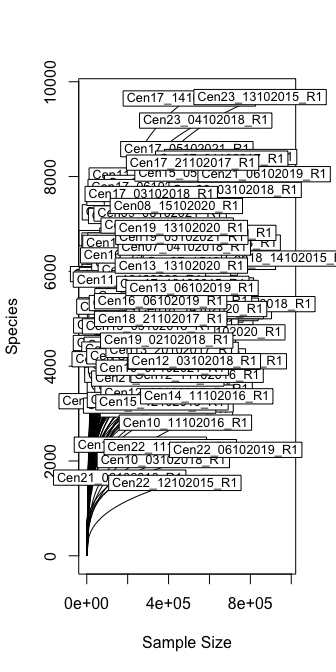<!-- -->

``` r
test.otu = NULL
names(rarecurve.out) <- sample_data(DNA.physeq)$SampleID

# Coerce data into "long" form.
protox <- mapply(FUN = function(x, y) {
  mydf <- as.data.frame(x)
  colnames(mydf) <- "rare_count"
  mydf$SampleID <- y
  mydf$Subsample_size <- attr(x, "Subsample")
  mydf
}, x = rarecurve.out, y = as.list(names(rarecurve.out)), SIMPLIFY = FALSE)

rarecurve.df = do.call(rbind, protox) %>%
  left_join(data.frame(sample_data(DNA.physeq)), by = "SampleID")

# Plot by temp
ggplot(data=rarecurve.df, aes(x=Subsample_size, y=rare_count)) +
  geom_vline(xintercept = min_depth, linetype=2) +
  geom_line(aes(group=SampleID, color=CoreTemp_C)) +
  scale_color_gradient(low="blue", high="red") +
  labs(x="Rarefied read depth", y="OTU count",
       color="Soil temp. (˚C)") +
  facet_wrap(~FireClassification, ncol=1) +
  basic_theme +
  theme(axis.text.x = element_text(angle=45, hjust=1),
        legend.position = "bottom")
```

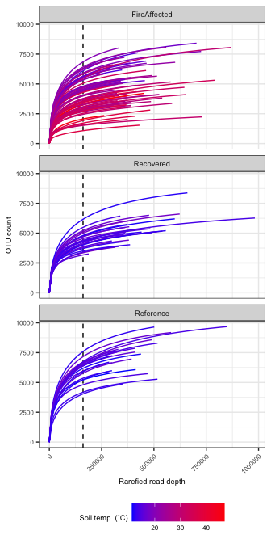<!-- -->

``` r
set.seed(4242)
rare.physeq = rarefy_even_depth(DNA.physeq)
```

    ## You set `rngseed` to FALSE. Make sure you've set & recorded
    ##  the random seed of your session for reproducibility.
    ## See `?set.seed`

    ## ...

    ## 4158OTUs were removed because they are no longer 
    ## present in any sample after random subsampling

    ## ...

``` r
rare.physeq
```

    ## phyloseq-class experiment-level object
    ## otu_table()   OTU Table:         [ 46644 taxa and 124 samples ]
    ## sample_data() Sample Data:       [ 124 samples by 48 sample variables ]
    ## tax_table()   Taxonomy Table:    [ 46644 taxa by 7 taxonomic ranks ]
    ## phy_tree()    Phylogenetic Tree: [ 46644 tips and 46641 internal nodes ]

``` r
DNA.physeq = NULL

rare_depth = mean(colSums(otu_table(rare.physeq)))
print(paste("Rarifying to:", rare_depth))
```

    ## [1] "Rarifying to: 161171"

``` r
sample_data(rare.physeq)$SiteID = factor(sample_data(rare.physeq)$SiteID, levels=used_sites)
```

# Shared and different taxa across fire classifications

For a brief inital look, lets see how many taxa (OTUs) are shared across
fire classifications and how many are unique.

``` r
# Get a table of each OTU and its labeling or detection pattern across fire classifications regimes.
FC_sum.otu = cbind(rowSums(otu_table(subset_samples(rare.physeq, FireClassification == "FireAffected"))) > 0,
                   rowSums(otu_table(subset_samples(rare.physeq, FireClassification == "Recovered"))) > 0,
                   rowSums(otu_table(subset_samples(rare.physeq, FireClassification == "Reference"))) > 0)
colnames(FC_sum.otu) = c("FireAffected", "Recovered", "Reference")

# Plot venn diagram
venn_FireClass.plot = plot(euler(FC_sum.otu), 
                           legend = FALSE, labels = TRUE,
                           quantities = list(TRUE, fontsize=6), 
                           strip=FALSE, fills=c("red", "blue", "grey"))
venn_FireClass.plot
```

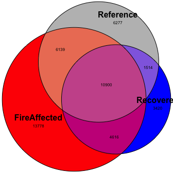<!-- -->

``` r
FC_sum.otu = NULL
```

# Soil change over time

Before examining how the microbial community changes over the time
series, lets look at how the overall soil changes. This might help us
identify potential drivers of any temporal microbial changes we see.

## Temperature

First lets see whether soil temperature changes over time. In particular
how do the fire affected sites change? This question is particularly
important considering that the fire front is moving along the coal seam.

``` r
temp.model.df = data.frame()
for (FC in c("FireAffected", "Recovered", "Reference")){
  sub_temp.model = lme(CoreTemp_C ~ Year, random = ~1|SiteID, data=filter(data.frame(sample_data(rare.physeq)), FireClassification == FC))
  temp.model.df = rbind(temp.model.df,
                        data.frame(summary(sub_temp.model)$tTable) %>%
                          tibble::rownames_to_column(var="factor") %>%
                          mutate(FireClassification = FC))
}

write.table(temp.model.df, file="/Users/sambarnett/Documents/Shade_lab/Centralia_project/Multi_year_project/Analysis/Raw_tables/temp_v_time_LME.txt", 
            sep="\t", quote = FALSE, row.names = FALSE)

temp.model.reg = temp.model.df %>%
  mutate(p_slope = ifelse(factor == "Year", p.value, 1),
         factor = ifelse(factor == "(Intercept)", "Intercept", factor)) %>%
  group_by(FireClassification) %>%
  mutate(p_slope = min(p.value)) %>%
  ungroup %>%
  select(factor, Value, p_slope, FireClassification) %>%
  tidyr::spread(key=factor, value = Value) %>%
  mutate(sig = ifelse(p_slope < 0.05, "< 0.05", "≥ 0.05"))


temp_time_lme.plot = ggplot(data=data.frame(sample_data(rare.physeq)), aes(x=Year, y=CoreTemp_C)) +
  geom_line(aes(group=SiteID), color="black", size=1) + 
  geom_line(aes(color=SiteID), size=0.5) + 
  geom_point(size=2, aes(fill=SiteID, shape=FireClassification)) +
  geom_abline(data=temp.model.reg, aes(intercept = Intercept, slope = Year), linetype = 1, size=2, color="black") +
  geom_abline(data=temp.model.reg, aes(intercept = Intercept, slope = Year, linetype = sig), size=1, color="white") +
  scale_linetype_manual(values=c("< 0.05" = 1, "≥ 0.05" = 2)) +
  scale_shape_manual(values=c("FireAffected" = 24, "Recovered" = 21, "Reference" = 22)) +
  scale_fill_manual(values=site.col) +
  scale_color_manual(values=site.col) +
  labs(x="Year", y="Soil temperature (˚C)", linetype="Regression\nslope p-value") +
  facet_grid(~FireClassification, scales = "free_y", switch="y") +
  basic_theme +
  theme(legend.position = "bottom",
        legend.direction = "vertical") +
  guides(fill=guide_legend(override.aes=list(shape=site.shape), ncol=7),
         linetype=guide_legend(override.aes=list(color="black")))
```

    ## Warning: Using `size` aesthetic for lines was deprecated in ggplot2 3.4.0.
    ## ℹ Please use `linewidth` instead.
    ## This warning is displayed once every 8 hours.
    ## Call `lifecycle::last_lifecycle_warnings()` to see where this warning was
    ## generated.

``` r
temp_time_lme.plot
```

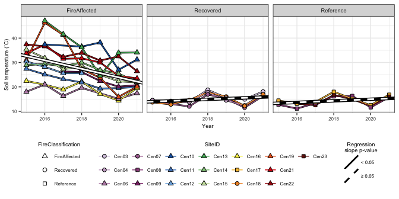<!-- -->

``` r
saveRDS(temp_time_lme.plot, file="/Users/sambarnett/Documents/Shade_lab/Centralia_project/Multi_year_project/Analysis/Raw_figures/Fig_1B.RDS")
```

## pH

Now does pH change over time at all?

``` r
pH.model.df = data.frame()
for (FC in c("FireAffected", "Recovered", "Reference")){
  sub_pH.model = lme(pH ~ Year, random = ~1|SiteID, data=filter(data.frame(sample_data(rare.physeq)), FireClassification == FC))
  pH.model.df = rbind(pH.model.df,
                      data.frame(summary(sub_pH.model)$tTable) %>%
                        tibble::rownames_to_column(var="factor") %>%
                        mutate(FireClassification = FC))
}

write.table(pH.model.df, file="/Users/sambarnett/Documents/Shade_lab/Centralia_project/Multi_year_project/Analysis/Raw_tables/pH_v_time_LME.txt", 
            sep="\t", quote = FALSE, row.names = FALSE)

pH.model.reg = pH.model.df %>%
  mutate(p_slope = ifelse(factor == "Year", p.value, 1),
         factor = ifelse(factor == "(Intercept)", "Intercept", factor)) %>%
  group_by(FireClassification) %>%
  mutate(p_slope = min(p.value)) %>%
  ungroup %>%
  select(factor, Value, p_slope, FireClassification) %>%
  tidyr::spread(key=factor, value = Value) %>%
  mutate(sig = ifelse(p_slope < 0.05, "< 0.05", "≥ 0.05"))

pH_time_lme.plot = ggplot(data=data.frame(sample_data(rare.physeq)), aes(x=Year, y=pH)) +
  geom_line(aes(group=SiteID), color="black", size=1) + 
  geom_line(aes(color=SiteID), size=0.5) + 
  geom_point(size=2, aes(fill=SiteID, shape=FireClassification)) +
  #geom_abline(data=pH.model.reg, aes(intercept = Intercept, slope = Year), linetype = 1, size=2, color="black") +
  #geom_abline(data=pH.model.reg, aes(intercept = Intercept, slope = Year, linetype = sig), size=1, color="white") +
  scale_linetype_manual(values=c("< 0.05" = 1, "≥ 0.05" = 2)) +
  scale_shape_manual(values=c("FireAffected" = 24, "Recovered" = 21, "Reference" = 22)) +
  scale_fill_manual(values=site.col) +
  scale_color_manual(values=site.col) +
  labs(x="Year", y="Soil pH", linetype="Regression\nslope p-value") +
  facet_grid(~FireClassification, scales = "free_y", switch="y") +
  basic_theme +
  theme(legend.position = "bottom",
        legend.direction = "vertical") +
  guides(fill=guide_legend(override.aes=list(shape=site.shape), ncol=7),
         linetype=guide_legend(override.aes=list(color="black")))
pH_time_lme.plot
```

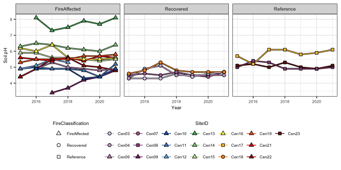<!-- -->

pH doesn’t change over time for the most part, but it does look like it
differs fundamentally across fire classifications. Lets check that out.

``` r
pH.model = aov(pH~FireClassification, data=data.frame(sample_data(rare.physeq)))
summary(pH.model)
```

    ##                     Df Sum Sq Mean Sq F value   Pr(>F)    
    ## FireClassification   2  16.07   8.034   14.54 2.19e-06 ***
    ## Residuals          121  66.84   0.552                     
    ## ---
    ## Signif. codes:  0 '***' 0.001 '**' 0.01 '*' 0.05 '.' 0.1 ' ' 1

``` r
pH.Tukey = TukeyHSD(pH.model, "FireClassification")
pH.Tukey$FireClassification
```

    ##                              diff        lwr        upr        p adj
    ## Recovered-FireAffected -0.8848571 -1.2754312 -0.4942831 1.124527e-06
    ## Reference-FireAffected -0.1634286 -0.5988299  0.2719728 6.472211e-01
    ## Reference-Recovered     0.7214286  0.2123277  1.2305294 2.951905e-03

``` r
pH_box.plot = ggplot(data=data.frame(sample_data(rare.physeq)), aes(x=FireClassification, y=pH)) +
  geom_boxplot(outlier.shape = NA) +
  geom_jitter(height=0, width=0.25, aes(fill=SiteID, shape=FireClassification), color="black", size=2) +
  annotate("segment", x=c(1.05, 2.05), xend=c(1.95, 2.95), y=c(8.6, 8.6), yend=c(8.6, 8.6)) +
  annotate("segment", x=c(1.05, 1.95, 2.05, 2.95), xend=c(1.05, 1.95, 2.05, 2.95), y=c(8.5, 8.5, 8.5, 8.5), yend=c(8.6, 8.6, 8.6, 8.6)) +
  annotate("text", x=c(1.5, 2.5), y=c(8.7, 8.7), label=c("p<0.001", "p=0.003"), size=6*5/14) +
  scale_shape_manual(values=c("FireAffected" = 24, "Recovered" = 21, "Reference" = 22)) +
  scale_fill_manual(values=site.col) +
  labs(x="Fire class", y="Soil pH") +
  basic_theme +
  theme(legend.position = "bottom") +
  guides(fill=guide_legend(override.aes=list(shape=site.shape), title.position = "top"),
         shape="none")
pH_box.plot
```

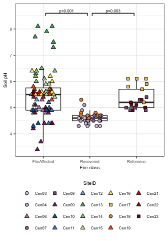<!-- -->

Plot pH analyses together.

``` r
pH_time.leg = g_legend(pH_time_lme.plot + guides(linetype = "none"))

pH.plot = cowplot::plot_grid(pH_time_lme.plot + theme(legend.position = "none"), 
                             pH_box.plot + theme(legend.position = "none"),
                   nrow=1, rel_widths = c(1,0.5),
                   labels = c("A", "B"), label_size = 8)
pH.plot = cowplot::plot_grid(pH.plot, pH_time.leg, ncol=1,
                             rel_heights = c(1, 0.3))
pH.plot
```

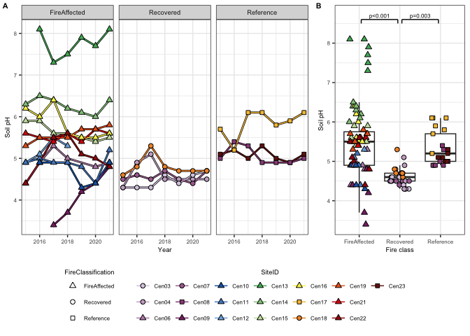<!-- -->

``` r
ggsave(pH.plot, file="/Users/sambarnett/Documents/Shade_lab/Centralia_project/Multi_year_project/Analysis/Manuscript_figures/Fig_S1.tiff",
       device="tiff", width=7, height=5, units="in", bg="white")
```

# Alpha diversity

Now that we see how the soils are different across fire classifications
and time, lets see if the within-sample bacterial diversities vary. for
this analysis we’ll use multiple measures of alpha diversity (Richness,
Shannon’s index, Pielou’s evenness index, and Faith’s phylogenetic
diversity index). We will probably only report one in the main
manuscript.

``` r
alpha_div.df = data.frame(richness=specnumber(t(otu_table(rare.physeq))),
                          shannon=diversity(t(otu_table(rare.physeq)), 
                                            index = "shannon")) %>%
  tibble::rownames_to_column(var="SampleID") %>%
  mutate(evenness = shannon/log(richness)) %>%
  left_join(pd(t(otu_table(rare.physeq)), phy_tree(rare.physeq)) %>%
              tibble::rownames_to_column(var="SampleID"), by="SampleID") %>%
  tidyr::gather(key="index", value="measure", -SampleID) %>%
  filter(index != "SR") %>%
  mutate(index = factor(index, levels = c("richness", "shannon", "evenness", "PD"))) %>%
  left_join(sample_data(rare.physeq), by = "SampleID") 
```

## Over time

First lets look at alpha diversity over time.

``` r
alpha_year.model.df = data.frame()
for (idx in c("richness", "shannon", "evenness", "PD")){
  for (FC in c("FireAffected", "Recovered", "Reference")){
  ctrl <- lmeControl(opt='optim')
  FC_alpha_year.model = lme(measure ~ Year, random = ~1|SiteID, control=ctrl,
                            data=filter(alpha_div.df, FireClassification == FC, index == idx))
  alpha_year.model.df = rbind(alpha_year.model.df,
                              data.frame(summary(FC_alpha_year.model)$tTable) %>%
                                tibble::rownames_to_column(var="factor") %>%
                                mutate(FireClassification = FC,index = idx))
  }
}

alpha_index_names = data.frame(alpha_index = c("Richness", "Shannon’s index", "Pielou's evenness", "Faith's PD"),
                               index = c("richness", "shannon", "evenness", "PD")) %>%
  mutate(alpha_index = factor(alpha_index, levels = c("Richness", "Shannon’s index", "Pielou's evenness", "Faith's PD")),
         index = factor(index, levels = c("richness", "shannon", "evenness", "PD")))
alpha_year.model.df = left_join(alpha_year.model.df, alpha_index_names, by="index")

alpha_year.model.reg = alpha_year.model.df %>%
  mutate(p_slope = ifelse(factor == "Year", p.value, 1),
         factor = ifelse(factor == "(Intercept)", "Intercept", factor)) %>%
  group_by(FireClassification, index) %>%
  mutate(p_slope = min(p.value)) %>%
  ungroup %>%
  select(factor, Value, p_slope, FireClassification, index) %>%
  tidyr::spread(key=factor, value = Value) %>%
  mutate(sig = ifelse(p_slope < 0.05, "< 0.05", "≥ 0.05")) %>%
  left_join(alpha_index_names, by="index")

alpha_year_lme.plot = ggplot(data=left_join(alpha_div.df, alpha_index_names, by="index"), 
                             aes(x=Year, y=measure, fill=SiteID, shape=FireClassification)) +
  geom_line(aes(group=SiteID), color="black", size=1) + 
  geom_line(aes(color=SiteID), size=0.5) + 
  geom_point(size=2, aes(fill=SiteID, shape=FireClassification)) +
  geom_abline(data=alpha_year.model.reg, aes(intercept = Intercept, slope = Year), linetype = 1, size=2, color="black") +
  geom_abline(data=alpha_year.model.reg, aes(intercept = Intercept, slope = Year, linetype = sig), size=1, color="white") +
  scale_linetype_manual(values=c("< 0.05" = 1, "≥ 0.05" = 2)) +
  scale_shape_manual(values=c("FireAffected" = 24, "Recovered" = 21, "Reference" = 22)) +
  scale_fill_manual(values=site.col) +
  scale_color_manual(values=site.col) +
  labs(x="Year", linetype="Regression\nslope p-value") +
  facet_grid(alpha_index~FireClassification, scales = "free_y", switch="y") +
  basic_theme +
  theme(axis.title.y = element_blank(),
        strip.placement = "outside",
        strip.background.y = element_blank()) +
  guides(fill=guide_legend(override.aes=list(shape=site.shape)),
         linetype=guide_legend(override.aes=list(color="black")))
alpha_year_lme.plot
```

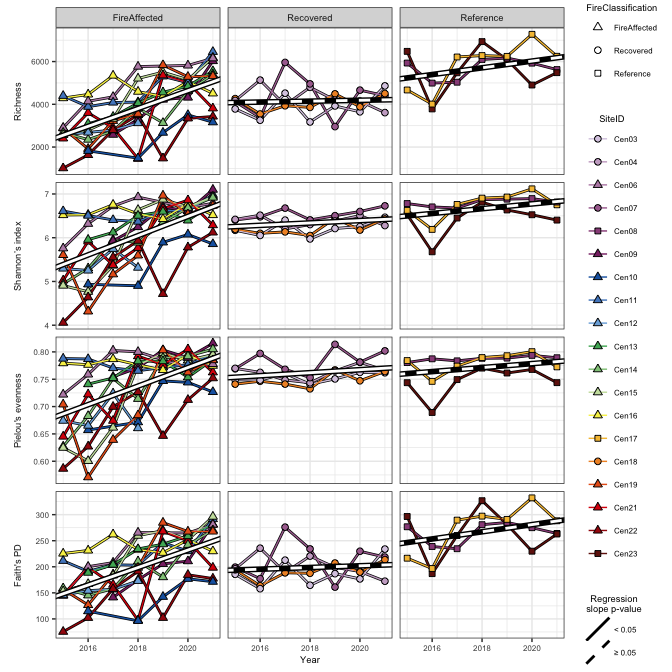<!-- -->

## Over soil temperature

There does seem to be a significant shift over time but only in the fire
affected soils. Since we know fire affected soils are cooling over time,
lets see if there are shifts in alpha diversity over soil temperature.
For this analysis we will not necessarily look at fire classification.

``` r
alpha_temp.model.sum = data.frame()
for (idx in c("richness", "shannon", "evenness", "PD")){
  alpha_temp.model = lme(measure ~ CoreTemp_C, random = ~1|SiteID, control=ctrl, 
                        data=filter(alpha_div.df, index == idx))
  alpha_temp.model.sum = rbind(alpha_temp.model.sum,
                               summary(alpha_temp.model)$tTable %>%
                                 data.frame() %>%
                                 tibble::rownames_to_column(var="factor") %>%
                                 mutate(index = idx))
}
alpha_temp.model.sum
```

    ##        factor         Value    Std.Error  DF   t.value      p.value    index
    ## 1 (Intercept)  6.555407e+03 3.715189e+02 104 17.644879 4.811139e-33 richness
    ## 2  CoreTemp_C -1.043972e+02 1.477480e+01 104 -7.065893 1.879742e-10 richness
    ## 3 (Intercept)  7.558165e+00 1.780991e-01 104 42.437966 1.720895e-67  shannon
    ## 4  CoreTemp_C -5.947827e-02 7.011736e-03 104 -8.482674 1.605332e-13  shannon
    ## 5 (Intercept)  8.536404e-01 1.545351e-02 104 55.239240 6.832983e-79 evenness
    ## 6  CoreTemp_C -4.652277e-03 6.084899e-04 104 -7.645611 1.083642e-11 evenness
    ## 7 (Intercept)  2.971927e+02 1.663305e+01 104 17.867608 1.798470e-33       PD
    ## 8  CoreTemp_C -3.852548e+00 6.520756e-01 104 -5.908131 4.416384e-08       PD

``` r
alpha_temp.model.reg = alpha_temp.model.sum %>%
  mutate(p_slope = ifelse(factor == "CoreTemp_C", p.value, 1),
         factor = ifelse(factor == "(Intercept)", "Intercept", factor)) %>%
  group_by(index) %>%
  mutate(p_slope = min(p.value)) %>%
  ungroup %>%
  select(factor, Value, p_slope, index) %>%
  tidyr::spread(key=factor, value = Value) %>%
  mutate(sig = ifelse(p_slope < 0.05, "< 0.05", "≥ 0.05"))

alpha_temp.plot = ggplot(data=alpha_div.df, aes(x=CoreTemp_C, y=measure, fill=SiteID, shape=FireClassification)) +
  geom_point(size=2) +
  geom_abline(data=alpha_temp.model.reg, aes(intercept = Intercept, slope = CoreTemp_C), linetype = 1, size=2, color="black") +
  geom_abline(data=alpha_temp.model.reg, aes(intercept = Intercept, slope = CoreTemp_C), linetype = 1, size=1, color="white") +
  scale_shape_manual(values=c("FireAffected" = 24, "Recovered" = 21, "Reference" = 22)) +
  scale_fill_manual(values=site.col) +
  scale_color_manual(values=site.col) +
  labs(x="Soil temperature (˚C)", y="Evenness",
       shape="Fire Classification", fill="Site ID") +
  facet_grid(index~NA, scales = "free_y", switch="y") +
  basic_theme +
  theme(axis.title.y = element_blank(),
        strip.placement = "outside",
        strip.background.y = element_blank(),
        strip.text.x = element_blank()) +
  guides(fill=guide_legend(override.aes=list(shape=site.shape)),
         linetype=guide_legend(override.aes=list(color="black")))

alpha_temp.plot
```

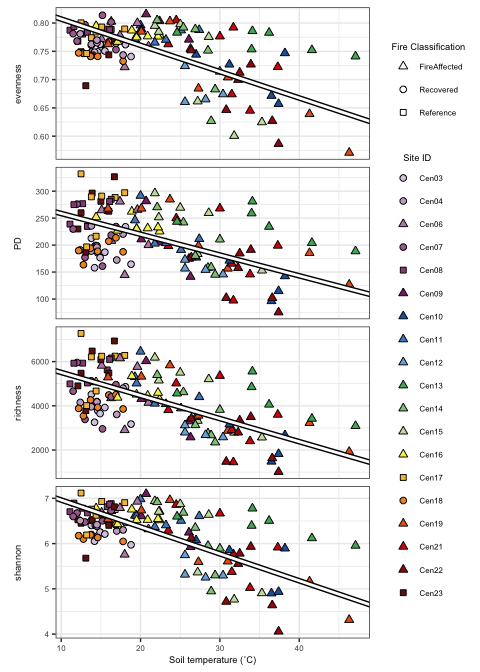<!-- -->

Save the Faith’s phylogenetic diversity plots for publication.

``` r
# By year
write.table(filter(alpha_year.model.df, index=="PD"), file="/Users/sambarnett/Documents/Shade_lab/Centralia_project/Multi_year_project/Analysis/Raw_tables/WholePD_v_time_LME.txt", 
            sep="\t", quote = FALSE, row.names = FALSE)

PD_year_lme.plot = ggplot(data=filter(left_join(alpha_div.df, alpha_index_names, by="index"), index == "PD"), 
                          aes(x=Year, y=measure, fill=SiteID, shape=FireClassification)) +
  geom_line(aes(group=SiteID), color="black", size=1) + 
  geom_line(aes(color=SiteID), size=0.5) + 
  geom_point(size=2, aes(fill=SiteID, shape=FireClassification)) +
  geom_abline(data=alpha_year.model.reg, aes(intercept = Intercept, slope = Year), linetype = 1, size=2, color="black") +
  geom_abline(data=alpha_year.model.reg, aes(intercept = Intercept, slope = Year, linetype = sig), size=1, color="white") +
  scale_linetype_manual(values=c("< 0.05" = 1, "≥ 0.05" = 2)) +
  scale_shape_manual(values=c("FireAffected" = 24, "Recovered" = 21, "Reference" = 22)) +
  scale_fill_manual(values=site.col) +
  scale_color_manual(values=site.col) +
  labs(x="Year", y="Faith's PD", linetype="Regression\nslope p-value") +
  facet_grid(~FireClassification, scales = "free_y", switch="y") +
  basic_theme +
  theme(legend.position = "bottom",
        legend.direction = "vertical") +
  guides(fill=guide_legend(override.aes=list(shape=site.shape), ncol=7),
         linetype=guide_legend(override.aes=list(color="black")))
PD_year_lme.plot
```

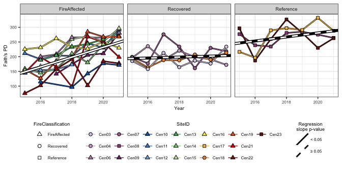<!-- -->

``` r
saveRDS(PD_year_lme.plot, file="/Users/sambarnett/Documents/Shade_lab/Centralia_project/Multi_year_project/Analysis/Raw_figures/Fig_S2A.RDS")
```

``` r
# By temperature
write.table(filter(alpha_temp.model.sum, index=="PD"), file="/Users/sambarnett/Documents/Shade_lab/Centralia_project/Multi_year_project/Analysis/Raw_tables/WholePD_v_temp_LME.txt", 
            sep="\t", quote = FALSE, row.names = FALSE)

PD_temp.plot = ggplot(data=filter(alpha_div.df, index == "PD"), aes(x=CoreTemp_C, y=measure, fill=SiteID, shape=FireClassification)) +
  geom_point(size=2) +
  geom_abline(data=filter(alpha_temp.model.reg, index == "PD"), aes(intercept = Intercept, slope = CoreTemp_C), linetype = 1, size=2, color="black") +
  geom_abline(data=filter(alpha_temp.model.reg, index == "PD"), aes(intercept = Intercept, slope = CoreTemp_C), linetype = 1, size=1, color="white") +
  scale_shape_manual(values=c("FireAffected" = 24, "Recovered" = 21, "Reference" = 22)) +
  scale_fill_manual(values=site.col) +
  scale_color_manual(values=site.col) +
  labs(x="Soil temperature (˚C)", y="Faith's PD",
       shape="Fire Classification", fill="Site ID") +
  basic_theme +
  theme(legend.position = "none")
PD_temp.plot
```

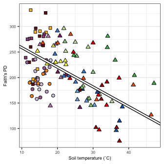<!-- -->

``` r
saveRDS(PD_temp.plot, file="/Users/sambarnett/Documents/Shade_lab/Centralia_project/Multi_year_project/Analysis/Raw_figures/Fig_1C.RDS")
```

# Beta diversity

Well, there is clearly variation in bacterial diversity across samples.
Now lets examine the between-sample bacterial diversities and tease
apart differences in community compositions. For this analysis we’ll use
two measures of beta diversity (Bray-Curtis dissimilarity and weighted
UniFrac distance). We will probably only report one in the main
manuscript.

## Bray-Curtis

First lets use Bray-Curtis dissimilarity. This measure takes into
account OTU differences and abundance variation but not phylogenetic
distance.

### PERMANOVA

Does fire class or sampling year explain any of the variation in
community compositional differences?

``` r
# Set up the blocking design for the permanova. In this case since we are repeatedly sampling the same sites over multiple years I include SiteID as the block. This is similar to "strata" in the old version of adonis.
perm <- how(nperm = 999)
dat = data.frame(sample_data(rare.physeq))
setBlocks(perm) <- with(dat, SiteID)

# Get the Bray-Curtis dissimilarity
BC.dist = vegdist(t(otu_table(rare.physeq)), method="bray", binary=FALSE, diag=TRUE, upper=TRUE)

# Run adonis2 
set.seed(4242)
BC.adonis = adonis2(formula = BC.dist ~ FireClassification*as.factor(Year), 
                    permutations = perm, data = dat)
BC.adonis
```

    ## Permutation test for adonis under reduced model
    ## Terms added sequentially (first to last)
    ## Blocks:  with(dat, SiteID) 
    ## Permutation: free
    ## Number of permutations: 999
    ## 
    ## adonis2(formula = BC.dist ~ FireClassification * as.factor(Year), data = dat, permutations = perm)
    ##                                     Df SumOfSqs      R2       F Pr(>F)    
    ## FireClassification                   2    6.633 0.18648 13.0564  0.001 ***
    ## as.factor(Year)                      6    1.400 0.03936  0.9186  0.001 ***
    ## FireClassification:as.factor(Year)  12    1.372 0.03859  0.4503  0.002 ** 
    ## Residual                           103   26.162 0.73557                   
    ## Total                              123   35.566 1.00000                   
    ## ---
    ## Signif. codes:  0 '***' 0.001 '**' 0.01 '*' 0.05 '.' 0.1 ' ' 1

### Ordination

``` r
set.seed(4242)
BC.ord = pcoa(BC.dist)
Xaxis = paste("PCo1 (", round(BC.ord$values[1,2]*100, digits=2), "%)", sep="")
Yaxis = paste("PCo2 (", round(BC.ord$values[2,2]*100, digits=2), "%)", sep="")

BC.ord.df = data.frame(BC.ord$vectors) %>%
  tibble::rownames_to_column(var="SampleID") %>%
  select(SampleID, Axis.1, Axis.2) %>%
  left_join(sample_data(rare.physeq), by = "SampleID") %>%
  arrange(Year) %>%
  group_by(SiteID) %>%
  mutate(YearRank = row_number()) %>%
  ungroup %>%
  mutate(AirTemperature_C = as.numeric(AirTemperature_C)) %>%
  mutate(diff_temp = CoreTemp_C-AirTemperature_C)

## Now plot by different aesthetics to put together into one full figure.

# By site ID
BC_site.plot = ggplot(data=BC.ord.df, aes(x=Axis.1, y=Axis.2)) +
  geom_point(aes(fill=SiteID, shape=FireClassification), size=2) +
  scale_shape_manual(values=c("FireAffected" = 24, "Recovered" = 21, "Reference" = 22)) +
  scale_fill_manual(values=site.col) +
  labs(x=Xaxis, y=Yaxis) +
  basic_theme +
  guides(shape = guide_legend(order = 1),
         fill = guide_legend(order = 2, override.aes=list(shape=site.shape)))

# By year
BC_time.plot = ggplot(data=BC.ord.df, aes(x=Axis.1, y=Axis.2)) +
  geom_point(aes(fill=Year, shape=FireClassification), size=2) +
  scale_shape_manual(values=c("FireAffected" = 24, "Recovered" = 21, "Reference" = 22)) +
  scale_fill_gradient(low="white", high="black") +
  labs(x=Xaxis, y=Yaxis) +
  basic_theme +
  guides(shape = guide_legend(order = 1),
         fill = guide_legend(order = 2, override.aes=list(shape=22)))

# Now plot together
BC_FireClassYear.leg = g_legend(BC_time.plot + theme(legend.position = "bottom", legend.direction = "vertical") +
                                  guides(fill = guide_legend(ncol=2, override.aes=list(shape=22))))
BC_SiteID.leg = g_legend(BC_site.plot + guides(shape="none", fill = guide_legend(override.aes=list(shape=site.shape), ncol=5)))

cowplot::plot_grid(cowplot::plot_grid(BC_site.plot + theme(legend.position = "none"),
                                      BC_time.plot + theme(legend.position = "none"), nrow=1),
                   cowplot::plot_grid(BC_SiteID.leg, BC_FireClassYear.leg, nrow=1),
                   ncol=1, rel_heights = c(1,0.5))
```

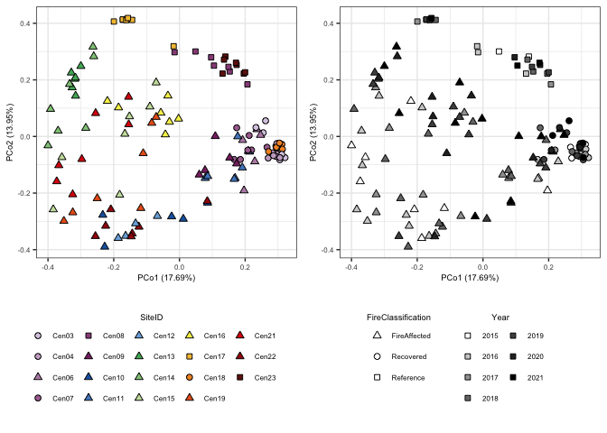<!-- -->

### Multivariate homogeneity of groups dispersions

Does the dispersion of the groups (fire classifications) differ? This
may be one of the underylying causes of betadiversity variation across
groups. It does appear so in the ordinations as fire affected sites seem
to be more dispersed than either recovered or reference sites. Lets see
if that is statistically relevant.

``` r
batadisp.groups = factor(sample_data(rare.physeq)$FireClassification)

betadisper.res = betadisper(BC.dist, batadisp.groups)
betadisper.res
```

    ## 
    ##  Homogeneity of multivariate dispersions
    ## 
    ## Call: betadisper(d = BC.dist, group = batadisp.groups)
    ## 
    ## No. of Positive Eigenvalues: 123
    ## No. of Negative Eigenvalues: 0
    ## 
    ## Average distance to median:
    ## FireAffected    Recovered    Reference 
    ##       0.5401       0.3614       0.3625 
    ## 
    ## Eigenvalues for PCoA axes:
    ## (Showing 8 of 123 eigenvalues)
    ##  PCoA1  PCoA2  PCoA3  PCoA4  PCoA5  PCoA6  PCoA7  PCoA8 
    ## 6.2935 4.9625 2.6715 1.9110 1.6493 1.2359 1.0368 0.9534

``` r
anova(betadisper.res)
```

    ## Analysis of Variance Table
    ## 
    ## Response: Distances
    ##            Df  Sum Sq Mean Sq F value    Pr(>F)    
    ## Groups      2 0.94102 0.47051  75.932 < 2.2e-16 ***
    ## Residuals 121 0.74977 0.00620                      
    ## ---
    ## Signif. codes:  0 '***' 0.001 '**' 0.01 '*' 0.05 '.' 0.1 ' ' 1

``` r
betadisper.HSD <- TukeyHSD(betadisper.res)
betadisper.HSD
```

    ##   Tukey multiple comparisons of means
    ##     95% family-wise confidence level
    ## 
    ## Fit: aov(formula = distances ~ group, data = df)
    ## 
    ## $group
    ##                                diff         lwr         upr     p adj
    ## Recovered-FireAffected -0.178658546 -0.22002608 -0.13729101 0.0000000
    ## Reference-FireAffected -0.177559330 -0.22367473 -0.13144393 0.0000000
    ## Reference-Recovered     0.001099216 -0.05282204  0.05502048 0.9987108

## Weighted UniFrac

Now lets use weighted UniFrac distance. This measure takes into account
OTU differences and abundance variation and phylogenetic distance.
UniFrac was found to be useful for distinguishing Centralia microbial
communities in previous studies.

### PERMANOVA

Does fire class or sampling year explain any of the variation in
community compositional differences?

``` r
# Set up the blocking design for the permanova. In this case since we are repeatedly sampling the same sites over multiple years I include SiteID as the block. This is similar to "strata" in the old version of adonis.
perm <- how(nperm = 999)
dat = data.frame(sample_data(rare.physeq))
setBlocks(perm) <- with(dat, SiteID)

# Get the weighted UniFrac distance
wUF.dist = distance(rare.physeq, method = "wunifrac")

# Run adonis2 
set.seed(4242)
wUF.adonis = adonis2(formula = wUF.dist ~ FireClassification*as.factor(Year), 
                    permutations = perm, data = dat)
wUF.adonis
```

    ## Permutation test for adonis under reduced model
    ## Terms added sequentially (first to last)
    ## Blocks:  with(dat, SiteID) 
    ## Permutation: free
    ## Number of permutations: 999
    ## 
    ## adonis2(formula = wUF.dist ~ FireClassification * as.factor(Year), data = dat, permutations = perm)
    ##                                     Df SumOfSqs      R2       F Pr(>F)    
    ## FireClassification                   2  0.49689 0.17992 12.8111  0.001 ***
    ## as.factor(Year)                      6  0.15704 0.05686  1.3497  0.001 ***
    ## FireClassification:as.factor(Year)  12  0.11040 0.03997  0.4744  0.002 ** 
    ## Residual                           103  1.99747 0.72325                   
    ## Total                              123  2.76180 1.00000                   
    ## ---
    ## Signif. codes:  0 '***' 0.001 '**' 0.01 '*' 0.05 '.' 0.1 ' ' 1

``` r
write.table(wUF.adonis, file="/Users/sambarnett/Documents/Shade_lab/Centralia_project/Multi_year_project/Analysis/Raw_tables/Whole_wUF_PERMANOVA.txt", 
            sep="\t", quote = FALSE, row.names = TRUE)
```

### Ordination

``` r
set.seed(4242)
wUF.ord = pcoa(wUF.dist)
Xaxis = paste("PCo1 (", round(wUF.ord$values[1,2]*100, digits=2), "%)", sep="")
Yaxis = paste("PCo2 (", round(wUF.ord$values[2,2]*100, digits=2), "%)", sep="")

wUF.ord.df = data.frame(wUF.ord$vectors) %>%
  tibble::rownames_to_column(var="SampleID") %>%
  select(SampleID, Axis.1, Axis.2) %>%
  left_join(sample_data(rare.physeq), by = "SampleID") %>%
  arrange(Year) %>%
  group_by(SiteID) %>%
  mutate(YearRank = row_number()) %>%
  ungroup %>%
  mutate(AirTemperature_C = as.numeric(AirTemperature_C)) %>%
  mutate(diff_temp = CoreTemp_C-AirTemperature_C)

## Now plot by different aesthetics to put together into one full figure.

# By site ID
wUF_site.plot = ggplot(data=wUF.ord.df, aes(x=Axis.1, y=Axis.2)) +
  geom_point(aes(fill=SiteID, shape=FireClassification), size=2) +
  scale_shape_manual(values=c("FireAffected" = 24, "Recovered" = 21, "Reference" = 22)) +
  scale_fill_manual(values=site.col) +
  labs(x=Xaxis, y=Yaxis) +
  basic_theme +
  guides(shape = guide_legend(order = 1),
         fill = guide_legend(order = 2, override.aes=list(shape=site.shape)))

# By year
wUF_time.plot = ggplot(data=wUF.ord.df, aes(x=Axis.1, y=Axis.2)) +
  geom_point(aes(fill=Year, shape=FireClassification), size=2) +
  scale_shape_manual(values=c("FireAffected" = 24, "Recovered" = 21, "Reference" = 22)) +
  scale_fill_gradient(low="white", high="black") +
  labs(x=Xaxis, y=Yaxis) +
  basic_theme +
  guides(shape = guide_legend(order = 1),
         fill = guide_legend(order = 2, override.aes=list(shape=22)))

# Now plot together
wUF_FireClassYear.leg = g_legend(wUF_time.plot + theme(legend.position = "bottom", legend.direction = "vertical") +
                                  guides(fill = guide_legend(ncol=2, override.aes=list(shape=22))))
wUF_SiteID.leg = g_legend(wUF_site.plot + guides(shape="none", fill = guide_legend(override.aes=list(shape=site.shape), ncol=5)))

wUF_full.plot = cowplot::plot_grid(cowplot::plot_grid(wUF_site.plot + theme(legend.position = "none"),
                                                      wUF_time.plot + theme(legend.position = "none"), 
                                                      labels = c("A", "B"), label_size = 8, nrow=1),
                                   cowplot::plot_grid(wUF_SiteID.leg, wUF_FireClassYear.leg, nrow=1),
                                   ncol=1, rel_heights = c(1,0.5))
wUF_full.plot
```

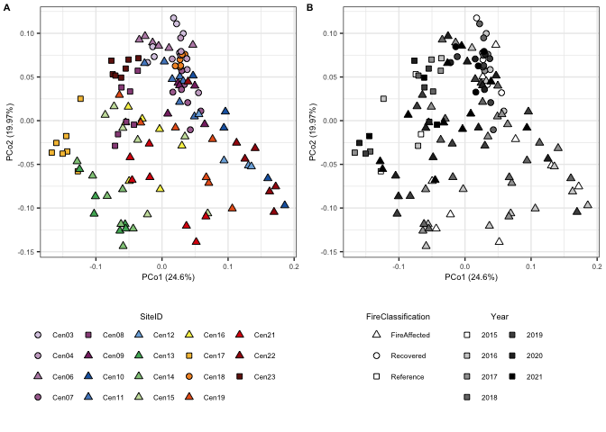<!-- -->

``` r
ggsave(wUF_full.plot, file="/Users/sambarnett/Documents/Shade_lab/Centralia_project/Multi_year_project/Analysis/Manuscript_figures/Fig_S3.tiff",
       device="tiff", width=7, height=5, units="in", bg="white")
```

### Post hoc pairwise analyses

Since we saw that both year and fire classification significantly
explained variation in community composition, lets look at these closer
and variation within year and within fire class.

### Across fire classifications within year

``` r
yearly.wUF.adonis.df = data.frame()
yearly.wUF.ord.df = data.frame()
yearly.Xaxis = c()
yearly.Yaxis = c()
for (yr in c(2015, 2016, 2017, 2018, 2019, 2020, 2021)){
  sub.physeq = subset_samples(rare.physeq, Year == yr)
  sub.physeq = prune_taxa(taxa_sums(sub.physeq) > 0, sub.physeq)
  sub.wUF.dist = distance(sub.physeq, method = "wunifrac")
  
  # PERMANOVA
  set.seed(4242)
  sub.wUF.adonis = adonis2(formula = sub.wUF.dist ~ FireClassification, 
                          data = data.frame(sample_data(sub.physeq)))
  sub.wUF.adonis.df = data.frame(sub.wUF.adonis) %>%
    tibble::rownames_to_column(var="variable") %>%
    mutate(Year = yr)
  yearly.wUF.adonis.df = rbind(yearly.wUF.adonis.df, sub.wUF.adonis.df)
  
  # Ordination
  sub.wUF.ord = pcoa(sub.wUF.dist)
  yearly.Xaxis[as.character(yr)] = paste(round(sub.wUF.ord$values[1,2]*100, digits=2), "%", sep="")
  yearly.Yaxis[as.character(yr)] = paste(round(sub.wUF.ord$values[2,2]*100, digits=2), "%", sep="")
  
  sub.wUF.ord.df = data.frame(sub.wUF.ord$vectors) %>%
    tibble::rownames_to_column(var="SampleID") %>%
    select(SampleID, Axis.1, Axis.2) %>%
    left_join(sample_data(sub.physeq), by = "SampleID")
  yearly.wUF.ord.df = rbind(yearly.wUF.ord.df, sub.wUF.ord.df)
  
  sub.physeq = NULL
}

yearly.wUF.adonis.df = yearly.wUF.adonis.df %>%
  filter(variable == "FireClassification") %>%
  mutate(padj = p.adjust(Pr..F., method = "BH"))
yearly.wUF.adonis.df
```

    ##             variable Df   SumOfSqs        R2        F Pr..F. Year   padj
    ## 1 FireClassification  2 0.15464198 0.2758202 2.475671  0.005 2015 0.0175
    ## 2 FireClassification  2 0.18224642 0.2396499 2.363878  0.010 2016 0.0175
    ## 3 FireClassification  2 0.12333331 0.2142395 2.044893  0.006 2017 0.0175
    ## 4 FireClassification  2 0.11506994 0.2000474 2.000592  0.010 2018 0.0175
    ## 5 FireClassification  2 0.09769550 0.2036337 1.789925  0.048 2019 0.0480
    ## 6 FireClassification  2 0.08913639 0.2088992 1.980460  0.019 2020 0.0266
    ## 7 FireClassification  2 0.07855412 0.2029411 1.909594  0.030 2021 0.0350

``` r
write.table(yearly.wUF.adonis.df, file="/Users/sambarnett/Documents/Shade_lab/Centralia_project/Multi_year_project/Analysis/Raw_tables/Whole_wUF_v_PostHoc_yearly.txt", 
            sep="\t", quote = FALSE, row.names = FALSE)
```

``` r
yearly.wUF_fireclass.plot.list = list()
for (yr in c(2015, 2016, 2017, 2018, 2019, 2020, 2021)){
  if (filter(yearly.wUF.adonis.df, Year == yr)$padj < 0.05){
    facetype = "bold"
  }else{
    facetype = "plain"
  }
  subyear.wUF_fireclass.plot = ggplot(data=filter(yearly.wUF.ord.df, Year == yr), aes(x=Axis.1, y=Axis.2)) +
    geom_point(aes(fill=FireClassification, shape=FireClassification), size=2) +
    scale_shape_manual(values=FC.shape) +
    scale_fill_manual(values=c("FireAffected" = "red", "Recovered" = "blue", "Reference" = "grey")) +
    labs(x=paste("PCoA1 (", yearly.Xaxis[as.character(yr)], ")", sep=""), 
         y=paste("PCoA2 (", yearly.Yaxis[as.character(yr)], ")", sep=""),
         title=paste(yr, ": Var=", round(filter(yearly.wUF.adonis.df, Year == yr)$R2*100, digits = 2),
                     "%, p-value=", round(filter(yearly.wUF.adonis.df, Year == yr)$padj, digits = 3),
                     sep="")) +
    basic_theme +
    theme(plot.title = element_text(size=8, hjust=0.5, face = facetype),
          legend.position = "none")
  yearly.wUF_fireclass.plot.list[[as.character(yr)]] = subyear.wUF_fireclass.plot
}
  
yearly.wUF_fireclass.leg = g_legend(yearly.wUF_fireclass.plot.list[[1]] +
                                     theme(legend.position = "right"))
    
# By fire classification
yearly.wUF_fireclass.plot = cowplot::plot_grid(plotlist = yearly.wUF_fireclass.plot.list,
                                               yearly.wUF_fireclass.leg, ncol=2)
yearly.wUF_fireclass.plot
```

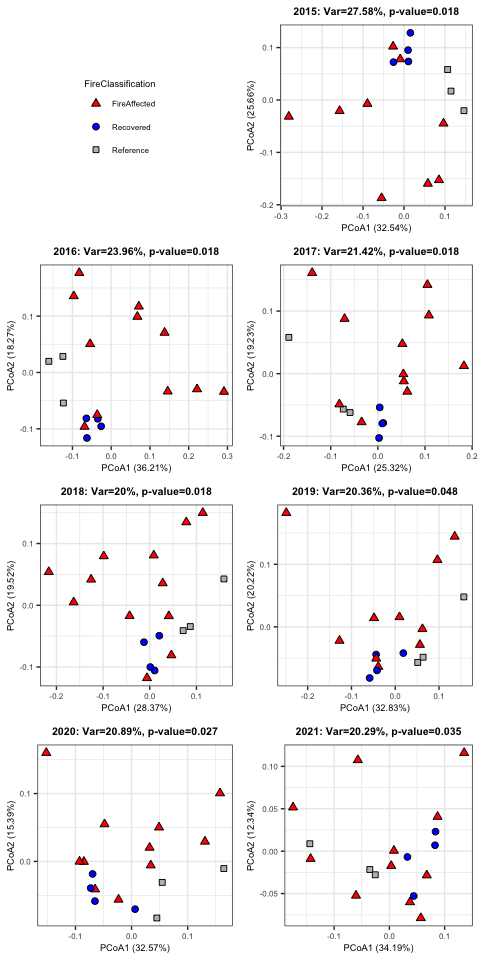<!-- -->

``` r
ggsave(yearly.wUF_fireclass.plot, file="/Users/sambarnett/Documents/Shade_lab/Centralia_project/Multi_year_project/Analysis/Manuscript_figures/Fig_S5.tiff",
       device="tiff", width=5, height=10, units="in", bg="white")
```

### Across years within fire classification

``` r
classly.wUF.adonis.df = data.frame()
classly.wUF.ord.df = data.frame()
classly.Xaxis = c()
classly.Yaxis = c()

for (Fcls in c(c("FireAffected", "Recovered", "Reference"))){
  sub.physeq = subset_samples(rare.physeq, FireClassification == Fcls)
  sub.physeq = prune_taxa(taxa_sums(sub.physeq) > 0, sub.physeq)
  sample_data(sub.physeq)$Year = as.factor(sample_data(sub.physeq)$Year)

  # PERMANOVA
  perm <- how(nperm = 999)
  dat = data.frame(sample_data(sub.physeq))
  setBlocks(perm) <- with(dat, SiteID)

  sub.wUF.dist = distance(sub.physeq, method = "wunifrac")
  set.seed(4242)
  sub.wUF.adonis = adonis2(formula = sub.wUF.dist ~ Year, 
                           permutations = perm, data = dat)
  sub.wUF.adonis.df = data.frame(sub.wUF.adonis) %>%
    tibble::rownames_to_column(var="variable") %>%
    mutate(FireClassification = Fcls)
  classly.wUF.adonis.df = rbind(classly.wUF.adonis.df, sub.wUF.adonis.df)
  
  # Ordination
  sub.wUF.ord = pcoa(sub.wUF.dist)
  classly.Xaxis[as.character(Fcls)] = paste(round(sub.wUF.ord$values[1,2]*100, digits=2), "%", sep="")
  classly.Yaxis[as.character(Fcls)] = paste(round(sub.wUF.ord$values[2,2]*100, digits=2), "%", sep="")
  
  sub.wUF.ord.df = data.frame(sub.wUF.ord$vectors) %>%
    tibble::rownames_to_column(var="SampleID") %>%
    select(SampleID, Axis.1, Axis.2) %>%
    left_join(sample_data(sub.physeq), by = "SampleID")
  classly.wUF.ord.df = rbind(classly.wUF.ord.df, sub.wUF.ord.df)
  sub.physeq = NULL
}

classly.wUF.adonis.df = classly.wUF.adonis.df %>%
  filter(variable == "Year") %>%
  mutate(padj = p.adjust(Pr..F., method = "BH"))
classly.wUF.adonis.df
```

    ##   variable Df   SumOfSqs        R2         F Pr..F. FireClassification  padj
    ## 1     Year  6 0.29352955 0.1077738 1.3689761  0.001       FireAffected 0.003
    ## 2     Year  6 0.04919357 0.1187490 0.4716266  0.280          Recovered 0.316
    ## 3     Year  6 0.04210406 0.1567520 0.4337452  0.316          Reference 0.316

``` r
write.table(classly.wUF.adonis.df, file="/Users/sambarnett/Documents/Shade_lab/Centralia_project/Multi_year_project/Analysis/Raw_tables/Whole_wUF_v_PostHoc_FireClass.txt", 
            sep="\t", quote = FALSE, row.names = FALSE)
```

``` r
# Plot all subsetted ordinations
classly.wUF_fireclass.plot.list = list()
for (Fcls in c(c("FireAffected", "Recovered", "Reference"))){
  if (filter(classly.wUF.adonis.df, FireClassification == Fcls)$padj < 0.05){
    facetype = "bold"
  }else{
    facetype = "plain"
  }
  suwUFlass.wUF_fireclass.plot = ggplot(data=filter(classly.wUF.ord.df, FireClassification == Fcls), aes(x=Axis.1, y=Axis.2)) +
    geom_point(aes(fill=as.numeric(as.character(Year)), shape=FireClassification), size=2) +
    scale_shape_manual(values=c("FireAffected" = 24, "Recovered" = 21, "Reference" = 22)) +
    scale_fill_gradient(low="white", high="black") +
    labs(x=paste("PCoA1 (", classly.Xaxis[as.character(Fcls)], ")", sep=""), 
         y=paste("PCoA2 (", classly.Yaxis[as.character(Fcls)], ")", sep=""),
         title=paste(Fcls, ": Var=", round(filter(classly.wUF.adonis.df, FireClassification == Fcls)$R2*100, digits = 2),
                     "%, p-value=", round(filter(classly.wUF.adonis.df, FireClassification == Fcls)$padj, digits = 3),
                     sep=""),
         fill="Year") +
    basic_theme +
    theme(plot.title = element_text(size=8, hjust=0.5, face = facetype),
          legend.position = "none") +
    guides(fill = guide_legend(order = 2, override.aes=list(shape=22)))
  classly.wUF_fireclass.plot.list[[as.character(Fcls)]] = suwUFlass.wUF_fireclass.plot
}

# Make unified legend
suwUFlass.wUF_fireclass.plot = ggplot(data=classly.wUF.ord.df, aes(x=Axis.1, y=Axis.2)) +
  geom_point(aes(fill=as.numeric(as.character(Year)), shape=FireClassification), size=2) +
  scale_shape_manual(values=c("FireAffected" = 24, "Recovered" = 21, "Reference" = 22)) +
  scale_fill_gradient(low="white", high="black") +
  labs(x=paste("PCoA1 (", classly.Xaxis[as.character(Fcls)], ")", sep=""), 
       y=paste("PCoA2 (", classly.Yaxis[as.character(Fcls)], ")", sep=""),
       title=paste(Fcls, ": Var=", round(filter(classly.wUF.adonis.df, FireClassification == Fcls)$R2*100, digits = 2),
                   "%, p-value=", round(filter(classly.wUF.adonis.df, FireClassification == Fcls)$padj, digits = 3),
                   sep=""),
       fill="Year") +
  basic_theme +
  theme(plot.title = element_text(size=8, hjust=0.5, face = facetype),
        legend.position = "none") +
  guides(fill = guide_legend(order = 2, override.aes=list(shape=22)))
  
classly.wUF_fireclass.leg = g_legend(suwUFlass.wUF_fireclass.plot +
                                     theme(legend.position = "bottom",
                                           legend.direction = "vertical"))
    
# By fire classification
classly.wUF_fireclass.plot = cowplot::plot_grid(plotlist = classly.wUF_fireclass.plot.list,
                                               classly.wUF_fireclass.leg)
classly.wUF_fireclass.plot
```

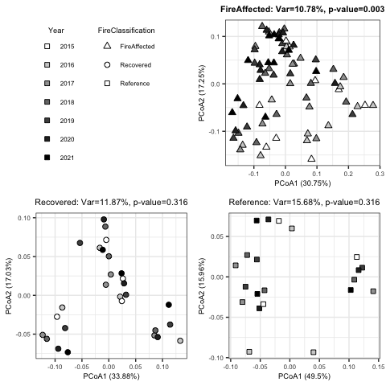<!-- -->

``` r
ggsave(classly.wUF_fireclass.plot, file="/Users/sambarnett/Documents/Shade_lab/Centralia_project/Multi_year_project/Analysis/Manuscript_figures/Fig_S4.tiff",
       device="tiff", width=5, height=5, units="in", bg="white")
```

### Multivariate homogeneity of groups dispersions

Does the dispersion of the groups (fire classifications) differ? This
may be one of the underylying causes of betadiversity variation across
groups. It does appear so in the ordinations as fire affected sites seem
to be more dispersed than either recovered or reference sites. Lets see
if that is statistically relevant.

``` r
batadisp.groups = factor(sample_data(rare.physeq)$FireClassification)

betadisper.res = betadisper(wUF.dist, batadisp.groups)
betadisper.res
```

    ## 
    ##  Homogeneity of multivariate dispersions
    ## 
    ## Call: betadisper(d = wUF.dist, group = batadisp.groups)
    ## 
    ## No. of Positive Eigenvalues: 83
    ## No. of Negative Eigenvalues: 40
    ## 
    ## Average distance to median:
    ## FireAffected    Recovered    Reference 
    ##      0.14998      0.09583      0.09175 
    ## 
    ## Eigenvalues for PCoA axes:
    ## (Showing 8 of 123 eigenvalues)
    ##   PCoA1   PCoA2   PCoA3   PCoA4   PCoA5   PCoA6   PCoA7   PCoA8 
    ## 0.67930 0.55146 0.23293 0.20160 0.14997 0.12797 0.09760 0.07417

``` r
anova(betadisper.res)
```

    ## Analysis of Variance Table
    ## 
    ## Response: Distances
    ##            Df   Sum Sq  Mean Sq F value   Pr(>F)    
    ## Groups      2 0.092801 0.046401  34.722 1.21e-12 ***
    ## Residuals 121 0.161699 0.001336                     
    ## ---
    ## Signif. codes:  0 '***' 0.001 '**' 0.01 '*' 0.05 '.' 0.1 ' ' 1

``` r
betadisper.HSD <- TukeyHSD(betadisper.res)
betadisper.HSD
```

    ##   Tukey multiple comparisons of means
    ##     95% family-wise confidence level
    ## 
    ## Fit: aov(formula = distances ~ group, data = df)
    ## 
    ## $group
    ##                                diff         lwr         upr     p adj
    ## Recovered-FireAffected -0.054148296 -0.07335928 -0.03493732 0.0000000
    ## Reference-FireAffected -0.058229330 -0.07964521 -0.03681345 0.0000000
    ## Reference-Recovered    -0.004081035 -0.02912193  0.02095987 0.9209299

``` r
write.table(betadisper.HSD$group, file="/Users/sambarnett/Documents/Shade_lab/Centralia_project/Multi_year_project/Analysis/Raw_tables/Whole_wUF_betadispersion.txt", 
            sep="\t", quote = FALSE, row.names = TRUE)
```

## CCA analysis

Now lets see how the betadiversity variation is related to various soil
properties. For the properties, I’ll test soil temp, CO2, pH, phosphate,
potassium, calcium, magnesium, iron, SOM, Nitrate, ammonium, sulfate,
and arsenic. Note that it is likely that many of these covary. For this
again I will use weighted UniFrac.

``` r
var_goodnames = data.frame(labels = c("CoreTemp_C", "Ca_ppm", "Fe_ppm", "NO3N_ppm",
                                      "Mg_ppm", "OrganicMatter_360", "pH", "P_ppm",
                                      "CarbonDioxide_ppm", "NH4N_ppm", "K_ppm", "As_ppm"),
                           goodnames = c("Temp.", "Ca", "Fe", "NO3", "Mg", "SOM", 
                                         "pH", "P", "CO2", "NH4", "K", "As"))

set.seed(4242)
cap_ord.full <- ordinate(physeq = rare.physeq, method = "CAP", distance = wUF.dist, 
                    formula = ~ CoreTemp_C + pH + CarbonDioxide_ppm + OrganicMatter_360 +
                      P_ppm + K_ppm + Ca_ppm + Mg_ppm + Fe_ppm + NO3N_ppm + NH4N_ppm + 
                      SulfateSulfur_ppm + As_ppm)

set.seed(4242)
cap_ord.null <- ordinate(physeq = rare.physeq, method = "CAP", distance = wUF.dist, 
                         formula = ~ 1)

# Model selection to get just significant variables
set.seed(4242)
ordistep.res = ordistep(cap_ord.null, scope = formula(cap_ord.full), perm.max = 1000, trace=F)
goodform = ordistep.res$call$formula
set.seed(4242)
cap_ord <- ordinate(physeq = rare.physeq, method = "CAP", distance = wUF.dist, formula = goodform)

# CAP plot
cap.ord.df = data.frame(vegan::scores(cap_ord, display="sites")) %>%
  tibble::rownames_to_column(var="SampleID") %>%
  select(SampleID, CAP1, CAP2) %>%
  left_join(sample_data(rare.physeq), by = "SampleID") %>%
  arrange(Year) %>%
  group_by(SiteID) %>%
  mutate(YearRank = row_number()) %>%
  ungroup %>%
  mutate(AirTemperature_C = as.numeric(AirTemperature_C)) %>%
  mutate(diff_temp = CoreTemp_C-AirTemperature_C)

eigvec = vegan::eigenvals(cap_ord)
fracvar = round(eigvec/sum(eigvec)*100, 2)

cap_plot = ggplot(data=cap.ord.df, aes(x=CAP1, y=CAP2)) +
  geom_point(aes(fill=Year, shape=FireClassification), size=2) +
  scale_shape_manual(values=c("FireAffected" = 24, "Recovered" = 21, "Reference" = 22)) +
  scale_fill_gradient(low="white", high="black") +
  labs(x=paste("CAP1 (", fracvar[1], "%)", sep=""),
       y=paste("CAP2 (", fracvar[2], "%)", sep=""))

# Now add the environmental variables as arrows
arrowmat <- vegan::scores(cap_ord, display = "bp")

# Add labels, make a data.frame
arrowdf <- data.frame(labels = rownames(arrowmat), arrowmat) %>%
  mutate(labels = gsub("\\.", ":", labels))
colnames(arrowdf) = c("labels", "xend", "yend")
arrowdf = arrowdf %>%
  left_join(var_goodnames, by = "labels") %>%
  rename(old_labels = labels) %>%
  rename(labels = goodnames)

# Define the arrow aesthetic mapping
arrow_map <- aes(xend = xend, yend = yend, x = 0, y = 0, 
                 color = NULL)

label_map <- aes(x = xend + 0.02*xend/abs(xend), y = yend, 
                 color = NULL, label = labels)

arrowhead = arrow(length = unit(0.02, "npc"), type = "closed")

# Make a new graphic
cap.plot = cap_plot + 
  geom_segment(mapping = arrow_map, size = 1.2, data = arrowdf, color = "black", arrow = arrowhead) + 
  geom_segment(mapping = arrow_map, size = 0.5, data = arrowdf, color = "orange", arrow = arrowhead) + 
  geom_label(mapping = label_map, data = filter(arrowdf, xend < 0), show.legend = FALSE, size=6*5/14, hjust=1, fill="orange", color="black") +
  geom_label(mapping = label_map, data = filter(arrowdf, xend > 0), show.legend = FALSE, size=6*5/14, hjust=0, fill="orange", color="black") +
  labs(title = paste("Variables explain ", round(100*RsquareAdj(cap_ord)$r.squared, 3), "% of whole community variation", sep="")) +
  basic_theme +
  theme(legend.position="bottom",
        legend.direction = "vertical") +
  guides(shape = guide_legend(order = 1),
         fill = guide_legend(order = 2, override.aes=list(shape=22), ncol=2))
cap.plot
```

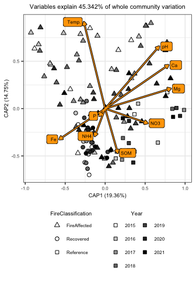<!-- -->

``` r
saveRDS(cap.plot, file="/Users/sambarnett/Documents/Shade_lab/Centralia_project/Multi_year_project/Analysis/Raw_figures/Fig_S7A.RDS")
```

## Time lag analysis

To see if the communities are significantly changing in composition over
time. We expect more distant timepoints to be more distant in
composition. I’ll use weighted UniFrac here.

``` r
# Metadata for both samples
SamID_1.meta = data.frame(sample_data(rare.physeq)) %>%
  select(SampleID, SiteID, Year, FireClassification, CoreTemp_C, pH) %>%
  rename(SampleID_1 = SampleID, SiteID_1 = SiteID, Year_1 = Year, 
         FireClassification_1 = FireClassification, 
         CoreTemp_C_1 = CoreTemp_C, pH_1 = pH)

SamID_2.meta = data.frame(sample_data(rare.physeq)) %>%
  select(SampleID, SiteID, Year, FireClassification, CoreTemp_C, pH) %>%
  rename(SampleID_2 = SampleID, SiteID_2 = SiteID, Year_2 = Year, 
         FireClassification_2 = FireClassification, 
         CoreTemp_C_2 = CoreTemp_C, pH_2 = pH)

# Get paired community distances
wUF.dist.mat = as.matrix(wUF.dist)
wUF.dist.mat[upper.tri(wUF.dist.mat, diag=TRUE)] = NA
time.wUF.dist.df = data.frame(wUF.dist.mat) %>%
  tibble::rownames_to_column(var="SampleID_1") %>%
  tidyr::gather(key="SampleID_2", value="wUF", -SampleID_1) %>%
  filter(!is.na(wUF)) %>%
  left_join(SamID_1.meta, by= "SampleID_1") %>%
  left_join(SamID_2.meta, by= "SampleID_2") %>%
  filter(Year_1 != Year_2,
         SiteID_1 == SiteID_2) %>%
  mutate(delta_year = abs(Year_1 - Year_2),
         delta_temp = abs(CoreTemp_C_1-CoreTemp_C_2),
         delta_pH = abs(pH_1-pH_2)) %>%
  mutate(sqrt_delta_year = sqrt(delta_year))

# Linear regressions
timelag.model.df = data.frame()
for (FC in c("FireAffected", "Recovered", "Reference")){
  ctrl <- lmeControl(opt='optim')
  FC_timelag.model = lme(wUF ~ sqrt_delta_year, random = ~1|SiteID_1, control=ctrl,
                         data=filter(time.wUF.dist.df, FireClassification_1 == FC))
  timelag.model.df = rbind(timelag.model.df,
                              data.frame(summary(FC_timelag.model)$tTable) %>%
                                tibble::rownames_to_column(var="factor") %>%
                                mutate(FireClassification_1 = FC))
}

write.table(timelag.model.df, file="/Users/sambarnett/Documents/Shade_lab/Centralia_project/Multi_year_project/Analysis/Raw_tables/Whole_time_lag_LME.txt", 
            sep="\t", quote = FALSE, row.names = FALSE)


timelag.model.reg = timelag.model.df %>%
  mutate(p_slope = ifelse(factor == "sqrt_delta_year", p.value, 1),
         factor = ifelse(factor == "(Intercept)", "Intercept", factor)) %>%
  group_by(FireClassification_1) %>%
  mutate(p_slope = min(p_slope)) %>%
  ungroup %>%
  select(factor, Value, p_slope, FireClassification_1) %>%
  tidyr::spread(key=factor, value = Value) %>%
  mutate(sig = ifelse(p_slope < 0.05, "< 0.05", "≥ 0.05"))

timelag.plot = ggplot(data=time.wUF.dist.df, aes(x=sqrt_delta_year, y=wUF)) +
  geom_point(size=2, aes(fill=SiteID_1, shape=FireClassification_1)) +
  geom_abline(data=timelag.model.reg, aes(intercept = Intercept, slope = sqrt_delta_year), linetype = 1, size=2, color="black") +
  geom_abline(data=timelag.model.reg, aes(intercept = Intercept, slope = sqrt_delta_year, linetype = sig), size=1, color="white") +
  scale_linetype_manual(values=c("< 0.05" = 1, "≥ 0.05" = 2)) +
  scale_shape_manual(values=c("FireAffected" = 24, "Recovered" = 21, "Reference" = 22)) +
  scale_fill_manual(values=site.col) +
  labs(x="Square root of the difference in years", y="Weighted UniFrac distance", 
       linetype="Regression\nslope p-value", fill="SiteID", shape="Fire Classification") +
  facet_grid(~FireClassification_1, scales = "free_y", switch="y") +
  basic_theme +
  guides(linetype=guide_legend(override.aes=list(color="black")),
         fill=guide_legend(ncol=2, override.aes=list(shape=site.shape)))
timelag.plot
```

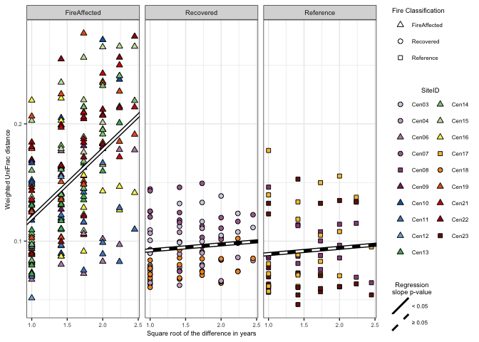<!-- -->

``` r
saveRDS(timelag.plot, file="/Users/sambarnett/Documents/Shade_lab/Centralia_project/Multi_year_project/Analysis/Raw_figures/Fig_2A.RDS")
```

``` r
timelag.sep.df = data.frame()
for (SiteID in unique(time.wUF.dist.df$SiteID_1)){
  sub.model = lm(wUF ~ sqrt_delta_year, filter(time.wUF.dist.df, SiteID_1 == SiteID))
  timelag.sep.df = rbind(timelag.sep.df,
                         data.frame(Intercept = summary(sub.model)$coefficients[1],
                                    slope = summary(sub.model)$coefficients[2],
                                    p_slope = summary(sub.model)$coefficients[8]) %>%
                           mutate(SiteID = SiteID))
}
timelag.meta.df = data.frame(sample_data(rare.physeq)) %>%
  group_by(SiteID, FireClassification) %>%
  summarize(min_temp = min(CoreTemp_C),
            max_temp = max(CoreTemp_C),
            mean_pH = mean(pH),
            n_year = n()) %>%
  ungroup %>%
  mutate(delta_temp = max_temp-min_temp,
         FireClassification_1 = FireClassification) %>%
  mutate(testemp = delta_temp/max_temp)
```

    ## `summarise()` has grouped output by 'SiteID'. You can override using the
    ## `.groups` argument.

``` r
timelag.sep.df = left_join(timelag.sep.df, timelag.meta.df, by = "SiteID") %>%
  mutate(sig = ifelse(p_slope < 0.05, "< 0.05", "≥ 0.05"))

## Compare slopes and maximum temperature
maxtempslope.model = lm(slope ~ max_temp, data=timelag.sep.df)
summary(maxtempslope.model)
```

    ## 
    ## Call:
    ## lm(formula = slope ~ max_temp, data = timelag.sep.df)
    ## 
    ## Residuals:
    ##       Min        1Q    Median        3Q       Max 
    ## -0.031219 -0.014476 -0.001800  0.009675  0.039495 
    ## 
    ## Coefficients:
    ##               Estimate Std. Error t value Pr(>|t|)    
    ## (Intercept) -0.0392199  0.0134313   -2.92  0.00955 ** 
    ## max_temp     0.0028372  0.0004599    6.17 1.03e-05 ***
    ## ---
    ## Signif. codes:  0 '***' 0.001 '**' 0.01 '*' 0.05 '.' 0.1 ' ' 1
    ## 
    ## Residual standard error: 0.02004 on 17 degrees of freedom
    ## Multiple R-squared:  0.6913, Adjusted R-squared:  0.6731 
    ## F-statistic: 38.06 on 1 and 17 DF,  p-value: 1.029e-05

``` r
timelag_slope_temp.plot = ggplot(data=timelag.sep.df, aes(x=max_temp, y=slope)) +
  geom_point(size=2, aes(fill=SiteID, shape=FireClassification)) +
  geom_abline(intercept = summary(maxtempslope.model)$coefficients[[1]], 
              slope = summary(maxtempslope.model)$coefficients[[2]], 
              linetype = 1, size=2, color="black") +
  geom_abline(intercept = summary(maxtempslope.model)$coefficients[[1]], 
              slope = summary(maxtempslope.model)$coefficients[[2]], 
              linetype = 1, size=1, color="white") +
  scale_shape_manual(values=c("FireAffected" = 24, "Recovered" = 21, "Reference" = 22)) +
  scale_fill_manual(values=site.col) +
  labs(x="Maximum temperature (˚C)", y="Time lag slope", fill="SiteID") +
  basic_theme +
  theme(legend.position = "none")
timelag_slope_temp.plot
```

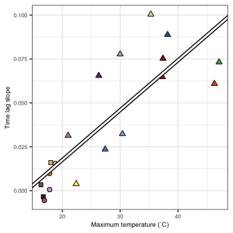<!-- -->

``` r
saveRDS(timelag_slope_temp.plot, file="/Users/sambarnett/Documents/Shade_lab/Centralia_project/Multi_year_project/Analysis/Raw_figures/Fig_2C.RDS")
```

## Trajectory analysis

Now we want to see if the communities are changing directionally over
time which would potentially indicate a change in state. For this we’ll
just use wighted UniFrac.

``` r
# Metadata for both samples
SiteID_1.meta = data.frame(sample_data(rare.physeq)) %>%
  group_by(SiteID, FireClassification) %>%
  summarize(mean_pH_1 = mean(pH),
            sd_pH_1 = sd(pH),
            n_year_1 = n(),
            max_temp_1 = max(CoreTemp_C),
            min_temp_1 = min(CoreTemp_C)) %>%
  ungroup %>%
  rename(SiteID_1 = SiteID,
         FireClassification_1 = FireClassification)
```

    ## `summarise()` has grouped output by 'SiteID'. You can override using the
    ## `.groups` argument.

``` r
SiteID_2.meta = data.frame(sample_data(rare.physeq)) %>%
  group_by(SiteID, FireClassification) %>%
  summarize(mean_pH_2 = mean(pH),
            sd_pH_2 = sd(pH),
            n_year_2 = n(),
            max_temp_2 = max(CoreTemp_C),
            min_temp_2 = min(CoreTemp_C)) %>%
  ungroup %>%
  rename(SiteID_2 = SiteID,
         FireClassification_2 = FireClassification)
```

    ## `summarise()` has grouped output by 'SiteID'. You can override using the
    ## `.groups` argument.

``` r
# data for analysis
D = as.matrix(wUF.dist)
All.samples.meta = data.frame(sample_data(rare.physeq)) %>%
  arrange(SiteID, Year) %>%
  group_by(survey = Year-2014)
D = D[All.samples.meta$SampleID, All.samples.meta$SampleID] %>%
  as.dist()
sites = All.samples.meta$SiteID
surveys = All.samples.meta$survey

# Trajectory directionality
traj.direct.df = data.frame(directionality = trajectoryDirectionality(D, sites, surveys)) %>%
  tibble::rownames_to_column(var="SiteID_1") %>%
  left_join(SiteID_1.meta, by = "SiteID_1") %>%
  mutate(delta_temp = max_temp_1-min_temp_1)
```

First look at directionaitiy across fire classifications

``` r
traj.direct.dunn = dunn.test::dunn.test(traj.direct.df$directionality, traj.direct.df$FireClassification_1, method="bh")
```

    ##   Kruskal-Wallis rank sum test
    ## 
    ## data: x and group
    ## Kruskal-Wallis chi-squared = 9.0447, df = 2, p-value = 0.01
    ## 
    ## 
    ##                            Comparison of x by group                            
    ##                              (Benjamini-Hochberg)                              
    ## Col Mean-|
    ## Row Mean |   FireAffe   Recovere
    ## ---------+----------------------
    ## Recovere |   2.128905
    ##          |    0.0249*
    ##          |
    ## Referenc |   2.546514   0.542896
    ##          |    0.0163*     0.2936
    ## 
    ## alpha = 0.05
    ## Reject Ho if p <= alpha/2

Next look at directionality over maximum disturbance intensity

``` r
traj_max_temp.model = lm(directionality~max_temp_1, data=traj.direct.df)
summary(traj_max_temp.model)
```

    ## 
    ## Call:
    ## lm(formula = directionality ~ max_temp_1, data = traj.direct.df)
    ## 
    ## Residuals:
    ##       Min        1Q    Median        3Q       Max 
    ## -0.057846 -0.024478  0.003471  0.011928  0.063365 
    ## 
    ## Coefficients:
    ##             Estimate Std. Error t value Pr(>|t|)    
    ## (Intercept) 0.276448   0.024095   11.47 1.99e-09 ***
    ## max_temp_1  0.003927   0.000825    4.76 0.000182 ***
    ## ---
    ## Signif. codes:  0 '***' 0.001 '**' 0.01 '*' 0.05 '.' 0.1 ' ' 1
    ## 
    ## Residual standard error: 0.03596 on 17 degrees of freedom
    ## Multiple R-squared:  0.5713, Adjusted R-squared:  0.5461 
    ## F-statistic: 22.66 on 1 and 17 DF,  p-value: 0.0001816

Now plot these results

``` r
# Across fire class
traj.direct.plot = ggplot(data=traj.direct.df, aes(x=FireClassification_1, y=directionality)) +
  geom_boxplot(outlier.shape = NA) +
  geom_jitter(height=0, width=0.25, size=2, aes(shape=FireClassification_1, fill=SiteID_1)) +
  annotate("segment", x=c(1, 1), xend=c(2, 3), y=c(0.49, 0.51), yend=c(0.49, 0.51)) +
  annotate("segment", x=c(1, 1, 2, 3), xend=c(1, 1, 2, 3), y=c(0.485, 0.505, 0.485, 0.505), yend=c(0.49, 0.51, 0.49, 0.51)) +
  annotate("text", x=c(1.5, 2), y=c(0.5, 0.52), size=6*5/14,
           label=c(paste("p=", round(traj.direct.dunn$P.adjusted[1], digits = 3), sep=""), 
                   paste("p=", round(traj.direct.dunn$P.adjusted[2], digits = 3), sep=""))) +
  scale_shape_manual(values=c("FireAffected" = 24, "Recovered" = 21, "Reference" = 22)) +
  scale_fill_manual(values=site.col) +
  lims(y=c(0.30, 0.52)) +
  labs(x = "Fire Classification", y = "Whole community\ntrajectory directionality") +
  basic_theme +
  theme(legend.position = "none")

# Across disturbance intensity
traj_max_temp.plot = ggplot(data=traj.direct.df, aes(x=max_temp_1, y=directionality)) +
  geom_point(aes(shape=FireClassification_1, fill=SiteID_1), size=2) +
  geom_abline(intercept = summary(traj_max_temp.model)$coefficients[[1]], 
              slope = summary(traj_max_temp.model)$coefficients[[2]], 
              linetype = 1, size=2, color="black") +
  geom_abline(intercept = summary(traj_max_temp.model)$coefficients[[1]], 
              slope = summary(traj_max_temp.model)$coefficients[[2]], 
              linetype = 1, size=1, color="white") +
  scale_shape_manual(values=c("FireAffected" = 24, "Recovered" = 21, "Reference" = 22)) +
  scale_fill_manual(values=site.col) +
  lims(y=c(0.30, 0.52)) +
  labs(x="Maximum soil temperature (˚C)", y="Whole community\ntrajectory directionality") +
  basic_theme +
  theme(legend.position = "none")

trajectory_full.plot = cowplot::plot_grid(traj.direct.plot, traj_max_temp.plot, 
                                          ncol=1, labels = c("A", "C"), label_size = 8)
trajectory_full.plot
```

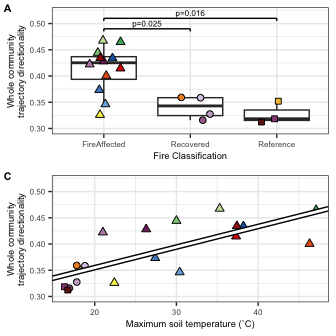<!-- -->

``` r
saveRDS(trajectory_full.plot, file="/Users/sambarnett/Documents/Shade_lab/Centralia_project/Multi_year_project/Analysis/Raw_figures/Fig_3AC.RDS")
```

# Community distances to reference over time and disturbance intensity

Unfortunately, our sampling design precludes us from directly measuring
resiliance and resistance. Instead lets take a look at how the bacterial
communities in the fire affected or recovered soils differ from
reference communities across time and disturbance intensity.

First we need a dataframe of paired sample distance/dissimilarity
measures and metadata with average measures across reference sites.
These will be disturbed sites paired with reference sites within the
same year. We also need average distances among reference sites.

``` r
# Metadata dataframe
Reference.meta = data.frame(sample_data(rare.physeq)) %>%
  filter(NucAcid_type == "DNA", FireClassification == "Reference") %>%
  select(SampleID, Year) %>%
  rename(Reference_sample = SampleID)
Disturbed.meta = data.frame(sample_data(rare.physeq)) %>%
  filter(NucAcid_type == "DNA", FireClassification != "Reference") %>%
  rename(Disturbed_sample = SampleID)

# Distance and dissimilarity Dataframe for disturbed soils
Disturbed_Dist.df = data.frame(as.matrix(wUF.dist)) %>%
  tibble::rownames_to_column(var="Disturbed_sample") %>%
  tidyr::gather(key="Reference_sample", value="wUF", -Disturbed_sample) %>%
  filter(!is.na(wUF)) %>%
  inner_join(Disturbed.meta, by = "Disturbed_sample") %>%
  inner_join(Reference.meta, by = c("Reference_sample", "Year")) %>%
  group_by(Disturbed_sample) %>%
  summarize(mean_wUF = mean(wUF),
            sd_wUF = sd(wUF),
            n_comp = n()) %>%
  ungroup %>%
  mutate(SE_wUF = sd_wUF/sqrt(n_comp)) %>%
  left_join(Disturbed.meta, by = "Disturbed_sample")
  
# Distance and dissimilarity Dataframe for reference soils
wUF.dist.mat = as.matrix(wUF.dist)
wUF.dist.mat[upper.tri(wUF.dist.mat, diag = TRUE)] = NA
Reference_Dist.df = data.frame(wUF.dist.mat) %>%
  tibble::rownames_to_column(var="Reference_sample1") %>%
  tidyr::gather(key="Reference_sample2", value="wUF", -Reference_sample1) %>%
  filter(!is.na(wUF)) %>%
  inner_join(rename(Reference.meta, Reference_sample1 = Reference_sample), 
             by = c("Reference_sample1")) %>%
  inner_join(rename(Reference.meta, Reference_sample2 = Reference_sample), 
             by = c("Reference_sample2", "Year"))
```

Now lets plot the distances/dissimilarites over temperature

``` r
# Weighted UniFrac
wUF_by_temp.model = lme(mean_wUF ~ CoreTemp_C, random = ~1|SiteID, data=Disturbed_Dist.df)
wUF_by_temp.model.sum = summary(wUF_by_temp.model)$tTable
wUF_by_temp.model.sum
```

    ##                   Value    Std.Error DF   t-value      p-value
    ## (Intercept) 0.120968248 0.0120740324 86 10.018877 4.170111e-16
    ## CoreTemp_C  0.003694784 0.0004590357 86  8.049014 4.210888e-12

``` r
wUF_by_temp.plot = ggplot(data=Disturbed_Dist.df, aes(x=CoreTemp_C, y=mean_wUF)) +
  geom_hline(yintercept = Reference_Dist.df$wUF, color="grey", linetype=2) +
  geom_errorbar(aes(ymin=mean_wUF-SE_wUF, ymax=mean_wUF+SE_wUF), color="black", size=1, width=0) +
  geom_errorbar(aes(ymin=mean_wUF-SE_wUF, ymax=mean_wUF+SE_wUF, color=SiteID), size=0.5, width=0) +
  geom_point(size=2, aes(fill=SiteID, shape=FireClassification)) +
  geom_abline(slope=wUF_by_temp.model.sum[2], intercept = wUF_by_temp.model.sum[1], size=1, color="black") +
  geom_abline(slope=wUF_by_temp.model.sum[2], intercept = wUF_by_temp.model.sum[1], size=0.5, color="white") +
  #scale_linetype_manual(values=c("< 0.05" = 1, "≥ 0.05" = 2)) +
  scale_shape_manual(values=FC.shape) +
  scale_fill_manual(values=site.col) +
  scale_color_manual(values=site.col) +
  labs(x="Soil temperature (˚C)", y="Mean weighted UniFrac distance to references", linetype="Regression\nslope p-value") +
  lims(y=c(0, 0.4)) +
  basic_theme +
  theme(legend.position = "none")


wUF_by_temp.plot
```

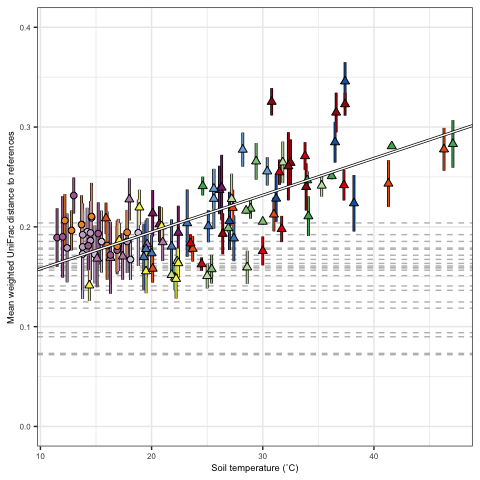<!-- -->

Now lets plot the distances/dissimilarities over time

``` r
# Linear regressions
wUF_by_time.model.df = data.frame()
for (FC in c("FireAffected", "Recovered")){
  ctrl <- lmeControl(opt='optim')
  FC_wUF_by_time.model = lme(mean_wUF ~ Year, random = ~1|SiteID, 
                             data=filter(Disturbed_Dist.df, FireClassification == FC))
  wUF_by_time.model.df = rbind(wUF_by_time.model.df,
                               data.frame(summary(FC_wUF_by_time.model)$tTable) %>%
                                 tibble::rownames_to_column(var="factor") %>%
                                 mutate(FireClassification = FC))
}

wUF_by_time.model.reg = wUF_by_time.model.df %>%
  mutate(p_slope = ifelse(factor == "Year", p.value, 1),
         factor = ifelse(factor == "(Intercept)", "Intercept", factor)) %>%
  group_by(FireClassification) %>%
  mutate(p_slope = min(p_slope)) %>%
  ungroup %>%
  select(factor, Value, p_slope, FireClassification) %>%
  tidyr::spread(key=factor, value = Value) %>%
  mutate(sig = ifelse(p_slope < 0.05, "< 0.05", "≥ 0.05"))


wUF_by_time.plot = ggplot(data=Disturbed_Dist.df, aes(x=Year, y=mean_wUF)) +
  geom_hline(yintercept = Reference_Dist.df$wUF, color="grey", linetype=2) +
  geom_errorbar(aes(ymin=mean_wUF-SE_wUF, ymax=mean_wUF+SE_wUF), color="black", size=1, width=0) +
  geom_errorbar(aes(ymin=mean_wUF-SE_wUF, ymax=mean_wUF+SE_wUF, color=SiteID), size=0.5, width=0) +
  geom_point(size=2, aes(fill=SiteID, shape=FireClassification)) +
  geom_abline(data=wUF_by_time.model.reg, aes(intercept = Intercept, slope = Year), linetype = 1, size=1, color="black") +
  geom_abline(data=wUF_by_time.model.reg, aes(intercept = Intercept, slope = Year, linetype = sig), size=0.5, color="white") +
  scale_linetype_manual(values=c("< 0.05" = 1, "≥ 0.05" = 2)) +
  scale_shape_manual(values=FC.shape) +
  scale_fill_manual(values=site.col) +
  labs(x="Year", y="Mean weighted UniFrac distance to references", linetype="Regression\nslope p-value") +
  lims(y=c(0, 0.4)) +
  basic_theme +
  theme(legend.position = "none") +
  facet_wrap(~FireClassification)


wUF_by_time.plot
```

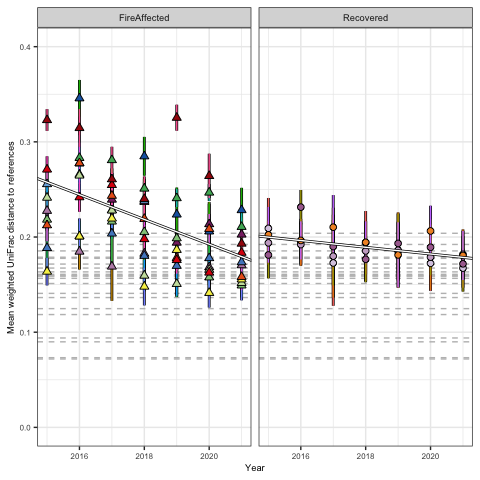<!-- -->

Now plot the two together

``` r
wUF_to_ref.plot = cowplot::plot_grid(wUF_by_temp.plot + theme(legend.position = "none"), 
                                     wUF_by_time.plot + theme(legend.position = "none", 
                                                              axis.title.y=element_blank()),
                                     nrow=1, rel_widths = c(1,1), axis = "tb", align="h",
                                     labels = c("A", "B"), label_size = 8)
wUF_to_ref.plot
```

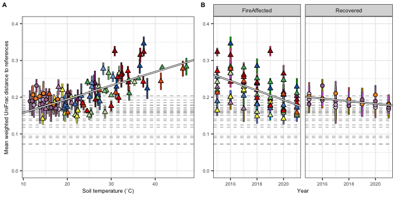<!-- -->

``` r
saveRDS(wUF_to_ref.plot, file="/Users/sambarnett/Documents/Shade_lab/Centralia_project/Multi_year_project/Analysis/Raw_figures/Fig_4AB.RDS")
```

``` r
wUF_to_ref_tall.plot = cowplot::plot_grid(wUF_by_time.plot + labs(y="Whole community\nmean weighted UniFrac\ndistance to references") + theme(legend.position = "none"), 
                                          wUF_by_temp.plot + labs(y="Whole community\nmean weighted UniFrac\ndistance to references") + theme(legend.position = "none"),
                                          nrow=2, labels = c("E", "G"), label_size = 8)
wUF_to_ref_tall.plot
```

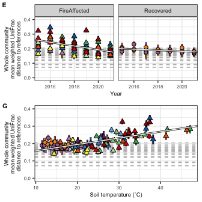<!-- -->

``` r
saveRDS(wUF_to_ref_tall.plot, file="/Users/sambarnett/Documents/Shade_lab/Centralia_project/Multi_year_project/Analysis/Raw_figures/Fig_3EG.RDS")
```

# Session Info

``` r
sessionInfo()
```

    ## R version 4.2.2 (2022-10-31)
    ## Platform: aarch64-apple-darwin20 (64-bit)
    ## Running under: macOS Ventura 13.0.1
    ## 
    ## Matrix products: default
    ## BLAS:   /Library/Frameworks/R.framework/Versions/4.2-arm64/Resources/lib/libRblas.0.dylib
    ## LAPACK: /Library/Frameworks/R.framework/Versions/4.2-arm64/Resources/lib/libRlapack.dylib
    ## 
    ## locale:
    ## [1] en_US.UTF-8/en_US.UTF-8/en_US.UTF-8/C/en_US.UTF-8/en_US.UTF-8
    ## 
    ## attached base packages:
    ## [1] grid      stats     graphics  grDevices utils     datasets  methods  
    ## [8] base     
    ## 
    ## other attached packages:
    ##  [1] gridExtra_2.3   eulerr_6.1.1    ggplot2_3.4.4   ecotraj_0.0.3  
    ##  [5] Rcpp_1.0.10     picante_1.8.2   nlme_3.1-160    vegan_2.6-4    
    ##  [9] lattice_0.20-45 permute_0.9-7   readxl_1.4.1    ape_5.6-2      
    ## [13] phyloseq_1.42.0 dplyr_1.0.10   
    ## 
    ## loaded via a namespace (and not attached):
    ##  [1] Biobase_2.58.0         tidyr_1.3.0            jsonlite_1.8.3        
    ##  [4] splines_4.2.2          foreach_1.5.2          assertthat_0.2.1      
    ##  [7] highr_0.9              stats4_4.2.2           GenomeInfoDbData_1.2.9
    ## [10] cellranger_1.1.0       yaml_2.3.6             pillar_1.8.1          
    ## [13] glue_1.6.2             digest_0.6.30          polyclip_1.10-4       
    ## [16] XVector_0.38.0         colorspace_2.0-3       cowplot_1.1.1         
    ## [19] htmltools_0.5.3        Matrix_1.5-3           plyr_1.8.8            
    ## [22] pkgconfig_2.0.3        zlibbioc_1.44.0        purrr_1.0.1           
    ## [25] scales_1.2.1           tibble_3.1.8           mgcv_1.8-41           
    ## [28] generics_0.1.3         farver_2.1.1           IRanges_2.32.0        
    ## [31] withr_2.5.0            BiocGenerics_0.44.0    cli_3.4.1             
    ## [34] survival_3.4-0         magrittr_2.0.3         crayon_1.5.2          
    ## [37] evaluate_0.18          Kendall_2.2.1          fansi_1.0.3           
    ## [40] MASS_7.3-58.1          dunn.test_1.3.5        textshaping_0.3.6     
    ## [43] tools_4.2.2            data.table_1.14.4      lifecycle_1.0.3       
    ## [46] stringr_1.5.0          Rhdf5lib_1.20.0        S4Vectors_0.36.0      
    ## [49] munsell_0.5.0          cluster_2.1.4          Biostrings_2.66.0     
    ## [52] ade4_1.7-20            compiler_4.2.2         GenomeInfoDb_1.34.3   
    ## [55] systemfonts_1.0.4      rlang_1.1.0            rhdf5_2.42.0          
    ## [58] RCurl_1.98-1.9         iterators_1.0.14       rhdf5filters_1.10.0   
    ## [61] biomformat_1.26.0      rstudioapi_0.14        igraph_1.4.1          
    ## [64] bitops_1.0-7           labeling_0.4.2         rmarkdown_2.18        
    ## [67] boot_1.3-28            gtable_0.3.1           codetools_0.2-18      
    ## [70] multtest_2.54.0        DBI_1.1.3              reshape2_1.4.4        
    ## [73] R6_2.5.1               knitr_1.40             fastmap_1.1.0         
    ## [76] utf8_1.2.2             ragg_1.2.4             polylabelr_0.2.0      
    ## [79] stringi_1.7.8          parallel_4.2.2         vctrs_0.5.2           
    ## [82] tidyselect_1.2.0       xfun_0.34
