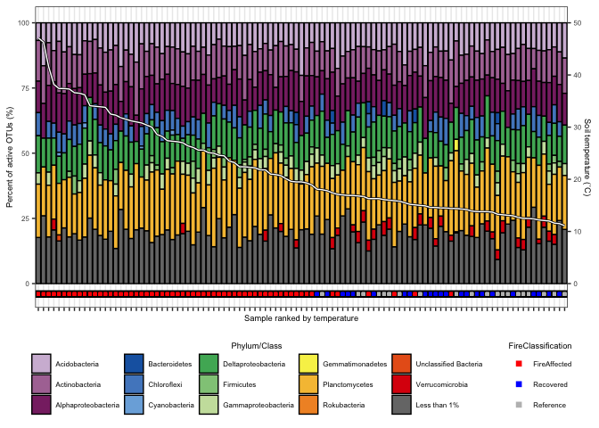
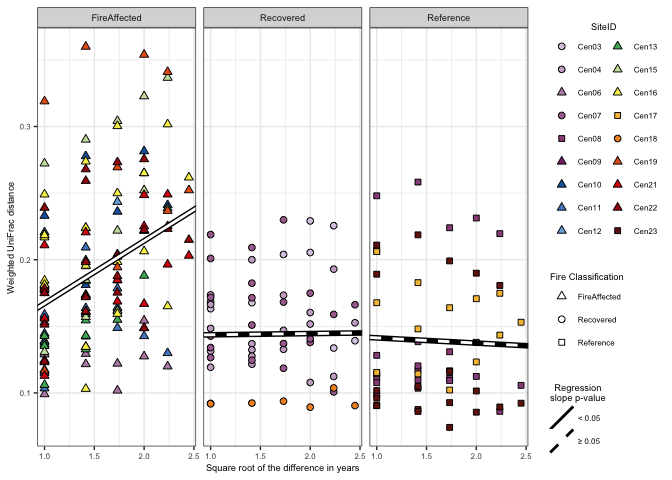

Centralia MultiYear RNA:DNA ratio analysis
================
Sam Barnett
19 December, 2023

-   [Introduction](#introduction)
    -   [Libraries](#libraries)
    -   [Data import](#data-import)
    -   [Rarefy dataset](#rarefy-dataset)
-   [Calculate DNA:RNA ratios](#calculate-dnarna-ratios)
-   [Examination of Phantom taxa](#examination-of-phantom-taxa)
-   [Alpha diversity](#alpha-diversity)
    -   [Over time](#over-time)
    -   [Over soil temperature](#over-soil-temperature)
-   [Taxonomy of active taxa](#taxonomy-of-active-taxa)
    -   [Phylum level diversity of active
        taxa](#phylum-level-diversity-of-active-taxa)
-   [Beta diversity](#beta-diversity)
    -   [Bray-Curtis](#bray-curtis)
    -   [Weighted UniFrac](#weighted-unifrac)
    -   [CCA analysis](#cca-analysis)
    -   [Time lag analysis](#time-lag-analysis)
    -   [Trajectory analysis](#trajectory-analysis)
-   [Community distances to reference over time and disturbance
    intensity](#community-distances-to-reference-over-time-and-disturbance-intensity)
    -   [Percent of Bray-Curtis dissimilarity due to
        active](#percent-of-bray-curtis-dissimilarity-due-to-active)
-   [UpSet plots](#upset-plots)
-   [Session info](#session-info)

# Introduction

This is the notebook for analysis of active community composition in the
7 year Centralia Study. We are looking to see how active bacteria vary
over time and fire effect. This notebook is specifically for the active
community and thus takes into account only samples with the RNA:DNA
(active taxa) data and includes the phantom taxa. We will be looking at
Alpha diversity, Beta diversity, and trajectory analysis here as well as
making some nice figures. These figures will be put together into
publication quality figs in a seprate notebook. Also the phyloseq that
is used here was also generated in a seprate notebook where
non-bacteria, chloroplasts, and mitochondria were removed.

## Libraries

``` r
# Libraries for data
library(dplyr)
```

    ## 
    ## Attaching package: 'dplyr'

    ## The following objects are masked from 'package:stats':
    ## 
    ##     filter, lag

    ## The following objects are masked from 'package:base':
    ## 
    ##     intersect, setdiff, setequal, union

``` r
library(phyloseq)
library(ape)
library(readxl)

# Libraries for analysis
library(vegan)
```

    ## Loading required package: permute

    ## Loading required package: lattice

    ## This is vegan 2.6-4

``` r
library(picante)
```

    ## Loading required package: nlme

    ## 
    ## Attaching package: 'nlme'

    ## The following object is masked from 'package:dplyr':
    ## 
    ##     collapse

``` r
library(ecotraj)
```

    ## Loading required package: Rcpp

``` r
# Libraries for plotting
library(ggplot2)
library(eulerr)
library(grid)
library(gridExtra)
```

    ## 
    ## Attaching package: 'gridExtra'

    ## The following object is masked from 'package:dplyr':
    ## 
    ##     combine

``` r
source("/Users/sambarnett/Documents/Misc_code/paul_tol_colors.R") # Colorblind friendly colors.

# Functon for extracting legends
g_legend<-function(a.gplot){
  tmp <- ggplot_gtable(ggplot_build(a.gplot))
  leg <- which(sapply(tmp$grobs, function(x) x$name) == "guide-box")
  legend <- tmp$grobs[[leg]]
  return(legend)} 


# Notable lists
site.list = c("Cen01", "Cen02", "Cen03", "Cen04", "Cen05", "Cen06", "Cen07",
              "Cen08", "Cen09", "Cen10", "Cen11", "Cen12", "Cen13", "Cen14",
              "Cen15", "Cen16", "Cen17", "Cen18", "Cen19", "Cen20", "Cen21",
              "Cen22", "Cen23")
used_sites = c("Cen03", "Cen04", "Cen06", "Cen07", "Cen08", "Cen09", "Cen10", 
               "Cen11", "Cen12", "Cen13", "Cen14", "Cen15", "Cen16", "Cen17", 
               "Cen18", "Cen19", "Cen21", "Cen22", "Cen23")

# Setting repeated plot aesthetics
site.col = paultol_colors(length(used_sites))
names(site.col) = used_sites
site.shape = c(21, 21, 24, 21, 22, 24, 24, 24, 24, 24, 24, 24, 24,
               22, 21, 24, 24, 24, 22)
names(site.shape) = used_sites
site.shape = site.shape[-11]
FC.shape = c("FireAffected" = 24, "Recovered" = 21, "Reference" = 22)


## Fire Classifications
FC.col = c("FireAffected" = "red", "Recovered" = "blue", "Reference" = "grey")

# Basic plotting theme so as not to continually repeat it
basic_theme = theme_bw() +
  theme(axis.text = element_text(size=6),
        axis.title = element_text(size=7),
        legend.text = element_text(size=6),
        legend.title = element_text(size=7, hjust=0.5),
        strip.text = element_text(size=7),
        plot.title = element_text(size=8, hjust=0.5))

present_theme = theme_bw() +
  theme(axis.text = element_text(size=10),
        axis.title = element_text(size=12),
        legend.text = element_text(size=10),
        legend.title = element_text(size=12, hjust=0.5),
        strip.text = element_text(size=10),
        plot.title = element_text(size=14, hjust=0.5))
```

## Data import

For this analysis we need to removes sample set from 2014 (not flash
frozen and extracted with MoBio kits not the Phenol-Chloroform method).
We also want to remove any sites that don’t have samples in less than 3
years for either DNA or RNA so that we can get an analysis using the
timeseries.

``` r
DNA_RNA.physeq = readRDS(file="/Users/sambarnett/Documents/Shade_lab/Centralia_project/Multi_year_project/Data/RNA_DNA_physeq.RDS")
DNA_RNA.physeq
```

    ## phyloseq-class experiment-level object
    ## otu_table()   OTU Table:         [ 67553 taxa and 309 samples ]
    ## sample_data() Sample Data:       [ 309 samples by 48 sample variables ]
    ## tax_table()   Taxonomy Table:    [ 67553 taxa by 7 taxonomic ranks ]
    ## phy_tree()    Phylogenetic Tree: [ 67553 tips and 67549 internal nodes ]

``` r
# Remove 2014 samples
DNA_RNA.physeq = subset_samples(DNA_RNA.physeq, Year != 2014)
DNA_RNA.physeq = prune_taxa(taxa_sums(DNA_RNA.physeq) > 0, DNA_RNA.physeq)
DNA_RNA.physeq
```

    ## phyloseq-class experiment-level object
    ## otu_table()   OTU Table:         [ 58033 taxa and 255 samples ]
    ## sample_data() Sample Data:       [ 255 samples by 48 sample variables ]
    ## tax_table()   Taxonomy Table:    [ 58033 taxa by 7 taxonomic ranks ]
    ## phy_tree()    Phylogenetic Tree: [ 58033 tips and 58029 internal nodes ]

``` r
# Filter Unmatched DNA samples
DNA_samples = filter(data.frame(sample_data(DNA_RNA.physeq)),
                     NucAcid_type == "DNA")$SampleID

RNA_samples = filter(data.frame(sample_data(DNA_RNA.physeq)),
                     NucAcid_type == "RNA")$SampleID

paired_samples = intersect(DNA_samples, RNA_samples)
DNA_samples = NULL
RNA_samples = NULL

DNA_RNA.physeq = subset_samples(DNA_RNA.physeq, SampleID %in% paired_samples)
DNA_RNA.physeq = prune_taxa(taxa_sums(DNA_RNA.physeq) > 0, DNA_RNA.physeq)
DNA_RNA.physeq
```

    ## phyloseq-class experiment-level object
    ## otu_table()   OTU Table:         [ 57887 taxa and 250 samples ]
    ## sample_data() Sample Data:       [ 250 samples by 48 sample variables ]
    ## tax_table()   Taxonomy Table:    [ 57887 taxa by 7 taxonomic ranks ]
    ## phy_tree()    Phylogenetic Tree: [ 57887 tips and 57883 internal nodes ]

``` r
# Filter samples with less than 100,000 RNA or DNA reads and sites with less than 3 years sampled
DNA_RNA_depths.df = data.frame(sample_data(DNA_RNA.physeq)) %>%
  select(SampleID, NucAcid_type, read_count) %>%
  mutate(NucAcid_type = paste(NucAcid_type, "depth", sep="_")) %>%
  tidyr::spread(key="NucAcid_type", value="read_count") %>%
  arrange(RNA_depth)

DNA_RNA.physeq = subset_samples(DNA_RNA.physeq, SampleID %in% filter(DNA_RNA_depths.df, RNA_depth > 100000 & DNA_depth > 100000)$SampleID)
DNA_RNA.physeq = prune_taxa(taxa_sums(DNA_RNA.physeq) > 0, DNA_RNA.physeq)
DNA_RNA.physeq
```

    ## phyloseq-class experiment-level object
    ## otu_table()   OTU Table:         [ 56722 taxa and 216 samples ]
    ## sample_data() Sample Data:       [ 216 samples by 48 sample variables ]
    ## tax_table()   Taxonomy Table:    [ 56722 taxa by 7 taxonomic ranks ]
    ## phy_tree()    Phylogenetic Tree: [ 56722 tips and 56718 internal nodes ]

``` r
# Remove sites not found in 3 or more years
N.years = data.frame(sample_data(DNA_RNA.physeq)) %>%
  select(SiteID, Year) %>%
  unique %>%
  group_by(SiteID) %>%
  summarize(n_year = n()) %>%
  ungroup %>%
  arrange(n_year)

DNA_RNA.physeq = subset_samples(DNA_RNA.physeq, SiteID %in% filter(N.years, n_year >= 3)$SiteID)
DNA_RNA.physeq = prune_taxa(taxa_sums(DNA_RNA.physeq) > 0, DNA_RNA.physeq)

DNA_RNA.physeq
```

    ## phyloseq-class experiment-level object
    ## otu_table()   OTU Table:         [ 56032 taxa and 206 samples ]
    ## sample_data() Sample Data:       [ 206 samples by 48 sample variables ]
    ## tax_table()   Taxonomy Table:    [ 56032 taxa by 7 taxonomic ranks ]
    ## phy_tree()    Phylogenetic Tree: [ 56032 tips and 56029 internal nodes ]

## Rarefy dataset

We will use rarefaction to normalize read counts to account for uneven
sequencing depth across samples and across DNA and RNA datasets.

``` r
min_depth = min(c(DNA_RNA_depths.df$DNA_depth, DNA_RNA_depths.df$RNA_depth))

# Make rarefaction curve
test.otu = t(otu_table(DNA_RNA.physeq))
class(test.otu) = "matrix"
```

    ## Warning in class(test.otu) = "matrix": Setting class(x) to "matrix" sets
    ## attribute to NULL; result will no longer be an S4 object

``` r
rarecurve.out = rarecurve(test.otu, step=10000)
```

<!-- -->

``` r
test.otu = NULL
names(rarecurve.out) <- rownames(sample_data(DNA_RNA.physeq))

# Coerce data into "long" form.
protox <- mapply(FUN = function(x, y) {
  mydf <- as.data.frame(x)
  colnames(mydf) <- "rare_count"
  mydf$SequenceID <- y
  mydf$Subsample_size <- attr(x, "Subsample")
  mydf
}, x = rarecurve.out, y = as.list(names(rarecurve.out)), SIMPLIFY = FALSE)

rarecurve.df = do.call(rbind, protox) %>%
  left_join(data.frame(sample_data(DNA_RNA.physeq)) %>%
              tibble::rownames_to_column(var="SequenceID"), by = "SequenceID")

# Plot
rarecurve.plot = ggplot(data=rarecurve.df, aes(x=Subsample_size, y=rare_count)) +
  geom_vline(xintercept = 161419, linetype=2) +
  geom_vline(xintercept = 101100, linetype=3) +
  geom_line(aes(group=SequenceID, color=NucAcid_type)) +
  scale_color_manual(values=c("DNA"="blue", "RNA"="red")) +
  labs(x="Rarefied read depth", y="OTU count", color="Nucleic\nacid type") +
  facet_wrap(~FireClassification, ncol=1) +
  basic_theme +
  theme(legend.position = c(0.75, 0.1))
rarecurve.plot
```

<!-- -->

``` r
ggsave(rarecurve.plot, file="/Users/sambarnett/Documents/Shade_lab/Centralia_project/Multi_year_project/Analysis/Manuscript_figures/Fig_S12.tiff",
       device="tiff", width=7, height=7, units="in", bg="white")
```

``` r
set.seed(4242)
rare.DNA_RNA.physeq = rarefy_even_depth(DNA_RNA.physeq)
```

    ## You set `rngseed` to FALSE. Make sure you've set & recorded
    ##  the random seed of your session for reproducibility.
    ## See `?set.seed`

    ## ...

    ## 5790OTUs were removed because they are no longer 
    ## present in any sample after random subsampling

    ## ...

``` r
DNA_RNA.physeq = NULL

rare.DNA_RNA.physeq
```

    ## phyloseq-class experiment-level object
    ## otu_table()   OTU Table:         [ 50242 taxa and 206 samples ]
    ## sample_data() Sample Data:       [ 206 samples by 48 sample variables ]
    ## tax_table()   Taxonomy Table:    [ 50242 taxa by 7 taxonomic ranks ]
    ## phy_tree()    Phylogenetic Tree: [ 50242 tips and 50239 internal nodes ]

``` r
raredepth = mean(colSums(otu_table(rare.DNA_RNA.physeq)))
print(paste(c("Rarefied to", raredepth)))
```

    ## [1] "Rarefied to" "100491"

# Calculate DNA:RNA ratios

Now that we have comparable data, lets get the RNA:DNA ratios for all
OTUs. For this analysis, we need to add 1 to all DNA counts where DNA
count is 0 and RNA count \> 0 (phantoms).

``` r
# Generate ratios
DNA_RNA_ratio.df = data.frame(otu_table(rare.DNA_RNA.physeq)) %>%
  tibble::rownames_to_column(var="OTU") %>%
  tidyr::gather(key="SequenceID", value="count", -OTU) %>%
  filter(count > 0) %>%
  left_join(data.frame(sample_data(rare.DNA_RNA.physeq)) %>%
              tibble::rownames_to_column(var="SequenceID") %>%
              select(SequenceID, SampleID, NucAcid_type),
            by="SequenceID") %>%
  select(-SequenceID) %>%
  tidyr::spread(key="NucAcid_type", value="count") %>%
  mutate(DNA = ifelse(is.na(DNA), 0, DNA),
         RNA = ifelse(is.na(RNA), 0, RNA)) %>%
  mutate(phantom = ifelse(DNA == 0 & RNA > 0, 1, 0),
         DNA_phan = ifelse(DNA == 0 & RNA > 0, 1, DNA)) %>%
  mutate(Ratio = RNA/DNA_phan)
```

# Examination of Phantom taxa

Now lets take a look at the phantom taxa, specifically how many there
are.

How many OTUs in total are found to be active at any point

``` r
total_OTU_n = length(unique(DNA_RNA_ratio.df$OTU))
active_OTU_n = length(unique(filter(DNA_RNA_ratio.df, Ratio >= 1)$OTU))

print(paste("Total OTU count:", total_OTU_n))
```

    ## [1] "Total OTU count: 50242"

``` r
print(paste("Active OTU count:", active_OTU_n))
```

    ## [1] "Active OTU count: 38020"

``` r
print(paste("Percent OTU active:", active_OTU_n/total_OTU_n*100))
```

    ## [1] "Percent OTU active: 75.6737391027427"

``` r
UnrareDNA_counts.df = readRDS(file="/Users/sambarnett/Documents/Shade_lab/Centralia_project/Multi_year_project/Data/RNA_DNA_physeq.RDS") %>%
  subset_samples(NucAcid_type == "DNA" & Year != 2014) %>%
  otu_table() %>%
  as.data.frame() %>%
  mutate(InDNA = Reduce(`+`, .)) %>%
  tibble::rownames_to_column(var="OTU") %>%
  filter(OTU %in% unique(DNA_RNA_ratio.df$OTU)) %>%
  tidyr::gather(key="SampleID", value="UnRare_DNA", -OTU, -InDNA)

Phantom.sum = DNA_RNA_ratio.df %>%
  left_join(UnrareDNA_counts.df, by=c("SampleID", "OTU")) %>%
  mutate(unrare_phantom = ifelse(RNA > 0 & UnRare_DNA == 0, 1, 0),
         fullDNA_phantom = ifelse(RNA > 0 & InDNA == 0, 1, 0),
         active = ifelse(Ratio >= 1, 1, 0)) %>%
  group_by(SampleID) %>%
  summarize(n_OTU = n(),
            n_active = sum(active),
            rare_phantom = sum(phantom),
            unrare_phantom = sum(unrare_phantom),
            fullDNA_phantom = sum(fullDNA_phantom)) %>%
  ungroup() %>%
  tidyr::gather(key="phantom_type", value = "n_phantoms", -SampleID, -n_OTU, -n_active) %>%
  mutate(perc_all_OTU = n_phantoms/n_OTU*100,
         perc_active_OTU = n_phantoms/n_active*100) %>%
  arrange(-perc_all_OTU) %>%
  group_by(phantom_type) %>%
  mutate(perc_all_OTU_rank = as.factor(row_number())) %>%
  ungroup %>%
  arrange(-perc_active_OTU) %>%
  group_by(phantom_type) %>%
  mutate(perc_active_OTU_rank = as.factor(row_number())) %>%
  ungroup %>%
  left_join(data.frame(sample_data(rare.DNA_RNA.physeq)) %>%
              filter(NucAcid_type == "DNA"), 
            by = "SampleID")

UnrareDNA_counts.df = NULL
```

Now plot the results

``` r
Phantom.sum.sum = Phantom.sum %>%
  group_by(phantom_type) %>%
  summarize(mean_perc = mean(perc_active_OTU),
            sd_perc = sd(perc_active_OTU),
            n_samples = n()) %>%
  ungroup() %>%
  mutate(SE_perc = sd_perc/sqrt(n_samples))

Phantom.labs = data.frame(phantom_type = c("rare_phantom", "unrare_phantom", "fullDNA_phantom"),
                          phantom_label = c("Phantoms in rarefied DNA dataset",
                                            "Phantoms in unrarefied DNA dataset",
                                            "Phantoms in entire DNA dataset")) %>%
  left_join(Phantom.sum.sum, by = "phantom_type") %>%
  mutate(phantom_label = paste(phantom_label, paste("(", round(mean_perc, digits = 1), "±", round(SE_perc, digits = 1), "%)", sep="")))
Phantom.labs$phantom_label = factor(Phantom.labs$phantom_label, levels = Phantom.labs$phantom_label)

Phantom_bars.plot = ggplot(data=full_join(Phantom.sum, Phantom.labs, by = "phantom_type"), 
                           aes(x=perc_active_OTU_rank, y=perc_active_OTU)) +
  geom_bar(stat="identity", aes(fill=FireClassification)) +
  scale_fill_manual(values = FC.col) +
  labs(y="Percent of active OTUs (%)", x="Sample rank") +
  basic_theme +
  theme(axis.text.x = element_blank(),
        legend.position = "bottom",
        panel.grid.major.x = element_blank()) +
  facet_wrap(~phantom_label, ncol=1)

Phantom_bars.plot
```

<!-- -->

``` r
ggsave(Phantom_bars.plot, file="/Users/sambarnett/Documents/Shade_lab/Centralia_project/Multi_year_project/Analysis/Manuscript_figures/Fig_S13.tiff",
       device="tiff", width=7, height=7, units="in", bg="white")
```

# Alpha diversity

Lets see if the within-sample active bacterial diversities vary. For
this analysis we’ll use multiple measures of alpha diversity (Richness,
Active percent of OTUs, Total active relative abundance, and Faith’s
phylogenetic diversity index). We will probably only report one in the
main manuscript.

``` r
# Get alpha diversity measures
active_OTU.df = DNA_RNA_ratio.df %>%
  group_by(SampleID) %>%
  mutate(total_OTUs = n(),
         total_DNA_phan = sum(DNA_phan)) %>%
  ungroup() %>%
  filter(Ratio >= 1) %>%
  mutate(RelAbund = DNA_phan/total_DNA_phan*100)

active_OTU.mat = active_OTU.df %>%
  select(OTU, SampleID, RelAbund) %>%
  tidyr::spread(key=SampleID, value=RelAbund) %>%
  tibble::column_to_rownames(var="OTU") %>%
  as.matrix
active_OTU.mat[is.na(active_OTU.mat)] = 0

alpha_div.df = active_OTU.df %>%
  group_by(SampleID, total_OTUs) %>%
  summarize(richness = n(),
            active_RelAbund = sum(RelAbund)) %>%
  ungroup() %>%
  mutate(active_OTU_perc = richness/total_OTUs*100) %>%
  full_join(pd(samp = t(active_OTU.mat), tree = phy_tree(rare.DNA_RNA.physeq)) %>%
              tibble::rownames_to_column(var="SampleID"),
            by="SampleID") %>%
  select(-SR) %>%
  tidyr::gather(key="index", value="measure", -SampleID, -total_OTUs) %>%
  left_join(data.frame(sample_data(rare.DNA_RNA.physeq)) %>%
              filter(NucAcid_type == "DNA"), 
            by = "SampleID")
```

    ## `summarise()` has grouped output by 'SampleID'. You can override using the
    ## `.groups` argument.

``` r
active_OTU.mat = NULL
active_OTU.df = NULL

alpha_index_names = data.frame(alpha_index = c("Richness", "Active percent of OTUs", "Active relative abundance (%)", "Faith's PD"),
                               index = c("richness", "active_OTU_perc", "active_RelAbund", "PD"))
alpha_index_names$alpha_index = factor(alpha_index_names$alpha_index, levels = alpha_index_names$alpha_index)
```

## Over time

First lets look at alpha diversity over time.

``` r
alpha_year.model.df = data.frame()
for (idx in c("richness", "active_OTU_perc", "active_RelAbund", "PD")){
  for (FC in c("FireAffected", "Recovered", "Reference")){
  ctrl <- lmeControl(opt='optim')
  FC_alpha_year.model = lme(measure ~ Year, random = ~1|SiteID, control=ctrl,
                            data=filter(alpha_div.df, FireClassification == FC, index == idx))
  alpha_year.model.df = rbind(alpha_year.model.df,
                              data.frame(summary(FC_alpha_year.model)$tTable) %>%
                                tibble::rownames_to_column(var="factor") %>%
                                mutate(FireClassification = FC,index = idx))
  }
}

alpha_year.model.df = left_join(alpha_year.model.df, alpha_index_names, by="index")

alpha_year.model.reg = alpha_year.model.df %>%
  mutate(p_slope = ifelse(factor == "Year", p.value, 1),
         factor = ifelse(factor == "(Intercept)", "Intercept", factor)) %>%
  group_by(FireClassification, index) %>%
  mutate(p_slope = min(p.value)) %>%
  ungroup %>%
  select(factor, Value, p_slope, FireClassification, index) %>%
  tidyr::spread(key=factor, value = Value) %>%
  mutate(sig = ifelse(p_slope < 0.05, "< 0.05", "≥ 0.05")) %>%
  left_join(alpha_index_names, by="index")

alpha_year_lme.plot = ggplot(data=left_join(alpha_div.df, alpha_index_names, by="index"), 
                             aes(x=Year, y=measure, fill=SiteID, shape=FireClassification)) +
  geom_line(aes(group=SiteID), color="black", size=1) + 
  geom_line(aes(color=SiteID), size=0.5) + 
  geom_point(size=2, aes(fill=SiteID, shape=FireClassification)) +
  geom_abline(data=alpha_year.model.reg, aes(intercept = Intercept, slope = Year), linetype = 1, size=2, color="black") +
  geom_abline(data=alpha_year.model.reg, aes(intercept = Intercept, slope = Year, linetype = sig), size=1, color="white") +
  scale_linetype_manual(values=c("< 0.05" = 1, "≥ 0.05" = 2)) +
  scale_shape_manual(values=FC.shape) +
  scale_fill_manual(values=site.col) +
  scale_color_manual(values=site.col) +
  labs(x="Year", linetype="Regression\nslope p-value") +
  facet_grid(alpha_index~FireClassification, scales = "free_y", switch="y") +
  basic_theme +
  theme(axis.title.y = element_blank(),
        strip.placement = "outside",
        strip.background.y = element_blank()) +
  guides(fill=guide_legend(override.aes=list(shape=site.shape)),
         linetype=guide_legend(override.aes=list(color="black")))
```

    ## Warning: Using `size` aesthetic for lines was deprecated in ggplot2 3.4.0.
    ## ℹ Please use `linewidth` instead.
    ## This warning is displayed once every 8 hours.
    ## Call `lifecycle::last_lifecycle_warnings()` to see where this warning was
    ## generated.

``` r
alpha_year_lme.plot
```

<!-- -->

## Over soil temperature

There does seem to be a significant shift over time but only in the fire
affected soils. Since we know fire affected soils are cooling over time,
lets see if there are shifts in alpha diversity over soil temperature.
For this analysis we will not necessarily look at fire classification.

``` r
alpha_temp.model.df = data.frame()
for (idx in c("richness", "active_OTU_perc", "active_RelAbund", "PD")){
  alpha_temp.model = lme(measure ~ CoreTemp_C, random = ~1|SiteID, control=ctrl, 
                        data=filter(alpha_div.df, index == idx))
  alpha_temp.model.df = rbind(alpha_temp.model.df,
                               summary(alpha_temp.model)$tTable %>%
                                 data.frame() %>%
                                 tibble::rownames_to_column(var="factor") %>%
                                 mutate(index = idx))
}

alpha_temp.model.df = left_join(alpha_temp.model.df, alpha_index_names, by="index")

alpha_temp.model.reg = alpha_temp.model.df %>%
  mutate(p_slope = ifelse(factor == "CoreTemp_C", p.value, 1),
         factor = ifelse(factor == "(Intercept)", "Intercept", factor)) %>%
  group_by(index) %>%
  mutate(p_slope = min(p.value)) %>%
  ungroup %>%
  select(factor, Value, p_slope, index, alpha_index) %>%
  tidyr::spread(key=factor, value = Value) %>%
  mutate(sig = ifelse(p_slope < 0.05, "< 0.05", "≥ 0.05"))

alpha_temp.plot = ggplot(data=left_join(alpha_div.df, alpha_index_names, by="index"), 
                         aes(x=CoreTemp_C, y=measure, fill=SiteID, shape=FireClassification)) +
  geom_point(size=2) +
  geom_abline(data=alpha_temp.model.reg, aes(intercept = Intercept, slope = CoreTemp_C), linetype = 1, size=2, color="black") +
  geom_abline(data=alpha_temp.model.reg, aes(intercept = Intercept, slope = CoreTemp_C), linetype = 1, size=1, color="white") +
  scale_shape_manual(values=FC.shape) +
  scale_fill_manual(values=site.col) +
  scale_color_manual(values=site.col) +
  labs(x="Soil temperature (˚C)", y="Evenness",
       shape="Fire Classification", fill="Site ID") +
  facet_grid(alpha_index~NA, scales = "free_y", switch="y") +
  basic_theme +
  theme(axis.title.y = element_blank(),
        strip.placement = "outside",
        strip.background.y = element_blank(),
        strip.text.x = element_blank()) +
  guides(fill=guide_legend(override.aes=list(shape=site.shape)),
         linetype=guide_legend(override.aes=list(color="black")))

alpha_temp.plot
```

<!-- -->

Save the Faith’s phylogenetic diversity plots for publication.

``` r
# By year
write.table(filter(alpha_year.model.df, index=="PD"), file="/Users/sambarnett/Documents/Shade_lab/Centralia_project/Multi_year_project/Analysis/Raw_tables/ActivePD_v_time_LME.txt", 
            sep="\t", quote = FALSE, row.names = FALSE)

PD_year_lme.plot = ggplot(data=filter(left_join(alpha_div.df, alpha_index_names, by="index"), index == "PD"), 
                          aes(x=Year, y=measure, fill=SiteID, shape=FireClassification)) +
  geom_line(aes(group=SiteID), color="black", size=1) + 
  geom_line(aes(color=SiteID), size=0.5) + 
  geom_point(size=2, aes(fill=SiteID, shape=FireClassification)) +
  geom_abline(data=alpha_year.model.reg, aes(intercept = Intercept, slope = Year), linetype = 1, size=2, color="black") +
  geom_abline(data=alpha_year.model.reg, aes(intercept = Intercept, slope = Year, linetype = sig), size=1, color="white") +
  scale_linetype_manual(values=c("< 0.05" = 1, "≥ 0.05" = 2)) +
  scale_shape_manual(values=FC.shape) +
  scale_fill_manual(values=site.col) +
  scale_color_manual(values=site.col) +
  labs(x="Year", y="Faith's PD", linetype="Regression\nslope p-value") +
  facet_grid(~FireClassification, scales = "free_y", switch="y") +
  basic_theme +
  theme(legend.position = "bottom",
        legend.direction = "vertical") +
  guides(fill=guide_legend(override.aes=list(shape=site.shape), ncol=7),
         linetype=guide_legend(override.aes=list(color="black")))
PD_year_lme.plot
```

<!-- -->

``` r
saveRDS(PD_year_lme.plot, file="/Users/sambarnett/Documents/Shade_lab/Centralia_project/Multi_year_project/Analysis/Raw_figures/Fig_S2B.RDS")
```

``` r
# By temperature
write.table(filter(alpha_temp.model.df, index=="PD"), file="/Users/sambarnett/Documents/Shade_lab/Centralia_project/Multi_year_project/Analysis/Raw_tables/ActivePD_v_temp_LME.txt", 
            sep="\t", quote = FALSE, row.names = FALSE)

PD_temp.plot = ggplot(data=filter(alpha_div.df, index=="PD"), aes(x=CoreTemp_C, y=measure, fill=SiteID, shape=FireClassification)) +
  geom_point(size=2) +
  geom_abline(data=filter(alpha_temp.model.reg, index=="PD"), aes(intercept = Intercept, slope = CoreTemp_C), linetype = 1, size=2, color="black") +
  geom_abline(data=filter(alpha_temp.model.reg, index=="PD"), aes(intercept = Intercept, slope = CoreTemp_C, linetype = sig), size=1, color="white") +
  scale_linetype_manual(values=c("< 0.05" = 1, "≥ 0.05" = 2)) +
  scale_shape_manual(values=FC.shape) +
  scale_fill_manual(values=site.col) +
  labs(x="Soil temperature (˚C)", y="Faith's PD", linetype="Regression\nslope p-value") +
  theme_bw() +
  theme(axis.text = element_text(size=6),
        axis.title = element_text(size=7),
        legend.text = element_text(size=6),
        legend.title = element_text(size=7),
        legend.position = "none")
PD_temp.plot
```

<!-- -->

``` r
saveRDS(PD_temp.plot, file="/Users/sambarnett/Documents/Shade_lab/Centralia_project/Multi_year_project/Analysis/Raw_figures/Fig_1D.RDS")
```

# Taxonomy of active taxa

Now lets look at the taxonomy of the OTUs that are considered active in
each sample and their relative abundances

``` r
# Make a table of active taxa and their taxonomies
active_DNA_RNA_ratio.taxa.df = DNA_RNA_ratio.df %>%
  group_by(SampleID) %>%
  mutate(total_DNA_phan = sum(DNA_phan)) %>%
  ungroup() %>%
  filter(Ratio >= 1) %>%
  mutate(RelAbund = DNA_phan/total_DNA_phan*100) %>%
  left_join(data.frame(tax_table(rare.DNA_RNA.physeq)) %>%
              tibble::rownames_to_column(var="OTU"),
            by = "OTU") %>%
  mutate(Phylum = ifelse(is.na(Phylum) | Phylum %in% c("uncultured bacterium", "uncultured"), "Unclassified Bacteria", Phylum),
         Class = ifelse(is.na(Class) | grepl("uncultured|metagenome|Ambiguous", Class), 
                        ifelse(grepl("Unclassified", Phylum), Phylum, paste("Unclassified", Phylum)),
                        Class),
         Order = ifelse(is.na(Order) | grepl("uncultured|metagenome|Ambiguous|Unknown", Order), 
                        ifelse(grepl("Unclassified", Class), Class, paste("Unclassified", Class)),
                        Order),
         Family = ifelse(is.na(Family) | grepl("uncultured|metagenome|Ambiguous|Unknown|bacterium enrichment", Family), 
                        ifelse(grepl("Unclassified", Order), Order, paste("Unclassified", Order)),
                        Family),
         Genus = ifelse(is.na(Genus) | grepl("uncultured|metagenome|Ambiguous|Unknown|bacterium enrichment", Genus), 
                        ifelse(grepl("Unclassified", Family), Family, paste("Unclassified", Family)),
                        Genus),
         Species = ifelse(is.na(Species) | grepl("uncultured|metagenome|Ambiguous|Unknown|bacterium enrichment", Species), 
                        ifelse(grepl("Unclassified", Genus), Genus, paste("Unclassified", Genus)),
                        Species))


print(paste("Number of active classified Phyla:", length(unique(active_DNA_RNA_ratio.taxa.df$Phylum))))
```

    ## [1] "Number of active classified Phyla: 40"

``` r
print(paste("Number of active classified Classes:", length(unique(active_DNA_RNA_ratio.taxa.df$Class))))
```

    ## [1] "Number of active classified Classes: 122"

``` r
print(paste("Number of active classified Orders:", length(unique(active_DNA_RNA_ratio.taxa.df$Order))))
```

    ## [1] "Number of active classified Orders: 320"

``` r
print(paste("Number of active classified Families:", length(unique(active_DNA_RNA_ratio.taxa.df$Family))))
```

    ## [1] "Number of active classified Families: 571"

``` r
print(paste("Number of active classified Genera:", length(unique(active_DNA_RNA_ratio.taxa.df$Genus))))
```

    ## [1] "Number of active classified Genera: 1133"

``` r
print(paste("Number of active classified Species:", length(unique(active_DNA_RNA_ratio.taxa.df$Species))))
```

    ## [1] "Number of active classified Species: 1309"

## Phylum level diversity of active taxa

``` r
# Lets just look at phylum level diversity
active_Phyla.df = active_DNA_RNA_ratio.taxa.df %>%
  mutate(Taxa = ifelse(Phylum == "Proteobacteria", Class, Phylum)) %>%
  group_by(SampleID, Taxa) %>%
  summarize(n_OTUs = n(),
            sum_RelAbund = sum(RelAbund)) %>%
  ungroup %>%
  mutate(Taxa = ifelse(sum_RelAbund < 1, "Less than 1%", Taxa)) %>%
  group_by(SampleID, Taxa) %>%
  summarize(n_OTUs = sum(n_OTUs),
            sum_RelAbund = sum(sum_RelAbund)) %>%
  ungroup %>%
  left_join(data.frame(sample_data(rare.DNA_RNA.physeq)) %>%
              filter(NucAcid_type == "DNA"), 
            by = "SampleID") %>%
  group_by(SampleID) %>%
  mutate(total_n_OTUs = sum(n_OTUs)) %>%
  ungroup %>%
  mutate(Perc_OTUs = n_OTUs/total_n_OTUs*100) %>%
  arrange(-CoreTemp_C)
```

    ## `summarise()` has grouped output by 'SampleID'. You can override using the
    ## `.groups` argument.
    ## `summarise()` has grouped output by 'SampleID'. You can override using the
    ## `.groups` argument.

``` r
# Order taxa by name with "Less than 1%" last
active_Phyla.df$Taxa = factor(active_Phyla.df$Taxa, levels = c(as.character(sort(unique(filter(active_Phyla.df, Taxa != "Less than 1%")$Taxa))), "Less than 1%"))
# Order SampleID by decreasing soil temperature
active_Phyla.df$SampleID = factor(active_Phyla.df$SampleID, levels = unique(active_Phyla.df$SampleID))

# Assign colors for taxonomic groups
high.taxa = as.character(sort(unique(filter(active_Phyla.df, Taxa != "Less than 1%")$Taxa)))
taxa.col = c(paultol_colors(length(high.taxa)), "#777777")
names(taxa.col) = c(high.taxa, "Less than 1%")
```

Plot over time

``` r
# Plot abundances
active_Phyla.Year.RelAbund.plot = ggplot(data=active_Phyla.df, aes(x=as.factor(Year), y=sum_RelAbund)) +
  geom_bar(stat = "identity", aes(fill=Taxa), color="black") +
  scale_fill_manual(values = taxa.col) +
  labs(x="Year", y="Relative abundance (%)", fill="Phylum/Class") +
  basic_theme +
  theme(axis.text.x = element_text(size=6, angle=90, hjust=1, vjust=0.5)) +
  guides(fill=guide_legend(ncol=1)) +
  facet_wrap(~FireClassification*SiteID, ncol=6)

active_Phyla.Year.RelAbund.plot
```

<!-- -->

``` r
# Plot percent active OTUs
active_Phyla.Year.Perc_OTUs.plot = ggplot(data=active_Phyla.df, aes(x=as.factor(Year), y=Perc_OTUs)) +
  geom_bar(stat = "identity", aes(fill=Taxa), color="black") +
  scale_fill_manual(values = taxa.col) +
  labs(x="Year", y="Percent of active OTUs (%)", fill="Phylum/Class") +
  basic_theme +
  theme(axis.text.x = element_text(size=6, angle=90, hjust=1, vjust=0.5)) +
  guides(fill=guide_legend(ncol=1)) +
  facet_wrap(~FireClassification*SiteID, ncol=6)

active_Phyla.Year.Perc_OTUs.plot
```

<!-- -->

Plot over soil temperature

``` r
RelAbund.coef = 1
Perc_OTUs.coef = 0.5

# Plot abundances
active_Phyla.Temp.RelAbund.plot = ggplot(data=active_Phyla.df, aes(x=SampleID, y=sum_RelAbund)) +
  geom_bar(stat = "identity", aes(fill=Taxa), color="black") +
  geom_line(aes(y=CoreTemp_C/RelAbund.coef, group=1), size=1, color="black") +
  geom_line(aes(y=CoreTemp_C/RelAbund.coef, group=1), size=0.5, color="white") +
  geom_hline(yintercept = -2, color="black", size=3) +
  geom_point(aes(color=FireClassification), y=-2, shape=15, size=1) +
  scale_fill_manual(values = taxa.col) +
  scale_color_manual(values = FC.col) +
  scale_y_continuous(name = "Relative abundance (%)", limits = c(-2,50), sec.axis = sec_axis(~.*RelAbund.coef, name="Soil temperature (˚C)")) +
  labs(x="Sample ranked by temperature", fill="Phylum/Class") +
  basic_theme +
  theme(axis.text.x = element_blank(),
        legend.position = "bottom") +
  guides(fill=guide_legend(title.position = "top"),
         color=guide_legend(title.position = "top", ncol=1, override.aes=list(size=2)))

active_Phyla.Temp.RelAbund.plot
```

<!-- -->

``` r
# Plot percent active OTUs
active_Phyla.Temp.Perc_OTUs.plot = ggplot(data=active_Phyla.df, aes(x=SampleID, y=Perc_OTUs)) +
  geom_bar(stat = "identity", aes(fill=Taxa), color="black") +
  geom_line(aes(y=CoreTemp_C/Perc_OTUs.coef, group=1), size=1, color="black") +
  geom_line(aes(y=CoreTemp_C/Perc_OTUs.coef, group=1), size=0.5, color="white") +
  geom_hline(yintercept = -4, color="black", size=3) +
  geom_point(aes(color=FireClassification), y=-4, shape=15, size=1) +
  scale_fill_manual(values = taxa.col) +
  scale_color_manual(values = FC.col) +
  scale_y_continuous(name = "Percent of active OTUs (%)", limits = c(-4, 101), sec.axis = sec_axis(~.*Perc_OTUs.coef, name="Soil temperature (˚C)")) +
  labs(x="Sample ranked by temperature", fill="Phylum/Class") +
  basic_theme +
  theme(axis.text.x = element_blank(),
        legend.position = "bottom") +
  guides(fill=guide_legend(title.position = "top"),
         color=guide_legend(title.position = "top", ncol=1, override.aes=list(size=2)))

active_Phyla.Temp.Perc_OTUs.plot
```

<!-- -->

# Beta diversity

Well, there is clearly variation in active bacterial diversity across
samples. Now lets examine the between-sample active bacterial
diversities and tease apart differences in community compositions. For
this analysis we’ll use two measures of beta diversity (Bray-Curtis
dissimilarity and weighted UniFrac distance). We will probably only
report one in the main manuscript.

For this analysis we will want a phyloseq object that contains the
relative abundances of just the taxa identified as active. It will also
include abundance data with 1 added to each phantom.

``` r
active.otu = DNA_RNA_ratio.df %>%
  group_by(SampleID) %>%
  mutate(total_DNA_phan = sum(DNA_phan)) %>%
  ungroup() %>%
  filter(Ratio >= 1) %>%
  mutate(RelAbund = DNA_phan/total_DNA_phan*100) %>%
  select(OTU, SampleID, RelAbund) %>%
  tidyr::spread(key="SampleID", value="RelAbund") %>%
  tibble::column_to_rownames(var="OTU") %>%
  as.matrix
active.otu[is.na(active.otu)] = 0

active.physeq = phyloseq(otu_table(active.otu, taxa_are_rows = TRUE),
                         phy_tree(rare.DNA_RNA.physeq),
                         tax_table(rare.DNA_RNA.physeq),
                         sample_data(rare.DNA_RNA.physeq))
active.otu = NULL
```

## Bray-Curtis

First lets use Bray-Curtis dissimilarity. This measure takes into
account OTU differences and abundance variation but not phylogenetic
distance.

### PERMANOVA

Does fire class or sampling year explain any of the variation in
community compositional differences?

``` r
# Set up the blocking design for the permanova. In this case since we are repeatedly sampling the same sites over multiple years I include SiteID as the block. This is similar to "strata" in the old version of adonis.
perm <- how(nperm = 999)
dat = data.frame(sample_data(active.physeq))
setBlocks(perm) <- with(dat, SiteID)

# Get the Bray-Curtis dissimilarity
BC.dist = vegdist(t(otu_table(active.physeq)), method="bray", binary=FALSE, diag=TRUE, upper=TRUE)

# Run adonis2 
set.seed(4242)
BC.adonis = adonis2(formula = BC.dist ~ FireClassification*as.factor(Year), 
                    permutations = perm, data = dat)

BC.adonis
```

    ## Permutation test for adonis under reduced model
    ## Terms added sequentially (first to last)
    ## Blocks:  with(dat, SiteID) 
    ## Permutation: free
    ## Number of permutations: 999
    ## 
    ## adonis2(formula = BC.dist ~ FireClassification * as.factor(Year), data = dat, permutations = perm)
    ##                                     Df SumOfSqs      R2      F Pr(>F)    
    ## FireClassification                   2    4.465 0.13144 7.1689  0.001 ***
    ## as.factor(Year)                      6    1.575 0.04636 0.8429  0.001 ***
    ## FireClassification:as.factor(Year)  12    2.394 0.07047 0.6406  0.027 *  
    ## Residual                            82   25.538 0.75172                  
    ## Total                              102   33.973 1.00000                  
    ## ---
    ## Signif. codes:  0 '***' 0.001 '**' 0.01 '*' 0.05 '.' 0.1 ' ' 1

### Ordination

``` r
set.seed(4242)
BC.ord = pcoa(BC.dist)
Xaxis = paste("PCo1 (", round(BC.ord$values[1,2]*100, digits=2), "%)", sep="")
Yaxis = paste("PCo2 (", round(BC.ord$values[2,2]*100, digits=2), "%)", sep="")

BC.ord.df = data.frame(BC.ord$vectors) %>%
  tibble::rownames_to_column(var="SampleID") %>%
  select(SampleID, Axis.1, Axis.2) %>%
  left_join(sample_data(active.physeq), by = "SampleID") %>%
  arrange(Year) %>%
  group_by(SiteID) %>%
  mutate(YearRank = row_number()) %>%
  ungroup %>%
  mutate(AirTemperature_C = as.numeric(AirTemperature_C)) %>%
  mutate(diff_temp = CoreTemp_C-AirTemperature_C)

## Now plot by different aesthetics to put together into one full figure.

# By site ID
BC_site.plot = ggplot(data=BC.ord.df, aes(x=Axis.1, y=Axis.2)) +
  geom_point(aes(fill=SiteID, shape=FireClassification), size=2) +
  scale_shape_manual(values=c("FireAffected" = 24, "Recovered" = 21, "Reference" = 22)) +
  scale_fill_manual(values=site.col) +
  labs(x=Xaxis, y=Yaxis) +
  basic_theme +
  guides(shape = guide_legend(order = 1),
         fill = guide_legend(order = 2, override.aes=list(shape=site.shape)))

# By year
BC_time.plot = ggplot(data=BC.ord.df, aes(x=Axis.1, y=Axis.2)) +
  geom_point(aes(fill=Year, shape=FireClassification), size=2) +
  scale_shape_manual(values=c("FireAffected" = 24, "Recovered" = 21, "Reference" = 22)) +
  scale_fill_gradient(low="white", high="black") +
  labs(x=Xaxis, y=Yaxis) +
  basic_theme +
  guides(shape = guide_legend(order = 1),
         fill = guide_legend(order = 2, override.aes=list(shape=22)))

# Now plot together
BC_FireClassYear.leg = g_legend(BC_time.plot + theme(legend.position = "bottom", legend.direction = "vertical") +
                                  guides(fill = guide_legend(ncol=2, override.aes=list(shape=22))))
BC_SiteID.leg = g_legend(BC_site.plot + guides(shape="none", fill = guide_legend(override.aes=list(shape=site.shape), ncol=5)))

cowplot::plot_grid(cowplot::plot_grid(BC_site.plot + theme(legend.position = "none"),
                                      BC_time.plot + theme(legend.position = "none"), nrow=1),
                   cowplot::plot_grid(BC_SiteID.leg, BC_FireClassYear.leg, nrow=1),
                   ncol=1, rel_heights = c(1,0.5))
```

<!-- -->

### Multivariate homogeneity of groups dispersions

Does the dispersion of the groups (fire classifications) differ? This
may be one of the underylying causes of betadiversity variation across
groups. It does appear so in the ordinations as fire affected sites seem
to be more dispersed than either recovered or reference sites. Lets see
if that is statistically relevant.

``` r
batadisp.groups = factor(sample_data(active.physeq)$FireClassification)

betadisper.res = betadisper(BC.dist, batadisp.groups)
betadisper.res
```

    ## 
    ##  Homogeneity of multivariate dispersions
    ## 
    ## Call: betadisper(d = BC.dist, group = batadisp.groups)
    ## 
    ## No. of Positive Eigenvalues: 102
    ## No. of Negative Eigenvalues: 0
    ## 
    ## Average distance to median:
    ## FireAffected    Recovered    Reference 
    ##       0.5806       0.4643       0.4441 
    ## 
    ## Eigenvalues for PCoA axes:
    ## (Showing 8 of 102 eigenvalues)
    ##  PCoA1  PCoA2  PCoA3  PCoA4  PCoA5  PCoA6  PCoA7  PCoA8 
    ## 3.9822 3.3530 2.0340 1.3077 1.2654 1.0832 0.9402 0.8526

``` r
anova(betadisper.res)
```

    ## Analysis of Variance Table
    ## 
    ## Response: Distances
    ##            Df  Sum Sq  Mean Sq F value    Pr(>F)    
    ## Groups      2 0.39989 0.199945  46.186 6.208e-15 ***
    ## Residuals 100 0.43292 0.004329                      
    ## ---
    ## Signif. codes:  0 '***' 0.001 '**' 0.01 '*' 0.05 '.' 0.1 ' ' 1

``` r
betadisper.HSD <- TukeyHSD(betadisper.res)
betadisper.HSD
```

    ##   Tukey multiple comparisons of means
    ##     95% family-wise confidence level
    ## 
    ## Fit: aov(formula = distances ~ group, data = df)
    ## 
    ## $group
    ##                               diff         lwr         upr     p adj
    ## Recovered-FireAffected -0.11624424 -0.15463404 -0.07785444 0.0000000
    ## Reference-FireAffected -0.13648193 -0.17689955 -0.09606431 0.0000000
    ## Reference-Recovered    -0.02023769 -0.06809757  0.02762220 0.5748106

## Weighted UniFrac

Now lets use weighted UniFrac distance. This measure takes into account
OTU differences and abundance variation and phylogenetic distance.
UniFrac was found to be useful for distinguishing Centralia microbial
communities in previous studies.

### PERMANOVA

Does fire class or sampling year explain any of the variation in
community compositional differences?

``` r
# Set up the blocking design for the permanova. In this case since we are repeatedly sampling the same sites over multiple years I include SiteID as the block. This is similar to "strata" in the old version of adonis.
perm <- how(nperm = 999)
dat = data.frame(sample_data(active.physeq))
setBlocks(perm) <- with(dat, SiteID)

# Get the weighted UniFrac distance
wUF.dist = distance(active.physeq, method = "wunifrac")

# Run adonis2 
set.seed(4242)
wUF.adonis = adonis2(formula = wUF.dist ~ FireClassification*as.factor(Year), 
                    permutations = perm, data = dat)
wUF.adonis
```

    ## Permutation test for adonis under reduced model
    ## Terms added sequentially (first to last)
    ## Blocks:  with(dat, SiteID) 
    ## Permutation: free
    ## Number of permutations: 999
    ## 
    ## adonis2(formula = wUF.dist ~ FireClassification * as.factor(Year), data = dat, permutations = perm)
    ##                                     Df SumOfSqs      R2      F Pr(>F)    
    ## FireClassification                   2  0.34268 0.12449 6.7926  0.001 ***
    ## as.factor(Year)                      6  0.15767 0.05728 1.0418  0.002 ** 
    ## FireClassification:as.factor(Year)  12  0.18395 0.06682 0.6077  0.180    
    ## Residual                            82  2.06839 0.75141                  
    ## Total                              102  2.75268 1.00000                  
    ## ---
    ## Signif. codes:  0 '***' 0.001 '**' 0.01 '*' 0.05 '.' 0.1 ' ' 1

``` r
write.table(wUF.adonis, file="/Users/sambarnett/Documents/Shade_lab/Centralia_project/Multi_year_project/Analysis/Raw_tables/Active_wUF_PERMANOVA.txt", 
            sep="\t", quote = FALSE, row.names = TRUE)
```

### Ordination

``` r
set.seed(4242)
wUF.ord = pcoa(wUF.dist)
Xaxis = paste("PCo1 (", round(wUF.ord$values[1,2]*100, digits=2), "%)", sep="")
Yaxis = paste("PCo2 (", round(wUF.ord$values[2,2]*100, digits=2), "%)", sep="")

wUF.ord.df = data.frame(wUF.ord$vectors) %>%
  tibble::rownames_to_column(var="SampleID") %>%
  select(SampleID, Axis.1, Axis.2) %>%
  left_join(sample_data(active.physeq), by = "SampleID") %>%
  arrange(Year) %>%
  group_by(SiteID) %>%
  mutate(YearRank = row_number()) %>%
  ungroup %>%
  mutate(AirTemperature_C = as.numeric(AirTemperature_C)) %>%
  mutate(diff_temp = CoreTemp_C-AirTemperature_C)

## Now plot by different aesthetics to put together into one full figure.

# By site ID
wUF_site.plot = ggplot(data=wUF.ord.df, aes(x=Axis.1, y=Axis.2)) +
  geom_point(aes(fill=SiteID, shape=FireClassification), size=2) +
  scale_shape_manual(values=c("FireAffected" = 24, "Recovered" = 21, "Reference" = 22)) +
  scale_fill_manual(values=site.col) +
  labs(x=Xaxis, y=Yaxis) +
  basic_theme +
  guides(shape = guide_legend(order = 1),
         fill = guide_legend(order = 2, override.aes=list(shape=site.shape)))

# By year
wUF_time.plot = ggplot(data=wUF.ord.df, aes(x=Axis.1, y=Axis.2)) +
  geom_point(aes(fill=Year, shape=FireClassification), size=2) +
  scale_shape_manual(values=c("FireAffected" = 24, "Recovered" = 21, "Reference" = 22)) +
  scale_fill_gradient(low="white", high="black") +
  labs(x=Xaxis, y=Yaxis) +
  basic_theme +
  guides(shape = guide_legend(order = 1),
         fill = guide_legend(order = 2, override.aes=list(shape=22)))

# Now plot together
wUF_FireClassYear.leg = g_legend(wUF_time.plot + theme(legend.position = "bottom", legend.direction = "vertical") +
                                  guides(fill = guide_legend(ncol=2, override.aes=list(shape=22))))
wUF_SiteID.leg = g_legend(wUF_site.plot + guides(shape="none", fill = guide_legend(override.aes=list(shape=site.shape), ncol=5)))

wUF_full.plot = cowplot::plot_grid(cowplot::plot_grid(wUF_site.plot + theme(legend.position = "none"),
                                                      wUF_time.plot + theme(legend.position = "none"), nrow=1),
                                   cowplot::plot_grid(wUF_SiteID.leg, wUF_FireClassYear.leg, nrow=1),
                                   ncol=1, rel_heights = c(1,0.5))
wUF_full.plot
```

<!-- -->

``` r
ggsave(wUF_full.plot, file="/Users/sambarnett/Documents/Shade_lab/Centralia_project/Multi_year_project/Analysis/Manuscript_figures/Fig_S6.tiff",
       device="tiff", width=7, height=5, units="in", bg="white")
```

### Multivariate homogeneity of groups dispersions

Does the dispersion of the groups (fire classifications) differ? This
may be one of the underylying causes of betadiversity variation across
groups. It does appear so in the ordinations as fire affected sites seem
to be more dispersed than either recovered or reference sites. Lets see
if that is statistically relevant.

``` r
batadisp.groups = factor(sample_data(active.physeq)$FireClassification)

betadisper.res = betadisper(wUF.dist, batadisp.groups)
betadisper.res
```

    ## 
    ##  Homogeneity of multivariate dispersions
    ## 
    ## Call: betadisper(d = wUF.dist, group = batadisp.groups)
    ## 
    ## No. of Positive Eigenvalues: 78
    ## No. of Negative Eigenvalues: 24
    ## 
    ## Average distance to median:
    ## FireAffected    Recovered    Reference 
    ##       0.1656       0.1254       0.1164 
    ## 
    ## Eigenvalues for PCoA axes:
    ## (Showing 8 of 102 eigenvalues)
    ##   PCoA1   PCoA2   PCoA3   PCoA4   PCoA5   PCoA6   PCoA7   PCoA8 
    ## 0.44302 0.40977 0.27918 0.19692 0.17449 0.12449 0.09851 0.07855

``` r
anova(betadisper.res)
```

    ## Analysis of Variance Table
    ## 
    ## Response: Distances
    ##            Df   Sum Sq   Mean Sq F value    Pr(>F)    
    ## Groups      2 0.050116 0.0250580  17.536 2.963e-07 ***
    ## Residuals 100 0.142895 0.0014289                      
    ## ---
    ## Signif. codes:  0 '***' 0.001 '**' 0.01 '*' 0.05 '.' 0.1 ' ' 1

``` r
betadisper.HSD <- TukeyHSD(betadisper.res)
betadisper.HSD
```

    ##   Tukey multiple comparisons of means
    ##     95% family-wise confidence level
    ## 
    ## Fit: aov(formula = distances ~ group, data = df)
    ## 
    ## $group
    ##                                diff         lwr         upr     p adj
    ## Recovered-FireAffected -0.040146391 -0.06220216 -0.01809062 0.0001043
    ## Reference-FireAffected -0.049162698 -0.07238349 -0.02594190 0.0000063
    ## Reference-Recovered    -0.009016307 -0.03651285  0.01848023 0.7160636

``` r
write.table(betadisper.HSD$group, file="/Users/sambarnett/Documents/Shade_lab/Centralia_project/Multi_year_project/Analysis/Raw_tables/Active_wUF_betadispersion.txt", 
            sep="\t", quote = FALSE, row.names = TRUE)
```

## CCA analysis

Now lets see how the betadiversity variation is related to various soil
properties. For the properties, I’ll test soil temp, CO2, pH, phosphate,
potassium, calcium, magnesium, iron, SOM, Nitrate, ammonium, sulfate,
and arsenic. Note that it is likely that many of these covary. For this
again I will use weighted UniFrac.

``` r
var_goodnames = data.frame(labels = c("CoreTemp_C", "Ca_ppm", "Fe_ppm", "NO3N_ppm",
                                      "Mg_ppm", "OrganicMatter_360", "pH", "P_ppm",
                                      "CarbonDioxide_ppm", "NH4N_ppm", "K_ppm", "As_ppm"),
                           goodnames = c("Temp.", "Ca", "Fe", "NO3", "Mg", "SOM", 
                                         "pH", "P", "CO2", "NH4", "K", "As"))

set.seed(4242)
cap_ord.full <- ordinate(physeq = active.physeq, method = "CAP", distance = wUF.dist, 
                    formula = ~ CoreTemp_C + pH + CarbonDioxide_ppm + OrganicMatter_360 +
                      P_ppm + K_ppm + Ca_ppm + Mg_ppm + Fe_ppm + NO3N_ppm + NH4N_ppm + 
                      SulfateSulfur_ppm + As_ppm)

set.seed(4242)
cap_ord.null <- ordinate(physeq = active.physeq, method = "CAP", distance = wUF.dist, 
                         formula = ~ 1)

# Model selection to get just significant variables
set.seed(4242)
ordistep.res = ordistep(cap_ord.null, scope = formula(cap_ord.full), perm.max = 1000, trace=F)
goodform = ordistep.res$call$formula
set.seed(4242)
cap_ord <- ordinate(physeq = active.physeq, method = "CAP", distance = wUF.dist, formula = goodform)

# CAP plot
cap.ord.df = data.frame(vegan::scores(cap_ord, display="sites")) %>%
  tibble::rownames_to_column(var="SampleID") %>%
  select(SampleID, CAP1, CAP2) %>%
  left_join(sample_data(active.physeq), by = "SampleID") %>%
  arrange(Year) %>%
  group_by(SiteID) %>%
  mutate(YearRank = row_number()) %>%
  ungroup %>%
  mutate(AirTemperature_C = as.numeric(AirTemperature_C)) %>%
  mutate(diff_temp = CoreTemp_C-AirTemperature_C)

eigvec = vegan::eigenvals(cap_ord)
fracvar = round(eigvec/sum(eigvec)*100, 2)

cap_plot = ggplot(data=cap.ord.df, aes(x=CAP1, y=CAP2)) +
  geom_point(aes(fill=Year, shape=FireClassification), size=2) +
  scale_shape_manual(values=c("FireAffected" = 24, "Recovered" = 21, "Reference" = 22)) +
  scale_fill_gradient(low="white", high="black") +
  labs(x=paste("CAP1 (", fracvar[1], "%)", sep=""),
       y=paste("CAP2 (", fracvar[2], "%)", sep=""))

# Now add the environmental variables as arrows
arrowmat <- vegan::scores(cap_ord, display = "bp")

# Add labels, make a data.frame
arrowdf <- data.frame(labels = rownames(arrowmat), arrowmat) %>%
  mutate(labels = gsub("\\.", ":", labels))
colnames(arrowdf) = c("labels", "xend", "yend")
arrowdf = arrowdf %>%
  left_join(var_goodnames, by = "labels") %>%
  rename(old_labels = labels) %>%
  rename(labels = goodnames)

# Define the arrow aesthetic mapping
arrow_map <- aes(xend = xend, yend = yend, x = 0, y = 0, 
                 color = NULL)

label_map <- aes(x = xend + 0.02*xend/abs(xend), y = yend, 
                 color = NULL, label = labels)

arrowhead = arrow(length = unit(0.02, "npc"), type = "closed")

# Make a new graphic
cap.plot = cap_plot + 
  geom_segment(mapping = arrow_map, size = 1.2, data = arrowdf, color = "black", arrow = arrowhead) + 
  geom_segment(mapping = arrow_map, size = 0.5, data = arrowdf, color = "orange", arrow = arrowhead) + 
  geom_label(mapping = label_map, data = filter(arrowdf, xend < 0), show.legend = FALSE, size=6*5/14, hjust=1, fill="orange", color="black") +
  geom_label(mapping = label_map, data = filter(arrowdf, xend > 0), show.legend = FALSE, size=6*5/14, hjust=0, fill="orange", color="black") +
  labs(title = paste("Variables explain ", round(100*RsquareAdj(cap_ord)$r.squared, 3), "% of active community variation", sep="")) +
  basic_theme +
  theme(legend.position="bottom",
        legend.direction = "vertical") +
  guides(shape = guide_legend(order = 1),
         fill = guide_legend(order = 2, override.aes=list(shape=22), ncol=2))
cap.plot
```

<!-- -->

``` r
saveRDS(cap.plot, file="/Users/sambarnett/Documents/Shade_lab/Centralia_project/Multi_year_project/Analysis/Raw_figures/Fig_S7B.RDS")
```

## Time lag analysis

To see if the communities are significantly changing in composition over
time. We expect more distant timepoints to be more distant in
composition. I’ll use weighted UniFrac here.

``` r
# Metadata for both samples
SamID_1.meta = data.frame(sample_data(active.physeq)) %>%
  select(SampleID, SiteID, Year, FireClassification, CoreTemp_C, pH) %>%
  rename(SampleID_1 = SampleID, SiteID_1 = SiteID, Year_1 = Year, 
         FireClassification_1 = FireClassification, 
         CoreTemp_C_1 = CoreTemp_C, pH_1 = pH)

SamID_2.meta = data.frame(sample_data(active.physeq)) %>%
  select(SampleID, SiteID, Year, FireClassification, CoreTemp_C, pH) %>%
  rename(SampleID_2 = SampleID, SiteID_2 = SiteID, Year_2 = Year, 
         FireClassification_2 = FireClassification, 
         CoreTemp_C_2 = CoreTemp_C, pH_2 = pH)

# Get paired community distances
wUF.dist.mat = as.matrix(wUF.dist)
wUF.dist.mat[upper.tri(wUF.dist.mat, diag=TRUE)] = NA
time.wUF.dist.df = data.frame(wUF.dist.mat) %>%
  tibble::rownames_to_column(var="SampleID_1") %>%
  tidyr::gather(key="SampleID_2", value="wUF", -SampleID_1) %>%
  filter(!is.na(wUF)) %>%
  left_join(SamID_1.meta, by= "SampleID_1") %>%
  left_join(SamID_2.meta, by= "SampleID_2") %>%
  filter(Year_1 != Year_2,
         SiteID_1 == SiteID_2) %>%
  mutate(delta_year = abs(Year_1 - Year_2),
         delta_temp = abs(CoreTemp_C_1-CoreTemp_C_2),
         delta_pH = abs(pH_1-pH_2)) %>%
  mutate(sqrt_delta_year = sqrt(delta_year))

# Linear regressions
timelag.model.df = data.frame()
for (FC in c("FireAffected", "Recovered", "Reference")){
  ctrl <- lmeControl(opt='optim')
  FC_timelag.model = lme(wUF ~ sqrt_delta_year, random = ~1|SiteID_1, control=ctrl,
                         data=filter(time.wUF.dist.df, FireClassification_1 == FC))
  timelag.model.df = rbind(timelag.model.df,
                              data.frame(summary(FC_timelag.model)$tTable) %>%
                                tibble::rownames_to_column(var="factor") %>%
                                mutate(FireClassification_1 = FC))
}

write.table(timelag.model.df, file="/Users/sambarnett/Documents/Shade_lab/Centralia_project/Multi_year_project/Analysis/Raw_tables/Active_time_lag_LME.txt", 
            sep="\t", quote = FALSE, row.names = FALSE)

timelag.model.reg = timelag.model.df %>%
  mutate(p_slope = ifelse(factor == "sqrt_delta_year", p.value, 1),
         factor = ifelse(factor == "(Intercept)", "Intercept", factor)) %>%
  group_by(FireClassification_1) %>%
  mutate(p_slope = min(p_slope)) %>%
  ungroup %>%
  select(factor, Value, p_slope, FireClassification_1) %>%
  tidyr::spread(key=factor, value = Value) %>%
  mutate(sig = ifelse(p_slope < 0.05, "< 0.05", "≥ 0.05"))

timelag.plot = ggplot(data=time.wUF.dist.df, aes(x=sqrt_delta_year, y=wUF)) +
  geom_point(size=2, aes(fill=SiteID_1, shape=FireClassification_1)) +
  geom_abline(data=timelag.model.reg, aes(intercept = Intercept, slope = sqrt_delta_year), linetype = 1, size=2, color="black") +
  geom_abline(data=timelag.model.reg, aes(intercept = Intercept, slope = sqrt_delta_year, linetype = sig), size=1, color="white") +
  scale_linetype_manual(values=c("< 0.05" = 1, "≥ 0.05" = 2)) +
  scale_shape_manual(values=c("FireAffected" = 24, "Recovered" = 21, "Reference" = 22)) +
  scale_fill_manual(values=site.col) +
  labs(x="Square root of the difference in years", y="Weighted UniFrac distance", 
       linetype="Regression\nslope p-value", fill="SiteID", shape="Fire Classification") +
  facet_grid(~FireClassification_1, scales = "free_y", switch="y") +
  basic_theme +
  guides(linetype=guide_legend(override.aes=list(color="black")),
         fill=guide_legend(ncol=2, override.aes=list(shape=site.shape)))
timelag.plot
```

<!-- -->

``` r
saveRDS(timelag.plot, file="/Users/sambarnett/Documents/Shade_lab/Centralia_project/Multi_year_project/Analysis/Raw_figures/Fig_2B.RDS")
```

``` r
timelag.sep.df = data.frame()
for (SiteID in unique(time.wUF.dist.df$SiteID_1)){
  sub.model = lm(wUF ~ sqrt_delta_year, filter(time.wUF.dist.df, SiteID_1 == SiteID))
  timelag.sep.df = rbind(timelag.sep.df,
                         data.frame(Intercept = summary(sub.model)$coefficients[1],
                                    slope = summary(sub.model)$coefficients[2],
                                    p_slope = summary(sub.model)$coefficients[8]) %>%
                           mutate(SiteID = SiteID))
}
timelag.meta.df = data.frame(sample_data(active.physeq)) %>%
  group_by(SiteID, FireClassification) %>%
  summarize(min_temp = min(CoreTemp_C),
            max_temp = max(CoreTemp_C),
            mean_pH = mean(pH),
            n_year = n()) %>%
  ungroup %>%
  mutate(delta_temp = max_temp-min_temp,
         FireClassification_1 = FireClassification) %>%
  mutate(testemp = delta_temp/max_temp)
```

    ## `summarise()` has grouped output by 'SiteID'. You can override using the
    ## `.groups` argument.

``` r
timelag.sep.df = left_join(timelag.sep.df, timelag.meta.df, by = "SiteID") %>%
  mutate(sig = ifelse(p_slope < 0.05, "< 0.05", "≥ 0.05"))

## Compare slopes and maximum temperature
maxtempslope.model = lm(slope ~ max_temp, data=timelag.sep.df)
summary(maxtempslope.model)
```

    ## 
    ## Call:
    ## lm(formula = slope ~ max_temp, data = timelag.sep.df)
    ## 
    ## Residuals:
    ##       Min        1Q    Median        3Q       Max 
    ## -0.040976 -0.016372 -0.010407  0.007909  0.094057 
    ## 
    ## Coefficients:
    ##               Estimate Std. Error t value Pr(>|t|)  
    ## (Intercept) -0.0314556  0.0242750  -1.296   0.2134  
    ## max_temp     0.0024110  0.0008407   2.868   0.0112 *
    ## ---
    ## Signif. codes:  0 '***' 0.001 '**' 0.01 '*' 0.05 '.' 0.1 ' ' 1
    ## 
    ## Residual standard error: 0.03644 on 16 degrees of freedom
    ## Multiple R-squared:  0.3395, Adjusted R-squared:  0.2982 
    ## F-statistic: 8.224 on 1 and 16 DF,  p-value: 0.01116

``` r
timelag_slope_temp.plot = ggplot(data=timelag.sep.df, aes(x=max_temp, y=slope)) +
  geom_point(size=2, aes(fill=SiteID, shape=FireClassification)) +
  geom_abline(intercept = summary(maxtempslope.model)$coefficients[[1]], 
              slope = summary(maxtempslope.model)$coefficients[[2]], 
              linetype = 1, size=2, color="black") +
  geom_abline(intercept = summary(maxtempslope.model)$coefficients[[1]], 
              slope = summary(maxtempslope.model)$coefficients[[2]], 
              linetype = 1, size=1, color="white") +
  scale_shape_manual(values=c("FireAffected" = 24, "Recovered" = 21, "Reference" = 22)) +
  scale_fill_manual(values=site.col) +
  labs(x="Maximum temperature (˚C)", y="Time lag slope", fill="SiteID") +
  basic_theme +
  theme(legend.position = "none")
timelag_slope_temp.plot
```

<!-- -->

``` r
saveRDS(timelag_slope_temp.plot, file="/Users/sambarnett/Documents/Shade_lab/Centralia_project/Multi_year_project/Analysis/Raw_figures/Fig_2D.RDS")
```

## Trajectory analysis

Now we want to see if the communities are changing directionally over
time which would potentially indicate a change in state. For this we’ll
just use

``` r
# Metadata for both samples
SiteID_1.meta = data.frame(sample_data(active.physeq)) %>%
  group_by(SiteID, FireClassification) %>%
  summarize(mean_pH_1 = mean(pH),
            sd_pH_1 = sd(pH),
            n_year_1 = n(),
            max_temp_1 = max(CoreTemp_C),
            min_temp_1 = min(CoreTemp_C)) %>%
  ungroup %>%
  rename(SiteID_1 = SiteID,
         FireClassification_1 = FireClassification)
```

    ## `summarise()` has grouped output by 'SiteID'. You can override using the
    ## `.groups` argument.

``` r
SiteID_2.meta = data.frame(sample_data(active.physeq)) %>%
  group_by(SiteID, FireClassification) %>%
  summarize(mean_pH_2 = mean(pH),
            sd_pH_2 = sd(pH),
            n_year_2 = n(),
            max_temp_2 = max(CoreTemp_C),
            min_temp_2 = min(CoreTemp_C)) %>%
  ungroup %>%
  rename(SiteID_2 = SiteID,
         FireClassification_2 = FireClassification)
```

    ## `summarise()` has grouped output by 'SiteID'. You can override using the
    ## `.groups` argument.

``` r
# data for analysis
D = as.matrix(wUF.dist)
All.samples.meta = data.frame(sample_data(active.physeq)) %>%
  arrange(SiteID, Year) %>%
  group_by(survey = Year-2014)
D = D[All.samples.meta$SampleID, All.samples.meta$SampleID] %>%
  as.dist()
sites = All.samples.meta$SiteID
surveys = All.samples.meta$survey

# Trajectory directionality
traj.direct.df = data.frame(directionality = trajectoryDirectionality(D, sites, surveys)) %>%
  tibble::rownames_to_column(var="SiteID_1") %>%
  left_join(SiteID_1.meta, by = "SiteID_1") %>%
  mutate(delta_temp = max_temp_1-min_temp_1)
```

First look at directionaitiy across fire classifications

``` r
traj.direct.dunn = dunn.test::dunn.test(traj.direct.df$directionality, traj.direct.df$FireClassification_1, method="bh")
```

    ##   Kruskal-Wallis rank sum test
    ## 
    ## data: x and group
    ## Kruskal-Wallis chi-squared = 8.6675, df = 2, p-value = 0.01
    ## 
    ## 
    ##                            Comparison of x by group                            
    ##                              (Benjamini-Hochberg)                              
    ## Col Mean-|
    ## Row Mean |   FireAffe   Recovere
    ## ---------+----------------------
    ## Recovere |   2.471754
    ##          |    0.0202*
    ##          |
    ## Referenc |   2.143836  -0.061313
    ##          |    0.0240*     0.4756
    ## 
    ## alpha = 0.05
    ## Reject Ho if p <= alpha/2

Next look at directionality over maximum disturbance intensity

``` r
traj_max_temp.model = lm(directionality~max_temp_1, data=traj.direct.df)
summary(traj_max_temp.model)
```

    ## 
    ## Call:
    ## lm(formula = directionality ~ max_temp_1, data = traj.direct.df)
    ## 
    ## Residuals:
    ##       Min        1Q    Median        3Q       Max 
    ## -0.082019 -0.029603 -0.008579  0.006063  0.108400 
    ## 
    ## Coefficients:
    ##             Estimate Std. Error t value Pr(>|t|)    
    ## (Intercept) 0.291024   0.034772   8.370 3.07e-07 ***
    ## max_temp_1  0.002754   0.001204   2.287   0.0362 *  
    ## ---
    ## Signif. codes:  0 '***' 0.001 '**' 0.01 '*' 0.05 '.' 0.1 ' ' 1
    ## 
    ## Residual standard error: 0.05219 on 16 degrees of freedom
    ## Multiple R-squared:  0.2463, Adjusted R-squared:  0.1992 
    ## F-statistic: 5.229 on 1 and 16 DF,  p-value: 0.03618

Now plot these results

``` r
# Across fire class
traj.direct.plot = ggplot(data=traj.direct.df, aes(x=FireClassification_1, y=directionality)) +
  geom_boxplot(outlier.shape = NA) +
  geom_jitter(height=0, width=0.25, size=2, aes(shape=FireClassification_1, fill=SiteID_1)) +
  annotate("segment", x=c(1, 1), xend=c(2, 3), y=c(0.49, 0.51), yend=c(0.49, 0.51)) +
  annotate("segment", x=c(1, 1, 2, 3), xend=c(1, 1, 2, 3), y=c(0.485, 0.505, 0.485, 0.505), yend=c(0.49, 0.51, 0.49, 0.51)) +
  annotate("text", x=c(1.5, 2), y=c(0.5, 0.52), size=6*5/14,
           label=c(paste("p=", round(traj.direct.dunn$P.adjusted[1], digits = 3), sep=""), 
                   paste("p=", round(traj.direct.dunn$P.adjusted[2], digits = 3), sep=""))) +
  scale_shape_manual(values=c("FireAffected" = 24, "Recovered" = 21, "Reference" = 22)) +
  scale_fill_manual(values=site.col) +
  lims(y=c(0.30, 0.52)) +
  labs(x = "Fire Classification", y = "Active community\ntrajectory directionality") +
  basic_theme +
  theme(legend.position = "none")

# Across disturbance intensity
traj_max_temp.plot = ggplot(data=traj.direct.df, aes(x=max_temp_1, y=directionality)) +
  geom_point(aes(shape=FireClassification_1, fill=SiteID_1), size=2) +
  geom_abline(intercept = summary(traj_max_temp.model)$coefficients[[1]], 
              slope = summary(traj_max_temp.model)$coefficients[[2]], 
              linetype = 1, size=2, color="black") +
  geom_abline(intercept = summary(traj_max_temp.model)$coefficients[[1]], 
              slope = summary(traj_max_temp.model)$coefficients[[2]], 
              linetype = 1, size=1, color="white") +
  scale_shape_manual(values=c("FireAffected" = 24, "Recovered" = 21, "Reference" = 22)) +
  scale_fill_manual(values=site.col) +
  lims(y=c(0.30, 0.52)) +
  labs(x="Maximum soil temperature (˚C)", y="Active community\ntrajectory directionality") +
  basic_theme +
  theme(legend.position = "none")

trajectory_full.plot = cowplot::plot_grid(traj.direct.plot, traj_max_temp.plot, 
                                          ncol=1, labels = c("B", "D"), label_size = 8)
trajectory_full.plot
```

<!-- -->

``` r
saveRDS(trajectory_full.plot, file="/Users/sambarnett/Documents/Shade_lab/Centralia_project/Multi_year_project/Analysis/Raw_figures/Fig_3BD.RDS")
```

# Community distances to reference over time and disturbance intensity

Unfortunately, our sampling design precludes us from directly measuring
resiliance and resistance. Instead lets take a look at how the bacterial
communities in the fire affected or recovered soils differ from
reference communities across time and disturbance intensity.

First we need a dataframe of paired sample distance/dissimilarity
measures and metadata with average measures across reference sites.
These will be disturbed sites paired with reference sites within the
same year. We also need average distances among reference sites.

``` r
# Metadata dataframe
Reference.meta = data.frame(sample_data(rare.DNA_RNA.physeq)) %>%
  filter(NucAcid_type == "DNA", FireClassification == "Reference") %>%
  select(SampleID, Year) %>%
  rename(Reference_sample = SampleID)
Disturbed.meta = data.frame(sample_data(rare.DNA_RNA.physeq)) %>%
  filter(NucAcid_type == "DNA", FireClassification != "Reference") %>%
  rename(Disturbed_sample = SampleID)

# Distance and dissimilarity Dataframe for disturbed soils
Disturbed_Dist.df = data.frame(as.matrix(wUF.dist)) %>%
  tibble::rownames_to_column(var="Disturbed_sample") %>%
  tidyr::gather(key="Reference_sample", value="wUF", -Disturbed_sample) %>%
  filter(!is.na(wUF)) %>%
  inner_join(Disturbed.meta, by = "Disturbed_sample") %>%
  inner_join(Reference.meta, by = c("Reference_sample", "Year")) %>%
  group_by(Disturbed_sample) %>%
  summarize(mean_wUF = mean(wUF),
            sd_wUF = sd(wUF),
            n_comp = n()) %>%
  ungroup %>%
  mutate(SE_wUF = sd_wUF/sqrt(n_comp)) %>%
  left_join(Disturbed.meta, by = "Disturbed_sample")
  
# Distance and dissimilarity Dataframe for reference soils
wUF.dist.mat = as.matrix(wUF.dist)
wUF.dist.mat[upper.tri(wUF.dist.mat, diag = TRUE)] = NA
Reference_Dist.df = data.frame(wUF.dist.mat) %>%
  tibble::rownames_to_column(var="Reference_sample1") %>%
  tidyr::gather(key="Reference_sample2", value="wUF", -Reference_sample1) %>%
  filter(!is.na(wUF)) %>%
  inner_join(rename(Reference.meta, Reference_sample1 = Reference_sample), 
             by = c("Reference_sample1")) %>%
  inner_join(rename(Reference.meta, Reference_sample2 = Reference_sample), 
             by = c("Reference_sample2", "Year"))
```

Now lets plot the distances/dissimilarites over temperature

``` r
# Weighted UniFrac
wUF_by_temp.model = lme(mean_wUF ~ CoreTemp_C, random = ~1|SiteID, data=Disturbed_Dist.df)
wUF_by_temp.model.sum = summary(wUF_by_temp.model)$tTable
wUF_by_temp.model.sum
```

    ##                   Value    Std.Error DF  t-value      p-value
    ## (Intercept) 0.150736015 0.0107491454 67 14.02307 1.312503e-21
    ## CoreTemp_C  0.003061906 0.0004246796 67  7.20992 6.369238e-10

``` r
wUF_by_temp.plot = ggplot(data=Disturbed_Dist.df, aes(x=CoreTemp_C, y=mean_wUF)) +
  geom_hline(yintercept = Reference_Dist.df$wUF, color="grey", linetype=2) +
  geom_errorbar(aes(ymin=mean_wUF-SE_wUF, ymax=mean_wUF+SE_wUF), color="black", size=1, width=0) +
  geom_errorbar(aes(ymin=mean_wUF-SE_wUF, ymax=mean_wUF+SE_wUF, color=SiteID), size=0.5, width=0) +
  geom_point(size=2, aes(fill=SiteID, shape=FireClassification)) +
  geom_abline(slope=wUF_by_temp.model.sum[2], intercept = wUF_by_temp.model.sum[1], size=1, color="black") +
  geom_abline(slope=wUF_by_temp.model.sum[2], intercept = wUF_by_temp.model.sum[1], size=0.5, color="white") +
  #scale_linetype_manual(values=c("< 0.05" = 1, "≥ 0.05" = 2)) +
  scale_shape_manual(values=FC.shape) +
  scale_fill_manual(values=site.col) +
  scale_color_manual(values=site.col) +
  labs(x="Soil temperature (˚C)", y="Mean weighted UniFrac distance to references", linetype="Regression\nslope p-value") +
  lims(y=c(0, 0.4)) +
  basic_theme +
  theme(legend.position = "none")

wUF_by_temp.plot
```

<!-- -->

Now lets plot the distances/dissimilarities over time

``` r
# Linear regressions
wUF_by_time.model.df = data.frame()
for (FC in c("FireAffected", "Recovered")){
  ctrl <- lmeControl(opt='optim')
  FC_wUF_by_time.model = lme(mean_wUF ~ Year, random = ~1|SiteID, 
                             data=filter(Disturbed_Dist.df, FireClassification == FC))
  wUF_by_time.model.df = rbind(wUF_by_time.model.df,
                               data.frame(summary(FC_wUF_by_time.model)$tTable) %>%
                                 tibble::rownames_to_column(var="factor") %>%
                                 mutate(FireClassification = FC))
}

wUF_by_time.model.reg = wUF_by_time.model.df %>%
  mutate(p_slope = ifelse(factor == "Year", p.value, 1),
         factor = ifelse(factor == "(Intercept)", "Intercept", factor)) %>%
  group_by(FireClassification) %>%
  mutate(p_slope = min(p_slope)) %>%
  ungroup %>%
  select(factor, Value, p_slope, FireClassification) %>%
  tidyr::spread(key=factor, value = Value) %>%
  mutate(sig = ifelse(p_slope < 0.05, "< 0.05", "≥ 0.05"))


wUF_by_time.plot = ggplot(data=Disturbed_Dist.df, aes(x=Year, y=mean_wUF)) +
  geom_hline(yintercept = Reference_Dist.df$wUF, color="grey", linetype=2) +
  geom_errorbar(aes(ymin=mean_wUF-SE_wUF, ymax=mean_wUF+SE_wUF), color="black", size=1, width=0) +
  geom_errorbar(aes(ymin=mean_wUF-SE_wUF, ymax=mean_wUF+SE_wUF, color=SiteID), size=0.5, width=0) +
  geom_point(size=2, aes(fill=SiteID, shape=FireClassification)) +
  geom_abline(data=wUF_by_time.model.reg, aes(intercept = Intercept, slope = Year), linetype = 1, size=1, color="black") +
  geom_abline(data=wUF_by_time.model.reg, aes(intercept = Intercept, slope = Year, linetype = sig), size=0.5, color="white") +
  scale_linetype_manual(values=c("< 0.05" = 1, "≥ 0.05" = 2)) +
  scale_shape_manual(values=FC.shape) +
  scale_fill_manual(values=site.col) +
  labs(x="Year", y="Mean weighted UniFrac distance to references", linetype="Regression\nslope p-value") +
  lims(y=c(0, 0.4)) +
  basic_theme +
  theme(legend.position = "none") +
  facet_wrap(~FireClassification)


wUF_by_time.plot
```

<!-- -->

Now plot the two together

``` r
wUF_to_ref.plot = cowplot::plot_grid(wUF_by_temp.plot + theme(legend.position = "none"), 
                                     wUF_by_time.plot + theme(legend.position = "none", 
                                                              axis.title.y=element_blank()),
                                     nrow=1, rel_widths = c(1,1), axis = "tb", align="h",
                                     labels = c("C", "D"), label_size = 8)
wUF_to_ref.plot
```

<!-- -->

``` r
saveRDS(wUF_to_ref.plot, file="/Users/sambarnett/Documents/Shade_lab/Centralia_project/Multi_year_project/Analysis/Raw_figures/Fig_4CD.RDS")
```

``` r
wUF_to_ref_tall.plot = cowplot::plot_grid(wUF_by_time.plot + labs(y="Active community\nmean weighted UniFrac\ndistance to references") + theme(legend.position = "none"), 
                                          wUF_by_temp.plot + labs(y="Active community\nmean weighted UniFrac\ndistance to references") + theme(legend.position = "none"),
                                          nrow=2, labels = c("F", "H"), label_size = 8)
wUF_to_ref_tall.plot
```

<!-- -->

``` r
saveRDS(wUF_to_ref_tall.plot, file="/Users/sambarnett/Documents/Shade_lab/Centralia_project/Multi_year_project/Analysis/Raw_figures/Fig_3FH.RDS")
```

## Percent of Bray-Curtis dissimilarity due to active

Lets see what percentage of the Bray-Curtis dissimilarity is due to
active taxa.

``` r
# Metadata for both samples
SamID_1.meta = data.frame(sample_data(rare.DNA_RNA.physeq)) %>%
  filter(NucAcid_type == "DNA") %>%
  select(SampleID, SiteID, Year, FireClassification, CoreTemp_C, pH) %>%
  rename(SampleID_1 = SampleID, SiteID_1 = SiteID, Year_1 = Year, 
         FireClassification_1 = FireClassification, 
         CoreTemp_C_1 = CoreTemp_C, pH_1 = pH)

SamID_2.meta = data.frame(sample_data(rare.DNA_RNA.physeq)) %>%
  filter(NucAcid_type == "DNA") %>%
  select(SampleID, SiteID, Year, FireClassification, CoreTemp_C, pH) %>%
  rename(SampleID_2 = SampleID, SiteID_2 = SiteID, Year_2 = Year, 
         FireClassification_2 = FireClassification, 
         CoreTemp_C_2 = CoreTemp_C, pH_2 = pH)

all.RelAbund.otu = DNA_RNA_ratio.df %>%
  group_by(SampleID) %>%
  mutate(total_DNA_phan = sum(DNA_phan)) %>%
  ungroup() %>%
  mutate(RelAbund = DNA_phan/total_DNA_phan*100) %>%
  select(OTU, SampleID, RelAbund) %>%
  tidyr::spread(key="SampleID", value="RelAbund") %>%
  tibble::column_to_rownames(var="OTU") %>%
  as.matrix
all.RelAbund.otu[is.na(all.RelAbund.otu)] = 0

active.RelAbund.otu = DNA_RNA_ratio.df %>%
  group_by(SampleID) %>%
  mutate(total_DNA_phan = sum(DNA_phan)) %>%
  ungroup() %>%
  mutate(RelAbund = DNA_phan/total_DNA_phan*100) %>%
  mutate(RelAbund = ifelse(Ratio >= 1, RelAbund, 0)) %>%
  select(OTU, SampleID, RelAbund) %>%
  tidyr::spread(key="SampleID", value="RelAbund") %>%
  tibble::column_to_rownames(var="OTU") %>%
  as.matrix
active.RelAbund.otu[is.na(active.RelAbund.otu)] = 0

All.BC.veg.mat = vegdist(t(all.RelAbund.otu), method="bray", binary=FALSE, diag=TRUE, upper=TRUE) %>%
  as.matrix()

All.BC.man.mat = All.BC.veg.mat
All.BC.man.mat[All.BC.man.mat > 0] = 0
All.Active.BC.man.mat = All.BC.man.mat
Single.Active.BC.man.mat = All.BC.man.mat

Sam1 = "Cen03_14102015_R1"
Sam2 = "Cen03_06102021_R1"
Sam.done = c()
for (Sam1 in colnames(All.BC.man.mat)){
  for (Sam2 in colnames(All.BC.man.mat)[!(colnames(All.BC.man.mat) %in% Sam.done)]){
    sam_taxa = rowSums(all.RelAbund.otu[, c(Sam1, Sam2)])
    sam_taxa = names(sam_taxa[sam_taxa > 0])
    sam_active_taxa = rowSums(active.RelAbund.otu[, c(Sam1, Sam2)])
    sam_active_taxa = names(sam_active_taxa[sam_active_taxa > 0])
    s1_active_taxa = rownames(active.RelAbund.otu)[active.RelAbund.otu[, Sam1] > 0]
    s2_active_taxa = rownames(active.RelAbund.otu)[active.RelAbund.otu[, Sam2] > 0]
    
    sam.full.sum = sum(c(all.RelAbund.otu[,Sam1]) + c(all.RelAbund.otu[,Sam2]))
    
    sam.full.diff = sum(abs(all.RelAbund.otu[sam_taxa, Sam1] - all.RelAbund.otu[sam_taxa, Sam2]))
    sam.all.Active.diff = sum(abs(all.RelAbund.otu[sam_active_taxa, Sam1] - all.RelAbund.otu[sam_active_taxa, Sam2]))
    sam.s1.Active.diff = sum(abs(all.RelAbund.otu[s1_active_taxa, Sam1] - all.RelAbund.otu[s1_active_taxa, Sam2]))
    sam.s2.Active.diff = sum(abs(all.RelAbund.otu[s2_active_taxa, Sam1] - all.RelAbund.otu[s2_active_taxa, Sam2]))
    
    sam.full.BC = sam.full.diff/sam.full.sum
    sam.all.Active.BC = sam.all.Active.diff/sam.full.sum
    sam.s1.Active.BC = sam.s1.Active.diff/sam.full.sum
    sam.s2.Active.BC = sam.s2.Active.diff/sam.full.sum
    
    
    All.BC.man.mat[Sam1, Sam2] = sam.full.BC
    All.BC.man.mat[Sam2, Sam1] = sam.full.BC
    All.Active.BC.man.mat[Sam1, Sam2] = sam.all.Active.BC
    All.Active.BC.man.mat[Sam2, Sam1] = sam.all.Active.BC
    Single.Active.BC.man.mat[Sam1, Sam2] = sam.s1.Active.BC
    Single.Active.BC.man.mat[Sam2, Sam1] = sam.s2.Active.BC
  }
  Sam.done = c(Sam.done, Sam1)
}


Active.percBC.man.df = data.frame(All.BC.man.mat) %>%
  tibble::rownames_to_column(var="SampleID_1") %>%
  tidyr::gather(key="SampleID_2", value="Full_BC", -SampleID_1) %>%
  full_join(data.frame(All.Active.BC.man.mat) %>%
              tibble::rownames_to_column(var="SampleID_1") %>%
              tidyr::gather(key="SampleID_2", value="All_active_BC", -SampleID_1),
            by = c("SampleID_1", "SampleID_2")) %>%
  full_join(data.frame(Single.Active.BC.man.mat) %>%
              tibble::rownames_to_column(var="SampleID_1") %>%
              tidyr::gather(key="SampleID_2", value="Single_active_BC", -SampleID_1),
            by = c("SampleID_1", "SampleID_2")) %>%
  mutate(All_active_PercBC = All_active_BC/Full_BC*100,
         Single_active_PercBC = Single_active_BC/Full_BC*100) %>%
  left_join(SamID_1.meta, by = "SampleID_1") %>%
  left_join(SamID_2.meta, by = "SampleID_2")
```

Now plot.

``` r
perc_BC_Timelag = function(time.Active.percBC.man.df, plot_lab1 = "A", plot_lab2 = "B", plot_title = "Test output", plot_out = TRUE){
  time.Active.percBC.model = aov(percent_BC~FireClassification, data=time.Active.percBC.man.df)
  time.Active.percBC.model.sum = summary(time.Active.percBC.model)
  time.Active.percBC.model.THSD = TukeyHSD(time.Active.percBC.model)

  sig_value = function(value){
    if (value < 0.001){
      sig = "p<0.001"
    }else if(value < 0.05){
      sig = paste("p=", round(value, digits = 3), sep="")
    }else{
      sig = "NS"
    }
    return(sig)
  }
  

  time.Active.percBC.model.THSD.labs = data.frame(comps = row.names(time.Active.percBC.model.THSD$FireClassification),
             pvalue = sapply(time.Active.percBC.model.THSD$FireClassification[10:12], sig_value),
             xlab = c(1.5, 2, 2.5),
             ylab = c(60, 68, 60),
             xstart = c(1, 1, 2),
             xend = c(2, 3, 3),
             ystart = c(55, 63, 55),
             yend = c(58, 66, 58))
  
  # By class
  time_class.Active.percBC.plot = ggplot(data=time.Active.percBC.man.df, aes(x=FireClassification, y=percent_BC)) +
    geom_boxplot(outlier.shape = NA) +
    geom_jitter(width = 0.25, height = 0, aes(shape=FireClassification, fill=delta_year)) +
    geom_segment(data=filter(time.Active.percBC.model.THSD.labs, pvalue != "NS"), aes(x=xstart, xend=xstart, y=ystart, yend = yend)) +
    geom_segment(data=filter(time.Active.percBC.model.THSD.labs, pvalue != "NS"), aes(x=xstart, xend=xend, y=yend, yend = yend)) +
    geom_segment(data=filter(time.Active.percBC.model.THSD.labs, pvalue != "NS"), aes(x=xend, xend=xend, y=ystart, yend = yend)) +
    geom_text(data=filter(time.Active.percBC.model.THSD.labs, pvalue != "NS"), aes(x=xlab, y=ylab, label=pvalue), size=6*5/14) +
    scale_shape_manual(values=FC.shape) +
    scale_fill_gradient(low="white", high="black") +
    lims(y=c(0,60)) +
    labs(x="Fire classification", y="Percent of Bray-Curtis Dissimilarity",
         fill="Difference\nin years", title=plot_title) +
    basic_theme
  
  
  deltayear.Active.percBC.model.coefs = data.frame()
  deltayear.Active.percBC.model.df = data.frame()
  ctrl <- lmeControl(opt='optim')
  
  for (FC in c("FireAffected", "Recovered", "Reference")){
    FC.model  = lme(percent_BC ~ delta_year, random = ~1|SiteID, control=ctrl,
                    data=filter(time.Active.percBC.man.df, FireClassification == FC))
    FC.model.sum = summary(FC.model)
    FC.coefs = data.frame(FC.model.sum$tTable)[2,] %>%
      mutate(Intercept = data.frame(FC.model.sum$tTable)[1,1],
             FireClassification = FC)
    deltayear.Active.percBC.model.coefs = rbind(deltayear.Active.percBC.model.coefs, FC.coefs)
    
    deltayear.Active.percBC.model.df = rbind(deltayear.Active.percBC.model.df,
                                             data.frame(FC.model.sum$tTable) %>%
                                               tibble::rownames_to_column(var="factor") %>%
                                               mutate(FireClassification = FC))
  }
  deltayear.Active.percBC.model.coefs = deltayear.Active.percBC.model.coefs %>%
    mutate(sig = ifelse(p.value < 0.05, "< 0.05", "≥ 0.05"))
  deltayear.Active.percBC.model.df
  
  # By difference in year
  timediff_class.Active.percBC.plot = ggplot(data=time.Active.percBC.man.df, aes(x=delta_year, y=percent_BC)) +
    geom_point(aes(shape=FireClassification, fill=delta_year)) +
    geom_abline(data=deltayear.Active.percBC.model.coefs, 
                aes(intercept = Intercept, slope = Value), linetype = 1, linewidth=2, color="black") +
    geom_abline(data=deltayear.Active.percBC.model.coefs, 
                aes(intercept = Intercept, slope = Value, linetype=sig), color="white", linewidth=1) +
    scale_linetype_manual(values=c("< 0.05" = 1, "≥ 0.05" = 2)) +
    scale_shape_manual(values=FC.shape) +
    scale_color_manual(values=c("< 0.05" = "red", "≥ 0.05" = "grey")) +
    scale_fill_gradient(low="white", high="black") +
    labs(x="Difference in years", y="Percent of Bray-Curtis Dissimilarity",
         shape="Fire classification", fill= "Difference\nin years",
         color="Adjusted\np-value", linetype="Regression\nslope p-value",
         title=plot_title) +
    lims(y=c(0,60)) +
    basic_theme +
    facet_wrap(~FireClassification) +
    guides(linetype=guide_legend(override.aes=list(color="black")))

  active_partitioning_BC.plot = cowplot::plot_grid(time_class.Active.percBC.plot + theme(legend.position = "none"), 
                                                   timediff_class.Active.percBC.plot + theme(legend.position = "none"),
                                                   ncol=1, labels = c(plot_lab1, plot_lab2), label_size = 9)
  if (plot_out == TRUE){
    print(time.Active.percBC.model.sum)
    print(time.Active.percBC.model.THSD)
    return(active_partitioning_BC.plot)
  } else{
    return(g_legend(timediff_class.Active.percBC.plot))
  }
}


# Active at first timepoint
print("Early active OTUs")
```

    ## [1] "Early active OTUs"

``` r
Early_Active.percBC.man.df = Active.percBC.man.df %>%
  filter(Year_1 < Year_2,
         SiteID_1 == SiteID_2) %>%
  mutate(SiteID = SiteID_1, 
         FireClassification = FireClassification_1,
         delta_year = abs(Year_1-Year_2),
         delta_temp = abs(CoreTemp_C_1-CoreTemp_C_2),
         percent_BC = Single_active_PercBC)

Early_Active.percBC.man.plot = perc_BC_Timelag(Early_Active.percBC.man.df, plot_lab1 = "A", plot_lab2 = "C", plot_title = "Active at first timepoint")
```

    ##                     Df Sum Sq Mean Sq F value Pr(>F)  
    ## FireClassification   2    116   57.93   3.892 0.0216 *
    ## Residuals          253   3766   14.89                 
    ## ---
    ## Signif. codes:  0 '***' 0.001 '**' 0.01 '*' 0.05 '.' 0.1 ' ' 1
    ##   Tukey multiple comparisons of means
    ##     95% family-wise confidence level
    ## 
    ## Fit: aov(formula = percent_BC ~ FireClassification, data = time.Active.percBC.man.df)
    ## 
    ## $FireClassification
    ##                              diff        lwr       upr     p adj
    ## Recovered-FireAffected  1.6576498  0.2387109 3.0765887 0.0172959
    ## Reference-FireAffected  0.7407890 -0.6869417 2.1685198 0.4405388
    ## Reference-Recovered    -0.9168607 -2.6133777 0.7796562 0.4111116

``` r
# Active at Second timepoint
print("Late active OTUs")
```

    ## [1] "Late active OTUs"

``` r
Late_Active.percBC.man.df = Active.percBC.man.df %>%
  filter(Year_1 > Year_2,
         SiteID_1 == SiteID_2) %>%
  mutate(SiteID = SiteID_1,
         FireClassification = FireClassification_1,
         delta_year = abs(Year_1-Year_2),
         delta_temp = abs(CoreTemp_C_1-CoreTemp_C_2),
         percent_BC = Single_active_PercBC)

Late_Active.percBC.man.plot = perc_BC_Timelag(Late_Active.percBC.man.df, plot_lab1 = "B", plot_lab2 = "D", plot_title = "Active at second timepoint")
```

    ##                     Df Sum Sq Mean Sq F value Pr(>F)
    ## FireClassification   2     81   40.35     2.1  0.125
    ## Residuals          253   4861   19.21               
    ##   Tukey multiple comparisons of means
    ##     95% family-wise confidence level
    ## 
    ## Fit: aov(formula = percent_BC ~ FireClassification, data = time.Active.percBC.man.df)
    ## 
    ## $FireClassification
    ##                              diff        lwr       upr     p adj
    ## Recovered-FireAffected -0.6937700 -2.3057387 0.9181987 0.5682789
    ## Reference-FireAffected  0.9702625 -0.6516941 2.5922190 0.3370845
    ## Reference-Recovered     1.6640325 -0.2632755 3.5913404 0.1058671

``` r
Active.percBC.man.plot.leg = perc_BC_Timelag(Early_Active.percBC.man.df, plot_out = FALSE)

active_partitioning_BC.plot = cowplot::plot_grid(Early_Active.percBC.man.plot, Late_Active.percBC.man.plot, Active.percBC.man.plot.leg, 
                                                 nrow=1, rel_widths = c(1, 1, 0.5))
active_partitioning_BC.plot
```

<!-- -->

``` r
ggsave(active_partitioning_BC.plot, file="/Users/sambarnett/Documents/Shade_lab/Centralia_project/Multi_year_project/Analysis/Manuscript_figures/Fig_5.tiff",
       device="tiff", width=7, height=7, units="in", bg="white")
```

New version with just linear regression

``` r
perc_BC_Timelag = function(time.Active.percBC.man.df){
  deltayear.Active.percBC.model.coefs = data.frame()
  deltayear.Active.percBC.model.df = data.frame()
  for (FC in c("FireAffected", "Recovered", "Reference")){
    FC.model  = lme(percent_BC ~ delta_year, random = ~1|SiteID, control=ctrl,
                    data=filter(time.Active.percBC.man.df, FireClassification == FC))
    FC.model.sum = summary(FC.model)
    FC.coefs = data.frame(FC.model.sum$tTable)[2,] %>%
      mutate(Intercept = data.frame(FC.model.sum$tTable)[1,1],
             FireClassification = FC)
    deltayear.Active.percBC.model.coefs = rbind(deltayear.Active.percBC.model.coefs, FC.coefs)
    
    deltayear.Active.percBC.model.df = rbind(deltayear.Active.percBC.model.df,
                                             data.frame(FC.model.sum$tTable) %>%
                                               tibble::rownames_to_column(var="factor") %>%
                                               mutate(FireClassification = FC))
  }
  deltayear.Active.percBC.model.coefs = deltayear.Active.percBC.model.coefs %>%
    mutate(sig = ifelse(p.value < 0.05, "< 0.05", "≥ 0.05"))
  deltayear.Active.percBC.model.df
  
  # By difference in year
  timediff_class.Active.percBC.plot = ggplot(data=time.Active.percBC.man.df, aes(x=delta_year, y=percent_BC)) +
    geom_point(aes(shape=FireClassification)) +
    geom_abline(data=deltayear.Active.percBC.model.coefs, 
                aes(intercept = Intercept, slope = Value), linetype = 1, linewidth=2, color="black") +
    geom_abline(data=deltayear.Active.percBC.model.coefs, 
                aes(intercept = Intercept, slope = Value, linetype=sig), color="white", linewidth=1) +
    scale_linetype_manual(values=c("< 0.05" = 1, "≥ 0.05" = 2)) +
    scale_shape_manual(values=FC.shape) +
    scale_color_manual(values=c("< 0.05" = "red", "≥ 0.05" = "grey")) +
    labs(x="Difference in years", y="Percent of Bray-Curtis Dissimilarity",
         shape="Fire classification", fill= "Difference\nin years",
         color="Adjusted\np-value", linetype="Regression\nslope p-value") +
    lims(y=c(0,60)) +
    basic_theme +
    theme(legend.direction = "vertical",
          legend.position = "bottom") +
    facet_wrap(~FireClassification) +
    guides(linetype=guide_legend(override.aes=list(color="black")))

  return(timediff_class.Active.percBC.plot)
}


# Active at first timepoint
print("Early active OTUs")
```

    ## [1] "Early active OTUs"

``` r
Early_Active.percBC.man.df = Active.percBC.man.df %>%
  filter(Year_1 < Year_2,
         SiteID_1 == SiteID_2) %>%
  mutate(SiteID = SiteID_1, 
         FireClassification = FireClassification_1,
         delta_year = abs(Year_1-Year_2),
         delta_temp = abs(CoreTemp_C_1-CoreTemp_C_2),
         percent_BC = Single_active_PercBC)

Early_Active.percBC.man.plot = perc_BC_Timelag(Early_Active.percBC.man.df)

# Active at Second timepoint
print("Late active OTUs")
```

    ## [1] "Late active OTUs"

``` r
Late_Active.percBC.man.df = Active.percBC.man.df %>%
  filter(Year_1 > Year_2,
         SiteID_1 == SiteID_2) %>%
  mutate(SiteID = SiteID_1,
         FireClassification = FireClassification_1,
         delta_year = abs(Year_1-Year_2),
         delta_temp = abs(CoreTemp_C_1-CoreTemp_C_2),
         percent_BC = Single_active_PercBC)

Late_Active.percBC.man.plot = perc_BC_Timelag(Late_Active.percBC.man.df)

Active.percBC.man.plot.leg = g_legend(Late_Active.percBC.man.plot)

active_partitioning_BC.plot = cowplot::plot_grid(Early_Active.percBC.man.plot +
                                                   labs(y="Percent of Bray-Curtis dissimilarity attributable\nto OTUs active in first timepoint") + 
                                                   theme(legend.position = "none"), 
                                                 Late_Active.percBC.man.plot +
                                                   labs(y="Percent of Bray-Curtis dissimilarity attributable\nto OTUs active in second timepoint") + 
                                                   theme(legend.position = "none"), 
                                                 Active.percBC.man.plot.leg,
                                                 ncol=1, rel_heights = c(1, 1, 0.3),
                                                 labels = c("A", "B", ""), label_size = 9)
                                                 
active_partitioning_BC.plot
```

<!-- -->

``` r
ggsave(active_partitioning_BC.plot, file="/Users/sambarnett/Documents/Shade_lab/Centralia_project/Multi_year_project/Analysis/Manuscript_figures/Fig_5.tiff",
       device="tiff", width=3.5, height=7, units="in", bg="white")
```

# UpSet plots

``` r
library(UpSetR)
```

    ## 
    ## Attaching package: 'UpSetR'

    ## The following object is masked from 'package:lattice':
    ## 
    ##     histogram

``` r
# Matrix of activity
Active_years.df = DNA_RNA_ratio.df %>%
  left_join(data.frame(sample_data(rare.DNA_RNA.physeq)) %>%
              filter(NucAcid_type == "DNA"),
            by = "SampleID") %>%
  mutate(FireClass = ifelse(FireClassification == "FireAffected", "FireAffected", "NoFire")) %>%
  mutate(Status = ifelse(Ratio >= 1, 1, 
                         ifelse(DNA >= 1, 0, NA))) %>%
  group_by(OTU, FireClass, Year) %>%
  summarize(n_active_sites = sum(Status)) %>%
  ungroup %>%
  group_by(OTU) %>%
  mutate(total_active_sites = sum(n_active_sites)) %>%
  ungroup %>%
  filter(n_active_sites > 0,
         total_active_sites >= 5)
```

    ## `summarise()` has grouped output by 'OTU', 'FireClass'. You can override using
    ## the `.groups` argument.

``` r
FireAffected_yearly_active_list = c()
NoFire_yearly_active_list = c()
for (year in c(2015, 2016, 2017, 2018, 2019, 2020, 2021)){
  FireAffected_yearly_active_list[[paste("Year", year)]] = unique(filter(Active_years.df, FireClass == "FireAffected", Year == year)$OTU)
  NoFire_yearly_active_list[[paste("Year", year)]] = unique(filter(Active_years.df, FireClass == "NoFire", Year == year)$OTU)
}
  
upset(fromList(FireAffected_yearly_active_list), order.by = "freq", nintersects = 20, 
      sets = c("Year 2015", "Year 2016", "Year 2017", "Year 2018", "Year 2019", "Year 2020", "Year 2021"))
```

<!-- -->

``` r
upset(fromList(NoFire_yearly_active_list), order.by = "freq", nintersects = 20,
      sets = c("Year 2015", "Year 2016", "Year 2017", "Year 2018", "Year 2019", "Year 2020", "Year 2021"))
```

<!-- -->

``` r
# Sam's upset... hehe
test.tax = tax_table(rare.DNA_RNA.physeq) %>%
  data.frame() %>%
  tibble::rownames_to_column(var="OTU") %>%
  mutate(Taxa = ifelse(is.na(Phylum) | grepl("uncultured", Phylum), "Unclassified Bacteria",
                       ifelse(Phylum == "Proteobacteria",
                              ifelse(is.na(Class) | grepl("uncultured", Class), "Unclassified Proteobacteria", 
                                     ifelse(Class == "Alphaproteobacteria;Ambiguous_taxa;Ambiguous_taxa", "Alphaproteobacteria", Class)),
                              Phylum))) %>%
  select(OTU, Taxa)

upset_bar.taxa.df = Active_years.df %>%
  select(OTU, FireClass, Year) %>%
  unique() %>%
  mutate(Year = as.character(Year)) %>%
  mutate(Year_group = paste("Y", Year, sep="")) %>%
  tidyr::spread(key=Year_group, value=Year) %>%
  replace(is.na(.), "") %>%
  mutate(Year_group = paste(Y2015, Y2016, Y2017, Y2018, Y2019, Y2020, Y2021, sep="")) %>%
  group_by(FireClass) %>%
  mutate(n_OTU_FireClass = n()) %>%
  ungroup %>%
  left_join(test.tax, by="OTU") %>%
  group_by(FireClass, Taxa, n_OTU_FireClass, Y2015, Y2016, Y2017, Y2018, Y2019, Y2020, Y2021, Year_group) %>%
  summarize(n_OTU_taxa_group = n()) %>%
  ungroup
```

    ## `summarise()` has grouped output by 'FireClass', 'Taxa', 'n_OTU_FireClass',
    ## 'Y2015', 'Y2016', 'Y2017', 'Y2018', 'Y2019', 'Y2020', 'Y2021'. You can override
    ## using the `.groups` argument.

``` r
# Top 10 represented taxa
top_tax = upset_bar.taxa.df %>%
  group_by(FireClass, Taxa) %>%
  summarize(total_OTUs_taxa = sum(n_OTU_taxa_group)) %>%
  ungroup %>%
  arrange(FireClass, -total_OTUs_taxa) %>%
  group_by(FireClass) %>%
  mutate(taxa_rank = row_number()) %>%
  ungroup %>%
  mutate(ranked_taxa = ifelse(taxa_rank > 10, "Not top 10", Taxa))
```

    ## `summarise()` has grouped output by 'FireClass'. You can override using the
    ## `.groups` argument.

``` r
top_10_taxa = sort(unique(filter(top_tax)$ranked_taxa))
top_10_taxa = top_10_taxa[top_10_taxa != "Not top 10"]

upset_bar.taxa.df = upset_bar.taxa.df %>%
  left_join(top_tax, by = c("FireClass", "Taxa")) %>%
  mutate(ranked_taxa = factor(ranked_taxa, levels = c(top_10_taxa, "Not top 10")))

# Top activity groups (top 20)
group_rank = upset_bar.taxa.df %>%
  group_by(FireClass, Year_group) %>%
  summarize(n_OTU_group = sum(n_OTU_taxa_group)) %>%
  ungroup %>%
  arrange(-n_OTU_group) %>%
  group_by(FireClass) %>%
  mutate(group_rank = row_number()) %>%
  ungroup %>%
  mutate(top_groups = ifelse(group_rank <= 20, group_rank, "Other")) %>%
  mutate(top_groups = factor(top_groups, levels = c(seq(1,20), "Other")))
```

    ## `summarise()` has grouped output by 'FireClass'. You can override using the
    ## `.groups` argument.

``` r
upset_bar.taxa.df = upset_bar.taxa.df %>%
  left_join(group_rank, by = c("FireClass", "Year_group"))

# Dataframe for point plot
upset_point.df = upset_bar.taxa.df %>%
  select(FireClass, Y2015, Y2016, Y2017, Y2018, Y2019, Y2020, Y2021, n_OTU_group, group_rank, top_groups) %>%
  unique %>%
  tidyr::gather(key="YearY", value="Year", -FireClass, -n_OTU_group, -group_rank, -top_groups) %>%
  filter(Year != "") %>%
  mutate(Year = factor(Year, levels = c(2021, 2020, 2019, 2018, 2017, 2016, 2015)))

upset_yearbar.df = upset_point.df %>%
  group_by(FireClass, top_groups, Year) %>%
  summarize(sum_OTU_group = sum(n_OTU_group)) %>%
  ungroup
```

    ## `summarise()` has grouped output by 'FireClass', 'top_groups'. You can override
    ## using the `.groups` argument.

``` r
make_sams_upset = function(count.df, point.df, top.sum, FC){
  
  top_10_taxa = c("Acidobacteria", "Actinobacteria", "Alphaproteobacteria", "Bacteroidetes",
                "Chloroflexi", "Deltaproteobacteria", "Firmicutes", "Gammaproteobacteria", 
                "Planctomycetes","Verrucomicrobia", "Not top 10")

  top_10_taxa.short = c("Acido.", "Actino.", "Alpha.", "Bacter.",
                        "Chloroflex.", "Delta.", "Firm.", "Gamma.", 
                        "Plancto.","Verruco.", "Not top 10")
  
  taxa.col = c(paultol_colors(10), "#777777")
  names(taxa.col) = top_10_taxa

  # Make top bar chart of counts
  countbarGroup.plot = ggplot(data=filter(count.df, group_rank <= 20, FireClass == FC), aes(x=top_groups, y=n_OTU_taxa_group)) +
    geom_bar(stat="identity", aes(fill=ranked_taxa), color="black") +
    geom_text(data=filter(unique(select(count.df, FireClass, group_rank, top_groups, n_OTU_group)), group_rank <= 20, FireClass == FC), 
              aes(y=n_OTU_group + 100, label=n_OTU_group), size=6*5/14, angle=90, hjust=0) +
    scale_fill_manual(values = taxa.col) +
    lims(y=c(0,3300)) +
    labs(y="Number of active OTU", fill="Top 10 Phyla/Classes") +
    basic_theme +
    theme(axis.text.x = element_blank(),
          axis.title.x = element_blank(),
          plot.margin = unit(c(1, 1, 1, 1), "mm"))
  
  countbarGroup.leg = g_legend(countbarGroup.plot)
  
  # Make lower dot and line plot of occurance
  dotline.plot = ggplot(data=filter(point.df, group_rank <= 20, FireClass == FC), aes(x=top_groups, y=Year)) +
    geom_point(shape=21, size=2, aes(fill=top_groups)) +
    geom_line(aes(group=group_rank)) +
    #scale_fill_manual(values = c(viridis::viridis(20), "grey80")) +
    scale_fill_manual(values = c(gray.colors(20, start = 0, end = 0.8), "white")) +
    labs(x="Top 20 activity pattern groups (ranked)") +
    basic_theme +
    theme(axis.text.x = element_blank(),
          legend.position = "none",
          plot.margin = unit(c(1, 1, 1, 1), "mm"))
  
  # Make left bar chart of yearly counts
  countbarYear.plot = ggplot(data=filter(top.sum, FireClass == FC), aes(x=Year, y=sum_OTU_group)) +
    geom_bar(stat="identity", aes(fill=top_groups), color="black") +
    #geom_text(aes(y=n_OTU_group + 100, label=n_OTU_group), size=8*5/14) +
    #scale_fill_manual(values = c(viridis::viridis(20), "grey80")) +
    scale_fill_manual(values = c(gray.colors(20, start = 0, end = 0.8), "white")) +
    scale_y_reverse(limits = c(10100, 0)) +
    scale_x_discrete(position = "top") +
    labs(y="Number of active OTU") +
    basic_theme +
    theme(axis.text.y = element_blank(),
          axis.title.y = element_blank(),
          legend.position = "none",
          plot.margin = unit(c(1, 1, 1, 1), "mm")) +
    coord_flip()
  
  if (FC == "FireAffected"){
    FC_long = "Fire affected\nsites"
  } else{
    FC_long = "Reference and\nrecovered sites"
  }
  
  FC.label = ggplot() +
    annotate("label", label = FC_long, x=1, y=1, size=9*5/14) +
    basic_theme +
    theme(axis.text = element_blank(),
          axis.title = element_blank(),
          axis.ticks = element_blank(),
          panel.grid = element_blank(),
          panel.border = element_blank())
  
  # Combine plot
  comb.plot = cowplot::plot_grid(FC.label, countbarGroup.plot + theme(legend.position = "none"), 
                                 countbarYear.plot, dotline.plot, 
                                 ncol=2, align = "vh", axis = "lrtb", rel_heights = c(1,0.5),
                                 rel_widths = c(0.5,1))
  
  return(comb.plot)
}
```

``` r
# Make legend
taxa.col = c(paultol_colors(10), "#777777")
top_10_taxa = levels(upset_bar.taxa.df$ranked_taxa)
top_10_taxa = top_10_taxa[top_10_taxa != "Not top 10"]
names(taxa.col) = c(top_10_taxa, "Not top 10")

top_10_taxa = c("Acidobacteria", "Actinobacteria", "Alphaproteobacteria", "Bacteroidetes",
                "Chloroflexi", "Deltaproteobacteria", "Firmicutes", "Gammaproteobacteria", 
                "Planctomycetes","Verrucomicrobia", "Not top 10")

top_10_taxa.short = c("Acido.", "Actino.", "Alpha.", "Bacter.",
                      "Chloroflex.", "Delta.", "Firm.", "Gamma.", 
                      "Plancto.","Verruco.", "Not top 10")

taxa_names_short = data.frame(ranked_taxa = top_10_taxa,
                              ranked_taxa_short = top_10_taxa.short) %>%
  mutate(ranked_taxa_short = factor(ranked_taxa_short, levels = top_10_taxa.short),
         ranked_taxa = factor(ranked_taxa, levels=top_10_taxa))

top_10_taxa.df = upset_bar.taxa.df %>%
  group_by(FireClass, ranked_taxa) %>%
  summarize(n_OTU = sum(n_OTU_taxa_group)) %>%
  ungroup %>%
  left_join(taxa_names_short, by = "ranked_taxa")
```

    ## `summarise()` has grouped output by 'FireClass'. You can override using the
    ## `.groups` argument.

``` r
top_10_taxa.plot = ggplot(data=top_10_taxa.df, aes(x=ranked_taxa_short, y=n_OTU)) +
  geom_bar(stat="identity", aes(fill=ranked_taxa), color="black") +
  geom_text(aes(y=n_OTU + 100, label=n_OTU), size=6*5/14, angle=90, hjust=0) +
  scale_fill_manual(values = taxa.col) +
  labs(x="Top 10 Phyla/Classes", y="Number of active OTU", fill="Top 10 Phyla/Classes") +
  basic_theme +
  theme(axis.text.x = element_text(angle=90, hjust=1, vjust=0.5)) +
  facet_wrap(~FireClass)

top_10_taxa_Actgroups.df = upset_bar.taxa.df %>%
  group_by(FireClass, ranked_taxa, top_groups) %>%
  summarize(n_OTU = sum(n_OTU_taxa_group)) %>%
  ungroup %>%
  left_join(taxa_names_short, by = "ranked_taxa")
```

    ## `summarise()` has grouped output by 'FireClass', 'ranked_taxa'. You can
    ## override using the `.groups` argument.

``` r
top_10_taxa_Actgroups.plot = ggplot(data=top_10_taxa_Actgroups.df, aes(x=ranked_taxa_short, y=n_OTU)) +
  geom_bar(stat="identity", aes(fill=top_groups), color="black") +
  scale_fill_manual(values = c(gray.colors(20, start = 0, end = 0.8), "white")) +
  labs(x="Top 10 Phyla/Classes", y="Number of active OTU", fill="Activity pattern\ngroups (ranked)") +
  basic_theme +
  theme(axis.text.x = element_text(angle=90, hjust=1, vjust=0.5)) +
  facet_wrap(~FireClass)


# Now plot!
cowplot::plot_grid(make_sams_upset(upset_bar.taxa.df, upset_point.df, upset_yearbar.df, "FireAffected"),
                   cowplot::plot_grid(g_legend(top_10_taxa.plot), ncol=1),
                   nrow=1, rel_widths = c(1, 0.2))
```

<!-- -->

``` r
cowplot::plot_grid(make_sams_upset(upset_bar.taxa.df, upset_point.df, upset_yearbar.df, "NoFire"),
                   cowplot::plot_grid(g_legend(top_10_taxa.plot), ncol=1),
                   nrow=1, rel_widths = c(1, 0.2))
```

<!-- -->

``` r
top20_pattern_upset.plot = cowplot::plot_grid(cowplot::plot_grid(make_sams_upset(upset_bar.taxa.df, upset_point.df, upset_yearbar.df, "FireAffected"),
                                                                 make_sams_upset(upset_bar.taxa.df, upset_point.df, upset_yearbar.df, "NoFire"), ncol=1,
                                                                 labels = c("A", "B"), label_size = 9),
                                              g_legend(top_10_taxa.plot), nrow=1, rel_widths = c(1, 0.2))
top20_pattern_upset.plot
```

<!-- -->

``` r
ggsave(top20_pattern_upset.plot, file="/Users/sambarnett/Documents/Shade_lab/Centralia_project/Multi_year_project/Analysis/Manuscript_figures/Fig_6.tiff",
       device="tiff", width=7, height=7, units="in", bg="white")
```

``` r
# Sam's upset... hehe
test.tax = tax_table(rare.DNA_RNA.physeq) %>%
  data.frame() %>%
  tibble::rownames_to_column(var="OTU") %>%
  mutate(Taxa = ifelse(is.na(Phylum) | grepl("uncultured", Phylum), "Unclassified Bacteria",
                       ifelse(Phylum == "Proteobacteria",
                              ifelse(is.na(Class) | grepl("uncultured", Class), "Unclassified Proteobacteria", 
                                     ifelse(Class == "Alphaproteobacteria;Ambiguous_taxa;Ambiguous_taxa", "Alphaproteobacteria", Class)),
                              Phylum))) %>%
  select(OTU, Taxa)

upset_bar.taxa.df = Active_years.df %>%
  select(OTU, FireClass, Year) %>%
  unique() %>%
  mutate(Year = as.character(Year)) %>%
  mutate(Year_group = paste("Y", Year, sep="")) %>%
  tidyr::spread(key=Year_group, value=Year) %>%
  replace(is.na(.), "") %>%
  mutate(Year_group = paste(Y2015, Y2016, Y2017, Y2018, Y2019, Y2020, Y2021, sep="")) %>%
  group_by(FireClass) %>%
  mutate(n_OTU_FireClass = n()) %>%
  ungroup %>%
  left_join(test.tax, by="OTU") %>%
  group_by(FireClass, Taxa, n_OTU_FireClass, Y2015, Y2016, Y2017, Y2018, Y2019, Y2020, Y2021, Year_group) %>%
  summarize(n_OTU_taxa_group = n()) %>%
  ungroup
```

    ## `summarise()` has grouped output by 'FireClass', 'Taxa', 'n_OTU_FireClass',
    ## 'Y2015', 'Y2016', 'Y2017', 'Y2018', 'Y2019', 'Y2020', 'Y2021'. You can override
    ## using the `.groups` argument.

``` r
# Top 10 represented taxa
top_tax = upset_bar.taxa.df %>%
  group_by(FireClass, Taxa) %>%
  summarize(total_OTUs_taxa = sum(n_OTU_taxa_group)) %>%
  ungroup %>%
  arrange(FireClass, -total_OTUs_taxa) %>%
  group_by(FireClass) %>%
  mutate(taxa_rank = row_number()) %>%
  ungroup %>%
  mutate(ranked_taxa = ifelse(taxa_rank > 10, "Not top 10", Taxa))
```

    ## `summarise()` has grouped output by 'FireClass'. You can override using the
    ## `.groups` argument.

``` r
top_10_taxa = sort(unique(filter(top_tax)$ranked_taxa))
top_10_taxa = top_10_taxa[top_10_taxa != "Not top 10"]

upset_bar.taxa.df = upset_bar.taxa.df %>%
  left_join(top_tax, by = c("FireClass", "Taxa")) %>%
  mutate(ranked_taxa = factor(ranked_taxa, levels = c(top_10_taxa, "Not top 10")))

# Top activity groups (top 20)
group_rank = upset_bar.taxa.df %>%
  group_by(FireClass, Year_group) %>%
  summarize(n_OTU_group = sum(n_OTU_taxa_group)) %>%
  ungroup %>%
  arrange(-n_OTU_group) %>%
  group_by(FireClass) %>%
  mutate(group_rank = row_number()) %>%
  ungroup %>%
  mutate(top_groups = ifelse(group_rank <= 20, group_rank, "Other")) %>%
  mutate(top_groups = factor(top_groups, levels = c(seq(1,20), "Other")))
```

    ## `summarise()` has grouped output by 'FireClass'. You can override using the
    ## `.groups` argument.

``` r
upset_bar.taxa.df = upset_bar.taxa.df %>%
  left_join(group_rank, by = c("FireClass", "Year_group"))

  
upset_bar.taxa.sum = upset_bar.taxa.df %>%
  group_by(FireClass, n_OTU_FireClass, ranked_taxa, top_groups) %>%
  summarize(n_OTU_taxa_group = sum(n_OTU_taxa_group)) %>%
  ungroup %>%
  group_by(FireClass, top_groups) %>%
  mutate(n_OTU_group = sum(n_OTU_taxa_group)) %>%
  ungroup
```

    ## `summarise()` has grouped output by 'FireClass', 'n_OTU_FireClass',
    ## 'ranked_taxa'. You can override using the `.groups` argument.

``` r
# Dataframe for point plot
upset_point.df = upset_bar.taxa.df %>%
  select(FireClass, Y2015, Y2016, Y2017, Y2018, Y2019, Y2020, Y2021, n_OTU_group, group_rank, top_groups) %>%
  unique %>%
  tidyr::gather(key="YearY", value="Year", -FireClass, -n_OTU_group, -group_rank, -top_groups) %>%
  filter(Year != "") %>%
  mutate(Year = factor(Year, levels = c(2021, 2020, 2019, 2018, 2017, 2016, 2015)))

upset_yearbar.df = upset_point.df %>%
  group_by(FireClass, top_groups, Year) %>%
  summarize(sum_OTU_group = sum(n_OTU_group)) %>%
  ungroup
```

    ## `summarise()` has grouped output by 'FireClass', 'top_groups'. You can override
    ## using the `.groups` argument.

``` r
count.df = upset_bar.taxa.sum
FC = "NoFire"

point.df = upset_point.df

make_sams_upset = function(count.df, point.df, top.sum, FC){
  
  top_10_taxa = c("Acidobacteria", "Actinobacteria", "Alphaproteobacteria", "Bacteroidetes",
                "Chloroflexi", "Deltaproteobacteria", "Firmicutes", "Gammaproteobacteria", 
                "Planctomycetes","Verrucomicrobia", "Not top 10")

  top_10_taxa.short = c("Acido.", "Actino.", "Alpha.", "Bacter.",
                        "Chloroflex.", "Delta.", "Firm.", "Gamma.", 
                        "Plancto.","Verruco.", "Not top 10")
  
  taxa.col = c(paultol_colors(10), "#777777")
  names(taxa.col) = top_10_taxa

  # Make top bar chart of counts
  countbarGroup.plot = ggplot(data=filter(count.df, FireClass == FC), aes(x=top_groups, y=n_OTU_taxa_group)) +
    geom_bar(stat="identity", aes(fill=ranked_taxa), color="black") +
    geom_text(data=filter(unique(select(count.df, FireClass, top_groups, n_OTU_group)), FireClass == FC), 
              aes(y=n_OTU_group + 100, label=n_OTU_group), size=6*5/14, angle=90, hjust=0) +
    scale_fill_manual(values = taxa.col) +
    lims(y=c(0,7000)) +
    labs(y="Number of active OTU", fill="Top 10 Phyla/Classes") +
    basic_theme +
    theme(axis.text.x = element_blank(),
          axis.title.x = element_blank(),
          plot.margin = unit(c(1, 1, 1, 1), "mm"))
  
  countbarGroup.leg = g_legend(countbarGroup.plot)
  
  # Make lower dot and line plot of occurance
  dotline.plot = ggplot(data=filter(point.df, FireClass == FC), aes(x=top_groups, y=Year)) +
    geom_point(shape=21, size=2, aes(fill=top_groups, color=top_groups)) +
    geom_line(aes(group=group_rank, color=top_groups)) +
    #scale_fill_manual(values = c(viridis::viridis(20), "grey80")) +
    #annotate("text", label="Not top 20 groups", fill="white", color="black", x=21, y="2018", hjust=0.5, vjust=0.5, angle=90, size=6*5/14) +
    ggtext::geom_richtext(x = 21, y = "2018", label="Not top 20 groups", angle = 90, size=6*5/14) +
    scale_fill_manual(values = c(gray.colors(20, start = 0, end = 0.8), "white")) +
    scale_color_manual(values = c(rep("black", 20), "white")) +
    labs(x="Top 20 activity pattern groups (ranked)") +
    basic_theme +
    theme(legend.position = "none",
          plot.margin = unit(c(1, 1, 1, 1), "mm"))
  
  # Make left bar chart of yearly counts
  countbarYear.plot = ggplot(data=filter(top.sum, FireClass == FC), aes(x=Year, y=sum_OTU_group)) +
    geom_bar(stat="identity", aes(fill=top_groups), color="black") +
    #geom_text(aes(y=n_OTU_group + 100, label=n_OTU_group), size=8*5/14) +
    #scale_fill_manual(values = c(viridis::viridis(20), "grey80")) +
    scale_fill_manual(values = c(gray.colors(20, start = 0, end = 0.8), "white")) +
    scale_y_reverse(limits = c(10100, 0)) +
    scale_x_discrete(position = "top") +
    labs(y="Number of active OTU") +
    basic_theme +
    theme(axis.text.y = element_blank(),
          axis.title.y = element_blank(),
          legend.position = "none",
          plot.margin = unit(c(1, 1, 1, 1), "mm")) +
    coord_flip()
  
  if (FC == "FireAffected"){
    FC_long = "Fire affected\nsites"
  } else{
    FC_long = "Reference and\nrecovered sites"
  }
  
  FC.label = ggplot() +
    annotate("label", label = FC_long, x=1, y=1, size=9*5/14) +
    basic_theme +
    theme(axis.text = element_blank(),
          axis.title = element_blank(),
          axis.ticks = element_blank(),
          panel.grid = element_blank(),
          panel.border = element_blank())
  
  # Combine plot
  comb.plot = cowplot::plot_grid(FC.label, countbarGroup.plot + theme(legend.position = "none"), 
                                 countbarYear.plot, dotline.plot, 
                                 ncol=2, align = "vh", axis = "lrtb", rel_heights = c(1,0.5),
                                 rel_widths = c(0.5,1))
  
  return(comb.plot)
}
```

``` r
# Make legend
taxa.col = c(paultol_colors(10), "#777777")
top_10_taxa = levels(upset_bar.taxa.df$ranked_taxa)
top_10_taxa = top_10_taxa[top_10_taxa != "Not top 10"]
names(taxa.col) = c(top_10_taxa, "Not top 10")

top_10_taxa = c("Acidobacteria", "Actinobacteria", "Alphaproteobacteria", "Bacteroidetes",
                "Chloroflexi", "Deltaproteobacteria", "Firmicutes", "Gammaproteobacteria", 
                "Planctomycetes","Verrucomicrobia", "Not top 10")

top_10_taxa.short = c("Acido.", "Actino.", "Alpha.", "Bacter.",
                      "Chloroflex.", "Delta.", "Firm.", "Gamma.", 
                      "Plancto.","Verruco.", "Not top 10")

taxa_names_short = data.frame(ranked_taxa = top_10_taxa,
                              ranked_taxa_short = top_10_taxa.short) %>%
  mutate(ranked_taxa_short = factor(ranked_taxa_short, levels = top_10_taxa.short),
         ranked_taxa = factor(ranked_taxa, levels=top_10_taxa))

top_10_taxa.df = upset_bar.taxa.df %>%
  group_by(FireClass, ranked_taxa) %>%
  summarize(n_OTU = sum(n_OTU_taxa_group)) %>%
  ungroup %>%
  left_join(taxa_names_short, by = "ranked_taxa")
```

    ## `summarise()` has grouped output by 'FireClass'. You can override using the
    ## `.groups` argument.

``` r
top_10_taxa.plot = ggplot(data=top_10_taxa.df, aes(x=ranked_taxa_short, y=n_OTU)) +
  geom_bar(stat="identity", aes(fill=ranked_taxa), color="black") +
  geom_text(aes(y=n_OTU + 100, label=n_OTU), size=6*5/14, angle=90, hjust=0) +
  scale_fill_manual(values = taxa.col) +
  labs(x="Top 10 Phyla/Classes", y="Number of active OTU", fill="Top 10 Phyla/Classes") +
  basic_theme +
  theme(axis.text.x = element_text(angle=90, hjust=1, vjust=0.5)) +
  facet_wrap(~FireClass)

top_10_taxa_Actgroups.df = upset_bar.taxa.df %>%
  group_by(FireClass, ranked_taxa, top_groups) %>%
  summarize(n_OTU = sum(n_OTU_taxa_group)) %>%
  ungroup %>%
  left_join(taxa_names_short, by = "ranked_taxa")
```

    ## `summarise()` has grouped output by 'FireClass', 'ranked_taxa'. You can
    ## override using the `.groups` argument.

``` r
top_10_taxa_Actgroups.plot = ggplot(data=top_10_taxa_Actgroups.df, aes(x=ranked_taxa_short, y=n_OTU)) +
  geom_bar(stat="identity", aes(fill=top_groups), color="black") +
  scale_fill_manual(values = c(gray.colors(20, start = 0, end = 0.8), "white")) +
  labs(x="Top 10 Phyla/Classes", y="Number of active OTU", fill="Activity pattern\ngroups (ranked)") +
  basic_theme +
  theme(axis.text.x = element_text(angle=90, hjust=1, vjust=0.5)) +
  facet_wrap(~FireClass)


# Now plot!
cowplot::plot_grid(make_sams_upset(upset_bar.taxa.sum, upset_point.df, upset_yearbar.df, "FireAffected"),
                   cowplot::plot_grid(g_legend(top_10_taxa.plot), ncol=1),
                   nrow=1, rel_widths = c(1, 0.2))
```

<!-- -->

``` r
cowplot::plot_grid(make_sams_upset(upset_bar.taxa.sum, upset_point.df, upset_yearbar.df, "NoFire"),
                   cowplot::plot_grid(g_legend(top_10_taxa.plot), ncol=1),
                   nrow=1, rel_widths = c(1, 0.2))
```

<!-- -->

``` r
alt_top20_pattern_upset.plot = cowplot::plot_grid(cowplot::plot_grid(make_sams_upset(upset_bar.taxa.sum, upset_point.df, upset_yearbar.df, "FireAffected"),
                                                                     make_sams_upset(upset_bar.taxa.sum, upset_point.df, upset_yearbar.df, "NoFire"), ncol=1,
                                                                     labels = c("A", "B"), label_size = 9),
                                                  g_legend(top_10_taxa.plot), nrow=1, rel_widths = c(1, 0.2))
alt_top20_pattern_upset.plot
```

<!-- -->

``` r
ggsave(alt_top20_pattern_upset.plot, file="/Users/sambarnett/Documents/Shade_lab/Centralia_project/Multi_year_project/Analysis/Manuscript_figures/AltFig_6.tiff",
       device="tiff", width=7, height=7, units="in", bg="white")
```

### Plot all activity patterns

``` r
make_sams_tempertantrum = function(count.df, point.df, FC, min_rank, max_rank){
  
  top_10_taxa = c("Acidobacteria", "Actinobacteria", "Alphaproteobacteria", "Bacteroidetes",
                "Chloroflexi", "Deltaproteobacteria", "Firmicutes", "Gammaproteobacteria", 
                "Planctomycetes","Verrucomicrobia", "Not top 10")

  top_10_taxa.short = c("Acido.", "Actino.", "Alpha.", "Bacter.",
                        "Chloroflex.", "Delta.", "Firm.", "Gamma.", 
                        "Plancto.","Verruco.", "Not top 10")
  
  taxa.col = c(paultol_colors(10), "#777777")
  names(taxa.col) = top_10_taxa

  # Make top bar chart of counts
  countbarGroup.plot = ggplot(data=filter(count.df, group_rank >= min_rank, group_rank <= max_rank, FireClass == FC), aes(x=as.factor(group_rank), y=n_OTU_taxa_group)) +
    geom_bar(stat="identity", aes(fill=ranked_taxa), color="black") +
    geom_text(data=filter(unique(select(count.df, FireClass, group_rank, top_groups, n_OTU_group)), group_rank >= min_rank, group_rank <= max_rank, FireClass == FC), 
              aes(y=n_OTU_group + 100, label=n_OTU_group), size=6*5/14, angle=90, hjust=0) +
    scale_fill_manual(values = taxa.col) +
    lims(y=c(0,3300)) +
    labs(y="Number of active OTU", fill="Top 10 Phyla/Classes") +
    basic_theme +
    theme(axis.text.x = element_blank(),
          axis.title.x = element_blank(),
          plot.margin = unit(c(1, 1, 1, 1), "mm"))
  
  countbarGroup.leg = g_legend(countbarGroup.plot)
  
  # Make lower dot and line plot of occurance
  sub.top.sum = point.df %>%
    mutate(sub_groups = ifelse(group_rank < min_rank, "Higher rank",
                               ifelse(group_rank > max_rank, "Lower rank", group_rank))) %>%
    mutate(sub_groups = factor(sub_groups, levels=c("Higher rank", seq(min_rank, max_rank), "Lower rank"))) %>%
    #mutate(sub_groups = ifelse(group_rank >= min_rank & group_rank <= max_rank, group_rank, "Other")) %>%
    #mutate(sub_groups = factor(sub_groups, levels=c(seq(min_rank, max_rank), "Other"))) %>%
    group_by(FireClass, sub_groups, Year) %>%
    summarize(sum_OTU_group = sum(n_OTU_group)) %>%
    ungroup
  
  Act_group.col = c(gray.colors(max_rank-min_rank+1, start = 0, end = 0.8), "white", "white")
  names(Act_group.col) = c(seq(min_rank, max_rank), "Higher rank", "Lower rank")
  
  dotline.plot = ggplot(data=filter(point.df, group_rank >= min_rank, group_rank <= max_rank, FireClass == FC), aes(x=as.factor(group_rank), y=Year)) +
    geom_point(shape=21, size=1.5, aes(fill=as.character(group_rank))) +
    geom_line(aes(group=group_rank)) +
    #scale_fill_manual(values = c(viridis::viridis(20), "grey80")) +
    scale_fill_manual(values = Act_group.col) +
    labs(x=paste("Activity pattern groups (ranked: ", min_rank, "-", max_rank, ")", sep="")) +
    basic_theme +
    theme(axis.text.x = element_blank(),
          legend.position = "none",
          plot.margin = unit(c(1, 1, 1, 1), "mm"))
  
  # Make left bar chart of yearly counts
  countbarYear.plot = ggplot(data=filter(sub.top.sum, FireClass == FC), aes(x=Year, y=sum_OTU_group)) +
    geom_bar(stat="identity", aes(fill=sub_groups), color="black") +
    #geom_text(aes(y=n_OTU_group + 100, label=n_OTU_group), size=8*5/14) +
    #scale_fill_manual(values = c(viridis::viridis(20), "grey80")) +
    #scale_fill_manual(values = c(gray.colors(max_rank-min_rank+1, start = 0, end = 0.8), "white")) +
    scale_fill_manual(values = Act_group.col) +
    scale_y_reverse(limits = c(10100, 0)) +
    scale_x_discrete(position = "top") +
    labs(y="Number of active OTU") +
    basic_theme +
    theme(axis.text.y = element_blank(),
          axis.title.y = element_blank(),
          legend.position = "none",
          plot.margin = unit(c(1, 1, 1, 1), "mm")) +
    coord_flip()
  
  if (FC == "FireAffected"){
    FC_long = paste("Fire affected sites\nActivity groups: ", min_rank, "-", max_rank, sep="")
  } else{
    FC_long = paste("Reference and\nrecovered sites\nActivity groups: ", min_rank, "-", max_rank, sep="")
  }
  
  FC.label = ggplot() +
    annotate("label", label = FC_long, x=1, y=1, size=9*5/14) +
    basic_theme +
    theme(axis.text = element_blank(),
          axis.title = element_blank(),
          axis.ticks = element_blank(),
          panel.grid = element_blank(),
          panel.border = element_blank())
  
  # Combine plot
  comb.plot = cowplot::plot_grid(FC.label, countbarGroup.plot + theme(legend.position = "none"), 
                                 countbarYear.plot, dotline.plot, 
                                 ncol=2, align = "vh", axis = "lrtb", rel_heights = c(1,0.5),
                                 rel_widths = c(0.5,1))
  
  return(comb.plot)
}

FireAffected_all_pattern_upset.plot = cowplot::plot_grid(cowplot::plot_grid(make_sams_tempertantrum(upset_bar.taxa.df, upset_point.df, "FireAffected", 1, 42),
                                                                            make_sams_tempertantrum(upset_bar.taxa.df, upset_point.df, "FireAffected", 43, 85),
                                                                            make_sams_tempertantrum(upset_bar.taxa.df, upset_point.df, "FireAffected", 86, 127),
                                                                            ncol=1),
                                                         g_legend(top_10_taxa.plot), nrow=1, rel_widths = c(1, 0.2))
```

    ## `summarise()` has grouped output by 'FireClass', 'sub_groups'. You can override
    ## using the `.groups` argument.
    ## `summarise()` has grouped output by 'FireClass', 'sub_groups'. You can override
    ## using the `.groups` argument.
    ## `summarise()` has grouped output by 'FireClass', 'sub_groups'. You can override
    ## using the `.groups` argument.

``` r
FireAffected_all_pattern_upset.plot
```

<!-- -->

``` r
NoFire_all_pattern_upset.plot = cowplot::plot_grid(cowplot::plot_grid(make_sams_tempertantrum(upset_bar.taxa.df, upset_point.df, "NoFire", 1, 42),
                                                                            make_sams_tempertantrum(upset_bar.taxa.df, upset_point.df, "NoFire", 43, 85),
                                                                            make_sams_tempertantrum(upset_bar.taxa.df, upset_point.df, "NoFire", 86, 127),
                                                                            ncol=1),
                                                         g_legend(top_10_taxa.plot), nrow=1, rel_widths = c(1, 0.2))
```

    ## `summarise()` has grouped output by 'FireClass', 'sub_groups'. You can override
    ## using the `.groups` argument.
    ## `summarise()` has grouped output by 'FireClass', 'sub_groups'. You can override
    ## using the `.groups` argument.
    ## `summarise()` has grouped output by 'FireClass', 'sub_groups'. You can override
    ## using the `.groups` argument.

``` r
NoFire_all_pattern_upset.plot
```

<!-- -->

``` r
ggsave(FireAffected_all_pattern_upset.plot,
       file="/Users/sambarnett/Documents/Shade_lab/Centralia_project/Multi_year_project/Analysis/Manuscript_figures/Fig_S8.tiff",
       device="tiff", width=7, height=10, units="in", bg="white")

ggsave(NoFire_all_pattern_upset.plot,
       file="/Users/sambarnett/Documents/Shade_lab/Centralia_project/Multi_year_project/Analysis/Manuscript_figures/Fig_S9.tiff",
       device="tiff", width=7, height=10, units="in", bg="white")
```

# Session info

``` r
sessionInfo()
```

    ## R version 4.2.2 (2022-10-31)
    ## Platform: aarch64-apple-darwin20 (64-bit)
    ## Running under: macOS Ventura 13.0.1
    ## 
    ## Matrix products: default
    ## BLAS:   /Library/Frameworks/R.framework/Versions/4.2-arm64/Resources/lib/libRblas.0.dylib
    ## LAPACK: /Library/Frameworks/R.framework/Versions/4.2-arm64/Resources/lib/libRlapack.dylib
    ## 
    ## locale:
    ## [1] en_US.UTF-8/en_US.UTF-8/en_US.UTF-8/C/en_US.UTF-8/en_US.UTF-8
    ## 
    ## attached base packages:
    ## [1] grid      stats     graphics  grDevices utils     datasets  methods  
    ## [8] base     
    ## 
    ## other attached packages:
    ##  [1] UpSetR_1.4.0    gridExtra_2.3   eulerr_6.1.1    ggplot2_3.4.4  
    ##  [5] ecotraj_0.0.3   Rcpp_1.0.10     picante_1.8.2   nlme_3.1-160   
    ##  [9] vegan_2.6-4     lattice_0.20-45 permute_0.9-7   readxl_1.4.1   
    ## [13] ape_5.6-2       phyloseq_1.42.0 dplyr_1.0.10   
    ## 
    ## loaded via a namespace (and not attached):
    ##  [1] ggtext_0.1.2           bitops_1.0-7           GenomeInfoDb_1.34.3   
    ##  [4] tools_4.2.2            utf8_1.2.2             R6_2.5.1              
    ##  [7] DBI_1.1.3              BiocGenerics_0.44.0    mgcv_1.8-41           
    ## [10] colorspace_2.0-3       rhdf5filters_1.10.0    ade4_1.7-20           
    ## [13] withr_2.5.0            tidyselect_1.2.0       compiler_4.2.2        
    ## [16] textshaping_0.3.6      cli_3.4.1              Biobase_2.58.0        
    ## [19] xml2_1.3.3             labeling_0.4.2         scales_1.2.1          
    ## [22] commonmark_1.8.1       systemfonts_1.0.4      stringr_1.5.0         
    ## [25] digest_0.6.30          rmarkdown_2.18         XVector_0.38.0        
    ## [28] pkgconfig_2.0.3        htmltools_0.5.3        fastmap_1.1.0         
    ## [31] dunn.test_1.3.5        highr_0.9              rlang_1.1.0           
    ## [34] rstudioapi_0.14        generics_0.1.3         farver_2.1.1          
    ## [37] jsonlite_1.8.3         RCurl_1.98-1.9         magrittr_2.0.3        
    ## [40] GenomeInfoDbData_1.2.9 biomformat_1.26.0      Matrix_1.5-3          
    ## [43] munsell_0.5.0          S4Vectors_0.36.0       Rhdf5lib_1.20.0       
    ## [46] fansi_1.0.3            lifecycle_1.0.3        stringi_1.7.8         
    ## [49] yaml_2.3.6             MASS_7.3-58.1          zlibbioc_1.44.0       
    ## [52] rhdf5_2.42.0           plyr_1.8.8             parallel_4.2.2        
    ## [55] crayon_1.5.2           Biostrings_2.66.0      cowplot_1.1.1         
    ## [58] splines_4.2.2          multtest_2.54.0        gridtext_0.1.5        
    ## [61] knitr_1.40             pillar_1.8.1           igraph_1.4.1          
    ## [64] boot_1.3-28            markdown_1.4           reshape2_1.4.4        
    ## [67] codetools_0.2-18       stats4_4.2.2           glue_1.6.2            
    ## [70] evaluate_0.18          data.table_1.14.4      vctrs_0.5.2           
    ## [73] foreach_1.5.2          cellranger_1.1.0       gtable_0.3.1          
    ## [76] purrr_1.0.1            tidyr_1.3.0            assertthat_0.2.1      
    ## [79] xfun_0.34              ragg_1.2.4             Kendall_2.2.1         
    ## [82] survival_3.4-0         tibble_3.1.8           iterators_1.0.14      
    ## [85] IRanges_2.32.0         cluster_2.1.4
