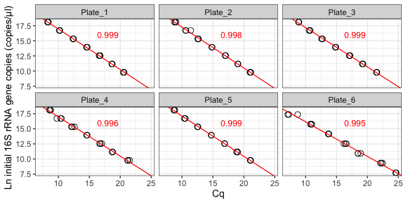
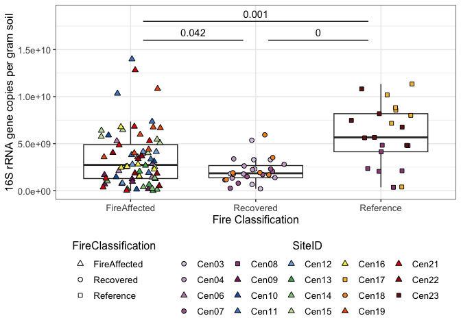
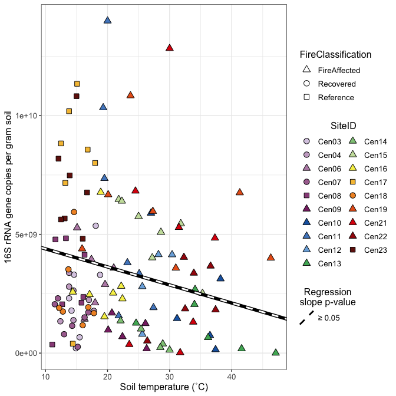
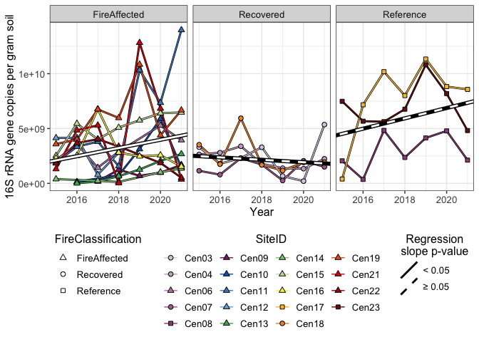
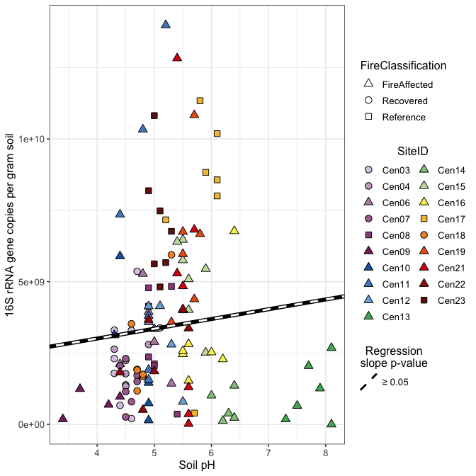
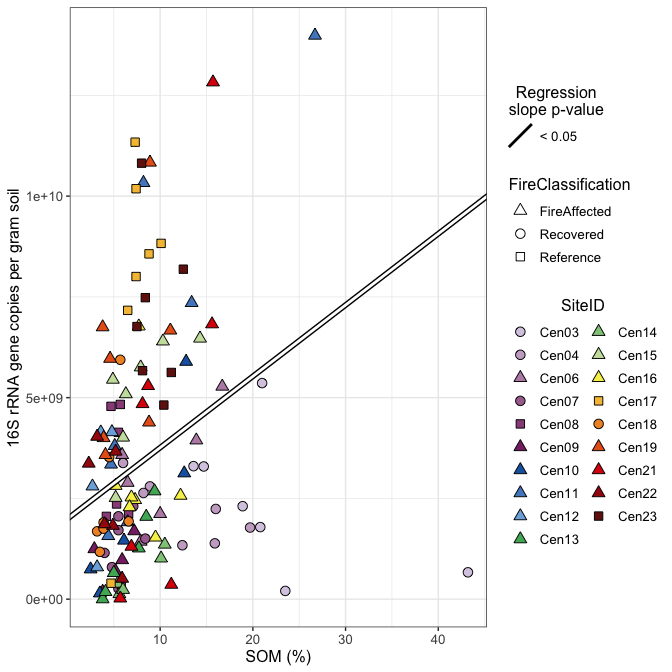
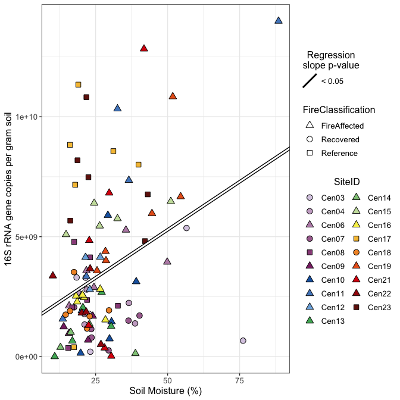

qPCR analysis
================
Sam Barnett
19 December, 2023

-   [Introduction](#introduction)
    -   [Libraries and basics](#libraries-and-basics)
    -   [Data](#data)
-   [Analysis](#analysis)
    -   [Look at the standard curves](#look-at-the-standard-curves)
    -   [Calculate initial quantities](#calculate-initial-quantities)
    -   [Compare copies across fire
        classification](#compare-copies-across-fire-classification)
    -   [Compare copies across soil
        temperature](#compare-copies-across-soil-temperature)
    -   [Compare copies over time](#compare-copies-over-time)
    -   [Compare copies across soil pH](#compare-copies-across-soil-ph)
    -   [Compare copies across soil organic
        matter](#compare-copies-across-soil-organic-matter)
    -   [Compare copies across soil
        moisture](#compare-copies-across-soil-moisture)
-   [Session info](#session-info)

# Introduction

In order to check to see if soil temperature influences overall
bacterial population size, we used qPCR to track 16S rRNA gene copies
per gram of soil across all samples. Included here are the processing
and analysis of qPCR counts.

## Libraries and basics

``` r
# Libraries for data
library(dplyr)
library(readxl)

# Libraries for analysis
library(nlme)

# Libraries for plotting
library(ggplot2)
library(grid)
library(gridExtra)
source("/Users/sambarnett/Documents/Misc_code/paul_tol_colors.R") # Colorblind friendly colors.

# Functon for extracting legends
g_legend<-function(a.gplot){
  tmp <- ggplot_gtable(ggplot_build(a.gplot))
  leg <- which(sapply(tmp$grobs, function(x) x$name) == "guide-box")
  legend <- tmp$grobs[[leg]]
  return(legend)}

# Notable lists
site.list = c("Cen01", "Cen02", "Cen03", "Cen04", "Cen05", "Cen06", "Cen07",
              "Cen08", "Cen09", "Cen10", "Cen11", "Cen12", "Cen13", "Cen14",
              "Cen15", "Cen16", "Cen17", "Cen18", "Cen19", "Cen20", "Cen21",
              "Cen22", "Cen23")
used_sites = c("Cen03", "Cen04", "Cen06", "Cen07", "Cen08", "Cen09", "Cen10", 
               "Cen11", "Cen12", "Cen13", "Cen14", "Cen15", "Cen16", "Cen17", 
               "Cen18", "Cen19", "Cen21", "Cen22", "Cen23")

# Setting repeated plot aesthetics
site.col = paultol_colors(length(used_sites))
names(site.col) = used_sites

site.shape = c(21, 21, 24, 21, 22, 24, 24, 24, 24, 24, 24, 24, 24,
               22, 21, 24, 24, 24, 22)
names(site.shape) = used_sites
FC.shape = c("FireAffected" = 24, "Recovered" = 21, "Reference" = 22)

# Basic plotting theme so as not to continually repeat it
publication_theme = theme_bw() +
  theme(axis.text = element_text(size=6),
        axis.title = element_text(size=7),
        legend.text = element_text(size=6),
        legend.title = element_text(size=7, hjust=0.5),
        strip.text = element_text(size=7),
        plot.title = element_text(size=8, hjust=0.5))

present_theme = theme_bw() +
  theme(axis.text = element_text(size=10),
        axis.title = element_text(size=12),
        legend.text = element_text(size=10),
        legend.title = element_text(size=12, hjust=0.5),
        strip.text = element_text(size=10),
        plot.title = element_text(size=14, hjust=0.5))
```

## Data

These are csv files that are slightly modified from what comes off of
the thermocycler computer. The important columns for these csv files are
“Sample_type” (Standard, Control, or Unknown), SampleID (your
sample/control/standard names), Cq (self explanatory), Starting_Quantity
(NA for all unknowns but your known starting quantities for standards),
Plate (qPCR run indentity to match standards with their unknowns).

``` r
# Import qPCR data
plates.df = rbind(read.csv("/Users/sambarnett/Documents/Shade_lab/Centralia_project/Multi_year_project/Data/qPCR_data/Plate1_8_14_23.csv") %>%
                    mutate(Plate = "Plate_1"),
                  read.csv("/Users/sambarnett/Documents/Shade_lab/Centralia_project/Multi_year_project/Data/qPCR_data/Plate2_8_14_23.csv") %>%
                    mutate(Plate = "Plate_2"),
                  read.csv("/Users/sambarnett/Documents/Shade_lab/Centralia_project/Multi_year_project/Data/qPCR_data/Plate3_8_15_23.csv") %>%
                    mutate(Plate = "Plate_3"),
                  read.csv("/Users/sambarnett/Documents/Shade_lab/Centralia_project/Multi_year_project/Data/qPCR_data/Plate4_8_15_23.csv") %>%
                    mutate(Plate = "Plate_4"),
                  read.csv("/Users/sambarnett/Documents/Shade_lab/Centralia_project/Multi_year_project/Data/qPCR_data/Plate5_8_14_23.csv") %>%
                    mutate(Plate = "Plate_5"),
                  read.csv("/Users/sambarnett/Documents/Shade_lab/Centralia_project/Multi_year_project/Data/qPCR_data/Plate6_8_31_23.csv") %>%
                    mutate(Plate = "Plate_6"))

# Also import sample metadata
sample.meta = read_xlsx("/Users/sambarnett/Documents/Shade_lab/Centralia_project/Centralia_soil_metadata.xlsx", 
                        sheet = "Sample_metadata", na="NA") %>%
  filter(SiteID != "Cen24")
```

# Analysis

Now that we have all the data we can run our analysis on the qPCR data

## Look at the standard curves

First, lets see if the standard curves look ok. They should be linear.

``` r
# Make linear regressions from your standards for each plate individually
standard_models.df = data.frame()
for (plate in unique(plates.df$Plate)){
  standard_model = lm(log(Starting_Quantity) ~ Cq, data=filter(plates.df, Plate == plate, Sample_type == "Standard"))
  standard_model.sum = summary(standard_model)
  standard_model.reg = data.frame(slope = standard_model.sum$coefficients[2],
                                  intercept = standard_model.sum$coefficients[1],
                                  R2 = standard_model.sum$adj.r.squared,
                                  pvalue = standard_model.sum$coefficients[8],
                                  Plate = plate)
  standard_models.df = rbind(standard_models.df, standard_model.reg)
}
  
standard_models.df
```

    ##        slope intercept        R2       pvalue   Plate
    ## 1 -0.6701208  23.65051 0.9992161 3.473914e-31 Plate_1
    ## 2 -0.6779842  24.05114 0.9975802 1.554219e-26 Plate_2
    ## 3 -0.6528398  23.72989 0.9985248 1.411428e-28 Plate_3
    ## 4 -0.6494653  23.46826 0.9955222 5.384715e-24 Plate_4
    ## 5 -0.6664246  23.78545 0.9989235 7.074586e-30 Plate_5
    ## 6 -0.5731743  21.89437 0.9945236 3.647041e-23 Plate_6

``` r
# Plot
ggplot(data=filter(plates.df, Sample_type == "Standard"), aes(x=Cq, y=log(Starting_Quantity))) +
  geom_point(size=3, shape=21) +
  geom_abline(data=standard_models.df, aes(slope = slope, intercept = intercept),
              color="red") +
  geom_text(data=standard_models.df, aes(label=round(R2, digits = 3)),
            x=18, y=16, size=12*5/16, color="red") +
  labs(x="Cq", y="Ln initial 16S rRNA gene copies (copies/µl)") +
  present_theme + 
  facet_wrap(~Plate)
```

<!-- -->

## Calculate initial quantities

Now that we know the standard curves look good, lets make fresh new
standard regressions, but this time averaging out our technical
replicates. Then match the unknowns (after averaging technical
replicates) to this standard regression to get our copies per gram soil.

``` r
# Average out standard technical replciates
standards.means = plates.df %>%
  filter(Sample_type == "Standard") %>%
  group_by(Plate, SampleID, Starting_Quantity) %>%
  summarize(mean_Cq = mean(Cq),
            sd_Cq = sd(Cq),
            n_samples = n()) %>%
  ungroup %>%
  mutate(SE_Cq = sd_Cq/sqrt(n_samples))

# Get new regressions per plate
standard_models.df = data.frame()
for (plate in unique(plates.df$Plate)){
  standard_model = lm(log(Starting_Quantity) ~ mean_Cq, data=filter(standards.means, Plate == plate))
  standard_model.sum = summary(standard_model)
  standard_model.reg = data.frame(slope = standard_model.sum$coefficients[2],
                                  intercept = standard_model.sum$coefficients[1],
                                  R2 = standard_model.sum$adj.r.squared,
                                  pvalue = standard_model.sum$coefficients[8],
                                  Plate = plate)
  standard_models.df = rbind(standard_models.df, standard_model.reg)
}

standard_models.df
```

    ##        slope intercept        R2       pvalue   Plate
    ## 1 -0.6702395  23.65223 0.9993187 2.608070e-09 Plate_1
    ## 2 -0.6789876  24.06610 0.9990132 6.585742e-09 Plate_2
    ## 3 -0.6529366  23.73134 0.9984960 1.889043e-08 Plate_3
    ## 4 -0.6505289  23.48386 0.9968521 1.197767e-07 Plate_4
    ## 5 -0.6665238  23.78692 0.9989511 7.671589e-09 Plate_5
    ## 6 -0.5748298  21.92139 0.9972049 8.897482e-08 Plate_6

``` r
# Calculate count per gram soil
rRNAgene_Counts.df = plates.df %>%
  filter(Sample_type == "Unknown") %>%
  group_by(SampleID, Plate) %>%
  summarize(mean_Cq = mean(Cq)) %>%
  ungroup %>%
  left_join(standard_models.df, by = "Plate") %>%
  mutate(est_ln_count = (mean_Cq*slope) + intercept) %>%
  mutate(est_count_soil = exp(est_ln_count)*20*50*4) %>% # Estimated count in soil: count per µl x 20 (DNA dilution) x 50 (volume of extract) x 4 (0.25 g soil extracted)
  left_join(sample.meta, by = "SampleID")
```

## Compare copies across fire classification

``` r
# Run Kruskall Wallis test with post hoc dunn test
rRNAgene.dunn = dunn.test::dunn.test(rRNAgene_Counts.df$est_count_soil,
                                     rRNAgene_Counts.df$FireClassification, method="bh")
```

    ##   Kruskal-Wallis rank sum test
    ## 
    ## data: x and group
    ## Kruskal-Wallis chi-squared = 17.4018, df = 2, p-value = 0
    ## 
    ## 
    ##                            Comparison of x by group                            
    ##                              (Benjamini-Hochberg)                              
    ## Col Mean-|
    ## Row Mean |   FireAffe   Recovere
    ## ---------+----------------------
    ## Recovere |   1.724656
    ##          |     0.0423
    ##          |
    ## Referenc |  -3.242644  -4.116436
    ##          |    0.0009*    0.0001*
    ## 
    ## alpha = 0.05
    ## Reject Ho if p <= alpha/2

``` r
rRNAgene.dunn
```

    ## $chi2
    ## [1] 17.40184
    ## 
    ## $Z
    ## [1]  1.724656 -3.242644 -4.116437
    ## 
    ## $P
    ## [1] 4.229473e-02 5.921296e-04 1.923872e-05
    ## 
    ## $P.adjusted
    ## [1] 4.229473e-02 8.881945e-04 5.771617e-05
    ## 
    ## $comparisons
    ## [1] "FireAffected - Recovered" "FireAffected - Reference"
    ## [3] "Recovered - Reference"

``` r
rRNAgene.dunn.df = data.frame(comparisons = rRNAgene.dunn$comparisons,
                              p_value = rRNAgene.dunn$P.adjusted,
                              start_x = c(1.1, 1.1, 2.1),
                              end_x = c(1.9, 2.9, 2.9),
                              start_y = c(1.6e+10, 1.8e+10, 1.6e+10),
                              text_x = c(1.5, 2, 2.5),
                              text_y = c(1.68e+10, 1.88e+10, 1.68e+10)) %>%
  mutate(p_value_round = round(p_value, digits = 3))
                              
# Plot across fire class
rRNAgene.FC.plot = ggplot(data=rRNAgene_Counts.df, aes(x=FireClassification, y=est_count_soil)) +
  geom_boxplot(outlier.shape = NA) +
  geom_jitter(height=0, width=0.25, size=2, aes(shape=FireClassification, fill=SiteID)) +
  geom_segment(data=rRNAgene.dunn.df, aes(x=start_x, y=start_y, xend=end_x, yend=start_y)) +
  geom_text(data=rRNAgene.dunn.df, aes(x=text_x, y=text_y, label=p_value_round)) +
  scale_shape_manual(values=FC.shape) +
  scale_fill_manual(values=site.col) +
  labs(x = "Fire Classification", y = "16S rRNA gene copies per gram soil") +
  present_theme +
  theme(legend.position = "bottom",
        legend.direction = "vertical") +
  guides(fill=guide_legend(override.aes=list(shape=site.shape), ncol=5),
         linetype=guide_legend(override.aes=list(color="black")))
rRNAgene.FC.plot
```

<!-- -->

## Compare copies across soil temperature

``` r
# Run lme to see if there is a relationship between temperature and copy count
ctrl <- lmeControl(opt='optim')
rRNAgene_temp.model = lme(est_count_soil ~ CoreTemp_C, 
                          random = ~1|SiteID, control=ctrl, 
                          data=rRNAgene_Counts.df)

rRNAgene_temp.model.df = data.frame(summary(rRNAgene_temp.model)$tTable) %>%
  tibble::rownames_to_column(var="factor")
rRNAgene_temp.model.df
```

    ##        factor      Value  Std.Error  DF   t.value     p.value
    ## 1 (Intercept) 5150063932 1033206788 101  4.984543 2.58024e-06
    ## 2  CoreTemp_C  -76033689   40500281 101 -1.877362 6.33541e-02

``` r
rRNAgene_temp.model.reg = rRNAgene_temp.model.df %>%
  mutate(p_slope = ifelse(factor == "CoreTemp_C", p.value, 1),
         factor = ifelse(factor == "(Intercept)", "Intercept", factor)) %>%
  mutate(p_slope = min(p_slope)) %>%
  select(factor, Value, p_slope) %>%
  tidyr::spread(key="factor", value="Value") %>%
  mutate(sig = ifelse(p_slope < 0.05, "< 0.05", "≥ 0.05"))

# Plot temperaty and copy count
ggplot(data=rRNAgene_Counts.df, aes(x=CoreTemp_C, y=est_count_soil)) +
  geom_point(aes(shape=FireClassification, fill=SiteID), size=3) +
  geom_abline(data=rRNAgene_temp.model.reg, aes(intercept = Intercept, slope = CoreTemp_C), 
              linetype = 1, size=2, color="black") +
  geom_abline(data=rRNAgene_temp.model.reg, aes(intercept = Intercept, slope = CoreTemp_C, linetype = sig),
              size=1, color="white") +
  scale_shape_manual(values=FC.shape) +
  scale_fill_manual(values=site.col) +
  scale_linetype_manual(values=c("< 0.05" = 1, "≥ 0.05" = 2)) +
  labs(x="Soil temperature (˚C)", y="16S rRNA gene copies per gram soil",
       linetype="Regression\nslope p-value") +
  present_theme +
  guides(linetype=guide_legend(override.aes=list(color="black")),
         fill=guide_legend(ncol=2, override.aes=list(shape=site.shape)))
```

<!-- -->

## Compare copies over time

``` r
rRNAgene_time.model.df = data.frame()
for (FC in c("FireAffected", "Recovered", "Reference")){
  sub_time.model = lme(est_count_soil ~ Year, random = ~1|SiteID, data=filter(rRNAgene_Counts.df, FireClassification == FC))
  rRNAgene_time.model.df = rbind(rRNAgene_time.model.df,
                                 data.frame(summary(sub_time.model)$tTable) %>%
                                   tibble::rownames_to_column(var="factor") %>%
                                   mutate(FireClassification = FC))
}

rRNAgene_time.model.reg = rRNAgene_time.model.df %>%
  mutate(p_slope = ifelse(factor == "Year", p.value, 1),
         factor = ifelse(factor == "(Intercept)", "Intercept", factor)) %>%
  group_by(FireClassification) %>%
  mutate(p_slope = min(p.value)) %>%
  ungroup %>%
  select(factor, Value, p_slope, FireClassification) %>%
  tidyr::spread(key=factor, value = Value) %>%
  mutate(sig = ifelse(p_slope < 0.05, "< 0.05", "≥ 0.05"))


rRNAgene_time.plot = ggplot(data=rRNAgene_Counts.df, aes(x=Year, y=est_count_soil)) +
  geom_line(aes(group=SiteID), color="black", size=1) + 
  geom_line(aes(color=SiteID), size=0.5) + 
  geom_point(size=2, aes(fill=SiteID, shape=FireClassification)) +
  geom_abline(data=rRNAgene_time.model.reg, aes(intercept = Intercept, slope = Year), linetype = 1, size=2, color="black") +
  geom_abline(data=rRNAgene_time.model.reg, aes(intercept = Intercept, slope = Year, linetype = sig), size=1, color="white") +
  scale_linetype_manual(values=c("< 0.05" = 1, "≥ 0.05" = 2)) +
  scale_shape_manual(values=c("FireAffected" = 24, "Recovered" = 21, "Reference" = 22)) +
  scale_fill_manual(values=site.col) +
  scale_color_manual(values=site.col) +
  labs(x="Year", y="16S rRNA gene copies per gram soil", linetype="Regression\nslope p-value") +
  facet_grid(~FireClassification, scales = "free_y", switch="y") +
  present_theme +
  theme(legend.position = "bottom",
        legend.direction = "vertical") +
  guides(fill=guide_legend(override.aes=list(shape=site.shape), ncol=4),
         linetype=guide_legend(override.aes=list(color="black")))
rRNAgene_time.plot
```

<!-- -->

## Compare copies across soil pH

``` r
# Run lme to see if there is a relationship between pH and copy count
ctrl <- lmeControl(opt='optim')
rRNAgene_pH.model = lme(est_count_soil ~ pH, 
                          random = ~1|SiteID, control=ctrl, 
                          data=rRNAgene_Counts.df)

rRNAgene_pH.model.df = data.frame(summary(rRNAgene_pH.model)$tTable) %>%
  tibble::rownames_to_column(var="factor")

rRNAgene_pH.model.reg = rRNAgene_pH.model.df %>%
  mutate(p_slope = ifelse(factor == "pH", p.value, 1),
         factor = ifelse(factor == "(Intercept)", "Intercept", factor)) %>%
  mutate(p_slope = min(p_slope)) %>%
  select(factor, Value, p_slope) %>%
  tidyr::spread(key="factor", value="Value") %>%
  mutate(sig = ifelse(p_slope < 0.05, "< 0.05", "≥ 0.05"))

# Plot pHeraty and copy count
ggplot(data=rRNAgene_Counts.df, aes(x=pH, y=est_count_soil)) +
  geom_point(aes(shape=FireClassification, fill=SiteID), size=3) +
  geom_abline(data=rRNAgene_pH.model.reg, aes(intercept = Intercept, slope = pH), 
              linetype = 1, size=2, color="black") +
  geom_abline(data=rRNAgene_pH.model.reg, aes(intercept = Intercept, slope = pH, linetype = sig),
              size=1, color="white") +
  scale_shape_manual(values=FC.shape) +
  scale_fill_manual(values=site.col) +
  scale_linetype_manual(values=c("< 0.05" = 1, "≥ 0.05" = 2)) +
  labs(x="Soil pH", y="16S rRNA gene copies per gram soil",
       linetype="Regression\nslope p-value") +
  present_theme +
  guides(linetype=guide_legend(override.aes=list(color="black")),
         fill=guide_legend(ncol=2, override.aes=list(shape=site.shape)))
```

<!-- -->

## Compare copies across soil organic matter

``` r
# Run lme to see if there is a relationship between pH and copy count
ctrl <- lmeControl(opt='optim')
rRNAgene_SOM.model = lme(est_count_soil ~ OrganicMatter_360, 
                          random = ~1|SiteID, control=ctrl, 
                          data=rRNAgene_Counts.df)

rRNAgene_SOM.model.df = data.frame(summary(rRNAgene_SOM.model)$tTable) %>%
  tibble::rownames_to_column(var="factor")

rRNAgene_SOM.model.reg = rRNAgene_SOM.model.df %>%
  mutate(p_slope = ifelse(factor == "OrganicMatter_360", p.value, 1),
         factor = ifelse(factor == "(Intercept)", "Intercept", factor)) %>%
  mutate(p_slope = min(p_slope)) %>%
  select(factor, Value, p_slope) %>%
  tidyr::spread(key="factor", value="Value") %>%
  mutate(sig = ifelse(p_slope < 0.05, "< 0.05", "≥ 0.05"))

# Plot SOM and copy count
ggplot(data=rRNAgene_Counts.df, aes(x=OrganicMatter_360, y=est_count_soil)) +
  geom_point(aes(shape=FireClassification, fill=SiteID), size=3) +
  geom_abline(data=rRNAgene_SOM.model.reg, aes(intercept = Intercept, slope = OrganicMatter_360), 
              linetype = 1, size=2, color="black") +
  geom_abline(data=rRNAgene_SOM.model.reg, aes(intercept = Intercept, slope = OrganicMatter_360, linetype = sig),
              size=1, color="white") +
  scale_shape_manual(values=FC.shape) +
  scale_fill_manual(values=site.col) +
  scale_linetype_manual(values=c("< 0.05" = 1, "≥ 0.05" = 2)) +
  labs(x="SOM (%)", y="16S rRNA gene copies per gram soil",
       linetype="Regression\nslope p-value") +
  present_theme +
  guides(linetype=guide_legend(override.aes=list(color="black")),
         fill=guide_legend(ncol=2, override.aes=list(shape=site.shape)))
```

<!-- -->

## Compare copies across soil moisture

``` r
# Run lme to see if there is a relationship between Soil Moisture and copy count
ctrl <- lmeControl(opt='optim')
rRNAgene_SoilMoisture.model = lme(est_count_soil ~ SoilMoisture_percent, 
                          random = ~1|SiteID, control=ctrl, 
                          data=filter(rRNAgene_Counts.df, !is.na(SoilMoisture_percent)))

rRNAgene_SoilMoisture.model.df = data.frame(summary(rRNAgene_SoilMoisture.model)$tTable) %>%
  tibble::rownames_to_column(var="factor")

rRNAgene_SoilMoisture.model.reg = rRNAgene_SoilMoisture.model.df %>%
  mutate(p_slope = ifelse(factor == "SoilMoisture_percent", p.value, 1),
         factor = ifelse(factor == "(Intercept)", "Intercept", factor)) %>%
  mutate(p_slope = min(p_slope)) %>%
  select(factor, Value, p_slope) %>%
  tidyr::spread(key="factor", value="Value") %>%
  mutate(sig = ifelse(p_slope < 0.05, "< 0.05", "≥ 0.05"))

# Plot SoilMoistureeraty and copy count
ggplot(data=rRNAgene_Counts.df, aes(x=SoilMoisture_percent, y=est_count_soil)) +
  geom_point(aes(shape=FireClassification, fill=SiteID), size=3) +
  geom_abline(data=rRNAgene_SoilMoisture.model.reg, aes(intercept = Intercept, slope = SoilMoisture_percent), 
              linetype = 1, size=2, color="black") +
  geom_abline(data=rRNAgene_SoilMoisture.model.reg, aes(intercept = Intercept, slope = SoilMoisture_percent, linetype = sig),
              size=1, color="white") +
  scale_shape_manual(values=FC.shape) +
  scale_fill_manual(values=site.col) +
  scale_linetype_manual(values=c("< 0.05" = 1, "≥ 0.05" = 2)) +
  labs(x="Soil Moisture (%)", y="16S rRNA gene copies per gram soil",
       linetype="Regression\nslope p-value") +
  present_theme +
  guides(linetype=guide_legend(override.aes=list(color="black")),
         fill=guide_legend(ncol=2, override.aes=list(shape=site.shape)))
```

<!-- -->

# Session info

``` r
sessionInfo()
```

    ## R version 4.2.2 (2022-10-31)
    ## Platform: aarch64-apple-darwin20 (64-bit)
    ## Running under: macOS Ventura 13.0.1
    ## 
    ## Matrix products: default
    ## BLAS:   /Library/Frameworks/R.framework/Versions/4.2-arm64/Resources/lib/libRblas.0.dylib
    ## LAPACK: /Library/Frameworks/R.framework/Versions/4.2-arm64/Resources/lib/libRlapack.dylib
    ## 
    ## locale:
    ## [1] en_US.UTF-8/en_US.UTF-8/en_US.UTF-8/C/en_US.UTF-8/en_US.UTF-8
    ## 
    ## attached base packages:
    ## [1] grid      stats     graphics  grDevices utils     datasets  methods  
    ## [8] base     
    ## 
    ## other attached packages:
    ## [1] gridExtra_2.3 ggplot2_3.4.4 nlme_3.1-160  readxl_1.4.1  dplyr_1.0.10 
    ## 
    ## loaded via a namespace (and not attached):
    ##  [1] highr_0.9        pillar_1.8.1     compiler_4.2.2   cellranger_1.1.0
    ##  [5] tools_4.2.2      dunn.test_1.3.5  digest_0.6.30    evaluate_0.18   
    ##  [9] lifecycle_1.0.3  tibble_3.1.8     gtable_0.3.1     lattice_0.20-45 
    ## [13] pkgconfig_2.0.3  rlang_1.1.0      cli_3.4.1        DBI_1.1.3       
    ## [17] rstudioapi_0.14  yaml_2.3.6       xfun_0.34        fastmap_1.1.0   
    ## [21] withr_2.5.0      stringr_1.5.0    knitr_1.40       generics_0.1.3  
    ## [25] vctrs_0.5.2      tidyselect_1.2.0 glue_1.6.2       R6_2.5.1        
    ## [29] fansi_1.0.3      rmarkdown_2.18   purrr_1.0.1      tidyr_1.3.0     
    ## [33] farver_2.1.1     magrittr_2.0.3   scales_1.2.1     htmltools_0.5.3 
    ## [37] assertthat_0.2.1 colorspace_2.0-3 labeling_0.4.2   utf8_1.2.2      
    ## [41] stringi_1.7.8    munsell_0.5.0
